# Software Architecture

Mermaid-based class diagrams and sequence diagrams for the Semantic
Simulation companion codebase.  All models discussed in the paper (v4)
are included, together with their helper modules (potentials, gates,
probes, data pipeline) and training workflows.

> **Rendering**: GitHub, VS Code (with Mermaid extensions), and Cursor
> all render fenced `mermaid` blocks inline.  If your viewer does not
> support Mermaid, paste the blocks into
> [mermaid.live](https://mermaid.live).

---

## Table of Contents

1. [SPLM Family — Static Class Diagram](#1-splm-family--static-class-diagram)
2. [PARF Family — Static Class Diagram](#2-parf-family--static-class-diagram)
3. [V_θ Potential Hierarchy](#3-v_θ-potential-hierarchy)
4. [V_φ Pair-Potential Hierarchy](#4-v_φ-pair-potential-hierarchy)
5. [Fock Gate Components](#5-fock-gate-components)
6. [Context Channel (ξ) Modules](#6-context-channel-ξ-modules)
7. [Causal Probe Modules](#7-causal-probe-modules)
8. [Training Scripts & Notebooks](#8-training-scripts--notebooks)
9. [Data Pipeline](#9-data-pipeline)
10. [Attention Baseline](#10-attention-baseline)
11. [Non-Conservative Force Hierarchy](#11-non-conservative-force-hierarchy)
12. [Sequence Diagram — SPLM Training Loop](#12-sequence-diagram--splm-training-loop)
13. [Sequence Diagram — PARF/Multi-Xi Training Loop](#13-sequence-diagram--parfmulti-xi-training-loop)
14. [Sequence Diagram — Fock Multi-Xi Training Loop](#14-sequence-diagram--fock-multi-xi-training-loop)
15. [Sequence Diagram — Causal Probe (Pre-Training)](#15-sequence-diagram--causal-probe-pre-training)
16. [Sequence Diagram — Inference / Generation](#16-sequence-diagram--inference--generation)
17. [File Map](#17-file-map)

---

## 1. SPLM Family — Static Class Diagram

The vanilla Scalar-Potential Language Model (SPLM) and its successive
refinements: SARF mass, LayerNorm damping, multi-channel ξ (K-EMA,
S4D, HiPPO), Helmholtz decomposition, Hybrid SPLM, first-order
ablation, symplectic integrator variant, non-conservative extension,
and SPH-SPLM.

```mermaid
classDiagram
    direction TB

    class SPLMConfig {
        +int vocab_size
        +int d
        +int max_len
        +int L
        +int v_hidden
        +int v_depth
        +float dt
        +bool causal_force
    }

    class ScalarPotentialLM {
        +E : Embedding
        +P : Parameter
        +V_theta : ScalarPotential
        +_embed_and_pool(x) Tensor
        +forward(x, targets) logits, loss
        +generate(x, max_new_tokens) Tensor
        +num_params() int
    }

    class SPLMSARFMassConfig {
        +str mass_mode
        +bool ln_after_step
    }

    class ScalarPotentialLMSARFMass {
        +E : Embedding
        +P : Parameter
        +V_theta : ScalarPotential
        +m_global : Parameter
        +compute_mass(x, emb) Tensor
        +_embed(x) Tensor
        +_layer_step(h, h_prev, m, γ, dt) Tensor
        +_stack_forward(h0, x) h_L, traj
        +forward(x, targets) logits, loss
        +generate(x, max_new_tokens) Tensor
    }

    class SPLMSARFConfig {
        +bool causal_force
    }

    class ScalarPotentialLMSARF {
        +V_theta : ScalarPotential
        +_embed(x) Tensor
        +integrate(h0, x) h_L
        +forward(x, targets) logits, loss
    }

    class SPLMSARFMassLNConfig {
        <<extends SPLMSARFMassConfig>>
    }

    class ScalarPotentialLMSARFMassLN {
        +ln_layers : ModuleList~LayerNorm~
        +_project(h) Tensor
    }

    class SPLMSARFMassGMConfig {
        <<extends SPLMSARFMassConfig>>
    }
    class ScalarPotentialLMSARFMassGM {
        +V_theta : GaussianMixturePotential
    }

    class SPLMFirstOrderConfig {
        <<extends SPLMSARFMassLNConfig>>
    }
    class ScalarPotentialLMFirstOrder {
        +_layer_step(h, h_prev, m, γ, dt) Tensor
    }

    class SPLMSymplecticConfig {
        +float dt
    }
    class ScalarPotentialLMSymplectic {
        +_embed(x) Tensor
        +forward(x, targets) logits, loss
    }

    class SPLMSARFMassLNMultiXiConfig {
        +int xi_channels
        +List~float~ xi_alpha_inits
        +bool xi_learnable
    }
    class ScalarPotentialLMSARFMassLNMultiXi {
        +xi_module : MultiChannelXi
        +V_theta : ScalarPotentialMultiXi
        +_layer_step(h, h_prev, m, γ, dt) Tensor
    }

    class SPLMSARFMassLNMultiS4DConfig {
        +int xi_channels
    }
    class ScalarPotentialLMSARFMassLNMultiS4D {
        +xi_module : MultiChannelS4D
        +V_theta : ScalarPotentialMultiXi
    }

    class SPLMSARFMassLNMultiHiPPOConfig {
        +int xi_channels
        +int hippo_N
    }
    class ScalarPotentialLMSARFMassLNMultiHiPPO {
        +xi_module : MultiChannelHiPPO
        +V_theta : ScalarPotentialMultiXi
    }

    class HelmholtzConfig {
        +int n_heads
        +bool use_helmholtz
    }
    class HelmholtzLM {
        +V_theta : ScalarPotential
        +attn_layers : ModuleList
        +compute_mass(x) Tensor
        +_embed(x) Tensor
        +forward(x, targets) logits, loss
    }

    class HSPLMConfig {
        +int n_heads
        +float alpha_attn
    }
    class HybridSPLM {
        +V_theta : ScalarPotential
        +attn_layers : ModuleList
        +compute_mass(x) Tensor
        +_embed(x) Tensor
        +forward(x, targets) logits, loss
    }
    class _NullAttnHybrid {
        <<zero-weight attention ablation>>
    }

    class SPLMNonConservativeConfig {
        +str nc_type
        +int nc_rank
    }
    class ScalarPotentialLMNonConservative {
        +nc_force : NonConservativeForce
        +_layer_step(h, h_prev, m, γ, dt) Tensor
    }

    class SPHSPLMConfig {
        <<extends SparsePARFConfig>>
    }
    class ScalarPotentialLMSPHSPLM {
        +skew_kernel : SkewKernelLowRank
        +gyro_kernel : PerTokenGyroKernel
        +_layer_step(h, h_prev, m, γ, dt) Tensor
    }

    SPLMConfig <|-- SPLMSARFMassConfig
    SPLMSARFMassConfig <|-- SPLMSARFMassGMConfig
    SPLMSARFMassConfig <|-- SPLMSARFMassLNConfig
    SPLMSARFMassLNConfig <|-- SPLMFirstOrderConfig
    SPLMSARFMassLNConfig <|-- SPLMSARFMassLNMultiXiConfig
    SPLMSARFMassLNConfig <|-- SPLMSARFMassLNMultiS4DConfig
    SPLMSARFMassLNConfig <|-- SPLMSARFMassLNMultiHiPPOConfig
    SPLMSARFMassLNConfig <|-- SPLMNonConservativeConfig

    ScalarPotentialLM <|-- ScalarPotentialLMSARFMass
    ScalarPotentialLMSARFMass <|-- ScalarPotentialLMSARFMassGM
    ScalarPotentialLMSARFMass <|-- ScalarPotentialLMSARFMassLN
    ScalarPotentialLMSARFMassLN <|-- ScalarPotentialLMFirstOrder
    ScalarPotentialLMSARFMassLN <|-- ScalarPotentialLMSARFMassLNMultiXi
    ScalarPotentialLMSARFMassLN <|-- ScalarPotentialLMSARFMassLNMultiS4D
    ScalarPotentialLMSARFMassLN <|-- ScalarPotentialLMSARFMassLNMultiHiPPO
    ScalarPotentialLMSARFMassLN <|-- ScalarPotentialLMNonConservative

    HybridSPLM <|-- _NullAttnHybrid

    ScalarPotentialLMSARFMassLNMultiXi --> MultiChannelXi : xi_module
    ScalarPotentialLMSARFMassLNMultiS4D --> MultiChannelS4D : xi_module
    ScalarPotentialLMSARFMassLNMultiHiPPO --> MultiChannelHiPPO : xi_module
```

---

## 2. PARF Family — Static Class Diagram

The Pair-Augmented Repulsive Force (PARF) family builds on top of the
SPLM with explicit pair-interaction potentials V_φ.  This is the
primary experimental lineage of the paper.

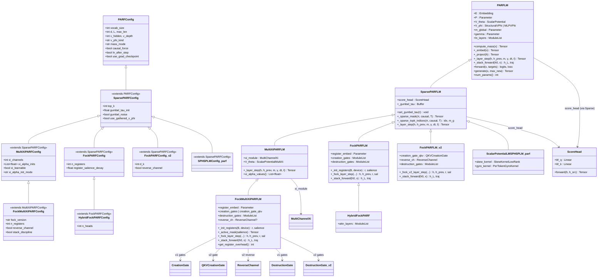

---

## 3. V_θ Potential Hierarchy

The single-body scalar potential V_θ(ξ, h) drives the conservative
force on each token.  The legacy MLP version and the structured
(closed-form gradient) variants are shown.

```mermaid
classDiagram
    direction TB

    class ScalarPotential_SPLM {
        <<model.py>>
        +layers : Sequential
        +forward(ξ, h) Tensor~B,T,1~
    }

    class ScalarPotential_SARF {
        <<model_sarf_mass.py>>
        +layers : Sequential
        +forward(ξ, h) Tensor~B,T,1~
    }

    class ScalarPotential_PARF {
        <<model_parf.py, MLP>>
        +layers : Sequential
        +forward(ξ, h) Tensor~B,T,1~
    }

    class ScalarPotentialMultiXi {
        <<model_multixi.py>>
        +layers : Sequential
        +forward(xis, h) Tensor~B,T,1~
    }

    class GaussianMixturePotential {
        <<model_gm.py>>
        +mu_list : ParameterList
        +kappa_raw : Parameter
        +forward(ξ, h) Tensor~B,T,1~
    }

    class StructuredVThetaBase {
        <<abstract>>
        +forward(ξ, h) Tensor~B,T,1~
        +analytical_grad(ξ, h) Tensor~B,T,d~
    }

    class QuadraticWellVTheta {
        +W_mu : Linear
        +forward(ξ, h) Tensor
        +analytical_grad(ξ, h) Tensor
    }

    class LowRankQuadraticVTheta {
        +W_A : Linear
        +forward(ξ, h) Tensor
        +analytical_grad(ξ, h) Tensor
    }

    class MixtureQuadraticVTheta {
        +W_mu_list : ParameterList
        +gate : Linear
        +forward(ξ, h) Tensor
        +analytical_grad(ξ, h) Tensor
    }

    class HybridQuadraticVTheta {
        +quadratic : LowRankQuadraticVTheta
        +mlp_residual : Sequential
        +forward(ξ, h) Tensor
        +analytical_grad(ξ, h) Tensor
    }

    StructuredVThetaBase <|-- QuadraticWellVTheta
    StructuredVThetaBase <|-- LowRankQuadraticVTheta
    StructuredVThetaBase <|-- MixtureQuadraticVTheta
    StructuredVThetaBase <|-- HybridQuadraticVTheta

    note for ScalarPotentialMultiXi "Input is (B, T, K, d) multi-ξ\nconcatenated with h → (B, T, (K+1)d)"
```

---

## 4. V_φ Pair-Potential Hierarchy

The pair-interaction potential V_φ(h_t, h_s) mediates inter-token
forces.  Three implementations exist, all sharing the same forward
contract.

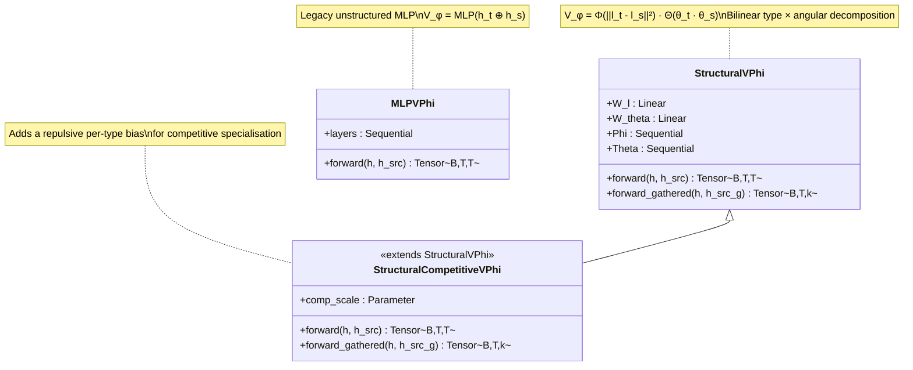

---

## 5. Fock Gate Components

Creation and destruction gates for the Fock-space register lifecycle.
v1 uses mean-conditioned MLPs; v2 uses Q/K/V cross-attention with an
optional reverse channel.

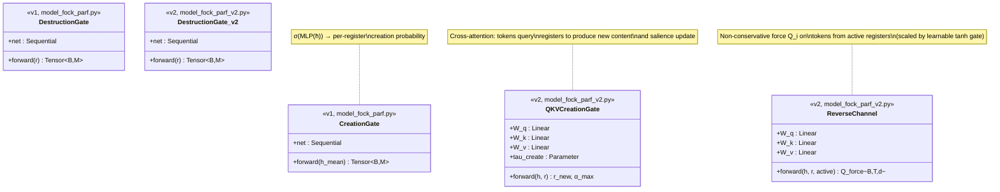

---

## 6. Context Channel (ξ) Modules

The context channel ξ summarises past token history for V_θ.
Three implementations provide increasing representational capacity.

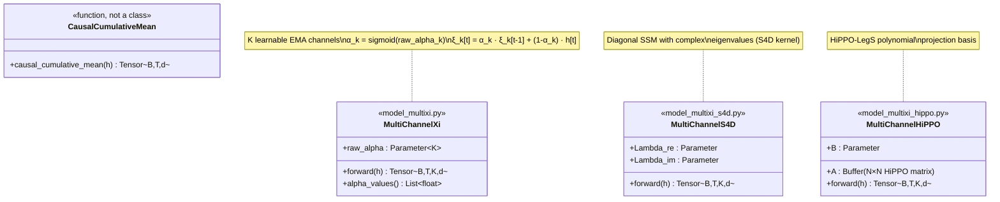

---

## 7. Causal Probe Modules

Three generations of causal-violation probes, each covering
a wider portion of the model hierarchy.  All share the same two
core tests (perturbation + gradient-Jacobian).

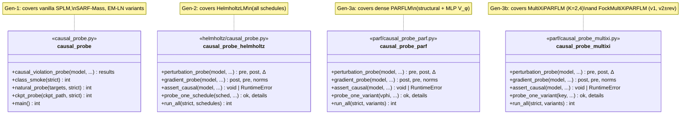

**Two causal-probe conventions are used in the codebase:**

| Convention | Where | Behaviour |
|---|---|---|
| **Startup abort** (`assert_causal()`) | Helmholtz, PARF, Multi-Xi, Fock trainers | Raises `RuntimeError` before optimiser step 0; skippable via `--skip-causal-check` |
| **In-training monitoring** (`causal_leak_probe()`) | Non-conservative, SP-HSPLM trainers | Saves JSON snapshots at init / mid / final steps; does not abort |

**Model coverage matrix:**

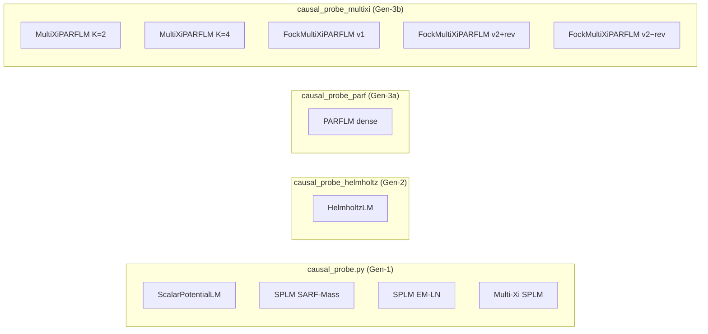

---

## 8. Training Scripts & Notebooks

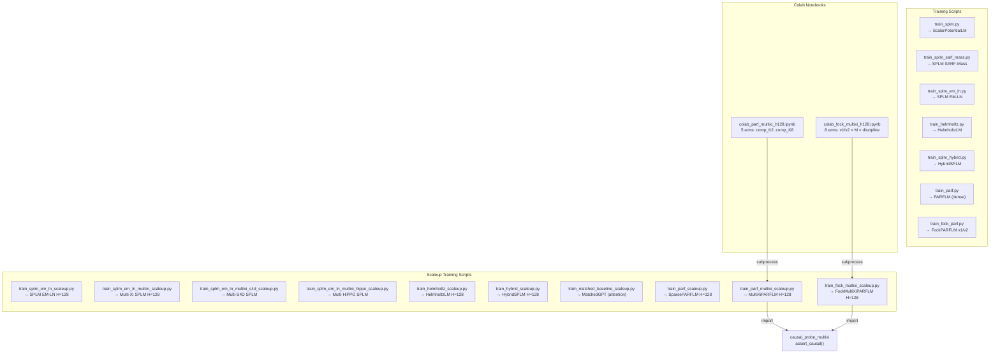

---

## 9. Data Pipeline

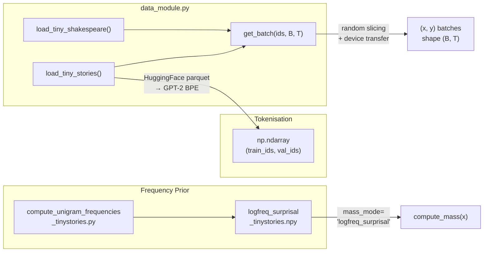

---

## 10. Attention Baseline

The parameter-matched GPT-2-style transformer used as the
attention-only comparison target throughout the paper.

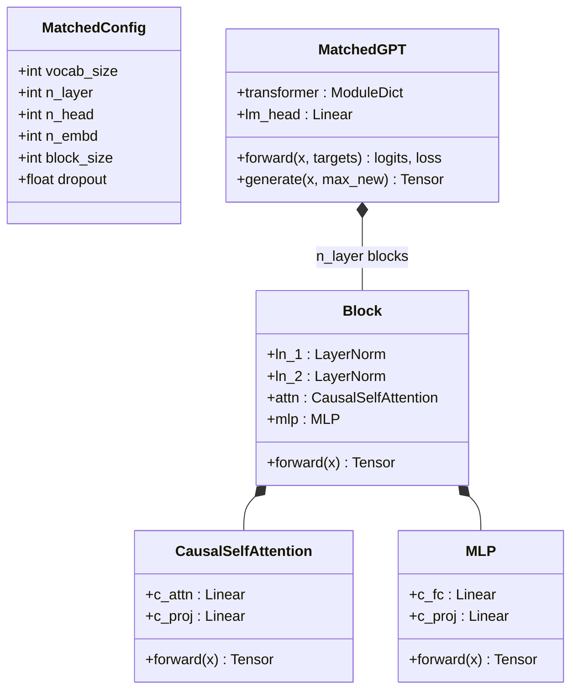

---

## 11. Non-Conservative Force Hierarchy

The non-conservative extension of the SPLM adds learned divergence-free
(solenoidal) or skew-symmetric forces that break the conservative
constraint.  Used for the ablation study in the paper.

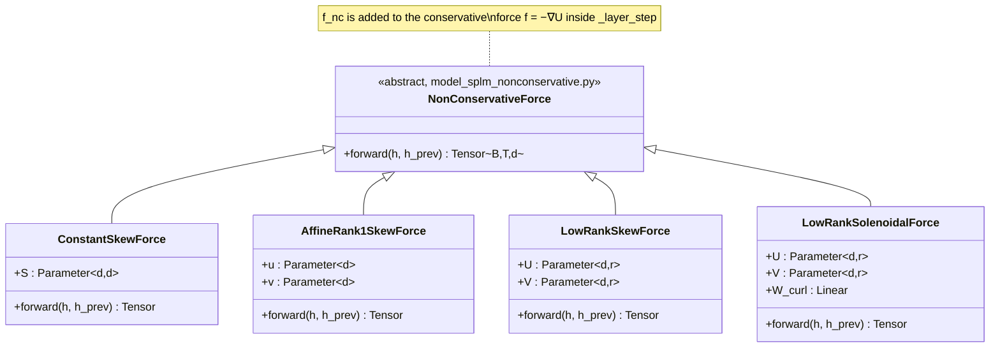

---

## 12. Sequence Diagram — SPLM Training Loop

Core training workflow shared by all SPLM variants (vanilla, SARF-Mass,
EM-LN, Multi-Xi).  The PARF and Fock variants extend this with
additional components shown in later diagrams.

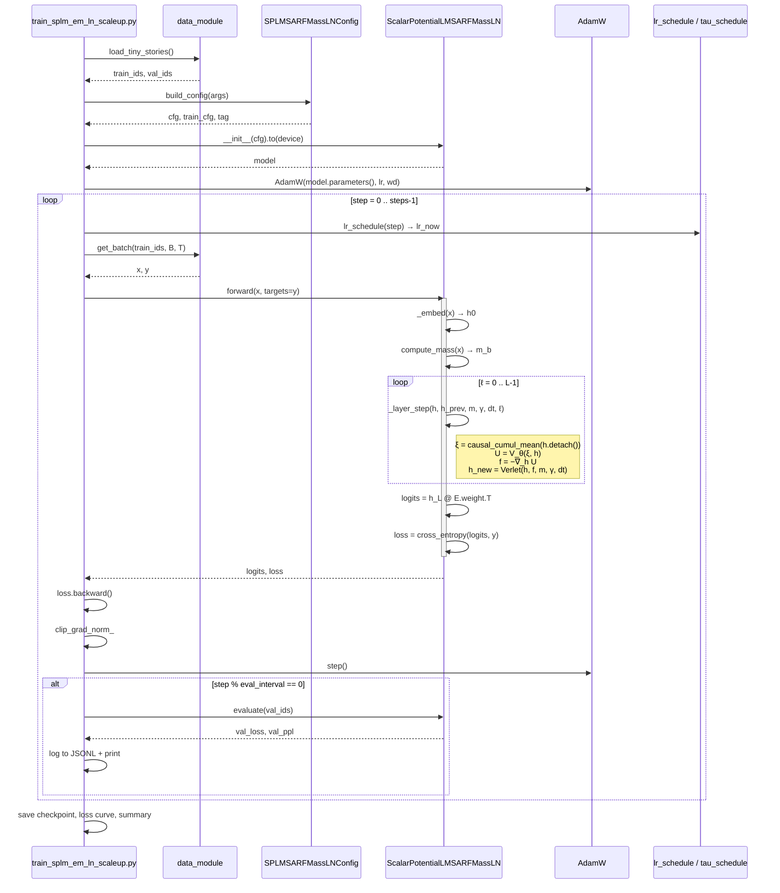

---

## 13. Sequence Diagram — PARF/Multi-Xi Training Loop

Extends the SPLM loop with pair-potential V_φ, Gumbel-softmax sparse
routing, and multi-channel ξ.

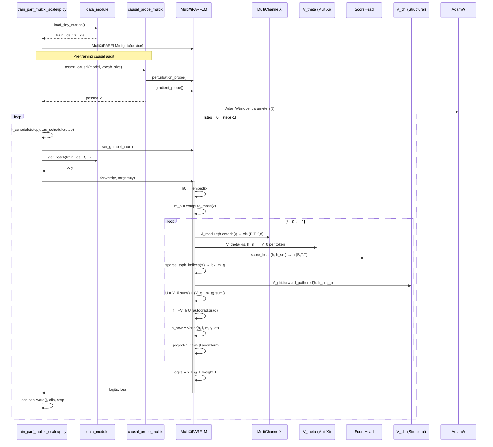

---

## 14. Sequence Diagram — Fock Multi-Xi Training Loop

Extends the Multi-Xi loop with Fock register creation/destruction
lifecycle per layer.

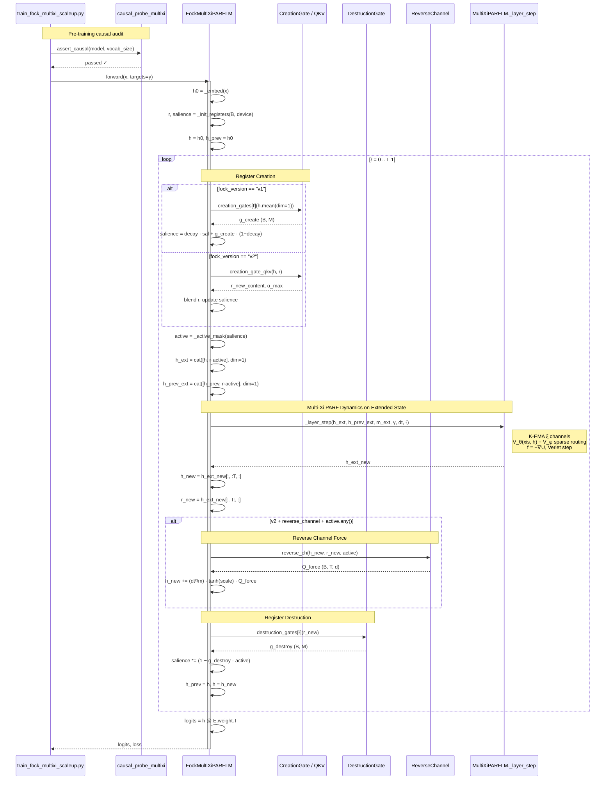

---

## 15. Sequence Diagram — Causal Probe (Pre-Training)

The causal-violation probe runs two complementary tests on a freshly
initialised model before the optimiser is constructed.

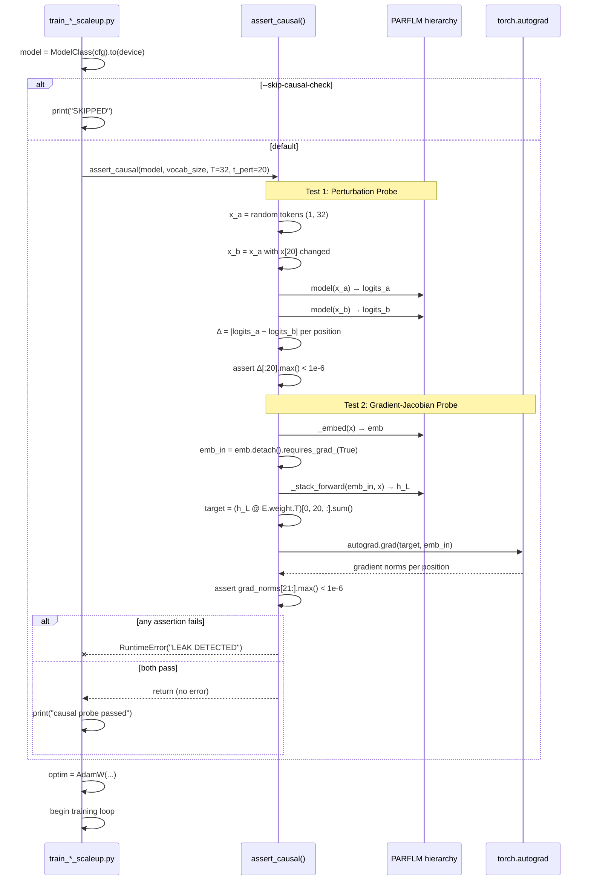

---

## 16. Sequence Diagram — Inference / Generation

Token-by-token autoregressive generation, shared by all model
families (the force-based dynamics run at each step just as in
training, but without gradient accumulation).

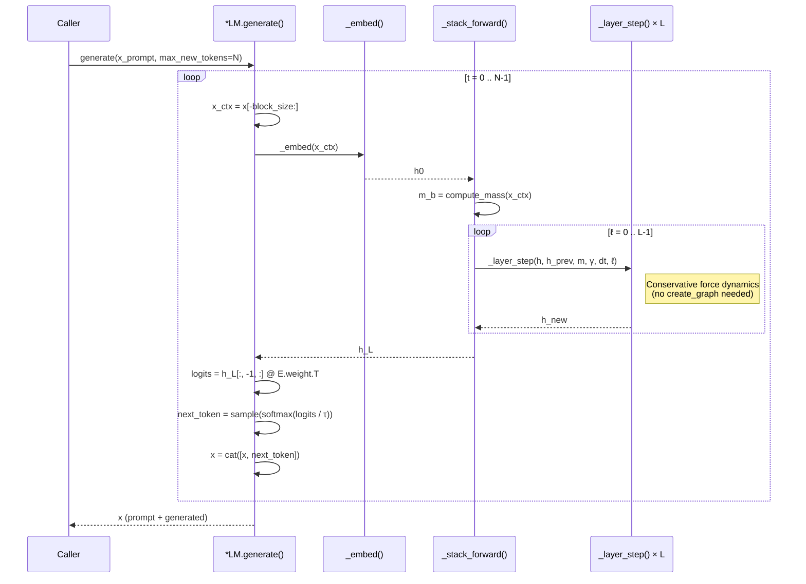

---

## 17. File Map

Quick reference from file path to the classes and modules defined
within.

| File | Key Exports |
|------|-------------|
| `model.py` | `SPLMConfig`, `ScalarPotential`, `ScalarPotentialLM` |
| `sarf_variant/model_sarf.py` | `SPLMSARFConfig`, `ScalarPotentialLMSARF`, `causal_cumulative_mean` |
| `sarf_mass_variant/model_sarf_mass.py` | `SPLMSARFMassConfig`, `ScalarPotentialLMSARFMass` |
| `energetic_minima/model_ln.py` | `SPLMSARFMassLNConfig`, `ScalarPotentialLMSARFMassLN` |
| `energetic_minima/model_gm.py` | `SPLMSARFMassGMConfig`, `ScalarPotentialLMSARFMassGM`, `GaussianMixturePotential` |
| `multixi/model_multixi.py` | `MultiChannelXi`, `ScalarPotentialMultiXi`, `…LNMultiXi` |
| `multixi/model_multixi_s4d.py` | `MultiChannelS4D`, `…LNMultiS4D` |
| `multixi/model_multixi_hippo.py` | `MultiChannelHiPPO`, `…LNMultiHiPPO` |
| `helmholtz/model_helmholtz.py` | `HelmholtzConfig`, `HelmholtzLM` |
| `hybrid/model_hybrid.py` | `HSPLMConfig`, `HybridSPLM`, `_NullAttnHybrid` |
| `first_order_ablation/model_first_order.py` | `SPLMFirstOrderConfig`, `…FirstOrder` |
| `symplectic_variant/model_symplectic.py` | `SPLMSymplecticConfig`, `…Symplectic` |
| `non_conservative/model_splm_nonconservative.py` | `NonConservativeForce` (+ `ConstantSkew`, `AffineRank1Skew`, `LowRankSkew`, `LowRankSolenoidal`), `…NonConservative` |
| `sphsplm/model_sphsplm.py` | `SPHSPLMConfig`, `…SPHSPLM`, skew/gyro kernels |
| `matched_baseline_model.py` | `MatchedConfig`, `MatchedGPT`, `CausalSelfAttention` |
| `parf/model_parf.py` | `PARFConfig`, `PARFLM`, `StructuralVPhi`, `MLPVPhi`, `StructuralCompetitiveVPhi` |
| `parf/model_parf_sparse.py` | `SparsePARFConfig`, `SparsePARFLM`, `ScoreHead` |
| `parf/model_parf_multixi.py` | `MultiXiPARFConfig`, `MultiXiPARFLM` |
| `parf/model_fock_parf.py` | `FockPARFConfig`, `FockPARFLM`, `CreationGate`, `DestructionGate` |
| `parf/model_fock_parf_v2.py` | `FockPARFConfig_v2`, `FockPARFLM_v2`, `QKVCreationGate`, `ReverseChannel`, `DestructionGate_v2` |
| `parf/model_fock_parf_multixi.py` | `FockMultiXiPARFConfig`, `FockMultiXiPARFLM` |
| `parf/model_hybrid_fock_parf.py` | `HybridFockPARFConfig`, `HybridFockPARF` |
| `parf/model_structured_vtheta.py` | `StructuredVThetaBase`, `QuadraticWellVTheta`, `LowRankQuadraticVTheta`, `MixtureQuadraticVTheta`, `HybridQuadraticVTheta` |
| `parf/dyck_data.py` | `DyckConfig` (synthetic Dyck language data) |
| `data_module.py` | `load_tiny_shakespeare()`, `load_tiny_stories()`, `get_batch()` |
| `causal_probe.py` | Gen-1 probe: `causal_violation_probe`, `class_smoke` |
| `helmholtz/causal_probe.py` | Gen-2 probe: `assert_causal` for HelmholtzLM |
| `parf/causal_probe_parf.py` | Gen-3a probe: `assert_causal` for dense PARFLM |
| `parf/causal_probe_multixi.py` | Gen-3b probe: `assert_causal` for MultiXi + Fock PARFLM |

All paths are relative to `notebooks/conservative_arch/`.
