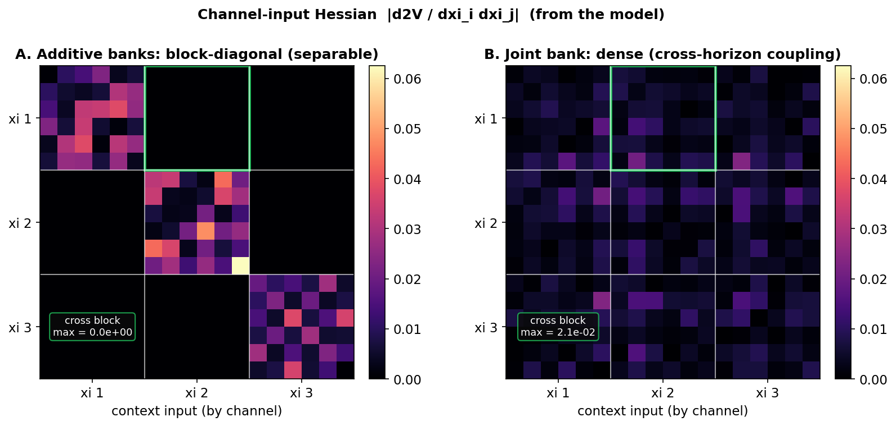
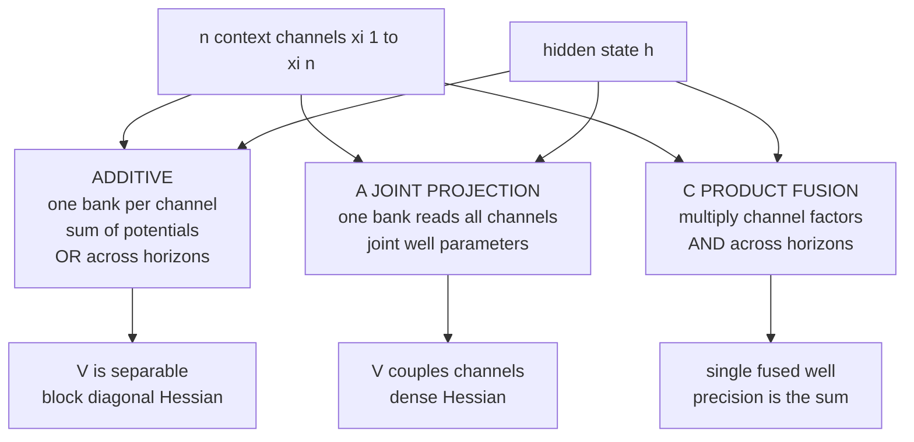
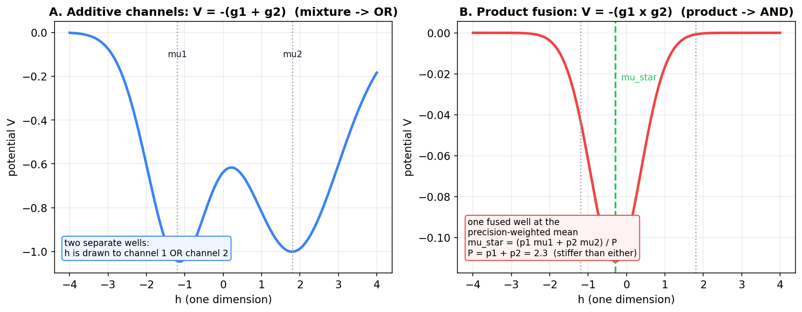
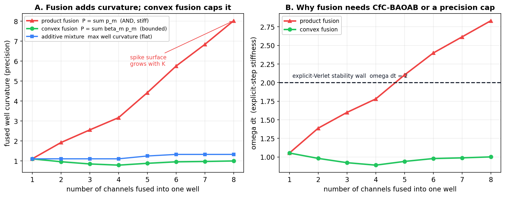

# Analytic Multi-Channel Integration in a Single Structured $V_\theta$ Well

**Date:** September 2026
**Author context:** SemSimula / Fock-PARFLM independent research program
**Companion to:** [MLP V_theta Fock-PARFLM on OWT d384](MLP_VTheta_Fock-PARFLM_on_OWT_d384.md), [Structured V_theta Design and Theory](Structured_VTheta_Design_and_Theory.md), [CfC-BAOAB Integrator and Mitigations](CfC_BAOAB_Integrator_and_Mitigations.md), [Progressive Curvature Confinement for Aniso Gaussian V_theta](Progressive_Curvature_Confinement_for_Aniso_Gaussian_Vtheta.md)

---

> **Thesis.** The additive multi-context design — one Gaussian well bank per K-EMA channel, potentials summed — makes the structured $V_\theta$ *separable across channels*: it can respond to horizon A **or** horizon B but never to their **conjunction**. That limitation (documented in the MLP-vs-Gaussian note, §5) is **not** a consequence of "structured" or "analytic." Analyticity only requires the well parameters to be independent of $h$; they may be *arbitrary joint functions of all channels*. This note gives the math (a ladder of couplings, culminating in closed-form product-of-experts fusion), the honest curvature caveat (fusion concentrates stiffness — the very spike surface of §41), and a tested, drop-in prototype `JointContextAnisotropicGaussianVTheta` (option A) that restores cross-horizon coupling while keeping the analytic force and the CfC-BAOAB harmonic split intact.

## Contents

- [1. The problem: additive channels are separable](#1-the-problem-additive-channels-are-separable)
- [2. The analyticity hinge: parameters depend on the context, not on h](#2-the-analyticity-hinge-parameters-depend-on-the-context-not-on-h)
- [3. A ladder of analytic couplings](#3-a-ladder-of-analytic-couplings)
- [4. Product-of-experts fusion in closed form](#4-product-of-experts-fusion-in-closed-form)
- [5. The catch: fusion concentrates curvature](#5-the-catch-fusion-concentrates-curvature)
- [6. CfC-BAOAB stays valid](#6-cfc-baoab-stays-valid)
- [7. The prototype: JointContextAnisotropicGaussianVTheta](#7-the-prototype-jointcontextanisotropicgaussianvtheta)
- [8. Turning it on](#8-turning-it-on)
- [9. What to measure](#9-what-to-measure)
- [10. Status and next steps](#10-status-and-next-steps)

---

## 1. The problem: additive channels are separable

The deployed anisotropic Gaussian $V_\theta$ gives each context channel its own well bank and **sums** the per-channel potentials:

$$V^{\text{add}}(h;\xi) = \sum_{m=1}^{n_c} V^{(m)}\big(\xi^{(m)}, h\big),\qquad V^{(m)}(\xi^{(m)},h) = -\sum_k w_k^{(m)} \exp\big(-\tfrac12 (h-\mu_k^{(m)})^\top P_k^{(m)} (h-\mu_k^{(m)})\big).$$

Because the channel sum sits *outside* the exponent, this is a **mixture**: the potential is attracted to a match on channel 1 **or** channel 2 **or** ... Its Hessian in the concatenated channel input $\xi=[\xi^{(1)};\dots;\xi^{(n_c)}]$ is **block-diagonal** — every cross-horizon second derivative $\partial^2 V/\partial\xi^{(i)}\partial\xi^{(j)}$ with $i\ne j$ is exactly zero. There is no term that couples horizons, so no amount of extra channels can build a feature that fires only when several horizons **agree**.

That block-diagonal structure is not a metaphor; it is visible directly in the model's channel-input Hessian:



*Figure 1. The Hessian $|\partial^2 V/\partial\xi_i\partial\xi_j|$ evaluated on the real modules (small $d$, $n_c=3$). Left: the additive banks light up only the diagonal blocks — the green channel-1 $\times$ channel-2 cross block is exactly zero (max 0.0). Right: the joint bank (this note) spreads curvature across all blocks, including the cross block (max 0.02) — that off-block curvature is the cross-horizon coupling.*

## 2. The analyticity hinge: parameters depend on the context, not on $h$

Everything that makes the structured $V_\theta$ valuable — a closed-form force $-\nabla_h V$, a closed-form Hessian, and the CfC-BAOAB harmonic split — follows from one fact in the code: the well parameters come from projections of $\xi$ **only**, never of $h$.

```python
def _components(self, xi):                 # xi = context; NOT h
    mu = self.mu_proj(xi).view(*lead, self.K, self.d)
    a  = F.softplus(self.a_proj(xi)) + 1e-4
    w  = F.softmax(self.w_proj(xi), dim=-1) * self.w_scale
    B  = self._bound_lowrank(self.B_proj(xi).view(*lead, self.K, self.d, self.rank))
    return mu, a, w, B                     # all functions of xi, none of h
```

So the potential is *exactly Gaussian in $h$* regardless of how the parameters were computed from $\xi$. We are free to make $\mu_k, a_k, B_k, w_k$ **arbitrary joint functions of all channels** — a shared projection, a bilinear form, an MLP, a product-of-experts fusion — and the force, Hessian, and harmonic split remain closed form. The additive design simply chose the most restrictive such function (one channel per bank). The rest of this note walks up from there.

## 3. A ladder of analytic couplings

All five options keep the well parameters $h$-independent, so all five keep the analytic force and CfC-BAOAB.

**(A) Joint projection — a single bank over the concatenated channels.** Replace $n_c$ per-channel banks with one bank whose projections read $\xi=[\xi^{(1)};\dots;\xi^{(n_c)}]\in\mathbb R^{n_c d}$:

$$(\mu_k, a_k, B_k, w_k) = \text{proj}\big(\xi^{(1)},\dots,\xi^{(n_c)}\big).$$

Now every well's centre, precision, and weight depends on all horizons jointly; additive is a strict special case, so expressivity only rises. This is the prototype in §7.

**(B) Conjunctive gating.** Make the (h-independent) weight a joint gate, e.g. $w_k=\prod_m \sigma(s_k^{(m)}(\xi^{(m)}))$. Since $w_k$ multiplies the whole bump, a well fires only when its centre matches $h$ **and** the gate is on — an AND across horizons.

**(C) Product-of-experts fusion.** Move the channel sum *inside* the exponent: multiply the per-channel Gaussian factors. A product of Gaussians is a Gaussian, so this collapses to a single well analytically (§4). This is the literal "integrate several channels into one well."

**(D) Bilinear coupling.** Let $\mu_k$ or $a_k$ depend on cross-features such as $\xi^{(i)}\odot\xi^{(j)}$ (Hadamard) or a low-rank bilinear map — the cheapest way to inject a specific conjunction into where a well sits.

**(E) Analytic marginalisation.** If "integrate" is meant literally, put a channel-informed Gaussian prior on the centre and integrate it out; a convolution of Gaussians stays Gaussian: $\int \mathcal N(h;\mu,P^{-1}) \mathcal N(\mu;\bar m(\xi),\Lambda(\xi)) \mathrm{d}\mu = \mathcal N(h;\bar m, P^{-1}+\Lambda)$.



## 4. Product-of-experts fusion in closed form

Take option (C) explicitly, since it shows *why* joint coupling works and what "conjunction" means quantitatively. For a fused well $k$, let each channel $m$ propose a Gaussian factor with centre $\mu_k^{(m)}$ and precision $P_k^{(m)}$. Multiplying the factors adds their exponents:

$$E_k(h) = \sum_{m=1}^{n_c} (h-\mu_k^{(m)})^\top P_k^{(m)} (h-\mu_k^{(m)}).$$

Completing the square collapses this to a **single** anisotropic Gaussian:

$$P_k = \sum_m P_k^{(m)},\qquad \mu_k^\star = P_k^{-1}\sum_m P_k^{(m)}\mu_k^{(m)},\qquad c_k = \sum_m \mu_k^{(m)\top}P_k^{(m)}\mu_k^{(m)} - \mu_k^{\star\top}P_k\mu_k^\star,$$

$$E_k(h) = (h-\mu_k^\star)^\top P_k (h-\mu_k^\star) + c_k,\qquad V^{\text{fuse}}(h;\xi) = -\sum_k w_k^\star \exp\big(-\tfrac12 (h-\mu_k^\star)^\top P_k (h-\mu_k^\star)\big),$$

with $w_k^\star = w_k \exp(-\tfrac12 c_k)$. So fusing channels by product yields **one well** whose centre is the *precision-weighted (Bayesian) fusion* of the channel centres and whose precision is the **sum** of the channel precisions. The constant $c_k$ (which grows when the channels disagree) folds into the weight, so a fused well is strong only where the horizons agree — exactly conjunction.



*Figure 2. Two channels propose Gaussian factors with centres $\mu_1,\mu_2$. Left (additive): the sum of bumps is two wells — attracted to either horizon. Right (product fusion): one fused well at the precision-weighted mean $\mu_\star$, with precision $P=p_1+p_2$ (stiffer than either), and shallow because the two centres disagree here — the AND semantics.*

**Cost note.** Exact (C) needs $P_k^{-1}$ per well per token (tractable via Woodbury since $P_k=\text{diag}+ \text{low-rank}$, but not free), and the fused low-rank factor has rank $n_c r$. Option (A) reaches the same expressive class — a single anisotropic Gaussian whose parameters depend jointly on all channels — **without** the inverse and with a lighter rank-$r$ factor, by simply *learning* $(\mu_k,a_k,B_k)$ from the concatenated context. That is why the prototype implements (A): (C) is the principled explanation, (A) is the cheap realisation.

## 5. The catch: fusion concentrates curvature

Genuine conjunction has a price that lands squarely on the spike problem of the CfC-BAOAB note (§41) and the curvature-confinement note. In (C), $P_k=\sum_m P_k^{(m)}$: the fused well is **stiffer than any single channel**, and its low-rank part accumulates (rank $n_c r$). Stiffness is precisely the $\sigma_{\max}(B_k)^2$ runaway those notes track.



*Figure 3. Left: fused precision vs. number of fused channels — product fusion (sum) grows linearly (spike surface), while a convex fusion $P_k=\sum_m\beta_m P_k^{(m)}$ with $\sum_m\beta_m=1$ stays bounded by the stiffest channel, and the additive mixture's per-well curvature is flat (only the well count grows). Right: the explicit-Verlet stability wall $\omega \Delta t \lt 2$ with $\omega=\sqrt{P_k/m}$ — product fusion crosses it around five channels, which is exactly why fused wells want either CfC-BAOAB integration or a precision cap.*

The dial that controls this:

| Fusion | Precision | Semantics | Stiffness |
|---|---|---|---|
| product (strict AND) | sum of channel precisions | firm conjunction | grows with channels |
| convex (weighted) | convex combination, weights sum to 1 | soft interpolation | bounded by the stiffest |
| joint projection (A) | learned directly | learned mixture of AND/OR | controllable via precision_lr_max |

**Recommendation:** whichever coupling you pick, pair it with the existing `precision_lr_max` cap or the progressive curvature confinement — coupling makes the model more expressive *and* more spike-prone, and the confinement machinery is what turns that into a stable equilibrium instead of a blow-up.

## 6. CfC-BAOAB stays valid

The harmonic split consumes only the *final* per-well numbers $P_k,\mu_k,g_k$ — it does not care how they were produced. So joint coupling is fully compatible with `baoab_cfc` and `baoab_cfc_lowrank`. Concretely, the diagonal spring and PSD low-rank operator are still

$$k_{\text{diag}} = \sum_k g_k \text{diag}(P_k),\qquad L = \sum_k g_k B_kB_k^\top = GG^\top,\qquad g_k = w_k\exp\big(-\tfrac12 (h-\mu_k)^\top P_k (h-\mu_k)\big),$$

with $G$ the concatenation of the per-well factors. For the joint bank (option A) with $K$ wells the low-rank footprint is $Kr$ modes — **the same or fewer** than the additive variant's $n_c K r$ at equal $K$. The prototype's tests verify $f_a + f_L = -\nabla_h V$ to $10^{-9}$ and $L\succeq 0$.

## 7. The prototype: `JointContextAnisotropicGaussianVTheta`

Option (A) is implemented in `model_aniso_gaussian_vtheta.py` as a drop-in for `AnisotropicMultiContextGaussianVTheta` — identical constructor signature and identical public methods. Internally it is one `AnisotropicMixtureGaussianVTheta` with `xi_d = n_ctx * d`, so every analytic method is inherited by delegation:

```python
class JointContextAnisotropicGaussianVTheta(nn.Module):
    def __init__(self, d, K, n_ctx, rank=4, w_scale=1.0, ...):
        super().__init__()
        self.d, self.K, self.n_ctx, self.rank = d, K, n_ctx, rank
        # one bank reading the concatenated context; wrapped in `banks`
        # (length 1) so clamp_params / the precision-cap ablation still work
        self.banks = nn.ModuleList([
            AnisotropicMixtureGaussianVTheta(d=d, K=K, rank=rank,
                                             xi_d=n_ctx * d, ...)])

    def _flatten(self, xis):                 # (..., n_ctx, d) -> (..., n_ctx*d)
        return xis.reshape(*xis.shape[:-2], self.n_ctx * self.d)

    def forward(self, xis, h, *, comps=None):
        xi_in = self._flatten(xis) if comps is None else xis
        return self.banks[0](xi_in, h, comps=comps)
    # analytical_grad / harmonic_terms / harmonic_terms_lowrank /
    # context_components / attractor_centres all delegate the same way
```

The tests in `test_joint_context_vtheta.py` (7, all passing) check the properties that matter:

```python
def test_joint_analytic_force_matches_autograd():   # -grad_h V == autograd, 1e-4
def test_joint_harmonic_lowrank_split_exact():      # f_a + f_L == f_true, PSD L
def test_joint_harmonic_diag_rank0_exact():         # rank 0 reproduces full force
def test_joint_couples_channels():                  # cross-block Hessian != 0
                                                    #   (additive == 0 exactly)
def test_depthcond_joint_flag_matches_autograd():   # coupling='joint' drop-in
def test_precision_lr_max_settable_on_joint_banks():# ablation compatibility
```

`test_joint_couples_channels` is the load-bearing one: it confirms the additive bank's channel-cross Hessian block is exactly zero while the joint bank's is nonzero — the mechanism of Figure 1, asserted in code.

## 8. Turning it on

The depth-conditioned wrapper (the actual training $V_\theta$) takes a `coupling` flag; the default preserves current behaviour:

```python
# additive (default) -- unchanged behaviour
V_theta = AnisotropicDepthConditionedGaussianVTheta(
    d=384, K=8, n_ctx=5, n_layers=16, rank=4)

# joint coupling -- one line switch
V_theta = AnisotropicDepthConditionedGaussianVTheta(
    d=384, K=8, n_ctx=5, n_layers=16, rank=4, coupling="joint")
```

`V_theta.banks` still works for `clamp_params` and the precision-cap ablation (it is a length-1 list under joint coupling). Because the joint bank has $K$ joint attractors versus the additive $n_c K$, set `K = n_ctx * K_additive` if you want to match the additive attractor budget.

## 9. What to measure

A clean A/B on OWT d384, holding everything else fixed (channels, $V_\phi$, schedule, seed), toggling only `coupling`:

| # | Prediction | Confirmed if |
|---|---|---|
| J1 | joint coupling improves PPL at fixed channel count | joint beats additive at equal K wells and equal params |
| J2 | joint recovers the value of extra channels | joint PPL improves with more channels where additive plateaus |
| J3 | joint is stabilisable | joint + precision_lr_max (or CfC-BAOAB) trains without watchdog reloads |
| J4 | coupling is the cause, not capacity | the offline channel-Hessian gap tracks the PPL gap across seeds |

The predicted failure mode is J3 without confinement — the curvature-concentration of §5 showing up as more spikes. That is the expected, and testable, cost of the added expressivity.

## 10. Status and next steps

- **Done:** `JointContextAnisotropicGaussianVTheta` (option A) + a `coupling="joint"` flag on the depth-conditioned wrapper, with 7 passing tests (analytic force, exact harmonic split, channel coupling, ablation compatibility) and no regression in the CfC-BAOAB suite.
- **Next:** run the J1/J2 A/B on OWT d384 with `coupling="joint"` and `precision_lr_max` on from the start (per §5).
- **Optional extensions:** add option (B) conjunctive gating and option (C) exact product fusion (Woodbury) as further `coupling` values once (A) is characterised.
- **Ties in:** this is the structured-$V_\theta$ counterpart to the MLP note's mixing argument — it closes most of the additive-vs-mixing gap while keeping the analytic force and CfC-BAOAB path that justify structured $V_\theta$ in the first place.

---

Provenance: figures generated by `companion_notes/figures/_make_analytic_integration_figs.py` (Figures 2-3 are exact analytic evaluations; Figure 1 is the channel-input Hessian differentiated from the real modules). Code and tests in `notebooks/conservative_arch/parf/model_aniso_gaussian_vtheta.py` and `notebooks/conservative_arch/parf/test_joint_context_vtheta.py`.

Last updated: September 2026 — initial version. Introduces the analyticity hinge, the coupling ladder (A-E), closed-form product-of-experts fusion, the curvature caveat, and the tested `JointContextAnisotropicGaussianVTheta` prototype (option A) with the `coupling` flag.
