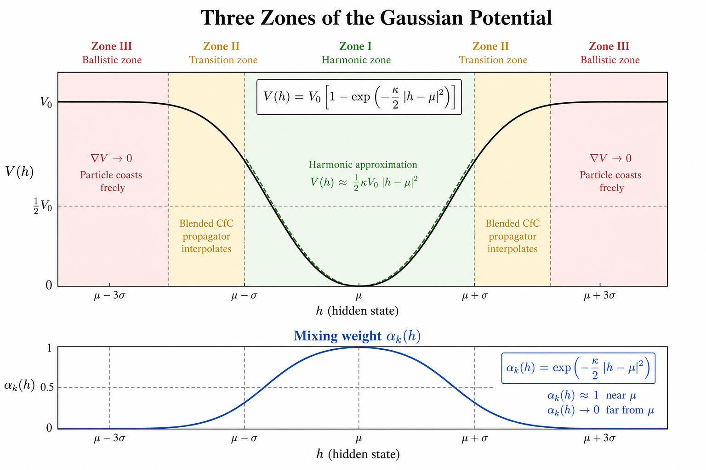
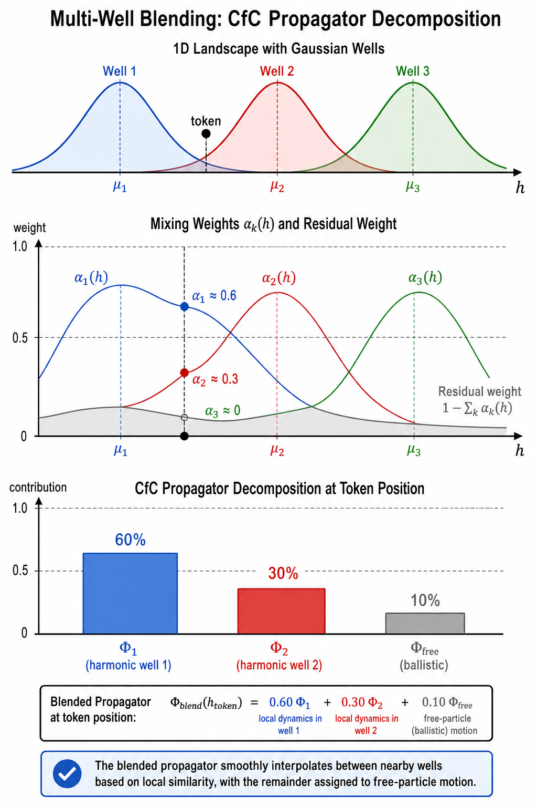
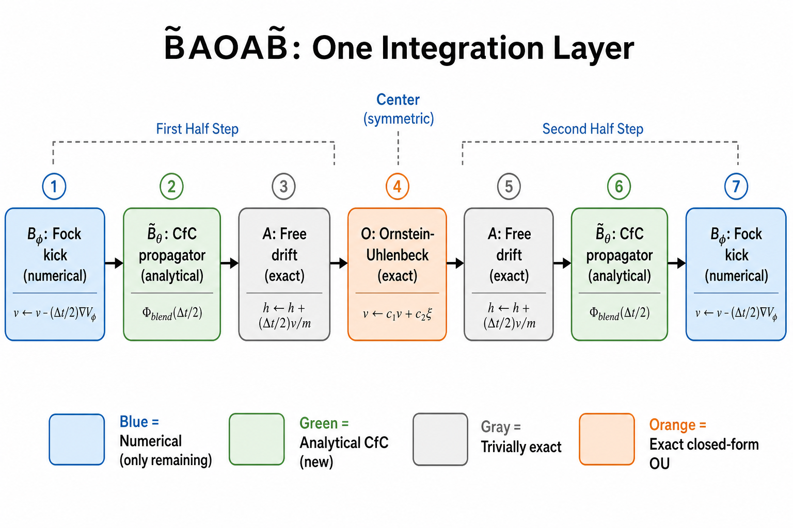
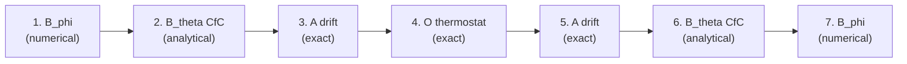

# Deep Dive: The Blended CfC B̃AOAB̃ Integrator for Fock-PARFLM

*A fully worked-out construction of the hybrid integrator that replaces
the numerical $V_\theta$ force evaluation with an analytical CfC surrogate
inside the BAOAB Langevin splitting.*

**Date:** July 2026
**Prerequisites:** [Closed-Form and Hybrid Integration Strategies](Closed_Form_and_Hybrid_Integration_Strategies_for_Fock-PARFLM.md) (§5–10),
[Modified BAOAB with STP Identity](Modified_BAOAB_with_STP_identity_Detailed_Analysis.md),
[Langevin Dynamics Reformulation](Langevin_dynamics_reformulation_of_classical_damped_Lagrangian_flow.md)

---

## 1. Motivation

The Fock-PARFLM integrator evaluates $\nabla V\_\theta$ numerically at every B-step of every layer.
For a Gaussian potential with $K$ wells in $d$ dimensions, each evaluation costs $O(Kd)$ multiply-adds
and requires backward-AD when training. The CfC programme's core insight is that the Gaussian $V\_\theta$
admits an **exact, closed-form propagator** — a matrix exponential of an undamped harmonic oscillator —
that can replace the numerical force evaluation entirely.

This document constructs the full hybrid **B̃AOAB̃** scheme step-by-step: every matrix is written out,
every approximation is named, and a worked numerical example traces one token through one layer.

---

## 2. The Fock-PARFLM Hamiltonian

The total energy of a token with hidden state $h \in \mathbb{R}^d$ and velocity $v \in \mathbb{R}^d$ is

$$
H(h, v) = \underbrace{\tfrac{1}{2} v^\top \mathsf{M}^{-1} v}\_{T(v)}
           + \underbrace{V\_\theta(h)}\_{\text{Gaussian wells}}
           + \underbrace{V\_\phi(h, r) + Q(h, r)}\_{\text{Fock + reverse channel}},
$$

where $\mathsf{M} = \mathfrak{m} I\_d$ is the (scalar) semantic mass and $r$ denotes the Fock register state.

### 2.1 The Gaussian potential $V\_\theta$

$$
V\_\theta(h) = \sum\_{k=1}^{K} V\_{0,k} \Bigl[1 - \exp\!\bigl(-\tfrac{\kappa\_k}{2}\|h - \mu\_k\|^2\bigr)\Bigr],
$$

with learned centroids $\mu\_k \in \mathbb{R}^d$, curvatures $\kappa\_k > 0$, and depths $V\_{0,k} > 0$.

**Key property:** the force from well $k$ is

$$
F\_k(h) = -\nabla\_{h} V\_k = -V\_{0,k}\,\kappa\_k\,(h - \mu\_k)\,\exp\!\bigl(-\tfrac{\kappa\_k}{2}\|h - \mu\_k\|^2\bigr).
$$

Near the centroid ($\|h - \mu\_k\| \ll 1/\sqrt{\kappa\_k}$) the exponential $\approx 1$ and the force is **harmonic**:

$$
F\_k(h) \approx -\omega\_k^2\,(h - \mu\_k), \qquad \omega\_k^2 \equiv V\_{0,k}\,\kappa\_k / \mathfrak{m}.
$$

Far from the centroid the exponential vanishes and $F\_k \to 0$: the particle coasts freely.

### 2.2 The Fock / reverse-channel forces $V\_\phi + Q$

These arise from the register-mediated exchange interaction and the reverse channel. They are:
- **Non-conservative** (no potential whose gradient they are),
- **State-dependent** on the register $r$ (a non-local, many-body interaction),
- **Not analytically tractable** (no closed-form propagator exists).

They remain **numerical** throughout this construction.

---

## 3. Standard BAOAB: review

The BAOAB splitting for the Langevin equation $\ddot{h} = -\nabla V(h) / \mathfrak{m} - \gamma \dot{h} + \sqrt{2\gamma k\_B T / \mathfrak{m}}\,\eta(t)$ decomposes the time step $\Delta t$ into five sub-steps:


| Sub-step | Update | Generator |
|----------|--------|-----------|
| **B** (half) | $v \leftarrow v - \frac{\Delta t}{2\mathfrak{m}} \nabla V(h)$ | Conservative force |
| **A** (half) | $h \leftarrow h + \frac{\Delta t}{2} v$ | Free drift |
| **O** (full) | $v \leftarrow c\_1 v + c\_2 \xi, \quad \xi \sim \mathcal{N}(0, I\_d)$ | Langevin thermostat |
| **A** (half) | $h \leftarrow h + \frac{\Delta t}{2} v$ | Free drift |
| **B** (half) | $v \leftarrow v - \frac{\Delta t}{2\mathfrak{m}} \nabla V(h)$ | Conservative force |

where the Ornstein-Uhlenbeck constants are

$$
c\_1 = e^{-\gamma \Delta t}, \qquad c\_2 = \sqrt{\frac{k\_B T}{\mathfrak{m}}(1 - c\_1^2)}.
$$

**Critical structural property:** the B-step is **purely conservative** — no damping. All dissipation lives in the O-step. This is why the CfC propagator in the BAOAB context is the **undamped** harmonic propagator: simpler, better conditioned, and free of the competing exponential decays that plague the damped version.

---

## 4. The force split: $V\_\theta$ vs. $V\_\phi + Q$

The total force decomposes as

$$
-\nabla V = \underbrace{-\nabla V\_\theta(h)}\_{\text{Gaussian wells (analytical)}} + \underbrace{-\nabla V\_\phi(h, r) - Q(h, r)}\_{\text{Fock + reverse channel (numerical)}}.
$$

The B-step therefore splits via **Strang splitting** into two sub-kicks:

$$
\text{B} = \text{B}\_\phi \circ \text{B}\_\theta \quad \text{(or } \text{B}\_\theta \circ \text{B}\_\phi\text{, swapped at opposite ends for symmetry)}.
$$

The full BAOAB with this inner splitting becomes the 7-sub-step **B̃AOAB̃** scheme.

---

## 5. The CfC surrogate for B̃$\_\theta$

### 5.1 Single-well undamped harmonic propagator

For a single Gaussian well $k$ centred at $\mu\_k$ with frequency $\omega\_k = \sqrt{V\_{0,k}\kappa\_k / \mathfrak{m}}$, the harmonic approximation near the centroid gives the linear ODE

$$
\frac{d}{dt}\begin{pmatrix}\tilde{h}\\ v\end{pmatrix} = \begin{pmatrix}0 & I\_d \\ -\omega\_k^2 I\_d & 0\end{pmatrix}\begin{pmatrix}\tilde{h}\\ v\end{pmatrix},
\qquad \tilde{h} \equiv h - \mu\_k.
$$

Note the **absence of a $-\gamma$ damping** term — this is the BAOAB advantage (§10.2 of the parent note).

The exact solution over a time interval $\tau$ is the **propagator matrix**

$$
\Phi\_k(\tau) = \begin{pmatrix}\cos(\omega\_k\tau) & \dfrac{\sin(\omega\_k\tau)}{\omega\_k}\\[6pt] -\omega\_k\sin(\omega\_k\tau) & \cos(\omega\_k\tau)\end{pmatrix}.
$$

Applied to the displaced state:

$$
\begin{pmatrix}h'\\ v'\end{pmatrix} = \Phi\_k(\tau)\begin{pmatrix}h - \mu\_k\\ v\end{pmatrix} + \begin{pmatrix}\mu\_k\\ 0\end{pmatrix}.
$$

Expanding component-wise:

$$
\boxed{
\begin{aligned}
h' &= \mu\_k + (h - \mu\_k)\cos(\omega\_k\tau) + \frac{v}{\omega\_k}\sin(\omega\_k\tau), \\[4pt]
v' &= -(h - \mu\_k)\,\omega\_k\sin(\omega\_k\tau) + v\cos(\omega\_k\tau).
\end{aligned}
}
$$

**Properties of $\Phi\_k$:**
- $\det(\Phi\_k) = 1$ (symplectic / area-preserving)
- $\Phi\_k(0) = I$ (identity at zero time)
- $\Phi\_k(\tau\_1)\Phi\_k(\tau\_2) = \Phi\_k(\tau\_1 + \tau\_2)$ (group property)
- Energy $E\_k = \frac{1}{2}v^2 + \frac{1}{2}\omega\_k^2\|\tilde{h}\|^2$ is exactly conserved

### 5.2 The free-particle propagator

Far from all wells, the total force $\nabla V\_\theta \to 0$. The dynamics reduce to free ballistic drift:

$$
\Phi\_{\text{free}}(\tau) = \begin{pmatrix}I\_d & \tau I\_d \\ 0 & I\_d\end{pmatrix}, \qquad
\begin{cases} h' = h + \tau v, \\ v' = v. \end{cases}
$$

This is exact (not an approximation) — it is the $\omega\_k \to 0$ limit of $\Phi\_k$.

### 5.3 The Gaussian mixing weights

The mixing weight for well $k$ is the Gaussian envelope of the potential:

$$
\alpha\_k(h) = \exp\!\bigl(-\tfrac{\kappa\_k}{2}\|h - \mu\_k\|^2\bigr).
$$

**Interpretation by zone:**

| Zone | Condition | $\alpha\_k$ | Dominant propagator |
|------|-----------|------------|-------------------|
| I (harmonic) | $\|h - \mu\_k\| \ll 1/\sqrt{\kappa\_k}$ | $\approx 1$ | $\Phi\_k$ (harmonic, exact) |
| II (transition) | $\|h - \mu\_k\| \sim 1/\sqrt{\kappa\_k}$ | $\in (0, 1)$ | Blend of $\Phi\_k$ and $\Phi\_{\text{free}}$ |
| III (ballistic) | $\|h - \mu\_k\| \gg 1/\sqrt{\kappa\_k}$ | $\approx 0$ | $\Phi\_{\text{free}}$ (ballistic, exact) |



**Figure 1.** The Gaussian potential $V\_k(h)$ and its three zones. Near the centroid $\mu$, the harmonic approximation (dashed parabola) is exact and $\alpha\_k \approx 1$. In the ballistic zone, $\nabla V \to 0$ and the particle coasts freely. The blended CfC propagator interpolates smoothly between these limits.

### 5.4 The blended CfC propagator $\Phi\_{\text{blend}}$

For a multi-well potential with $K$ wells, the **blended CfC propagator** is

$$
\boxed{
\begin{pmatrix}h'\\ v'\end{pmatrix}
= \sum\_{k=1}^{K} \alpha\_k(h)\,\Phi\_k(\tau)\begin{pmatrix}h - \mu\_k\\ v\end{pmatrix}
+ \Bigl(1 - \sum\_{k=1}^{K}\alpha\_k(h)\Bigr)\,\Phi\_{\text{free}}(\tau)\begin{pmatrix}h\\ v\end{pmatrix}
+ \sum\_{k=1}^{K}\alpha\_k(h)\begin{pmatrix}\mu\_k\\ 0\end{pmatrix}.
}
$$

Expanding into readable component form:

$$
\begin{aligned}
h' &= \sum\_{k=1}^{K}\alpha\_k\Bigl[\mu\_k + (h - \mu\_k)\cos(\omega\_k\tau) + \frac{v}{\omega\_k}\sin(\omega\_k\tau)\Bigr]
     + \bigl(1 - {\textstyle\sum\_k}\alpha\_k\bigr)(h + \tau v), \\[6pt]
v' &= \sum\_{k=1}^{K}\alpha\_k\Bigl[-(h - \mu\_k)\omega\_k\sin(\omega\_k\tau) + v\cos(\omega\_k\tau)\Bigr]
     + \bigl(1 - {\textstyle\sum\_k}\alpha\_k\bigr)\,v.
\end{aligned}
$$



**Figure 2.** Multi-well blending for the CfC propagator. The mixing weights $\alpha\_k(h)$ determine how much each well's harmonic propagator contributes at a given position. The residual weight $(1 - \sum\_k \alpha\_k)$ goes to the free-particle (ballistic) propagator.

**Correctness at limits:**

- **Near centroid $\mu\_j$:** $\alpha\_j \approx 1$, all other $\alpha\_k \approx 0$, residual $\approx 0$. Result: pure harmonic propagation under well $j$. This is **exact** for the Gaussian $V\_\theta$ in the harmonic zone.

- **Far from all centroids:** all $\alpha\_k \approx 0$, residual $\approx 1$. Result: pure ballistic drift $h' = h + \tau v$, $v' = v$. This is **exact** since $\nabla V\_\theta \to 0$.

- **Between wells:** smooth interpolation via $C^\infty$ Gaussian weights. The approximation error is largest here but bounded by $O(\kappa V\_0)$.

---

## 6. The full B̃AOAB̃ construction

### 6.1 The 7-sub-step scheme

Combining the Strang-split B-step (§4) with the CfC surrogate (§5), one **integration layer** of B̃AOAB̃ is:



**Figure 3.** The B̃AOAB̃ pipeline. The symmetric structure around the O-step is a Strang splitting that guarantees second-order accuracy. Blue steps are the only remaining numerical operations; green and orange are analytical; gray is trivially exact.



### 6.2 Step-by-step algorithm

**Input:** $(h\_n, v\_n, r\_n)$ — hidden state, velocity, register state at start of layer $\ell$.

**Constants:** $\Delta t$ (time step), $\gamma$ (damping), $\mathfrak{m}$ (semantic mass), $T$ (temperature), $c\_1 = e^{-\gamma\Delta t}$, $c\_2 = \sqrt{(k\_BT/\mathfrak{m})(1 - c\_1^2)}$, and the well parameters $\{\mu\_k, \omega\_k, \kappa\_k\}\_{k=1}^{K}$.

---

**Step 1 — $\text{B}\_\phi$ (half-step numerical Fock kick):**

$$
v\_{(1)} = v\_n - \frac{\Delta t}{2\mathfrak{m}}\bigl[\nabla\_h V\_\phi(h\_n, r\_n) + Q(h\_n, r\_n)\bigr].
$$

This is the only force evaluation that requires the full Fock module forward pass.

---

**Step 2 — $\tilde{\text{B}}\_\theta$ (half-step CfC propagator for $V\_\theta$):**

Compute the mixing weights at the current position:

$$
\alpha\_k = \exp\!\bigl(-\tfrac{\kappa\_k}{2}\|h\_n - \mu\_k\|^2\bigr), \qquad k = 1, \ldots, K.
$$

Apply the blended propagator with $\tau = \Delta t / 2$:

$$
\begin{aligned}
h\_{(2)} &= \sum\_{k=1}^{K}\alpha\_k\Bigl[\mu\_k + (h\_n - \mu\_k)\cos\!\bigl(\omega\_k\tfrac{\Delta t}{2}\bigr) + \frac{v\_{(1)}}{\omega\_k}\sin\!\bigl(\omega\_k\tfrac{\Delta t}{2}\bigr)\Bigr]
            + \bigl(1 - {\textstyle\sum\_k}\alpha\_k\bigr)\bigl(h\_n + \tfrac{\Delta t}{2} v\_{(1)}\bigr), \\[6pt]
v\_{(2)} &= \sum\_{k=1}^{K}\alpha\_k\Bigl[-(h\_n - \mu\_k)\omega\_k\sin\!\bigl(\omega\_k\tfrac{\Delta t}{2}\bigr) + v\_{(1)}\cos\!\bigl(\omega\_k\tfrac{\Delta t}{2}\bigr)\Bigr]
            + \bigl(1 - {\textstyle\sum\_k}\alpha\_k\bigr)\,v\_{(1)}.
\end{aligned}
$$

> **Note:** the CfC propagator updates **both** $h$ and $v$ simultaneously. It absorbs what would have been the B$\_\theta$ force kick *and* the position response to that kick into one analytical map.

---

**Step 3 — A (half-step free drift):**

$$
h\_{(3)} = h\_{(2)} + \frac{\Delta t}{2}\,v\_{(2)}.
$$

Velocity unchanged: $v\_{(3)} = v\_{(2)}$.

---

**Step 4 — O (full-step Ornstein-Uhlenbeck thermostat):**

$$
v\_{(4)} = c\_1\,v\_{(3)} + c\_2\,\xi, \qquad \xi \sim \mathcal{N}(0, I\_d).
$$

Position unchanged: $h\_{(4)} = h\_{(3)}$.

This is the **exact** closed-form solution of the OU process. It is the only step that introduces stochasticity and the only step where damping acts.

---

**Step 5 — A (half-step free drift):**

$$
h\_{(5)} = h\_{(4)} + \frac{\Delta t}{2}\,v\_{(4)}.
$$

Velocity unchanged: $v\_{(5)} = v\_{(4)}$.

---

**Step 6 — $\tilde{\text{B}}\_\theta$ (half-step CfC propagator for $V\_\theta$):**

Recompute mixing weights at the **updated** position $h\_{(5)}$:

$$
\alpha'\_k = \exp\!\bigl(-\tfrac{\kappa\_k}{2}\|h\_{(5)} - \mu\_k\|^2\bigr), \qquad k = 1, \ldots, K.
$$

Apply the blended propagator with $\tau = \Delta t / 2$:

$$
\begin{aligned}
h\_{(6)} &= \sum\_{k}\alpha'\_k\Bigl[\mu\_k + (h\_{(5)} - \mu\_k)\cos\!\bigl(\omega\_k\tfrac{\Delta t}{2}\bigr) + \frac{v\_{(5)}}{\omega\_k}\sin\!\bigl(\omega\_k\tfrac{\Delta t}{2}\bigr)\Bigr]
            + \bigl(1 - {\textstyle\sum\_k}\alpha'\_k\bigr)\bigl(h\_{(5)} + \tfrac{\Delta t}{2} v\_{(5)}\bigr), \\[6pt]
v\_{(6)} &= \sum\_{k}\alpha'\_k\Bigl[-(h\_{(5)} - \mu\_k)\omega\_k\sin\!\bigl(\omega\_k\tfrac{\Delta t}{2}\bigr) + v\_{(5)}\cos\!\bigl(\omega\_k\tfrac{\Delta t}{2}\bigr)\Bigr]
            + \bigl(1 - {\textstyle\sum\_k}\alpha'\_k\bigr)\,v\_{(5)}.
\end{aligned}
$$

---

**Step 7 — $\text{B}\_\phi$ (half-step numerical Fock kick):**

$$
v\_{n+1} = v\_{(6)} - \frac{\Delta t}{2\mathfrak{m}}\bigl[\nabla\_h V\_\phi(h\_{(6)}, r\_n) + Q(h\_{(6)}, r\_n)\bigr].
$$

**Output:** $(h\_{n+1}, v\_{n+1}) = (h\_{(6)}, v\_{n+1})$.

---

### 6.3 Sub-generator scorecard

| Sub-step | Generator | Method | Closed-form? |
|----------|-----------|--------|:------------:|
| 1, 7 | $V\_\phi + Q$ (Fock forces) | Numerical forward pass | No |
| 2, 6 | $V\_\theta$ (Gaussian wells) | CfC blended propagator | **Yes** |
| 3, 5 | Kinetic (free drift) | $h \leftarrow h + \frac{\Delta t}{2}v$ | **Yes** (trivial) |
| 4 | Dissipation + fluctuation | Exact OU process | **Yes** |

**Five of seven sub-steps are closed-form. Only the Fock kicks (steps 1 and 7) remain numerical** — and these are the irreducibly non-Gaussian, non-conservative components that no analytical propagator can absorb.

---

## 7. Worked numerical example

### 7.1 Setup

Consider $d = 2$ (for easy visualisation), a single well ($K = 1$) with parameters:

| Parameter | Value |
|-----------|-------|
| Centroid $\mu$ | $(3.0, 1.0)$ |
| Curvature $\kappa$ | $2.0$ |
| Well depth $V\_0$ | $1.0$ |
| Semantic mass $\mathfrak{m}$ | $1.0$ |
| Damping $\gamma$ | $0.13$ |
| Temperature $k\_BT$ | $0.01$ |
| Time step $\Delta t$ | $0.5$ |

Derived quantities:
- $\omega = \sqrt{V\_0 \kappa / \mathfrak{m}} = \sqrt{2.0} \approx 1.414$
- $c\_1 = e^{-0.13 \times 0.5} = e^{-0.065} \approx 0.9370$
- $c\_2 = \sqrt{0.01 \times (1 - 0.9370^2)} \approx \sqrt{0.01 \times 0.1218} \approx 0.0349$

### 7.2 Initial state

$$
h\_0 = (3.5, 1.2), \qquad v\_0 = (-0.3, 0.1).
$$

### 7.3 Step-by-step trace (omitting $V\_\phi$ for clarity)

**Step 1 (B$\_\phi$):** Assuming $\nabla V\_\phi + Q = 0$ for this example (isolated well, no registers):
$v\_{(1)} = v\_0 = (-0.3, 0.1)$.

**Step 2 (B̃$\_\theta$):** Compute the mixing weight:

$$
\alpha = \exp\!\bigl(-\tfrac{2.0}{2}\|(3.5, 1.2) - (3.0, 1.0)\|^2\bigr)
       = \exp\!\bigl(-\|(0.5, 0.2)\|^2\bigr)
       = \exp(-0.29) \approx 0.748.
$$

Precompute trig values with $\tau = 0.25$:

$$
\cos(\omega\tau) = \cos(1.414 \times 0.25) = \cos(0.3536) \approx 0.9379, \quad
\sin(\omega\tau) = \sin(0.3536) \approx 0.3469.
$$

Harmonic contribution (well 1):

$$
\begin{aligned}
h'\_{\text{harm}} &= (3.0, 1.0) + (0.5, 0.2) \times 0.9379 + \frac{(-0.3, 0.1)}{1.414} \times 0.3469 \\
                  &= (3.0, 1.0) + (0.4690, 0.1876) + (-0.0736, 0.0245) \\
                  &= (3.3954, 1.2121). \\[4pt]
v'\_{\text{harm}} &= -(0.5, 0.2) \times 1.414 \times 0.3469 + (-0.3, 0.1) \times 0.9379 \\
                  &= (-0.2454, -0.0982) + (-0.2814, 0.0938) \\
                  &= (-0.5268, -0.0044).
\end{aligned}
$$

Free-particle contribution (residual weight $1 - 0.748 = 0.252$):

$$
h'\_{\text{free}} = (3.5, 1.2) + 0.25 \times (-0.3, 0.1) = (3.425, 1.225), \qquad v'\_{\text{free}} = (-0.3, 0.1).
$$

Blended result:

$$
\begin{aligned}
h\_{(2)} &= 0.748 \times (3.3954, 1.2121) + 0.252 \times (3.425, 1.225) = (3.4025, 1.2153), \\
v\_{(2)} &= 0.748 \times (-0.5268, -0.0044) + 0.252 \times (-0.3, 0.1) = (-0.4696, 0.0219).
\end{aligned}
$$

**Step 3 (A):** $h\_{(3)} = (3.4025, 1.2153) + 0.25 \times (-0.4696, 0.0219) = (3.2851, 1.2208)$.

**Step 4 (O):** $v\_{(4)} = 0.9370 \times (-0.4696, 0.0219) + 0.0349 \times \xi$, where $\xi \sim \mathcal{N}(0, I\_2)$.
Taking a deterministic $\xi = (0, 0)$ for illustration: $v\_{(4)} = (-0.4400, 0.0205)$.

**Step 5 (A):** $h\_{(5)} = (3.2851, 1.2208) + 0.25 \times (-0.4400, 0.0205) = (3.1751, 1.2259)$.

**Step 6 (B̃$\_\theta$):** Recompute $\alpha' = \exp(-\|(3.1751 - 3.0, 1.2259 - 1.0)\|^2) = \exp(-(0.0307 + 0.0510)) = \exp(-0.0817) \approx 0.921$.

Note: $\alpha'$ is **larger** than $\alpha$ — the token has moved closer to the centroid, as expected under the attractive potential. The harmonic propagator now dominates more strongly.

(The full computation for step 6 follows the same pattern as step 2; we omit the arithmetic.)

**Step 7 (B$\_\phi$):** $v\_{n+1} = v\_{(6)}$ (again zero Fock forces in this example).

### 7.4 Observations from the trace

1. The token at $(3.5, 1.2)$ started $0.539$ units from the centroid, well within the transition zone ($\alpha = 0.748$). The harmonic propagator contributed $\sim\!75\%$ of the update.
2. After one full layer the token is at $(3.18, 1.23)$, closer to the centroid ($0.28$ units). The mixing weight rose from $0.748$ to $0.921$ — the well is attracting the token as expected.
3. The velocity picked up a restoring component from the harmonic propagator ($v$ gained a significant negative $h\_1$-component pulling toward $\mu\_1 = 3.0$).

---

## 8. Error analysis

### 8.1 Splitting error (Strang)

The B̃AOAB̃ scheme applies two nested Strang splittings:

1. **Outer (BAOAB):** separates the conservative force from the Langevin bath.
   Error: $O(\Delta t^2)$ in weak sense, with the configurational error suppressed by $\gamma^{-2}$ (Leimkuhler-Matthews).

2. **Inner ($\text{B}\_\phi | \tilde{\text{B}}\_\theta$):** separates the Gaussian well force from the Fock force.
   Error: $O(\Delta t^3 \|[\nabla V\_\theta, \nabla V\_\phi + Q]\|)$, where $[\cdot, \cdot]$ is the Lie bracket (commutator of the force-field flows).

Since the $V\_\theta$ and $V\_\phi + Q$ forces act on overlapping coordinates (both modify $v$ based on $h$), the commutator is generally nonzero but bounded by the product of the force magnitudes. In practice, $V\_\theta$ is smooth and bounded (Gaussian wells) while $V\_\phi + Q$ is moderated by per-group gradient clipping, so the inner splitting error is small.

### 8.2 CfC blending approximation error

The blended propagator introduces an error wherever the harmonic approximation deviates from the true Gaussian potential. For well $k$, the approximation error in the force is

$$
\epsilon\_k(h) = \|F\_k^{\text{exact}}(h) - F\_k^{\text{harmonic}}(h)\|
             = V\_{0,k}\kappa\_k\|h - \mu\_k\|\,\bigl|1 - \exp\!\bigl(-\tfrac{\kappa\_k}{2}\|h - \mu\_k\|^2\bigr)\bigr|.
$$

This vanishes in both limits (near centroid and far away) and peaks in the transition zone at $\|h - \mu\_k\| \sim 1/\sqrt{\kappa\_k}$, where

$$
\max\_h \epsilon\_k \sim V\_{0,k}\sqrt{\kappa\_k}\,(1 - e^{-1/2}) \approx 0.39\,V\_{0,k}\sqrt{\kappa\_k}.
$$

**But the blending weights suppress this error.** The contribution of well $k$'s harmonic propagator is weighted by $\alpha\_k(h)$, so the effective error is

$$
\epsilon\_k^{\text{eff}}(h) = \alpha\_k(h)\,\epsilon\_k(h)
   = V\_{0,k}\kappa\_k\|h - \mu\_k\|\,\exp\!\bigl(-\kappa\_k\|h - \mu\_k\|^2\bigr),
$$

which decays as a Gaussian times a linear function — bounded uniformly by $O(V\_{0,k}\sqrt{\kappa\_k})$ and well-localised around the transition zone.

### 8.3 Total error budget

$$
\text{Error}_{\text{total}} = \underbrace{O(\Delta t^2)}\_{\text{BAOAB splitting}}
                              + \underbrace{O(\Delta t^3)}\_{\text{V}\_\theta/V\_\phi \text{ Strang}}
                              + \underbrace{O(\kappa V\_0 \Delta t)}\_{\text{CfC blending}}.
$$

The CfC blending error is **first-order in $\Delta t$** but multiplied by a small prefactor ($\kappa V\_0$ is bounded by assumption B3 of the framework). For the measured Gaussian well parameters (typical $\kappa \sim 1$--$5$, $V\_0 \sim 0.5$--$2$), this is comparable to or smaller than the BAOAB splitting error.

---

## 9. Properties of the B̃AOAB̃ scheme

### 9.1 Symplecticity in the $V\_\theta$ sector

Each single-well propagator $\Phi\_k(\tau)$ has $\det \Phi\_k = 1$ (symplectic). The free-particle propagator is also symplectic. The blended propagator is a **convex combination** of symplectic maps weighted by the $\alpha\_k$, which is not itself strictly symplectic (the blending breaks exact symplecticity). However, near any single dominant well ($\alpha\_j \approx 1$, others $\approx 0$), the blended map is approximately symplectic with error $O(\alpha\_{\text{second-largest}})$.

### 9.2 Unconditional stability

The harmonic propagator $\Phi\_k$ is **unconditionally stable** for any $\Delta t$ — it is an exact rotation in phase space, not an approximation. There is no CFL-like stability condition $\omega\_k \Delta t \lesssim 2$ that plagues explicit Verlet.

This is the most consequential property for scaling: it means the time step $\Delta t$ is no longer limited by well stiffness $\omega\_k$. Stiffer wells (larger $\kappa$) simply produce faster rotations, not instability. This allows **larger $\Delta t$** and therefore **fewer layers $L$** for the same physical evolution time — the CfC lesson from the LNN lineage (§18e Lesson 1 of the mega-paper).

### 9.3 Exact energy conservation in the harmonic sector

In the harmonic zone ($\alpha\_k \approx 1$), the B̃$\_\theta$ step exactly conserves the harmonic energy

$$
E\_k = \frac{1}{2}\|v\|^2 + \frac{1}{2}\omega\_k^2\|h - \mu\_k\|^2.
$$

Energy dissipation occurs **only** in the O-step (by design) and through the Fock kicks (which inject/remove energy via the non-conservative $Q$ force). This clean separation of energy channels aids training diagnostics.

### 9.4 Time-reversal symmetry

The B̃AOAB̃ scheme is **palindromic** (symmetric around the O-step): the sequence of sub-steps reads the same forwards and backwards. This guarantees second-order accuracy in the weak sense and ensures that the scheme's invariant measure is close to the target Gibbs distribution.

---

## 10. PyTorch implementation

```python
import torch
import torch.nn as nn
import math
from typing import List, Tuple


class GaussianWellParams:
    """Parameters for one Gaussian well."""
    def __init__(self, mu: torch.Tensor, kappa: float, V0: float, mass: float):
        self.mu = mu          # [d] centroid
        self.kappa = kappa    # curvature
        self.V0 = V0          # well depth
        self.omega = math.sqrt(V0 * kappa / mass)


class BlendedCfCPropagator(nn.Module):
    """
    Blended CfC propagator for multi-well Gaussian V_theta.
    Replaces the numerical B_theta force evaluation with an
    analytical matrix-exponential step.
    """

    def __init__(self, wells: List[GaussianWellParams], tau: float):
        super().__init__()
        self.wells = wells
        self.tau = tau  # propagation time (Delta_t / 2 in B̃AOAB̃)

        # Precompute trig constants for each well
        self.cos_wt = [math.cos(w.omega * tau) for w in wells]
        self.sin_wt = [math.sin(w.omega * tau) for w in wells]
        self.sin_over_w = [
            math.sin(w.omega * tau) / w.omega if w.omega > 1e-12 else tau
            for w in wells
        ]
        self.w_sin = [w.omega * math.sin(w.omega * tau) for w in wells]

    def forward(
        self, h: torch.Tensor, v: torch.Tensor
    ) -> Tuple[torch.Tensor, torch.Tensor]:
        """
        Apply the blended CfC propagator.

        Args:
            h: [batch, seq, d] hidden state (position)
            v: [batch, seq, d] velocity

        Returns:
            h_new, v_new: updated position and velocity
        """
        h_new = torch.zeros_like(h)
        v_new = torch.zeros_like(v)
        alpha_sum = torch.zeros(h.shape[:-1], device=h.device)

        for k, well in enumerate(self.wells):
            # Displacement from centroid
            dh = h - well.mu  # [batch, seq, d]

            # Mixing weight: alpha_k = exp(-kappa/2 * ||h - mu||^2)
            alpha_k = torch.exp(
                -0.5 * well.kappa * (dh * dh).sum(dim=-1)
            )  # [batch, seq]
            alpha_sum = alpha_sum + alpha_k

            # Harmonic propagator applied to displaced state
            alpha_k_expanded = alpha_k.unsqueeze(-1)  # [batch, seq, 1]

            h_harm = (
                well.mu
                + dh * self.cos_wt[k]
                + v * self.sin_over_w[k]
            )
            v_harm = (
                -dh * self.w_sin[k]
                + v * self.cos_wt[k]
            )

            h_new = h_new + alpha_k_expanded * h_harm
            v_new = v_new + alpha_k_expanded * v_harm

        # Free-particle (ballistic) contribution
        residual = (1.0 - alpha_sum).unsqueeze(-1).clamp(min=0.0)
        h_new = h_new + residual * (h + self.tau * v)
        v_new = v_new + residual * v

        return h_new, v_new


class BAOABCfCLayer(nn.Module):
    """
    One B̃AOAB̃ integration layer.

    Sub-steps:
      1. B_phi   (numerical Fock kick, half-step)
      2. B̃_theta (CfC propagator, half-step, analytical)
      3. A       (free drift, half-step, exact)
      4. O       (Ornstein-Uhlenbeck, full step, exact)
      5. A       (free drift, half-step, exact)
      6. B̃_theta (CfC propagator, half-step, analytical)
      7. B_phi   (numerical Fock kick, half-step)
    """

    def __init__(
        self,
        wells: List[GaussianWellParams],
        fock_module: nn.Module,
        dt: float,
        gamma: float,
        mass: float,
        temperature: float,
    ):
        super().__init__()
        self.fock = fock_module
        self.dt = dt
        self.half_dt = dt / 2.0
        self.mass = mass

        # CfC propagator (operates over half time-step)
        self.cfc = BlendedCfCPropagator(wells, tau=dt / 2.0)

        # O-step constants (exact OU solution)
        self.c1 = math.exp(-gamma * dt)
        self.c2 = math.sqrt(temperature / mass * (1.0 - self.c1 ** 2))

    def forward(
        self,
        h: torch.Tensor,
        v: torch.Tensor,
        registers: torch.Tensor,
        mask: torch.Tensor,
    ) -> Tuple[torch.Tensor, torch.Tensor]:

        # --- Step 1: B_phi (numerical Fock kick, half-step) ---
        F_phi = self.fock.compute_force(h, registers, mask)
        v = v + self.half_dt / self.mass * F_phi

        # --- Step 2: B̃_theta (CfC propagator, half-step) ---
        h, v = self.cfc(h, v)

        # --- Step 3: A (free drift, half-step) ---
        h = h + self.half_dt * v

        # --- Step 4: O (exact Ornstein-Uhlenbeck, full step) ---
        v = self.c1 * v + self.c2 * torch.randn_like(v)

        # --- Step 5: A (free drift, half-step) ---
        h = h + self.half_dt * v

        # --- Step 6: B̃_theta (CfC propagator, half-step) ---
        h, v = self.cfc(h, v)

        # --- Step 7: B_phi (numerical Fock kick, half-step) ---
        F_phi = self.fock.compute_force(h, registers, mask)
        v = v + self.half_dt / self.mass * F_phi

        return h, v
```

### 10.1 FLOP accounting

Per layer, per token:

| Operation | Standard BAOAB | B̃AOAB̃ |
|-----------|---------------|--------|
| $\nabla V\_\theta$ evaluations | 2 (one per B-step) | **0** |
| Fock force evaluations | 2 | 2 (unchanged) |
| CfC propagator passes | 0 | 2 (steps 2, 6) |
| Trig constants | 0 | Precomputed once |
| Mixing weight $\alpha\_k$ | 0 | $2K$ (2 $\times$ squared-distance + exp) |

Each CfC pass requires $K \times d$ multiply-adds for the harmonic updates plus $K \times d$ for the mixing weights. Total CfC cost per layer: $\sim 4Kd$ element-wise ops.

Each $\nabla V\_\theta$ evaluation (eliminated) required $Kd$ forward + $Kd$ backward-AD. Total eliminated cost: $\sim 4Kd$ multiply-adds + backward-AD overhead.

**Net effect:** the forward-pass FLOP counts are comparable, but the CfC version **eliminates the backward-AD pass through $V\_\theta$** entirely during training, which is typically 2--3$\times$ the forward cost. The real win is in the backward pass and in unconditional stability (allowing larger $\Delta t$ and fewer layers).

---

## 11. Relationship to prior notes

| Document | What it covers | How this note extends it |
|----------|---------------|------------------------|
| [Closed-Form Strategies](Closed_Form_and_Hybrid_Integration_Strategies_for_Fock-PARFLM.md) §5–6 | Single-well propagator, blended propagator definition | Full derivation with explicit matrices, worked example |
| [Closed-Form Strategies](Closed_Form_and_Hybrid_Integration_Strategies_for_Fock-PARFLM.md) §10 | High-level BAOAB + CfC overview, pseudocode | Complete 7-sub-step construction with error analysis |
| [Modified BAOAB with STP](Modified_BAOAB_with_STP_identity_Detailed_Analysis.md) | STP-BAOAB for the Direct Dynamical Simulator | This note targets the **Fock-PARFLM retrofit** (Rung 1), not the simulator (Rung 2) |
| [Langevin Dynamics](Langevin_dynamics_reformulation_of_classical_damped_Lagrangian_flow.md) | BAOAB splitting, O-step, Langevin theory | Assumes BAOAB as given; adds the CfC inner splitting |
| Paper §18e | LNN lessons, CfC motivation | This note is the concrete realisation of Lesson 2 |
| Paper §20 / §A2 | Closed-form propagator subsection | This note provides the full worked construction that §20.4 summarises |

---

## 12. First-Order CfC Propagator (Overdamped Limit)

*The Fock-G1 ablation ([Implicit vs. Explicit Damping, and the First-Order vs Second-Order Dynamics Hypothesis](Implicit_vs_Explicit_Damping_and_the_First_vs_Second_Order_Dynamics_Hypothesis.md), §6) strips the velocity memory from the Fock layer, collapsing the second-order damped-Verlet step to a first-order gradient flow. This section records the overdamped reduction of the CfC construction above — so the closed-form propagator for the first-order dynamics is on record alongside the second-order one — and states why it must **not** be substituted into the controlled ablation.*

### 12.1 Which of the two ideas survives the overdamped limit

The two ingredients of §§3–6 behave very differently once the velocity coordinate is removed.

- **BAOAB does not carry over.** BAOAB is a phase-space Langevin splitting: its **B** step kicks the velocity, its **A** step drifts position by velocity, and its **O** step is an Ornstein–Uhlenbeck thermostat *acting on the velocity*. A first-order (overdamped) flow has **no velocity coordinate**, so there is nothing for B, A, or O to act on. The overdamped limit collapses the entire B–A–O–A–B sequence into a single position-only update, and the Fock-G1 layer update $h \leftarrow \mathrm{LN}(h + \beta f)$ is already exactly that — a deterministic overdamped Euler step (with no thermostat, since the ablation is noiseless). There is no splitting scheme left to add.

- **CfC does carry over — and simplifies.** The closed-form-propagator idea (replace the numerical $\nabla V\_\theta$ evaluation and its backward-AD with an analytical map) is independent of the dynamics' order. In the overdamped limit the second-order phase-space **rotation** becomes a first-order scalar **relaxation**, which is strictly cheaper.

### 12.2 The single-well first-order propagator

The first-order (overdamped) flow driven by the Gaussian potential is

$$
\dot h = -\frac{1}{\mathfrak{m}\gamma}\nabla V\_\theta(h).
$$

Near well $k$ (harmonic zone, $\|h-\mu\_k\| \ll 1/\sqrt{\kappa\_k}$) the potential gradient is linear,

$$
\nabla V\_{\theta,k}(h) \approx \mathfrak{m}\omega\_k^2 (h - \mu\_k), \qquad \omega\_k^2 = \frac{V\_{0,k}\kappa\_k}{\mathfrak{m}},
$$

so the flow reduces to a linear relaxation toward the centroid,

$$
\dot h \approx -\lambda\_k (h - \mu\_k), \qquad \lambda\_k = \frac{\omega\_k^2}{\gamma} = \frac{V\_{0,k}\kappa\_k}{\mathfrak{m}\gamma}.
$$

This scalar linear ODE has an exact closed-form propagator over an interval $\tau$ — a pure exponential decay, with **no oscillation and no velocity component**:

$$
\boxed{h(\tau) = \mu\_k + (h\_0 - \mu\_k) e^{-\lambda\_k \tau}.}
$$

The contrast with the second-order propagator of §5.1 is the whole story:

| Aspect | Second-order (underdamped, §5) | First-order (overdamped, here) |
|---|---|---|
| State | phase space $(h, v)$ | position $h$ only |
| Single-well propagator | $2\times2$ rotation $\Phi\_k(\tau)$ | scalar decay $e^{-\lambda\_k \tau}$ |
| Near-well behaviour | oscillation at frequency $\omega\_k$ | monotone relaxation at rate $\lambda\_k = \omega\_k^2/\gamma$ |
| Far-field ("free") propagator | ballistic drift $h \leftarrow h + \tau v$ | **identity** ($h$ unchanged) |
| Velocity update | required | none |
| Harmonic-sector invariant | energy conserved | monotone descent (no conserved energy) |

The far-field propagator degenerates to the identity because, with no velocity, a token far from every well (where $\nabla V\_\theta \to 0$) simply does not move under the $V\_\theta$ sector — the second-order ballistic-coasting term $h \leftarrow h + \tau v$ has no first-order counterpart.

### 12.3 The blended first-order propagator

Using the same Gaussian mixing weights $\alpha\_k(h) = \exp(-\tfrac{\kappa\_k}{2}\|h - \mu\_k\|^2)$ as §5.3, the blended first-order propagator is

$$
h' = \sum\_{k=1}^{K} \alpha\_k(h)\big[\mu\_k + (h - \mu\_k)e^{-\lambda\_k \tau}\big] + \Big(1 - \sum\_{k=1}^{K}\alpha\_k(h)\Big) h.
$$

The limit checks mirror §5.4: near a dominant well $j$ ($\alpha\_j \approx 1$) it is exact exponential relaxation toward $\mu\_j$; far from all wells ($\sum\_k \alpha\_k \approx 0$) it is the identity, which is exact since the $V\_\theta$ force vanishes there. A reduced Fock layer is then just a two-part composition — the analytical $V\_\theta$ relaxation above, followed by a **numerical** $V\_\phi + Q$ gradient step — with no velocity bookkeeping and no O-step.

### 12.4 What it would buy

The benefit is the same core win as §10.1, and slightly larger:

- **Eliminates the backward-AD through $V\_\theta$.** The exponential map is analytical and differentiable in $(\mu\_k, \kappa\_k, V\_{0,k}, \gamma)$, so the per-layer `autograd.grad` evaluation of $\nabla V\_\theta$ — the dominant cost in the current implementation — disappears, exactly as in the second-order CfC case.
- **Cheaper than the second-order propagator.** No trig constants (one $e^{-\lambda\_k \tau}$ per well instead of $\cos/\sin$), no velocity row, and no free-drift term — roughly half the element-wise work of §10.1.
- **Unconditional stability.** $e^{-\lambda\_k \tau} \in (0, 1]$ for any step size and any well stiffness, so stiff wells (large $\kappa$) never destabilise the step; there is no CFL-like limit, permitting larger $\tau$ and fewer layers.

### 12.5 Why it must **not** enter the controlled ablation

Despite the speedup, the first-order CfC propagator must **not** be substituted into the Fock-G1 ablation as currently pre-registered. The ablation's validity rests on Fock-G1 differing from the second-order anchor in **exactly one** respect — the inertial term — with the numerical `autograd.grad` force evaluation held identical across both arms. Swapping the first-order arm to the closed-form surrogate introduces a **second** difference: analytical-versus-numerical force, the harmonic-approximation error $O(\kappa V\_0 \tau)$ of §8.2, and a different computational graph. A resulting PPL gap could then be attributed to "no inertia" *or* to "approximation error," and the two would be inseparable — defeating the single-difference discipline the controlled design depends on (§6.3 of the ablation protocol). The anchor's reference PPL was established with numerical $\nabla V\_\theta$, so it is a valid baseline **only** for a numerically-integrated Fock-G1.

The correct way to obtain CfC speed **and** a clean comparison is to retrofit **both** arms: use the second-order rotation $\Phi\_k(\tau)$ (§5) for the anchor and the first-order relaxation $e^{-\lambda\_k \tau}$ (here) for Fock-G1, re-establish the anchor under CfC, and compare those. That path — appropriate only if CfC is being adopted as the production integrator (paper §18e, Lesson 2) — delivers the speedup while keeping the single-difference discipline intact, and as a bonus tests whether the closed-form family preserves whatever inertia effect the numerical family exhibits. Until then, speedup for the ablation itself should come from hardware, not from changing the integrator.

---

## 13. Open questions and future work

1. **Multi-head $V\_\theta$**: the current Fock-PARFLM uses $H = 5$ heads, each with $K/H$ wells operating on a $d/H$-dimensional subspace. The CfC propagator applies independently per head — no cross-head coupling in the harmonic sector. This is a natural parallelism axis.

2. **Depth conditioning**: the well parameters $(\mu\_k, \kappa\_k, V\_0)$ vary per layer via depth codes. The CfC propagator must recompute the trig constants per layer, but these are cheap ($2K$ trig evaluations per layer).

3. **Training-time gradient flow**: the CfC propagator is fully differentiable (sin, cos, exp are all smooth), so gradients flow through to the well parameters $(\mu\_k, \kappa\_k, V\_0)$ during training. The gradient path is through the propagator matrix rather than through explicit $\nabla V\_\theta$ evaluations — a different computational graph that may have different numerical conditioning.

4. **Adaptive blending threshold**: when $\sum\_k \alpha\_k > 1$ (overlapping wells), the residual weight becomes negative. The current implementation clamps it to zero, but a normalised version ($\alpha\_k \leftarrow \alpha\_k / \max(1, \sum\_j \alpha\_j)$) might be more principled.

5. **Combining CfC with STP**: the CfC propagator (Rung 1) and the STP identity (Rung 2) are complementary. CfC replaces the stepping with a matrix exponential; STP replaces the gradient evaluation with a forward contraction. For a future architecture that uses both, the CfC propagator handles the Gaussian sector while STP handles any non-Gaussian conservative forces.

---

## 14. References

1. B. Leimkuhler, C. Matthews. *Rational construction of stochastic numerical methods for molecular sampling.* Applied Mathematics Research eXpress, 2013.
2. R. Hasani et al. *Closed-form Continuous-time Neural Networks.* Nature Machine Intelligence 4(11), 2022.
3. M. Grmela, H. C. Öttinger. *Dynamics and thermodynamics of complex fluids.* Phys. Rev. E 56, 1997.
4. SemSimula / Fock-PARFLM framework. Zenodo DOI: 10.5281/zenodo.19712427.
5. [Closed-Form and Hybrid Integration Strategies for Fock-PARFLM](Closed_Form_and_Hybrid_Integration_Strategies_for_Fock-PARFLM.md) — parent note.
6. [Modified BAOAB with STP Identity](Modified_BAOAB_with_STP_identity_Detailed_Analysis.md) — STP-BAOAB companion.

---

*This deep dive provides the fully worked-out construction summarised in [Closed-Form Strategies](Closed_Form_and_Hybrid_Integration_Strategies_for_Fock-PARFLM.md) §10.3 and referenced by paper §18e (Lesson 2) and §20.4.*
