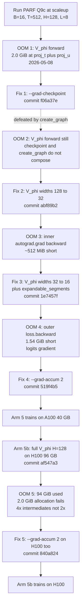
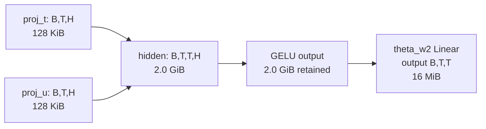
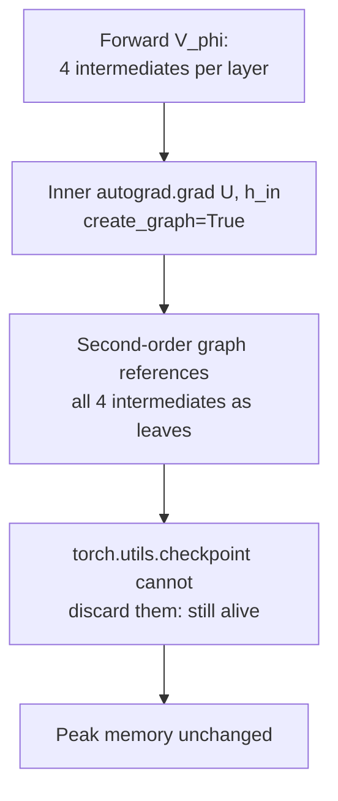
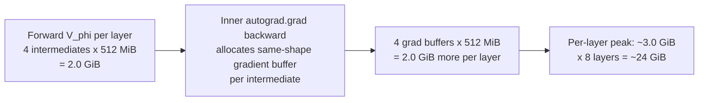
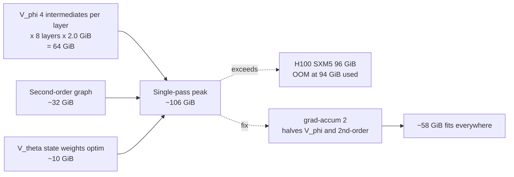

# CUDA Out-of-Memory Errors with SPLM-Family Designs

**Status:** Forensic catalogue of the five distinct OOM events encountered during the `paper_tmlr_1` Colab pilot (8–9 May 2026).
**Scope:** All five events occurred on the **PARF-augmented SPLM (Q9c)** Arm 5 / Arm 5b cells of `notebooks/conservative_arch/scaleup/colab_pilot.ipynb`. The four other arms (matched-attention baseline, all-SPLM `em_ln`, Helmholtz Q9d, Hybrid Variant A) never OOMed.
**Common substrate:** every event traces back to the interaction between **structural V_φ** and **`torch.autograd.grad(..., create_graph=True)`** — the second-order autograd path that the velocity-Verlet damped Euler–Lagrange integrator requires.
**Reading guide:** §1 establishes the shared mechanism; §2 walks the five events in chronological order; §3 distils the lessons.

---

## 1. The shared mechanism

PARF Q9c extends the SPLM Lagrangian with a pair-interaction term, so each layer step solves a damped Euler–Lagrange equation against a per-layer scalar potential:

$$
U^{(\ell)}\_t = V\_\theta(\xi\_t, h\_t) + \sum\_{s \lt t} V\_\phi(h\_t, h\_s).
$$

The integrator needs the **force**, which is the gradient of $U$ with respect to $h$. We compute it inside the layer step:

```python
# notebooks/conservative_arch/parf/model_parf_sparse.py:390
grad_U, = torch.autograd.grad(
    U, h_in,
    create_graph=self.training,  # <-- second-order graph during train()
    retain_graph=True,
)
```

The `create_graph=True` flag is what makes the next outer `loss.backward()` differentiable through `grad_U`. It is structurally required: without it, the score-head gradient on $V_\phi$'s parameters would be cut off and the model could not learn the pair interaction.

This single flag is the root cause of every OOM in this catalogue. Three independent failure modes follow from it:

| Failure mode | What it costs | Cheap mitigation? |
| --- | --- | --- |
| Forward-state retention | every saved tensor is held until the outer backward | no — `create_graph` requires it |
| Gradient buffers | every saved tensor needs a same-shape gradient buffer | no — same as above |
| Gradient checkpointing is defeated | recompute saves nothing because the inner graph is retained | no — checkpoint and `create_graph` do not compose |

Structural V_φ multiplies the cost because, at the implementation we use, **four** $(B, T, T, H)$ intermediates are retained per layer:

```python
# notebooks/conservative_arch/parf/model_parf.py:285-313 (abbreviated)
c   = F.softplus(self.phi_c_net(l_dist2.unsqueeze(-1)).squeeze(-1))   # (B, T, T)
Phi = torch.exp(-c * l_dist2)                                         # (B, T, T)
proj_t = proj_q + proj_qd + self.theta_b1                              # (B, T, H)
proj_u = proj_s - proj_sd                                              # (B, T, H)
hidden = proj_t.unsqueeze(2) + proj_u.unsqueeze(1)                    # (B, T, T, H)  <-- intermediate #1
hidden = F.gelu(hidden)                                                # (B, T, T, H)  <-- intermediate #2
Theta  = torch.tanh(self.theta_w2(hidden).squeeze(-1))                # (B, T, T)
```

The four retained $(B, T, T, H)$ tensors per layer are: the broadcast-add hidden state, its GELU output, the φ-branch Linear pre-activation, and the φ-branch GELU output. At the original H=128 widths, each tensor is

$$
\text{size} = B \cdot T \cdot T \cdot H \cdot 4\text{ bytes}
            = 16 \cdot 512 \cdot 512 \cdot 128 \cdot 4
            = 2^{31}\text{ bytes}
            = 2.0~\text{GiB}.
$$

So per V_φ layer the working set is $4 \times 2.0 = 8.0$ GiB; across L=8 layers, $\sim 64$ GiB just for these four intermediates — **before** the second-order graph, the logits gradient, or the rest of the model.

This is the budget that the five OOMs whittle down.

---

## 2. The five OOM events



### 2.1 OOM 1 — V_φ forward: the 2.0 GiB intermediate

**When:** 8 May 2026, first PARF run on A100 40 GB.
**Site:** `model_parf.py:311` — the broadcast-add line `hidden = proj_t.unsqueeze(2) + proj_u.unsqueeze(1)`.
**Symptom (verbatim):**

```
File ".../parf/model_parf.py", line 311, in forward
    hidden = proj_t.unsqueeze(2) + proj_u.unsqueeze(1)   # (B, T, T, H)
torch.OutOfMemoryError: CUDA out of memory. Tried to allocate 2.00 GiB.
```

**Hyperparameters in effect:** `B=16, T=512, L=8, v_phi_phi_hidden=128, v_phi_theta_hidden=128, v_phi_mlp_hidden=256, top_k=4, use_grad_checkpoint=False`.

**Mermaid: where the 2.0 GiB came from.**



The two operands cost 128 KiB each; their broadcast sum costs 16384× more, because the shape goes from $(B, T, H)$ to $(B, T, T, H)$. The single line is the largest fp32 allocation in the entire model.

**Per-layer budget:**

$$
V_{\phi,\text{fwd}}^{(\ell)} = 4 \cdot B \cdot T^2 \cdot H \cdot 4~\text{bytes} = 8.0~\text{GiB at } H=128.
$$

Multiply by L=8 and you get 64 GiB just from V_φ — already over the A100's budget by 24 GiB.

**Fix:** add `--grad-checkpoint` to the PARF cell. `PARFConfig.use_grad_checkpoint=True` is wired through `model_parf_sparse.py:381` to `torch.utils.checkpoint(use_reentrant=False)` around the V_φ pair sum. The hope: discard the V_φ forward state at forward time, recompute it during backward.

**Why this fix was wrong:** see OOM 2.

### 2.2 OOM 2 — gradient checkpointing does not compose with `create_graph=True`

**When:** 8 May 2026, immediately after enabling `--grad-checkpoint`.
**Symptom:** identical to OOM 1 — same 2.0 GiB allocation failure at the same line. The grad-checkpointing wrapper executed but had **zero effect on peak memory**.

**Mechanism:** the inner `torch.autograd.grad(U, h_in, create_graph=True)` call (`model_parf_sparse.py:390`) builds a *second-order* graph through the V_φ forward. `torch.utils.checkpoint` is supposed to discard the V_φ forward intermediates after the forward pass; with `create_graph=True` the inner graph references those exact tensors as leaves of the second-order autograd graph and **forces them to be retained** until the outer `loss.backward()` consumes the second-order graph. Checkpoint just re-allocates the same tensors during backward; net peak unchanged.

**Mermaid: the composition failure.**



**Equation summary:** if $G_2$ is the second-order graph and $\mathcal{I}\_\ell = \lbrace I^{(\ell)}\_1, \dots, I^{(\ell)}\_4 \rbrace$ are the four V_φ intermediates per layer, then

$$
\text{peak}(\text{checkpoint} + \text{create\_graph})
  = \text{peak}\left( \bigcup\_{\ell=1}^{L} \mathcal{I}\_\ell \right) + |G\_2|,
$$

which is **the same** peak you would have had without checkpointing — checkpoint trades forward-time memory for backward-time recompute, but `create_graph=True` keeps the forward-time memory alive anyway.

**Fix:** drop `--grad-checkpoint`; shrink V_φ widths instead.

```python
# notebooks/conservative_arch/scaleup/train_parf_scaleup.py (commit abf89b2)
# scaleup defaults: was H=128 across the board; now:
v_phi_phi_hidden   = 32     # was 128
v_phi_theta_hidden = 32     # was 128
v_phi_mlp_hidden   = 64     # was 256
```

**Verdict:** the only mitigation that survives the `create_graph=True` constraint is to make each retained intermediate **smaller**. Checkpointing the V_φ pair sum, by itself, is useless. (The notebook's smoke cell still passes `--grad-checkpoint` to exercise the wrapper code path on every CI-style run; the production cells never use it.)

### 2.3 OOM 3 — the inner backward through `autograd.grad`

**When:** 8 May 2026, after the H=32 fix landed.
**Symptom:**

```
torch.OutOfMemoryError: CUDA out of memory. Tried to allocate 512.00 MiB.
```

The forward pass now fits, but the backward through the inner `autograd.grad` fails by exactly the size of one $(B, T, T, H=32)$ gradient tensor.

**Hyperparameters in effect:** `B=16, T=512, L=8, v_phi_phi_hidden=32, v_phi_theta_hidden=32, v_phi_mlp_hidden=64, top_k=4`.

**Mermaid: the gradient-buffer multiplier.**



**Working-set arithmetic at H=32:**

$$
M_{V_\phi\text{-layer}} \approx \underbrace{4 \cdot B \cdot T^2 \cdot H \cdot 4}_{\text{fwd intermediates}} + \underbrace{4 \cdot B \cdot T^2 \cdot H \cdot 4}_{\text{grad buffers}} + \underbrace{B \cdot T^2 \cdot H \cdot 4}_{\text{output buffer}} \approx 9 \cdot B T^2 H \cdot 4.
$$

At $H=32$: $9 \cdot 512~\text{MiB} = 4.5~\text{GiB}$ per layer; across 8 layers, $\sim 36$ GiB — leaving no room for V_θ state, optimiser state, or model weights.

**Fix:** halve H once more, plus a defence-in-depth allocator hint.

```python
# train_parf_scaleup.py (commit 1e7457f)
v_phi_phi_hidden   = 16     # was 32
v_phi_theta_hidden = 16     # was 32
v_phi_mlp_hidden   = 32     # was 64

import os
os.environ.setdefault("PYTORCH_ALLOC_CONF", "expandable_segments:True")
```

The env var is also set in `colab_pilot.ipynb` cell 2 *before* `import torch` so it propagates to every trainer subprocess.

**What `expandable_segments:True` does:** the PyTorch caching allocator normally requests CUDA segments in fixed power-of-two sizes; with this flag, segments can grow in place when adjacent virtual address space is free, which reduces fragmentation when many same-shape tensors are allocated and freed in tight loops. It does **not** add capacity — a true OOM still fails — but it removes the "would have fit but for fragmentation" failure mode that PARF's repeated $(B, T, T, H)$ allocations are particularly prone to.

### 2.4 OOM 4 — the outer `loss.backward()` and the cross-entropy logits gradient

**When:** 8 May 2026, after the H=16 fix landed.
**Symptom:**

```
torch.OutOfMemoryError: CUDA out of memory. Tried to allocate 1.54 GiB.
```

The forward pass and the inner gradient now fit. The failure happens in the **outer** `loss.backward()` call, when PyTorch allocates the cross-entropy logits gradient.

**Identification:** the magic number 1.54 GiB matches exactly:

$$
B \cdot T \cdot V \cdot 4 = 16 \cdot 512 \cdot 50257 \cdot 4 \approx 1.54~\text{GiB},
$$

with $V = 50257$ being the GPT-2 BPE vocabulary. This gradient is unavoidable in standard cross-entropy: the chain rule produces a dense gradient tensor with the same shape as the logits.

**Total working set at this point:**

| Component | Size | Notes |
| --- | --- | --- |
| V_φ forward + inner-grad working set | ~12 GiB | 8 layers x H=16 |
| V_θ + model weights + optimiser | ~10 GiB | matched-GPT-2 7.6 M params |
| Activations of the rest of the layer step | ~12 GiB | residual streams, mass / damping bookkeeping |
| Logits + logits gradient | ~3.1 GiB | 1.54 GiB each, fp32 |
| **Subtotal** | **~37 GiB** | |
| A100 budget | 40 GiB | |
| Headroom | ~3 GiB | not enough for a single transient |

We were over budget by exactly the cross-entropy logits gradient.

**Fix:** gradient accumulation — split the batch into N micro-batches, each going through forward+backward independently, accumulating gradients before a single `optim.step()`.

```python
# notebooks/conservative_arch/scaleup/train_parf_scaleup.py:main (commit 519f4b5)
micro_batch = train_cfg["batch_size"] // grad_accum
optim.zero_grad(set_to_none=True)
for _ in range(grad_accum):
    x_mb, y_mb = sample_batch(micro_batch, ...)
    loss_mb = model(x_mb, y_mb)
    (loss_mb / grad_accum).backward()
optim.step()
```

The Arm 5 cell now passes `--grad-accum 2`, giving `B_micro = 8` while preserving the effective batch size of 16. Memory accounting at H=16 + grad-accum=2:

| Component | Size |
| --- | --- |
| V_φ working set per micro-batch | ~6 GiB |
| Logits + logits gradient | ~768 MiB each, ~1.5 GiB total |
| All other components | ~10 GiB |
| Per-micro-batch peak | **~18 GiB** |
| Headroom on 40 GiB A100 | **~22 GiB** |

Wall-clock penalty: ~1.7x per optim step (two forward+backward passes), but optim dynamics are unchanged because there is no BatchNorm-style cross-batch state in any SPLM-family layer.

### 2.5 OOM 5 — Arm 5b on H100 96 GB, the 4x intermediate count

**When:** 9 May 2026, first run of Arm 5b at full V_φ capacity (H=128) on H100 96 GB.
**Hyperparameters in effect:** `B=16, T=512, L=8, v_phi_phi_hidden=128, v_phi_theta_hidden=128, v_phi_mlp_hidden=256, top_k=4`, no `--grad-accum` (we naively assumed 96 GB was enough).
**Symptom:**

```
torch.OutOfMemoryError: CUDA out of memory. Tried to allocate 2.00 GiB.
GPU 0 has a total capacity of 94.97 GiB of which 843.88 MiB is free.
```

The diagnostic is striking: 94 GiB *used*, only 843 MiB free, allocation request equals exactly one $(B, T, T, H)$ tensor at H=128. We were within one intermediate of fitting on a 96 GB H100.

**Root-cause correction.** The previous mental model counted **two** $(B, T, T, H)$ intermediates per V_φ layer (the broadcast hidden and its GELU output). The actual count is **four**, because the φ-branch (which produces $\Phi = \exp(-c \cdot \lVert l\_q - l\_s \rVert^2)$) also retains both its Linear pre-activation and its GELU output.

```python
# model_parf.py — the four retained (B, T, T, H) tensors per layer:
# (1) phi_c_net Linear output : (B, T, T, H)   <- GELU input, kept for backward
# (2) phi_c_net GELU output   : (B, T, T, H)   <- second Linear input, kept
# (3) theta broadcast hidden  : (B, T, T, H)   <- GELU input, kept
# (4) theta GELU output       : (B, T, T, H)   <- theta_w2 input, kept
```

**Corrected memory math at H=128 single-pass:**

$$
M_{\text{H100}}^{\text{single-pass}} \approx \underbrace{L \cdot 4 \cdot B T^2 H \cdot 4}_{V_\phi\text{ intermediates: } 64~\text{GiB}} + \underbrace{|G_2|}_{\text{2nd-order graph: } \sim 32~\text{GiB}} + \underbrace{M_{\text{rest}}}_{\text{state and optim: } \sim 10~\text{GiB}} \approx 106~\text{GiB}.
$$

That is 10 GiB over the 96 GB H100 SXM5 budget. The actual run reported 94 GiB used + 2 GiB request = 96 GiB exactly, validating the corrected model.

**Fix:** apply `--grad-accum 2` to Arm 5b too. With `B_micro = 8`, the V_φ intermediates drop to ~32 GiB and the total peak to ~58 GiB — fits comfortably on both 80 GB and 96 GB H100 with ~22 GiB headroom.

**Mermaid: the H100 capacity wall.**



The lesson: the V_φ working set scales as $L \cdot 4 \cdot B T^2 H$, and at scaleup parameters ($L=8, B=16, T=512$) the multiplier is large enough that even an 80–96 GB H100 needs gradient accumulation to fit the full-capacity H=128 cell.

---

## 3. Lessons learned and a memory-levers cheat sheet

### 3.1 What every SPLM-family scaleup configuration must check

1. **Count V_φ intermediates correctly.** Structural V_φ retains **4** $(B, T, T, H)$ tensors per layer, not 2. If you change V_φ's internal architecture (more branches, more activations), update the count and re-derive the budget.
2. **Never assume `torch.utils.checkpoint` will save you when `create_graph=True` is in scope.** It does not. The only mitigations that work in this regime are (a) shrinking each retained tensor and (b) splitting the batch.
3. **Always include the cross-entropy logits gradient in the budget.** At GPT-2 vocab ($V = 50257$) and any reasonable $B, T$, this single tensor is ~1–2 GiB and is unavoidable.
4. **Set `PYTORCH_ALLOC_CONF=expandable_segments:True` *before* `import torch`** in the notebook, so it propagates to every trainer subprocess via the inherited environment.

### 3.2 The five memory levers, in order of preference

| Lever | When to pull | Cost | Gotcha |
| --- | --- | --- | --- |
| Shrink V_φ widths (`--v-phi-{phi,theta,mlp}-hidden`) | first; cheapest | fewer V_φ params (still tiny next to V_θ) | none meaningful at scaleup |
| `--grad-accum N` | second; free at fixed effective batch | ~Nx wall-clock per optim step | `batch_size` must be divisible by N |
| `PYTORCH_ALLOC_CONF=expandable_segments:True` | always; defence in depth | none | does not add capacity, only reduces fragmentation |
| Reduce sequence length T | last resort; affects benchmark validity | quadratic memory savings | changes the scientific question |
| Reduce L | last resort; affects benchmark validity | linear memory savings | changes the model |

`--grad-checkpoint` is intentionally absent from the production levers list. It is wired through the codebase, exercised by the smoke cell as a sanity check, and is the right tool for non-PARF SPLM cells. **For PARF, with `create_graph=True` in scope, it does nothing.**

### 3.3 Why no other arm OOMed

| Arm | Architecture | V_φ? | `create_graph=True`? | OOM history |
| --- | --- | --- | --- | --- |
| 1. Matched attention (GPT-2 baseline) | softmax attention | no | no | none |
| 2. All-SPLM `em_ln` | V_θ only, no pair term | no | yes (V_θ inner grad) | none (V_θ has no T² intermediates) |
| 3. Helmholtz Q9d | V_θ only, layer-typed | no | yes | none |
| 4. Hybrid Variant A | k attention + m SPLM steps | no | yes (SPLM steps only) | none |
| 5. PARF Q9c | V_θ + V_φ pair term | **yes** | yes | **all five OOMs** |

The pair term $\sum\_{s \lt t} V\_\phi(h\_t, h\_s)$ is the unique source of $(B, T, T, H)$ intermediates in the catalogue. Every other arm has only $(B, T, H)$ intermediates from V_θ, which are smaller by a factor of $T$ — a 512x reduction in the dominant tensor size at our scaleup config.

### 3.4 The path forward: Stage-1.5b gathered V_φ

The architectural fix that retires this entire OOM catalogue is the **gathered top-k V_φ** form documented in `docs/PARF_Stage_1_5b_design.md`. By evaluating V_φ only at the top-k indices selected by the Gumbel score head, each intermediate becomes $(B, T, k, H)$ instead of $(B, T, T, H)$ — a $T/k = 128$x memory reduction at the production $k=4$. Once Stage-1.5b lands, we expect to:

- run Arm 5 at full V_φ capacity (H=128) on a 40 GB A100 single-pass (no `--grad-accum`),
- run Arm 5b on H100 with the same ~6x wall-clock speedup,
- and stop having to write OOM forensic catalogues on a per-fix basis.

Until then, this document is the survival guide.

---

## 4. References

- `docs/GitHub_Markdown_LaTeX_Rendering_Cheatsheet.md` — used to format this document.
- `docs/PARF_Stage_1_5b_design.md` §1, §6 — corrected memory accounting and the architectural fix.
- `docs/PARF-SPLM_Path_Forward_and_Experiments.md` §4.8 — the related k=32 NaN failure (a different failure class than OOM, but same V_φ surface).
- `notebooks/conservative_arch/parf/model_parf.py:280-323` — structural V_φ forward.
- `notebooks/conservative_arch/parf/model_parf_sparse.py:381-395` — sparse PARF layer step with the inner `autograd.grad(create_graph=True)` call.
- `notebooks/conservative_arch/scaleup/train_parf_scaleup.py` — scaleup trainer with all five fixes.
- `notebooks/conservative_arch/scaleup/colab_pilot.ipynb` cells 16 (Arm 5) and 17 (Arm 5b) — production OOM-mitigation invocations.
- Commits: `f06a37e`, `abf89b2`, `1e7457f`, `519f4b5`, `af547a3`, `840a824` — one per fix, plus the Arm 5b introduction.
