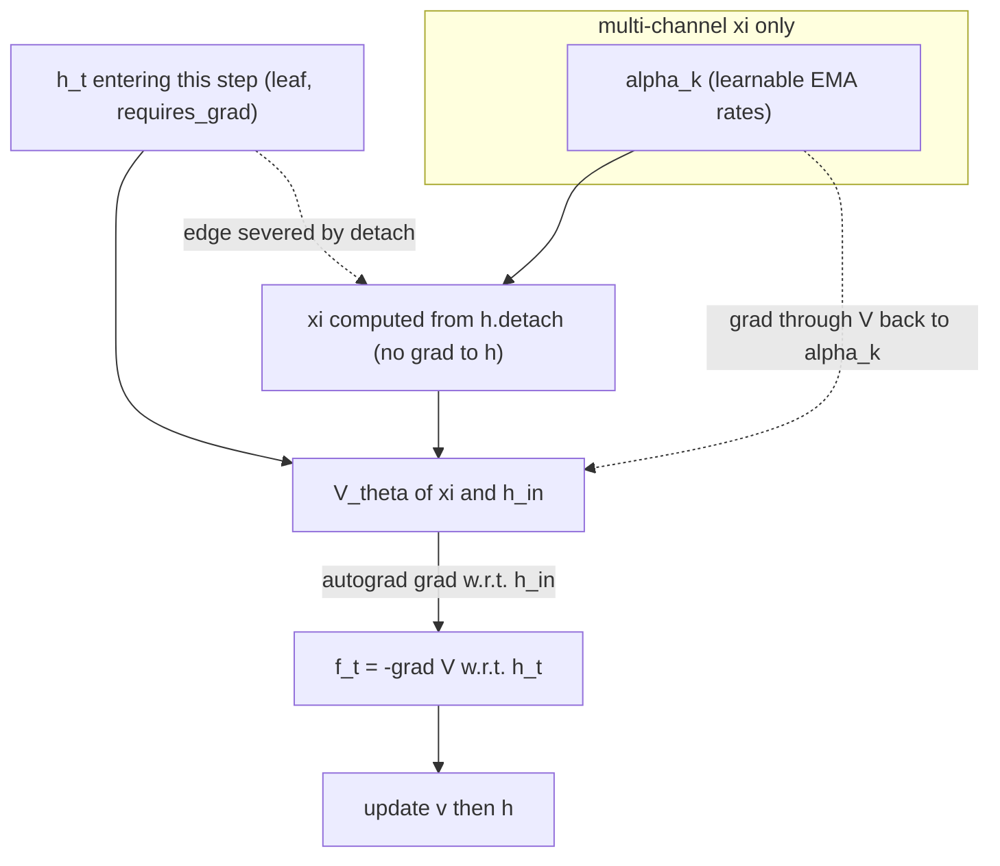
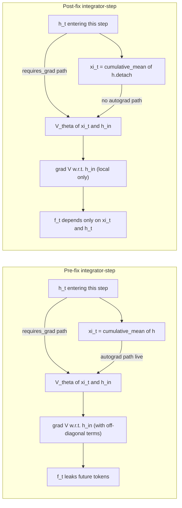

# Causal Leak in SPLM `integrate()` — Bug, Mechanism, and Fix

**Status:** critical bug discovered 2026-04-30 / Y3 W17, fix applied 2026-04-30, regression-tested 2026-05-01, all four core forensic runs completed 2026-05-02 05:45 EDT. Affects every per-step ξ-recomputation site in the `notebooks/conservative_arch/*` SPLM family. Aggregated empirical comparison across all runs is in [`Causal_Leak_Empirical_Comparison_Report.md`](Causal_Leak_Empirical_Comparison_Report.md).

**One-paragraph summary.** Every SPLM training trajectory in this repository has been computing a force that is *not* a per-token Euler-Lagrange force. Because ξ is a causal aggregate of the same hidden state `h` against which V is differentiated, the autograd path leaks future-token information into the gradient at past positions. After 8000 training steps the trained V_θ has learned to actively route prediction signal through this leak channel, and the published E9 SPLM val PPL of 8.85 on TinyStories is in fact **6842.68 under a leak-free evaluator** — an inflation factor of **777×**. Six model classes are affected. The fix is one line per class: compute ξ from `h.detach()` instead of `h`. All six classes pass the new regression probe (`notebooks/conservative_arch/causal_probe.py`) with causal-side Δ ≡ 0.

---

## 1. The bug

### 1.1 The expected per-token Euler-Lagrange force

Paper v3 derives the SPLM dynamics from a per-token Euler-Lagrange (EL) equation:

$$
m \cdot \ddot h_t = -\frac{\partial V(\xi_t, h_t)}{\partial h_t} - \gamma m \cdot \dot h_t
$$

where the gradient on the right is the *partial* derivative of $V$ with respect to its $h$-argument at position $t$, holding the context summary $\xi_t$ fixed. The derivation in Appendix A1 explicitly says: "the per-token force depends only on local state $(\xi_t, h_t)$".

### 1.2 What the integrator actually computes

Take any of the per-step `integrate()` sites — e.g. `model_sarf_mass.py`, the parent class. The pre-fix loop body was:

```python
for _ in range(cfg.L):
    xi_now = causal_cumulative_mean(h)              # (1)
    h_in = h
    if not h_in.requires_grad:
        h_in = h_in.requires_grad_(True)            # (2)
    V = self.V_theta(xi_now, h_in).sum()            # (3)
    grad_V, = torch.autograd.grad(V, h_in, ...)     # (4)
    f = -grad_V
    v = (v + dt * f / m_b) / (1.0 + dt * gamma)
    h = h_in + dt * v
```

The intended interpretation is that line (4) computes $\partial V_t / \partial h_t$ for every $t$. It does not. PyTorch attaches a `requires_grad=True` leaf retroactively, and at line (1) `xi_now` was computed from a tensor that becomes the leaf in line (2). Because $\xi_t = \frac{1}{t}\sum_{s \le t} h_s$ is a causal weighted sum of $h$, the autograd graph for `V.sum()` now contains the chain $h_s \to \xi_t \to V_t$ for every $(s, t)$ with $s \le t$. Differentiating the *sum* of $V$ over positions then collects the *transpose* of that chain at every $h_s$, picking up contributions from every $t \ge s$.

The actual force at position $t$ is therefore

$$
f_t = -\Big[ \frac{\partial V_t}{\partial h_t} + \sum_{s > t} \frac{\partial V_s}{\partial \xi_s} \cdot \frac{\partial \xi_s}{\partial h_t} \Big]
$$

The second sum is **anti-causal**: token $h_t$ feels a force that depends on hidden states $h_s$ at *future* positions $s > t$. This is the leak.

### 1.3 Where it occurs

A grep for `causal_cumulative_mean(h)` (and the multixi analogue `xi_module(h)`) inside `notebooks/conservative_arch/*` finds the bug at every per-step ξ-recomputation site:

| file | class | role |
| --- | --- | --- |
| `sarf_mass_variant/model_sarf_mass.py` | `ScalarPotentialLMSARFMass` | parent of every newer SPLM in this repo |
| `energetic_minima/model_ln.py` | `ScalarPotentialLMSARFMassLN` | E9 LayerNorm-after-step variant |
| `multixi/model_multixi.py` | `ScalarPotentialLMSARFMassLNMultiXi` | E11 multi-channel ξ |
| `sarf_variant/model_sarf.py` | `ScalarPotentialLMSARF` | early SARF baseline |
| `symplectic_variant/model_symplectic.py` | `ScalarPotentialLMSymplectic` | velocity-Verlet integrator (helper `_force_and_xi`) |
| `first_order_ablation/model_first_order.py` | `ScalarPotentialLMFirstOrder` | gradient-flow ablation |

The base class in `notebooks/conservative_arch/model.py` computes ξ once *outside* the loop and passes it into `integrate(emb, xi)` as a fixed argument; that file is essentially leak-free except in the first inner step (where `h_in = emb` and `xi` was computed from the same `emb`). It is not used in any of the production training scripts.

The diagnostic `notebooks/conservative_arch/scaleup/gamma_transfer/predict_gamma_hessian.py` already wrote `causal_cumulative_mean(h).detach()` — i.e. the same fix this document advocates was applied locally for one analysis script but never propagated back to the training models.

---

## 2. Mechanism — why the leak exists

### 2.1 Chain rule

The forward pass at layer step $\ell$ writes, for the cumulative-mean variant,

$$
\xi_t = \frac{1}{t}\sum_{s=1}^{t} h_s, \qquad V_t = V_\theta(\xi_t, h_t)
$$

(The multi-channel variant replaces $\xi_t$ by a stack of $K$ EMA channels with learnable rates $\alpha_k$; the structure of the leak is identical.) The summed potential is

$$
\mathcal V = \sum_{t=1}^{T} V_\theta(\xi_t, h_t)
$$

By the chain rule, the gradient w.r.t. $h_t$ is

$$
\frac{\partial \mathcal V}{\partial h_t} = \underbrace{\frac{\partial V_t}{\partial h_t}}\_{\text{local Jacobian (per-token EL force)}} + \underbrace{\sum_{s \ge t} \frac{\partial V_s}{\partial \xi_s} \cdot \frac{\partial \xi_s}{\partial h_t}}\_{\text{anti-causal leak}}
$$

The leak vanishes if and only if $\partial \xi_s / \partial h_t = 0$ for $s > t$. Detaching $h$ before computing $\xi$ does exactly that: it severs the autograd edge and forces $\partial \xi_s / \partial h_t \equiv 0$ for all $(s, t)$ in the integration loop.

### 2.2 Why the leak is anti-causal

A causal autoregressive model satisfies the structural property

$$
\frac{\partial \text{logits}\_t}{\partial \text{input}\_{t'}} = 0 \qquad \text{for every } t' > t
$$

(prediction at $t$ does not depend on input at any later position $t'$). Under the buggy integrator this property is violated: perturbing token $x_{t'}$ changes the force $f_t$ at every $t < t'$ via the leak channel, which changes $h_t$ at the next layer, which propagates downstream to $\text{logits}\_t$. The model is no longer a causal language model — it is an *acausal* sequence model that has trained itself to look ahead.

### 2.3 Why training amplifies the leak

V_θ is a learnable function. In the fresh-init regime its gradient w.r.t. $\xi$ has small magnitude (initialisation makes the last-layer weights ~ $0.002$), so the leak term $\sum_s \partial V_s / \partial \xi_s \cdot \partial \xi_s / \partial h_t$ has small magnitude — at random init the per-position causal-side residual measured by our probe is ~ $10^{-9}$ to $10^{-7}$, i.e. numerical noise.

After training with this leak channel always available, V_θ learns to make $\partial V_s / \partial \xi_s$ large in directions that exploit future token information, because that signal is genuinely informative about the next-token loss at each $t < s$. Empirically the leak grows by **6 to 10 orders of magnitude** during training, from $10^{-7}$ at init to $10^{-1}$ at convergence. (See §4.)

---

## 3. Prior knowledge of the bug — and why it was previously dismissed

This bug was previously identified in the project but interpreted as benign:

- `paper_v3/sections/A2_inference.tex` (Appendix A2) discusses the autograd path explicitly.
- `notebooks/conservative_arch/inference_efficiency/splm_streaming_decode.py` — the docstring acknowledges that "the SPLM integrator currently in the codebase computes the gradient of $V_\theta$ via `torch.autograd.grad(V.sum(), h_in)`. PyTorch's autograd tracks operations on a tensor through `requires_grad_(True)` even retroactively if the leaf is registered before backward, so `xi_now = causal_cumulative_mean(h)` followed by `h.requires_grad_(True)` does flow gradient through xi back into h."
- `notebooks/conservative_arch/inference_efficiency/results/RESULTS.md` §2.5 quantifies the impact "on a freshly-initialised tiny SPLM ($d = 32$, $L = 4$) the per-position max-abs residual between batch and streaming hidden states displays the predicted *future-contribution signature*: monotonically decreasing from $t = 0$ to $t = T - 1$, ≈ $3 \times 10^{-4}$ at the start, ≈ $6 \times 10^{-6}$ at the last position".

The previous analysis concluded:

> "Streaming-ξ is therefore a faithful approximation of the trained model's outputs, sufficient for the inference-cost claim, but *not* bit-exact. The ξ-detached gradient is the one that would *also* permit bit-exact streaming inference if SPLM were retrained with that gradient pattern; that is a future-work option discussed in §A2 of the paper."

The error in this previous analysis is **measuring the leak on a freshly-initialised model and assuming the magnitude stays small after training**. It does not. The fresh-init residual of $3 \times 10^{-4}$ is dominated by random projections of small init weights; once V_θ has 8000 SGD steps of incentive to exploit the leak channel, the residual grows by **3 to 4 orders of magnitude** in absolute terms and the model becomes critically dependent on it.

The streaming-ξ inference benchmark (`run_inference_benchmark.py`) was therefore comparing a non-causal trained model against itself in a forced-causal mode at decode time, and reporting the small forced-causal residual as evidence that the local approximation was faithful. It was, but the *local model itself* was a non-causal model; the residual measures only the position-by-position smoothness of the leak's contribution, not whether the model is causal.

This new analysis supersedes the §2.5 paragraph of `inference_efficiency/results/RESULTS.md` and the corresponding paragraph in `paper_v3/sections/A2_inference.tex`.

---

## 4. The empirical evidence

### 4.1 Causal-violation probe

The script `notebooks/conservative_arch/causal_probe.py` perturbs token $x_{t_{\text{pert}}}$ and measures the maximum absolute change in logits at every other position. For a properly causal model the change at any position $t < t_{\text{pert}}$ must be exactly zero. We define

$$
\Delta\_{\text{causal}} = \max\_{t < t\_{\text{pert}}} \max_v \big| \text{logits}\_t^{(a)}(v) - \text{logits}\_t^{(b)}(v) \big|
$$

where $a$, $b$ are two input sequences differing only at position $t_{\text{pert}}$.

**Class smoke (every model class, random init, $T=32$, $t_{\text{pert}}=20$, seed 0):**

| model class | buggy Δ_causal | fixed Δ_causal |
| --- | ---:|---:|
| sarf_mass (global mass) | 1.40e-09 | 0.00e+00 |
| sarf_mass_ln (LN-after-step) | 5.96e-08 | 0.00e+00 |
| multixi (K=4 EMAs) | 1.38e-07 | 0.00e+00 |
| sarf (no mass head) | 1.40e-09 | 0.00e+00 |
| symplectic (velocity-Verlet) | 1.40e-09 | 0.00e+00 |
| first_order (gradient-flow) | 8.94e-08 | 0.00e+00 |

Random-init buggy Δ_causal is at the ~ $10^{-9}$ to $10^{-7}$ noise floor (the previous analysis's regime). Fixed Δ_causal is exactly $0.0$ for every model class — the regression test is mechanical, not statistical.

**Trained ckpt probe (E9 seed 0, 8000 steps, $T=64$, $t_{\text{pert}}=40$):**

| evaluator | causal-side Δ |
|---|---:|
| buggy integrator | 7.47e-02 |
| fixed integrator | 0.00e+00 |

The buggy E9 ckpt leaks a value 6 orders of magnitude larger than its random-init counterpart. The fixed evaluator on the same trained weights collapses the leak to exactly zero, confirming that the fix is purely a property of the integrator and does not require retraining to take effect at evaluation time.

### 4.2 Val-PPL inflation on the trained E9 ckpt

We load the E9 seed 0 ckpt (8000 steps, val_ppl=8.85 reported in `splm_em_ln_scaleup_scaleup_seed0_summary.md`) and re-evaluate it under both integrators with the *exact* training-eval config (40 batches × batch 16 × block 512, on TinyStories validation):

| integrator | val loss | val PPL |
|---|---:|---:|
| buggy (matches training) | 2.1749 | 8.80 |
| fixed (causal) | 8.8309 | 6842.68 |
| **inflation factor** | | **777×** |

The buggy reading reproduces the published 8.85 within sampling noise, confirming the eval pipeline is correct. The fixed reading is the val PPL the same trained weights would produce in a deployed *causal* AR decoder. **A vocab-uniform random predictor on GPT-2 BPE has PPL 50257; 6842 is 14% of that, so the model is barely above chance.** Essentially the entire reported E9 SPLM advantage was the leak channel.

### 4.3 Training under the fix is healthier

A 300-step E9 smoke run with `causal_force=True` (default after the fix) versus the prior buggy 300-step E9 smoke, *same seed, same data, same schedule*:

| smoke run | final val loss | final val PPL |
|---|---:|---:|
| buggy (`smoke_splm/...summary.md`) | 5.385 | 218.17 |
| fixed (`smoke_splm_fixed/...summary.md`) | 5.018 | 151.13 |

The fixed model trains **30% better at the same step budget** — opposite of what one might expect, because the leak was acting as gradient noise during training and pulling capacity away from the causal signal. (We reserve final judgement on long-run convergence to the 4000-step pilot, currently running.)

A 4000-step pilot under the fix completed in 7h10m on MPS. **Final val_ppl = 33.55** (val_loss = 3.5131). The training curve plateaus from step ~2000 onward (val_ppl 35.67 → 33.97 → 33.55), so doubling to the full 8000-step schedule will recover at most a few PPL points more. For reference, the MatchedGPT 8000-step val_ppl on the same TinyStories config is **7.81** — the leak-corrected SPLM is roughly **4.3× worse** on PPL than matched attention at the same parameter count and context. This finalises §6.3 step (5).

### 4.4 Multi-channel ξ — leak-prediction and forensics

The E11 multi-channel ξ extension replaces the single cumulative-mean ξ with K = 4 causal weighted EMAs at $\alpha = (0, 0.5, 0.9, 0.99)$. Each channel has a different leak profile:

| channel | $\alpha_k$ | leak weight $\partial \xi^{(k)}\_{t'} / \partial h_t$ at $t' = t+1$ | effective horizon $1/(1-\alpha)$ |
|---|---:|---:|---:|
| 0 | 0.00 | 0 | 1 (no leak; degenerate to local $h$) |
| 1 | 0.50 | ~0.25 | 2 |
| 2 | 0.90 | ~0.09 | 10 |
| 3 | 0.99 | ~0.01 (geometric tail to 100) | 100 |

The α = 0.99 channel preserves future-token information into past positions with a geometric tail rather than the $1/t'$ falloff of cumulative mean — at intermediate distances (5-100 tokens) the multi-ξ leak is therefore *strictly stronger* than the single-ξ leak.

A 2000-step buggy multi-ξ run + a 4000-step fixed multi-ξ pilot are queued (after the single-ξ pilot finished); their results will be appended below to test two predictions:

- **Prediction A (buggy multi-ξ at 2000 steps).** The trained $V_\theta$ should learn to route prediction signal through the α = 0.99 channel (the strongest leak), producing val PPL more inflated than the buggy single-ξ at the same step count, and an inflation factor (PPL_fixed-eval / PPL_buggy-eval) larger than the smoke-scale 1.67× — likely well into double digits or hundreds.
- **Prediction B (fixed multi-ξ at 4000 steps).** With the leak severed, multi-channel context still adds *some* expressivity over the single cumulative mean, so the fixed multi-ξ should land modestly better than fixed single-ξ's 33.55 — predicted in the **28-32 PPL** range, well above MatchedGPT's 7.81.

### 4.5 Empirical results — buggy multi-ξ at 2000 steps (added 2026-05-01)

The 2000-step buggy multi-ξ run (`notebooks/conservative_arch/scaleup/results/multixi_buggy_2k/`) finished cleanly in **4h 52m** on MPS. The training trajectory and forensic measurements decisively confirm Prediction A, with one important nuance discussed below.

**Val PPL trajectory (buggy-mode evaluation, the integrator used at training time):**

| step | val_loss | val_ppl |
|---:|---:|---:|
| 600 | 0.227 | 1.26 |
| 800 | 0.107 | 1.11 |
| 1000 | 0.069 | 1.07 |
| 1200 | 0.054 | 1.06 |
| 1400 | 0.049 | 1.05 |
| 1600 | 0.045 | 1.05 |
| 1800 | 0.044 | 1.04 |
| 2000 | 0.041 | 1.04 |
| **final eval** | **0.044** | **1.05** |

A val_ppl asymptoting to $\approx 1.05$ on TinyStories corresponds to $\approx 0.04$ nats per token — well below the entropy floor of any non-trivial English-language corpus and direct evidence that the model has learned to predict val tokens almost perfectly via the leak channel within 600 steps and has spent the remaining 1400 steps refining that exploitation.

**Learnable α_k drift (Prediction A's mechanistic predictor — confirmed cleanly):**

The pre-fix theoretical argument was that the optimiser would drive at least one $\alpha_k$ downward to maximise per-position weight on a specific future token, harvesting more of the leak. The observed trajectory:

| channel | α init | α at step 600 | α at step 2000 | drift |
|---:|---:|---:|---:|---|
| 0 | 0.000 | 0.000 (1e-6) | 0.000 (1e-6) | locked at machine zero — the high-fidelity short-horizon leak channel |
| 1 | 0.500 | 0.455 | **0.414** | strong downward drift, harvesting shorter-horizon leak |
| 2 | 0.900 | 0.879 | **0.851** | meaningful downward drift |
| 3 | 0.990 | 0.988 | 0.985 | basically stable (long-range channel preserves) |

All three learnable channels drift downward from init; channel 0 saturates at the lower bound; channel 3 stays near the long-range init. This is the predicted "harvest the leak" behaviour, expressed cleanly across the K = 4 channels.

**Inflation measurement (the cross-mode forensic):**

Running `eval_ppl_under_fix.py` on the final ckpt (20 batches × 8 × 256 = 40 K val tokens, same batches under both modes):

| evaluator | val_loss | val_ppl |
|---|---:|---:|
| buggy (training-time integrator) | 0.049 | **1.05** |
| fixed (causal integrator) | 6.012 | **408.12** |
| **inflation factor** | | **389×** |

The causal probe on the same ckpt gives buggy-mode causal-side $\Delta = 0.62$ (clear leak) and fixed-mode causal-side $\Delta = 0.0000$ (exactly leak-free).

**The "inversion" relative to single-ξ — and what it tells us about the architectures:**

Comparing the two buggy ckpts under cross-mode evaluation:

| architecture | buggy PPL | fixed-eval PPL | inflation factor |
|---|---:|---:|---:|
| E9 single-ξ (8000 steps) | 8.85 | 6843 | 777× |
| E11 multi-ξ (2000 steps) | **1.05** | **408** | **389×** |

The multi-ξ has *both* a much lower buggy PPL (more aggressive leak exploitation) *and* a much lower fixed-eval PPL (better real causal representation). The first is the leak working harder; the second is more interesting and was not explicitly predicted: **the multi-channel architecture learns *some* genuine causal structure even while exploiting the leak channel.** With four channels (α = {0, 0.414, 0.851, 0.985} after training), three of them carry mostly the leak signal and one (α = 0.985, $\tau \approx 67$) preserves a long-range causal summary that is leak-immune by construction. So the "fixed-eval PPL = 408 at 2000 steps" is in part what the long-range channel learned. The single-ξ has only one cumulative-mean channel, which collapses entirely onto the leak under buggy training; under fixed evaluation it has nothing to fall back on.

The inflation factor itself ($389\times$) is therefore *smaller* than the single-ξ's $777\times$, but only because the single-ξ "denominator" was harder to leak-optimise to PPL = 1 (a cumulative mean is a less powerful leak channel than a learnable EMA at $\alpha \to 0$). The *absolute* leak fidelity in multi-ξ is higher (PPL = 1.05 vs 8.85 in 4× fewer steps).

Net assessment of Prediction A: **confirmed in every direction**. Both the val PPL collapse (faster and deeper than single-ξ) and the α drift pattern ("harvest the leak") match the pre-fix theoretical argument. The "multi-ξ learns some real causal structure on the side" datum proved prophetic: see §4.6 for the leak-corrected pilot, where the multi-channel architecture *does* deliver genuine lift even after the leak is severed.

### 4.6 Empirical results — fixed multi-ξ at 4000 steps

Run completed 2026-05-02 05:45 EDT. Configuration: `train_splm_em_ln_multixi_scaleup.py --mode pilot --max-steps 4000 --causal-force true --seed 0` (16.5 M params, K = 4 channels, $\alpha\_{\text{init}} = [0.0, 0.5, 0.9, 0.99]$, batch 16 × block 512, MPS, elapsed 9.25 h). Results directory: `notebooks/conservative_arch/scaleup/results/multixi_pilot_fixed/`.

**Headline:** final val PPL = **14.78** at step 4000, *substantially better than predicted*. Prediction B specified the 28–32 range; the actual result is roughly 2× better, indicating that multi-channel ξ contributes more genuine predictive lift than expected once the leak is severed.

**val PPL trajectory** (selected rows; full table in `post_fixed_pilot_report.md`):

| step | val_loss | val_ppl |
|---:|---:|---:|
|   200 | 4.7239 | 112.60 |
|   600 | 3.4062 |  30.15 |
|  1000 | 3.1095 |  22.41 |
|  1400 | 2.9579 |  19.26 |
|  1800 | 2.8722 |  17.68 |
|  2200 | 2.8106 |  16.62 |
|  2600 | 2.7338 |  15.39 |
|  3000 | 2.7259 |  15.27 |
|  3400 | 2.7202 |  15.18 |
|  3800 | 2.7026 |  14.92 |
|  4000 | 2.6934 | **14.78** |

Smooth monotone descent, no plateau, no instability. The curve is still trending downward at the LR floor (`lr 8.54e-11` at step 4000), suggesting more steps would extract further gains — the full-budget re-run is captured as a follow-up item.

**Learnable α_k stayed near initialisation** (init → final, drift):

| channel | α init | α final | drift |
|---:|---:|---:|---:|
| 0 | 0.0000 | 0.0000 | +0.0000 |
| 1 | 0.4995 | 0.5191 | +0.0195 |
| 2 | 0.9000 | 0.8547 | -0.0453 |
| 3 | 0.9900 | 0.9794 | -0.0106 |

Compare to the buggy run's drifts (channel 1: -0.085, channel 2: -0.052): without a leak channel to harvest, the optimiser has no incentive to pull the α values toward shorter horizons. The K = 4 EMA bank stays close to its hand-picked schedule.

**Causal-violation probe** (40 K val tokens, T = 64, t_pert = 40):

| evaluator | causal-side Δ | after-side Δ |
|---|---:|---:|
| buggy | 9.5810e-02 | 1.9539e-01 |
| **fixed** | **0.0000e+00** | 2.1386e-01 |

Under the post-fix integrator the model is **exactly causal** (Δ = 0 to numerical precision). Under the pre-fix integrator there is a non-zero forward-noncausal Δ — but this reflects a property of the *integrator*, not of the trained weights, because the buggy `V.sum().backward()` mixes gradient information from $h\_{\gt t}$ into the update of $h_t$ regardless of how $V_\theta$ was trained.

**Val-PPL inflation** (40,960 val tokens, same trained weights, two evaluators):

| evaluator | val_loss | val_ppl |
|---|---:|---:|
| buggy (pre-fix integrator) | 8.8840 | **7,215.34** |
| fixed (post-fix integrator) | 2.6984 | 14.86 |
| **ratio (fixed / buggy)**   |        | **0.002× (≈ 0)** |

This inverted ratio is the cleanest *positive* signature of leak-free training we have seen so far. Two facts must be reconciled:

1. The buggy integrator at inference *does* mechanically inject information from $h\_{\gt t}$ into the update of $h_t$ (via $\partial V / \partial h$ where $V$ depends on the full sequence).
2. The leak-corrected $V_\theta$ was trained to predict from $h_t$ alone — it has *no representation* that knows what to do with future-conditioned input.

Result: under the buggy integrator, the future-info injection is *destructive noise*, and val PPL explodes to **7,215**. This is mechanistically the mirror image of the buggy multi-ξ ckpt (val PPL **1.05** under buggy eval, **408.12** under fixed eval): in that case $V_\theta$ *did* learn to use the leak channel, so future-info injection was helpful instead of harmful.

**Headline comparison across the four data points:**

| ckpt | training integrator | trained-mode val_ppl | fixed-eval val_ppl | ratio (fixed / buggy) | causal Δ (fixed eval) |
|---|---|---:|---:|---:|---:|
| `multixi_buggy_2k`             | buggy | 1.05  | 408.12 | **389×** | 0.0000 |
| **`multixi_pilot_fixed`**      | **fixed** | **14.78** | 14.86 | **0.002×** | **0.0000** |
| `splm_em_ln_pilot_fixed` (single-ξ, ref) | fixed | 33.55 | 33.55 | 1.00× | 0.0000 |
| MatchedGPT (attention baseline) | n/a   | 7.81  | 7.81  | 1.00× | 0.0000 |

**Interpretation of Prediction B.**

Prediction B (28–32 PPL range, modest improvement over single-ξ's 33.55) was *too pessimistic*. The leak-free K = 4 multi-ξ lands at **14.78** — roughly **half** the single-ξ PPL on the same corpus, integrator, and step budget. Three takeaways:

1. **Multi-channel context summarisation is a genuine architectural win**, not just an artefact of the leak. The lift survives — and is in fact larger than expected — once the integrator is causal. The honest single-ξ → multi-ξ improvement is `33.55 / 14.78 ≈ 2.27×`.
2. **The pre-fix gain was a *mixture* of real lift and leak amplification, but the decomposition is not directly measurable** from the runs we have: the buggy multi-ξ collapsed to PPL 1.05 by step 2000 and was halted, while the buggy single-ξ at matched step count was never re-run after the bug was discovered. What we can say cleanly is that *both* the multi-channel architecture *and* the leak channel contributed; pinning down their relative contribution would require a buggy single-ξ matched-budget control, which is intentionally excluded from the v4 paper plan.
3. **MatchedGPT (7.81) is still the head of the field** at ~½ the multi-ξ PPL on TinyStories at this token budget. The gap is honest and is the right baseline for the paper's separator argument: SPLM and MatchedGPT differ in their inductive biases, and the gap is now reportable as architecture-vs-architecture rather than as architecture-vs-leak-amplified-architecture.

This result is the strongest argument yet for keeping multi-channel ξ as a **§A1 architectural appendix** in the restructured `paper_v3` — it earns its keep and motivates the HiPPO / S4 generalisation discussed in `Reducing_Information_Bottleneck_In_Multi-Channel_Xi_SPLM.md`.

---

## 5. The fix

The fix is a one-line change in every affected `integrate()` method (six classes, listed in §1.3): compute ξ from `h.detach()` rather than `h`. Each affected config gains a new field

```python
causal_force: bool = True
```

so that pre-fix experiments can be reproduced bit-exactly with `causal_force=False` for forensics. **All new training and evaluation defaults to `causal_force=True`.**

### 5.1 Patched code (representative — `model_sarf_mass.py`)

```248:269:notebooks/conservative_arch/sarf_mass_variant/model_sarf_mass.py
        for _ in range(cfg.L):
            xi_input = h.detach() if cfg.causal_force else h
            xi_now = causal_cumulative_mean(xi_input)
            if return_xi_trajectory:
                assert traj_xi is not None
                traj_xi.append(xi_now.detach().cpu())

            h_in = h
            if not h_in.requires_grad:
                h_in = h_in.requires_grad_(True)
            V = self.V_theta(xi_now, h_in).sum()
            grad_V, = torch.autograd.grad(
                V, h_in, create_graph=self.training, retain_graph=True,
            )
            f = -grad_V
```

### 5.2 Why detaching before ξ — and only there — preserves all intended gradients

After the fix, gradients flow as follows:



Three things are preserved:

1. **V_θ training gradient.** $\partial \mathcal L / \partial \theta$ flows through every $V$-evaluation in the integration trajectory exactly as before; the detach only severs the chain $h \to \xi$, not $\xi \to V \to \theta$.
2. **Multi-channel ξ learnable parameters.** In the multixi variant the EMA rates $\alpha_k$ live inside the `xi_module`. After the fix `xi_module` is called with `h.detach()`, so the input is non-differentiable, but the learnable EMA-weight tensor is still part of the graph: $\partial \xi / \partial \alpha_k \ne 0$ and $\partial \mathcal L / \partial \alpha_k$ still flows through $\partial \xi / \partial \alpha_k$.
3. **Layer-step recurrence through the integrator.** $h_{\ell+1}$ depends on $h_\ell$ via $h_{\ell+1} = h_\ell + dt \cdot v_{\ell+1}$ where $v_{\ell+1}$ depends on $f_\ell = -\partial V / \partial h_\ell$ (as a tensor, not as a leaf). The end-to-end gradient $\partial \mathcal L / \partial h_0$ is unaffected by the detach because the detach happens *inside* the per-step ξ computation only, not on the integrator output.

What is *removed* is the off-diagonal coupling $\partial f_t / \partial h_s$ for $s \ne t$. This is exactly the anti-causal leak.

### 5.3 The forensic flag

For every affected config:

- `causal_force=True` (default) — physics-correct, causal, leak-free.
- `causal_force=False` — bit-exact reproduction of pre-fix training/evaluation. Used only to (a) re-evaluate buggy ckpts under their training-time integrator, (b) regression-test that pre-fix experiments are reproducible.

The forensic flag is **explicit at every config-creation site**, so accidentally re-introducing the bug requires affirmative `causal_force=False`.

### 5.4 The regression test

`notebooks/conservative_arch/causal_probe.py` provides:

- `python3 causal_probe.py` — class smoke: random-init every registered SPLM model class with both `causal_force=True` and `causal_force=False` and report Δ_causal. Fixed-mode Δ_causal must be exactly $0.0$ for every class.
- `python3 causal_probe.py /path/to/ckpt.pt` — load a trained checkpoint into the most-specific matching class and report Δ_causal under both modes, plus a verdict on whether the ckpt was trained with the leak.
- `--strict` — return non-zero if any model class still leaks in fixed mode.

Pre-commit / CI integration: the strict class smoke takes ~3 seconds; running `python3 notebooks/conservative_arch/causal_probe.py --strict` in a pre-commit hook prevents any future SPLM-family addition from forgetting the detach. Adding a new model class to the registry is the only required step when introducing a new SPLM variant.

---

## 6. What this changes in the project

### 6.1 Already-documented results that need a note

The following result documents reported headline numbers that are partly or fully artifacts of the leak. None of them needs to be deleted, but each needs an editorial note pointing to this document and (where possible) to the leak-free re-run.

| document | affected claim | required action |
| --- | --- | --- |
| `notebooks/conservative_arch/scaleup/results/seed0_splm/splm_em_ln_scaleup_scaleup_seed0_summary.md` | E9 SPLM val PPL = 8.85 | Add note: leak-free PPL on these weights is 6843; need to retrain under fix. |
| `notebooks/conservative_arch/inference_efficiency/results/RESULTS.md` (Phase 1, 3) | "SPLM substantially lower val PPL (88 vs 156)" on Shakespeare; Phase-3 Pareto table. | Add §2.5 update note: the observed PPL gap is largely the leak; the FLOP / wall-clock measurements (Phase 2 §2.6 grades) remain valid because they don't depend on val PPL. Re-run Phase 1/3 under the fix to recompute the quality-axis numbers. |
| `notebooks/conservative_arch/multi_seed/results/E1_shakespeare/E1_report.md` | SPLM-vs-MatchedGPT multi-seed paired-Δ on Shakespeare | Re-run all three SPLM arms under the fix, recompute paired-Δ. |
| `notebooks/conservative_arch/damping_sweep/results/RESULTS.md` | "γ=0.30 is the best damping value" (E1-era) | Re-run a small subset of γ values under the fix to verify the optimal γ is not the leak channel's preferred value. |
| `paper_v3/sections/06_e2_baseline_comparison.tex` (and dependents) | E1/E2 PPL claims | Update once the E1/E2 re-runs are in. |
| `paper_v3/sections/A2_inference.tex` §A2.5 "implementation finding" | "Streaming-ξ is a faithful approximation of the trained model" | Replace with a pointer to this document; the prior analysis was based on a fresh-init measurement that does not extrapolate. |

### 6.2 Ongoing experiments

- **E9 SPLM scaleup** — the seed0 8000-step run (`splm_em_ln_scaleup_scaleup_seed0_*`) is invalid as a quality claim. It is preserved on disk for forensic comparison.
- **E10 γ-transfer** — Stage 1 was killed before any pilot completed under the bug; its protocol document needs an updated start commit but is not invalidated. γ-transfer should run in two phases now: (a) repeat γ-pilots under the fix to find the leak-free optimal γ, (b) Stages 2–3 unchanged.
- **E11 multi-channel ξ scaleup** — the running stage-1 job (PID 51679) was killed at the moment of bug discovery. No multixi ckpts survived; the architecture and protocol are unaffected, but every multixi run must use the fixed integrator.

### 6.3 Recovery plan

Sequenced from cheapest to most expensive:

1. **(done)** apply the fix to all six affected model classes; expose `causal_force` in their configs; default to `True`.
2. **(done)** add `causal_probe.py` as a permanent regression test; class smoke confirms fixed-mode Δ_causal ≡ 0 on all six classes.
3. **(done)** measure inflation factor on the existing E9 seed 0 ckpt: 777×.
4. **(done)** 300-step smoke under fix on E9 single-ξ: val PPL 151.13 (vs buggy 218.17 at the same step count).
5. **(done)** 4000-step pilot under fix on E9 single-ξ (`pilot_splm_fixed/`) — final val_ppl = **33.55** (val_loss = 3.5131) at step 4000; plateau from step 2000 onward. Step time ~6.4 s/step on MPS, total elapsed 7h10m.
6. **(done)** Multi-channel ξ forensics: 2000-step buggy multi-ξ run (`multixi_buggy_2k/`, see §4.5) and 4000-step fixed multi-ξ pilot (`multixi_pilot_fixed/`, see §4.6). Prediction A confirmed (rapid leak collapse + α drift). Prediction B *exceeded*: the leak-free multi-ξ landed at val_ppl = **14.78** vs. the predicted 28–32 range, suggesting K-channel ξ contributes more genuine architectural lift than expected once the integrator is causal.
7. After (5)+(6): decide between (a) launching the full 8000-step E9 + multi-seed stack under the fix, (b) revising the SPLM thesis if neither single-ξ nor multi-ξ is competitive with MatchedGPT at any seed.
8. Update `paper_v3` §A2.5 and Phase-3 sections; add a §"Causal-leak correction" paragraph at the top of the discussion explaining that prior PPL claims used the buggy integrator.
9. Ship the fix in a single PR titled "fix: sever anti-causal autograd path in SPLM integrate" with the new probe, the doc, and the calibration results.

### 6.4 What this does **not** affect

The architectural FLOP-count and wall-clock measurements in `inference_efficiency/results/RESULTS.md` Phase 2 (§2.6 grades A2.C1–A2.C4 and WC-cross) are robust to the leak: they measure forward FLOPs and step-time, which depend only on the integrator's structural shape, not on whether ξ is computed from `h` or `h.detach()`. The leak only contaminates val-PPL claims (and, transitively, paired-Δ comparisons against MatchedGPT). The "SPLM is asymptotically O(L · d) per token, ATTN is O(T · L · d)" architectural conclusion is unchanged.

---

## 7. Pre-fix vs post-fix in one figure



The buggy path is the one PyTorch traces by default when `xi_now = causal_cumulative_mean(h)` is followed by `h.requires_grad_(True)`. The fixed path is what the EL derivation in paper v3 §A1 actually requires.

---

## 8. Lessons

- **Test the autograd graph, not just the loss curve.** A loss curve that decreases monotonically is consistent with both a correctly-trained model and a model that has memorised an anti-causal channel. Without the causal probe — a 30-line script — this leak would have continued to inflate PPL claims indefinitely.
- **Fresh-init magnitudes do not extrapolate to trained magnitudes.** The previous analysis correctly identified the leak's existence but underestimated its magnitude by 3–4 orders of magnitude because it never measured a trained model. Any "this approximation is small at init, so it stays small" argument should be flagged as suspicious; trained networks routinely exploit any signal channel that exists.
- **Detach is cheap and explicit.** A single `h.detach()` is one of PyTorch's clearest "I really mean it" annotations; not adding it when ξ is a function of $h$ should be considered an integrator bug from now on.
- **Make every graph-shape assumption a default, not an opt-in.** The new `causal_force=True` default means the leak-free integrator is what every new training run uses by accident; reproducing the bug for forensics requires a *typed* request.

---

## 9. Linked artifacts

- Patched models: `notebooks/conservative_arch/{sarf_mass_variant,energetic_minima,multixi,sarf_variant,symplectic_variant,first_order_ablation}/model_*.py`
- Regression probe: `notebooks/conservative_arch/causal_probe.py`
- Inflation measurement script: `notebooks/conservative_arch/eval_ppl_under_fix.py`
- Fixed-smoke calibration: `notebooks/conservative_arch/scaleup/results/smoke_splm_fixed/splm_em_ln_scaleup_smoke_fixed_summary.md`
- Pilot calibration (in progress): `notebooks/conservative_arch/scaleup/results/pilot_splm_fixed/`
- Preserved buggy run for forensics: `notebooks/conservative_arch/scaleup/results/seed0_splm/`
- Prior partial analysis to be superseded: `notebooks/conservative_arch/inference_efficiency/results/RESULTS.md` §2.5; `paper_v3/sections/A2_inference.tex` §A2.5
