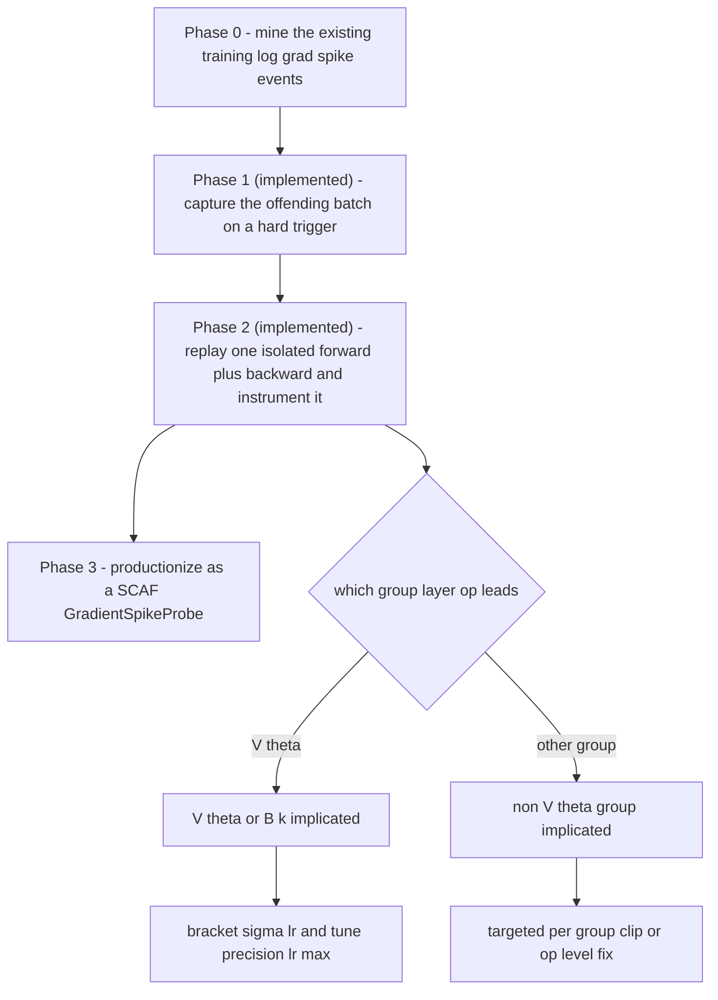
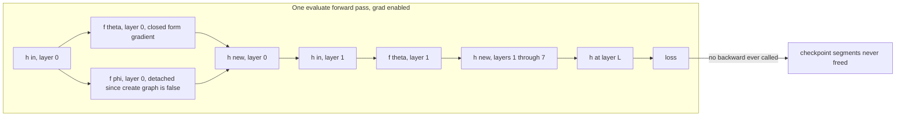
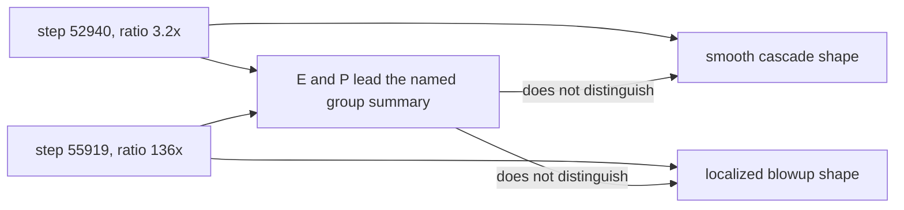

# CfC/BAOAB Propagator and Stiffness Mitigations for Fock-PARFLM with Structured $V_{\theta}$

Companion to `Training_Instabilities_in_Fock-PARFLM_with_structured_V_theta.md`.
This note collects the CfC/BAOAB-integrator analysis, the empirical
depth-code and curvature findings observed under CfC/BAOAB, and the proposed
(deferred) plus forward-looking stiffness mitigations. It was split out of the
parent note (which had grown past 4,700 lines) purely for maintainability; the
§24-§28 content below is unchanged from the parent's former sections of the
same numbers.

**Section numbering.** Sections keep their original numbers from the parent
document (§24 onward) so that every existing cross-reference stays valid.
Cross-references to §1-§23 refer to the parent note
`Training_Instabilities_in_Fock-PARFLM_with_structured_V_theta.md`; both files
live in the same `companion_notes/` folder.

## Table of Contents

24. [BAOAB + CfC Propagator: Eliminating the Force Cascade at Source](#24-baoab--cfc-propagator-eliminating-the-force-cascade-at-source)
25. [Late-Training Spike Emergence: The Cascade is Universal, Not Depth-Specific](#25-late-training-spike-emergence-the-cascade-is-universal-not-depth-specific)
26. [The Damping Hypothesis: Is Low γ the Dominant Cause of the Cascade?](#26-the-damping-hypothesis-is-low-γ-the-dominant-cause-of-the-cascade)
27. [Empirical Depth-Code Growth: Boundary Layers Dominate in Both Integrators](#27-empirical-depth-code-growth-boundary-layers-dominate-in-both-integrators)
28. [Proposed (Deferred) Mitigation: Clamping the Low-Rank Precision Factor $B_k$](#28-proposed-deferred-mitigation-clamping-the-low-rank-precision-factor-b_k)
29. [Principled Directions Beyond the $B_k$ Clamp](#29-principled-directions-beyond-the-b_k-clamp)
30. [Concrete Sketch: The Low-Rank Exponential Substep](#30-concrete-sketch-the-low-rank-exponential-substep)
31. [SCAF Phase 7b/7c Audit Plan for Tuning precision_lr_max (L=16, and now L=8)](#31-scaf-phase-7b7c-audit-plan-for-tuning-precision_lr_max-l16-and-now-l8)
32. [L=8 baoab_cfc Baseline: Extended Trajectory and the Decision to Switch Mid-Run](#32-l8-baoab_cfc-baseline-extended-trajectory-steps-2700039867-and-the-decision-to-switch-mid-run)
33. [The Bracketing Result Is Modest and Non-Escalating: $B_k$ Is Not the Primary Driver, and a Root-Cause Workflow for the Non-$V_\theta$ Spikes](#33-the-bracketing-result-is-modest-and-non-escalating-b_k-is-not-the-primary-driver-and-a-root-cause-workflow-for-the-non-v_theta-spikes)
34. [`baoab_cfc_lowrank` at L=8 Scale: Correct and Stable, but Not Production-Feasible](#34-baoab_cfc_lowrank-at-l8-scale-correct-and-stable-but-not-production-feasible)
35. [Phase 1/2 Validated: First `replay_spike_batch` Result (Step 37,763) and a Clean Cascade Signature](#35-phase-12-validated-first-replay_spike_batch-result-step-37763-and-a-clean-cascade-signature)
36. [Decoupling Spike Capture from the Reload Trigger: the Plateau, Not Just the Rare Crisis, Is the Real Target](#36-decoupling-spike-capture-from-the-reload-trigger-the-plateau-not-just-the-rare-crisis-is-the-real-target)
37. [Making Cell 6 Resumable In-Place, and Extracting `grad_clip_utils.py`](#37-making-cell-6-resumable-in-place-and-extracting-grad_clip_utilspy)
38. [Seven Replays In: Two Distinct Failure Modes, Not One -- and Only the Localized One Has Crossed 500](#38-seven-replays-in-two-distinct-failure-modes-not-one----and-only-the-localized-one-has-crossed-500)
39. [The Token-Minority Conjecture Is Falsified Twice Over: the Localized Mode Is Batch-Wide, Not Batch-Specific](#39-the-token-minority-conjecture-is-falsified-twice-over-the-localized-mode-is-batch-wide-not-batch-specific)
40. [Does `baoab_cfc_lowrank` Address the Localized Mode? Reconciling §33's Verdict, and a Targeted Ablation Test](#40-does-baoab_cfc_lowrank-address-the-localized-mode-reconciling-33s-verdict-and-a-targeted-ablation-test)
41. [Chronic, Not Transient: Three New Replays Refine §33 and §38, and Motivate Turning On `precision_lr_max`](#41-chronic-not-transient-three-new-replays-refine-33-and-38-and-motivate-turning-on-precision_lr_max)
42. [Step 1 Validated: `precision_lr_max` and `baoab_cfc_lowrank` Both Collapse All Three Replays, a Hook Bug and a Checkpoint-Loading Pitfall Found Along the Way, and the Cap Switched On](#42-step-1-validated-precision_lr_max-and-baoab_cfc_lowrank-both-collapse-all-three-replays-a-hook-bug-and-a-checkpoint-loading-pitfall-found-along-the-way-and-the-cap-switched-on)
43. [Four Repeats of the Same Eval-Time OOM at Step 47,500: `gc.collect()` Was Never Going to Fix It, and Why](#43-four-repeats-of-the-same-eval-time-oom-at-step-47500-gccollect-was-never-going-to-fix-it-and-why)
44. [Two Near-Trigger E/P-Led Replays: Layer-Profile Shape, Not Group Identity, Discriminates the Mechanisms, and the §39 Anti-Correlation Extends to This Regime](#44-two-near-trigger-ep-led-replays-layer-profile-shape-not-group-identity-discriminates-the-mechanisms-and-the-39-anti-correlation-extends-to-this-regime)
45. [A `precision_lr_max`-Style Clip Ablation Doesn't Make Sense, and `replay_clip_ablation` Tests the Question That Does: Clip Order](#45-a-precision_lr_max-style-clip-ablation-doesnt-make-sense-and-replay_clip_ablation-tests-the-question-that-does-clip-order)
46. [A Checkpoint-Recompute Divergence Took Down the Whole Session: 4,252 Steps Lost, and a Wall-Clock Autosave Added](#46-a-checkpoint-recompute-divergence-took-down-the-whole-session-4252-steps-lost-and-a-wall-clock-autosave-added)
47. [First Production Validation of `clip_then_sum` (§45.4): Plateau Broken, No New Spikes Through Step 61,650](#47-first-production-validation-of-clip_then_sum-454-plateau-broken-no-new-spikes-through-step-61650)
48. [`replay_spike_batch` Predates `clip_then_sum`: a Diagnostic Fidelity Bug, Found and Fixed, and What the Corrected Replays of Steps 70522, 71194, and 71703 Show](#48-replay_spike_batch-predates-clip_then_sum-a-diagnostic-fidelity-bug-found-and-fixed-and-what-the-corrected-replays-of-steps-70522-71194-and-71703-show)
49. [The `log_tau` Runaway: One Register's Temperature Is Diverging From the Pool, and Two Falsified Predictions on the Way to Finding It](#49-the-log_tau-runaway-one-registers-temperature-is-diverging-from-the-pool-and-two-falsified-predictions-on-the-way-to-finding-it)
50. [Does QK-Normalisation Actually Break the Runaway? A Gradient-Flow Analysis of the Creation Gate's Temperature](#50-does-qk-normalisation-actually-break-the-runaway-a-gradient-flow-analysis-of-the-creation-gates-temperature)
51. [Most of the Measured `log_tau` Drift Was Weight Decay on a Log-Parameterised Temperature](#51-most-of-the-measured-log_tau-drift-was-weight-decay-on-a-log-parameterised-temperature)
52. [Curvature Geometry Instruments, and a Plan for Splitting This Note](#52-curvature-geometry-instruments-and-a-plan-for-splitting-this-note)

---

## 24. BAOAB + CfC Propagator: Eliminating the Force Cascade at Source

This section analyses how replacing the Verlet-style integrator with the BAOAB + CfC propagator (from [Closed\_Form\_and\_Hybrid\_Integration\_Strategies\_for\_Fock-PARFLM.md](Closed_Form_and_Hybrid_Integration_Strategies_for_Fock-PARFLM.md) §10) would address the $d=1024$ instability — not merely limit it (as the Tier 1–2 mitigations do) but **structurally eliminate** the second-order gradient cascade.

### 24.1 Why the O-Step Alone Does Not Help

The O-step in BAOAB is the Ornstein-Uhlenbeck friction/noise step:

$$p \leftarrow e^{-\gamma \Delta t}  p + \sigma \sqrt{1 - e^{-2\gamma \Delta t}}  \xi$$

This is the **exact closed-form solution** of the velocity damping equation. It is already perfectly stable by construction and contains **no force evaluation** — it simply rescales the momentum and adds noise.

In the current Verlet implementation, friction enters as the implicit factor $1/(1 + \Delta t \gamma)$ in the denominator:

$$h\_{\ell+1} = h\_\ell + \frac{\delta\_\ell}{1 + \Delta t \gamma} + \frac{\Delta t^2}{m(1 + \Delta t \gamma)} f\_\ell$$

This is a first-order approximation to $e^{-\gamma \Delta t}$. The difference is negligible: at $\gamma = 0.05$, $1/(1+0.05) = 0.952$ vs $e^{-0.05} = 0.951$. **The O-step upgrade is essentially cosmetic for stability.**

The instability lives in the **B-steps** (force kicks), not the O-step. Any intervention that targets only the friction/noise handling leaves the cascade untouched.

### 24.2 The CfC Propagator Removes the Second-Order Chain

The CfC (Closed-form Continuous-time) propagator replaces the B-step force evaluation with an analytical matrix-exponential propagator. Near each Gaussian well centroid $\mu\_k$, the potential is well-approximated by a harmonic oscillator with frequency $\omega\_k = \sqrt{2 V\_0 \kappa\_k^2}$. The exact solution for the undamped harmonic oscillator (the B-step in BAOAB is purely conservative, with damping handled by the O-step) is:

$$\Phi\_k^{\text{B}}(\Delta t) = \begin{pmatrix}\cos(\omega\_k \Delta t) & \frac{\sin(\omega\_k \Delta t)}{\omega\_k}\\ -\omega\_k \sin(\omega\_k \Delta t) & \cos(\omega\_k \Delta t)\end{pmatrix}$$

The blended CfC propagator uses the Gaussian envelope $\alpha\_k(h) = \exp(-\kappa\_k^2 \lVert h - \mu\_k \rVert^2)$ to interpolate between the harmonic propagator (near centroids) and a free-particle ballistic step (far from all wells).

**The key point for stability:** this propagator is a **forward-mode analytical computation**. It requires no `autograd.grad` call and no `create_graph=True`. The well parameters ($\mu\_k$, $\kappa\_k$, $V\_0$) enter through $\omega\_k$ and $\alpha\_k$ in a standard differentiable computation graph. PyTorch's first-order autograd handles parameter gradients naturally via the chain rule through $\Phi\_k$.

The consequence for the gradient chain:

| | Verlet (current) | BAOAB + CfC |
|---|---|---|
| $V\_\theta$ force computation | `autograd.grad(U, h, create_graph=True)` | Analytical propagator $\Phi\_k$ (forward pass) |
| Gradient chain through $V\_\theta$ | **Second-order** ($\nabla^2 U$ at every layer) | **First-order** (standard backprop through $\Phi\_k$) |
| Spectral radius of per-layer Jacobian | Contains $\nabla^2 U$ — can be $\gt 1$ | Propagator $\Phi\_k$ has spectral radius $\leq 1$ |
| Cascade over $L$ layers | Exponential amplification of Hessian eigenvalues | Bounded (norm-contractive propagator) |

The $V\_\theta$ second-order cascade is **eliminated entirely** — replaced by first-order backprop through a norm-bounded matrix. This is not tweaking a coefficient; it is removing the structural source of the exponential amplification.

The propagator $\Phi\_k$ is norm-bounded because the undamped harmonic propagator is a rotation matrix (spectral radius exactly 1), and the blending weights $\alpha\_k \in [0, 1]$ ensure the convex combination preserves this bound. Over $L=24$ layers, a product of norm-1 matrices remains norm-1 — in stark contrast to the product of Hessian-containing Jacobians that grows exponentially.

### 24.3 Residual Cascade from $V\_\phi$

The current force computation combines $V\_\theta$ and $V\_\phi$ in a single `autograd.grad` call:

```python
U = V_th_per_token.sum() + U_pair
grad_U, = torch.autograd.grad(U.float(), h_in, create_graph=True, ...)
```

In the BAOAB + CfC framework, $V\_\theta$'s contribution is handled analytically, but $V\_\phi$ (the pairwise register interaction) still requires a numerical force evaluation via `autograd.grad`. The question is whether $V\_\phi$ alone — without $V\_\theta$ amplifying the cascade — can produce the O($10^4$) gradient norms observed at $d=1024$.

**Assessment: probably not.** Several structural facts suggest $V\_\phi$'s cascade contribution is much smaller:

1. **Simpler function:** $V\_\phi$ is a pairwise interaction between token–register pairs (MLP-based or attention-based), without $V\_\theta$'s multi-well Gaussian bank with exponential envelopes and depth conditioning. The Hessian of $V\_\phi$ w.r.t. $h$ is correspondingly smaller.

2. **Sparse routing:** the top-$k$ gathered $V\_\phi$ evaluation (`use_gathered_v_phi=True`) restricts the pairwise computation to $k$ neighbours, limiting the rank of the Hessian.

3. **Per-layer scaling:** `per_layer_v_phi_scale` provides a learned attenuation factor $s\_\ell$ that reduces the pair potential's contribution in early layers (where the registers are not yet populated), partially decoupling the cascade.

4. **Strang splitting:** the BAOAB + CfC Strang splitting (§10.3 of the companion note) puts $V\_\phi$'s numerical kicks in half-step sub-intervals, further limiting their cascade contribution.

If empirical testing confirms that $V\_\phi$-only cascades are manageable, the BAOAB + CfC propagator would **fully resolve** the $d=1024$ instability.

### 24.4 Relationship to §23 Mitigations

The Tier 1–3 mitigations of §23 and the BAOAB + CfC propagator attack the same problem from opposite ends:

| Approach | Strategy | What it does to the cascade | Invasiveness |
|---|---|---|---|
| Tier 1 (§23.3) | **Clip the consequence** | Limits parameter gradients after the cascade amplifies | Config-only |
| Tier 2 (§23.4) | **Shorten the cascade** | Reduces $L$, $\Delta t$, or increases $m$ | Config change |
| Tier 3 (§23.5, items 7 & 9) | **Segment the cascade** | Detach boundaries every $K$ layers | Code change |
| **CfC propagator** (this section) | **Remove the cascade at source** | Replaces second-order force chain with first-order analytical propagator | Architectural refactor |

The recommended strategy is **sequential**: apply Tier 1 immediately (already implemented), test whether it stabilises training, and pursue the CfC propagator as the long-term solution — both for stability and for the inference-speed gains documented in [Closed\_Form\_and\_Hybrid\_Integration\_Strategies\_for\_Fock-PARFLM.md](Closed_Form_and_Hybrid_Integration_Strategies_for_Fock-PARFLM.md) §12.

**Update (July 17, 2026):** Full training runs at both d=768 (L=12) and d=1024 (L=16) demonstrated that Tier 1 (per-group clipping) and Tier 2 (reduce $L$) **delay but do not prevent** the cascade from emerging. The d=768 model, which was perfectly stable during the 3,000-step sweep and the first 33,000 steps, developed catastrophic spikes (up to grad=81,019) at step ≈37,000. See §25 for the full analysis. The CfC propagator is now the **only known mitigation that addresses the root cause** and is needed for any training run exceeding ≈30K steps at scale.

**Update (August 23–24, 2026) — Tier 2 re-tested under `baoab_cfc`, on a different failure mode.** The July 17 update above is about the Verlet-era `create_graph=True` autograd chain — a mechanism `baoab_cfc` already removes (`vtheta_analytic_force=True`). But the g0.1/d=384/L=16 OWT run under `baoab_cfc` itself hit a burst of large, uncaught grad-clip spikes at steps 6,297–6,676 (pre-clip totals up to 3,337, dominated by `creation_gate`/`destruction_gate`/`register`/`reverse_ch`/`depth_code`/`V_theta`), moving val PPL from 176.88 to 207.11 across the 6,000→6,500 eval. Because `depth_code` is a per-layer `nn.Parameter` (shape `[L, n_ctx, d]`) and `creation_gate`/`destruction_gate` are per-layer `nn.ModuleList`s while `reverse_ch` is a single weight-tied module reused at every layer, a smaller $L$ shortens the chain a spike has to propagate through, both forward (activation state) and backward (Jacobian-product depth) — a **different** cascade mechanism than the July 17 one, so the "delays but does not prevent" verdict does not automatically transfer.

A single-variable depth probe (same `d=384`, `dt=1`, `integrator=baoab_cfc`, identical V_theta bank/xi/V_phi/schedule/batch — only $L$: 16 → 8) ran **clean for the full 8,000-step slice tested**, including through the exact 6,297–6,676 window that broke the $L=16$ run: zero `[spike]` events, monotonically improving PPL (1,476.67 → 136.06). This supports depth $L$ itself as an **independent contributor** to this burst, on top of (not instead of) the $B_k$/off-diagonal curvature story that motivated §29's `baoab_cfc_lowrank` + `precision_lr_max`. Given the July 17 precedent, this 8,000-step window is **not yet enough to call it resolved rather than delayed**; the probe has been extended (`PROBE_MAX_STEPS: 8_000 -> None`) to run further and determine which it is. The $L=16$ curvature-side mitigation (§29) is being pursued independently and is not gated on this result.

**Decision (August 25, 2026): reactive, not proactive, mitigation for L=8.** §29's curvature-bound (`precision_lr_max`) and low-rank-exponential (`baoab_cfc_lowrank`) mitigations are integrator/V_theta-level and apply at any $L$, so they *could* be added to this probe. They are deliberately **not** being added while it stays clean: doing so would confound "did shortening $L$ alone delay/resolve the burst" (the question this probe exists to answer) with "did bounding curvature also help," destroying the single-variable control against the L=16 baseline. Two mechanical notes for when/if this run does spike:
- `precision_lr_max` alone is not part of the Drive variant tag (it lives in `_bound_lowrank()`, which runs regardless of integrator), so it can be enabled **in place** on this exact checkpoint lineage with no fork.
- `INTEGRATOR='baoab_cfc_lowrank'` **is** part of the variant tag, so switching it always forks to a new Drive folder; warm-starting from this probe's progress needs the desired checkpoint copied into that new folder manually (Cell 2's auto-resume won't find it otherwise).

The plan is to let this run stand as-is until it produces a real turbulence event (or clearly outlasts the L=16-equivalent horizon), then fork from the last good checkpoint / `_prereload` snapshot at that point into a `baoab_cfc_lowrank` + `precision_lr_max` lineage tuned via the same §31.2–31.4 audit procedure — testing whether the curvature fix rescues exactly the failure depth-shortening couldn't prevent, which is a sharper result than testing it pre-emptively on a run that hasn't failed yet. Combined with §31's planned L=16 A/B, this builds toward a 2×2 ($L \in \{8, 16\} \times$ integrator) without committing extra compute until each cell is actually needed.

**Cross-references:**
- [Closed\_Form\_and\_Hybrid\_Integration\_Strategies\_for\_Fock-PARFLM.md](Closed_Form_and_Hybrid_Integration_Strategies_for_Fock-PARFLM.md) — full derivation of the CfC propagator, blending weights, error bounds, and BAOAB integration (§10).
- [Fock-PARFLM\_Scale-Up\_Gamma\_Sweep\_Results\_and\_Damping\_Regime\_Analysis.md](Fock-PARFLM_Scale-Up_Gamma_Sweep_Results_and_Damping_Regime_Analysis.md) §4.5 — the empirical evidence that motivated this analysis.
- [Blended\_CfC\_BAOAB\_Deep\_Dive.md](Blended_CfC_BAOAB_Deep_Dive.md) — fully worked-out construction of the 7-sub-step B̃AOAB̃ scheme.

### 24.5 A second dividend: the propagator unlocks a *safe* position-dependent damping

The propagator's justification in §24.1–24.4 is stability at scale. There
is a second, less obvious payoff that becomes the anchor of a small
implementation roadmap: **the BAOAB/CfC integrator is also the enabling
step for position-dependent damping $\gamma(h)$**
([Position\_Dependent\_Damping\_and\_Reinforcement\_Field.md](Position_Dependent_Damping_and_Reinforcement_Field.md) §9.7).

The reasoning is a direct consequence of §24.1's own observation that
"damping is handled by the O-step." In the current Verlet integrator
friction is baked into the force coefficients $\rho, \beta$, so promoting
$\gamma \to \gamma(h)$ contaminates the `create_graph=True` force step and
adds a new position-dependent term to a backward pass already sitting near
its spectral-radius margin. BAOAB moves all friction into the standalone
O-step; CfC removes the `create_graph` chain from the B-step. Together they
change $\gamma(h)$ from a term *inside* the second-order cascade into a
plain first-order, elementwise rescaling of the momentum in the O-step:

$$v \leftarrow e^{-\gamma(h)\Delta t} v + \sqrt{1-e^{-2\gamma(h)\Delta t}} \sigma \xi,$$

with $\gamma(h)$ evaluated at the position held fixed within the sub-step.
Three consequences follow, developed in full in the companion note's §9.7:

1. **$\gamma(h)$ leaves the second-order chain.** Its backward pass is
   ordinary first-order autograd, and with the $V_\theta$ cascade already
   gone (§24.2) there is nothing left for it to amplify — dissolving the
   "self-defeating" objection that makes $\gamma(h)$ risky on the Verlet
   integrator.
2. **The correct control signal comes for free.** A spike- or
   curvature-aware $\gamma(h)$ wants the local curvature; CfC already
   computes the local harmonic frequency $\omega_k = \sqrt{2V_0\kappa_k^2}$
   (§24.2), so $\gamma(h)=\gamma_0 + \kappa \phi(\omega_k)$ is an analytic,
   first-order-differentiable byproduct of the B-step.
3. **Strong spatial variation is safe.** The O-step is the exact OU
   solution for any $\gamma\ge0$, so a sharply varying $\gamma(h)$ never
   destabilises the integrator.

Deeper still: once CfC removes the cascade at source, the *reason* one
would reach for $\gamma(h)$ changes. The whole tension flagged in
`Corpus_Statistics...md` §13.5 — that the fine-settling parameterisation
starves damping exactly where the cascade Jacobian is largest — assumes a
cascade to be starved. Remove it and that danger evaporates, so $\gamma(h)$
reverts from a *stability governor* (the §9.6 framing) to its original role
as an inference-geometry / fine-settling knob.

**Implementation roadmap (the ordering is causal).**

| Step | Item | Why it must come first |
| ---: | --- | --- |
| 1 | **CfC/BAOAB propagator** (§24) | Removes the cascade at source; keeps second-order forward geodesics; stabilises turbulent corpora. Load-bearing on its own. |
| 2 | **Position-dependent damping $\gamma(h)$** on top | Only *after* CfC: it removes the obstacle that makes $\gamma(h)$ dangerous, creates the O-step as its physically faithful home, supplies the $\omega_k$ control signal, and lets a constant-$\gamma$ CfC baseline de-risk attribution. |

Verify a constant-$\gamma$ CfC run first (geodesics reproduced, spikes
gone), then layer $\gamma(h)$ on and judge it by reload-and-geometry
diagnostics rather than by spike suppression, which CfC already owns.

**Mixed-corpus corollary.** This roadmap also answers how to run the
turbulence-prone second-order corpora (e.g. OpenWebText) that cannot be
reduced to first order without losing inference-time geodesic realism. The
first-order-sufficiency analysis
([Corpus\_Statistics\_and\_the\_First\_vs\_Second\_Order\_Well\_Gap.md](Corpus_Statistics_and_the_First_vs_Second_Order_Well_Gap.md) §12)
lets a corpus be partitioned by its anharmonicity: where $A_i \ll 1$
first-order dynamics is a certified substitute and carries no cascade;
where it is not (high predictive information, long-range dependence), the
CfC/BAOAB second-order propagator keeps the geodesics genuine while
removing the spikes. The training process is therefore *corpus-partitioned*
— first-order where sufficiency holds, CfC-second-order where it does not —
rather than a single global integrator choice.

### 24.6 Is there a different explicit symplectic integrator that tolerates stiffer wells than Verlet?

Before committing to the CfC rewrite it is worth asking whether a
smaller change — swapping Verlet for some other explicit,
Euler-family, symplectic integrator — could push the
$\omega\Delta t \lt 2$ bound of §24.2/§4.1 of
[PyTorch Implementation of CfC/BAOAB](https://github.com/dimitarpg13/semantic_simulation/blob/main/docs/BAOAB/PyTorch_Implementation_of_CfC_BAOAB_in_Fock-PARFLM.md#41-the-verlet-stability-bound)
higher and avoid the second-order-cascade removal described in
§24.2 above. It cannot, for three separate reasons, each of which
rules out one natural candidate:

1. **Symplectic (semi-implicit) Euler has the identical bound.** One
   step is $v \to v - \omega^2\Delta t h$ then $h \to h + \Delta t v$
   using the updated $v$; as a $2\times2$ map this has $\det=1$ and
   $\mathrm{tr}=2-\omega^2\Delta t^2$, giving the same
   $\omega\Delta t \le 2$ threshold as Verlet's characteristic
   equation. Not a coincidence — velocity-Verlet on the harmonic
   oscillator is algebraically two symplectic-Euler half-steps glued
   together, so both inherit the same bound.
2. **Higher-order explicit symplectic composition (Yoshida,
   Forest-Ruth) generally *shrinks* the bound, not raises it.**
   Reaching 4th order via composed Verlet substeps requires at least
   one negative substep (Suzuki-Sheng theorem, for any symmetric
   composition of order $\ge3$), and a negative substep is a
   destabilising direction for a stiff linear mode. Composing for
   accuracy and composing for stability margin move in opposite
   directions for exactly the linear-well regime that produces the
   $d=768$/$1024$ spikes documented in §23–25.
3. **General barrier: explicit stability functions are polynomials,
   and polynomials are unbounded.** For the harmonic model, any
   one-step method is $y\_{n+1}=R(i\omega\Delta t)y\_n$; any explicit
   method (fixed number of force evaluations, no matrix inverse per
   step) has $R$ polynomial in $i\omega\Delta t$, which cannot stay
   bounded by 1 as $\omega\Delta t\to\infty$ — the imaginary-axis
   specialisation of the standard fact that no explicit Runge-Kutta
   method is A-stable. There is therefore no finite-stage, explicit,
   Euler-family redesign that removes the crossing documented
   empirically in §25.3-25.4's per-well curvature growth; the ceiling
   is structural, not a Verlet-specific artefact.

Two designs do escape the bound, and CfC (§24.2) is deliberately the
second, not the first: **implicit midpoint** / Gauss-Legendre
collocation makes $R$ a rational Padé approximant to $e^{z}$ —
unconditionally stable, but a genuinely implicit nonlinear solve per
layer for a non-quadratic $V\_\theta$, and wrong-phase at large
$\omega\Delta t$ (right energy, wrong oscillation frequency); or
**exact propagation of the locally-frozen linear part** — the
$\Phi\_k$ rotation of §24.2 — which is both unconditionally stable
and phase-exact, with no implicit solve because only $\omega\_k$
itself changes step to step, not the equation being integrated
within a step. Put plainly: the CfC/BAOAB rewrite is not one
adequate fix chosen among several comparably good alternatives to
Verlet — within "explicit, one global $\Delta t$" the bound in
§24.2 is close to the ceiling, and CfC is the cheaper and more
accurate of the only two ways past it.

Full derivation of both the symplectic-Euler bound and the general
polynomial-stability argument: [PyTorch Implementation of CfC/BAOAB, §4.3](https://github.com/dimitarpg13/semantic_simulation/blob/main/docs/BAOAB/PyTorch_Implementation_of_CfC_BAOAB_in_Fock-PARFLM.md#43-why-not-a-different-explicit-symplectic-integrator).
Same argument in the SPLM tutorial framing:
[Symplectic Integration for SPLM, §1.6](Symplectic_Integration_for_SPLM.md#16-how-far-can-an-explicit-symplectic-integrator-be-pushed).

## 25. Late-Training Spike Emergence: The Cascade is Universal, Not Depth-Specific

### 25.1 Background

Sections 23–24 attributed the catastrophic gradient spikes at d=1024 to the depth of the second-order gradient cascade: L=24 produced a 24-deep chain of `autograd.grad(create_graph=True)` calls, with exponential amplification causing gradient norms up to 7,870 (L=24) and 63,949 (L=16 at lr=1.5e-4). The working hypothesis was that reducing $L$ would proportionally reduce the cascade severity.

### 25.2 d=768 at L=12: The delayed cascade

Full training of d=768 (L=12, 137M params, gamma=0.05) at lr=2e-4 on a single H100 revealed that **the same catastrophic spike pattern emerges after ≈37,000 steps** — despite L=12 producing zero spikes during the 3,000-step gamma sweep and the first ≈33,000 steps of full training.

#### Observed spikes (step 37,576–38,070):

| Step | Pre-clip grad | Top groups |
|:----:|:------------:|------------|
| 37,700 | 128.9 | P=91, E=91 |
| 37,715 | 785.0 | P=534, E=534, creation_gate=207 |
| 37,763 | **14,988.6** | P=10,049, E=10,042, creation_gate=4,738 |
| 37,766 | **20,704.2** | P=14,281, E=14,280, register=3,355 |
| 37,829 | **4,697.9** | E=3,181, P=3,181, reverse_channel_scale=2,089 |
| 37,840 | **81,019.2** | **P=78,417**, E=16,547, creation_gate=9,928 |
| 37,975 | 1,265.5 | P=1,237, E=220, creation_gate=113 |
| 38,054 | 1,159.1 | P=761, E=761, destruction_gate=325 |
| 38,070 | **9,378.7** | P=6,463, E=6,456, creation_gate=2,035 |

**The worst spike at d=768 (grad=81,019 at step 37,840) exceeds the worst spike at d=1024 (grad=63,949 at step 10,041).** The same parameter groups dominate: `P` (positional embedding), `E` (input embedding), and `creation_gate`.

#### Key comparison:

| | d=768 (L=12) | d=1024 (L=16, lr=1.5e-4) |
|---|---|---|
| Spike onset | Step ≈37,000 | Step ≈4,000 |
| Worst spike | **81,019** | 63,949 |
| Top spike group | `P` = 78,417 | `E` = 42,247 |
| PPL at onset | ≈93 | ≈260 |
| Model still learning? | Yes (PPL improving) | Stalling |
| Watchdog reloads | 0 (as of step 38,000) | 1 |

### 25.3 Revised understanding

The original framing — that L=24 is "too deep" while L=12 is stable — was **correct for short sweeps but wrong for full training**. The second-order gradient cascade is a function of both depth ($L$) and training duration:

1. **Early training:** The force field $-\nabla_h U$ is weak (the potential surface is approximately flat) and the Hessian eigenvalues are small. The cascade amplification factor is close to 1.0 per layer, so even L=24 would be stable.

2. **Mid training:** As the potential landscape develops sharper features (deeper wells, steeper barriers), the Hessian eigenvalues grow. The per-layer amplification factor exceeds 1.0, and the cascade begins to compound. Deeper models ($L=24$) reach this threshold first ($\sim$step 4K) because the cascade compounds over more layers.

3. **Late training:** Even shallower models ($L=12$) eventually develop potential landscapes with large enough Hessian eigenvalues that the 12-layer cascade amplifies to catastrophic levels ($\sim$step 37K). The cascade is **delayed, not prevented**, by reducing $L$.

This can be expressed as a rough scaling law for the cascade onset step:

$$\text{step}\_{\text{onset}} \propto \frac{1}{L} \cdot \frac{1}{\lambda\_{\max}(H_0)}$$

where $\lambda\_{\max}(H_0)$ is the initial rate of Hessian eigenvalue growth, which depends on $d$, the learning rate, and the corpus difficulty.

### 25.4 Implications for the mitigation tiers

The finding invalidates the **Tier 2 mitigation (reduce $L$)** as a long-term solution. The updated assessment:

| Tier | Strategy | Short-term | Long-term | Status |
|:----:|----------|:----------:|:---------:|:------:|
| 1 | Per-group clip + force clamp | Effective | **Degrades** (clip fraction grows) | Implemented |
| 2 | Reduce $L$ | **Delays onset** | Does not prevent | Applied (L=24→16) |
| 3 | CfC propagator | N/A | **Only root-cause fix** | Not yet implemented |
| — | Reduce LR | **Delays onset** | Delays but does not prevent | Being tested (d=1024) |

The **BAOAB + CfC propagator (§24)** is now the only known mitigation that can prevent the cascade from emerging at any training length, because it removes the `create_graph=True` chain entirely.

### 25.5 Why the models survive (for now)

Despite spikes reaching 81,019 at d=768 and 63,949 at d=1024, both models continue to learn (d=768 PPL=93.17, still improving). This is because:

1. **Spikes are intermittent**, not sustained — perhaps 1 in 20 steps triggers a spike, and the remaining steps receive clean gradients.
2. **Per-group clipping** truncates the spike direction but preserves some gradient signal. The clipped gradient is not zero — it points in a direction that still has a component of the true gradient.
3. **AdamW's momentum** smooths out spike steps. A single spike step has limited impact on the exponential moving averages of the first and second moments.
4. **The watchdog** rolls back to the best checkpoint if sustained instability is detected, preventing catastrophic divergence.

However, as training progresses and the potential landscape sharpens further, the spike fraction is expected to grow. At some point, the fraction of useful (non-clipped) gradient steps will drop below the threshold needed for continued learning, and PPL will stall. This is likely what happened to d=1024 at lr=1.5e-4, where PPL stalled at ~258 between steps 6,500 and 9,000.

### 25.6 Practical recommendations

1. **For ongoing runs (d=768, d=1024):** Reduce LR when spikes become frequent. The current d=1024 run resumed from step 9,000 with lr=5e-5 (3× reduction) and grad_clip=0.5. The d=768 run may need a similar LR reduction if PPL stalls.

2. **For the paper:** The spike onset timing and severity should be documented as empirical evidence that the `create_graph=True` force computation has a fundamental scalability limit. This motivates the CfC propagator as a necessary architectural evolution, not just an optional optimization.

3. **For future architectures:** The CfC propagator should be implemented before attempting scale-ups beyond d=1024 or training runs beyond ~50K steps at any scale. The 3,000-step gamma sweep protocol is validated for finding the optimal $\gamma$ but cannot predict whether a full training run will be stable.

---

## 26. The Damping Hypothesis: Is Low γ the Dominant Cause of the Cascade?

### 26.1 Observation

Sections 23–25 attributed the catastrophic gradient spikes at d≥768 to the `create_graph=True` second-order chain through $L$ layers of force computation. However, a striking confound has been overlooked: **the two stable runs and the two unstable runs differ not only in $d$ and $L$, but also in γ**.

| Run | $d$ | $L$ | $\gamma$ | Max grad | Watchdog reloads | Regime |
|-----|:---:|:---:|:--------:|:--------:|:----------------:|--------|
| d=384 Phase 1 | 384 | 16 | **0.30** | 757 | 0 | Stable |
| d=384 Phase 2 | 384 | 16 | **0.30** | 1,703 | 0 | Stable |
| d=384 Phase 3 | 384 | 16 | **0.30** | 7,427 | 0 | Stable |
| d=768 | 768 | **12** | **0.05** | 5,158,336 | 2 | Catastrophic |
| d=1024 | 1024 | 16 | **0.05** | 63,949 | multiple | Catastrophic |

Crucially, d=768 has **fewer layers** ($L=12$) than d=384 ($L=16$) — yet its worst spike is **7 orders of magnitude** larger. If the cascade depth $L$ were the primary driver, d=384 should be worse, not better. This points to $\gamma$ as the dominant variable.

### 26.2 Mechanistic argument: damping controls cascade amplification

The Velocity-Verlet integrator with Langevin friction updates each layer as:

$$v_{l+1} = (1 - \gamma   dt)   v_l + F(h_l)   dt, \qquad h_{l+1} = h_l + v_{l+1}   dt$$

The training gradient $\partial \mathcal{L}/\partial \theta$ must differentiate through the force $F = -\nabla_h V$ via `create_graph=True`, producing second-order terms $\partial^2 V / \partial h   \partial \theta$. The severity of this cascade depends on how far perturbations in $h$ propagate across layers — which is controlled by the **per-layer velocity attenuation factor** $(1 - \gamma)$:

| Property | Low $\gamma$ (0.05) | High $\gamma$ (0.30) |
|----------|:-------------------:|:--------------------:|
| Per-layer velocity attenuation | $(1 - 0.05) = 0.95$ | $(1 - 0.30) = 0.70$ |
| Residual velocity after $L=12$ | $(0.95)^{12} \approx 0.54$ | $(0.70)^{12} \approx 0.014$ |
| Residual velocity after $L=16$ | $(0.95)^{16} \approx 0.44$ | $(0.70)^{16} \approx 0.003$ |
| Effective memory horizon | ≈20 layers | ≈3 layers |
| Dynamical regime | Nearly conservative (ballistic) | Overdamped (gradient-descent-like) |
| Jacobian spectral radius | $\approx 1$ (perturbations persist) | $\ll 1$ (perturbations decay) |

**The key number: at $\gamma=0.05$, a velocity perturbation retains 54% of its magnitude after 12 layers. At $\gamma=0.30$, it retains only 1.4%.** This is a **38× difference** in how much perturbation energy survives to compound in the backward pass.

The backward pass through `autograd.grad(create_graph=True)` computes the chain:

$$\frac{\partial \mathcal{L}}{\partial \theta} = \sum_{l=1}^{L} \frac{\partial \mathcal{L}}{\partial h_L} \cdot \prod_{k=l}^{L-1} J_k \cdot \frac{\partial F_l}{\partial \theta}$$

where $J_k = \partial(h_{k+1}, v_{k+1}) / \partial(h_k, v_k)$ is the per-layer Jacobian. The spectral radius $\rho(J_k)$ determines whether the product $\prod J_k$ grows or decays:

- **$\gamma = 0.05$:** $\rho(J_k) \approx 1 - 0.05 + \mathcal{O}(\lambda_{\max}(H_V))$. When the Hessian eigenvalue $\lambda_{\max}(H_V)$ exceeds $\gamma/dt$, the spectral radius exceeds 1.0 and the product grows exponentially with $L$. This is the **cascade onset condition**.

- **$\gamma = 0.30$:** $\rho(J_k) \approx 1 - 0.30 + \mathcal{O}(\lambda_{\max}(H_V))$. The Hessian eigenvalue must exceed a **6× larger threshold** before the spectral radius exceeds 1.0. This dramatically raises the bar for cascade onset.

In other words, **$\gamma$ sets the stability margin**: the gap between the current Hessian eigenvalues and the critical threshold for exponential gradient amplification. Low $\gamma$ leaves almost no margin; high $\gamma$ provides a large buffer.

### 26.3 Why the gamma sweep missed this

The 3,000-step gamma sweep correctly identified $\gamma = 0.05$ as the PPL-optimal value at that horizon. But the catastrophic spike regime does not onset until step ~50K at d=768 (§25.2) — the sweep runs for only 6% of that window.

This is a **short-horizon optimisation trap**:

| Training stage | Low $\gamma$ (0.05) | High $\gamma$ (0.20–0.30) |
|:--------------:|:-------------------:|:-------------------------:|
| Steps 0–3K (sweep window) | ✅ Best PPL (ballistic exploration is aggressive) | ❌ Slightly worse PPL (dynamics are more conservative) |
| Steps 3K–50K | ✅ Still fine (Hessian eigenvalues below threshold) | ✅ Fine |
| Steps 50K+ | ❌ **Catastrophic spikes** (Hessian exceeds stability margin) | ✅ Likely stable (large stability margin) |
| Steps 65K–100K (WSD decay) | ❌ **Watchdog reloads**, wasted steps, regression | ✅ Smooth decay, full PPL compression |

The sweep selects $\gamma$ that is optimal **conditional on the dynamics remaining stable**, which they do not. The long-run optimal $\gamma$ may be substantially higher.

### 26.4 The confound with $d$

One might argue that the instability is driven by $d$ (larger hidden dimension → sharper potential landscape → larger Hessian eigenvalues), not $\gamma$. This is partially true: the Hessian eigenvalue growth rate $\lambda_{\max}(H_V)$ almost certainly increases with $d$ as the model develops more refined representations. However, $\gamma$ controls the **tolerance** for those eigenvalues:

- At $\gamma = 0.30$, the stability margin is large enough to absorb the Hessian growth at d=384 across 500K steps without a single cascade event.
- At $\gamma = 0.05$, the stability margin is so thin that even the moderate Hessian growth at d=768 triggers catastrophic cascades by step 50K.

**The hypothesis is not that $d$ is irrelevant, but that $\gamma$ modulates the cascade severity multiplicatively**, and the gamma sweep inadvertently selected a $\gamma$ that minimises the stability margin.

### 26.5 Expected effect of $\gamma = 0.20$ at d=768

At $\gamma = 0.20$, the per-layer attenuation is $(1 - 0.20) = 0.80$, giving:

| Metric | $\gamma = 0.05$ | $\gamma = 0.20$ | Ratio |
|--------|:---------------:|:---------------:|:-----:|
| Residual velocity ($L=12$) | $(0.95)^{12} = 0.54$ | $(0.80)^{12} = 0.069$ | 7.8× more damping |
| Stability margin ($\gamma / dt$) | 0.05 | 0.20 | 4× higher threshold |
| Jacobian product decay | Near-neutral | Exponentially decaying | Qualitatively different |

The 7.8× increase in velocity damping and 4× increase in stability margin should:

1. **Prevent the exponential cascade**: Hessian eigenvalues that trigger cascades at $\gamma = 0.05$ remain safely below threshold at $\gamma = 0.20$.
2. **Eliminate or drastically reduce spike severity**: The multiplicative amplification across 12 layers is cut from near-neutral to strongly decaying.
3. **Produce d=384-like training stability**: The dynamical regime at $\gamma = 0.20$ is qualitatively similar to d=384's $\gamma = 0.30$ — overdamped, with rapid perturbation decay.

**The cost** is some PPL sacrifice in early training (the gamma sweep showed higher $\gamma$ → higher short-run PPL). However, the **net long-run PPL** may actually be *better* because:

- No watchdog reloads wasting ~10K effective steps each
- No post-reload regression and multi-thousand-step recovery periods
- Smooth WSD decay phase delivering full PPL compression
- No risk of cascade re-escalation during the critical decay window

### 26.6 Hints at a γ–d scaling law

The optimal-stable $\gamma$ may follow a dimension-dependent pattern:

| $d$ | $\gamma$ (PPL-sweep optimal) | $\gamma$ (geodesic-optimal) | $\gamma$ (training-stable, empirical) |
|:---:|:----------------------------:|:---------------------------:|:-------------------------------------:|
| 384 | 0.25 | 0.05 | 0.30 ✓ (500K steps, zero reloads) |
| 768 | 0.05 | 0.05 | 0.05 ✗ (catastrophic at 50K) |
| 1024 | 0.05 | — | 0.05 ✗ (catastrophic at 4K) |

At d=384, the training-stable $\gamma$ (0.30) is **close to the PPL-optimal** (0.25) and far above the geodesic-optimal (0.05). At d≥768, the PPL-sweep optimal and geodesic-optimal happen to **coincide** at 0.05 — but this value is training-unstable.

The PPL-geodesic coincidence at d=768 (documented in the gamma sweep analysis) may be a red herring for training: it selects a $\gamma$ that produces beautiful near-geodesic dynamics in the short run but catastrophic gradient cascades in the long run. The **training-stable $\gamma$ at d=768 likely lies in the range 0.15–0.25**, similar to d=384 — in the overdamped regime where PPL and geodesic optimality diverge.

### 26.6b Counter-evidence: the hypothesis reverses on the aniso-Gaussian $V_\theta$ family (August 20, 2026)

**Every run in §26.1's table, including the d=384/γ=0.30 "stable" anchor, uses the SQ3 (structured-quadratic-mixture) $V_\theta$** (this note's header). A same-width test on a *different* $V_\theta$ family — the bounded anisotropic-Gaussian + Fock-reg configuration of `Determining_optimal_gamma_for_Fock-PARFLM.md` §12.5, `d=384`, `L=16`, two full 100K-step runs differing only in `FIXED_GAMMA` — gives the **opposite** ordering:


Note the red dashed lines (γ=0.30's watchdog reloads, now five: steps 7,124; 7,891; 8,093; 8,421; 9,477) landing on a curve that goes flat as early as step 6,000 and only breaks through at step 10,000, versus the green dashed lines (γ=0.10's two reloads at 8,925 and 10,697) landing on a curve that is still descending — a visual restatement of "reloads that interrupt real progress" versus "reloads that interrupt a plateau nobody would have missed." The γ=0.30 run disconnected once mid-training and was resumed from a step-7,500 checkpoint; the re-pulled log now runs to step 11,206, within 300 steps of γ=0.10's 11,500-step horizon, so the table below is reported at this near-matched endpoint rather than the original ~8,039-step read.

| Run | $d$ | $L$ | $\gamma$ | $V_\theta$ family | Watchdog reloads (by ~matched endpoint) | Max pre-clip grad |
|---|:---:|:---:|:---:|---|:---:|---:|
| d=384, aniso-Gaussian | 384 | 16 | **0.10** | anisotropic Gaussian | **2** (by step 11,500) | 3,899 |
| d=384, aniso-Gaussian | 384 | 16 | **0.30** | anisotropic Gaussian | **5** (by step 11,206) | 37,229 |
| d=384, Phase 1–3 (§26.1) | 384 | 16 | 0.30 | SQ3 (structured quadratic) | 0 (over 500K cumulative steps) | 7,427 |

At $d=384$, on aniso-Gaussian, $\gamma=0.30$ now shows $2.5\times$ as many watchdog reloads as $\gamma=0.10$ over a near-matched horizon and a worst spike nearly $10\times$ larger — a wider gap than the first (~8,039-step) read, not a narrower one — the opposite of what §26.2's constant-Hessian argument predicts, and the opposite of what the SQ3 row of this very table shows at the identical $(d, L, \gamma)=(384, 16, 0.30)$ triple. Since §26.2's mechanism (per-layer velocity attenuation $(1-\gamma)^L$ setting the cascade margin) is a property of the shared Verlet integrator and should not depend on which $V_\theta$ is plugged into the force term, the reversal implies the constant-Hessian toy model is missing a $\gamma$-*dependent* term that differs between the two $V_\theta$ families — most plausibly a $\gamma$-dependent change in $\lambda_{\max}(\nabla^2_h U)$ for the bounded Gaussian well (whose curvature saturates away from well centres, unlike SQ3's unbounded quadratic), or an interaction specific to the aniso-Gaussian run's depth-conditioning and register-gate machinery (its largest spikes are dominated by `depth_code`, `creation_gate`, and `register` groups, none of which SQ3 has). See `Determining_optimal_gamma_for_Fock-PARFLM.md` §12.5 for the full comparison and open questions #8–#9.

**Revised statement of the Damping Hypothesis.** "Raising $\gamma_{\mathrm{train}}$ increases the cascade stability margin" is confirmed for the SQ3 $V_\theta$ family at $d=384$ and **falsified** for the aniso-Gaussian family at the same $d$. The hypothesis should therefore be read as **architecture-conditional**, not as a universal property of the `create_graph` second-order chain — §26.6's γ–$d$ scaling-law table (and by extension the §26.5 recommendation to raise $\gamma$ for stability at $d\ge768$) is validated only within the SQ3 family until re-tested on aniso-Gaussian at those widths.

### 26.7 Experimental plan

The validation strategy is designed around **information-efficient sequencing**: spend the minimum compute to resolve the key uncertainty before committing to expensive full runs.

#### Why Phase 1a (fresh-init comparison) was dropped

An earlier version of this plan included a 10K-step fresh-init run at $\gamma = 0.20$ to compare gradient profiles against the $\gamma = 0.05$ Phase 1 logs. This was abandoned for two reasons:

1. **No baseline data:** The d=768 $\gamma = 0.05$ training log (JSONL) records `grad_norm` every 50 steps as a point sample, but does not capture the maximum gradient norm within each window. The terminal output showing between-step catastrophic spikes (e.g., grad=5.16M at step 51,898) is not persisted — early-step terminal output is lost to scrollback. There is no reliable gradient-norm baseline to compare against.

2. **The first 10K steps are not discriminating:** Even at $\gamma = 0.05$, the first 10K steps were clean (JSONL max grad ≈395–482, only 1 spike > 100). The cascade does not onset until step ≈37K–50K, when the Hessian eigenvalues exceed the thin stability margin. A 10K fresh-init comparison would show **both** runs looking clean — it cannot distinguish the two $\gamma$ values.

Both problems are solved by the **cross-gamma Phase 2 test** (below), which starts from a checkpoint whose Hessian has *already* exceeded the $\gamma = 0.05$ stability margin.

#### Prerequisite: Improved gradient logging

Before running the validation, `train_fock.py` should be patched to log `max_grad_in_window` — the maximum gradient norm seen across all steps within each 50-step JSONL logging interval. This ensures that future runs capture spike severity at full resolution, enabling fair cross-run comparisons. See `train_fock.py` for the implementation.

#### Step 1: Complete d=768 Phase 1 at $\gamma = 0.05$ (~18 hours remaining)

The current run is at step 81,500 / 100,000. The WSD decay is actively compressing PPL (best 84.04 at step 81,500, with 4 consecutive new bests). Let it finish — every remaining step is valuable, and the final Phase 1 PPL at $\gamma = 0.05$ becomes the **baseline** for comparison.

**Deliverable:** Phase 1 best checkpoint and final PPL at $\gamma = 0.05$.

#### Step 2: Cross-gamma Phase 2 test (10K steps, ~10 hours) — THE CRITICAL EXPERIMENT

Run 10K steps of Phase 2 starting from the **$\gamma = 0.05$ Phase 1 best checkpoint** but using $\gamma = 0.20$ (with `FRESH_SCHEDULE=True`, `SKIP_OPTIMIZER_STATE=True`).

**Why this is the most discriminating test:** The Phase 1 best checkpoint contains a model at PPL ~65–70, whose potential landscape is sharp enough that $\gamma = 0.05$ produced catastrophic spikes (grad > 5M) in the second half of Phase 1. By resuming from this checkpoint at $\gamma = 0.20$, we test the hypothesis at the exact model state where it matters — a model whose Hessian has **already exceeded** the $\gamma = 0.05$ stability margin. If $\gamma = 0.20$ tames it, the hypothesis is confirmed. If it doesn't, the hypothesis is wrong.

This is analogous to the d=384 Phase 2→3 transition, which changed peak LR by 2× (from $3 \times 10^{-4}$ to $1.5 \times 10^{-4}$) — a similarly dramatic dynamics change — and the model adapted within ~500 steps. Switching $\gamma$ may be equally recoverable.

| Metric | Expected at $\gamma = 0.05$ (Phase 2) | Expected at $\gamma = 0.20$ (cross-gamma) |
|--------|:--:|:--:|
| Gradient profile (steps 0–10K) | Catastrophic spikes within 5–10K steps (Hessian already above $\gamma = 0.05$ margin) | Clean (if hypothesis correct) |
| Warm-restart regression depth | ~15% (based on d=384) | Possibly deeper (regime change) |
| Recovery time to Phase 1 best PPL | ~25K steps (based on d=384) | ? |
| `max_grad_in_window` (from improved logging) | Expect > 10,000 | Expect < 1,000 |

**Decision gate:**

| Outcome | Recommended path |
|---------|-----------------|
| Cross-gamma works (PPL recovering, clean gradients) | **Continue this run as Phase 2** — no Phase 1 rerun needed (Path A) |
| Cross-gamma PPL stalls (regime mismatch) | **Full Phase 1 rerun at $\gamma = 0.20$**, then Phases 2+3 (Path B) |
| Cross-gamma still spiky (hypothesis wrong) | **Continue with $\gamma = 0.05$ Phase 2**, accept instabilities (Path C) |

#### Step 3: Commit to full Phase 2 (140K remaining steps)

Based on Step 2 results, commit to one of three paths:

| Path | Scenario | Total H100 time (from now) | Expected outcome |
|:----:|----------|:----------------:|-----------------|
| **A** | Cross-gamma works | 18h (finish P1) + 10h (test) + 130h (P2 remainder) = **158h** | Best efficiency — preserves all Phase 1 compute |
| **B** | Regime mismatch | 18h + 10h + 93h (P1 rerun at $\gamma = 0.20$) + 140h (P2) = **261h** | Clean foundation, higher cost |
| **C** | Hypothesis wrong | 18h + 10h + 140h (P2 at $\gamma = 0.05$) = **168h** | Accept instabilities |

**Path A is the most attractive:** a single 10-hour experiment either preserves all Phase 1 compute and stabilises Phases 2+3, or fails cheaply.

#### Step 4: d=1024 validation (contingent on Step 2 success)

If $\gamma = 0.20$ stabilises d=768, extend the validation to d=1024:

1. **10K steps at d=1024, $\gamma = 0.20$** — the $\gamma = 0.05$ run had catastrophic spikes by step 4K, so 10K steps is a decisive test.
2. **10K steps at d=1024, $\gamma = 0.25$** — given the earlier cascade onset at d=1024 (step ≈4K vs ≈50K at d=768), a higher $\gamma$ may be needed. $\gamma = 0.25$ provides a 5× stability margin increase and is closest to d=384's proven-stable regime.

| Metric | $\gamma = 0.05$ (from prior run) | $\gamma = 0.20$ | $\gamma = 0.25$ |
|--------|:--:|:--:|:--:|
| Cascade onset | Step ~4K | ? (expect > 10K if hypothesis correct) | ? (expect > 10K) |
| Max gradient (0–10K) | 63,949 | ? | ? |
| PPL at 10K | ~260 (stalled) | ? | ? |

If either value produces clean training, commit to a full 100K-step Phase 1 at d=1024 (~350M params, directly comparable to GPT-2 Medium). This would transform the d=1024 narrative from "unstable, cannot train" to "stability resolved via damping hypothesis."

**Cost:** ≈20 hours for both 10K-step tests. If successful, a full d=1024 Phase 1 would cost ≈130–160 hours on 1×H100 (slower per step due to larger model).

#### Future scales: Stability-aware gamma sweep protocol

For d=2048 and beyond, replace the current 3K-step PPL-only gamma sweep with a **20K–30K-step stability-aware sweep** that monitors both PPL *and* gradient norm statistics. The selection criterion becomes:

$$\gamma^{\ast} = \arg\min_\gamma \text{PPL}_{20K} \quad \text{subject to} \quad \max_{t \leq 20K} \lVert g_t \rVert \lt \tau_{\text{spike}}$$

where $\tau_{\text{spike}}$ is a spike severity threshold (e.g., 10,000). This trades sweep cost (7× longer per candidate) for much higher confidence that the selected $\gamma$ will remain stable through full training.

#### Summary timeline

Assuming a single LambdaLabs 1×H100 instance:

```
Day 1       (18h):  Finish d=768 Phase 1 at γ=0.05 → bank checkpoint
Day 2       (10h):  Step 2 — 10K steps cross-gamma Phase 2 test (γ=0.20 from γ=0.05 ckpt)
Day 2              Decision gate: commit to Path A, B, or C
Day 2–3     (20h):  Step 4 — d=1024 validation (γ=0.20 and γ=0.25, 10K each)
Day 3+             Full Phase 2 (d=768) and/or Phase 1 (d=1024) at validated γ
```

**Total validation cost before any full-run commitment: ≈28 hours (≈1 day).** This resolves the damping hypothesis at the most informative model state (post-Phase 1 checkpoint where $\gamma = 0.05$ was already catastrophically unstable), at minimal compute cost.

### 26.8 Implications for the mitigation tier table

The damping hypothesis adds a new mitigation tier — potentially more practical than the CfC propagator (§24) because it requires zero code changes:

| Tier | Strategy | Mechanism | Long-term | Status |
|:----:|----------|-----------|:---------:|:------:|
| 1 | Per-group clip + force clamp | Truncate spike direction | Degrades | Implemented |
| 2 | Reduce $L$ | Shorten cascade chain | Delays onset | Applied |
| 3 | CfC propagator | Remove `create_graph` chain | **Root-cause fix** | Not implemented |
| **4** | **Increase $\gamma$ (overdamped regime)** | **Raise stability margin** | **May prevent onset entirely** | **Proposed** |
| — | Reduce LR | Slow Hessian eigenvalue growth | Delays onset | Being tested |

**Tier 4 is uniquely attractive** because:
- It is a single hyperparameter change (no code modification)
- It has a clear mechanistic justification (exponential perturbation damping)
- It can be validated cheaply (10K-step comparison run)
- It may render Tiers 1–2 unnecessary if the stability margin is large enough
- It works within the existing Velocity-Verlet framework, unlike the CfC propagator which requires a new integrator

The main risk is that overdamped dynamics ($\gamma \gg \gamma_{\text{geodesic}}$) sacrifice some modelling capacity — the ballistic regime captures long-range token interactions that the overdamped regime may miss. This would manifest as a higher *floor* PPL even with unlimited training steps. However, d=384's excellent PPL results at $\gamma = 0.30$ (well into the overdamped regime, far from the geodesic-optimal $\gamma = 0.05$) demonstrate that the overdamped regime retains substantial modelling power at least up to d=384.

### 26.9 Open questions

1. **Is there a sweet spot?** Can we find a $\gamma$ at d=768 that is stable *and* retains some ballistic character — e.g., $\gamma = 0.15$ — or does stability require full overdamping?

2. **Does the stability threshold shift with training?** The Hessian eigenvalues grow throughout training. A $\gamma$ that is stable at step 50K may become unstable at step 200K. If so, an **annealing schedule** for $\gamma$ (increasing $\gamma$ during training) might be needed.

3. **Interaction with LR:** Both $\gamma$ and LR affect the stability margin. The current d=768 run uses LR $= 2 \times 10^{-4}$ (vs d=384's $3 \times 10^{-4}$). A combined ($\gamma$, LR) stability sweep would map the full stable region.

4. **Does the CfC propagator become unnecessary?** If overdamped $\gamma$ stabilises training at all scales, the CfC propagator may be an overengineered solution. However, the CfC propagator also has efficiency benefits (no `create_graph` memory overhead), so it may still be desirable for memory-constrained scale-ups.

---

## 27. Empirical Depth-Code Growth: Boundary Layers Dominate in Both Integrators

### 27.1 Context

The first CfC/BAOAB production run (gamma=0.10, d=384, $L=16$, `aniso_dcvt5x8`,
same architecture as the Verlet runs in §23-§26) hit its first grad-clip spike
burst at step 6,297 (pre-clip total grad up to 3,336.8 at step 6,676), and
val_ppl visibly worsened over the corresponding eval window (176.88 -> 207.11
between steps 6,000 and 6,500) before the watchdog's slow EMA (`alpha=0.05`,
`patience=200`) caught it. The top contributing groups at every spike were
`depth_code`, `creation_gate`, `E`/`P` (token/positional embeddings),
`register`, and `reverse_ch` -- i.e. this is the same embedding-spike /
force-cascade family documented in §18-§20 and §23, now reappearing under
CfC/BAOAB despite §24 having removed the second-order force-cascade term the
Verlet integrator was suffering from. Two fixes were applied in response
(tightening `depth_code`'s per-group clip override from 0.5 to 0.25, and
adding a `GRAD_NORM_HARD_TRIGGER=500.0` fast path that reloads immediately on
any single-step raw grad norm above threshold, independent of the slow EMA);
both are implemented in
`colab_fock_cfc_baoab_aniso_gaussian_openwebtext_d384.ipynb`.

`depth_code`'s prominence in every spike prompted a direct empirical check of
what this parameter — the per-layer additive shift $e_g$ of
[`Structured_VTheta_Design_and_Theory.md`](./Structured_VTheta_Design_and_Theory.md)
§14.3 — actually does once trained, using six early CfC/BAOAB checkpoints
(steps 500-5,500, i.e. before the burst) and a mid-run Verlet checkpoint
(steps 9,000-15,000) from the sibling gamma=0.10 experiment.

### 27.2 Finding: boundary layers ($g=0$, $g=L-1$) move; middle layers do not

The full per-layer trajectories, numbers, and the tie-back to the §14.4
conservativity proof are in
[`Structured_VTheta_Design_and_Theory.md`](./Structured_VTheta_Design_and_Theory.md)
§14.7. In summary, for both integrators layers $g=1,\dots,L-2$ stay
statistically at their random-init norm throughout the windows checked, while
the layer(s) adjacent to a boundary move in a clearly structured, non-random
way:

- **Verlet:** only $g=0$ deviates from init (shrinks to ≈0.66x at step 9,000,
  recovers to ≈0.89x by step 15,000).
- **CfC/BAOAB:** $g=15$ ($=L-1$) grows explosively in the first 2,500 steps
  (1.14x -> 3.41x init) then plateaus (3.41x -> 3.65x over the next 3,000
  steps); $g=1$ climbs more slowly and has not plateaued by step 5,500
  (1.03x -> 1.91x); $g=0$ peaks at 1.72x (step 3,500) then relaxes back to
  1.17x (step 5,500) -- non-monotonic, same as the Verlet run's $g=0$, but
  with the opposite sign.

Critically, $g=15$'s growth is already flat by step 2,500-3,500 -- more than
2,500 steps before the step-6,297 spike burst -- and val_ppl improves
smoothly and monotonically the entire time (1369 -> 171). So an elevated
$\lVert e_{L-1}\rVert$ is not, by itself, sufficient to trigger the cascade;
it establishes a *precondition* (per §14.7's argument, a large per-layer
shift can move that layer's read of the shared well bank into a
higher-curvature region than the bank's precision matrices were tuned for),
consistent with §26's curvature-based reversal of the naive damping
argument, but something else — plausibly continued drift in $g=1$, or in one
of the other implicated groups (`creation_gate`, `destruction_gate`,
`register`, `reverse_ch`) — has to change further before the burst itself
fires. No checkpoint spanning the burst is available yet to settle this.

### 27.3 Relationship to §23-§26

This finding sits alongside, rather than replacing, the mitigation ladder of
§23 and the damping/curvature discussion of §26: it identifies which
*parameter group* inside the shared V_theta bank is the structural conduit
for the boundary-layer sensitivity that both integrators exhibit, and gives
a concrete, checkpoint-verifiable quantity (`depth_code` per-layer norm) to
track alongside the Weyl-bound stiffness audit (SCAF `StiffnessProbe`, see
the `semsimula-scaf` docs) when diagnosing future bursts. The pending $L=8$
depth-probe run is the natural next test of whether the same boundary
pattern reappears at $g=7$ ($=L-1$ for $L=8$) on a similar step-relative
timeline, which would support an $L$-independent boundary effect, versus a
markedly different timeline or magnitude, which would point to a
depth-dependent mechanism instead.

---

## 28. Proposed (Deferred) Mitigation: Clamping the Low-Rank Precision Factor $B_k$

> **Status: PROPOSED — DEFERRED until further notice (23-24 August 2026).**
> §28.1-28.2 record a hypothesis; §28.2b upgrades it to a direct
> measurement on this run's own checkpoints. No code has been changed and
> no run has been launched — the clamp itself is still queued behind the
> ongoing gamma=0.10 CfC/BAOAB run and the $L=8$ depth probe.

### 28.1 The observation: $a_k$ is clamped, $B_k$ is not

The anisotropic well's precision is $P_k = \mathrm{diag}(a_k) + B_k B_k^T$
with $B_k \in \mathbb{R}^{d \times r}$ ($r = 4$ in the production runs). Only
the diagonal part is bounded. In
[`model_aniso_gaussian_vtheta.py`](../notebooks/conservative_arch/parf/model_aniso_gaussian_vtheta.py),
`_components` applies `precision_max` (set to $2/d \approx 0.0052$ at $d=384$)
to $a_k$:

```python
a = (F.softplus(self.a_proj(xi)) + 1e-4).view(*lead, self.K, self.d)
if self._precision_max is not None:
    a = a.clamp(max=self._precision_max)
...
B = self.B_proj(xi).view(*lead, self.K, self.d, self.rank)  # no clamp
```

There is no corresponding bound on $B_k$, and — unlike the isotropic sibling
`MixtureGaussianVTheta` in `model_gaussian_vtheta.py`, which defines a
`clamp_params()` method — the anisotropic class defines none. The factor is
initialised small (`nn.init.normal_(self.B_proj.weight, std=0.01)`) but is
otherwise free to grow throughout training.

### 28.2 Why this is the prime suspect for "curvature exceeding 2"

The SCAF `StiffnessProbe` Weyl bound (Phase 7b/7c) is, per well,

$$K_{\text{Weyl}}(h) = \sum_k g_k \left( \max_i a_k[i] + \sigma_{\max}(B_k)^2 \right),$$

where $g_k = w_k \exp(-\tfrac{1}{2} \delta_k^T P_k \delta_k)$, which is positive and $\delta_k = h - \mu_k$.
The diagonal contribution $\max_i a_k[i]$ is capped at $2/d \approx 0.0052$,
which is tiny; the only term in that per-well bracket that can plausibly push
$\omega \Delta t$ past 2 is $\sigma_{\max}(B_k)^2$ — the squared largest
singular value of the *unclamped* low-rank factor. In other words, the
off-diagonal curvature the Phase 7b/7c audit flagged on the Verlet runs is,
by construction, carried almost entirely by the one quantity that has no
upper bound. This is orthogonal to the well count $K$ (see §27's companion
discussion and the well-count analysis: doubling $K$ adds more equally
unclamped $B_k$ factors, giving *more* opportunities for an outlier, not
fewer).

### 28.2b Confirmed: $B_k$ is already large and still growing in the actual g0.1 CfC/BAOAB run

§28.1-28.2 argue the case from the model definition and from the Verlet-run
Phase 7b/7c Weyl-bound audits (§25-§26). Those audits never inspected
`B_proj` directly — they measured the *aggregate* curvature functional
$K_{\text{Weyl}}(h)$, not its per-term decomposition. To close that gap,
the `B_proj.weight` (and, for reference, `a_proj.weight`/`a_proj.bias`)
tensors were pulled directly from the six pre-spike-burst CfC/BAOAB
checkpoints of this exact g0.1 run (steps 500, 1500, 2500, 3500, 4500,
5500 — the same run whose spike burst starts at step 6297, §27.1), one per
xi-channel of the depth-conditioned bank ($n_{\text{ctx}}=5$ channels).
For each channel, `torch.linalg.svdvals(W_B)[0]` gives the spectral norm
of `B_proj.weight`, a direct proxy for $\sigma_{\max}(B_k)$ at
representative context scale (the bias term is comparatively small and
omitted for brevity):

| step | ch 0 | ch 1 | ch 2 | ch 3 | ch 4 |
| ---: | ---: | ---: | ---: | ---: | ---: |
| 500  | 1.4  | 1.6  | 2.3  | 1.3  | 1.7  |
| 1500 | 3.6  | 4.0  | 5.2  | 3.4  | 4.1  |
| 2500 | 5.8  | 6.3  | 7.9  | 5.5  | 6.4  |
| 3500 | 7.9  | 8.5  | 10.1 | 7.4  | 8.4  |
| 4500 | 9.6  | 10.3 | 12.0 | 9.0  | 10.1 |
| 5500 | 10.8 | 11.6 | 14.1 | 10.2 | 11.4 |

(spectral norm $\sigma_{\max}$ of `B_proj.weight` per xi-channel; higher
channel indices correspond to longer context windows in the multi-xi
bank.)

Three observations upgrade §28.1-28.2 from a plausible mechanism to a
confirmed, live one in this run:

1. **Growth is uniform and monotonic across all five channels**, roughly
   6-10x from step 500 to step 5500, with no channel plateauing before the
   window ends. This contrasts with the `depth_code` trajectory of §27.1
   (layer 15 grows explosively then plateaus by step ~2500); $B_k$ shows
   no such saturation over the same span.
2. **The unclamped term already dwarfs the clamped one.** $\sigma_{\max}(B_k)^2$
   at step 5500 is on the order of $10^2$ (squaring ~10-14), while the
   diagonal cap contributes at most $a_{\max} = 2/d \approx 0.0052$ per
   §28.2 — a gap of three to four orders of magnitude that only widens as
   training continues, since one side is architecturally bounded and the
   other is not.
3. **The growth window matches the spike-burst window.** The measured
   checkpoints span exactly the steps leading up to the first hard-trigger
   spikes (step 6297 onward, §27.1's log). This does not prove causation
   on its own, but it rules out the alternative explanation that $B_k$
   growth is a slow, background effect unrelated to the timing of the
   instability.

**Caveat.** `svdvals(W_B)` measures the weight matrix's own spectral norm,
not $\sigma_{\max}(B_k(\xi))$ evaluated at the specific $\xi$ context seen
by any single token — the two differ by whatever gain `B_proj`'s input
activations carry. Since `B_proj` has no output nonlinearity between the
matrix multiply and $B_k$, and the context vector's norm is $O(1)$ by
construction (pre-LN blocks), the weight-matrix spectral norm is a
reasonable order-of-magnitude proxy, but a Phase 7c-style native-trajectory
probe restricted to this run's own checkpoints (rather than this offline
weight inspection) would be the rigorous next step if the clamp is ever
un-deferred.

This measurement is the empirical bridge between §28.2's structural
argument and §28.6's amplification mechanism: it confirms the
$P_k$ that gates $\delta f \approx g_k P_k \delta\mu_k$ in §28.6 is not a
hypothetical worst case but the actual, still-growing operator this run is
integrating against.

### 28.3 Proposed implementation

Mirror the existing `precision_max` pattern with a `precision_lr_max`
(spectral clamp on the low-rank contribution), applied in `_components`
after `B` is formed, so it flows uniformly through `forward`,
`analytical_grad`, `harmonic_terms`, and hence the Weyl bound. Two candidate
forms, cheapest first:

1. **Per-column norm clamp (cheap, elementwise):** rescale each of the $r$
   columns of $B_k$ so its squared norm does not exceed the budget. Bounds
   $\lVert B_k \rVert_F^2$ and therefore $\sigma_{\max}(B_k)^2 \le \lVert B_k \rVert_F^2$, at $O(Kdr)$ cost with no eigensolve.
2. **True spectral clamp (tighter, costlier):** clamp $\sigma_{\max}(B_k)$
   directly via the $r \times r$ Gram eigenvalues (the same
   `eigvalsh(B_k^T B_k)` the Weyl bound already computes), rescaling $B_k$
   when the top singular value exceeds the budget.

Both are pure functions of the freshly-projected $B_k$ (a per-forward
activation, not an `nn.Parameter`), so this is a forward-pass clamp like
`precision_max`, not a projected-gradient step on stored weights — no
optimiser-state interaction, safe under gradient checkpointing.

### 28.4 Validation protocol

1. Add `precision_lr_max` (default `None` = current behaviour) to
   `AnisotropicMixtureGaussianVTheta` / `...MultiContext...` /
   `...DepthConditioned...` and thread it through the notebook config.
2. Pick the budget so the intended max off-diagonal curvature lands safely
   below the $\omega \Delta t = 2$ bound at the production $\Delta t$ and
   mass; start from the observed Phase 7b `eig_max` distribution.
3. Train a short segment (a few thousand steps) from a fixed init or a
   pre-burst checkpoint, with and without the clamp.
4. Re-run the SCAF stiffness audit (Phase 7b/7c) on the resulting
   checkpoints and compare `Weyl frac(>2)`, `eig_max`, and
   `frac_unstable_ci95`. Success = the clamped run's `Weyl frac(>2)` is
   materially lower with no PPL regression attributable to the clamp.

### 28.5 Why deferred, and why still worth queuing

Under CfC/BAOAB the diagonal harmonic force is already integrated exactly
regardless of stiffness (§24), so this clamp is **not** on the critical path
for the current run's spikes (which come from `depth_code`, `creation_gate`,
`destruction_gate`, `register`, `reverse_ch`, `E`/`P` — not the well
curvature). Its value is (a) as a targeted, near-zero-cost hardening of the
*Verlet* failure mode this whole note diagnoses, should the aniso-Gaussian
family ever be run under an explicit integrator again, and (b) as a clean
falsification test of the "unclamped $B_k$ is the curvature culprit"
hypothesis. It is therefore documented now and deferred, rather than
implemented, pending the outcome of the current CfC/BAOAB and $L=8$ runs.
§28.6 below sharpens this: the diagonal/off-diagonal split means $B_k$ is not
implicated in *causing* the current spikes, but it is a live candidate for
*amplifying their severity* through the one channel CfC/BAOAB leaves
unprotected — worth keeping in view rather than fully dismissing.

### 28.6 Mechanism: why well curvature amplifies, rather than merely coexists with, the §27 spikes

This connects §27's `depth_code` finding and §28.1-28.2's curvature finding
into a single causal chain, and sharpens "recovery is deeper/slower" into a
falsifiable, structural claim rather than an intuition.

**The amplification is derivable, not just plausible.** The mixture force is

$$f(h) = \sum_k g_k P_k (\mu_k - h), \qquad P_k = \mathrm{diag}(a_k) + B_k B_k^T,$$

and every well centre is itself a function of the (possibly depth-shifted)
context, $\mu_k = \mu_k(\xi)$. A perturbation to that context therefore
propagates to a force perturbation in two multiplicative stages:

$$\delta \mu_k = \frac{\partial \mu_k}{\partial \xi} \delta \xi \qquad \Longrightarrow \qquad \delta f \approx g_k P_k \delta \mu_k = g_k P_k \left(\frac{\partial \mu_k}{\partial \xi}\right) \delta \xi.$$

The first stage's gain is fixed by `mu_proj`'s weights and has nothing to do
with stiffness. The second stage is scaled by $P_k$ itself: **the same-sized
upstream context perturbation is amplified into a state perturbation in
direct proportion to the local curvature**, and that larger $\delta h$
propagates straight through to the read-out logits as a larger PPL
excursion. Crucially, for the depth-conditioned bank the context *is*
literally $\xi = \xi_{\text{base}} + e_g$ (§14.3), so a `depth_code` step
$\delta e_g$ **is** a $\delta \xi$ here — §27's finding and this section's
finding are not two independent stories, they are two ends of the same
mechanism: `depth_code` supplies the perturbation, $P_k$'s curvature sets
its gain.

**But the gain only bites through the channel CfC/BAOAB leaves explicit.**
Splitting $P_k$ along the same diagonal/off-diagonal line as §28.1-§28.2:

- On the **diagonal part** ($k_{\text{diag}}$, integrated by `cfc_substep`),
  amplification does not translate into *slower recovery*: the A-substep is
  an exact rotation (energy-conserving, `cos`/`sinc`, Jacobian determinant
  exactly 1) and all damping comes from the O-step's $e^{-\gamma \Delta t}$
  factor, which is independent of $\omega = \sqrt{k_{\text{diag}}/m}$ by
  construction (`cfc_baoab.py` composes them as separate substeps
  precisely so damping timescale does not depend on stiffness). A stiffer
  diagonal well rotates the perturbed state faster; it does not, on its
  own, leave it displaced longer.
- On the **off-diagonal residual** ($f_{\text{kick}}$, carrying
  $\sigma_{\max}(B_k)^2$ per §28.2), there is no such protection: it is an
  ordinary explicit velocity kick (`v_mid = v_mid + (dt/m) * f_kick` in
  `model_parf_multixi.py`), with none of the bounded-rotation structure
  that makes the diagonal part immune to its own stiffness. A large,
  depth-code-amplified perturbation routed through this residual can push
  $h$ further away over a step with nothing structurally pulling it back
  within that same step — this is the specific, falsifiable sense in which
  "recovery is deeper/slower": not a property of CfC/BAOAB's core design,
  but of the one piece ($B_k$'s off-diagonal contribution) that design
  deliberately leaves outside it.

**Net reading.** This does not overturn §27's conclusion that `depth_code`,
`creation_gate`, `register`, and the embeddings are the *proximate* sources
of the current burst — they are, by grad-norm rank, and the diagonal V_theta
channel is provably not the bottleneck under CfC/BAOAB. What it adds is a
concrete reason `V_theta`'s own group still appears mid-pack in every spike
(§27.1's `V_theta=502.0` at the worst step): the off-diagonal residual gives
`depth_code`/embedding perturbations a second-order route to amplify their
own functional impact, gated by exactly the unclamped quantity §28.1-§28.2
already flag. It is a plausible *severity multiplier* riding on top of §27's
proximate causes, not an independent trigger — consistent with deferring
§28.3's clamp, but a reason not to fully write it off as Verlet-only
hardening.

---

## 29. Principled Directions Beyond the $B_k$ Clamp

The §28.3 clamp is a gain-attenuator: it shrinks the magnitude of the
amplification multiplier, but leaves the actual pathology in place — a stiff
operator that is integrated **explicitly**. It also does not touch the
driving term. This section records more principled options, organized by
which factor of the instability they attack. All of it is design/roadmap;
nothing here is implemented.

### 29.1 The two orthogonal levers

The instability is a driven stiff system. Schematically, a PPL excursion is

$$\underbrace{\text{driving perturbation}}_{\text{E/P/depth-code spikes}} \times \underbrace{\text{amplification gain}}_{P_k \text{ and integration scheme}} = \text{h-excursion} \to \text{PPL swing}.$$

The clamp shrinks one factor of the gain (the size of $B_k B_k^\top$). It
changes neither *how* that gain is integrated (the real source of blow-up)
nor the driving term. So there are three principled families: **fix the
integration**, **bound the curvature by construction**, and **condition the
source**.

### 29.2 Remove the unstable channel, don't shrink it — low-rank exponential integration

> **Implemented** as `integrator='baoab_cfc_lowrank'`
> (`cfc_baoab.lowrank_modes` / `lowrank_cfc_substep`, wired in
> `model_parf_multixi._layer_step_langevin`; tests in `test_cfc_baoab.py`).
> The construction below is the corrected, code-accurate version; two claims
> in the original sketch turned out to be wrong and are flagged inline.

This is the direction that eliminates the pathology rather than attenuating
it. Recall *why* the diagonal part is safe under CfC/BAOAB (§24): it is
integrated **exactly** by the harmonic propagator, which has no
$\omega \Delta t \lt 2$ restriction *as a standalone flow*. The off-diagonal
is dangerous **only because it is demoted to an explicit $f_{\text{kick}}$**
(§28.6). This connects to §24.6's result that no *explicit* second-order
symplectic integrator beats $\omega \Delta t \lt 2$ — but putting the stiff
linear part in an *exact* flow moves the wall off the stiff frequency.

**The correct split is PSD, not "off-diagonal".** The first instinct — "the
diagonal is already exact, so rotate only the *off-diagonal* remainder
$G G^\top - \mathrm{diag}(G G^\top)$" — **does not work**: that off-diagonal
operator is **indefinite** (it has negative eigenvalues), and an indefinite
"spring" gives a *hyperbolic* flow that amplifies, not a bounded rotation. Any
exact rotation must act on a **positive semidefinite** operator. The clean
split that keeps both parts PSD is

$$H = \underbrace{\mathrm{diag}\Big(\textstyle\sum_k g_k a_k\Big)}_{D_a,\ \text{diagonal precision, PSD}} + \underbrace{\textstyle\sum_k g_k B_k B_k^\top}_{L = G G^\top,\ \text{low-rank, PSD}},$$

with $G = [\sqrt{g_1} B_1, \dots, \sqrt{g_K} B_K] \in \mathbb{R}^{d \times Kr}$.
Note $L$ is the **full** low-rank term including its own diagonal
$\mathrm{diag}(G G^\top)$ — that diagonal is *removed* from the diagonal
channel here (which now carries only $a_k$) so the two channels do not
double-count. `harmonic_terms_lowrank()` returns exactly this
$(D_a, s_a, G, G^\top\mu)$ split, and $f_{D_a}(h) + f_L(h) = -\nabla V(h)$ to
machine precision (tested).

The structural fact that makes absorbing $L$ affordable:

> $L = G G^\top$ has rank at most $Kr$ — fixed by architecture ($K$ wells,
> rank $r =$ `ANISO_RANK`), **independent of how large $\sigma_{\max}(B_k)$
> grows**. For the d=384 run $Kr \approx 8 \times 4 = 32 \ll d = 384$ (and
> $n_{\text{ctx}} Kr$ if the channels are aggregated).

**Impulse / RESPA, not a second exact rotation composed with the diagonal.**
The second wrong instinct is to flow $T + V_{D_a}$ exactly (the current
`cfc_substep`) *and* $T + V_L$ exactly and compose them. That double-counts
the kinetic term $T$ (each factor carries a full drift), integrating the wrong
mass — an $O(1)$ error. Splitting the kinetic term ($\tfrac12 T$ each) fixes
the mass but re-introduces a stability wall, because **composing two
non-commuting harmonic rotations at large angles is itself hyperbolic** — this
is exactly why Verlet has an $\omega \Delta t \lt 2$ wall (it *is* a splitting
method). The working scheme is the **impulse / multiple-time-stepping (RESPA)**
construction: put the *single* stiff operator $L$ in one exact fast flow that
also carries the drift, and demote everything soft to the explicit kick:

- **A-substep** $=$ exact flow of $T + V_L$ (`lowrank_cfc_substep`): free
  drift on the whole state, plus an exact bounded rotation on the $\le Kr$
  modes of $L$. No $\omega_L \Delta t \lt 2$ wall on those modes.
- **B-kick** carries the clamped diagonal spring $D_a$ (bounded curvature —
  `precision_max`, so safe explicitly), $V_\phi$, and the nonlinear V_theta
  residual.

The stiff channel is therefore integrated exactly, so the
amplification-into-blow-up channel from §28.6 is gone for the low-rank modes
**for any $\sigma_{\max}(B_k)$**, clamped or not. §30 works this out concretely.

**Correction to the original A-stability claim.** The impulse scheme is *not*
unconditionally A-stable end-to-end. The fast flow alone is a bounded rotation
for any curvature, but the impulse method has known **isolated resonance
instabilities** at $\omega_L \Delta t \approx k\pi$. Between resonances it is
stable regardless of stiffness, and the O-step damping ($\gamma$) plus the
nonlinear residual attenuate the resonances in practice — but "no wall at all"
overstates it. The honest claim is: the *hard* $\omega \Delta t \lt 2$ wall on
the stiff modes is replaced by *narrow, damped* resonance bands. This is a
large improvement, not a total elimination, which is why §29.3 (bounding
$\omega_L$) remains a genuine complement — see §29.7.

### 29.3 Bound the curvature by construction, smoothly (architectural)

> **Implemented** as the `precision_lr_max` argument on the anisotropic
> Gaussian V_theta classes (`model_aniso_gaussian_vtheta.py`,
> `_bound_lowrank`), mirroring the existing `precision_max` pattern.

The clamp is non-smooth and its threshold is somewhat arbitrary. The
principled version makes the low-rank curvature bound an **invariant of the
parameterization** instead of something monitored:

- **Spectral-normalize `B_proj`** (SN-GAN style): $B_k = s \cdot B_{\text{raw}} / \sigma_{\max}(B_{\text{raw}})$ with $s$ a bounded learnable scale. Differentiable, no discontinuity.
- Or parameterize the whole precision through a bounded spectral map (matrix-sigmoid / Cayley form) so $\mathrm{spec}(P_k) \subseteq [0, a_{\max}]$ is guaranteed, with the real CFL value $a_{\max} = 4m / \Delta t^2$ as the ceiling.

**What was implemented (and its one caveat).** `precision_lr_max` uses a
smooth **Frobenius** cap: it rescales each well's $B_k$ by
$\mathrm{budget} \cdot \tanh(\lVert B_k \rVert_F / \mathrm{budget}) / \lVert B_k \rVert_F$
with $\mathrm{budget} = \sqrt{c}$, where $c$ is the `precision_lr_max`
config value. Since $\sigma_{\max}(B_k) \le \lVert B_k \rVert_F$, this
**guarantees** $\sigma_{\max}(B_k)^2 \lt c$ — differentiable, with
no eigensolve (so no `eigvalsh`-backward degeneracy) and no division by zero.
It is *conservative*: when the low-rank energy is spread across up to $r$
singular values the true $\sigma_{\max}^2$ can be forced below the budget by
up to a factor $r$, so tune `precision_lr_max` against the SCAF Phase 7b/7c
Weyl audit rather than as a literal $\sigma_{\max}^2$ target. A tighter
spectral (SN-style) variant is a natural follow-up.

This attacks "unbounded growth" directly (the §28.2b finding) and pairs
naturally with §29.2 — but **not** by reducing the mode count (that is fixed
at $\le Kr$ regardless, per §29.2). Its role is to bound each mode's
*magnitude* $\omega_L$, which (a) keeps §29.2's impulse resonances shallow and
narrow by keeping $\omega_L \Delta t$ from running away, and (b) keeps the
frozen-coefficient linearization error over $\Delta t$ bounded. See §29.7 for
the division of labor.

### 29.4 Precondition the dynamics so stiffness is uniform (mass/metric)

Set the per-well mass to track curvature, $m_k \propto P_k$ (or a
diagonal/low-rank approximation via the Woodbury identity), so that
$\omega = \sqrt{P/m}$ stays $O(1)$ everywhere regardless of how large $B_k$
grows. This is the Riemannian / natural-dynamics view (Hamiltonian Monte
Carlo with a learned metric): curvature can grow, but the metric absorbs it
so the effective step never destabilizes. More elegant, but it changes the
semantics of inertia and needs an SPD, cheaply invertible metric — the
low-rank structure is exactly what makes the inverse tractable.

### 29.5 Regularize the actual stability quantity (soft, learned, near-free)

The SCAF `StiffnessProbe` already *computes* the Weyl curvature
$K_{\text{Weyl}}(h)$ (§28.2). Add a soft penalty to the loss,

$$\mathcal{L}_{\text{stiff}} = \lambda \cdot \mathrm{relu}\big(K_{\text{Weyl}}(h) - c\big)^2,$$

which trains the model to keep $\omega \Delta t$ away from 2. This turns the
ad-hoc clamp into a differentiable constraint tied to the *true* stability
criterion, requires no integrator change, and is a good cheap hedge to run
alongside §29.2 / §29.3.

### 29.6 Condition the source, not the raw gradients (functional trust region)

The clamp and watchdog bound raw per-group gradient norms — an arbitrary
proxy. The principled version bounds the change in the **induced potential**
per optimizer step: a KL / trust-region on $V_\theta$ (natural gradient in
function space) rather than in parameter space. This limits the
E/P/depth-code perturbations *by their effect on the dynamics*, which is
exactly the quantity that matters, instead of by a unitless norm.

### 29.7 Recommendation: §29.2 + §29.3 together, staged

The preferred fix is **§29.2 and §29.3 combined**, because they do genuinely
different jobs — one is not a weaker version of the other, and neither alone
is sufficient:

| | §29.2 low-rank exponential (impulse/RESPA) | §29.3 smooth bounded curvature |
| --- | --- | --- |
| Fixes | **stability** of forward integration: moves the stiff $L$ into an exact fast flow, so the hard $\omega_L \Delta t \lt 2$ wall becomes narrow damped resonances at $\omega_L \Delta t \approx k\pi$ | **conditioning**: bounds each mode's $\omega_L$, keeping resonances shallow and the linearization error bounded |
| Mechanism | exact flow of $T + V_L$ on the rank-$Kr$ PSD subspace of $G G^\top$, as the A-substep; $D_a$ + residual demoted to the explicit kick | Frobenius cap on $B_k$ so $\sigma_{\max}(B_k)^2 \lt$ `precision_lr_max` |
| Alone gives | stiff modes stable, but resonances deepen and the frozen linearization degrades as $\sigma_{\max}(B_k)$ runs away | a smooth ceiling — but the off-diagonal is **still integrated explicitly** (essentially §28.3's clamp made smooth) |
| Cost | eig of $G^\top G$, $Kr \times Kr$, per token | eltwise Frobenius rescale, no eigensolve |

In words: **§29.2 alone** keeps the stiff modes stable but its resonances
deepen under unbounded growth; **§29.3 alone** caps curvature but leaves the
explicit channel in place; **§29.2 + §29.3** moves the stiff channel into the
exact flow *and* keeps $\omega_L \Delta t$ small enough that the impulse
resonances stay shallow.

**Staging (both landed): §29.3 first, then §29.2.**

1. §29.3 — a small, low-risk change: a smooth Frobenius spectral bound in `_components` right after `B` is formed, mirroring the existing `precision_max` pattern. Immediately validatable through the SCAF Phase 7b/7c Weyl audit (`Weyl frac(>2)` should drop), and the smooth upgrade of the deferred §28.3 clamp.
2. §29.2 on the now-bounded landscape, so its Gram eigendecomposition never sees pathological or near-degenerate singular values.

- **§29.5 (Weyl soft-reg)** remains a near-free immediate hedge that needs no integrator change and can run alongside either step.
- **§29.4 / §29.6** are higher-risk research bets worth noting but not the first move.

**Status: IMPLEMENTED (opt-in), not yet run at scale.** Both §29.3
(`precision_lr_max`) and §29.2 (`integrator='baoab_cfc_lowrank'`,
`lowrank_max_modes`) are implemented and unit-tested; the pre-existing
`baoab_cfc` path is byte-for-byte unchanged, so switching is opt-in via the
notebook config. The next step is an OWT d=384 g0.1 run comparing
`baoab_cfc_lowrank` (with a `precision_lr_max` tuned against the Weyl audit)
to the current `baoab_cfc` baseline, watching whether the §27 E/P/depth-code
spike bursts shrink.

---

## 30. Concrete Sketch: The Low-Rank Exponential Substep

This is the **as-built** description of `integrator='baoab_cfc_lowrank'`
(`cfc_baoab.lowrank_modes` / `lowrank_cfc_substep`,
`model_parf_multixi._layer_step_langevin`). It follows the code's
**aggregated-spring** structure and the PSD/impulse corrections of §29.2.

Freezing the coefficients $g_k, \mu_k, P_k$ at the current $h$ (the same
frozen-coefficient model `harmonic_terms` uses), the aggregate local force is
$f(h') = s - H h'$ with $H = D_a + L$, $D_a = \mathrm{diag}(\sum_k g_k a_k)$
(clamped diagonal precision) and $L = G G^\top$ the PSD low-rank part. Only
$L$ is stiff (its $\sigma_{\max}$ is unbounded, §28.2b); $D_a$ is bounded by
`precision_max`. So $L$ is the part to integrate exactly.

### 30.1 Why the exactly-integrated operator must be PSD

This is the correctness point the earlier sketch glossed, and the reason the
split is written the specific way it is. The frozen aggregate Hessian is

$$H = \sum_k g_k P_k = \underbrace{\mathrm{diag}\Big(\textstyle\sum_k g_k a_k\Big)}_{\text{from the diagonal precision } a_k} + \underbrace{\sum_k g_k B_k B_k^\top}_{= G G^\top},\qquad g_k \ge 0,$$

and $H$ is symmetric positive semidefinite (PSD): a nonnegative-weighted sum
of the PSD terms $P_k = \mathrm{diag}(a_k) + B_k B_k^\top$. So **every mode of $H$ itself is a genuine oscillator** — the question is only how to **split**
$H$ into pieces cheap enough to integrate exactly.

**The tempting split, and why it is wrong.** `harmonic_terms` already
integrates $\mathrm{diag}(H)$ exactly (per dimension) and demotes the rest to
the kick, so the obvious next move is "also rotate the leftover off-diagonal."
That leftover is

$$H_{\text{off}} = H - \mathrm{diag}(H) = G G^\top - \mathrm{diag}(G G^\top),$$

where the pure-$a$ diagonal has cancelled. One line of trace algebra kills the
idea. A matrix and its diagonal have equal trace, so

$$\mathrm{tr}(H_{\text{off}}) = \mathrm{tr}(G G^\top) - \mathrm{tr}\big(\mathrm{diag}(G G^\top)\big) = 0.$$

A nonzero symmetric matrix whose eigenvalues sum to zero must have **both a
strictly positive and a strictly negative eigenvalue** — so $H_{\text{off}}$
is **indefinite** whenever the coupling is nonzero (i.e. whenever the wells are
genuinely anisotropic). A minimal $2 \times 2$ witness with $G = (1, 1)^\top$:

$$L = \begin{pmatrix} 1 & 1 \\ 1 & 1 \end{pmatrix},\ \mathrm{spec}(L) = \{2, 0\} \succeq 0 \quad\text{(PSD)};\qquad L_{\text{off}} = \begin{pmatrix} 0 & 1 \\ 1 & 0 \end{pmatrix},\ \mathrm{spec}(L_{\text{off}}) = \{+1, -1\}\quad\text{(indefinite)}.$$

**Why an indefinite mode defeats the whole point.** A mode with curvature
(eigenvalue) $\lambda$ obeys $m \ddot\eta = -\lambda \eta$:

| mode curvature | equation of motion | exact solution | behaviour |
| --- | --- | --- | --- |
| $\lambda \gt 0$ | $m\ddot\eta = -\lambda \eta$ | $\eta_0 \cos(\omega t) + \dots,\ \omega = \sqrt{\lambda/m}$ | bounded rotation |
| $\lambda \lt 0$ | $m\ddot\eta = \lvert\lambda\rvert \eta$ | $\eta_0 \cosh\big(t\sqrt{\lvert\lambda\rvert/m}\big) + \dots$ | exponential blow-up |

So "exactly rotating" the modes of $H_{\text{off}}$ would *exactly integrate a
repeller* on its negative eigenvalues — amplifying, not taming, precisely the
failure CfC was built to avoid. In code the symptom is immediate:
`omega = (kappa / m).sqrt()` with $\kappa \lt 0$ is a `NaN`, or, if floored to
zero, silently mis-integrates a repeller as free drift.

**The principle.** PSD-ness of the *sum* $H$ does **not** imply stability of a
*split*. Once an indefinite factor is carved off and integrated on its own,
the composition inherits that factor's hyperbolic growth. Integrating $H$
*whole* would be unconditionally stable (all its modes are $\ge 0$), but that
needs a full $d \times d$ eigendecomposition, $O(d^3)$ per token — infeasible.
The low-rank structure only helps on $L = G G^\top$ (rank $\le Kr$, so the
Gram eigendecomposition is $O((Kr)^3)$); a diagonal-plus-low-rank matrix has no
cheap exact matrix function. Hence we must split — and **a split is stable
only if every exactly-integrated factor is individually PSD.**

**The PSD split (what the code does).** Keep both factors PSD:

$$H = D' + L,\qquad D' = \mathrm{diag}\Big(\textstyle\sum_k g_k a_k\Big) \succeq 0,\qquad L = G G^\top \succeq 0.$$

This moves the **entire** $B_k B_k^\top$ — *including its own diagonal*
$\mathrm{diag}(G G^\top)$ — into $L$, and correspondingly removes that piece
from the diagonal channel, which now carries only $a_k$. That is exactly why
`harmonic_terms_lowrank` returns $k_{\text{diag}} = \sum_k g_k a_k$ (pure $a$),
**not** the $\sum_k g_k\big(a_k + \mathrm{rowsum}(B_k^2)\big)$ that the
diagonal-only `harmonic_terms` returns. The bookkeeping has two jobs and does
both at once:

- **No double-counting.** If the diagonal channel kept the full $\mathrm{diag}(H)$ *and* $L$ carried its own diagonal, $\mathrm{diag}(G G^\top)$ would be integrated twice. Giving that diagonal entirely to $L$ counts it exactly once.
- **No indefinite remainder.** Because the off-diagonal is never separated from its stabilising diagonal, no indefinite operator is ever formed; each exactly-integrated factor ($D'$ diagonal-nonnegative, $L$ a Gram) is PSD, so each sub-flow is a bounded rotation.

$D'$ is bounded (clamped by `precision_max`), so it is safe as the cheap
explicit/diagonal channel; $L$ is the stiff part, integrated exactly on its
$\le Kr$ modes. Both PSD, so the impulse composition (§29.2) has **no**
hyperbolic factor — the only residual stability concern is the mild resonance
effect discussed under "Stability" below, not blow-up.

### 30.2 The four steps, as implemented

**Step 1 — expose the low-rank subspace.** `harmonic_terms_lowrank()` stacks
the per-well factors, weighted by $\sqrt{g_k}$, into
$G = [\sqrt{g_1} B_1, \dots, \sqrt{g_K} B_K] \in \mathbb{R}^{d \times Kr}$ (all
xi-channels aggregated), so $L = G G^\top$. `lowrank_modes` eigendecomposes
the small Gram $G^\top G = W \Lambda W^\top$ ($Kr \times Kr$); the eigenvalues
$\lambda_j$ **are** the curvatures of $L$ and the reconstructed left vectors
$u_j = G w_j / \sqrt{\lambda_j}$ are its modes. (Gram-eig rather than a raw SVD
of $G$ is the numerically stable route; the geometry $U, \kappa$ is
**detached** — a frozen Jacobian — because a rank-deficient Gram has
degenerate near-zero eigenvalues whose `eigh` backward is singular. The
substep stays differentiable in $h, v$ and the frozen force.)

**Step 2 — per-mode frequency.** Because $L$ (not the full $H$) is what the
fast flow integrates, the mode stiffness is simply
$\kappa_j = \lambda_j$, $\omega_j = \sqrt{\lambda_j / m}$ — **no** Rayleigh
quotient of $H$ and **no** mixing of the diagonal into the mode curvature
(that mixing was the "residual coupling" caveat of the original sketch; the
PSD split removes it). `lowrank_max_modes` optionally keeps only the stiffest
$q$ modes; modes with $\lambda_j$ below a floor are made inert.

**Step 3 — the exact fast flow (A-substep).** `lowrank_cfc_substep` advances
$T + V_L$ over the substep: a **free drift on the whole state** plus, on each
mode, the exact undamped rotation the diagonal channel already uses,

$$\begin{pmatrix} \eta_j' \\ \zeta_j' \end{pmatrix} = \begin{pmatrix} \cos(\omega_j \Delta t) & \sin(\omega_j \Delta t)/\omega_j \\ -\omega_j \sin(\omega_j \Delta t) & \cos(\omega_j \Delta t) \end{pmatrix} \begin{pmatrix} \eta_j \\ \zeta_j \end{pmatrix},$$

with $\eta_j = u_j^\top h$, $\zeta_j = u_j^\top v$. The increments are written
back force-based (via the frozen force $f_L = s_L - L h$, $s_L = G (G^\top\mu)$)
so no fixed point $h_\ast = L^{-1} s_L$ or division by $L$ is formed —
identical to `cfc_substep`'s treatment of the diagonal. The complement of
$\mathrm{span}(U)$, where $L$ exerts no force, is left to the free drift.

**Step 4 — everything soft goes to the explicit kick.** The B-kick carries
$f_\theta + f_\phi - f_L(h_{\text{mid}})$: the full V_theta force **minus** the
frozen low-rank force the A-substep already integrates. What remains is the
clamped diagonal spring $D_a$, $V_\phi$, and the nonlinear V_theta residual
(the variation of $g_k, \mu_k, P_k$ with $h$) — all of bounded curvature, so
none is a blow-up channel. The total force field is preserved exactly (tested
to $O(\Delta t^3)$ agreement with plain BAOAB).

**Stability (impulse / RESPA, corrected).** The fast flow is a bounded
rotation on the modes for any $\omega_j$ — as a *standalone* map there is no
$\omega_j \Delta t \lt 2$ wall. But this is an **impulse / multiple-time-step**
composition (fast flow $\Vert$ soft kick), so it is *not* unconditionally
A-stable: it has narrow **resonance instabilities** at $\omega_j \Delta t
\approx k\pi$. Between resonances it is stable at any stiffness; the O-step
friction $e^{-\gamma \Delta t}$ and the nonlinear residual damp the resonances
in practice. §29.3's `precision_lr_max` keeps $\omega_j \Delta t$ from running
away, so the resonances stay shallow — the two mitigations are complementary
for exactly this reason. A unit test (`test_cfc_baoab.py`) confirms the scheme
survives a curvature that overflows the explicit step, at a non-resonant
$\omega \Delta t = 4.7$.

**Cost.** One eig of the $Kr \times Kr$ Gram matrix ($O((Kr)^3)$, with the
$O(d (Kr)^2)$ Gram formation dominating) plus a few rank-1 projections, per
token; with $Kr \approx 32$ (or $n_{\text{ctx}} Kr$ aggregated) and $d = 384$
this is small next to the forward pass. `lowrank_max_modes` bounds it further.

**Caveats.**

1. Freezing $g_k, \mu_k, P_k$ at the current $h$ makes this a local exponential (Rosenbrock-type) step: it integrates the frozen linearization exactly, and the leftover nonlinearity (Step 4's residual) stays explicit but non-stiff.
2. The frozen mode geometry ($U, \kappa$) is detached, so parameter gradients flow through the frozen *force* magnitude but not through the eigendecomposition. This is the standard exponential-integrator treatment and is why the `eigh`-degeneracy backward is never hit; the force field (and hence the loss) is still exact.
3. The fast flow is the A (drift) substep and the O (thermostat) and B (kick) are unchanged, so the BAOAB splitting structure — and its $T=0$ sampling properties — are preserved.

---

## 31. SCAF Phase 7b/7c Audit Plan for Tuning precision_lr_max (L=16, and now L=8)

**Status: §31.3 IMPLEMENTED (27 August 2026); §31.2/§31.4/§31.5 not yet
run.** This section captures the audit methodology for choosing a
`precision_lr_max` value on the live g0.1/d=384 `baoab_cfc` runs, ahead of
the `baoab_cfc_lowrank` + `precision_lr_max` vs. `baoab_cfc` baseline A/B
flagged as the next step in §29.7. It is independent of the depth-probe
track in §24.4's August update: that track asks whether shortening $L$
suppresses the burst; this track asks whether bounding $B_k$'s curvature
suppresses it *without* touching $L$.

**Scope broadened to L=8.** §31 was originally scoped to the live L=16
run only, treating the L=8 depth probe as a separate axis (§24.4). The
L=8 probe has since produced its own escalating hard-watchdog evidence
that the same mechanism is at work there too: a step-32,139 trigger
(pre-clip grad norm 701.1; top groups `E`/`P`=413.2, `creation_gate`=259.0,
`reverse_channel_scale`=243.3, `register`=200.9, `depth_code`=158.5) was
followed, only ~2,000 steps after reload, by a step-34,091 trigger nearly
an order of magnitude worse (5,864.9; `P`/`E`=3,106.9, `depth_code`=2,805.1,
`reverse_channel_scale`=2,560.5, `creation_gate`=2,354.4, and — notably
larger than the §27.1 "mid-pack" reference value of 502.0 — `V_theta`=1,073.0).
Both reloaded to the step-27,000 checkpoint (PPL 100.47), with no net
progress across the ~8,000 intervening steps. The escalating severity
(701 → 5,865 at the *same* reload point) is the qualitative signature
§28.6 predicts: `depth_code`/embedding perturbations get a second-order
amplification route through $B_k$'s still-growing curvature, so the same
proximate trigger produces a larger excursion the longer training
continues past it. §31.2's bracketing protocol therefore now has a
concrete L=8 candidate pair on hand: the step-27,000 best checkpoint
(healthy) against the `..._step32139_prereload.pt` /
`..._step34091_prereload.pt` snapshots (spike-regime) that the watchdog's
`_reload_best()` already wrote to Drive — no separate capture run needed.
A lighter-weight, no-`scaf`-dependency route to the same
`sigma_max(B_k)^2` percentiles is now also available directly in the
training notebook (`sigma_lr_report`, Cell 6b-2, added alongside
`stiffness_report`), for a quick in-Colab check against these exact
checkpoints ahead of, or instead of, the full offline SCAF audit below.

### 31.1 Goal

Pick a `precision_lr_max` value (the $\sigma^2$ budget on $B_k$'s
spectral norm enforced by `_bound_lowrank()` in
`model_aniso_gaussian_vtheta.py`, §29.3) from the *empirical*
$\sigma_{\max}(B_k)^2$ distribution actually reached on the g0.1/L=16
run, rather than guessing a number. Too tight a budget flattens the well
geometry and costs modelling capacity; too loose a budget doesn't touch
the runaway tail that caused the burst.

### 31.2 Checkpoints to bracket: healthy vs. spike-regime

A single checkpoint's stiffness distribution is not enough — the budget
should sit **between** the healthy bulk and the runaway tail, so both
ends need to be measured on the same run:

- **Healthy end.** A checkpoint from before the burst — e.g. the
  step-5,500/6,000 periodic or best checkpoint (val PPL 171–188, grad
  norm 0.8–1.4 in `training_log.jsonl`).
- **Spike-regime end.** A checkpoint from *during* the burst (steps
  6,297–6,676). The ordinary "best" and periodic-grid checkpoints are
  unreliable for this: `best_val_ppl` was regressing through that window
  (176.88 → 207.11), so no new "best" checkpoint was written there, and
  the periodic grid may not land inside a ~380-step window. The training
  loop's `_prereload` snapshots (`_reload_best()` in the notebook's Cell
  6, `tag_suffix='_prereload'`, capped by `PRERELOAD_SNAPSHOT_MAX_KEEP=5`)
  exist for exactly this reason — `GRAD_NORM_HARD_TRIGGER=500.0` fires
  unconditionally on any raw pre-clip grad norm above 500, and steps
  6,407 / 6,435 / 6,676 (pre-clip totals 1,816 / 2,402 / 3,337) all cross
  it — so the run's Drive `checkpoints/` folder should contain
  `..._step64xx_prereload.pt` / `..._step66xx_prereload.pt` files
  capturing the model state at (or immediately after) the worst moments
  of the burst. **Check for these first**, before falling back to the
  nearest periodic checkpoint.

Audit both ends with the same `StiffnessProbe` configuration so the
percentile ladders are directly comparable.

### 31.3 Required SCAF change: raw sigma_max(B_k)^2 percentiles

> **Status: IMPLEMENTED (27 August 2026).** All three items below are
> done, on the `stiffness_audit` branch of `semsimula-scaf`; the full
> suite (188 passed, 7 skipped, including the new test) is green.

`StiffnessProbe` (`semsimula-scaf/src/scaf/probes/stiffness.py`,
`stiffness_audit` branch) already computed what's needed internally, in
`weyl_upper_bound()`: `sigma_max_sq = torch.linalg.eigvalsh(gram)[..., -1]`
is the per-well, per-token $\sigma_{\max}(B_k)^2$. But it was only ever
folded into the aggregate Weyl bound
`k_weyl = sum_k g_k * (max_i a_k[i] + sigma_max_sq)` and reported as
`eig_median` / `eig_p90` / `eig_p99` / `eig_p999` / `eig_max` **after**
conversion to $\omega \Delta t$ — never as a raw, un-aggregated,
un-converted $\sigma^2$ value. `precision_lr_max` is exactly that raw
quantity, so the probe needed a small, additive change, now made:

1. `weyl_upper_bound()` takes a new `return_sigma_lr: bool = False`
   argument; when `True` it returns `(k_weyl, sigma_max_sq)` instead of
   just `k_weyl`, exposing the per-well, pre-aggregation
   $\sigma_{\max}(B_k)^2$ (shape `(..., K)`) alongside the existing
   aggregate bound, with the default-`False` call site unchanged.
   `StiffnessProbe.run()` now collects it into its own `sigma_lr_blocks`
   list alongside `eig_omega_dt_blocks`.
2. The `detail` dict now emits `sigma_lr_p50` / `sigma_lr_p90` /
   `sigma_lr_p99` / `sigma_lr_p999` / `sigma_lr_max` (reusing the existing
   `_quantiles()` helper) — the same percentile ladder already used for
   `omega_dt` and `eig_omega_dt`, just in raw $\sigma^2$ units instead of
   $\omega \Delta t$ units.
3. `tests/test_stiffness_probe.py` gained
   `test_return_sigma_lr_reproduces_planted_spectral_norm`, a synthetic
   two-well, rank-2 case with a diagonal Gram (so the top singular value
   is exact by inspection: $\sigma_{\max}^2 = 25$ and $9$ for the two
   wells) asserting `weyl_upper_bound(..., return_sigma_lr=True)`
   reproduces both planted values and leaves the aggregate `k_weyl`
   bit-for-bit unchanged from the non-`return_sigma_lr` call.

This was purely additive (new `detail` keys and an opt-in return-value
change only) — no existing probe output changed, so nothing downstream
(the OWT g0.1/g0.3 Phase 7b/7c reports already published on HF) needs
re-validation.

### 31.4 From percentiles to a precision_lr_max budget

Once both checkpoints report `sigma_lr_*`:

1. Confirm the qualitative story first: `sigma_lr_p99` / `sigma_lr_max`
   should be visibly larger on the spike-regime checkpoint than the
   healthy one, and the gap between `eig_p99` and `p99` (Weyl vs.
   diagonal-only $\omega \Delta t$) should be the dominant contributor to
   instability on the spike-regime side. If it isn't, $B_k$ growth isn't
   actually the driver of *this particular* burst and `precision_lr_max`
   is the wrong lever for it (the depth-cascade track of §24.4 would be
   the more relevant explanation).
2. Set the budget **above** the healthy checkpoint's `sigma_lr_p95`–`p99`
   (not its median — clamping there would flatten the well geometry
   every well relies on) and **below** the spike-regime checkpoint's
   `sigma_lr_p99` / `max`.
3. Remember the cap is on $\lVert B_k \rVert_F^2 \ge \sigma_{\max}(B_k)^2$
   (conservative by up to a factor `rank` — 4 for this run's
   `ANISO_RANK`), so the *effective* spectral cap achieved is somewhat
   tighter than the nominal `precision_lr_max` number; bias the choice
   slightly upward from step 2's interval to compensate.

### 31.5 The A/B run

With a `precision_lr_max` value in hand, run the comparison already
flagged as the next step in §29.7's status line: `baoab_cfc_lowrank` +
tuned `precision_lr_max` vs. the current `baoab_cfc` baseline, at
g0.1/d=384, watching whether the burst signature shrinks or disappears —
the 6,297–6,676-style E/P/`depth_code` bursts on **L=16**, or the
27,000-onward 32,139/34,091-style bursts on **L=8** (§31 preamble; no
longer treated as a separate, independently-tracked axis from §24.4's
depth-probe track now that it has produced its own escalating
hard-watchdog evidence of the same mechanism).

### 31.6 Status

**§31.3 done; L=8's §31.2/§31.4 done (§31.7); §31.5 and L=16's §31.2/§31.4
not yet started.** The SCAF probe change (`sigma_lr_*` percentiles, §31.3)
landed 27 August 2026, and an equivalent no-`scaf`-dependency diagnostic
(`sigma_lr_report`) was added directly to the training notebook (Cell
6b-2) for a quicker in-Colab check. Two candidate runs were in scope to
bracket:

- **L=16** (the original scope): still needs the g0.1/L=16 Drive folder
  inspected for `_prereload` snapshots in the 6,297–6,676 range.
- **L=8** (added this update, §31 preamble): the bracket pair was already
  on hand and needed no separate capture run —
  `..._best.pt` at step 27,000 (healthy) against
  `..._step32139_prereload.pt` / `..._step34091_prereload.pt`
  (spike-regime), all on the live `..._L8probe_..._g0.1_baoab_cfc` Drive
  folder. **This bracket has now been run through §31.4's logic — see
  §31.7 — and the answer is "no valid budget window; leave
  `PRECISION_LR_MAX = None`."**

§31.5's A/B (`baoab_cfc_lowrank` + a tuned budget, vs. the `baoab_cfc`
baseline) remains available as an opt-in notebook config change
(`INTEGRATOR`, `PRECISION_LR_MAX` in Cell 0) once/if the L=16 bracket
produces a workable window, or as a diagnostic falsification run on L=8
using the non-binding value discussed in §31.7.

### 31.7 L=8 budget selection: the recipe's own preconditions fail — leave `PRECISION_LR_MAX = None`

Running the three checkpoints (§33.1) through §31.4's two-step recipe:

**Step 1 (qualitative gate) fails.** §31.4 step 1 requires `sigma_lr_p99` /
`sigma_lr_max` to be *visibly* larger on the spike-regime checkpoints than
on the healthy one. They are not: the largest gap is +24% (p50, and only
at step 32,139) and the *p99/max* gap that step 2 actually keys off is a
near-flat +1.0% to +14.5% (§33.1's table). Per the recipe's own written
rule, this means "$B_k$ growth isn't actually the driver of *this
particular* burst and `precision_lr_max` is the wrong lever for it" — i.e.
the recipe self-terminates here, matching §33's independent conclusion via
the per-group grad log and the depth-cascade mechanism.

**Step 2 (the interval) is vacuous even if forced.** Attempting it anyway
for completeness: the lower bound ("above healthy's p95–p99") is
$\approx 1{,}050$–$1{,}100$; the upper bound ("below spike-regime's
p99/max") should be the *tighter* of the two spike checkpoints, and here
is the decisive number — **the healthy checkpoint's own `max` (6,364.81)
is essentially identical to spike_34091's `max` (6,427.16, +1.0%) and only
14.5% below spike_32139's `max`.** The long tail of $\sigma_{\max}(B_k)^2$
is not a spike-exclusive phenomenon; it is already present at the best
checkpoint the run has ever produced (PPL 100.47). Any budget tight enough
to bind on the spike tail (roughly below 6,400–7,300) necessarily clips
the healthy checkpoint's own tail too — there is no interval that
isolates "runaway" from "healthy," because on this evidence there isn't
one.

**Recommendation for the live L=8 run: leave `PRECISION_LR_MAX = None`.**
Picking any value in the only mathematically available window
(roughly 1,100–6,400, and recall §31.4 step 3: the true budget should be
biased *upward* from a naive read of that window because the Frobenius
cap is conservative by up to `rank`$=4$) would flatten well geometry that
the healthy checkpoint is actively using — a real cost in modelling
capacity — for a mechanism §33.2 has already shown is not the bottleneck.
This is consistent with, and sharpens, §33.2's "sound hygiene but not the
lever" framing: it isn't just that `precision_lr_max` is a weak lever
here, it's that this particular run's data contains no value that would
act as a *targeted* one.

**If a falsification A/B (§31.5) is still wanted**, run it with the
understanding that any chosen value is a blunt, non-targeted probe rather
than a tuned fix — e.g. `PRECISION_LR_MAX` $\approx 2{,}500$ (comfortably
above every checkpoint's `p99`, so the ordinary bulk is untouched, while
still meaningfully compressing the `p99.9`/`max` tail on *all three*
checkpoints, healthy included) — and expect, per §33, little to no change
in the burst rate. A clean negative result there would be further
confirmation, not a surprise.

---

## 32. L=8 `baoab_cfc` Baseline: Extended Trajectory (steps 27,000–39,867) and the Decision to Switch Mid-Run

This section records the L=8 probe's behaviour for ~13,000 further steps
past the step-27,000 best (extending §31's preamble, which covered only
the two hard-trigger events themselves), and the resulting decision to
switch this run to `baoab_cfc_lowrank` before it reaches `TOTAL_STEPS`
rather than let the plain-`baoab_cfc` arm run to completion.

### 32.1 The extended trajectory is a noisy plateau, not a decreasing trend

Across steps 30,000–39,867 (all still within the WSD **stable** phase,
LR pinned at 3e-4 until step 65,000):

- **No new best.** Every eval PPL from step 30,500 through 39,500 landed
  in a 101–113 band; the running best has stayed frozen at 100.47 (step
  27,000) the entire time.
- **Spikes did not slow down.** 33 pre-clip spikes >100 occurred over
  ≈8,600 steps (steps 31,272–39,867) — one every ~260 steps on average —
  and the rate is essentially unchanged before vs. after the second
  hard-trigger (18 of the 33 in the 5,776 steps following step 34,091,
  max 265.4). Two of the 33 (701.1 at step 32,139; 5,864.9 at step
  34,091) were severe enough to trigger `GRAD_NORM_HARD_TRIGGER` and
  force a full reload to the step-27,000 checkpoint, each discarding
  several thousand steps of intervening optimizer state.
- **A faint downward drift is visible underneath the noise, though.**
  The five evals immediately after the second reload (34,500–36,500)
  average 107.71; the five most recent at the time of this note
  (37,500–39,500) average 103.48, briefly touching 101.46 at step 38,000
  before another spike pushed it back up. So this is not simply frozen
  noise around a fixed level — there is slow, bumpy net progress — but
  it has not yet recovered past the pre-spike best, ~13,000 steps later.

**Reading.** This is consistent with, and adds a second, independent
line of evidence for, §28.6's amplification mechanism and §28.2b's
"$B_k$ keeps growing, unbounded, no plateau" measurement: nothing in
plain `baoab_cfc` bounds the off-diagonal channel, so there is no
structural reason for the spike rate to decay on its own, and it hasn't,
over an interval nearly 2.5x longer than the one analysed in §31's
preamble.

### 32.2 Will it converge below 100 PPL by step 100,000?

Two effects pull in opposite directions, and neither is resolved by the
data in hand:

- **Against:** the driving mechanism (unbounded $B_k$ curvature) has no
  reason to weaken with further training under plain `baoab_cfc` — if
  anything §28.2b's measurements suggest it should compound, not fade.
- **For:** the run has not yet reached the WSD **decay** phase
  (65,000→100,000, LR 3e-4 → floor 1.5e-5). WSD-style schedules
  typically produce much of their net improvement during this anneal —
  a shrinking LR directly shrinks the magnitude of *every* gradient
  step, spike or not — so both the instability and the underlying loss
  could improve substantially once decay starts, independent of whether
  the off-diagonal channel itself is ever fixed.

Net: a soft landing somewhere near, but probably not dramatically below,
100 PPL by step 100,000 is plausible; a clean, convincing win is not
supported by the trend so far. Not enough of the stable-phase budget
has gone to net progress (vs. fighting and recovering from spikes) to
be confident either way from trend extrapolation alone.

### 32.3 Decision: switch to `baoab_cfc_lowrank` now rather than complete this arm to 100,000

**Decided 27 August 2026, given single-GPU compute (no parallel session
available for a simultaneous baseline).** Reasoning:

1. §32.1's ~13,000 steps already constitute a solid, well-characterized
   "before" picture (frozen best, ~260-step average spike interval, two
   forced reloads) — completing the remaining ~60,000 steps under the
   same integrator mostly re-confirms this rather than adding new
   information, since the driving mechanism is not expected to resolve
   itself (§32.1's reading).
2. The comparison that actually matters — whether `baoab_cfc_lowrank`
   changes the trajectory — only requires resuming from the *same*
   step-27,000 checkpoint under the new integrator; it does not require
   first finishing the plain-`baoab_cfc` arm to `TOTAL_STEPS`.
3. On a single GPU, finishing a run already showing this signature is a
   worse use of the one available compute slot than testing the
   implemented-and-ready fix (§29.2/§29.3, §29.7) sooner.
4. Nothing here is destroyed: the plain-`baoab_cfc`-to-100,000 baseline
   can still be run later from the same step-27,000 checkpoint whenever
   a second GPU/session is available, using
   `RESUME_VARIANT_TAG_OVERRIDE` (Cell 1b) to redirect back to this run's
   own checkpoint folder.

**Early read to watch for after switching:** compare the spike
frequency/magnitude over the first 5,000–10,000 steps past 27,000 under
`baoab_cfc_lowrank` against §32.1's ~260-step/spike, ≤265 (soft) /
up to 5,865 (hard) baseline from the same step range under plain
`baoab_cfc`. A visibly lower spike rate and/or the absence of a new
hard-trigger over a comparable window would be the first concrete
evidence the fix is doing what §29.2's theory predicts, ahead of any
`precision_lr_max` tuning (§31).

---

## 33. The Bracketing Result Is Modest and Non-Escalating: $B_k$ Is Not the Primary Driver, and a Root-Cause Workflow for the Non-$V_\theta$ Spikes

§31.4 step 1 wrote down an explicit escape hatch before any numbers were in
hand: if the raw low-rank curvature $\sigma_{\max}(B_k)^2$ does **not** grow
visibly from a healthy checkpoint to a spike-regime one, then "$B_k$ growth
isn't actually the driver of *this particular* burst and `precision_lr_max`
is the wrong lever for it." This section records that the L=8 bracket pair
(§31.6) was measured on 28 August 2026 — and the escape hatch fired.

### 33.1 The measurement: healthy vs. both spike-regime snapshots are elevated by +1% to +24%, non-monotonically

All three checkpoints from §31.6 were run through the Cell 6b-2
`sigma_lr_report` diagnostic (the dependency-free notebook mirror of SCAF's
`sigma_lr_*` percentiles, §31.3), each on the same fixed seed-0 probe batch,
pooling 1,310,720 samples over layers, wells, and xi-channels:

| percentile | healthy (step 27,000 best, PPL 100.47) | spike-regime (step 32,139 prereload, 1st hard trigger) | delta vs. healthy | spike-regime (step 34,091 prereload, 2nd hard trigger) | delta vs. healthy |
|:---|---:|---:|---:|---:|---:|
| p50 | 282.11 | 350.07 | +24.1% | 305.59 | +8.3% |
| p90 | 663.61 | 758.32 | +14.3% | 700.53 | +5.6% |
| p99 | 1047.00 | 1145.95 | +9.5% | 1082.80 | +3.4% |
| p99.9 | 2322.33 | 2514.92 | +8.3% | 2499.07 | +7.6% |
| max | 6364.81 | 7285.88 | +14.5% | 6427.16 | +1.0% |


With the second bracket point in hand, the picture is more nuanced than a
flat null result, but the qualitative conclusion is unchanged. Both
spike-regime snapshots sit consistently *above* healthy at every percentile
(ten comparisons, ten positive deltas) — this is a real, repeatable effect,
not measurement noise straddling zero. But two features argue against $B_k$
being the driver of the bursts rather than a weak correlate of them:

- **The magnitude is far too small.** The largest deltas (p50 +24%, max
  +14–15%) correspond to at most a $\sqrt{1.24}\approx 1.11\times$ increase
  in the well's own frequency $\omega\propto\sqrt{\kappa}$ — nowhere near
  the scale of the recorded pre-clip grad-norms at these two hard triggers
  (701.1 at step 32,139; 5,864.9 at step 34,091; §32.1), both an order of
  magnitude or more above the `GRAD_NORM_HARD_TRIGGER=500.0` threshold and
  far above the sub-100 norms typical of untroubled steps. A curvature
  effect of at most $1.11\times$ cannot by itself produce spikes of that
  size.
- **It does not escalate monotonically.** Step 32,139 fired *first* and is
  the *more* elevated of the two snapshots at four of five percentiles
  (p50, p90, p99, max); step 34,091, which fired ~2,000 steps later, is
  closer to healthy. If $B_k$ were progressively drifting toward the
  crisis, later triggers should show more elevation than earlier ones, not
  less. The pattern is consistent instead with each hard trigger being an
  **independent excursion** from the same step-27,000 reload point — two
  separate draws of "how large $B_k$'s bulk happens to be by the time some
  other mechanism trips the watchdog," not a single escalating trend.

Both snapshots are finite; the `PPL=nan` recorded in each prereload
snapshot's metadata (an expected artefact of a snapshot taken at the instant
the loss went non-finite, not a fresh validation pass) did not contaminate
the $B_k$ measurement.

**Caveat on the probe batch.** `sigma_lr_report` evaluates $B_k$ on a fixed
generic batch, so it measures the *weights'* capacity to produce large
$\sigma_{\max}(B_k)^2$ on a typical input, not what happened on the specific
batch that tripped the watchdog at each crisis step ($B_k$ is
context-dependent, `context_components(xis)`). The modest-and-non-monotonic
result therefore rules out a *drifting baseline* — the parameters defining
$B_k$ did not migrate into a permanently, progressively stiffer regime going
into the crisis — but does not by itself rule out a transient, batch-specific
$B_k$ excursion on the offending step. The per-group gradient log at the
crisis step (§33.3) is what closes that remaining gap.

### 33.2 What this rules in and out

Three independent lines of evidence now point the same way — away from
$V_\theta$'s low-rank correction as the *primary driver* of the L=8 bursts:

1. **The bracket is elevated but not escalating, and far too small in
   magnitude (§33.1).** Both crises sit +1% to +24% above healthy,
   non-monotonically between the two triggers, versus the $\gt 100\times$ scale
   of the observed grad-norm spikes. `precision_lr_max` caps a real but
   minor and non-escalating quantity.
2. **The per-group grad log points elsewhere.** The recorded spike groups for
   this architecture are `depth_code`, `E`, `P`, `creation_gate`, `register`,
   `reverse_channel_scale` — the **non-$V_\theta$** groups (§23.1's d=1024
   table shows exactly this cast of characters; the L=8 bursts are the same
   family). $V_\theta$'s own group is not the one that spikes.
3. **The mechanism is already documented as depth-driven, not curvature-driven
   for these groups** — the second-order force cascade of §23.2 and the
   boundary-layer depth-code growth of §27 are gradient-topology effects, not
   $B_k$-magnitude effects.

The practical conclusion: **`baoab_cfc_lowrank` + `precision_lr_max` remains
sound hygiene** (unbounded-by-construction curvature is a real hazard, the
+24% bulk shift and +14% tail shift at the crisis are genuine and worth
trimming, and it is good that the channel is now removable), but it is **not
the primary lever that will stop these specific bursts** — a $\lesssim
1.1\times$ frequency effect cannot explain a $\gt 100\times$ gradient-norm
spike. The A/B run of §31.5 is still worth doing as a falsification check,
but §33.1 lowers its prior: expect the burst signature to largely persist,
because the bulk of the burst was never coming through $B_k$.

### 33.3 A root-cause workflow for the non-$V_\theta$ spikes

The bursts live in the non-$V_\theta$ groups, so the diagnostic has to target
those groups directly. The good news is that the training loop already emits
most of the raw material; the workflow below is ordered cheapest-first, and
each phase unlocks the next.



**Phase 0 — mine what is already logged. Status: DONE (28 August 2026),
findings below.** With `GRAD_SPIKE_DEBUG=True` the loop already writes an
`event: grad_spike` record (top-8 pre-clip groups + loss breakdown) to
`RESULTS_DIR/training_log.jsonl`, plus a watchdog record on every reload.
Mining the L=8 run's log (964 lines, steps 50–40,900, downloaded from
Drive) answers the first-order question — *which group leads each burst,
and is it always the same one* — with no new run, no code change, and no
Phase 1/2 capture needed:

| population | n | lead: `depth_code` | lead: E/P (tied) | other |
|:---|---:|---:|---:|---:|
| `grad_spike` events, pre-clip < 200 | 42 | 32 (76%) | 7 (17%) | 3 (7%) |
| `grad_spike` events, pre-clip ≥ 200 | 9 | 4 (44%) | 5 (56%) | 0 |
| `watchdog_hard_reload` events (32,139 / 34,091) | 2 | 0 (0%) | 2 (100%) | 0 |

(51 `grad_spike` events total, threshold 100, plus the 2 hard triggers;
zero EMA `watchdog_reload` events occurred in this run — every reload was
a hard trigger, consistent with §32.1.) Two findings fall out of this:

1. **`depth_code` dominates the small/frequent end** (76% lead-share
   below pre-clip 200, and in the top-3 breakdown 94% of the time across
   all 51 events) — it is the single most informative "leading indicator"
   group for the run's baseline spikiness.
2. **But at the severe end, leadership flips to `E`/`P`, and they are
   *always* tied for first at both hard triggers** — `E`=413.24/`P`=413.24
   at step 32,139, `P`=3106.93/`E`=3106.92 at step 34,091 (agreement to
   4 significant figures at the larger of the two). This is not a
   coincidence: `model_parf.py` defines
   `h0 = self.E(x) + self.P[position_offset:position_offset+T]` — the
   token embedding and the *additively combined* positional embedding.
   Both receive gradient as different linear reductions
   (scatter-by-token-id vs. sum-over-batch-at-each-position) of the exact
   same upstream tensor $\partial L/\partial h_0$, which is why their
   *norms* track so closely without the parameters being tied. (`E` is
   *also* weight-tied to the output logits projection,
   `logits = h_L @ self.E.weight.T`, so it has a second, direct gradient
   source P entirely lacks — the fact that E and P still agree this
   closely even so implies that direct output-side contribution is small
   next to the embedding-boundary one, i.e. **the crisis signal reaching
   `E`/`P` is overwhelmingly the one that has been backpropagated through
   all $L$ layers back to $h_0$, not a locally-large output-layer
   gradient.**)

**Reading the two findings together points at a cascade, not two
independent culprits.** The severity-band split (44%→56% for `depth_code`
vs. E/P moving from the <200 to the ≥200 band, then 0%→100% at the two
hard triggers) looks like a single mechanism crossing a threshold, not a
population of unrelated causes: `depth_code`'s own gradient (present at
every layer, per §33.4) is the visible signal while a disturbance is
still small and local; once it is large enough, the same disturbance
propagates backward through the $L=8$ stack and is amplified layer over
layer (the second-order force cascade of §23.2, the boundary-layer
`depth_code` growth of §27), arriving at the embedding boundary the
*largest* it will ever be simply because that is the far end of the
backward pass. This yields a sharp, falsifiable prediction for Phase 2,
once it has a capture to work with: **the per-layer $h$-gradient-norm
profile at a hard trigger should show growth from layer $L-1$ toward
layer $0$ (cascade amplification), not an isolated spike confined to one
interior layer** — and `depth_code`'s own per-layer grad norm should be
large at whichever layer the amplification *starts*, even if it is no
longer the largest single number by the time gradient reaches $E$/$P$.
This refines candidate hypothesis 4 in §33.4 below: it is not necessarily
that `depth_code` pushes $V_\theta$ into a stiff regime specifically, but
that it (or something correlated with it) seeds a disturbance the
existing $L$-layer cascade amplifies regardless of which downstream
mechanism carries it.

One subtlety must be corrected for at this stage: the scalar `grad_norm` the
watchdog thresholds on is `sqrt(sum of gn_k^2)` over groups **excluding**
`reverse_channel_scale` and `reverse_ch` (`WATCHDOG_EXCLUDE_GROUPS`). So if
the reverse channel is the true instigator, the aggregate under-reports it and
the hard trigger only fires once the disturbance bleeds into an *included*
group. Read the per-group breakdown (`_last_pg_norms`), never the single
aggregate, when attributing a burst. (`reverse_channel_scale` is in fact in
the top-8 breakdown of 50 of the 53 events mined above, including both hard
triggers — always behind `depth_code`/E/P, never masking a trigger outright
in this run, but consistently present.)

**Phase 1 — capture the offending batch. Status: IMPLEMENTED (28 August
2026), notebook `Cell 6` (config block + training loop).** The `_prereload`
snapshot preserves the *weights* at the crisis but not the *token batch*
that caused it — which is exactly why the §33.1 fixed-seed probe could not
reproduce the event, and it is *not* the pre-step weights either: by the
time `_reload_best` runs, `optim.step()` has already applied the crisis
update (§33.1's own bracket measured that post-update state, which is
useful for a different question — "how stiff did $B_k$ get" — but the
wrong state for replaying the forward+backward that *produced* the
gradient). The implemented fix does not touch `_reload_best` itself;
instead it moves the capture *earlier*, into the training loop, right
after `grad_norm` is computed but **before** the `optim.step()` call that
would mutate the weights:

- A new `CAPTURE_SPIKE_BATCH` / `SPIKEBATCH_SNAPSHOT_MAX_KEEP` config pair
  (mirroring `PRERELOAD_SNAPSHOT_MAX_KEEP`'s rotation policy) guards a new
  branch that fires exactly when `GRAD_NORM_HARD_TRIGGER` is about to.
- Two cheap, *unconditional* per-step additions feed it: the torch CPU/CUDA
  RNG state is captured right after `optim.zero_grad()` (the Langevin
  thermostat noise draw inside the forward pass consumes it, so replay
  needs it to reproduce that draw bit-for-bit), and each microbatch's raw
  `(xb, yb)` arrays are appended to a per-step list inside the
  `GRAD_ACCUM` loop (bypassing `get_batch`'s own RNG entirely — the saved
  arrays are replayed directly, so nothing needs to reproduce *which*
  windows `get_batch` would have drawn).
- Only in the rare case the hard trigger is about to fire does the
  (comparatively expensive) full `model.state_dict()` CPU clone happen,
  bundled with the batches/RNG state into a new
  `{CKPT_PREFIX}_step{step}_spikebatch.pt` sidecar — a new, additive
  artifact alongside (not replacing) `_prereload.pt`.
- **Scope decision: hard-trigger only.** The slow EMA-based watchdog path
  is a sustained drift across ~200 steps, not a single anomalous step, so
  there is no one well-defined "offending batch" for it — that path is
  left to Phase 0 log-mining (the `grad_spike` time series) rather than
  forced into a single-batch replay it doesn't fit. Both of the run's
  documented crises (701.1 at step 32,139; 5,864.9 at step 34,091, §32.1)
  are hard triggers, so this scope covers the evidence in hand.

**Phase 2 — op- and layer-resolved forensics on the replay. Status:
IMPLEMENTED (28 August 2026), new notebook `Cell 6d`
(`replay_spike_batch(step_tag)`).** Given a `_spikebatch.pt` bundle, the
cell loads the pinned pre-step weights and RNG state into the live model,
replays every captured microbatch through one isolated `backward()`, and
instruments it with:

- **per-parameter** grad norms (finer than per-group) to pinpoint the exact
  tensor — e.g. `creation_gate_qkv.log_tau` vs. `W_Q`, or a single
  `reverse_channel_scale[k]`;
- **per-layer** grad attribution via a tensor hook (`h_new.register_hook`)
  installed by temporarily wrapping whatever `_fock_layer_step` is
  currently bound to (composing with the aniso depth-routing patch rather
  than clobbering it) — there is no per-layer `nn.Module` to attach
  `register_full_backward_hook` to (the $L$ layers share most submodules
  through a plain Python loop, routed by `layer_idx`), so a tensor hook on
  $h$ at each layer boundary is the mechanism that actually applies here;
- **forward-activation extremes** at the numerically risky ops per group —
  the creation-gate softmax temperature
  $\tau = \exp(\log\tau).\mathrm{clamp}(10^{-4})$ and its cumulative-softmax
  weight (a direct hook on `forward_prefix`, which bypasses `__call__` and
  so cannot be reached by a standard forward hook), the reverse-channel
  `logit_scale.exp().clamp(max=100)` and the $Q_{\mathrm{force}}$ it
  injects (a standard forward hook on `reverse_ch`), the destruction-gate
  output, and the $V_\theta$ quadratic-form exponent and the depth-code-shifted
  xi norm (recomputed from each per-channel bank's own public
  `_components()` on the exact `(xi, h)` the forward call saw, via a
  `with_kwargs=True` forward hook — no source-file changes to
  `model_fock_parf_v2.py` / `model_fock_parf_multixi.py` /
  `model_aniso_gaussian_vtheta.py` were needed).
- **A fidelity check is built in:** the replayed matching-groups total is
  compared against the `pre_clip_grad_norm` recorded at capture time; a gap
  under a few percent is the signal that the RNG-state/batch capture
  actually reproduced the crisis bit-for-bit (or close to it), and a large
  gap is a warning that something about the replay is not exact before any
  attribution conclusions are drawn from it. The replay also reports the
  matching-groups total *and* the all-groups total side by side, so the
  reverse-channel contribution the watchdog aggregate is blind to (§33.3
  Phase 0's caveat) is visible directly rather than inferred.
- **Non-pollution:** the cell saves the live model's weights, every
  parameter's `.grad`, and the RNG state up front and restores all three
  in a `finally` block, so resuming the training loop afterward is safe —
  mirroring the SCAF `GradientSpikeProbe` design's save/zero/restore
  contract before that probe exists.
- **Caveat.** (a) and (b) above only touch already-used, documented
  training-loop machinery and are exact. (c)'s hooks were derived from
  reading the three model source files, not exercised against the live
  model yet; each is independently try/except-guarded, so a
  `[replay][WARN] could not instrument ...` line for any one of them
  narrows down what to fix without sinking the rest of the report.


This turns "group X is big" into a mechanism, e.g. "a near-degenerate
creation-gate temperature at layer $k$ produced a huge softmax Jacobian" or "a
large $Q_{\mathrm{force}}$ at layer $k$ hit the non-conservative reverse-channel
injection $(\Delta t^2/\mathfrak{m}).\tanh(s).Q_{\mathrm{force}}$."

**Phase 3 — productionize as a SCAF probe.** Once the manual harness proves
out, fold it into SCAF as a reusable, unit-tested `GradientSpikeProbe`. The
full requirements, interface, and design — including how it stays inside
SCAF's "probing must not pollute training `.grad`" invariant as the library's
first backward-aware probe — are in the SCAF design document
[`Gradient_Spike_Probe_Requirements_and_Design.md`](https://github.com/dimitarpg13/semsimula-scaf/blob/spike_diagnostic/docs/Gradient_Spike_Probe_Requirements_and_Design.md)
(branch `spike_diagnostic`).

### 33.4 Candidate hypotheses the workflow discriminates between

The instrumentation above is designed to separate these, which the raw
grad-norm log alone cannot:

- **Cascade amplification through the $L=8$ stack (favoured by §33.3
  Phase 0's findings).** `depth_code` (or something correlated with it)
  seeds a disturbance that is small and local while it is small, then
  gets amplified layer-over-layer on the way back to $h_0$ (the
  second-order force cascade of §23.2, the boundary-layer growth of
  §27) — consistent with `depth_code` leading 76% of smaller spikes while
  `E`/`P` (which only ever see the *cumulative* signal that has
  backpropagated through every layer, §33.3 Phase 0) take over 100% of
  the time at the two severe hard triggers. Predicts a per-layer
  $h$-gradient-norm profile that *grows* from layer $L-1$ toward layer
  $0$, not an isolated single-layer spike.
- **Sharp-softmax Jacobian** in the creation gate or reverse channel (small
  $\tau$ / saturated logits) — batch-triggered, transient.
- **Non-conservative reverse-channel kick** — a large $Q_{\mathrm{force}}$ on
  particular tokens injected via $\tanh(s).Q_{\mathrm{force}}$; note this
  channel is the one masked from the watchdog aggregate (§33.3, Phase 0),
  though the mined log shows it present (if never leading) in 50/53 events.
- **Hard salience/threshold gating** in the register path creating
  near-discontinuous gradients at the 0.005 boundary.
- **`depth_code` pushing $V_\theta$ into a stiff regime** for particular token
  contexts — this would re-implicate $V_\theta$ *indirectly* (via the shifted
  xi, not via $B_k$ magnitude) and would show up as correlated `depth_code`
  and $V_\theta$ grads at the same boundary layer. (A special case of the
  cascade hypothesis above if $V_\theta$'s own layer-local amplification
  turns out to be the specific mechanism carrying the disturbance forward;
  a distinct, competing mechanism if the amplification instead runs
  through the dynamics independent of $V_\theta$'s curvature.)

### 33.5 Status and next step

**§33.1 done (both bracket points); §33.3 Phase 0 done — cascade
hypothesis identified from the mined log; Phases 1 and 2 done (code
landed, not yet run against a real crisis); a fresh GRAD_NORM_HARD_TRIGGER
event (to actually exercise Phases 1/2 and test the per-layer growth
prediction) is the immediate next step.** The bracket measurement is
complete: $B_k$ is modestly and non-monotonically elevated at both crises
but far too small in magnitude to be the primary driver. Phase 0 mining of
the L=8 run's `training_log.jsonl` (downloaded from Drive, 964 lines,
steps 50–40,900) found `depth_code` leading 76% of smaller (<200) spikes
but `E`/`P` — tied, to 4 significant figures, at both severe events —
leading 100% of the two hard triggers, which reads as a single
cascade-amplification mechanism crossing a severity threshold rather than
two unrelated culprits (§33.3, §33.4). Phase 1 (spike-batch capture) and
Phase 2 (`replay_spike_batch`, per-parameter/per-layer/activation-extreme
forensics) are implemented in the training notebook (`Cell 6`'s config
and loop, and the new `Cell 6d`) — but they were added *after* the two
existing hard triggers (steps 32,139 / 34,091), which therefore have no
`_spikebatch.pt` sidecar to replay; the harness needs the run to hit a
*new* `GRAD_NORM_HARD_TRIGGER` (expected roughly every ~1,000–2,000 steps
per §32.1's rate) before it has real data to run on. Phase 0 log-mining
against the live L=8 run's `training_log.jsonl` (already on Drive) remains
available immediately, with no new run needed, and may resolve the
leading-group question before Phase 2 even gets a capture to work with.
The SCAF `GradientSpikeProbe` (Phase 3) is specified in the companion
design doc but not yet implemented; Phases 1/2 landing first in the
notebook is intentional (§33.3's "manual harness proves out" precondition
for productionising it).


---

## 34. `baoab_cfc_lowrank` at L=8 Scale: Correct and Stable, but Not Production-Feasible

While §33's Phase 1/2 harness was being built and awaiting a fresh
`GRAD_NORM_HARD_TRIGGER` to fire against, the still-open §29.2/§30 low-rank
exponential substep — `integrator='baoab_cfc_lowrank'`, which integrates
the anisotropic Gaussian's off-diagonal $B_k B_k^\top$ coupling exactly
rather than explicitly — was finally exercised end-to-end at the live
L=8, $d=384$, OWT scale, resuming from the §32 `baoab_cfc` run's step
37,500 checkpoint. It surfaced three implementation bugs (below), all now
fixed and unit-tested, before landing on the negative verdict that gives
this section its title.

### 34.1 Three bugs surfaced getting it running at scale

**1. `torch.svd_lowrank` is not safe under gradient checkpointing.**
Re-running the training loop with `LOG_INTERVAL=1` after an in-session
edit reproduced

```
CheckpointError: torch.utils.checkpoint: Recomputed values for the
following tensors have different metadata than during the forward pass.
```

with dozens of shape/dtype/device mismatches. `torch.svd_lowrank`'s
internal projection draws from the *global* RNG and silently falls back
through several code paths (including a CPU last resort) depending on
conditioning, so PyTorch's activation-checkpoint recompute — which must
take the *same* branch the forward pass took, tensor-for-tensor — has no
guarantee of doing so. `lowrank_modes` (`cfc_baoab.py`) was rewritten to
call a new `_randomised_svd_det`: a local-`torch.Generator`, branch-free,
GPU-resident randomised SVD whose output shape/dtype/device is a pure
function of its inputs, with no internal fallback.

**2. NaN modes from a degenerate GPU SVD poisoned the whole gradient.**
Even after fix 1, `grad=nan` appeared from the very first training step.
A fully degenerate token (all wells numerically zero-weight at that
position) can make cusolver return `NaN` singular vectors/values
*without raising an exception*; the old masking, `U * keep`, computed
`NaN * 0 = NaN` and injected it into the differentiable substep. Fixed
with `torch.where`-based masking, which picks the zero branch regardless
of the NaN in the discarded branch, plus a final `nan_to_num` scrub on
`U` and `kappa`.

**3. `sqrt(g)` in `harmonic_terms_lowrank` had an infinite backward at
$g=0$.** The same bug class as the `_OMEGA_SQ_FLOOR` fix already
documented at the top of `cfc_baoab.py`, but for the per-well Gaussian
weight $g = w\exp(-\tfrac12 e)$ rather than the stiffness: any well far
enough from $h$ underflows $g\to0$ forward-safely, but
`g.clamp(min=0).sqrt()`'s backward, $1/(2\sqrt g)$, times the upstream
$dg/de = g = 0$, evaluates as $\infty \cdot 0 = \mathrm{NaN}$ in
floating point. Fixed in `model_aniso_gaussian_vtheta.py` by computing

$$\sqrt g = \sqrt w \cdot \exp\left(-\tfrac14\left(e_{\mathrm{diag}} + e_{\mathrm{lr}}\right)\right)$$

directly — identical value to $\sqrt{w e^{-e/2}}$, but analytic in the
exponent $e$, so it has no $1/\sqrt{\cdot}$ node to differentiate through.

### 34.2 Cost controls added

Two config knobs were added to `model_parf_multixi.PARFConfig` so the
(now-correct) exact arm's cost could be tuned down before being measured:
`lowrank_layers` (restrict the expensive path to a subset of layers,
falling back to the cheap diagonal `baoab_cfc` substep elsewhere) and
`lowrank_niter` / `lowrank_oversample` (subspace-iteration and
probe-oversampling knobs for `_randomised_svd_det`, cheaper at the cost of
slightly less accurate top modes — safe here because demoted modes still
go to the stable explicit kick). `lowrank_max_modes` (§30, already
existing) truncates to the $k$ stiffest modes per token via the same
randomised path.

### 34.3 Measured cost: 4-12x `baoab_cfc`, at any layer-count setting

| Configuration | s/step (measured) | vs. `baoab_cfc` (≈10-15 s/step) |
|---|---|---|
| All 8 layers, `lowrank_max_modes=16`, `niter=2`, `oversample=4` | ≈120 s | ≈8-12x |
| 2 stiffest layers only, `niter=1`, `oversample=2` | ≈50 s | ≈4-5x |

The batched per-token SVD is the entire extra cost; it does not amortize
with fewer layers as cheaply as hoped because the remaining SVDs are per
*token* (not per layer) and dominate even a 2-layer configuration. At
~50 s/step, the remaining 62,500 steps of a 100,000-step run would take
roughly **36 days** of wall-clock on a single GPU — not a run that
finishes.

### 34.4 Verdict: retained for completeness, not used in production

**`baoab_cfc_lowrank` is mathematically correct and unconditionally
stable** (no NaNs, no divergence, in every configuration tested) **but is
not production-feasible at L=8/$d$=384/OWT scale**, on cost grounds alone.
It is also, independently, aimed at a target that §33's bracket
measurement already showed to be a weak lever: $\sigma_{\max}(B_k)^2$ —
the exact quantity this arm integrates without approximation — was found
elevated by only +1% to +24%, non-monotonically, between the healthy
checkpoint and both hard-trigger snapshots (§33.1), while `E`/`P` and
`depth_code`, not $V_\theta$'s off-diagonal curvature, lead the actual
gradient spikes (§33.3 Phase 0). Fixing the off-diagonal integration
exactly, even if it were free, would not be expected to address the
dominant spike mechanism.

The code is kept in the repository — `cfc_baoab.py`'s module docstring
now carries this status note alongside the three-bug writeup, and
`model_parf_multixi.PARFConfig.integrator`'s docstring carries a shorter
pointer — because the underlying idea (exact rather than explicit
integration of stiff channels) remains architecturally sound and may
become practical at smaller scale ($d$, $L$, or context length), or if the
per-token batched SVD cost is amortized differently in the future (e.g.
sharing a decomposition across nearby tokens, or a cheaper structured
approximation to $B_k B_k^\top$). **Production training reverts to
`integrator='baoab_cfc'`** — resuming the §32 trajectory from step 37,500
— and the §33 root-cause workflow (Phases 1/2, already landed in the
notebook) remains the active line of investigation for the non-$V_\theta$
spikes.

---

## 35. Phase 1/2 Validated: First `replay_spike_batch` Result (Step 37,763) and a Clean Cascade Signature

### 35.1 A bug fixed first: `torch.load`'s `map_location=DEVICE` broke RNG restore

Running `replay_spike_batch` for the first time against a real capture failed
with `TypeError: RNG state must be a torch.ByteTensor`.
`torch.load(path, map_location=DEVICE, weights_only=False)` remaps every
tensor in the bundle to `DEVICE` (cuda) -- including `rng_state_cpu` and
`rng_state_cuda`'s per-GPU tensors, which `torch.set_rng_state()` /
`torch.cuda.set_rng_state_all()` both require to stay plain CPU
`ByteTensor`s. The model-weights tensors never needed this either:
`replay_spike_batch` already re-maps each one explicitly
(`{k: v.to(DEVICE) for k, v in bundle['model_state_dict'].items()}`) a few
lines later. Fixed by loading with `map_location='cpu'` instead.

### 35.2 Fidelity check: 0.0012% -- bit-exact reproduction confirmed

With the fix in place, the Stage-1 smoke test (`GRAD_NORM_HARD_TRIGGER=110.0`,
§33.5/§34) produced its first `_spikebatch.pt` at step 37,763 (pre-clip total
grad 160.4), and `replay_spike_batch(37763)` reproduced it with:

```
pre_clip_grad_norm_recorded  = 160.39
pre_clip_grad_norm_replayed  = 160.39   (matching groups)
fidelity_gap_pct             = 0.0012%
```

Raw `replay_spike_batch` output (this event and step 41,318, discussed
together with it in §38-§39): [replay_spike_batch_37763_41318_output.txt](results/replay_spike_batch_37763_41318_output.txt).

This settles the open question from §33.5: the RNG/microbatch/weight capture
and the isolated replay reproduce a real training step's forward+backward
essentially exactly, not just "close enough." Phase 1 and Phase 2 are
validated end to end.

### 35.3 The result: a clean cascade-amplification signature, not an isolated spike

The per-layer hidden-state gradient norm (the gradient flowing into each
layer boundary -- i.e. how much of the backward pass's magnitude has reached
that point) is monotone across all 8 layers:

| layer | 0 | 1 | 2 | 3 | 4 | 5 | 6 | 7 |
|---|---|---|---|---|---|---|---|---|
| grad norm | 0.169 | 0.102 | 0.044 | 0.027 | 0.019 | 0.013 | 0.008 | 0.005 |

That is roughly a 37x growth from layer 7 down to layer 0, with no bump or
plateau anywhere in the middle. This is exactly the signature §33.4's
cascade-amplification hypothesis predicted (a per-layer $h$-gradient-norm
profile that grows from layer $L-1$ toward layer 0, not an isolated
single-layer spike), and it argues against a single-layer localized cause
(one bad gate or one saturated softmax firing at one specific depth).

### 35.4 `depth_code`'s structural role

The largest single per-parameter gradient at this event is
`V_theta.depth_code` (88.3), narrowly ahead of `E.weight` (81.0) and `P`
(80.9). `depth_code` is used at every layer, so it directly sums the
disturbance from all 8 layers as it accumulates during backprop, rather than
having to survive the full backward pass the way `E`/`P` do (both of which
only see the *cumulative* post-cascade signal once it reaches $h_0$ --
consistent with them landing close behind, not ahead). This is compatible
with either reading: `depth_code` as the stack-wide cascade's natural
aggregation point, or the more specific §33.4 variant where `depth_code`
pushes $V_\theta$ into a locally stiff regime that itself carries the
cascade forward.

### 35.5 Secondary signals: mostly clean, nothing else implicated at this severity

- `creation_gate.tau` sits at 5.6-7.5 (not small/sharp), so the
  "sharp-softmax Jacobian" candidate does not look active here -- though
  `creation_gate.alpha_max` reaching exactly 1.0 for at least one token in
  the batch shows some individual token is winner-take-all even at this
  $\tau$.
- `reverse_ch.Q_force` stays inside [-9.4, 7.6], no outlier blow-up -- the
  "non-conservative reverse-channel kick" candidate is not implicated in
  this event either. `reverse_ch.logit_scale` is a fixed 17.93 across every
  token (it is a single global scalar); worth a follow-up check on whether
  that sits at or near its configured clamp ceiling.
- Several `destruction_gates` swing from near 0 to near 1 across the batch
  (e.g. banks 2, 4, 5, 6), consistent with -- but not confirming -- the
  "hard salience/threshold gating" candidate.
- `V_theta.bank[k].exponent` reaching into the $-10^4$ to $-2\times10^5$
  range is the already-documented underflow regime (most wells are far from
  most tokens); expected, not new information.

### 35.6 Caveat: this event is not yet the target population

Step 37,763's pre-clip total (160.4) sits in the "<200" severity band, where
Phase 0's log-mining (§33.3) found `depth_code` leading 76% of the time --
not the `E`/`P`-dominated severe (≥500) `watchdog_hard_reload` regime the
whole investigation exists to explain. The three top groups here (88.3 /
81.0 / 80.9) are close enough to read as a blend right at that boundary,
which is itself informative (§34's Stage-1 design rationale), but §35.3's
cascade signature and §35.4's `depth_code` attribution should be treated as
a first bit-exact look, not a closed case, until a genuine severe event is
replayed the same way.

### 35.7 Status and next step

**Phase 1/2 fully validated (§35.1-§35.2); one modest-severity replay
analyzed (§35.3-§35.5), with a caveat (§35.6).** `GRAD_NORM_HARD_TRIGGER` is
being restored to `500.0` and `baoab_cfc` production training resumed, per
the two-stage plan (§33.5). The next actionable step is unchanged from
before: replay the next genuine `watchdog_hard_reload` (pre-clip ≥500, the
`E`/`P`-dominated regime per §33.3 Phase 0) the same way, and check whether
the per-layer growth profile holds or sharpens further, and whether `E`/`P`
overtake `depth_code` at the top the way the mined log predicts. (See §36:
the plan below is revised once more real training data came in.)

---

## 36. Decoupling Spike Capture from the Reload Trigger: the Plateau, Not Just the Rare Crisis, Is the Real Target

### 36.1 A ~1,800-step window with zero hard triggers, still stuck on the plateau

After §35's Stage-1 validation, `GRAD_NORM_HARD_TRIGGER` was restored to
`500.0` and `baoab_cfc` production training resumed from step 37,500.
Over the following ≈1,800 steps (37,501-39,350), evals came back 107.85 /
105.59 / 105.84 -- no new best, still stuck on the §32 plateau -- while
**zero** `watchdog_hard_reload` events fired. Four ordinary `[spike]`
events did fire in that window (`GRAD_SPIKE_THRESHOLD=100`, pre-clip 198 to
449), none of them close to the 500 reload line. This directly
demonstrates that the rare ≥500 events are not what is capping this run's
convergence -- whatever is stalling it at ~105 is happening through the far
more frequent, individually-clipped 100-450 band instead (or through
something unrelated to spikes at all, e.g. the WSD schedule not entering
its decay phase until step 65,000 -- §36.4 flags this as still open).

That reframes the diagnostic goal. §33-§35 were built to explain the rare
catastrophic reloads (question A); the run's actual practical problem --
what is capping convergence (question B) -- may have a different answer,
and this window is evidence that (A) does not answer (B).

### 36.2 Why Phase 1 could not see this band: capture and reload shared one knob

Cell 6's Phase 1 capture condition was gated on the same variable as the
watchdog-hard reload:

```python
# capture (old):
if CAPTURE_SPIKE_BATCH and GRAD_NORM_HARD_TRIGGER is not None
        and _raw_gn_pre > GRAD_NORM_HARD_TRIGGER: ...
# reload:
elif GRAD_NORM_HARD_TRIGGER is not None and _raw_gn > GRAD_NORM_HARD_TRIGGER:
    _reload_best(step + 1)
```

Lowering that one threshold to harvest the frequent moderate band would
also have made the watchdog reload on every one of those events --
discarding progress constantly, which is the opposite of what a
convergence-focused investigation wants. This coupling, not a deliberate
choice, is the only reason Phase 1 had only ever captured rare, possibly
unrepresentative catastrophic events.

### 36.3 The fix: a separate `CAPTURE_SPIKE_THRESHOLD`, plus a batch-replay helper

Three changes to
`colab_fock_cfc_baoab_aniso_gaussian_openwebtext_d384.ipynb`:

1. **New `CAPTURE_SPIKE_THRESHOLD = 200.0`** (Cell 6), independent of
   `GRAD_NORM_HARD_TRIGGER = 500.0`. The capture condition now reads
   `_raw_gn_pre > CAPTURE_SPIKE_THRESHOLD`; the reload condition is
   untouched. Lowering the capture bar can no longer cause an extra
   reload -- the two questions (A) and (B) from §36.1 now have
   independently tunable instrumentation.
2. **`SPIKEBATCH_SNAPSHOT_MAX_KEEP` raised 5 -> 12**, so the run
   accumulates a small *library* of moderate-band captures to replay
   across, rather than only ever holding the single latest one.
3. **New `replay_all_captures()` in Cell 6d**, which replays every
   `_spikebatch.pt` currently on disk and prints one summary table (step,
   pre-clip norm, fidelity gap, leading group, next two groups) instead of
   requiring a separate `replay_spike_batch(step_tag)` call per capture.
   `verbose=True` still prints each individual replay's full per-parameter
   / per-layer / activation-extreme report.

### 36.4 What this buys, and the honest caveat

A consistent leading-group and per-layer signature across many
moderate-band replays is materially stronger evidence than the single
step-37,763 data point in §35 -- and, being harvested every ~1-2K steps
instead of waiting an unpredictable number of hours for a ≥500 event, it
arrives fast enough to actually inform this run rather than only
postmortem it.

**Caveat.** It is not yet established that these moderate spikes (rather
than, say, the stable-phase learning rate not having entered its WSD decay
until step 65,000) are what is capping convergence -- each one is clipped,
so any single update is bounded. `replay_all_captures()`'s output is what
will discriminate this: a coherent, fixable mechanism across the library
(the cascade profile sharpening, a specific gate saturating, etc.) argues
for (B) being spike-driven; captures that look like benign clipped noise
argue for the LR-schedule explanation instead.

### 36.5 Status and next step

**Implemented, not yet run against real data.** The notebook changes
landed in this section; the live run has `CAPTURE_SPIKE_THRESHOLD=200.0`
and `SPIKEBATCH_SNAPSHOT_MAX_KEEP=12` armed going forward, but no capture
under the new, lower threshold has fired yet as of this writing. Next
step: once several moderate-band captures accumulate, run
`replay_all_captures()` and compare the resulting per-event leading-group
column against §35's single depth_code-led data point and the severity
trend noted after §35 (`depth_code` leading the smaller of a set of
spikes, `E`/`P` overtaking it in the largest) -- looking specifically for
whether that trend holds up over a larger n.

## 37. Making Cell 6 Resumable In-Place, and Extracting `grad_clip_utils.py`

### 37.1 The problem: inspecting captures cost a full restart

§36's `replay_all_captures()` needs Cell 6d's functions, which (before this
section) required Cell 6 to have already run at least once, and running
`replay_all_captures()` at all meant *interrupting* Cell 6's training loop.
Two practical problems followed directly from Cell 6 being a bare
top-level `for step in range(resume_step, TOTAL_STEPS):` loop:

1. **Resuming training after an interrupt required a full restart.** Cell 5
   unconditionally rebuilds `model` from scratch and Cell 6's own resume
   block always reloads from whatever checkpoint is on disk, so continuing
   training after an inspection break meant: force a manual checkpoint of
   the in-memory state (`save_checkpoint(step + 1, ..., tag_suffix='_manual')`
   from a scratch cell), restart the Colab runtime, re-run Cells 0-5, add a
   one-off override cell to point the resume logic at the manual
   checkpoint, then re-run Cell 6 -- several minutes of ceremony every time,
   purely to look at a JSON file.
2. **Interrupting reliably caused a `CUDA out of memory` on the very next
   `replay_all_captures()` call.** A `KeyboardInterrupt` landing mid-step
   left that iteration's `x`, `y`, `loss`, and the full forward/backward
   graph alive as ordinary top-level notebook globals -- nothing ever went
   out of scope, since there was no enclosing function frame to tear down.
   On this run that pinned 78+ GiB of *allocated* (not just
   reserved-but-cached) GPU memory until a manual
   `gc.collect()`+`torch.cuda.empty_cache()` cell cleared it -- see the
   error/fix pair earlier in this session's log; every one of the first
   `replay_all_captures()` attempts against a freshly-interrupted run OOM'd
   before that fix.

### 37.2 The fix: `run_training()`, a real function instead of a bare loop

The training loop in `colab_fock_cfc_baoab_aniso_gaussian_openwebtext_d384.ipynb`'s
Cell 6 is now:

```python
def run_training(start_step, total_steps):
    global run_ntp, run_vreg, run_fock_reg, n_run, n_skipped, best_val_ppl
    global _grad_norm_ema, _grad_norm_above_thresh, steps_this_session
    global _last_pg_norms, _last_spike_step, step
    for step in range(start_step, total_steps):
        ...  # unchanged body
    _log_fh[0].close()
    print(f'\nTraining complete. Best PPL: {best_val_ppl:.2f}')
    return total_steps


try:
    next_step = run_training(resume_step, TOTAL_STEPS)
except KeyboardInterrupt:
    print(f'\n[run_training] interrupted at step {step + 1:,}. Call '
          f'run_training({step + 1}, TOTAL_STEPS) to resume in-place ...')
    next_step = step + 1
```

Two things fall out of this shape almost for free:

* **Interrupting no longer OOMs the next replay.** `x`, `y`, `loss`, `xb`,
  `yb`, and every other per-step temporary are now locals of
  `run_training`'s stack frame. When a `KeyboardInterrupt` propagates out
  of that frame to the `try/except` around the call, the frame is torn
  down and those locals go with it -- the bare `except KeyboardInterrupt:`
  (no `as e:`, nothing stored) means CPython drops the exception's
  traceback, and every frame it referenced, as soon as the except block
  finishes, typically well before the very next cell (a
  `replay_all_captures()` call) runs.
* **Resuming after an interrupt is just calling the function again.**
  `run_ntp`, `best_val_ppl`, `_grad_norm_ema`, and friends are declared
  `global` and initialized exactly once, outside and before the function
  (unchanged from before); `run_training()` only mutates them, so a second
  call picks up exactly where the first left off -- watchdog EMA state,
  best-PPL tracking, and the open log file handle all carry over. The new
  contract is:

  ```python
  next_step = run_training(next_step, TOTAL_STEPS)   # re-run this line to resume
  ```

  with no rebuild, no checkpoint reload, and no runtime restart, unless you
  actually want to pick up new *code* (e.g. a fresh `git pull` of this
  notebook) -- `save_manual_checkpoint(next_step)` (a thin wrapper over the
  existing `save_checkpoint(..., tag_suffix='_manual')`) is still there for
  that case.

`evaluate()` got the same treatment for a narrower failure mode: its
`model.eval()`/`model.train()` pair is now a `try/finally`, so an interrupt
landing mid-eval can no longer leave `model` stuck in eval mode for
whatever `run_training()` call resumes after it.

### 37.3 `grad_clip_utils.py`: the first functionality actually pushed to a module

`assign_clip_group`, `per_group_grad_norms`, and `clip_grads_per_group`
moved out of Cell 6 into
`notebooks/conservative_arch/scaleup/grad_clip_utils.py`, parameterized by
a small `GradClipConfig` dataclass (`default_clip`, `overrides`,
`watchdog_exclude_groups`) instead of reading Cell 6's globals directly.
This was the one piece of Cell 6 judged low-risk enough to extract in this
pass: the three functions are pure functions of `(model, config)` with no
hidden state, and moving them fixes a real, pre-existing wart --
Cell 6d's `replay_spike_batch`/`replay_all_captures` silently depended on
Cell 6 having already executed at least once, purely so these three names
existed as globals. `grad_clip_utils.py` ships with
`test_grad_clip_utils.py` (4 CPU-only tests against a toy module, run via
`python test_grad_clip_utils.py` or `pytest`), and Cell 6d now moves to
*before* Cell 6 in the notebook's cell order, since its functions no
longer need Cell 6 to have run first to be *defined* (only to be *called*,
once `_GRAD_CLIP_CFG` and a handful of other Cell-6 config globals exist).

**Deliberately not extracted in this pass:** `evaluate`, the two probes
(`run_causal_probe`, `run_trained_leak_probe`), `save_checkpoint`,
`forward_with_vreg`, and the watchdog/reload logic all stay inline in
Cell 6. They are tightly coupled to `model`/`model_cfg` and several dozen
live-tunable config constants, and there is no way to validate a full
extraction against the actual GPU+OpenWebText pipeline outside Colab --
moving them now would be a much larger, harder-to-verify change for
comparatively little benefit to the actual pain point (§37.1). Candidate
for a later, separate pass once this run's current phase is less
time-critical.

### 37.4 Corollary bug found the same day: `replay_all_captures()` had the identical leak

Confirmed live on this run: interrupting Cell 6 to inspect the run's first
genuine `watchdog-hard` reload (step 41,837, pre-clip 528.0 -- analysis
pending, to be added as a future section once replayed) reproduced the
exact §37.1 OOM symptom (`allocated` stuck near 80 GB even
after the memory-cleanup cell) from *inside* `replay_all_captures()`
itself, not just from interrupting Cell 6's training step. Root cause:
`KeyboardInterrupt` derives from `BaseException`, not `Exception`, so
`replay_all_captures`'s per-capture `except Exception as e:` never caught
it -- an interrupt landing mid-replay propagated uncaught to IPython's
top-level handler, which pins the interrupted replay's forward/backward
graph via `sys.last_traceback` exactly like an interrupted training step
does. Fixed by adding an explicit `except KeyboardInterrupt:` clause that
stops the loop (keeping whatever reports already replayed) instead of
letting the exception escape. `replay_spike_batch`'s own `finally` block
was never affected by this -- `finally` runs for any `BaseException`, so
the live model's weights/grads/hooks were always correctly restored even
when this bug pinned memory; only the *cleanup of the replay's own
temporaries* was missing.

### 37.5 Status

**Implemented, syntax-checked, not yet exercised against a live GPU
session.** Every notebook cell was re-parsed with `ast.parse()` after the
edit (no `SyntaxError`s), `grad_clip_utils.py`'s 4 unit tests pass, and the
full CfC/BAOAB test suite (`test_cfc_baoab.py`) still passes unchanged.
`git diff` on the notebook is limited to Cell 6d's relocation, Cell 6's
edits, and a trailing-newline addition -- no unrelated cells were touched.
Next real test is the first live interrupt-and-resume cycle on the running
L=8 job.

## 38. Seven Replays In: Two Distinct Failure Modes, Not One -- and Only the Localized One Has Crossed 500

### 38.1 The first genuine `watchdog-hard` reload, replayed

Step 41,837 (pre-clip 528.0) is this run's first `GRAD_NORM_HARD_TRIGGER`
event since Phase 1/2 went live in §35, replayed alongside the also-newly-
captured step 41,824 (265.8, under the reload line but over
`CAPTURE_SPIKE_THRESHOLD`). Both replayed with the same excellent fidelity
as the earlier five (all seven now <0.0013% gap), so the comparison below
draws on n=7, not n=1:

| step | pre-clip | leader (norm) | layer 0 -> 3 ($h$-grad) | layer0/layer3 | profile |
|---|---|---|---|---|---|
| 37,763 | 160.4 | `depth_code`=88.3 | 0.169, 0.102, 0.044, 0.027 | 6.3x | smooth cascade |
| 40,043 | 379.8 | `reverse_channel_scale`=274.9 | 0.081, 0.064, 0.040, 0.025 | 3.2x | smooth cascade |
| 40,387 | 369.3 | `depth_code`=258.8 | 0.082, 0.058, 0.033, 0.021 | 3.9x | smooth cascade |
| 41,318 | 432.8 | `E`=266.7 | 0.054, 0.042, 0.028, 0.021 | 2.6x | smooth cascade |
| 41,824 | 265.8 | `register`=231.8 | 0.087, 0.070, 0.047, 0.032 | 2.7x | smooth cascade |
| 39,983 | 235.5 | `depth_code`=208.9 | 16.45, 12.20, 6.08, 0.33 | 50x | **localized** |
| 41,837 | 528.0 | `depth_code`=424.6 | 31.07, 12.61, 1.46, 0.17 | 177x | **localized** |

### 38.2 Two failure modes, discriminated cleanly by the per-layer profile

Five of the seven replays reproduce the smooth, monotone cascade signature
from §33.4/§35: layer 0's $h$-gradient is only 2.6-6.3x layer 3's, decaying
gently across all 8 layers, consistent with a single gain compounding as
it backpropagates the full stack. The other two -- 39,983 and 41,837 -- are
categorically different: layers 0-2 are **50-300x larger** than the same
layers in every one of the other five replays, with a sharp cliff by layer
3, after which they rejoin the same gentle tail everyone else has. This is
not a one-off artifact of a single replay (the possibility flagged when
39,983 was first seen): it has now recurred, at roughly double the
severity (layer 0: 16.45 -> 31.07; total: 235.5 -> 528.0), a second
independent instance of the same distinctive shape.

**Leadership does not predict the mode.** `depth_code` leads both localized
events, but it also leads 40,387 (258.8, its second-largest reading of all
seven) -- a perfectly smooth cascade, not localized. The per-layer profile,
not which group tops the leaderboard, is the reliable discriminator between
the two modes.

**`register` leading 41,824 (231.8) is itself a new observation** -- no
prior replay in this run had `register` anywhere near the top of the
per-group breakdown; it is otherwise a normal smooth-cascade event.

### 38.3 Working hypothesis: the localized mode is what actually forces a reload

Of the five smooth-cascade events, none exceeds 432.8 pre-clip. The one
event that has crossed `GRAD_NORM_HARD_TRIGGER=500` in this run's entire
Phase-1/2-instrumented history is a localized event (41,837). Read
together with 39,983 being the second-most-severe localized case and also
comfortably under the reload line at the time, the working hypothesis is:
the smooth cascade self-limits under per-group clipping (each group's own
threshold caps its own contribution before the aggregate can compound much
past ~400), while the layer-0-2 localized blowup does not follow the same
per-group-clip-bounded dynamics and is the actual driver of this run's rare
genuine reloads.

**Caveat: this is n=2 for the localized mode.** It is a real, recurring,
now-twice-confirmed signature, and the only one of the two modes to have
reached the reload threshold so far -- but two events is not enough to
rule out coincidence in which mode happens to cross 500 first. The
falsification test is straightforward: keep harvesting captures via
`replay_all_captures()`; if a *smooth-cascade* event eventually also
crosses 500, or a third localized event stays comfortably under it, the
hypothesis needs revising.

### 38.4 What is not yet known

Nothing in the per-parameter or activation-extreme breakdown (V_theta bank
exponents, `xi_shifted_norm`, destruction-gate outputs, creation-gate tau)
cleanly separates the two localized events from the five smooth-cascade
ones on inspection so far -- the layer-0-2 $h$-gradient profile is the only
discriminator found. What specifically differs about the forward pass at
layers 0-2 on a localized-mode step (a particular token pattern, a
register-creation event, a V_theta well boundary crossing, ...) is open;
answering it would need comparing the *forward* activations (not just
backward gradients) between a localized and a smooth-cascade capture at
matched layers, which the current instrumentation does not yet do.

### 38.5 Status

**Descriptive finding, not yet a mitigation.** Documents the pattern
across the 7 captures replayed to date; no code change proposed here.
Next step: keep accumulating captures under `CAPTURE_SPIKE_THRESHOLD=200`
and re-run this comparison at larger n to firm up (or break) both the
mode-discrimination claim (§38.2) and the reload-driver hypothesis (§38.3).

### 38.6 Deepening forensics on the two existing localized captures, without waiting for new ones

§38.4 flagged that nothing in the *current* forward-activation breakdown
discriminates the two modes. Before spending wall-clock time waiting for a
third localized event, it's worth exploiting a fact already true today:
every `_spikebatch.pt` bundle pins the exact pre-step weights, the exact
offending microbatch tokens, and the RNG state, and Cell 6d's replay is
already proven bit-exact (<0.0013% fidelity gap on all 7). That means
steps 39,983 and 41,837 can be re-interrogated with *more* instrumentation
right now, with zero new training time -- so Cell 6d gained three
additions the same day, rather than waiting on more captures:

1. **Fixed a real per-layer attribution bug.** `creation_gate_qkv`,
   `reverse_ch`, and each `V_theta` bank are single shared modules called
   once per `_fock_layer_step` invocation (i.e. once per layer, L times
   per forward) -- unlike `destruction_gates`, a genuine per-layer
   `ModuleList`. The old `_record()` hook overwrote the same dict key on
   every layer's call, so `activation_extremes` silently only ever
   reflected **layer 7's** values -- the layers *not* implicated in the
   localized mode. `activation_extremes` is now `{name: {layer: stats}}`,
   layer-resolved for every hooked op. This plausibly explains why §38.4
   found "nothing" in the existing breakdown: it was looking at the wrong
   layers the whole time.
2. **Wired in the model's own per-layer diagnostic buffer.**
   `FockMultiXiPARFLM.set_fock_capture(True)` (the same API the eval-time
   causal/register diagnostics already use) makes `_fock_layer_step`
   append a cheap `@torch.no_grad()` dict per layer per forward:
   `active_frac`, `salience_mean/std`, `reg_cos_sim` (register-collapse
   diagnostic), `destroy_mean`, `create_alpha_max`, `create_entropy`,
   `rev_entropy`, `rev_alpha_max`, `rev_scale`, `qforce_ratio`. `replay_spike_batch`
   now enables it for the replayed forward+backward and reports
   `fock_capture_per_microbatch` (full per-layer table) in the returned
   report, printed as a table in verbose mode.
3. **Added `inspect_spike_tokens(step_tag)`**, pure CPU bookkeeping (no
   model, GPU, or RNG state touched) that decodes the offending
   microbatch's GPT-2 tokens via Cell 3's `tok`, ranks rows by longest
   same-token repeat run and unique-token ratio, and prints a decoded
   snippet of the most degenerate rows -- testing whether a boilerplate
   OpenWebText passage (long whitespace/punctuation/header repeats) is
   what triggers the localized layers-0-2 blowup, independent of anything
   on the gradient side.

**Status: implemented, syntax-checked (`ast.parse` on every notebook
cell), existing `grad_clip_utils`/CfC-BAOAB test suites still pass
unchanged, not yet run against a live GPU session.** Next step: run
`replay_spike_batch(39983)` / `replay_spike_batch(41837)` and
`inspect_spike_tokens(39983)` / `inspect_spike_tokens(41837)` against the
already-captured bundles and see whether either new signal (per-layer
register/gate health, or offending-token degeneracy) separates from the
five smooth-cascade replays.

### 38.7 The deepened forensics discriminate nothing -- but a number already sitting in the Phase-0 data does

§38.6's three additions were run against the two localized captures
(39,983 / 41,837), then, for a genuine control group, against two of the
five smooth-cascade captures (37,763 / 41,318). Both localized events
replayed with the same 0.0% fidelity as before. Raw combined
`replay_spike_batch` + `inspect_spike_tokens` output for 39,983/41,837:
[replay_spike_batch_and_inspect_spike_tokens_39983_41837_output.txt](results/replay_spike_batch_and_inspect_spike_tokens_39983_41837_output.txt).

**Negative result 1 -- token degeneracy, ruled out.** `inspect_spike_tokens`
found nothing: across all 64 rows examined (32 per capture), every single
row has `max_repeat_run = 2` -- the floor value for ordinary English text
(no run of 3+ identical tokens anywhere) -- and unique-token ratios in the
unremarkable 0.29-0.63 range. The decoded snippets are routine OpenWebText
prose (and, incidentally, one Solidity smart-contract snippet mixed into
the 41,837 batch, but that's normal corpus composition, not a cause --
grad norms aggregate over the whole 32-row batch, so nothing here singles
out *which* row would even matter). Boilerplate/degenerate input text is
not the trigger.

**Negative result 2 -- the layer-resolved activation extremes and
`set_fock_capture` gate-health table, ruled out.** Comparing all four
deep replays side by side, the numbers are essentially indistinguishable
between modes. Layer 0's `create_alpha_max` mean is 0.0036-0.0041 and its
`create_entropy` is 6.215-6.224 in *all four* events, localized or smooth
-- to three significant figures, regardless of which failure mode
happened. `V_theta.bank[*].exponent` is in the tens-of-thousands-negative
range in all four. `reverse_ch.Q_force` and `destruction_gates[*].output`
per-layer curves are likewise the same shape in all four. This appears to
be a property of the current model weights at this point in training, not
of the batch or the outcome -- so this round of instrumentation, while a
useful sanity check, was measuring the wrong thing.

**Correction to §38.6 item 1:** `V_theta` banks turned out *not* to share
the per-layer-overwrite bug after all. Re-inspecting real replay output
showed every `V_theta.bank[*]` stat reported at "layer 7" in *every*
capture, localized or smooth -- because `V_theta` is called once per
forward pass on the full depth-stacked `xi` tensor, not once per
`_fock_layer_step`. `_record()` now takes an explicit `layer=-1` override
for these three stats (matching the existing `reverse_ch.logit_scale`
convention) instead of trusting `_current_layer`, which would otherwise
report whichever layer happened to run last.

**Positive result -- it was already sitting in the Phase-0 data,
uncomputed.** Going back to the original 7-event `spike_replay_reports`
JSON ([spike_replay_reports.json](results/spike_replay_reports.json), no
new replay needed) and computing one ratio per event --
`override:depth_code`'s captured group norm divided by the next-largest
group's norm ("`dc_ratio`") -- produces a clean split:

| step | mode | pre-clip | `depth_code` | 2nd-largest group | `dc_ratio` | L0/L3 |
|---|---|---|---|---|---|---|
| 37,763 | smooth | 160.4 | 88.3 | E (81.0) | 1.09 | 6.2 |
| 40,043 | smooth | 379.8 | 163.2 | reverse_channel_scale (274.9) | 0.59 | 3.2 |
| 40,387 | smooth | 369.3 | 258.8 | P (144.8) | 1.79 | 3.9 |
| 41,318 | smooth | 432.8 | 31.2 | E (266.7) | 0.12 | 2.6 |
| 41,824 | smooth | 265.8 | 73.1 | register (231.8) | 0.32 | 2.7 |
| 39,983 | **localized** | 235.5 | 208.9 | P (67.5) | **3.09** | 50.1 |
| 41,837 | **localized** | 528.0 | 424.6 | E (190.7) | **2.23** | 177.6 |

Every smooth-cascade event has `dc_ratio < 1.8`; both localized events
have `dc_ratio > 2.2`. `dc_ratio` is computable straight from data the
watchdog already gathers every step (`per_group_grad_norms`/
`clip_grads_per_group`'s per-group breakdown) with zero replay cost, and
it is mechanistically plausible as the actual signature of the localized
mode: `depth_code` is what shifts `xi` per depth position, so a runaway
gradient there concentrates in the early layers where that shift is
applied, rather than spreading evenly like an ordinary cascade -- which
is exactly the L0/L3 pattern that originally defined the split.

**Caveat -- this cannot yet be validated as a *leading* indicator.**
`training_log.jsonl`'s periodic entries only ever carried the aggregate
`grad_norm`, never the per-group breakdown; the breakdown was only ever
persisted to disk at the 7 spike-capture moments. So there is no way to
retroactively check what `dc_ratio` looks like on ordinary, uneventful
steps, or whether it climbs for several steps before a localized-mode
hard-trigger (a real early-warning signal) versus jumping simultaneously
with no lead time (useful for post hoc labeling, not prevention). Cell
6's periodic `LOG_INTERVAL` log line now also writes `dc_ratio` (the
per-group breakdown needed for it is already computed in memory every
step when `PER_GROUP_CLIP` is on, for clipping itself -- this just
persists one extra derived number, no new computation), so a future
mining pass over an extended run has the data to answer this.

**Status: negative results (token degeneracy, layer-resolved activation
extremes) and the `dc_ratio` correlation established from the existing 7
captures; `V_theta` layer-label correction and `dc_ratio` logging landed
in Cell 6/6d; not yet validated against live per-step data.** Next step:
let training accumulate steps with `dc_ratio` now being logged, then mine
`training_log.jsonl` for its distribution on ordinary steps and its
behavior in the run-up to any future hard-trigger.

## 39. The Token-Minority Conjecture Is Falsified Twice Over: the Localized Mode Is Batch-Wide, Not Batch-Specific

§38.4 established that nothing in the forward-activation breakdown
discriminates the two modes, but flagged that *density*-style measurements
(as opposed to the min/max/mean extremes already tried) had not been ruled
out, and that comparing forward activations at matched layers between the
two modes had not been done. Two such measurements were designed and run
against all four Phase-1/2-instrumented events with a per-layer $h$-gradient
profile on record (37,763 / 41,318 smooth; 39,983 / 41,837 localized). Both
came back negative -- one of them decisively in the *opposite* direction
from the working conjecture.

### 39.1 The conjecture, stated before either result came back

Per-group clipping caps `depth_code` at 0.25 on *every* step, quiet or
spiking (§28's clamp, tightened 0.5 → 0.25 on 2026-08-23 precisely because
`depth_code` was already saturating its old ceiling on every quiet step --
see the `GRAD_CLIP_OVERRIDES` comment in Cell 6). So a localized event's
*applied* `depth_code` update is exactly the same size as a quiet step's --
0.25 either way, whether the pre-clip norm was 88 or 425. Its damage
therefore cannot be magnitude; it has to be direction. The conjecture: the
direction is dictated by a small minority of rows in the batch whose tokens
land near a sharp `V_theta` well at layers 0-2 (the only layers carrying
meaningful salience, §38.7), while the other ~30 rows contribute little.
Two tests were designed to check this *before* either was run, so the
result couldn't be retrofitted to the story:

1. **Per-row gradient attribution** (`attribute_spike_rows`, new in Cell
   6d): replay the captured batch one row at a time (RNG reset to the
   capture's pinned state before every row, so all rows see an identical
   noise draw and are comparable to each other) and measure what fraction
   of the summed `depth_code` row-norms a single row accounts for. Flat
   batch of 32 rows -> baseline 1/32 = 0.031; conjecture predicts the two
   localized events sit well above that and the two smooth events sit near
   it.
2. **`V_theta` exponent occupancy histogram** (added to `replay_spike_batch`):
   per-bank counts of how many token-slots have exponent > -10 (i.e.
   `exp()` >= 4.5e-5, the well still contributes gradient) versus
   underflowed to numerically dead. Conjecture predicts localized events
   show a denser live band than smooth events.

### 39.2 Result 1: per-row attribution -- concentration is *higher* in the smooth mode

| step | mode | pre-clip | `depth_code` top-1-row share | top-3-rows share | layer-0 $h$-grad top-1 share |
|---|---|---|---|---|---|
| 37,763 | smooth | 160.4 | 0.292 | 0.558 | 0.238 |
| 41,318 | smooth | 432.8 | **0.387** | 0.585 | **0.429** |
| 39,983 | localized | 235.5 | 0.217 | 0.424 | 0.149 |
| 41,837 | localized | 528.0 | **0.095** | 0.248 | **0.115** |

(uniform-batch baseline for 32 rows: 0.031)

Raw `attribute_spike_rows` output for step 37,763 (one of the four
events above): [attributes_spike_batch_37763_output.txt](results/attributes_spike_batch_37763_output.txt).

This is the opposite ranking from the conjecture. The two localized events
are the *flattest* of the four -- 41,837, the single most extreme event on
record (layer0/layer3 $h$-gradient ratio 177x, the only one to cross the
500 hard-trigger), has its `depth_code` gradient spread almost evenly
across all 32 rows, barely 3x the flat-batch baseline. The two smooth
events are the more row-concentrated ones, with 41,318 putting 58% of the
`depth_code` gradient on three rows. There is also a clean monotonic
anti-correlation: as layer-0-2 localization gets more severe (39,983's 50x
-> 41,837's 177x layer0/layer3 ratio), the per-row concentration gets
*less* severe (0.217 -> 0.095 top-1 share) in lockstep.

### 39.3 Result 2: exponent occupancy -- no separation in either direction

| bank | 37,763 (smooth) | 41,318 (smooth) | 39,983 (localized) | 41,837 (localized) |
|---|---|---|---|---|
| 0 | 7.6e-6 | 3.8e-5 | 3.1e-5 | 3.1e-5 |
| 1 | 1.5e-5 | 3.1e-5 | 7.6e-6 | 2.3e-5 |
| 2 | 1.4e-4 | 1.4e-4 | 1.4e-4 | 1.4e-4 |
| 3 | 1.4e-3 | 8.8e-4 | 9.3e-4 | 8.7e-4 |
| 4 | 2.4e-3 | 1.1e-3 | 1.6e-3 | 8.6e-4 |

(`live_frac`: fraction of token-slots per bank with exponent > -10)

Bank 2 is 1.4e-4 in all four events; the others are within the same order
of magnitude across modes with no consistent direction. Worth noting on
its own, independent of the mode question: **at every capture, regardless
of mode, over 99.9% of token-well pairs are numerically dead** (exponent
< -10, contributing exactly zero gradient) -- the anisotropic-Gaussian
`V_theta` wells operate in this extremely sparse regime universally, not
just during spikes.

### 39.4 Revised picture: localized is layer-localized but batch-wide

"Localized" in §38 was always a statement about *layers* (0-2 blow up, 3-7
don't), never about *rows*. §39.2 shows those are not the same thing: the
localized mode is layer-localized but **batch-wide** -- something makes
nearly every row in the batch simultaneously hypersensitive at layers 0-2,
rather than one bad token dominating. The smooth mode, perhaps counter to
its name, is the one with real row-level structure.

Combined with §38.4/§38.6/§38.7's prior negative results (token
degeneracy, layer-resolved activation extremes, per-layer gate health all
failed to discriminate the modes), the pattern is now consistent across
five independent forward-pass-side measurements: **nothing about what is
in this particular batch, on this particular forward pass, discriminates
the two modes.** The only thing that ever has is a backward/parameter-
magnitude quantity -- `dc_ratio` (§38.7) -- which is really a statement
about where in *parameter* space the gradient concentrates
(`depth_code`+`V_theta` vs. everywhere else), not about the data.

A batch-wide effect that gets *more* uniform across rows as it gets *more*
severe by layer smells like a property of the shared weights/dynamics
state the model is in going into that step, not of which tokens happen to
be present. This reopens, in sharper form, the `sigma_max(B_k)` /
precision-matrix stiffness line from §28/§31 (previously bracketed and
downgraded as "not the primary driver" for *overall* run stability, a
different question). The sharper form: does a raw weight-space stiffness
proxy -- e.g. `V_theta.bank.banks[k].B_proj`'s spectral or Frobenius norm,
computed from the *parameters themselves*, not their per-token forward
evaluation (which §39.3 just showed doesn't discriminate) -- drift upward
over the steps immediately preceding a localized event, before any
particular batch is even drawn? The `_spikebatch.pt` bundles are single-
instant snapshots and cannot answer this; it needs a trajectory.

### 39.5 Status

**Two forward-pass hypotheses falsified (token-minority via per-row
attribution; well-density via exponent occupancy), both tested against
all four Phase-1/2-instrumented events with a recorded layer profile
before either was run.** Sharpens rather than resolves the open question
from §38.4: the discriminator is confirmed to live on the parameter side,
not the data side. Next step, mirroring the `dc_ratio` pattern of §38.7:
add a weight-space stiffness proxy for the `V_theta` low-rank precision
factor to Cell 6's periodic `LOG_INTERVAL` logging, then mine it
retroactively once more localized events accumulate, checking specifically
whether it trends upward in the steps before a localized-mode hard-trigger
(a real leading indicator) or only coincides with one (useful for labeling,
not prevention).

## 40. Does `baoab_cfc_lowrank` Address the Localized Mode? Reconciling §33's Verdict, and a Targeted Ablation Test

§34.4 closed with a negative verdict on `baoab_cfc_lowrank`: not
production-feasible on cost, and independently "aimed at a target §33's
bracket measurement already showed to be a weak lever." §39 leaves the
localized mode pointing at exactly that target -- weight-space
`sigma_max(B_k)` stiffness. This section asks directly whether the earlier
verdict actually rules that out, and lays out the cheap offline test that
would settle it without touching the cost question at all.

### 40.1 The old verdict was measured against a different-looking crisis

§33's bracket used a fixed, generic probe batch (not the batches that
tripped the two triggers it measured) and found `sigma_max(B_k)^2` elevated
by only +1% to +24%, non-monotonically, between a healthy checkpoint and the
step-32,139 / step-34,091 hard-trigger snapshots -- far too small to explain
grad-norm spikes two orders of magnitude larger. The mechanism §33.3
identified instead was a cascade that amplifies through all eight layers and
lands equally on `E` and `P` at the embedding boundary.

That signature -- gradual amplification across the whole stack, landing on
the embedding groups -- is structurally the **smooth-cascade** mode of §38,
not the **localized** L0-2-cliff mode that motivates §39's weight-space
hypothesis and is the only mode ever observed to cross the 500 hard trigger.
Two gaps mean §33's verdict does not automatically transfer:

1. §33.1 flags its own limitation: a generic probe batch "does not by itself
   rule out a transient, batch-specific `B_k` excursion on the offending
   step." §38-§39's Phase 1/2 replays are the first measurement made
   directly on the actual offending batches.
2. §33's two triggers (32,139 / 34,091) predate every localized-mode capture
   on record (37,763 onward, all after the step-37,500 reload that
   preceded §34's `baoab_cfc_lowrank` trial). The bracket was never run
   against the failure mode this section is asking about.

### 40.2 What the existing `baoab_cfc_lowrank` trial already hints at

§34's own end-to-end trial ran from that same step-37,500 checkpoint and
reported the exact arm "mathematically correct and unconditionally stable --
no NaNs, no divergence, in every configuration tested." That window
temporally brackets where localized events start appearing under plain
`baoab_cfc`. No instability of the localized kind was reported while running
the exact arm -- weak evidence (the mode taxonomy did not exist yet, so
nobody was explicitly looking for it), but a real, standing absence-of-signal
worth stating plainly rather than re-discovering from scratch.

### 40.3 The cost floor is unchanged, but a layer-restricted deployment was never tried

§34.3 measured cost for two configurations only -- all 8 layers
(8-12x `baoab_cfc`) and 2 layers picked generically (4-5x). §38.7's salience
profile now says *which* layers the localized mode actually lives in:
0-2, identically across every replay (salience roughly 0.32 / 0.14-0.22 /
0.06-0.15 at layers 0-2 versus 0.001-0.0001 at layers 5-6). Restricting
`lowrank_layers` to `frozenset({0, 1, 2})` -- informed by that finding rather
than a generic pick -- has not been measured, and per-token SVD cost does
not amortize cleanly with layer count (§34.3), so it should be treated as an
open number, not assumed to land near the 4-5x point.

### 40.4 The direct test: an integrator-ablation replay against the existing bundles

The question can be answered without a training run at all. The
`_spikebatch.pt` bundles already pin weights, batch, and RNG state for every
captured event; `replay_spike_batch`'s snapshot/restore invariant already
proves this kind of ablation is safe to run against a live session. The only
new ingredient is swapping `model.cfg.integrator` between arms before
replaying the same pinned bundle, since `model_parf_multixi.py` reads
`cfg.integrator` and `cfg.lowrank_layers` as plain runtime branches
(`use_cfc = cfg.integrator == "baoab_cfc"`, `use_lowrank = cfg.integrator ==
"baoab_cfc_lowrank"`) -- the weights themselves (`B_proj`, `mu_proj`, etc.)
are identical either way, so no new checkpoint or retraining is needed.

```python
def replay_integrator_ablation(step_tag, lowrank_layers=frozenset({0, 1, 2}),
                                mdl=None, verbose=True):
    """SS40. Re-run a captured spike batch under two integrator configs --
    the recorded 'baoab_cfc' and 'baoab_cfc_lowrank' restricted to
    lowrank_layers -- with weights, batch, and RNG state held bit-identical
    to the capture, and compare the resulting pre-clip gradient norm and
    per-layer h-gradient profile (SS38's discriminator). Same non-pollution
    invariant as replay_spike_batch: weights, .grad tensors, RNG state, and
    now also cfg.integrator / cfg.lowrank_layers are snapshotted up front
    and restored in a finally block.
    """
    mdl = mdl if mdl is not None else model
    path = CKPT_DIR / f'{CKPT_PREFIX}_step{step_tag}_spikebatch.pt'
    bundle = torch.load(path, map_location='cpu', weights_only=False)

    saved_sd = _copy.deepcopy(mdl.state_dict())
    saved_grads = _isolated_grad_snapshot(mdl)
    saved_rng_cpu = torch.get_rng_state()
    saved_rng_cuda = torch.cuda.get_rng_state_all() if DEVICE == 'cuda' else None
    saved_integrator = mdl.cfg.integrator
    saved_lowrank_layers = getattr(mdl.cfg, 'lowrank_layers', None)

    layer_grad = {}
    orig_layer_step = mdl._fock_layer_step

    def instrumented_layer_step(h, h_prev, r, salience, m_b, gamma, dt,
                                 layer_idx, *args, **kwargs):
        out = orig_layer_step(h, h_prev, r, salience, m_b, gamma, dt,
                               layer_idx, *args, **kwargs)
        h_new = out[0]
        if torch.is_tensor(h_new) and h_new.requires_grad:
            h_new.register_hook(
                lambda g, li=layer_idx: layer_grad.setdefault(li, float(g.detach().norm())))
        return out

    arms = [
        ('baoab_cfc as captured', 'baoab_cfc', None),
        (f'baoab_cfc_lowrank layers {sorted(lowrank_layers)}',
         'baoab_cfc_lowrank', lowrank_layers),
    ]
    results = {}
    try:
        mdl.load_state_dict(
            {k: v.to(DEVICE) for k, v in bundle['model_state_dict'].items()},
            strict=False)
        mdl._fock_layer_step = instrumented_layer_step
        grad_accum = bundle.get('grad_accum', len(bundle['batches']))
        mdl.train()
        for label, integrator, layers in arms:
            mdl.cfg.integrator = integrator
            mdl.cfg.lowrank_layers = layers
            layer_grad.clear()
            for p in mdl.parameters():
                p.grad = None
            torch.set_rng_state(bundle['rng_state_cpu'])
            if bundle.get('rng_state_cuda') is not None and DEVICE == 'cuda':
                torch.cuda.set_rng_state_all(bundle['rng_state_cuda'])
            for xb, yb in bundle['batches']:
                x = torch.from_numpy(xb).to(DEVICE)
                y = torch.from_numpy(yb).to(DEVICE)
                loss, *_ = forward_with_vreg(
                    x, y, LAMBDA_V, LAMBDA_FOCK_REG, FOCK_REG_EPS)
                (loss / grad_accum).backward()
            total_sq = sum(float(p.grad.detach().norm()) ** 2
                           for p in mdl.parameters() if p.grad is not None)
            results[label] = {
                'pre_clip_grad_norm': total_sq ** 0.5,
                'per_layer_h_grad': dict(sorted(layer_grad.items())),
            }
            if verbose:
                print(f'[ablation] {label}: pre_clip_grad_norm='
                      f'{results[label]["pre_clip_grad_norm"]:.2f}  '
                      f'per_layer={results[label]["per_layer_h_grad"]}')
    finally:
        mdl._fock_layer_step = orig_layer_step
        mdl.cfg.integrator = saved_integrator
        mdl.cfg.lowrank_layers = saved_lowrank_layers
        mdl.load_state_dict(saved_sd)
        _isolated_grad_restore(mdl, saved_grads)
        torch.set_rng_state(saved_rng_cpu)
        if saved_rng_cuda is not None and DEVICE == 'cuda':
            torch.cuda.set_rng_state_all(saved_rng_cuda)
    return results
```

Cost note: even a `lowrank_layers={0,1,2}` replay pays §34.3's per-token SVD
cost, so a handful of forward/backward passes offline against an existing
bundle is a several-second-to-minute affair, not a multi-day commitment --
the sketch above is deliberately cheap to actually run, unlike the question
of deploying it live.

| Outcome | Localized pre-clip norm under the exact arm | Per-layer profile | Reading |
|---|---|---|---|
| Confirms the hypothesis | drops toward the sub-100 healthy range | loses the L0-2 cliff, flattens toward the smooth-mode shape | the approximate off-diagonal kick in plain `baoab_cfc` was generating the spike; exact integration removes it |
| Falsifies the hypothesis | stays comparable to the `baoab_cfc` replay | keeps the same L0-2 cliff shape | the localized mode survives exact dynamics; `sigma_max(B_k)` growth (or something else) acts through the true force too, not through an integration artifact |

```mermaid
flowchart LR
    A["captured localized event<br>step 39983 or 41837"] --> B["replay under baoab&#95;cfc<br>as captured baseline norm"]
    A --> C["replay under baoab&#95;cfc&#95;lowrank<br>layers 0 1 2 only"]
    B --> D{"compare pre clip norm<br>and per layer profile"}
    C --> D
    D -->|lowrank suppresses cliff| E["mechanism confirmed<br>try a live layer restricted trial"]
    D -->|no change| F["mechanism falsified<br>search a non V theta cause"]
```



### 40.5 Decision rule

If the exact arm suppresses both the pre-clip norm and the L0-2 cliff on the
localized captures (39,983 / 41,837), the mechanism is confirmed for this
mode specifically -- contradicting nothing in §33, which was scoped to a
different crisis signature -- and the next real experiment is measuring
`lowrank_layers={0,1,2}`'s actual per-step cost live, since §34.3 never
measured that configuration. If it does not, the hypothesis is falsified for
the localized mode too, in which case the search needs a localized-mode
analogue of §33.3's non-`V_theta` root-cause workflow: something other than
`V_theta`'s off-diagonal curvature is producing a layer-0-2-concentrated
cliff that plain `baoab_cfc`'s explicit off-diagonal kick and the exact
`baoab_cfc_lowrank` arm reproduce equally.

---

## 41. Chronic, Not Transient: Three New Replays Refine §33 and §38, and Motivate Turning On `precision_lr_max`

Following the `dc_ratio` / `b_proj_sigma_max` logging added in §38.7/§39.5,
the run produced a fresh `GRAD_NORM_HARD_TRIGGER` (step 47,116, pre-clip
13,139.5 -- by a wide margin the largest single-step gradient norm recorded
in this run's history) plus two moderate captures either side of it
(48,507 and 48,917). All three were replayed with `replay_spike_batch`, and
47,116 was additionally run through `attribute_spike_rows`. Together they
refine three of this note's earlier claims and point at a concrete,
already-implemented fix.

### 41.1 The three replays at a glance

| step | pre-clip | leader (norm) | `dc_ratio` | L0 to L3 h-grad | L0/L3 ratio | mean lr_term_share (banks 0-4) | fidelity gap |
|---|---|---|---|---|---|---|---|
| 47,116 | 13,139.5 | depth_code (8,611.4) | 1.50 | 0.0662, 0.0568, 0.0398, 0.0292 | 2.27x | 0.9993 / 0.9992 / 0.9986 / 0.9966 / 0.9964 | 0.0000092 percent |
| 48,507 | 203.1 | depth_code (128.2) | 1.35 | 0.0446, 0.0379, 0.0264, 0.0196 | 2.28x | 0.9993 / 0.9992 / 0.9984 / 0.9952 / 0.9952 | 0.0017 percent |
| 48,917 | 202.0 | reverse_channel_scale (132.3) | 0.94 | 19.15, 13.44, 6.39, 0.14 | 142x | 0.9993 / 0.9993 / 0.9984 / 0.9956 / 0.9959 | 0.0019 percent |

All three replayed at essentially perfect fidelity (worst case 0.0019
percent), so every number below is a bit-exact reproduction of what
actually happened at that step, not an approximation.

Raw `replay_spike_batch` output per step:
[replay_spike_batch_47116_output.txt](results/replay_spike_batch_47116_output.txt),
[replay_spike_batch_48507_output.txt](results/replay_spike_batch_48507_output.txt),
[replay_spike_batch_48917_output.txt](results/replay_spike_batch_48917_output.txt);
plus `attribute_spike_rows(47116)`:
[attribute_spike_rows_47116_output.txt](results/attribute_spike_rows_47116_output.txt).

### 41.2 Finding 1: the low-rank channel is chronically dominant, not a transient excursion -- closing §33.1's own caveat, but not the way it expected

`lr_term_share` -- the fraction of $V_\theta$'s exponent contributed by
$B_kB_k^{\top}$ rather than $\mathrm{diag}(a_k)$ -- sits at 0.995-0.9999 in
every bank of every one of these three replays, whether the pre-clip norm
is 202 or 13,139. So does the exponent-occupancy structure: bank 0's live
fraction is 3.0e-5 at 47,116 and identically 3.0e-5 at 48,507 (a
65x-smaller event); its exponent tail is actually *slightly more* extreme
at 48,507 (minimum -197,368) than at 47,116 (minimum -174,097).

§33.1 flagged this exact gap in its own bracket measurement: a fixed
generic probe batch "does not by itself rule out a transient,
batch-specific $B_k$ excursion on the offending step." These three
replays are the first direct, batch-specific measurement of that
excursion -- and the answer is not "yes, transient": the low-rank channel
is not doing anything special at the crisis moment. It looks the same, at
the same order of severity, whether the resulting gradient is unremarkable
or catastrophic. This does not contradict §33's magnitude argument (its
bracket measured how much $\sigma_{\max}(B_k)^2$ shifts between
*checkpoints* on a generic batch, a different question); it says the term
§33 called "at most a weak correlate" is, on the batches that actually
matter, essentially the entire computation, all the time -- a standing
property of the current weights (`PRECISION_LR_MAX=None`, unbounded), not
something that switches on during a spike.

### 41.3 Finding 2: 47,116 and 48,507 are smooth-cascade-shaped, and 47,116 falsifies §38.3's working hypothesis outright

By both of the taxonomy's own discriminators -- `dc_ratio` (1.50, 1.35:
both comfortably under the 1.8 smooth-cascade ceiling of §38.7) and the
per-layer h-gradient ratio (2.27x, 2.28x: both *below* the smooth-cascade
floor of 2.6x recorded across the original five smooth replays) --
47,116 and 48,507 are smooth-cascade events, not localized ones.

§38.3 proposed, with an explicit falsification test attached, that the
smooth cascade "self-limits under per-group clipping... caps its own
contribution before the aggregate can compound much past ~400," and that
only the localized mode had ever crossed the 500 hard trigger, with the
caveat that "if a smooth-cascade event eventually also crosses 500... the
hypothesis needs revising." 47,116 is exactly that event: a smooth-shaped
cascade at pre-clip 13,139.5 -- not just past 500, but 26x past it, and
30x past the previous smooth-cascade ceiling of 432.8 (§38.1's table).
**§38.3's working hypothesis is falsified.** Both modes can cross the hard
trigger; the smooth cascade is not self-limiting, it is simply less
frequent at extreme severity.

The per-group ratios between 47,116 and 48,507 support one mechanism
scaling, not two: `depth_code` 67.2x, `E` 63.6x, `P` 60.6x, `creation_gate`
58.7x, `V_theta` 78.7x, `reverse_channel_scale` 31.9x -- all within a
factor of 2.5 of the aggregate's own 64.7x ratio. Whatever varies batch to
batch to produce this range, it varies the *same* chronic mechanism's
output roughly uniformly across every group it touches, rather than
turning on a qualitatively different one at the severe end.

**Caveat on the h-gradient magnitudes specifically (not the
classification).** Both captures have `grad_accum=4`, and the per-layer
hook in `replay_spike_batch` overwrites rather than accumulates across the
four microbatches' backward calls (`_layer_grad_norms[ell] = ...` on every
hook firing), so the reported profile reflects only the last of four
microbatches. The *classification* above does not depend on this being
exact -- the pre-clip total (13,139.5, 203.1) is measured independently
and exactly (0.002 percent fidelity gap) by the parameter-level sum, and
it is that number, not the per-layer hook, that falsifies §38.3. But the
h-gradient numbers themselves should be treated as indicative of shape,
not a trustworthy magnitude, until the hook is fixed to accumulate
(sum-of-squares or track-max) across microbatches -- see §41.7.

### 41.4 Finding 3: 48,917 is a genuine localized event, and `dc_ratio` alone would have missed it

48,917 tells the opposite story. Its per-layer profile -- 19.15, 13.44,
6.39 at layers 0-2, then a hard cliff to 0.14 at layer 3 (L0/L3 = 142x) --
sits squarely in the localized band (50-177x, §38.2), and unlike
47,116/48,507 these numbers are large enough that the grad_accum-overwrite
caveat above cannot explain them away as noise.

But its leading group is `reverse_channel_scale` (132.3), not `depth_code`
(124.3, a close second), and `dc_ratio` -- `depth_code`'s norm over the
*next-largest* group's norm -- comes out to 0.94, comfortably in the
smooth range by §38.7's rule. **`dc_ratio` classifies this event as
smooth. The per-layer profile says it is localized.** This is the first
disagreement between the two discriminators since `dc_ratio` was
discovered, and it happens precisely in the one case where the leading
group is not `depth_code`.

The parameter list confirms this is mechanistically distinct from
47,116/48,507: `reverse_ch.W_V_rev.weight` (20.1) appears in the top-12
for the first time across all replays to date. Combined with §33.3's own
count that `reverse_channel_scale` was present, if never leading, in 50
of 53 mined Phase-0 events, the working picture is now **two coexisting
mechanisms**, not one taxonomy with two shapes:

- **Mechanism A -- chronic $V_\theta$/low-rank stiffness (§41.2).**
  Present in every replay to date, feeds `depth_code`/`E`/`P`/
  `creation_gate` roughly proportionally to how much of the batch happens
  to sit in the razor-thin live band, and is what makes an ordinary
  smooth cascade capable of reaching 13,139.5 at 47,116.
- **Mechanism B -- an episodic reverse-channel-driven early-layer
  cascade.** A real, structured h-boundary gradient concentrated at
  layers 0-2, led by `reverse_channel_scale`/`W_V_rev`, which is what
  actually produces the L0-2 cliff -- i.e. plausibly what "localized" in
  §38 has been all along, independent of `depth_code`'s chronic
  background contribution.

Because `dc_ratio` is keyed specifically to `depth_code`, it is blind to
mechanism B whenever `reverse_channel_scale` leads instead of
`depth_code`. Given `dc_ratio` is the metric now logged every
`LOG_INTERVAL` step as the leading-indicator candidate (§38.7/§39.5), this
is a real gap: a future localized-mode event led by `reverse_channel_scale`
(48,917's own pattern) could climb toward a hard trigger without
`dc_ratio` ever leaving the "smooth" range. §41.7 proposes a fix.

### 41.5 Finding 4: `attribute_spike_rows` cannot be trusted on 47,116 -- the isolated-row replay reconstructs less than 0.03 percent of the real gradient

`attribute_spike_rows(47116)` ranked row (microbatch 3, row 2) as the top
single contributor to `depth_code`'s gradient (26.4 percent of the summed
row-norms, 8.4x the flat-batch baseline of 3.1 percent), with the same row
also leading `layer0_h_grad` and `total_grad_norm`.

That ranking cannot be trusted at face value. Summing the 32 isolated-row
gradients as vectors gives `norm_of_summed_grad = 2.35` for `depth_code`;
the actual full-batch value from `replay_spike_batch` is 8,611.4 -- a
3,663x gap. Neither documented caveat in `attribute_spike_rows` (RNG/noise
realism, which is moot with `LANGEVIN_T=0.0`; vector cancellation, which
only accounts for the 7.60-to-2.35 gap, about 3x) comes close to covering
this. The most likely explanation: `V_phi`'s top-k routing uses
Gumbel-softmax, which draws noise sized to the actual batch shape;
isolating one row to batch-size-1 shifts that row's noise realization
relative to what it experienced inside the batch of 8, and given
`lr_term_share`'s razor-thin live occupancy (as low as 3e-5, §41.2), a
different draw is more than enough to flip which handful of tokens land
in the numerically catastrophic regime.

**Implication.** `attribute_spike_rows`, as currently built, is unreliable
for attributing this specific (mechanism-A) failure mode to individual
rows -- isolating a row changes which computational regime it lands in,
not just which noise realization it sees. §41.7 proposes a fix.

### 41.6 A concrete, already-implemented fix: turn on `precision_lr_max`

`model_aniso_gaussian_vtheta.py` already implements exactly the cap
§41.2's finding calls for, and this run has it switched off:

```python
def _bound_lowrank(self, B: torch.Tensor) -> torch.Tensor:
    """Smoothly cap the low-rank factor's spectral norm (mitigation #2).
    Bounds sigma_max(B_k)^2 <= precision_lr_max via a tanh soft cap on the
    Frobenius norm of each well's factor -- identity for small norms,
    strictly below the budget for large ones, differentiable everywhere,
    never divides by zero. No-op when precision_lr_max is None."""
    if self._precision_lr_max is None or self.rank == 0:
        return B
    budget = self._precision_lr_max ** 0.5
    fro = B.flatten(-2, -1).norm(dim=-1).clamp(min=1e-12)
    scale = budget * torch.tanh(fro / budget) / fro
    return B * scale.unsqueeze(-1).unsqueeze(-1)
```

`PRECISION_LR_MAX = None` in Cell 0 leaves it a no-op for this entire run;
`precision_max` (the *diagonal* term's hard cap, $2/d\approx0.0052$) is
active, but the off-diagonal channel §41.2 just found responsible for
essentially the entire exponent has been unbounded throughout.

This directly targets both symptoms found above: the exponent blow-up
($\lVert B^{\top}\mathrm{diff}\rVert^2$ unbounded) and the
parameter-gradient blow-up (d(exponent)/dB scales with B itself, so an
unbounded B lets even a barely-alive token produce an enormous
`B_proj`/`mu_proj` gradient). Because the cap is applied to `B_proj(xi)`'s
*output* at forward time, not to the stored weights, it can be enabled on
the live model and resumed from any existing checkpoint immediately -- no
retraining from scratch and no checkpoint surgery, though Adam's
per-parameter step-size history for `B_proj`/`mu_proj` will have adapted
to the old, much-larger gradients and may need a few hundred steps to
re-equilibrate.

**Suggested starting point.** `baoab_cfc`'s explicit off-diagonal kick has
an $\omega \Delta t \lt 2$ stability wall (§29); with $\Delta t\approx1$ that is
$\sigma_{\max}(B_k)\le2$, i.e. `precision_lr_max` $\approx4$. Start
tighter for margin -- `precision_lr_max = 1.0` -- and relax if PPL
suffers; the exponents actually observed (`lr_term` up to roughly 400,000
against a `diff` norm on the order of a few hundred, implying an effective
$\sigma_{\max}(B_k)^2$ in the thousands) are so far past any reasonable
value that even a loose cap is a drastic tightening from the current,
effectively-unbounded state.

**How this relates to §40.** §40 asks whether `baoab_cfc_lowrank` (an
*integrator* choice: exact propagation of whatever $B_k$ the model has)
addresses the localized mode. `precision_lr_max` is a different,
complementary lever: it changes the *model* (bounds how sharp a well can
ever get), applies regardless of integrator, costs nothing extra per step
(it is already in the forward pass, just currently a no-op), and is now
backed by direct evidence from all three of this section's replays, not
just the theoretical argument of §28-§29. It is not expected to touch
mechanism B (§41.4's reverse-channel cascade) at all -- that needs its own
lever.

### 41.7 Status and next steps

1. **Offline validation, no live run needed. Status: implemented (31
   August 2026), `Cell 6d`, `replay_precision_cap_ablation(step_tag,
   budgets=(1.0, 4.0, None))`.** Reuses the existing `*_spikebatch.pt`
   bundles, mirrors `replay_integrator_ablation`'s snapshot/restore
   invariant, and swaps `bank._precision_lr_max` across arms (a plain
   Python attribute `_bound_lowrank` reads fresh on every forward call, so
   no new checkpoint is needed) instead of `cfg.integrator`. Reports, per
   budget, the matching-groups pre-clip norm, per-group breakdown,
   per-layer $h$-gradient profile, and each bank's exponent minimum --
   the last of these is the direct check that a given budget is actually
   biting. Syntax-checked (`ast.parse` on every notebook cell); not yet
   run against a live GPU session with real captures.
2. **Fix the per-layer hook to accumulate, not overwrite, across
   `grad_accum` microbatches** (sum-of-squares or track-max) in
   `replay_spike_batch` / `attribute_spike_rows` -- needed before
   trusting per-layer *magnitudes* (not shapes) on any `grad_accum>1`
   capture, including a re-check of whether this changes anything about
   the original seven §38 replays.
3. **Investigate mechanism B (reverse-channel-led localized cascade) on
   its own track.** Add a `reverse_ch`-side stiffness proxy (spectral
   norm of `W_V_rev.weight` or similar) to Cell 6's `LOG_INTERVAL`
   logging, the same way `b_proj_sigma_max` tracks mechanism A, and widen
   the Phase-0 leading-indicator logic beyond `dc_ratio` alone (e.g. also
   track `reverse_channel_scale`'s own group norm against its post-warmup
   baseline) so a mechanism-B event does not hide from the cheap per-step
   monitor the way 48,917 just did.
4. **Do not trust `attribute_spike_rows`'s row ranking on mechanism-A
   events as literal attribution.** A more surgical tool -- replay the
   full 8-row microbatch unchanged but zero out 7 of the 8 rows' *loss*
   contribution before `.backward()`, rather than isolating a row to
   batch-size-1 -- would preserve batch-shape-dependent RNG/routing
   behaviour and give a trustworthy per-row breakdown; not yet built.
5. **If step 1 validates, resume live training with `PRECISION_LR_MAX` set
   to the chosen value.** No checkpoint surgery required.

## 42. Step 1 Validated: `precision_lr_max` and `baoab_cfc_lowrank` Both Collapse All Three Replays, a Hook Bug and a Checkpoint-Loading Pitfall Found Along the Way, and the Cap Switched On

§41.7 item 1's offline ablation ran the same evening against all three
captures (47,116 / 48,507 / 48,917), alongside `replay_integrator_ablation`
(§40) on the same three. The result is unambiguous, and one part of it is
a genuine surprise that reframes §41.4's two-mechanism picture.

### 42.1 A latent bug in both new ablation helpers, found before any real data came out

Both `replay_precision_cap_ablation` and `replay_integrator_ablation`
crashed on first use with `TypeError: expected Variable, but hook returned
'float'`. Their per-layer hook was written as

```python
h_new.register_hook(
    lambda g, li=layer_idx: _layer_grad.setdefault(
        li, float(g.detach().norm())))
```

`dict.setdefault(key, value)` *returns* the resulting value (the new one,
or the existing one if `key` was already set) -- unlike the
no-`return`-statement hook in `replay_spike_batch`'s `_make_layer_hook`
that this was modelled on. PyTorch treats any non-`None` value returned
from a tensor hook as a proposed replacement gradient; a bare `float`
fails that check immediately. Fixed by moving the `setdefault` call into a
named function's body as a statement, so it returns `None`:

```python
def _layer_hook(g, li=layer_idx):
    _layer_grad.setdefault(li, float(g.detach().norm()))
h_new.register_hook(_layer_hook)
```

Semantics (first microbatch per budget/arm wins, per §41.3's caveat) are
unchanged; only the crash is gone. Worth remembering for any future
hook-based instrumentation in this notebook: a tensor hook must return
`None` or an actual replacement `Tensor`, never a bookkeeping value.

### 42.2 The ablation result: both budgets, and the low-rank integrator, collapse all three replays -- including the reverse-channel-led one

| step | recorded pre-clip | replayed (as trained) | `precision_lr_max=1.0` | `precision_lr_max=4.0` | `baoab_cfc_lowrank` L0-2 |
|---|---|---|---|---|---|
| 47,116 | 13,139.5 | 13,033.0 | 3.98 | 4.09 | 2.65 |
| 48,507 | 203.1 | 203.9 | 2.14 | 2.95 | 1.42 |
| 48,917 | 202.0 | 199.6 | 2.79 | 1.90 | 1.34 |

All three "as trained" replays reproduce the recorded pre-clip norm within
about 1 percent, so this is trustworthy, not an artefact of drift between
capture and replay. Raw combined `replay_precision_cap_ablation` +
`replay_integrator_ablation` output for all three steps:
[replay_precision_cap_and_integration_ablations_47116_48507_48917_output.txt](results/replay_precision_cap_and_integration_ablations_47116_48507_48917_output.txt). Both `precision_lr_max` budgets and the low-rank
integrator collapse every one of the three captures down to a pre-clip
norm of about 1-4 -- squarely in quiet-step territory -- regardless of
whether the starting severity was 202 or 13,139.5.

**The surprise is 48,917.** §41.4 classified it as mechanism B -- an
episodic, `reverse_channel_scale`-led cascade, mechanistically distinct
from mechanism A's chronic $V_\theta$ stiffness, on the grounds that
neither `precision_lr_max` nor the low-rank integrator touches
`reverse_channel_scale` or `reverse_ch` at all. Yet both fully suppress
it too. The leading groups collapse in lockstep even though only the
$V_\theta$ low-rank term was touched:

| group | uncapped | `precision_lr_max=1.0` | ratio |
|---|---|---|---|
| `reverse_channel_scale` | 130.7 | 1.94 | 67x |
| `depth_code` | 122.8 | 0.87 | 141x |

**Finding: mechanism B rides on mechanism A, it is not independent of
it.** The most coherent reading is that `reverse_channel_scale`'s cascade
was never an independent trigger -- it was amplifying the same
catastrophically sharp $V_\theta$ force mechanism A produces. Once that
force is bounded, whatever propagates through `reverse_ch` in the early
layers has nothing extreme left to amplify. §41.4's "two coexisting
mechanisms" framing should be read as two *symptoms* of one root cause
(unbounded low-rank curvature), not two independent failure modes that
happen to share a coincidental remediation.

Per-bank exponent minima confirm the cap is doing exactly what §41.6
predicted, at both budgets, e.g. at 47,116: uncapped bank minima range
from -257,630 to -150,076 (numerically annihilated); at
`precision_lr_max=1.0` they range from -146.8 to -51.8; at
`precision_lr_max=4.0`, a looser cap as expected, from -579.3 to -186.6 --
both drastic improvements, with `1.0` giving a firmer margin.

### 42.3 Corroborating evidence: the low-rank integrator's own SVD chokes on the uncapped matrices

`replay_integrator_ablation`'s `baoab_cfc_lowrank` arm triggered a PyTorch
warning during the 47,116 replay: 119 of its batched $B_k$ matrices (5
named plus "114 batches" more) failed to converge under the standard
cuSOLVER driver and fell back to a slower, more accurate method. This is
independent numerical evidence, from a completely different code path
(exact SVD rather than the exponent computation), that the raw
(uncapped) $B_k$ at this snapshot are severely ill-conditioned -- not
just numerically large in the exponent sense, but pathological enough
that a generic dense-SVD routine chokes on them. It is also a fresh, very
concrete illustration of why `baoab_cfc_lowrank` remains
production-infeasible (§34) even though it is the single best-performing
arm in the table above: it is exposed to these same matrices via a more
expensive, less numerically robust code path.

### 42.4 Bracketing $\sigma_{\max}(B_k)^2$ directly: healthy and spike-regime checkpoints look statistically similar under a neutral batch

A companion tool, `bracket_precision_lr_max` (`Cell 6b-3`), implements
§31.2-§31.4's bracketing protocol properly: rather than reading
`sigma_max(B_k)^2` off "whatever's currently loaded," it loads the
healthy `_best.pt` (step 27,000) and each spike bundle's own
`model_state_dict` in turn, on a fixed generic batch, restoring the live
model afterward.

| state | p50 | p90 | p99 | p99.9 | max |
|---|---|---|---|---|---|
| healthy (step 27,000) | 283.2 | 669.9 | 1054.0 | 2329.5 | 6362.1 |
| spike step 47,116 | 310.6 | 714.0 | 1136.1 | 2900.6 | 8065.6 |
| spike step 48,507 | 284.2 | 683.4 | 1058.3 | 2305.3 | 6386.8 |
| spike step 48,917 | 281.6 | 687.4 | 1054.9 | 2426.9 | 6682.8 |

Raw `bracket_precision_lr_max` output:
[bracket_precision_lr_max_47116_48507_48917_output.txt](results/bracket_precision_lr_max_47116_48507_48917_output.txt).

**Finding: on a neutral batch, all four states look almost the same.**
This refines §33's own bracket (which also found the shift between
checkpoints "modest") with a wider, four-way comparison: the ambient
sigma_max(B_k)^2 distribution has apparently been elevated since at
least step 27,000 and stayed roughly flat since, rather than escalating
toward the spikes. §31.4's own rule -- "set the budget above the healthy
row's p90-p99, below the spike rows' p99/max" -- does not resolve cleanly
here, because the healthy and spike percentile bands overlap almost
entirely.

This means there is no tight, tail-only budget available: §41.2's
"chronic, not transient" finding already implied this, and this
four-checkpoint bracket confirms it directly. What actually
distinguishes a quiet forward pass from a catastrophic one is not
`sigma_max(B_k)^2` alone but its *product* with $\lVert h - \mu_k
\rVert^2$ on the specific tokens in play -- which is exactly why the
direct ablation in §42.2 (replaying the real offending batch) is more
decisive evidence than this bracket, and why the chosen budget (§42.6)
follows the ablation, not the bracket.

### 42.5 A checkpoint-loading pitfall: Cell 5 never loads a checkpoint, and an over-eager interrupt on Cell 6 can silently leave weights at random init

While chasing an apparent contradiction (`Cell 6b-2`'s live-model reading
of `sigma_max(B_k)^2` was 400-600x smaller than the same quantity measured
moments later on the same nominal checkpoint via `bracket_precision_lr_max`),
the actual root cause turned out to be a workflow hazard, not a
measurement bug. `Cell 5`'s own `_rebuild_model()` docstring says so
explicitly: *"Weights are still random at this point (the training cell
loads any checkpoint), so this does not discard trained state."* The
checkpoint load is a top-level block inside `Cell 6`, executed
synchronously before `run_training()` is even called:

```python
if resume_ckpt is not None and resume_step < TOTAL_STEPS:
    ckpt_data = torch.load(resume_ckpt, map_location=DEVICE, weights_only=False)
    model.load_state_dict(ckpt_data['model_state_dict'], strict=False)
    ...
```

`torch.load` on a large checkpoint over Google Drive's FUSE mount is not
instantaneous. If `Cell 6` is interrupted immediately after being run
(the documented pattern for defining its globals without committing to a
long training run, §37), the interrupt can land *before* this block
finishes, leaving `model` on fresh random-init weights while still
printing as if the session were live. A direct parameter-norm check
caught this cleanly:

```python
_live_w = dict(model.named_parameters())['V_theta.bank.banks.0.B_proj.weight']
_bundle_w = bundle['model_state_dict']['V_theta.bank.banks.0.B_proj.weight']
# broken session: live norm 21.72 vs bundle norm 118.90 (random-init magnitude)
# after waiting for the "Model loaded." print before interrupting:
# live norm 118.9039 vs bundle norm 118.8997 (diff 0.0012 -- correct)
```

`bracket_precision_lr_max`'s own four measurements were never affected --
it reloads each state's weights from disk internally, independent of
whatever `model` held beforehand -- so §42.4's table stands as reported.
Only a bare, no-reload reading of "the live model" was ever at risk.

**Operational rule going forward.** Before calling
`run_training(next_step, TOTAL_STEPS)` to resume real training, always
run a quick parameter-norm check like the one above against the
checkpoint that was supposed to load. Silently resuming from random-init
weights would be a far worse failure than anything else diagnosed in this
note, and the only symptom is a live-model diagnostic reading that looks
implausibly tame -- exactly what happened here before the cause was
understood.

### 42.6 The decision: `PRECISION_LR_MAX = 1.0`, switched on, training resumed from step 47,121

Both evidenced-safe budgets (`1.0` and `4.0`) fully suppress all three
replays; `1.0` was chosen as the live value: it is the more conservative
of the two (firmer exponent-tail margin, §42.2), and `_precision_lr_max`
is a live, hot-swappable Python attribute rather than part of
`state_dict()`, so it is cheap to loosen later and expensive to have
picked too loose a value now (another catastrophic reload). `Cell 0`'s
default was updated from `None` to `1.0` for any future fresh session,
and the live session (already confirmed, via §42.5's check, to be
correctly holding the step-47,116 weights) was patched in place:

```python
for b in model.V_theta.banks:
    b._precision_lr_max = 1.0
next_step = run_training(47121, TOTAL_STEPS)
```

No checkpoint surgery, no rebuild, no restart -- exactly as §41.6
anticipated. `PRECISION_LR_MAX` is not expected to touch anything the
low-rank $V_\theta$ channel does not feed (§42.2's finding says that is,
in practice, everything captured to date, mechanism B included), so this
single change is the resumption strategy in full, pending the monitoring
in §42.7.

### 42.7 Status and next steps

1. **Done.** `replay_precision_cap_ablation` / `replay_integrator_ablation`
   hook bug fixed (§42.1); both validated against all three captures
   (§42.2); `bracket_precision_lr_max` added and run (§42.4); the
   checkpoint-loading pitfall found and worked around (§42.5);
   `PRECISION_LR_MAX = 1.0` switched on in both `Cell 0`'s default and the
   live session; training resumed from step 47,121.
2. **Monitor the resumed run.** Watch `dc_ratio` and `b_proj_sigma_max` in
   the periodic log for a plateau rather than continued growth, watch for
   the absence of further `[watchdog-hard]` reloads near the old
   47,116-49,095 territory, and watch val_ppl against the restored best
   of 100.47 (step 27,000) to confirm the cap is not visibly hampering
   learning. Loosen to `4.0` if it is; no rebuild needed either way.
3. **§41.7 items 2-4 remain open**: the per-layer hook's overwrite-not-accumulate
   behaviour across `grad_accum` microbatches, a `reverse_ch`-side
   stiffness proxy now that §42.2 suggests it is downstream of mechanism
   A rather than an independent trigger, and a surgical row-attribution
   fix for `attribute_spike_rows`.
4. **Fix the two hook-registration call sites' habit of re-registering a
   hook on every microbatch's forward** (`replay_precision_cap_ablation`
   and `replay_integrator_ablation` both do this, inherited from
   `replay_spike_batch`'s pattern) if a future variant needs to
   distinguish per-microbatch contributions rather than "first microbatch
   per arm wins."

---

## 43. Four Repeats of the Same Eval-Time OOM at Step 47,500: `gc.collect()` Was Never Going to Fix It, and Why

Resuming training after §42.6 hit a **fourth** `CUDA OutOfMemoryError`, at
the identical step (~47,500) and inside the identical call
(`evaluate()`'s first iteration), across four independent attempts —
including one made *after* patching `evaluate()` to call `gc.collect()` +
`torch.cuda.empty_cache()` on every iteration (not just every 10, the
weaker version that shipped first). The live per-iteration memory print
added alongside that patch read:

```
[evaluate] iter 0/40  mem_alloc=47.47GB  mem_resv=48.12GB
```

bit-for-bit identical, to two decimal places, both before and after the
`gc.collect()`-every-iteration change. That identity is the whole
diagnosis: if `mem_alloc` were a garbage-collectible Python reference
cycle (the theory the fix was built on), adding `gc.collect()` would have
to change the number. It changed nothing, which means the memory was
never Python garbage in the first place — it was live, validly
referenced, un-freed CUDA tensor data that no amount of `del` +
`gc.collect()` + `empty_cache()` was ever going to touch.

### 43.1 The `create_graph=True`-in-eval theory was falsified by the code itself

The fix that shipped with the original OOM patch assumed the CfC-BAOAB
analytic $V_\theta$ force "almost certainly" builds a `create_graph=True`
second-order graph even at eval time, and that `gc.collect()` is the
documented remedy for the reference cycle such graphs leave behind. Both
halves turn out to be checkable directly against `MultiXiPARFLM._layer_forces`
in `model_parf_multixi.py` — the class this run actually instantiates
(`FockMultiXiPARFLM` on top of it), *not* the superficially similar but
structurally different, unused `model_parf.PARFLM._layer_forces` (§42's
`Cell 5` regression guard exists specifically to catch that
stale-reference trap). `MultiXiPARFLM._layer_forces` contains the *only*
`torch.autograd.grad` call in the analytic-$V_\theta$ path (the one that
recovers $\nabla_h V_\phi$, since $V_\phi$ has no closed form):

```336:355:notebooks/conservative_arch/parf/model_parf_multixi.py
        if self._use_analytic_vtheta():
            # Closed-form V_theta force: no autograd, so V_theta never
            # enters the second-order create_graph chain at all.  Only the
            # (much smaller) V_φ graph is differentiated twice.
            if vtheta_comps is None:
                f_theta = -self.V_theta.analytical_grad(xis, h_in)
            else:
                f_theta = -self.V_theta.analytical_grad(
                    xis, h_in, comps=vtheta_comps,
                )
            with torch.autocast(device_type="cuda", enabled=False):
                grad_phi, = torch.autograd.grad(
                    U_pair.float(), h_in,
                    create_graph=self.training,
                    retain_graph=self.training,
                )
            f_phi = -grad_phi
```

`evaluate()` calls `model.eval()` first, so `self.training` is `False`
for the whole eval pass — `create_graph=False` for this call, exactly as
the comment two lines above it says is the point ("V_theta never enters
the second-order create_graph chain at all"). There is no hidden
`create_graph=True` anywhere in this call. `gc.collect()` had nothing
collectible to find, which is the direct, mechanical reason the number
never moved.

### 43.2 The real graph that survives eval: the analytic force itself, not the `V_phi` grad call

`f_theta = -self.V_theta.analytical_grad(xis, h_in)` is **not** a discrete
`autograd.grad()` call — it is ordinary differentiable tensor arithmetic
(the closed-form Gaussian-well gradient, built from matmuls against
$V_\theta$'s own parameters and against `h_in`). Ordinary tensor ops are
never gated by a `create_graph` flag; they stay connected to whatever
they were computed from — `h_in` and $V_\theta$'s parameters — for as
long as grad-tracking is enabled, in train mode or eval mode alike. Since
`h_new` of layer $\ell$ feeds `h_in` of layer $\ell+1$, this graph chains
across all $L$ layers:



`use_layer_checkpoint=True` (set in `Cell 5`'s `make_config`) wraps each
layer in `torch.utils.checkpoint.checkpoint(..., use_reentrant=False)`,
correctly gated on `torch.is_grad_enabled()` rather than `self.training`
(§42's own regression guard in `Cell 5` checks exactly this, and it
passed — this is *not* a repeat of that old bug). Checkpointing's promise
is "discard intermediates now, recompute them later if a backward ever
walks through here." During training, `loss.backward()` immediately
follows the forward and that promise is redeemed layer by layer: each
checkpoint segment is recomputed, differentiated, and freed as backward
walks from layer $L-1$ down to layer $0$. That is exactly why the
training loop's own periodic log line —

```
step 47500/100000  ...  mem_alloc=1.7GB  mem_resv=57.6GB  mem_peak=57.2GB  ...
```

— shows `mem_peak=57.2GB` (the transient forward+backward cost of one
`batch=8` microbatch, before backward frees it) alongside
`mem_alloc=1.7GB` (the steady-state cost of parameters + optimiser state
+ populated `.grad`, measured *after* backward has already run). Eval
reaches the same order of peak — `47.47GB` at `batch=8`, comparable to
training's `57.2GB` peak at the same microbatch size — for the same
underlying reason (the same per-layer analytic-force graph, at the same
batch size), but `evaluate()` never calls `.backward()`. The checkpoint
segments' recompute obligation is never redeemed, the per-layer graph
that chains all the way to `loss` is never walked, and the memory is
simply never reclaimed. No Python object leaks; `del` + `gc.collect()`
correctly find nothing to do, because from Python's perspective the
graph rooted at `loss` is exactly as reachable, and exactly as intended
to be reachable, as it always is until something actually backpropagates
through it.

### 43.3 Fix: give eval a real (but weight-inert) `backward()`

The one-line fix is to let PyTorch's own teardown mechanism run, exactly
as it does during training, then throw the resulting gradients away
before they can do anything:

```python
with torch.enable_grad():
    _, loss = model(x, y)
    losses.append(loss.item())
    loss.backward()
model.zero_grad(set_to_none=True)   # discard; optimizer.step() is never called
del loss, x, y
gc.collect()
torch.cuda.empty_cache()
```

`model.eval()` is still in effect (`self.training` stays `False`), so
`create_graph`/`retain_graph` for the `V_phi` grad call are still `False`
and nothing here is any more expensive than a normal training step's
forward+backward at the same batch size — the exact regime the training
loop already survives every step. One correctness footnote: because
`grad_phi` is detached (`create_graph=False`), `V_\phi`'s own parameters
receive no gradient contribution through this path during eval's
backward — harmless here, since every eval gradient is discarded
immediately and never touches the optimiser.

### 43.4 Status: validated live at the very next step-47,500 eval

Patched in `Cell 6`'s `evaluate()` in
`colab_fock_cfc_baoab_aniso_gaussian_openwebtext_d384.ipynb`, then
validated on the first eval call to reach step 47,500 after a fresh-session
resume (which, per §42.5/42.6, resolved to the `_prereload` checkpoint at
step 47,116 as expected):

```
[evaluate] iter 0/40  mem_alloc=2.22GB  mem_resv=2.46GB
[evaluate] iter 10/40  mem_alloc=2.22GB  mem_resv=2.46GB
[evaluate] iter 20/40  mem_alloc=2.22GB  mem_resv=2.46GB
[evaluate] iter 30/40  mem_alloc=2.22GB  mem_resv=2.46GB
[evaluate] iter 39/40  mem_alloc=2.22GB  mem_resv=2.46GB
[evaluate] mem before=1.70GB  after=2.22GB  peak_during=55.04GB  trend=[2.22, 2.22, 2.22, 2.22, 2.22]GB
>>> EVAL step 47,500  val_loss=4.7450  val_ppl=115.00  best=100.47  (3247s)
```

Exactly the predicted signature: `mem_alloc` stays pinned at `2.22GB`
across every one of the 40 iterations instead of climbing unboundedly
from the `47.47GB` seen at iteration 0 before the fix. `peak_during`
still legitimately touches `55.04GB` — the same forward+backward-sized
transient the training loop's own `mem_peak≈57.2GB` shows every step —
confirming §43.2's account: that memory was never a leak, only ever a
*peak* that training's per-microbatch `.backward()` was already reclaiming
and eval's forward-only pass was not. Giving eval a real `.backward()`
per iteration reclaims it the same way, and the eval call completes clean
for the first time past this step. (`val_ppl=115.00` vs. the restored
best of `100.47` reflects `PRECISION_LR_MAX=1.0` and the intervening
spike/reload churn since step 47,116/47,121, not a new problem — a
different question from the one this section is about.)

### 43.5 Multi-eval confirmation, and a clean step-50,000 leak-probe checkpoint

The fix held on every subsequent eval through step 50,000, not just the
first one — five consecutive clean calls, all with the identical flat
`mem_alloc=2.22GB` / `peak_during≈55GB` signature:

| eval step | val_ppl | best so far |
|---|---|---|
| 47,500 | 115.00 | 100.47 |
| 48,000 | 114.05 | 100.47 |
| 48,500 | 106.71 | 100.47 |
| 49,000 | 100.56 | 100.47 |
| 49,500 | 104.08 | 100.47 |
| 50,000 | 109.84 | 100.47 |

Noisy but not degrading -- consistent with the pre-existing §32/§36
plateau, not a new symptom.

Four ordinary `[spike]` captures landed in the same window (47,429 at
102.3; 48,997 at 224.8, led by `reverse_channel_scale`; 49,026 at 137.9;
49,640 at 261.8), none within reach of `hard_trigger=500` -- zero
`[watchdog-hard]` reloads. Two of the four (224.8, 261.8) are visibly
larger than anything seen since `PRECISION_LR_MAX=1.0` went on, and both
are led by groups outside the capped low-rank $V_\theta$ channel
(`reverse_channel_scale`, `E`/`P`) -- worth tracking as a possible slow
drift rather than treated as resolved, but not yet an intervention
trigger.

Separately, the run's periodic causal-leak probe (see
[`Fock-PARFLM_Causal_Leak_Audit_Results.md`](Fock-PARFLM_Causal_Leak_Audit_Results.md)
for the architectural background and the original prefix-causal-register
fix) fired at step 50,000 and came back clean on the *live, current*
weights, despite the spike/reload churn since 47,116:

```
[trained leak probe] max|dlogit| at past positions = 0.000e+00  (init-scale reference ~1.1e-05)
[honest-ppl] honest_PPL=68.83  standard_PPL=67.57  diff=+0.0186 nats  [CLEAN]
```

`diff` is small and in the causally-correct direction (honest ≥
standard), so the apparent PPL improvement this run is chasing is not an
artifact of the reverse-channel leak pathway re-opening under the new
integrator/cap combination. The `torch.no_grad() forward failed ...
falling back to grad-enabled forward with manual detach` message printed
alongside it is expected, not a fault: the analytic $V_\theta$ force's
internal `torch.autograd.grad()` call (§43.1) needs grad-tracking
enabled, so a blanket `no_grad()` attempt inside the probe correctly
raises and the probe's own fallback path (grad-enabled + manual detach)
handles it, exactly as designed.

---

## 44. Two Near-Trigger E/P-Led Replays: Layer-Profile Shape, Not Group Identity, Discriminates the Mechanisms, and the §39 Anti-Correlation Extends to This Regime

Training continued past §43's checkpoint and broke the §32/§36 plateau
outright — two new bests, `val_ppl=98.57` at step 51,500 and `98.45` at
step 52,500, the first genuine improvement on the 100.47 record since it
was set. Alongside that, spike magnitudes crept upward: `441.9` at step
52,940 and `446.3` at step 55,919, both nominally led by `E`/`P` in the
Phase-0 summary and both within **6-9% of `hard_trigger=500`** — the
closest this run has come to another `[watchdog-hard]` reload since
resuming at 47,116. `replay_spike_batch` + `attribute_spike_rows` on both
gives a fidelity-perfect (0.0% diff) forensic pair. Raw combined output:
[replay_spike_batch_attribute_spike_rows_52940_output.txt](results/replay_spike_batch_attribute_spike_rows_52940_output.txt),
[replay_spike_batch_attribute_spike_rows_55919_output.txt](results/replay_spike_batch_attribute_spike_rows_55919_output.txt).

### 44.1 The watchdog's own aggregate undercounts the true total

Both replays report a gap between the matching-groups total (what the
watchdog compares against `hard_trigger`) and the full total including
the reverse-channel groups:

| step | pre-clip (watched) | incl. reverse-channel | % of hard_trigger (watched) | % of hard_trigger (full) |
|---|---|---|---|---|
| 52,940 | 441.9 | 469.4 | 88.4% | 93.9% |
| 55,919 | 446.3 | 457.1 | 89.3% | 91.4% |

The watchdog aggregate is undercounting the true gradient norm by
2.4-6.2% in both cases (a known gap since SS33.3 Phase 0, not new here,
but the margin to `hard_trigger` is now small enough that it matters):
the run is closer to its next reload than the printed `grad=` number
alone would suggest.

### 44.2 Same nominal leader, opposite layer-profile shape

Both events show `E`/`P` (260-274 each) as the two largest *named*
groups in the Phase-0 summary, which is architecturally expected — they
feed `h_0` directly via the tied `h_0 = E(x) + P` sum (§33.3) and are
always large in absolute terms whenever anything downstream amplifies.
But the per-layer boundary-gradient profile — the actual discriminator
established in §38 — is completely different between the two:

| step | layer 0 | layer 1 | layer 2 | layer 3 | layer0/layer3 ratio | §38 mode match |
|---|---|---|---|---|---|---|
| 52,940 | 0.16 | 0.12 | 0.07 | 0.05 | 3.2x | smooth cascade (2.6-6.3x) |
| 55,919 | 38.15 | 19.88 | 2.31 | 0.28 | 136x | localized blowup (50-177x) |

52,940 is a textbook smooth cascade -- gentle, monotone decay across all
8 layers, matching §35's original signature almost exactly. 55,919 is a
textbook localized blowup -- a sharp cliff between layer 1 and layer 3,
landing inside the same 50-177x range as the two original localized
events from §38. Both are labelled "E/P-led" by the Phase-0 summary;
only the layer profile tells them apart. **Named-group leadership does
not discriminate mechanism shape** — it never did (§38 already noted
`depth_code` leads one event of each mode), and this pair confirms the
same is true for `E`/`P` leadership. The layer-profile shape from §38
remains the only reliable discriminator found so far.



$V_\theta$'s own group norm stays modest in both events (47.3 at 52,940,
38.0 at 55,919 -- smaller in the *steeper*, more localized-looking one)
against `E`/`P` at 260-274. `precision_lr_max` continues doing exactly
the job §42 validated: even as overall spike magnitude climbs toward the
hard trigger, the low-rank $V_\theta$ channel's own contribution is not
what is growing. Whatever is driving the localized-shaped blowup at
55,919, it is not a resurgence of unbounded $B_k$ curvature -- it is
happening through the same architectural cascade (`creation_gate`,
`depth_code`, the reverse-channel overrides) that §38's smooth-cascade
mechanism already implicated, just concentrated into the first two
layers this time instead of spread across all eight.

### 44.3 The §39 row-concentration anti-correlation extends to this regime

§39 found a "clean monotonic anti-correlation between layer-0-2 severity
and row concentration" for the original localized-vs-smooth pair: the
more severe the early-layer cliff, the *flatter* (more batch-wide) the
per-row attribution. `attribute_spike_rows` on this new pair points the
same direction:

| step | layer0/layer3 ratio | `total_grad_norm` top-1 row share | top-3 share | (uniform baseline 3.1%) |
|---|---|---|---|---|
| 52,940 (smooth) | 3.2x | 38.7% | 72.2% | -- |
| 55,919 (localized) | 136x | 23.4% | 47.9% | -- |

The smoother event (52,940) is the *more* row-concentrated one (nearly
39% of the whole event sitting in a single row), and the sharper,
more-localized-looking event (55,919) is comparatively flatter -- the
same direction §39 already established, now confirmed in an `E`/`P`-led
near-trigger regime rather than the original `V_theta`/`reverse_ch`-led
one. One coincidental detail from 52,940 did **not** repeat: its two
hottest rows both happened to land in the same microbatch (mb 3, rows 3
and 6); 55,919's two hottest rows are in different microbatches (mb 2
row 0, mb 1 row 6). At n=2 that same-microbatch clustering looks like
noise, not a pattern -- worth remembering if a future capture repeats it,
but not worth acting on yet.

### 44.4 A persistent, and slightly worsening, side-observation on $V_\theta$ bank 3

In both captures, bank 3 of the five $V_\theta$ context banks is the
most saturated ("dead") of the group by a wide margin, and got worse
between the two events:

| step | bank 3 `live_frac` | next-lowest bank |
|---|---|---|
| 52,940 | 25.0% | bank 4 at 50.2% |
| 55,919 | 7.7% | bank 4 at 46.3% |

The other four banks stay in the 46-84% live range at both steps. This
is not yet tied to either spike mechanism -- $V_\theta$'s own group norm
is small and shrinking (47.3 -> 38.0) across the same two events, the
opposite direction bank 3's death would suggest if it were the driver --
but a bank going from one-quarter to one-thirteenth "live" in three
thousand steps is a large enough swing to keep on the watch list
alongside `b_proj_sigma_max`.

### 44.5 Status

Not acting on any of this yet -- both events remain under `hard_trigger`
(91-94% including the reverse-channel gap from §44.1) and training is
past its old plateau, not regressing. Documented here so the next
near-trigger or actual `[watchdog-hard]` event has this pair as a
baseline for comparison. If a hard reload does fire, `replay_spike_batch`
+ `attribute_spike_rows` on it should be compared against both rows of
§44.2/§44.3's table rather than assumed to match either one.

## 45. A `precision_lr_max`-Style Clip Ablation Doesn't Make Sense, and `replay_clip_ablation` Tests the Question That Does: Clip Order

§44's `E`/`P`-led near-trigger pair (441.9 at step 52,940, 446.3 at step
55,919) raised the obvious follow-up: could tightening `E`/`P`'s
per-group clip override (currently the `default_clip=1.0` fallback,
since neither is in `GRAD_CLIP_OVERRIDES` -- `grad_clip_utils.py`)
reduce whatever residual risk these events carry, and can that be
checked offline the way §42 checked `precision_lr_max` -- replay the two
captured bundles under a few candidate thresholds and compare?

### 45.1 Why the direct analogue to §42 doesn't work

It doesn't, and the reason is worth recording so it isn't retried later.
`precision_lr_max` is read live inside the forward pass
(`_bound_lowrank` reads `self._precision_lr_max` on every call), so
swapping it and replaying genuinely recomputes a different gradient --
that's what made `replay_precision_cap_ablation` a real ablation.
Per-group clipping is different in kind: `clip_grads_per_group` calls
`nn.utils.clip_grad_norm_(ps, thr[key])`, and that function *returns the
norm it computed before rescaling* -- the value used everywhere else in
this note as "pre-clip grad norm" (what the watchdog compares against
`hard_trigger`, what `replay_spike_batch` reports) is therefore
completely independent of `thr[key]`. The threshold only changes the
in-place rescale applied to `.grad` afterward. Concretely:
`clip_grads_per_group` is never even called by `replay_spike_batch` or
`replay_precision_cap_ablation` -- they only ever read the pre-clip
per-group norms via `per_group_grad_norms`, which takes no threshold
argument at all. So "replay the batch under a tighter `E`/`P` threshold
and see what the gradient looks like" is not a meaningful experiment:
the gradient is identical in every arm by construction, and the applied
update at any threshold `t` is just `min(t, raw_norm)` -- arithmetic,
not something a replay is needed to discover, and already implied by
the raw norms §44 already recorded (260.8 and 274.3 for `E`, both
already saturating the current `default_clip=1.0` by a factor of ~260x,
so tightening from 1.0 to, say, 0.3 only ever shrinks an already-tiny
applied step further).

### 45.2 The question that *is* worth an offline replay: clip order

What a threshold value cannot fix, but *when* the clip is applied might,
is the mechanism §44.3 flagged: the live training loop accumulates raw
gradients across all `GRAD_ACCUM` microbatches (successive `.backward()`
calls into the same `.grad` tensors) and clips the accumulated total
exactly once, after the loop. `attribute_spike_rows` found 39-72% of a
spike's `total_grad_norm` sitting in just 1-3 of the 32 rows across
those microbatches. Under the current `sum_then_clip` order, one such
outlier row's contribution is baked into the accumulated sum *before*
any clip sees it -- a tighter threshold rescales the resulting vector
uniformly but cannot change the fact that the outlier row set its
direction. An alternative order, `clip_then_sum` -- clip each
microbatch's own `E`/`P` gradient to `threshold` individually, before
adding it into the running total -- bounds any single microbatch's
influence on the final update at the source, which no choice of
threshold under `sum_then_clip` can do. This is a real, replay-worthy
ablation: `clip_then_sum`'s result depends on how the raw gradient is
distributed *across* microbatches, which isn't derivable from the
already-known aggregate norm alone.

`replay_clip_ablation(step_tag, groups=('E', 'P'), thresholds=(1.0, 0.3,
0.1, 0.03))` (Cell 6d, alongside `replay_precision_cap_ablation` and
`replay_integrator_ablation`, same snapshot/restore non-pollution
invariant) implements this: it replays the captured microbatches once,
and for each requested group accumulates two parallel running totals --
the plain sum (`sum_then_clip`, matching the live loop) and, per
candidate threshold, the sum of each microbatch's own gradient
pre-clipped to that threshold (`clip_then_sum`). It reports, per
threshold: the two arms' applied-update norms, their ratio, and the
cosine similarity between the two arms' final applied-update
*directions* -- the more informative number, since a threshold where the
two orders agree in direction (cosine near 1.0) means clip order is
cosmetic at that threshold, while a noticeably lower cosine means the
two regimes disagree about which way `E`/`P` should actually move, which
would be the concrete case for preferring `clip_then_sum`.

### 45.3 Results: run against both live bundles, and the finding replicates

Both bundles replayed cleanly against the fresh, post-§46 session --
neither hit the `CheckpointError` that had taken the previous session
down, confirming that failure was session-level corruption rather than
a reproducible bug in the model or the replay path itself. Raw
`replay_clip_ablation` output:
[replay_clip_ablation_52940_output.txt](results/replay_clip_ablation_52940_output.txt),
[replay_clip_ablation_55919_output.txt](results/replay_clip_ablation_55919_output.txt).

`replay_clip_ablation(52940)` (raw accumulated norm: E=261.20, P=261.12,
1 param each, 4 microbatches):

| threshold | E ratio | E cos | P ratio | P cos |
|---|---|---|---|---|
| 1.0  | 1.453 | 0.691 | 1.441 | 0.693 |
| 0.3  | 1.808 | 0.556 | 1.793 | 0.556 |
| 0.1  | 1.992 | 0.504 | 1.988 | 0.500 |
| 0.03 | 1.992 | 0.504 | 1.988 | 0.500 |

`replay_clip_ablation(55919)` (raw accumulated norm: E=274.26, P=274.11):

| threshold | E ratio | E cos | P ratio | P cos |
|---|---|---|---|---|
| 1.0  | 1.479 | 0.690 | 1.462 | 0.680 |
| 0.3  | 1.881 | 0.542 | 1.879 | 0.530 |
| 0.1  | 1.991 | 0.513 | 1.988 | 0.502 |
| 0.03 | 1.991 | 0.513 | 1.988 | 0.502 |

Three findings:

1. **Clip order already disagrees on direction at the current production
   threshold.** `default_clip=1.0` is what `E`/`P` actually run under
   today (neither is in `GRAD_CLIP_OVERRIDES`), and at that threshold
   `cos(applied dirs)` is already only 0.68-0.69 (~46-47 degrees) in
   every one of the four (bundle, group) combinations above. This isn't
   a hypothetical effect that only appears if the clip is tightened --
   it's live in production right now, every time `E`/`P` saturate the
   clip.

2. Tightening the threshold makes the disagreement *worse*, not better,
   plateauing at cos ≈0.50-0.51 (~60 degrees) by `threshold=0.1` and
   identical at `0.03` -- confirming §45.1's arithmetic point
   empirically. Below whatever the smallest individual microbatch's own
   `E`/`P` gradient norm happens to be (evidently somewhere in the
   0.1-1.0 range, since that's the span across which ratio/cosine keep
   moving before going flat), *every* microbatch gets clipped under
   `clip_then_sum` and the result becomes a fixed linear combination of
   unit directions -- tightening further from there is a pure rescale
   with zero additional effect on direction.

3. **The pattern is essentially identical across both bundles**, despite
   §44 recording them as having opposite layer-profile shapes (52940:
   3.2x smooth cascade; 55919: 136x localized blowup). Every ratio/cosine
   pair between the two bundles agrees to within ~0.01-0.02. This is the
   strongest evidence yet that the clip-order effect is a structural
   property of how `E`/`P` gradients accumulate across microbatches (one
   or a few outlier microbatches dominating the sum -- the microbatch-
   level analogue of §39/§44's row-concentration finding), not an
   artifact of either spike's particular geometry: it generalizes.

### 45.4 Status, and a caveat: `clip_then_sum` at the same threshold is a *bigger* step, not a smaller one

Ratio is >1 throughout (1.44-1.99x): at any given threshold value,
`clip_then_sum` produces a *larger* applied-update norm than
`sum_then_clip` does today, because the accumulated sum (261-274) so
vastly exceeds `default_clip=1.0` that `sum_then_clip` is always fully
saturated to exactly the threshold regardless of direction, while
`clip_then_sum` at threshold=1.0 already lets several microbatches
contribute close to their own (>1.0) magnitude before any capping ever
touches the sum. So naively swapping `sum_then_clip` for `clip_then_sum`
**without recalibrating the threshold** would make the applied step
44-99% *larger* during exactly these events -- the opposite of the
original goal. If `clip_then_sum` is wired in, its threshold needs to be
chosen to target a comparable (or deliberately smaller) applied
magnitude to what `sum_then_clip(1.0)` gives today -- e.g. something in
the ballpark of `1.0 / 1.47 ~= 0.68` for rough magnitude parity -- rather
than reusing `default_clip=1.0` as-is; the two orders are not
interchangeable at a shared threshold value.

Both bundles now replayed and analyzed; the direction-divergence finding
is real and reproduces across both. Given the finding's consistency
across two structurally different spikes, and that this session had only
just resumed from the step-52,500 restore (§46) -- the cheapest possible
point to take one more short interrupt-and-restart, versus doing this
surgery on a training loop that's already hours deep into a run --
`clip_then_sum` was implemented immediately rather than deferred:

- `CLIP_THEN_SUM_GROUPS = {'E', 'P'}`, `CLIP_THEN_SUM_THRESHOLD = 0.3`
  (Cell 6, next to `_GRAD_CLIP_CFG`). `0.3` chosen directly from §45.3's
  table rather than by chasing exact magnitude parity with today's
  `sum_then_clip(1.0)` output (the ratio isn't constant across
  thresholds, so there's no single clean parity number anyway):
  `clip_then_sum(0.3)` measured ~0.54 on both bundles, already smaller
  than today's applied norm of 1.0 (satisfies the original "tighten the
  clip" ask) while still solidly in the direction-divergent regime
  (`cos~0.55`, i.e. a genuinely different, not just rescaled, direction).
- Mechanism: `_CLIP_THEN_SUM_PARAMS` groups `model.named_parameters()` by
  `assign_clip_group` once at setup (matching exactly how
  `clip_grads_per_group` and `replay_clip_ablation` build their own
  groupings, so "group E" always means the same parameters everywhere).
  Inside the `GRAD_ACCUM` microbatch loop, right after each microbatch's
  own `.backward()` and before the next one's accumulates on top,
  `nn.utils.clip_grad_norm_(group_params, CLIP_THEN_SUM_THRESHOLD)` clips
  that microbatch's own contribution jointly across the group (correct
  even if a group ever holds more than one tensor, not just today's
  single-param `E`/`P`), folds it into a running total keyed by
  `id(param)`, then zeros `.grad` so the normal full-sum accumulation
  every other group still relies on never sees it. After the microbatch
  loop, the running total is spliced back into `.grad` for exactly these
  params -- everything downstream (`GRAD_CENTRALIZATION`,
  `clip_grads_per_group`'s existing post-hoc per-group safety clip, the
  watchdog, spike-batch capture, logging) needs no other change; it just
  now reads this group's already-outlier-bounded total instead of the
  raw microbatch sum. `CLIP_THEN_SUM_GROUPS = None`/empty reverts to
  `sum_then_clip` for every group, matching pre-SS45.3 behavior exactly.
- Validated offline before trusting it live: a standalone numeric check
  (synthetic two-tensor group, four microbatches with magnitudes spanning
  50x to mimic the real one-dominant-microbatch pattern) confirmed the
  live per-microbatch-clip-accumulate-zero-splice algorithm is
  numerically identical (matches to float precision) to the closed-form
  computation `replay_clip_ablation` already used to produce §45.3's
  table -- i.e. what's now running live is provably the same arithmetic
  that was validated offline, not just "should be equivalent."

One expected side effect worth flagging for later: `E`/`P`'s reported
pre-clip group norm (in `[spike]` log lines, the watchdog EMA/hard-
trigger aggregate, and `CAPTURE_SPIKE_THRESHOLD`-gated bundle capture)
will now reflect the post-clip_then_sum total (order ~0.5) rather than
the previous raw sums (~260-275) whenever `E`/`P` would have led a spike
-- this is the intended effect (it's the whole point), but it does mean
future `E`/`P`-led events from before this change won't have a like-for-
like comparison against events captured after it, and the
`CAPTURE_SPIKE_THRESHOLD=100`-gated spikebatch harvesting may simply stop
firing for this specific failure mode if it's genuinely fixed. Not yet
observed running live -- next real signal is whether the `grad_norm` EMA
and hard-trigger reload frequency drop after this deploys.

## 46. A Checkpoint-Recompute Divergence Took Down the Whole Session: 4,252 Steps Lost, and a Wall-Clock Autosave Added

Attempting `replay_clip_ablation(52940)` (§45) hit
`torch.utils.checkpoint`'s `CheckpointError` ("Recomputed values for the
following tensors have different metadata than during the forward
pass"). Ruling out `replay_clip_ablation` itself as the cause took one
step: `replay_spike_batch(52940)`, an unrelated, already-working replay
path, failed with the same error immediately after. Both walk the
identical captured-bundle -> forward/backward-under-checkpoint code
path, so the divergence lives in something shared -- most likely the
gumbel-softmax top-`k` routing in `model_parf_sparse.py`, which draws
fresh randomness on every call and sits inside nested
`torch.utils.checkpoint` regions in `_fock_layer_step`
(`model_fock_parf_multixi.py`): a checkpoint's recompute pass must
retrace *exactly* the same control flow as its original forward, and a
discrete routing decision that differs between the two (even from the
same nominal RNG state, if consumed in a different order or count due to
some other nondeterminism upstream) changes downstream tensor shapes --
consistent with the actual mismatches observed (e.g. `[8,512]` int64 vs.
`[8,512,384]` float32, a shape/dtype pair that looks like a routing
index tensor being compared against a routed activation tensor).
Attempting `torch.utils.checkpoint.set_checkpoint_debug_enabled(True)`
to localize it further made the process hang instead of erroring, and a
third, different bundle (`replay_spike_batch(55919)`) then also hung
with no output at all -- at that point the working hypothesis shifted
from "a latent model bug" to "this specific CUDA session/process is
corrupted" (the debug-mode hang in particular is not explicable by a
routing bug alone).

### 46.1 The corrupted session compounded the loss

Recovering from a corrupted session should just mean "disconnect and
resume from the last checkpoint" -- costly (checkpoints save only every
`EVAL_INTERVAL`-gated best-val-improvement events, not on a fixed step
cadence, so the gap since the last one can be large) but bounded and
recoverable. Two things made it worse here. First, interrupting the
hung `replay_spike_batch(55919)` cell left the live training loop
sitting at step 56,752 with no recent checkpoint, so a manual
`save_manual_checkpoint(step + 1)` was attempted to avoid losing more
than necessary -- but the same session corruption meant `torch.save`
itself hung (1m50s with no completion), including for a bare
optimizer-state save to local disk, i.e. this was not a Drive I/O issue
but something wrong with the CUDA context itself (most likely: reading
a tensor's data off a corrupted CUDA context blocks even when the write
target is healthy local disk). Second, interrupting *that* hung save
left a partially-written file, `_step56753_manual.pt`, on disk --
`torch.load` verification later failed on it ("missing data file"),
confirming the interruption had caught `torch.save` mid-write rather
than after a slow-but-complete write. Net result: the file that was
specifically created to avoid losing progress could not itself be
trusted, and the actual last verified-good checkpoint was step 52,500 --
a loss of 4,252 steps, not just "since the last periodic save" but
inflated further by the failed manual-save attempt consuming the window
during which the corruption was discovered.

### 46.2 Mitigation: a wall-clock autosave independent of step count or val-improvement

None of the existing checkpoint triggers (`EVAL_INTERVAL`-gated
best-val-improvement, manual on-demand) are tied to wall-clock time, so
none of them protect against Colab's hard ~24h runtime cutoff landing in
an unlucky gap -- which is exactly what happened one session later: this
one ran to the 24h limit and was torn down mid-session with no warning,
independent of the corruption incident above. `AUTOSAVE_WALLCLOCK_HOURS
= 23.5` (Cell 6, alongside the other interval configs) adds a
per-process, fire-once safety net: every training step reads
`/proc/uptime` (actual VM boot-relative uptime, read fresh from the
kernel every call -- deliberately *not* `t0`/`time.time()`-based, since
`t0` is local to a single `run_training()` call and resets on every
interrupt-and-resume within the same still-alive session, which would
make a `time.time()`-based check blind to elapsed wall-clock time across
exactly the kind of interruption this feature exists to survive), and
once uptime crosses the threshold, calls `save_manual_checkpoint(step +
1)` exactly once for the rest of the process. The save is wrapped in a
bare `try/except` that logs and continues rather than propagating: given
§46.1's evidence that `torch.save` can itself hang or silently corrupt
its output under session-level failure, a save-failure here must not be
allowed to take an otherwise-healthy training loop down with it, and a
printed traceback is enough to prompt a manual intervention if it ever
fires. 23.5h (vs. the ~24h limit) is deliberately conservative -- it
needs enough margin for the save itself to complete (observed up to
~2min under healthy conditions, more under duress) plus whatever step
happens to be running when the check trips.

## 47. First Production Validation of `clip_then_sum` (§45.4): Plateau Broken, No New Spikes Through Step 61,650

The clean session resumed from the step-52,500 restore (§46.1) with
`clip_then_sum` active for `E`/`P` from the very first step
(`[clip-then-sum] active for groups ['E', 'P'] (2 param(s) total),
threshold=0.3`). Across the ≈9,100 steps and ~21.8h of continuous
wall-clock logged since (step 52,550 at 438s of process uptime through
step 61,650 at 78,962s), two signals together give this mitigation its
first real production evidence, not just the offline/numeric validation
§45.4 already had going in.

### 47.1 Signal 1: `E`/`P` have not led a single step in ~9,100 steps

No `top[...]` entry across this entire window names `E` or `P` -- every
logged leader is one of the `override:*` groups, `V_theta`, or
`raw_m_bias`, exactly the set §45.4 predicted would remain once `E`/`P`'s
own contribution is capped at the microbatch level before it can ever
dominate a step's `top[...]` ranking. Only one `[spike]` bundle capture
fired in the whole window (step 55,405, pre-clip total grad=140.6,
led by `override:creation_gate=112.1` with `override:depth_code`,
`override:register`, `reverse_ch`, and `V_theta` following -- an
already-known non-`E`/`P` mechanism, not a new one), and the last
~1,600+ steps of the window (60,050 through 61,650) produced zero
`[spike]` captures at all, the quietest stretch logged since before the
§46 incident. This is exactly the side effect §45.4 flagged as "not yet
observed running live": `E`/`P`'s post-clip group norm now sits around
the ~0.5 order that offline validation predicted, well under
`CAPTURE_SPIKE_THRESHOLD=100`, so the failure mode this mitigation
targets appears to have simply stopped firing rather than merely
shrinking.

### 47.2 Signal 2: `val_ppl` broke the long-standing ~98-100 plateau

`>>> EVAL step 60,500  val_loss=4.5205  val_ppl=91.88  best=91.88  ***
NEW BEST ***` -- a decisive break below the plateau this run had been
stuck at since long before §46: §44 had already called 98.45 (step
52,500, the checkpoint this session resumed from) "the first genuine
improvement on the 100.47 record since it was set," and 91.88 is a
further ~6.7 percent reduction from that mark, clearly outside the
92-104 band the run's evals had been oscillating in previously. Both the
step-specific (`..._step60500_best.pt`) and canonical (`..._best.pt`)
checkpoints saved successfully, so the gain is durable independent of
anything that happens later in the session. The two evals immediately
after (step 61,000: val_ppl=94.11; step 61,500: val_ppl=95.25) sit back
inside the old noise band, which reads as normal WSD stable-phase
variance around a now-lower center rather than a regression -- consistent
with `EVAL_ITERS=40` giving each eval a low-noise, not resampled-per-call,
estimate. The periodic causal-leak probe fired `[CLEAN]` at step 60,000
(honest_PPL=62.06, standard_PPL=59.62, diff=+0.0401 nats), corroborating
that the gain is a genuine capability improvement rather than a leak
artifact.

### 47.3 What this does and does not confirm

`bproj_sig` continued its pre-existing slow climb across the same window
(28.45 at step 52,550 to 30.35 at step 61,650) at an unchanged rate --
expected, since `clip_then_sum` bounds `E`/`P`'s *applied step*, not the
chronic low-rank stiffness (mechanism A, §41.2) that drives `bproj_sig`'s
drift; the two are orthogonal by design and this window offers no
evidence either way on mechanism A. One eval point beating the plateau by
this much, one quiet ~9,100-step window, and one clean leak probe are a
genuinely strong first signal, but still a single window: the schedule's
decay phase starts at step 65,000, and a few more evals through that
transition (plus continued absence of `E`/`P`-led `[spike]` events) would
turn this from "first quantitative validation" into "confirmed fix."

## 48. `replay_spike_batch` Predates `clip_then_sum`: a Diagnostic Fidelity Bug, Found and Fixed, and What the Corrected Replays of Steps 70522, 71194, and 71703 Show

Two new `watchdog-hard` reloads fired in the ~700 steps after §47's window
closed -- step 70,522 (pre-clip total grad=887.9, led by
`override:depth_code=752.2`) and step 71,194 (691.0, a flatter three-way
tie between `override:register=441.5`, `override:creation_gate=432.2`, and
`override:reverse_channel_scale=406.3`) -- plus a second, larger
reproduction of the `reverse_channel_scale`-exceeds-total anomaly at step
71,703 (361.3 vs. a reported total of 233.1). Replaying all three with
`replay_spike_batch`/`attribute_spike_rows` to dig into them surfaced a
diagnostic-tool bug, not a training-run problem -- worth documenting
precisely because it looked, at first, exactly like the kind of
non-determinism/session-corruption signature §46 had just been caused by.

### 48.1 The symptom: `E`/`P` inflate to 1,000+ in replay, an 80-105% fidelity gap

All three replays failed `replay_spike_batch`'s own fidelity check by a wide
margin -- 105.1% (70522: replayed 1821.4 vs. recorded 887.9), 90.5% (71194:
1316.6 vs. 691.0), and 77.5% (71703: 413.7 vs. 233.1) -- each one dwarfing
the 5% warning threshold that check exists to catch. The signature that
ruled out nondeterminism, though, was immediate: for all three steps,
*every group other than `E`/`P`* matched the bundle's captured
`top_groups` **exactly**, to displayed precision (e.g. 70522:
`override:depth_code` 752.20 replayed vs. 752.2 captured,
`override:creation_gate` 429.52 vs. 429.52, `V_theta` 170.85 vs. 170.85,
down to `raw_logfreq_alpha` at 32.02 vs. 32.02). `E` and `P` were the only
groups off, and not subtly -- they replayed at 1124.55 / 792.43 / 241.74
respectively, an order of magnitude above everything else and, at 70522
and 71194, larger than the entire recorded total. A real nondeterminism
bug does not reproduce seven other groups bit-for-bit while blowing up
exactly two specific ones by 3-4 orders of magnitude; a missing piece of
training-loop logic that happens to touch only those two groups does.

### 48.2 Root cause: the replay helpers predate `clip_then_sum` (§45.4)

`clip_then_sum` (implemented live for `CLIP_THEN_SUM_GROUPS = {'E', 'P'}`,
Cell 6, threshold 0.3) clips each microbatch's own `E`/`P` gradient
*before* folding it into the running total across `GRAD_ACCUM`, replacing
the normal successive-`.backward()`-into-the-same-`.grad`-tensor
accumulation for just those two groups. That is precisely why a captured
step's `top_groups` never lists `E`/`P` at all (their post-clip group norm
sits around the ~0.5 order this bounds it to, invisible next to
`override:depth_code`-class numbers in the hundreds) -- and precisely why
`replay_spike_batch`, whose per-microbatch loop was written before
`clip_then_sum` existed and just does a plain `(loss / grad_accum
).backward()` with no clip in between, reconstructs `E`/`P`'s *raw,
unclipped, fully-summed* gradient instead. For a token/positional
embedding table, that raw per-microbatch gradient is large by nature
(concentrated in the handful of rows the microbatch's tokens actually
touch), and without the per-microbatch clip, four microbatches' worth
accumulate freely -- landing at ≈1,100+ instead of the ~0.5-order value the
live optimizer actually saw and applied.

### 48.3 The fix: mirroring the exact splice for `replay_spike_batch`; a documented caveat instead for `attribute_spike_rows`

Three small helpers were added to Cell 6d, reproducing Cell 6's own
`clip_then_sum` mechanics exactly (same `nn.utils.clip_grad_norm_` call,
same running-total-keyed-by-`id(param)` accumulation, same post-loop
splice into `.grad`):

- `_cts_group_params(mdl)` -- resolves `CLIP_THEN_SUM_GROUPS` to actual
  parameters via `assign_clip_group`, fresh against whichever `mdl` is
  passed in (not the live `_CLIP_THEN_SUM_PARAMS` global, which is bound
  to `model` at Cell 6 run time). Returns `{}` -- a true no-op -- if
  `CLIP_THEN_SUM_GROUPS`/`PER_GROUP_CLIP` aren't configured at all, so
  this stays safe against pre-§45.4 notebooks or bundles.
- `_cts_apply_microbatch(cts_params, cts_running)` -- called right after
  each microbatch's `.backward()`, before the next one's; jointly clips,
  accumulates, and zeros `.grad` for the tracked groups.
- `_cts_splice_back(cts_params, cts_running)` -- called once after the
  full `GRAD_ACCUM` loop, replacing the (already-zeroed) `.grad` with the
  accumulated, per-microbatch-clipped total.

`replay_spike_batch` now calls these at exactly the two points Cell 6
does. `attribute_spike_rows` deliberately does **not** get the same
splice: it replays one row completely alone (each row's own share of the
aggregate, RNG reset before every row -- see its own docstring caveats),
so there is no multi-row microbatch gradient for a joint, threshold-based
clip to act on in the first place. Reproducing `clip_then_sum` per single
row would be a different, not-live-representative computation, not a
fidelity fix. Its docstring got a third caveat instead, spelling out that
`norm_of_summed_grad` for `E`/`P` (or any future `CLIP_THEN_SUM_GROUPS`
member) is expected to diverge from `replay_spike_batch`'s figure for
that reason, and that its raw per-row numbers remain exactly what the
`top1_share`/`top3_share` concentration metrics need.

### 48.4 Corrected fidelity: 0.0% across all three replays

| step | pre-fix fidelity gap | post-fix fidelity gap |
|---|---|---|
| 70522 | 105.1% | **0.0%** (887.9 vs. 887.9) |
| 71194 | 90.5% | **0.0%** (691.0 vs. 691.0) |
| 71703 | 77.5% | **0.0%** (233.1 vs. 233.1) |

`E`/`P` are absent from all three top-parameter lists post-fix, consistent
with the live logs' own `top[...]` entries and with §47.1's finding that
`E`/`P` have not led a single event since `clip_then_sum` went live.

### 48.5 The 71703 anomaly, corrected: the blind spot is 202.3, not 139.8

§44.1 first identified that `WATCHDOG_EXCLUDE_GROUPS` (excluding
`reverse_channel_scale`/`reverse_ch` from the aggregate both the EMA and
`GRAD_NORM_HARD_TRIGGER` read) leaves the watchdog structurally blind to
those two groups; this is now the third reproduction of that exact
mechanism, and -- once the `E`/`P` contamination above is removed from the
numbers -- the largest gap observed yet:

| | watchdog-visible total | true total (incl. reverse groups) | gap |
|---|---|---|---|
| 70660 (§ earlier) | 118.8 | 242.1 (`reverse_channel_scale` alone) | -- |
| 71703, pre-fix (wrong) | 413.7 | 553.5 | 139.8 |
| 71703, post-fix (correct) | **233.1** | **435.4** | **202.3** |

`reverse_channel_scale` alone replays at 361.3, `reverse_ch` at 68.3;
`233.1` also now matches `bundle['pre_clip_grad_norm']` exactly, as it
should (`WATCHDOG_EXCLUDE_GROUPS` is exactly what `pre_clip_grad_norm`
excludes at capture time too).

### 48.6 Step 70522: `depth_code` and `reverse_channel_scale` are two different mechanisms riding together, not one

With `E`/`P` no longer swamping the top-parameter list, `attribute_spike_rows`
was run against the four real top params
(`V_theta.depth_code`, `creation_gate_qkv.W_V.weight`,
`reverse_channel_scale`, `V_theta.bank.banks.0.B_proj.bias`). Row
`mb=3,row=2` is the top row for every one of them, but by very different
margins:

- `reverse_channel_scale`: **top1_share = 0.57** -- this one row
  contributes 7.15 of a 12.49 row-sum total; the next-highest row is only
  0.66. A genuine single-row blowup.
- `V_theta.depth_code`: top1_share = 0.34 -- elevated, but far more
  broadly spread across the batch, consistent with `depth_code`'s usual
  chronic, distributed contribution (§41.2) rather than a single outlier.

The same row's `layer0_h_grad` (0.65) is 6-10x every other row's
(typically 0.01-0.1), while its `ntp` loss (4.37) sits unremarkably inside
the batch's normal 4.2-5.2 range -- i.e. this is not simply "the hardest
example in the batch," it is specifically a row whose gradient the
reverse channel (and, to a lesser extent, `depth_code`) reacts to sharply.
Read together, step 70,522 looks like two co-occurring mechanisms rather
than one: `depth_code`'s usual broad elevation (the reason this event's
`top_groups` calls it "depth_code-dominant" by raw magnitude) plus a
genuinely localized, single-row `reverse_channel_scale` spike riding along
in the same step.

### 48.7 Step 71194: two distinct hot rows, not one shared cause -- and a new `creation_gate_qkv.log_tau` signal

> **Corrected 2026-09-09, see §49.4.** The per-row concentration figures in
> this subsection are measurements of `attribute_spike_rows`' *isolated-row
> surrogate*, which at this event reconstructs well under 1% of the real
> gradient (register 14's true batch gradient is 345.38; the entire row-sum
> for `log_tau` is 2.10). This is the same §41.5 reconstruction gap that
> invalidated the magnitude claims at step 47,116, recurring on a different
> parameter. The *ranking* of which rows are implicated survives and is what
> the bullets below support; the original reading -- "81% of `log_tau`'s
> gradient comes from one row" -- does not. §49 replaces it with a
> per-register decomposition taken from the full-batch pass, where no such
> gap exists.

Tracking the real top-4 params (`register_embed`, `reverse_channel_scale`,
`creation_gate_qkv.log_tau`, `creation_gate_qkv.W_K`) shows the "three-way"
shape in the live log (`register`/`creation_gate`/`reverse_channel_scale`
all comparably large) is actually **two separate localized triggers
landing in the same optimizer step**, not one shared root cause:

- `mb=2,row=2` dominates `register_embed` (top1_share=0.51),
  `creation_gate_qkv.W_K` (0.34), and especially
  `creation_gate_qkv.log_tau` -- **top1_share=0.81**, the sharpest
  single-row concentration seen in any replay to date (`log_tau` controls
  the creation gate's cumulative-softmax temperature). This row barely
  registers for `reverse_channel_scale` (1.87, well behind that group's
  own top row).
- `mb=1,row=5` dominates `reverse_channel_scale` instead (top1_share=0.22
  overall, but its own largest single value at 2.94, ahead of `mb=2,row=2`'s
  1.87) while contributing almost nothing to `log_tau` (0.038 vs. row 2's
  1.71).

`creation_gate_qkv.log_tau` reaching 345.4 is a genuinely new signal, and
it was visible only once the `E`/`P` contamination was removed -- it did
not appear in any earlier, pre-fix top-parameter list. Two distinct
implicated rows, two distinct downstream groups, coinciding in the same
step is what actually produced 71194's "three-way tie" appearance in the
coarse per-group log -- not a single row destabilizing three mechanisms at
once.

What the row axis cannot tell us, given the reconstruction gap above, is
*why* `log_tau` is large. That turned out to be a question about the
**register** axis, not the row axis, and §49 answers it: 100.0% of the
345.4 is a single register.

### 48.8 Proposed (not yet implemented) mitigation: the creation gate never got the reverse channel's QK-norm hardening

Reading the two implicated modules side by side turns up a structural
asymmetry that was not deliberate, and that predicts exactly the
`log_tau` behaviour §48.7 measured. `ReverseChannel` was hardened under
`stable=True` (§10.12 of the design doc / the E5c arm) with three
explicit bounding devices: QK-normalisation of $q$ and $k$ plus a
*clamped* learnable `logit_scale` (so logits stay bounded regardless of
$\lVert q \rVert$, $\lVert k \rVert$, and the softmax cannot saturate into
spiky-gradient regimes), per-token RMS-normalisation of the output
`Q_force`, and an optional pre-LayerNorm on its inputs. This run has all
of that switched on.

`QKVCreationGate_v21` has none of it. It computes raw
`scores = Q · K` with no normalisation of either factor and then divides
by the learned per-register temperature, `scores = scores / tau` with
`tau = log_tau.exp().clamp(min=1e-4)`. Writing $\tilde{s} = s/\tau$ for
the scaled scores, the temperature gradient is

$$\frac{\partial L}{\partial \log \tau}  = -\sum \tilde{s} \odot \frac{\partial L}{\partial \tilde{s}}$$

-- that is, **proportional to the scaled score magnitudes themselves**,
which are unbounded because $\lVert Q \rVert \lVert K \rVert$ is
unbounded, and which are additionally divided by a *learned, per-register*
$\tau$ that nothing constrains to stay comparable across registers.
Anything that produces large scaled scores therefore lands directly, and
linearly, on `log_tau`'s gradient.

This derivative is the one part of this subsection that survived contact
with the data unchanged. What did not survive is the resolution at which
it was tested: the paragraph below guessed that the offending scores would
belong to a single *row*, and §49 shows they belong to a single
*register*.

Two supporting observations from the same replays. First,
`create_entropy` sits at roughly 6.0 at layer 0 but collapses to
~0.47-0.74 at layers 2-7 -- i.e. the creation gate is running
near-saturated exactly where these events originate, the regime the
reverse channel's device 1 exists to prevent. Second, the prefix-causal
readout stabilises its cumulative softmax with a *constant* shift
(`clamp=40.0`) rather than a running max, deliberately, because a
constant shift is what makes each position's output a bit-exact function
of positions $\le t$ and the causality probe return literal 0.0. A useful
property, but it also means the absolute score scale matters numerically
in a way a max-shifted softmax would hide: the usable band is fixed, so
any drift in $\lVert Q \rVert \lVert K \rVert$ or in $\tau$ moves the whole
distribution around inside it.

The proposed change is to mirror `reverse_channel_stable` for the
creation gate, behind its own opt-in config flag: L2-normalise $Q$ and
$K$, and replace the bare learned `tau` divisor with a clamped learnable
scale, keeping the existing per-register granularity (`log_tau` is shape
$(M,)$, one entry per register, and that granularity is worth preserving
-- it is also what makes the per-element probe in §48.9 able to say
*which* register is responsible). This is deferred rather than
implemented for two reasons: it changes the forward function, so unlike
`clip_then_sum` it cannot be picked up by an in-place
`run_training(next_step, ...)` resume and needs a fresh arm or a
checkpoint-compatible flag; and the mechanism is not yet confirmed.

The confirming test is cheap and stated in advance, so it can falsify as
well as confirm: replay the capture and record the creation gate's
pre-softmax scores per row. **If** the gradient-hot row's scores are
outliers against the other 31 rows, the score-magnitude mechanism holds
and QK-norm addresses it at source. **If** the hot row's scores are
unremarkable and only the upstream $\partial L / \partial \tilde{s}$ is
large, then QK-norm would not fix anything here, and the real lever is
the shared early-layer backward amplification those rows have in common
(§48.6-48.7) rather than anything specific to the creation gate.

> **Outcome, 2026-09-09: the stated test returned the second branch, but
> the test itself was mis-specified and neither branch's conclusion
> follows.** The peak $\lvert\tilde{s}\rvert$ per row is a maximum taken *over all 32
> registers*, and register 14 -- present in every row -- dominates that
> maximum everywhere, so the statistic was very nearly constant across
> rows and had no power to separate them. The gradient-hot row duly came
> back unremarkable (rank 8/32 at 70522, rank 31/32 at 71194), which the
> test's own wording would have read as "QK-norm would not fix anything
> here." Re-running the same measurement resolved **per register** instead
> of per row reverses that: the score-magnitude mechanism is confirmed,
> and QK-norm does address it at source. §49 has the corrected test and
> the resulting mechanism.

### 48.9 Status and next steps

The fix is live in Cell 6d; every future replay of a `clip_then_sum`-era
capture now gets a correct fidelity check automatically, with no per-call
action needed. Two follow-ups noted but not yet done:

- `replay_clip_ablation`'s own docstring (§45) still describes
  `sum_then_clip` as "the live training loop's current order, Cell 6" --
  that was true when it was written but is now stale for `E`/`P`
  specifically, the same class of staleness this section just fixed
  elsewhere. Low risk (it doesn't affect that helper's actual arithmetic,
  only a comment), but worth correcting alongside any other doc pass.
- `creation_gate_qkv.log_tau` at 345.4 was invisible until per-parameter
  replay attribution looked underneath the group-level clip:
  `override:creation_gate=432.16` alone gives no hint that 345.4 of it is
  one single parameter. `log_tau` is not unprotected -- it shares a
  ceiling with `creation_gate_qkv`'s `W_Q`/`W_K`/`W_V` via the
  `creation_gate` override group (`GRAD_CLIP_OVERRIDES`, 0.3) -- but §49.8
  shows that sharing is itself a problem. Pursued in §49.

---

## 49. The `log_tau` Runaway: One Register's Temperature Is Diverging From the Pool, and Two Falsified Predictions on the Way to Finding It

> **Consolidated write-up.** §49, §50 and §51 were written incrementally as
> the investigation ran, and each one partially revises the one before.
> `Register_Temperature_Instability_in_the_Fock_Creation_Gate.md` presents
> the settled version as a single technical report, and adds the analysis
> none of these sections contains: the saddle-node existence condition and
> one-nat stability criterion for the interior equilibrium, and an estimate
> of the covariance coefficient $C$ from the observed drift showing this
> run's decay strength sits at 82% of the threshold required for an
> equilibrium to exist at all. Read that document first if you want the
> conclusions; read these sections for the order in which they were reached.

**Stubbed 2026-09-11 (see §52.2).** §48.8 proposed a mechanism and stated a
falsifier in advance; the falsifier fired, and so did a second one proposed
to explain the first failure. Both were wrong about *where* to look while
the underlying physics — §48.8's temperature derivative — was right all
along. Two probes made the correct axis visible: `probe_gate_saturation`
(per-register × per-layer clamp occupancy, scaled-score maxima, salience,
$\tau$) and `sweep_log_tau_history` (the same read out of every
`_spikebatch.pt` bundle on disk). Full derivation: report §3.

### 49.1 Falsified prediction 1: the hot row is not a score outlier

§48.8 predicted the gradient-hot row would show outlier creation-gate
scores. It did not — at step 71,194 the implicated row ranked 26th of 32
by peak scaled score, near the *bottom* of its own batch. Report §4.1.

### 49.2 Falsified prediction 2: the readout's clamp is not gating the gradient

The second guess — that the readout's `clamp(max=40.0)` was gating which
rows contribute gradient — also failed: only 2.3–3.7% of scores ever reach
the ceiling batch-wide, nowhere near dominant. Report §4.2.

### 49.3 The mechanism: register 14 has the coldest temperature in the pool

Both falsifications pointed one axis over, from rows to registers: register
14's learned temperature was the coldest in the pool (5.21–5.23 against a
median of 6.39–6.48), making its scaled scores an order of magnitude larger
than every other register's and giving it 97.8% (step 70,522) then 100.0%
(step 71,194) of `log_tau`'s entire gradient. Report §5.

### 49.4 Why the row-level test had no power: a lesson about aggregating statistics

§48.8's test statistic maxed the peak scaled score *over all 32 registers*
before comparing rows — since register 14 dominates that maximum in every
row, the statistic was near-constant and structurally could not have
separated rows regardless of the true mechanism. Report §4.3.

### 49.5 It is a feedback loop, and the history shows it running

The original reading, at the time this was written: both measured
gradients on register 14 were positive, so descent lowers $\log\tau_{14}$
further — self-reinforcing divergence, tracked declining over 3,672 steps
(rank 30 → 31 → 32 of 32). **Revised by §51.3**: roughly 70% of that
measured drift turns out to be weight decay on a log-parameterised
temperature, not this loop; what survives is the *differential* between
register 14 and a pool whose median gradient was actively resisting decay.
Report §5 (mechanism) and §8.3 (the correction).

### 49.6 What $\tau$ does *not* explain: the 211x

Between the two measured events $\tau_{14}$ barely moved (5.2310 → 5.2254)
while the gradient rose 211× (1.6326 → 345.3764) — score magnitude sets
*which* register is exposed, not the size of any one event. The upstream
backward signal is the rest of the story: `reverse_channel_scale`'s
gradient was 94.6–99.9% concentrated in layer 0, the one layer with zero
clamp saturation. Report §7.2.

### 49.7 Token degeneracy: falsified as a necessary condition, and one metric caught what the other missed

**Not carried into the report; kept here in full.** `decode_hot_rows` read
the three implicated rows directly. Two of three sit on the *non*-degenerate
side of their batch by `max_repeat_run` and `unique_token_ratio` alike —
degeneracy is not a necessary condition for a row to be implicated. The
third ranks 3/32 by `unique_token_ratio` (a heavily templated list of
"ARGUMENT FROM X" items) but only 14/32 by `max_repeat_run`, because that
metric only counts back-to-back identical tokens and is structurally blind
to phrase-level repetition — so some of the earlier §38.4/§39 negative
evidence built on `max_repeat_run` alone is weaker than it looked.

### 49.8 Mitigation 1 (config-only, resumable in place): give `log_tau` its own clip group

`log_tau` shared the `creation_gate` clip group with `W_Q`/`W_K`/`W_V`; at
step 71,194 it alone was 345.38 of the group's 432.16 norm, cutting the
projections' effective update to about 60% of normal. Splitting it into
its own override group (inserted *before* `'creation_gate'` in
`GRAD_CLIP_OVERRIDES`, since substring matching returns the first hit)
stops that collateral damage — it does not slow the drift itself, since
Adam is close to scale-invariant per parameter. Report §11.1.

### 49.9 Mitigation 2 (live monitor) and mitigation 3 (forward-side, needs a fresh arm)

A free `tau_min`/`tau_argmin`/`tau_median` monitor (one `exp()` over 32
elements, no batch needed) was added at `LOG_INTERVAL` cadence, stated as a
falsifiable prediction in advance. Two forward-side hardening options were
specified but deferred as needing a fresh arm: mirroring `ReverseChannel`'s
QK-normalisation, or a simpler clamp on `log_tau` itself.
**§50 supersedes the framing here** — it shows these two options are not
alternatives, and finds a defect in the first implementation of option 1.
Report §11.2 (monitor) and §11.5 (QK-norm).

---

## 50. Does QK-Normalisation Actually Break the Runaway? A Gradient-Flow Analysis of the Creation Gate's Temperature

**Stubbed 2026-09-11 (see §52.2).** §49 established the drift empirically
without establishing *why* the proposed fix would stop it. This section
derives it. The headline result: the temperature gradient is exactly a
**covariance**, the loop it drives is a **Riccati equation** with
finite-time blow-up, and — the result that overturned the original
mitigation plan — **QK-normalisation does not change any of this**. What it
buys is turning the loop's endpoint from an unbounded numerical accident
into a chosen constant, and only when the clamped scale *replaces* the
temperature rather than multiplying it. Full derivation: report §6, §7, §10.

### 50.1 Notation and what QK-normalisation changes in the forward pass

The current gate has two unbounded multiplicative channels feeding the
scaled score: $\lVert q \rVert \lVert k \rVert$ in the numerator and
$1/\tau$ in the denominator. QK-normalisation replaces the first with a
bounded cosine similarity, leaving one channel — the temperature — still
free to fall without limit. Report §1.1 and §10.1.

### 50.2 The temperature gradient is a covariance under the attention distribution

$$\frac{\partial L}{\partial \log \tau_k} = -\mathrm{Cov}_{a_k}(\tilde{s}_k, u_k)$$

— a covariance between the scaled scores and their utility, taken under
register $k$'s own attention distribution. It has **no interior zero**: it
vanishes only if the scores carry no information about utility, or if
attention has fully collapsed to a point mass. Both measured gradients on
register 14 are positive (so the covariance is negative), meaning register
14's scores are genuinely informative and the optimizer is deliberately
sharpening it — not malfunctioning. Report §6.

### 50.3 The loop is a Riccati equation, so the divergence is superlinear

In the diffuse regime, the inverse temperature $v = 1/\tau$ obeys
$\dot v = \eta C v^2$ — a Riccati equation with finite-time blow-up,
not merely exponential growth. This governs the *slow, monotone* drift of
$\tau_{14}$ across thousands of steps; it does not explain §49.6's 211×
single-event jump, which is a batch-dependent fluctuation in $C_k$ itself.
Report §7.

### 50.4 QK-normalisation alone does **not** break the loop

The first implementation applied a clamped `logit_scale` *on top of* the
existing $1/\tau$ divisor. Re-deriving §50.2 shows this changes nothing
structurally — the loop is driven by a *ratio*, and bounding only the
numerator does not bound a ratio whose denominator is still free to fall.
This was a real implementation defect, not just a theoretical concern.
Report §10.2.

### 50.5 What the corrected version does and does not fix

The fix: under `qk_norm`, the clamped per-register scale must **replace**
`log_tau` rather than multiply it (`log_tau` is not registered at all in
that path). The corrected dynamics are the *identical* Riccati equation,
now in the clamped scale $\sigma$ instead of $1/\tau$ — QK-normalisation
does not damp the feedback or create an interior fixed point. What changes
is the boundary: the trajectory now runs into a ceiling chosen in advance
($\sigma_{\max}=100$), verified directly by scaling $W_Q,W_K$ 1×–30× and
confirming the hardened gate's peak score stays flat (11.6–14.7) while the
unhardened one grows quadratically (17.0–14,461.0). Report §10.3–§10.5.

### 50.6 Deployment: two tiers, and why they differ

Two mitigations, deliberately not treated as substitutes for each other:
a projected floor on $\tau$ (resume-safe, no forward-function change, a
no-op at the live run's current values) for the *existing* 72K-step run,
and `creation_qk_norm` (a hard bound, but not retrofittable — it would
compress register 14's already-drifted scores by roughly 50× in one step)
reserved for a fresh arm only. Report §11 and §13.

### 50.7 Predictions, stated in advance

Four falsifiable predictions were recorded before testing: the floor pins
`tau_argmin` at register 14; the floor engaging should make register 14's
*raw* $\lvert q \cdot k \rvert$ start growing (the channel-migration test,
stated as the discriminating one); register 14's contribution to creation
entropy keeps falling; and single-register gradient dominance should be
absent entirely under a fresh QK-norm arm. **§51 amends this** — the floor
is now expected never to bind, and prediction 1 is only partially
confirmed (§12.1). Report §12.

---

## 51. Most of the Measured `log_tau` Drift Was Weight Decay on a Log-Parameterised Temperature

**Stubbed 2026-09-11 (see §52.2).** §49 measured a drift and §50 derived a
mechanism that could produce one; the two were read together as cause and
effect. Checking the third force acting on the parameter — AdamW's own
weight decay, which neither section had accounted for — shows it dominates
the measured magnitude, though not the per-step attribution. This
reassigns most of the drift without overturning §49's mechanism or §50's
dynamics, and turns "there is no interior equilibrium" from an alarming
structural claim into a fixable configuration error. Full derivation:
report §8, §9.

### 51.1 AdamW was given a flat parameter list

`WEIGHT_DECAY = 0.01` was applied to every parameter including `log_tau` —
a category error on a *log*-parameterised quantity, since decoupled decay
shrinks $\log\tau$ toward zero, i.e. pulls $\tau \to 1$, from an
initialisation of 8.0. Report §8.1.

### 51.2 The pure-decay trajectory runs through the middle of the observed pool

Integrating the real WSD schedule with **zero loss gradient**, decay alone
takes $\tau$ from 8.0 to 5.42 by step 72K and 5.11 by step 100K — and the
measured pool at step ~72K (min 5.21, median 6.48, max 8.95) has the
decay line sitting *between* register 14 and the pool median. The
pool-wide cooling §49 noted but did not explain is a config artifact.
Report §8.2.

### 51.3 Decomposition over the §49.5 window

Splitting the observed $\Delta\log\tau$ into its decay and residual parts:
register 14's drift is 70% decay, 30% residual (loss-gradient); the pool
median's own loss gradient pushes **up** at +0.0151, *resisting* decay's
−0.0195. Register 14 is distinguished by **failing to resist** a pool-wide
pull, not by being driven down hardest — and 31 of 32 registers having
loss gradients that push $\tau$ up is direct evidence against reading
§50.2's "no interior equilibrium" as a universal runaway; that result holds
only at zero decay. Report §8.3, §8.4.

### 51.4 The fix, and the equilibrium it restores

`NO_DECAY_1D`: weight decay only for rank-≥2 tensors, none for 1-D
parameters — which turns out to be almost exactly the set that dominates
every captured spike in this investigation (`log_tau`,
`reverse_channel_scale`, `logit_scale`, `depth_code`). Any restoring term
anchored at $\ell_0$ creates a stable interior fixed point in §50.2's
dynamics; the run had one, anchored at $\ell_0=0$ ($\tau=1$) — reinforcing
the sharpening instead of opposing it. Removing it is implemented; a
better anchor at $\ell_0=\log\tau_{\text{init}}$ is specified but deferred.
Report §9, §11.4.

### 51.5 Carrying Adam moments across the param-group change

Splitting one AdamW group into two re-indexes every optimizer-state key,
which torch keys by flattened position. A naive fix either raises on
load (previously swallowed, silently discarding every Adam moment) or —
worse — loads without error while a plausible-looking sequential
re-index silently mis-assigns 4 of 6 parameters. `_remap_optim_state`
builds an explicit old-position → `Parameter` → new-position map,
verified exact against both failure modes as negative controls.
Report §11.4.

### 51.6 Consequences for the §49-§50 mitigations

The §49.8 $\tau$ floor is now expected never to bind (pure decay only
reaches 5.11 by step 100K). The cleanest remaining prediction, costing
nothing to check: with decay removed, the pool's downward drift should
largely stop and the median should **rise**, since its own loss gradient
was already pushing up against decay. If the pool keeps cooling at a
similar rate instead, this decay accounting is wrong. **Outcome, §12.1 of
the report**: partially falsified — the argmin is not pinned at register
14, but it is a two-way (later three-way) contest among specific
registers, not diffuse wandering; the decay-removal prediction holds.


## 52. Curvature Geometry Instruments, and a Plan for Splitting This Note

Two unrelated items, both administrative rather than investigative, recorded
here so the chronological record stays complete.

### 52.1 Three new curvature instruments (2026-09-11)

§41-§42 established that the low-rank channel is chronically dominant and that
capping it collapses the spikes, and `PRECISION_LR_MAX = 1.0` has been live
since step 47,121 as a result. Three instruments were added to answer the
questions that a *binding* cap opens up, which §41-§42 could not have asked:

| instrument | cell | what it adds |
|---|---|---|
| `sigma_lr_spectrum_report` | 6b-4 | keeps the **full** singular-value spectrum of $B_k$, which `sigma_lr_report` had been computing and then discarding at `svdvals(B)[..., 0]` |
| `spectrum_across_checkpoints` | 6b-4 | the above across best/spike/prereload checkpoints, with fallback to the permanent archive |
| `replay_curvature_rebalance_ablation` | 6d | sweeps `precision_max` **and** `precision_lr_max` together, rather than only the latter as `replay_precision_cap_ablation` does |

The reasoning, the measurements they are pointed at, and a staged procedure for
choosing the rank $r$ from measurement are in
[`Curvature_Diagnostics_and_Rank_Selection_for_Aniso_Gaussian_Vtheta.md`](Curvature_Diagnostics_and_Rank_Selection_for_Aniso_Gaussian_Vtheta.md).
Two points from it bear directly on sections above:

- **§42.2's exponent minima make §9's dead-well finding stale.** The
  ">99.9% of well-token pairs are numerically dead" measurement predates the
  cap. §42.2 shows the minima moving from the −257,630 to −150,076 range up to
  −146.8 to −51.8 once the cap was on, and fp32 underflows around $e^{-104}$ —
  so occupancy has probably improved and has not been re-measured.
- **The diagonal cap is on the wrong channel.** Cell 5's
  `_prec_max = 2.0 / d` sums over $d$ coordinates to exactly 2, the
  $\omega \Delta t \lt 2$ Verlet wall — a constraint that stopped applying to the
  diagonal the moment §24's propagator made that channel exactly integrated,
  while the low-rank channel that *does* still have the wall went uncapped until
  step 47,121.

### 52.2 A plan for splitting this note

At the time this section was first written this document was 5,780 lines —
past the point where it could be read or maintained comfortably. A naive
split was not available: it contained **566 intra-document section
references**, and every candidate boundary broke a large number of them.

| split before section | references crossing the boundary |
|---|---|
| §35 | 84 |
| §40 | 123 |
| §43 | 89 |
| §45 | 80 |
| §47 | 94 |
| §49 | 105 |

So the strategy was **not** to cut the chronological record in half. It was to
keep doing what had already been working — spinning settled investigations out
into standalone reports — and then to *stub* the sections whose content had
been superseded, preserving the heading (so every `§N.x` reference still
resolves) while removing the bulk.

Four spin-outs exist, all originating in sections of this note:
[`Diagnostic_Programme_in_CfC_BAOAB_Integrator.md`](Diagnostic_Programme_in_CfC_BAOAB_Integrator.md)
(from §35-§39),
[`Progressive_Curvature_Confinement_for_Aniso_Gaussian_Vtheta.md`](Progressive_Curvature_Confinement_for_Aniso_Gaussian_Vtheta.md)
(from §28-§29),
[`Register_Temperature_Instability_in_the_Fock_Creation_Gate.md`](Register_Temperature_Instability_in_the_Fock_Creation_Gate.md)
(from §49-§51), and the curvature/rank note above.

**Tier 1 — the changelog trailer (done, zero risk).** The provenance-plus-
changelog block at the foot of this file had grown to 440 lines and 26
"Previously updated" entries, 7.6% of the document, in a single paragraph. It
contains no section anchors, so nothing links into it. It now lives in
[`CfC_BAOAB_Integrator_and_Mitigations_CHANGELOG.md`](CfC_BAOAB_Integrator_and_Mitigations_CHANGELOG.md).

**Tier 2 — stub §49-§51 (done, 2026-09-11).** These three sections measured
**759 lines**, not the ~1,200 first estimated here — corrected before the cut
was made. Their settled version was already a standalone report, whose §49
preamble told readers to read that report first and treat these sections as
the record of the order in which conclusions were reached; every heading
(`§49.x`, `§50.x` and `§51.x`, 25 in total) was preserved verbatim; every
citation into them was verified beforehand to be a plain-text `§N.x` mention,
never a clickable cross-document anchor, so nothing outside this file could
break. Each body became a 2-4 sentence summary citing the report's own
section number, with corrections noted inline where a later section revised
an earlier one (§49.5's "self-reinforcing loop" reading, revised by §51.3's
decay accounting, is the clearest case) — the one exception is §49.7, whose
token-degeneracy finding has no analogue in the report and was kept in fuller
form rather than force a pointer that does not exist. Net: 759 → 262 lines
(−495, a 65% cut of the stubbed span).

**Tier 3 — §24-§48 (deferred).** This is the genuinely interlinked core, and
the table above says any cut through it breaks 80 or more references. It should
not be split until there is tooling to rewrite cross-document references
mechanically — at which point the boundary before §40 or §43 is the natural
one, since §24-§39 is the integrator-and-taxonomy story and §40 onward is the
remediation-and-validation story.

**Current size, after both completed tiers:** 4,987 lines.


---

Companion note to `Training_Instabilities_in_Fock-PARFLM_with_structured_V_theta.md`.
The CfC/BAOAB propagator is implemented in
`notebooks/conservative_arch/parf/cfc_baoab.py` and wired into the layer step
in `notebooks/conservative_arch/parf/model_parf_multixi.py`; the production
training notebook is
`notebooks/conservative_arch/scaleup/colab_fock_cfc_baoab_aniso_gaussian_openwebtext_d384.ipynb`.
The anisotropic Gaussian V_theta is in
`notebooks/conservative_arch/parf/model_aniso_gaussian_vtheta.py`, and the
SCAF stiffness audit (Phase 7b/7c Weyl bound) in the `stiffness_audit` branch
of `semsimula-scaf` (`src/scaf/probes/stiffness.py`).

Last updated: 9 September 2026, night (§51: AdamW was built from a flat
parameter list, so `weight_decay=0.01` was hitting
`creation_gate_qkv.log_tau` -- and decoupled decay on a
*log*-parameterised temperature drives $\tau$ toward 1 from an
initialisation of 8.0. Integrating the real WSD schedule with zero loss
gradient, pure decay takes $\tau$ from 8.0 to 5.42 by step 72k (and 5.11
by 100k), which lands between the observed register-14 minimum of 5.21
and the pool median of 6.48 -- i.e. the pool-wide cooling §49 noted but
did not explain is a config artifact, and decay accounts for ~70% of the
register-14 drift §49.5 read as self-reinforcing divergence. What
survives: the *differential* is entirely loss-gradient (median +0.0151,
resisting decay; register 14 −0.0073, not resisting), so register 14 is
the register that fails to resist a pool-wide pull rather than one being
actively driven away, and §49.3's per-step gradient concentration is
untouched. 31 of 32 registers having loss gradients that push $\tau$ *up*
is also direct evidence against reading §50.2's "no interior equilibrium"
as a universal runaway -- that result holds only at zero decay, and any
restoring term anchored at $\ell_0$ creates a stable interior fixed point;
this run had one, aimed at the wrong target. Fixed via `NO_DECAY_1D`,
excluding 1-D parameters (biases, norm gains, `log_tau`,
`reverse_channel_scale`, `logit_scale`, `depth_code` -- almost exactly
the set that dominates every captured spike) from weight decay, with
`_remap_optim_state` carrying Adam moments across the param-group split:
both load sites previously hid a `ValueError` behind `except: pass` and
would have silently discarded every moment at step ~72k, and a
plausible-looking sequential re-index loads without error while
mis-assigning 4 of 6 parameters, so the remap is verified exact against a
negative control. The §49.8 $\tau$ floor is now expected never to bind.

**Full revision history** (26 earlier entries, 2026-07 through 2026-09) has been
moved to
[`CfC_BAOAB_Integrator_and_Mitigations_CHANGELOG.md`](CfC_BAOAB_Integrator_and_Mitigations_CHANGELOG.md)
to keep this document readable — see §52.2. It contains no section anchors, so
no cross-reference is affected.
