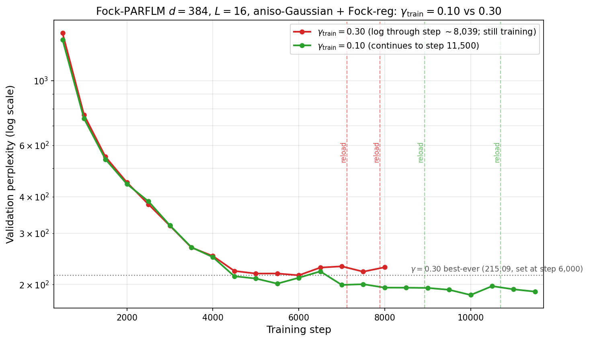

# CfC/BAOAB Propagator and Stiffness Mitigations for Fock-PARFLM with Structured $V_{\theta}$

Companion to `Training_Instabilities_in_Fock-PARFLM_with_structured_V_theta.md`.
This note collects the CfC/BAOAB-integrator analysis, the empirical
depth-code and curvature findings observed under CfC/BAOAB, and the proposed
(deferred) plus forward-looking stiffness mitigations. It was split out of the
parent note (which had grown past 4,700 lines) purely for maintainability; the
§24-§28 content below is unchanged from the parent's former sections of the
same numbers.

**Section numbering.** Sections keep their original numbers from the parent
document (§24 onward) so that every existing cross-reference stays valid.
Cross-references to §1-§23 refer to the parent note
`Training_Instabilities_in_Fock-PARFLM_with_structured_V_theta.md`; both files
live in the same `companion_notes/` folder.

## Table of Contents

24. [BAOAB + CfC Propagator: Eliminating the Force Cascade at Source](#24-baoab--cfc-propagator-eliminating-the-force-cascade-at-source)
25. [Late-Training Spike Emergence: The Cascade is Universal, Not Depth-Specific](#25-late-training-spike-emergence-the-cascade-is-universal-not-depth-specific)
26. [The Damping Hypothesis: Is Low γ the Dominant Cause of the Cascade?](#26-the-damping-hypothesis-is-low-γ-the-dominant-cause-of-the-cascade)
27. [Empirical Depth-Code Growth: Boundary Layers Dominate in Both Integrators](#27-empirical-depth-code-growth-boundary-layers-dominate-in-both-integrators)
28. [Proposed (Deferred) Mitigation: Clamping the Low-Rank Precision Factor $B_k$](#28-proposed-deferred-mitigation-clamping-the-low-rank-precision-factor-b_k)
29. [Principled Directions Beyond the $B_k$ Clamp](#29-principled-directions-beyond-the-b_k-clamp)
30. [Concrete Sketch: The Low-Rank Exponential Substep](#30-concrete-sketch-the-low-rank-exponential-substep)
31. [SCAF Phase 7b/7c Audit Plan for Tuning precision_lr_max (L=16)](#31-scaf-phase-7b7c-audit-plan-for-tuning-precision_lr_max-l16)

---

## 24. BAOAB + CfC Propagator: Eliminating the Force Cascade at Source

This section analyses how replacing the Verlet-style integrator with the BAOAB + CfC propagator (from [Closed\_Form\_and\_Hybrid\_Integration\_Strategies\_for\_Fock-PARFLM.md](Closed_Form_and_Hybrid_Integration_Strategies_for_Fock-PARFLM.md) §10) would address the $d=1024$ instability — not merely limit it (as the Tier 1–2 mitigations do) but **structurally eliminate** the second-order gradient cascade.

### 24.1 Why the O-Step Alone Does Not Help

The O-step in BAOAB is the Ornstein-Uhlenbeck friction/noise step:

$$p \leftarrow e^{-\gamma \Delta t}  p + \sigma \sqrt{1 - e^{-2\gamma \Delta t}}  \xi$$

This is the **exact closed-form solution** of the velocity damping equation. It is already perfectly stable by construction and contains **no force evaluation** — it simply rescales the momentum and adds noise.

In the current Verlet implementation, friction enters as the implicit factor $1/(1 + \Delta t \gamma)$ in the denominator:

$$h\_{\ell+1} = h\_\ell + \frac{\delta\_\ell}{1 + \Delta t \gamma} + \frac{\Delta t^2}{m(1 + \Delta t \gamma)} f\_\ell$$

This is a first-order approximation to $e^{-\gamma \Delta t}$. The difference is negligible: at $\gamma = 0.05$, $1/(1+0.05) = 0.952$ vs $e^{-0.05} = 0.951$. **The O-step upgrade is essentially cosmetic for stability.**

The instability lives in the **B-steps** (force kicks), not the O-step. Any intervention that targets only the friction/noise handling leaves the cascade untouched.

### 24.2 The CfC Propagator Removes the Second-Order Chain

The CfC (Closed-form Continuous-time) propagator replaces the B-step force evaluation with an analytical matrix-exponential propagator. Near each Gaussian well centroid $\mu\_k$, the potential is well-approximated by a harmonic oscillator with frequency $\omega\_k = \sqrt{2 V\_0 \kappa\_k^2}$. The exact solution for the undamped harmonic oscillator (the B-step in BAOAB is purely conservative, with damping handled by the O-step) is:

$$\Phi\_k^{\text{B}}(\Delta t) = \begin{pmatrix}\cos(\omega\_k \Delta t) & \frac{\sin(\omega\_k \Delta t)}{\omega\_k}\\[4pt] -\omega\_k \sin(\omega\_k \Delta t) & \cos(\omega\_k \Delta t)\end{pmatrix}$$

The blended CfC propagator uses the Gaussian envelope $\alpha\_k(h) = \exp(-\kappa\_k^2 \lVert h - \mu\_k \rVert^2)$ to interpolate between the harmonic propagator (near centroids) and a free-particle ballistic step (far from all wells).

**The key point for stability:** this propagator is a **forward-mode analytical computation**. It requires no `autograd.grad` call and no `create_graph=True`. The well parameters ($\mu\_k$, $\kappa\_k$, $V\_0$) enter through $\omega\_k$ and $\alpha\_k$ in a standard differentiable computation graph. PyTorch's first-order autograd handles parameter gradients naturally via the chain rule through $\Phi\_k$.

The consequence for the gradient chain:

| | Verlet (current) | BAOAB + CfC |
|---|---|---|
| $V\_\theta$ force computation | `autograd.grad(U, h, create_graph=True)` | Analytical propagator $\Phi\_k$ (forward pass) |
| Gradient chain through $V\_\theta$ | **Second-order** ($\nabla^2 U$ at every layer) | **First-order** (standard backprop through $\Phi\_k$) |
| Spectral radius of per-layer Jacobian | Contains $\nabla^2 U$ — can be $> 1$ | Propagator $\Phi\_k$ has spectral radius $\leq 1$ |
| Cascade over $L$ layers | Exponential amplification of Hessian eigenvalues | Bounded (norm-contractive propagator) |

The $V\_\theta$ second-order cascade is **eliminated entirely** — replaced by first-order backprop through a norm-bounded matrix. This is not tweaking a coefficient; it is removing the structural source of the exponential amplification.

The propagator $\Phi\_k$ is norm-bounded because the undamped harmonic propagator is a rotation matrix (spectral radius exactly 1), and the blending weights $\alpha\_k \in [0, 1]$ ensure the convex combination preserves this bound. Over $L=24$ layers, a product of norm-1 matrices remains norm-1 — in stark contrast to the product of Hessian-containing Jacobians that grows exponentially.

### 24.3 Residual Cascade from $V\_\phi$

The current force computation combines $V\_\theta$ and $V\_\phi$ in a single `autograd.grad` call:

```python
U = V_th_per_token.sum() + U_pair
grad_U, = torch.autograd.grad(U.float(), h_in, create_graph=True, ...)
```

In the BAOAB + CfC framework, $V\_\theta$'s contribution is handled analytically, but $V\_\phi$ (the pairwise register interaction) still requires a numerical force evaluation via `autograd.grad`. The question is whether $V\_\phi$ alone — without $V\_\theta$ amplifying the cascade — can produce the O($10^4$) gradient norms observed at $d=1024$.

**Assessment: probably not.** Several structural facts suggest $V\_\phi$'s cascade contribution is much smaller:

1. **Simpler function:** $V\_\phi$ is a pairwise interaction between token–register pairs (MLP-based or attention-based), without $V\_\theta$'s multi-well Gaussian bank with exponential envelopes and depth conditioning. The Hessian of $V\_\phi$ w.r.t. $h$ is correspondingly smaller.

2. **Sparse routing:** the top-$k$ gathered $V\_\phi$ evaluation (`use_gathered_v_phi=True`) restricts the pairwise computation to $k$ neighbours, limiting the rank of the Hessian.

3. **Per-layer scaling:** `per_layer_v_phi_scale` provides a learned attenuation factor $s\_\ell$ that reduces the pair potential's contribution in early layers (where the registers are not yet populated), partially decoupling the cascade.

4. **Strang splitting:** the BAOAB + CfC Strang splitting (§10.3 of the companion note) puts $V\_\phi$'s numerical kicks in half-step sub-intervals, further limiting their cascade contribution.

If empirical testing confirms that $V\_\phi$-only cascades are manageable, the BAOAB + CfC propagator would **fully resolve** the $d=1024$ instability.

### 24.4 Relationship to §23 Mitigations

The Tier 1–3 mitigations of §23 and the BAOAB + CfC propagator attack the same problem from opposite ends:

| Approach | Strategy | What it does to the cascade | Invasiveness |
|---|---|---|---|
| Tier 1 (§23.3) | **Clip the consequence** | Limits parameter gradients after the cascade amplifies | Config-only |
| Tier 2 (§23.4) | **Shorten the cascade** | Reduces $L$, $\Delta t$, or increases $m$ | Config change |
| Tier 3 (§23.5, items 7 & 9) | **Segment the cascade** | Detach boundaries every $K$ layers | Code change |
| **CfC propagator** (this section) | **Remove the cascade at source** | Replaces second-order force chain with first-order analytical propagator | Architectural refactor |

The recommended strategy is **sequential**: apply Tier 1 immediately (already implemented), test whether it stabilises training, and pursue the CfC propagator as the long-term solution — both for stability and for the inference-speed gains documented in [Closed\_Form\_and\_Hybrid\_Integration\_Strategies\_for\_Fock-PARFLM.md](Closed_Form_and_Hybrid_Integration_Strategies_for_Fock-PARFLM.md) §12.

**Update (July 17, 2026):** Full training runs at both d=768 (L=12) and d=1024 (L=16) demonstrated that Tier 1 (per-group clipping) and Tier 2 (reduce $L$) **delay but do not prevent** the cascade from emerging. The d=768 model, which was perfectly stable during the 3,000-step sweep and the first 33,000 steps, developed catastrophic spikes (up to grad=81,019) at step ≈37,000. See §25 for the full analysis. The CfC propagator is now the **only known mitigation that addresses the root cause** and is needed for any training run exceeding ≈30K steps at scale.

**Update (August 23–24, 2026) — Tier 2 re-tested under `baoab_cfc`, on a different failure mode.** The July 17 update above is about the Verlet-era `create_graph=True` autograd chain — a mechanism `baoab_cfc` already removes (`vtheta_analytic_force=True`). But the g0.1/d=384/L=16 OWT run under `baoab_cfc` itself hit a burst of large, uncaught grad-clip spikes at steps 6,297–6,676 (pre-clip totals up to 3,337, dominated by `creation_gate`/`destruction_gate`/`register`/`reverse_ch`/`depth_code`/`V_theta`), moving val PPL from 176.88 to 207.11 across the 6,000→6,500 eval. Because `depth_code` is a per-layer `nn.Parameter` (shape `[L, n_ctx, d]`) and `creation_gate`/`destruction_gate` are per-layer `nn.ModuleList`s while `reverse_ch` is a single weight-tied module reused at every layer, a smaller $L$ shortens the chain a spike has to propagate through, both forward (activation state) and backward (Jacobian-product depth) — a **different** cascade mechanism than the July 17 one, so the "delays but does not prevent" verdict does not automatically transfer.

A single-variable depth probe (same `d=384`, `dt=1`, `integrator=baoab_cfc`, identical V_theta bank/xi/V_phi/schedule/batch — only $L$: 16 → 8) ran **clean for the full 8,000-step slice tested**, including through the exact 6,297–6,676 window that broke the $L=16$ run: zero `[spike]` events, monotonically improving PPL (1,476.67 → 136.06). This supports depth $L$ itself as an **independent contributor** to this burst, on top of (not instead of) the $B_k$/off-diagonal curvature story that motivated §29's `baoab_cfc_lowrank` + `precision_lr_max`. Given the July 17 precedent, this 8,000-step window is **not yet enough to call it resolved rather than delayed**; the probe has been extended (`PROBE_MAX_STEPS: 8_000 -> None`) to run further and determine which it is. The $L=16$ curvature-side mitigation (§29) is being pursued independently and is not gated on this result.

**Cross-references:**
- [Closed\_Form\_and\_Hybrid\_Integration\_Strategies\_for\_Fock-PARFLM.md](Closed_Form_and_Hybrid_Integration_Strategies_for_Fock-PARFLM.md) — full derivation of the CfC propagator, blending weights, error bounds, and BAOAB integration (§10).
- [Fock-PARFLM\_Scale-Up\_Gamma\_Sweep\_Results\_and\_Damping\_Regime\_Analysis.md](Fock-PARFLM_Scale-Up_Gamma_Sweep_Results_and_Damping_Regime_Analysis.md) §4.5 — the empirical evidence that motivated this analysis.
- [Blended\_CfC\_BAOAB\_Deep\_Dive.md](Blended_CfC_BAOAB_Deep_Dive.md) — fully worked-out construction of the 7-sub-step B̃AOAB̃ scheme.

### 24.5 A second dividend: the propagator unlocks a *safe* position-dependent damping

The propagator's justification in §24.1–24.4 is stability at scale. There
is a second, less obvious payoff that becomes the anchor of a small
implementation roadmap: **the BAOAB/CfC integrator is also the enabling
step for position-dependent damping $\gamma(h)$**
([Position\_Dependent\_Damping\_and\_Reinforcement\_Field.md](Position_Dependent_Damping_and_Reinforcement_Field.md) §9.7).

The reasoning is a direct consequence of §24.1's own observation that
"damping is handled by the O-step." In the current Verlet integrator
friction is baked into the force coefficients $\rho, \beta$, so promoting
$\gamma \to \gamma(h)$ contaminates the `create_graph=True` force step and
adds a new position-dependent term to a backward pass already sitting near
its spectral-radius margin. BAOAB moves all friction into the standalone
O-step; CfC removes the `create_graph` chain from the B-step. Together they
change $\gamma(h)$ from a term *inside* the second-order cascade into a
plain first-order, elementwise rescaling of the momentum in the O-step:

$$v \leftarrow e^{-\gamma(h)\Delta t} v + \sqrt{1-e^{-2\gamma(h)\Delta t}} \sigma \xi,$$

with $\gamma(h)$ evaluated at the position held fixed within the sub-step.
Three consequences follow, developed in full in the companion note's §9.7:

1. **$\gamma(h)$ leaves the second-order chain.** Its backward pass is
   ordinary first-order autograd, and with the $V_\theta$ cascade already
   gone (§24.2) there is nothing left for it to amplify — dissolving the
   "self-defeating" objection that makes $\gamma(h)$ risky on the Verlet
   integrator.
2. **The correct control signal comes for free.** A spike- or
   curvature-aware $\gamma(h)$ wants the local curvature; CfC already
   computes the local harmonic frequency $\omega_k = \sqrt{2V_0\kappa_k^2}$
   (§24.2), so $\gamma(h)=\gamma_0 + \kappa \phi(\omega_k)$ is an analytic,
   first-order-differentiable byproduct of the B-step.
3. **Strong spatial variation is safe.** The O-step is the exact OU
   solution for any $\gamma\ge0$, so a sharply varying $\gamma(h)$ never
   destabilises the integrator.

Deeper still: once CfC removes the cascade at source, the *reason* one
would reach for $\gamma(h)$ changes. The whole tension flagged in
`Corpus_Statistics...md` §13.5 — that the fine-settling parameterisation
starves damping exactly where the cascade Jacobian is largest — assumes a
cascade to be starved. Remove it and that danger evaporates, so $\gamma(h)$
reverts from a *stability governor* (the §9.6 framing) to its original role
as an inference-geometry / fine-settling knob.

**Implementation roadmap (the ordering is causal).**

| Step | Item | Why it must come first |
| ---: | --- | --- |
| 1 | **CfC/BAOAB propagator** (§24) | Removes the cascade at source; keeps second-order forward geodesics; stabilises turbulent corpora. Load-bearing on its own. |
| 2 | **Position-dependent damping $\gamma(h)$** on top | Only *after* CfC: it removes the obstacle that makes $\gamma(h)$ dangerous, creates the O-step as its physically faithful home, supplies the $\omega_k$ control signal, and lets a constant-$\gamma$ CfC baseline de-risk attribution. |

Verify a constant-$\gamma$ CfC run first (geodesics reproduced, spikes
gone), then layer $\gamma(h)$ on and judge it by reload-and-geometry
diagnostics rather than by spike suppression, which CfC already owns.

**Mixed-corpus corollary.** This roadmap also answers how to run the
turbulence-prone second-order corpora (e.g. OpenWebText) that cannot be
reduced to first order without losing inference-time geodesic realism. The
first-order-sufficiency analysis
([Corpus\_Statistics\_and\_the\_First\_vs\_Second\_Order\_Well\_Gap.md](Corpus_Statistics_and_the_First_vs_Second_Order_Well_Gap.md) §12)
lets a corpus be partitioned by its anharmonicity: where $A_i \ll 1$
first-order dynamics is a certified substitute and carries no cascade;
where it is not (high predictive information, long-range dependence), the
CfC/BAOAB second-order propagator keeps the geodesics genuine while
removing the spikes. The training process is therefore *corpus-partitioned*
— first-order where sufficiency holds, CfC-second-order where it does not —
rather than a single global integrator choice.

### 24.6 Is there a different explicit symplectic integrator that tolerates stiffer wells than Verlet?

Before committing to the CfC rewrite it is worth asking whether a
smaller change — swapping Verlet for some other explicit,
Euler-family, symplectic integrator — could push the
$\omega\Delta t \lt 2$ bound of §24.2/§4.1 of
[PyTorch Implementation of CfC/BAOAB](https://github.com/dimitarpg13/semantic_simulation/blob/main/docs/BAOAB/PyTorch_Implementation_of_CfC_BAOAB_in_Fock-PARFLM.md#41-the-verlet-stability-bound)
higher and avoid the second-order-cascade removal described in
§24.2 above. It cannot, for three separate reasons, each of which
rules out one natural candidate:

1. **Symplectic (semi-implicit) Euler has the identical bound.** One
   step is $v \to v - \omega^2\Delta t h$ then $h \to h + \Delta t v$
   using the updated $v$; as a $2\times2$ map this has $\det=1$ and
   $\mathrm{tr}=2-\omega^2\Delta t^2$, giving the same
   $\omega\Delta t \le 2$ threshold as Verlet's characteristic
   equation. Not a coincidence — velocity-Verlet on the harmonic
   oscillator is algebraically two symplectic-Euler half-steps glued
   together, so both inherit the same bound.
2. **Higher-order explicit symplectic composition (Yoshida,
   Forest-Ruth) generally *shrinks* the bound, not raises it.**
   Reaching 4th order via composed Verlet substeps requires at least
   one negative substep (Suzuki-Sheng theorem, for any symmetric
   composition of order $\ge3$), and a negative substep is a
   destabilising direction for a stiff linear mode. Composing for
   accuracy and composing for stability margin move in opposite
   directions for exactly the linear-well regime that produces the
   $d=768$/$1024$ spikes documented in §23–25.
3. **General barrier: explicit stability functions are polynomials,
   and polynomials are unbounded.** For the harmonic model, any
   one-step method is $y\_{n+1}=R(i\omega\Delta t)y\_n$; any explicit
   method (fixed number of force evaluations, no matrix inverse per
   step) has $R$ polynomial in $i\omega\Delta t$, which cannot stay
   bounded by 1 as $\omega\Delta t\to\infty$ — the imaginary-axis
   specialisation of the standard fact that no explicit Runge-Kutta
   method is A-stable. There is therefore no finite-stage, explicit,
   Euler-family redesign that removes the crossing documented
   empirically in §25.3-25.4's per-well curvature growth; the ceiling
   is structural, not a Verlet-specific artefact.

Two designs do escape the bound, and CfC (§24.2) is deliberately the
second, not the first: **implicit midpoint** / Gauss-Legendre
collocation makes $R$ a rational Padé approximant to $e^{z}$ —
unconditionally stable, but a genuinely implicit nonlinear solve per
layer for a non-quadratic $V\_\theta$, and wrong-phase at large
$\omega\Delta t$ (right energy, wrong oscillation frequency); or
**exact propagation of the locally-frozen linear part** — the
$\Phi\_k$ rotation of §24.2 — which is both unconditionally stable
and phase-exact, with no implicit solve because only $\omega\_k$
itself changes step to step, not the equation being integrated
within a step. Put plainly: the CfC/BAOAB rewrite is not one
adequate fix chosen among several comparably good alternatives to
Verlet — within "explicit, one global $\Delta t$" the bound in
§24.2 is close to the ceiling, and CfC is the cheaper and more
accurate of the only two ways past it.

Full derivation of both the symplectic-Euler bound and the general
polynomial-stability argument: [PyTorch Implementation of CfC/BAOAB, §4.3](https://github.com/dimitarpg13/semantic_simulation/blob/main/docs/BAOAB/PyTorch_Implementation_of_CfC_BAOAB_in_Fock-PARFLM.md#43-why-not-a-different-explicit-symplectic-integrator).
Same argument in the SPLM tutorial framing:
[Symplectic Integration for SPLM, §1.6](Symplectic_Integration_for_SPLM.md#16-how-far-can-an-explicit-symplectic-integrator-be-pushed).

## 25. Late-Training Spike Emergence: The Cascade is Universal, Not Depth-Specific

### 25.1 Background

Sections 23–24 attributed the catastrophic gradient spikes at d=1024 to the depth of the second-order gradient cascade: L=24 produced a 24-deep chain of `autograd.grad(create_graph=True)` calls, with exponential amplification causing gradient norms up to 7,870 (L=24) and 63,949 (L=16 at lr=1.5e-4). The working hypothesis was that reducing $L$ would proportionally reduce the cascade severity.

### 25.2 d=768 at L=12: The delayed cascade

Full training of d=768 (L=12, 137M params, gamma=0.05) at lr=2e-4 on a single H100 revealed that **the same catastrophic spike pattern emerges after ≈37,000 steps** — despite L=12 producing zero spikes during the 3,000-step gamma sweep and the first ≈33,000 steps of full training.

#### Observed spikes (step 37,576–38,070):

| Step | Pre-clip grad | Top groups |
|:----:|:------------:|------------|
| 37,700 | 128.9 | P=91, E=91 |
| 37,715 | 785.0 | P=534, E=534, creation_gate=207 |
| 37,763 | **14,988.6** | P=10,049, E=10,042, creation_gate=4,738 |
| 37,766 | **20,704.2** | P=14,281, E=14,280, register=3,355 |
| 37,829 | **4,697.9** | E=3,181, P=3,181, reverse_channel_scale=2,089 |
| 37,840 | **81,019.2** | **P=78,417**, E=16,547, creation_gate=9,928 |
| 37,975 | 1,265.5 | P=1,237, E=220, creation_gate=113 |
| 38,054 | 1,159.1 | P=761, E=761, destruction_gate=325 |
| 38,070 | **9,378.7** | P=6,463, E=6,456, creation_gate=2,035 |

**The worst spike at d=768 (grad=81,019 at step 37,840) exceeds the worst spike at d=1024 (grad=63,949 at step 10,041).** The same parameter groups dominate: `P` (positional embedding), `E` (input embedding), and `creation_gate`.

#### Key comparison:

| | d=768 (L=12) | d=1024 (L=16, lr=1.5e-4) |
|---|---|---|
| Spike onset | Step ≈37,000 | Step ≈4,000 |
| Worst spike | **81,019** | 63,949 |
| Top spike group | `P` = 78,417 | `E` = 42,247 |
| PPL at onset | ≈93 | ≈260 |
| Model still learning? | Yes (PPL improving) | Stalling |
| Watchdog reloads | 0 (as of step 38,000) | 1 |

### 25.3 Revised understanding

The original framing — that L=24 is "too deep" while L=12 is stable — was **correct for short sweeps but wrong for full training**. The second-order gradient cascade is a function of both depth ($L$) and training duration:

1. **Early training:** The force field $-\nabla_h U$ is weak (the potential surface is approximately flat) and the Hessian eigenvalues are small. The cascade amplification factor is close to 1.0 per layer, so even L=24 would be stable.

2. **Mid training:** As the potential landscape develops sharper features (deeper wells, steeper barriers), the Hessian eigenvalues grow. The per-layer amplification factor exceeds 1.0, and the cascade begins to compound. Deeper models ($L=24$) reach this threshold first ($\sim$step 4K) because the cascade compounds over more layers.

3. **Late training:** Even shallower models ($L=12$) eventually develop potential landscapes with large enough Hessian eigenvalues that the 12-layer cascade amplifies to catastrophic levels ($\sim$step 37K). The cascade is **delayed, not prevented**, by reducing $L$.

This can be expressed as a rough scaling law for the cascade onset step:

$$\text{step}\_{\text{onset}} \propto \frac{1}{L} \cdot \frac{1}{\lambda\_{\max}(H_0)}$$

where $\lambda\_{\max}(H_0)$ is the initial rate of Hessian eigenvalue growth, which depends on $d$, the learning rate, and the corpus difficulty.

### 25.4 Implications for the mitigation tiers

The finding invalidates the **Tier 2 mitigation (reduce $L$)** as a long-term solution. The updated assessment:

| Tier | Strategy | Short-term | Long-term | Status |
|:----:|----------|:----------:|:---------:|:------:|
| 1 | Per-group clip + force clamp | Effective | **Degrades** (clip fraction grows) | Implemented |
| 2 | Reduce $L$ | **Delays onset** | Does not prevent | Applied (L=24→16) |
| 3 | CfC propagator | N/A | **Only root-cause fix** | Not yet implemented |
| — | Reduce LR | **Delays onset** | Delays but does not prevent | Being tested (d=1024) |

The **BAOAB + CfC propagator (§24)** is now the only known mitigation that can prevent the cascade from emerging at any training length, because it removes the `create_graph=True` chain entirely.

### 25.5 Why the models survive (for now)

Despite spikes reaching 81,019 at d=768 and 63,949 at d=1024, both models continue to learn (d=768 PPL=93.17, still improving). This is because:

1. **Spikes are intermittent**, not sustained — perhaps 1 in 20 steps triggers a spike, and the remaining steps receive clean gradients.
2. **Per-group clipping** truncates the spike direction but preserves some gradient signal. The clipped gradient is not zero — it points in a direction that still has a component of the true gradient.
3. **AdamW's momentum** smooths out spike steps. A single spike step has limited impact on the exponential moving averages of the first and second moments.
4. **The watchdog** rolls back to the best checkpoint if sustained instability is detected, preventing catastrophic divergence.

However, as training progresses and the potential landscape sharpens further, the spike fraction is expected to grow. At some point, the fraction of useful (non-clipped) gradient steps will drop below the threshold needed for continued learning, and PPL will stall. This is likely what happened to d=1024 at lr=1.5e-4, where PPL stalled at ~258 between steps 6,500 and 9,000.

### 25.6 Practical recommendations

1. **For ongoing runs (d=768, d=1024):** Reduce LR when spikes become frequent. The current d=1024 run resumed from step 9,000 with lr=5e-5 (3× reduction) and grad_clip=0.5. The d=768 run may need a similar LR reduction if PPL stalls.

2. **For the paper:** The spike onset timing and severity should be documented as empirical evidence that the `create_graph=True` force computation has a fundamental scalability limit. This motivates the CfC propagator as a necessary architectural evolution, not just an optional optimization.

3. **For future architectures:** The CfC propagator should be implemented before attempting scale-ups beyond d=1024 or training runs beyond ~50K steps at any scale. The 3,000-step gamma sweep protocol is validated for finding the optimal $\gamma$ but cannot predict whether a full training run will be stable.

---

## 26. The Damping Hypothesis: Is Low γ the Dominant Cause of the Cascade?

### 26.1 Observation

Sections 23–25 attributed the catastrophic gradient spikes at d≥768 to the `create_graph=True` second-order chain through $L$ layers of force computation. However, a striking confound has been overlooked: **the two stable runs and the two unstable runs differ not only in $d$ and $L$, but also in γ**.

| Run | $d$ | $L$ | $\gamma$ | Max grad | Watchdog reloads | Regime |
|-----|:---:|:---:|:--------:|:--------:|:----------------:|--------|
| d=384 Phase 1 | 384 | 16 | **0.30** | 757 | 0 | Stable |
| d=384 Phase 2 | 384 | 16 | **0.30** | 1,703 | 0 | Stable |
| d=384 Phase 3 | 384 | 16 | **0.30** | 7,427 | 0 | Stable |
| d=768 | 768 | **12** | **0.05** | 5,158,336 | 2 | Catastrophic |
| d=1024 | 1024 | 16 | **0.05** | 63,949 | multiple | Catastrophic |

Crucially, d=768 has **fewer layers** ($L=12$) than d=384 ($L=16$) — yet its worst spike is **7 orders of magnitude** larger. If the cascade depth $L$ were the primary driver, d=384 should be worse, not better. This points to $\gamma$ as the dominant variable.

### 26.2 Mechanistic argument: damping controls cascade amplification

The Velocity-Verlet integrator with Langevin friction updates each layer as:

$$v_{l+1} = (1 - \gamma   dt)   v_l + F(h_l)   dt, \qquad h_{l+1} = h_l + v_{l+1}   dt$$

The training gradient $\partial \mathcal{L}/\partial \theta$ must differentiate through the force $F = -\nabla_h V$ via `create_graph=True`, producing second-order terms $\partial^2 V / \partial h   \partial \theta$. The severity of this cascade depends on how far perturbations in $h$ propagate across layers — which is controlled by the **per-layer velocity attenuation factor** $(1 - \gamma)$:

| Property | Low $\gamma$ (0.05) | High $\gamma$ (0.30) |
|----------|:-------------------:|:--------------------:|
| Per-layer velocity attenuation | $(1 - 0.05) = 0.95$ | $(1 - 0.30) = 0.70$ |
| Residual velocity after $L=12$ | $(0.95)^{12} \approx 0.54$ | $(0.70)^{12} \approx 0.014$ |
| Residual velocity after $L=16$ | $(0.95)^{16} \approx 0.44$ | $(0.70)^{16} \approx 0.003$ |
| Effective memory horizon | ≈20 layers | ≈3 layers |
| Dynamical regime | Nearly conservative (ballistic) | Overdamped (gradient-descent-like) |
| Jacobian spectral radius | $\approx 1$ (perturbations persist) | $\ll 1$ (perturbations decay) |

**The key number: at $\gamma=0.05$, a velocity perturbation retains 54% of its magnitude after 12 layers. At $\gamma=0.30$, it retains only 1.4%.** This is a **38× difference** in how much perturbation energy survives to compound in the backward pass.

The backward pass through `autograd.grad(create_graph=True)` computes the chain:

$$\frac{\partial \mathcal{L}}{\partial \theta} = \sum_{l=1}^{L} \frac{\partial \mathcal{L}}{\partial h_L} \cdot \prod_{k=l}^{L-1} J_k \cdot \frac{\partial F_l}{\partial \theta}$$

where $J_k = \partial(h_{k+1}, v_{k+1}) / \partial(h_k, v_k)$ is the per-layer Jacobian. The spectral radius $\rho(J_k)$ determines whether the product $\prod J_k$ grows or decays:

- **$\gamma = 0.05$:** $\rho(J_k) \approx 1 - 0.05 + \mathcal{O}(\lambda_{\max}(H_V))$. When the Hessian eigenvalue $\lambda_{\max}(H_V)$ exceeds $\gamma/dt$, the spectral radius exceeds 1.0 and the product grows exponentially with $L$. This is the **cascade onset condition**.

- **$\gamma = 0.30$:** $\rho(J_k) \approx 1 - 0.30 + \mathcal{O}(\lambda_{\max}(H_V))$. The Hessian eigenvalue must exceed a **6× larger threshold** before the spectral radius exceeds 1.0. This dramatically raises the bar for cascade onset.

In other words, **$\gamma$ sets the stability margin**: the gap between the current Hessian eigenvalues and the critical threshold for exponential gradient amplification. Low $\gamma$ leaves almost no margin; high $\gamma$ provides a large buffer.

### 26.3 Why the gamma sweep missed this

The 3,000-step gamma sweep correctly identified $\gamma = 0.05$ as the PPL-optimal value at that horizon. But the catastrophic spike regime does not onset until step ~50K at d=768 (§25.2) — the sweep runs for only 6% of that window.

This is a **short-horizon optimisation trap**:

| Training stage | Low $\gamma$ (0.05) | High $\gamma$ (0.20–0.30) |
|:--------------:|:-------------------:|:-------------------------:|
| Steps 0–3K (sweep window) | ✅ Best PPL (ballistic exploration is aggressive) | ❌ Slightly worse PPL (dynamics are more conservative) |
| Steps 3K–50K | ✅ Still fine (Hessian eigenvalues below threshold) | ✅ Fine |
| Steps 50K+ | ❌ **Catastrophic spikes** (Hessian exceeds stability margin) | ✅ Likely stable (large stability margin) |
| Steps 65K–100K (WSD decay) | ❌ **Watchdog reloads**, wasted steps, regression | ✅ Smooth decay, full PPL compression |

The sweep selects $\gamma$ that is optimal **conditional on the dynamics remaining stable**, which they do not. The long-run optimal $\gamma$ may be substantially higher.

### 26.4 The confound with $d$

One might argue that the instability is driven by $d$ (larger hidden dimension → sharper potential landscape → larger Hessian eigenvalues), not $\gamma$. This is partially true: the Hessian eigenvalue growth rate $\lambda_{\max}(H_V)$ almost certainly increases with $d$ as the model develops more refined representations. However, $\gamma$ controls the **tolerance** for those eigenvalues:

- At $\gamma = 0.30$, the stability margin is large enough to absorb the Hessian growth at d=384 across 500K steps without a single cascade event.
- At $\gamma = 0.05$, the stability margin is so thin that even the moderate Hessian growth at d=768 triggers catastrophic cascades by step 50K.

**The hypothesis is not that $d$ is irrelevant, but that $\gamma$ modulates the cascade severity multiplicatively**, and the gamma sweep inadvertently selected a $\gamma$ that minimises the stability margin.

### 26.5 Expected effect of $\gamma = 0.20$ at d=768

At $\gamma = 0.20$, the per-layer attenuation is $(1 - 0.20) = 0.80$, giving:

| Metric | $\gamma = 0.05$ | $\gamma = 0.20$ | Ratio |
|--------|:---------------:|:---------------:|:-----:|
| Residual velocity ($L=12$) | $(0.95)^{12} = 0.54$ | $(0.80)^{12} = 0.069$ | 7.8× more damping |
| Stability margin ($\gamma / dt$) | 0.05 | 0.20 | 4× higher threshold |
| Jacobian product decay | Near-neutral | Exponentially decaying | Qualitatively different |

The 7.8× increase in velocity damping and 4× increase in stability margin should:

1. **Prevent the exponential cascade**: Hessian eigenvalues that trigger cascades at $\gamma = 0.05$ remain safely below threshold at $\gamma = 0.20$.
2. **Eliminate or drastically reduce spike severity**: The multiplicative amplification across 12 layers is cut from near-neutral to strongly decaying.
3. **Produce d=384-like training stability**: The dynamical regime at $\gamma = 0.20$ is qualitatively similar to d=384's $\gamma = 0.30$ — overdamped, with rapid perturbation decay.

**The cost** is some PPL sacrifice in early training (the gamma sweep showed higher $\gamma$ → higher short-run PPL). However, the **net long-run PPL** may actually be *better* because:

- No watchdog reloads wasting ~10K effective steps each
- No post-reload regression and multi-thousand-step recovery periods
- Smooth WSD decay phase delivering full PPL compression
- No risk of cascade re-escalation during the critical decay window

### 26.6 Hints at a γ–d scaling law

The optimal-stable $\gamma$ may follow a dimension-dependent pattern:

| $d$ | $\gamma$ (PPL-sweep optimal) | $\gamma$ (geodesic-optimal) | $\gamma$ (training-stable, empirical) |
|:---:|:----------------------------:|:---------------------------:|:-------------------------------------:|
| 384 | 0.25 | 0.05 | 0.30 ✓ (500K steps, zero reloads) |
| 768 | 0.05 | 0.05 | 0.05 ✗ (catastrophic at 50K) |
| 1024 | 0.05 | — | 0.05 ✗ (catastrophic at 4K) |

At d=384, the training-stable $\gamma$ (0.30) is **close to the PPL-optimal** (0.25) and far above the geodesic-optimal (0.05). At d≥768, the PPL-sweep optimal and geodesic-optimal happen to **coincide** at 0.05 — but this value is training-unstable.

The PPL-geodesic coincidence at d=768 (documented in the gamma sweep analysis) may be a red herring for training: it selects a $\gamma$ that produces beautiful near-geodesic dynamics in the short run but catastrophic gradient cascades in the long run. The **training-stable $\gamma$ at d=768 likely lies in the range 0.15–0.25**, similar to d=384 — in the overdamped regime where PPL and geodesic optimality diverge.

### 26.6b Counter-evidence: the hypothesis reverses on the aniso-Gaussian $V_\theta$ family (August 20, 2026)

**Every run in §26.1's table, including the d=384/γ=0.30 "stable" anchor, uses the SQ3 (structured-quadratic-mixture) $V_\theta$** (this note's header). A same-width test on a *different* $V_\theta$ family — the bounded anisotropic-Gaussian + Fock-reg configuration of `Determining_optimal_gamma_for_Fock-PARFLM.md` §12.5, `d=384`, `L=16`, two full 100K-step runs differing only in `FIXED_GAMMA` — gives the **opposite** ordering:



Note the red dashed lines (γ=0.30's watchdog reloads, now five: steps 7,124; 7,891; 8,093; 8,421; 9,477) landing on a curve that goes flat as early as step 6,000 and only breaks through at step 10,000, versus the green dashed lines (γ=0.10's two reloads at 8,925 and 10,697) landing on a curve that is still descending — a visual restatement of "reloads that interrupt real progress" versus "reloads that interrupt a plateau nobody would have missed." The γ=0.30 run disconnected once mid-training and was resumed from a step-7,500 checkpoint; the re-pulled log now runs to step 11,206, within 300 steps of γ=0.10's 11,500-step horizon, so the table below is reported at this near-matched endpoint rather than the original ~8,039-step read.

| Run | $d$ | $L$ | $\gamma$ | $V_\theta$ family | Watchdog reloads (by ~matched endpoint) | Max pre-clip grad |
|---|:---:|:---:|:---:|---|:---:|---:|
| d=384, aniso-Gaussian | 384 | 16 | **0.10** | anisotropic Gaussian | **2** (by step 11,500) | 3,899 |
| d=384, aniso-Gaussian | 384 | 16 | **0.30** | anisotropic Gaussian | **5** (by step 11,206) | 37,229 |
| d=384, Phase 1–3 (§26.1) | 384 | 16 | 0.30 | SQ3 (structured quadratic) | 0 (over 500K cumulative steps) | 7,427 |

At $d=384$, on aniso-Gaussian, $\gamma=0.30$ now shows $2.5\times$ as many watchdog reloads as $\gamma=0.10$ over a near-matched horizon and a worst spike nearly $10\times$ larger — a wider gap than the first (~8,039-step) read, not a narrower one — the opposite of what §26.2's constant-Hessian argument predicts, and the opposite of what the SQ3 row of this very table shows at the identical $(d, L, \gamma)=(384, 16, 0.30)$ triple. Since §26.2's mechanism (per-layer velocity attenuation $(1-\gamma)^L$ setting the cascade margin) is a property of the shared Verlet integrator and should not depend on which $V_\theta$ is plugged into the force term, the reversal implies the constant-Hessian toy model is missing a $\gamma$-*dependent* term that differs between the two $V_\theta$ families — most plausibly a $\gamma$-dependent change in $\lambda_{\max}(\nabla^2_h U)$ for the bounded Gaussian well (whose curvature saturates away from well centres, unlike SQ3's unbounded quadratic), or an interaction specific to the aniso-Gaussian run's depth-conditioning and register-gate machinery (its largest spikes are dominated by `depth_code`, `creation_gate`, and `register` groups, none of which SQ3 has). See `Determining_optimal_gamma_for_Fock-PARFLM.md` §12.5 for the full comparison and open questions #8–#9.

**Revised statement of the Damping Hypothesis.** "Raising $\gamma_{\mathrm{train}}$ increases the cascade stability margin" is confirmed for the SQ3 $V_\theta$ family at $d=384$ and **falsified** for the aniso-Gaussian family at the same $d$. The hypothesis should therefore be read as **architecture-conditional**, not as a universal property of the `create_graph` second-order chain — §26.6's γ–$d$ scaling-law table (and by extension the §26.5 recommendation to raise $\gamma$ for stability at $d\ge768$) is validated only within the SQ3 family until re-tested on aniso-Gaussian at those widths.

### 26.7 Experimental plan

The validation strategy is designed around **information-efficient sequencing**: spend the minimum compute to resolve the key uncertainty before committing to expensive full runs.

#### Why Phase 1a (fresh-init comparison) was dropped

An earlier version of this plan included a 10K-step fresh-init run at $\gamma = 0.20$ to compare gradient profiles against the $\gamma = 0.05$ Phase 1 logs. This was abandoned for two reasons:

1. **No baseline data:** The d=768 $\gamma = 0.05$ training log (JSONL) records `grad_norm` every 50 steps as a point sample, but does not capture the maximum gradient norm within each window. The terminal output showing between-step catastrophic spikes (e.g., grad=5.16M at step 51,898) is not persisted — early-step terminal output is lost to scrollback. There is no reliable gradient-norm baseline to compare against.

2. **The first 10K steps are not discriminating:** Even at $\gamma = 0.05$, the first 10K steps were clean (JSONL max grad ≈395–482, only 1 spike > 100). The cascade does not onset until step ≈37K–50K, when the Hessian eigenvalues exceed the thin stability margin. A 10K fresh-init comparison would show **both** runs looking clean — it cannot distinguish the two $\gamma$ values.

Both problems are solved by the **cross-gamma Phase 2 test** (below), which starts from a checkpoint whose Hessian has *already* exceeded the $\gamma = 0.05$ stability margin.

#### Prerequisite: Improved gradient logging

Before running the validation, `train_fock.py` should be patched to log `max_grad_in_window` — the maximum gradient norm seen across all steps within each 50-step JSONL logging interval. This ensures that future runs capture spike severity at full resolution, enabling fair cross-run comparisons. See `train_fock.py` for the implementation.

#### Step 1: Complete d=768 Phase 1 at $\gamma = 0.05$ (~18 hours remaining)

The current run is at step 81,500 / 100,000. The WSD decay is actively compressing PPL (best 84.04 at step 81,500, with 4 consecutive new bests). Let it finish — every remaining step is valuable, and the final Phase 1 PPL at $\gamma = 0.05$ becomes the **baseline** for comparison.

**Deliverable:** Phase 1 best checkpoint and final PPL at $\gamma = 0.05$.

#### Step 2: Cross-gamma Phase 2 test (10K steps, ~10 hours) — THE CRITICAL EXPERIMENT

Run 10K steps of Phase 2 starting from the **$\gamma = 0.05$ Phase 1 best checkpoint** but using $\gamma = 0.20$ (with `FRESH_SCHEDULE=True`, `SKIP_OPTIMIZER_STATE=True`).

**Why this is the most discriminating test:** The Phase 1 best checkpoint contains a model at PPL ~65–70, whose potential landscape is sharp enough that $\gamma = 0.05$ produced catastrophic spikes (grad > 5M) in the second half of Phase 1. By resuming from this checkpoint at $\gamma = 0.20$, we test the hypothesis at the exact model state where it matters — a model whose Hessian has **already exceeded** the $\gamma = 0.05$ stability margin. If $\gamma = 0.20$ tames it, the hypothesis is confirmed. If it doesn't, the hypothesis is wrong.

This is analogous to the d=384 Phase 2→3 transition, which changed peak LR by 2× (from $3 \times 10^{-4}$ to $1.5 \times 10^{-4}$) — a similarly dramatic dynamics change — and the model adapted within ~500 steps. Switching $\gamma$ may be equally recoverable.

| Metric | Expected at $\gamma = 0.05$ (Phase 2) | Expected at $\gamma = 0.20$ (cross-gamma) |
|--------|:--:|:--:|
| Gradient profile (steps 0–10K) | Catastrophic spikes within 5–10K steps (Hessian already above $\gamma = 0.05$ margin) | Clean (if hypothesis correct) |
| Warm-restart regression depth | ~15% (based on d=384) | Possibly deeper (regime change) |
| Recovery time to Phase 1 best PPL | ~25K steps (based on d=384) | ? |
| `max_grad_in_window` (from improved logging) | Expect > 10,000 | Expect < 1,000 |

**Decision gate:**

| Outcome | Recommended path |
|---------|-----------------|
| Cross-gamma works (PPL recovering, clean gradients) | **Continue this run as Phase 2** — no Phase 1 rerun needed (Path A) |
| Cross-gamma PPL stalls (regime mismatch) | **Full Phase 1 rerun at $\gamma = 0.20$**, then Phases 2+3 (Path B) |
| Cross-gamma still spiky (hypothesis wrong) | **Continue with $\gamma = 0.05$ Phase 2**, accept instabilities (Path C) |

#### Step 3: Commit to full Phase 2 (140K remaining steps)

Based on Step 2 results, commit to one of three paths:

| Path | Scenario | Total H100 time (from now) | Expected outcome |
|:----:|----------|:----------------:|-----------------|
| **A** | Cross-gamma works | 18h (finish P1) + 10h (test) + 130h (P2 remainder) = **158h** | Best efficiency — preserves all Phase 1 compute |
| **B** | Regime mismatch | 18h + 10h + 93h (P1 rerun at $\gamma = 0.20$) + 140h (P2) = **261h** | Clean foundation, higher cost |
| **C** | Hypothesis wrong | 18h + 10h + 140h (P2 at $\gamma = 0.05$) = **168h** | Accept instabilities |

**Path A is the most attractive:** a single 10-hour experiment either preserves all Phase 1 compute and stabilises Phases 2+3, or fails cheaply.

#### Step 4: d=1024 validation (contingent on Step 2 success)

If $\gamma = 0.20$ stabilises d=768, extend the validation to d=1024:

1. **10K steps at d=1024, $\gamma = 0.20$** — the $\gamma = 0.05$ run had catastrophic spikes by step 4K, so 10K steps is a decisive test.
2. **10K steps at d=1024, $\gamma = 0.25$** — given the earlier cascade onset at d=1024 (step ≈4K vs ≈50K at d=768), a higher $\gamma$ may be needed. $\gamma = 0.25$ provides a 5× stability margin increase and is closest to d=384's proven-stable regime.

| Metric | $\gamma = 0.05$ (from prior run) | $\gamma = 0.20$ | $\gamma = 0.25$ |
|--------|:--:|:--:|:--:|
| Cascade onset | Step ~4K | ? (expect > 10K if hypothesis correct) | ? (expect > 10K) |
| Max gradient (0–10K) | 63,949 | ? | ? |
| PPL at 10K | ~260 (stalled) | ? | ? |

If either value produces clean training, commit to a full 100K-step Phase 1 at d=1024 (~350M params, directly comparable to GPT-2 Medium). This would transform the d=1024 narrative from "unstable, cannot train" to "stability resolved via damping hypothesis."

**Cost:** ≈20 hours for both 10K-step tests. If successful, a full d=1024 Phase 1 would cost ≈130–160 hours on 1×H100 (slower per step due to larger model).

#### Future scales: Stability-aware gamma sweep protocol

For d=2048 and beyond, replace the current 3K-step PPL-only gamma sweep with a **20K–30K-step stability-aware sweep** that monitors both PPL *and* gradient norm statistics. The selection criterion becomes:

$$\gamma^{\ast} = \arg\min_\gamma \text{PPL}_{20K} \quad \text{subject to} \quad \max_{t \leq 20K} \lVert g_t \rVert \lt \tau_{\text{spike}}$$

where $\tau_{\text{spike}}$ is a spike severity threshold (e.g., 10,000). This trades sweep cost (7× longer per candidate) for much higher confidence that the selected $\gamma$ will remain stable through full training.

#### Summary timeline

Assuming a single LambdaLabs 1×H100 instance:

```
Day 1       (18h):  Finish d=768 Phase 1 at γ=0.05 → bank checkpoint
Day 2       (10h):  Step 2 — 10K steps cross-gamma Phase 2 test (γ=0.20 from γ=0.05 ckpt)
Day 2              Decision gate: commit to Path A, B, or C
Day 2–3     (20h):  Step 4 — d=1024 validation (γ=0.20 and γ=0.25, 10K each)
Day 3+             Full Phase 2 (d=768) and/or Phase 1 (d=1024) at validated γ
```

**Total validation cost before any full-run commitment: ≈28 hours (≈1 day).** This resolves the damping hypothesis at the most informative model state (post-Phase 1 checkpoint where $\gamma = 0.05$ was already catastrophically unstable), at minimal compute cost.

### 26.8 Implications for the mitigation tier table

The damping hypothesis adds a new mitigation tier — potentially more practical than the CfC propagator (§24) because it requires zero code changes:

| Tier | Strategy | Mechanism | Long-term | Status |
|:----:|----------|-----------|:---------:|:------:|
| 1 | Per-group clip + force clamp | Truncate spike direction | Degrades | Implemented |
| 2 | Reduce $L$ | Shorten cascade chain | Delays onset | Applied |
| 3 | CfC propagator | Remove `create_graph` chain | **Root-cause fix** | Not implemented |
| **4** | **Increase $\gamma$ (overdamped regime)** | **Raise stability margin** | **May prevent onset entirely** | **Proposed** |
| — | Reduce LR | Slow Hessian eigenvalue growth | Delays onset | Being tested |

**Tier 4 is uniquely attractive** because:
- It is a single hyperparameter change (no code modification)
- It has a clear mechanistic justification (exponential perturbation damping)
- It can be validated cheaply (10K-step comparison run)
- It may render Tiers 1–2 unnecessary if the stability margin is large enough
- It works within the existing Velocity-Verlet framework, unlike the CfC propagator which requires a new integrator

The main risk is that overdamped dynamics ($\gamma \gg \gamma_{\text{geodesic}}$) sacrifice some modelling capacity — the ballistic regime captures long-range token interactions that the overdamped regime may miss. This would manifest as a higher *floor* PPL even with unlimited training steps. However, d=384's excellent PPL results at $\gamma = 0.30$ (well into the overdamped regime, far from the geodesic-optimal $\gamma = 0.05$) demonstrate that the overdamped regime retains substantial modelling power at least up to d=384.

### 26.9 Open questions

1. **Is there a sweet spot?** Can we find a $\gamma$ at d=768 that is stable *and* retains some ballistic character — e.g., $\gamma = 0.15$ — or does stability require full overdamping?

2. **Does the stability threshold shift with training?** The Hessian eigenvalues grow throughout training. A $\gamma$ that is stable at step 50K may become unstable at step 200K. If so, an **annealing schedule** for $\gamma$ (increasing $\gamma$ during training) might be needed.

3. **Interaction with LR:** Both $\gamma$ and LR affect the stability margin. The current d=768 run uses LR $= 2 \times 10^{-4}$ (vs d=384's $3 \times 10^{-4}$). A combined ($\gamma$, LR) stability sweep would map the full stable region.

4. **Does the CfC propagator become unnecessary?** If overdamped $\gamma$ stabilises training at all scales, the CfC propagator may be an overengineered solution. However, the CfC propagator also has efficiency benefits (no `create_graph` memory overhead), so it may still be desirable for memory-constrained scale-ups.

---

## 27. Empirical Depth-Code Growth: Boundary Layers Dominate in Both Integrators

### 27.1 Context

The first CfC/BAOAB production run (gamma=0.10, d=384, $L=16$, `aniso_dcvt5x8`,
same architecture as the Verlet runs in §23-§26) hit its first grad-clip spike
burst at step 6,297 (pre-clip total grad up to 3,336.8 at step 6,676), and
val_ppl visibly worsened over the corresponding eval window (176.88 -> 207.11
between steps 6,000 and 6,500) before the watchdog's slow EMA (`alpha=0.05`,
`patience=200`) caught it. The top contributing groups at every spike were
`depth_code`, `creation_gate`, `E`/`P` (token/positional embeddings),
`register`, and `reverse_ch` -- i.e. this is the same embedding-spike /
force-cascade family documented in §18-§20 and §23, now reappearing under
CfC/BAOAB despite §24 having removed the second-order force-cascade term the
Verlet integrator was suffering from. Two fixes were applied in response
(tightening `depth_code`'s per-group clip override from 0.5 to 0.25, and
adding a `GRAD_NORM_HARD_TRIGGER=500.0` fast path that reloads immediately on
any single-step raw grad norm above threshold, independent of the slow EMA);
both are implemented in
`colab_fock_cfc_baoab_aniso_gaussian_openwebtext_d384.ipynb`.

`depth_code`'s prominence in every spike prompted a direct empirical check of
what this parameter — the per-layer additive shift $e_g$ of
[`Structured_VTheta_Design_and_Theory.md`](./Structured_VTheta_Design_and_Theory.md)
§14.3 — actually does once trained, using six early CfC/BAOAB checkpoints
(steps 500-5,500, i.e. before the burst) and a mid-run Verlet checkpoint
(steps 9,000-15,000) from the sibling gamma=0.10 experiment.

### 27.2 Finding: boundary layers ($g=0$, $g=L-1$) move; middle layers do not

The full per-layer trajectories, numbers, and the tie-back to the §14.4
conservativity proof are in
[`Structured_VTheta_Design_and_Theory.md`](./Structured_VTheta_Design_and_Theory.md)
§14.7. In summary, for both integrators layers $g=1,\dots,L-2$ stay
statistically at their random-init norm throughout the windows checked, while
the layer(s) adjacent to a boundary move in a clearly structured, non-random
way:

- **Verlet:** only $g=0$ deviates from init (shrinks to ≈0.66x at step 9,000,
  recovers to ≈0.89x by step 15,000).
- **CfC/BAOAB:** $g=15$ ($=L-1$) grows explosively in the first 2,500 steps
  (1.14x -> 3.41x init) then plateaus (3.41x -> 3.65x over the next 3,000
  steps); $g=1$ climbs more slowly and has not plateaued by step 5,500
  (1.03x -> 1.91x); $g=0$ peaks at 1.72x (step 3,500) then relaxes back to
  1.17x (step 5,500) -- non-monotonic, same as the Verlet run's $g=0$, but
  with the opposite sign.

Critically, $g=15$'s growth is already flat by step 2,500-3,500 -- more than
2,500 steps before the step-6,297 spike burst -- and val_ppl improves
smoothly and monotonically the entire time (1369 -> 171). So an elevated
$\lVert e_{L-1}\rVert$ is not, by itself, sufficient to trigger the cascade;
it establishes a *precondition* (per §14.7's argument, a large per-layer
shift can move that layer's read of the shared well bank into a
higher-curvature region than the bank's precision matrices were tuned for),
consistent with §26's curvature-based reversal of the naive damping
argument, but something else — plausibly continued drift in $g=1$, or in one
of the other implicated groups (`creation_gate`, `destruction_gate`,
`register`, `reverse_ch`) — has to change further before the burst itself
fires. No checkpoint spanning the burst is available yet to settle this.

### 27.3 Relationship to §23-§26

This finding sits alongside, rather than replacing, the mitigation ladder of
§23 and the damping/curvature discussion of §26: it identifies which
*parameter group* inside the shared V_theta bank is the structural conduit
for the boundary-layer sensitivity that both integrators exhibit, and gives
a concrete, checkpoint-verifiable quantity (`depth_code` per-layer norm) to
track alongside the Weyl-bound stiffness audit (SCAF `StiffnessProbe`, see
the `semsimula-scaf` docs) when diagnosing future bursts. The pending $L=8$
depth-probe run is the natural next test of whether the same boundary
pattern reappears at $g=7$ ($=L-1$ for $L=8$) on a similar step-relative
timeline, which would support an $L$-independent boundary effect, versus a
markedly different timeline or magnitude, which would point to a
depth-dependent mechanism instead.

---

## 28. Proposed (Deferred) Mitigation: Clamping the Low-Rank Precision Factor $B_k$

> **Status: PROPOSED — DEFERRED until further notice (23-24 August 2026).**
> §28.1-28.2 record a hypothesis; §28.2b upgrades it to a direct
> measurement on this run's own checkpoints. No code has been changed and
> no run has been launched — the clamp itself is still queued behind the
> ongoing gamma=0.10 CfC/BAOAB run and the $L=8$ depth probe.

### 28.1 The observation: $a_k$ is clamped, $B_k$ is not

The anisotropic well's precision is $P_k = \mathrm{diag}(a_k) + B_k B_k^T$
with $B_k \in \mathbb{R}^{d \times r}$ ($r = 4$ in the production runs). Only
the diagonal part is bounded. In
[`model_aniso_gaussian_vtheta.py`](../notebooks/conservative_arch/parf/model_aniso_gaussian_vtheta.py),
`_components` applies `precision_max` (set to $2/d \approx 0.0052$ at $d=384$)
to $a_k$:

```python
a = (F.softplus(self.a_proj(xi)) + 1e-4).view(*lead, self.K, self.d)
if self._precision_max is not None:
    a = a.clamp(max=self._precision_max)
...
B = self.B_proj(xi).view(*lead, self.K, self.d, self.rank)  # no clamp
```

There is no corresponding bound on $B_k$, and — unlike the isotropic sibling
`MixtureGaussianVTheta` in `model_gaussian_vtheta.py`, which defines a
`clamp_params()` method — the anisotropic class defines none. The factor is
initialised small (`nn.init.normal_(self.B_proj.weight, std=0.01)`) but is
otherwise free to grow throughout training.

### 28.2 Why this is the prime suspect for "curvature exceeding 2"

The SCAF `StiffnessProbe` Weyl bound (Phase 7b/7c) is, per well,

$$K_{\text{Weyl}}(h) = \sum_k g_k \left( \max_i a_k[i] + \sigma_{\max}(B_k)^2 \right),$$

where $g_k = w_k \exp(-\tfrac{1}{2} \delta_k^T P_k \delta_k) > 0$ and $\delta_k = h - \mu_k$.
The diagonal contribution $\max_i a_k[i]$ is capped at $2/d \approx 0.0052$,
which is tiny; the only term in that per-well bracket that can plausibly push
$\omega \Delta t$ past 2 is $\sigma_{\max}(B_k)^2$ — the squared largest
singular value of the *unclamped* low-rank factor. In other words, the
off-diagonal curvature the Phase 7b/7c audit flagged on the Verlet runs is,
by construction, carried almost entirely by the one quantity that has no
upper bound. This is orthogonal to the well count $K$ (see §27's companion
discussion and the well-count analysis: doubling $K$ adds more equally
unclamped $B_k$ factors, giving *more* opportunities for an outlier, not
fewer).

### 28.2b Confirmed: $B_k$ is already large and still growing in the actual g0.1 CfC/BAOAB run

§28.1-28.2 argue the case from the model definition and from the Verlet-run
Phase 7b/7c Weyl-bound audits (§25-§26). Those audits never inspected
`B_proj` directly — they measured the *aggregate* curvature functional
$K_{\text{Weyl}}(h)$, not its per-term decomposition. To close that gap,
the `B_proj.weight` (and, for reference, `a_proj.weight`/`a_proj.bias`)
tensors were pulled directly from the six pre-spike-burst CfC/BAOAB
checkpoints of this exact g0.1 run (steps 500, 1500, 2500, 3500, 4500,
5500 — the same run whose spike burst starts at step 6297, §27.1), one per
xi-channel of the depth-conditioned bank ($n_{\text{ctx}}=5$ channels).
For each channel, `torch.linalg.svdvals(W_B)[0]` gives the spectral norm
of `B_proj.weight`, a direct proxy for $\sigma_{\max}(B_k)$ at
representative context scale (the bias term is comparatively small and
omitted for brevity):

| step | ch 0 | ch 1 | ch 2 | ch 3 | ch 4 |
| ---: | ---: | ---: | ---: | ---: | ---: |
| 500  | 1.4  | 1.6  | 2.3  | 1.3  | 1.7  |
| 1500 | 3.6  | 4.0  | 5.2  | 3.4  | 4.1  |
| 2500 | 5.8  | 6.3  | 7.9  | 5.5  | 6.4  |
| 3500 | 7.9  | 8.5  | 10.1 | 7.4  | 8.4  |
| 4500 | 9.6  | 10.3 | 12.0 | 9.0  | 10.1 |
| 5500 | 10.8 | 11.6 | 14.1 | 10.2 | 11.4 |

*(spectral norm $\sigma_{\max}$ of `B_proj.weight` per xi-channel; higher
channel indices correspond to longer context windows in the multi-xi
bank.)*

Three observations upgrade §28.1-28.2 from a plausible mechanism to a
confirmed, live one in this run:

1. **Growth is uniform and monotonic across all five channels**, roughly
   6-10x from step 500 to step 5500, with no channel plateauing before the
   window ends. This contrasts with the `depth_code` trajectory of §27.1
   (layer 15 grows explosively then plateaus by step ~2500); $B_k$ shows
   no such saturation over the same span.
2. **The unclamped term already dwarfs the clamped one.** $\sigma_{\max}(B_k)^2$
   at step 5500 is on the order of $10^2$ (squaring ~10-14), while the
   diagonal cap contributes at most $a_{\max} = 2/d \approx 0.0052$ per
   §28.2 — a gap of three to four orders of magnitude that only widens as
   training continues, since one side is architecturally bounded and the
   other is not.
3. **The growth window matches the spike-burst window.** The measured
   checkpoints span exactly the steps leading up to the first hard-trigger
   spikes (step 6297 onward, §27.1's log). This does not prove causation
   on its own, but it rules out the alternative explanation that $B_k$
   growth is a slow, background effect unrelated to the timing of the
   instability.

**Caveat.** `svdvals(W_B)` measures the weight matrix's own spectral norm,
not $\sigma_{\max}(B_k(\xi))$ evaluated at the specific $\xi$ context seen
by any single token — the two differ by whatever gain `B_proj`'s input
activations carry. Since `B_proj` has no output nonlinearity between the
matrix multiply and $B_k$, and the context vector's norm is $O(1)$ by
construction (pre-LN blocks), the weight-matrix spectral norm is a
reasonable order-of-magnitude proxy, but a Phase 7c-style native-trajectory
probe restricted to this run's own checkpoints (rather than this offline
weight inspection) would be the rigorous next step if the clamp is ever
un-deferred.

This measurement is the empirical bridge between §28.2's structural
argument and §28.6's amplification mechanism: it confirms the
$P_k$ that gates $\delta f \approx g_k P_k \delta\mu_k$ in §28.6 is not a
hypothetical worst case but the actual, still-growing operator this run is
integrating against.

### 28.3 Proposed implementation

Mirror the existing `precision_max` pattern with a `precision_lr_max`
(spectral clamp on the low-rank contribution), applied in `_components`
after `B` is formed, so it flows uniformly through `forward`,
`analytical_grad`, `harmonic_terms`, and hence the Weyl bound. Two candidate
forms, cheapest first:

1. **Per-column norm clamp (cheap, elementwise):** rescale each of the $r$
   columns of $B_k$ so its squared norm does not exceed the budget. Bounds
   $\lVert B_k \rVert_F^2$ and therefore $\sigma_{\max}(B_k)^2 \le \lVert B_k \rVert_F^2$, at $O(Kdr)$ cost with no eigensolve.
2. **True spectral clamp (tighter, costlier):** clamp $\sigma_{\max}(B_k)$
   directly via the $r \times r$ Gram eigenvalues (the same
   `eigvalsh(B_k^T B_k)` the Weyl bound already computes), rescaling $B_k$
   when the top singular value exceeds the budget.

Both are pure functions of the freshly-projected $B_k$ (a per-forward
activation, not an `nn.Parameter`), so this is a forward-pass clamp like
`precision_max`, not a projected-gradient step on stored weights — no
optimiser-state interaction, safe under gradient checkpointing.

### 28.4 Validation protocol

1. Add `precision_lr_max` (default `None` = current behaviour) to
   `AnisotropicMixtureGaussianVTheta` / `...MultiContext...` /
   `...DepthConditioned...` and thread it through the notebook config.
2. Pick the budget so the intended max off-diagonal curvature lands safely
   below the $\omega \Delta t = 2$ bound at the production $\Delta t$ and
   mass; start from the observed Phase 7b `eig_max` distribution.
3. Train a short segment (a few thousand steps) from a fixed init or a
   pre-burst checkpoint, with and without the clamp.
4. Re-run the SCAF stiffness audit (Phase 7b/7c) on the resulting
   checkpoints and compare `Weyl frac(>2)`, `eig_max`, and
   `frac_unstable_ci95`. Success = the clamped run's `Weyl frac(>2)` is
   materially lower with no PPL regression attributable to the clamp.

### 28.5 Why deferred, and why still worth queuing

Under CfC/BAOAB the diagonal harmonic force is already integrated exactly
regardless of stiffness (§24), so this clamp is **not** on the critical path
for the current run's spikes (which come from `depth_code`, `creation_gate`,
`destruction_gate`, `register`, `reverse_ch`, `E`/`P` — not the well
curvature). Its value is (a) as a targeted, near-zero-cost hardening of the
*Verlet* failure mode this whole note diagnoses, should the aniso-Gaussian
family ever be run under an explicit integrator again, and (b) as a clean
falsification test of the "unclamped $B_k$ is the curvature culprit"
hypothesis. It is therefore documented now and deferred, rather than
implemented, pending the outcome of the current CfC/BAOAB and $L=8$ runs.
§28.6 below sharpens this: the diagonal/off-diagonal split means $B_k$ is not
implicated in *causing* the current spikes, but it is a live candidate for
*amplifying their severity* through the one channel CfC/BAOAB leaves
unprotected — worth keeping in view rather than fully dismissing.

### 28.6 Mechanism: why well curvature amplifies, rather than merely coexists with, the §27 spikes

This connects §27's `depth_code` finding and §28.1-28.2's curvature finding
into a single causal chain, and sharpens "recovery is deeper/slower" into a
falsifiable, structural claim rather than an intuition.

**The amplification is derivable, not just plausible.** The mixture force is

$$f(h) = \sum_k g_k P_k (\mu_k - h), \qquad P_k = \mathrm{diag}(a_k) + B_k B_k^T,$$

and every well centre is itself a function of the (possibly depth-shifted)
context, $\mu_k = \mu_k(\xi)$. A perturbation to that context therefore
propagates to a force perturbation in two multiplicative stages:

$$\delta \mu_k = \frac{\partial \mu_k}{\partial \xi} \delta \xi \qquad \Longrightarrow \qquad \delta f \approx g_k P_k \delta \mu_k = g_k P_k \left(\frac{\partial \mu_k}{\partial \xi}\right) \delta \xi.$$

The first stage's gain is fixed by `mu_proj`'s weights and has nothing to do
with stiffness. The second stage is scaled by $P_k$ itself: **the same-sized
upstream context perturbation is amplified into a state perturbation in
direct proportion to the local curvature**, and that larger $\delta h$
propagates straight through to the read-out logits as a larger PPL
excursion. Crucially, for the depth-conditioned bank the context *is*
literally $\xi = \xi_{\text{base}} + e_g$ (§14.3), so a `depth_code` step
$\delta e_g$ **is** a $\delta \xi$ here — §27's finding and this section's
finding are not two independent stories, they are two ends of the same
mechanism: `depth_code` supplies the perturbation, $P_k$'s curvature sets
its gain.

**But the gain only bites through the channel CfC/BAOAB leaves explicit.**
Splitting $P_k$ along the same diagonal/off-diagonal line as §28.1-§28.2:

- On the **diagonal part** ($k_{\text{diag}}$, integrated by `cfc_substep`),
  amplification does not translate into *slower recovery*: the A-substep is
  an exact rotation (energy-conserving, `cos`/`sinc`, Jacobian determinant
  exactly 1) and all damping comes from the O-step's $e^{-\gamma \Delta t}$
  factor, which is independent of $\omega = \sqrt{k_{\text{diag}}/m}$ by
  construction (`cfc_baoab.py` composes them as separate substeps
  precisely so damping timescale does not depend on stiffness). A stiffer
  diagonal well rotates the perturbed state faster; it does not, on its
  own, leave it displaced longer.
- On the **off-diagonal residual** ($f_{\text{kick}}$, carrying
  $\sigma_{\max}(B_k)^2$ per §28.2), there is no such protection: it is an
  ordinary explicit velocity kick (`v_mid = v_mid + (dt/m) * f_kick` in
  `model_parf_multixi.py`), with none of the bounded-rotation structure
  that makes the diagonal part immune to its own stiffness. A large,
  depth-code-amplified perturbation routed through this residual can push
  $h$ further away over a step with nothing structurally pulling it back
  within that same step — this is the specific, falsifiable sense in which
  "recovery is deeper/slower": not a property of CfC/BAOAB's core design,
  but of the one piece ($B_k$'s off-diagonal contribution) that design
  deliberately leaves outside it.

**Net reading.** This does not overturn §27's conclusion that `depth_code`,
`creation_gate`, `register`, and the embeddings are the *proximate* sources
of the current burst — they are, by grad-norm rank, and the diagonal V_theta
channel is provably not the bottleneck under CfC/BAOAB. What it adds is a
concrete reason `V_theta`'s own group still appears mid-pack in every spike
(§27.1's `V_theta=502.0` at the worst step): the off-diagonal residual gives
`depth_code`/embedding perturbations a second-order route to amplify their
own functional impact, gated by exactly the unclamped quantity §28.1-§28.2
already flag. It is a plausible *severity multiplier* riding on top of §27's
proximate causes, not an independent trigger — consistent with deferring
§28.3's clamp, but a reason not to fully write it off as Verlet-only
hardening.

---

## 29. Principled Directions Beyond the $B_k$ Clamp

The §28.3 clamp is a gain-attenuator: it shrinks the magnitude of the
amplification multiplier, but leaves the actual pathology in place — a stiff
operator that is integrated **explicitly**. It also does not touch the
driving term. This section records more principled options, organized by
which factor of the instability they attack. All of it is design/roadmap;
nothing here is implemented.

### 29.1 The two orthogonal levers

The instability is a driven stiff system. Schematically, a PPL excursion is

$$\underbrace{\text{driving perturbation}}_{\text{E/P/depth-code spikes}} \times \underbrace{\text{amplification gain}}_{P_k \text{ and integration scheme}} = \text{h-excursion} \to \text{PPL swing}.$$

The clamp shrinks one factor of the gain (the size of $B_k B_k^\top$). It
changes neither *how* that gain is integrated (the real source of blow-up)
nor the driving term. So there are three principled families: **fix the
integration**, **bound the curvature by construction**, and **condition the
source**.

### 29.2 Remove the unstable channel, don't shrink it — low-rank exponential integration

> **Implemented** as `integrator='baoab_cfc_lowrank'`
> (`cfc_baoab.lowrank_modes` / `lowrank_cfc_substep`, wired in
> `model_parf_multixi._layer_step_langevin`; tests in `test_cfc_baoab.py`).
> The construction below is the corrected, code-accurate version; two claims
> in the original sketch turned out to be wrong and are flagged inline.

This is the direction that eliminates the pathology rather than attenuating
it. Recall *why* the diagonal part is safe under CfC/BAOAB (§24): it is
integrated **exactly** by the harmonic propagator, which has no
$\omega \Delta t \lt 2$ restriction *as a standalone flow*. The off-diagonal
is dangerous **only because it is demoted to an explicit $f_{\text{kick}}$**
(§28.6). This connects to §24.6's result that no *explicit* second-order
symplectic integrator beats $\omega \Delta t \lt 2$ — but putting the stiff
linear part in an *exact* flow moves the wall off the stiff frequency.

**The correct split is PSD, not "off-diagonal".** The first instinct — "the
diagonal is already exact, so rotate only the *off-diagonal* remainder
$G G^\top - \mathrm{diag}(G G^\top)$" — **does not work**: that off-diagonal
operator is **indefinite** (it has negative eigenvalues), and an indefinite
"spring" gives a *hyperbolic* flow that amplifies, not a bounded rotation. Any
exact rotation must act on a **positive semidefinite** operator. The clean
split that keeps both parts PSD is

$$H = \underbrace{\mathrm{diag}\Big(\textstyle\sum_k g_k a_k\Big)}_{D_a,\ \text{diagonal precision, PSD}} + \underbrace{\textstyle\sum_k g_k B_k B_k^\top}_{L = G G^\top,\ \text{low-rank, PSD}},$$

with $G = [\sqrt{g_1} B_1, \dots, \sqrt{g_K} B_K] \in \mathbb{R}^{d \times Kr}$.
Note $L$ is the **full** low-rank term including its own diagonal
$\mathrm{diag}(G G^\top)$ — that diagonal is *removed* from the diagonal
channel here (which now carries only $a_k$) so the two channels do not
double-count. `harmonic_terms_lowrank()` returns exactly this
$(D_a, s_a, G, G^\top\mu)$ split, and $f_{D_a}(h) + f_L(h) = -\nabla V(h)$ to
machine precision (tested).

The structural fact that makes absorbing $L$ affordable:

> $L = G G^\top$ has rank at most $Kr$ — fixed by architecture ($K$ wells,
> rank $r =$ `ANISO_RANK`), **independent of how large $\sigma_{\max}(B_k)$
> grows**. For the d=384 run $Kr \approx 8 \times 4 = 32 \ll d = 384$ (and
> $n_{\text{ctx}} Kr$ if the channels are aggregated).

**Impulse / RESPA, not a second exact rotation composed with the diagonal.**
The second wrong instinct is to flow $T + V_{D_a}$ exactly (the current
`cfc_substep`) *and* $T + V_L$ exactly and compose them. That double-counts
the kinetic term $T$ (each factor carries a full drift), integrating the wrong
mass — an $O(1)$ error. Splitting the kinetic term ($\tfrac12 T$ each) fixes
the mass but re-introduces a stability wall, because **composing two
non-commuting harmonic rotations at large angles is itself hyperbolic** — this
is exactly why Verlet has an $\omega \Delta t \lt 2$ wall (it *is* a splitting
method). The working scheme is the **impulse / multiple-time-stepping (RESPA)**
construction: put the *single* stiff operator $L$ in one exact fast flow that
also carries the drift, and demote everything soft to the explicit kick:

- **A-substep** $=$ exact flow of $T + V_L$ (`lowrank_cfc_substep`): free
  drift on the whole state, plus an exact bounded rotation on the $\le Kr$
  modes of $L$. No $\omega_L \Delta t \lt 2$ wall on those modes.
- **B-kick** carries the clamped diagonal spring $D_a$ (bounded curvature —
  `precision_max`, so safe explicitly), $V_\phi$, and the nonlinear V_theta
  residual.

The stiff channel is therefore integrated exactly, so the
amplification-into-blow-up channel from §28.6 is gone for the low-rank modes
**for any $\sigma_{\max}(B_k)$**, clamped or not. §30 works this out concretely.

**Correction to the original A-stability claim.** The impulse scheme is *not*
unconditionally A-stable end-to-end. The fast flow alone is a bounded rotation
for any curvature, but the impulse method has known **isolated resonance
instabilities** at $\omega_L \Delta t \approx k\pi$. Between resonances it is
stable regardless of stiffness, and the O-step damping ($\gamma$) plus the
nonlinear residual attenuate the resonances in practice — but "no wall at all"
overstates it. The honest claim is: the *hard* $\omega \Delta t \lt 2$ wall on
the stiff modes is replaced by *narrow, damped* resonance bands. This is a
large improvement, not a total elimination, which is why §29.3 (bounding
$\omega_L$) remains a genuine complement — see §29.7.

### 29.3 Bound the curvature by construction, smoothly (architectural)

> **Implemented** as the `precision_lr_max` argument on the anisotropic
> Gaussian V_theta classes (`model_aniso_gaussian_vtheta.py`,
> `_bound_lowrank`), mirroring the existing `precision_max` pattern.

The clamp is non-smooth and its threshold is somewhat arbitrary. The
principled version makes the low-rank curvature bound an **invariant of the
parameterization** instead of something monitored:

- **Spectral-normalize `B_proj`** (SN-GAN style): $B_k = s \cdot B_{\text{raw}} / \sigma_{\max}(B_{\text{raw}})$ with $s$ a bounded learnable scale. Differentiable, no discontinuity.
- Or parameterize the whole precision through a bounded spectral map (matrix-sigmoid / Cayley form) so $\mathrm{spec}(P_k) \subseteq [0, a_{\max}]$ is guaranteed, with the real CFL value $a_{\max} = 4m / \Delta t^2$ as the ceiling.

**What was implemented (and its one caveat).** `precision_lr_max` uses a
smooth **Frobenius** cap: it rescales each well's $B_k$ by
$\mathrm{budget} \cdot \tanh(\lVert B_k \rVert_F / \mathrm{budget}) / \lVert B_k \rVert_F$
with $\mathrm{budget} = \sqrt{\texttt{precision\_lr\_max}}$. Since
$\sigma_{\max}(B_k) \le \lVert B_k \rVert_F$, this **guarantees**
$\sigma_{\max}(B_k)^2 \lt \texttt{precision\_lr\_max}$ — differentiable, with
no eigensolve (so no `eigvalsh`-backward degeneracy) and no division by zero.
It is *conservative*: when the low-rank energy is spread across up to $r$
singular values the true $\sigma_{\max}^2$ can be forced below the budget by
up to a factor $r$, so tune `precision_lr_max` against the SCAF Phase 7b/7c
Weyl audit rather than as a literal $\sigma_{\max}^2$ target. A tighter
spectral (SN-style) variant is a natural follow-up.

This attacks "unbounded growth" directly (the §28.2b finding) and pairs
naturally with §29.2 — but **not** by reducing the mode count (that is fixed
at $\le Kr$ regardless, per §29.2). Its role is to bound each mode's
*magnitude* $\omega_L$, which (a) keeps §29.2's impulse resonances shallow and
narrow by keeping $\omega_L \Delta t$ from running away, and (b) keeps the
frozen-coefficient linearization error over $\Delta t$ bounded. See §29.7 for
the division of labor.

### 29.4 Precondition the dynamics so stiffness is uniform (mass/metric)

Set the per-well mass to track curvature, $m_k \propto P_k$ (or a
diagonal/low-rank approximation via the Woodbury identity), so that
$\omega = \sqrt{P/m}$ stays $O(1)$ everywhere regardless of how large $B_k$
grows. This is the Riemannian / natural-dynamics view (Hamiltonian Monte
Carlo with a learned metric): curvature can grow, but the metric absorbs it
so the effective step never destabilizes. More elegant, but it changes the
semantics of inertia and needs an SPD, cheaply invertible metric — the
low-rank structure is exactly what makes the inverse tractable.

### 29.5 Regularize the actual stability quantity (soft, learned, near-free)

The SCAF `StiffnessProbe` already *computes* the Weyl curvature
$K_{\text{Weyl}}(h)$ (§28.2). Add a soft penalty to the loss,

$$\mathcal{L}_{\text{stiff}} = \lambda \cdot \mathrm{relu}\big(K_{\text{Weyl}}(h) - c\big)^2,$$

which trains the model to keep $\omega \Delta t$ away from 2. This turns the
ad-hoc clamp into a differentiable constraint tied to the *true* stability
criterion, requires no integrator change, and is a good cheap hedge to run
alongside §29.2 / §29.3.

### 29.6 Condition the source, not the raw gradients (functional trust region)

The clamp and watchdog bound raw per-group gradient norms — an arbitrary
proxy. The principled version bounds the change in the **induced potential**
per optimizer step: a KL / trust-region on $V_\theta$ (natural gradient in
function space) rather than in parameter space. This limits the
E/P/depth-code perturbations *by their effect on the dynamics*, which is
exactly the quantity that matters, instead of by a unitless norm.

### 29.7 Recommendation: §29.2 + §29.3 together, staged

The preferred fix is **§29.2 and §29.3 combined**, because they do genuinely
different jobs — one is not a weaker version of the other, and neither alone
is sufficient:

| | §29.2 low-rank exponential (impulse/RESPA) | §29.3 smooth bounded curvature |
| --- | --- | --- |
| Fixes | **stability** of forward integration: moves the stiff $L$ into an exact fast flow, so the hard $\omega_L \Delta t \lt 2$ wall becomes narrow damped resonances at $\omega_L \Delta t \approx k\pi$ | **conditioning**: bounds each mode's $\omega_L$, keeping resonances shallow and the linearization error bounded |
| Mechanism | exact flow of $T + V_L$ on the rank-$Kr$ PSD subspace of $G G^\top$, as the A-substep; $D_a$ + residual demoted to the explicit kick | Frobenius cap on $B_k$ so $\sigma_{\max}(B_k)^2 \lt$ `precision_lr_max` |
| Alone gives | stiff modes stable, but resonances deepen and the frozen linearization degrades as $\sigma_{\max}(B_k)$ runs away | a smooth ceiling — but the off-diagonal is **still integrated explicitly** (essentially §28.3's clamp made smooth) |
| Cost | eig of $G^\top G$, $Kr \times Kr$, per token | eltwise Frobenius rescale, no eigensolve |

In words: **§29.2 alone** keeps the stiff modes stable but its resonances
deepen under unbounded growth; **§29.3 alone** caps curvature but leaves the
explicit channel in place; **§29.2 + §29.3** moves the stiff channel into the
exact flow *and* keeps $\omega_L \Delta t$ small enough that the impulse
resonances stay shallow.

**Staging (both landed): §29.3 first, then §29.2.**

1. §29.3 — a small, low-risk change: a smooth Frobenius spectral bound in `_components` right after `B` is formed, mirroring the existing `precision_max` pattern. Immediately validatable through the SCAF Phase 7b/7c Weyl audit (`Weyl frac(>2)` should drop), and the smooth upgrade of the deferred §28.3 clamp.
2. §29.2 on the now-bounded landscape, so its Gram eigendecomposition never sees pathological or near-degenerate singular values.

- **§29.5 (Weyl soft-reg)** remains a near-free immediate hedge that needs no integrator change and can run alongside either step.
- **§29.4 / §29.6** are higher-risk research bets worth noting but not the first move.

**Status: IMPLEMENTED (opt-in), not yet run at scale.** Both §29.3
(`precision_lr_max`) and §29.2 (`integrator='baoab_cfc_lowrank'`,
`lowrank_max_modes`) are implemented and unit-tested; the pre-existing
`baoab_cfc` path is byte-for-byte unchanged, so switching is opt-in via the
notebook config. The next step is an OWT d=384 g0.1 run comparing
`baoab_cfc_lowrank` (with a `precision_lr_max` tuned against the Weyl audit)
to the current `baoab_cfc` baseline, watching whether the §27 E/P/depth-code
spike bursts shrink.

---

## 30. Concrete Sketch: The Low-Rank Exponential Substep

This is the **as-built** description of `integrator='baoab_cfc_lowrank'`
(`cfc_baoab.lowrank_modes` / `lowrank_cfc_substep`,
`model_parf_multixi._layer_step_langevin`). It follows the code's
**aggregated-spring** structure and the PSD/impulse corrections of §29.2.

Freezing the coefficients $g_k, \mu_k, P_k$ at the current $h$ (the same
frozen-coefficient model `harmonic_terms` uses), the aggregate local force is
$f(h') = s - H h'$ with $H = D_a + L$, $D_a = \mathrm{diag}(\sum_k g_k a_k)$
(clamped diagonal precision) and $L = G G^\top$ the PSD low-rank part. Only
$L$ is stiff (its $\sigma_{\max}$ is unbounded, §28.2b); $D_a$ is bounded by
`precision_max`. So $L$ is the part to integrate exactly.

### 30.1 Why the exactly-integrated operator must be PSD

This is the correctness point the earlier sketch glossed, and the reason the
split is written the specific way it is. The frozen aggregate Hessian is

$$H = \sum_k g_k P_k = \underbrace{\mathrm{diag}\Big(\textstyle\sum_k g_k a_k\Big)}_{\text{from the diagonal precision } a_k} + \underbrace{\sum_k g_k B_k B_k^\top}_{= G G^\top},\qquad g_k \ge 0,$$

and $H$ is symmetric positive semidefinite (PSD): a nonnegative-weighted sum
of the PSD terms $P_k = \mathrm{diag}(a_k) + B_k B_k^\top$. So *every mode of
$H$ itself is a genuine oscillator* — the question is only how to **split**
$H$ into pieces cheap enough to integrate exactly.

**The tempting split, and why it is wrong.** `harmonic_terms` already
integrates $\mathrm{diag}(H)$ exactly (per dimension) and demotes the rest to
the kick, so the obvious next move is "also rotate the leftover off-diagonal."
That leftover is

$$H_{\text{off}} = H - \mathrm{diag}(H) = G G^\top - \mathrm{diag}(G G^\top),$$

where the pure-$a$ diagonal has cancelled. One line of trace algebra kills the
idea. A matrix and its diagonal have equal trace, so

$$\mathrm{tr}(H_{\text{off}}) = \mathrm{tr}(G G^\top) - \mathrm{tr}\big(\mathrm{diag}(G G^\top)\big) = 0.$$

A nonzero symmetric matrix whose eigenvalues sum to zero must have **both a
strictly positive and a strictly negative eigenvalue** — so $H_{\text{off}}$
is **indefinite** whenever the coupling is nonzero (i.e. whenever the wells are
genuinely anisotropic). A minimal $2 \times 2$ witness with $G = (1, 1)^\top$:

$$L = \begin{pmatrix} 1 & 1 \\ 1 & 1 \end{pmatrix},\ \mathrm{spec}(L) = \{2, 0\} \succeq 0 \quad\text{(PSD)};\qquad L_{\text{off}} = \begin{pmatrix} 0 & 1 \\ 1 & 0 \end{pmatrix},\ \mathrm{spec}(L_{\text{off}}) = \{+1, -1\}\quad\text{(indefinite)}.$$

**Why an indefinite mode defeats the whole point.** A mode with curvature
(eigenvalue) $\lambda$ obeys $m \ddot\eta = -\lambda \eta$:

| mode curvature | equation of motion | exact solution | behaviour |
| --- | --- | --- | --- |
| $\lambda \gt 0$ | $m\ddot\eta = -\lambda \eta$ | $\eta_0 \cos(\omega t) + \dots,\ \omega = \sqrt{\lambda/m}$ | bounded rotation |
| $\lambda \lt 0$ | $m\ddot\eta = \lvert\lambda\rvert \eta$ | $\eta_0 \cosh\big(t\sqrt{\lvert\lambda\rvert/m}\big) + \dots$ | exponential blow-up |

So "exactly rotating" the modes of $H_{\text{off}}$ would *exactly integrate a
repeller* on its negative eigenvalues — amplifying, not taming, precisely the
failure CfC was built to avoid. In code the symptom is immediate:
`omega = (kappa / m).sqrt()` with $\kappa \lt 0$ is a `NaN`, or, if floored to
zero, silently mis-integrates a repeller as free drift.

**The principle.** PSD-ness of the *sum* $H$ does **not** imply stability of a
*split*. Once an indefinite factor is carved off and integrated on its own,
the composition inherits that factor's hyperbolic growth. Integrating $H$
*whole* would be unconditionally stable (all its modes are $\ge 0$), but that
needs a full $d \times d$ eigendecomposition, $O(d^3)$ per token — infeasible.
The low-rank structure only helps on $L = G G^\top$ (rank $\le Kr$, so the
Gram eigendecomposition is $O((Kr)^3)$); a diagonal-plus-low-rank matrix has no
cheap exact matrix function. Hence we must split — and **a split is stable
only if every exactly-integrated factor is individually PSD.**

**The PSD split (what the code does).** Keep both factors PSD:

$$H = D' + L,\qquad D' = \mathrm{diag}\Big(\textstyle\sum_k g_k a_k\Big) \succeq 0,\qquad L = G G^\top \succeq 0.$$

This moves the **entire** $B_k B_k^\top$ — *including its own diagonal*
$\mathrm{diag}(G G^\top)$ — into $L$, and correspondingly removes that piece
from the diagonal channel, which now carries only $a_k$. That is exactly why
`harmonic_terms_lowrank` returns $k_{\text{diag}} = \sum_k g_k a_k$ (pure $a$),
**not** the $\sum_k g_k\big(a_k + \mathrm{rowsum}(B_k^2)\big)$ that the
diagonal-only `harmonic_terms` returns. The bookkeeping has two jobs and does
both at once:

- **No double-counting.** If the diagonal channel kept the full $\mathrm{diag}(H)$ *and* $L$ carried its own diagonal, $\mathrm{diag}(G G^\top)$ would be integrated twice. Giving that diagonal entirely to $L$ counts it exactly once.
- **No indefinite remainder.** Because the off-diagonal is never separated from its stabilising diagonal, no indefinite operator is ever formed; each exactly-integrated factor ($D'$ diagonal-nonnegative, $L$ a Gram) is PSD, so each sub-flow is a bounded rotation.

$D'$ is bounded (clamped by `precision_max`), so it is safe as the cheap
explicit/diagonal channel; $L$ is the stiff part, integrated exactly on its
$\le Kr$ modes. Both PSD, so the impulse composition (§29.2) has **no**
hyperbolic factor — the only residual stability concern is the mild resonance
effect discussed under "Stability" below, not blow-up.

### 30.2 The four steps, as implemented

**Step 1 — expose the low-rank subspace.** `harmonic_terms_lowrank()` stacks
the per-well factors, weighted by $\sqrt{g_k}$, into
$G = [\sqrt{g_1} B_1, \dots, \sqrt{g_K} B_K] \in \mathbb{R}^{d \times Kr}$ (all
xi-channels aggregated), so $L = G G^\top$. `lowrank_modes` eigendecomposes
the small Gram $G^\top G = W \Lambda W^\top$ ($Kr \times Kr$); the eigenvalues
$\lambda_j$ **are** the curvatures of $L$ and the reconstructed left vectors
$u_j = G w_j / \sqrt{\lambda_j}$ are its modes. (Gram-eig rather than a raw SVD
of $G$ is the numerically stable route; the geometry $U, \kappa$ is
**detached** — a frozen Jacobian — because a rank-deficient Gram has
degenerate near-zero eigenvalues whose `eigh` backward is singular. The
substep stays differentiable in $h, v$ and the frozen force.)

**Step 2 — per-mode frequency.** Because $L$ (not the full $H$) is what the
fast flow integrates, the mode stiffness is simply
$\kappa_j = \lambda_j$, $\omega_j = \sqrt{\lambda_j / m}$ — **no** Rayleigh
quotient of $H$ and **no** mixing of the diagonal into the mode curvature
(that mixing was the "residual coupling" caveat of the original sketch; the
PSD split removes it). `lowrank_max_modes` optionally keeps only the stiffest
$q$ modes; modes with $\lambda_j$ below a floor are made inert.

**Step 3 — the exact fast flow (A-substep).** `lowrank_cfc_substep` advances
$T + V_L$ over the substep: a **free drift on the whole state** plus, on each
mode, the exact undamped rotation the diagonal channel already uses,

$$\begin{pmatrix} \eta_j' \\ \zeta_j' \end{pmatrix} = \begin{pmatrix} \cos(\omega_j \Delta t) & \sin(\omega_j \Delta t)/\omega_j \\ -\omega_j \sin(\omega_j \Delta t) & \cos(\omega_j \Delta t) \end{pmatrix} \begin{pmatrix} \eta_j \\ \zeta_j \end{pmatrix},$$

with $\eta_j = u_j^\top h$, $\zeta_j = u_j^\top v$. The increments are written
back force-based (via the frozen force $f_L = s_L - L h$, $s_L = G (G^\top\mu)$)
so no fixed point $h_\ast = L^{-1} s_L$ or division by $L$ is formed —
identical to `cfc_substep`'s treatment of the diagonal. The complement of
$\mathrm{span}(U)$, where $L$ exerts no force, is left to the free drift.

**Step 4 — everything soft goes to the explicit kick.** The B-kick carries
$f_\theta + f_\phi - f_L(h_{\text{mid}})$: the full V_theta force **minus** the
frozen low-rank force the A-substep already integrates. What remains is the
clamped diagonal spring $D_a$, $V_\phi$, and the nonlinear V_theta residual
(the variation of $g_k, \mu_k, P_k$ with $h$) — all of bounded curvature, so
none is a blow-up channel. The total force field is preserved exactly (tested
to $O(\Delta t^3)$ agreement with plain BAOAB).

**Stability (impulse / RESPA, corrected).** The fast flow is a bounded
rotation on the modes for any $\omega_j$ — as a *standalone* map there is no
$\omega_j \Delta t \lt 2$ wall. But this is an **impulse / multiple-time-step**
composition (fast flow $\Vert$ soft kick), so it is *not* unconditionally
A-stable: it has narrow **resonance instabilities** at $\omega_j \Delta t
\approx k\pi$. Between resonances it is stable at any stiffness; the O-step
friction $e^{-\gamma \Delta t}$ and the nonlinear residual damp the resonances
in practice. §29.3's `precision_lr_max` keeps $\omega_j \Delta t$ from running
away, so the resonances stay shallow — the two mitigations are complementary
for exactly this reason. A unit test (`test_cfc_baoab.py`) confirms the scheme
survives a curvature that overflows the explicit step, at a non-resonant
$\omega \Delta t = 4.7$.

**Cost.** One eig of the $Kr \times Kr$ Gram matrix ($O((Kr)^3)$, with the
$O(d (Kr)^2)$ Gram formation dominating) plus a few rank-1 projections, per
token; with $Kr \approx 32$ (or $n_{\text{ctx}} Kr$ aggregated) and $d = 384$
this is small next to the forward pass. `lowrank_max_modes` bounds it further.

**Caveats.**

1. Freezing $g_k, \mu_k, P_k$ at the current $h$ makes this a local exponential (Rosenbrock-type) step: it integrates the frozen linearization exactly, and the leftover nonlinearity (Step 4's residual) stays explicit but non-stiff.
2. The frozen mode geometry ($U, \kappa$) is detached, so parameter gradients flow through the frozen *force* magnitude but not through the eigendecomposition. This is the standard exponential-integrator treatment and is why the `eigh`-degeneracy backward is never hit; the force field (and hence the loss) is still exact.
3. The fast flow is the A (drift) substep and the O (thermostat) and B (kick) are unchanged, so the BAOAB splitting structure — and its $T=0$ sampling properties — are preserved.

---

## 31. SCAF Phase 7b/7c Audit Plan for Tuning precision_lr_max (L=16)

**Status: PLANNED, not yet run.** This section captures the audit
methodology for choosing a `precision_lr_max` value on the live
g0.1/d=384/**L=16** `baoab_cfc` run, ahead of the
`baoab_cfc_lowrank` + `precision_lr_max` vs. `baoab_cfc` baseline A/B
flagged as the next step in §29.7. It is independent of the depth-probe
track in §24.4's August update: that track asks whether shortening $L$
suppresses the burst; this track asks whether bounding $B_k$'s curvature
suppresses it *without* touching $L$.

### 31.1 Goal

Pick a `precision_lr_max` value (the $\sigma^2$ budget on $B_k$'s
spectral norm enforced by `_bound_lowrank()` in
`model_aniso_gaussian_vtheta.py`, §29.3) from the *empirical*
$\sigma_{\max}(B_k)^2$ distribution actually reached on the g0.1/L=16
run, rather than guessing a number. Too tight a budget flattens the well
geometry and costs modelling capacity; too loose a budget doesn't touch
the runaway tail that caused the burst.

### 31.2 Checkpoints to bracket: healthy vs. spike-regime

A single checkpoint's stiffness distribution is not enough — the budget
should sit **between** the healthy bulk and the runaway tail, so both
ends need to be measured on the same run:

- **Healthy end.** A checkpoint from before the burst — e.g. the
  step-5,500/6,000 periodic or best checkpoint (val PPL 171–188, grad
  norm 0.8–1.4 in `training_log.jsonl`).
- **Spike-regime end.** A checkpoint from *during* the burst (steps
  6,297–6,676). The ordinary "best" and periodic-grid checkpoints are
  unreliable for this: `best_val_ppl` was regressing through that window
  (176.88 → 207.11), so no new "best" checkpoint was written there, and
  the periodic grid may not land inside a ~380-step window. The training
  loop's `_prereload` snapshots (`_reload_best()` in the notebook's Cell
  6, `tag_suffix='_prereload'`, capped by `PRERELOAD_SNAPSHOT_MAX_KEEP=5`)
  exist for exactly this reason — `GRAD_NORM_HARD_TRIGGER=500.0` fires
  unconditionally on any raw pre-clip grad norm above 500, and steps
  6,407 / 6,435 / 6,676 (pre-clip totals 1,816 / 2,402 / 3,337) all cross
  it — so the run's Drive `checkpoints/` folder should contain
  `..._step64xx_prereload.pt` / `..._step66xx_prereload.pt` files
  capturing the model state at (or immediately after) the worst moments
  of the burst. **Check for these first**, before falling back to the
  nearest periodic checkpoint.

Audit both ends with the same `StiffnessProbe` configuration so the
percentile ladders are directly comparable.

### 31.3 Required SCAF change: raw sigma_max(B_k)^2 percentiles

`StiffnessProbe` (`semsimula-scaf/src/scaf/probes/stiffness.py`,
`stiffness_audit` branch) already computes what's needed internally, in
`weyl_upper_bound()`: `sigma_max_sq = torch.linalg.eigvalsh(gram)[..., -1]`
is the per-well, per-token $\sigma_{\max}(B_k)^2$. But it is only ever
folded into the aggregate Weyl bound
`k_weyl = sum_k g_k * (max_i a_k[i] + sigma_max_sq)` and reported as
`eig_median` / `eig_p90` / `eig_p99` / `eig_p999` / `eig_max` **after**
conversion to $\omega \Delta t$ — never as a raw, un-aggregated,
un-converted $\sigma^2$ value. `precision_lr_max` is exactly that raw
quantity, so the probe needs a small, additive change:

1. In `weyl_upper_bound()` (or a sibling helper), also surface
   `sigma_max_sq` itself (shape `(..., K)`, before the $g$-weighted
   aggregation) — e.g. have `StiffnessProbe.run()` collect it into its
   own `sigma_lr_blocks` list alongside `eig_omega_dt_blocks`.
2. In the `detail` dict, emit `sigma_lr_p50` / `sigma_lr_p90` /
   `sigma_lr_p99` / `sigma_lr_max` (reusing the existing `_quantiles()`
   helper) — the same percentile ladder already used for `omega_dt` and
   `eig_omega_dt`, just in raw $\sigma^2$ units instead of
   $\omega \Delta t$ units.
3. Extend `tests/test_stiffness_probe.py` with a synthetic-$B_k$ case
   asserting `sigma_lr_p99` reproduces a known planted spectral norm.

This is purely additive (new `detail` keys only) — no existing probe
output changes, so nothing downstream (the OWT g0.1/g0.3 Phase 7b/7c
reports already published on HF) needs re-validation.

### 31.4 From percentiles to a precision_lr_max budget

Once both checkpoints report `sigma_lr_*`:

1. Confirm the qualitative story first: `sigma_lr_p99` / `sigma_lr_max`
   should be visibly larger on the spike-regime checkpoint than the
   healthy one, and the gap between `eig_p99` and `p99` (Weyl vs.
   diagonal-only $\omega \Delta t$) should be the dominant contributor to
   instability on the spike-regime side. If it isn't, $B_k$ growth isn't
   actually the driver of *this particular* burst and `precision_lr_max`
   is the wrong lever for it (the depth-cascade track of §24.4 would be
   the more relevant explanation).
2. Set the budget **above** the healthy checkpoint's `sigma_lr_p95`–`p99`
   (not its median — clamping there would flatten the well geometry
   every well relies on) and **below** the spike-regime checkpoint's
   `sigma_lr_p99` / `max`.
3. Remember the cap is on $\lVert B_k \rVert_F^2 \ge \sigma_{\max}(B_k)^2$
   (conservative by up to a factor `rank` — 4 for this run's
   `ANISO_RANK`), so the *effective* spectral cap achieved is somewhat
   tighter than the nominal `precision_lr_max` number; bias the choice
   slightly upward from step 2's interval to compensate.

### 31.5 The A/B run

With a `precision_lr_max` value in hand, run the comparison already
flagged as the next step in §29.7's status line: `baoab_cfc_lowrank` +
tuned `precision_lr_max` vs. the current `baoab_cfc` baseline, both at
g0.1/d=384/**L=16** (the live config — not the L=8 depth probe, which is
the separate, independently-tracked axis of §24.4's August update),
watching whether the 6,297–6,676-style E/P/`depth_code` bursts shrink or
disappear.

### 31.6 Status

**Not yet started.** §31.3's SCAF probe change (`sigma_lr_*`
percentiles) is the first concrete task and has not been implemented;
§31.2's checkpoint bracketing needs the g0.1/L=16 Drive folder inspected
for `_prereload` snapshots in the 6,297–6,676 range.

---

*Companion note to `Training_Instabilities_in_Fock-PARFLM_with_structured_V_theta.md`.
The CfC/BAOAB propagator is implemented in
`notebooks/conservative_arch/parf/cfc_baoab.py` and wired into the layer step
in `notebooks/conservative_arch/parf/model_parf_multixi.py`; the production
training notebook is
`notebooks/conservative_arch/scaleup/colab_fock_cfc_baoab_aniso_gaussian_openwebtext_d384.ipynb`.
The anisotropic Gaussian V_theta is in
`notebooks/conservative_arch/parf/model_aniso_gaussian_vtheta.py`, and the
SCAF stiffness audit (Phase 7b/7c Weyl bound) in the `stiffness_audit` branch
of `semsimula-scaf` (`src/scaf/probes/stiffness.py`).*

*Last updated: 24 August 2026 (adds §24.4's depth-probe update and §31's
SCAF audit plan). Split out of the parent note (former §24-§28,
content unchanged) for maintainability. Sections 29-30 record the principled
directions beyond the $B_k$ clamp and the concrete low-rank exponential
substep. This revision marks §29.2 (`integrator='baoab_cfc_lowrank'`) and
§29.3 (`precision_lr_max`) as **implemented and unit-tested** (the pre-existing
`baoab_cfc` path is byte-for-byte unchanged; both are opt-in via notebook
config) and corrects two errors uncovered during implementation:
(1) the exact rotation must act on the **PSD** low-rank $L = G G^\top$ with the
diagonal precision $D_a$ split off, not on the **indefinite** off-diagonal
$G G^\top - \mathrm{diag}$ (§30.1 proves the off-diagonal is indefinite via a
zero-trace argument and shows why PSD-ness of the sum $H$ does not survive an
indefinite split); and (2) the composed scheme is an **impulse / RESPA**
multiple-time-step method, which is stable at any stiffness *between*
resonances $\omega_L \Delta t \approx k\pi$ but is **not** unconditionally
A-stable — replacing the earlier overstated "no wall at all" claim. §30 is now
the as-built description (frozen/detached mode geometry, mode curvature
$\kappa_j = \lambda_j$ of $L$ rather than a Rayleigh quotient of $H$, and the
soft $D_a$ + nonlinear residual demoted to the explicit kick).*
