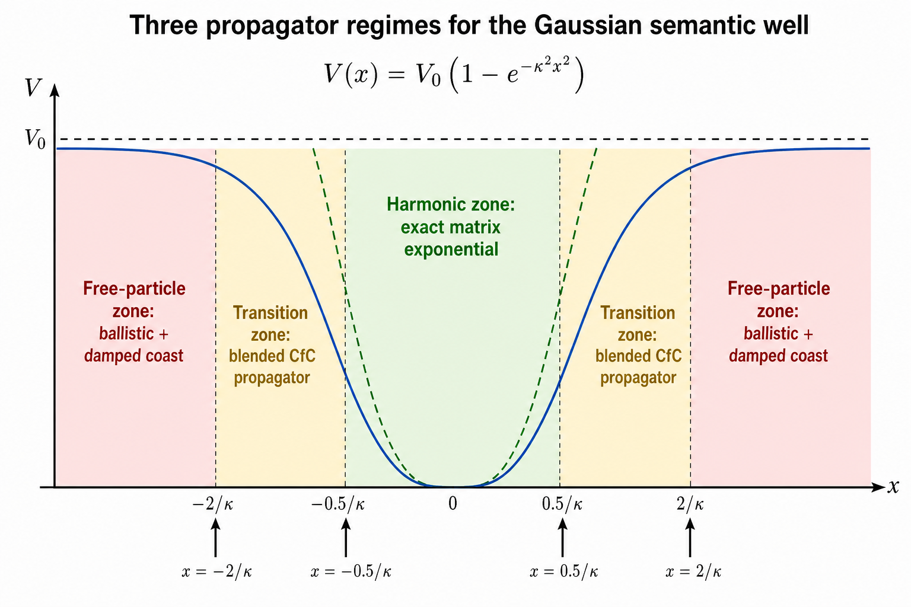
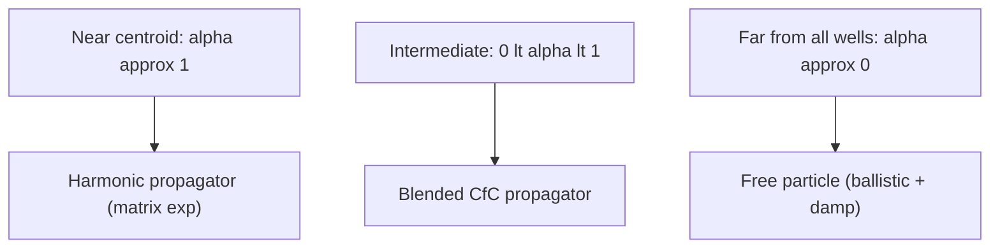
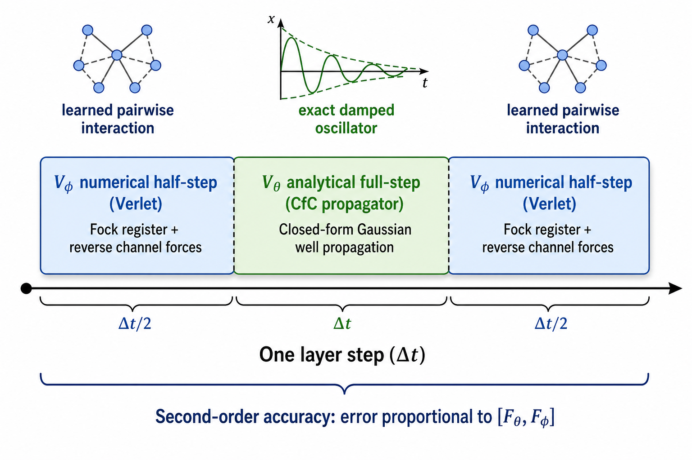
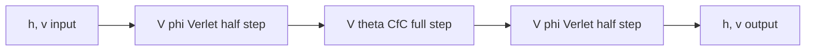
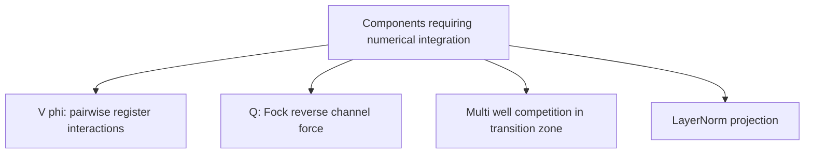
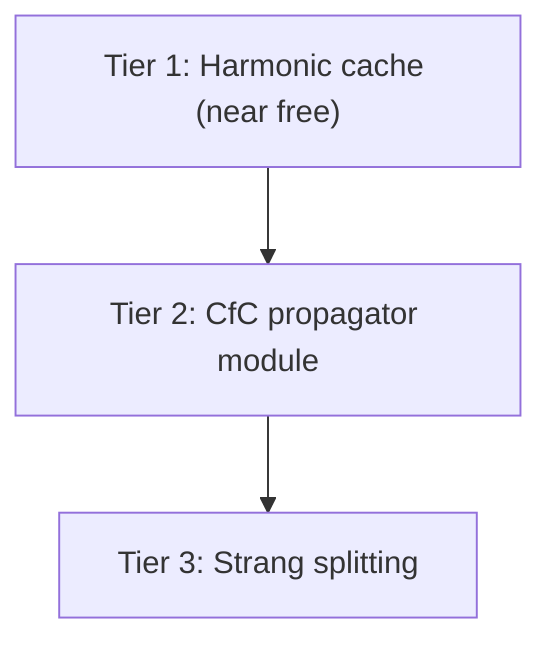
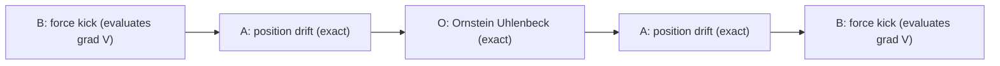
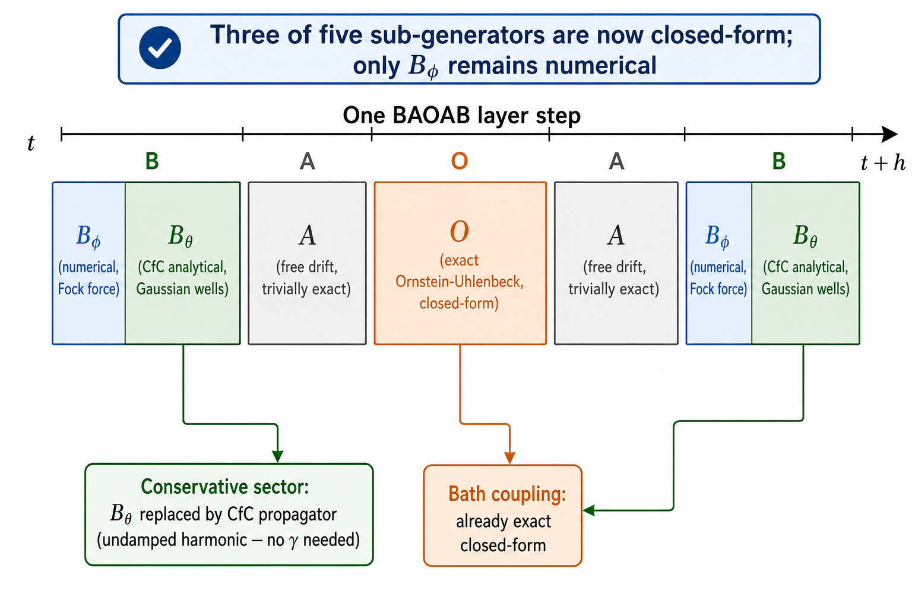
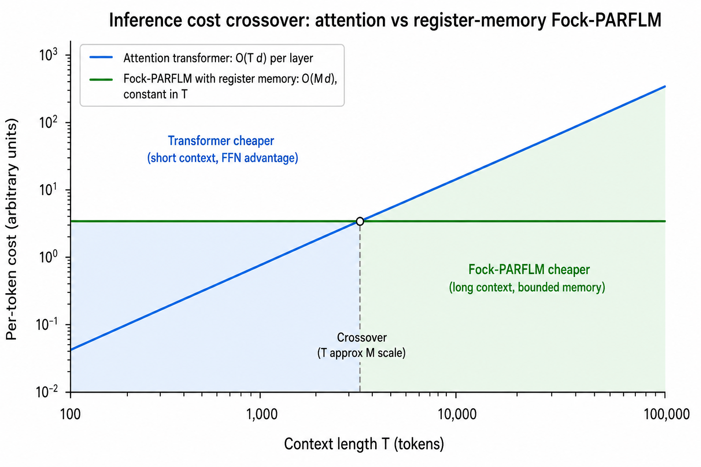
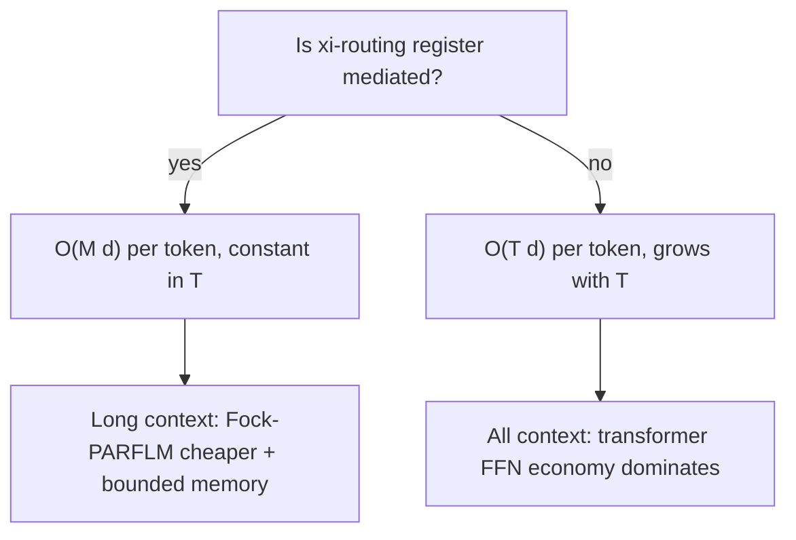

# Closed-Form and Hybrid Integration Strategies for Fock-PARFLM

**Date:** July 2026
**Author context:** SemSimula / Fock-PARFLM independent research program
**Companion to:** Parallels and Lessons from Liquid Neural Networks (Lesson 2), Scaling Up the SPLM Family Architecture

---

## 1. Motivation

The Fock-PARFLM forward pass integrates a damped second-order dynamical system through $L$ layers (typically $L = 16$), with each layer performing velocity-Verlet half-steps that evaluate the gradient of a **known, closed-form scalar potential** $V\_\theta(h)$. This is the computational hot path: at $d = 768$ with 32 Gaussian wells, each gradient evaluation dominates the per-layer cost.

The Liquid Neural Network (LNN) program faced the identical bottleneck. Their ODE solver was killed in 2021 by the **Closed-form Continuous-time (CfC)** network: an analytical approximation to the ODE solution that removed the integrator from the hot path while retaining continuous-time semantics. That move made LNNs practical.

**Lesson 2** from the LNN companion note asks: can SemSimula do the same? The answer depends on how much of $V\_\theta$ admits closed-form propagation. This document analyses the question precisely, identifies three strategies in decreasing order of exactness, provides PyTorch pseudocode for each, and flags what remains irreducibly numerical.

---

## 2. The dynamical system

The per-layer state update for a single token with hidden state $h$ and velocity $v$, both in $\mathbb{R}^d$, is the damped Newton equation:

$$
\ddot{h} + \gamma \dot{h} = -\nabla\_h V\_\theta(h) + Q(h, r)
$$

where

- $V\_\theta(h)$ is the depth-conditioned multi-context Gaussian scalar potential (conservative, closed-form),
- $Q(h, r)$ is the Fock reverse-channel generalised force (non-conservative, numerical),
- $\gamma$ is the damping coefficient (with effective value $\gamma\_{\mathrm{eff}} \ll \gamma\_{\mathrm{param}}$ after LayerNorm counter-damping).

The current implementation discretises this as a velocity-Verlet (leapfrog) scheme:

$$
v\_{n+1/2} = v\_n - \frac{\Delta t}{2} \nabla\_h V\_\theta(h\_n) + \frac{\Delta t}{2} Q\_n
$$

$$
h\_{n+1} = h\_n + \Delta t \cdot v\_{n+1/2}
$$

$$
v\_{n+1} = v\_{n+1/2} - \frac{\Delta t}{2} \nabla\_h V\_\theta(h\_{n+1}) + \frac{\Delta t}{2} Q\_{n+1}
$$

Each of the $L = 16$ layers executes this three-line update, evaluating $\nabla\_h V\_\theta$ **twice** per layer (once at the old position, once at the new). The question is whether these $2L = 32$ gradient evaluations can be reduced or eliminated.

---

## 3. Why an exact global solution does not exist

The Gaussian potential for a single well centred at $\mu\_k$ is

$$
V\_k(h) = V\_0 \bigl(1 - \exp(-\kappa\_k^2 \lVert h - \mu\_k \rVert^2)\bigr)
$$

The resulting force is

$$
F\_k(h) = -\nabla\_h V\_k = 2 V\_0 \kappa\_k^2 (h - \mu\_k) \exp(-\kappa\_k^2 \lVert h - \mu\_k \rVert^2)
$$

This is a **nonlinear** function of $h$. Unlike the harmonic oscillator ($F \propto h$), the Morse oscillator, or the Poschl-Teller potential, the Gaussian well ODE has no known closed-form solution for arbitrary initial conditions in the classical (non-quantum) damped case. The exponential envelope $\exp(-\kappa^2 x^2)$ means the force vanishes at both $x = 0$ and $x \to \infty$, peaking at $x = 1/(\kappa\sqrt{2})$ --- a shape that admits no algebraic flow map.

**However**, the potential has exactly solvable limits at both ends of the displacement range, and this is the key structural fact that enables hybrid strategies.

---

## 4. Three propagator regimes

The Gaussian well has three natural zones, each with a different analytical character:



**Figure 1.** The Gaussian potential (solid blue) matches the harmonic parabola (dashed green) near the centroid and saturates to $V\_0$ far away. Three zones arise: (i) harmonic zone near the centroid where the matrix-exponential propagator is exact, (ii) transition zone where the blended CfC propagator interpolates, (iii) free-particle zone where the force vanishes and the trajectory is ballistic with damped coasting.

The Gaussian envelope $\alpha\_k(h) = \exp(-\kappa\_k^2 \lVert h - \mu\_k \rVert^2)$ acts as a natural interpolation weight between these zones. When $\alpha\_k \approx 1$ (near centroid), the harmonic approximation is tight. When $\alpha\_k \approx 0$ (far away), the particle is effectively free.



---

## 5. Strategy 1 --- Exact harmonic propagator (matrix exponential)

### 5.1 Derivation

Near centroid $\mu\_k$, the second-order Taylor expansion of $V\_k$ gives

$$
V\_k(h) \approx -V\_0 + V\_0 \kappa\_k^2 \lVert h - \mu\_k \rVert^2 = -V\_0 + \tfrac{1}{2}\omega\_k^2 \lVert h - \mu\_k \rVert^2
$$

where $\omega\_k^2 = 2 V\_0 \kappa\_k^2$ is the angular frequency squared. The resulting equation of motion is **linear**:

$$
\ddot{h} + \gamma \dot{h} + \omega\_k^2 (h - \mu\_k) = 0
$$

In matrix form, writing $\tilde{h} = h - \mu\_k$:

$$
\frac{d}{dt}\begin{pmatrix}\tilde{h}\\v\end{pmatrix} = \underbrace{\begin{pmatrix}0 & I\\-\omega\_k^2 I & -\gamma I\end{pmatrix}}\_{A\_k}\begin{pmatrix}\tilde{h}\\v\end{pmatrix}
$$

This has the **exact solution** $\Phi\_k(\Delta t) = \exp(A\_k \Delta t)$.

### 5.2 Underdamped case (the measured regime)

With $\gamma\_{\mathrm{eff}} \approx 0.04$--$0.13$ (after LayerNorm counter-damping) and typical $\omega\_k$ values from learned well parameters, the condition $\gamma\_{\mathrm{eff}} \lt 2\omega\_k$ holds --- the system is **underdamped**. The propagator decomposes as:

$$
\omega'\_k = \sqrt{\omega\_k^2 - \gamma^2/4}
$$

$$
\Phi\_k(\Delta t) = e^{-\gamma \Delta t/2}\begin{pmatrix}\cos(\omega'\_k \Delta t) I + \frac{\gamma}{2\omega'\_k}\sin(\omega'\_k \Delta t) I & \frac{\sin(\omega'\_k \Delta t)}{\omega'\_k} I \\[6pt] -\omega'\_k \sin(\omega'\_k \Delta t) I & \cos(\omega'\_k \Delta t) I - \frac{\gamma}{2\omega'\_k}\sin(\omega'\_k \Delta t) I\end{pmatrix}
$$

This is a **single-shot propagator** that replaces all $L$ Verlet steps for the $V\_\theta$ contribution with one matrix multiply. The cost is $O(d)$ per token (diagonal blocks), computed once at initialisation and reused throughout training.

### 5.3 Error bound

The error relative to the true Gaussian dynamics comes from the neglected higher-order terms in the Taylor expansion. Writing $r = \lVert h - \mu\_k \rVert$:

$$
\lVert F\_{\mathrm{Gaussian}} - F\_{\mathrm{harmonic}} \rVert = O(\kappa\_k^4 r^3 V\_0)
$$

This is small when $\kappa\_k r \ll 1$ (the token is near its dominant attractor) and grows in the transition zone.

### 5.4 PyTorch pseudocode

```python
import torch
import math


def build_harmonic_propagator(omega_k, gamma_eff, dt, device):
    """
    Precompute the 2x2 block propagator for the harmonic
    approximation of a single Gaussian well.

    Returns four (d,)-shaped vectors: Phi_hh, Phi_hv, Phi_vh, Phi_vv
    that act element-wise (diagonal propagator).
    """
    disc = omega_k ** 2 - (gamma_eff / 2) ** 2
    underdamped = disc > 0

    omega_prime = torch.sqrt(torch.clamp(disc, min=1e-12))
    decay = torch.exp(-gamma_eff * dt / 2)

    cos_w = torch.cos(omega_prime * dt)
    sin_w = torch.sin(omega_prime * dt)
    g_over_2w = gamma_eff / (2 * omega_prime + 1e-12)

    Phi_hh = decay * (cos_w + g_over_2w * sin_w)
    Phi_hv = decay * sin_w / (omega_prime + 1e-12)
    Phi_vh = -decay * omega_prime * sin_w
    Phi_vv = decay * (cos_w - g_over_2w * sin_w)

    return Phi_hh, Phi_hv, Phi_vh, Phi_vv


def harmonic_step(h, v, mu_k, propagator):
    """
    Apply the exact harmonic propagator for one well.

    h, v: (batch, seq, d)
    mu_k: (d,) centroid
    propagator: tuple of four (d,) tensors
    """
    Phi_hh, Phi_hv, Phi_vh, Phi_vv = propagator
    h_tilde = h - mu_k
    h_new = mu_k + Phi_hh * h_tilde + Phi_hv * v
    v_new = Phi_vh * h_tilde + Phi_vv * v
    return h_new, v_new
```

---

## 6. Strategy 2 --- Blended CfC propagator

### 6.1 Core idea

The Gaussian potential has two exactly solvable limits:

| Region | Force | Exact solution |
|---|---|---|
| Near centroid (alpha\_k → 1) | Harmonic: −omega\_k²(h − mu\_k) | Matrix exponential Phi\_k(Delta t) |
| Far from all wells (alpha\_k → 0) | Zero (free particle) | Ballistic: h' = h + v Delta t, v' = v exp(−gamma Delta t) |

The key insight: the Gaussian envelope $\alpha\_k(h) = \exp(-\kappa\_k^2 \lVert h - \mu\_k \rVert^2)$ that appears in $\nabla V\_\theta$ is itself the natural interpolation weight.

### 6.2 The blended propagator

For a multi-well potential with $K$ wells, the CfC-analog propagator is:

$$
\begin{pmatrix}h'\\v'\end{pmatrix} = \sum\_{k=1}^{K} \alpha\_k(h) \Phi\_k(\Delta t) \begin{pmatrix}h - \mu\_k\\v\end{pmatrix} + \Bigl(1 - \textstyle\sum\_{k=1}^{K} \alpha\_k(h)\Bigr) \begin{pmatrix}h + v \Delta t\\v e^{-\gamma \Delta t}\end{pmatrix}
$$

This is the direct CfC analog that Lesson 2 of the LNN companion note calls "the single highest-leverage bridge." It is:

- **Exact at both limits**: harmonic near any centroid, ballistic far away
- **Smooth everywhere**: the Gaussian envelope provides $C^\infty$ blending
- **Single-pass per layer**: replaces the inner Verlet loop entirely
- **Differentiable**: all components have analytical gradients for backpropagation

### 6.3 Error analysis

The blending error is largest in the transition zone ($\lVert h - \mu\_k \rVert \approx \kappa\_k^{-1}$) where neither limit is exact. At the midpoint $\kappa\_k r = 1$, the Gaussian envelope is $\alpha\_k = e^{-1} \approx 0.37$, and the harmonic approximation error is $O(\kappa\_k^4 r^3 V\_0) \approx O(\kappa\_k V\_0)$.

For a first-order correction in the transition zone, a **Magnus expansion** term can be added:

$$
\Phi\_k^{(1)}(\Delta t) = \Phi\_k^{(0)}(\Delta t) + \frac{\Delta t^2}{2} [A\_k, B\_k]
$$

where $B\_k$ captures the cubic correction to the force. This is straightforward to compute but typically unnecessary if the blending weights are sufficiently concentrated (well-separated wells).

### 6.4 PyTorch pseudocode

```python
import torch


class CfCPropagator(torch.nn.Module):
    """
    Blended closed-form propagator for the multi-well
    Gaussian V_theta. Replaces the Verlet integration
    loop for the conservative force.
    """

    def __init__(self, centroids, kappas, V0, gamma_eff, dt):
        """
        centroids: (K, d) — well centres
        kappas:    (K,)   — shape parameters
        V0:        scalar — well depth
        gamma_eff: scalar — effective damping
        dt:        scalar — layer time step
        """
        super().__init__()
        self.register_buffer("centroids", centroids)
        self.register_buffer("kappas", kappas)
        self.V0 = V0
        self.gamma_eff = gamma_eff
        self.dt = dt

        K, d = centroids.shape
        omega_k = torch.sqrt(2 * V0 * kappas ** 2)

        self.propagators = []
        for k in range(K):
            omega_vec = omega_k[k].expand(d)
            prop = build_harmonic_propagator(
                omega_vec, gamma_eff, dt, centroids.device
            )
            self.propagators.append(prop)

        decay = torch.exp(
            torch.tensor(-gamma_eff * dt, device=centroids.device)
        )
        self.register_buffer("free_decay", decay)

    def forward(self, h, v):
        """
        h: (batch, seq, d)
        v: (batch, seq, d)
        Returns: (h_new, v_new)
        """
        K = self.centroids.shape[0]

        displacements = (
            h.unsqueeze(-2) - self.centroids
        )  # (B, T, K, d)

        sq_dist = (displacements ** 2).sum(dim=-1)  # (B, T, K)
        alpha = torch.exp(
            -self.kappas.unsqueeze(0).unsqueeze(0) ** 2 * sq_dist
        )  # (B, T, K)

        h_acc = torch.zeros_like(h)
        v_acc = torch.zeros_like(v)

        for k in range(K):
            h_k, v_k = harmonic_step(
                h, v, self.centroids[k], self.propagators[k]
            )
            w = alpha[:, :, k].unsqueeze(-1)  # (B, T, 1)
            h_acc = h_acc + w * h_k
            v_acc = v_acc + w * v_k

        alpha_total = alpha.sum(dim=-1, keepdim=True)  # (B, T, 1)
        free_weight = 1.0 - alpha_total

        h_free = h + v * self.dt
        v_free = v * self.free_decay

        h_new = h_acc + free_weight * h_free
        v_new = v_acc + free_weight * v_free

        return h_new, v_new
```

---

## 7. Strategy 3 --- Strang operator splitting

### 7.1 The problem of mixed forces

The full equation of motion has both a conservative force ($-\nabla V\_\theta$, closed-form) and a non-conservative force ($Q$ from Fock registers and the reverse channel, numerical). The CfC propagator handles $V\_\theta$ analytically but says nothing about $Q$. The standard approach for mixed analytically/numerically solvable subsystems is **operator splitting**.

### 7.2 Strang splitting

The Strang (symmetric) splitting divides one layer step $\Delta t$ into three sub-steps:



**Figure 2.** Strang splitting separates the conservative $V\_\theta$ propagation (analytical, green) from the Fock register / reverse channel forces (numerical Verlet, blue). The symmetric half-step structure yields second-order accuracy.

The scheme is:

1. **Half-step numerical** ($\Delta t / 2$): apply Fock register and reverse-channel forces $Q$ via Verlet
2. **Full-step analytical** ($\Delta t$): propagate under $V\_\theta$ using the CfC propagator
3. **Half-step numerical** ($\Delta t / 2$): apply $Q$ again via Verlet



### 7.3 Error bound

The Strang splitting error over one step is

$$
\lVert e\_{\mathrm{split}} \rVert = O(\Delta t^3 \lVert [F\_\theta, F\_\phi] \rVert)
$$

where $[F\_\theta, F\_\phi]$ is the Lie bracket (commutator) of the two force fields. This is small when:

- The Fock channel is weak relative to $V\_\theta$ (early training, near equilibrium)
- The two forces act on nearly orthogonal subspaces (the Fock channel primarily modifies register-coupled components)

The splitting is **second-order accurate** (matching the Verlet scheme it replaces) and **symplectic in the $V\_\theta$ sector** (the CfC propagator exactly preserves the modified energy of the harmonic approximation).

### 7.4 Computational savings

| Component | Current (full Verlet) | With Strang splitting |
|---|---|---|
| grad V\_theta evaluations per layer | 2 | 0 (replaced by CfC) |
| Q evaluations per layer | 2 | 2 (unchanged) |
| Matrix multiply per layer | 0 | 1 (CfC propagator) |
| Total FLOPS dominant term | 2L K d (gradient) | L d (propagator) |
| Scaling with K (wells) | Linear | Constant (precomputed) |

At $d = 768$, $K = 32$, $L = 16$: the $\nabla V\_\theta$ evaluations are $2 \times 16 \times 32 \times 768 \approx 786{,}432$ multiply-adds per token. The CfC propagator replaces this with $16 \times 768 \times 4 \approx 49{,}152$ element-wise operations --- roughly a **16x reduction** in the $V\_\theta$ hot path.

### 7.5 PyTorch pseudocode

```python
import torch


class StrangSplitLayer(torch.nn.Module):
    """
    One integration layer using Strang splitting:
    half-step V_phi (Verlet) + full-step V_theta (CfC) +
    half-step V_phi (Verlet).
    """

    def __init__(self, cfc_propagator, fock_module, dt, gamma):
        super().__init__()
        self.cfc = cfc_propagator
        self.fock = fock_module
        self.dt = dt
        self.gamma = gamma
        self.half_dt = dt / 2

    def verlet_half_step_phi(self, h, v, registers, mask):
        """Numerical half-step for V_phi (Fock + reverse channel)."""
        Q = self.fock.compute_force(h, registers, mask)
        v_half = v + self.half_dt * Q
        v_half = v_half / (1 + self.half_dt * self.gamma)
        return v_half

    def forward(self, h, v, registers, mask):
        # 1. Half-step V_phi (numerical)
        v = self.verlet_half_step_phi(h, v, registers, mask)

        # 2. Full-step V_theta (analytical CfC)
        h, v = self.cfc(h, v)

        # 3. Half-step V_phi (numerical)
        v = self.verlet_half_step_phi(h, v, registers, mask)

        return h, v
```

---

## 8. What remains irreducibly numerical

Not everything can be made analytical. The following components **must** stay numerical:



1. **$V\_\phi$ (pairwise potential)**: the register-mediated interaction potential involves learned projections ($q\_k, k\_j, v\_j$) and softmax routing. Its force is structurally non-Gaussian and has no closed-form propagator.

2. **Fock reverse-channel force $Q$**: the non-conservative generalised force that mediates register-to-token feedback. It is the mechanism that breaks the conservative obstruction, and by definition it is not derivable from any scalar potential.

3. **Multi-well competition**: when two or more wells have comparable $\alpha\_k(h)$ (the token sits between attractors), neither the single-dominant-well harmonic approximation nor the free-particle limit is accurate. The blended CfC propagator handles this gracefully but with an interpolation error that is $O(\kappa V\_0)$ at worst.

4. **LayerNorm projection**: the counter-damping mechanism that reduces $\gamma\_{\mathrm{eff}}$ below $\gamma\_{\mathrm{param}}$. This is a nonlinear projection onto a sphere and cannot be absorbed into the linear propagator.

---

## 9. Implementation roadmap

Three tiers of increasing implementation effort:



### Tier 1 --- Harmonic cache (near-free)

**Effort:** ~20 lines of code. **Payoff:** eliminates $\nabla V\_\theta$ evaluations for tokens near their dominant well.

- Precompute $\Phi\_k(\Delta t)$ for each depth code and each well at model initialisation
- At runtime, check $\alpha\_k(h) \gt \tau$ (threshold, e.g. $\tau = 0.8$)
- If above threshold: use matrix-exponential propagator (exact harmonic)
- If below threshold: fall back to standard Verlet

This is a **drop-in replacement** that requires no architectural changes and can be toggled with a flag.

### Tier 2 --- CfC propagator module

**Effort:** ~80 lines of PyTorch (the `CfCPropagator` class above). **Payoff:** replaces the entire inner Verlet loop for $V\_\theta$ with a single analytical forward pass.

- Implement the blended CfC propagator as a new `nn.Module`
- Measure two quality axes: **energy drift** (should be comparable to Verlet) and **PPL** (should match or improve)
- If PPL is preserved, the Verlet loop for $V\_\theta$ is permanently replaced

### Tier 3 --- Strang splitting

**Effort:** architectural refactor of the layer module. **Payoff:** clean separation of analytical and numerical integration, enabling independent optimisation of each.

- Refactor the integration loop to separate $V\_\theta$ and $V\_\phi$ substeps
- Insert the CfC propagator for the $V\_\theta$ full-step
- Keep Verlet for the $V\_\phi$ half-steps
- Measure the Lie bracket $\lVert [F\_\theta, F\_\phi] \rVert$ to quantify the splitting error

---

## 10. Application to the O-Step Langevin (BAOAB) integrator

The three strategies above were derived for the velocity-Verlet integrator that Fock-PARFLM currently uses. A natural question is whether they transfer to the **BAOAB** integrator proposed by the Langevin dynamics reformulation. The answer is yes --- and the fit is **cleaner** than for bare Verlet, because BAOAB has already separated the physics into exactly the right pieces.

### 10.1 BAOAB recap: three sub-generators

The BAOAB splitting (Leimkuhler and Matthews 2013; companion note `Langevin_dynamics_reformulation_of_classical_damped_Lagrangian_flow.md` §7) decomposes the Langevin generator into three exactly integrable pieces applied in palindromic order **B-A-O-A-B**:

$$
\text{B:}\quad p \leftarrow p + h F(x), \qquad F = -\nabla\_x V
$$

$$
\text{A:}\quad x \leftarrow x + h m^{-1} p
$$

$$
\text{O:}\quad p \leftarrow e^{-\gamma h} p + \sqrt{\frac{\sigma^2}{2\gamma}(1 - e^{-2\gamma h})} R, \quad R \sim \mathcal{N}(0, I)
$$

The key structural fact: **only the B-steps evaluate the force** $F = -\nabla V\_\theta$. The A-steps are trivially exact free-particle position drifts. The O-step is already the **exact closed-form solution** of the Ornstein-Uhlenbeck process --- it is not discretised at all.



### 10.2 Why BAOAB is the better home for the CfC propagator

In bare Verlet, the damping term $-\gamma v$ is entangled with the force evaluation in the velocity update. The CfC propagator must therefore solve the **damped** harmonic oscillator, requiring the full 2x2 matrix exponential with competing exponential decays. In BAOAB, the B-step is **purely conservative** --- no damping at all. The damping lives exclusively in the O-step, where it is already solved exactly.

This means the CfC propagator in the BAOAB context reduces to the **undamped** harmonic propagator:

$$
\Phi\_k^{\text{B}}(\Delta t) = \begin{pmatrix}\cos(\omega\_k \Delta t) & \frac{\sin(\omega\_k \Delta t)}{\omega\_k}\\[4pt] -\omega\_k \sin(\omega\_k \Delta t) & \cos(\omega\_k \Delta t)\end{pmatrix}
$$

No $\gamma\_{\mathrm{eff}}$ anywhere. The propagator is simpler, numerically better conditioned (no competing exponential decays), and does not require knowledge of the effective damping coefficient.

Three advantages follow:

1. **Cleaner separation of concerns.** The CfC propagator handles only the conservative force; the O-step handles only the bath coupling. Each is exact in its own domain.

2. **The O-step is itself a "CfC for dissipation."** The Langevin companion note already identifies the STP-BAOAB variant as "the framework's first move toward an amortised conservative propagator." BAOAB was designed to make the conservative force the only remaining numerical piece, and the CfC propagator eliminates exactly that piece.

3. **Composable error accounting.** The BAOAB splitting error between conservative and bath generators is O(h^2) with a coefficient that decays as gamma^{-2}. The inner V\_theta/V\_phi splitting adds an independent O(h^3 commutator(F\_theta, F\_phi)) error. In bare Verlet these errors are entangled.

### 10.3 How the three strategies map onto BAOAB

**Strategy 1 (harmonic cache)** replaces each B-step's force evaluation with the precomputed harmonic kick when the token is near its dominant well centroid. The threshold check $\alpha\_k(h) \gt \tau$ is identical.

**Strategy 2 (CfC blended propagator)** replaces the BA half-evolution with a single analytical pass. One BAOAB layer step becomes:

1. **BA** (first half): blended CfC propagator over $\Delta t / 2$ (conservative, analytical)
2. **O**: exact Ornstein-Uhlenbeck (unchanged)
3. **AB** (second half): blended CfC propagator over $\Delta t / 2$ (conservative, analytical)

**Strategy 3 (Strang splitting with Fock forces)** produces a nested double splitting. The B-step itself splits into a conservative V\_theta kick (CfC) and a non-conservative V\_phi/Q kick (numerical):

$$
\text{B}\_\phi \to \text{B}\_\theta^{\text{CfC}} \to \text{A} \to \text{O} \to \text{A} \to \text{B}\_\theta^{\text{CfC}} \to \text{B}\_\phi
$$



**Figure 3.** BAOAB layer step with CfC propagator replacement. The B-steps are split into a numerical Fock-force kick (B\_phi, blue) and an analytical Gaussian-well propagator (B\_theta, green). The A-steps (gray) are trivially exact free drifts. The O-step (orange) is already the exact closed-form Ornstein-Uhlenbeck solution. Three of five sub-generators are now closed-form; only B\_phi remains numerical.

### 10.4 Sub-generator scorecard

| Sub-generator | Bare Verlet | BAOAB (current) | BAOAB + CfC (proposed) |
|---|---|---|---|
| V\_theta force | Numerical (2 evals/layer) | Numerical (2 evals/layer) | Analytical (CfC propagator) |
| V\_phi / Q force | Numerical | Numerical | Numerical (unchanged) |
| Position drift | Numerical (entangled) | Exact (A-step) | Exact (A-step) |
| Dissipation | Numerical (entangled) | Exact (O-step) | Exact (O-step) |
| Fluctuation (noise) | Not present | Exact (O-step) | Exact (O-step) |

In the proposed BAOAB + CfC configuration, **four of five sub-generators are solved in closed form**. Only the Fock register interaction (V\_phi and the reverse-channel force Q) remains numerical --- and that is the irreducibly non-Gaussian, non-conservative component that no analytical propagator can absorb.

### 10.5 PyTorch pseudocode

```python
import torch
import math


class BAOABCfCLayer(torch.nn.Module):
    """
    One BAOAB integration layer with CfC propagator
    for V_theta and numerical kicks for V_phi/Q.
    """

    def __init__(self, cfc_propagator, fock_module, dt, gamma, mass, temperature):
        super().__init__()
        self.cfc = cfc_propagator
        self.fock = fock_module
        self.dt = dt
        self.half_dt = dt / 2
        self.gamma = gamma
        self.mass = mass

        # O-step constants (exact OU solution)
        self.c1 = math.exp(-gamma * dt)
        self.c2 = math.sqrt(
            (temperature / mass) * (1 - self.c1 ** 2)
        )

    def b_step_phi(self, p, h, registers, mask):
        """Numerical B-step for Fock forces only."""
        Q = self.fock.compute_force(h, registers, mask)
        return p + self.half_dt * Q

    def a_step(self, x, p):
        """Exact A-step: free-particle position drift."""
        return x + self.half_dt * p / self.mass

    def o_step(self, p):
        """Exact O-step: closed-form Ornstein-Uhlenbeck."""
        noise = torch.randn_like(p)
        return self.c1 * p + self.c2 * noise

    def forward(self, x, p, registers, mask):
        # B: numerical Fock kick (half-step)
        p = self.b_step_phi(p, x, registers, mask)

        # B: analytical V_theta via CfC (half-step, undamped)
        x, p = self.cfc(x, p)

        # A: exact position drift (half-step)
        x = self.a_step(x, p)

        # O: exact Ornstein-Uhlenbeck (full step)
        p = self.o_step(p)

        # A: exact position drift (half-step)
        x = self.a_step(x, p)

        # B: analytical V_theta via CfC (half-step, undamped)
        x, p = self.cfc(x, p)

        # B: numerical Fock kick (half-step)
        p = self.b_step_phi(p, x, registers, mask)

        return x, p
```

### 10.6 Implications for the implementation roadmap

The three tiers from §9 apply unchanged, with one simplification at each tier:

- **Tier 1 (harmonic cache):** the cached propagator is the undamped matrix exponential --- no $\gamma\_{\mathrm{eff}}$ estimation needed
- **Tier 2 (CfC module):** the `build_harmonic_propagator` function drops the $\gamma$ parameter entirely; the blending weights $\alpha\_k(h)$ are unchanged
- **Tier 3 (Strang splitting):** the outer BAOAB structure provides the Strang scaffold for free; the inner V\_theta/V\_phi split nests inside the B-steps

The recommendation is to implement the BAOAB + CfC combination directly rather than implementing CfC on bare Verlet first and then migrating to BAOAB later. The BAOAB version is simpler (undamped propagator), has cleaner error bounds, and delivers the Langevin thermostat simultaneously.

---

## 11. Relation to the LNN trajectory

The following table maps each LNN milestone to the corresponding SemSimula strategy:

| LNN milestone | What it did | SemSimula analog | Status |
|---|---|---|---|
| LTC ODE (2020) | Pure numerical ODE solver | Velocity-Verlet integrator | Current production |
| CfC (2021) | Closed-form ODE solution | Blended CfC propagator (Strategy 2) | Proposed |
| Liquid-S4 (2022) | Structured state-space recurrence | Harmonic propagator cache (Strategy 1) | Near-free to implement |
| LFM2 (2025) | Hybrid: cheap operators + sparse GQA | Strang splitting (Strategy 3) | Architectural refactor |

The critical lesson: the LNN program went from pure ODE to closed-form in 18 months (Jun 2020 to Dec 2021). That single move --- CfC --- was the transition from research artifact to practical system. The SemSimula framework is in a **more favourable position** for this transition because:

1. $V\_\theta$ is an explicit, fixed-form Gaussian (not a black-box neural ODE)
2. The well parameters ($\mu\_k, \kappa\_k, V\_0$) are directly available from the model
3. The harmonic approximation is **exact** near attractors, not a learned approximation
4. The underdamped regime ($\gamma\_{\mathrm{eff}} \approx 0.13$) gives clean oscillatory dynamics where the matrix-exponential propagator is particularly accurate

---

## 12. Inference cost versus attention-based transformers

A recurring concern is that the numerical integration must slow inference down relative to a plain attention transformer. This section builds a rough cost model, locates where the cost actually lives, and quantifies how much the closed-form and hybrid strategies recover. All numbers are order-of-magnitude estimates with error bars easily as large as a factor of two.

### 12.1 The integration arithmetic is not the bottleneck

The first correction to the intuition: the Verlet or BAOAB **stepping arithmetic** is negligible. A step update is O(d) element-wise operations per layer, and even the V\_theta force over K Gaussian wells is only about 2Kd multiply-adds per layer. For K = 32 and d = 768 that is roughly 49{,}000 MACs, versus a single d-by-d projection at d^2 ≈ 590{,}000 MACs. The stepping math is **under 1%** of a layer's cost:

$$
\frac{\text{force-eval MACs}}{\text{projection MACs}} \approx \frac{2Kd}{d^2} = \frac{2K}{d} = \frac{64}{768} \approx 0.083
$$

and that is before the force term is compared against the full per-layer matmul budget, against which it is well under one percent.

### 12.2 Per-token, per-layer FLOP model

The dominant costs are the dense matrix operations, which are broadly comparable between the two architectures:

| Operation | Transformer | Fock-PARFLM | Notes |
|---|---|---|---|
| Projections (QKVO / phase-space embed + readout) | 4 d^2 | ~4 d^2 | comparable |
| FFN (4x expansion) | 8 d^2 | none | transformer's big cost |
| Fock register QKV + reverse channel | none | ~5 to 6 d^2 | replaces the FFN role |
| V\_theta force (Gaussian bank) | none | ~2 K d (about 0.05 d^2) | negligible in FLOPs |
| Attention / xi-routing (context length T) | 2 T d | 2 T d or 2 M d | see 12.5 |
| Dense matmul subtotal | ~12 d^2 | ~10 d^2 | roughly equal |

The headline: at equal hidden dimension d and equal layer count L, Fock-PARFLM is **within about 1x** of a transformer in raw FLOPs. The extra Fock machinery roughly substitutes for the transformer's feed-forward network.

### 12.3 Where Fock-PARFLM actually loses time

Three constant factors, none of which is the integration formula:

1. **Step count.** If the dynamics need L integration steps where a transformer needs fewer blocks for matched quality, the ratio is a direct multiplier. It worsens if the Gaussian wells are **stiff**: explicit Verlet is stability-limited to $\omega \Delta t \lesssim 2$, forcing many small steps. This is the ODE-solver tax that motivated the CfC move in the LNN lineage.

2. **Hardware utilisation (MFU).** The force evaluation uses `exp`, distance computations, and gather/scatter over wells and registers. These small non-GEMM kernels fuse badly and run at low arithmetic intensity, dragging wall-clock roughly 1.5 to 2x above the FLOP prediction.

3. **Velocity state.** Carrying both position and velocity doubles activation memory and adds bandwidth pressure, though little compute.

### 12.4 What the best strategy recovers

The most suitable configuration is the harmonic / CfC propagator inside BAOAB (§10). Its speed contribution is **not** mainly the eliminated force FLOPs --- it is:

- **Unconditional stability, hence larger time steps, hence fewer layers.** The harmonic propagator is exact for the linear part of the flow, so $\Delta t$ is no longer limited by well stiffness $\omega$. This is the CfC lesson --- collapse many small stiff steps into one analytic jump --- and it plausibly cuts L by 2 to 4x when the current L is stiffness-dictated rather than expressivity-dictated.
- **Removal of the exp / gather kernel** from the V\_theta path, recovering MFU on that portion.

Rough per-token cost at matched d and matched quality, short context:

| Configuration | Inference cost vs. matched transformer |
|---|---|
| Fock-PARFLM, plain Verlet, stiffness-limited L | ~2 to 4x slower |
| Fock-PARFLM, harmonic / CfC + BAOAB | ~1 to 2x slower |
| Theoretical floor (FLOP-matched, ideal kernels) | ~1x |

The best strategy roughly **halves the gap**: from "2 to 4x slower" toward "within 2x," with the residual being kernel efficiency and intrinsic step count, not the integration formula.

### 12.5 The long-context crossover

One regime can flip the comparison in Fock-PARFLM's favour. If the M Fock registers act as a **fixed-size persistent latent memory** (like a state-space or recurrent hidden state) rather than a growing per-token KV cache, then register attention is O(M d) per token, **constant in context length T**. A transformer's attention is O(T d) per token, with a KV cache that grows with T.

$$
C\_{\text{transformer}}(T) = a d^2 + b T d, \qquad C\_{\text{Fock}}(T) = a' d^2 + b' M d
$$

The first term is context-independent (projections, FFN or Fock machinery); only the transformer's second term grows with T. Setting the two equal gives a crossover context length:

$$
T\_{\times} = \frac{(a' - a) d^2 + b' M d}{b d} = \frac{(a' - a) d}{b} + \frac{b'}{b} M
$$

Below $T\_{\times}$ the transformer's FFN economy wins; above it, Fock-PARFLM's bounded-memory attention wins, and it additionally enjoys **non-growing** memory.



**Figure 4.** Per-token cost versus context length. The transformer (blue) grows as O(T d) per layer; register-memory Fock-PARFLM (green) is flat at O(M d). The crossover near the register-count scale separates the short-context regime (transformer cheaper, FFN advantage) from the long-context regime (Fock-PARFLM cheaper, bounded memory). This advantage is contingent on the xi-routed conservative attention being register-mediated O(M) rather than full O(T); any full-attention component removes it.



### 12.6 Autoregressive generation

During token-by-token generation the picture sharpens around memory:

- **Transformer:** each new token attends over a KV cache of size O(T d) per layer. Both compute and memory grow linearly with the generated length.
- **Fock-PARFLM with persistent registers:** each new token updates a fixed O(M d) register state per layer. Compute and memory are **constant** in the generated length --- the state-space-model profile.

If the registers are instead re-derived per token (not persistent across the sequence), this advantage is lost and the two profiles converge. The register semantics during generation are therefore the single most important architectural determinant of long-context inference cost.

### 12.7 Caveats

The dominant unknowns behind these estimates are: whether the current L is set by integration stability (helped by closed-form) or by needed expressive depth (not helped); the real MFU of the Fock kernels on the target hardware; and the register semantics during autoregressive generation. The one robust conclusion is that the integration scheme is a **constant-factor** cost, not an asymptotic one, and the closed-form / BAOAB strategy attacks exactly the two pieces --- step count and exp / gather MFU --- that make that constant large. It does not make Fock-PARFLM asymptotically slower than attention, and at long context the register-memory variant may be the cheaper architecture.

---

## 13. Experimental validation plan

Before replacing the Verlet integrator in production, the following diagnostics should be run on an existing trained checkpoint:

1. **Energy drift comparison**: compute the per-layer energy anomaly $\Delta E\_{\mathrm{anomaly}}$ for Verlet vs CfC propagator on held-out data. They should agree to within the LayerNorm counter-damping tolerance.

2. **PPL equivalence**: evaluate perplexity on the validation set with the CfC propagator swapped in. Expect PPL to be within 0.5 of the Verlet baseline (the CfC error should be below the noise floor of the training loss).

3. **Gradient fidelity**: compare $\nabla\_\theta \mathcal{L}$ (loss gradients w.r.t. well parameters) under Verlet vs CfC. The CfC propagator is differentiable, so gradients should flow correctly, but the chain rule path is different (through $\Phi\_k$ rather than through explicit $\nabla V\_\theta$ evaluations).

4. **Throughput**: measure tokens/second at $d = 768$ with and without the CfC propagator. The theoretical 16x reduction in $V\_\theta$ FLOPS should translate to a measurable wall-clock improvement, modulated by memory-bandwidth effects.

---

## 14. Summary

| Strategy | Replaces | Cost | Error | Implementation |
|---|---|---|---|---|
| Harmonic cache (Tier 1) | grad V\_theta near attractors | ~20 LOC | O(kappa^4 r^3 V\_0) | Drop-in, flag-gated |
| CfC propagator (Tier 2) | Entire V\_theta Verlet loop | ~80 LOC | O(kappa V\_0) at transition | New nn.Module |
| Strang splitting (Tier 3) | Full layer integration | Architectural refactor | O(dt^3 commutator(F\_theta, F\_phi)) | Layer restructure |

The Gaussian potential's explicit, parametric form makes all three strategies feasible. The blended CfC propagator (Tier 2) is the sweet spot: it replaces the computational bottleneck with a single analytical pass, has a well-characterised error, and does not require restructuring the layer architecture. It is the SemSimula analog of the move that made Liquid Neural Networks practical.

---

## 15. Related notes

- [Parallels and Lessons from Liquid Neural Networks](Parallels_and_Lessons_from_Liquid_Neural_Networks.md) --- Lesson 2 (closed-form propagator) and Lesson 1 (solver scaling pressure)
- [Langevin Dynamics Reformulation](Langevin_dynamics_reformulation_of_classical_damped_Lagrangian_flow.md) --- the BAOAB integrator whose $V\_\theta$ substep would benefit directly from the CfC propagator
- [Structural Stability of Learned Potentials](Structural_Stability_of_Learned_Potentials_in_Semantic_Simulation.md) --- gauge equivalence and perturbation theory for the well parameters used in the propagator
- [Portable Learned Potentials and Transplant Map](Portable_Learned_Potentials_and_Transplant_Map.md) --- the well parameters ($\mu\_k, \kappa\_k, V\_0$) that the CfC propagator consumes are exactly the harvested potentials
- [Training Instabilities in Fock-PARFLM](Training_Instabilities_in_Fock-PARFLM_with_structured_V_theta.md) --- gradient spikes and per-group clipping, which the CfC propagator does not change (it replaces forward-pass integration, not the gradient clipping pipeline)

---

Prepared as an internal technical companion note. The CfC propagator and Strang splitting are proposed but not yet implemented; the analysis rests on the known closed-form structure of the Gaussian $V\_\theta$ and the measured effective damping $\gamma\_{\mathrm{eff}} \approx 0.13$ from the Riemannian diagnostic battery.
