# Composing single-layer inferences: is the layer stack a flow, or a sequence of maps?

> **Status 2026-09-24.** Gates 0–3 have been run on the L=2 `'none'`
> @1.2e-03 checkpoint; results and verdict in §8.1. The verdict is **MAPS**.
> Successor programme:
> [`Geodesic_Experiments_with_CfC_BAOAB.md`](Geodesic_Experiments_with_CfC_BAOAB.md).

> **Status: design note, nothing measured.** Every number below is a
> derivation, a configuration value, or a clearly-labelled illustration.
> The protocol in §8 is what would produce measurements, and it needs no
> training: it runs against checkpoints that already exist.

---

## 0. Summary

The question is whether *k* applications of a single conservative layer
compose into a *k*-hop inference, and whether the resulting object is the
same as a *k*-layer model. Three findings come out of working it through,
and the third was not obvious in advance.

1. **What you carry between applications is the whole story.** Chaining
   without carrying the position pair gives *exactly* gradient descent on
   `V_theta` — a first-order system, derived in §3.1. Chaining with it
   carried is bit-for-bit the L=k model. So "k separate inferences" versus
   "one k-layer model" is precisely the second-order structure, and the
   contrast is measurable at zero training cost.

2. **There are two ways to leave the trained configuration**, and only one
   of them tests the framework. Running more steps at the trained step size
   asks "do extra hops help". Running more steps at *fixed total
   integration time* asks whether the stack is a **discretised flow** at
   all — which is what `18_riemannian_geometry` and the whole geodesic
   reading presuppose. **It has now been checked (§8.1): it is not** — and
   re-checked on a model with the Fock mechanism switched off (§8.2),
   where it still is not. Refinement is broken by the per-step *maps*, not
   by the non-conservative force, which is a sharper statement than the
   one this document set out to make.

   The same run also re-scopes finding 1 above. The velocity's value is
   +50.5% with the Fock mechanism and **+5.2% without it**: the
   second-order state earns its keep by carrying the register readout to
   the next layer, not by carrying momentum in the conservative potential
   (§8.2).
   Refinement degrades monotonically, 68.7 to 435.6 from N=2 to N=8. The
   stack is L specialised maps. Inertia is nonetheless worth +50.5% (gate
   1), and the question of whether each *individual* step is geodesic at
   the trained dt is open and is taken up in
   [`Geodesic_Experiments_with_CfC_BAOAB.md`](Geodesic_Experiments_with_CfC_BAOAB.md).

3. **The depth code decides whether that second test is valid.** `V_theta`
   is one shared bank whose depth dependence is an additive code on `xi`.
   The obvious way to extend past L — cycling the code — does *not* refine
   the trained model. By homogenisation it converges to the flow of the
   **mean** potential, which is a different model. Refinement requires
   holding each code over its share of the interval. §6 derives this and
   Figure 3 shows it.

---

## 1. Two readings of a layer stack

A conservative PARF forward pass produces a sequence of hidden states
`h_0, h_1, ..., h_L`. There are two incompatible ways to read it.

**As a sequence of maps.** The model is a composition of L learned
functions. L is an architectural constant. The intermediate states have no
meaning beyond being intermediate. Nothing about `h_3` is comparable to
`h_5` except that both are on the way to `h_L`.

**As a discretised flow.** There is a continuous trajectory
$h(\tau)$ on $\tau$ in $[0, T]$ obeying a differential equation, and the
layer stack is one particular discretisation of it with $N = L$ steps of
size $\Delta t = T/L$. The intermediate states are *samples of a curve*.

The framework commits to the second reading everywhere it matters. The
Jacobi metric is layer-indexed, $\Omega_{\ell}^2 = 2 T_{\ell} m$. The
geodesic residual is a second difference of the $h_{\ell}$ sequence. The
CfC integrator is named for continuous-time flow. `18d` argues the
geometric capabilities are a property of the second-order *dynamics*.

**Under the first reading none of that is well-posed.** A second difference
of a sequence of unrelated maps is not an acceleration; it is an artifact
of how many maps there happen to be. The distinction is therefore not
philosophical — it decides whether §18's residual measures a geometry or a
discretisation.

Nothing in training distinguishes the two. The loss is computed on `h_L`
only, at one value of L and one value of dt. Whether the weights also
describe a continuous flow is a property the objective never asked for.

---

## 2. What actually flows between layers

### 2.1 The state is a position pair

The integrator carries no explicit velocity. It carries `(h, h_prev)`, and
velocity is recovered by finite difference:

```python
def decode_velocity(h, h_prev, dt):
    """``v = (h - h_prev)/dt`` -- the implicit-velocity convention."""
    return (h - h_prev) / dt
```

So the genuine state of the dynamical system is a pair, and the phase-space
point is

$$(h, v) = \left(h, \frac{h - h_{\text{prev}}}{\Delta t}\right)$$

### 2.2 The stack starts from rest

From `model_parf.py`:

```python
h = h0
h_prev = h0   # velocity proxy starts at 0
```

Therefore $v_0 = 0$ exactly. This single line is load-bearing for
everything that follows, and it is why L=1 is structurally different from
L=2 rather than merely shallower.

```mermaid
flowchart LR
  A["h&#95;0 with h&#95;prev set to h&#95;0<br>so v&#95;0 is zero"] --> B["layer 0<br>S&#95;dt"]
  B --> C["h&#95;1 and v&#95;1<br>v&#95;1 is a function of h&#95;0 alone"]
  C --> D["layer 1<br>S&#95;dt"]
  D --> E["h&#95;2 and v&#95;2<br>depends on h&#95;0 AND h&#95;1"]
  F["v back to 0 (first order again)"]
  C -.->|reset h&#95;prev and discard v| F
```



At $\ell = 1$ the velocity is a deterministic function of $h_0$ alone,
because there was no prior velocity for it to depend on. Only from
$\ell = 2$ does the state carry information the position does not.

---

## 3. Carried versus reset: the exact difference

Write the one-step integrator as a map on phase space,

$$S_{\Delta t} : (h, v) \longmapsto (h', v')$$

and let $\pi_h$, $\pi_v$ be the coordinate projections.

**Carried chaining**, which is what a k-layer forward pass does:

$$h_k = \pi_h \left( S_{\Delta t}^{ k} (h_0, 0) \right)$$

**Reset chaining**, which is what re-running the model on its own output
does if you keep only `h`:

$$h_k = G^{k}(h_0), \qquad G(h) := \pi_h \left( S_{\Delta t}(h, 0) \right)$$

These agree at $k = 1$ and differ for every $k \ge 2$ whenever the force is
non-zero.

### 3.1 Reset chaining is exactly gradient descent

This is sharper than "reset chaining is first-order". Take velocity-Verlet,
the scheme the CfC/BAOAB variants reduce to when the harmonic part is
handled explicitly:

$$h' = h + v \Delta t + \frac{\Delta t^{2}}{2m} f(h)$$

Set $v = 0$ and substitute the conservative force $f = -\nabla U$:

$$G(h) = h - \frac{\Delta t^{2}}{2m}  \nabla U(h)$$

**That is a gradient-descent step on $U$ with learning rate
$\eta = \Delta t^{2}/2m$.** The scheme-dependent constant changes with the
splitting (ABOBA, BAOAB, the damping multiplier), but the *form* does not:
from rest, one step is always $h' = h - \eta \nabla U(h)$ for some
$\eta \gt 0$.

So reset chaining for k applications is **k steps of gradient descent on
the learned potential**. It is not merely "first-order-like"; it is the
overdamped limit of `18d`, reached without retraining.

This has a useful corollary. `18d`'s first-order reduction (SPLM-1) is a
trained ablation. Reset chaining gives a first-order dynamical system built
from *the same weights*, at zero cost — an eval-mode instance of the
partition principle rather than a retrained one.

### 3.2 What inertia buys, visibly


Panel A: the carried trajectory accumulates velocity, overshoots, and
oscillates. The reset trajectory's velocity decays monotonically because at
each application it is recomputed from the local gradient.

Panel B is the consequence. The reset run descends monotonically toward the
minimum — gradient descent, as derived. The carried run **overshoots
through zero and comes back**. No first-order system can do that. The
difference between the two curves is the entire contribution of the
second-order structure, at fixed weights and fixed potential.

---

## 4. Two axes of extrapolation


Let the trained configuration be $(L, \Delta t_{\text{tr}})$ with total
integration time $T_{\text{tr}} = L \Delta t_{\text{tr}}$.

### 4.1 Axis 1 — more hops at the trained step size

Run $N \gt L$ steps at $\Delta t = \Delta t_{\text{tr}}$. Total time grows as
$T = N \Delta t_{\text{tr}}$.

This asks a capability question: *do additional applications add useful
routing?* It is the natural reading of "combine several single-hop
inferences into a multi-hop one", and it is the recurrent / universal
-transformer extension.

It does **not** test the flow hypothesis, because it changes the integration
interval rather than its resolution.

### 4.2 Axis 2 — refinement at fixed integration time

Run $N$ steps at $\Delta t = T_{\text{tr}}/N$, so that
$N \Delta t = T_{\text{tr}}$ always.

This asks a structural question: *is the trained map a discretisation of
something?* Every $N$ targets the same continuous trajectory over the same
interval; only the resolution changes.

### 4.3 Why axis 2 is the framework test

If the stack is a genuine flow, then the numerical trajectory converges to
the exact one. For an order-$p$ integrator the global error over a fixed
interval obeys

$$\lVert h_N^{(\Delta t)} - h(T) \rVert = O(\Delta t^{p}) = O\big( (T/N)^{p} \big)$$

so the outputs — and therefore the perplexities — should form a **Cauchy
sequence in N**. If instead the model is L specialised maps, changing N
changes the computed function outright and there is no reason for
convergence.


Panel A is the flow case, integrated exactly: refining from N=2 to N=8 at
fixed T walks the discretisation onto the true curve. The N=2 trajectory is
visibly coarse, which is the honest picture of a two-layer model as a
discretisation.

Panel B is the subtlety that §6 is about, and it is not the failure mode
predicted before drawing it.

---

## 5. The consequence for the geodesic residual

`18_riemannian_geometry` computes a residual of the damped geodesic
equation from the model's own $h_{\ell}$ sequence. That requires a second
difference, hence three consecutive states, and its value depends on
$\Delta t$.

If PPL(N) at fixed T is **flat**, the $h_{\ell}$ sequence samples one
underlying curve and the residual is a property of *that curve* — a
geometric statement. If PPL(N) **degrades sharply**, the residual is a
property of the trained discretisation, and the correct scoping of every
geodesic claim becomes "at the trained step size", which is much weaker
than the paper currently states.

Refinement invariance is therefore a **precondition** for the geodesic
programme, not an optional extra. **It has been tested (§8.1) and it fails**
— PPL(N) degrades sharply, so the second branch above obtains: the residual
is a property of the trained discretisation and every geodesic claim is
scoped at the trained step size. What that leaves standing, and how to
measure it, is the subject of
[`Geodesic_Experiments_with_CfC_BAOAB.md`](Geodesic_Experiments_with_CfC_BAOAB.md).

E1 then measured the residual directly at the trained step
(`Geodesic_Experiments_with_CfC_BAOAB.md` §4.7–4.8): R(geo) = 1.09. Two
points from that are worth carrying here because they bear on how the
`18_riemannian_geometry` residual should be read. First, damping is not what
spoils the geodesic: friction is parallel to the velocity, bends nothing,
and only changes the speed along an otherwise unchanged geodesic path.
Second, what the residual of the damped geodesic equation actually measures
is the *transverse, non-gradient* forcing, and at L=2 that is the reverse
channel (about 90% of the deflection), with the register bank as its input.
Since the bank is updated by maps — exactly the punctuations of §1 — the
residual is large for the same reason refinement fails: the stack is a
forced flow between maps, not a geodesic of any fixed metric, including one
on the enlarged $(h, r)$ space.

A second consequence is practical. At L=2 the residual has exactly one
second difference per token — three states, zero redundancy, no way to
estimate its noise. If refinement is valid, you can compute the residual at
N=8 or N=16 on an L=2 model and recover the statistics, because the
underlying curve is the same one.

---

## 6. The depth code, and why the refinement policy decides the answer

### 6.1 What the code does

`V_theta` is **one shared bank**. Depth enters only as an additive shift on
its input context:

```python
def _shift(self, xis):
    """Add the active layer's depth code to xis: (..., n_ctx, d)."""
    g = self._active_layer
    if not (0 <= g < self.n_layers):
        g = g % self.n_layers          # already cycles
    code = self.depth_code[g]
    ...
    return xis + code
```

So the potential at step $\ell$ is $U(h;  \xi + c_{\ell})$ with
$c_{\ell}$ of shape $n_{c} \times d$ a learned table of L entries.
The parameters are not replicated per layer — which is why L=2 and L=8
models have nearly the same parameter count, and why this is a *compute*
ladder rather than a parameter ladder.

Read as a flow, $c$ is a sampled function of time: $c_{\ell} = c(\tau_{\ell})$
with $\tau_{\ell} = \ell/L$. Read as maps, it is an arbitrary table.

### 6.2 Three refinement policies


| policy | rule | what it preserves |
| --- | --- | --- |
| **cycle** | `c[j % L]` | nothing about the profile; raises its frequency |
| **hold** | `c[(j*L) // N]` | the trained step function on tau, refined |
| **interp** | linear in `tau` | a smooth curve through the trained samples |

Only **hold** is a refinement. It leaves the map $\tau \mapsto c(\tau)$
pointwise identical and subdivides the integration inside each piece, which
is exactly what "same trajectory, finer resolution" means.

### 6.3 Why cycling silently answers a different question

Cycling at large N alternates between the codes on a timescale
$\Delta t = T/N \to 0$. This is the classical **homogenisation** limit: a
system driven by a rapidly alternating potential converges to the dynamics
of the *averaged* potential,

$$\bar{U}(h;\xi) = \frac{1}{L}\sum_{\ell=0}^{L-1} U\left(h;  \xi + c_{\ell}\right)$$

Panel B of the flow-versus-maps figure shows exactly this: the cycled
N=8 trajectory converges, but it converges onto the flow of the **mean**
potential, not onto the trained two-step map.

So a refinement sweep using `cycle` does not fail loudly. It converges
cleanly to the wrong limit, and would be read as evidence *for* the flow
hypothesis while actually measuring a different model. **This is the trap
the experiment has to avoid**, and it is why the policy is a first-class
knob rather than an implementation detail.

### 6.4 Which policy belongs to which axis

- **Axis 1** (more hops, T grows): `cycle` is the right default. You are
  asking what a longer stack would do, and cycling is the standard
  recurrent extension. `hold` is meaningless here — there is no fixed
  interval to subdivide.
- **Axis 2** (fixed T, finer dt): `hold` is the only valid policy.
  `interp` is a *second*, distinct test — whether the learned code table is
  a sample of a smooth function of depth. `cycle` must not be used, per
  §6.3.

---

## 7. Implementation

The layer loop is

```python
for ell in range(cfg.L):
    h_new, h_prev_out = self._layer_step_ex(
        h, h_prev, m_b, gamma, dt, layer_idx=ell)
```

Four things are indexed by layer: `depth_code[g]` (already cycles),
`creation_gates[layer_idx]`, `destruction_gates[layer_idx]` and
`reverse_channel_scale[layer_idx]`. All four derive from the single
`layer_idx` argument, so the entire policy reduces to **choosing what index
to pass**:

```python
def _policy_index(j, N, L, policy):
    """Map extrapolated step j in [0, N) to a trained layer index."""
    if policy == 'cycle':
        return j % L                      # axis 1
    if policy == 'hold':
        return (j * L) // N               # axis 2 -- the refinement
    raise ValueError(policy)              # 'interp' needs code blending
```

`interp` is the one policy that cannot be expressed as an index, because it
needs a blended code; it requires a hook on `_shift` rather than on the
loop.

The sweep itself is then a context manager that patches `_stack_forward`
to run N steps with the chosen `dt` and index policy, plus a flag to reset
`h_prev = h` between steps for the first-order contrast of §3. Weights are
untouched; nothing is trained.

---

## 8. Protocol and pre-registered predictions

**Cost:** evaluation only, minutes per point, against checkpoints that
already exist. The step-28,500 L=8 joint checkpoint is usable today; the
L=2 ladder checkpoints will be usable when they land.

| gate | what | criterion |
| --- | --- | --- |
| 0 | N = L, dt = dt_tr, policy `hold` | **must reproduce the checkpoint's PPL exactly** -- this is the no-op case and any drift is a harness bug |
| 1 | reset-vs-carried at N = L | reset should be clearly worse; it is gradient descent (§3.1). **Now the programme's only clean velocity test** — the L=1 ladder point cannot serve, because it disables the registers as well (§9) |
| 2 | axis 1, `cycle`, N in 1..2L | capability question |
| 3 | axis 2, `hold`, N in 1..8 at fixed T | **the framework test** |
| 4 | axis 2, `interp` | is the code table a smooth sample? |


Pre-registered readings for gate 3, stated before any run:

| shape of PPL(N) at fixed T | reading |
| --- | --- |
| converges, changes shrinking like a power of 1/N | **FLOW.** The geodesic programme's precondition holds. Depth becomes an inference-time knob and the §18 residual can be computed at any N. |
| improves monotonically | the trained discretisation was **too coarse**. More layers at smaller dt is strictly better, and the trained L understates the architecture. |
| degrades away from N = L in both directions | **MAPS.** The stack is L specialised functions. Every geodesic claim must be re-scoped to the trained step size. |

The N < L direction is as informative as N > L and needs no policy at all
(running an L=8 model for 4 steps at double dt uses `hold` with no
extrapolation), so it is the cheapest first probe.

---

## 8.1 Results — **run 2026-09-24**, L=2 `'none'` @1.2e-03 (Cell 6b-7)

Checkpoint `..._L2probe_..._idt4_lr0p0012_noattn_best.pt`, step 31,500,
12 fixed batches x 4 x 512 = 24,576 tokens per point.

**Gate 0 — PASS, bit-exact.** Unpatched 68.6531, patched (N=L, `hold`)
68.6531, `|d loss| = 0.00e+00`. Worth recording that the *first* draft of
the cell would have failed this gate: it patched `_layer_step_ex` into the
loop rather than `_fock_layer_step`, silently dropping the registers, the
reverse channel and one LayerNorm — roughly the +275% register path of
Cell 6b-8. Gate 0 is what caught it, before any number was read.

**Gate 1 — inertia is worth +50.5%** *(re-scoped 2026-09-25: this is the
value of the velocity **as the conduit for the reverse-channel readout**,
not of momentum in the conservative potential. The same measurement on the
conservative-only arm gives +5.2% — see §8.2.)* Carried 68.65, reset **103.35**,
delta +34.69 PPL. Resetting `h_prev = h` at every step is exactly gradient
descent on `V_theta` (§3.1); the second-order velocity state is
load-bearing, measured on the trained weights with no retraining. This is
the clean velocity test the L=1 ladder point turned out unable to provide.

**Gate 3 — MAPS.** Axis 2, `hold`, T fixed at 8:

| N | dt | val ppl | vs trained | successive change |
| ---: | ---: | ---: | ---: | ---: |
| 1 | 8.000 | 1032.73 | — | (static-register confound; see §9) |
| **2** | **4.000** | **68.65** | trained | |
| 3 | 2.667 | 133.46 | +94% | 64.8 |
| 4 | 2.000 | 236.62 | +245% | 103.2 |
| 6 | 1.333 | 361.09 | +426% | 124.5 |
| 8 | 1.000 | 435.61 | +535% | 74.5 |

The successive changes do not shrink toward zero. Of the three
pre-registered shapes in §8, this is the third: *degrades away from N = L
in both directions*. The verdict does not lean on N=1 — N >= 2 alone is
monotone and enormous.

**Gate 2 — consistent.** Axis 1, `cycle`, dt fixed at 4: 353.56 at N=1,
211.91 at N=3, 854.11 at N=4, 3221.00 at N=6, 4036.30 at N=8. The model is
tied to T = 8 as well as to dt = 4.

**What it settles.** The stack is not a discretisation of a flow that finer
discretisation would approximate. §5's consequence follows: the §18
residual is a property of the trained discretisation, every geodesic claim
is scoped *at the trained step size*, depth is not an inference-time knob,
and the refinement route to residual statistics is closed. Remark 52 of the
paper now carries this scoping.

**What it does not settle — and this is the important part.** Gate 3
refutes refinement invariance. It does not test whether each layer step, at
the trained dt, follows the `V_theta` Jacobi geodesic — a logically
independent claim that has never been measured on CfC+BAOAB. The
distinction, the reason CfC+BAOAB is in fact the *better* home for that
claim (its A-substep is the exact harmonic flow), the piecewise-geodesic
reading, and the experiment that decides it (E1, Cell 6b-9) are in
[`Geodesic_Experiments_with_CfC_BAOAB.md`](Geodesic_Experiments_with_CfC_BAOAB.md),
which is now the master document for that programme.

**Why refinement fails, mechanically.** The layer step contains operations
that are per *step*, not per unit time — the post-step LayerNorm, the
register-salience decay, the register write, the top-k selection of
`V_phi`. Refining N at fixed T applies each of them more often, so the
computed function changes even under exact integration of the harmonic
part. This is an architectural property, present at every L. It also
explains the ladder: deeper-at-fixed-T (L=8 at 81.58 against L=2 at 74.75)
and finer-at-fixed-T are the same phenomenon measured two ways — one by
four training runs, one by five minutes of evaluation. And it sharpens the
picture: the L=8 *trained* model reaches 81.58 while the L=2 model *run* at
N=8 reaches 435.61. Each depth learns a function fitted to its own
discretisation, which is precisely what "maps" means.

## 8.2 Results — **run 2026-09-25**, the conservative-only arm (Cell 6b-7)

Checkpoint `..._norc_L2probe_..._lr0p0012_noattn_best.pt`, step 31,000,
PPL 85.90. Same cell, same 12 x 4 x 512 fixed batches. `REVERSE_CHANNEL =
False`, so the Fock mechanism is off and every force in the model is the
gradient of a scalar potential. Gate 0 passed bit-exactly (91.1953 both
ways).

This arm was run to test one hypothesis: **that the reverse channel is what
breaks refinement.** It is not.

| gate | full Fock (§8.1) | conservative only | reading |
| --- | ---: | ---: | --- |
| trained (N = L = 2) | 68.65 | 91.20 | the arm costs +31.3% settled |
| **Gate 1** inertia, reset vs carried | 103.35 (**+50.5%**) | 95.92 (**+5.2%**) | **collapses tenfold** |
| **Gate 3** refinement, N = 8 | 435.61 (6.35×) | 394.24 (4.32×) | **still fails** |
| Gate 3, N = 1 | 1032.73 (confounded, §9) | 215.07 (clean) | first uncontaminated point |
| Gate 2 depth extrapolation, N = 8 | 4036.30 (58.8×) | 348.32 (**3.8×**) | **15× more graceful** |

### Refinement fails without the reverse channel

Successive changes: 123.9, 28.9, 44.7, 124.4, 105.1 — not shrinking toward
zero. The third pre-registered shape again: degrades away from N = L in
both directions. **The hypothesis is refuted.** What breaks refinement is
what §8.1 already named mechanically — the operations that are per *step*
rather than per unit time: the post-step LayerNorm, the top-k re-selection
of Vφ, and the fit of Vθ's learned stiffness to one particular dt (the
A-substep's $\psi(\omega \Delta t)$ and $\mathrm{sinc}(\omega \Delta t)$
are strongly dt-dependent at the trained $\omega \Delta t \gt 2$). The
register-salience decay, which §8.1 also listed, is **excluded** by this
arm: it still runs here and still cannot touch the tokens.

So the two obstructions are independent, and the programme now has one
measurement of each:

| obstruction | question | conservative only | full Fock |
| --- | --- | --- | --- |
| **the maps** | is the stack a flow that refines? | **no** (Gate 3, 4.32×) | **no** (6.35×) |
| **the forcing** | is each step, at the trained dt, a geodesic? | by construction yes, up to LayerNorm — E1 quantifies | **no**, R(geo) = 1.09 |

The conservative model is therefore **piecewise geodesic with maps between
the pieces**; the full model is **not even piecewise geodesic**. That is
the sharpened version of the claim, and it is stronger than the hypothesis
it replaces because it separates two things that were conflated.

### Inertia is mostly carrying memory, not carrying dynamics

The striking number is Gate 1: **+50.5% with the Fock mechanism, +5.2%
without it.** Resetting `h_prev = h` at every step reduces the stack to
gradient descent on Vθ + Vφ (§3.1), and the conservative model barely
notices.

The mechanism is visible in the update: the reverse-channel increment
enters `h_new`, so the velocity $v = (h_{\ell+1} - h_\ell)/\Delta t$ is
the conduit by which the register readout reaches the *next* layer.
Destroy the velocity and you destroy that conduit. Without a reverse
channel the velocity carries only Vθ/Vφ information, which is
recomputable from position — so discarding it costs almost nothing.

This re-reads §8.1's headline. "Inertia is worth +50.5%" is true but was
stated as though momentum in the conservative potential were doing the
work. It is not. **The second-order state earns its keep by carrying the
non-conservative memory force, and is nearly redundant without it.**

Two consequences:

- **First-order sufficiency, measured.** §17h of the paper asks when
  first-order dynamics suffices. For the purely conservative architecture
  the answer here is: nearly always — the penalty is 5.2%. The
  second-order commitment pays for itself only in the presence of the
  forcing.
- **The Gate 1 result must be re-scoped** wherever it is quoted, including
  §0 of this document and the master doc's §1.

### Depth extrapolation is far more graceful

Gate 2 runs extra hops at the trained dt. At N = 8, four times the trained
depth, the conservative model goes 91.20 → 348.32 (**3.8×**) while the
full model goes 68.65 → 4036.30 (**58.8×**). Both degrade, but one degrades
gracefully and the other diverges.

This is a genuine capability of the conservative design and belongs in the
paper's §37 catalogue, which currently has no entry for it: a trajectory
driven only by gradients of a bounded potential stays bounded when run
past its trained horizon, while a trajectory driven by a learned
non-conservative force does not. It is also a caution for any
inference-time depth-extension scheme built on the Fock arm.

---

## 9. Caveats

- **Training never asked for refinement invariance.** The loss saw one
  (L, dt). A model can be an excellent language model and a poor flow. A
  negative result on gate 3 is therefore not a bug, it is information about
  what the objective selected for.
- **Some specialisation is expected at any N.** The informative quantity is
  the *shape* of PPL(N), not whether it is perfectly flat.
- **`V_phi` and any relaxation field stay explicit.** `baoab_cfc_lowrank`
  treats the harmonic part exactly, so refinement improves the explicit
  terms' accuracy but the two classes converge at different rates.
- **The resonance monitor does not cover this.** `omega*dt` detects
  instability, not accuracy loss at a stable-but-coarse step, and under
  `baoab_cfc_lowrank` it reports stiffness rather than a stability margin.
- **N=1 carries a static register bank.** `FOM_AXIS2_N` includes it, and at
  a single layer the register bank is *read* by the reverse channel but never
  *updated*: `salience` initialises to exactly 1.0, so the creation readout is
  multiplied by `(1 - blend) == 0` at layer 0, and only layers 1 and up can
  train the shared gate. The live L=1 ladder run shows it — `sig_max` pinned
  at its initialisation value while both L=2 arms differentiate within 50
  steps. See §6.1 of
  [`Depth_Ladder_and_Matched_Baseline_Protocol.md`](Depth_Ladder_and_Matched_Baseline_Protocol.md).
  So the N=1 *evaluation* is well defined and worth running, but it is not a
  point on the same curve as N>=2, and its endpoint should not be read as
  evidence about refinement.

- **An L=1 model with a live creation gate now exists as an option.**
  `register_salience_init` (default 1.0, bit-exactly the historical
  behaviour) opens `(1 - blend)` when set below 1; `0.5` is one decay step
  from the default. That is the instrument this document wants — a single
  trained layer whose Fock machinery is fully live, to chain *k* times and
  compare against an L=k model. It sits **outside** the depth ladder, since
  it is a different architecture from the L>=2 rungs. The depth-by-depth
  picture is in
  [`Fock_Mechanism_Efficiency_Across_Layer_Depth.md`](Fock_Mechanism_Efficiency_Across_Layer_Depth.md).

- **Read the reverse-channel gate before measuring anything about
  registers.** `tanh(reverse_channel_scale)` initialises to 0 and the warmup
  is `reverse_warmup_step / 4000`, so on a freshly built model the
  register-to-token path is shut and every probe reports registers doing
  nothing — at *any* depth. Cell 6b-8 prints the effective gate first for
  exactly this reason.

- **Gate 0 is not a formality.** If N = L with `hold` does not reproduce
  the checkpoint's perplexity bit-for-bit, nothing downstream means
  anything.
