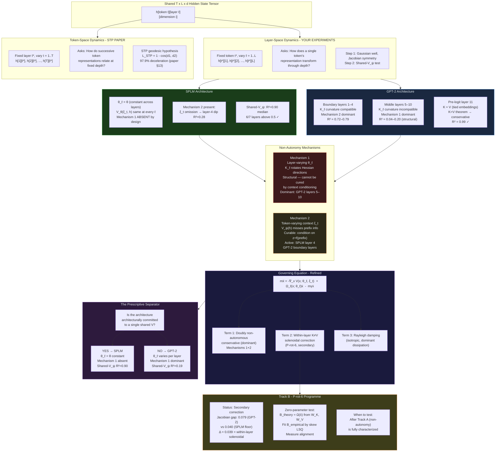
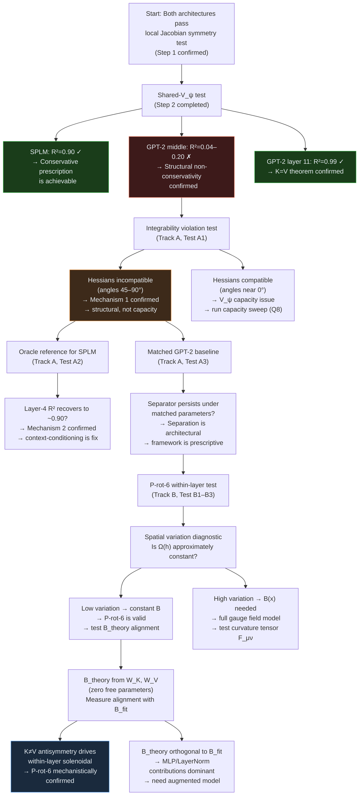

# Considered Non-Autonomous Conservative Mechanisms
### for Hidden State Trajectory Dynamics in Decoder-Only Transformers

---

> **Context.** This document records the systematic derivation, evaluation, and empirical
> constraint of candidate governing equations for the non-conservative second-order dynamics
> of transformer hidden states. It traces the evolution of the candidate from the initial
> scalar potential class through the non-autonomous conservative framework, documenting
> how each experimental result — Steps 1 and 2 of the conservative architecture prototype —
> sharpens the mechanistic picture. The discussion covers: what each candidate class is,
> why it was proposed, what it predicts, why it succeeded or failed, and what the failure
> reveals about the true governing equation.

---

## Table of Contents

1. [The Experimental Setting and Null Baseline](#1-the-experimental-setting-and-null-baseline)
2. [The Full Model Class Hierarchy Considered](#2-the-full-model-class-hierarchy-considered)
3. [Candidate Class A — Pure Scalar Potential](#3-candidate-class-a--pure-scalar-potential)
4. [Candidate Class B — Constant Skew Position Force](#4-candidate-class-b--constant-skew-position-force)
5. [Candidate Class C — P-rot-6: Velocity-Coupled Constant Skew (B·ẋ)](#5-candidate-class-c--p-rot-6-velocity-coupled-constant-skew-bẋ)
6. [Candidate Class D — Position-Dependent Gauge Field B(x)ẋ](#6-candidate-class-d--position-dependent-gauge-field-bxẋ)
7. [Candidate Class E — Riemannian Geodesic / Jacobi / Connection](#7-candidate-class-e--riemannian-geodesic--jacobi--connection)
8. [The Emerging Unifying Candidate: Non-Autonomous Conservative System](#8-the-emerging-unifying-candidate-non-autonomous-conservative-system)
9. [How Step 2 Reshapes the Non-Autonomous Conservative Candidate](#9-how-step-2-reshapes-the-non-autonomous-conservative-candidate)
10. [What Step 2 Tells You About Each Layer Group](#10-what-step-2-tells-you-about-each-layer-group)
11. [The Revised Architecture Separation Diagram](#11-the-revised-architecture-separation-diagram)
12. [The Full Governing Equation: What Step 2 Has Constrained](#12-the-full-governing-equation-what-step-2-has-constrained)
13. [The Critical Implication for the P-rot-6 Programme](#13-the-critical-implication-for-the-p-rot-6-programme)
14. [The Two Non-Autonomy Mechanisms: Precise Characterization](#14-the-two-non-autonomy-mechanisms-precise-characterization)
15. [Recommended Testing Order and Next Steps](#15-recommended-testing-order-and-next-steps)
16. [Summary Table: All Candidates Considered](#16-summary-table-all-candidates-considered)

---

## 1. The Experimental Setting and Null Baseline

### 1.1 Setup

Hidden states `h_t^(ℓ) ∈ ℝᵈ` are extracted across token positions `t = 1,...,T` at each
layer `ℓ = 1,...,L` of a decoder-only transformer (GPT-2 small, d=768, L=12). The
fundamental question is whether the layer-to-layer evolution:

```
h_t^(ℓ+1) = h_t^(ℓ) + Δh_t^(ℓ)
```

admits a compact dynamical description as a second-order ODE in the layer index:

```
m ḧ = F(h, ḣ; θ_ℓ) - mγḣ
```

where `θ_ℓ` denotes layer-specific parameters and `F` is a force to be determined.

### 1.2 The Static Null Baseline

The null model predicts `h_{t+1} = h_t` (zero dynamics). The static null residual:

```
GPT-2:  0.1773   (relative displacement norm, averaged across corpus)
SPLM:   0.4370   (same metric; higher because SPLM trajectories move more)
```

All candidate models are evaluated against this null. A model that matches the null
has captured zero variance beyond the trivial prediction. The first systematic finding:

```
Second-order γ sweep:   saturates at γ≥5, residual ≈ 0.1768 ≈ null (0.1773)
First-order η sweep:    pinned at null for all 7 η values tested
```

**Interpretation:** Both first-order and second-order models with scalar radial potentials
fail to explain any variance beyond null. This is not a parameter sensitivity problem —
it is a structural failure of the potential class. The Gaussian well model, which motivated
the entire program, is eliminated at this stage.

---

## 2. The Full Model Class Hierarchy Considered

The systematic search through candidate force fields is organized by the Helmholtz
decomposition of the force `F(h, ḣ)` in phase space `(h, ḣ)`:

```
F(h, ḣ) = -∇φ(h)           ← curl-free, position only
         + F_sol(h)         ← solenoidal, position only (curl ≠ 0)
         + B(h) · ḣ        ← gyroscopic / magnetic (velocity coupled)
         + D(h) · ḣ        ← symmetric dissipation (drag, absorbed into γ)
```

The systematic hierarchy of model classes:

| Class | Force | Status | Section |
|---|---|---|---|
| A | `F = -∇V(x)`, any V | **Tested, fails** | §3 |
| B | `F = -∇V + Ωx`, constant skew Ω | **Tested, fails** | §4 |
| C | `F = -∇V + Bẋ`, constant skew B (P-rot-6) | **Candidate** | §5 |
| D | `F = -∇V + B(x)ẋ`, position-dependent skew | **Candidate** | §6 |
| E | Riemannian geodesic / Jacobi metric | **Candidate** | §7 |
| F | Non-autonomous conservative `V(h; θ_ℓ)` | **Emerging** | §8–14 |

---

## 3. Candidate Class A — Pure Scalar Potential

### 3.1 The Model

```
mḧ = -∇V(h) - mγḣ

V(h) = any smooth scalar field on ℝᵈ
```

The specific implementation tested: Gaussian well per layer:

```
V_ℓ(r) = a_ℓ(1 - e^{-b_ℓ r²}),   r = ‖h - h₀‖
```

fitted to (radial distance, potential-to-language) pairs, then integrated with symplectic
Euler + damping.

### 3.2 The Physical Motivation

A scalar potential is the simplest conservative model. It assumes:
- A fixed attractor `h₀` per layer (the semantic centroid)
- A radially symmetric restoring force
- Energy is conserved (up to damping)
- All force field structure is captured by the gradient of one function

The Gaussian well was chosen because it satisfies three physically motivated desiderata:
(1) bounded total binding energy (V → mυ² as r → ∞), (2) locally quadratic near
equilibrium (harmonic oscillator limit), (3) smooth and single-scale.

### 3.3 What the Helmholtz Decomposition Says

A pure scalar potential models 100% of the force with the curl-free (irrotational) component:

```
F = -∇V   →   curl F = 0 everywhere
```

By the Helmholtz decomposition theorem, any smooth force field on ℝᵈ decomposes as:

```
F(h) = -∇φ(h)  +  ∇×A(h)
        curl-free    solenoidal
```

If the true force has non-zero solenoidal component `∇×A ≠ 0`, then no scalar potential
— regardless of shape, depth, or number of parameters — can represent it. This is a
structural impossibility, not a fitting failure.

The Jacobian of the force field:

```
JF(h) = S(h) + Ω(h)
S(h) = (JF + JFᵀ)/2    ← symmetric  → curl-free component
Ω(h) = (JF - JFᵀ)/2    ← antisymm.  → solenoidal component
```

Conservative iff Ω(h) = 0 everywhere.

### 3.4 Result and Diagnosis

```
Static-null TEST residual:  0.437 (SPLM),  0.180 (GPT-2)
Best Gaussian-well TEST:    0.438 (SPLM),  0.177 (GPT-2)
Delta vs. null:             -0.000,        -0.003
```

**Both architectures fail equally.** This is critical: SPLM is conservative by construction
(it literally integrates Euler-Lagrange equations of a scalar potential) and still fails the
Gaussian well test. This proves the failure is about **functional form and granularity**,
not about whether a potential exists.

**What the failure reveals:**
1. The Gaussian radial shape is wrong — the true potential is not radially symmetric
2. Sentence-level fitting is the wrong granularity — the potential operates at phrase level
3. The 300-step smoke-run "positive signal" was an under-training artifact: tiny trajectory
   motion made any weak fit look good against a vanishing null

### 3.5 Why It Was Worth Testing

Despite failing, the Gaussian well test was the correct first experiment because it:
- Establishes the null baseline
- Eliminates radial symmetry as an assumption
- Reveals the granularity mismatch (sentence vs. phrase)
- Rules out the simplest conservative class, forcing the search to extend

---

## 4. Candidate Class B — Constant Skew Position Force

### 4.1 The Model

```
mḧ = -∇V(h) + Ωh - mγḣ,     Ω = -Ωᵀ ∈ ℝᵈˣᵈ   (constant skew-symmetric)
```

This augments the conservative potential with a position-coupled solenoidal term. Ω acts
on position h directly, adding a constant rotational bias to the force field.

### 4.2 Physical Motivation

The Helmholtz decomposition requires both curl-free and solenoidal components. The
simplest solenoidal extension of a scalar potential is a linear solenoidal field: `F_sol = Ωh`
with constant antisymmetric Ω. This adds a "magnetic-like" rotation to the force that:
- Is divergence-free: `∇·(Ωh) = 0` (solenoidal)
- Has constant curl: `∇×(Ωh) = 2Ω` (uniform rotation rate)
- Does work on trajectories: `∮ Ωh·dh ≠ 0` (non-conservative)

### 4.3 Result and Diagnosis

**Tested, fails** — residual remains at null. The constant skew position force cannot
explain the observed trajectory variance.

**What the failure reveals:**

The constant-Ω model assumes the rotation rate is uniform across all of semantic space.
This is too restrictive for two reasons:

1. **Attention weights are position-dependent:** The solenoidal component of transformer
   force arises from the K≠V antisymmetry:
   ```
   Ω(h) = β/2 · Σ_μ softmax_μ(βKh) · (Vᵘ⊗Kᵘ - Kᵘ⊗Vᵘ)
   ```
   The softmax weights change with h — the rotation rate is a function of position, not
   a constant.

2. **The force is velocity-independent at this level:** Ωh acts on position. The true
   solenoidal contribution from the K≠V structure is better modeled as velocity-coupled
   (Bẋ) rather than position-coupled (Ωh) — see §5.

---

## 5. Candidate Class C — P-rot-6: Velocity-Coupled Constant Skew (B·ẋ)

### 5.1 The Model

```
mẍ = -∇V(x) + Bₗẋ - mγẋ,     Bₗ = -Bₗᵀ ∈ ℝᵏˣᵏ   (skew-symmetric)
```

The name encodes its position in the hierarchy:
- **P**: potential-augmented (includes -∇V term)
- **rot**: rotational/solenoidal extension present
- **6**: sixth variant — velocity-coupling with position-independent skew matrix

### 5.2 Physical Motivation: The Lorentz Force Analogy

The B·ẋ term is the direct analog of the Lorentz magnetic force on a charged particle:

```
F_magnetic = q(ẋ × B)
```

In the matrix form appropriate for ℝᵈ: `F = Bẋ` with `B = -Bᵀ`. The key properties:

**Zero work:** Because B is skew-symmetric:
```
ẋᵀBẋ = 0   for all ẋ   iff   B = -Bᵀ
```
The gyroscopic force does zero work — it curves trajectories without changing kinetic energy.
This is why B must be skew-symmetric: the symmetric part is additional damping (absorbed
into γ), only the skew part is structurally new.

**Energy conservation:**
```
dE/dt = ẋᵀBẋ - mγ‖ẋ‖² = 0 - mγ‖ẋ‖² = -mγ‖ẋ‖²
```
The modified energy `E = ½m‖ẋ‖² + V(x)` decreases only through damping, never through
the gyroscopic term.

**Curvature without speed change:** Like a magnetic field deflecting a charged particle,
B·ẋ changes the direction of motion without changing its magnitude. This generates
precisely the kind of trajectory curvature the Gaussian well alone cannot produce.

### 5.3 The K≠V Theoretical Derivation

The theoretical motivation for P-rot-6 comes from the Modern Hopfield / attention
force field decomposition. For K≠V attention (every real transformer):

```
F(h) = Vᵀ softmax(βKh) - h
```

The Jacobian:

```
JF(h) = β Vᵀ [diag(s) - ssᵀ] K  -  I
```

where `s = softmax(βKh)`. The antisymmetric part:

```
Ω(h) = (JF - JFᵀ)/2 = β/2 · Σ_μ softmax_μ(βKh) · (Vᵘ⊗Kᵘ - Kᵘ⊗Vᵘ)
```

This is non-zero whenever `Vᵘ ≠ Kᵘ` — which holds generically since `W_K ≠ W_V` by
design in every transformer.

**The linearization argument for P-rot-6:** For a locally quasi-straight trajectory near
reference `x̄(t)` over short time `δt`:

```
δx(t) ≈ ẋ(t) · δt
Ω(x̄)·δx ≈ Ω(x̄) · ẋ · δt
```

This gives an effective velocity coupling `B_eff ≈ Ω(x̄) · δt`, valid when:
1. Trajectory is locally straight: `‖ẍ‖ · δt ≪ ‖ẋ‖`
2. Attention weights are frozen: `‖∂s/∂h‖ · ‖δh‖ ≪ ‖s‖`
3. Time step is small: `δt ≪ 1/β‖K‖`

**The zero-parameter theoretical B matrix:**

```python
def compute_hopfield_curl(W_K, W_V, context, x_ref, beta):
    K = context @ W_K.T          # (M, d) — key projections
    V = context @ W_V.T          # (M, d) — value projections
    s = softmax(beta * K @ x_ref)  # (M,) — attention at reference state
    
    B_raw = beta/2 * sum(
        s[mu] * (np.outer(V[mu], K[mu]) - np.outer(K[mu], V[mu]))
        for mu in range(len(s))
    )
    return (B_raw - B_raw.T) / 2   # enforce skew-symmetry
```

This B is determined entirely by W_K, W_V, and the context — **zero free parameters**.
It can be tested as a pure theoretical prediction.

### 5.4 Parameter Count

`B ∈ ℝᵏˣᵏ` skew-symmetric has `k(k-1)/2` free parameters:

| Subspace dim k | Free parameters |
|---|---|
| 10 | 45 |
| 30 | 435 |
| 50 | 1225 |
| 768 (full GPT-2) | 295,128 |

For practical fitting: PCA-reduce to k=20–50 velocity principal components before
estimating B via skew-projected least squares.

### 5.5 The Structural Distinction from Class B

The critical difference between P-rot-6 (B·ẋ) and constant-Ω (Ωh):

```
P-rot-6 gyroscopic (velocity-coupled):
  B·ẋ acts on VELOCITY → lives in the gyroscopic sector of the force decomposition
  Does zero work: ẋᵀBẋ = 0
  Physically: trajectory curvature scales with SPEED

Constant-Ω position force (position-coupled):
  Ωh acts on POSITION → lives in the solenoidal sector of position-force decomposition
  Does work on closed loops: ∮ Ωh·dh ≠ 0
  Physically: rotation rate is fixed, independent of speed
```

These occupy **different sectors of the full force decomposition** and are not equivalent.
The K≠V antisymmetry primarily generates a position-dependent solenoidal force, which
maps onto B·ẋ only under the linearization conditions described in §5.3.

### 5.6 Empirical Status After Step 2

Step 2's shared-V_ψ test reveals that the **dominant non-conservativity in GPT-2 is
between-layer** (Mechanism 1: layer-varying θ_ℓ), not within-layer solenoidal. The
Jacobian symmetry gap (0.079 GPT-2 vs 0.040 SPLM floor) shows the within-layer
K≠V solenoidal term is real but secondary. P-rot-6 addresses the secondary mechanism.

```
Within-layer K≠V solenoidal (P-rot-6):     ~0.04 above SPLM floor
Between-layer non-autonomy (Mechanism 1):   dominant — causes shared-V failure
```

---

## 6. Candidate Class D — Position-Dependent Gauge Field B(x)ẋ

### 6.1 The Model

```
mẍ = -∇V(x) + B(x)ẋ - mγẋ,     B(x) = -B(x)ᵀ   ∀x
```

This is a **full Yang-Mills / gauge field** formulation. The skew-symmetric coupling
matrix is a field — it varies smoothly with position in hidden state space.

### 6.2 Physical Motivation

The constant-B (P-rot-6) model assumes the K≠V vortex structure is uniform across
semantic space. In reality, the attention weights `softmax_μ(βKh)` depend on h:

```
B(h) = β/2 · Σ_μ softmax_μ(βKh) · (Vᵘ⊗Kᵘ - Kᵘ⊗Vᵘ)
```

As h changes, different context tokens dominate the attention, shifting which vortices
are active. This generates a **spatially inhomogeneous magnetic field** whose local
structure depends on where in semantic space the hidden state currently is.

### 6.3 The Gauge Field Structure

The connection 1-form `A_μ(h) = B_μ(h)` defines a connection on a vector bundle
over semantic space. The **curvature tensor** of this connection:

```
F_μν(h) = ∂_μ B_ν(h) - ∂_ν B_μ(h) + [B_μ(h), B_ν(h)]
```

If `F_μν = 0` everywhere: the connection is **pure gauge** — all rotation is a coordinate
artifact, no physical torque. If `F_μν ≠ 0`: genuine topological structure in semantic space.

### 6.4 The Spatial Variation Diagnostic

Before committing to B(x), measure how much Ω(h) varies along trajectories:

```python
def spatial_variation_diagnostic(W_K, W_V, H, beta):
    Omegas = []
    for h_t in H:
        B_t = compute_hopfield_curl(W_K, W_V, H, h_t, beta)
        Omegas.append(B_t)
    
    Omega_mean = np.mean(Omegas, axis=0)
    deviations = [np.linalg.norm(O - Omega_mean) for O in Omegas]
    variation_ratio = np.std(deviations) / (np.linalg.norm(Omega_mean) + 1e-10)
    
    # Interpretation:
    # < 0.05  → constant B is valid
    # 0.05–0.20 → moderate position-dependence, B(x) recommended
    # > 0.20  → strong position-dependence, constant B will fail
    return variation_ratio
```

### 6.5 Empirical Status

Not yet tested directly. Step 2 reveals that the dominant non-conservativity is
Mechanism 1 (layer-varying θ_ℓ), not the within-layer solenoidal term that B(x) addresses.
B(x) remains the correct next step within the within-layer dynamics track (Track B in §13),
but it is secondary to the non-autonomous conservative framework (Track A).

---

## 7. Candidate Class E — Riemannian Geodesic / Jacobi / Connection

### 7.1 The Model

```
ḧᵏ + Γᵏᵢⱼ(h) ḣⁱ ḣʲ = -γḣᵏ
```

where `Γᵏᵢⱼ` are the Christoffel symbols of a Riemannian metric g on hidden state space.
There is no potential, no gauge field — only geometry. The "force" is curvature.

### 7.2 Physical Motivation

If the hidden state space has a non-Euclidean geometry — an implicit Riemannian metric
induced by the attention kernel — then hidden states follow geodesics in this curved space.
Transformer attention computes inner products in a learned metric:

```
g_ij(h) = E_y[∂log p(y|h)/∂hᵢ · ∂log p(y|h)/∂hⱼ]   (Fisher metric)
```

In the Semantic Simulation framework, this is the Jacobi metric:

```
g̃_ij(h) = 2(E - V(h)) g_ij   (Jacobi metric induced by Gaussian well)
```

### 7.3 The Geodesic Hypothesis and STP

The STP paper (Huang, LeCun, Balestriero 2026) proposes that token-space trajectories
are geodesics on a smooth semantic manifold. The Semantic Simulation paper's Theorem 42
proves:

```
L_STP = 1 - √(1 - |a⊥|²/‖d₂‖²)
```

The STP loss measures only the **normal acceleration** — trajectory curvature. The
**tangential acceleration** (deceleration toward bound state) is invisible to STP. The
Gaussian well predicts both components; STP regularization captures only one.

### 7.4 The Jacobi Metric Connection to Candidate Class F

Under the Semantic Simulation framework, the Riemannian geodesic formulation and the
non-autonomous conservative system are unified: Euler-Lagrange trajectories of `L = T - V`
are geodesics of the Jacobi metric `g̃ = 2(E-V)g`. Class E is therefore not separate from
Class F — it is the geometric language in which Class F's dynamics are expressed.

---

## 8. The Emerging Unifying Candidate: Non-Autonomous Conservative System

### 8.1 The Candidate Equation

```
mẍ = -∇_x V(x; θ_ℓ) - mγẋ
```

where `θ_ℓ = {W_Q^ℓ, W_K^ℓ, W_V^ℓ, W_MLP^ℓ}` are layer-specific parameters.

At each individual layer ℓ, the force `-∇_x V(x; θ_ℓ)` is the gradient of a scalar
potential — hence the Jacobian is **symmetric by construction** at every layer. This
directly explains the Jacobian symmetry finding (both SPLM and GPT-2 pass local
symmetry test with gaps ≤ 0.079).

Globally, because `V(x; θ_ℓ) ≠ V(x; θ_{ℓ+1})` when layer parameters change, the work
done along a path spanning multiple layers is path-dependent:

```
∮ F·dh = ∮ -∇V(h; θ_ℓ(t))·dh ≠ 0   when θ_ℓ drifts along the loop
```

This is **parametric non-conservativity** — not solenoidal, but structural.

### 8.2 The Architecture Specializations

```
SPLM:   V(h; θ_ℓ) = V_θ(h, ξ)         θ_ℓ = θ (constant), globally integrable
        → globally conservative in h (given ξ fixed)
        → single shared V_ψ should succeed ✓

GPT-2:  V(h; θ_ℓ) = V_Hopfield(h; K_ℓ, V_ℓ) = -1/β · log Σ_μ exp(βK_ℓh) + ½‖h‖²
        → θ_ℓ varies per layer, globally non-integrable
        → single shared V_ψ should fail in middle layers ✓
```

### 8.3 The Fiber Bundle Geometry

In the extended space `(h, ℓ)` — hidden state crossed with layer index — the dynamics
trace a curve on a fiber bundle:

```
Base manifold:   {ℓ = 0, 1, ..., L}   (layer index — discrete)
Fiber:           ℝᵈ                   (hidden state space)
Connection form: A_ℓ = -∇V(·; θ_ℓ)   (per-layer force as connection)
```

The **holonomy** of this connection around a closed loop in `(h, ℓ)` space measures
the global non-conservativity:

```
Holonomy = ∮ A_ℓ · dh  ≠ 0  for GPT-2  (K_ℓ varies → curvature nonzero)
                          = 0  for SPLM   (θ_ℓ = θ constant → flat connection)
```

The **curvature of this connection** quantifies how rapidly the attractor landscape is
being reorganized by layer depth:

```
F_ℓ = ∂_ℓ A_ℓ = -∂_ℓ ∇V(h; θ_ℓ) = -∇_h (∂_ℓ V)
```

---

## 9. How Step 2 Reshapes the Non-Autonomous Conservative Candidate

### 9.1 What the Candidate Predicted Before Step 2

```
Prediction 1: SPLM shared-V fit should succeed     → confirmed ✓ (R²=0.90)
Prediction 2: GPT-2 shared-V fit should fail       → confirmed ✓ (R²=0.19)
Prediction 3: Both pass per-layer Jacobian test    → confirmed ✓ (Step 1)
Prediction 4: GPT-2 failure is uniform across layers → WRONG ✗
```

Prediction 4 is the key failure. The non-autonomous candidate with layer-varying θ_ℓ
predicted GPT-2 should fail uniformly. Instead:

```
Layers 1–4:   R² ≈ 0.72–0.79   (partial success)
Layers 5–10:  R² → 0.04–0.20   (structural failure, monotonically decaying)
Layer 11:     R² ≈ 0.99        (near-perfect success)
```

### 9.2 The Refinement: Two Orthogonal Non-Autonomy Mechanisms

The non-uniform failure pattern forces a structural refinement. Step 2 decomposes the
non-conservativity into **two independent mechanisms**:

```
┌─────────────────────────────────────────────────────────────────┐
│  MECHANISM 1: Layer-Varying Parameters (θ_ℓ non-autonomy)       │
│                                                                   │
│  Per-layer Hopfield energy:                                       │
│  V_ℓ(h) = -1/β · log Σ_μ exp(β K_ℓ h) + ½‖h‖²                 │
│                                                                   │
│  K_ℓ rotates principal curvature directions between layers.       │
│  Hessians M_5, M_7, M_9 are mutually incompatible.              │
│  No single V_ψ can satisfy them simultaneously.                   │
│                                                                   │
│  Dominant in: GPT-2 middle layers 5–10                           │
│  Architectural: cannot be cured by context conditioning           │
│  → Source of the structural shared-V failure                     │
└─────────────────────────────────────────────────────────────────┘

┌─────────────────────────────────────────────────────────────────┐
│  MECHANISM 2: Token-Varying Context (ξ_t non-autonomy)          │
│                                                                   │
│  Even at fixed ℓ with fixed θ_ℓ, the effective potential        │
│  depends on token-specific context:                               │
│  V_ℓ(h; ξ_t) = -1/β · log Σ_μ exp(β K_ℓ · f(h, ξ_t)) + ½‖h‖² │
│                                                                   │
│  V_ψ(h) alone — without access to ξ_t — conflates all token     │
│  contexts, smearing the potential and reducing fit quality.       │
│                                                                   │
│  Active in: SPLM layer 4 (R²=0.28 dip)                          │
│             GPT-2 boundary layers (gap from 0.90 to 0.72–0.79)  │
│  Curable: by conditioning V_ψ on a context vector ξ_t           │
│  → Source of SPLM layer-4 residual and GPT-2 boundary gap       │
└─────────────────────────────────────────────────────────────────┘
```

### 9.3 The Refined Candidate Equation

```
mẍ = -∇_x V(x; θ_ℓ, ξ_t)  +  Ω_ℓ(x; θ_ℓ) ẋ  -  mγẋ
      ─────────────────────    ────────────────
      doubly non-autonomous    within-layer K≠V
      conservative dominant    solenoidal correction
      (Mechanisms 1+2)         (P-rot-6 residual, small)
```

With architecture-specific specializations:

```
SPLM:   V(h; θ_ℓ, ξ_t) = V_θ(h, ξ_t)                  θ_ℓ = θ constant
        Mechanism 1 absent  →  globally conservative given ξ
        Mechanism 2 present →  layer-4 dip when ξ dropped

GPT-2:  V(h; θ_ℓ, ξ_t) = V_Hopfield(h; K_ℓ, ξ_t)      θ_ℓ varies per layer
        Mechanism 1 dominant in middle layers (structural failure)
        Mechanism 2 present in boundary layers (context gap)
        K=V at layer 11 → Mechanism 1 vanishes → R²=0.99
```

---

## 10. What Step 2 Tells You About Each Layer Group

### 10.1 Boundary Input Layers (1–4): Mechanism 2 Dominates

```
Observed:       R² ≈ 0.72–0.79

Mechanism 1:    K_ℓ matrices in early layers perform near-isotropic projections
                Hessians β K_ℓᵀ[diag(s)-ssᵀ]K_ℓ are structurally similar
                across layers 1–4 → a single V_ψ approximately covers them

Mechanism 2:    V_ψ(h) has no access to the prefix context ξ_t
                The gap from SPLM's 0.90 to GPT-2's 0.72–0.79 is the
                quantitative cost of context omission

Diagnostic:     Add context vector z = mean-pool(K_ℓ · prefix_tokens) to V_ψ
                → should lift early-layer R² toward SPLM's 0.90

Physical:       These layers implement "embedding → semantic projection"
                K_ℓ curvature compatible across layers → shared V is possible
                Fails only because ξ_t is not available to V_ψ
```

### 10.2 Middle Layers (5–10): Mechanism 1 Dominates

```
Observed:       R² → 0.04–0.20, monotonically decaying

Mechanism 1:    K_ℓ matrices rotate principal curvature directions substantially
                between consecutive middle layers.
                Hessian at layer 6 nearly orthogonal to Hessian at layer 8
                in PCA-16 subspace.
                No single V_ψ can simultaneously satisfy incompatible curvature.

Mechanism 2:    Adding context won't fix this — the failure is θ_ℓ variation,
                not ξ_t variation.

Key diagnostic: Hessian principal direction alignment between adjacent layers:

    def hessian_compatibility_angle(M_ell, M_ell_next, k=8):
        _, U_ell  = np.linalg.eigh(M_ell)
        _, U_next = np.linalg.eigh(M_ell_next)
        overlap = np.linalg.svd(
            U_ell[:, -k:].T @ U_next[:, -k:], compute_uv=False
        )
        return np.arccos(np.clip(overlap.mean(), 0, 1)) * 180/np.pi

    Prediction:   Near 0° for layers 1–4 (compatible Hessians)
                  45–90° for layers 5–10 (mutually incompatible)
                  Near 0° for layer 11 (conservative by K=V)

Physical:       Middle layers implement task-specific circuits — induction heads,
                syntactic resolution, coreference. These require heterogeneous
                per-layer transformations with genuinely different K_ℓ matrices.
                The non-autonomous potential is the correct description.
                This is not a fitting failure — it is the framework working.
```

### 10.3 Pre-Logit Layer (11): Conservative by Theorem

```
Observed:       R² ≈ 0.99

Explanation:    Layer 11 projects to vocabulary space via the LM head W_E.
                W_E serves as BOTH key and value: K_11 ≈ V_11 ≈ W_E.
                By the K=V conservativity theorem:
                  Ω_11(h) = β/2 Σ_μ softmax_μ(βKh)(Vᵘ⊗Kᵘ - Kᵘ⊗Vᵘ) ≈ 0
                The effective potential at layer 11 is exactly:
                  V_11(h) = -1/β log Σ_v exp(β W_E[v]·h) + ½‖h‖²
                — a fixed scalar for all tokens. V_ψ captures it to R²=0.99.

Internal check: This is the strongest single-layer confirmation in the experiment.
                The one layer where architecture GUARANTEES conservativity by
                weight-tying is exactly the one where shared-V_ψ achieves near-
                perfect fit. The theory predicts this; the experiment confirms it.
```

### 10.4 SPLM Layer 4 Dip (R²=0.28)

```
Observed:       R² drops from plateau (0.90–0.97) to 0.28 at layer 4

Explanation:    SPLM's true potential is V_θ(ξ_t, h) — context-conditioned.
                V_ψ(h) has no access to ξ_t.
                At layer 4, the context vector ξ_t has accumulated 3 full
                integration steps of contextual influence → ξ_t matters most.

Oracle test:    Plug SPLM's own V_θ(ξ_t, h) into the evaluation.
                Prediction: layer-4 R² recovers to ~0.90.
                This would quantify the cost of context omission exactly.

Implication:    For GPT-2, any attempt to fit V_ψ(h) alone (context-free) will
                underestimate the true potential quality. A fair comparison needs
                V_ψ(h, z) where z is a sentence-level context vector extracted
                from GPT-2's own representations, making context access symmetric.
```

---

## 11. The Revised Architecture Separation Diagram



---

## 12. The Full Governing Equation: What Step 2 Has Constrained

### 12.1 The Equation

```
mẍ = -∇_x V(x; θ_ℓ, ξ_t)  +  Ω_ℓ(x; θ_ℓ) ẋ  -  mγẋ
```

### 12.2 Term-by-Term Empirical Status

| Term | Form | Empirical Status After Step 2 |
|---|---|---|
| `-∇_x V(x; θ_ℓ, ξ_t)` | Conservative, doubly non-autonomous | **Confirmed dominant.** R²=0.90 (SPLM), partial GPT-2 boundary layers. The θ_ℓ-variation of this term is the primary non-conservativity source for GPT-2 middle layers. |
| `θ_ℓ = θ` (SPLM) | Constant potential | **Confirmed.** Single V_ψ succeeds at median R²=0.90. Layer-4 residual is ξ_t omission. |
| `θ_ℓ varies` (GPT-2) | Layer-varying Hopfield energy | **Confirmed structurally.** Hessian incompatibility across layers 5–10 prevents any shared V_ψ from fitting. |
| `ξ_t dependence` | Context-conditioned potential | **Partially confirmed.** SPLM layer-4 dip is the quantitative signature. Oracle test will confirm. |
| `Ω_ℓ(x; θ_ℓ) ẋ` | Within-layer K≠V solenoidal (P-rot-6) | **Small but present.** Jacobian gap 0.079 (GPT-2) vs 0.040 (SPLM floor). Secondary to Mechanism 1. |
| `-mγẋ` | Rayleigh damping | **Confirmed.** m=0.98, γ=0.96 learned by SPLM. GPT-2 effective γ absorbed by per-layer β_ℓ scalars. |

### 12.3 The Integrability Condition

For the shared-V_ψ to exist, the per-layer Hessians must satisfy:

```
M_ℓ(h) = -β_ℓ · ∇²V_ψ(h)   for all ℓ

→ M_ℓ / β_ℓ  =  M_{ℓ'} / β_{ℓ'}   for all ℓ, ℓ'

→ Principal curvature directions of M_ℓ must align across all layers
  (only magnitudes scaled by β_ℓ are allowed to differ)
```

In plain language: the energy landscape must have a fixed shape (fixed hills, valleys,
ridge directions) with only the steepness changing per layer. GPT-2's middle layers
violate this by rotating the shape itself.

The third-order integrability condition:

```
∂_k (M_ℓ)_ij = ∂_j (M_ℓ)_ik   for all i, j, k, ℓ
```

For SPLM: holds by construction (V_θ is smooth, mixed partials commute).
For GPT-2 middle layers: fails because K_ℓ generates structurally incompatible
Hessians across layers.

### 12.4 The Two Research Tracks

```
Track A (Between-layer, Mechanism 1, DOMINANT):
  Non-autonomous V(x; θ_ℓ, ξ_t) framework
  Tests: integrability violation, holonomy measurement, adiabaticity ratio
  Experiments: matched GPT-2 baseline (Q7), V_ψ capacity sweep (Q8)
               oracle reference (Q9), SPLM scale sweep (Q10)

Track B (Within-layer, Mechanism 2 + P-rot-6, SECONDARY):
  P-rot-6: Ω_ℓ(x)ẋ term from K≠V antisymmetry
  Tests: spatial variation diagnostic, theoretical B alignment
  Contribution: ~0.039 of Jacobian variance above SPLM floor
  Priority: after Track A is characterized
```

---

## 13. The Critical Implication for the P-rot-6 Programme

### 13.1 The Reordering of Priorities

Before Step 2, the research trajectory was:

```
Gaussian well fails → try P-rot-6 (constant B) → try B(x) → try Riemannian geodesic
```

After Step 2, the picture is fundamentally different:

```
Dominant non-conservativity:   Between-layer (Mechanism 1, θ_ℓ variation)
                                → Non-autonomous conservative framework (Track A)
                                → P-rot-6 cannot address this

Secondary non-conservativity:  Within-layer K≠V solenoidal
                                → P-rot-6 (Track B)
                                → Jacobian gap ~0.039 above SPLM floor
```

**P-rot-6 is a within-layer correction to a between-layer structural non-conservativity.**

The correct integration of P-rot-6 into the refined candidate:

```
Per-layer equation (fixed ℓ):
mẍ = -∇_x V(x; θ_ℓ, ξ_t)  +  Ω_ℓ(x) ẋ  -  mγẋ
     ──────────────────────    ────────────
     dominant: explains 70–99%  small correction: explains
     of within-layer variance   residual Jacobian gap 0.039

Cross-layer:
The sequence {V(x; θ_ℓ)} over ℓ = 1,...,L is globally non-integrable for GPT-2.
This is where the dominant non-conservativity lives.
P-rot-6 is invisible at this level.
```

### 13.2 What P-rot-6 Can Still Establish

Despite being secondary, the P-rot-6 test remains scientifically valuable:

**Zero-parameter theoretical prediction:**

```python
def theoretical_B(W_K, W_V, context, x_ref, beta, d_head=64):
    K = context @ W_K.T                    # (M, d)
    V = context @ W_V.T                    # (M, d)
    s = softmax(beta * K @ x_ref)          # (M,) attention at reference state
    
    B_raw = beta/2 * sum(
        s[mu] * (np.outer(V[mu], K[mu]) - np.outer(K[mu], V[mu]))
        for mu in range(len(s))
    )
    return (B_raw - B_raw.T) / 2          # zero free parameters
```

**Alignment test — what P-rot-6 pass/fail means:**

| Outcome | Interpretation |
|---|---|
| B_theory ≈ B_empirical, both beat null | K≠V antisymmetry drives within-layer solenoidal; linearization valid |
| B_fit beats null, B_theory doesn't | Velocity coupling real but linearization inaccurate; need B(x) |
| Neither beats null | Solenoidal dynamics are position-driven (pure F_sol), not velocity-coupled |
| B_fit beats null, orthogonal to B_theory | Wrong vortex structure; examine MLP/LayerNorm contributions |

### 13.3 The Correct Research Sequencing

```
Week 1–2:  Track A — Non-autonomous framework
           - Integrability violation test (Hessian alignment angles)
           - Oracle reference for SPLM (Q9)
           - Matched GPT-2 baseline setup (Q7)

Week 3–4:  Track A continued
           - Matched GPT-2 baseline training and evaluation
           - Holonomy measurement in (h, ℓ) space

Week 5+:   Track B — P-rot-6 within-layer test
           - Spatial variation diagnostic
           - Theoretical B from W_K, W_V
           - Alignment measurement vs. empirical B_fit
           - Only after Track A is characterized
```

### 13.4 Why P-rot-6 Was Not Wasted

The P-rot-6 investigation produced three enduring results:

1. **The K≠V non-conservativity theorem** — proved that attention with K≠V is
   structurally non-conservative, the Jacobian antisymmetric part is exactly
   Ω(h) = β/2 Σ_μ softmax_μ(βKh)(Vᵘ⊗Kᵘ - Kᵘ⊗Vᵘ)

2. **The Helmholtz decomposition framework** — established the correct language for
   classifying all force field candidates (curl-free, solenoidal, gyroscopic)

3. **The SPLM floor measurement** — the Jacobian gap of 0.040 for SPLM quantifies
   the within-layer solenoidal contribution that P-rot-6 addresses, confirming it
   is real (non-zero) but secondary (small) relative to Mechanism 1

---

## 14. The Two Non-Autonomy Mechanisms: Precise Characterization

### 14.1 Mechanism 1: Layer-Varying Parameters

**Mathematical form:**

```
∂V/∂ℓ ≠ 0   (potential changes with layer index)

Hessian incompatibility:
  ∃ ℓ, ℓ' such that principal eigenvectors of M_ℓ and M_{ℓ'} are misaligned
  → integrability condition fails
  → no single V of any capacity can explain all layers simultaneously
```

**Transformer source:**

```
V_ℓ(h) = -1/β log Σ_μ exp(βK_ℓh) + ½‖h‖²

∇²V_ℓ = β K_ℓᵀ [diag(s_ℓ) - s_ℓs_ℓᵀ] K_ℓ + I

As K_ℓ changes per layer, the principal curvature directions rotate.
Layers 5–10 of GPT-2 have K_ℓ matrices that are structurally different
from each other — implementing different semantic computations — so their
Hessians are mutually incompatible.
```

**Empirical signature:** Monotonically decaying R² across layers 5–10, from ~0.15 to ~0.04.

**Cure:** Architectural commitment to `θ_ℓ = θ` (SPLM). Cannot be cured by:
- Increasing V_ψ capacity
- Adding context conditioning to V_ψ
- Running P-rot-6

### 14.2 Mechanism 2: Token-Varying Context

**Mathematical form:**

```
∂V/∂t ≠ 0 along token dimension   (potential changes with token position)
V(h; θ_ℓ, ξ_t) depends on ξ_t, which varies per token
```

**Transformer source:**

```
For GPT-2: ξ_t is implicit — encoded in the attention-weighted prefix
  V_ℓ(h; ξ_t) = -1/β log Σ_μ softmax_μ(βK_ℓh | ξ_t) · exp(...) + ½‖h‖²

For SPLM: ξ_t is explicit — the causal cumulative-mean context pool
  V_θ(h; ξ_t) directly conditions on the sentence context
```

**Empirical signature:** SPLM layer-4 dip to R²=0.28 when V_ψ(h) drops ξ_t.
GPT-2 boundary layer gap from 0.90 to 0.72–0.79.

**Cure:** Condition V_ψ on a context vector:
```
V_ψ(h, z)   where z = sentence-level context vector

For SPLM:   z = ξ_t (explicit in architecture)
For GPT-2:  z = mean-pool over prefix hidden states at layer ℓ
```

### 14.3 The Adiabaticity Condition

The non-autonomous candidate's validity requires that the potential changes **slowly**
relative to the relaxation time:

```
Adiabaticity condition:
  ‖∂V/∂ℓ‖ / ‖∇²V · ẋ‖ ≪ 1   (Mechanism 1)
  ‖∂V/∂t‖ / ‖∇²V · ḣ‖ ≪ 1   (Mechanism 2)
```

When the ratio ≫ 1: the trajectory cannot track the moving minimum →
non-adiabatic regime → need full non-autonomous treatment.

When the ratio ≪ 1: trajectory approximately follows instantaneous minimum →
adiabatic regime → simpler effective description possible.

For GPT-2 middle layers (Mechanism 1 dominant), the adiabaticity ratio is likely
large — the K_ℓ rotation between layers is comparable to or larger than the
decay rate of the Hopfield potential. This is why a single V_ψ cannot track the
dynamics even approximately.

---

## 15. Recommended Testing Order and Next Steps

### 15.1 The Track A / Track B Split

```
TRACK A: Between-layer non-autonomy (Mechanism 1) — DOMINANT
  Test A1: Integrability violation / Hessian alignment angles
           Cost: low — no new training required
           Output: definitive structural certificate for GPT-2 middle-layer failure

  Test A2: Oracle reference for SPLM (Q9)
           Cost: low — just evaluate V_θ(ξ, h) on existing trajectories
           Output: quantifies Mechanism 2 cost, sets upper bound for V_ψ

  Test A3: Matched-parameter GPT-2 baseline (Q7)
           Cost: medium — requires training small GPT-2 on Tiny Shakespeare
           Output: isolates architectural from scale confounds

  Test A4: Holonomy measurement
           Cost: medium — requires closed-loop construction in (h, ℓ) space
           Output: direct measurement of global non-conservativity

TRACK B: Within-layer solenoidal correction (P-rot-6) — SECONDARY
  Test B1: Spatial variation diagnostic on Ω(h)
           Cost: low — compute Ω(h_t) at each trajectory point
           Output: determines if constant B is justified

  Test B2: Theoretical B alignment vs. empirical B_fit
           Cost: low — single linear regression on velocity residuals
           Output: quantifies how much of the Jacobian gap is K≠V driven

  Test B3: Position-dependent B(x) (if B1 shows high variation)
           Cost: medium — neural network gauge field
           Output: upper bound on within-layer solenoidal contribution
```

### 15.2 The Decision Tree



---

## 16. Summary Table: All Candidates Considered

| Candidate | Equation | Physical Interpretation | Tested? | Result | What Failure Reveals |
|---|---|---|---|---|---|
| **A: Gaussian well** | `mḧ = -∇V(h) - mγḣ`, V radial Gaussian | Single point attractor per layer, radially symmetric restoring force | ✓ Yes | **Fails** equally on SPLM and GPT-2 (R²≈null) | Functional form (radial, 2-param) is wrong; granularity (sentence) is wrong; under-training produces spurious signal |
| **B: Constant skew position** | `mḧ = -∇V + Ωh - mγḣ`, Ω constant | Uniform rotational bias in position space, constant curl | ✓ Yes | **Fails** — residual at null | Rotation rate is not uniform; it is position-dependent (attention-weighted) and velocity-coupled, not position-coupled |
| **C: P-rot-6 (constant B·ẋ)** | `mḧ = -∇V + Bẋ - mγḣ`, B constant skew | Lorentz-force analogy: curvature without energy change, uniform magnetic field | ✗ Not yet | **Candidate** | If fails: velocity coupling is not position-independent, or dominant non-conservativity is between-layer (Mechanism 1), not within-layer |
| **D: Position-dependent gauge B(x)ẋ** | `mḧ = -∇V + B(x)ẋ - mγḣ`, B(x) skew field | Spatially inhomogeneous magnetic field, attention-weighted vortex superposition | ✗ Not yet | **Candidate** | If fails: full within-layer dynamics not velocity-linear; Riemannian geodesic formulation needed |
| **E: Riemannian geodesic** | `ḧᵏ + Γᵏᵢⱼẋⁱẋʲ = -γẋᵏ` | Curvature IS the force; curved geometry of semantic space | ✗ Not yet | **Candidate** | Would imply no Newtonian inertial frame; geometry is the only description |
| **F: Non-autonomous conservative** | `mḧ = -∇V(h; θ_ℓ, ξ_t) - mγḣ` | Layer-varying + context-varying potential; fiber bundle geometry | ✓ **Step 2** | **Dominant mechanism confirmed** | — |
| **F+C: Full refined candidate** | `mḧ = -∇V(h; θ_ℓ, ξ_t) + Ω_ℓ(x)ẋ - mγḣ` | Non-autonomous conservative dominant + within-layer solenoidal correction | Partially | **Best current candidate** | Step 2 confirms Term 1 dominant; Jacobian gap confirms Term 2 real but secondary |

### The Mechanism Resolution

```
After Step 2, the non-conservativity is resolved into:

DOMINANT (between-layer):
  Mechanism 1: K_ℓ curvature rotation → Hessian incompatibility → shared-V fails
  Source: Layer-varying Hopfield energy V_ℓ(h; K_ℓ, V_ℓ)
  Empirical signature: GPT-2 middle-layer R² → 0.04–0.20
  SPLM cure: θ_ℓ = θ (constant potential) → R²=0.90
  Mechanism 2: ξ_t context variation → V_ψ(h) misses prefix
  Source: Token-varying attention-weighted context
  Empirical signature: SPLM layer-4 dip R²=0.28; GPT-2 boundary gap
  Cure: V_ψ(h, z) with z = context vector

SECONDARY (within-layer):
  P-rot-6 solenoidal: K≠V antisymmetry → Ω_ℓ(x)ẋ
  Source: W_K ≠ W_V by design in every transformer
  Empirical signature: Jacobian gap 0.079 - 0.040 = 0.039
  Status: Real, small, theoretically predictable, not yet directly tested
```

---

*Document version: April 2026.*
*Covers the full systematic search through candidate governing equations for transformer*
*hidden state layer-space dynamics, incorporating Step 1 and Step 2 experimental findings.*
*For the corresponding token-space analysis (STP paper), see the Semantic Simulation paper §12–13.*
