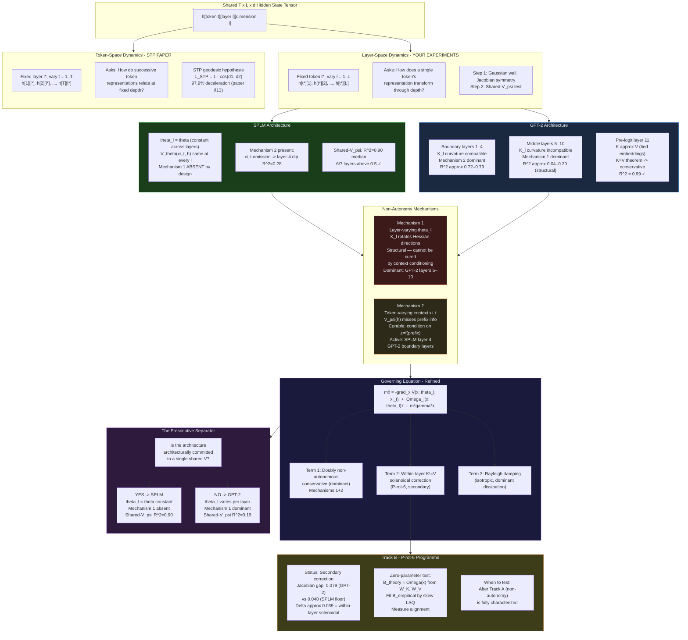
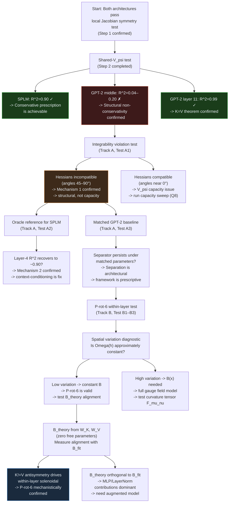

# Considered Non-Autonomous Conservative Mechanisms
### for Hidden State Trajectory Dynamics in Decoder-Only Transformers

---

> **Context.** This document records the systematic derivation, evaluation, and empirical
> constraint of candidate governing equations for the non-conservative second-order dynamics
> of transformer hidden states. It traces the evolution of the candidate from the initial
> scalar potential class through the non-autonomous conservative framework, documenting
> how each experimental result — Steps 1 and 2 of the conservative architecture prototype —
> sharpens the mechanistic picture. The discussion covers: what each candidate class is,
> why it was proposed, what it predicts, why it succeeded or failed, and what the failure
> reveals about the true governing equation.

---

## Table of Contents

1. [The Experimental Setting and Null Baseline](#1-the-experimental-setting-and-null-baseline)
2. [The Full Model Class Hierarchy Considered](#2-the-full-model-class-hierarchy-considered)
3. [Candidate Class A — Pure Scalar Potential](#3-candidate-class-a--pure-scalar-potential)
4. [Candidate Class B — Constant Skew Position Force](#4-candidate-class-b--constant-skew-position-force)
5. [Candidate Class C — P-rot-6: Velocity-Coupled Constant Skew (B·ẋ)](#5-candidate-class-c--p-rot-6-velocity-coupled-constant-skew-bẋ)
6. [Candidate Class D — Position-Dependent Gauge Field B(x)ẋ](#6-candidate-class-d--position-dependent-gauge-field-bxẋ)
7. [Candidate Class E — Riemannian Geodesic / Jacobi / Connection](#7-candidate-class-e--riemannian-geodesic--jacobi--connection)
8. [The Emerging Unifying Candidate: Non-Autonomous Conservative System](#8-the-emerging-unifying-candidate-non-autonomous-conservative-system)
9. [How Step 2 Reshapes the Non-Autonomous Conservative Candidate](#9-how-step-2-reshapes-the-non-autonomous-conservative-candidate)
10. [What Step 2 Tells You About Each Layer Group](#10-what-step-2-tells-you-about-each-layer-group)
11. [The Revised Architecture Separation Diagram](#11-the-revised-architecture-separation-diagram)
12. [The Full Governing Equation: What Step 2 Has Constrained](#12-the-full-governing-equation-what-step-2-has-constrained)
13. [The Critical Implication for the P-rot-6 Programme](#13-the-critical-implication-for-the-p-rot-6-programme)
14. [The Two Non-Autonomy Mechanisms: Precise Characterization](#14-the-two-non-autonomy-mechanisms-precise-characterization)
15. [Recommended Testing Order and Next Steps](#15-recommended-testing-order-and-next-steps)
16. [Summary Table: All Candidates Considered](#16-summary-table-all-candidates-considered)

---

## 1. The Experimental Setting and Null Baseline

### 1.1 Setup

Hidden states $h_t^{(\ell)} \in \mathbb{R}^d$ are extracted across token positions $t = 1,\ldots,T$ at each
layer $\ell = 1,\ldots,L$ of a decoder-only transformer (GPT-2 small, d=768, L=12). The
fundamental question is whether the layer-to-layer evolution:

$$h_t^{(\ell+1)} = h_t^{(\ell)} + \Delta h_t^{(\ell)}$$

admits a compact dynamical description as a second-order ODE in the layer index:

$$m \ddot{h} = F(h, \dot{h}; \theta_\ell) - m\gamma\dot{h}$$

where $\theta_\ell$ denotes layer-specific parameters and $F$ is a force to be determined.

### 1.2 The Static Null Baseline

The null model predicts $h_{t+1} = h_t$ (zero dynamics). The static null residual:

```
GPT-2:  0.1773   (relative displacement norm, averaged across corpus)
SPLM:   0.4370   (same metric; higher because SPLM trajectories move more)
```

All candidate models are evaluated against this null. A model that matches the null
has captured zero variance beyond the trivial prediction. The first systematic finding:

```
Second-order γ sweep:   saturates at γ≥5, residual ≈ 0.1768 ≈ null (0.1773)
First-order η sweep:    pinned at null for all 7 η values tested
```

**Interpretation:** Both first-order and second-order models with scalar radial potentials
fail to explain any variance beyond null. This is not a parameter sensitivity problem —
it is a structural failure of the potential class. The Gaussian well model, which motivated
the entire program, is eliminated at this stage.

---

## 2. The Full Model Class Hierarchy Considered

The systematic search through candidate force fields is organized by the Helmholtz
decomposition of the force $F(h, \dot{h})$ in phase space $(h, \dot{h})$:

$$
\begin{aligned}
F(h, \dot{h}) &= -\nabla\phi(h) && \leftarrow \text{curl-free, position only} \\
&+ F_{\text{sol}}(h) && \leftarrow \text{solenoidal, position only (curl} \neq 0\text{)} \\
&+ B(h) \cdot \dot{h} && \leftarrow \text{gyroscopic / magnetic (velocity coupled)} \\
&+ D(h) \cdot \dot{h} && \leftarrow \text{symmetric dissipation (drag, absorbed into } \gamma\text{)}
\end{aligned}
$$

The systematic hierarchy of model classes:

| Class | Force | Status | Section |
|---|---|---|---|
| A | $F = -\nabla V(x)$, any V | **Tested, fails** | §3 |
| B | $F = -\nabla V + \Omega x$, constant skew $\Omega$ | **Tested, fails** | §4 |
| C | $F = -\nabla V + B\dot{x}$, constant skew B (P-rot-6) | **Candidate** | §5 |
| D | $F = -\nabla V + B(x)\dot{x}$, position-dependent skew | **Candidate** | §6 |
| E | Riemannian geodesic / Jacobi metric | **Candidate** | §7 |
| F | Non-autonomous conservative $V(h; \theta_\ell)$ | **Emerging** | §8–14 |

---

## 3. Candidate Class A — Pure Scalar Potential

### 3.1 The Model

$$m\ddot{h} = -\nabla V(h) - m\gamma\dot{h}$$

$$V(h) = \text{any smooth scalar field on } \mathbb{R}^d$$

The specific implementation tested: Gaussian well per layer:

$$V_\ell(r) = a_\ell(1 - e^{-b_\ell r^2}), \quad r = \lVert h - h_0 \rVert$$

fitted to (radial distance, potential-to-language) pairs, then integrated with symplectic
Euler + damping.

### 3.2 The Physical Motivation

A scalar potential is the simplest conservative model. It assumes:
- A fixed attractor $h_0$ per layer (the semantic centroid)
- A radially symmetric restoring force
- Energy is conserved (up to damping)
- All force field structure is captured by the gradient of one function

The Gaussian well was chosen because it satisfies three physically motivated desiderata:
(1) bounded total binding energy ($V \to mv^2$ as $r \to \infty$), (2) locally quadratic near
equilibrium (harmonic oscillator limit), (3) smooth and single-scale.

### 3.3 What the Helmholtz Decomposition Says

A pure scalar potential models 100% of the force with the curl-free (irrotational) component:

$$F = -\nabla V \implies \nabla \times F = 0 \text{ everywhere}$$

By the Helmholtz decomposition theorem, any smooth force field on $\mathbb{R}^d$ decomposes as:

$$F(h) = \underbrace{-\nabla\phi(h)}_{\text{curl-free}} + \underbrace{\nabla \times A(h)}_{\text{solenoidal}}$$

If the true force has non-zero solenoidal component $\nabla \times A \neq 0$, then no scalar potential
— regardless of shape, depth, or number of parameters — can represent it. This is a
structural impossibility, not a fitting failure.

The Jacobian of the force field:

$$
\begin{aligned}
J_F(h) &= S(h) + \Omega(h) \\
S(h) &= (J_F + J_F^\top)/2 && \leftarrow \text{symmetric} \to \text{curl-free component} \\
\Omega(h) &= (J_F - J_F^\top)/2 && \leftarrow \text{antisymm.} \to \text{solenoidal component}
\end{aligned}
$$

Conservative iff $\Omega(h) = 0$ everywhere.

### 3.4 Result and Diagnosis

```
Static-null TEST residual:  0.437 (SPLM),  0.180 (GPT-2)
Best Gaussian-well TEST:    0.438 (SPLM),  0.177 (GPT-2)
Delta vs. null:             -0.000,        -0.003
```

**Both architectures fail equally.** This is critical: SPLM is conservative by construction
(it literally integrates Euler-Lagrange equations of a scalar potential) and still fails the
Gaussian well test. This proves the failure is about **functional form and granularity**,
not about whether a potential exists.

**What the failure reveals:**
1. The Gaussian radial shape is wrong — the true potential is not radially symmetric
2. Sentence-level fitting is the wrong granularity — the potential operates at phrase level
3. The 300-step smoke-run "positive signal" was an under-training artifact: tiny trajectory
   motion made any weak fit look good against a vanishing null

### 3.5 Why It Was Worth Testing

Despite failing, the Gaussian well test was the correct first experiment because it:
- Establishes the null baseline
- Eliminates radial symmetry as an assumption
- Reveals the granularity mismatch (sentence vs. phrase)
- Rules out the simplest conservative class, forcing the search to extend

---

## 4. Candidate Class B — Constant Skew Position Force

### 4.1 The Model

$$m\ddot{h} = -\nabla V(h) + \Omega h - m\gamma\dot{h}, \quad \Omega = -\Omega^\top \in \mathbb{R}^{d \times d} \quad \text{(constant skew-symmetric)}$$

This augments the conservative potential with a position-coupled solenoidal term. $\Omega$ acts
on position h directly, adding a constant rotational bias to the force field.

### 4.2 Physical Motivation

The Helmholtz decomposition requires both curl-free and solenoidal components. The
simplest solenoidal extension of a scalar potential is a linear solenoidal field: $F_{\text{sol}} = \Omega h$
with constant antisymmetric $\Omega$. This adds a "magnetic-like" rotation to the force that:
- Is divergence-free: $\nabla \cdot (\Omega h) = 0$ (solenoidal)
- Has constant curl: $\nabla \times (\Omega h) = 2\Omega$ (uniform rotation rate)
- Does work on trajectories: $\oint \Omega h \cdot dh \neq 0$ (non-conservative)

### 4.3 Result and Diagnosis

**Tested, fails** — residual remains at null. The constant skew position force cannot
explain the observed trajectory variance.

**What the failure reveals:**

The constant-$\Omega$ model assumes the rotation rate is uniform across all of semantic space.
This is too restrictive for two reasons:

1. **Attention weights are position-dependent:** The solenoidal component of transformer
   force arises from the $K \neq V$ antisymmetry:
   $$\Omega(h) = \frac{\beta}{2} \sum_\mu \text{softmax}_\mu(\beta K h) \cdot (V^\mu \otimes K^\mu - K^\mu \otimes V^\mu)$$

   The softmax weights change with h — the rotation rate is a function of position, not
   a constant.

2. **The force is velocity-independent at this level:** $\Omega h$ acts on position. The true
   solenoidal contribution from the $K \neq V$ structure is better modeled as velocity-coupled
   ($B\dot{x}$) rather than position-coupled ($\Omega h$) — see §5.

---

## 5. Candidate Class C — P-rot-6: Velocity-Coupled Constant Skew ($B \cdot \dot{x}$)

### 5.1 The Model

$$m\ddot{x} = -\nabla V(x) + B_\ell\dot{x} - m\gamma\dot{x}, \quad B_\ell = -B_\ell^\top \in \mathbb{R}^{k \times k} \quad \text{(skew-symmetric)}$$

The name encodes its position in the hierarchy:
- **P**: potential-augmented (includes $-\nabla V$ term)
- **rot**: rotational/solenoidal extension present
- **6**: sixth variant — velocity-coupling with position-independent skew matrix

### 5.2 Physical Motivation: The Lorentz Force Analogy

The $B \cdot \dot{x}$ term is the direct analog of the Lorentz magnetic force on a charged particle:

$$F_{\text{magnetic}} = q(\dot{x} \times B)$$

In the matrix form appropriate for $\mathbb{R}^d$: $F = B\dot{x}$ with $B = -B^\top$. The key properties:

**Zero work:** Because B is skew-symmetric:

$$\dot{x}^\top B\dot{x} = 0 \quad \text{for all } \dot{x} \quad \text{iff} \quad B = -B^\top$$

The gyroscopic force does zero work — it curves trajectories without changing kinetic energy.
This is why B must be skew-symmetric: the symmetric part is additional damping (absorbed
into $\gamma$), only the skew part is structurally new.

**Energy conservation:**

$$\frac{dE}{dt} = \dot{x}^\top B\dot{x} - m\gamma\lVert\dot{x}\rVert^2 = 0 - m\gamma\lVert\dot{x}\rVert^2 = -m\gamma\lVert\dot{x}\rVert^2$$

The modified energy $E = \tfrac{1}{2}m\lVert\dot{x}\rVert^2 + V(x)$ decreases only through damping, never through
the gyroscopic term.

**Curvature without speed change:** Like a magnetic field deflecting a charged particle,
$B \cdot \dot{x}$ changes the direction of motion without changing its magnitude. This generates
precisely the kind of trajectory curvature the Gaussian well alone cannot produce.

### 5.3 The $K \neq V$ Theoretical Derivation

The theoretical motivation for P-rot-6 comes from the Modern Hopfield / attention
force field decomposition. For $K \neq V$ attention (every real transformer):

$$F(h) = V^\top \text{softmax}(\beta K h) - h$$

The Jacobian:

$$J_F(h) = \beta V^\top [\text{diag}(s) - ss^\top] K - I$$

where $s = \text{softmax}(\beta K h)$. The antisymmetric part:

$$\Omega(h) = (J_F - J_F^\top)/2 = \frac{\beta}{2} \sum_\mu \text{softmax}_\mu(\beta K h) \cdot (V^\mu \otimes K^\mu - K^\mu \otimes V^\mu)$$

This is non-zero whenever $V^\mu \neq K^\mu$ — which holds generically since $W_K \neq W_V$ by
design in every transformer.

**The linearization argument for P-rot-6:** For a locally quasi-straight trajectory near
reference $\bar{x}(t)$ over short time $\delta t$:

$$
\begin{aligned}
\delta x(t) &\approx \dot{x}(t) \cdot \delta t \\
\Omega(\bar{x}) \cdot \delta x &\approx \Omega(\bar{x}) \cdot \dot{x} \cdot \delta t
\end{aligned}
$$

This gives an effective velocity coupling $B_{\text{eff}} \approx \Omega(\bar{x}) \cdot \delta t$, valid when:
1. Trajectory is locally straight: $\lVert\ddot{x}\rVert \cdot \delta t \ll \lVert\dot{x}\rVert$
2. Attention weights are frozen: $\lVert\partial s/\partial h\rVert \cdot \lVert\delta h\rVert \ll \lVert s\rVert$
3. Time step is small: $\delta t \ll 1/\beta\lVert K\rVert$

**The zero-parameter theoretical B matrix:**

```python
def compute_hopfield_curl(W_K, W_V, context, x_ref, beta):
    K = context @ W_K.T          # (M, d) — key projections
    V = context @ W_V.T          # (M, d) — value projections
    s = softmax(beta * K @ x_ref)  # (M,) — attention at reference state
    
    B_raw = beta/2 * sum(
        s[mu] * (np.outer(V[mu], K[mu]) - np.outer(K[mu], V[mu]))
        for mu in range(len(s))
    )
    return (B_raw - B_raw.T) / 2   # enforce skew-symmetry
```

This B is determined entirely by W_K, W_V, and the context — **zero free parameters**.
It can be tested as a pure theoretical prediction.

### 5.4 Parameter Count

$B \in \mathbb{R}^{k \times k}$ skew-symmetric has $k(k-1)/2$ free parameters:

| Subspace dim k | Free parameters |
|---|---|
| 10 | 45 |
| 30 | 435 |
| 50 | 1225 |
| 768 (full GPT-2) | 295,128 |

For practical fitting: PCA-reduce to k=20–50 velocity principal components before
estimating B via skew-projected least squares.

### 5.5 The Structural Distinction from Class B

The critical difference between P-rot-6 ($B \cdot \dot{x}$) and constant-$\Omega$ ($\Omega h$):

**P-rot-6 gyroscopic (velocity-coupled):**
- $B \cdot \dot{x}$ acts on VELOCITY $\to$ lives in the gyroscopic sector of the force decomposition
- Does zero work: $\dot{x}^\top B\dot{x} = 0$
- Physically: trajectory curvature scales with SPEED

**Constant-$\Omega$ position force (position-coupled):**
- $\Omega h$ acts on POSITION $\to$ lives in the solenoidal sector of position-force decomposition
- Does work on closed loops: $\oint \Omega h \cdot dh \neq 0$
- Physically: rotation rate is fixed, independent of speed

These occupy **different sectors of the full force decomposition** and are not equivalent.
The $K \neq V$ antisymmetry primarily generates a position-dependent solenoidal force, which
maps onto $B \cdot \dot{x}$ only under the linearization conditions described in §5.3.

### 5.6 Empirical Status After Step 2

Step 2's shared-$V_\psi$ test reveals that the **dominant non-conservativity in GPT-2 is
between-layer** (Mechanism 1: layer-varying $\theta_\ell$), not within-layer solenoidal. The
Jacobian symmetry gap (0.079 GPT-2 vs 0.040 SPLM floor) shows the within-layer
$K \neq V$ solenoidal term is real but secondary. P-rot-6 addresses the secondary mechanism.

```
Within-layer K≠V solenoidal (P-rot-6):     ~0.04 above SPLM floor
Between-layer non-autonomy (Mechanism 1):   dominant — causes shared-V failure
```

---

## 6. Candidate Class D — Position-Dependent Gauge Field $B(x)\dot{x}$

### 6.1 The Model

$$
m\ddot{x} = -\nabla V(x) + B(x)\dot{x} - m\gamma\dot{x}, \quad B(x) = -B(x)^\top \quad \forall x
$$

This is a **full Yang-Mills / gauge field** formulation. The skew-symmetric coupling
matrix is a field — it varies smoothly with position in hidden state space.

### 6.2 Physical Motivation

The constant-B (P-rot-6) model assumes the $K \neq V$ vortex structure is uniform across
semantic space. In reality, the attention weights $\text{softmax}_\mu(\beta K h)$ depend on $h$:

$$
B(h) = \frac{\beta}{2} \sum_\mu \text{softmax}_\mu(\beta K h) \cdot (V^\mu \otimes K^\mu - K^\mu \otimes V^\mu)
$$

As $h$ changes, different context tokens dominate the attention, shifting which vortices
are active. This generates a **spatially inhomogeneous magnetic field** whose local
structure depends on where in semantic space the hidden state currently is.

### 6.3 The Gauge Field Structure

The connection 1-form $A_\mu(h) = B_\mu(h)$ defines a connection on a vector bundle
over semantic space. The **curvature tensor** of this connection:

$$
F_{\mu\nu}(h) = \partial_\mu B_\nu(h) - \partial_\nu B_\mu(h) + [B_\mu(h), B_\nu(h)]
$$

If $F_{\mu\nu} = 0$ everywhere: the connection is **pure gauge** — all rotation is a coordinate
artifact, no physical torque. If $F_{\mu\nu} \neq 0$: genuine topological structure in semantic space.

### 6.4 The Spatial Variation Diagnostic

Before committing to $B(x)$, measure how much $\Omega(h)$ varies along trajectories:

```python
def spatial_variation_diagnostic(W_K, W_V, H, beta):
    Omegas = []
    for h_t in H:
        B_t = compute_hopfield_curl(W_K, W_V, H, h_t, beta)
        Omegas.append(B_t)
    
    Omega_mean = np.mean(Omegas, axis=0)
    deviations = [np.linalg.norm(O - Omega_mean) for O in Omegas]
    variation_ratio = np.std(deviations) / (np.linalg.norm(Omega_mean) + 1e-10)
    
    # Interpretation:
    # < 0.05  → constant B is valid
    # 0.05–0.20 → moderate position-dependence, B(x) recommended
    # > 0.20  → strong position-dependence, constant B will fail
    return variation_ratio
```

### 6.5 Empirical Status

Not yet tested directly. Step 2 reveals that the dominant non-conservativity is
Mechanism 1 (layer-varying $\theta_\ell$), not the within-layer solenoidal term that $B(x)$ addresses.
$B(x)$ remains the correct next step within the within-layer dynamics track (Track B in §13),
but it is secondary to the non-autonomous conservative framework (Track A).

---

## 7. Candidate Class E — Riemannian Geodesic / Jacobi / Connection

### 7.1 The Model

$$
\ddot{h}^k + \Gamma^k_{ij}(h) \dot{h}^i \dot{h}^j = -\gamma \dot{h}^k
$$

where $\Gamma^k_{ij}$ are the Christoffel symbols of a Riemannian metric $g$ on hidden state space.
There is no potential, no gauge field — only geometry. The "force" is curvature.

### 7.2 Physical Motivation

If the hidden state space has a non-Euclidean geometry — an implicit Riemannian metric
induced by the attention kernel — then hidden states follow geodesics in this curved space.
Transformer attention computes inner products in a learned metric:

$$
g_{ij}(h) = \mathbb{E}_y\left[\frac{\partial \log p(y|h)}{\partial h_i} \cdot \frac{\partial \log p(y|h)}{\partial h_j}\right] \quad \text{(Fisher metric)}
$$

In the Semantic Simulation framework, this is the Jacobi metric:

$$
\tilde{g}_{ij}(h) = 2(E - V(h)) g_{ij} \quad \text{(Jacobi metric induced by Gaussian well)}
$$

### 7.3 The Geodesic Hypothesis and STP

The STP paper (Huang, LeCun, Balestriero 2026) proposes that token-space trajectories
are geodesics on a smooth semantic manifold. The Semantic Simulation paper's Theorem 42
proves:

$$
L_{\text{STP}} = 1 - \sqrt{1 - \frac{|a_\perp|^2}{\lVert d_2 \rVert^2}}
$$

The STP loss measures only the **normal acceleration** — trajectory curvature. The
**tangential acceleration** (deceleration toward bound state) is invisible to STP. The
Gaussian well predicts both components; STP regularization captures only one.

### 7.4 The Jacobi Metric Connection to Candidate Class F

Under the Semantic Simulation framework, the Riemannian geodesic formulation and the
non-autonomous conservative system are unified: Euler-Lagrange trajectories of $L = T - V$
are geodesics of the Jacobi metric $\tilde{g} = 2(E-V)g$. Class E is therefore not separate from
Class F — it is the geometric language in which Class F's dynamics are expressed.

---

## 8. The Emerging Unifying Candidate: Non-Autonomous Conservative System

### 8.1 The Candidate Equation

$$
m\ddot{x} = -\nabla_x V(x; \theta_\ell) - m\gamma\dot{x}
$$

where $\theta_\ell = \{W_Q^\ell, W_K^\ell, W_V^\ell, W_{\text{MLP}}^\ell\}$ are layer-specific parameters.

At each individual layer $\ell$, the force $-\nabla_x V(x; \theta_\ell)$ is the gradient of a scalar
potential — hence the Jacobian is **symmetric by construction** at every layer. This
directly explains the Jacobian symmetry finding (both SPLM and GPT-2 pass local
symmetry test with gaps ≤ 0.079).

Globally, because $V(x; \theta_\ell) \neq V(x; \theta_{\ell+1})$ when layer parameters change, the work
done along a path spanning multiple layers is path-dependent:

$$
\oint F \cdot dh = \oint -\nabla V(h; \theta_\ell(t)) \cdot dh \neq 0 \quad \text{when } \theta_\ell \text{ drifts along the loop}
$$

This is **parametric non-conservativity** — not solenoidal, but structural.

### 8.2 The Architecture Specializations

**SPLM:**

$$
V(h; \theta_\ell) = V_\theta(h, \xi), \quad \theta_\ell = \theta \text{ (constant), globally integrable}
$$

- globally conservative in $h$ (given $\xi$ fixed)
- single shared $V_\psi$ should succeed

**GPT-2:**

$$
V(h; \theta_\ell) = V_{\text{Hopfield}}(h; K_\ell, V_\ell) = -\frac{1}{\beta} \log \sum_\mu \exp(\beta K_\ell h) + \tfrac{1}{2}\lVert h \rVert^2
$$

- $\theta_\ell$ varies per layer, globally non-integrable
- single shared $V_\psi$ should fail in middle layers

### 8.3 The Fiber Bundle Geometry

In the extended space $(h, \ell)$ — hidden state crossed with layer index — the dynamics
trace a curve on a fiber bundle:

- Base manifold: $\{\ell = 0, 1, \ldots, L\}$ (layer index — discrete)
- Fiber: $\mathbb{R}^d$ (hidden state space)
- Connection form: $A_\ell = -\nabla V(\cdot; \theta_\ell)$ (per-layer force as connection)

The **holonomy** of this connection around a closed loop in $(h, \ell)$ space measures
the global non-conservativity:

$$
\text{Holonomy} = \oint A_\ell \cdot dh \neq 0 \quad \text{for GPT-2 } (K_\ell \text{ varies} \to \text{curvature nonzero})
$$

$$
\text{Holonomy} = \oint A_\ell \cdot dh = 0 \quad \text{for SPLM } (\theta_\ell = \theta \text{ constant} \to \text{flat connection})
$$

The **curvature of this connection** quantifies how rapidly the attractor landscape is
being reorganized by layer depth:

$$
F_\ell = \partial_\ell A_\ell = -\partial_\ell \nabla V(h; \theta_\ell) = -\nabla_h (\partial_\ell V)
$$

---

## 9. How Step 2 Reshapes the Non-Autonomous Conservative Candidate

### 9.1 What the Candidate Predicted Before Step 2

```
Prediction 1: SPLM shared-V fit should succeed     → confirmed ✓ (R²=0.90)
Prediction 2: GPT-2 shared-V fit should fail       → confirmed ✓ (R²=0.19)
Prediction 3: Both pass per-layer Jacobian test    → confirmed ✓ (Step 1)
Prediction 4: GPT-2 failure is uniform across layers → WRONG ✗
```

Prediction 4 is the key failure. The non-autonomous candidate with layer-varying $\theta_\ell$
predicted GPT-2 should fail uniformly. Instead:

```
Layers 1–4:   R² ≈ 0.72–0.79   (partial success)
Layers 5–10:  R² → 0.04–0.20   (structural failure, monotonically decaying)
Layer 11:     R² ≈ 0.99        (near-perfect success)
```

### 9.2 The Refinement: Two Orthogonal Non-Autonomy Mechanisms

The non-uniform failure pattern forces a structural refinement. Step 2 decomposes the
non-conservativity into **two independent mechanisms**:

```
┌─────────────────────────────────────────────────────────────────┐
│  MECHANISM 1: Layer-Varying Parameters (θ_ℓ non-autonomy)       │
│                                                                   │
│  Per-layer Hopfield energy:                                       │
│  V_ℓ(h) = -1/β · log Σ_μ exp(β K_ℓ h) + ½‖h‖²                 │
│                                                                   │
│  K_ℓ rotates principal curvature directions between layers.       │
│  Hessians M_5, M_7, M_9 are mutually incompatible.              │
│  No single V_ψ can satisfy them simultaneously.                   │
│                                                                   │
│  Dominant in: GPT-2 middle layers 5–10                           │
│  Architectural: cannot be cured by context conditioning           │
│  → Source of the structural shared-V failure                     │
└─────────────────────────────────────────────────────────────────┘

┌─────────────────────────────────────────────────────────────────┐
│  MECHANISM 2: Token-Varying Context (ξ_t non-autonomy)          │
│                                                                   │
│  Even at fixed ℓ with fixed θ_ℓ, the effective potential        │
│  depends on token-specific context:                               │
│  V_ℓ(h; ξ_t) = -1/β · log Σ_μ exp(β K_ℓ · f(h, ξ_t)) + ½‖h‖² │
│                                                                   │
│  V_ψ(h) alone — without access to ξ_t — conflates all token     │
│  contexts, smearing the potential and reducing fit quality.       │
│                                                                   │
│  Active in: SPLM layer 4 (R²=0.28 dip)                          │
│             GPT-2 boundary layers (gap from 0.90 to 0.72–0.79)  │
│  Curable: by conditioning V_ψ on a context vector ξ_t           │
│  → Source of SPLM layer-4 residual and GPT-2 boundary gap       │
└─────────────────────────────────────────────────────────────────┘
```

### 9.3 The Refined Candidate Equation

$$
m\ddot{x} = \underbrace{-\nabla_x V(x; \theta_\ell, \xi_t)}_{\substack{\text{doubly non-autonomous} \\ \text{conservative dominant} \\ \text{(Mechanisms 1+2)}}} + \underbrace{\Omega_\ell(x; \theta_\ell) \dot{x}}_{\substack{\text{within-layer } K \neq V \\ \text{solenoidal correction} \\ \text{(P-rot-6 residual, small)}}} - m\gamma\dot{x}
$$

With architecture-specific specializations:

**SPLM:**

$$
V(h; \theta_\ell, \xi_t) = V_\theta(h, \xi_t), \quad \theta_\ell = \theta \text{ constant}
$$

- Mechanism 1 absent → globally conservative given $\xi$
- Mechanism 2 present → layer-4 dip when $\xi$ dropped

**GPT-2:**

$$
V(h; \theta_\ell, \xi_t) = V_{\text{Hopfield}}(h; K_\ell, \xi_t), \quad \theta_\ell \text{ varies per layer}
$$

- Mechanism 1 dominant in middle layers (structural failure)
- Mechanism 2 present in boundary layers (context gap)
- $K = V$ at layer 11 → Mechanism 1 vanishes → $R^2 = 0.99$

---

## 10. What Step 2 Tells You About Each Layer Group

### 10.1 Boundary Input Layers (1–4): Mechanism 2 Dominates

```
Observed:       R² ≈ 0.72–0.79

Mechanism 1:    K_ℓ matrices in early layers perform near-isotropic projections
                Hessians β K_ℓᵀ[diag(s)-ssᵀ]K_ℓ are structurally similar
                across layers 1–4 → a single V_ψ approximately covers them

Mechanism 2:    V_ψ(h) has no access to the prefix context ξ_t
                The gap from SPLM's 0.90 to GPT-2's 0.72–0.79 is the
                quantitative cost of context omission

Diagnostic:     Add context vector z = mean-pool(K_ℓ · prefix_tokens) to V_ψ
                → should lift early-layer R² toward SPLM's 0.90

Physical:       These layers implement "embedding → semantic projection"
                K_ℓ curvature compatible across layers → shared V is possible
                Fails only because ξ_t is not available to V_ψ
```

### 10.2 Middle Layers (5–10): Mechanism 1 Dominates

```
Observed:       R² → 0.04–0.20, monotonically decaying

Mechanism 1:    K_ℓ matrices rotate principal curvature directions substantially
                between consecutive middle layers.
                Hessian at layer 6 nearly orthogonal to Hessian at layer 8
                in PCA-16 subspace.
                No single V_ψ can simultaneously satisfy incompatible curvature.

Mechanism 2:    Adding context won't fix this — the failure is θ_ℓ variation,
                not ξ_t variation.

Key diagnostic: Hessian principal direction alignment between adjacent layers:

    def hessian_compatibility_angle(M_ell, M_ell_next, k=8):
        _, U_ell  = np.linalg.eigh(M_ell)
        _, U_next = np.linalg.eigh(M_ell_next)
        overlap = np.linalg.svd(
            U_ell[:, -k:].T @ U_next[:, -k:], compute_uv=False
        )
        return np.arccos(np.clip(overlap.mean(), 0, 1)) * 180/np.pi

    Prediction:   Near 0° for layers 1–4 (compatible Hessians)
                  45–90° for layers 5–10 (mutually incompatible)
                  Near 0° for layer 11 (conservative by K=V)

Physical:       Middle layers implement task-specific circuits — induction heads,
                syntactic resolution, coreference. These require heterogeneous
                per-layer transformations with genuinely different K_ℓ matrices.
                The non-autonomous potential is the correct description.
                This is not a fitting failure — it is the framework working.
```

### 10.3 Pre-Logit Layer (11): Conservative by Theorem

**Observed:** $R^2 \approx 0.99$

**Explanation:** Layer 11 projects to vocabulary space via the LM head $W_E$.
$W_E$ serves as BOTH key and value: $K_{11} \approx V_{11} \approx W_E$.
By the $K{=}V$ conservativity theorem:

$$\Omega_{11}(h) = \frac{\beta}{2} \sum_\mu \text{softmax}_\mu(\beta K h)(V^\mu \otimes K^\mu - K^\mu \otimes V^\mu) \approx 0$$

The effective potential at layer 11 is exactly:

$$V_{11}(h) = -\frac{1}{\beta} \log \sum_v \exp(\beta W_E[v] \cdot h) + \tfrac{1}{2}\lVert h \rVert^2$$

— a fixed scalar for all tokens. $V_\psi$ captures it to $R^2 = 0.99$.

**Internal check:** This is the strongest single-layer confirmation in the experiment.
The one layer where architecture GUARANTEES conservativity by
weight-tying is exactly the one where shared $V_\psi$ achieves near-perfect fit. The theory predicts this; the experiment confirms it.

### 10.4 SPLM Layer 4 Dip ($R^2 = 0.28$)

**Observed:** $R^2$ drops from plateau (0.90–0.97) to 0.28 at layer 4.

**Explanation:** SPLM's true potential is $V_\theta(\xi_t, h)$ — context-conditioned.
$V_\psi(h)$ has no access to $\xi_t$.
At layer 4, the context vector $\xi_t$ has accumulated 3 full
integration steps of contextual influence, so $\xi_t$ matters most.

**Oracle test:** Plug SPLM's own $V_\theta(\xi_t, h)$ into the evaluation.
Prediction: layer-4 $R^2$ recovers to ~0.90.
This would quantify the cost of context omission exactly.

**Implication:** For GPT-2, any attempt to fit $V_\psi(h)$ alone (context-free) will
underestimate the true potential quality. A fair comparison needs
$V_\psi(h, z)$ where $z$ is a sentence-level context vector extracted
from GPT-2's own representations, making context access symmetric.

---

## 11. The Revised Architecture Separation Diagram


```mermaid
flowchart TD
    subgraph SHARED [Shared T x L x d Hidden State Tensor]
        direction TB
        TENSOR["h[token t][layer l][dimension i]"]
    end

    subgraph LAYERSPACE [Layer-Space Dynamics - YOUR EXPERIMENTS]
        direction TB
        LS_SLICE["Fixed token t*, vary l = 1..L\nh[t*][1], h[t*][2], ..., h[t*][L]"]
        LS_Q["Asks: How does a single token's\nrepresentation transform through depth?"]
        LS_EXP["Step 1: Gaussian well, Jacobian symmetry\nStep 2: Shared-V_psi test"]
    end

    subgraph TOKENSPACE [Token-Space Dynamics - STP PAPER]
        direction TB
        TS_SLICE["Fixed layer l*, vary t = 1..T\nh[1][l*], h[2][l*], ..., h[T][l*]"]
        TS_Q["Asks: How do successive token\nrepresentations relate at fixed depth?"]
        TS_EXP["STP geodesic hypothesis\nL_STP = 1 - cos(d1, d2)\n97.9% deceleration (paper §13)"]
    end

    TENSOR --> LAYERSPACE
    TENSOR --> TOKENSPACE

    subgraph SPLM_BOX [SPLM Architecture]
        direction TB
        SPLM_ARCH["theta_l = theta (constant across layers)\nV_theta(xi_t, h) same at every l\nMechanism 1 ABSENT by design"]
        SPLM_M2["Mechanism 2 present:\nxi_t omission -> layer-4 dip R^2=0.28"]
        SPLM_RESULT["Shared-V_psi: R^2=0.90 median\n6/7 layers above 0.5 ✓"]
    end

    subgraph GPT2_BOX [GPT-2 Architecture]
        direction TB
        GPT2_BOUNDARY["Boundary layers 1–4\nK_l curvature compatible\nMechanism 2 dominant\nR^2 approx 0.72–0.79"]
        GPT2_MIDDLE["Middle layers 5–10\nK_l curvature incompatible\nMechanism 1 dominant\nR^2 approx 0.04–0.20 (structural)"]
        GPT2_PRELOGIT["Pre-logit layer 11\nK approx V (tied embeddings)\nK=V theorem -> conservative\nR^2 = 0.99 ✓"]
    end

    subgraph MECHANISMS [Non-Autonomy Mechanisms]
        direction LR
        MECH1["Mechanism 1\nLayer-varying theta_l\nK_l rotates Hessian directions\nStructural — cannot be cured\nby context conditioning\nDominant: GPT-2 layers 5–10"]
        MECH2["Mechanism 2\nToken-varying context xi_t\nV_psi(h) misses prefix info\nCurable: condition on z=f(prefix)\nActive: SPLM layer 4\nGPT-2 boundary layers"]
    end

    subgraph GOVERNING [Governing Equation - Refined]
        direction TB
        EOM["mẍ = -grad_x V(x; theta_l, xi_t)  +  Omega_l(x; theta_l)ẋ  -  m*gamma*ẋ"]
        TERM1["Term 1: Doubly non-autonomous\nconservative (dominant)\nMechanisms 1+2"]
        TERM2["Term 2: Within-layer K!=V\nsolenoidal correction\n(P-rot-6, secondary)"]
        TERM3["Term 3: Rayleigh damping\n(isotropic, dominant dissipation)"]
        EOM --> TERM1
        EOM --> TERM2
        EOM --> TERM3
    end

    subgraph SEPARATOR [The Prescriptive Separator]
        direction TB
        SEP_Q["Is the architecture\narchitecturally committed\nto a single shared V?"]
        SEP_YES["YES -> SPLM\ntheta_l = theta constant\nMechanism 1 absent\nShared-V_psi R^2=0.90"]
        SEP_NO["NO -> GPT-2\ntheta_l varies per layer\nMechanism 1 dominant\nShared-V_psi R^2=0.19"]
        SEP_Q --> SEP_YES
        SEP_Q --> SEP_NO
    end

    LAYERSPACE --> SPLM_BOX
    LAYERSPACE --> GPT2_BOX
    SPLM_BOX --> MECHANISMS
    GPT2_BOX --> MECHANISMS
    MECHANISMS --> GOVERNING
    GOVERNING --> SEPARATOR

    subgraph PROT6_TRACK [Track B - P-rot-6 Programme]
        direction TB
        PROT6_STATUS["Status: Secondary correction\nJacobian gap: 0.079 (GPT-2)\nvs 0.040 (SPLM floor)\nDelta approx 0.039 = within-layer solenoidal"]
        PROT6_TEST["Zero-parameter test:\nB_theory = Omega(x̄) from W_K, W_V\nFit B_empirical by skew LSQ\nMeasure alignment"]
        PROT6_WHEN["When to test:\nAfter Track A (non-autonomy)\nis fully characterized"]
    end

    TERM2 --> PROT6_TRACK

    style SPLM_BOX fill:#1a3d1a,stroke:#3fb950,color:#e6edf3
    style GPT2_BOX fill:#1a2840,stroke:#58a6ff,color:#e6edf3
    style MECH1 fill:#3d1a1a,stroke:#f78166,color:#e6edf3
    style MECH2 fill:#2d2a1a,stroke:#ffa657,color:#e6edf3
    style GOVERNING fill:#1a1a3d,stroke:#d2a8ff,color:#e6edf3
    style SEPARATOR fill:#2d1a3d,stroke:#d2a8ff,color:#e6edf3
    style PROT6_TRACK fill:#3d3d1a,stroke:#ffa657,color:#e6edf3
```

---

## 12. The Full Governing Equation: What Step 2 Has Constrained

### 12.1 The Equation

$$m\ddot{x} = -\nabla_x V(x; \theta_\ell, \xi_t) + \Omega_\ell(x; \theta_\ell) \dot{x} - m\gamma\dot{x}$$

### 12.2 Term-by-Term Empirical Status

| Term | Form | Empirical Status After Step 2 |
|---|---|---|
| $-\nabla_x V(x; \theta_\ell, \xi_t)$ | Conservative, doubly non-autonomous | **Confirmed dominant.** $R^2 = 0.90$ (SPLM), partial GPT-2 boundary layers. The $\theta_\ell$-variation of this term is the primary non-conservativity source for GPT-2 middle layers. |
| $\theta\_\ell = \theta$ (SPLM) | Constant potential | **Confirmed.** Single $V_\psi$ succeeds at median $R^2 = 0.90$. Layer-4 residual is $\xi_t$ omission. |
| $\theta\_\ell$ varies (GPT-2) | Layer-varying Hopfield energy | **Confirmed structurally.** Hessian incompatibility across layers 5–10 prevents any shared $V_\psi$ from fitting. |
| $\xi_t$ dependence | Context-conditioned potential | **Partially confirmed.** SPLM layer-4 dip is the quantitative signature. Oracle test will confirm. |
| $\Omega\_\ell(x; \theta\_\ell) \dot{x}$ | Within-layer $K \neq V$ solenoidal (P-rot-6) | **Small but present.** Jacobian gap 0.079 (GPT-2) vs 0.040 (SPLM floor). Secondary to Mechanism 1. |
| $-m\gamma\dot{x}$ | Rayleigh damping | **Confirmed.** $m = 0.98$, $\gamma = 0.96$ learned by SPLM. GPT-2 effective $\gamma$ absorbed by per-layer $\beta\_\ell$ scalars. |

### 12.3 The Integrability Condition

For the shared $V_\psi$ to exist, the per-layer Hessians must satisfy:

$$M_\ell(h) = -\beta_\ell \cdot \nabla^2 V_\psi(h) \quad \text{for all } \ell$$

$$\Rightarrow \frac{M_\ell}{\beta_\ell} = \frac{M_{\ell'}}{\beta_{\ell'}} \quad \text{for all } \ell, \ell'$$

Principal curvature directions of $M_\ell$ must align across all layers
(only magnitudes scaled by $\beta_\ell$ are allowed to differ).

In plain language: the energy landscape must have a fixed shape (fixed hills, valleys,
ridge directions) with only the steepness changing per layer. GPT-2's middle layers
violate this by rotating the shape itself.

The third-order integrability condition:

$$\partial_k (M_\ell)_{ij} = \partial_j (M_\ell)_{ik} \quad \text{for all } i, j, k, \ell$$

For SPLM: holds by construction ($V_\theta$ is smooth, mixed partials commute).
For GPT-2 middle layers: fails because $K_\ell$ generates structurally incompatible
Hessians across layers.

### 12.4 The Two Research Tracks

```
Track A (Between-layer, Mechanism 1, DOMINANT):
  Non-autonomous V(x; θ_ℓ, ξ_t) framework
  Tests: integrability violation, holonomy measurement, adiabaticity ratio
  Experiments: matched GPT-2 baseline (Q7), V_ψ capacity sweep (Q8)
               oracle reference (Q9), SPLM scale sweep (Q10)

Track B (Within-layer, Mechanism 2 + P-rot-6, SECONDARY):
  P-rot-6: Ω_ℓ(x)ẋ term from K≠V antisymmetry
  Tests: spatial variation diagnostic, theoretical B alignment
  Contribution: ~0.039 of Jacobian variance above SPLM floor
  Priority: after Track A is characterized
```

---

## 13. The Critical Implication for the P-rot-6 Programme

### 13.1 The Reordering of Priorities

Before Step 2, the research trajectory was:

```
Gaussian well fails → try P-rot-6 (constant B) → try B(x) → try Riemannian geodesic
```

After Step 2, the picture is fundamentally different:

```
Dominant non-conservativity:   Between-layer (Mechanism 1, θ_ℓ variation)
                                → Non-autonomous conservative framework (Track A)
                                → P-rot-6 cannot address this

Secondary non-conservativity:  Within-layer K≠V solenoidal
                                → P-rot-6 (Track B)
                                → Jacobian gap ~0.039 above SPLM floor
```

**P-rot-6 is a within-layer correction to a between-layer structural non-conservativity.**

The correct integration of P-rot-6 into the refined candidate:

```
Per-layer equation (fixed ℓ):
mẍ = -∇_x V(x; θ_ℓ, ξ_t)  +  Ω_ℓ(x) ẋ  -  mγẋ
     ──────────────────────    ────────────
     dominant: explains 70–99%  small correction: explains
     of within-layer variance   residual Jacobian gap 0.039

Cross-layer:
The sequence {V(x; θ_ℓ)} over ℓ = 1,...,L is globally non-integrable for GPT-2.
This is where the dominant non-conservativity lives.
P-rot-6 is invisible at this level.
```

### 13.2 What P-rot-6 Can Still Establish

Despite being secondary, the P-rot-6 test remains scientifically valuable:

**Zero-parameter theoretical prediction:**

```python
def theoretical_B(W_K, W_V, context, x_ref, beta, d_head=64):
    K = context @ W_K.T                    # (M, d)
    V = context @ W_V.T                    # (M, d)
    s = softmax(beta * K @ x_ref)          # (M,) attention at reference state
    
    B_raw = beta/2 * sum(
        s[mu] * (np.outer(V[mu], K[mu]) - np.outer(K[mu], V[mu]))
        for mu in range(len(s))
    )
    return (B_raw - B_raw.T) / 2          # zero free parameters
```

**Alignment test — what P-rot-6 pass/fail means:**

| Outcome | Interpretation |
|---|---|
| $B_\text{theory} \approx B_\text{empirical}$, both beat null | $K \neq V$ antisymmetry drives within-layer solenoidal; linearization valid |
| $B_\text{fit}$ beats null, $B_\text{theory}$ doesn't | Velocity coupling real but linearization inaccurate; need $B(x)$ |
| Neither beats null | Solenoidal dynamics are position-driven (pure $F_\text{sol}$), not velocity-coupled |
| $B_\text{fit}$ beats null, orthogonal to $B_\text{theory}$ | Wrong vortex structure; examine MLP/LayerNorm contributions |

### 13.3 The Correct Research Sequencing

```
Week 1–2:  Track A — Non-autonomous framework
           - Integrability violation test (Hessian alignment angles)
           - Oracle reference for SPLM (Q9)
           - Matched GPT-2 baseline setup (Q7)

Week 3–4:  Track A continued
           - Matched GPT-2 baseline training and evaluation
           - Holonomy measurement in (h, ℓ) space

Week 5+:   Track B — P-rot-6 within-layer test
           - Spatial variation diagnostic
           - Theoretical B from W_K, W_V
           - Alignment measurement vs. empirical B_fit
           - Only after Track A is characterized
```

### 13.4 Why P-rot-6 Was Not Wasted

The P-rot-6 investigation produced three enduring results:

1. **The $K \neq V$ non-conservativity theorem** — proved that attention with $K \neq V$ is
   structurally non-conservative, the Jacobian antisymmetric part is exactly

$$\Omega(h) = \frac{\beta}{2} \sum_\mu \text{softmax}_\mu(\beta K h)(V^\mu \otimes K^\mu - K^\mu \otimes V^\mu)$$

2. **The Helmholtz decomposition framework** — established the correct language for
   classifying all force field candidates (curl-free, solenoidal, gyroscopic)

3. **The SPLM floor measurement** — the Jacobian gap of 0.040 for SPLM quantifies
   the within-layer solenoidal contribution that P-rot-6 addresses, confirming it
   is real (non-zero) but secondary (small) relative to Mechanism 1

---

## 14. The Two Non-Autonomy Mechanisms: Precise Characterization

### 14.1 Mechanism 1: Layer-Varying Parameters

**Mathematical form:**

$$\frac{\partial V}{\partial \ell} \neq 0 \quad \text{(potential changes with layer index)}$$

Hessian incompatibility: there exist $\ell, \ell'$ such that principal eigenvectors of $M_\ell$ and $M_{\ell'}$ are misaligned — the integrability condition fails, and no single $V$ of any capacity can explain all layers simultaneously.

**Transformer source:**

$$V_\ell(h) = -\frac{1}{\beta} \log \sum_\mu \exp(\beta K_\ell h) + \tfrac{1}{2}\lVert h \rVert^2$$

$$\nabla^2 V_\ell = \beta K_\ell^\top [\text{diag}(s_\ell) - s_\ell s_\ell^\top] K_\ell + I$$

As $K_\ell$ changes per layer, the principal curvature directions rotate.
Layers 5–10 of GPT-2 have $K_\ell$ matrices that are structurally different
from each other — implementing different semantic computations — so their
Hessians are mutually incompatible.

**Empirical signature:** Monotonically decaying $R^2$ across layers 5–10, from ~0.15 to ~0.04.

**Cure:** Architectural commitment to $\theta_\ell = \theta$ (SPLM). Cannot be cured by:
- Increasing $V_\psi$ capacity
- Adding context conditioning to $V_\psi$
- Running P-rot-6

### 14.2 Mechanism 2: Token-Varying Context

**Mathematical form:**

$$\frac{\partial V}{\partial t} \neq 0 \quad \text{along token dimension (potential changes with token position)}$$

$V(h; \theta_\ell, \xi_t)$ depends on $\xi_t$, which varies per token.

**Transformer source:**

For GPT-2: $\xi_t$ is implicit — encoded in the attention-weighted prefix

$$V_\ell(h; \xi_t) = -\frac{1}{\beta} \log \sum_\mu \text{softmax}_\mu(\beta K_\ell h \mid \xi_t) \cdot \exp(\ldots) + \tfrac{1}{2}\lVert h \rVert^2$$

For SPLM: $\xi_t$ is explicit — the causal cumulative-mean context pool.
$V_\theta(h; \xi_t)$ directly conditions on the sentence context.

**Empirical signature:** SPLM layer-4 dip to $R^2 = 0.28$ when $V_\psi(h)$ drops $\xi_t$.
GPT-2 boundary layer gap from 0.90 to 0.72–0.79.

**Cure:** Condition $V_\psi$ on a context vector:
```
V_ψ(h, z)   where z = sentence-level context vector

For SPLM:   z = ξ_t (explicit in architecture)
For GPT-2:  z = mean-pool over prefix hidden states at layer ℓ
```

### 14.3 The Adiabaticity Condition

The non-autonomous candidate's validity requires that the potential changes **slowly**
relative to the relaxation time:

Adiabaticity condition:

$$\frac{\lVert \partial V / \partial \ell \rVert}{\lVert \nabla^2 V \cdot \dot{x} \rVert} \ll 1 \quad \text{(Mechanism 1)}$$

$$\frac{\lVert \partial V / \partial t \rVert}{\lVert \nabla^2 V \cdot \dot{h} \rVert} \ll 1 \quad \text{(Mechanism 2)}$$

When the ratio $\gg 1$: the trajectory cannot track the moving minimum →
non-adiabatic regime → need full non-autonomous treatment.

When the ratio $\ll 1$: trajectory approximately follows instantaneous minimum →
adiabatic regime → simpler effective description possible.

For GPT-2 middle layers (Mechanism 1 dominant), the adiabaticity ratio is likely
large — the $K_\ell$ rotation between layers is comparable to or larger than the
decay rate of the Hopfield potential. This is why a single $V_\psi$ cannot track the
dynamics even approximately.

---

## 15. Recommended Testing Order and Next Steps

### 15.1 The Track A / Track B Split

```
TRACK A: Between-layer non-autonomy (Mechanism 1) — DOMINANT
  Test A1: Integrability violation / Hessian alignment angles
           Cost: low — no new training required
           Output: definitive structural certificate for GPT-2 middle-layer failure

  Test A2: Oracle reference for SPLM (Q9)
           Cost: low — just evaluate V_θ(ξ, h) on existing trajectories
           Output: quantifies Mechanism 2 cost, sets upper bound for V_ψ

  Test A3: Matched-parameter GPT-2 baseline (Q7)
           Cost: medium — requires training small GPT-2 on Tiny Shakespeare
           Output: isolates architectural from scale confounds

  Test A4: Holonomy measurement
           Cost: medium — requires closed-loop construction in (h, ℓ) space
           Output: direct measurement of global non-conservativity

TRACK B: Within-layer solenoidal correction (P-rot-6) — SECONDARY
  Test B1: Spatial variation diagnostic on Ω(h)
           Cost: low — compute Ω(h_t) at each trajectory point
           Output: determines if constant B is justified

  Test B2: Theoretical B alignment vs. empirical B_fit
           Cost: low — single linear regression on velocity residuals
           Output: quantifies how much of the Jacobian gap is K≠V driven

  Test B3: Position-dependent B(x) (if B1 shows high variation)
           Cost: medium — neural network gauge field
           Output: upper bound on within-layer solenoidal contribution
```

### 15.2 The Decision Tree


```mermaid
flowchart TD
    START["Start: Both architectures pass\nlocal Jacobian symmetry test\n(Step 1 confirmed)"]
    
    START --> SHARED_V["Shared-V_psi test\n(Step 2 completed)"]
    
    SHARED_V --> SPLM_PASS["SPLM: R^2=0.90 ✓\n-> Conservative prescription\n  is achievable"]
    SHARED_V --> GPT2_FAIL["GPT-2 middle: R^2=0.04–0.20 ✗\n-> Structural non-conservativity\n  confirmed"]
    SHARED_V --> GPT2_PASS["GPT-2 layer 11: R^2=0.99 ✓\n-> K=V theorem confirmed"]
    
    GPT2_FAIL --> INTEG["Integrability violation test\n(Track A, Test A1)"]
    
    INTEG --> INTEG_FAIL["Hessians incompatible\n(angles 45–90°)\n-> Mechanism 1 confirmed\n-> structural, not capacity"]
    INTEG --> INTEG_PASS["Hessians compatible\n(angles near 0°)\n-> V_psi capacity issue\n-> run capacity sweep (Q8)"]
    
    INTEG_FAIL --> ORACLE["Oracle reference for SPLM\n(Track A, Test A2)"]
    INTEG_FAIL --> MATCHED["Matched GPT-2 baseline\n(Track A, Test A3)"]
    
    ORACLE --> ORACLE_RESULT["Layer-4 R^2 recovers to ~0.90?\n-> Mechanism 2 confirmed\n-> context-conditioning is fix"]
    MATCHED --> MATCHED_RESULT["Separator persists under\nmatched parameters?\n-> Separation is architectural\n-> framework is prescriptive"]
    
    MATCHED_RESULT --> PROT6["P-rot-6 within-layer test\n(Track B, Test B1–B3)"]
    
    PROT6 --> PROT6_SPATIAL["Spatial variation diagnostic\nIs Omega(h) approximately constant?"]
    
    PROT6_SPATIAL --> CONST_B["Low variation -> constant B\n-> P-rot-6 is valid\n-> test B_theory alignment"]
    PROT6_SPATIAL --> FULL_BX["High variation -> B(x) needed\n-> full gauge field model\n-> test curvature tensor F_mu_nu"]
    
    CONST_B --> B_THEORY["B_theory from W_K, W_V\n(zero free parameters)\nMeasure alignment with B_fit"]
    
    B_THEORY --> CONFIRM["K!=V antisymmetry drives\nwithin-layer solenoidal\n-> P-rot-6 mechanistically\n   confirmed"]
    B_THEORY --> REJECT["B_theory orthogonal to B_fit\n-> MLP/LayerNorm\n   contributions dominant\n-> need augmented model"]

    style SPLM_PASS fill:#1a3d1a,stroke:#3fb950,color:#e6edf3
    style GPT2_FAIL fill:#3d1a1a,stroke:#f78166,color:#e6edf3
    style GPT2_PASS fill:#1a3d1a,stroke:#3fb950,color:#e6edf3
    style INTEG_FAIL fill:#3d2a1a,stroke:#ffa657,color:#e6edf3
    style CONFIRM fill:#1a2a3d,stroke:#58a6ff,color:#e6edf3
```

---

## 16. Summary Table: All Candidates Considered

| Candidate | Equation | Physical Interpretation | Tested? | Result | What Failure Reveals |
|---|---|---|---|---|---|
| **A: Gaussian well** | $m\ddot{h} = -\nabla V(h) - m\gamma\dot{h}$, $V$ radial Gaussian | Single point attractor per layer, radially symmetric restoring force | ✓ Yes | **Fails** equally on SPLM and GPT-2 ($R^2 \approx \text{null}$) | Functional form (radial, 2-param) is wrong; granularity (sentence) is wrong; under-training produces spurious signal |
| **B: Constant skew position** | $m\ddot{h} = -\nabla V + \Omega h - m\gamma\dot{h}$, $\Omega$ constant | Uniform rotational bias in position space, constant curl | ✓ Yes | **Fails** — residual at null | Rotation rate is not uniform; it is position-dependent (attention-weighted) and velocity-coupled, not position-coupled |
| **C: P-rot-6 (constant $B \cdot \dot{x}$)** | $m\ddot{h} = -\nabla V + B\dot{x} - m\gamma\dot{h}$, $B$ constant skew | Lorentz-force analogy: curvature without energy change, uniform magnetic field | ✗ Not yet | **Candidate** | If fails: velocity coupling is not position-independent, or dominant non-conservativity is between-layer (Mechanism 1), not within-layer |
| **D: Position-dependent gauge $B(x)\dot{x}$** | $m\ddot{h} = -\nabla V + B(x)\dot{x} - m\gamma\dot{h}$, $B(x)$ skew field | Spatially inhomogeneous magnetic field, attention-weighted vortex superposition | ✗ Not yet | **Candidate** | If fails: full within-layer dynamics not velocity-linear; Riemannian geodesic formulation needed |
| **E: Riemannian geodesic** | $\ddot{h}^k + \Gamma^k_{ij}\dot{x}^i\dot{x}^j = -\gamma\dot{x}^k$ | Curvature IS the force; curved geometry of semantic space | ✗ Not yet | **Candidate** | Would imply no Newtonian inertial frame; geometry is the only description |
| **F: Non-autonomous conservative** | $m\ddot{h} = -\nabla V(h; \theta_\ell, \xi_t) - m\gamma\dot{h}$ | Layer-varying + context-varying potential; fiber bundle geometry | ✓ **Step 2** | **Dominant mechanism confirmed** | — |
| **F+C: Full refined candidate** | $m\ddot{h} = -\nabla V(h; \theta_\ell, \xi_t) + \Omega_\ell(x)\dot{x} - m\gamma\dot{h}$ | Non-autonomous conservative dominant + within-layer solenoidal correction | Partially | **Best current candidate** | Step 2 confirms Term 1 dominant; Jacobian gap confirms Term 2 real but secondary |

### The Mechanism Resolution

```
After Step 2, the non-conservativity is resolved into:

DOMINANT (between-layer):
  Mechanism 1: K_ℓ curvature rotation → Hessian incompatibility → shared-V fails
  Source: Layer-varying Hopfield energy V_ℓ(h; K_ℓ, V_ℓ)
  Empirical signature: GPT-2 middle-layer R² → 0.04–0.20
  SPLM cure: θ_ℓ = θ (constant potential) → R²=0.90
  Mechanism 2: ξ_t context variation → V_ψ(h) misses prefix
  Source: Token-varying attention-weighted context
  Empirical signature: SPLM layer-4 dip R²=0.28; GPT-2 boundary gap
  Cure: V_ψ(h, z) with z = context vector

SECONDARY (within-layer):
  P-rot-6 solenoidal: K≠V antisymmetry → Ω_ℓ(x)ẋ
  Source: W_K ≠ W_V by design in every transformer
  Empirical signature: Jacobian gap 0.079 - 0.040 = 0.039
  Status: Real, small, theoretically predictable, not yet directly tested
```

---

*Document version: April 2026.*
*Covers the full systematic search through candidate governing equations for transformer*
*hidden state layer-space dynamics, incorporating Step 1 and Step 2 experimental findings.*
*For the corresponding token-space analysis (STP paper), see the Semantic Simulation paper §12–13.*
