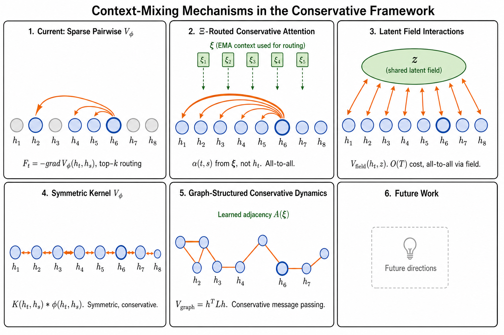
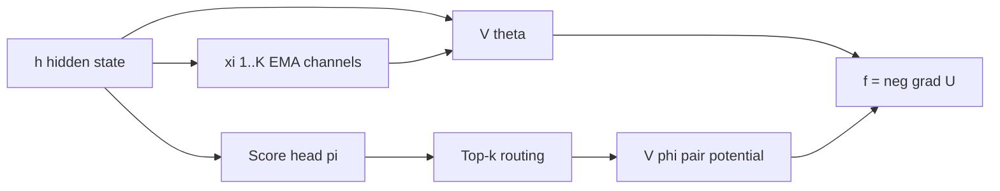
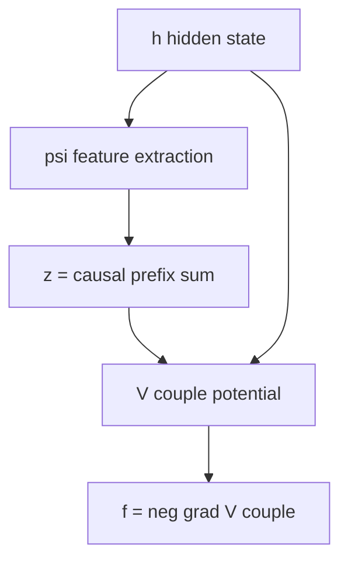
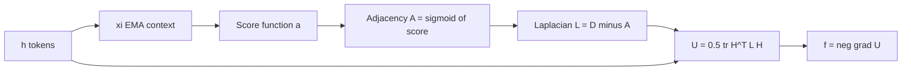
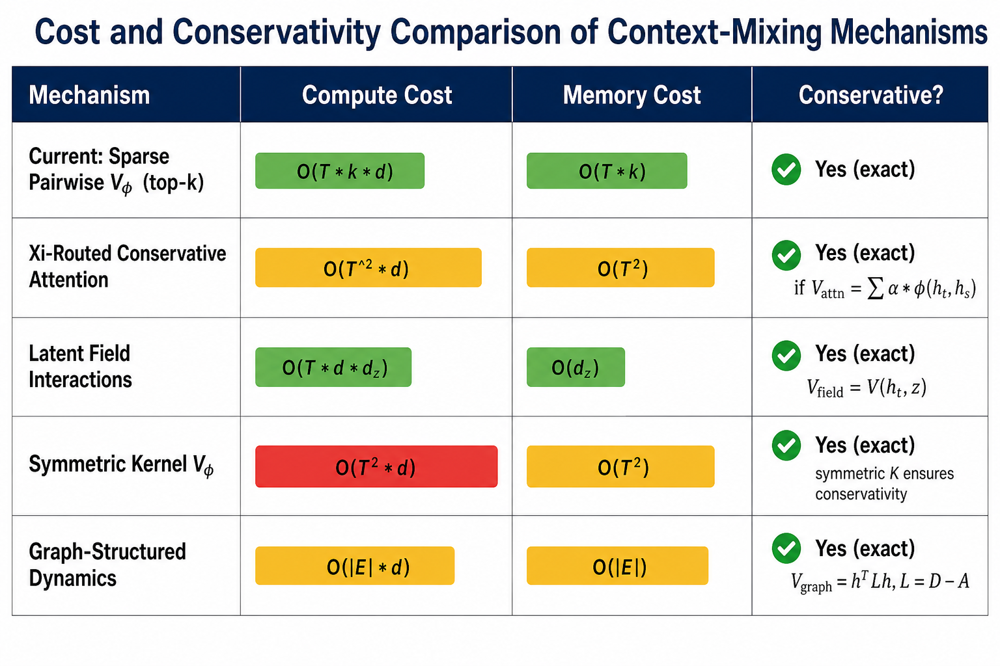
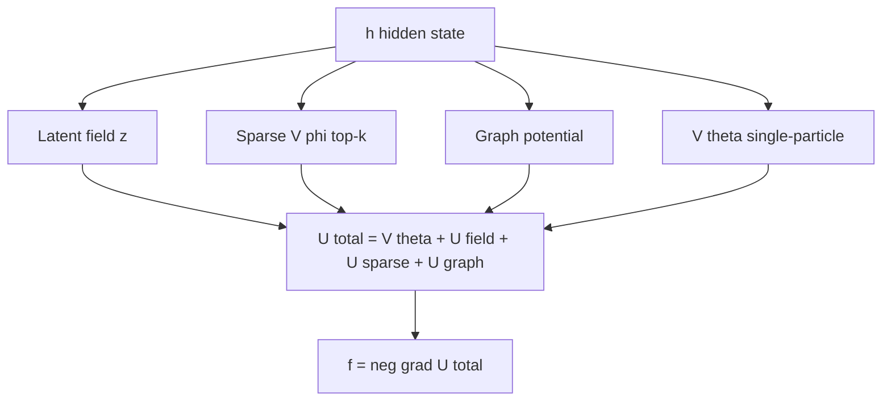
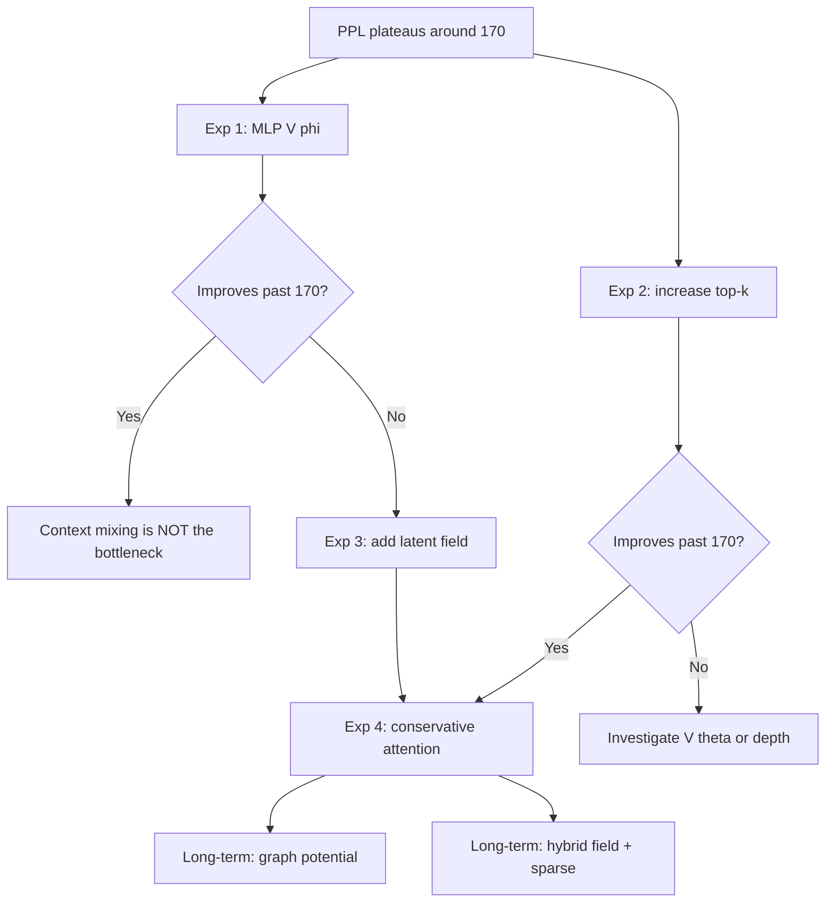

# Context-Mixing Mechanisms in the Conservative Framework

**Status:** companion note to *Semantic Simulation: A Prescriptive Lagrangian Framework for Efficient Semantic Inference* (Gueorguiev, 2026).
**Scope:** technical report surveying the current context-mixing mechanism used by Fock-PARFLM v2.1 and analysing four alternative approaches, all formulated within the conservative dynamics framework to preserve the gradient-of-a-potential force law.
**Companion docs:**

- [`Structured_VTheta_Design_and_Theory.md`](./Structured_VTheta_Design_and_Theory.md) -- structured scalar potential theory and analysis.
- [`Structured_VPhi_Design_and_Theory.md`](./Structured_VPhi_Design_and_Theory.md) -- pairwise potential design.
- [`Xi_Bottleneck_Diagnosis_Phase5.md`](./Xi_Bottleneck_Diagnosis_Phase5.md) -- the D0.4 long-tail diagnostic.
- [`Fock-PARFLM_vs_GPT-2_on_OpenWebText_Next_Steps.md`](./Fock-PARFLM_vs_GPT-2_on_OpenWebText_Next_Steps.md) -- next-step experiment plan.
- **Implementation:** [`notebooks/conservative_arch/parf/model_parf.py`](../notebooks/conservative_arch/parf/model_parf.py), [`model_parf_multixi.py`](../notebooks/conservative_arch/parf/model_parf_multixi.py), [`model_fock_parf_multixi.py`](../notebooks/conservative_arch/parf/model_fock_parf_multixi.py).

---

## Table of Contents

1. [Introduction](#1-introduction)
2. [Background: conservative dynamics and the force law](#2-background-conservative-dynamics-and-the-force-law)
3. [Current mechanism: sparse pairwise V_phi with multi-channel xi EMA](#3-current-mechanism-sparse-pairwise-v_phi-with-multi-channel-xi-ema)
   - 3.6 [Prior art: FockAttentionPARFLM (non-conservative exchange force)](#36-prior-art-fockattentionparflm-non-conservative-exchange-force)
4. [Alternative A: xi-routed conservative attention](#4-alternative-a-xi-routed-conservative-attention)
5. [Alternative B: latent field interactions](#5-alternative-b-latent-field-interactions)
6. [Alternative C: symmetric kernel V_phi](#6-alternative-c-symmetric-kernel-v_phi)
7. [Alternative D: graph-structured conservative dynamics](#7-alternative-d-graph-structured-conservative-dynamics)
8. [Comparison and cost analysis](#8-comparison-and-cost-analysis)
9. [Recommendations and roadmap](#9-recommendations-and-roadmap)
10. [References](#10-references)

---

## 1. Introduction

The SPLM family of models (SPLM, PARFLM, Fock-PARFLM) evolves hidden states through conservative dynamics: each integration layer applies a force $f = -\nabla_h U$ derived from a total scalar potential $U$. In all current implementations, the potential decomposes as:

$$
U = \sum_t V_\theta(\xi_t, h_t) + \sum_{t} \sum_{s \lt t} V_\phi(h_t, h_s)
$$

The first term, $V_\theta$, is the single-particle potential conditioned on a causal context summary $\xi_t$. The second term, $V_\phi$, is the pairwise interaction potential that mediates **context mixing** -- the mechanism by which information from past tokens influences the current token's trajectory through hidden-state space.

Context mixing is the binding constraint on model expressivity once the output head (tied vs. untied embeddings) and single-particle dynamics ($V_\theta$ architecture) are fixed. This report provides a rigorous treatment of the current mechanism and four conservative alternatives, analysing each for:

- **Conservativity guarantee** (whether $F = -\nabla V$ is preserved).
- **Computational and memory cost** as a function of sequence length $T$, hidden dimension $d$, and sparsity parameter $k$.
- **Expressivity** -- what classes of token interactions each mechanism can represent.
- **Stability** -- gradient behaviour during training.



---

## 2. Background: conservative dynamics and the force law

### 2.1 The governing equation

At each integration layer $\ell$, the hidden state $h_t$ evolves according to the damped Euler--Lagrange equation:

$$
w_t \ddot{h}\_t + \gamma \dot{h}\_t = -\nabla_h U(h_t, \xi_t)
$$

where $w_t$ is the token mass, $\gamma$ is the damping coefficient, and $U$ is the total scalar potential. The velocity-Verlet discretisation yields:

$$
h_t^{(\ell+1)} = h_t^{(\ell)} + \frac{\delta_t^{(\ell)}}{1 + \mathrm{dt} \cdot \gamma} + \frac{\mathrm{dt}^2}{w_t (1 + \mathrm{dt} \cdot \gamma)} f_t^{(\ell)}
$$

where $\delta_t^{(\ell)} = h_t^{(\ell)} - h_t^{(\ell-1)}$ is the velocity proxy and the force is:

$$
f_t^{(\ell)} = -\nabla_{h_t} U(h_t^{(\ell)}, \xi_t^{(\ell)})
$$

### 2.2 The conservativity constraint

A force field mapping $d$-dimensional real space to itself is **conservative** if and only if it can be written as the negative gradient of a scalar potential:

$$
F(h) = -\nabla_h V(h) \quad \text{for some } V: \mathbb{R}^d \to \mathbb{R}
$$

Equivalently, the curl vanishes: $\partial F_i / \partial h_j = \partial F_j / \partial h_i$ for all $i, j$. This ensures:

1. **Path independence** -- the work done by the force depends only on the endpoints, not the trajectory.
2. **Energy conservation** -- the total energy $E = T + V$ is conserved (up to damping).
3. **Lyapunov stability** -- $V$ acts as a Lyapunov function, guaranteeing bounded trajectories when $V$ is bounded below.

Any proposed context-mixing mechanism must produce forces that satisfy this constraint. The key design principle: **define a scalar potential first, then derive the force by differentiation**. Never define forces directly.

### 2.3 The conservativity requirement for pairwise terms

For a pairwise potential $V_\phi(h_t, h_s)$, the force on token $t$ from the interaction with token $s$ is:

$$
f_{t \leftarrow s} = -\nabla_{h_t} V_\phi(h_t, h_s)
$$

This is automatically conservative in $h_t$ as long as $V_\phi$ is a well-defined scalar function. The key subtlety is the treatment of $h_s$: in the current implementation, $h_s$ is **detached** (treated as a frozen external field), so the force on $t$ does not induce a back-reaction on $s$. This preserves strict causality ($s \lt t$) and avoids the Newton's-third-law symmetry that would break autoregressive generation.

---

## 3. Current mechanism: sparse pairwise $V_\phi$ with multi-channel $\xi$ EMA

### 3.1 Architecture overview

The current context-mixing architecture in Fock-PARFLM v2.1 has two components:

1. **Multi-channel causal EMA $\xi$**: $K$ exponential moving averages of the hidden state at different decay scales, providing a compressed causal context to $V_\theta$.
2. **Sparse pairwise $V_\phi$**: a Gumbel-softmax top-$k$ routed pair interaction evaluated on selected $(h_t, h_s)$ pairs only.



### 3.2 Multi-channel $\xi$: causal EMA context

The context summary $\xi_t^k$ for channel $k$ is computed as a causal exponential moving average:

$$
\xi_t^k = \alpha_k \xi_{t-1}^k + (1 - \alpha_k) h_t
$$

where $\alpha_k \in [0, 1)$ is a learnable decay parameter. With $K$ channels at different decay scales (e.g. $\alpha \in \lbrace 0.0, 0.5, 0.9, 0.99 \rbrace$), the EMA bank captures both short-range and long-range context. The concatenated context is:

$$
\bar{\xi}\_t = [h_t; \xi_t^1; \xi_t^2; \ldots; \xi_t^K] \in \mathbb{R}^{(K+1)d}
$$

The scalar potential $V_\theta$ takes this extended context as input: $V_\theta(\bar{\xi}\_t, h_t) \to \mathbb{R}$.

**Key properties:**

- $O(T \cdot K \cdot d)$ compute for all $\xi$ channels (linear in $T$).
- Strictly causal: $\xi_t^k$ depends only on $h_1, \ldots, h_t$.
- No pairwise interactions: $\xi$ compresses past context into a fixed-size summary per token.

**Limitation:** the EMA compression is lossy. It cannot represent arbitrary functions of the past-token set; in particular, it cannot selectively attend to individual past tokens. This is the role of $V_\phi$.

### 3.3 Sparse pairwise $V_\phi$: structural competitive variant

The pairwise potential $V_\phi(h_t, h_s)$ decomposes into three multiplicative factors:

$$
V_\phi(h_t, h_s) = \Theta_\phi(h_t, h_s) \cdot \tilde{\Phi}\_\phi(h_t, h_s) \cdot \frac{1}{r(h_t, h_s) + \epsilon}
$$

where:

- **Sign channel** $\Theta_\phi \in [-1, 1]$: encodes whether the pair interaction is attractive or repulsive, computed via $\tanh$ of the cosine similarity between angle projections.
- **Type-gate** $\tilde{\Phi}\_\phi$: a row-softmax competitive gate that determines how much attention to allocate to each source, computed from type-projection distances.
- **Distance kernel** $1/(r + \epsilon)$: a gravity-like radial kernel based on the squared norm of the difference.

The total pairwise contribution to the potential is:

$$
U_\phi = \sum_t \sum_{s \lt t} \tilde{m}\_{ts} \cdot V_\phi(h_t, h_s)
$$

where $\tilde{m}\_{ts}$ is the Gumbel-softmax routing mask from the score head $\pi(h_t, h_s)$, selecting the top-$k$ most relevant sources for each target $t$.

**Code excerpt** (from `model_parf_multixi.py`, the gathered-form computation):

```python
# Score head → routing
pi = self.score_head(h_in, h_src_for_score)           # (B, T, T)
causal = self._pair_mask_for(T, h_in.device)

# Gathered form: select top-k source tokens
idx, m_g = self._sparse_topk_indices(pi, causal, T)   # (B,T,k), (B,T,k)
idx_for_gather = idx.unsqueeze(-1).expand(-1, -1, -1, d)
h_src_g = h_src.unsqueeze(1).expand(-1, T, -1, -1).gather(
    2, idx_for_gather,
)                                                      # (B, T, k, d)
V_phi_g = self.V_phi.forward_gathered(h_in, h_src_g)  # (B, T, k)
U_pair = (V_phi_g * m_g).sum()
```

### 3.4 Force computation

With the total potential $U = \sum_t V_\theta(\bar{\xi}\_t, h_t) + U_\phi$, the force is:

$$
f_t = -\nabla_{h_t} U
$$

When $V_\theta$ is a structured variant (Gaussian, SARF, SQ3), the gradient is computed analytically; when it is an MLP, `torch.autograd.grad` is used. The $V_\phi$ gradient always requires autograd due to the non-linear structural decomposition.

### 3.5 Strengths and limitations

**Strengths:**

- $O(T \cdot k)$ memory for the gathered form (vs. $O(T^2)$ for dense).
- Exact conservativity: forces are always $-\nabla U$.
- The structural decomposition provides interpretable channels (sign, type, distance).
- The competitive gate imports attention-like selectivity.

**Limitations:**

- **Information bottleneck**: the top-$k$ routing discards $(T - k)$ sources per target. With $k = 3$ and $T = 1024$, each token sees only 0.3% of its causal context through $V_\phi$.
- **Routing errors**: the score head $\pi$ must learn to identify the relevant sources without seeing their content through $V_\phi$ first (the score head uses $h$, not the $V_\phi$ internal projections).
- **No all-to-all mixing**: unlike attention, there is no mechanism for every token to influence every other token (even softly).
- **Shared $V_\theta$ across layers**: the same potential governs all layers, limiting the model's ability to perform different computations at different depths.

### 3.6 Prior art: FockAttentionPARFLM (non-conservative exchange force)

Before describing conservative alternatives, it is important to document an existing implementation that already introduces attention-like O(T^2) mixing into the PARFLM dynamics: `FockAttentionPARFLM` (defined in `model_fock_attention.py`).

**Architecture.** FockAttentionPARFLM extends MultiXiPARFLM with a **non-conservative exchange force** modelled on Section 5.1 of the paper ("Attention as Virtual Particle Exchange"). Each token $j$ emits a virtual photon carrying a key $k_j = W_K h_j$ and payload $v_j = W_V h_j$; each token $i$ absorbs with query $q_i = W_Q h_i$. The coupling is:

$$
\alpha_{ij} = \mathrm{softmax}_j(q_i \cdot k_j / \sqrt{d_k})
$$

The exchange force on token $i$ is:

$$
F_i^{\mathrm{ex}} = W_O \sum_{j \le i} \alpha_{ij} \cdot v_j
$$

This force is injected **post-Verlet** as an additive correction:

$$
h_\mathrm{new} \leftarrow h_\mathrm{new} + \frac{\mathrm{dt}^2}{w_t(1 + \mathrm{dt} \cdot \gamma)} \cdot \tanh(s) \cdot F^{\mathrm{ex}}
$$

where $s$ is a learnable scalar gate initialised to 0.

**Code excerpt** (from `model_fock_attention.py`):

```python
# Conservative dynamics (MultiXi PARF Verlet step)
h_new = super()._layer_step(
    h, h_prev, m_b, gamma, dt, layer_idx=layer_idx,
)

# Non-conservative exchange force (§5.1 Feynman diagram)
F_ex = self.exchange_force(h_new)
scale = torch.tanh(self.exchange_scale)
denom = 1.0 + dt * gamma
h_new = h_new + (dt * dt / (m_b * denom)) * scale * F_ex
```

**Key finding: the exchange force is explicitly non-conservative.** The force $F_i^{\mathrm{ex}}$ cannot be written as $-\nabla_h V$ for any scalar potential $V$ because:

1. **Asymmetric coupling**: $\alpha_{ij} \neq \alpha_{ji}$ in general (the softmax normalisation is over columns for each row independently).
2. **Vector-valued output**: the force $W_O \sum_j \alpha_{ij} v_j$ is a linear map of a value-weighted sum, not a gradient of a scalar.
3. **$h$-dependent routing**: both $\alpha_{ij}$ and $v_j$ depend on the current hidden state $h$, creating a non-integrable force field.

**Experimental results** (from the TinyStories experiments documented in `Improving_the_Fock_Mechanism_to_match_Attention.md`):

- FockAttentionPARFLM with 4 heads reached **9.42 PPL** at 16k steps, closing 65.5% of the gap to MatchedGPT (7.81 PPL).
- The model learned a **negative** (repulsive) exchange scale, pushing tokens apart rather than blending them.
- The conservative dynamics already handles attractive clustering; the exchange provides the complementary dispersive pressure.
- K=4 EMA channels outperformed K=8, suggesting over-regularisation in the conservative dynamics leaves less room for the exchange.

**Implication for this report.** FockAttentionPARFLM demonstrates that attention-like mixing dramatically improves PPL, but it breaks the conservativity guarantee. The alternatives proposed in this report (Sections 4--7) seek to achieve similar benefits **while preserving the gradient-of-a-potential force law**. Section 4 in particular proposes a conservative reformulation of the same attention mechanism.

---

## 4. Alternative A: $\xi$-routed conservative attention

### 4.1 Motivation

The FockAttentionPARFLM experiment (Section 3.6) demonstrates that O(T^2) attention-like mixing closes 65.5% of the PPL gap to transformers but sacrifices conservativity. The question is: **can we achieve similar mixing without breaking the potential-derived force law?**

Standard scaled dot-product attention computes:

$$
\mathrm{Attn}(Q, K, V) = \mathrm{softmax}(QK^\top / \sqrt{d_k}) V
$$

This is **not** conservative: it directly defines a transformation of $h_t$ (an additive update) rather than deriving a force from a scalar potential. The existing FockAttentionPARFLM confirms this non-conservativity empirically (it learns repulsive forces with no potential interpretation). To import attention's all-to-all mixing into the conservative framework, we must reformulate it as a potential.

### 4.2 The scalar attention potential

Define a scalar potential whose form mirrors the attention mechanism:

$$
V_\mathrm{attn}(h_t, H_{\lt t}) = -\sum_{s \lt t} \alpha(t, s) \cdot \phi(h_t, h_s)
$$

where $\alpha(t, s)$ is an attention weight and $\phi(h_t, h_s)$ is a scalar interaction kernel. The conservative force on $h_t$ is:

$$
f_t = -\nabla_{h_t} V_\mathrm{attn} = \sum_{s \lt t} \alpha(t, s) \nabla_{h_t} \phi(h_t, h_s) + \sum_{s \lt t} \phi(h_t, h_s) \nabla_{h_t} \alpha(t, s)
$$

The second term exists whenever $\alpha$ depends on $h_t$ (as in standard attention where $\alpha \propto \exp(q_t^\top k_s / \sqrt{d})$). This term is well-defined and conservative as long as $V_\mathrm{attn}$ is differentiable, but it introduces additional complexity.

### 4.3 Xi-routed variant: decoupling routing from forces

The key insight is to compute the attention weights $\alpha$ from the **EMA context** $\xi_t$ rather than from $h_t$ itself:

$$
\alpha(t, s) = \frac{\exp(q(\xi_t)^\top k(\xi_s) / \sqrt{d_k})}{\sum_{s' \lt t} \exp(q(\xi_t)^\top k(\xi_{s'}) / \sqrt{d_k})}
$$

where $q(\cdot)$ and $k(\cdot)$ are learned projections of the detached EMA context $\xi_t$. Since $\xi_t$ is computed from $h.detach()$, the attention weights $\alpha(t, s)$ are **constant** with respect to $h_t$ in the current integration step. The potential simplifies to:

$$
V_\mathrm{attn}(h_t, H_{\lt t}) = -\sum_{s \lt t} \alpha(t, s) \cdot \phi(h_t, h_s)
$$

and the force becomes:

$$
f_t = \sum_{s \lt t} \alpha(t, s) \nabla_{h_t} \phi(h_t, h_s)
$$

with no second-order routing term, since $\nabla_{h_t} \alpha = 0$.

### 4.4 Choices for the interaction kernel $\phi$

The scalar kernel $\phi$ determines the nature of the pairwise force:

**Option A1: Squared-norm kernel (Gaussian RBF)**

$$
\phi(h_t, h_s) = -\frac{1}{2\sigma^2} \lVert h_t - h_s \rVert^2
$$

Force: $f_{t \leftarrow s} = \alpha(t, s) \cdot \frac{1}{\sigma^2}(h_s - h_t)$. This is a spring-like attractive force proportional to the displacement.

**Option A2: Dot-product kernel**

$$
\phi(h_t, h_s) = h_t^\top W h_s
$$

where $W$ is a learned symmetric matrix. Force: $f_{t \leftarrow s} = \alpha(t, s) \cdot W h_s$. This resembles the "value" computation in standard attention.

**Option A3: Structured kernel (from current $V_\phi$)**

$$
\phi(h_t, h_s) = \Theta_\phi(h_t, h_s) \cdot \frac{1}{r(h_t, h_s) + \epsilon}
$$

This retains the sign-channel and distance-kernel structure from the current implementation, now with attention weights providing the routing.

### 4.5 Multi-head extension

For $H$ attention heads, define $H$ independent potentials:

$$
V_\mathrm{attn}^{(h)}(h_t, H_{\lt t}) = -\sum_{s \lt t} \alpha^{(h)}(t, s) \cdot \phi^{(h)}(h_t, h_s)
$$

The total pairwise potential is:

$$
U_\mathrm{attn} = \sum_t \sum_{h=1}^{H} V_\mathrm{attn}^{(h)}(h_t, H_{\lt t})
$$

Each head can specialise in different scales or types of interaction, analogous to multi-head attention in the transformer.

### 4.6 Computational analysis

| Component | Cost | Notes |
| --------- | ---- | ----- |
| Query/key projections from xi | O(T d d_k H) | Computed once per layer |
| Attention scores alpha | O(T^2 d_k H) | Quadratic in T |
| Kernel evaluations phi | O(T^2 d H) | All pairs |
| Force via autograd | O(T^2 d H) | Backward through phi |
| **Total** | **O(T^2 d H)** | Same as standard attention |

**Memory:** O(T^2 H) for the attention matrix, plus O(T d) for the hidden states. This matches standard attention memory.

### 4.7 Conservativity proof

**Theorem.** The $\xi$-routed conservative attention potential $V_\mathrm{attn}$ defines a conservative force field.

**Proof.** The attention weights $\alpha(t, s)$ depend on $\xi_t$ and $\xi_s$, which are computed from $h.detach()$ and are therefore constant with respect to $h_t$. The kernel $\phi(h_t, h_s)$ is a scalar function of $h_t$ (with $h_s$ detached). Therefore:

$$
V_\mathrm{attn}(h_t) = -\sum_{s \lt t} c_{ts} \cdot \phi(h_t, h_s)
$$

where each $c_{ts} = \alpha(t, s)$ is a constant scalar. This is a finite linear combination of scalar functions of $h_t$, hence a scalar function of $h_t$. Its gradient $-\nabla_{h_t} V_\mathrm{attn}$ is by construction a conservative force. $\square$

### 4.8 Advantages and risks

**Advantages:**

- **All-to-all mixing**: every token receives a weighted contribution from every past token, eliminating the top-$k$ information bottleneck.
- **Proven mechanism**: attention is empirically well-understood from transformer research.
- **Smooth gradients**: the softmax produces smooth, non-zero gradients for all pairs.

**Risks:**

- **Quadratic cost**: $O(T^2)$ in both compute and memory, which may be prohibitive for long sequences.
- **Expressivity ceiling**: the kernel $\phi$ must be a scalar function, which is less expressive than the additive vector-valued update in standard attention.
- **Routing-force decoupling**: since $\alpha$ is computed from $\xi$ (detached), the routing cannot adapt to the current hidden state. This may limit the model's ability to perform content-dependent retrieval.

---

## 5. Alternative B: latent field interactions

### 5.1 Motivation

The fundamental cost driver in pairwise potentials is the $O(T^2)$ quadratic scaling: every pair $(h_t, h_s)$ must be evaluated. Latent field interactions avoid this by introducing a **shared latent field** $z$ that mediates all-to-all interactions with $O(T)$ cost.

### 5.2 The latent field potential

Introduce a latent field variable $z \in \mathbb{R}^{d_z}$ (shared across all tokens in the sequence). Define the total field potential:

$$
U_\mathrm{field}(H, z) = \sum_{t=1}^{T} V_\mathrm{couple}(h_t, z) + V_\mathrm{prior}(z)
$$

where:

- $V_\mathrm{couple}(h_t, z)$: a coupling potential between token $t$ and the field.
- $V_\mathrm{prior}(z)$: a regularising prior on the field state.

The field $z$ is not a model parameter -- it is a **dynamical variable** that is optimised jointly with the token states at each forward pass. Specifically, at each integration layer, we perform:

**Step 1:** Update the field by minimising $U_\mathrm{field}$ over $z$ (holding $H$ fixed):

$$
z^\ast = \arg\min_z U_\mathrm{field}(H, z)
$$

**Step 2:** Compute the force on each token from the field:

$$
f_t = -\nabla_{h_t} V_\mathrm{couple}(h_t, z^\ast)
$$

### 5.3 Parametric forms for the coupling potential

**Option B1: Bilinear coupling**

$$
V_\mathrm{couple}(h_t, z) = -h_t^\top W z
$$

This is the simplest coupling. The field optimum (ignoring the prior) is:

$$
z^\ast \propto W^\top \bar{h} \quad \text{where } \bar{h} = \frac{1}{T}\sum_t h_t
$$

The resulting force is $f_t = W z^\ast$, which is the same for all tokens -- a global bias. This is too simple for context mixing.

**Option B2: Multi-component field with position-dependent coupling**

$$
V_\mathrm{couple}(h_t, z) = -\sum_{m=1}^{M} g_m(h_t) \cdot z_m
$$

where $z = [z_1, \ldots, z_M]$ with each $z_m \in \mathbb{R}$ and $g_m: \mathbb{R}^d \to \mathbb{R}$ are learned scalar features. The field optimum is:

$$
z_m^\ast = \frac{\sum_t g_m(h_t)}{\lambda_m} \quad \text{(with quadratic prior } V_\mathrm{prior} = \frac{1}{2}\sum_m \lambda_m z_m^2\text{)}
$$

The force becomes:

$$
f_t = \sum_m z_m^\ast \nabla_{h_t} g_m(h_t)
$$

This is richer: each feature $g_m$ can capture a different aspect of the token, and the field component $z_m^\ast$ aggregates that aspect across all tokens.

**Option B3: Non-linear coupling with MLP features**

$$
V_\mathrm{couple}(h_t, z) = -\psi(h_t)^\top z
$$

where $\psi: \mathbb{R}^d \to \mathbb{R}^{d_z}$ is an MLP producing a feature vector. With a quadratic prior:

$$
z^\ast = \frac{1}{\lambda} \sum_t \psi(h_t)
$$

$$
f_t = \frac{1}{\lambda} J_\psi(h_t)^\top \sum_s \psi(h_s)
$$

where $J_\psi$ is the Jacobian of $\psi$. This achieves all-to-all mixing through the shared field at $O(T \cdot d \cdot d_z)$ cost.

### 5.4 Causal variant

For autoregressive models, the field must be causal. Replace the global sum with a causal prefix sum:

$$
z_t^\ast = \frac{1}{\lambda} \sum_{s \le t} \psi(h_s)
$$

This can be computed incrementally in $O(T \cdot d_z)$ time and $O(d_z)$ memory (carrying a running sum).

The per-token force becomes:

$$
f_t = \frac{1}{\lambda} J_\psi(h_t)^\top z_t^\ast
$$

### 5.5 Relationship to mean-field theory

The latent field approach is the **mean-field approximation** of the full pairwise potential. The all-to-all interactions are replaced by each particle interacting with the mean field created by all others:

$$
V_\phi(h_t, h_s) \approx V_\mathrm{couple}(h_t, z(H))
$$

This is exact for quadratic potentials (where the mean field is sufficient) and approximate for non-linear potentials.



### 5.6 Computational analysis

| Component | Cost | Notes |
| --------- | ---- | ----- |
| Feature extraction psi(h_t) | O(T d d_z) | MLP forward |
| Causal prefix sum | O(T d_z) | Running sum |
| Coupling potential | O(T d_z) | Dot product |
| Force via autograd | O(T d d_z) | Backward through psi |
| **Total** | **O(T d d_z)** | **Linear in T** |

**Memory:** O(T d_z) for the prefix sums, plus O(d_z) for the field state. This is a dramatic improvement over O(T^2) for pairwise potentials.

### 5.7 Conservativity proof

**Theorem.** The latent field potential $U_\mathrm{field}$ with causal prefix-sum field $z_t^\ast$ defines a conservative force field.

**Proof.** Since $z_t^\ast$ depends on $h_1, \ldots, h_t$ with all $h_{s \ne t}$ detached, from $h_t$'s perspective $z_t^\ast$ decomposes as:

$$
z_t^\ast = \underbrace{\frac{1}{\lambda}\sum_{s \lt t} \psi(h_s.detach())}_\text{constant w.r.t. } h_t + \frac{1}{\lambda}\psi(h_t)
$$

Therefore:

$$
V_\mathrm{couple}(h_t, z_t^\ast) = -\psi(h_t)^\top c_t - \frac{1}{\lambda}\lVert \psi(h_t) \rVert^2
$$

where $c_t = \frac{1}{\lambda}\sum_{s \lt t} \psi(h_s)$ is a constant vector. Both terms are scalar functions of $h_t$, so the force $f_t = -\nabla_{h_t} V_\mathrm{couple}$ is conservative. $\square$

### 5.8 Advantages and risks

**Advantages:**

- **Linear cost**: $O(T)$ in both compute and memory.
- **All-to-all mixing**: every token contributes to the field and every token is influenced by it.
- **Simple implementation**: prefix sums are trivially parallelisable.

**Risks:**

- **Expressivity**: the mean-field approximation is lossy. It cannot represent arbitrary pairwise interactions (e.g. "token $t$ interacts strongly with token $s$ but not with token $s'$" cannot be captured if $\psi(h_s) \approx \psi(h_{s'})$).
- **Feature design**: the quality of the approximation depends entirely on the feature function $\psi$. A poorly designed $\psi$ may not capture the relevant aspects of the tokens.
- **Mode collapse**: the shared field may converge to a trivial mean, providing no useful per-token information.

---

## 6. Alternative C: symmetric kernel $V_\phi$

### 6.1 Motivation

The current structural $V_\phi$ uses an asymmetric decomposition (separate type-gate and sign-channel for query vs. source). An alternative is to use a **symmetric kernel** that enforces $V_\phi(h_t, h_s) = V_\phi(h_s, h_t)$. Symmetric kernels have a rich mathematical theory (Mercer's theorem, reproducing kernel Hilbert spaces) and naturally satisfy the conservativity constraint.

### 6.2 Kernel potential formulation

Define the pairwise potential using a kernel function:

$$
V_\mathrm{kern}(h_t, h_s) = K(h_t, h_s) \cdot \phi(h_t, h_s)
$$

where $K$ is a positive-definite kernel (routing) mapping pairs to non-negative reals and $\phi$ is a signed interaction function mapping pairs to reals.

### 6.3 Kernel choices

**Option C1: Gaussian (RBF) kernel**

$$
K(h_t, h_s) = \exp\left(-\frac{\lVert h_t - h_s \rVert^2}{2\sigma^2}\right)
$$

This provides locality: tokens with similar hidden states interact more strongly. The kernel bandwidth $\sigma$ controls the interaction range.

**Option C2: Polynomial kernel**

$$
K(h_t, h_s) = (h_t^\top h_s + c)^p
$$

For $p = 1$ this reduces to a bilinear interaction. For $p = 2$ it captures second-order correlations.

**Option C3: Learned spectral kernel**

Parameterise the kernel via a spectral decomposition:

$$
K(h_t, h_s) = \sum_{m=1}^{M} \lambda_m \cdot \varphi_m(h_t) \cdot \varphi_m(h_s)
$$

where $\varphi_m: \mathbb{R}^d \to \mathbb{R}$ are learned basis functions and $\lambda_m \gt 0$ are positive eigenvalues. By Mercer's theorem, any positive-definite kernel admits such a decomposition. The learned variant uses MLPs for $\varphi_m$.

**Crucial observation:** the spectral kernel decomposes the $O(T^2)$ kernel evaluation into $O(T \cdot M)$ feature evaluations plus an $O(T^2 \cdot M)$ outer product. More importantly, when combined with the signed interaction $\phi$, the total potential can be written as:

$$
U_\mathrm{kern} = \sum_t \sum_{s \lt t} \sum_m \lambda_m \varphi_m(h_t) \varphi_m(h_s) \phi(h_t, h_s)
$$

### 6.4 Connection to the Random Fourier Feature approximation

For the Gaussian kernel, the Random Fourier Feature (RFF) approximation (Rahimi and Recht, 2007) provides:

$$
K(h_t, h_s) \approx \frac{1}{M}\sum_{m=1}^{M} \cos(\omega_m^\top h_t + b_m) \cos(\omega_m^\top h_s + b_m)
$$

where $\omega_m \sim \mathcal{N}(0, \sigma^{-2} I)$ and $b_m \sim \mathrm{Uniform}(0, 2\pi)$. This reduces the kernel evaluation to $O(T \cdot M \cdot d)$ with controllable approximation error.

### 6.5 Dense vs. gathered evaluation

Like the current $V_\phi$, the symmetric kernel can be evaluated in either dense ($O(T^2)$) or gathered (top-$k$, $O(T \cdot k)$) form. The kernel value $K(h_t, h_s)$ itself can serve as the routing score, eliminating the need for a separate score head:

$$
\tilde{m}\_{ts} = \mathbb{1}[K(h_t, h_s) \in \mathrm{top}\text{-}k_s\lbrace K(h_t, h_{s'}) : s' \lt t\rbrace]
$$

### 6.6 Computational analysis

| Variant | Compute | Memory | Notes |
| ------- | ------- | ------ | ----- |
| Dense Gaussian | O(T^2 d) | O(T^2) | Full kernel matrix |
| RFF-approximated | O(T M d) | O(T M) | Approximate; M controls accuracy |
| Spectral learned | O(T M d + T^2 M) | O(T M) | Exact for M-rank kernels |
| Top-k gathered | O(T k d) | O(T k) | Sparse; same as current |

### 6.7 Conservativity

Symmetric kernels are automatically conservative because $V_\mathrm{kern}(h_t, h_s)$ is a well-defined scalar function of $h_t$ (with $h_s$ detached). The symmetry $K(h_t, h_s) = K(h_s, h_t)$ is not required for conservativity (since $h_s$ is always detached), but it provides a useful inductive bias: the force that $s$ exerts on $t$ is related to the force that $t$ would exert on $s$, encouraging physically meaningful interactions.

### 6.8 Advantages and risks

**Advantages:**

- **Rich mathematical theory**: kernel methods have well-understood approximation and generalisation properties.
- **Natural routing**: the kernel value itself serves as a similarity/routing score, eliminating the separate score head.
- **RFF approximation**: provides a principled path to $O(T)$ cost with controllable error bounds.
- **Mercer decomposition**: connects to the latent field approach (Alternative B) via the spectral decomposition.

**Risks:**

- **Isotropy**: Gaussian kernels are isotropic in hidden space, which may not match the anisotropic structure of learned representations. Learned kernels address this but add parameters.
- **Kernel bandwidth**: the bandwidth $\sigma$ is a critical hyperparameter. Too small gives isolated clusters; too large gives uniform interactions.
- **Expressivity vs. approximation**: the RFF approximation trades expressivity for speed; the required $M$ for a good approximation in $d = 256$ or $d = 512$ may be large.

---

## 7. Alternative D: graph-structured conservative dynamics

### 7.1 Motivation

Both the current sparse routing and the attention alternative define the interaction structure implicitly through scores or kernels. An alternative is to **explicitly learn a graph** over the token sequence and define the potential in terms of graph-theoretic operators (Laplacian, adjacency matrix).

### 7.2 Graph Laplacian potential

Given a sequence of $T$ tokens with hidden states $H = [h_1, \ldots, h_T] \in \mathbb{R}^{T \times d}$, define a learned causal adjacency matrix:

$$
A_{ts} = \begin{cases} \sigma(a(h_t, h_s)) & \text{if } s \lt t \\ 0 & \text{otherwise} \end{cases}
$$

where $a$ is a learned scoring function mapping token pairs to scalars and $\sigma$ is the sigmoid. The degree matrix is $D_{tt} = \sum_s A_{ts}$, and the graph Laplacian is:

$$
L = D - A
$$

The graph potential is a quadratic form over the Laplacian:

$$
U_\mathrm{graph} = \frac{1}{2} \sum_{i=1}^{d} H_{:,i}^\top L H_{:,i} = \frac{1}{2} \mathrm{tr}(H^\top L H)
$$

This can be expanded as:

$$
U_\mathrm{graph} = \frac{1}{2} \sum_t \sum_{s \lt t} A_{ts} \lVert h_t - h_s \rVert^2
$$

The force on token $t$ is:

$$
f_t = -\nabla_{h_t} U_\mathrm{graph} = -\sum_{s \lt t} A_{ts}(h_t - h_s) - \frac{1}{2}\sum_{s \lt t} \nabla_{h_t} A_{ts} \lVert h_t - h_s \rVert^2
$$

When the adjacency weights $A_{ts}$ are detached (i.e. computed from $\xi$ or $h.detach()$), the second term vanishes and the force simplifies to:

$$
f_t = -\sum_{s \lt t} A_{ts}(h_t - h_s)
$$

This is a **graph diffusion** force: each token is pulled towards its connected neighbours, weighted by the edge strength.

### 7.3 Beyond quadratic: non-linear graph potentials

The quadratic Laplacian potential can be generalised to non-linear interactions:

$$
U_\mathrm{graph} = \sum_t \sum_{s \lt t} A_{ts} \cdot \phi(h_t - h_s)
$$

where $\phi: \mathbb{R}^d \to \mathbb{R}$ is a scalar function of the displacement. Choices include:

- **Quadratic**: $\phi(r) = \frac{1}{2}\lVert r \rVert^2$ (the Laplacian case).
- **Logarithmic**: $\phi(r) = \log(1 + \lVert r \rVert^2)$ (softer, bounded gradient).
- **Plummer-softened**: $\phi(r) = -1/(\lVert r \rVert + \epsilon)$ (gravity-like).



### 7.4 Sparse graph construction

The adjacency matrix $A$ can be sparsified by retaining only the top-$k$ edges per node:

$$
\tilde{A}\_{ts} = A_{ts} \cdot \mathbb{1}[s \in \mathrm{top}\text{-}k_s\lbrace A_{ts'} : s' \lt t \rbrace]
$$

This reduces the potential evaluation from $O(T^2 \cdot d)$ to $O(T \cdot k \cdot d)$, matching the current sparse PARF cost.

### 7.5 Graph attention networks connection

The graph potential framework subsumes Graph Attention Networks (GATs). In a GAT, the aggregation is:

$$
h_t' = \sum_{s \in \mathcal{N}(t)} \alpha_{ts} W h_s
$$

where $\alpha_{ts}$ are attention coefficients. This can be rewritten as a potential:

$$
U_\mathrm{GAT} = -\sum_t \sum_{s \in \mathcal{N}(t)} \alpha_{ts} h_t^\top W h_s
$$

with force $f_t = \sum_s \alpha_{ts} W h_s$, recovering the GAT update. The conservative constraint thus provides a principled foundation for graph neural network operations.

### 7.6 Multi-scale graph hierarchy

A powerful extension is to maintain graphs at multiple scales:

- **Fine-grained graph** ($k_1$ edges): captures local syntactic dependencies (adjacent tokens, within-phrase).
- **Coarse graph** ($k_2$ edges, different $A$): captures long-range semantic dependencies (cross-sentence, topic-level).

$$
U_\mathrm{multi} = \sum_l w_l \sum_t \sum_{s \lt t} A_{ts}^{(l)} \phi_l(h_t - h_s)
$$

where $l$ indexes the graph scale and $w_l$ are learnable scale weights.

### 7.7 Computational analysis

| Variant | Compute | Memory | Notes |
| ------- | ------- | ------ | ----- |
| Dense Laplacian | O(T^2 d) | O(T^2) | Full adjacency |
| Sparse (k edges) | O(T k d) | O(T k) | Matches current PARF |
| Multi-scale (L levels) | O(L T k d) | O(L T k) | Linear overhead per level |

### 7.8 Conservativity

With detached adjacency weights (computed from $\xi$ or $h.detach()$):

$$
f_t = -\nabla_{h_t} \sum_{s \lt t} c_{ts} \phi(h_t - h_s)
$$

where $c_{ts} = A_{ts}$ is a constant. Each term $\phi(h_t - h_s)$ is a scalar function of $h_t$ (with $h_s$ detached), so the force is conservative.

### 7.9 Advantages and risks

**Advantages:**

- **Explicit structure**: the graph is interpretable -- edges correspond to specific token-token dependencies.
- **Sparsity control**: the number of edges $k$ directly controls the compute/memory budget.
- **Multi-scale**: hierarchical graphs can capture both local and global dependencies.
- **Connection to GNNs**: enables transfer of ideas from the graph neural network literature.

**Risks:**

- **Graph learning**: learning the adjacency matrix end-to-end is challenging. Discrete graph selection is non-differentiable; continuous relaxations (sigmoid, Gumbel-softmax) add their own complexities.
- **Quadratic potential**: the Laplacian potential is inherently a spring-network model. Tokens are pulled towards their graph neighbours, which may not be expressive enough for complex language modelling.
- **Scalability**: while the sparse variant matches current PARF cost, the graph construction itself requires $O(T^2)$ score evaluations (before sparsification), unless the score function has special structure.

---

## 8. Comparison and cost analysis



### 8.1 Summary table

| Mechanism | Compute | Memory | Conservative | All-to-all | Score head needed |
| --------- | ------- | ------ | ------------ | ---------- | ----------------- |
| Current: sparse V_phi (top-k) | O(Tkd) | O(Tk) | Yes | No | Yes |
| A: xi-routed attention | O(T^2 d) | O(T^2) | Yes | Yes | No (uses xi QK) |
| B: latent field | O(T d d_z) | O(T d_z) | Yes | Yes (via field) | No |
| C: symmetric kernel (RFF) | O(TMd) | O(TM) | Yes | Yes (approx.) | No (kernel is score) |
| D: graph Laplacian (sparse) | O(Tkd) | O(Tk) | Yes | No (sparse) | Yes (graph scores) |

### 8.2 Expressivity ranking

From most to least expressive (capacity to represent arbitrary pairwise interactions):

1. **A: $\xi$-routed attention** -- full-rank attention matrix, non-linear kernel. Limited only by the kernel $\phi$.
2. **Current: sparse $V_\phi$** -- arbitrary non-linear interaction through the structural decomposition, but limited to top-$k$ pairs.
3. **D: graph-structured** -- arbitrary graph topology, but interaction form is typically simpler (quadratic or Plummer-softened).
4. **C: symmetric kernel** -- rich kernel theory, but the RFF approximation introduces a rank-$M$ bottleneck.
5. **B: latent field** -- mean-field approximation; cannot represent interactions that depend on the specific identity of the source token (only on its contribution to the field).

### 8.3 Composability

These mechanisms are **not mutually exclusive**. The total potential can combine multiple terms:

$$
U_\mathrm{total} = \sum_t V_\theta(\xi_t, h_t) + \lambda_1 U_\mathrm{sparse} + \lambda_2 U_\mathrm{field} + \lambda_3 U_\mathrm{graph}
$$

A practical hybrid could use:

- **Latent field** (Alternative B) for cheap, global context (replacing or augmenting $\xi$ EMA).
- **Sparse $V_\phi$** or **sparse graph** for fine-grained, selective interactions.
- **Per-layer specialisation**: early layers use the cheap field; later layers use sparse pairwise attention.



---

## 9. Recommendations and roadmap

### 9.1 Immediate experiments (highest diagnostic value)

**Experiment 1: MLP $V_\phi$ (already supported).** Before exploring new mechanisms, test the MLP $V_\phi$ variant which removes the structural decomposition bottleneck. This diagnoses whether the structural $V_\phi$ architecture itself is the binding constraint.

**Experiment 2: increased top-$k$.** Double the current $k$ value. If PPL improves significantly, the information bottleneck in the routing is confirmed and mechanisms providing denser mixing (A, B) become high-priority.

### 9.2 Medium-term extensions

**Experiment 3: latent field augmentation.** Add a latent field potential (Alternative B, Option B3) alongside the existing sparse $V_\phi$. This adds $O(T \cdot d \cdot d_z)$ cost (negligible for small $d_z$) and provides all-to-all mixing without replacing the proven sparse mechanism.

**Experiment 4: $\xi$-routed attention (single-head).** Replace the top-$k$ routing with a single-head conservative attention potential using a dot-product kernel. This provides a direct comparison between sparse routing and attention-based all-to-all mixing at the cost of $O(T^2)$ memory.

### 9.3 Long-term research directions

**Direction 1: hierarchical graph potential.** Implement the multi-scale graph (Alternative D) with learnable adjacency, targeting interpretable token-dependency structures.

**Direction 2: hybrid field + sparse.** Use the latent field for global context (replacing the EMA $\xi$) and sparse pairwise for fine-grained retrieval, achieving the best of both worlds.

**Direction 3: per-layer mechanism selection.** Allow different layers to use different context-mixing mechanisms (e.g. field in early layers, attention in middle layers, sparse pairwise in final layers), with the selection itself learned via a gating mechanism.

### 9.4 Decision flowchart



---

## 10. References

1. Gueorguiev, D. (2026). *Semantic Simulation: A Prescriptive Lagrangian Framework for Efficient Semantic Inference*.
2. Vaswani, A., et al. (2017). "Attention is All You Need." *NeurIPS*.
3. Rahimi, A. and Recht, B. (2007). "Random Features for Large-Scale Kernel Machines." *NeurIPS*.
4. Kipf, T. N. and Welling, M. (2017). "Semi-Supervised Classification with Graph Convolutional Networks." *ICLR*.
5. Velickovic, P., et al. (2018). "Graph Attention Networks." *ICLR*.
6. Ramsauer, H., et al. (2021). "Hopfield Networks is All You Need." *ICLR*.
7. Arnol'd, V. I. (1989). *Mathematical Methods of Classical Mechanics*. Springer.

---

**Document history:**

| Date | Change |
| ---- | ------ |
| 2026-06-26 | Initial version. |
