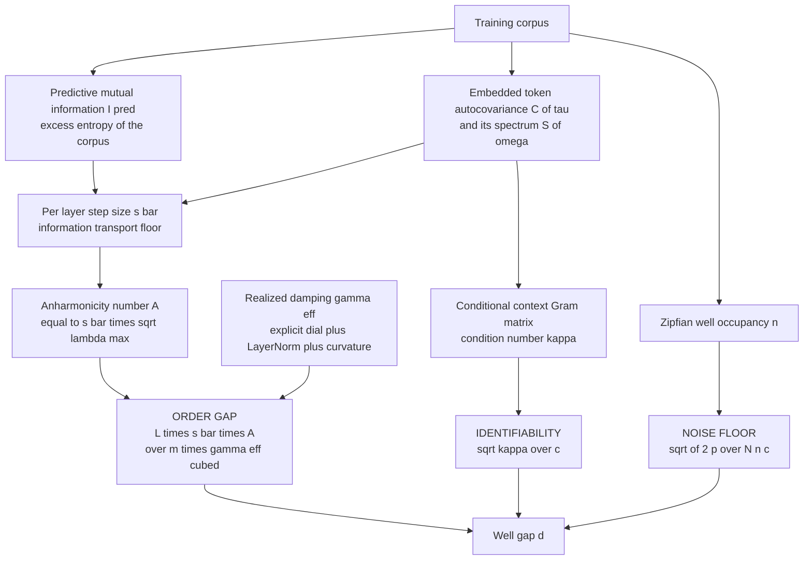
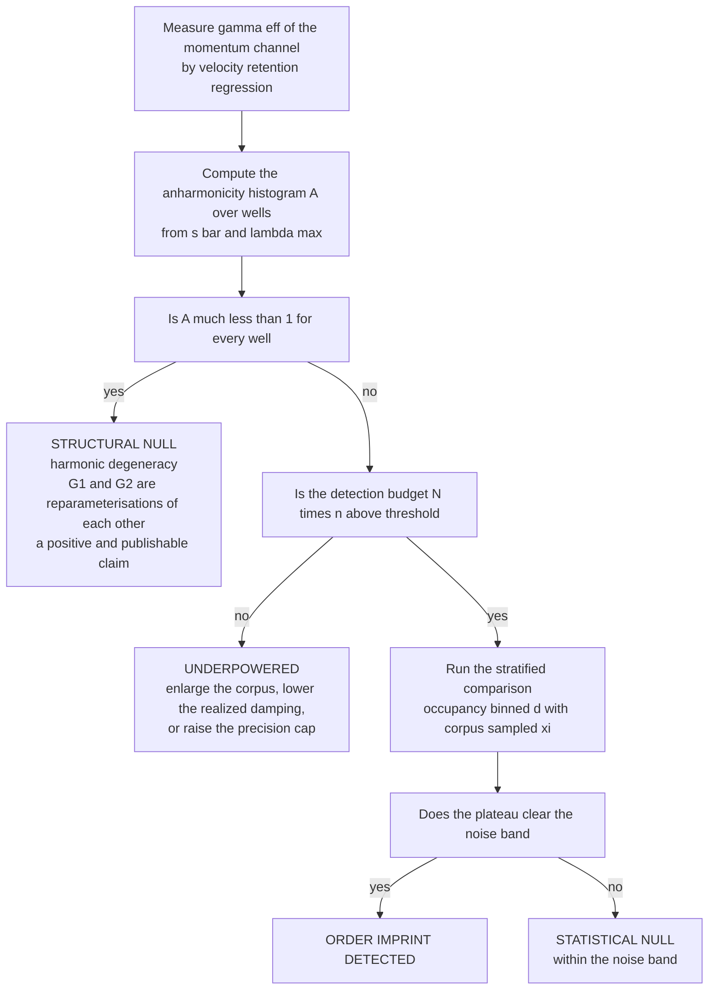
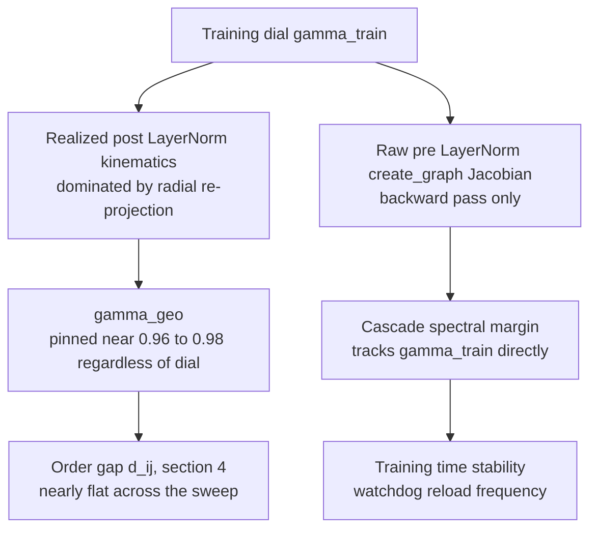

# Corpus Statistics and the First-Order vs Second-Order Well Gap

**Technical Report — Companion Note for the SemSimula Mega-Paper**
**Date:** August 2026
**Status:** Working Draft

> **Scope.** This note answers a single question posed directly: given a second-order SPLM with anisotropic Gaussian $V\_\theta$ (call it **G2**) and its first-order ablation (**G1**), trained on the same corpus, what inequality ties the statistical properties of that corpus to the distance $d\_{i,j}$ between matched potential wells in the two learned well sets? The answer is a three-factor bound (§4) whose numerator is a depth-memory mismatch gated by an anharmonicity number, whose denominator is a corpus identifiability factor, and which is accompanied by a finite-sample noise floor. Two consequences are load-bearing for the experimental programme: the gap is controlled by the **realized** damping rather than the training dial, which suppresses it by roughly 26x at the settings already run (§6.4); and well occupancy **cancels** at the population optimum, which relocates the detectable signal to the head of the occupancy distribution rather than the tail (§7). §11 applies this to the executed Fock-G1 instance and argues that its null result is a power failure rather than evidence of absence, §12 packages the whole bound into a single first-order-sufficiency decision rule, §13 asks whether the same damping that governs the well gap also governs second-order training's own gradient-cascade instability — and finds that it does not, which sharpens rather than resolves the question of when first order is the pragmatic choice — while §15 gives the measurements that would decide the matter. §13.5 checks the one candidate mechanism that could act on both channels at once, position-dependent damping $\gamma(h)$, and finds it relocates rather than removes the tension: the naive parameterisation concentrates cascade risk exactly at the high-occupancy wells the detection strategy needs most. This note is intended as the opening statement of a new section of the mega-paper on the conditions under which first-order dynamics can plausibly stand in for the second-order system.

---

## Table of Contents

1. [The Problem as Posed](#1-the-problem-as-posed)
2. [What a Well Actually Is in This Architecture](#2-what-a-well-actually-is-in-this-architecture)
3. [Making the Metric and the Matching Well Defined](#3-making-the-metric-and-the-matching-well-defined)
4. [The Master Inequality](#4-the-master-inequality)
5. [Step One: The Perturbed Optimum Lemma](#5-step-one-the-perturbed-optimum-lemma)
6. [Step Two: The Numerator and the Depth Memory Mismatch](#6-step-two-the-numerator-and-the-depth-memory-mismatch)
7. [Step Three: The Denominator and Identifiability](#7-step-three-the-denominator-and-identifiability)
8. [Where the Corpus Enters](#8-where-the-corpus-enters)
9. [The Noise Floor and the Detection Condition](#9-the-noise-floor-and-the-detection-condition)
10. [The Converse Direction](#10-the-converse-direction)
11. [Reconciliation with the Observed Null Result](#11-reconciliation-with-the-observed-null-result)
12. [The First-Order Sufficiency Criterion](#12-the-first-order-sufficiency-criterion)
13. [A Second Axis: Does Training-Time Stability Track the Same Damping?](#13-a-second-axis-does-training-time-stability-track-the-same-damping)
14. [Testable Predictions](#14-testable-predictions)
15. [Protocol Amendments](#15-protocol-amendments)
16. [Limitations](#16-limitations)
17. [Summary](#17-summary)
18. [Related Notes](#18-related-notes)
19. [References](#19-references)

---

## 1. The Problem as Posed

The question, restated in the form in which it was asked.

Let there be a vanilla SPLM with anisotropic Gaussian $V\_\theta$ which is second order; call it **G2**. Let there be the first-order ablation of exactly the same SPLM; call it **G1**. Because the ablation changes only the integrator and not the potential's parameterisation, G1 and G2 have the **same number of anisotropic Gaussian wells**, $K$.

Let there be a text corpus $\mathcal{D}$ with which both G1 and G2 are trained. Denote by $\Sigma\_{V1}$ the set of potential wells after training of G1 completes, and by $\Sigma\_{V2}$ the set of potential wells after training of G2 completes.

Assume for simplicity that for every well $V\_{1,i} \in \Sigma\_{V1}$ there exists a "similar" well $V\_{2,j} \in \Sigma\_{V2}$, where similar means that no other well of $\Sigma\_{V2}$ is closer to $V\_{1,i}$ with respect to some well-defined metric $\lVert \cdot \rVert$. That is, given an index $i \in \lbrace 1, \dots, |\Sigma\_{V1}| \rbrace$, the value

$$
d_{i,j} = \lVert V_{1,i} - V_{2,j} \rVert,
\qquad
j = j(i) = \arg\min_{j' \in \lbrace 1, \dots, |\Sigma_{V2}| \rbrace} \lVert V_{1,i} - V_{2,j'} \rVert
$$

is minimal. For G1 and G2 to lead to indistinguishable well sets we want $d\_{i,j}$ to be arbitrarily small for every $i$.

**The question.** Can we find an inequality or relationship which ties the statistical properties of the training corpus to the value of $d\_{i,j}$ for any $i$?

The answer developed below is yes, and the inequality has more structure than one might expect: the corpus enters through **three separate channels with different exponents**, and the channel intuition would expect to dominate — how often a well is visited — drops out of the systematic term entirely. The figure below fixes the picture the rest of the note formalises.

A warning about that figure, which §7 and §9 will make precise: the head/tail contrast it draws is a contrast in **measured** distance, and most of it comes from the finite-sample noise floor rather than from any systematic difference between the two dynamics. Isolating the systematic component from the noise component is the entire technical problem.

### 1.1 What must be added to make the question well posed

The problem as stated is not yet answerable, for three reasons, each of which is addressed before the derivation begins.

1. **A well is not a point.** In this architecture the well parameters are amortised functions of the context, not free vectors, so $V\_{1,i}$ and $V\_{2,j}$ are **fields** over context space rather than tuples of numbers. §2.
2. **The metric is not free.** Any $\lVert \cdot \rVert$ that is not invariant under the model's exact symmetry group returns a large distance for trivial reasons, and any metric that ignores the corpus measure answers a different question from the one intended. §3.
3. **"Arbitrarily small" needs a yardstick.** Two independently seeded runs of the **same** model do not produce $d = 0$. The meaningful statement is not that $d\_{i,j}$ is small but that it is small **relative to the same-order seed and hyperparameter noise floor**, which is exactly the H0-band already in use in the gamma-sweep comparisons. §9.

---

## 2. What a Well Actually Is in This Architecture

The anisotropic Gaussian potential (see `model_aniso_gaussian_vtheta.py`) is a bounded mixture of $K$ wells,

$$
V_\theta(h; \xi) = -\sum_{k=1}^{K} w_k(\xi) \exp\big( -\tfrac{1}{2} (h - \mu_k(\xi))^\top P_k(\xi) (h - \mu_k(\xi)) \big),
$$

in which **every well parameter is a projection of the context embedding** $\xi$ rather than a free parameter:

$$
\mu_k(\xi) = W_k^{\mu} \xi + b_k^{\mu},
\qquad
a_k(\xi) = \min\big( \text{softplus}(W_k^{a} \xi + b_k^{a}),\ p_{\max} \big),
$$

$$
B_k(\xi) = \text{reshape}(W_k^{B} \xi),
\qquad
P_k(\xi) = \mathrm{diag}(a_k(\xi)) + B_k(\xi) B_k(\xi)^\top,
\qquad
w(\xi) = \text{softmax}(W^{w} \xi + b^{w}).
$$

Three structural facts follow, and all three matter downstream.

**Fact 1. A well is a field, not a point.** The object $V\_{1,i}$ is the map $\xi \mapsto (\mu\_i(\xi), P\_i(\xi), w\_i(\xi))$. Comparing wells therefore requires choosing a measure on context space. Choosing the isotropic Gaussian $\xi \sim \mathcal{N}(0, I)$ — as the current architecture-only probe in `compare_vtheta_profiles.py` does — is a legitimate choice, but it is not the corpus measure, and §15.5 quantifies what is lost.

**Fact 2. The learnable parameters are the projection matrices.** The identifiability of well $i$ is therefore the identifiability of $W\_i^{\mu}, W\_i^{a}, W\_i^{B}, W\_i^{w}$ from the corpus distribution of $\xi$. This is what puts the **context Gram matrix** $\Sigma\_\xi = \mathbb{E}[\xi \xi^\top]$ at the centre of the denominator in §7.

**Fact 3. The precision is clamped.** The cap $p\_{\max}$ on the diagonal precision bounds $\lambda\_{\max}(P\_k)$ from above, and §6.3 shows that this same cap bounds the maximum **anharmonicity** the potential can express, hence the maximum order imprint that can exist to be measured. The clamp introduced for numerical stability is simultaneously a clamp on the effect size of this experiment.

The context itself is a concatenation of $C$ exponential-moving-average channels of the layer's hidden states along the sequence axis,

$$
\xi_t^{(c)} = (1 - \alpha_c) \xi_{t-1}^{(c)} + \alpha_c e_t,
\qquad
\xi_t = \left[\xi_t^{(1)}; \dots; \xi_t^{(C)}\right],
$$

with per-channel decay rates $\alpha\_c$. This is the mechanism by which corpus autocorrelation is injected into $\Sigma\_\xi$, and §8.2 exploits it to turn a corpus statistic into a computable spectral quantity.

### 2.1 The two dynamics

The Fock-PARFLM layer step is a damped velocity-Verlet update with **implicit** friction (see `model_parf_multixi.py`, `_layer_step`). Writing $\delta\_\ell = h\_\ell - h\_{\ell-1}$ and $f\_\ell = -\nabla\_h(V\_\theta + U\_{\text{pair}})(h\_\ell; \xi\_\ell)$,

$$
\textbf{G2:}\qquad
h_{\ell+1} = \mathrm{LN}\left(h_\ell + \rho \delta_\ell + \beta f_\ell\right),
\qquad
\rho = \frac{1}{1 + \Delta t \gamma},
\qquad
\beta = \frac{\Delta t^2}{m_b (1 + \Delta t \gamma)}.
$$

The first-order ablation sets the inherited displacement to zero, $\delta\_\ell \equiv 0$, and keeps everything else:

$$
\textbf{G1:}\qquad
h_{\ell+1} = \mathrm{LN}\left(h_\ell + \beta f_\ell\right).
$$

The quantity $\rho$ is the per-layer velocity retention factor. Everything in §6 follows from unrolling these two recursions and comparing them.

---

## 3. Making the Metric and the Matching Well Defined

### 3.1 The gauge group must be quotiented out first

The loss is invariant under a group $\mathcal{G}$ of reparameterisations, so $\theta^{\ast}$ is only ever determined up to a $\mathcal{G}$-orbit and the raw distance between two runs' parameters is meaningless. The companion note `Structural_Stability_of_Learned_Potentials_in_Semantic_Simulation.md` identifies $\mathcal{G} = O(d) \rtimes S\_K$: rotations of the hidden space composed with permutations of the wells.

One refinement is needed here. Because every layer applies LayerNorm, which subtracts the coordinate mean before rescaling, the rotations that commute with the update are only those preserving the all-ones direction. The exact gauge group of the **dynamics** is therefore

$$
\mathcal{G} = O(d - 1) \rtimes S_K,
$$

acting by rotation within the mean-zero hyperplane and by relabelling of wells. The nearest-neighbour matching in the problem statement is precisely a greedy quotient by $S\_K$; the $O(d-1)$ factor must be removed separately by Procrustes alignment of the embedding matrices (Schönemann 1966), and the $S\_K$ factor is better handled by Hungarian assignment (Kuhn 1955) than greedily, since greedy nearest-neighbour matching is not a bijection and can map two G1 wells onto one G2 well. Define therefore

$$
d_{i,j} := \min_{R \in O(d-1)} \big\lVert V_{1,i} - R \cdot V_{2,\pi^{\ast}(i)} \big\rVert,
$$

with $\pi^{\ast}$ the optimal assignment. Without this quotient, $d\_{i,j}$ is of the order of the diameter of the state space for reasons that have nothing to do with dynamics order, and any experiment reporting it is measuring gauge, not physics.

### 3.2 A metric that admits a bound

Two candidate metrics, and the reason they are interchangeable.

The **functional** metric is the corpus-weighted $L^2$ distance between the well shape functions,

$$
\lVert V_{1,i} - V_{2,j} \rVert_{\rho}^2
= \int \rho(\xi) \int_{\mathcal{B}_i} \big(V_{1,i}(h; \xi) - V_{2,j}(h; \xi)\big)^2 dh d\xi,
$$

where $\rho$ is the corpus distribution of contexts and $\mathcal{B}\_i$ the basin of well $i$. This is the object one actually cares about, because it is what determines whether the two models place semantic structure in the same place.

The **descriptor** metric is a distance on the natural coordinates of a Gaussian well, made scale-free by measuring displacements in units of the well's own curvature,

$$
\Delta_i^2 = \big\lVert P_i^{1/2}(\mu_1 - \mu_2) \big\rVert^2 + \big\lVert P_i^{-1/2}(P_1 - P_2) P_i^{-1/2} \big\rVert_F^2 + \left(\frac{w_1 - w_2}{w_i}\right)^2 ,
$$

averaged over $\xi \sim \rho$. This is the object one can actually compute, and it is close to what `compare_vtheta_profiles.py` already reports through the eigenvalue extremes, the anisotropy ratio, the well-weight entropy, and the nearest-neighbour centre distance.

**Metric equivalence.** For displacements small compared with the well width there exist constants $0 \lt c\_- \le c\_+ \lt \infty$, depending only on $w\_i$ and on the eigenvalue extremes of $P\_i$, such that

$$
c_- \Delta_i^2 \ \le\ \lVert V_{1,i} - V_{2,j} \rVert_{\rho}^2 \ \le\ c_+ \Delta_i^2 ,
\qquad
\frac{c_+}{c_-} = O\big( (\lambda_{\max}(P_i) / \lambda_{\min}(P_i))^{3/2} \big).
$$

The ratio $c\_+/c\_-$ is a power of the **anisotropy ratio**, a quantity the existing comparator already logs. The practical consequence is that the descriptor metric is a faithful proxy for the functional metric exactly when wells are not extremely anisotropic, and that for strongly anisotropic wells the descriptor metric can differ from the functional metric by an order of magnitude. Bounds are derived below for $\Delta\_i$ and transferred to $\lVert \cdot \rVert\_\rho$ through this equivalence.

---

## 4. The Master Inequality

The result, stated before it is derived. Let $\gamma\_{\text{eff}}$ be the realized per-layer damping of the momentum channel, $\bar s = \sup\_\ell \lVert h\_{\ell+1} - h\_\ell \rVert$ the per-layer step size, $L\_{V,i}$ the local Lipschitz constant of the force in well $i$, and $m\_b$ the semantic mass. Let

$$
A_i = \bar s \sqrt{\lambda_{\max}(P_i)} \le \bar s \sqrt{p_{\max}}
$$

be the **anharmonicity number** of well $i$: the per-layer step measured in units of the well's narrowest width. Let $n\_i$ be the well's occupancy, $\Sigma\_i$ the context Gram matrix conditional on the well being excited, $\kappa\_i = \mathrm{tr}(\Sigma\_i)/\lambda\_{\min}(\Sigma\_i)$ its effective condition number, $c\_i$ the sensitivity of the risk to the well's shape, $p\_i$ the number of effective parameters in the well's block, and $N$ the number of training tokens. Then

$$
\boxed{\ d_{i,j} \ \le\ \underbrace{\frac{\sqrt{\kappa_i}}{c_i}}_{\text{identifiability}} \cdot \underbrace{\frac{(2 + \Delta t \gamma_{\text{eff}})}{\Delta t m_b \gamma_{\text{eff}}^{3}}\ L_{V,i}\ \bar s\ A_i}_{\text{order gap}} \ +\ \underbrace{\sqrt{\frac{2 p_i}{N n_i c_i}}}_{\text{noise floor}}\ }
$$

and the corpus enters through three channels:

$$
\bar s \ \ge\ \frac{\epsilon}{3L} 2^{I_{\text{pred}}/d}
\quad\text{(predictive information)},
\qquad
\kappa_i = \kappa\big(\Sigma_i[S_e]\big)
\quad\text{(autocorrelation spectrum)},
\qquad
n_i \sim i^{-\alpha}
\quad\text{(Zipf)} .
$$

Here $I\_{\text{pred}} = I(X\_{t+1}; X\_{\le t})$ is the corpus predictive mutual information, $S\_e(\omega)$ the power spectrum of the embedded token stream, and $\alpha$ the Zipf exponent of well occupancy.

Read the boxed inequality as a product of three independent gates, any one of which can close and force $d \to 0$:

The three gates are qualitatively different in kind, and it is worth naming them before the algebra:

| Gate | Closes when | Meaning when closed |
| --- | --- | --- |
| Order gap | A is small, or gamma_eff is large | The two dynamics are reparameterisations of each other; the null is structural |
| Identifiability | kappa is small and c is large | The corpus pins the wells down so tightly that neither dynamics can move them |
| Noise floor | N times n is large | The comparison has the statistical power to see whatever gap exists |

The remaining sections derive each factor, then §11 evaluates all of them at the settings that have actually been run.

---

## 5. Step One: The Perturbed Optimum Lemma

Both models minimise a risk over the **same** parameter space, since G1 and G2 differ only in whether the inherited displacement term is used in the forward pass. Write

$$
R_1(\theta) = \mathbb{E}_{x \sim \mathcal{D}}\big[-\log p_\theta^{\text{G1}}(x)\big],
\qquad
R_2(\theta) = \mathbb{E}_{x \sim \mathcal{D}}\big[-\log p_\theta^{\text{G2}}(x)\big],
$$

with population optima $\theta\_1^{\ast}$ and $\theta\_2^{\ast}$, each understood as a $\mathcal{G}$-orbit representative fixed by the alignment of §3.1.

**Lemma (perturbed optimum).** Suppose $R\_2$ is $\mu$-strongly convex on a neighbourhood $\mathcal{N}$ of $\theta\_2^{\ast}$ containing $\theta\_1^{\ast}$, and let

$$
\Delta = \sup_{\theta \in \mathcal{N}} \big\lVert \nabla_\theta (R_1 - R_2)(\theta) \big\rVert .
$$

Then $\lVert \theta\_1^{\ast} - \theta\_2^{\ast} \rVert \le \Delta / \mu$.

**Proof.** Optimality of $\theta\_1^{\ast}$ for $R\_1$ gives $\nabla R\_1(\theta\_1^{\ast}) = 0$, hence

$$
\big\lVert \nabla R_2(\theta_1^{\ast}) \big\rVert
= \big\lVert \nabla (R_2 - R_1)(\theta_1^{\ast}) \big\rVert \le \Delta .
$$

Strong convexity of $R\_2$ gives $\lVert \nabla R\_2(\theta) \rVert \ge \mu \lVert \theta - \theta\_2^{\ast} \rVert$ for $\theta \in \mathcal{N}$. Combining the two at $\theta = \theta\_1^{\ast}$ yields the claim.

This is the entire skeleton of the argument, and it makes the structure of the answer inevitable:

- The **numerator** $\Delta$ is how much the two dynamics disagree about the gradient. It is a statement about the integrator, computed in §6.
- The **denominator** $\mu$ is how sharply the corpus pins the parameters down. It is a statement about the data, computed in §7.

Projecting onto well $i$'s parameter block and applying the metric equivalence of §3.2 converts the parameter-space bound into a bound on $d\_{i,j}$.

Two honest caveats. First, $R\_2$ is not globally strongly convex; the lemma is applied in the local sense, with $\mu$ read as the smallest eigenvalue of the risk Hessian restricted to well $i$'s block **within the gauge quotient** — the flat directions of $\mathcal{G}$ are removed by construction, and directions flat for other reasons are handled by the regularisation term that appears in §7.3. Second, strong convexity may be replaced by a Polyak-Lojasiewicz condition at the cost of a square root, which changes constants but not the scaling in any corpus statistic; the conclusions below are insensitive to that choice.

---

## 6. Step Two: The Numerator and the Depth Memory Mismatch

### 6.1 Unrolling the two recursions

Ignore LayerNorm for the moment, folding its contraction into an effective damping to be reinstated in §6.4. The G2 recursion for the displacement is $\delta\_{\ell+1} = \rho \delta\_\ell + \beta f\_\ell$, which unrolls to a one-pole filter over the force history,

$$
\delta_{\ell+1}^{\text{G2}} = \beta \sum_{j \ge 0} \rho^{j} f_{\ell - j},
\qquad\text{whereas}\qquad
\delta_{\ell+1}^{\text{G1}} = \beta f_\ell .
$$

**This is the whole difference between the two models.** G1 responds to the force at the current layer; G2 responds to an exponentially weighted average of the force over all previous layers. The difference is a pure memory term,

$$
\Delta_{\ell+1} := \delta_{\ell+1}^{\text{G2}} - \delta_{\ell+1}^{\text{G1}} = \beta \sum_{j \ge 1} \rho^{j} f_{\ell - j} .
$$

The geometric sums that will be needed, with $g = \Delta t \gamma$ so that $\rho = 1/(1+g)$ and $1 - \rho = g/(1+g)$:

$$
\sum_{j \ge 1} \rho^{j} = \frac{\rho}{1-\rho} = \frac{1}{g},
\qquad
\sum_{j \ge 1} j \rho^{j} = \frac{\rho}{(1-\rho)^2} = \frac{1+g}{g^2},
\qquad
\sum_{j \ge 1} j^2 \rho^{j} = \frac{\rho(1+\rho)}{(1-\rho)^3} = \frac{(2+g)(1+g)}{g^3}.
$$

The momentum memory length is therefore exactly $\tau\_{\text{mom}} = 1/(\Delta t \gamma)$ layers, independent of the mass.

### 6.2 Most of the mismatch is absorbable, and that is the crux

A naive reading stops here: bound $\lVert \Delta\_{\ell+1} \rVert \le \beta g^{-1} \sup \lVert f \rVert$ and declare the numerator found. That reading is wrong, and the reason it is wrong is the single most important step in this derivation.

Suppose the force were constant across the memory window, $f\_{\ell-j} \approx f\_\ell$. Then

$$
\Delta_{\ell+1} \approx \beta \left(\sum_{j\ge1}\rho^j\right) f_\ell = \frac{\beta}{g} f_\ell ,
$$

which is **exactly a rescaling of** $\beta$. G1 can reproduce it identically by choosing a smaller semantic mass, $m\_b \mapsto m\_b g/(1+g)$, or equivalently by scaling all well depths. A difference that one model can absorb by reparameterisation is not an identifiable difference: it lives inside the gauge group of the comparison and contributes nothing to $d\_{i,j}$.

So subtract the absorbable part and keep the remainder:

$$
\Delta_{\ell+1} = \underbrace{\frac{\beta}{g} f_\ell}_{\text{absorbable by rescaling } m_b} \ -\ \beta \sum_{j \ge 1} \rho^{j}\big(f_\ell - f_{\ell-j}\big) .
$$

The same argument applies once more, one order up. If the force is **linear** in the state, $f = -P(h - \mu)$ with $P$ constant, then $f\_\ell - f\_{\ell-j} = -P(h\_\ell - h\_{\ell-j})$ and both recursions are linear time-invariant systems. Two LTI systems with different poles have different transients, but they have the **same fixed points**: $f = 0$ if and only if $h = \mu$. The well centre, and the eigenvectors of the precision, are then **identical** in the two models, and the only surviving difference is an effective rescaling of $P$ against $m\_b$ and $\gamma$ — absorbable again.

This is the **harmonic degeneracy**: in the exactly quadratic limit, G1 and G2 learn the same potential up to a one-parameter reparameterisation, no matter what the corpus is. Any bound that does not vanish in this limit is not tight.

### 6.3 The anharmonicity gate

The first non-absorbable term is therefore the quadratic remainder of the force expansion,

$$
f_\ell - f_{\ell-j} = -\nabla^2 V (h_\ell - h_{\ell-j}) - \tfrac{1}{2}\nabla^3 V\big[h_\ell - h_{\ell-j}, h_\ell - h_{\ell-j}\big] + \dots ,
$$

whose size is $\lVert \nabla^3 V \rVert (j \bar s)^2$ using $\lVert h\_\ell - h\_{\ell-j} \rVert \le j \bar s$. Substituting and summing,

$$
\big\lVert \varepsilon^{\perp} \big\rVert
:= \Big\lVert \beta \sum_{j\ge1} \rho^j \cdot \tfrac{1}{2}\nabla^3 V\big[\cdot,\cdot\big] \Big\rVert
\le \beta \big\lVert \nabla^3 V \big\rVert \bar s^{2} \sum_{j \ge 1} j^2 \rho^j
= \frac{\Delta t^2}{m_b (1+g)} \cdot \big\lVert \nabla^3 V \big\rVert \bar s^{2} \cdot \frac{(2+g)(1+g)}{g^3} .
$$

The factors of $(1+g)$ cancel exactly, and with $g = \Delta t \gamma$,

$$
\big\lVert \varepsilon^{\perp} \big\rVert \ \le\ \frac{(2 + \Delta t \gamma)}{\Delta t m_b \gamma^{3}}\ \big\lVert \nabla^3 V \big\rVert \bar s^{2} .
$$

For a Gaussian well of depth $w\_i$ and precision $P\_i$, differentiating $V = -w\_i \exp(-q/2)$ with $q = (h-\mu)^\top P (h-\mu)$ gives $\lVert \nabla^2 V \rVert = O(w\_i \lambda\_{\max})$ and $\lVert \nabla^3 V \rVert = O(w\_i \lambda\_{\max}^{3/2})$, so that

$$
\big\lVert \nabla^3 V \big\rVert \bar s^{2}
= \underbrace{O\big(w_i \lambda_{\max}(P_i)\big)}_{L_{V,i}} \cdot \bar s \cdot \underbrace{\bar s \sqrt{\lambda_{\max}(P_i)}}_{A_i}
= L_{V,i} \bar s A_i ,
$$

which is the numerator of the master inequality. The dimensionless factor

$$
A_i = \bar s \sqrt{\lambda_{\max}(P_i)} = \frac{\bar s}{\sigma_{\min,i}}
$$

is the **anharmonicity number**: the per-layer step measured in units of the well's narrowest direction. Its interpretation is immediate and physical.

- $A\_i \ll 1$. The trajectory resolves the well finely; within one layer-step the force is effectively linear; G1 and G2 agree to the order they can absorb; **$d\_{i,j} \to 0$ regardless of the corpus.**
- $A\_i \gtrsim 1$. The trajectory traverses the well's tight direction within a single layer and samples genuinely nonlinear force; the memory kernels of G1 and G2 then integrate **different** force values, and the disagreement is not removable by reparameterisation.

Because $\lambda\_{\max}(P\_i) \le p\_{\max}$ by the precision clamp,

$$
A_i \le \bar s \sqrt{p_{\max}} ,
$$

so the numerical-stability clamp is also a hard cap on the effect size this entire experiment is trying to detect. If $\bar s \sqrt{p\_{\max}} \ll 1$ at the operating point, the experiment is predicted null **by construction**, and no amount of data will change that.

### 6.4 The realized damping, not the training dial

The bound carries $\gamma^{-3}$, so which $\gamma$ appears in it is decisive. It is not the training hyperparameter. The memory kernel that actually operates on the realized trajectory is the one produced by **all** contraction channels: the explicit friction, the radial re-projection of LayerNorm at every layer, and the curvature of the learned potential itself. The companion note `Implicit_vs_Explicit_Damping_and_the_First_vs_Second_Order_Dynamics_Hypothesis.md` measures exactly this quantity by geodesic residual fitting and finds it startlingly invariant:

| Sweep | d | V_theta family | gamma_train tested | gamma_geo recovered | implied per-layer retention |
| --- | ---: | --- | --- | ---: | ---: |
| TinyStories | 256 | aniso-Gaussian | 0.05 to 0.50 | ~0.965 | ~0.509 |
| OpenWebText | 384 | aniso-Gaussian | 0.05 to 0.50 | ~0.975 | ~0.506 |
| OpenWebText | 768 | aniso-Gaussian | 0.05 to 0.50 | 0.981 | ~0.505 |
| OpenWebText | 1024 | aniso-Gaussian | 0.05 to 0.50 | 0.963 | ~0.510 |

Roughly half the velocity survives each layer in the realized dynamics, in every architecture, at every scale, on every corpus, essentially independent of the dial. Substituting $\gamma\_{\text{eff}} = \gamma\_{\text{geo}} \approx 0.965$ instead of $\gamma\_{\text{train}}$ changes the order-gap prefactor by

$$
\frac{(2 + \gamma_{\text{train}})/\gamma_{\text{train}}^3}{(2 + \gamma_{\text{geo}})/\gamma_{\text{geo}}^3}
= \frac{2.30 / 0.027}{2.965 / 0.899}
= \frac{85.2}{3.30} \approx 26
$$

at the setting $\gamma\_{\text{train}} = 0.30$ actually used, and by a factor of about 640 at $\gamma\_{\text{train}} = 0.10$, rising to about 5000 at the bottom of the swept range, $\gamma\_{\text{train}} = 0.05$.

The interpretation is worth stating plainly. **The second-order machinery is nominally configured with about 3.3 layers of momentum memory, but the realized dynamics retains only about one layer of it.** With one layer of memory, the sum $\sum\_{j\ge1}\rho^j f\_{\ell-j}$ is dominated by its single $j=1$ term, and a one-term memory is very nearly the "constant force over the window" case that §6.2 showed to be absorbable. The architecture has, without anyone choosing it, placed itself in the regime where first and second order are hardest to tell apart.

---

## 7. Step Three: The Denominator and Identifiability

### 7.1 Occupancy cancels at the population optimum

Well $i$'s parameters enter only through $\xi$, so its Gauss-Newton block, evaluated on the corpus, is

$$
H_i = \mathbb{E}_{\xi \sim \rho}\big[ r_i(\xi) c(\xi) \xi \xi^\top \otimes I \big] = n_i c_i \left(\Sigma_i \otimes I\right),
$$

where $r\_i(\xi) \in [0,1]$ is the responsibility of well $i$ at context $\xi$, and

$$
n_i = \mathbb{E}_\rho[r_i(\xi)]
\quad\text{(occupancy)},
\qquad
\Sigma_i = \mathbb{E}_{\rho_i}\big[\xi \xi^\top\big]
\quad\text{(conditional context Gram)},
$$

with $\rho\_i$ the responsibility-reweighted context distribution and $c\_i$ the mean sensitivity of the risk to the well's shape. The gradient mismatch carries **the same occupancy factor**, because the change of integrator perturbs every trajectory that visits the well:

$$
g_i = \nabla_{W_i}(R_1 - R_2) = n_i \mathbb{E}_{\rho_i}\big[u \xi^\top\big],
$$

where $u$ is the per-example residual force mismatch of §6.3, with $\lVert u \rVert \le \lVert \varepsilon^{\perp} \rVert$. Applying the lemma of §5 to well $i$'s block,

$$
\Delta W_i = -H_i^{-1} g_i = -\frac{1}{c_i} \mathbb{E}_{\rho_i}\big[u \xi^\top\big] \Sigma_i^{-1} .
$$

**The occupancy has cancelled.** This is a genuine structural feature of the problem, not an artefact, and it deserves emphasis because it contradicts the natural expectation and it contradicts the analogous calculation for a different perturbation.

Contrast §4.3 of `Structural_Stability_of_Learned_Potentials_in_Semantic_Simulation.md`, which bounds well displacement under a **data edit**. There, the gradient perturbation is sparse: only tokens that were both altered and routed through well $k$ contribute to it, whereas the Hessian is driven by every token routed through well $k$. The ratio of the two is the locally altered fraction, and the resulting stability argument rests entirely on that sparsity.

A change of integrator is not sparse. It perturbs every token's trajectory, so its gradient perturbation is proportional to the same occupancy that appears in the curvature, and the sparsity-based stability argument does not apply. What replaces it is the cancellation above, which is stronger in one respect and weaker in another: it says the systematic gap of a well **does not depend on how often that well is used**, so one cannot make wells agree merely by training on more of the data that excites them.

### 7.2 What survives is the conditioning of the context Gram matrix

Measuring the resulting displacement in the corpus-weighted metric of §3.2,

$$
d_i^2 = \mathrm{tr}\big(\Delta W_i \Sigma_i \Delta W_i^\top\big)
= \frac{1}{c_i^2} \mathrm{tr}\big(M \Sigma_i^{-1} M^\top\big),
\qquad
M = \mathbb{E}_{\rho_i}\big[u \xi^\top\big] .
$$

The same $\Sigma\_i$ appears in the metric and in the inverse Hessian, so it partly cancels — a fact that matters, because it means the **scale** of the context distribution is irrelevant and only its **shape** survives. By Cauchy-Schwarz, $\lVert M \rVert\_F \le \lVert u \rVert\_{L^2} \sqrt{\mathrm{tr}(\Sigma\_i)}$, so

$$
d_i \ \le\ \frac{\lVert u \rVert_{L^2}}{c_i} \sqrt{\frac{\mathrm{tr}(\Sigma_i)}{\lambda_{\min}(\Sigma_i)}}
\ =\ \frac{\sqrt{\kappa_i}}{c_i} \lVert u \rVert_{L^2},
\qquad
\kappa_i := \frac{\mathrm{tr}(\Sigma_i)}{\lambda_{\min}(\Sigma_i)} .
$$

This is the identifiability factor of the master inequality, and $\kappa\_i$ is an effective condition number of the conditional context Gram matrix. It equals the ambient dimension $d\_\xi$ when the corpus excites all context directions equally, and it diverges when the corpus excites some direction only weakly. It is tight when the force mismatch happens to drive the least-excited context direction, and loose when the mismatch aligns with well-excited directions, so it should be read as the worst-case amplifier that it is.

The mechanism is intuitive: the wells are amortised as linear readouts of $\xi$, so a direction of context space that the corpus rarely visits is a direction along which the readout matrices are poorly determined, and a small disagreement in gradient produces a large disagreement in parameters there. §8.2 shows that this conditioning is precisely where corpus autocorrelation enters.

### 7.3 Three regimes, and why the middle one is the only informative one

Real training includes weight decay, which regularises the Hessian block:

$$
H_i = n_i c_i \Sigma_i + \lambda I .
$$

This restores the occupancy dependence that §7.1 removed, but only at the extremes, and yields three qualitatively distinct regimes.

**Regime 1, prior-dominated.** When $n\_i c\_i \lambda\_{\min}(\Sigma\_i) \ll \lambda$, the data term is negligible and both models' wells are pulled to the same weight-decay prior. Then $\Delta W\_i \propto n\_i/\lambda \to 0$: the two wells **agree**, but for a wholly uninformative reason. They agree because neither is determined by the corpus. A comparator that averages over all $K$ wells silently fills its average with these.

**Regime 2, identified.** When $n\_i c\_i \lambda\_{\min}(\Sigma\_i) \gg \lambda$, the cancellation of §7.1 holds and the gap plateaus at the value set by the order-gap and identifiability factors. **This plateau is the physical content of the experiment.**

**Regime 3, noise-dominated.** Independently of the above, the finite-sample fluctuation of §9 exceeds the systematic gap whenever $N n\_i$ is small. The measured distance is then a measurement of seed noise.

Two practical consequences follow, and both cut against the intuitive experimental design.

1. **Do not average $d\_i$ over all wells.** The average mixes a plateau, a set of prior-collapsed near-zeros, and a set of noise-dominated inflations. Its value depends mostly on how many wells fall in each regime, which is a property of the Zipf tail rather than of the dynamics.
2. **Look at the head of the occupancy distribution, not the tail.** Since occupancy cancels in the systematic gap but not in the noise floor, the signal-to-noise ratio **increases** with occupancy. Frequently visited wells are where a second-order imprint is visible, if it is visible anywhere.

The shape of the curve $d\_i$ versus $n\_i$ is itself the diagnostic: rising from zero through Regime 1, flat through Regime 2, and rising again into the noise as $n\_i$ falls. Reporting that curve, rather than a scalar mean, converts an ambiguous null into a structured measurement.

---

## 8. Where the Corpus Enters

Three channels, in decreasing order of how surprising they are.

### 8.1 Channel A: predictive information sets the step size

The per-layer step $\bar s$ appears squared in the numerator, once directly and once inside $A\_i$. It is not a free constant: at the optimum, the trajectory must physically transport enough information from context to prediction.

Formalise with a packing argument. The hidden state lives on the LayerNorm sphere of radius $R = \sqrt{d}$. To make $2^{I\_{\text{pred}}}$ context classes decodable, the model must place that many codes on the sphere with pairwise separation at least the readout resolution $\epsilon$; a volume bound gives $2^{I\_{\text{pred}}} \le (3R/\epsilon)^d$, so the code radius must satisfy $R \ge (\epsilon/3) 2^{I\_{\text{pred}}/d}$. Since the trajectory begins at the token embedding and must reach its context code within $L$ layers of total path length at most $L \bar s$,

$$
\bar s \ \ge\ \frac{\epsilon}{3L} 2^{I_{\text{pred}}/d} .
$$

A corpus with more predictive information per hidden dimension forces larger per-layer steps, hence a larger anharmonicity number, hence a larger order gap. This is the sense in which **a harder corpus makes the two dynamics more distinguishable.**

Note carefully the logical direction: this is a **lower** bound on $\bar s$, so it cannot be substituted into an upper bound on $d$. What it establishes is that the right-hand side of the master inequality cannot be made small by wishing $\bar s$ away; converting it into a statement that $d$ **must** be large requires the converse of §10.

The relevant corpus statistic is the excess entropy, or predictive information, $I\_{\text{pred}} = I(X\_{t+1}; X\_{\le t})$. For natural language this grows sub-linearly with context length in a manner consistent with Hilberg's conjecture (Dębowski 2011; Ebeling and Pöschel 1994), and it is markedly smaller for deliberately simplified corpora. TinyStories, engineered to be learnable by small models with a restricted vocabulary and short-range plot structure, sits at the low end.

### 8.2 Channel B: the autocorrelation spectrum sets the conditioning

This is the channel that turns a corpus property into a directly computable diagnostic.

The context is a bank of $C$ one-pole EMA filters applied to the same embedded token stream. In the frequency domain, channel $c$ with decay $\beta\_c = 1 - \alpha\_c$ has transfer function magnitude

$$
\big|H_c(\omega)\big|^2 = \frac{\alpha_c^2}{1 - 2\beta_c \cos\omega + \beta_c^2},
$$

so if the embedded token stream has autocovariance $C\_e(\tau) = \mathbb{E}\langle e\_t, e\_{t+\tau}\rangle$ with power spectrum $S\_e(\omega)$, then the cross-channel blocks of the context Gram matrix are

$$
G_{c c'} = \int_{-\pi}^{\pi} H_c(\omega) \overline{H_{c'}(\omega)} S_e(\omega) \frac{d\omega}{2\pi} .
$$

The conditioning of $\Sigma\_\xi$ is the conditioning of this $C \times C$ matrix, and it is a generalised eigenvalue problem between the fixed filter bank and the corpus spectrum. The qualitative reading is sharp:

- **Long-range-correlated corpus.** $C\_e(\tau) \sim \tau^{-\eta}$ implies $S\_e$ concentrated at low frequencies (Altmann, Cristadoro and Degli Esposti 2012; Lin and Tegmark 2017). All one-pole low-pass filters look alike on low-frequency input, so the channels become nearly collinear, $\lambda\_{\min}(G)$ collapses, and $\kappa\_i$ is large. The identifiability factor **increases** the gap.
- **Short-range-correlated corpus.** Exponentially decaying $C\_e$ gives broadband $S\_e$; the channels differ maximally, $G$ is well conditioned, $\kappa\_i \approx C$, and the identifiability factor is at its minimum.

Now combine with Channel A: a long-range-correlated corpus has both a larger $I\_{\text{pred}}$, raising $\bar s$ and $A\_i$ in the numerator, and a worse-conditioned $\Sigma\_\xi$, raising $\sqrt{\kappa\_i}$ in the identifiability factor. **The same corpus statistic enters the bound twice with the same sign.** This is the sharpest corpus-level prediction in this note: the detectability of a second-order imprint should scale with the corpus's long-range dependence considerably faster than either channel alone suggests.

There is a second, more mechanical reason to expect the same conclusion. The mismatch of §6.1 is a weighted sum over the force **history**, so it is nonzero only to the extent that the force actually changes across the memory window. Force variation across depth is inherited from context drift, and context drift is inherited from token-lag decorrelation through the EMA channels. On a corpus whose correlations die within a few tokens, $f\_{\ell-j} \approx f\_\ell$ over the entire memory window — precisely the absorbable case of §6.2 — and the mismatch is exponentially small in the mixing time.

### 8.3 Channel C: Zipf sets the noise floor

Well occupancy inherits the heavy-tailed frequency structure of the corpus (Zipf 1949; Mandelbrot 1953): empirically $n\_i \propto i^{-\alpha}$ with $\alpha$ near 1 for natural text. By §7.1 this does **not** enter the systematic gap. By §9 it enters the noise floor as $1/\sqrt{N n\_i}$ and it determines how many wells fall into each of the three regimes of §7.3. A heavier tail means more prior-dominated and more noise-dominated wells, and therefore a more diluted aggregate statistic — without changing the plateau at all.

### 8.4 Summary of the corpus channels

| Corpus statistic | How to measure it | Enters through | Effect on the gap |
| --- | --- | --- | --- |
| Predictive mutual information I pred | excess entropy estimate, or PPL gap against an n-gram baseline | per-layer step s bar, then A | larger I pred raises the gap |
| Embedded token spectrum S of omega | FFT of the embedded token autocovariance | conditioning kappa of the context Gram | slower decay raises the gap |
| Token-lag mixing time | autocovariance decay length | force variation across the memory window | faster mixing collapses the gap |
| Zipf exponent alpha of occupancy | responsibility histogram over wells | noise floor and regime membership | heavier tail dilutes the aggregate |

---

## 9. The Noise Floor and the Detection Condition

### 9.1 The floor

Neither model is trained to its population optimum; each is an M-estimator on $N$ tokens, with the additional stationary fluctuation contributed by stochastic optimisation. Classical asymptotics (van der Vaart 1998, ch. 5; Cramér 1946; Rao 1945) give a sandwich covariance $N^{-1} H^{-1} \mathcal{I} H^{-1}$, which for a well-specified model reduces to $N^{-1} H^{-1}$, while the SGD stationary distribution contributes a term proportional to the learning rate over the batch size (Mandt, Hoffman and Blei 2017). Restricting to well $i$'s block, where $H\_i = n\_i c\_i \Sigma\_i$, and measuring in the corpus-weighted metric,

$$
\mathbb{E}\big\lVert \widehat{\Delta W_i} \big\rVert_{\Sigma_i}^2 \ \approx\ \frac{p_i}{N n_i c_i},
$$

with $p\_i$ the effective parameter count of the block. Two independently seeded runs contribute independently, giving the noise floor

$$
d_i^{\text{noise}} \approx \sqrt{\frac{2 p_i}{N n_i c_i}} \ \propto\ \frac{1}{\sqrt{N n_i}} .
$$

This is the theoretical counterpart of the empirical H0-band already in use: comparing two same-order checkpoints at different damping values estimates exactly this quantity, absorbing the unknown constants $p\_i$ and $c\_i$ into a measurement. That existing baseline is the right instrument; the point here is that it should be estimated **per occupancy stratum**, since it varies as $n\_i^{-1/2}$ across wells.

### 9.2 The detection condition and its sixth power

A systematic gap is detectable in well $i$ when it exceeds the floor:

$$
d_i^{\text{sys}} \gt d_i^{\text{noise}}
\qquad\Longleftrightarrow\qquad
N n_i \ \gt\ \frac{2 p_i}{c_i \big(d_i^{\text{sys}}\big)^2} .
$$

Substituting the order-gap expression $d\_i^{\text{sys}} \propto \gamma\_{\text{eff}}^{-3} L\_{V,i} \bar s A\_i / m\_b$ gives the token budget

$$
N n_i \ \gtrsim\ \frac{2 p_i m_b^2 \gamma_{\text{eff}}^{6}}{c_i \kappa_i \big(L_{V,i} \bar s A_i\big)^2} .
$$

**The required token budget scales as the sixth power of the effective damping.** This is the single most consequential line in the note. Using $\gamma\_{\text{train}} = 0.30$ where $\gamma\_{\text{eff}} \approx 0.965$ actually governs the memory kernel understates the required data by a factor of about $26^2 \approx 670$; at $\gamma\_{\text{train}} = 0.10$ the factor is roughly $640^2 \approx 4 \times 10^5$, and at the bottom of the swept range it exceeds $10^7$.

Two readings, both important. As a warning: any power analysis for this experiment that uses the training dial is wrong by three to seven orders of magnitude. As an instruction: $\gamma\_{\text{eff}}$ is the quantity to measure before committing compute, because nothing else in the bound has anything like this leverage.

---

## 10. The Converse Direction

Everything so far bounds $d\_{i,j}$ from above, which answers "when are the well sets guaranteed indistinguishable" but not "when must they differ". The second question needs a lower bound, and a lower bound needs a non-degeneracy assumption, because §6.2 exhibited exact degeneracies in which the answer is genuinely zero.

**Assumption (identified anharmonic mismatch).** There exists $c\_\perp \gt 0$ such that the anharmonic mismatch $\varepsilon^{\perp}$ has a component of at least $c\_\perp \lVert \varepsilon^{\perp} \rVert$ in the subspace spanned by the corpus-excited directions of well $i$'s parameter block, and not in the tangent space of the gauge group $\mathcal{G}$ or of the mass-rescaling family of §6.2.

Under this assumption, running the lemma of §5 in reverse — the optimum of $R\_2$ cannot have zero gradient for $R\_1$ if the two gradients differ by a non-degenerate amount — gives

$$
d_{i,j} \ \ge\ \frac{c_\perp}{c_i \lambda_{\max}(\Sigma_i)} \cdot \frac{(2 + \Delta t \gamma_{\text{eff}})}{\Delta t m_b \gamma_{\text{eff}}^{3}} L_{V,i} \bar s A_i
\ -\ d_i^{\text{noise}} .
$$

Combining with the information-transport floor of §8.1 yields the statement the converse was needed for:

$$
d_{i,j} \ \gtrsim\ \frac{c_\perp L_{V,i} \lambda_{\max}(P_i)^{1/2}}{c_i \lambda_{\max}(\Sigma_i) m_b \gamma_{\text{eff}}^{3}} \left(\frac{\epsilon 2^{I_{\text{pred}}/d}}{3L}\right)^{2} \ -\ \sqrt{\frac{2 p_i}{N n_i c_i}} .
$$

**A corpus with sufficient predictive information, trained on a model with sufficient anharmonicity and sufficiently weak realized damping, must produce distinguishable well sets.** The asymmetry between this and the upper bound is not a defect of the analysis; it reflects the genuine fact that indistinguishability can arise for several independent reasons while distinguishability requires all of them to fail at once.

---

## 11. Reconciliation with the Observed Null Result

Section 6.6 of `Implicit_vs_Explicit_Damping_and_the_First_vs_Second_Order_Dynamics_Hypothesis.md` reports the first executed instance of this comparison: a single-seed Fock-G1 run on TinyStories at $d = 256$, matched to the second-order anchor at $\gamma^{\ast} = 0.30$. It returns H0 on perplexity — first-order best 8.95 against the anchor's 9.04 — and, in the direct comparison of the two learned potentials, no structural imprint of training order beyond the same-order damping-driven noise floor.

Evaluate the master inequality at those settings.

| Factor | Value at the executed settings | Effect on the gap |
| --- | --- | --- |
| Realized damping | gamma_geo ~ 0.965 against a dial of 0.30 | ~26x suppression of the prefactor; ~670x inflation of the token budget |
| Momentum memory | ~1.04 layers realized against ~3.33 nominal | kernel is nearly single-term, hence nearly absorbable |
| Corpus predictive information | TinyStories, restricted vocabulary and short-range structure | small s bar, hence small A |
| Corpus autocorrelation | fast mixing | force nearly constant across the memory window; well-conditioned context Gram, small kappa |
| Probe measure | isotropic xi rather than corpus xi | signal diluted by the effective-rank ratio of the context Gram |
| Aggregation | mean over all wells | plateau mixed with prior-collapsed and noise-dominated wells |
| Corpus size | TinyStories scale, single seed | noise floor at its highest |

Every one of the seven factors points the same way. The theory's verdict is therefore unambiguous, and it is not the verdict the raw result suggests: **this instance was predicted null before it was run, and its null is uninformative about whether second-order dynamics leaves an imprint on the learned potential.** It is a power failure, not evidence of absence.

That matters because §6.7 of the parent note draws a train-cheap / infer-geometric decomposition from this result. That inference should be held in abeyance until the power question is settled, since a null obtained at 1/670th of the required token budget, on the corpus least able to express the effect, under the probe measure least able to detect it, does not discriminate between the hypotheses.

There is, however, a second and genuinely interesting possibility that the same analysis raises, and it should not be conflated with the first.

If measurement shows $A\_i \ll 1$ for essentially all wells at the realized operating point, the null is **structural** rather than statistical: in the regime this architecture actually occupies, second-order dynamics is reparameterisation-equivalent to first-order at the level of the learned potential, and no corpus and no token budget will separate them. That is a positive, defensible, and considerably more interesting claim than an underpowered null, and it is exactly the claim the train-cheap / infer-geometric decomposition needs in order to stand. The measurement that distinguishes the two cases is cheap: the anharmonicity histogram requires only $\bar s$ and the per-well $\lambda\_{\max}(P\_i)$, both already available.

---

## 12. The First-Order Sufficiency Criterion

Everything above is a bound on a distance. Stated the other way around, it is a **decision procedure**: a way to certify, cheaply and before committing to a full training run, that first-order dynamics may be substituted for second-order without materially changing the learned potential. This section packages §4 through §11 into that single criterion, since it is the form in which the result is actually useful to a practitioner choosing an integrator, and it is the natural opening claim of a mega-paper section on when first order suffices.

> **Criterion (first-order sufficiency).** Fix a tolerance $\tau$ on the well-descriptor metric of §3.2, read as the largest well displacement the downstream use of the model can tolerate without a meaningful change in behaviour. First-order dynamics is a certified substitute for second-order dynamics on corpus $\mathcal{D}$ and architecture instance $(\gamma\_{\text{train}}, p\_{\max}, m\_b)$ if either of the following holds:
>
> **(a) Structural sufficiency.** The anharmonicity histogram $\lbrace A\_i \rbrace$ computed per §15.2 satisfies $A\_i \ll 1$ for every well that matters for the downstream task. Then §6.2 applies directly: G1 and G2 are reparameterisations of each other up to a one-parameter rescaling of $m\_b$, the order gap is zero **in the population limit regardless of the corpus**, and no amount of data or training time changes the conclusion. This is the strong form of the criterion: a property of the architecture's operating point, not of any particular run.
>
> **(b) Statistical sufficiency.** If (a) fails for some wells, evaluate the master inequality of §4 at the measured $\gamma\_{\text{eff}}$, $A\_i$, $\kappa\_i$, and $N n\_i$ for those wells. If the resulting upper bound on $d\_{i,j}$ is below $\tau$, first order is sufficient **for this corpus and this token budget**, even though the two population optima are not identical. This is the weak form: a property of the specific training instance, and it must be re-certified if the corpus, the token budget, or $\tau$ changes.

Two things follow immediately from the structure already derived, and both run against the naive intuition that "second order is more expressive, so it should be preferred whenever affordable."

First, **the criterion is architecture-diagnosable before any comparison run**, because the anharmonicity histogram of (a) needs only the logged per-layer step norm $\bar s$ and the per-well precision eigenvalues, exactly the two quantities §15.2 asks to be computed first. A negative result there — $A\_i \ll 1$ everywhere — closes the question structurally and makes every subsequent comparison run redundant for that operating point.

Second, **the criterion is dominated by $\gamma\_{\text{eff}}$ to the third power** (fourth counting the $\bar s$ inside $A\_i$), and §6.4 already establishes that the realized $\gamma\_{\text{eff}} = \gamma\_{\text{geo}}$ is pinned near 0.96 to 0.98 by LayerNorm in every measured configuration to date, independent of the training dial. Taken at face value, this means the sufficiency criterion is satisfied — in its weak, statistical form at least — almost everywhere in the region of hyperparameter space that has actually been explored. That reading is the entire content of §11's reconciliation. But it invites the question §13 takes up: is that pinning of $\gamma\_{\text{geo}}$ good news for training stability as well, or is it decoupled from it?

---

## 13. A Second Axis: Does Training-Time Stability Track the Same Damping?

### 13.1 The question the criterion of §12 does not answer

The sufficiency criterion answers "do the two **converged** potentials agree." It says nothing about whether second-order training itself is safe to run to convergence in the first place — and that second question is the one that actually motivates asking the first. `Training_Instabilities_in_Fock-PARFLM_with_structured_V_theta.md` documents a recurring failure mode independent of everything derived above: gradient norms in the create_graph-based second-order force computation compound across the $L$-layer stack, producing intermittent catastrophic spikes (grad norms from $10^2$ up to $8 \times 10^4$–$5 \times 10^6$ at $d \ge 768$) that trigger EMA-watchdog reloads and, at worst, stall training entirely (§§23, 25 of that note). A $d=384$, $\gamma\_{\text{train}}=0.10$ run monitored during the drafting of this note reproduced the same pattern at smaller scale: two watchdog reloads roughly 1,770 steps apart, with `depth_code`, `E`, and `P` as the dominant spike groups and $V\_\theta$ itself the top offender in well under one percent of spikes. This is a training-time-stability question, and on its face it has nothing to do with the well-gap question of §4 through §11. It turns out to share a hyperparameter, but — this is the point of this section — not the mechanism.

### 13.2 Two different Jacobians, not one

Both phenomena are, at bottom, statements about how far a perturbation propagates across an $L$-layer stack, but they are perturbations propagating through **different computational paths**, and this section's claim is that they must be kept separate.

The order gap of §6 is governed by the **realized, post-LayerNorm kinematic trajectory**: the momentum retention $\rho\_{\text{eff}}$ recovered by regressing the actual sequence of hidden states onto their predecessors, folding in every contraction channel including LayerNorm's radial re-projection (§6.4). This is $\gamma\_{\text{geo}}$, and §6.4's table shows it sitting at 0.96–0.98 in every sweep run to date, essentially independent of the dial.

The gradient cascade of `Training_Instabilities...md` §§23 and 26 is governed by a different object: the **raw, pre-LayerNorm Jacobian** of the `create_graph=True` force computation, $J\_\ell = \partial h\_{\ell+1}/\partial h\_\ell$ evaluated on the un-normalized Verlet update, before LayerNorm's re-projection is applied. In this note's own notation, that source's §23.2 writes it as

$$
J_\ell \ \approx\ (1+\rho) I \ +\ \beta \nabla^2_h U(h_\ell),
$$

reusing exactly the $\rho$ and $\beta$ of §2.1 here, and its §26.2 analysis of the full $(h, v)$ block confirms the same qualitative dependence directly on $\gamma\_{\text{train}}$ rather than on $\gamma\_{\text{geo}}$: the per-layer retention there is read as $(1 - \Delta t \gamma\_{\text{train}})$, which agrees with $\rho = 1/(1+\Delta t\gamma\_{\text{train}})$ to first order in $\Delta t \gamma\_{\text{train}}$ but diverges from it once $\gamma\_{\text{train}}$ is not small. The backward pass through this raw Jacobian is what accumulates $\nabla^2\_h U$ across depth and produces the exponential-in-$L$ amplification once its spectral radius crosses one — a condition stated there directly in terms of $\gamma\_{\text{train}}$, not $\gamma\_{\text{geo}}$.

**The two damping-sensitive quantities are therefore not the same number, measured two different ways — they are two different functions of the same dial, computed on two different paths through the layer stack.** $\gamma\_{\text{geo}}$ is a property of the forward, LayerNorm-corrected trajectory that the model actually occupies. The cascade margin is a property of the raw, uncorrected recursion that only ever exists inside the backward computational graph, because LayerNorm's own backward Jacobian is a separate factor that the existing cascade analysis has not yet folded in.

### 13.3 The dissociation is already visible in data that has been collected for a different purpose

Placing the two tables that already exist in this note-family side by side makes the dissociation concrete rather than hypothetical.

| Run | d | L | $V\_\theta$ family | gamma_train | gamma_geo (order-gap relevant, §6.4) | Full-training outcome (cascade relevant) |
| --- | ---: | ---: | --- | ---: | ---: | --- |
| OpenWebText, TinyStories sweeps | 256-1024 | various | mixed | 0.05 to 0.50 | 0.96 to 0.98 throughout | not run to convergence at every dial value |
| OpenWebText d=384 | 384 | 16 | SQ3 (structured quadratic) | 0.30 | ~0.975 | stable, zero watchdog reloads over 500K steps |
| OpenWebText d=384 | 384 | 16 | anisotropic Gaussian | 0.10 | not separately measured, expected ~0.97 by the pattern above | two watchdog reloads in ~14K monitored steps, override:depth_code / E / P dominant |
| OpenWebText d=384 | 384 | 16 | anisotropic Gaussian | 0.30 | not separately measured | **two watchdog reloads by step ~7,900** (steps 7,124 and 7,891), ~1.8x more grad spikes and a ~4.5x larger worst spike than the γ=0.10 run over the same step range |
| OpenWebText d=768 | 768 | 12 | MLP | 0.05 | 0.981 | catastrophic, spikes to 10^4-10^5, multiple reloads |
| OpenWebText d=1024 | 1024 | 16-24 | MLP | 0.05 | 0.963 | catastrophic at every tested dial, spikes to 10^4 and above |

Reading down the $\gamma\_{\text{geo}}$ column, there is essentially no signal: every row sits in the same narrow 0.96–0.98 band, exactly as §6.4 already documents. Reading down the outcome column at fixed $d=384$ shows why the $V\_\theta$-family column was added: on **SQ3**, stability rises monotonically with $\gamma\_{\text{train}}$ (stable at 0.30) exactly as `Training_Instabilities...md` §26's Damping Hypothesis predicts; on **anisotropic Gaussian**, the *same* $(d, L, \gamma)=(384,16,0.30)$ triple is the *less* stable of the two aniso-Gaussian rows — two reloads by step ~7,900, versus zero for γ=0.10 over the same range. The two $V\_\theta$-matched aniso-Gaussian rows are a clean same-family, same-width, opposite-$\gamma$ comparison, and they falsify the naive extrapolation of the SQ3 stability ordering to a different $V\_\theta$ family at the same $d$ (full comparison: `Determining_optimal_gamma_for_Fock-PARFLM.md` §12.5, and the reversal is logged from the instability side in `Training_Instabilities...md` §26.6b). **The variable that predicts training-time stability is not the variable that predicts the order gap — and, as of this reversal, it is also not simply "$\gamma\_{\text{train}}$, monotonically" once the $V\_\theta$ family is allowed to vary.**

### 13.4 The consequence for the sufficiency criterion

This dissociation, not a tradeoff, is what makes §12's criterion actionable rather than merely descriptive. Because $\gamma\_{\text{geo}}$ barely moves in response to $\gamma\_{\text{train}}$, **raising the dial to stabilize training, as `Training_Instabilities...md` §26.5–26.6 recommends, costs nothing in order-gap terms.** There is no dial-based tradeoff between "keep second order stable enough to train" and "keep it different enough from first order to matter" — the second quantity was already set by LayerNorm before the dial was chosen. Concretely: moving $\gamma\_{\text{train}}$ from 0.05 to 0.30 to eliminate the cascade (per the existing recommendation) is not expected to move $d\_{i,j}$ at all, because $\gamma\_{\text{geo}}$, the quantity that actually enters the master inequality, is expected to remain in the same 0.96–0.98 band regardless.

This sharpens, rather than resolves, the mega-paper question of when first order can plausibly replace second order. The corner of hyperparameter space where second order would be **most worth keeping** — small $\gamma\_{\text{geo}}$, long kinematic momentum memory, a genuinely ballistic trajectory that first order cannot reproduce — is not reached by turning the training dial at all, because the dial's effect on $\gamma\_{\text{geo}}$ is second-order at best. Reaching it would require weakening the mechanism that pins $\gamma\_{\text{geo}}$ high in the first place, which §15.6 already identifies as the highest-leverage lever for **detecting** an order gap: a non-recentering norm, or a lighter residual path. That same lever is untested against the cascade, and the honest statement is that no data collected to date says whether weakening LayerNorm's implicit damping to make the order gap detectable would also remove whatever protection LayerNorm's backward pass currently affords against the create_graph cascade. Flagging this coupling — not resolving it — is the natural next question for the mega-paper section this note opens.

### 13.5 Position-dependent damping is a candidate lever, not a resolution

§15.6 already names weakening implicit damping as the highest-leverage lever for exposing an order gap, without specifying a mechanism. `Position_Dependent_Damping_and_Reinforcement_Field.md` supplies exactly one: promote the training-time damping from the global scalar $\gamma\_{\text{train}}$ treated throughout this note to a position-dependent field $\gamma(h)$, grounded in the Rayleigh dissipation function $\eta\_i(\vec x\_i) = \eta\_0(1 - H\_i(\vec x\_i))$ already present in the Lagrangian. Because $\gamma(h)$ gives the model one damping value per token rather than one global number, it is the natural candidate for reaching the low-$\gamma\_{\text{geo}}$ corner §13.4 just argued the scalar dial cannot reach on its own.

It does not get there for free. The cheapest and most naturally motivated parameterisation of that note (§4.1, potential-derived: $\gamma(h) = \gamma\_{\min} + (\gamma\_{\max}-\gamma\_{\min})\sigma(\beta V\_\theta(h))$) sets the retained momentum **highest** exactly where the cascade-driving curvature $\nabla^2\_h U(h)$ is **largest** — at well centers, where an attractive Gaussian well's curvature $\nabla^2 V(h\_c) = w\_i P\_i$ peaks. This is because the parameterisation is motivated by a different goal entirely (preserving momentum for fine-grained settling near an attractor), and that goal happens to point in exactly the wrong direction for cascade safety. Promoting $\gamma$ to $\gamma(h)$ therefore promotes the raw cascade Jacobian of §13.2 to a per-position quantity, $J\_\ell(h) \approx (1+\rho(h))I + \beta\nabla^2\_h U(h)$, and the naive design concentrates stability risk exactly at well centers rather than diffusing it.

This concentration is not incidental to the present note's own concerns: §7.3 shows the systematic order gap is detectable only at high-occupancy **head** wells, because occupancy cancels in the numerator but not in the noise floor. The wells most valuable for detecting a second-order imprint and the wells most exposed to a naive $\gamma(h)$'s stability risk are therefore the same wells. Position-dependent damping consequently **relocates** the coupling §13.4 flags between $\gamma\_{\text{geo}}$ and the cascade margin from a global statement to a per-well one, sharpening rather than removing it — and it does so precisely at the wells this note's own detection strategy depends on.

A falsifiable prediction follows directly, and it is cheap to check on any run that actually trains a $\gamma(h)$ variant: the learned $\gamma(h)$ should show damping **rising**, not falling, with local curvature or anharmonicity ($A\_i$) wherever cascade pressure during training dominates the fine-settling intuition that motivated the potential-derived design — a sign reversal relative to §4.1 of the position-dependent note. The size of that reversal, measured well by well, is a direct empirical readout of how much weight training places on stability versus fine-grained settling, and it should be logged alongside watchdog reload frequency and the per-well anharmonicity histogram of §15.2, not evaluated by perplexity alone.

**The relocation is not permanent: a CfC/BAOAB propagator removes it.** The "relocates rather than removes" verdict above is a statement about the *Verlet* integrator, in which friction is baked into the force coefficients and $\gamma(h)$ therefore lands inside the `create_graph` cascade. A BAOAB/CfC propagator (`Training_Instabilities_in_Fock-PARFLM_with_structured_V_theta.md` §24, and the roadmap in `Position_Dependent_Damping_and_Reinforcement_Field.md` §9.7) changes this. BAOAB moves all friction into a standalone O-step; CfC replaces the $V_\theta$ force with a forward-mode analytical propagator carrying **no** `create_graph`. Under that integrator $\gamma(h)$ becomes a first-order, elementwise rescaling of the momentum in the O-step, and — because the cascade it would have concentrated at head wells is gone at source — the coupling this section flags between order-gap detectability and cascade risk is **severed, not relocated**. The forward (geodesic) Jacobian and the backward (cascade) Jacobian, which §13.2 identified as two different functions of the same dial, are decoupled by the propagator, so $\gamma(h)$ can act on $\gamma\_{\text{geo}}$ per well with no cascade side effect. The practical consequence is an ordering: **implement CfC/BAOAB first, then $\gamma(h)$ on top of it** — at which point $\gamma(h)$ reverts from a spike governor to the low-$\gamma\_{\text{geo}}$-corner lever §13.4 argued the scalar dial cannot reach, now safely.

---

## 14. Testable Predictions

Each prediction is stated with the term of the master inequality that produces it, so that a failure localises a specific factor.

1. **Corpus dependence.** Holding architecture and token budget fixed, the measured plateau gap should be strictly ordered by long-range dependence: synthetic Markov text below TinyStories, TinyStories below OpenWebText, OpenWebText below source code or formal mathematics. Predicted by Channels A and B jointly (§8.1, §8.2).
2. **Damping dependence with a large exponent.** Across a damping sweep, the plateau gap should scale as $\gamma\_{\text{eff}}^{-3}$ in the **realized** damping, not in the dial. Because $\gamma\_{\text{geo}}$ is nearly invariant across sweeps, the corollary is uncomfortable: **the observed gap should be nearly independent of $\gamma\_{\text{train}}$**, which is exactly the pattern that would otherwise be read as evidence that order does not matter (§6.4).
3. **Precision-cap dependence.** Raising $p\_{\max}$ should raise the measured gap, approximately as $\sqrt{p\_{\max}}$ through $A\_i$, until some other constraint binds. This is a one-line configuration change and the cleanest single test of the anharmonicity gate (§6.3).
4. **Non-monotone occupancy profile.** The curve $d\_i$ against $n\_i$ should show three regimes: rising from near zero at the rare end, a plateau, and a rise into noise. A monotone curve falsifies the regime structure of §7.3.
5. **Occupancy independence of the plateau.** Within the identified regime, the plateau height should not depend on $n\_i$. This is the most counter-intuitive prediction and the sharpest test of the cancellation in §7.1.
6. **Probe-measure dependence.** Re-running the existing comparator with $\xi$ drawn from the corpus rather than from an isotropic Gaussian should change the measured distances by a factor related to the effective-rank ratio of $\Sigma\_\xi$, in the direction of improved signal-to-noise (§15.5).
7. **Head over tail.** Signal-to-noise should be highest for the most-visited wells. If an imprint is found anywhere, it is found there first.
8. **Stability-margin dependence, not order-gap dependence.** Across the same damping sweep, watchdog reload frequency and worst-case gradient norm should track $\gamma\_{\text{train}}$ directly (through the raw pre-LayerNorm cascade Jacobian of §13.2), while the order-gap plateau tracks $\gamma\_{\text{geo}}$ and stays nearly flat. A run in which the two move together, rather than dissociating as predicted, falsifies the two-channel account of §13.
9. **Sign reversal in a trained position-dependent damping field.** If a $\gamma(h)$ variant (per `Position_Dependent_Damping_and_Reinforcement_Field.md`) is trained end to end, the learned damping should rise with local curvature/anharmonicity wherever cascade pressure dominates the fine-settling intuition behind the potential-derived design of that note's §4.1 — a sign reversal relative to that design. Absence of any reversal, together with reload rates concentrated at head wells, would indicate the naive parameterisation is unsafe at the wells this note's detection strategy needs most (§13.5).

---

## 15. Protocol Amendments

Concrete changes to the pre-registered protocol, in priority order. The first three are diagnostics that can be run without training anything.

### 15.1 Measure the realized damping of the momentum channel

Regress the realized per-layer displacement onto its predecessor to recover $\rho\_{\text{eff}}$, and hence $\gamma\_{\text{eff}} = (1 - \rho\_{\text{eff}})/(\Delta t \rho\_{\text{eff}})$, directly on the momentum channel. This is not the same fit as the global geodesic residual, and given the sixth-power leverage of §9.2 it is the highest-value single measurement in the programme. Report it alongside $\gamma\_{\text{geo}}$.

### 15.2 Compute the anharmonicity histogram before running anything

For each well, form $A\_i = \bar s \sqrt{\lambda\_{\max}(P\_i)}$ from the logged per-layer step norm and the logged precision eigenvalues. If the histogram sits well below 1, the experiment is predicted null structurally, and the correct next action is to report the structural null and raise $p\_{\max}$, not to spend compute on a larger instance.

### 15.3 Run the corpus-side pre-check

Estimate the embedded token autocovariance $C\_e(\tau)$ and its spectrum $S\_e(\omega)$ on the candidate corpus, form the $C \times C$ filter-bank Gram matrix $G\_{cc'}$ of §8.2, and report $\kappa(G)$ and its effective rank. Estimate $I\_{\text{pred}}$ by a cheap proxy such as the perplexity gap against an n-gram baseline. This is a pure corpus computation, requires no training, and predicts whether a given corpus can support the experiment at all.

### 15.4 Stratify by occupancy and report a curve

Estimate per-well occupancy $n\_i$ from responsibilities on a corpus sample. Bin wells by $n\_i$, estimate the noise floor **per bin** from the existing same-order damping pair, and report $d\_i$ against $n\_i$ with the per-bin band. Retire the single aggregate mean, which is a mixture over three regimes.

### 15.5 Sample probe contexts from the corpus

The current architecture-only probe evaluates well descriptors at $\xi \sim \mathcal{N}(0, I)$. Because the EMA channels are strongly collinear on real text, the effective rank of the corpus $\Sigma\_\xi$ is far below its ambient dimension, and an isotropic probe therefore spends most of its measurement budget on directions the corpus never excites — directions in which both models are determined only by weight decay and seed noise. The measured distance is consequently a mixture of the identified subspace with a much larger unidentified one, and the signal-to-noise loss is approximately the effective-rank ratio.

Two fixes, either acceptable: draw $\xi$ from cached corpus activations, or keep the isotropic draw but whiten by the empirical $\widehat{\Sigma}\_\xi$ and restrict to its numerically supported subspace. This is the cheapest available improvement in statistical power and requires no retraining.

### 15.6 If amplification is needed

Should the diagnostics show a real but sub-threshold effect, the levers are ordered by the exponent with which they enter:

| Lever | Enters as | Notes |
| --- | --- | --- |
| Reduce realized damping | gamma_eff to the minus third power | Highest leverage by far; means weakening implicit damping, for example a non-recentering norm or a lighter residual path, not merely lowering the dial |
| Raise the precision cap | sqrt of p_max | One-line change; watch for the instabilities the cap was introduced to prevent |
| Choose a long-range-dependent corpus | twice, through s bar and kappa | Code and formal mathematics are the natural choices |
| Increase tokens | square root of N | Weakest lever; only reduces the floor, never raises the signal |

The ordering is itself a result: the experiment is far more sensitive to the architecture's realized damping than to the size of the corpus, which inverts the usual instinct to fix a null result by training longer.

### 15.7 Track the cascade margin whenever the top lever is used

Because §13 finds that $\gamma\_{\text{geo}}$ and the cascade stability margin are different functions of the dial, any attempt to invoke the top lever of §15.6 — weakening implicit damping to lower $\gamma\_{\text{geo}}$ and expose a detectable order gap — should log watchdog reload frequency and the per-group gradient-norm histogram alongside the well-descriptor comparison. A run that lowers $\gamma\_{\text{geo}}$ successfully but cannot complete training is not a null result; it is a missing data point, and it should be reported as such rather than silently excluded from the comparison.

---

## 16. Limitations

Stated plainly, since several of the conclusions above are strong.

1. **Worst-case constants.** The bound is a chain of Lipschitz and Cauchy-Schwarz steps, so its constants are pessimistic and it should be read for its exponents, not its magnitudes. Every claim in this note that matters is a claim about a scaling exponent.
2. **LayerNorm is folded into $\gamma\_{\text{eff}}$.** The unrolling of §6.1 treats the layer map as affine plus force, absorbing LayerNorm's radial re-projection into an effective damping. That is exactly the approximation the geodesic residual pipeline already makes, and it inherits the same limitations: LayerNorm is not a linear contraction, and its non-radial component is unmodelled here.
3. **Local strong convexity is assumed, not proved.** §5 uses it within the gauge quotient. The Polyak-Lojasiewicz variant changes constants only, but neither condition is verified for this risk.
4. **The pair potential is carried along passively.** $U\_{\text{pair}}$ enters $f\_\ell$ and hence $L\_V$, but its own contribution to identifiability is not analysed. If the pair term dominates the force, the well-level conclusions need revisiting.
5. **The Gauss-Newton approximation to the Hessian** of §7.1 discards a term that is not necessarily small near the boundary of the precision clamp, which is precisely the regime §6.3 identifies as the interesting one.
6. **The information-transport bound of §8.1 is loose.** A sphere-packing argument on final states ignores that the readout is linear and that trajectories are not free paths. It gives the right functional form and a defensible direction of inequality, not a usable constant.
7. **The converse requires an unverified non-degeneracy assumption** (§10), and that assumption is exactly what fails in the harmonic limit. The upper bound stands on its own; the lower bound does not.
8. **The two-channel account of §13 is a dissociation drawn from tables collected for other purposes, not a single unified derivation.** The cascade-margin formula quoted from `Training_Instabilities_in_Fock-PARFLM_with_structured_V_theta.md` §23.2 and §26.2 is itself acknowledged there as a heuristic, revised twice across that note's own §§23, 25, 26 as evidence accumulated. No run to date has measured $\gamma\_{\text{geo}}$ and the cascade margin on the **same** checkpoint at the **same** step, so the claim that they dissociate rests on comparing separate measurements taken under separate protocols, not a controlled joint measurement.

---

## 17. Summary

The question was whether an inequality ties the statistical properties of the training corpus to the distance between matched potential wells of a second-order SPLM and its first-order ablation. It does, and the resulting relationship is:

$$
d_{i,j} \ \le\ \frac{\sqrt{\kappa_i}}{c_i} \cdot \frac{(2 + \Delta t \gamma_{\text{eff}})}{\Delta t m_b \gamma_{\text{eff}}^{3}} L_{V,i} \bar s A_i \ +\ \sqrt{\frac{2 p_i}{N n_i c_i}} ,
\qquad
A_i = \bar s \sqrt{\lambda_{\max}(P_i)} .
$$

The substantive findings, in the order they change what one would do next:

1. **The order gap is gated by anharmonicity.** In the exactly harmonic limit, first- and second-order dynamics learn the same potential up to a one-parameter reparameterisation, whatever the corpus. The dimensionless gate is the per-layer step measured in units of the well's narrowest width, and the precision clamp $p\_{\max}$ caps it from above. A stability safeguard is therefore also a cap on the maximum measurable effect.
2. **The relevant damping is the realized one.** Because the bound carries $\gamma\_{\text{eff}}^{-3}$ and the recovered effective damping is roughly 0.96 to 0.98 in every sweep regardless of the dial, the observable gap is about 26 times smaller than the training configuration suggests at the settings already run, and the token budget required to see it is about 670 times larger.
3. **Well occupancy cancels at the population optimum.** A change of integrator is a global, non-sparse perturbation, so the occupancy factor appears identically in the driving gradient and in the curvature. What survives in the denominator is the **conditioning** of the conditional context Gram matrix, not its scale. This contradicts the sparsity-based stability argument that applies to data edits, and it relocates the detectable signal to the head of the occupancy distribution.
4. **The corpus enters three times, twice through the same statistic.** Predictive information raises the step size and hence the anharmonicity; slow autocorrelation decay both raises the step size and degrades the conditioning of the EMA filter bank, so long-range dependence raises the gap through two channels at once; Zipfian occupancy sets the noise floor and the regime membership of each well, but not the plateau.
5. **The measured curve has three regimes, and only the middle one is informative.** Rare wells agree because weight decay determines both; frequent wells agree or differ for physical reasons; and the noise floor scales as $(N n\_i)^{-1/2}$. Averaging over all wells mixes the three and produces a number that mostly reports the shape of the Zipf tail.
6. **The executed null was predicted.** Seven independent factors at the settings of the completed Fock-G1 instance all suppress the effect, several of them by orders of magnitude. The result is a power failure rather than evidence of absence, and the train-cheap / infer-geometric inference drawn from it should wait for the diagnostics of §15.
7. **The ambiguity is resolvable cheaply.** Measuring the momentum channel's realized damping and the per-well anharmonicity histogram — neither of which requires new training — decides between a structural null, which is a positive and publishable claim about reparameterisation equivalence, and a statistical null, which is a call for a different operating point.
8. **First-order sufficiency and training-time stability are governed by different channels of the same dial.** Packaging the bound as a decision criterion (§12) shows that the operating point explored to date satisfies it almost everywhere. Comparing it against the independently developed gradient-cascade analysis of second-order training (§13) shows this is not a coincidence to be traded away: $\gamma\_{\text{geo}}$, which sets the order gap, and the cascade margin, which sets training stability, respond to $\gamma\_{\text{train}}$ differently, so stabilising second-order training costs nothing in order-gap terms — but it also means the corner of hyperparameter space where second order would matter most is not reached by the dial at all. This is the opening question for the mega-paper section on when first-order dynamics can plausibly replace the second-order system.
9. **Position-dependent damping relocates the tension rather than resolving it.** The one mechanism the framework already licenses for reaching the low-$\gamma\_{\text{geo}}$ corner the dial cannot reach — promoting $\gamma\_{\text{train}}$ to a position-dependent field $\gamma(h)$ — does so by construction at the wells where the order gap is most detectable, because the parameterisation motivated by fine-grained settling near attractors places the lowest damping exactly where the cascade-driving curvature is largest (§13.5). It is therefore a candidate lever, not a free resolution, and it comes with its own cheap, falsifiable diagnostic: a learned $\gamma(h)$ whose sign reverses relative to the naive design wherever stability pressure dominates. **This "relocation" is specific to the Verlet integrator, however: a CfC/BAOAB propagator (§13.5, and `Training_Instabilities...md` §24) removes the cascade at source, which severs rather than relocates the coupling and reverts $\gamma(h)$ to a pure inference-geometry knob — hence the implementation ordering "CfC/BAOAB first, then $\gamma(h)$."**
10. **Even the cascade-vs-$\gamma\_{\text{train}}$ relationship is $V\_\theta$-family-dependent, not just its magnitude.** §13.3's table now carries a same-width, opposite-$\gamma$ pair on the anisotropic-Gaussian family (`Determining_optimal_gamma_for_Fock-PARFLM.md` §12.5) showing $\gamma\_{\text{train}}=0.30$ triggering *more* watchdog reloads than $\gamma\_{\text{train}}=0.10$ at $d=384$ — the reverse of the SQ3-family ordering at the identical $(d,L,\gamma)$ triple that motivated `Training_Instabilities...md` §26's Damping Hypothesis. This does not change the order-gap analysis of §4–§12 (which already treats $\gamma\_{\text{geo}}$, not $\gamma\_{\text{train}}$, as the load-bearing quantity), but it does mean the *direction*, not merely the size, of a "raise $\gamma\_{\text{train}}$ for stability" recommendation must be re-verified per $V\_\theta$ family rather than assumed to transfer.

---

## 18. Related Notes

- `Implicit_vs_Explicit_Damping_and_the_First_vs_Second_Order_Dynamics_Hypothesis.md` — the parent note; supplies the two damping channels, the recovered $\gamma\_{\text{geo}}$ values used throughout, the Fock-G1 protocol, and the executed instance that §11 re-interprets.
- `Structural_Stability_of_Learned_Potentials_in_Semantic_Simulation.md` — the gauge group $O(d) \rtimes S\_K$, the geometric invariants, and the perturbation theory for **data** shifts that §7.1 contrasts with the integrator shift analysed here.
- `The_Overdamped_Limit_and_The_Position_of_The_2nd_Order_Lagrangian_Framework.md` — the formal overdamped reduction, of which §6.2's absorbable term is the discrete-time counterpart.
- `Replacing_The_Conservative_Mechanism_of_SPLM_with_First_Order.md` — the first-order ablation design.
- `Determining_optimal_gamma_for_Fock-PARFLM.md` and `Fock-PARFLM_Scale-Up_Gamma_Sweep_Results_and_Damping_Regime_Analysis.md` — the damping sweeps that supply the $\gamma\_{\text{geo}}$ invariance relied on in §6.4.
- `Geodesic_Preservation_Experiment.md` — the geodesic residual pipeline, and the measurement §15.1 proposes to specialise to the momentum channel.
- `Reducing_Information_Bottleneck_In_Multi-Channel_Xi_SPLM.md` — the multi-channel context construction whose spectral conditioning is Channel B of §8.2.
- `Potential_Wells_Temperature_and_Boltzmann-Gibbs_Theory.md` — occupancy and Boltzmann weighting of wells, background for §7 and §8.3.
- `Training_Instabilities_in_Fock-PARFLM_with_structured_V_theta.md` — the gradient-cascade phenomenology (§§23, 25) and the damping hypothesis (§26) that §13 contrasts against the well-gap's own damping dependence; the source of the $J\_\ell$ formula quoted in §13.2.
- `Position_Dependent_Damping_and_Reinforcement_Field.md` — promotes $\gamma\_{\text{train}}$ from a global scalar to a position-dependent field $\gamma(h)$; §13.5 shows it is a candidate lever for reaching the low-$\gamma\_{\text{geo}}$ corner §13.4 identifies as unreachable by the scalar dial, but relocates rather than removes the coupling between order-gap detectability and cascade risk.
- `Closed_Form_and_Hybrid_Integration_Strategies_for_Fock-PARFLM.md` — the BAOAB / CfC propagator, the only mitigation identified to date that removes the create_graph cascade at its source, and therefore the natural candidate for reaching the low-$\gamma\_{\text{geo}}$ corner that §13.4 argues the training dial cannot reach.
- `GitHub_Markdown_LaTeX_Rendering_Cheatsheet.md` — the rendering rules this note was checked against.

---

## 19. References

1. Zipf, G. K. (1949). *Human Behavior and the Principle of Least Effort*. Addison-Wesley.
2. Mandelbrot, B. (1953). An informational theory of the statistical structure of language. In W. Jackson (ed.), *Communication Theory*, Butterworth.
3. Ebeling, W., and Pöschel, T. (1994). Entropy and long-range correlations in literary English. *Europhysics Letters* 26(4), 241-246.
4. Altmann, E. G., Cristadoro, G., and Degli Esposti, M. (2012). On the origin of long-range correlations in texts. *Proceedings of the National Academy of Sciences* 109(29), 11582-11587.
5. Lin, H. W., and Tegmark, M. (2017). Critical behavior in physics and probabilistic formal languages. *Entropy* 19(7), 299.
6. Dębowski, Ł. (2011). On the vocabulary of grammar-based codes and the logical consistency of texts. *IEEE Transactions on Information Theory* 57(7), 4589-4599.
7. Cramér, H. (1946). *Mathematical Methods of Statistics*. Princeton University Press.
8. Rao, C. R. (1945). Information and the accuracy attainable in the estimation of statistical parameters. *Bulletin of the Calcutta Mathematical Society* 37, 81-91.
9. van der Vaart, A. W. (1998). *Asymptotic Statistics*. Cambridge University Press.
10. Mandt, S., Hoffman, M. D., and Blei, D. M. (2017). Stochastic gradient descent as approximate Bayesian inference. *Journal of Machine Learning Research* 18(134), 1-35.
11. Amari, S. (1998). Natural gradient works efficiently in learning. *Neural Computation* 10(2), 251-276.
12. Su, W., Boyd, S., and Candès, E. J. (2016). A differential equation for modeling Nesterov's accelerated gradient method: theory and insights. *Journal of Machine Learning Research* 17(153), 1-43.
13. Kramers, H. A. (1940). Brownian motion in a field of force and the diffusion model of chemical reactions. *Physica* 7(4), 284-304.
14. Gardiner, C. W. (2009). *Stochastic Methods: A Handbook for the Natural and Social Sciences*, 4th ed. Springer. (Adiabatic elimination of momentum, and the overdamped reduction.)
15. Hairer, E., Lubich, C., and Wanner, G. (2006). *Geometric Numerical Integration: Structure-Preserving Algorithms for Ordinary Differential Equations*, 2nd ed. Springer. (Backward error analysis, and the modified-equation view of §6.2.)
16. Schönemann, P. H. (1966). A generalized solution of the orthogonal Procrustes problem. *Psychometrika* 31(1), 1-10.
17. Kuhn, H. W. (1955). The Hungarian method for the assignment problem. *Naval Research Logistics Quarterly* 2(1-2), 83-97.
18. Entezari, R., Sedghi, H., Saukh, O., and Neyshabur, B. (2022). The role of permutation invariance in linear mode connectivity of neural networks. *International Conference on Learning Representations*.
19. Ainsworth, S. K., Hayase, J., and Srinivasa, S. (2023). Git Re-Basin: merging models modulo permutation symmetries. *International Conference on Learning Representations*.
20. Oppenheim, A. V., and Schafer, R. W. (2009). *Discrete-Time Signal Processing*, 3rd ed. Prentice Hall. (One-pole filter spectra, used in §8.2.)
21. Eldan, R., and Li, Y. (2023). TinyStories: how small can language models be and still speak coherent English? *arXiv:2305.07759*.
22. Pascanu, R., Mikolov, T., and Bengio, Y. (2013). On the difficulty of training recurrent neural networks. *Proceedings of the 30th International Conference on Machine Learning*, 1310-1318. (Classical account of exploding and vanishing gradients from a product of near-unit-spectral-radius Jacobians across depth, the same phenomenon §13.2 identifies in the create_graph cascade.)
