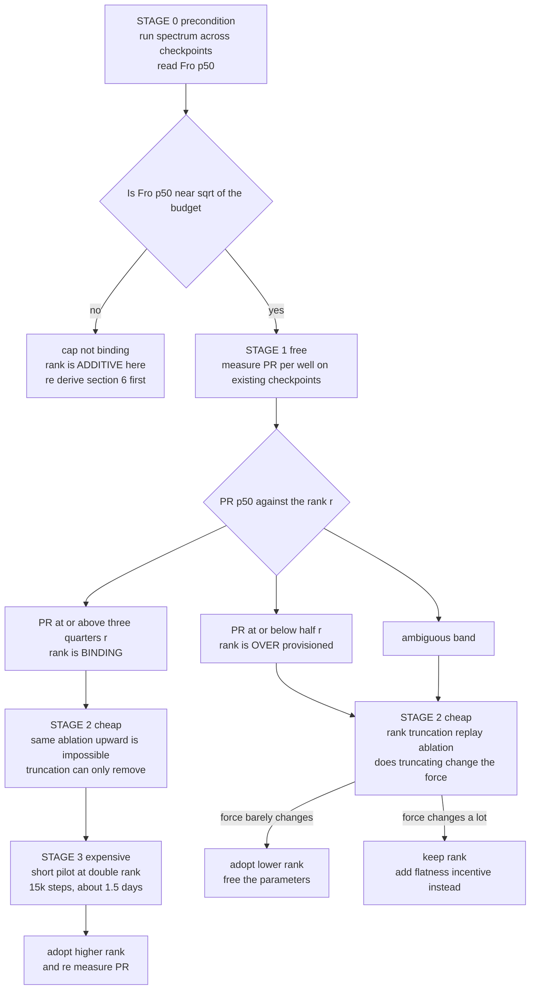

# Curvature Diagnostics and Rank Selection for the Anisotropic Gaussian $V_\theta$

Companion to
[`Progressive_Curvature_Confinement_for_Aniso_Gaussian_Vtheta.md`](Progressive_Curvature_Confinement_for_Aniso_Gaussian_Vtheta.md)
(the confinement *programme*),
[`Diagnostic_Programme_in_CfC_BAOAB_Integrator.md`](Diagnostic_Programme_in_CfC_BAOAB_Integrator.md)
(the spike-forensics *pipeline*), and
[`CfC_BAOAB_Integrator_and_Mitigations.md`](CfC_BAOAB_Integrator_and_Mitigations.md)
(the chronological record, §28-§34 and §41-§42).

Where the confinement note asks *how do we stop the curvature running away* and
the diagnostic programme asks *where does a spike come from*, this note is about
the **instruments**: what exactly we can measure about the anisotropic well's
curvature, which tool measures which part, and — the open question this note
exists to answer — **how to choose the rank $r$ of the low-rank precision factor
from measurement rather than from the value it happened to be initialised at.**

> **Thesis.** The well's curvature lives in two channels with opposite numerical
> status, and the run has been configured backwards with respect to them: the
> **safe** channel (diagonal, integrated exactly by the CfC propagator) is
> clamped at a Verlet-era ceiling, while the **dangerous** channel (low-rank,
> still an explicit kick) carries roughly 54,000 times more reachable curvature.
> Once a binding Frobenius cap is switched on, rank stops being an *amount* of
> curvature and becomes a *distribution* of a fixed amount — which makes
> "what rank?" an empirically decidable question, answerable with the
> participation ratio of the learned spectrum, and answerable **before**
> committing an arm to it.

---

## Contents

1. [What we measure: two channels, one well](#1-what-we-measure-two-channels-one-well)
2. [Why the current setting is an artifact, not a choice](#2-why-the-current-setting-is-an-artifact-not-a-choice)
3. [The instrument inventory](#3-the-instrument-inventory)
4. [Observation versus intervention, and the order to run them in](#4-observation-versus-intervention-and-the-order-to-run-them-in)
5. [The participation ratio: effective rank as a measurement](#5-the-participation-ratio-effective-rank-as-a-measurement)
6. [Rank under a binding cap: redistribution, not addition](#6-rank-under-a-binding-cap-redistribution-not-addition)
7. [A procedure for choosing the rank](#7-a-procedure-for-choosing-the-rank)
8. [Status: what exists, what is proposed](#8-status-what-exists-what-is-proposed)

---

## 1. What we measure: two channels, one well

Each context channel's scalar potential is a mixture of $K$ inverted Gaussians
whose precision is diagonal-plus-low-rank:

$$V(h;\xi) = -\sum_{k=1}^{K} w_k \exp\Big(-\tfrac{1}{2}(h-\mu_k)^\top P_k (h-\mu_k)\Big), \qquad P_k = \mathrm{diag}(a_k) + B_k B_k^\top.$$

Expanding the quadratic form gives exactly the two terms the model computes in
`AnisotropicMixtureGaussianVTheta.forward` (`diag_term` and `lr_term`):

$$(h-\mu_k)^\top P_k (h-\mu_k) = \sum_j a_{k,j}(h_j - \mu_{k,j})^2 + \lVert B_k^\top (h-\mu_k) \rVert^2.$$

The two contributions are qualitatively different objects, and — critically —
the integrator treats them differently:

| | diagonal $\mathrm{diag}(a_k)$ | low-rank $B_k B_k^\top$ |
|---|---|---|
| geometry | axis-aligned, per-coordinate | rank-$r$ PSD, oblique |
| under `baoab_cfc` | integrated **exactly** (closed-form harmonic propagator) | **explicit kick** — has an $\omega \Delta t \lt 2$ wall |
| cap in this run | `precision_max` = $2/d$ = 0.00521 | `precision_lr_max` = 1.0 (from step 47,121; `None` before) |
| reachable curvature | 0.0052 (1.93x above its own init) | ambient $\sigma_{\max}(B_k)^2 \approx 283$ at $p_{50}$ |
| share of the exponent | under 0.1% | `lr_term_share` ≈ 0.999 |


*Figure 1. The asymmetry, at the measured values. Panel A's low-rank percentiles
are the healthy step-27,000 column of the bracketing table in the Mitigations
note §42.4; the diagonal values are exact evaluations of Cell 5's
`_init_log_prec` and `_prec_max`. Panel B is the integrator's own contract, as
documented in Cell 0's `INTEGRATOR` comment.*

So the sharpness scalar that actually matters is the top squared singular value
of the low-rank factor,

$$s_k \equiv \sigma_{\max}(B_k)^2 \le \lVert B_k \rVert_F^2 = \mathrm{tr}(B_k B_k^\top),$$

and §3 of the diagnostic programme derives why: along the sharpest direction the
peak force scales as $\sqrt{s_k}$ and the worst-case *parameter* gradient scales
as $s_k$ itself. That single quadratic is what `precision_lr_max` bounds, what
the spikes track, and what every instrument below is ultimately pointed at.

---

## 2. Why the current setting is an artifact, not a choice

Two independent legacy decisions produced the configuration in Figure 1, and
neither was a considered judgement about anisotropy.

**The diagonal cap is a Verlet-era stability constraint that no longer applies.**
Cell 5 sets `_prec_max = 2.0 / d`. Summed over $d$ coordinates that is exactly
$d \cdot (2/d) = 2$ — the fingerprint of the explicit-integrator wall
$\omega \Delta t \lt 2$. Under `baoab_cfc` the diagonal spring is propagated by
the closed-form harmonic rotation, which is unconditionally stable at any
stiffness, so this ceiling constrains the one channel that no longer needs
constraining. Cell 0's own comment states the asymmetry plainly: `baoab_cfc` is

> "Immune to the well-sharpening blow-up that the explicit step suffers from —
> but the anisotropic OFF-diagonal coupling is still an explicit kick (an
> omega\*dt\<2 wall)."

**The low-rank channel was uncapped entirely until step 47,121.** `precision_lr_max`
sat at `None` for the first 47,000 steps, and `_bound_lowrank` was a no-op.

The net effect is that the model had nowhere to put curvature *except* the
channel that is numerically dangerous. That is consistent with three otherwise
puzzling measurements: `lr_term_share` pinned at ≈ 0.999 across every replayed
capture, the diagnostic programme §9's finding that over 99.9% of well-token
pairs are numerically dead (a rank-4 razor ridge in 384 dimensions has almost no
measure), and the chronic `depth_code`/`V_theta`-led spike population itself.

**One caveat on that third measurement.** The dead-well figure was taken on
captures from *before* `precision_lr_max` went live. §42.2 of the Mitigations
note shows how much the cap changed things: per-bank exponent minima moved from
the range −257,630 to −150,076 (uncapped) up to −146.8 to −51.8 (at budget 1.0).
Since fp32 underflows to a true zero around $e^{-104}$, the post-cap minima
straddle the underflow boundary rather than sitting four orders of magnitude
past it. Occupancy has very likely improved and **has not been re-measured
since** — which is one of the things the instruments in §3 exist to settle.

---

## 3. The instrument inventory

Seven instruments touch the curvature, spread across four notebook cells and one
live monitor. They differ along two axes that matter for choosing between them:
whether they **observe** the model as configured or **intervene** with a
counterfactual, and what input they require.

| instrument | cell | measures | input required | mode |
|---|---|---|---|---|
| `b_proj_sigma_max` (live log field) | Cell 6 | $\sigma_{\max}(W_B)$ per bank — the producible-capacity proxy, pre-clamp | none (weights only, every `LOG_INTERVAL`) | observe |
| `stiffness_report` | Cell 6b | distribution of $\omega \Delta t$ from the diagonal harmonic model | a batch | observe |
| `sigma_lr_report` | Cell 6b-2 | percentiles of $\sigma_{\max}(B_k)^2$ over layers, channels, wells | a batch | observe |
| `bracket_precision_lr_max` | Cell 6b-3 | the same percentiles across several checkpoints, for choosing a budget | checkpoints plus a neutral batch | observe |
| `sigma_lr_spectrum_report` | **Cell 6b-4** | the **full** singular-value spectrum, participation ratio, Frobenius norm | a batch | observe |
| `spectrum_across_checkpoints` | **Cell 6b-4** | the above across best/spike/prereload checkpoints | checkpoints plus a neutral batch | observe |
| `replay_precision_cap_ablation` | Cell 6d | pre-clip grad norm and exponent minima under swept `precision_lr_max` | a spikebatch bundle | intervene |
| `replay_curvature_rebalance_ablation` | **Cell 6d** | the same, under a 2-D sweep of **both** caps | a spikebatch bundle | intervene |

The three in bold are new (2026-09-11) and are the subject of this note. The
rest predate it and are documented in the Mitigations note §31, §41.7 and §42.

### 3.1 What the new spectrum instrument adds

`sigma_lr_report` already computed the full SVD and then discarded all but the
largest value:

```python
sigma_max_sq = torch.linalg.svdvals(B)[..., 0] ** 2   # keeps only sigma_1
```

`sigma_lr_spectrum_report` keeps every singular value and reduces them to three
readings per (layer, channel, well) triple:

- the **participation ratio** (§5), the effective-rank metric that decides the
  rank question;
- $\lVert B_k \rVert_F$, which says whether the Frobenius cap is actually
  **binding** — the precondition that makes §6's whole argument valid;
- $\sigma_{\max}(B_k)^2$, retained so the new tool's output can be compared
  directly against the older one's percentiles.

Both use the same hook mechanism: they monkeypatch `context_components` so they
observe the **realised** $B_k$ — post-`_bound_lowrank`, i.e. exactly the factor
the forward pass used — rather than the raw projection output.

### 3.2 What the new rebalance instrument adds

`replay_precision_cap_ablation` sweeps one attribute (`_precision_lr_max`).
`replay_curvature_rebalance_ablation` sweeps both, crossed:

```python
replay_curvature_rebalance_ablation(85885)
# precision_max_grid defaults to (2/d, 20/d, 200/d)
# precision_lr_max_grid defaults to (1.0, 0.25)
# -> 6 arms, each replayed against the same pinned batch and RNG
```

Both `_precision_max` and `_precision_lr_max` are plain Python attributes read
fresh on every forward call, not buffers and not part of `state_dict`, so this is
a live-model attribute swap rather than a new checkpoint — the same property that
made the original one-dimensional ablation cheap.

It answers the question §2 raises: **does moving curvature into the
exactly-integrated channel collapse the spike as well as capping the dangerous
one does, and does it un-saturate the wells** (exponent minima moving off the
$-10^5$ range) rather than merely suppressing the grad-norm symptom?

Three properties are built in from the start rather than retrofitted, because
the older ablation helpers each needed all three patched in later (Mitigations
note §48.2): the `clip_then_sum` splice, the register-repulsion term, and a
fidelity check against the bundle's recorded pre-clip norm. The `[AS TRAINED]`
arm requires **both** axes to match the live configuration, not either one.

---

## 4. Observation versus intervention, and the order to run them in

```mermaid
flowchart TB
    O1["b&#95;proj&#95;sigma&#95;max<br>live, every log interval"]
    O2["sigma&#95;lr&#95;report<br>sigma max squared percentiles"]
    O3["sigma&#95;lr&#95;spectrum&#95;report<br>FULL spectrum plus PR"]
    O4["bracket&#95;precision&#95;lr&#95;max<br>percentiles across checkpoints"]
    I1["replay&#95;precision&#95;cap&#95;ablation<br>sweep the low rank cap"]
    I2["replay&#95;curvature&#95;rebalance&#95;ablation<br>sweep BOTH caps"]
    I3["replay&#95;rank&#95;truncation&#95;ablation<br>PROPOSED, see section 7"]
    Q1{"Is the Frobenius cap binding"}
    Q2["RANK question<br>how many directions are used"]
    Q3["CHANNEL question<br>which channel holds the curvature"]
    DEC["arm design decision"]

    subgraph OBS [OBSERVE what the model already is]
        O1
        O2
        O3
        O4
    end

    subgraph INT [INTERVENE with a counterfactual]
        I1
        I2
        I3
    end

    O1 --> O4
    O2 --> O4
    O3 --> Q1
    Q1 -->|yes, cap saturated| Q2
    Q1 -->|no, cap not biting| Q3
    Q2 --> I3
    Q3 --> I2
    I1 --> DEC
    I2 --> DEC
    I3 --> DEC
```



The distinction is not cosmetic — it determines what input each tool can accept
and what question it can answer.

| | observe | intervene |
|---|---|---|
| runs `backward()` | no | yes |
| needs a pinned batch and RNG | no | **yes** |
| works on `_best.pt` | yes | no |
| works on `_prereload.pt` | yes | no — weights only, no batch to replay |
| changes any cap | no | yes, restored in a `finally` block |
| answers | "what **is** the geometry?" | "what **would** the gradient have been?" |

**The ordering rule.** Run `spectrum_across_checkpoints` first. Its `fro_p50`
output is the load-bearing precondition for everything in §6: the claim "rank
only redistributes a fixed budget" holds **only** while the Frobenius cap is
binding. If $\lVert B_k \rVert_F$ at $p_{50}$ comes back well below the square
root of `precision_lr_max`, the cap is not biting at those weights, rank
becomes an *additive* knob again, and §6's conclusions need re-deriving
before the rebalance sweep's results mean anything.

---

## 5. The participation ratio: effective rank as a measurement

For a factor $B_k$ with descending singular values $\sigma_i$, the
participation ratio is

$$\mathrm{PR}(B_k) = \frac{\big(\sum_{i} \sigma_i^2\big)^2}{\sum_{i} \sigma_i^4} \in [1, r].$$

It is the standard effective-rank measure (the inverse participation ratio of
the normalised eigenvalue distribution of $B_k B_k^\top$), and it has exactly the
two limits the rank question needs: $\mathrm{PR} = 1$ when all the budget sits in
one direction, $\mathrm{PR} = r$ when the spectrum is flat.


*Figure 2. Participation ratio on four representative spectra at rank 4. The
values are exact evaluations of the formula above, verified against a closed-form
computation when the instrument was built: flat gives 4.00, mild decay 2.98,
steep decay 1.20, and the degenerate rank-1 case 1.00 (which is also the
division-by-zero guard).*

`spectrum_across_checkpoints` applies these bands automatically:

| $\mathrm{PR}$ at $p_{50}$, with $r = 4$ | reading | action |
|---|---|---|
| $\ge 3.0$ (i.e. $\ge 0.75r$) | budget **saturated** | rank 8 has a real case, and would also halve $\sigma_{\max}^2$ under the same cap |
| $\le 2.0$ (i.e. $\le 0.5r$) | budget **not used** | rank 8 is wasted parameters; prefer a spectral flatness incentive at rank 4, or drop to rank 2 |
| between | ambiguous | weigh the spike-versus-best comparison and the parameter cost |

**A second, independent use of the same measurement.** Under a binding Frobenius
cap, $\sigma_{\max}^2$ can only grow by *concentration*. Since the spike
magnitude scales as $\sigma_{\max}(B_k)^2$, this predicts that a
$V_\theta$-led spike may literally **be** a moment of spectral collapse — the
well momentarily dumping its whole budget into one direction. Comparing the
spectrum at `_best.pt` against the spectrum at a spike bundle tests that
directly, with the same function and no extra machinery.

---

## 6. Rank under a binding cap: redistribution, not addition

`_bound_lowrank` caps the Frobenius norm, with $b$ the square root of
`precision_lr_max`:

$$\lVert B_k \rVert_F \leftarrow b \tanh\big(\lVert B_k^{\mathrm{raw}} \rVert_F / b\big).$$

With `precision_lr_max` = 1.0 and ambient uncapped $\sigma_{\max}(B_k)^2 \approx 283$
(so $\lVert B_k^{\mathrm{raw}} \rVert_F \approx 17$), the argument to $\tanh$ is
about 17 and the cap is **saturated**: $\sum_i \sigma_i^2$ is pinned at $b^2$
regardless of rank. Rank therefore does not change the *total* curvature at all.
What it changes is the range of distributions available:

$$\frac{b^2}{r} \le \sigma_{\max}(B_k)^2 \le b^2,$$

with the lower bound attained by a flat spectrum and the upper by a degenerate
one.


*Figure 3. Exact evaluations of the two bounds above, at a Frobenius budget of
1.0. Panel B re-labels the same curve as the spike-magnitude proxy, since §3 of
the diagnostic programme derives the worst-case parameter gradient as
proportional to the top squared singular value.*

This produces a genuinely counterintuitive consequence, and it is the reason the
rank question is worth measuring rather than guessing:

> **Higher rank can make the model *safer*, not more dangerous** — but only if
> the learned spectrum actually spreads. At rank 8 with a flat spectrum,
> $\sigma_{\max}^2$ = 0.125 against rank 4's 0.250, halving the quantity that
> sets the spike magnitude, at identical total curvature. If instead the model
> drives the whole budget into $\sigma_1$, rank 8 is indistinguishable from rank
> 4 (and from rank 1) on this axis, and the extra parameters buy nothing.

Rank is an **upper bound on the number of directions the well may use**, never a
guarantee that it uses them. That is precisely what the participation ratio
measures, which is why §5 is the prerequisite for §7.

**The parameter cost is not small.** Measured by instantiating the modules:

| config | V_theta params | low-rank modes | model total | vs current |
|---|---|---|---|---|
| additive, rank 2 | 23,685,160 | 80 | 64,992,258 | 0.85x |
| **additive, rank 4 (current)** | **35,512,360** | **160** | **76,819,458** | **1.00x** |
| additive, rank 8 | 59,166,760 | 320 | 100,473,858 | 1.31x |
| joint, rank 4 | 35,438,600 | 32 | 76,745,698 | 1.00x |
| joint, rank 8 | 59,043,848 | 64 | 100,350,946 | 1.31x |

`B_proj` alone is 66.6% of $V_\theta$ at rank 4, and $V_\theta$ is about 46% of
the whole model — so the low-rank factor is roughly **31% of every parameter in
the network**. Rank 8 is a 31% larger model. That is real opportunity cost
against spending the same budget on depth or width, and it is why "measure
first" is not pedantry here.

---

## 7. A procedure for choosing the rank

Everything above is diagnosis. This section is the constructive part: a staged,
cost-aware algorithm for picking $r$ from measurement. It is **proposed, not yet
run** — stage 1 uses tooling that exists today, stage 2 needs one new helper that
does not, and stage 3 costs real GPU time.

### 7.1 Why one global rank is the wrong object

The rank is currently a single scalar, `ANISO_RANK`, shared by every well in
every bank at every layer. But the participation ratio is measured **per
(layer, channel, well) triple**, and there is no reason for that distribution to
be tight. Layers 0-2 carry meaningful salience while layers 5-6 sit three orders
of magnitude lower (diagnostic programme §8); wells differ in how many contexts
they serve.


*Figure 4. Panel A is the knee-detection signal the procedure below keys on
(synthetic, showing the shape to look for, not measured data). Panel B is an
illustrative distribution making the heterogeneity argument concrete: a single
global rank simultaneously over-serves the left mode and starves the right tail.*

So the honest target is not "the optimal rank" but **the optimal rank
allocation** — with a single global $r$ as the degenerate, currently-implemented
special case.

### 7.2 The core measurement, and why the cap does not invalidate it

The procedure rests on one claim worth stating carefully, because it is what
makes the measurement cheap:

> The Frobenius cap constrains $\sum_i \sigma_i^2$ but says **nothing** about how
> that sum distributes across $i$. The participation ratio is a function of the
> distribution only. Therefore PR measured under a binding cap is still a
> faithful read of the model's directional preference, and there is **no need to
> relax the cap** (and provoke spikes) to measure it.

That is why stage 1 below costs nothing: it runs against checkpoints you already
have, under the configuration they were trained with.

### 7.3 The algorithm



**Stage 0 — precondition (free).** Run `spectrum_across_checkpoints()`. Confirm
`fro_p50` is close to the square root of `precision_lr_max`. If it is not,
stop: the redistribution argument does not hold and the rank question is a different
question.

**Stage 1 — measure the effective rank (free).** From the same call, read the
per-well PR distribution — not just its median. Three outcomes, per §5's bands.
If PR sits at or below $r/2$, the model is not using the rank it already has,
and no amount of additional rank will help; the lever is a **flatness incentive**
(a penalty on the ratio of $\sigma_{\max}^2$ to $\lVert B_k \rVert_F^2$, which
pushes the existing budget to spread) or a **reduction** to rank 2, which would free 11.8M
parameters.

**Stage 2 — rank-truncation ablation (cheap, needs one new helper).** PR is a
*geometric* statistic; it does not say whether the small singular directions
matter *functionally*. A low PR could still coexist with tail directions that
carry real force, if they happen to align with something the loss cares about.
The direct test is to truncate and replay:

```python
# PROPOSED: replay_rank_truncation_ablation(step_tag, ranks=(1, 2, 3, 4))
#
# For each r' in `ranks`, hook context_components and replace the realised
# B_k with its rank-r' SVD truncation, then replay the captured batch with
# the same clip_then_sum / repulsion / snapshot-restore machinery the other
# replay_*_ablation helpers use. Report, per arm:
#   - pre-clip grad norm          (does the spike change?)
#   - ntp loss on the batch       (does the FUNCTION change?)
#   - vtheta_exponent_min         (do the wells un-saturate?)
#   - relative force error        ||f_trunc - f_full|| / ||f_full||
```

This is the rank analogue of `replay_precision_cap_ablation`, reuses machinery
that already exists, needs no training, and runs against archived bundles in an
afternoon. Its decisive reading is the **relative force error**: if truncating
rank 4 to rank 2 changes the force by a fraction of a percent, the top two
directions are doing all the work and the parameters in the other two are dead
weight.

Note the asymmetry the flowchart makes explicit: truncation can only test
**downward**. There is no offline way to ask "what would rank 8 have learned?",
because the extra directions were never trained. That is why the upward branch
must go to stage 3.

**Stage 3 — short pilot at higher rank (expensive, only if stages 1-2 justify it).**
If PR is saturated *and* truncation shows the tail directions carry real force,
the rank is genuinely binding and the only way to find out what more buys is to
train. Use the existing pilot pattern: `PROBE_MAX_STEPS = 15_000` against the
production `TOTAL_STEPS`, so the pilot is a *prefix* of the real arm and can be
promoted by clearing one config value. Then re-measure PR at the new rank:

- PR saturates near the new $r$ as well → the data wants more still; consider
  whether the low-rank parameterisation is the right structure at all.
- PR plateaus partway → **the knee is the answer.** Adopt the knee rank.

**Stage 4 — per-well allocation (future architecture work).** If stage 1's
histogram is as heterogeneous as Figure 4B, a single $r$ is leaving value on the
table at both ends. Two implementable designs:

1. **Per-bank rank.** `B_proj` is already per-bank; giving each bank its own
   rank costs only bookkeeping, and layer salience (diagnostic programme §8)
   gives a principled prior for which banks deserve more.
2. **Shared factor with per-well gating.** Allocate one generous factor of rank
   $R$ per bank and let each well select a soft subset through a learned gate,
   so rank is spent where the data wants it without paying $K \cdot R$ everywhere.

### 7.4 Cost model

At the measured 8.5 s/step and the parameter counts in §6:

| stage | cost | what it can conclude |
|---|---|---|
| 0 and 1 | minutes, on existing checkpoints | rank is over-provisioned, or not |
| 2 | an afternoon, plus one new helper | whether the tail directions carry force |
| 3 | about 1.5 days per rank tried (15,000 steps) | what higher rank actually buys |
| 4 | a fresh arm | whether heterogeneous allocation beats a global rank |

Stages 0-2 together cost well under a day and can **rule out** a rank change
entirely, which is the outcome that saves the most time: rank changes `B_proj`'s
shape, so they are fresh-arm-only, and a fresh arm at this scale is a 15-25 day
commitment.

### 7.5 What would falsify the procedure

Stated in advance, in the spirit of the diagnostic programme:

1. **If PR is high but truncation is harmless.** PR near $r$ says the budget is
   spread, yet truncating to $r/2$ barely moves the force. That would mean PR is
   not measuring functional usage, and the metric needs replacing with a
   force-weighted variant.
2. **If PR varies wildly with the probe batch.** PR should be a property of the
   weights, largely independent of which tokens are shown. Strong batch
   dependence would mean the spectrum is being read in a regime where the
   realised $B_k$ is dominated by context rather than by the learned projection,
   and the measurement should move to $W_B$ itself.
3. **If the cap turns out not to be binding.** Stage 0 exists to catch this, and
   it invalidates §6 rather than §5 — PR would still be meaningful, but the
   "higher rank is safer" argument would not.

---

## 8. Status: what exists, what is proposed

**Implemented and verified (2026-09-11), not yet run against live data:**

- `sigma_lr_spectrum_report` and `spectrum_across_checkpoints` (Cell 6b-4).
  Participation-ratio arithmetic verified against a closed-form computation on
  synthetic banks with known spectra — flat 4.000, mild decay 2.982, steep 1.202,
  degenerate 1.000 — and the normalised spectrum recovers its input exactly.
  Bundle lookup falls back to the permanent archive when the live ring has
  rotated.
- `replay_curvature_rebalance_ablation` (Cell 6d). Grid resolution, the
  dual-attribute swap and restore, and the stricter two-axis `[AS TRAINED]`
  matching are verified in isolation; the machinery it inherits from
  `replay_precision_cap_ablation` is not re-verified here.

**Proposed, not built:**

- `replay_rank_truncation_ablation` (§7.3, stage 2) — the one missing instrument
  in the procedure.
- A spectral **flatness incentive**, for the case where stage 1 finds PR low: a
  penalty on the ratio of $\sigma_{\max}^2$ to $\lVert B_k \rVert_F^2$ that spreads
  the existing budget without spending parameters. This is the natural sibling of the
  progressive confinement penalty, aimed at the spectrum's *shape* rather than
  its *scale*.
- Per-bank or per-well rank allocation (§7.3, stage 4).

**Open questions this note does not settle:**

- Whether the cap is currently binding (stage 0 has not been run).
- Whether well occupancy improved after `precision_lr_max` went live — the
  >99.9%-dead figure is pre-cap and stale (§2).
- Whether a spike is a spectral-collapse event (§5's second use).
- Whether the diagonal channel can usefully absorb curvature at all, which is
  what `replay_curvature_rebalance_ablation` was built to answer.

---

Provenance. The well energy and the two-channel split are the exact code of
`notebooks/conservative_arch/parf/model_aniso_gaussian_vtheta.py`
(`AnisotropicMixtureGaussianVTheta.forward` / `_components` / `_bound_lowrank`).
The instruments live in
`notebooks/conservative_arch/scaleup/colab_fock_cfc_baoab_aniso_gaussian_openwebtext_d384.ipynb`
(Cells 6, 6b, 6b-2, 6b-3, 6b-4, 6d) and in its joint-coupling sibling
`colab_fock_cfc_baoab_joint_vtheta_qknorm_openwebtext_d384.ipynb`. Figures are
produced by `figures/_make_curvature_rank_figs.py`: Figures 1-3 are exact
evaluations of the formulas stated in this note plus measured percentiles cited
from the Mitigations note §42.4, and Figure 4 is a labelled synthetic
illustration of the decision signal, not measured data. The parameter counts in
§6 were obtained by instantiating the modules directly.

Last updated: 11 September 2026 (initial version: documents the two-channel
curvature asymmetry and its Verlet-era origin, inventories the seven curvature
instruments across the observe/intervene split, introduces the participation
ratio as the effective-rank measurement with its decision bands, derives why a
binding Frobenius cap makes rank a redistribution knob such that higher rank can
be *safer* if and only if the spectrum spreads, and proposes a four-stage,
cost-aware procedure for choosing the rank — of which stages 0 and 1 are free
with today's tooling, stage 2 needs one new `replay_rank_truncation_ablation`
helper, and stages 3-4 need training).
