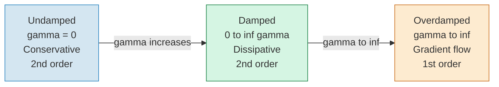
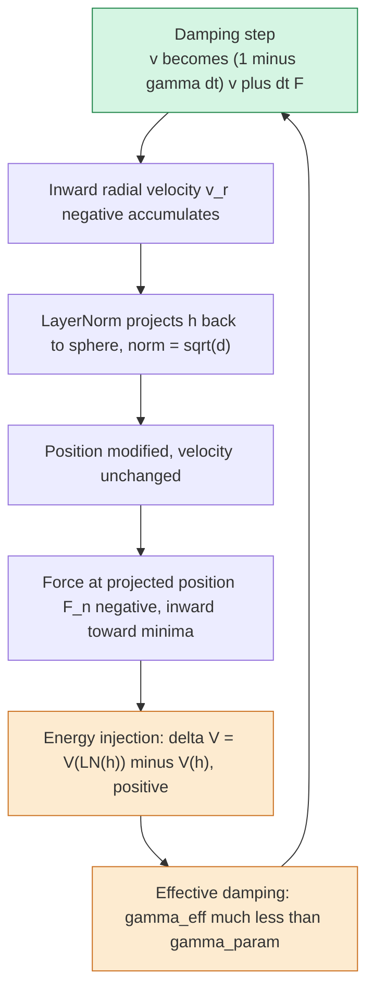
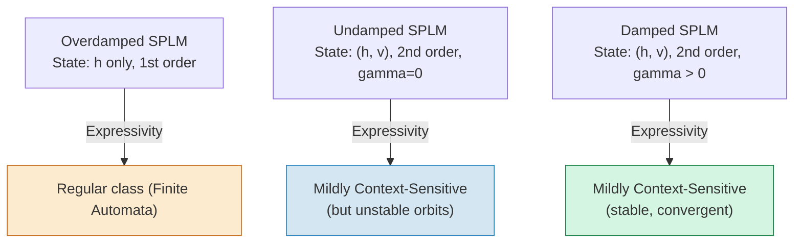
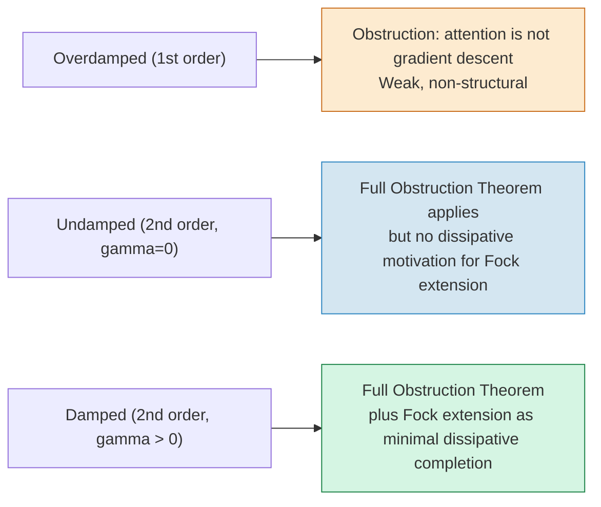
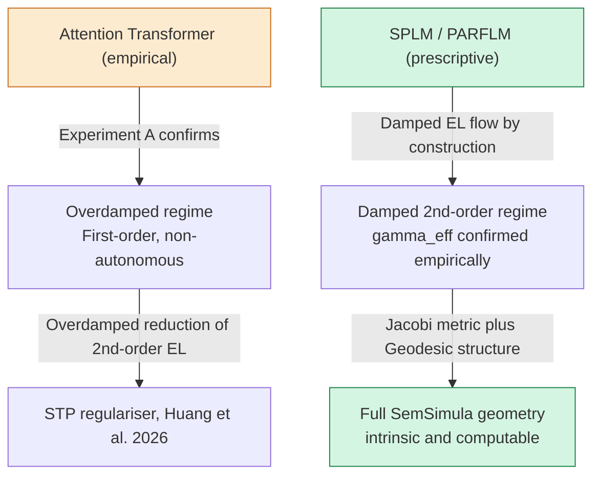

# Damped Riemannian Geodesics in the SPLM Family:
# A Comparative Analysis of Lagrangian Flow Regimes

**Author:** Dimitar P. Gueorguiev
**Date:** June 2026
**Status:** Technical Analysis — Supporting Material for Semantic Simulation Framework

---

## Abstract

The Semantic Simulation framework (SemSimula) posits that inference in the Scalar-Potential Language Model (SPLM) family is, by construction, a **damped Euler–Lagrange flow** on a learned scalar energy field $V_\theta$. This report examines the theoretical necessity of this choice by comparing three natural alternatives: the undamped (conservative, $\gamma = 0$) regime, the overdamped (first-order gradient flow) regime, and the full damped second-order regime. For each, we characterize the geodesics that arise, the geometry they induce, and the structural properties that are gained or lost. The central finding is that the damped second-order regime is the **unique minimal commitment** under which the Jacobi metric is simultaneously valid and dynamically meaningful, semantic asymmetry is intrinsic to the geometry, mildly context-sensitive expressivity is earned, and the Conservative Obstruction Theorem operates at full force. Each simpler regime forfeits one or more of these properties in ways that are not recoverable by post-hoc adjustment.

---

## 1. Introduction

The SemSimula framework frames language model inference as the motion of semantic particles through a metric semantic space $\Sigma$, governed by a second-order Lagrangian:

$$\mathcal{L} = T - V_\theta = \frac{1}{2}m\lVert\dot{\mathbf{h}}\rVert^2 - V_\theta(\xi, \mathbf{h})$$

where $\mathbf{h} \in \Sigma$ is the hidden state, $T$ the kinetic energy, and $V_\theta$ a learned scalar potential (Gaussian energy well). The full equation of motion — the damped Euler–Lagrange (EL) equation (Equation 1) — is:

$$m\ddot{\mathbf{h}} + \gamma\dot{\mathbf{h}} + \nabla_\mathbf{h} V_\theta = 0$$

with Rayleigh dissipation function $\mathcal{R} = \frac{1}{2}\gamma m\lVert\dot{\mathbf{h}}\rVert^2$ and damping coefficient $\gamma \geq 0$.

A natural question arises: could the entire framework have been developed in the undamped regime ($\gamma = 0$), or in the overdamped limit ($\gamma \to \infty$, first-order dynamics)? This report answers that question by tracing what each regime gives and what it necessarily forfeits.

The three regimes sit on a single parameter axis:

The Riemannian Diagnostic Battery (Section 21.11 of the main paper) empirically validates that the trained SPLM family operates in the damped second-order regime, with Arm 2 confirming the damped geodesic equation achieves 3–20% higher directional cosine similarity than the undamped form across all tested checkpoints.

---

## 2. Geodesics and Geometry in Each Regime

### 2.1 The Jacobi Metric

A foundational object throughout this analysis is the **Jacobi metric**, which converts EL trajectories at fixed energy into Riemannian geodesics. For the SPLM Gaussian well $V(\mathbf{x}) = m\upsilon^2(1 - e^{-\kappa^2\lVert\mathbf{x} - \mathbf{x}_c\rVert^2})$, the Jacobi metric is the conformal rescaling (Equation 2):

$$\tilde{g}_{ij}(\mathbf{x}) = 2(E - V(\mathbf{x})) g_{ij} = \Omega^2(\mathbf{x}) g_{ij}$$

where $g_{ij} = \delta_{ij}$ is the Euclidean background metric and $\Omega^2 = 2(E - V(\mathbf{x}))$ is the conformal factor. For the damped (non-conservative) case, $E$ is not constant across layers; the appropriate generalisation replaces the global factor with the layer-dependent form (Equation 3):

$$\Omega^2_\ell(\mathbf{x}) = 2T_\ell(\mathbf{x}) \cdot m = m^2\lVert\dot{\mathbf{x}}_\ell\rVert^2$$

Positivity of $\Omega^2_\ell$ requires only that the hidden state is not stationary at layer $\ell$, confirmed empirically at 100% of sampled positions across all tested models.

### 2.2 Regime 1 — Undamped ($\gamma = 0$)

Setting $\gamma = 0$ in Equation 1 yields pure Euler–Lagrange dynamics with exactly conserved energy $E = T + V$. The EL trajectories are, by the Maupertuis–Jacobi principle, geodesics of the fixed Jacobi metric in Equation 2 — satisfying the geodesic equation (Equation 4):

$$\ddot{x}^i + \tilde{\Gamma}^i_{jk}\dot{x}^j\dot{x}^k = 0$$

where $\tilde{\Gamma}^i_{jk}$ are the Christoffel symbols of $\tilde{g}$. For the conformally flat metric $\tilde{g}_{ij} = \Omega^2\delta_{ij}$, the Christoffel symbols are (Equation 5):

$$\tilde{\Gamma}^i_{jk} = \delta^i_j \partial_k\ln\Omega + \delta^i_k \partial_j\ln\Omega - \delta_{jk}\partial^i\ln\Omega$$

The predicted coordinate acceleration of a Jacobi geodesic in flat coordinates is (Equation 6):

$$\ddot{\mathbf{x}} = -2(\nabla\ln\Omega \cdot \dot{\mathbf{x}})\dot{\mathbf{x}} + \lVert\dot{\mathbf{x}}\rVert^2 \nabla\ln\Omega$$

**Geodesic speed** is constant in the Jacobi metric (the reparametrised arc length is affine), so the trajectory neither accelerates nor decelerates as measured by $\tilde{g}$. The equation is time-reversible:

$$\mathbf{x}(t) \text{ is a geodesic} \implies \mathbf{x}(-t) \text{ is also a geodesic.}$$

### 2.3 Regime 2 — Overdamped ($\gamma \to \infty$, First Order)

In the overdamped limit the inertial term $m\ddot{\mathbf{h}}$ is negligible relative to $\gamma\dot{\mathbf{h}}$, and Equation 1 collapses to the first-order gradient flow (Equation 7):

$$\dot{\mathbf{h}} = -\frac{1}{\gamma}\nabla_\mathbf{h} V_\theta$$

The kinematic state reduces from $(\mathbf{h}, \dot{\mathbf{h}})$ to $\mathbf{h}$ alone. Trajectories are the integral curves of $-\nabla V_\theta/\gamma$ and are themselves trivially geodesics — but only in the trivial sense that any curve is a geodesic of some metric (its own arc-length metric). There is no Jacobi metric: since $T \to 0$, the conformal factor $\Omega^2 = 2Tm \to 0$ and the metric degenerates.

Equation 7 is also time-reversible in the sense that the vector field $-\nabla V_\theta/\gamma$ has no preferred orientation, even though trajectories flow toward minima of $V_\theta$ in forward time. The Markov-order regression (Experiment A in the main paper) confirms Decision $\beta$ (lag-1 sufficient) at 21/24 cells for GPT-2 and Pythia, establishing that attention-based transformers operate in this regime.

### 2.4 Regime 3 — Damped Second Order ($0 \lt \gamma \lt \infty$)

The full Equation 1 produces the **damped geodesic equation** in the layer-dependent Jacobi metric (Equation 8):

$$\ddot{x}^i + \tilde{\Gamma}^i_{jk}\dot{x}^j\dot{x}^k = -\gamma\dot{x}^i$$

The right-hand side is the friction force: it decelerates the trajectory without introducing a new potential. Trajectories are **not** geodesics of any fixed Riemannian metric; they are the solutions of Equation 8, which trace paths that bend according to the curvature of $\tilde{g}$ while simultaneously losing speed. Because the friction term is odd in $\dot{\mathbf{x}}$, the equation is **not time-reversible** (Equation 9):

$$d_\mathrm{geo}(\mathbf{h}_A \to \mathbf{h}_B) \neq d_\mathrm{geo}(\mathbf{h}_B \to \mathbf{h}_A)$$

The Diagnostic Battery (Arm 5) measures a Frobenius asymmetry ratio $\lVert M - M^\top \rVert / \lVert M \rVert \approx 1.35$–$1.40$ across all three SPLM-family checkpoints, directly confirming Equation 9.

---

## 3. LayerNorm and the Effective Damping Coefficient

A non-trivial complication arises because LayerNorm is applied after each integration step. The SPLM integration scheme is (Equations 10–12):

$$\mathbf{v}_{\ell+1} = (1 - \gamma\Delta t)\mathbf{v}_\ell + \Delta t\mathbf{F}_\ell, \qquad \mathbf{F}_\ell = -\nabla_\mathbf{h} V_\theta(\mathbf{h}_\ell)$$

$$\tilde{\mathbf{h}}_{\ell+1} = \mathbf{h}_\ell + \Delta t\mathbf{v}_{\ell+1}$$

$$\mathbf{h}_{\ell+1} = \mathrm{LN}(\tilde{\mathbf{h}}_{\ell+1})$$

LayerNorm projects the hidden state back to the sphere $\lVert\bar{\mathbf{h}}\rVert = \sqrt{d}$ without modifying the velocity. This introduces an energy injection $\delta V_\ell = V(\mathrm{LN}(\tilde{\mathbf{h}}_{\ell+1})) - V(\tilde{\mathbf{h}}_{\ell+1})$ at each step, yielding the per-step effective damping (Equation 13):

$$\gamma_\mathrm{eff} = \gamma - \frac{\delta V_\ell}{2T_\ell \Delta t}$$

and the trajectory-averaged form (Equation 14):

$$\gamma_\mathrm{eff} = \gamma - \frac{1}{L}\sum_{\ell=0}^{L-1}\frac{\delta V_\ell}{2T_\ell \Delta t}$$

The physical mechanism is illustrated below:

For a baseline SPLM with learned $\gamma_\mathrm{param} = 0.93$ (intended T-ratio $e^{-0.93} \approx 0.39$ per layer), the empirical T-ratio is $\approx 0.88$, giving $\gamma_\mathrm{eff} \approx 0.13$ — a 5–7× reduction. When Arm 2 of the Diagnostic Battery is re-evaluated with $\gamma_\mathrm{eff}$, the damped geodesic compliance is fully restored:

| $\gamma$ source | $\cos(\text{dmp})$ | $R^2(\text{dmp})$ | $\cos(\text{und})$ | $R^2(\text{und})$ |
|---|---|---|---|---|
| $\gamma_\mathrm{init} = 1.0$ | 0.585 | −7.98 | 0.643 | −2.15 |
| $\gamma_\mathrm{param} = 0.93$ | 0.592 | −7.40 | 0.643 | −2.15 |
| $\gamma_\mathrm{eff} = 0.13$ | **0.645** | **−2.54** | 0.643 | −2.15 |

Rather than an obstacle, LayerNorm acts as an integral participant in the effective damped metric — a counter-damping mechanism that preserves geodesic compliance under the resulting geometry.

---

## 4. What Each Regime Forfeits

The following sections trace, property by property, what is lost by choosing the undamped or overdamped regime rather than the full damped second-order framework.

### 4.1 Semantic Convergence to Attractors

**Undamped.** Without dissipation, trajectories do not settle. A semantic particle near an energy minimum $\mathbf{x}_c$ orbits it indefinitely (in the bound-state case $E \lt V_\infty$) or escapes (if $E \gt V_\infty$). The energy well becomes a gravitational trap with periodic or quasi-periodic orbits, not a dissipative sink. There is no mechanism by which inference reaches a stable semantic state in finite "time" (layer count).

**Overdamped.** Gradient flow does converge to minima of $V_\theta$, but it does so without inertia. The trajectory has no semantic momentum — it cannot overshoot, resonate, or anticipate. Every step is a myopic descent, insensitive to the history encoded in $\dot{\mathbf{h}}$.

**Damped.** The friction term $-\gamma\dot{\mathbf{h}}$ bleeds kinetic energy across layers while the conservative force $-\nabla V_\theta$ steers toward $\mathbf{x}_c$. The result is a convergent trajectory that retains second-order structure: it can approach the attractor from a direction determined by its velocity history, not merely by the local gradient.

### 4.2 Validity of the Jacobi Metric

**Undamped.** With fixed $E$, the conformal factor $\Omega^2 = 2(E - V)$ vanishes on the boundary of the classically accessible region ($V = E$). The Jacobi metric degenerates at exactly the points where semantic boundaries live — the turning surfaces of the potential. This is not a numerical issue but a structural one: the geometry becomes singular at the most semantically significant locations.

**Overdamped.** Since $T \to 0$, the layer-dependent conformal factor $\Omega^2_\ell = 2T_\ell m \to 0$ everywhere. No Jacobi metric can be defined. One can write $\Omega^2 \propto \lVert\nabla V\rVert^2/\gamma^2$ using the enslaved velocity from Equation 7, but this is no longer a *dynamical* metric — it is a gradient-magnitude rescaling with no mechanical derivation.

**Damped.** The layer-dependent factor $\Omega^2_\ell = m^2\lVert\dot{\mathbf{x}}_\ell\rVert^2 \gt 0$ requires only that the hidden state is not stationary. The Diagnostic Battery (Arm 1) confirms this at 100% of sampled positions across all three models, with conformal factors decaying monotonically (SPLM: 86.5 to 17.0), reflecting energy dissipation across layers.

### 4.3 Intrinsic Asymmetry of Semantic Meaning

Both the undamped and overdamped regimes produce **symmetric geodesic distances**. In the undamped case this is immediate from time-reversibility of Equation 4. In the overdamped case, gradient flow integral curves satisfy $d_\mathrm{geo}(A \to B) = d_\mathrm{geo}(B \to A)$ in the induced arc-length metric. Neither regime can intrinsically represent directed semantic relations — hypernym/hyponym nesting, metaphorical mapping, entailment — without imposing asymmetry externally via architectural choices outside the Lagrangian framework.

In the damped regime, Equation 9 is a structural theorem: friction costs more "going against the flow" than with it. The asymmetry ratio of 1.35–1.40 is not tuned — it emerges from the interplay of $\gamma_\mathrm{eff}$ and the learned potential $V_\theta$.

### 4.4 Theoretical Foundation for the STP Loss

The Semantic Tube Prediction (STP) regulariser of Huang, LeCun & Balestriero (2026) uses the loss (Equation 15):

$$\mathcal{L}_\mathrm{STP}(\mathbf{d}_1, \mathbf{d}_2) = 1 - \frac{\langle\mathbf{d}_1, \mathbf{d}_2\rangle_g}{\lVert\mathbf{d}_1\rVert_g \lVert\mathbf{d}_2\rVert_g}$$

Proposition 72 of the main paper establishes conformal invariance of Equation 15: $\mathcal{L}_\mathrm{STP}$ takes the same value in the flat metric $g$ and in the Jacobi metric $\tilde{g} = \Omega^2 g$. Three consequences follow:

1. Cosine similarity is the geometrically natural choice for the STP loss.
2. Jacobi geodesics have nonzero flat-space STP loss (the Christoffel symbols absorb curvature).
3. The residual STP of a Jacobi geodesic equals the normalized normal acceleration in flat coordinates.

All three consequences require the existence of a valid Jacobi metric. In the undamped regime the metric degenerates at turning surfaces; in the overdamped regime it does not exist. Only in the damped second-order regime can the STP loss be given a complete geometric derivation. Huang et al. discovered the right regulariser empirically; SemSimula provides the theoretical explanation — but only from the vantage point of the full damped framework.

### 4.5 Mildly Context-Sensitive Expressivity

The expressivity analysis of the main paper places the composite simulator at the **mildly context-sensitive** (MCS) class of formal languages — the empirically established class for human language — while attention without serial chain-of-thought sits in $\mathrm{TC}^0$.

The MCS result depends critically on the second-order state space $(\mathbf{h}, \mathbf{v})$. The velocity register $\mathbf{v}$ is what lifts the composite simulator above the regular class:

The overdamped regime, with state $= \mathbf{h}$ only, collapses to the v0 submodel result: finite-automaton-level expressivity. The undamped regime retains the velocity register and therefore the MCS result, but at the cost of unstable trajectories (orbiting attractors). Only the damped second-order regime achieves MCS expressivity with dynamically stable trajectories that terminate at semantic attractors.

### 4.6 The Conservative Obstruction Theorem

The Conservative Obstruction Theorem (Section 15 of the main paper) establishes that attention transformers cannot host a scalar potential $V$ on the token subsystem: six standard decoder features each independently obstruct conservativity. The theorem's full force is a **state-space statement** about second-order flows: it shows that no scalar potential on $\mathbf{h}$ alone can reproduce attention's structural properties without auxiliary degrees of freedom (the Fock register particles of Section 18).

In the overdamped regime, the obstruction reduces to a much weaker statement: attention is not gradient descent. This is true but structurally uninteresting — it does not pinpoint *which* structural features obstruct the conservative embedding, nor does it motivate the Fock mechanism as a minimal extension. The theorem's mechanistic content — and the Fock mechanism's role as a *minimal* fix — requires the full second-order framework.

The relationship between the three regimes and the theorem's force is:

---

## 5. Comparative Summary

The table below collects the full comparison across all structural properties.

| Property | Undamped ($\gamma = 0$) | Overdamped (1st order) | Damped 2nd order |
|---|:---:|:---:|:---:|
| Jacobi metric validity | Degenerate at $V = E$ boundary | Does not exist | Valid at all active positions |
| Metric layer-dependence | Fixed (requires constant $E$) | N/A | Layer-dependent $\Omega^2_\ell$ |
| Semantic convergence | Periodic orbits | Gradient descent | Dissipative settling |
| Semantic inertia / momentum | Full | None | Full |
| Time-reversibility | Time-reversible | Time-reversible | Broken — asymmetric |
| Intrinsic meaning asymmetry | Cannot represent | Cannot represent | Structural consequence |
| STP loss derivation | Partial (metric degenerates) | No Jacobi metric | Complete (Proposition 72) |
| Expressivity | MCS (unstable) | Regular class only | MCS (stable) |
| Obstruction Theorem strength | Full force | Weakened | Full force |
| Fock extension motivation | Ad hoc | Irrelevant | Minimal dissipative completion |
| LayerNorm compatibility | Breaks conservativity | Partial | $\gamma_\mathrm{eff}$ mechanism |
| Resonance predictor $\gamma^*$ | Undefined | Undefined | Closed form |
| Hallucination signal $\Delta E_\mathrm{anomaly}$ | ($E$ conserved, undefined) | (no energy, undefined) | Computable |
| Energy dissipation profile | None | Total | Controlled |

---

## 6. The Overdamped Regime as an Empirical Description of Transformers

It is important to note that the overdamped regime is not merely a theoretical dead end — it is the regime that describes what pretrained attention-based transformers actually do. Experiment A (Section 21.8 of the main paper) confirms non-autonomous first-order dynamics at each GPT-2 layer; the Markov-order regression returns Decision $\beta$ (lag-1 sufficient) at 21/24 cells. The STP regulariser discovered by Huang et al. (2026) is precisely the overdamped reduction of the second-order Lagrangian.

This gives the overdamped regime a precise descriptive role: it characterises the **empirical behaviour** of systems that do not satisfy the SPLM conservativity preconditions. The relationship is:

The overdamped regime thus occupies a dual role: it is the correct description of what existing transformers do (descriptive), and it is the simplest regime that the SPLM architecture is provably *not* in (prescriptive). The 3–20% directional cosine improvement from the undamped to the damped geodesic equation in Arm 2 of the Diagnostic Battery is the empirical signature of this distinction.

---

## 7. The Damped Regime and Contact Geometry

The damped Euler–Lagrange equation (Equation 1) admits a contact Hamiltonian formulation on an extended phase space with a dissipation coordinate $S$ (Equation 16):

$$H(q, p, S) = \frac{\lVert p \rVert^2}{2m} + V(q) + \gamma S$$

The contact Hamilton equations reproduce the damped EL dynamics and extend the Jacobi metric construction to the contact setting (Bravetti et al., 2017). This connection is developed in companion note Gueorguiev (2026g) and represents the natural next level of geometric structure beyond what is needed for the core Diagnostic Battery.

The contact-geometric view also clarifies the asymmetry of Equation 9: on the contact manifold, the Reeb vector field $\partial_S$ picks out a preferred direction in the extended phase space, making the contact geodesic equation (the analogue of Equation 8 with contact structure) inherently non-reversible.

---

## 8. Conclusions

The damped second-order Lagrangian framework is not a convenient choice among equals. It is the **unique regime** in which all of the following hold simultaneously:

1. **The Jacobi metric is valid** — positive-definite at all dynamically accessible points.
2. **Semantic convergence is guaranteed** — trajectories settle to attractor basins of $V_\theta$.
3. **Semantic inertia is retained** — the velocity register $\mathbf{v}$ carries independent information.
4. **Meaning asymmetry is intrinsic** — $d_\mathrm{geo}(\mathbf{h}_A \to \mathbf{h}_B) \neq d_\mathrm{geo}(\mathbf{h}_B \to \mathbf{h}_A)$ as a structural theorem.
5. **The STP loss has a complete geometric derivation** — via Proposition 72 and conformal invariance.
6. **Mildly context-sensitive expressivity is both achieved and stable.**
7. **The Conservative Obstruction Theorem operates at full force**, with the Fock extension as its minimal resolution.
8. **LayerNorm is accommodated** — via the $\gamma_\mathrm{eff}$ mechanism rather than treated as an obstacle.
9. **A computable hallucination signal exists** — $\Delta E_\mathrm{anomaly} = \lvert\Delta E_\mathrm{obs} - \Delta E_\mathrm{expected}\rvert$.

The undamped regime provides the most elegant geometry but produces a physically wrong model: inference does not conserve energy, and meanings do not orbit attractors in language generation. The overdamped regime correctly describes what attention-based transformers do empirically but strips away every structural consequence that makes the prescriptive framework theoretically powerful.

The damped second-order regime is the **minimal structural commitment** under which semantic relationships acquire a coordinate-free, dynamically grounded, intrinsically asymmetric, computationally effective geometric definition. This is the foundational claim of the SemSimula framework, and the Riemannian Diagnostic Battery constitutes its empirical validation.

---

## References

- Arnol'd, V.I. (1989). *Mathematical Methods of Classical Mechanics*. Springer.
- Bravetti, A., Cruz, H., & Tapias, D. (2017). Contact Hamiltonian mechanics. *Annals of Physics*, 376, 17–39.
- Brandon, M. et al. (2025). Task-specific Riemannian structure in MLP hidden layers.
- Goldstein, H., Poole, C., & Safko, J. (2002). *Classical Mechanics* (3rd ed.). Addison-Wesley.
- Gueorguiev, D.P. (2026). *Semantic Simulation: A Prescriptive Lagrangian Framework for Efficient Semantic Inference*. Zenodo. DOI: 10.5281/zenodo.19712427.
- Gueorguiev, D.P. (2026g). Damped Riemannian geometry and contact Hamiltonian structure. Companion note, companion repository `dimitarpg13/semsimula-paper`.
- Huang, J., Balestriero, R., & LeCun, Y. (2026). Semantic Tube Prediction.
- Lee, J.M. (2018). *Introduction to Riemannian Manifolds*. Springer.
- Mao, Y. et al. (2026). Riemannian metrics from attention weights for path planning in LLMs.
- Smart, T. et al. (2026). Minimal attention-only transformers as empirical Bayes procedures.
