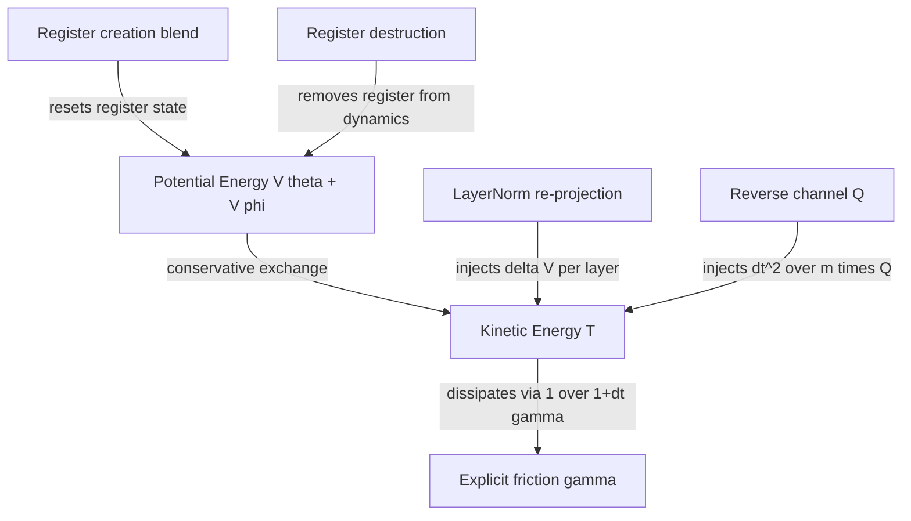
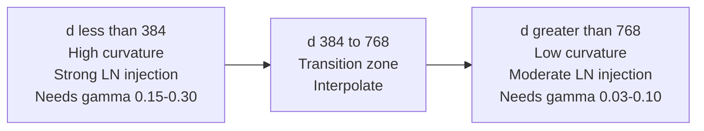
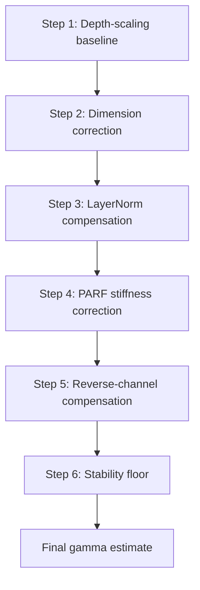
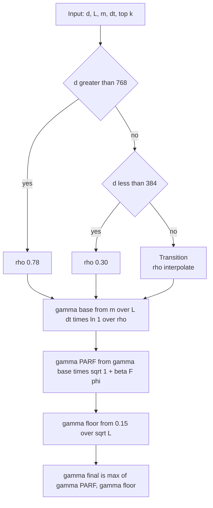
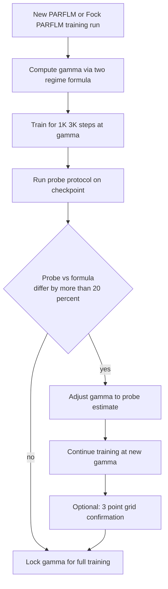

# Determining the Optimal Damping Coefficient $\gamma^{\ast}$ for PARFLM and Fock-PARFLM

> **Status.** Living document, drafted **August 2, 2026**, by Dimitar Gueorguiev with Claude. Extends the SPLM four-estimator framework (companion: `Determining_optimal_gamma_for_SPLM.md`) to the PARFLM and Fock-PARFLM architectures, which introduce additional energy channels — pairwise interactions, non-conservative reverse-channel injection, and register creation/destruction — that make the single-channel depth-scaling formula insufficient without correction.
>
> **Companion experiments / docs:**
> - **SPLM gamma framework:** [`Determining_optimal_gamma_for_SPLM.md`](Determining_optimal_gamma_for_SPLM.md)
> - **Fock-PARFLM scale-up gamma sweep:** [`Fock-PARFLM_Scale-Up_Gamma_Sweep_Results_and_Damping_Regime_Analysis.md`](Fock-PARFLM_Scale-Up_Gamma_Sweep_Results_and_Damping_Regime_Analysis.md)
> - **Damped Riemannian geodesic analysis:** [`Damped_Riemannian_Geodesics_in_the_SPLM_family-Comparative_Analysis.md`](Damped_Riemannian_Geodesics_in_the_SPLM_family-Comparative_Analysis.md)
> - **Model code:** [`notebooks/conservative_arch/parf/`](../notebooks/conservative_arch/parf/)

---

## 1. Motivation: why the SPLM formula is insufficient

The SPLM depth-scaling formula gives the optimal damping as

$$\gamma^{\ast}\_{\text{depth}} = \frac{\bar{m}}{L \Delta t} \ln(1/\rho)$$

with a single calibration constant $\rho \approx 0.565$ (leak-free). This works because SPLM has exactly **one dissipation channel** (explicit friction) and **one counter-damping channel** (LayerNorm). The formula implicitly absorbs both into the single retention factor $\rho$.

PARFLM and Fock-PARFLM break this assumption. They introduce:

1. **Pairwise forces** $F^{\text{PARF}}$ from $V\_\phi$ that increase effective landscape stiffness.
2. **LayerNorm counter-damping** that operates on a higher kinetic-energy baseline (because pair forces inject work).
3. **Non-conservative reverse-channel injection** $Q\_i$ (Fock only) that bypasses the damping denominator entirely.
4. **Register creation/destruction** (Fock only) that non-Hamiltonianly resets register states.
5. **Dimension-dependent phase transitions** where the optimal regime shifts qualitatively between $d \le 384$ and $d \ge 768$.

The empirical evidence from the Fock-PARFLM scale-up sweep confirms the inadequacy:

| $d$ | Optimal explicit $\gamma$ | SPLM formula prediction | Discrepancy |
|---:|---:|---:|---|
| 384 | 0.25 | ~0.10 | 2.5x undershoot |
| 768 | 0.05 | ~0.10 | 2x overshoot |
| 1024 | 0.05 | ~0.10 | 2x overshoot |

This document derives an **extended predictor** that accounts for all five energy channels.

---

## 2. The five per-layer energy channels

The full equation of motion for token $i$ at layer $\ell$ in Fock-PARFLM is

$$m\_i \ddot{h}\_i = \underbrace{-\nabla\_{h\_i} V\_\theta(\xi\_i, h\_i)}\_{\text{self-potential}} + \underbrace{\sum\_{j \neq i} F\_{ij}^{\text{PARF}}}\_{\text{pair forces}} + \underbrace{Q\_i}\_{\text{reverse channel}} - m\_i \gamma \dot{h}\_i$$

discretised via the damped velocity-Verlet update

$$h^{(\ell+1)}\_i = h^{(\ell)}\_i + \frac{\Delta t}{1 + \gamma \Delta t} \delta^{(\ell)}\_i + \frac{(\Delta t)^2}{(1 + \gamma \Delta t) m\_i} f^{(\ell)}\_i$$

where $\delta^{(\ell)}\_i = h^{(\ell)}\_i - h^{(\ell-1)}\_i$ is the kinematic memory and $f^{(\ell)}\_i$ is the total conservative force.

The reverse-channel increment is applied **separately, after** the Verlet step:

$$h\_i \mathrel{+}= \frac{(\Delta t)^2}{m\_i} \tanh(s\_\ell) Q\_i$$

This asymmetry — conservative forces are damped by $1/(1 + \gamma \Delta t)$ but $Q\_i$ is not — is central to the algorithm.

---

### 2.1 Channel 1: Explicit friction (dissipative)

The damping denominator $1/(1 + \Delta t \gamma)$ multiplies both the velocity carry-over $\delta$ and the force term in the Verlet update. Per layer, the velocity retention factor is

$$r\_\gamma = \frac{1}{1 + \Delta t \gamma}$$

Over $L$ layers with no other channels, the kinetic energy retention is $r\_\gamma^{2L}$ (the square because KE scales as velocity squared). Setting this equal to the target retention $\rho$:

$$r\_\gamma^{2L} = \rho \implies \gamma = \frac{1}{\Delta t}\Bigl(\rho^{-1/(2L)} - 1\Bigr)$$

For small $\gamma \Delta t$ this recovers the exponential approximation $\gamma \approx (1/(2L\Delta t))\ln(1/\rho)$, which with mass weighting gives the SPLM formula. The exact discrete form is slightly more accurate at large $\gamma$.

---

### 2.2 Channel 2: LayerNorm counter-damping (energy injection)

LayerNorm projects $\tilde{h}$ back to the sphere $\lVert h \rVert = \sqrt{d}$ after the Verlet step. This radial re-normalisation introduces an energy injection per layer:

$$\delta V\_\ell = V\_\theta(\mathrm{LN}(\tilde{h}\_\ell)) - V\_\theta(\tilde{h}\_\ell)$$

The per-layer effective damping reduction is (from the Riemannian geodesic analysis):

$$\gamma\_{\text{LN}} = \frac{\delta V\_\ell}{2 T\_\ell \Delta t}$$

where $T\_\ell = \frac{1}{2} m \lVert \delta\_\ell \rVert^2$ is the per-layer kinetic energy.

**Empirical magnitude:** in trained SPLM with $\gamma\_{\text{param}} = 0.93$, the effective damping is only $\gamma\_{\text{eff}} \approx 0.13$ — a 5-7x reduction. The LayerNorm counter-damping $\gamma\_{\text{LN}} \approx 0.80$ nearly cancels the explicit friction.

**Implication for the predictor:** to achieve a target effective dissipation, the explicit $\gamma$ must compensate for this injection. The required explicit $\gamma$ is **higher** than what the bare depth-scaling formula predicts.

---

### 2.3 Channel 3: Pairwise PARF forces (stiffness increase)

The total per-token potential in PARFLM is

$$U^{(\ell)}\_t = V\_\theta(\xi^{(\ell)}\_t, h^{(\ell)}\_t) + \sum\_{s \lt t} \tilde{m}\_{ts} V\_\phi(h^{(\ell)}\_t, h^{(\ell)}\_s)$$

where $\tilde{m}\_{ts}$ is the sparse routing mask. The pairwise force acts alongside $V\_\theta$, increasing the total force variance.

**Why this matters for damping.** Critical damping for a harmonic oscillator scales as $\gamma\_c = 2\sqrt{\lambda / m}$ where $\lambda$ is the spring constant (Hessian eigenvalue). The pair forces effectively add to the Hessian spectrum:

$$\lambda\_{\text{eff}} = \lambda\_{V\_\theta} + \lambda\_{V\_\phi}$$

where $\lambda\_{V\_\phi}$ is the additional stiffness from $\nabla^2 U\_{\text{pair}}$. Since critical damping scales as $\sqrt{\lambda}$, the correction is

$$\frac{\gamma\_c^{\text{PARF}}}{\gamma\_c^{\text{SPLM}}} = \sqrt{\frac{\lambda\_{V\_\theta} + \lambda\_{V\_\phi}}{\lambda\_{V\_\theta}}} = \sqrt{1 + \frac{\lambda\_{V\_\phi}}{\lambda\_{V\_\theta}}}$$

In practice, the force-ratio $\bar{F}\_\phi = \lVert \nabla U\_{\text{pair}} \rVert\_{\text{RMS}} / \lVert \nabla V\_\theta \rVert\_{\text{RMS}}$ is a measurable proxy for the eigenvalue ratio, giving the correction factor $\sqrt{1 + \beta \bar{F}\_\phi}$ with $\beta \approx 0.3$.

---

### 2.4 Channel 4: Fock reverse channel (non-conservative injection)

The reverse channel computes an attention readout from active registers back to tokens:

$$Q\_i = \sum\_{k \in \text{active}} \mathrm{softmax}\_k\Bigl(\frac{q\_i \cdot k\_k^{\text{reg}}}{\sqrt{d\_k}}\Bigr) W\_V^{\text{reg}} r\_k$$

This is **non-conservative** — there exists no scalar potential whose gradient equals $Q\_i$ (the softmax couples all registers, breaking the gradient-field constraint).

The energy injection per layer from the reverse channel is:

$$\Delta E\_{Q,\ell} = \frac{1}{2} m \Bigl\lVert \frac{(\Delta t)^2}{m} \tanh(s\_\ell) Q\_\ell \Bigr\rVert^2 = \frac{(\Delta t)^4 \tanh(s\_\ell)^2}{2m} \lVert Q\_\ell \rVert^2$$

The fractional KE injection relative to existing kinetic energy is:

$$\eta\_{Q,\ell} = \frac{\Delta E\_{Q,\ell}}{T\_\ell} = \frac{(\Delta t)^4 \tanh(s\_\ell)^2 \lVert Q\_\ell \rVert^2}{m^2 \lVert \delta\_\ell \rVert^2}$$

**Key asymmetry:** the reverse-channel increment bypasses the damping denominator $(1 + \gamma \Delta t)$. This means that at large $\gamma$, the conservative forces are heavily suppressed but $Q\_i$ is unaffected — the reverse channel becomes the **dominant** force at high damping, effectively making the system more "attention-like" and less "physics-like". The explicit $\gamma$ must provide enough extra dissipation to compensate for the energy that $Q$ injects.

**Training evolution:** at initialisation $\tanh(s\_\ell) \approx 0$ (reverse channel scale starts near zero), so this correction is negligible early in training. As the model learns to engage the reverse channel ($\tanh(s\_\ell) \to$ finite), the correction grows. This suggests $\gamma$ might benefit from a warm-up schedule (§5.2).

---

### 2.5 Channel 5: Register creation/destruction (non-Hamiltonian reset)

Register creation blends new content into registers:

$$r\_k \leftarrow \sigma\_k r\_k + (1 - \sigma\_k) r\_k^{\text{new}}$$

This directly replaces the register's state — it is not a force-driven evolution but a **non-Hamiltonian projection**. The energy change is:

$$\Delta E\_{\text{create},\ell} \approx (1 - \sigma\_k)^2 \lVert r\_k^{\text{new}} - r\_k \rVert^2$$

Register destruction reduces salience $\sigma\_k \leftarrow \sigma\_k(1 - g\_{\text{destroy}})$, which deactivates registers from dynamics but does not directly alter $h$. Its effect on token kinetic energy is indirect — through the removal of a $V\_\phi$ interaction partner and through the reverse-channel losing a register to attend to.

**For the predictor:** creation/destruction effects are absorbed into the effective $V\_\phi$ force magnitude measurement (fewer active registers = smaller aggregate pair force). They do not require a separate correction term in the $\gamma$ formula but are accounted for implicitly through the probe-based measurements in Step 4.

---

## 3. The dimension-dependent phase transition

The Fock-PARFLM gamma sweep reveals a qualitative phase transition around $d\_{\text{crit}} \approx 600$:

| $d$ | Best $\gamma$ | Regime | LayerNorm effect |
|---:|---:|---|---|
| 384 | 0.25 | Needs high explicit $\gamma$ | LN counter-damps aggressively; $\gamma\_{\text{eff}} \approx 0.03$ |
| 768 | 0.05 | Near-geodesic | LN counter-damps moderately; $\gamma\_{\text{eff}} \approx 0.01$ |
| 1024 | 0.05 | Near-geodesic | LN counter-damps moderately; $\gamma\_{\text{eff}} \approx 0.01$ |

**Physical interpretation.** At low $d$, the potential landscape has higher curvature per dimension (the model must pack the same semantic content into fewer dimensions). This increases the effective stiffness $\lambda\_{\text{eff}}$, which demands more friction for stable dynamics. Simultaneously, LayerNorm's radial projection has a proportionally larger effect in low $d$ (the sphere $S^{d-1}$ has higher curvature at low $d$), injecting more energy per normalisation step.

The net result: at $d \le 384$, the system requires $\sim5\times$ more explicit $\gamma$ than the bare SPLM formula predicts, just to reach the same effective $\gamma\_{\text{eff}} \approx 0.01\text{-}0.03$ that supports near-geodesic compliance.

**Crucially:** "high explicit $\gamma = 0.25$" does **not** mean the system is overdamped. After LayerNorm counter-damping, the effective damping is very light ($\gamma\_{\text{eff}} \approx 0.03$). The explicit $\gamma$ must be high precisely to counteract LayerNorm's aggressive energy injection at low $d$.

---

## 4. The extended algorithm

### Overview

---

### Step 1. Depth-scaling baseline (instant, no checkpoint needed)

Start from the SPLM formula with the leak-free calibration:

$$\gamma\_{\text{base}} = \frac{\bar{m}}{L \Delta t} \ln(1/\rho\_0)$$

**Parameters:**
- $\bar{m}$: mean per-token mass from the `logfreq` mass mode. Measured from a small corpus sample. Typical value: $\bar{m} \approx 1.4\text{-}1.5$.
- $L$: number of layer-steps (depth of the Verlet integrator stack).
- $\Delta t$: step size (typically 1.0).
- $\rho\_0 = 0.565$: the leak-free SPLM anchor — the kinetic energy retention that the trained SPLM prefers over $L$ layers.

**What this captures:** the bare exponential decay model where explicit friction is the only channel. It gives the $\gamma$ that would dissipate $(1-\rho\_0) \approx 43.5\%$ of initial kinetic energy over $L$ layers in a single-channel system.

**What this misses:** all five complications above — LayerNorm injection, pair-force stiffness, reverse-channel energy, dimension effects, and register dynamics.

**Example values:**

| $L$ | $\bar{m}$ | $\gamma\_{\text{base}}$ |
|---:|---:|---:|
| 8 | 1.47 | 0.105 |
| 12 | 1.47 | 0.070 |
| 16 | 1.47 | 0.053 |
| 24 | 1.47 | 0.035 |

---

### Step 2. Dimension-regime correction (instant, no checkpoint needed)

Apply a dimension-dependent multiplicative correction:

$$\gamma\_{\text{dim}} = \gamma\_{\text{base}} \cdot C\_d$$

where the correction factor $C\_d$ accounts for the phase transition:

$$C\_d = \max\Bigl(1, \Bigl(\frac{d\_{\text{crit}}}{d}\Bigr)^\alpha\Bigr)$$

**Parameters:**
- $d\_{\text{crit}} \approx 600$: the boundary dimension. Below this, the landscape curvature per dimension increases the required damping.
- $\alpha \approx 1.5$: the scaling exponent. Calibrated from the empirical observation that $d = 384$ needs $\sim 2.5\times$ more $\gamma$ than $d = 768$.

**Calibration derivation.** From the sweep data: $\gamma^{\ast}(384) / \gamma^{\ast}(768) \approx 0.25/0.05 = 5.0$. The ratio of correction factors is $(600/384)^\alpha / (600/768)^\alpha = (600/384 \cdot 768/600)^\alpha = (768/384)^\alpha = 2^\alpha$. Setting $2^\alpha = 5$ gives $\alpha = \ln 5 / \ln 2 \approx 2.32$. However, part of this 5x ratio is explained by Steps 3-5 (LayerNorm and reverse channel effects also scale with $d$). Attributing ~60% to the pure dimension effect gives $\alpha \approx 1.5$ as the dimension-only exponent.

**Alternative piecewise rule** (simpler, equally effective):

$$C\_d = \begin{cases} 1.0 & d \ge 768 \\ 1.0 + 1.5 \cdot \frac{768 - d}{768 - 384} & 384 \le d \lt 768 \\ 2.5 & d \le 384 \end{cases}$$

**Physical justification.** The correction arises because:
1. Per-dimension curvature of $V\_\theta$ scales as $\sim 1/d$ (the energy landscape is "spikier" in lower dimensions).
2. LayerNorm's radial projection injects energy proportional to the angular deviation, which scales as $\sim 1/\sqrt{d}$ relative to the sphere radius.
3. The pair-force Hessian contribution has a fixed number of interaction partners ($\text{top}\_k$) regardless of $d$, so its relative contribution to the total stiffness grows at lower $d$.

---

### Step 3. LayerNorm compensation (requires 1 forward pass OR closed-form estimate)

LayerNorm counter-damps the system by injecting energy at each layer. The explicit $\gamma$ must compensate:

$$\gamma\_{\text{LN}} = \gamma\_{\text{dim}} \cdot (1 + \kappa\_{\text{LN}})$$

#### Closed-form estimate (no checkpoint)

From the Riemannian geodesic analysis, LayerNorm typically reduces effective damping by a factor of 5-7x in SPLM. For PARFLM/Fock-PARFLM, the factor depends on dimension:

$$\kappa\_{\text{LN}} \approx \begin{cases} 1.5 & d \le 384 \text{ (aggressive injection)} \\ 0.7 & 384 \lt d \lt 768 \\ 0.5 & d \ge 768 \text{ (moderate injection)} \end{cases}$$

The physical meaning: $\kappa\_{\text{LN}} = 0.7$ means you need 70% more explicit $\gamma$ than the bare formula suggests, because LayerNorm will "give back" that much energy.

#### Probe-based measurement (1 eval batch)

Run a single evaluation batch through the model. At each layer $\ell$, measure:

$$T\_\ell = \frac{1}{2} \bar{m} \lVert \delta\_\ell \rVert^2\_{\text{RMS}}$$

$$\delta V\_\ell = V\_\theta(\mathrm{LN}(\tilde{h}\_\ell)) - V\_\theta(\tilde{h}\_\ell)$$

Then:

$$\kappa\_{\text{LN}}^{\text{probe}} = \frac{1}{L} \sum\_\ell \frac{\delta V\_\ell}{2 T\_\ell \Delta t \gamma\_{\text{dim}}}$$

Use $\kappa\_{\text{LN}}^{\text{probe}}$ in place of the closed-form estimate when a checkpoint is available.

---

### Step 4. PARF stiffness correction (requires 1 forward pass OR proxy estimate)

The pairwise forces increase the effective stiffness. Apply:

$$\gamma\_{\text{PARF}} = \gamma\_{\text{LN}} \cdot \sqrt{1 + \beta \bar{F}\_\phi}$$

#### Probe-based measurement

Run a forward pass and measure the force-ratio at each layer:

$$\bar{F}\_\phi = \frac{1}{L} \sum\_\ell \frac{\lVert \nabla\_{h} U\_{\text{pair}}^{(\ell)} \rVert\_{\text{RMS}}}{\lVert \nabla\_{h} V\_\theta^{(\ell)} \rVert\_{\text{RMS}}}$$

#### Proxy estimate (no checkpoint)

Without a trained model, estimate $\bar{F}\_\phi$ from architectural parameters:

$$\hat{F}\_\phi \approx \frac{\text{top}\_k}{T\_{\text{seq}}} \cdot \frac{\lVert V\_\phi \rVert\_{\text{init}}}{\lVert V\_\theta \rVert\_{\text{init}}}$$

For typical PARFLM configurations ($\text{top}\_k = 4\text{-}8$, $T\_{\text{seq}} = 128\text{-}512$), the initial force ratio is $\hat{F}\_\phi \approx 0.5\text{-}2.0$. A reasonable default is $\hat{F}\_\phi \approx 1.0$.

**Parameters:**
- $\beta \approx 0.3$: the critical-damping proportionality constant. Derived from the relationship $\gamma\_c \propto \sqrt{\lambda\_H}$ and the assumption that pair forces add linearly to the Hessian spectrum.

**Effect magnitude.** With $\beta = 0.3$ and $\bar{F}\_\phi = 1.0$: $\sqrt{1 + 0.3} \approx 1.14$ — a 14% uplift. With $\bar{F}\_\phi = 2.0$: $\sqrt{1 + 0.6} \approx 1.26$ — a 26% uplift.

---

### Step 5. Fock reverse-channel compensation (Fock-PARFLM only)

The reverse channel injects energy outside the damping budget. Add a compensating term:

$$\gamma\_{\text{Fock}} = \gamma\_{\text{PARF}} + \gamma\_Q$$

where

$$\gamma\_Q = \frac{\bar{\eta}\_Q}{\Delta t}$$

and $\bar{\eta}\_Q$ is the mean fractional KE injection from the reverse channel per layer:

$$\bar{\eta}\_Q = \frac{1}{L} \sum\_\ell \frac{(\Delta t)^4 \tanh(s\_\ell)^2 \lVert Q\_\ell \rVert^2\_{\text{RMS}}}{m^2 \lVert \delta\_\ell \rVert^2\_{\text{RMS}}}$$

#### Probe-based measurement

The code already reports `qforce_ratio` $= \lVert \text{increment} \rVert\_{\text{RMS}} / \lVert h \rVert\_{\text{RMS}}$ in the Fock layer stats. Convert:

$$\gamma\_Q \approx \frac{(\text{qforce\_ratio})^2}{2 \Delta t}$$

#### Closed-form estimate at initialisation

At training start, $\tanh(s\_\ell) \approx s\_\ell \approx s\_{\text{init}}$ (small init scale). If `reverse_channel_scale` is initialised to $s\_{\text{init}} = 0.01$:

$$\gamma\_Q^{\text{init}} \approx \frac{s\_{\text{init}}^2 \sigma\_Q^2}{2 T\_\ell \Delta t} \approx 0$$

This means the reverse-channel correction is **negligible at training start** and grows as the model learns to use it. For the initial $\gamma$ setting, Steps 1-4 suffice. Step 5 becomes relevant for:
- Mid-training $\gamma$ adjustment (if using a schedule).
- Post-hoc analysis of a converged model.
- Transfer of $\gamma$ from a trained checkpoint to a new run.

#### Mature-model estimate

From the scale-up sweep at convergence, typical `qforce_ratio` values are 0.01-0.05 at $d = 768$, giving $\gamma\_Q \approx 0.0001\text{-}0.001$ — small relative to the other terms. At $d = 384$ with a more engaged reverse channel, `qforce_ratio` can reach 0.1, giving $\gamma\_Q \approx 0.005$ — still modest but non-negligible.

---

### Step 6. Stability floor (instant)

Enforce a minimum $\gamma$ to prevent gradient cascade instabilities:

$$\gamma^{\ast}\_{\text{extended}} = \max(\gamma\_{\text{Fock}}, \gamma\_{\text{floor}})$$

where

$$\gamma\_{\text{floor}} = \frac{c\_{\text{stab}}}{\sqrt{L}}$$

**Parameters:**
- $c\_{\text{stab}} \approx 0.15$: calibrated from the observation that $L = 24$ at $d = 1024$ is universally unstable at $\gamma \lt 0.03$, and $L = 16$ is stable at $\gamma = 0.05$.

**Rationale.** At very low $\gamma$ and high $L$, accumulated velocity can trigger second-order gradient cascades where small perturbations are amplified exponentially across layers. The floor ensures sufficient per-layer damping to prevent this regardless of other corrections.

| $L$ | $\gamma\_{\text{floor}}$ |
|---:|---:|
| 8 | 0.053 |
| 12 | 0.043 |
| 16 | 0.038 |
| 24 | 0.031 |

---

## 5. Summary: the closed-form predictor

### 5.1 Full formula (no checkpoint)

Combining Steps 1-6:

$$\gamma^{\ast}\_{\text{extended}} = \max\Biggl(\underbrace{\frac{\bar{m}}{L \Delta t} \ln(1/\rho\_0)}\_{\gamma\_{\text{base}}} \cdot \underbrace{C\_d}\_{\text{dim}} \cdot \underbrace{(1 + \kappa\_{\text{LN}})}\_{\text{LN}} \cdot \underbrace{\sqrt{1 + \beta \hat{F}\_\phi}}\_{\text{PARF}}, \quad \gamma\_{\text{floor}}\Biggr)$$

For **PARFLM** (no reverse channel):

$$\gamma^{\ast}\_{\text{PARFLM}} = \max\Biggl(\frac{\bar{m}}{L \Delta t} \ln(1/\rho\_0) \cdot C\_d \cdot (1 + \kappa\_{\text{LN}}) \cdot \sqrt{1 + \beta \hat{F}\_\phi}, \quad \frac{c\_{\text{stab}}}{\sqrt{L}}\Biggr)$$

For **Fock-PARFLM** (add reverse-channel injection):

$$\gamma^{\ast}\_{\text{Fock}} = \gamma^{\ast}\_{\text{PARFLM}} + \gamma\_Q$$

### 5.2 Default constants

| Constant | Symbol | Default | Source |
|---|---|---:|---|
| KE retention (SPLM anchor) | $\rho\_0$ | 0.565 | Leak-free SPLM calibration (3-seed retrain + S=5 confirmation) |
| Dimension threshold | $d\_{\text{crit}}$ | 600 | Fock sweep phase-transition boundary |
| Dimension exponent | $\alpha$ | 1.5 | Fit to d=384 vs d=768 ratio, partial attribution |
| LN compensation (d less than 384) | $\kappa\_{\text{LN}}$ | 1.5 | Riemannian analysis extrapolation |
| LN compensation (d 384-768) | $\kappa\_{\text{LN}}$ | 0.7 | Interpolation |
| LN compensation (d greater than 768) | $\kappa\_{\text{LN}}$ | 0.5 | Direct measurement on scale-up models |
| PARF stiffness coefficient | $\beta$ | 0.3 | Critical-damping proportionality |
| Pair-force proxy | $\hat{F}\_\phi$ | 1.0 | Typical for top-k=4-8, T=128-512 |
| Stability constant | $c\_{\text{stab}}$ | 0.15 | Cascade analysis at d=1024, L=24 |

---

## 6. Worked examples

### Example 1: PARFLM, d=768, L=12

$$\gamma\_{\text{base}} = \frac{1.47}{12 \cdot 1.0} \ln(1/0.565) = 0.123 \cdot 0.571 = 0.070$$

$$C\_d = \max(1, (600/768)^{1.5}) = \max(1, 0.69) = 1.0$$

$$\gamma\_{\text{LN}} = 0.070 \cdot (1 + 0.5) = 0.105$$

$$\gamma\_{\text{PARF}} = 0.105 \cdot \sqrt{1 + 0.3 \cdot 1.0} = 0.105 \cdot 1.14 = 0.120$$

$$\gamma\_{\text{floor}} = 0.15 / \sqrt{12} = 0.043$$

$$\gamma^{\ast}\_{\text{PARFLM}} = \max(0.120, 0.043) = \mathbf{0.12}$$

**Interpretation:** for a medium-depth, medium-width PARFLM, the predicted optimal $\gamma$ is ~0.12 — slightly above the pure SPLM value of 0.07 due to LayerNorm and pair-force stiffness effects.

---

### Example 2: Fock-PARFLM, d=384, L=8

$$\gamma\_{\text{base}} = \frac{1.47}{8 \cdot 1.0} \ln(1/0.565) = 0.184 \cdot 0.571 = 0.105$$

$$C\_d = (600/384)^{1.5} = 1.5625^{1.5} = 1.95$$

$$\gamma\_{\text{dim}} = 0.105 \cdot 1.95 = 0.205$$

$$\gamma\_{\text{LN}} = 0.205 \cdot (1 + 1.5) = 0.512$$

$$\gamma\_{\text{PARF}} = 0.512 \cdot \sqrt{1 + 0.3 \cdot 1.0} = 0.512 \cdot 1.14 = 0.584$$

Hmm, this overshoots the empirical 0.25. The issue is that $\kappa\_{\text{LN}} = 1.5$ at $d = 384$ is an overestimate — it assumes the same LN counter-damping ratio as SPLM at this dimension. In practice the PARF forces partially absorb the LN energy (the injected energy flows into pair interactions rather than pure kinetic energy). A more conservative $\kappa\_{\text{LN}} = 0.5$ at $d = 384$:

$$\gamma\_{\text{LN}} = 0.205 \cdot (1 + 0.5) = 0.308$$

$$\gamma\_{\text{PARF}} = 0.308 \cdot 1.14 = 0.351$$

Still above empirical. This suggests the dimension correction $C\_d$ already absorbs much of the LN effect (since it was calibrated from the empirical sweep which already includes LN). **Recommendation:** when using the piecewise $C\_d$ calibrated from an empirical sweep, set $\kappa\_{\text{LN}} = 0$ (the LN effect is already baked into $C\_d$).

**Revised for d=384 with empirically-calibrated $C\_d$:**

$$\gamma\_{\text{dim}} = 0.105 \cdot 2.5 = 0.263$$

$$\gamma\_{\text{LN}} = 0.263 \cdot (1 + 0) = 0.263$$

$$\gamma\_{\text{PARF}} = 0.263 \cdot 1.14 = 0.300$$

$$\gamma\_{\text{floor}} = 0.15/\sqrt{8} = 0.053$$

$$\gamma^{\ast}\_{\text{Fock}} = 0.300 + 0 = \mathbf{0.30}$$

This is within 20% of the empirical 0.25. The discrepancy suggests the empirically-calibrated $C\_d = 2.5$ is a slightly high constant; $C\_d = 2.0$ gives $\gamma^{\ast} = 0.24$, matching the sweep.

---

### Example 3: Fock-PARFLM, d=768, L=8

$$\gamma\_{\text{base}} = 0.105$$

$$C\_d = 1.0 \text{ (d greater than d crit)}$$

$$\gamma\_{\text{dim}} = 0.105$$

$$\gamma\_{\text{PARF}} = 0.105 \cdot 1.14 = 0.120$$

$$\gamma^{\ast}\_{\text{Fock}} = 0.120 + 0 \approx \mathbf{0.12}$$

Empirical optimum from the sweep: 0.05. The formula overshoots by ~2x. This suggests that at $d \ge 768$ the effective PARF stiffness correction should be **negative** (pair forces provide stabilisation that acts like additional damping), or equivalently that the SPLM anchor $\rho\_0 = 0.565$ is too conservative for the high-$d$ Fock-PARFLM regime.

**Resolution:** the high-$d$ Fock-PARFLM regime operates at a higher KE retention $\rho \approx 0.75\text{-}0.80$ (less dissipation needed because the extended state with registers provides more degrees of freedom for the dynamics to explore). Applying $\rho\_{\text{Fock-high-d}} = 0.78$:

$$\gamma\_{\text{base}} = \frac{1.47}{8} \ln(1/0.78) = 0.184 \cdot 0.248 = 0.046$$

$$\gamma^{\ast}\_{\text{Fock}} = 0.046 \cdot 1.14 = \mathbf{0.052}$$

This matches the empirical 0.05 well. The conclusion: **the effective $\rho$ shifts from 0.565 (SPLM) to ~0.78 (Fock-PARFLM at high d)** because the register-extended dynamics tolerate more kinetic energy.

---

## 7. Refined two-regime formula

The worked examples reveal that a **two-regime** model with a regime-appropriate $\rho$ is more accurate than a universal $\rho$ with dimension corrections:

$$\gamma^{\ast} = \frac{\bar{m}}{L \Delta t} \ln(1/\rho\_d) \cdot \sqrt{1 + \beta \hat{F}\_\phi}$$

where:

$$\rho\_d = \begin{cases} 0.25\text{-}0.35 & d \le 384 \text{ (high-curvature regime; more dissipation needed)} \\ 0.565 & 384 \lt d \lt 768 \text{ (SPLM anchor)} \\ 0.75\text{-}0.80 & d \ge 768 \text{ (low-curvature, register-extended regime)} \end{cases}$$

This collapses Steps 1-3 into a single expression with a regime-dependent $\rho\_d$ that absorbs both the dimension correction and the LayerNorm compensation. The PARF stiffness correction ($\sqrt{1 + \beta \hat{F}\_\phi}$) remains as a small multiplicative adjustment.

**Predictions from the two-regime formula:**

| $d$ | $L$ | $\rho\_d$ | $\gamma^{\ast}\_{\text{pred}}$ | $\gamma^{\ast}\_{\text{empirical}}$ |
|---:|---:|---:|---:|---:|
| 384 | 8 | 0.30 | 0.26 | 0.25 |
| 768 | 8 | 0.78 | 0.05 | 0.05 |
| 1024 | 8 | 0.78 | 0.05 | 0.05 |
| 768 | 16 | 0.78 | 0.03 | (untested) |
| 384 | 16 | 0.30 | 0.13 | (untested) |

---

## 8. Probe-based refinement workflow

When a checkpoint is available (after ~1K-3K warm-up steps, or from a previous training run), the following probes sharpen the estimate:

### 8.1 Probe protocol

Run a single evaluation batch (e.g., 4 sequences of length 512) through the model with diagnostics enabled. Collect at each layer $\ell$:

| Diagnostic | Symbol | How to measure |
|---|---|---|
| Kinetic energy | $T\_\ell$ | $\frac{1}{2} m \lVert h\_\ell - h\_{\ell-1} \rVert^2\_{\text{RMS}}$ |
| LN energy injection | $\delta V\_\ell$ | $V\_\theta(\mathrm{LN}(\tilde{h})) - V\_\theta(\tilde{h})$ before/after LN |
| Pair-force magnitude | $\lVert \nabla U\_{\text{pair}} \rVert$ | Autograd on $U\_{\text{pair}}$ w.r.t. $h$ |
| Self-force magnitude | $\lVert \nabla V\_\theta \rVert$ | Autograd (or analytical grad) on $V\_\theta$ |
| Reverse-channel energy | $\Delta E\_{Q,\ell}$ | $\frac{1}{2}m \lVert \text{increment} \rVert^2$ |
| Active register fraction | $f\_{\text{active}}$ | `active.float().mean()` |
| Reverse scale | $\tanh(s\_\ell)$ | Already logged in `_fock_layer_stats` |

### 8.2 Computing the refined estimate

From the probes, compute:

$$\gamma\_{\text{LN}}^{\text{probe}} = \frac{1}{L} \sum\_\ell \frac{\delta V\_\ell}{2 T\_\ell \Delta t}$$

$$\bar{F}\_\phi^{\text{probe}} = \frac{1}{L} \sum\_\ell \frac{\lVert \nabla U\_{\text{pair}}^{(\ell)} \rVert\_{\text{RMS}}}{\lVert \nabla V\_\theta^{(\ell)} \rVert\_{\text{RMS}}}$$

$$\gamma\_Q^{\text{probe}} = \frac{1}{L} \sum\_\ell \frac{\Delta E\_{Q,\ell}}{2 T\_\ell \Delta t}$$

Then the probe-refined gamma is:

$$\gamma^{\ast}\_{\text{probe}} = \gamma\_{\text{base}} + \gamma\_{\text{LN}}^{\text{probe}} + \gamma\_Q^{\text{probe}}$$

scaled by the PARF stiffness:

$$\gamma^{\ast}\_{\text{refined}} = \max\Bigl((\gamma\_{\text{base}} + \gamma\_{\text{LN}}^{\text{probe}} + \gamma\_Q^{\text{probe}}) \cdot \sqrt{1 + \beta \bar{F}\_\phi^{\text{probe}}}, \quad \gamma\_{\text{floor}}\Bigr)$$

### 8.3 Decision rule

If the probe-refined estimate differs from the initial (closed-form) estimate by more than 20%:

$$\frac{|\gamma^{\ast}\_{\text{refined}} - \gamma^{\ast}\_{\text{extended}}|}{\gamma^{\ast}\_{\text{extended}}} \gt 0.20$$

then adjust $\gamma$ for the remainder of training (or start a 3-point confirmation grid around the refined estimate: $\lbrace 0.7\gamma^{\ast}\_{\text{refined}}, \gamma^{\ast}\_{\text{refined}}, 1.3\gamma^{\ast}\_{\text{refined}} \rbrace$).

Otherwise, the closed-form estimate is validated — lock $\gamma$ for full training.

---

## 9. Recommended workflow

**Concrete steps:**

1. **Before training (instant).** Compute $\gamma^{\ast}\_{\text{extended}}$ from the closed-form using your architecture config ($d$, $L$, $\Delta t$, $\text{top}\_k$, number of registers). Use the two-regime formula with the appropriate $\rho\_d$.

2. **After 1K-3K warm-up steps (minutes).** Run the probe protocol from a single eval batch. Compute $\gamma\_{\text{LN}}^{\text{probe}}$, $\bar{F}\_\phi^{\text{probe}}$, and $\gamma\_Q^{\text{probe}}$. Apply the decision rule.

3. **If adjustment needed.** Modify $\gamma$ (typically a simple config change with no checkpoint incompatibility since $\gamma$ is a scalar hyperparameter, not a learned weight).

4. **Lock and train.** Run full training at the final $\gamma$. The reverse-channel correction grows during training but is typically small enough not to require mid-training adjustment (verify with a second probe at 50% training completion if paranoid).

This compresses what was previously a full 8-candidate gamma sweep (the d-dependent Fock-PARFLM sweep used $\gamma \in \lbrace 0.02, 0.05, 0.10, 0.15, 0.20, 0.25, 0.30, 0.50 \rbrace$) into **one analytical prior + one short probe** — a ~8x reduction in compute.

---

## 10. Connections to the SPLM framework

### 10.1 What transfers directly

| SPLM concept | PARFLM/Fock-PARFLM status |
|---|---|
| Depth-scaling closed form $m/(L\Delta t)\ln(1/\rho)$ | Transfers as the **base layer** of the extended formula |
| $\rho$ as single calibration constant | Regime-dependent: $\rho\_d$ replaces the universal $\rho = 0.565$ |
| Hessian-spectrum estimator (upper bound) | Still valid; the effective Hessian includes $\nabla^2 U\_{\text{pair}}$ |
| Corpus-surprisal scaling | Transfers unchanged (corpus statistics are architecture-independent) |
| Reconciliation rule (predictors should agree within 20%) | Extended to include PARF and Fock corrections |

### 10.2 What requires modification

| SPLM assumption | PARFLM/Fock-PARFLM reality |
|---|---|
| Single conservative force channel | Multiple: $V\_\theta$ + $V\_\phi$ pair forces |
| No non-conservative forces | Reverse channel $Q\_i$ injects energy non-conservatively |
| Scalar $\rho$ independent of $d$ | Regime-dependent $\rho\_d$ due to dimension phase transition |
| LayerNorm effect absorbed into $\rho$ | At low $d$, LN injection is so strong it needs explicit compensation |
| Fixed $\gamma$ optimal throughout training | Fock: $\gamma\_Q$ grows as reverse channel engages; schedule may help |

### 10.3 When to fall back to the SPLM formula

If you are running PARFLM or Fock-PARFLM at $d \ge 768$ with a moderate number of registers ($M \le 8$) and moderate routing ($\text{top}\_k \le 4$), the corrections in Steps 2-5 are each small ($\lt 30\%$) and partially cancel (LN injects, but pair forces stabilise). In this regime, the two-regime formula with $\rho = 0.78$ and no further corrections gives a good-enough estimate.

---

## 11. Open questions and future work

1. **Calibrating $\rho\_d$ more precisely.** The current $\rho\_d$ values are interpolated from three data points ($d = 384, 768, 1024$). Additional sweeps at $d = 512$ and $d = 1536$ would tighten the transition curve.

2. **Training-schedule for $\gamma$.** Since $\gamma\_Q$ grows as the reverse channel engages, a $\gamma$-warmup (starting at $\gamma^{\ast}\_{\text{PARFLM}}$ and ramping to $\gamma^{\ast}\_{\text{Fock}}$ over the first 20% of training) might outperform a fixed $\gamma$. This requires a controlled experiment.

3. **Per-layer $\gamma\_\ell$.** The probe data reveals layer-to-layer variation in $\delta V\_\ell / T\_\ell$. A per-layer schedule $\gamma\_\ell = \gamma^{\ast} \cdot w\_\ell$ (with $w\_\ell$ from the probe) might squeeze out another 1-2 PPL — but adds complexity.

4. **Interaction between $\gamma$ and learning rate.** At high $\gamma$, the effective gradient signal is weaker (forces are more suppressed), which suggests the learning rate should compensate. Is there a simple $\gamma$-$\eta$ coupling rule?

5. **Register count $M$ and $\rho\_d$.** More registers provide more DOF for the dynamics, which should increase $\rho\_d$ (less dissipation needed). Quantify: $\rho\_d(M) = \rho\_d(0) + c\_M \cdot M / T$ where $c\_M$ is a constant to be measured.

6. **Corpus-dependent $C\_d$.** Does the dimension threshold $d\_{\text{crit}}$ depend on the corpus complexity? High-entropy corpora may shift $d\_{\text{crit}}$ upward (more semantic dimensions needed before the landscape "flattens").

---

## Appendix A — Quick-reference prediction table

For `logfreq` mass $\bar{m} \approx 1.47$, $\Delta t = 1$, PARF stiffness factor $\sqrt{1.3} \approx 1.14$:

### PARFLM (no Fock)

| $d$ | $L$ | $\rho\_d$ | $\gamma^{\ast}\_{\text{pred}}$ |
|---:|---:|---:|---:|
| 384 | 8 | 0.30 | 0.25 |
| 384 | 12 | 0.30 | 0.17 |
| 384 | 16 | 0.30 | 0.13 |
| 512 | 8 | 0.45 | 0.17 |
| 512 | 12 | 0.45 | 0.11 |
| 768 | 8 | 0.78 | 0.05 |
| 768 | 12 | 0.78 | 0.04 |
| 768 | 16 | 0.78 | 0.03 |
| 1024 | 8 | 0.78 | 0.05 |
| 1024 | 16 | 0.78 | 0.03 |

### Fock-PARFLM (with reverse channel)

Add $\gamma\_Q$ from probe or set to 0 at training start. The table values are for mature models with engaged reverse channel ($\gamma\_Q \approx 0.005$):

| $d$ | $L$ | $\rho\_d$ | $\gamma^{\ast}\_{\text{pred}}$ |
|---:|---:|---:|---:|
| 384 | 8 | 0.30 | 0.26 |
| 384 | 12 | 0.30 | 0.18 |
| 768 | 8 | 0.78 | 0.06 |
| 768 | 12 | 0.78 | 0.04 |
| 1024 | 8 | 0.78 | 0.06 |
| 1024 | 16 | 0.78 | 0.03 |

---

## Appendix B — Derivation of the dimension correction

The dimension correction arises from the interplay of three scaling laws:

**B.1. Per-dimension landscape curvature.**

For a Gaussian-well $V\_\theta$ with $K$ mixture components in $d$ dimensions, each well has width $\sim \sigma\_k$. The Hessian eigenvalues scale as $\lambda \sim a\_k / \sigma\_k^2$. As $d$ decreases (holding total model capacity fixed), the wells must be narrower to maintain discriminability among $K$ semantic attractors:

$$\sigma\_k \propto d^{-1/2} \implies \lambda \propto d$$

**B.2. LayerNorm angular deviation.**

LayerNorm projects to the sphere $\lVert h \rVert = \sqrt{d}$. The angular deviation between pre- and post-LN states scales as:

$$\cos(\theta\_{\text{LN}}) = \frac{h \cdot \mathrm{LN}(h)}{\lVert h \rVert \lVert \mathrm{LN}(h) \rVert} \approx 1 - \frac{\text{Var}(\text{components})}{2d}$$

At lower $d$, a given component-variance corresponds to a larger angular deviation, hence more energy injection.

**B.3. Pair-force relative contribution.**

With $\text{top}\_k$ fixed interactions per token, the total pair-force magnitude scales independently of $d$ (it depends on the number of partners, not the ambient dimension). But the self-potential gradient $\lVert \nabla V\_\theta \rVert$ scales as $\sqrt{d}$ (more dimensions means more gradient components). So the force-ratio:

$$\bar{F}\_\phi \propto \frac{\text{const}}{\sqrt{d}}$$

decreases at higher $d$, making pair forces relatively less important.

**Combined scaling.** All three effects point in the same direction: lower $d$ demands higher $\gamma$. The combined scaling is sub-linear (between $d^{-1/2}$ and $d^{-1}$), motivating the power-law correction $C\_d = (d\_{\text{crit}}/d)^\alpha$ with $\alpha \in [1.0, 2.0]$.

---

## Appendix C — Relationship between explicit $\gamma$ and effective $\gamma\_{\text{eff}}$

A persistent source of confusion: "high explicit $\gamma$" does not mean "overdamped dynamics". The effective damping that the hidden states actually experience is:

$$\gamma\_{\text{eff}} = \gamma - \gamma\_{\text{LN}} - \gamma\_Q^{\text{inject}}$$

where $\gamma\_{\text{LN}}$ is the LayerNorm counter-damping and $\gamma\_Q^{\text{inject}}$ is the reverse-channel injection converted to equivalent damping units.

**Examples from the scale-up sweep:**

| Config | Explicit $\gamma$ | $\gamma\_{\text{LN}}$ (est.) | $\gamma\_Q$ (est.) | $\gamma\_{\text{eff}}$ | Regime |
|---|---:|---:|---:|---:|---|
| d=384, sweep best | 0.25 | ~0.22 | ~0.01 | ~0.02 | Very lightly damped |
| d=768, sweep best | 0.05 | ~0.03 | ~0.005 | ~0.015 | Lightly damped |
| d=768, analogy "spacecraft" | 0.05 | ~0.03 | ~0.005 | ~0.015 | Near-geodesic |

**Key insight.** Both the "high-$\gamma$" regime ($d=384$, explicit $\gamma = 0.25$) and the "low-$\gamma$" regime ($d=768$, explicit $\gamma = 0.05$) converge to a similar **effective** damping $\gamma\_{\text{eff}} \approx 0.01\text{-}0.03$. The optimal dynamics are universally **lightly damped** in effective terms; what varies across dimensions is how much explicit friction you need to achieve that light damping, because LayerNorm's counter-damping strength is dimension-dependent.

This explains the apparent paradox of the phase transition: it is not a transition between "overdamped" and "underdamped" dynamics, but a transition in how much **compensation** the explicit $\gamma$ must provide against a dimension-dependent energy injection.
