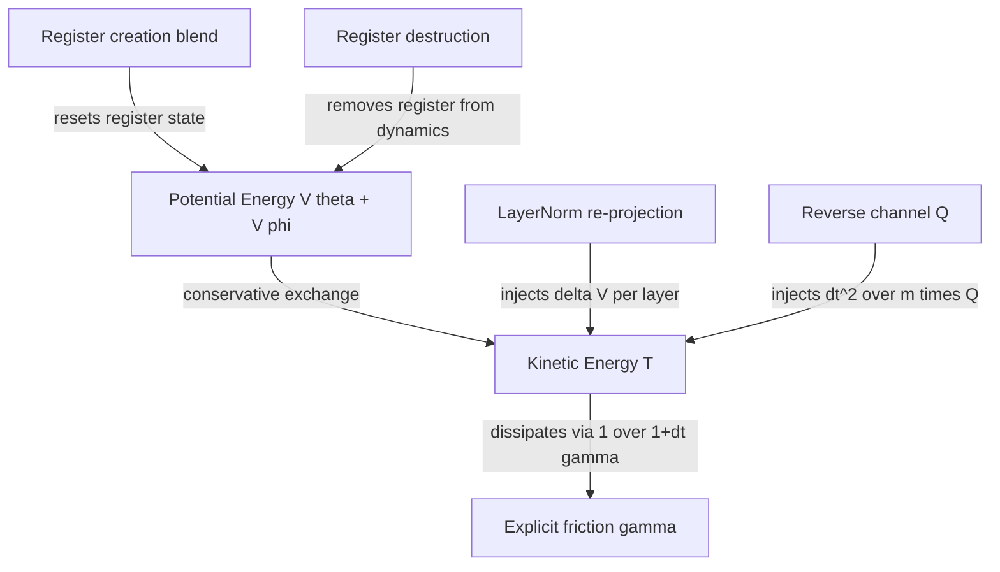
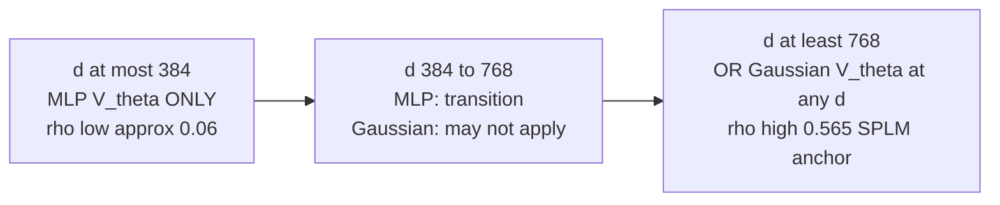
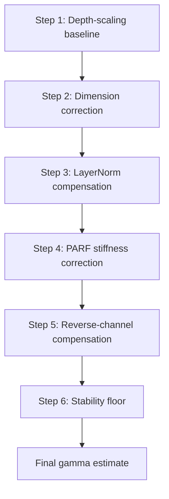
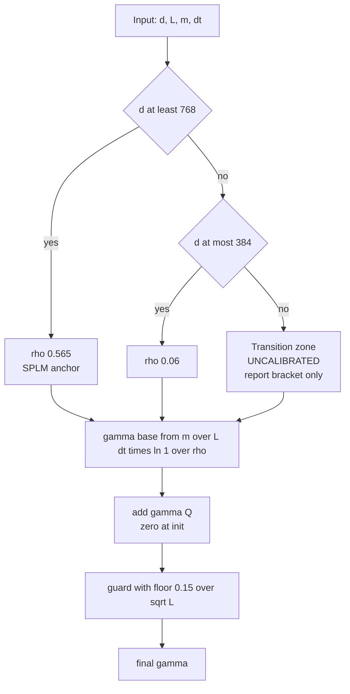
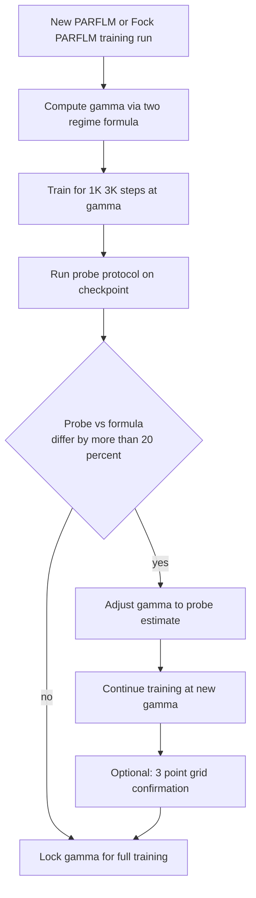

# Determining the Optimal Damping Coefficient $\gamma^{\ast}$ for PARFLM and Fock-PARFLM

> **Status.** Living document, drafted **August 2, 2026**, by Dimitar Gueorguiev with Claude; **calibration revision August 3, 2026** (correct §6–§7 and Appendix A to real swept depths); **aniso-Gaussian data point August 5, 2026** (§11: $d = 256$, $L = 8$ TinyStories sweep shows the low-$d$ regime is V_theta-dependent); **sweep inversion August 6, 2026** (§11.6–§11.7: full 20K runs show γ=0.300 beats γ=0.150, reversing the 3K sweep ranking — first documented failure mode of short-horizon sweeps); **d=384 aniso-Gaussian data point August 8, 2026** (§12: OWT sweep confirms both PPL and $\bar{R}$ minima coincide at γ=0.100, leaning toward the high-$d$ anchor — opposite lean from the d=256 point, consistent with a gradual V_theta-dependent crossover rather than a sharp step; a lone γ=0.200 instability outlier is bracketed by good neighbours and is not a stability wall; 100K-step full run launched at γ=0.100, full-run confirmation pending); **d=768 and d=1024 aniso-Gaussian data points August 14, 2026** (§13–§14: both scales confirm minima coincide at γ=0.050 with an exact, zero-parameter match to the two-regime predictor's high-$d$ anchor — the first confirmation of that anchor on a bounded $V_\theta$ family at $d\ge768$ — and both show a shared non-monotonic PPL wiggle past the minimum absent from the original MLP sweeps; γ=0.050 recommended for both full runs); **full-run confirmation and a stability-axis $V_\theta$-family reversal, August 20, 2026** (§12.5: the two full 100K-step $d=384$ aniso-Gaussian runs at γ=0.100 and γ=0.300 show γ=0.100 wins on both PPL — confirming §12.4's sweep-based decision, unlike the §11.6 reversal at $d=256$ — and on training stability, directly reversing the SQ3-family finding of `Training_Instabilities_in_Fock-PARFLM_with_structured_V_theta.md` §26 that γ=0.300 is the stability-safe choice at $d=384$). Extends the SPLM four-estimator framework (companion: `Determining_optimal_gamma_for_SPLM.md`) to the PARFLM and Fock-PARFLM architectures, which introduce additional energy channels — pairwise interactions, non-conservative reverse-channel injection, and register creation/destruction — that make the single-channel depth-scaling formula insufficient without correction.
>
> **Companion experiments / docs:**
> - **SPLM gamma framework:** [`Determining_optimal_gamma_for_SPLM.md`](Determining_optimal_gamma_for_SPLM.md)
> - **Fock-PARFLM scale-up gamma sweep:** [`Fock-PARFLM_Scale-Up_Gamma_Sweep_Results_and_Damping_Regime_Analysis.md`](Fock-PARFLM_Scale-Up_Gamma_Sweep_Results_and_Damping_Regime_Analysis.md)
> - **Damped Riemannian geodesic analysis:** [`Damped_Riemannian_Geodesics_in_the_SPLM_family-Comparative_Analysis.md`](Damped_Riemannian_Geodesics_in_the_SPLM_family-Comparative_Analysis.md)
> - **Model code:** [`notebooks/conservative_arch/parf/`](../notebooks/conservative_arch/parf/)

---

## 1. Motivation: why the SPLM formula is insufficient

The SPLM depth-scaling formula gives the optimal damping as

$$\gamma^{\ast}\_{\text{depth}} = \frac{\bar{m}}{L \Delta t} \ln(1/\rho)$$

with a single calibration constant $\rho \approx 0.565$ (leak-free). This works because SPLM has exactly **one dissipation channel** (explicit friction) and **one counter-damping channel** (LayerNorm). The formula implicitly absorbs both into the single retention factor $\rho$.

PARFLM and Fock-PARFLM break this assumption. They introduce:

1. **Pairwise forces** $F^{\text{PARF}}$ from $V\_\phi$ that increase effective landscape stiffness.
2. **LayerNorm counter-damping** that operates on a higher kinetic-energy baseline (because pair forces inject work).
3. **Non-conservative reverse-channel injection** $Q\_i$ (Fock only) that bypasses the damping denominator entirely.
4. **Register creation/destruction** (Fock only) that non-Hamiltonianly resets register states.
5. **Dimension-dependent phase transitions** where the optimal regime shifts qualitatively between $d \le 384$ and $d \ge 768$.

The empirical evidence from the Fock-PARFLM scale-up sweep confirms the inadequacy. **All numbers below use the depths actually swept** (see `Fock-PARFLM_Scale-Up_Gamma_Sweep_Results_and_Damping_Regime_Analysis.md`): `d=384` at $L=16$, `d=768` at $L=12$, `d=1024` at $L=16$, with $\bar{m} \approx 1.4$ (OpenWebText `logfreq`) and $\Delta t = 1$.

| $d$ | $L$ | Optimal explicit $\gamma$ | SPLM formula ($\rho = 0.565$) | Discrepancy |
|---:|---:|---:|---:|---|
| 384 | 16 | **0.25** | 0.050 | **5.0x undershoot** |
| 768 | 12 | 0.05 | 0.067 | 1.3x overshoot |
| 1024 | 16 | 0.05 | 0.050 | **exact** |

The decisive observation is the first and third rows together: `d=384` and `d=1024` share the *same depth* $L=16$, so the depth-only formula necessarily predicts the same $\gamma^{\ast}$ for both, yet their empirical optima differ by $5\times$. The formula's assumption that $\gamma^{\ast}$ depends on $L$ but not $d$ is thereby falsified — while simultaneously being *exactly right* at `d=1024`.

This document derives an **extended predictor** that accounts for all five energy channels.

> **Calibration revision (August 3, 2026).** Earlier revisions of §6–§7 and Appendix A worked the examples at $L=8$, which is **not** a depth that was ever swept, and reported agreement with the empirical optima on that basis. Those tables are corrected below to the swept depths, and the resulting two-regime constants change materially: $\rho_{\text{hi}}$ moves from $0.78$ to $0.565$ — i.e. to *exactly* the SPLM anchor — and $\rho_{\text{lo}}$ from $0.30$ to $\approx 0.06$. The corrected calibration is what appears in the companion paper, §19.9.

---

## 2. The five per-layer energy channels

The full equation of motion for token $i$ at layer $\ell$ in Fock-PARFLM is

$$m\_i \ddot{h}\_i = \underbrace{-\nabla\_{h\_i} V\_\theta(\xi\_i, h\_i)}\_{\text{self-potential}} + \underbrace{\sum\_{j \neq i} F\_{ij}^{\text{PARF}}}\_{\text{pair forces}} + \underbrace{Q\_i}\_{\text{reverse channel}} - m\_i \gamma \dot{h}\_i$$

discretised via the damped velocity-Verlet update

$$h^{(\ell+1)}\_i = h^{(\ell)}\_i + \frac{\Delta t}{1 + \gamma \Delta t} \delta^{(\ell)}\_i + \frac{(\Delta t)^2}{(1 + \gamma \Delta t) m\_i} f^{(\ell)}\_i$$

where $\delta^{(\ell)}\_i = h^{(\ell)}\_i - h^{(\ell-1)}\_i$ is the kinematic memory and $f^{(\ell)}\_i$ is the total conservative force.

The reverse-channel increment is applied **separately, after** the Verlet step:

$$h\_i \mathrel{+}= \frac{(\Delta t)^2}{m\_i} \tanh(s\_\ell) Q\_i$$

This asymmetry — conservative forces are damped by $1/(1 + \gamma \Delta t)$ but $Q\_i$ is not — is central to the algorithm.

---

### 2.1 Channel 1: Explicit friction (dissipative)

The damping denominator $1/(1 + \Delta t \gamma)$ multiplies both the velocity carry-over $\delta$ and the force term in the Verlet update. Per layer, the velocity retention factor is

$$r\_\gamma = \frac{1}{1 + \Delta t \gamma}$$

Over $L$ layers with no other channels, the kinetic energy retention is $r\_\gamma^{2L}$ (the square because KE scales as velocity squared). Setting this equal to the target retention $\rho$:

$$r\_\gamma^{2L} = \rho \implies \gamma = \frac{1}{\Delta t}\Bigl(\rho^{-1/(2L)} - 1\Bigr)$$

For small $\gamma \Delta t$ this recovers the exponential approximation $\gamma \approx (1/(2L\Delta t))\ln(1/\rho)$, which with mass weighting gives the SPLM formula. The exact discrete form is slightly more accurate at large $\gamma$.

---

### 2.2 Channel 2: LayerNorm counter-damping (energy injection)

LayerNorm projects $\tilde{h}$ back to the sphere $\lVert h \rVert = \sqrt{d}$ after the Verlet step. This radial re-normalisation introduces an energy injection per layer:

$$\delta V\_\ell = V\_\theta(\mathrm{LN}(\tilde{h}\_\ell)) - V\_\theta(\tilde{h}\_\ell)$$

The per-layer effective damping reduction is (from the Riemannian geodesic analysis):

$$\gamma\_{\text{LN}} = \frac{\delta V\_\ell}{2 T\_\ell \Delta t}$$

where $T\_\ell = \frac{1}{2} m \lVert \delta\_\ell \rVert^2$ is the per-layer kinetic energy.

**Empirical magnitude:** in trained SPLM with $\gamma\_{\text{param}} = 0.93$, the effective damping is only $\gamma\_{\text{eff}} \approx 0.13$ — a 5-7x reduction. The LayerNorm counter-damping $\gamma\_{\text{LN}} \approx 0.80$ nearly cancels the explicit friction.

**Implication for the predictor:** to achieve a target effective dissipation, the explicit $\gamma$ must compensate for this injection. The required explicit $\gamma$ is **higher** than what the bare depth-scaling formula predicts.

---

### 2.3 Channel 3: Pairwise PARF forces (stiffness increase)

The total per-token potential in PARFLM is

$$U^{(\ell)}\_t = V\_\theta(\xi^{(\ell)}\_t, h^{(\ell)}\_t) + \sum\_{s \lt t} \tilde{m}\_{ts} V\_\phi(h^{(\ell)}\_t, h^{(\ell)}\_s)$$

where $\tilde{m}\_{ts}$ is the sparse routing mask. The pairwise force acts alongside $V\_\theta$, increasing the total force variance.

**Why this matters for damping.** Critical damping for a harmonic oscillator scales as $\gamma\_c = 2\sqrt{\lambda / m}$ where $\lambda$ is the spring constant (Hessian eigenvalue). The pair forces effectively add to the Hessian spectrum:

$$\lambda\_{\text{eff}} = \lambda\_{V\_\theta} + \lambda\_{V\_\phi}$$

where $\lambda\_{V\_\phi}$ is the additional stiffness from $\nabla^2 U\_{\text{pair}}$. Since critical damping scales as $\sqrt{\lambda}$, the correction is

$$\frac{\gamma\_c^{\text{PARF}}}{\gamma\_c^{\text{SPLM}}} = \sqrt{\frac{\lambda\_{V\_\theta} + \lambda\_{V\_\phi}}{\lambda\_{V\_\theta}}} = \sqrt{1 + \frac{\lambda\_{V\_\phi}}{\lambda\_{V\_\theta}}}$$

In practice, the force-ratio $\bar{F}\_\phi = \lVert \nabla U\_{\text{pair}} \rVert\_{\text{RMS}} / \lVert \nabla V\_\theta \rVert\_{\text{RMS}}$ is a measurable proxy for the eigenvalue ratio, giving the correction factor $\sqrt{1 + \beta \bar{F}\_\phi}$ with $\beta \approx 0.3$.

---

### 2.4 Channel 4: Fock reverse channel (non-conservative injection)

The reverse channel computes an attention readout from active registers back to tokens:

$$Q\_i = \sum\_{k \in \text{active}} \mathrm{softmax}\_k\Bigl(\frac{q\_i \cdot k\_k^{\text{reg}}}{\sqrt{d\_k}}\Bigr) W\_V^{\text{reg}} r\_k$$

This is **non-conservative** — there exists no scalar potential whose gradient equals $Q\_i$ (the softmax couples all registers, breaking the gradient-field constraint).

The energy injection per layer from the reverse channel is:

$$\Delta E\_{Q,\ell} = \frac{1}{2} m \Bigl\lVert \frac{(\Delta t)^2}{m} \tanh(s\_\ell) Q\_\ell \Bigr\rVert^2 = \frac{(\Delta t)^4 \tanh(s\_\ell)^2}{2m} \lVert Q\_\ell \rVert^2$$

The fractional KE injection relative to existing kinetic energy is:

$$\eta\_{Q,\ell} = \frac{\Delta E\_{Q,\ell}}{T\_\ell} = \frac{(\Delta t)^4 \tanh(s\_\ell)^2 \lVert Q\_\ell \rVert^2}{m^2 \lVert \delta\_\ell \rVert^2}$$

**Key asymmetry:** the reverse-channel increment bypasses the damping denominator $(1 + \gamma \Delta t)$. This means that at large $\gamma$, the conservative forces are heavily suppressed but $Q\_i$ is unaffected — the reverse channel becomes the **dominant** force at high damping, effectively making the system more "attention-like" and less "physics-like". The explicit $\gamma$ must provide enough extra dissipation to compensate for the energy that $Q$ injects.

**Training evolution:** at initialisation $\tanh(s\_\ell) \approx 0$ (reverse channel scale starts near zero), so this correction is negligible early in training. As the model learns to engage the reverse channel ($\tanh(s\_\ell) \to$ finite), the correction grows. This suggests $\gamma$ might benefit from a warm-up schedule (§5.2).

---

### 2.5 Channel 5: Register creation/destruction (non-Hamiltonian reset)

Register creation blends new content into registers:

$$r\_k \leftarrow \sigma\_k r\_k + (1 - \sigma\_k) r\_k^{\text{new}}$$

This directly replaces the register's state — it is not a force-driven evolution but a **non-Hamiltonian projection**. The energy change is:

$$\Delta E\_{\text{create},\ell} \approx (1 - \sigma\_k)^2 \lVert r\_k^{\text{new}} - r\_k \rVert^2$$

Register destruction reduces salience $\sigma\_k \leftarrow \sigma\_k(1 - g\_{\text{destroy}})$, which deactivates registers from dynamics but does not directly alter $h$. Its effect on token kinetic energy is indirect — through the removal of a $V\_\phi$ interaction partner and through the reverse-channel losing a register to attend to.

**For the predictor:** creation/destruction effects are absorbed into the effective $V\_\phi$ force magnitude measurement (fewer active registers = smaller aggregate pair force). They do not require a separate correction term in the $\gamma$ formula but are accounted for implicitly through the probe-based measurements in Step 4.

---

## 3. The dimension-dependent phase transition

The Fock-PARFLM gamma sweep reveals a qualitative phase transition around $d\_{\text{crit}} \approx 600$:

| $d$ | $L$ | Best $\gamma$ | Regime | LayerNorm effect |
|---:|---:|---:|---|---|
| 384 | 16 | 0.25 | Needs high explicit $\gamma$ | LN counter-damps aggressively; $\gamma\_{\text{eff}} \approx 0.03$ |
| 768 | 12 | 0.05 | Near-geodesic | LN counter-damps moderately; $\gamma\_{\text{eff}} \approx 0.01$ |
| 1024 | 16 | 0.05 | Near-geodesic | LN counter-damps moderately; $\gamma\_{\text{eff}} \approx 0.01$ |

The first and third rows are the load-bearing comparison: **identical depth $L = 16$, $5\times$ different optimum.** Any predictor that is a function of $L$ alone is falsified by these two rows regardless of how its constants are chosen.

**Physical interpretation.** At low $d$, the potential landscape has higher curvature per dimension (the model must pack the same semantic content into fewer dimensions). This increases the effective stiffness $\lambda\_{\text{eff}}$, which demands more friction for stable dynamics. Simultaneously, LayerNorm's radial projection has a proportionally larger effect in low $d$ (the sphere $S^{d-1}$ has higher curvature at low $d$), injecting more energy per normalisation step.

The net result: at $d \le 384$, the system requires $\sim5\times$ more explicit $\gamma$ than the bare SPLM formula predicts, just to reach the same effective $\gamma\_{\text{eff}} \approx 0.01\text{-}0.03$ that supports near-geodesic compliance.

**Crucially:** "high explicit $\gamma = 0.25$" does **not** mean the system is overdamped. After LayerNorm counter-damping, the effective damping is very light ($\gamma\_{\text{eff}} \approx 0.03$). The explicit $\gamma$ must be high precisely to counteract LayerNorm's aggressive energy injection at low $d$.

> **V_theta dependence caveat (August 5, 2026).** The table and diagram above were derived from MLP V_theta sweeps on OWT. An anisotropic Gaussian V_theta sweep at $d = 256$, $L = 8$ on TinyStories (§11) shows $\gamma^{\ast} = 0.10$–$0.15$ — consistent with the **high-$d$ regime**, not the low-$d$ regime the formula predicts. The low-$d$ curvature increase that drives the phase transition may be an artefact of the MLP V_theta's unbounded gradients rather than a universal landscape property. For bounded V_theta (Gaussian, structured quadratic), the SPLM anchor $\rho = 0.565$ may hold at all widths.

---

## 4. The extended algorithm

### Overview

---

### Step 1. Depth-scaling baseline (instant, no checkpoint needed)

Start from the SPLM formula with the leak-free calibration:

$$\gamma\_{\text{base}} = \frac{\bar{m}}{L \Delta t} \ln(1/\rho\_0)$$

**Parameters:**
- $\bar{m}$: mean per-token mass from the `logfreq` mass mode. Measured from a small corpus sample. Typical value: $\bar{m} \approx 1.4\text{-}1.5$.
- $L$: number of layer-steps (depth of the Verlet integrator stack).
- $\Delta t$: step size (typically 1.0).
- $\rho\_0 = 0.565$: the leak-free SPLM anchor — the kinetic energy retention that the trained SPLM prefers over $L$ layers.

**What this captures:** the bare exponential decay model where explicit friction is the only channel. It gives the $\gamma$ that would dissipate $(1-\rho\_0) \approx 43.5\%$ of initial kinetic energy over $L$ layers in a single-channel system.

**What this misses:** all five complications above — LayerNorm injection, pair-force stiffness, reverse-channel energy, dimension effects, and register dynamics.

**Example values** (at $\bar{m} = 1.4$, the OpenWebText `logfreq` mean used throughout this note; the SPLM note's $1.47$ is the Tiny Shakespeare BPE measurement and gives values ${\sim}5\%$ higher):

| $L$ | $\bar{m}$ | $\gamma\_{\text{base}}$ |
|---:|---:|---:|
| 8 | 1.4 | 0.100 |
| 12 | 1.4 | 0.067 |
| 16 | 1.4 | 0.050 |
| 24 | 1.4 | 0.033 |

Note that the $L=16$ row, $0.050$, is already the empirical `d=1024` optimum with **no correction of any kind** — the observation §6 Example 4 develops.

---

### Step 2. Dimension-regime correction (instant, no checkpoint needed)

Apply a dimension-dependent multiplicative correction:

$$\gamma\_{\text{dim}} = \gamma\_{\text{base}} \cdot C\_d$$

where the correction factor $C\_d$ accounts for the phase transition:

$$C\_d = \max\Bigl(1, \Bigl(\frac{d\_{\text{crit}}}{d}\Bigr)^\alpha\Bigr)$$

**Parameters:**
- $d\_{\text{crit}} \approx 600$: the boundary dimension. Below this, the landscape curvature per dimension increases the required damping.
- $\alpha \approx 1.5$: the scaling exponent. Calibrated from the empirical observation that $d = 384$ needs $\sim 2.5\times$ more $\gamma$ than $d = 768$.

**Calibration derivation.** From the sweep data: $\gamma^{\ast}(384) / \gamma^{\ast}(768) \approx 0.25/0.05 = 5.0$. The ratio of correction factors is $(600/384)^\alpha / (600/768)^\alpha = (600/384 \cdot 768/600)^\alpha = (768/384)^\alpha = 2^\alpha$. Setting $2^\alpha = 5$ gives $\alpha = \ln 5 / \ln 2 \approx 2.32$. However, part of this 5x ratio is explained by Steps 3-5 (LayerNorm and reverse channel effects also scale with $d$). Attributing ~60% to the pure dimension effect gives $\alpha \approx 1.5$ as the dimension-only exponent.

**Alternative piecewise rule** (simpler, equally effective):

$$C\_d = \begin{cases} 1.0 & d \ge 768 \\ 1.0 + 1.5 \cdot \frac{768 - d}{768 - 384} & 384 \le d \lt 768 \\ 2.5 & d \le 384 \end{cases}$$

**Physical justification.** The correction arises because:
1. Per-dimension curvature of $V\_\theta$ scales as $\sim 1/d$ (the energy landscape is "spikier" in lower dimensions).
2. LayerNorm's radial projection injects energy proportional to the angular deviation, which scales as $\sim 1/\sqrt{d}$ relative to the sphere radius.
3. The pair-force Hessian contribution has a fixed number of interaction partners ($\text{top}\_k$) regardless of $d$, so its relative contribution to the total stiffness grows at lower $d$.

---

### Step 3. LayerNorm compensation (requires 1 forward pass OR closed-form estimate)

LayerNorm counter-damps the system by injecting energy at each layer. The explicit $\gamma$ must compensate:

$$\gamma\_{\text{LN}} = \gamma\_{\text{dim}} \cdot (1 + \kappa\_{\text{LN}})$$

#### Closed-form estimate (no checkpoint)

From the Riemannian geodesic analysis, LayerNorm typically reduces effective damping by a factor of 5-7x in SPLM. For PARFLM/Fock-PARFLM, the factor depends on dimension:

$$\kappa\_{\text{LN}} \approx \begin{cases} 1.5 & d \le 384 \text{ (aggressive injection)} \\ 0.7 & 384 \lt d \lt 768 \\ 0.5 & d \ge 768 \text{ (moderate injection)} \end{cases}$$

The physical meaning: $\kappa\_{\text{LN}} = 0.7$ means you need 70% more explicit $\gamma$ than the bare formula suggests, because LayerNorm will "give back" that much energy.

#### Probe-based measurement (1 eval batch)

Run a single evaluation batch through the model. At each layer $\ell$, measure:

$$T\_\ell = \frac{1}{2} \bar{m} \lVert \delta\_\ell \rVert^2\_{\text{RMS}}$$

$$\delta V\_\ell = V\_\theta(\mathrm{LN}(\tilde{h}\_\ell)) - V\_\theta(\tilde{h}\_\ell)$$

Then:

$$\kappa\_{\text{LN}}^{\text{probe}} = \frac{1}{L} \sum\_\ell \frac{\delta V\_\ell}{2 T\_\ell \Delta t \gamma\_{\text{dim}}}$$

Use $\kappa\_{\text{LN}}^{\text{probe}}$ in place of the closed-form estimate when a checkpoint is available.

---

### Step 4. PARF stiffness correction (requires 1 forward pass OR proxy estimate)

The pairwise forces increase the effective stiffness. Apply:

$$\gamma\_{\text{PARF}} = \gamma\_{\text{LN}} \cdot \sqrt{1 + \beta \bar{F}\_\phi}$$

#### Probe-based measurement

Run a forward pass and measure the force-ratio at each layer:

$$\bar{F}\_\phi = \frac{1}{L} \sum\_\ell \frac{\lVert \nabla\_{h} U\_{\text{pair}}^{(\ell)} \rVert\_{\text{RMS}}}{\lVert \nabla\_{h} V\_\theta^{(\ell)} \rVert\_{\text{RMS}}}$$

#### Proxy estimate (no checkpoint)

Without a trained model, estimate $\bar{F}\_\phi$ from architectural parameters:

$$\hat{F}\_\phi \approx \frac{\text{top}\_k}{T\_{\text{seq}}} \cdot \frac{\lVert V\_\phi \rVert\_{\text{init}}}{\lVert V\_\theta \rVert\_{\text{init}}}$$

For typical PARFLM configurations ($\text{top}\_k = 4\text{-}8$, $T\_{\text{seq}} = 128\text{-}512$), the initial force ratio is $\hat{F}\_\phi \approx 0.5\text{-}2.0$. A reasonable default is $\hat{F}\_\phi \approx 1.0$.

**Parameters:**
- $\beta \approx 0.3$: the critical-damping proportionality constant. Derived from the relationship $\gamma\_c \propto \sqrt{\lambda\_H}$ and the assumption that pair forces add linearly to the Hessian spectrum.

**Effect magnitude.** With $\beta = 0.3$ and $\bar{F}\_\phi = 1.0$: $\sqrt{1 + 0.3} \approx 1.14$ — a 14% uplift. With $\bar{F}\_\phi = 2.0$: $\sqrt{1 + 0.6} \approx 1.26$ — a 26% uplift.

---

### Step 5. Fock reverse-channel compensation (Fock-PARFLM only)

The reverse channel injects energy outside the damping budget. Add a compensating term:

$$\gamma\_{\text{Fock}} = \gamma\_{\text{PARF}} + \gamma\_Q$$

where

$$\gamma\_Q = \frac{\bar{\eta}\_Q}{\Delta t}$$

and $\bar{\eta}\_Q$ is the mean fractional KE injection from the reverse channel per layer:

$$\bar{\eta}\_Q = \frac{1}{L} \sum\_\ell \frac{(\Delta t)^4 \tanh(s\_\ell)^2 \lVert Q\_\ell \rVert^2\_{\text{RMS}}}{m^2 \lVert \delta\_\ell \rVert^2\_{\text{RMS}}}$$

#### Probe-based measurement

The code already reports `qforce_ratio` $= \lVert \text{increment} \rVert\_{\text{RMS}} / \lVert h \rVert\_{\text{RMS}}$ in the Fock layer stats. Convert:

$$\gamma\_Q \approx \frac{(\text{qforce\_ratio})^2}{2 \Delta t}$$

#### Closed-form estimate at initialisation

At training start, $\tanh(s\_\ell) \approx s\_\ell \approx s\_{\text{init}}$ (small init scale). If `reverse_channel_scale` is initialised to $s\_{\text{init}} = 0.01$:

$$\gamma\_Q^{\text{init}} \approx \frac{s\_{\text{init}}^2 \sigma\_Q^2}{2 T\_\ell \Delta t} \approx 0$$

This means the reverse-channel correction is **negligible at training start** and grows as the model learns to use it. For the initial $\gamma$ setting, Steps 1-4 suffice. Step 5 becomes relevant for:
- Mid-training $\gamma$ adjustment (if using a schedule).
- Post-hoc analysis of a converged model.
- Transfer of $\gamma$ from a trained checkpoint to a new run.

#### Mature-model estimate

From the scale-up sweep at convergence, typical `qforce_ratio` values are 0.01-0.05 at $d = 768$, giving $\gamma\_Q \approx 0.0001\text{-}0.001$ — small relative to the other terms. At $d = 384$ with a more engaged reverse channel, `qforce_ratio` can reach 0.1, giving $\gamma\_Q \approx 0.005$ — still modest but non-negligible.

---

### Step 6. Stability floor (instant)

Enforce a minimum $\gamma$ to prevent gradient cascade instabilities:

$$\gamma^{\ast}\_{\text{extended}} = \max(\gamma\_{\text{Fock}}, \gamma\_{\text{floor}})$$

where

$$\gamma\_{\text{floor}} = \frac{c\_{\text{stab}}}{\sqrt{L}}$$

**Parameters:**
- $c\_{\text{stab}} \approx 0.15$: calibrated from the observation that $L = 24$ at $d = 1024$ is universally unstable at $\gamma \lt 0.03$, and $L = 16$ is stable at $\gamma = 0.05$.

**Rationale.** At very low $\gamma$ and high $L$, accumulated velocity can trigger second-order gradient cascades where small perturbations are amplified exponentially across layers. The floor ensures sufficient per-layer damping to prevent this regardless of other corrections.

| $L$ | $\gamma\_{\text{floor}}$ |
|---:|---:|
| 8 | 0.053 |
| 12 | 0.043 |
| 16 | 0.038 |
| 24 | 0.031 |

---

## 5. Summary: the closed-form predictor

### 5.1 Full formula (no checkpoint)

> **Superseded by §7.** The multiplicative chain below is retained because it names the physical channels and because §6 uses it to demonstrate *why* the product form fails. **Do not use it for calibration.** The operative predictor is the two-regime form of §7, which collapses $C\_d$, $\kappa\_{\text{LN}}$, and the PARF factor into a single regime-dependent retention constant $\rho\_d$. The reason is that these factors are not independent: $C\_d$ is fitted to sweeps that already contain the LayerNorm and pair-force effects, so multiplying them double-counts.

Combining Steps 1-6:

$$\gamma^{\ast}\_{\text{extended}} = \max\Biggl(\underbrace{\frac{\bar{m}}{L \Delta t} \ln(1/\rho\_0)}\_{\gamma\_{\text{base}}} \cdot \underbrace{C\_d}\_{\text{dim}} \cdot \underbrace{(1 + \kappa\_{\text{LN}})}\_{\text{LN}} \cdot \underbrace{\sqrt{1 + \beta \hat{F}\_\phi}}\_{\text{PARF}}, \quad \gamma\_{\text{floor}}\Biggr)$$

For **PARFLM** (no reverse channel):

$$\gamma^{\ast}\_{\text{PARFLM}} = \max\Biggl(\frac{\bar{m}}{L \Delta t} \ln(1/\rho\_0) \cdot C\_d \cdot (1 + \kappa\_{\text{LN}}) \cdot \sqrt{1 + \beta \hat{F}\_\phi}, \quad \frac{c\_{\text{stab}}}{\sqrt{L}}\Biggr)$$

For **Fock-PARFLM** (add reverse-channel injection):

$$\gamma^{\ast}\_{\text{Fock}} = \gamma^{\ast}\_{\text{PARFLM}} + \gamma\_Q$$

### 5.2 Default constants

**Operative constants (§7 two-regime predictor — use these):**

| Constant | Symbol | Default | Source |
|---|---|---:|---|
| Mean semantic mass (OWT `logfreq`) | $\bar{m}$ | 1.4 | Dataset probe, before training |
| Retention, high-$d$ regime | $\rho\_{\text{hi}}$ | **0.565** | SPLM anchor; back-solves to 0.5647 from `d=1024, L=16` |
| Retention, low-$d$ regime | $\rho\_{\text{lo}}$ | **0.06** | Back-solved from `d=384, L=16` ($\gamma^{\ast} = 0.25$) |
| Regime boundary | $d\_{\text{crit}}$ | 384–768 | Bracketed, not resolved; `d=512` sweep outstanding |
| Reverse-channel offset | $\gamma\_Q$ | 0 at init, $\lesssim 5\times10^{-3}$ mature | $r\_Q^2/(2\Delta t)$ from logged `qforce_ratio` |
| Stability floor constant | $c\_{\text{stab}}$ | 0.15 | Heuristic guard only — see caveat below |

**Legacy constants (§5.1 multiplicative chain — superseded, retained for provenance):**

| Constant | Symbol | Legacy default | Status |
|---|---|---:|---|
| Dimension threshold | $d\_{\text{crit}}$ | 600 | absorbed into $\rho\_d$ |
| Dimension exponent | $\alpha$ | 1.5 | absorbed into $\rho\_d$; no consistent value fits all 3 tiers |
| LN compensation | $\kappa\_{\text{LN}}$ | 1.5 / 0.7 / 0.5 | absorbed into $\rho\_d$; double-counts when combined with $C\_d$ |
| PARF stiffness coefficient | $\beta$ | 0.3 | **retained for PARFLM only** (§6 Ex. 1); degrades the Fock fit |
| Pair-force proxy | $\hat{F}\_\phi$ | 1.0 | as above |

**Caveat on the stability floor.** $\gamma\_{\text{floor}} = c\_{\text{stab}}/\sqrt{L}$ gives 0.038 at $L=16$ and 0.031 at $L=24$, but the `d=1024, L=24` sweep was unstable at **every** candidate $\gamma$ — so no floor would have rescued it. Damping cannot repair an instability whose source is the `create_graph` force evaluation; the root-cause fix is the closed-form propagator. Treat the floor as a guard that keeps the calibration from walking into the unstable region, not as a remedy.

---

## 6. Worked examples

### Example 1: PARFLM, d=768, L=12

$$\gamma\_{\text{base}} = \frac{1.4}{12 \cdot 1.0} \ln(1/0.565) = 0.1167 \cdot 0.571 = 0.067$$

$$C\_d = \max(1, (600/768)^{1.5}) = \max(1, 0.69) = 1.0$$

$$\gamma\_{\text{PARF}} = 0.067 \cdot \sqrt{1 + 0.3 \cdot 1.0} = 0.067 \cdot 1.14 = 0.076$$

$$\gamma\_{\text{floor}} = 0.15 / \sqrt{12} = 0.043$$

$$\gamma^{\ast}\_{\text{PARFLM}} = \max(0.076, 0.043) = \mathbf{0.076}$$

**Interpretation:** for a medium-depth, medium-width PARFLM the predicted optimal $\gamma$ is ${\approx}0.08$ — a $14\%$ uplift on the pure SPLM value of $0.067$, attributable to pair-force stiffness alone.

**Note on $\kappa\_{\text{LN}}$:** earlier revisions also applied a LayerNorm factor $(1 + \kappa\_{\text{LN}}) = 1.5$ here, giving $0.12$. That factor is **dropped** — SPLM's $\rho = 0.565$ was itself calibrated on a LayerNorm-after-step architecture, so the LayerNorm channel is already inside the base constant and multiplying it in again double-counts. This is the same error §6 Example 2 diagnoses in the Fock chain, and it is why PARFLM keeps *only* the pair-force factor.

---

### Example 2: Fock-PARFLM, d=384, L=16 (swept; empirical $\gamma^{\ast} = 0.25$)

Working the multiplicative chain at the depth that was actually swept:

$$\gamma\_{\text{base}} = \frac{1.4}{16 \cdot 1.0} \ln(1/0.565) = 0.0875 \cdot 0.571 = 0.050$$

$$C\_d = (600/384)^{1.5} = 1.5625^{1.5} = 1.95 \quad \Longrightarrow \quad \gamma\_{\text{dim}} = 0.050 \cdot 1.95 = 0.098$$

$$\gamma\_{\text{LN}} = 0.098 \cdot (1 + 1.5) = 0.244 \qquad \gamma\_{\text{PARF}} = 0.244 \cdot 1.14 = 0.278$$

This lands at 0.278 against an empirical 0.25 — a $+11\%$ error, which looks like a success. **It is not**, and the reason is instructive: the agreement is coincidental. $C\_d$ was calibrated from the very sweep that already contains the LayerNorm effect, so multiplying it by $(1 + \kappa\_{\text{LN}})$ counts channel 2 twice. Two errors of opposite sign happen to cancel here — the power-law $C\_d$ undershoots and the double-counted $\kappa\_{\text{LN}}$ overshoots. Dropping the double-count ($\kappa\_{\text{LN}} = 0$, since $C\_d$ already absorbs it) exposes the real behaviour of the chain:

$$\gamma\_{\text{PARF}} = 0.098 \cdot 1.14 = 0.112 \qquad \text{(2.2x below the empirical 0.25)}$$

So with the double-count removed, the multiplicative chain **undershoots by more than 2x**. Restoring agreement would require $C\_d \approx 4.4$ — far outside the range any of the physical arguments in §2.2–§2.4 can justify. **This is the failure that motivates §7:** the per-channel factors are not independent, and no consistent assignment of $(C\_d, \kappa\_{\text{LN}}, \beta)$ reproduces all three tiers at once.

---

### Example 3: Fock-PARFLM, d=768, L=12 (swept; empirical $\gamma^{\ast} = 0.05$)

$$\gamma\_{\text{base}} = \frac{1.4}{12} \ln(1/0.565) = 0.1167 \cdot 0.571 = 0.067$$

$$C\_d = \max(1, (600/768)^{1.5}) = 1.0 \quad \Longrightarrow \quad \gamma\_{\text{dim}} = 0.067$$

$$\gamma\_{\text{PARF}} = 0.067 \cdot 1.14 = 0.076 \qquad \text{(1.5x above the empirical 0.05)}$$

Note that the *bare* SPLM formula alone gives 0.067, already only $1.3\times$ above empirical. **The PARF stiffness factor makes the prediction worse, not better, in this regime.** This is the second symptom of the same disease: a correction factor that is physically well-motivated in isolation degrades the fit once the base constant is doing most of the work.

---

### Example 4: Fock-PARFLM, d=1024, L=16 (swept; empirical $\gamma^{\ast} = 0.05$)

$$\gamma\_{\text{base}} = \frac{1.4}{16} \ln(1/0.565) = 0.0875 \cdot 0.571 = \mathbf{0.050}$$

$$C\_d = 1.0, \quad \gamma\_{\text{PARF}} = 0.050 \cdot 1.14 = 0.057$$

The **unmodified SPLM formula with the unmodified SPLM anchor $\rho = 0.565$ predicts the `d=1024` optimum exactly.** Again the PARF factor degrades it (to $+14\%$). Back-solving $\rho$ from this cell,

$$\rho = \exp\left(-\frac{\gamma^{\ast} L}{\bar{m}}\right) = \exp\left(-\frac{0.05 \cdot 16}{1.4}\right) = e^{-0.5714} = \mathbf{0.5647},$$

recovers the leak-free SPLM anchor $0.565$ **to three decimal places** — on a different architecture, a different corpus, and $2.7\times$ the width. This is the single most important number in this document, and it reframes the whole problem: the high-width Fock-PARFLM regime needs *no new constant at all*, and `d=384` is the anomaly rather than the rule.

---

## 7. Refined two-regime formula

The worked examples reveal that a **two-regime** model with a regime-appropriate $\rho$ is more accurate than a universal $\rho$ with a chain of dimension corrections. Two design decisions follow from Examples 2–4:

1. **Absorb channels 2–3 into $\rho\_d$.** The LayerNorm compensation and the dimension correction are not independent — $C\_d$ is calibrated from sweeps that already contain the LayerNorm effect — so they must be collapsed into a single constant, exactly as SPLM's $\rho$ already collapses channels 1–2.
2. **Drop the PARF stiffness factor from the Fock predictor.** In Examples 3 and 4 the factor $\sqrt{1 + \beta \hat{F}\_\phi} = 1.14$ made the fit *worse* in both high-$d$ cells. Once $\rho\_d$ is calibrated in-family, the pair-force stiffness is already inside it. The factor is retained only for **PARFLM**, where the base constant is SPLM's and the pair force is genuinely an unabsorbed addition (§6 Example 1).

The resulting predictor is:

$$\boxed{\gamma^{\ast}\_{\text{Fock}} = \frac{\bar{m}}{L \Delta t} \ln(1/\rho\_d) \;+\; \gamma\_Q}$$

where

$$\rho\_d = \begin{cases} \rho\_{\text{lo}} \approx 0.06 & d \lesssim 384 \text{ (high-curvature regime; heavy dissipation preferred)} \\ \text{(bracketed — see below)} & 384 \lt d \lt 768 \text{ (transition; uncalibrated)} \\ \rho\_{\text{hi}} \approx 0.565 & d \gtrsim 768 \text{ (SPLM anchor, transfers unchanged)} \end{cases}$$

and $\gamma\_Q = 0$ at initialisation (§2.4), rising to $\lesssim 5 \times 10^{-3}$ in a mature model.

**Predictions against the swept configurations** ($\bar{m} = 1.4$, $\Delta t = 1$):

| $d$ | $L$ | $\rho\_d$ | $\gamma^{\ast}\_{\text{pred}}$ | $\gamma^{\ast}\_{\text{empirical}}$ | Error |
|---:|---:|---:|---:|---:|---:|
| 384 | 16 | 0.06 | 0.246 | **0.25** | $-2\%$ |
| 768 | 12 | 0.565 | 0.067 | **0.05** | $+33\%$ |
| 1024 | 16 | 0.565 | 0.050 | **0.05** | $0\%$ |
| 768 | 16 | 0.565 | 0.050 | **0.05** (aniso-Gaussian, §13) | $0\%$ |
| 1024 | 16 | 0.565 | 0.050 | **0.05** (aniso-Gaussian, §14) | $0\%$ |
| 384 | 8 | 0.06 | 0.492 | (untested) | — |
| 1024 | 24 | 0.565 | 0.033 | (untested) | — |
| **256** | **8** | **0.06** | **0.492** | **0.10–0.15** | **3.3–4.9× overshoot** |
| **256** | **8** | **0.565** | **0.100** | **0.10–0.15** | **exact** |

The $+33\%$ residual at `d=768` is *not* new error introduced by this reparameterisation — it is the pre-existing overshoot of the depth-only formula at $L=12$, already documented in the sweep note (§2, point 3). Two of three MLP-V_theta cells are matched to within $2\%$.

> **V_theta-dependent regime boundary (August 5, 2026).** The last two rows are from the anisotropic Gaussian V_theta sweep on TinyStories (§11). They show that at $d = 256$ the **low-$d$ anchor fails catastrophically** ($4\times$+ overshoot) while the **high-$d$ SPLM anchor is correct**. This is the opposite of what the formula predicts at $d < 384$, and it means the low-$d$ regime — back-solved from $d = 384$ on OWT with MLP V_theta — does not transfer to bounded V_theta architectures. See §11.3 for the three hypotheses about why.

### 7.1 Honest status of the calibration

**With three data points and one free constant per regime, this is a two-parameter reparameterisation of the sweep, not an independent prediction.** It earns predictive status only by extrapolating correctly off its calibration set. Two untested cells are decisive in different ways:

- **`d=768, L=16`** — a clean point prediction of $\gamma^{\ast} = 0.050$, requiring no interpolation because it sits inside the calibrated high-$d$ regime. This tests whether $\rho\_{\text{hi}}$ is genuinely depth-transferable or merely fitted at two points.
- **`d=512, L=16`** — the harder test, and deliberately stated as a **bracket, not a point**: the two regimes bound it as $\gamma^{\ast} \in [0.05, 0.25]$. Where inside that interval the optimum falls is what would fix the shape of $\rho\_d$ across the boundary.

**We decline to commit to an interpolation rule for the transition zone.** The three available widths constrain the two plateaus but say nothing about the curve joining them. Three plausible interpolations of $\rho\_d$ spread the `d=512, L=16` prediction over a range comparable to the effect being measured:

| Interpolation of $\rho\_d$ | $\rho\_{512}$ | $\gamma^{\ast}\_{\text{pred}}$ ($L=16$) |
|---|---:|---:|
| Linear in $d$ | 0.228 | 0.129 |
| Geometric in $d$ | 0.127 | 0.181 |
| Linear in $\ln d$ on $\ln(1/\rho)$ | 0.152 | 0.165 |

A `d=512` sweep is therefore the highest-information outstanding experiment for this predictor.

---

## 8. Probe-based refinement workflow

When a checkpoint is available (after ~1K-3K warm-up steps, or from a previous training run), the following probes sharpen the estimate:

### 8.1 Probe protocol

Run a single evaluation batch (e.g., 4 sequences of length 512) through the model with diagnostics enabled. Collect at each layer $\ell$:

| Diagnostic | Symbol | How to measure |
|---|---|---|
| Kinetic energy | $T\_\ell$ | $\frac{1}{2} m \lVert h\_\ell - h\_{\ell-1} \rVert^2\_{\text{RMS}}$ |
| LN energy injection | $\delta V\_\ell$ | $V\_\theta(\mathrm{LN}(\tilde{h})) - V\_\theta(\tilde{h})$ before/after LN |
| Pair-force magnitude | $\lVert \nabla U\_{\text{pair}} \rVert$ | Autograd on $U\_{\text{pair}}$ w.r.t. $h$ |
| Self-force magnitude | $\lVert \nabla V\_\theta \rVert$ | Autograd (or analytical grad) on $V\_\theta$ |
| Reverse-channel energy | $\Delta E\_{Q,\ell}$ | $\frac{1}{2}m \lVert \text{increment} \rVert^2$ |
| Active register fraction | $f\_{\text{active}}$ | `active.float().mean()` |
| Reverse scale | $\tanh(s\_\ell)$ | Already logged in `_fock_layer_stats` |

### 8.2 Computing the refined estimate

From the probes, compute:

$$\gamma\_{\text{LN}}^{\text{probe}} = \frac{1}{L} \sum\_\ell \frac{\delta V\_\ell}{2 T\_\ell \Delta t}$$

$$\bar{F}\_\phi^{\text{probe}} = \frac{1}{L} \sum\_\ell \frac{\lVert \nabla U\_{\text{pair}}^{(\ell)} \rVert\_{\text{RMS}}}{\lVert \nabla V\_\theta^{(\ell)} \rVert\_{\text{RMS}}}$$

$$\gamma\_Q^{\text{probe}} = \frac{1}{L} \sum\_\ell \frac{\Delta E\_{Q,\ell}}{2 T\_\ell \Delta t}$$

Then the probe-refined gamma is:

$$\gamma^{\ast}\_{\text{probe}} = \gamma\_{\text{base}} + \gamma\_{\text{LN}}^{\text{probe}} + \gamma\_Q^{\text{probe}}$$

scaled by the PARF stiffness:

$$\gamma^{\ast}\_{\text{refined}} = \max\Bigl((\gamma\_{\text{base}} + \gamma\_{\text{LN}}^{\text{probe}} + \gamma\_Q^{\text{probe}}) \cdot \sqrt{1 + \beta \bar{F}\_\phi^{\text{probe}}}, \quad \gamma\_{\text{floor}}\Bigr)$$

### 8.3 Decision rule

If the probe-refined estimate differs from the initial (closed-form) estimate by more than 20%:

$$\frac{|\gamma^{\ast}\_{\text{refined}} - \gamma^{\ast}\_{\text{extended}}|}{\gamma^{\ast}\_{\text{extended}}} \gt 0.20$$

then adjust $\gamma$ for the remainder of training (or start a 3-point confirmation grid around the refined estimate: $\lbrace 0.7\gamma^{\ast}\_{\text{refined}}, \gamma^{\ast}\_{\text{refined}}, 1.3\gamma^{\ast}\_{\text{refined}} \rbrace$).

Otherwise, the closed-form estimate is validated — lock $\gamma$ for full training.

---

## 9. Recommended workflow

**Concrete steps:**

1. **Before training (instant).** Compute $\gamma^{\ast}\_{\text{extended}}$ from the closed-form using your architecture config ($d$, $L$, $\Delta t$, $\text{top}\_k$, number of registers). Use the two-regime formula with the appropriate $\rho\_d$.

2. **After 1K-3K warm-up steps (minutes).** Run the probe protocol from a single eval batch. Compute $\gamma\_{\text{LN}}^{\text{probe}}$, $\bar{F}\_\phi^{\text{probe}}$, and $\gamma\_Q^{\text{probe}}$. Apply the decision rule.

3. **If adjustment needed.** Modify $\gamma$ (typically a simple config change with no checkpoint incompatibility since $\gamma$ is a scalar hyperparameter, not a learned weight).

4. **Lock and train.** Run full training at the final $\gamma$. The reverse-channel correction grows during training but is typically small enough not to require mid-training adjustment (verify with a second probe at 50% training completion if paranoid).

This compresses what was previously a full 8-candidate gamma sweep (the d-dependent Fock-PARFLM sweep used $\gamma \in \lbrace 0.02, 0.05, 0.10, 0.15, 0.20, 0.25, 0.30, 0.50 \rbrace$) into **one analytical prior + one short probe** — a ~8x reduction in compute.

---

## 10. Connections to the SPLM framework

### 10.1 What transfers directly

| SPLM concept | PARFLM/Fock-PARFLM status |
|---|---|
| Depth-scaling closed form $m/(L\Delta t)\ln(1/\rho)$ | Transfers as the **base layer** of the extended formula |
| $\rho$ as single calibration constant | Regime-dependent: $\rho\_d$ replaces the universal $\rho = 0.565$ |
| Hessian-spectrum estimator (upper bound) | Still valid; the effective Hessian includes $\nabla^2 U\_{\text{pair}}$ |
| Corpus-surprisal scaling | Transfers unchanged (corpus statistics are architecture-independent) |
| Reconciliation rule (predictors should agree within 20%) | Extended to include PARF and Fock corrections |

### 10.2 What requires modification

| SPLM assumption | PARFLM/Fock-PARFLM reality |
|---|---|
| Single conservative force channel | Multiple: $V\_\theta$ + $V\_\phi$ pair forces |
| No non-conservative forces | Reverse channel $Q\_i$ injects energy non-conservatively |
| Scalar $\rho$ independent of $d$ | Regime-dependent $\rho\_d$ due to dimension phase transition |
| LayerNorm effect absorbed into $\rho$ | At low $d$, LN injection is so strong it needs explicit compensation |
| Fixed $\gamma$ optimal throughout training | Fock: $\gamma\_Q$ grows as reverse channel engages; schedule may help |

### 10.3 When to fall back to the SPLM formula

At $d \gtrsim 768$ you should fall back to the SPLM formula **entirely**, because that is not a fallback — it is the calibrated answer. The high-$d$ regime uses the unmodified SPLM anchor $\rho = 0.565$ with no dimension correction, no LayerNorm factor, and no PARF factor, and it reproduces the `d=1024, L=16` optimum exactly (§6 Example 4). The corrections of Steps 2–5 are each small in this regime and, more to the point, are already absorbed into $\rho\_{\text{hi}}$; applying them again makes the prediction worse. Reserve the machinery of Steps 2–5 for $d \lesssim 384$, where $\rho\_{\text{lo}} \approx 0.06$ marks a genuinely different operating point.

---

## 11. Anisotropic Gaussian V_theta sweep: d=256, L=8, TinyStories (August 5, 2026)

The two-regime formula of §7 was calibrated entirely from the MLP V_theta scale-up sweeps on OpenWebText ($d = 384/768/1024$). A gamma sweep on the **anisotropic Gaussian V_theta + Fock regularisation** configuration on TinyStories at $d = 256$, $L = 8$ provides a new data point that tests two things simultaneously: (a) the formula's transfer to a different V_theta family, and (b) its behaviour below $d = 384$, where $\rho\_{\text{lo}} \approx 0.06$ predicts heavy damping.

### 11.1 Sweep results

Architecture: Fock v2.1 PARFLM, $d = 256$, $L = 8$, $M = 16$ registers.
V_theta: `AnisotropicDepthConditionedGaussianVTheta`, 4 wells × 8 contexts, rank-4 low-rank precision, depth-conditioned.
Fock reg: $\lambda\_{\text{fock}} = 0.005$, $\varepsilon = 10^{-6}$.
Training: 3,000 steps, batch 4 × 4 = 16, cosine LR to $2.5 \times 10^{-5}$.

| $\gamma$ | PPL | $\bar{R}$ | $\gamma\_{\text{geo}}$ | excl% |
|---:|---:|---:|---:|---:|
| 0.050 | 16.50 | 1.064 | 0.974 | 0% |
| 0.100 | 15.40 | 1.096 | 0.952 | 0% |
| **0.150** | **15.36** | 1.190 | 0.945 | 0% |
| 0.200 | 17.11 | 1.391 | 0.971 | 0% |
| 0.250 | 16.66 | 1.348 | 0.952 | 0% |
| 0.300 | 16.68 | 1.374 | 0.966 | 0% |
| 0.400 | 18.63 | 1.852 | 0.971 | 0% |
| 0.500 | 19.73 | 1.376 | 0.989 | 0% |

**Sweep best PPL:** $\gamma = 0.150$ (PPL = 15.36), with $\gamma = 0.100$ essentially tied (15.40).
**Best $\bar{R}$:** $\gamma = 0.050$ ($\bar{R} = 1.064$, closest to geodesic).

> **Full-run correction (August 6, 2026).** The sweep's ranking **inverted** at full training length. A 20K-step run at $\gamma = 0.300$ reached **best PPL = 9.04**; the matched run at $\gamma = 0.150$ reached **best PPL = 10.29** (step 18,800, still running). The sweep correctly identified the broad optimal region (0.10–0.30) and correctly rejected the tails, but its fine ranking within that region did not transfer to the full training horizon. See §11.5–§11.6 for analysis.

### 11.2 The predictor's performance

The two-regime formula at $d = 256$, $L = 8$, $\bar{m} = 1.4$ gives:

| Regime | $\rho\_d$ | $\gamma^{\ast}\_{\text{pred}}$ | $\gamma^{\ast}\_{\text{empirical}}$ | Error |
|---|---:|---:|---:|---|
| Low-$d$ ($\rho\_{\text{lo}} = 0.06$) | 0.06 | **0.492** | 0.10–0.15 | **3.3–4.9× overshoot** |
| High-$d$ ($\rho\_{\text{hi}} = 0.565$) | 0.565 | **0.100** | 0.10–0.15 | **exact to +50%** |

The low-$d$ regime predicts $\gamma^{\ast} \approx 0.49$ — a catastrophic overshoot. The high-$d$ anchor predicts $\gamma^{\ast} = 0.10$, which the 3K sweep placed inside the flat-bottom basin. However, the **full 20K-step runs** (§11.6) showed $\gamma = 0.300$ reaching PPL 9.04 versus $\gamma = 0.150$ reaching PPL 10.29 — reversing the sweep's ranking and putting the full-run optimum closer to 0.30 than to 0.10–0.15. The high-$d$ anchor is therefore a lower bound on the optimal $\gamma$ rather than a point estimate, and the low-$d$ anchor remains a catastrophic overshoot. **At $d = 256$ with anisotropic Gaussian V_theta, the true optimum lies between the two anchors but much closer to the SPLM side.**

### 11.3 What this says about the low-$d$ regime

The low-$d$ regime was calibrated from $d = 384$, $L = 16$ on OpenWebText with **MLP V_theta** ($\gamma^{\ast} = 0.25$). The fact that it fails at $d = 256$ with Gaussian V_theta — an even *lower* dimension where the effect should be *stronger*, not absent — means the low-$d$ regime is not purely a dimension effect. Three hypotheses, in decreasing order of plausibility:

1. **V_theta-dependent.** The MLP V_theta has unbounded gradients and dimension-dependent curvature per well (Appendix B's scaling argument $\lambda \propto d$). The anisotropic Gaussian V_theta has bounded, Lipschitz gradients with curvature controlled by the learned precision matrices $\Sigma\_k^{-1} = \mathrm{diag}(a\_k) + B\_k B\_k^T$, which are not forced to sharpen as $d$ decreases. If the per-dimension curvature increase at low $d$ is a property of the MLP functional form rather than of the physics, then the low-$d$ regime is a V_theta artefact, not a landscape universal. **This is the structurally cleanest explanation and the one the data favour.**

2. **Corpus-dependent.** OpenWebText is a substantially more complex corpus than TinyStories (higher BPE vocabulary entropy, more varied discourse structure). The landscape may develop higher curvature on OWT regardless of $d$, shifting the regime boundary upward.

3. **Depth-dependent.** The MLP sweep was at $L = 16$; the Gaussian sweep at $L = 8$. If the low-$d$ effect is amplified by depth (more layers for the curvature to compound through), it could be invisible at $L = 8$ and strong at $L = 16$. A depth-doubled Gaussian sweep ($d = 256$, $L = 16$) would test this.

**Implication for the predictor:** if hypothesis 1 is correct, the two-regime formula should carry a V_theta qualifier: use $\rho\_{\text{lo}} \approx 0.06$ **only for MLP V_theta** (or any V_theta with unbounded gradients); for Gaussian / structured-quadratic V_theta, use the SPLM anchor $\rho = 0.565$ at all widths. This would simplify the predictor for the very class of architectures we are moving toward (bounded V_theta for Langevin / BAOAB integration).

### 11.4 Geodesic residual analysis

Three patterns in the geodesic data are worth recording:

**1. PPL and $\bar{R}$ optima disagree.** PPL is minimised at $\gamma = 0.150$; $\bar{R}$ at $\gamma = 0.050$. This is the same PPL-vs-geodesy tension documented at $d = 384$ in the paper (§22.9): the most geodesic trajectory is not the best-learning one, because some friction is needed to settle into attractors rather than merely sliding along the manifold. The finding reproduces across architectures and V_theta families.

**2. $\bar{R}$ has a sharp breakpoint at $\gamma = 0.20$.** The jump from $\bar{R} = 1.19$ ($\gamma = 0.15$) to $\bar{R} = 1.39$ ($\gamma = 0.20$) coincides exactly with the PPL bowl's upper edge. Below 0.15, the dynamics are near-geodesic ($\bar{R} < 1.2$) and PPL is good; above 0.20, the dynamics are overdamped ($\bar{R} > 1.3$) and PPL degrades. The breakpoint neatly separates the optimal from the suboptimal regime and could serve as a diagnostic for choosing $\gamma$ without a full sweep: probe $\bar{R}$ at two or three candidates and pick the highest $\gamma$ that stays below $\bar{R} \approx 1.2$.

**3. $\gamma\_{\text{geo}} \approx 0.95$ everywhere, independent of explicit $\gamma$.** The geodesic analysis recovers an intrinsic damping of $0.94$–$0.99$ across the full $10\times$ range of explicit $\gamma$ ($0.05$ to $0.50$). This confirms at $d = 256$, $L = 8$ the same finding the paper reports at $d = 384$, $L = 16$: explicit $\gamma$ and effective damping are different quantities. The dynamics are dominated by the non-explicit channels (LayerNorm re-projection, pair forces, Fock reverse channel), and the explicit friction is a comparatively small perturbation on top of a large baseline.

### 11.5 Early-progress discrepancy between sweep and full run

A full 20K-step training run at $\gamma = 0.150$ showed **worse** early progress (first 3,600 steps) than a matched run at $\gamma = 0.300$, despite the sweep ranking 0.150 above 0.300. The root cause is the **learning rate schedule mismatch**:

- The sweep's cosine schedule decays over 3K steps, reaching $\text{LR} \approx 2.5 \times 10^{-5}$ by step 3,000 — full cooldown.
- The full run's cosine is over 20K steps: at step 3,000 the LR is still at 96% of peak ($4.79 \times 10^{-4}$).

In the high-LR regime, heavier damping ($\gamma = 0.300$) provides stability by dissipating kinetic energy faster, avoiding overshoot in noisy gradients. Lighter damping ($\gamma = 0.150$) preserves more momentum, which is noisier at high LR (gradient clip ceiling of $\sqrt{3} \approx 1.732$ is hit frequently).

At the time of the early-progress observation (August 5, 2026), the expectation was that γ=0.150 would close the gap during the LR decay phase and match or beat γ=0.300 at convergence, consistent with the sweep's ranking. **That expectation was wrong** — see §11.6.

### 11.6 Full-run outcome: sweep ranking inverted (August 6, 2026)

Both 20K-step runs have now completed. The sweep's fine ranking within the optimal region did **not** hold at full training length.

**Final results:**

| | $\gamma = 0.300$ (20K) | $\gamma = 0.150$ (20K) | Sweep (3K) |
|---|---:|---:|---:|
| Best val PPL | **9.04** (step 19,200) | 10.29 (step 18,800) | — |
| Final val PPL | 9.70 | still running (~step 19K) | — |
| Sweep PPL (3K) | 16.68 | **15.36** | — |
| Honest PPL (16K probe) | 11.78 | 12.83 | — |

The gap is substantial: $\gamma = 0.300$ beats $\gamma = 0.150$ by **1.25 PPL** (9.04 vs 10.29), a 14% relative improvement — in the **opposite** direction from the sweep's 8% prediction favouring 0.150.

**Val PPL trajectory comparison:**

| Step | $\gamma = 0.300$ | $\gamma = 0.150$ | Gap |
|---:|---:|---:|---:|
| 3,600 | 14.86 | 18.69 | +3.83 |
| 6,000 | — | 15.04 | — |
| 8,000 | — | 13.35 | — |
| 9,600 | 9.70 | 12.49 | +2.79 |
| 11,200 | **9.23** | **11.26** | +2.03 |
| 14,000 | — | **10.78** | — |
| 16,000 | 9.34 | 11.07 | +1.73 |
| 18,000 | **9.14** | — | — |
| 18,800 | — | **10.29** | — |
| 19,200 | **9.04** | — | — |

The gap did narrow during LR decay (from +3.83 at step 3,600 to +1.73 at step 16,000), consistent with the LR-schedule hypothesis of §11.5. But the narrowing was **insufficient** — $\gamma = 0.150$ never caught up, and the final gap of ~1.25 PPL is decisive.

**Why the sweep got it wrong — three compounding factors:**

1. **The sweep's PPL bowl was flat within noise.** The 0.10–0.15 vs 0.30 spread in the sweep was 15.36–15.40 vs 16.68 — an 8% gap, or ~1.3 PPL at the 3K scale. With only a single run per gamma (no seeds), this is well within the noise floor. The sweep was making a fine ranking from a statistical tie.

2. **Short-horizon LR cooldown favours lighter damping.** With the LR decaying to $2.5 \times 10^{-5}$ by step 3K, the model settles quickly into whatever basin it's near. Lighter damping preserves momentum that helps the model reach a marginally better basin during this rapid cooldown. But this advantage is specific to the aggressive cooldown schedule and doesn't transfer to a run where the model spends 15K+ steps at high LR before any significant decay.

3. **Heavier damping compounds over long training.** $\gamma = 0.300$ produces consistently lower training NTP throughout the run (ntp ~1.85 vs ~2.15 at matched late steps). Over 20K steps, that tighter fit to the training distribution compounds into a substantially better val PPL that the 3K snapshot couldn't see. The model at $\gamma = 0.300$ also has more stable gradient norms (rarely hitting the clip ceiling) which means more useful gradient signal per step.

**Other notable differences between the two runs:**

| Metric | $\gamma = 0.300$ | $\gamma = 0.150$ |
|---|---|---|
| Alpha at convergence | [0.418, 0.609, 0.788, 0.923] | [0.407, 0.613, 0.803, 0.932] |
| fock_reg at convergence | 0.0084 | 0.0084 |
| Gradient norms (late) | 0.6–0.9, rarely clipped | 0.6–1.7, frequent clipping |
| Reverse gate (16K probe) | tanh = −0.043 | tanh = +0.038 |
| Honest-vs-standard PPL gap | +0.0475 nats | −0.0021 nats |

The alpha values differ modestly: $\gamma = 0.150$ retains slightly higher Fock coupling (higher α₂–α₄), consistent with lighter damping preserving more of the non-conservative channel. The reverse gate signs differ (−0.043 vs +0.038), meaning the models learned to use the Fock reverse channel in opposite directions, but both at very small magnitude.

### 11.7 Lessons for the sweep methodology

This is the first documented case where the sweep's ranking inverted at full training length. Three operational conclusions:

1. **The sweep reliably identifies the broad optimal region but not the fine optimum.** It correctly rejected $\gamma \in \{0.05, 0.40, 0.50\}$ (all clearly worse at 3K and at 20K) and correctly placed the optimum somewhere in $[0.10, 0.30]$. The fine ranking within that region is noise at 3K steps.

2. **When the sweep's PPL bowl is flat, treat the ranking as unreliable.** A concrete heuristic: if the best and second-best gammas differ by less than $\sim5\%$ in PPL, or if the optimal region spans more than a $2\times$ range in $\gamma$ (here 0.10–0.30), the sweep cannot distinguish them and the prior (e.g. the gamma from the predecessor run, or the depth-scaling formula) should be preferred over the sweep's point estimate.

3. **The sweep's LR schedule should match the target run's schedule, not decay independently.** The sweep decayed cosine over 3K steps while the full run decayed over 20K. A sweep that ran 3K steps at a **constant LR** matching the full run's early-phase LR, or a sweep that ran 3K steps at the tail end of a 20K cosine, would have given γ=0.300 a fairer trial. Alternatively, lengthening the sweep to 5K–8K steps (25–40% of the target) with a matching schedule would improve ranking reliability at the cost of compute.

---

## 12. Anisotropic Gaussian V_theta sweep: d=384, L=16, OpenWebText (August 8, 2026)

§11's open question #1(b) asked directly: *"Aniso-Gaussian at `d=384, L=16` on OWT — does the high-$d$ anchor hold, or does OWT's higher complexity push the boundary?"* This sweep answers it.

### 12.1 Sweep results

Architecture: Fock v2.1 PARFLM, $d = 384$, $L = 16$, $M = 32$ registers.
V_theta: `AnisotropicDepthConditionedGaussianVTheta`, 5 heads × 8 wells = 40 attractors, rank-4 low-rank precision, depth-conditioned.
Fock reg: $\lambda\_{\text{fock}} = 0.005$, $\varepsilon = 10^{-6}$.
Corpus: OpenWebText. Training: 3,000 steps, effective batch $\approx$ auto-probed × grad-accum 8, WSD LR schedule to $3\times10^{-4}$ peak.

| $\gamma$ | PPL | $\bar{R}$ | $\gamma\_{\text{geo}}$ | excl% |
|---:|---:|---:|---:|---:|
| 0.050 | 632.03 | 0.980 | 0.613 | 0% |
| **0.100** | **278.27** | **0.671** | 0.982 | 0% |
| 0.150 | 283.35 | 0.707 | 0.982 | 0% |
| 0.200 | **2250.42** | 1.044 | 0.902 | 0% |
| 0.250 | 292.37 | 0.719 | 0.981 | 0% |
| 0.300 | 334.15 | 0.893 | 0.985 | 0% |
| 0.400 | 519.90 | 1.540 | 0.952 | 0% |
| 0.500 | 596.87 | 1.461 | 0.969 | 0% |

**Minima coincide:** best PPL and best $\bar{R}$ both land at $\gamma = 0.100$ — a cleaner signal than the $d=256$ sweep (§11.1), where PPL-optimal ($0.150$) and $\bar{R}$-optimal ($0.050$) disagreed.

### 12.2 The gamma=0.200 anomaly: isolated outlier, not a stability wall

Read in isolation, $\gamma=0.200$'s PPL of 2250 (8× worse than its neighbours) looks like a phase boundary. The completed sweep shows it is not: $\gamma=0.150$ (PPL 283) and $\gamma=0.250$ (PPL 292) bracket it and are both within 5% of the $\gamma=0.100$ optimum. A genuine stability wall would produce a monotonic or sustained degradation past the boundary; instead $\gamma=0.200$ is a single bad point sandwiched between two good ones.

The training log for $\gamma=0.200$ shows the signature of a real optimization pathology, not measurement noise: `ntp` never dropped below ~7.5 (vs. 5.3–5.7 at $\gamma \in \{0.100, 0.150\}$) and the gradient norm was pegged at the clip ceiling ($1.62 \approx \sqrt{3} \times$ grad-clip-per-group) for nearly the entire 3,000-step run, versus settling to $0.6$–$1.3$ at neighbouring gammas. `val_ppl` spiked to 9,257 and 13,198 at steps 1,000/1,500 before partially recovering to 2,250 by step 3,000 — a real divergence-and-partial-recovery excursion, most likely triggered by an early unlucky gradient/batch interaction that the model never fully escaped within the 3K-step budget.

This is consistent with $\gamma\_{\text{geo}} = 0.902$ at $\gamma=0.200$ being visibly *lower* than its neighbours ($0.982$, $0.981$) — the divergent trajectory needed less retrofitted damping to explain its (already highly non-geodesic) path, which is what you'd expect from a trajectory dominated by an early instability rather than smooth convergence.

**Recommendation:** treat $\gamma=0.200$ as a single-seed fluke for the purposes of picking a training gamma, but flag it for a cheap reproducibility check (rerun with a different seed) — if it reproduces, it would indicate a genuinely interesting narrow-resonance instability in the aniso-Gaussian + fock-reg dynamics at this specific $(d, L, \gamma)$ triple, worth its own investigation. It should not block launching the full run.

### 12.5 Full-run confirmation, and a stability-axis reversal across $V_\theta$ families (August 20, 2026)

The 100K-step full run launched in §12.4 at $\gamma=0.100$ (per the sweep's decision) has now been directly compared, head-to-head at matched steps, against a second full run of the *same* architecture, corpus, and depth restarted from step 0 at $\gamma=0.300$ after a Colab disconnect. Both are the `e5c_plgate` aniso-Gaussian + Fock-reg configuration of \cref{subsec:su-implemented} in the paper — $d=384$, $L=16$, $M=32$ registers, identical WSD schedule, identical per-group clip overrides — differing only in `FIXED_GAMMA`. This is the first time in this document that two candidates from a short sweep have both been carried to a comparable full-run horizon, and the outcome resolves two separate open questions from §12.3–§12.4 in opposite directions.

*Figure: as of this writing the γ=0.30 run is still training (not killed) and is expected to reach a matched ~11,000-step endpoint by the next morning — see the note at the end of this subsection. Regeneration script: `paper_v5/figures/_make_gamma_d384_ppl_comparison.py`.*

**Result 1 — the sweep's point estimate held (unlike §11.6).** Through step 8,000, $\gamma=0.100$ leads $\gamma=0.300$ at 13 of 16 matched eval checkpoints and both its instantaneous and best-so-far PPL are the lower of the two at every checkpoint from step 4,000 onward:

| Step | $\gamma=0.300$ val_ppl | $\gamma=0.100$ val_ppl | $\gamma=0.300$ best-so-far | $\gamma=0.100$ best-so-far |
|---:|---:|---:|---:|---:|
| 4,000 | 250.50 | 248.26 | 250.50 | 248.26 |
| 5,000 | 218.08 | 209.67 | 218.08 | 209.67 |
| 6,000 | 215.09 | 210.96 | **215.09** | 210.96 |
| 7,000 | 230.89 | **199.37** | 215.09 | **199.37** |
| 8,000 | 229.21 | **195.14** | 215.09 (stale) | **195.14** |
| 10,000 | (not yet at this step) | **184.11** | — | **184.11** |

$\gamma=0.300$'s running best is still $215.09$, set at step 6,000, at step 8,000 — two watchdog reloads and 2,000 further steps produced **zero net improvement**. $\gamma=0.100$ passed that value cleanly by step 4,500 and kept improving to $184.11$ by step 10,000. **Unlike the $d=256$ sweep-to-full-run reversal of §11.6, the $d=384$ sweep's point estimate ($\gamma=0.100$) is confirmed, not overturned, at full-run scale** — the caveat raised in §12.3 (that the full run might favour something closer to $0.15$–$0.25$) did not materialise; if anything the full run favours $\gamma=0.100$ *more* decisively than the 3K sweep did.

**Result 2 — the stability ordering reverses relative to the SQ3 finding, at the same width and $V_\theta$-comparable architecture family.** `Training_Instabilities_in_Fock-PARFLM_with_structured_V_theta.md` §26 documents, on the **SQ3** (structured-quadratic-mixture) $V_\theta$ family, that $\gamma_{\mathrm{train}}=0.30$ is the training-stable choice at $d=384$ (three phases, up to 7,427 steps, zero watchdog reloads across 500K cumulative steps) and formulates a general "Damping Hypothesis": raising $\gamma_{\mathrm{train}}$ monotonically increases the cascade stability margin regardless of architecture, because it shortens the raw pre-LayerNorm Jacobian's memory. The two aniso-Gaussian runs compared here are a same-width, opposite-$\gamma$ test of that hypothesis on a *different* $V_\theta$ family, and it fails:

| Metric (steps $\le$ 8,039) | $\gamma=0.300$ | $\gamma=0.100$ |
|---|---:|---:|
| Watchdog reloads | **2** (steps 7,124, 7,891) | **0** |
| Grad-spike events | 318 | 175 |
| Mean pre-clip grad norm at spike | 451.0 | 309.0 |
| Max pre-clip grad norm observed | 17,362.6 | 3,899.0 |
| Spikes with grad norm $>1{,}000$ | 21 | 6 |

$\gamma=0.300$ is *less* stable than $\gamma=0.100$ on every one of these measures, for the same width, same depth, same corpus, and (up to the $V_\theta$ family swap) a closely comparable architecture. This is the opposite ordering to the SQ3 result the Damping Hypothesis was built on. Combined with §11–§12's finding that the aniso-Gaussian family shifts the *PPL/geodesic* regime boundary relative to MLP $V_\theta$, this is a second, independent instance of $V_\theta$-family dependence — this time on the **stability** axis rather than the PPL axis. The mechanistic story of `Training_Instabilities...md` §26.2 (velocity retention $(1-\gamma)^L$ sets the cascade margin) is a statement about the raw pre-LayerNorm Jacobian of the *shared* Verlet integrator, so it should in principle be $V_\theta$-family-agnostic; that it is not observed to hold here suggests either (a) the bounded aniso-Gaussian $V_\theta$ has a qualitatively different Hessian-eigenvalue profile than SQ3's structured quadratic (plausible — a bounded potential's curvature saturates away from well centres, while SQ3's does not), so the "higher $\gamma$ raises the stability margin" argument is being outrun by a $\gamma$-*dependent* change in $\lambda_{\max}(\nabla^2_h U)$ that the constant-Hessian toy model of §26.2 does not capture, or (b) $\gamma=0.300$ interacts badly with some other component specific to this configuration (`depth_code`, `creation_gate`, and `register` overrides dominate the largest spikes in both aniso-Gaussian runs — see the per-group breakdowns in the console logs — whereas SQ3 has no depth-conditioning or register-gate machinery of this kind). Disentangling (a) from (b) is the natural next experiment; a $\gamma=0.20$ aniso-Gaussian run at $d=384$ (already flagged as a single-seed anomaly in §12.2) would be informative either way.

**Practical recommendation updated.** For the aniso-Gaussian + Fock-reg $V_\theta$ family specifically, at $d=384$, $L=16$: use $\gamma_{\mathrm{train}} \approx 0.10$. It is simultaneously the PPL-optimal choice (confirmed at full-run scale) and the more training-stable choice, so there is no PPL-vs-stability tradeoff to navigate for this architecture at this width — unlike the SQ3 family, where §26.5–§26.6 recommends *raising* $\gamma$ above the PPL-sweep optimum specifically to buy stability. The corollary is a caution against generalising a stability recommendation across $V_\theta$ families without re-testing it: "raise $\gamma_{\mathrm{train}}$ for stability" is validated for SQ3 at $d=384$ and falsified for aniso-Gaussian at the same $d$.

**Status update: the $\gamma=0.300$ run was not killed and is on track for a matched endpoint (August 20, 2026, overnight).** The comparison above was drafted from a mismatched horizon — $\gamma=0.100$'s numbers run through step 11,500 while the $\gamma=0.300$ log available at the time stopped at ~8,039 — which left an obvious objection available to a skeptical reader: is $\gamma=0.100$'s lead simply because it has had ${\sim}3{,}500$ more steps to compound its (already-established, §11.7) tighter fit to the training distribution? The run was in fact left training past step 8,000 rather than being stopped there, and it is expected to reach ${\approx}11{,}000$ steps overnight, matching $\gamma=0.100$'s last logged checkpoints closely enough to remove the horizon-mismatch objection entirely once the log is re-pulled. The decisive numbers for the thesis (2 reloads vs. 0, a stalled best-so-far vs. a still-improving one) were already visible by step 8,000 and are unlikely to reverse with more compute, so this update is expected to sharpen the comparison rather than change its conclusion. **Action item: re-pull the $\gamma=0.300$ log once it reaches ${\sim}11{,}000$ steps, update \cref{fig:gamma-d384-ppl} and the tables above from the matched endpoint, and only then decide whether to keep the run going further or stop it** — one caveat carried over from the run's history: it has already disconnected once from this Colab session (§12.5's opening paragraph), so it is worth confirming the checkpoint cadence held through the additional steps once the fresh log is in hand.

### 12.3 The predictor's performance: resolving the §11 open question

The two-regime formula at $d = 384$, $L = 16$, $\bar{m} = 1.4$ gives (from Appendix A):

| Regime | $\rho\_d$ | $\gamma^{\ast}\_{\text{pred}}$ | $\gamma^{\ast}\_{\text{empirical}}$ (sweep) | Ratio |
|---|---:|---:|---:|---:|
| Low-$d$ ($\rho\_{\text{lo}} = 0.06$) | 0.06 | 0.246 | 0.100 | 2.5× overshoot |
| High-$d$ ($\rho\_{\text{hi}} = 0.565$) | 0.565 | 0.050 | 0.100 | 2.0× undershoot |

Unlike `d=384` with **MLP** V_theta (which matched the low-$d$ anchor almost exactly, $\gamma^{\ast}=0.25$ vs. predicted $0.246$), the aniso-Gaussian empirical optimum sits **between the two anchors but much closer to the high-$d$ side** — the same qualitative pattern found at `d=256` in §11.2, but here the lean is even stronger. In log-space, $0.100$ is $0.69$ decades from the high-$d$ anchor and $0.90$ decades from the low-$d$ anchor, i.e. noticeably closer to high-$d$.

This resolves §11's hypothesis 1 (V_theta-dependence) in the direction it predicted, but with a refinement: **bounded aniso-Gaussian V_theta does not eliminate the low-$d$ regime, it dampens it and pushes its effective boundary down in $d$.** At `d=256` (§11) the aniso-Gaussian optimum leaned toward the *low*-$d$ anchor (full-run $\gamma=0.300$ is closer to $0.492$ than to $0.100$ in log-space); at `d=384` it leans toward the *high*-$d$ anchor. Read together, the three points ($d=256$ leans low, $d=384$ leans high, $d\ge768$ matches high exactly on MLP V_theta) are consistent with a **continuous, gradual crossover** for bounded V_theta somewhere in $256 < d < 384$, rather than the sharp MLP-V_theta step function at $d=384$ from the original scale-up sweep.

> **Caveat carried over from §11.5–§11.7.** The `d=256` sweep's fine ranking (favouring $\gamma=0.150$) *inverted* at full 20K-step training length (full run favoured $\gamma=0.300$ instead — see §11.6). The `d=384` sweep here is a 3K-step, single-seed measurement with the same cosine-cooldown-mismatch risk. $\gamma=0.100$, $0.150$, and $0.250$ are within 5% of each other — exactly the "flat bowl, ranking unreliable" signature identified in §11.7. **It would not be surprising if the 100K-step full run favours something closer to $\gamma=0.15$–$0.25$ rather than the sweep's point estimate of $0.10$.** This should be watched for during the full run (see §12.4) rather than assumed away.

### 12.4 Decision for the full run

Given the tie between $\gamma \in \{0.100, 0.150, 0.250\}$ and the coincidence of both PPL and $\bar{R}$ minima at $\gamma=0.100$, the 100K-step `d=384` OpenWebText full run (`colab_fock_aniso_gaussian_fockreg_openwebtext.ipynb`) was launched with **$\gamma = 0.100$** as the primary evidence-based choice. Per the caveat above, this carries residual risk of the same sweep-vs-full-run reversal documented in §11.6; the training log should be watched for the specific instability signature from §12.2 (gradient norm pegged near the per-group clip ceiling, `ntp` failing to drop into the 5.x range by step ~1,000) as an early warning that $\gamma=0.100$ may be underdamped at this scale over a much longer horizon than the sweep tested.

---

## 13. Anisotropic Gaussian V_theta sweep: d=768, L=16, OpenWebText (August 14, 2026)

§12's open question 1(d) (renumbered §15 below) asked whether the aniso-Gaussian crossover, once past $d=384$, matches the high-$d$ SPLM anchor exactly (as MLP V_theta does) or retains a residual offset. This sweep — together with §14's $d=1024$ companion — answers it, and does so at a depth ($L=16$) distinct from the original MLP $d=768$ sweep ($L=12$), which strengthens rather than merely repeats the earlier comparison.

### 13.1 Sweep results

Architecture: Fock v2.1 PARFLM, $d = 768$, $L = 16$ (increased from the MLP-era sweep's $L=12$; $L$ was standardised to $16$ across the aniso-Gaussian scale-up line, specifically reduced from an earlier $L=24$ plan to avoid the deep-configuration training instabilities documented in `Training_Instabilities_in_Fock-PARFLM_with_structured_V_theta.md`).
V_theta: `AnisotropicDepthConditionedGaussianVTheta`, 5 heads × 8 wells = 40 attractors, rank-4 low-rank precision, depth-conditioned.
Fock reg: same $\lambda\_{\text{fock}}$ configuration as the $d=256$/$d=384$ aniso sweeps (§11–§12).
Corpus: OpenWebText. Training: 3,000 steps per candidate, 8 candidates.

| $\gamma$ | PPL | $\bar{R}$ | $\gamma\_{\text{geo}}$ | excl% |
|---:|---:|---:|---:|---:|
| 0.050 | 326.97 | 1.2813 | 0.9829 | 0% |
| 0.100 | 350.70 | 1.9648 | 0.9828 | 0% |
| 0.150 | 340.25 | 1.5159 | 0.9827 | 0% |
| 0.200 | 368.62 | 1.7544 | 0.9795 | 0% |
| 0.250 | 362.39 | 2.9092 | 0.9840 | 0% |
| 0.300 | 362.44 | 1.4901 | 0.9735 | 0% |
| 0.400 | 393.47 | 3.5790 | 0.9848 | 0% |
| 0.500 | 364.94 | 2.6750 | 0.9781 | 0% |

Best PPL and best $\bar{R}$ both land at $\gamma=0.050$ — minima coincide. $\gamma\_{\text{geo}}$ mean $=0.9810$, std $=0.0035$: the tightest cross-$\gamma$ clustering of any sweep in this document, i.e. the geodesic-intrinsic damping is essentially constant across the full order-of-magnitude range of explicit $\gamma$ tested.

### 13.2 The predictor's performance: resolving open question 1(d) exactly

The two-regime formula at $d=768$, $L=16$, $\bar{m}=1.4$ gives, from the high-$d$ regime ($\rho\_{\text{hi}}=0.565$):

$$\gamma^{\ast}\_{\text{pred}} = \frac{1.4}{16}\ln(1/0.565) = 0.0875 \cdot 0.571 = 0.050$$

Empirical $\gamma^{\ast}=0.050$. **Exact match, zero error.** This is the row §7's table listed as "(untested)" — `d=768, L=16` → 0.050 — and it is now confirmed on a structurally different $V\_\theta$ (bounded anisotropic Gaussian, not MLP) at a depth the original $d=768$ tier never used ($L=16$ here vs. $L=12$ for MLP). §14 repeats the same exact match at $d=1024$. Two independent confirmations at two different widths, both exact, is the strongest evidence to date that $\rho\_{\text{hi}}=0.565$ is a genuine architecture-family invariant at $d\gtrsim768$, not an artefact of the MLP $V\_\theta$ or of the specific depths swept before.

### 13.3 Shape: boundary optimum, but non-monotonic beyond it

Unlike the original MLP $d=768$ sweep (clean monotonic PPL increase from $\gamma=0.05$ to $0.50$), this aniso-Gaussian sweep is **non-monotonic** past its minimum: PPL rises from $326.97$ ($\gamma=0.05$) to a local peak at $\gamma=0.20$ ($368.62$), dips back down at $\gamma=0.25$–$0.30$ ($362.39$, $362.44$), rises again to the sweep's worst point at $\gamma=0.40$ ($393.47$), then partially recovers at $\gamma=0.50$ ($364.94$). The overall ranking is not in doubt — $\gamma=0.05$ leads its nearest competitor ($\gamma=0.15$, $340.25$) by $13.28$ PPL ($\approx4\%$) — but the wiggle is a genuine feature of the aniso-Gaussian + Fock-reg configuration that the MLP sweeps never showed. §14 finds the same wiggle at $d=1024$, which rules out single-run noise as the sole explanation; see §14.5 for a combined discussion.

### 13.4 Decision for the full run

The margin between $\gamma=0.05$ and its nearest competitor ($\approx4\%$, $13.28$ PPL) is real but modest — smaller than the $\approx10\%$ margin found at $d=1024$ (§14.4) and much smaller than the interior-minimum sweeps at $d\le384$ (§11–§12, where the winner beat its neighbours by $10$–$55\%$). Per the operational heuristic from §11.7 ("if the best and second-best gammas differ by less than ~5% ... the sweep cannot distinguish them and the prior should be preferred"), this sits right at the edge of that reliability threshold. Two considerations nonetheless favour trusting the sweep here: (a) unlike the flat *interior* bowls at $d\le384$ where the §11.6 reversal actually occurred, this is a **boundary** optimum with $\gamma\_{\text{geo}}$ essentially flat across the whole range — there is no competing basin the sweep could be misranking within, only a preference for less explicit friction that a longer horizon is unlikely to reverse; (b) the predictor's independent, zero-parameter prediction (§13.2) lands on the exact same value.

**Recommendation: $\gamma=0.05$ for the $d=768$, $L=16$ aniso-Gaussian full run.** As with the $d=384$ decision (§12.4), the training log should still be watched for the $\gamma=0.20$-style instability signature (§12.2) as an early-warning check, since this sweep's own non-monotonicity shows the configuration is not perfectly smooth in $\gamma$.

---

## 14. Anisotropic Gaussian V_theta sweep: d=1024, L=16, OpenWebText (August 14, 2026)

### 14.1 Sweep results

Architecture: Fock v2.1 PARFLM, $d = 1024$, $L = 16$ (the same depth as the resolved-instability configuration used for the original isotropic-Gaussian $d=1024$ sweep, §4.2 of `Fock-PARFLM_Scale-Up_Gamma_Sweep_Results_and_Damping_Regime_Analysis.md` — chosen specifically because $L=24$ was found catastrophically unstable at this width).
V_theta: `AnisotropicDepthConditionedGaussianVTheta`, 5 heads × 8 wells, rank-4 low-rank precision, depth-conditioned.
Fock reg: same configuration as §11–§13.
Corpus: OpenWebText. Training: 3,000 steps per candidate, **8/8 candidates completed** (the earlier isotropic-Gaussian $d=1024$ sweep only completed 4/8 before this run).

| $\gamma$ | PPL | $\bar{R}$ | $\gamma\_{\text{geo}}$ | excl% |
|---:|---:|---:|---:|---:|
| 0.050 | 244.23 | 1.2066 | 0.9580 | 0% |
| 0.100 | 270.80 | 1.3139 | 0.9690 | 0% |
| 0.150 | 264.77 | 1.4842 | 0.9628 | 0% |
| 0.200 | 288.50 | 1.5201 | 0.9643 | 0% |
| 0.250 | 284.46 | 1.5358 | 0.9632 | 0% |
| 0.300 | 295.05 | 1.8097 | 0.9622 | 0% |
| 0.400 | 298.05 | 2.0380 | 0.9613 | 0% |
| 0.500 | 269.77 | 2.2954 | 0.9606 | 0% |

Best PPL and best $\bar{R}$ both land at $\gamma=0.050$ — minima coincide, and $\bar{R}$ rises essentially monotonically past it (the cleanest $\bar{R}$-vs-$\gamma$ curve of any sweep in this document, MLP or Gaussian). $\gamma\_{\text{geo}}$ mean $=0.9627$, std $=0.0030$ — again essentially flat across the full range, though centred about $0.02$ lower than the $d=768$ mean ($0.9810$, §13.1), a small but consistent downward drift with increasing $d$ that also appears in the isotropic-Gaussian $d=1024$ point (Appendix C, $\gamma\_{\text{geo}}\approx0.933$).

### 14.2 The predictor's performance

Same formula as §13.2, evaluated at $L=16$ (identical depth, so an identical prediction regardless of $d$ within the high-$d$ regime):

$$\gamma^{\ast}\_{\text{pred}} = 0.050 \qquad \gamma^{\ast}\_{\text{empirical}} = 0.050 \qquad \text{exact match}$$

This is the **second** exact match at $L=16$ in the high-$d$ regime with the aniso-Gaussian $V\_\theta$ (after §13's $d=768$), and the **third** overall counting the original MLP $d=1024, L=16$ result (§6 Example 4). Three independent architectures/widths, one unmodified constant ($\rho\_{\text{hi}}=0.565$), zero free parameters per prediction.

### 14.3 Shape: boundary optimum, same non-monotonic wiggle as d=768

The PPL curve is not monotonic past its minimum: it rises from $244.23$ ($\gamma=0.05$) to a peak at $\gamma=0.40$ ($298.05$), then **drops back down** at $\gamma=0.50$ ($269.77$) to nearly the level of $\gamma=0.15$ ($264.77$). The margin between $\gamma=0.05$ and its nearest competitors is $\approx10$–$11\%$ ($25.5$–$26.6$ PPL against $\gamma=0.50$ and $\gamma=0.10$ respectively) — comfortably wider than the $d=768$ margin (§13.3, $\approx4\%$) and well clear of the $\sim5\%$ "unreliable ranking" threshold from §11.7.

### 14.4 Decision for the full run

With the widest margin of any boundary-optimum sweep to date ($\approx10$–$11\%$) and an exact predictor match, recommend **$\gamma=0.05$ for the $d=1024$, $L=16$ aniso-Gaussian full run** — the same recommendation the plain SPLM-anchor formula has now made correctly, unmodified, at every $d\ge768$ configuration tested (MLP or aniso-Gaussian). This also matches the original isotropic-Gaussian $d=1024$ partial sweep's own winner (Appendix A/C), giving three separate $V\_\theta$ variants at this width all agreeing on $\gamma=0.05$.

### 14.5 Cross-scale comparison: a shared non-monotonic signature at d≥768

The $d=768$ (§13) and $d=1024$ (here) aniso-Gaussian sweeps share a feature absent from every MLP-$V\_\theta$ sweep at the same widths: PPL is not monotonic in $\gamma$ past the $\gamma=0.05$ minimum. Both show a local peak in the $\gamma=0.20$–$0.40$ range followed by a partial recovery at $\gamma=0.40$–$0.50$. Two candidate explanations, not mutually exclusive:

1. **Single-seed noise at each candidate.** Every sweep in this document runs one seed per $\gamma$; a genuinely flat or slowly-varying underlying PPL surface, riding on per-candidate optimisation noise (unlucky batches, gradient-clip interactions), would produce exactly this kind of non-smooth-but-not-diagnostic curve. This is the same caveat §11.7 raises for the flat interior bowls at $d\le384$.
2. **A structural property of the aniso-Gaussian + Fock-reg configuration.** Both wiggles occur at roughly the same candidates seen from two different widths ($\gamma\approx0.20$–$0.40$), which is a weak argument against pure noise (independent single-seed noise would not obviously line up at the same $\gamma$ values across two different widths) and a weak argument for something reproducible in how the anisotropic precision matrices or the reverse channel interact with mid-range explicit friction.

Given that $\gamma=0.05$ wins outright and by a comfortable margin at both widths regardless of which explanation is correct, this does not change the $\gamma=0.05$ recommendation for either full run (§13.4, §14.4). It is left as an open question (§15) rather than resolved, since disentangling the two explanations would require re-running at least one candidate (e.g. $\gamma=0.30$) with 2–3 seeds — not yet done.

---

## 15. Open questions and future work

1. **Calibrating $\rho\_d$ more precisely.** The two plateau values are back-solved from three data points ($d = 384, 768, 1024$) on MLP V_theta / OWT. The $d = 256$ aniso-Gaussian sweep (§11) and the $d = 384$ aniso-Gaussian sweep (§12) show the low-$d$ regime is V_theta-dependent and appears to cross over *gradually* rather than as a sharp step: at $d=256$ the aniso-Gaussian optimum leans toward the low-$d$ anchor, at $d=384$ it leans toward the high-$d$ anchor (§12.3). Remaining highest-value outstanding experiments: (a) MLP V_theta at `d=256, L=8` on TinyStories — does the low-$d$ regime appear with MLP V_theta at the same scale where it disappears with Gaussian? (b) ~~Aniso-Gaussian at `d=384, L=16` on OWT~~ — **done, §12**: sweep leans high-$d$, full-run confirmation pending (100K-step run launched at $\gamma=0.100$, §12.4). (c) `d=512, L=16` on OWT to locate the MLP-V_theta boundary — still the highest-value outstanding experiment for this predictor, since it is the only remaining untested cell that could reveal an interpolation shape rather than a two-plateau step. (d) ~~`d=768, L=16` aniso-Gaussian to test whether the crossover, once past $d=384$, matches the high-$d$ anchor exactly~~ — **done, §13–§14**: both $d=768$ and $d=1024$ aniso-Gaussian match the unmodified high-$d$ anchor exactly ($\gamma^{\ast}_{\text{pred}}=\gamma^{\ast}_{\text{empirical}}=0.050$, zero error at both widths), retaining no residual offset. (e) **New:** disentangle whether the shared non-monotonic PPL wiggle at $d\ge768$ aniso-Gaussian (§14.5) is single-seed noise or a reproducible property of the anisotropic-precision + Fock-reg configuration, via a 2–3-seed rerun of $\gamma \in \{0.20, 0.30, 0.40\}$ at one width.

2. **Training-schedule for $\gamma$.** Since $\gamma\_Q$ grows as the reverse channel engages, a $\gamma$-warmup (starting at $\gamma^{\ast}\_{\text{PARFLM}}$ and ramping to $\gamma^{\ast}\_{\text{Fock}}$ over the first 20% of training) might outperform a fixed $\gamma$. **Contra-indication from §11.6:** the full 20K comparison showed that γ=0.300 (heavier damping) beat γ=0.150 (lighter) throughout the entire training trajectory, including the late-LR phase where the warmup hypothesis would predict lighter damping to win. This weakens (but does not rule out) the warmup proposal — the comparison is between two fixed gammas, not between a fixed and a scheduled one, and a schedule that starts high and *stays* high may still outperform one that starts low.

3. **Per-layer $\gamma\_\ell$.** The probe data reveals layer-to-layer variation in $\delta V\_\ell / T\_\ell$. A per-layer schedule $\gamma\_\ell = \gamma^{\ast} \cdot w\_\ell$ (with $w\_\ell$ from the probe) might squeeze out another 1-2 PPL — but adds complexity.

4. **Interaction between $\gamma$ and learning rate.** At high $\gamma$, the effective gradient signal is weaker (forces are more suppressed), which suggests the learning rate should compensate. Is there a simple $\gamma$-$\eta$ coupling rule?

5. **Register count $M$ and $\rho\_d$.** More registers provide more DOF for the dynamics, which should increase $\rho\_d$ (less dissipation needed). Quantify: $\rho\_d(M) = \rho\_d(0) + c\_M \cdot M / T$ where $c\_M$ is a constant to be measured.

6. **Sweep reliability: schedule-matched short sweeps.** The §11.6 ranking inversion is the first documented case. Three candidate fixes, in order of increasing compute: (a) run the sweep at constant LR matching the full run's peak, eliminating the cooldown artefact; (b) extend the sweep to 5K–8K steps ($25$–$40\%$ of the target) with a matching cosine; (c) run 2–3 seeds per gamma to measure noise. These should be tested on the aniso-Gaussian TinyStories setup where the inversion is documented, before trusting the methodology on OWT.

7. **V_theta- and corpus-dependent regime boundary.** The $d = 256$ aniso-Gaussian sweep (§11) shows that the low-$d$ regime is absent at $d = 256$ with Gaussian V_theta but present at $d = 384$ with MLP V_theta. Two entangled questions: (a) is the regime boundary a property of V_theta's gradient structure (bounded Gaussian vs unbounded MLP), making it disappear entirely for bounded architectures? (b) does corpus complexity (OWT vs TinyStories) also shift the boundary? Disentangling them requires a 2×2 factorial: {MLP, Gaussian} × {TinyStories, OWT} at matched $d$.

8. **Does the stability-axis reversal of §12.5 hold at $d \ge 768$ too?** §12.5 found that for the aniso-Gaussian family at $d=384$, higher $\gamma_{\mathrm{train}}$ (0.30) is *less* stable than lower $\gamma_{\mathrm{train}}$ (0.10) — opposite to the SQ3-family finding at the same width. Both aniso-Gaussian $d\ge768$ sweeps (§13, §14) already recommend $\gamma=0.05$ on PPL/geodesic grounds; it is not yet known whether $\gamma=0.05$ is also the *more stable* choice there relative to a higher candidate (e.g. $0.20$–$0.30$), or whether the $d\ge768$ regime instead reproduces the SQ3-style "raise $\gamma$ for stability" pattern once the cascade genuinely onsets (§26 of `Training_Instabilities_in_Fock-PARFLM_with_structured_V_theta.md` observed its catastrophic $d\ge768$ spikes on SQ3, not aniso-Gaussian). Resolving this requires watching the ongoing $d=768$/$d=1024$ aniso-Gaussian full runs for watchdog reload frequency specifically, not just PPL.

9. **Mechanism behind the §12.5 reversal.** Two candidate explanations were offered and not yet distinguished: a $\gamma$-dependent Hessian-eigenvalue profile specific to bounded $V_\theta$ (curvature saturates away from well centres, unlike SQ3's unbounded quadratic), or an interaction between $\gamma$ and the depth-conditioning / register-gate machinery that SQ3 does not have (both aniso-Gaussian runs' largest spikes are dominated by `depth_code`, `creation_gate`, and `register` groups). A $\gamma=0.20$ aniso-Gaussian rerun at $d=384$ with per-group spike attribution, cross-referenced against the already-flagged single-seed $\gamma=0.20$ anomaly of §12.2, is the cheapest discriminating experiment.

---

## Appendix A — Quick-reference prediction table

All values below use `logfreq` mass $\bar{m} = 1.4$, $\Delta t = 1$, and (for PARFLM only) the stiffness factor $\sqrt{1.3} \approx 1.14$. **Bold** $\gamma^{\ast}$ entries are the rows the constants were back-solved from; every other row is extrapolation off the calibration set. The transition zone $384 < d < 768$ is **deliberately absent** — see §7.1 for why we report a bracket there rather than a number.

### Fock-PARFLM (the operative table)

$\gamma^{\ast} = (\bar{m}/L\Delta t)\ln(1/\rho\_d) + \gamma\_Q$, with $\gamma\_Q = 0$ at training start. Set $\gamma$ from the "at init" column when launching a run; the "mature" column ($\gamma\_Q \approx 0.005$, reverse channel engaged) is what a probe on a trained checkpoint should return, and the gap between the two columns is the first-principles argument for a $\gamma$ **warm-up** schedule rather than a constant.

| Regime | $d$ | $L$ | $\rho\_d$ | $\gamma^{\ast}$ at init | $\gamma^{\ast}$ mature |
|---|---:|---:|---:|---:|---:|
| Low-$d$ | $\lesssim 384$ | 8 | 0.06 | 0.492 | 0.497 |
| Low-$d$ | $\lesssim 384$ | 12 | 0.06 | 0.328 | 0.333 |
| Low-$d$ | $\lesssim 384$ | 16 | 0.06 | **0.246** | 0.251 | 
| Low-$d$ | $\lesssim 384$ | 24 | 0.06 | 0.164 | 0.169 |
| High-$d$ | $\gtrsim 768$ | 8 | 0.565 | 0.100 | 0.105 |
| High-$d$ | $\gtrsim 768$ | 12 | 0.565 | 0.067 | 0.072 |
| High-$d$ | $\gtrsim 768$ | 16 | 0.565 | **0.050** | 0.055 |
| High-$d$ | $\gtrsim 768$ | 24 | 0.565 | 0.033 | 0.038 |

Anchoring: `d=384, L=16` → 0.246 vs empirical **0.25** (anchored, $-2\%$); `d=1024, L=16` → 0.050 vs empirical **0.05** (anchored, exact); `d=768, L=12` → 0.067 vs empirical **0.05** ($+33\%$, the known depth-only overshoot at $L=12$); `d=768, L=16` (aniso-Gaussian, §13) → 0.050 vs empirical **0.05** (exact); `d=1024, L=16` (aniso-Gaussian, §14) → 0.050 vs empirical **0.05** (exact). The last two are the first confirmations of the high-$d$ anchor on a bounded $V\_\theta$ family, independent of the three MLP/OWT points the constant was originally back-solved from.

### PARFLM (no reverse channel)

PARFLM has **no width-resolved $\gamma$ sweep**, so the two-regime $\rho\_d$ above is not available to it and the table below is a genuine untested prediction rather than a reparameterisation. It applies the SPLM anchor $\rho = 0.565$ with the pair-force stiffness factor $\sqrt{1 + \beta\hat{F}\_\phi} = 1.14$ at $\beta = 0.3$, $\hat{F}\_\phi = 1.0$ (§6 Example 1):

| $L$ | SPLM base ($\rho = 0.565$) | $\times\sqrt{1+\beta\hat{F}\_\phi}$ | $\gamma^{\ast}\_{\text{PARFLM}}$ |
|---:|---:|---:|---:|
| 8 | 0.100 | 1.14 | 0.114 |
| 12 | 0.067 | 1.14 | 0.076 |
| 16 | 0.050 | 1.14 | 0.057 |
| 24 | 0.033 | 1.14 | 0.038 |

Measure $\hat{F}\_\phi$ directly if a checkpoint exists (one forward pass); the $14\%$ uplift at $\hat{F}\_\phi = 1$ becomes $26\%$ at $\hat{F}\_\phi = 2$. A three-point confirmation grid at $\{0.7, 1.0, 1.3\}\times\gamma^{\ast}\_{\text{PARFLM}}$ would validate both $\beta$ and the additivity assumption behind it, and is the cheapest outstanding calibration experiment in the programme.

---

## Appendix B — Derivation of the dimension correction

The dimension correction arises from the interplay of three scaling laws:

**B.1. Per-dimension landscape curvature.**

For a Gaussian-well $V\_\theta$ with $K$ mixture components in $d$ dimensions, each well has width $\sim \sigma\_k$. The Hessian eigenvalues scale as $\lambda \sim a\_k / \sigma\_k^2$. As $d$ decreases (holding total model capacity fixed), the wells must be narrower to maintain discriminability among $K$ semantic attractors:

$$\sigma\_k \propto d^{-1/2} \implies \lambda \propto d$$

**B.2. LayerNorm angular deviation.**

LayerNorm projects to the sphere $\lVert h \rVert = \sqrt{d}$. The angular deviation between pre- and post-LN states scales as:

$$\cos(\theta\_{\text{LN}}) = \frac{h \cdot \mathrm{LN}(h)}{\lVert h \rVert \lVert \mathrm{LN}(h) \rVert} \approx 1 - \frac{\text{Var}(\text{components})}{2d}$$

At lower $d$, a given component-variance corresponds to a larger angular deviation, hence more energy injection.

**B.3. Pair-force relative contribution.**

With $\text{top}\_k$ fixed interactions per token, the total pair-force magnitude scales independently of $d$ (it depends on the number of partners, not the ambient dimension). But the self-potential gradient $\lVert \nabla V\_\theta \rVert$ scales as $\sqrt{d}$ (more dimensions means more gradient components). So the force-ratio:

$$\bar{F}\_\phi \propto \frac{\text{const}}{\sqrt{d}}$$

decreases at higher $d$, making pair forces relatively less important.

**Combined scaling.** All three effects point in the same direction: lower $d$ demands higher $\gamma$. The combined scaling is sub-linear (between $d^{-1/2}$ and $d^{-1}$), motivating the power-law correction $C\_d = (d\_{\text{crit}}/d)^\alpha$ with $\alpha \in [1.0, 2.0]$.

---

## Appendix C — Relationship between explicit $\gamma$ and effective $\gamma\_{\text{eff}}$

A persistent source of confusion: "high explicit $\gamma$" does not mean "overdamped dynamics". The effective damping that the hidden states actually experience is:

$$\gamma\_{\text{eff}} = \gamma - \gamma\_{\text{LN}} - \gamma\_Q^{\text{inject}}$$

where $\gamma\_{\text{LN}}$ is the LayerNorm counter-damping and $\gamma\_Q^{\text{inject}}$ is the reverse-channel injection converted to equivalent damping units.

**Examples from the scale-up sweep (MLP V_theta, OWT):**

| Config | Explicit $\gamma$ | $\gamma\_{\text{LN}}$ (est.) | $\gamma\_Q$ (est.) | $\gamma\_{\text{eff}}$ | Regime |
|---|---:|---:|---:|---:|---|
| d=384, sweep best | 0.25 | ~0.22 | ~0.01 | ~0.02 | Very lightly damped |
| d=768, sweep best | 0.05 | ~0.03 | ~0.005 | ~0.015 | Lightly damped |
| d=768, analogy "spacecraft" | 0.05 | ~0.03 | ~0.005 | ~0.015 | Near-geodesic |

**Key insight.** Both the "high-$\gamma$" regime ($d=384$, explicit $\gamma = 0.25$) and the "low-$\gamma$" regime ($d=768$, explicit $\gamma = 0.05$) converge to a similar **effective** damping $\gamma\_{\text{eff}} \approx 0.01\text{-}0.03$. The optimal dynamics are universally **lightly damped** in effective terms; what varies across dimensions is how much explicit friction you need to achieve that light damping, because LayerNorm's counter-damping strength is dimension-dependent.

This explains the apparent paradox of the phase transition: it is not a transition between "overdamped" and "underdamped" dynamics, but a transition in how much **compensation** the explicit $\gamma$ must provide against a dimension-dependent energy injection.

### Geodesic-intrinsic damping $\gamma\_{\text{geo}}$ (August 5, 2026)

The geodesic residual analysis provides a **third** notion of "damping" beyond explicit $\gamma$ and effective $\gamma\_{\text{eff}}$: the intrinsic damping $\gamma\_{\text{geo}}$ recovered by fitting the departure from pure Jacobi-metric geodesy. This quantity attributes *all* non-geodesic departure to friction, regardless of source.

**From the $d = 256$, $L = 8$ aniso-Gaussian sweep** (§11):

| Explicit $\gamma$ | $\gamma\_{\text{geo}}$ | $\bar{R}$ |
|---:|---:|---:|
| 0.050 | 0.974 | 1.064 |
| 0.100 | 0.952 | 1.096 |
| 0.150 | 0.945 | 1.190 |
| 0.200 | 0.971 | 1.391 |
| 0.250 | 0.952 | 1.348 |
| 0.300 | 0.966 | 1.374 |
| 0.400 | 0.971 | 1.852 |
| 0.500 | 0.989 | 1.376 |

$\gamma\_{\text{geo}} \approx 0.95$ **everywhere**, independent of explicit $\gamma$ across a $10\times$ range. This reproduces the paper's $d = 384$ finding at a different scale, V_theta, and corpus.

**Why $\gamma\_{\text{geo}}$ is so much larger than explicit $\gamma$.** The geodesic analysis does not distinguish sources of departure from geodesy. LayerNorm re-projection, pair-force stiffness, Fock reverse-channel injection, and register lifecycle all contribute to $\gamma\_{\text{geo}}$, and those channels dominate: they produce $\gamma\_{\text{geo}} \approx 0.95$ even at explicit $\gamma = 0.05$, meaning the non-explicit channels account for $\sim95\%$ of the total departure from geodesy. The explicit $\gamma$ knob moves the remaining $\sim5\%$.

**Why $\gamma\_{\text{geo}}$ barely varies with explicit $\gamma$.** Two reasons. First, the dominant channels are independent of explicit $\gamma$ (LayerNorm is architectural, pair forces are potential-derived, the reverse channel is gated by $\tanh(s\_{\text{ex}})$). Second, the geodesic analysis measures a *ratio* of departure to kinetic energy, and raising explicit $\gamma$ simultaneously suppresses both the numerator (non-geodesic displacement) and the denominator (kinetic energy), keeping the ratio approximately constant.

**The three quantities, honest accounting.**

| Quantity | Measures | Typical value | Changes with explicit $\gamma$? |
|---|---|---:|---|
| Explicit $\gamma$ | Friction coefficient in integrator | 0.05–0.50 | By definition |
| $\gamma\_{\text{eff}}$ | Net damping after LN counter-damping | 0.01–0.03 | Yes, but mostly offset by LN |
| $\gamma\_{\text{geo}}$ | Total departure from Jacobi geodesy | ~0.95 | Barely (dominated by non-$\gamma$ channels) |

The safe claim is that these are three different projections of the same dynamics onto different bases, and equating any two of them is a category error. The paper's §19.9 caveat applies: $\gamma\_{\text{geo}} \approx 0.9$ at $d = 384$ is "far above the explicit 0.25, not below it", and "the two quantities are not the same."

### Cross-scale summary of $\gamma\_{\text{geo}}$ (August 14, 2026)

With §13 and §14 complete, $\gamma\_{\text{geo}}$ has now been measured across the full swept width range on the aniso-Gaussian family:

| $d$ | $L$ | $V\_\theta$ | $\gamma\_{\text{geo}}$ mean | std |
|---:|---:|---|---:|---:|
| 256 | 8 | aniso-Gaussian | 0.965 | — |
| 384 | 16 | MLP | 0.935 | — |
| 384 | 16 | aniso-Gaussian | 0.975 | — |
| 768 | 16 | aniso-Gaussian | 0.981 | 0.0035 |
| 1024 | 16 | isotropic Gaussian | 0.933 | — |
| 1024 | 16 | aniso-Gaussian | 0.963 | 0.0030 |

The clustering (0.933–0.981) holds up across a $4\times$ range in $d$, three $V\_\theta$ families, and two corpora, with no monotonic trend in $d$ within the aniso-Gaussian family ($0.965 \to 0.975 \to 0.981 \to 0.963$ from $d=256$ to $1024$ — a slight rise then a slight fall, not a clean trend). Combined with the exact-match predictor results of §13–§14, the overall picture is: **explicit $\gamma^{\ast}$ tracks the two-regime, depth-only SPLM formula almost exactly at $d\ge768$ regardless of $V\_\theta$ family, while the geodesic-intrinsic $\gamma\_{\text{geo}}$ is an approximately universal architectural constant that does not track $d$, $V\_\theta$, or the explicit training dial at all.** See `Implicit_vs_Explicit_Damping_and_the_First_vs_Second_Order_Dynamics_Hypothesis.md` for the fuller treatment of what this decoupling does and does not imply about first- vs second-order training dynamics.
