# A Diagnostic Programme for Gradient Spikes in the CfC/BAOAB Fock-PARFLM

Companion to
[`CfC_BAOAB_Integrator_and_Mitigations.md`](CfC_BAOAB_Integrator_and_Mitigations.md)
and its parent
[`Training_Instabilities_in_Fock-PARFLM_with_structured_V_theta.md`](Training_Instabilities_in_Fock-PARFLM_with_structured_V_theta.md).

Where those notes tell the *chronological* story of the CfC/BAOAB integrator
and the spike hunt section by section (§24–§39), this note steps back and
describes the **programme** as a whole: the set of diagnostics we have grafted
onto the `L=8`, `d=384`, anisotropic-Gaussian $V_\theta$ OpenWebText (OWT) run,
*why each one exists*, what mathematical object it is trying to measure, and
how the collection lets us **categorize → classify → diagnose → remediate** the
gradient spikes rather than merely survive them with a watchdog.

The thesis of the programme is a single sentence:

> The spikes are not an accident of one bad batch; they are the training
> gradient of a **sharp, low-rank direction in the anisotropic Gaussian well**
> becoming briefly resonant with the data, so the right instruments are the
> ones that measure the **spectrum of the low-rank precision factor $B_k$** and
> the **shape** of the gradient across layers and rows — not just its size.

---

## Table of Contents

1. [The phenomenon we are chasing](#1-the-phenomenon-we-are-chasing)
2. [The anisotropic Gaussian well, and where a spike can hide in it](#2-the-anisotropic-gaussian-well-and-where-a-spike-can-hide-in-it)
3. [Why the low-rank / off-diagonal entries are the spike generator (derivation)](#3-why-the-low-rank--off-diagonal-entries-are-the-spike-generator-derivation)
4. [The diagnostic programme: four phases](#4-the-diagnostic-programme-four-phases)
5. [Phase 0 — mine what is already logged (`dc_ratio`, `b_proj_sigma_max`)](#5-phase-0--mine-what-is-already-logged-dc_ratio-b_proj_sigma_max)
6. [Phase 1 — capture: decoupled thresholds and the spikebatch sidecar](#6-phase-1--capture-decoupled-thresholds-and-the-spikebatch-sidecar)
7. [Phase 2 — replay forensics: `replay_spike_batch`, `inspect_spike_tokens`, `attribute_spike_rows`](#7-phase-2--replay-forensics-replay_spike_batch-inspect_spike_tokens-attribute_spike_rows)
8. [The taxonomy the programme produced: two failure modes](#8-the-taxonomy-the-programme-produced-two-failure-modes)
9. [What the programme has already falsified](#9-what-the-programme-has-already-falsified)
10. [Categorize → classify → diagnose → remediate](#10-categorize--classify--diagnose--remediate)
11. [Refactoring the diagnostics into a standalone library](#11-refactoring-the-diagnostics-into-a-standalone-library)
12. [Status and open questions](#12-status-and-open-questions)
13. [Testing the weight-space hypothesis directly: an integrator-ablation replay](#13-testing-the-weight-space-hypothesis-directly-an-integrator-ablation-replay)
14. [Case study: three new replays confirm chronic low-rank dominance and expose a `dc_ratio` blind spot](#14-case-study-three-new-replays-confirm-chronic-low-rank-dominance-and-expose-a-dc_ratio-blind-spot)
15. [Closing the loop: the ablation validates remediation across both mechanisms, and two tooling lessons](#15-closing-the-loop-the-ablation-validates-remediation-across-both-mechanisms-and-two-tooling-lessons)
16. [Raw diagnostic tool outputs](#16-raw-diagnostic-tool-outputs)
17. [A fifth axis: curvature geometry and the rank question](#17-a-fifth-axis-curvature-geometry-and-the-rank-question)

---

## 1. The phenomenon we are chasing

Under the CfC/BAOAB integrator (`integrator='baoab_cfc'`), the `L=8`, `d=384`
anisotropic-Gaussian $V_\theta$ OWT run trains stably for tens of thousands of
steps and then, intermittently, the **pre-clip global gradient norm** jumps by
one to three orders of magnitude for a single optimiser step before per-group
clipping absorbs it. Most such jumps are harmless — clipping does its job — but
they correlate with convergence stalls, and a fraction cross the watchdog's
hard trigger (`GRAD_NORM_HARD_TRIGGER = 500`), forcing a reload of the last
good checkpoint and wasting wall-clock.

The naive response — "clip harder" — is what we have been doing, and it treats
the symptom. The programme's goal is to answer three questions the watchdog
cannot:

- **Is there one spike mechanism or several?** (Answer, §8: at least two.)
- **Is a spike a property of the batch, or of the weights?** (Answer, §9:
  the dangerous mode is a property of the weights.)
- **Can we see a spike coming?** (Open; the Phase-0 leading-indicator logging
  added in commit `6c8d049ba010` is collecting the data to decide.)

---

## 2. The anisotropic Gaussian well, and where a spike can hide in it

Each context channel's scalar potential is a mixture of $K$ inverted Gaussian
"anti-bumps". For a single bank, with context vector $\xi$ (already shifted by
the per-layer `depth_code`) and hidden state $h\in\mathbb{R}^d$:

$$
V(h;\xi) = -\sum_{k=1}^{K} w_k \exp\Big(-\tfrac12(h-\mu_k)^{\top} P_k(h-\mu_k)\Big), \qquad P_k = \underbrace{\mathrm{diag}(a_k)}_{\text{diagonal}} + \underbrace{B_k B_k^{\top}}_{\text{low-rank}}.
$$

Every well parameter is a **linear projection of the context**, so the geometry
of the well is data- and depth-dependent:

$$
\mu_k = W_\mu\xi,\quad a_k = \mathrm{softplus}(W_a\xi)+\varepsilon,\quad w = \mathrm{softmax}(W_w\xi)\cdot w_{\mathrm{scale}},\quad B_k = \mathrm{reshape}\big(W_B\xi\big)\in\mathbb{R}^{d\times r}, r \ll d.
$$

The two curvature contributions are qualitatively different objects:

- $\mathrm{diag}(a_k)$ is an **axis-aligned** precision. It cannot make a
  narrow ridge along an oblique direction; its stiffness in every coordinate is
  bounded and separately clamped (`precision_max`).
- $B_k B_k^{\top}$ is a rank-$r$ **PSD, off-diagonal** precision. It adds
  curvature $\sigma_i(B_k)^2$ along the (oblique, data-chosen) singular
  directions $u_i$ of $B_k$. This is the term that can turn a round basin into
  a razor ridge.

The forward code makes the split explicit — `diag_term` is the diagonal
quadratic form, `lr_term` is the low-rank one:

```python
diag_term = (a * diff * diff).sum(dim=-1)                     # (h-mu)^T diag(a) (h-mu)
Bt_diff   = torch.einsum('...kd,...kdr->...kr', diff, B)      # B_k^T (h-mu)
lr_term   = (Bt_diff * Bt_diff).sum(dim=-1)                   # (h-mu)^T B_k B_k^T (h-mu)
exponent  = -0.5 * (diag_term + lr_term)
```
*(`model_aniso_gaussian_vtheta.py`, `AnisotropicMixtureGaussianVTheta.forward`)*

Empirically (companion note §38–§39) the low-rank term dominates the exponent:
`lr_term_share` sits at $\approx 0.999$. So to a very good approximation the
well's stiffness *is* the spectrum of $B_k$.


The left panel is a purely diagonal well; the middle panel is the same well
after adding one low-rank factor $B_k B_k^{\top}$ oriented along an oblique
direction; the right panel plots $|\nabla_h V|$ and shows the key structural
fact used throughout this note: **the force is largest on a thin shell, not at
the well centre.** The amber dots mark that shell.

---

## 3. Why the low-rank / off-diagonal entries are the spike generator (derivation)

### 3.1 Force and its spectrum

The potential is smooth, so the force is exact:

$$
\nabla_h V = \sum_{k=1}^{K} g_k P_k(h-\mu_k), \qquad g_k = w_k \exp\Big(-\tfrac12 (h-\mu_k)^{\top} P_k (h-\mu_k)\Big) > 0.
$$

(this is exactly `analytical_grad`; the physical force is $f=-\nabla_h V$.)
Because $B_kB_k^{\top}$ is rank-$r$ PSD with eigenvalues $\sigma_i(B_k)^2$,

$$
\sigma_{\max}(P_k) \le \max_d a_{k,d} + \sigma_{\max}(B_k)^2,
$$

and with `lr_term_share` $\approx 0.999$ the diagonal part is negligible, so we
write $\lambda := \sigma_{\max}(P_k)$, which is $\approx \sigma_{\max}(B_k)^2$, for the
stiffness of the sharpest direction $v$ (top eigenvector of $P_k$).

### 3.2 Reduction to a one-dimensional force profile

Project the displacement onto that sharp direction, $t := v^{\top}(h-\mu_k)$,
and drop the soft directions (they contribute only $O(a)$). One well's
along-$v$ force is

$$
\boxed{\phi(t) = \lambda t \exp\big(-\tfrac12 \lambda t^2\big)}
$$

This little function is the whole story. It vanishes at the centre ($t=0$) and
in the tail ($t\to\infty$), and peaks in between at

$$
t^{\star} = \frac{1}{\sqrt{\lambda}}, \qquad \phi_{\max} = \sqrt{\lambda/e} \propto \sigma_{\max}(B_k).
$$

Two consequences, both visible in the figure below:

1. **Peak force grows like $\sqrt{\lambda}=\sigma_{\max}(B_k)$.** A sharper
   low-rank direction produces a proportionally larger force.
2. **The active shell moves inward and thins,** $t^{\star}=\lambda^{-1/2}$. As
   the well sharpens, the band of displacements that experience a near-peak
   force shrinks *and* moves closer to the centre.


### 3.3 From force to parameter gradient: the quadratic that `precision_lr_max` bounds

Training does not differentiate $V$ with respect to $h$; it differentiates the
loss with respect to the *parameters* that shape the well — ultimately $W_B$ and
the `depth_code` that shifts $\xi$. The curvature $\lambda$ is a function of
those parameters, so differentiating the along-$v$ force with respect to the
parameter $\theta$ that controls $\lambda$ gives

$$
\frac{\partial}{\partial \lambda}\Big[\lambda t e^{-\lambda t^2/2}\Big] = t e^{-\lambda t^2/2}\Big(1-\tfrac12\lambda t^2\Big).
$$

Evaluated on the peak-force shell $t=t^{\star}=\lambda^{-1/2}$ this is
$\tfrac12\lambda^{-1/2}e^{-1/2}$; but the loss gradient couples this to the
upstream $h$-gradient, whose own magnitude scales as $\sqrt{\lambda}$
(§3.2). The two $\sqrt{\lambda}$ factors compound, so the **worst-case
per-token contribution to $\nabla_\theta$ scales as**

$$
\big\lVert \nabla_\theta \mathcal{L} \big\rVert_{\text{worst}} \sim \lambda = \sigma_{\max}(B_k)^2.
$$

That single quadratic is exactly the quantity mitigation #2 was designed to
cap. `_bound_lowrank` bounds $\sigma_{\max}(B_k)^2 \le$ `precision_lr_max` by a
smooth Frobenius cap (using the bound of $\sigma_{\max}(B_k)$ by $\lVert B_k\rVert_F$):

```python
def _bound_lowrank(self, B):                       # B: (..., K, d, rank)
    if self._precision_lr_max is None or self.rank == 0:
        return B
    budget = self._precision_lr_max ** 0.5
    fro   = B.flatten(-2, -1).norm(dim=-1).clamp(min=1e-12)   # ||B_k||_F, per well
    scale = budget * torch.tanh(fro / budget) / fro          # identity for small, -> budget for large
    return B * scale.unsqueeze(-1).unsqueeze(-1)
```
*(`model_aniso_gaussian_vtheta.py`)*

The catch — and the reason the programme exists — is that this cap acts on the
**runtime output** $B_k=\mathrm{reshape}(W_B\xi)$. The **raw weight**
$W_B$ (`B_proj.weight`) can keep drifting to larger spectral norm while the
capped output stays flat, and $\sigma_{\max}(W_B)$ sets how hard the model is
pushing against the cap for *any* unit-norm context. That is precisely why we
now log $\sigma_{\max}(W_B)$ (§5): it is the pre-clamp, batch-independent proxy
for how close the well is to the spike-generating regime.

### 3.4 Why the dangerous mode is batch-wide, not batch-specific (working hypothesis)

Because $t^{\star}=\lambda^{-1/2}$ shrinks as the well sharpens, a *larger*
fraction of a batch's tokens land within an $O(t^{\star})$ neighbourhood of the
peak-force shell. In the sharp-well limit essentially every token that projects
onto $v$ at all sees a near-peak force. So the aggregate gradient of a sharp
well is carried **democratically across the batch**, and its size is set by the
shared weight $\lambda$ — not by any one token.

This is a *hypothesis*, but it is the one consistent with everything the
programme has measured: the localized-mode captures are the **flattest** across
rows (§9), and the natural leading indicator is therefore a **weight-space**
scalar, $\sigma_{\max}(W_B)$, rather than any batch statistic. The rest of the
programme is built to test it.

---

## 4. The diagnostic programme: four phases

The diagnostics are organised as a pipeline of increasing cost and specificity.
The cheap, always-on end mines data the training loop already produces; the
expensive end reconstructs a single offending step bit-for-bit.

```mermaid
flowchart LR
    A0["training&#95;log.jsonl<br>per group grad norms"]
    A1["dc&#95;ratio<br>depth&#95;code vs next group"]
    A2["b&#95;proj&#95;sigma&#95;max<br>sigma&#95;max of W&#95;B per bank"]
    B0["watchdog<br>CAPTURE 200, HARD 500"]
    B1["&#95;spikebatch.pt bundle<br>batch + RNG + weights"]
    C0["replay&#95;spike&#95;batch<br>per layer + per well forensics"]
    C1["inspect&#95;spike&#95;tokens<br>token degeneracy"]
    C2["attribute&#95;spike&#95;rows<br>per row concentration"]
    D0["SCAF GradientSpikeProbe<br>InterventableModel or ProbeResult"]

    subgraph P0 [Phase 0 - always on, near zero cost]
        A0
        A1
        A2
    end

    subgraph P1 [Phase 1 - on trigger, cheap]
        B0
        B1
    end

    subgraph P2 [Phase 2 - offline, expensive and exact]
        C0
        C1
        C2
    end

    subgraph P3 [Phase 3 - productionize]
        D0
    end

    P0 -->|threshold crossed| P1
    P1 -->|ring buffer of bundles| P2
    P2 -->|validated signal| P3
    P3 -.->|feeds new scalar| P0
```



Each phase answers a different question: Phase 0 asks *when and how often*;
Phase 1 asks *which exact step*; Phase 2 asks *where inside the model*; Phase 3
turns a validated answer into a reusable, tested probe.

---

## 5. Phase 0 — mine what is already logged (`dc_ratio`, `b_proj_sigma_max`)

The training loop already computes per-group gradient norms for per-group
clipping. Phase 0 costs almost nothing: it reads numbers that exist anyway and
writes two derived scalars into `training_log.jsonl` at `LOG_INTERVAL` cadence.

**`dc_ratio` — the discriminator we found for free.** The parameter groups are
`depth_code, E, P, creation_gate, register, reverse_channel_scale, V_theta,
V_phi`. Define

$$
\text{dc-ratio} = \frac{\lVert\nabla_{\text{depth-code}}\rVert}{\max_{g\neq\text{depth-code}}\lVert\nabla_g\rVert}.
$$

Mining the seven archived replay reports
([`spike_replay_reports.json`](results/spike_replay_reports.json)) showed
this ratio cleanly separates the two modes *from data the watchdog already
collected*: smooth-cascade events sit at `dc_ratio` $\lt 1.8$, localized ones at
$\gt 2.2$. Logging it every interval lets us ask the one thing the archived
reports cannot — whether it **rises before** a hard trigger:

```python
_dc_ratio = _dc_norm / _second if _second > 0 else float('inf')
_top_grp += f'dc_ratio={_dc_ratio:.2f}  '
```

**`b_proj_sigma_max` — the weight-space leading indicator (§3.3).** After §9
pointed at the weights rather than the batch, we added the un-clamped spectral
norm of each bank's low-rank projection, and its max across banks:

```python
# weight-space stiffness proxy: sigma_max(W_B) bounds how large ||B_proj(xi)||
# can get for ANY unit-norm xi, *before* _bound_lowrank's runtime tanh cap
# engages -- a pure function of the current weights, independent of the batch.
_vt_banks = model.V_theta.bank.banks
_sigmas = []
with torch.no_grad():
    for _bk in _vt_banks:
        _bp = getattr(_bk, 'B_proj', None)
        if _bp is None:
            continue
        _sigmas.append(float(torch.linalg.matrix_norm(_bp.weight.detach(), ord=2)))
if _sigmas:
    _bproj_sigma_by_bank = [round(s, 4) for s in _sigmas]
    _bproj_sigma_max     = max(_sigmas)
    _top_grp += f'bproj_sig={_bproj_sigma_max:.2f}  '
```

Both are written to the JSONL log so the trajectory can be plotted against the
spike timeline after the fact:

```python
_log_write(json.dumps({
    'step': step + 1, 'train_loss': avg_ntp, 'grad_norm': float(grad_norm),
    'dc_ratio': round(_dc_ratio, 4) if math.isfinite(_dc_ratio) else _dc_ratio,
    'b_proj_sigma_max': round(_bproj_sigma_max, 4) if _bproj_sigma_max is not None else None,
    'b_proj_sigma_by_bank': _bproj_sigma_by_bank,
    ...
}) + '\n')
```

An SVD of a $(K \cdot d \cdot r)\times d_{\text{in}}$ matrix is real compute, so — unlike
`dc_ratio`, which only reads existing numbers — `b_proj_sigma_max` runs at
`LOG_INTERVAL` cadence, not every step. Its promotion to a per-step guard is a
Phase-3 decision, gated on whether the logged trajectory actually leads spikes.

---

## 6. Phase 1 — capture: decoupled thresholds and the spikebatch sidecar

The single most important design choice in Phase 1 is **decoupling the capture
threshold from the reload threshold** (companion note §36). The watchdog reload
(`GRAD_NORM_HARD_TRIGGER = 500`) is a rare crisis; the plateau-inducing spikes
are the ordinary 200–500 ones that clipping silently absorbs. If we only
captured on reload we would never see the mechanism that actually stalls
convergence.

```python
GRAD_NORM_HARD_TRIGGER      = 500.0   # reload last-good checkpoint (rare crisis)
CAPTURE_SPIKE_THRESHOLD     = 200.0   # snapshot for forensics (the real target)
SPIKEBATCH_SNAPSHOT_MAX_KEEP = 12     # ring buffer of bundles
```

On any step whose pre-clip norm crosses `CAPTURE_SPIKE_THRESHOLD`, we write a
self-contained `*_spikebatch.pt` sidecar that makes the step **exactly
replayable** later, on CPU, without the training runtime:

- the microbatches (`batches`) and `grad_accum`,
- the CPU **and** CUDA RNG state (so the BAOAB O-step noise is reproducible),
- the full `model_state_dict` *as of that step*,
- the recorded `pre_clip_grad_norm` and `step`.

The ring buffer keeps the last 12 so a cluster of spikes can be compared, not
just the newest one.

---

## 7. Phase 2 — replay forensics: `replay_spike_batch`, `inspect_spike_tokens`, `attribute_spike_rows`

Phase 2 reconstructs the captured step and instruments it. All three tools share
a **non-pollution invariant**: weights, `.grad` tensors, and RNG state are
snapshotted up front and restored in a `finally` block, so forensics can be
interleaved with a live training session without perturbing it.

### 7.1 `replay_spike_batch` — where in the model the gradient lives

The workhorse. It monkeypatches `_fock_layer_step` to register a backward hook
on each layer boundary's hidden state, recovering the **per-layer $h$-gradient
profile**, and it turns on `set_fock_capture(True)` to log per-layer activation
extremes and a $V_\theta$ **exponent-occupancy histogram**. The per-layer hook
is the core idea:

```python
def _instrumented_layer_step(h, h_prev, r, salience, m_b, gamma, dt, layer_idx, *a, **k):
    out   = _orig_layer_step(h, h_prev, r, salience, m_b, gamma, dt, layer_idx, *a, **k)
    h_new = out[0]
    if torch.is_tensor(h_new) and h_new.requires_grad:
        _current_layer[0] = layer_idx
        h_new.register_hook(lambda g: _record_layer_grad(layer_idx, g))
    return out
```

The resulting profile is the programme's headline discriminator (§8): a *shape*,
not a *size*.

### 7.2 `inspect_spike_tokens` — is the batch degenerate?

Decodes the captured token IDs and reports per-sequence degeneracy metrics
(`unique_token_ratio`, `max_repeat_run`). Designed to test "is this just a
pathological repeated-token sequence?" — and, per §9, it is not.

### 7.3 `attribute_spike_rows` — is one row driving the update?

Re-runs the captured batch **one row at a time**, each scaled by
`1 / (grad_accum * rows_per_mb)` so its number is its own share of the
aggregate, with the RNG reset to the pinned state before every row so all
rows are compared under an identical noise draw. Because gradient norms do not
add, the concentration metric is

$$
\text{top1-share} = \frac{\max_i \lVert g_i\rVert}{\sum_i \lVert g_i\rVert},
$$

which equals $1/n$ for a perfectly flat batch and tends to $1$ when a single row
owns the gradient. This is the test that falsified the token-minority
conjecture (§9).

---

## 8. The taxonomy the programme produced: two failure modes

The per-layer $h$-gradient profile from `replay_spike_batch` splits every
captured event cleanly into two families.


| Mode | Per-layer profile (L0 → L3) | `dc_ratio` | Crossed 500? | Reading |
|---|---|---|---|---|
| **Smooth cascade** | gentle, 2.6-6.3x | < 1.8 | never | broad, well-conditioned; clipping is adequate |
| **Localized blow-up** | cliff, 50-177x within L0-2 | > 2.2 | **only mode that has** | sharp low-rank direction resonating at layers 0-2 |

The layers that blow up (0–2) are exactly the layers that carry meaningful
`salience` ($\sim 0.32/0.14$–$0.22/0.06$–$0.15$ at L0–2 vs. $\sim 10^{-3}$–$10^{-4}$
at L5–6, identically across every replay). The localized mode is not a random
layer failing; it is the **only layers where the well is doing work**.

```mermaid
flowchart TD
    S["captured spike<br>pre clip norm above 200"] --> Q1{"per layer profile<br>L0 to L3 ratio"}
    Q1 -->|below 10, gentle| SM["SMOOTH CASCADE"]
    Q1 -->|above 50, cliff at L0 to L2| LO["LOCALIZED BLOWUP"]
    SM --> Q2{"dc&#95;ratio below 1.8"}
    LO --> Q3{"dc&#95;ratio above 2.2"}
    Q2 -->|yes| SMOK["clipping adequate<br>monitor only"]
    Q3 -->|yes| LOACT["the convergence stalling mode<br>leads to weight space remediation"]
    LOACT --> R["check b&#95;proj&#95;sigma&#95;max trajectory<br>is sigma&#95;max of W&#95;B drifting up"]
```



---

## 9. What the programme has already falsified

Two forward-pass hypotheses for the localized mode were each designed *before*
being tested, and both came back negative against all four instrumented
captures — a good sign the instruments have teeth.

**Falsification 1 — token minority.** Conjecture: a small minority of rows whose
tokens land near a sharp well dictates the update direction. `attribute_spike_rows`
says the opposite: the localized captures are the **flattest** across rows.


The right panel is the punchline: top-1 row share is **monotonically
anti-correlated** with localization severity. The more the event concentrates in
*layers*, the more it spreads across *rows* — exactly what §3.4 predicts for a
shared-weight, batch-wide mechanism.

**Falsification 2 — well occupancy.** Conjecture: the localized mode has denser
$V_\theta$ well occupancy (more tokens "inside" a well). The exponent-occupancy
histogram shows no separation between the modes, and $\gt 99.9\%$ of well–token
pairs are numerically dead ($\exp(\text{exponent})\approx 0$) in *every* capture.


Both negatives point the same way: the discriminator is not in *which tokens are
in this batch*. It is in the **weights** feeding the low-rank precision factor —
which is why `b_proj_sigma_max` (§5) was added.

---

## 10. Categorize → classify → diagnose → remediate

Putting the pieces together, the programme is a closed loop from a raw spike to
a targeted fix, with each verb owned by a specific instrument.

| Verb | Instrument | Signal | Output |
|---|---|---|---|
| **Categorize** | Phase-1 watchdog | pre-clip norm vs {200, 500} | is this worth a bundle? worth a reload? |
| **Classify** | `replay_spike_batch` per-layer profile + Phase-0 `dc_ratio` | profile shape; group-norm ratio | smooth cascade vs localized blow-up |
| **Diagnose** | `attribute_spike_rows`, exponent histogram, `b_proj_sigma_max` | row concentration; occupancy; `sigma_max(W_B)` | batch-wide vs token-specific; weight drift |
| **Remediate** | targeted by class (below) | — | the smallest intervention that fits the mechanism |

The remediation menu is deliberately **matched to the diagnosed mechanism**
rather than applied blanket:

```mermaid
flowchart LR
    C["classified event"] --> A{smooth or localized}
    A -->|smooth cascade| M1["per group clip<br>already adequate"]
    A -->|localized| B{"sigma&#95;max of W&#95;B drifting"}
    B -->|yes| M2["tighten precision&#95;lr&#95;max<br>or weight decay on W&#95;B"]
    B -->|no or spiky| M3["baoab&#95;cfc&#95;lowrank<br>exact low rank substep<br>correct but costly, note section 34"]
    M2 --> V["re mine Phase 0 trajectory<br>did spikes drop"]
    M3 --> V
    M1 --> V
```



Crucially, the programme lets us **rank** remediations by evidence: the
un-clamped $\sigma_{\max}(W_B)$ trajectory tells us whether tightening
`precision_lr_max` would even bite (if the raw weight is not pushing the cap,
tightening it does nothing), and the exact low-rank substep
(`baoab_cfc_lowrank`, §34) is reserved for the case where the drift is real but
weight-decay is too blunt — bought with the compute cost that note §34 found
prohibitive at production scale.

---

## 11. Refactoring the diagnostics into a standalone library

Right now the diagnostics live in three places: (a) inline in the Colab notebook
Cell 6/6d, (b) a first extraction, `grad_clip_utils.py` (with unit tests
`test_grad_clip_utils.py`), and (c) the SCAF probe framework in `semsimula-scaf`.
This is fine for a single run but does not scale to the several model variants
(isotropic vs anisotropic $V_\theta$, `L=8` vs `L=16`, Verlet vs `baoab_cfc`)
that all want the same forensics. The natural next step is a dedicated package.
This section was a one-paragraph sketch as of 31 August 2026; the module count
has roughly doubled since (§13-§15's ablation helpers, and §45-§46 of the
Mitigations note), which is exactly the pressure the sketch predicted, so this
update replaces it with a concrete, function-by-function design.

### 11.1 Why extract at all

- **Portability.** `replay_spike_batch` only needs `forward_with_vreg`, the
  model, and a bundle path. Nothing about it is Colab- or OWT-specific; it
  should run against any Fock-PARFLM checkpoint from a script or CI job.
- **Testability.** The non-pollution invariant (snapshot/restore of weights,
  grads, RNG) and the per-row scaling are exactly the kind of subtle logic that
  needs unit tests — as `grad_clip_utils.py` already demonstrated by surfacing
  the `replay_all_captures()` leak (§37.4). Notebook cells cannot be unit-tested.
- **Separation of concerns.** Capture (writing a bundle) and analysis (reading
  one) have different dependencies: capture must live inside the training loop;
  analysis wants to be a pure function of a `*_spikebatch.pt` file and a model
  factory.
- **It already happened once, successfully.** `grad_clip_utils.py` (Mitigations
  note §37.1-§37.3) is proof this pattern works on this exact codebase: pulling
  `assign_clip_group` / `per_group_grad_norms` / `clip_grads_per_group` out of
  Cell 6 into an importable, unit-tested module fixed a real ordering bug
  (Cell 6d depending on Cell 6 having already run) and caught the
  `replay_all_captures()` memory leak that a notebook cell never would have
  surfaced. The design below is that same move, applied to everything Cell 6d
  grew afterward.

### 11.2 Every current notebook diagnostic, mapped to its target module

The inventory below is exhaustive as of this note's last update — every
`def` in the training notebook that is a diagnostic (not core training/eval
code) or a piece of diagnostic-adjacent infrastructure it depends on.
**Verified 2026-09-12 by mechanically extracting every `def` from both
notebooks** (`colab_fock_cfc_baoab_aniso_gaussian_openwebtext_d384.ipynb`
and its joint-coupling/QK-norm sibling): **50 functions each, identical
sets** — the two notebooks share the entire diagnostic surface, so this
table applies to both without duplication. The one behavioural difference
between them is not a function at all: the pilot notebook's inline Cell 6
creation-gate monitor branches to a `sig_max`/`sig_argmax`/`sig_median`
reading instead of `tau_min`/`tau_argmin`/`tau_median`, because it runs
`creation_qk_norm=True` (§13.2 planning in the register-temperature
report) — noted in its own row below.

| Current location (notebook) | Function / config | Target module | Notes |
|---|---|---|---|
| Cell 6d | `_isolated_grad_snapshot`, `_isolated_grad_restore` | `semsimula_diag.replay` | the non-pollution invariant's primitives, used by every probe below |
| Cell 6d | `_resolve_bundle_path`, `_load_spike_bundle` | `semsimula_diag.replay` | live-ring-then-archive bundle resolution (added 2026-09-11 after the ring evicted a bundle every replay helper needed); every probe below now goes through this instead of a bare `CKPT_DIR` lookup |
| Cell 6d | `_cts_group_params`, `_cts_apply_microbatch`, `_cts_splice_back` | `semsimula_diag.replay` | Cell 6d's own copy of the live loop's `clip_then_sum` mechanics, so a replay's `E`/`P` fidelity matches what training actually saw (Mitigations §48.2-§48.3) — distinct from Cell 6's live inline copy below, which this one must stay bit-identical to |
| Cell 6d | `replay_spike_batch` | `semsimula_diag.probes.layer_profile` | per-layer h-grad profile, activation extremes, exponent occupancy (§7.1) |
| Cell 6d | `inspect_spike_tokens` | `semsimula_diag.probes.tokens` | token degeneracy check (§7.2) |
| Cell 6d | `attribute_spike_rows` | `semsimula_diag.probes.row_attribution` | per-row concentration (§7.3); §14.4 item 2's unreliability-on-mechanism-A caveat travels with it |
| Cell 6d | `replay_precision_cap_ablation` | `semsimula_diag.probes.precision_cap` | `precision_lr_max` budget sweep (Mitigations §41.7/§42) |
| Cell 6d | `replay_curvature_rebalance_ablation` | `semsimula_diag.probes.precision_cap` | 2-D sweep of **both** `precision_max` and `precision_lr_max` — the diagonal/low-rank rebalance question (§17) |
| Cell 6d | `replay_rank_truncation_ablation` (PROPOSED) | `semsimula_diag.probes.precision_cap` | rank-$r'$ SVD truncation of the realised $B_k$, replayed — the one missing instrument in the rank-selection procedure (§17.3) |
| Cell 6d | `replay_clip_ablation` | `semsimula_diag.probes.clip_order` | `sum_then_clip` vs `clip_then_sum` (Mitigations §45) |
| Cell 6d | `replay_integrator_ablation` | `semsimula_diag.probes.integrator` | `baoab_cfc` vs `baoab_cfc_lowrank` (§13, Mitigations §40) |
| Cell 6d | `replay_all_captures` | `semsimula_diag.report` | batch-replays every `*_spikebatch.pt` on disk (§10's aggregate view) |
| Cell 6d-2 | `STEPS_TO_INSPECT` spike-inspection driver | not extracted — a call-site script, not a reusable function | chains `replay_spike_batch`/`attribute_spike_rows` over a fixed step set (Mitigations §48); stays in the notebook even after §11.6's migration, same as any one-off analysis script would |
| Cell 6d-3 | `decode_hot_rows` | `semsimula_diag.probes.tokens` | ranks a gradient-attribution-named row against the batch's own degeneracy metrics rather than searching for it (Mitigations §48 follow-up); extends the `tokens` module `inspect_spike_tokens` already owns |
| Cell 6d-3 | `probe_hot_rows` | `semsimula_diag.probes.tau_saturation` (new) | per-register (`log_tau`) / per-layer (`reverse_channel_scale`) element breakdown plus a pre-softmax creation-gate score capture, full-batch and per-row (Mitigations §48 follow-up) |
| Cell 6d-4 | `probe_gate_saturation` | `semsimula_diag.probes.tau_saturation` (new) | per-register x per-layer creation-gate readout clamp-saturation map, alongside salience/active-fraction (Mitigations §48.8; the register-14 saturation-rank finding in `Register_Temperature_Instability_in_the_Fock_Creation_Gate.md` §7.2) |
| Cell 6d-4 | `sweep_log_tau_history` | `semsimula_diag.probes.tau_saturation` (new) | `log_tau`/`register_embed` trajectory mined from every `*_spikebatch.pt` bundle on disk, no checkpoint sweep needed (Mitigations §48.8; feeds the register-temperature report's §3 trajectory figure) |
| Cell 6b | `stiffness_report` | `semsimula_diag.probes.stiffness` | `omega*dt` distribution against the `baoab_cfc` stability wall (Mitigations §29) |
| Cell 6b-2 | `sigma_lr_report` | `semsimula_diag.probes.stiffness` | single-checkpoint `sigma_max(B_k)^2` percentiles (§3.3, Mitigations §31.3) |
| Cell 6b-3 | `bracket_precision_lr_max` | `semsimula_diag.probes.stiffness` | multi-checkpoint `sigma_max(B_k)^2` bracket, healthy vs spike-regime (Mitigations §42.4) |
| Cell 6b-4 | `sigma_lr_spectrum_report`, `_print_spectrum` | `semsimula_diag.probes.stiffness` | the FULL singular-value spectrum of $B_k$ (not just $\sigma_{\max}$), reduced to a participation ratio, the Frobenius norm and $\sigma_{\max}^2$ — the effective-rank measurement (§17) |
| Cell 6b-4 | `spectrum_across_checkpoints` | `semsimula_diag.probes.stiffness` | the above across best/spike/prereload checkpoints, with archive fallback; also tests whether a spike is a spectral-collapse event (§17) |
| Cell 6c | `_load_bottleneck_mod` | `semsimula_diag.probes.bottleneck` (new) | GPU-compute-bound vs CPU/launch-bound step-time attribution; prefers the standalone `cfc_step_bottleneck_profile.py` when present, falls back to a shipped copy — a *performance* diagnostic, the only family in this table not about stability/spikes |
| Cell 7 | `_mk`, `_eval_on` | `semsimula_diag.probes.component_health` (new) | batch construction and ablation-loss measurement behind the "structural health" / "PPL attribution" component study the cell's own intro markdown describes — the rest of Cell 7 is inline script using these two, not further named functions |
| Cell 6 (inline) | `run_causal_probe`, `run_trained_leak_probe` | `semsimula_diag.probes.leakage` (new) | periodic prefix-causality certification and trained-model honest-vs-standard-PPL leak probe, run every `CAUSAL_PROBE_INTERVAL`/`TRAINED_LEAK_PROBE_INTERVAL` steps — the correctness-of-the-conservative-mechanism family, distinct from the stability/spike families above |
| Cell 6 (inline) | `dc_ratio` / `b_proj_sigma_max` computation | `semsimula_diag.phase0` | §5's leading-indicator writers |
| Cell 6 (inline) | `tau_min`/`tau_argmin`/`tau_median` (baseline) or `sig_max`/`sig_argmax`/`sig_median` (pilot) computation | `semsimula_diag.phase0` | the creation-gate temperature/scale monitor from `Register_Temperature_Instability_in_the_Fock_Creation_Gate.md` §11.2 — the ONE inline diagnostic whose branch differs between the two notebooks (see this section's intro) |
| Cell 6 (inline) | `_log_write` | `semsimula_diag.phase0` | generic JSONL append used by every logging site |
| Cell 6 (inline) | spike-bundle capture block (`CAPTURE_SPIKE_THRESHOLD`, `SPIKEBATCH_SNAPSHOT_MAX_KEEP` ring buffer) | `semsimula_diag.capture` | §6's Phase-1 sidecar writer |
| Cell 6 (inline) | `_archive_bundle` | `semsimula_diag.capture` | write-time permanent-archive copy for every spikebatch/prereload snapshot, severity-gated and count-capped (added 2026-09-11 after one 24h session produced more captures than a full ring rotation) |
| Cell 1c (inline) | spikebatch/prereload archive sweep (`spikebatch_archive`, `prereload_archive`) | `semsimula_diag.capture` | the session-boundary backstop sweep `_archive_bundle` above makes mostly redundant in steady state, kept for anything from before that fix or a silent Drive-write failure |
| Cell 6 (inline) | `_vm_uptime_seconds`, `AUTOSAVE_WALLCLOCK_HOURS` splice | `semsimula_diag.capture` | the wall-clock safety-net checkpoint (Mitigations §46) — not itself a spike diagnostic, but it shares `capture`'s "protect data that already happened" job and `save_manual_checkpoint`'s dependency |
| Cell 6 (inline) | `save_manual_checkpoint`, `save_checkpoint`, `_reload_best` | `semsimula_diag.capture` | checkpoint I/O the rest of `capture` depends on |
| Cell 6 (inline) | `CLIP_THEN_SUM_GROUPS` / per-microbatch clip-then-sum splice | `semsimula_diag.clipping` (extends `grad_clip_utils.py`) | the LIVE training loop's own copy, mirrored (not shared) by Cell 6d's `_cts_*` trio above; Mitigations §45.4's live remediation, not a diagnostic, but it shares `clip_grads_per_group`'s grouping logic and belongs in the same already-extracted module rather than a new one |
| `grad_clip_utils.py` (already extracted) | `GradClipConfig`, `assign_clip_group`, `per_group_grad_norms`, `clip_grads_per_group` | `semsimula_diag.clipping` | rename/move only — this module's existence and test suite is what §11.1 points to as precedent |

**Deliberately out of scope**, for the same reason `evaluate`/`run_training`/
`lr_schedule`/`forward_with_vreg` are: `make_config`/`_clear_exc`/`_release`/
`_rebuild_model`/`_probe_batch` (Cell 5's batch-size-fitting search) and
`split_decay_params`/`_remap_optim_state`/`load_optim_state` (Cell 6's
`NO_DECAY_1D` optimizer-construction and resume plumbing, Mitigations
§51.4-§51.5) are core model-setup and optimizer code, not diagnostics or
diagnostic-adjacent infrastructure — even though the latter three exist
*because of* a diagnostic finding (the `log_tau` runaway), they do not
themselves measure or report anything.

**At a glance, by target module.** Verified by parsing this table
programmatically rather than by hand — the first pass at this summary had
arithmetic errors that a script caught. Two counts are given because they
answer different planning questions: **functions** are real `def`s, movable
essentially as-is; **inline facilities** are diagnostic-relevant code that is
*not* wrapped in a function yet (a computed variable, a capture block, a
splice) and would need to be turned into one as part of the extraction, not
merely relocated.

| target module | functions | inline facilities (not yet functions) |
|---|---|---|
| `semsimula_diag.replay` | 7 | — |
| `semsimula_diag.probes.stiffness` | 6 | — |
| `semsimula_diag.probes.tau_saturation` (new) | 3 | — |
| `semsimula_diag.probes.precision_cap` | 2 (+1 proposed) | — |
| `semsimula_diag.probes.tokens` | 2 | — |
| `semsimula_diag.probes.component_health` (new) | 2 | — |
| `semsimula_diag.probes.leakage` (new) | 2 | — |
| `semsimula_diag.probes.layer_profile` | 1 | — |
| `semsimula_diag.probes.row_attribution` | 1 | — |
| `semsimula_diag.probes.clip_order` | 1 | — |
| `semsimula_diag.probes.integrator` | 1 | — |
| `semsimula_diag.probes.bottleneck` (new) | 1 | — |
| `semsimula_diag.report` | 1 | — |
| `semsimula_diag.capture` | 5 | 2 (spike-bundle capture block, Cell 1c archive sweep) |
| `semsimula_diag.phase0` | 1 | 3 (`dc_ratio`/`b_proj_sigma_max` computation, the `tau_min`/`sig_max` monitor) |
| `semsimula_diag.clipping` | 4 (already extracted, `grad_clip_utils.py`) | 1 (the live `clip_then_sum` splice) |
| not extracted (call-site script) | 0 | 1 (`STEPS_TO_INSPECT` driver) |

**36 functions in the notebook itself** (+1 proposed, not yet built) across
13 target modules, of which 4 are newly identified by this pass
(`leakage`, `bottleneck`, `component_health`, and `tau_saturation`, which
existed in the table before today but had no module name of its own).
Plus the 4 already extracted into `grad_clip_utils.py`, and **7 inline
facilities** that are real diagnostic surface but need refactoring into a
function before they can simply move.

### 11.3 Proposed shape: `semsimula-diag`

```mermaid
flowchart TB
    NB["training notebook<br>imports capture, phase0, clipping"]
    CLI["diag CLI or CI job<br>imports replay and probes"]
    SCAF["semsimula scaf<br>GradientSpikeProbe"]
    CAP["capture&#95;py<br>watchdog thresholds<br>spikebatch writer, ring buffer<br>checkpoint IO, wall clock autosave"]
    REP["replay&#95;py<br>deterministic re run<br>snapshot restore invariant<br>RNG pinning"]
    CLIPM["clipping&#95;py<br>per group clip config<br>clip then sum splice<br>renamed from grad&#95;clip&#95;utils"]
    PROBE["probes package<br>layer&#95;profile, row&#95;attribution, tokens<br>precision&#95;cap, clip&#95;order<br>integrator, stiffness, tau&#95;saturation"]
    LOG["phase0&#95;py<br>dc&#95;ratio, b&#95;proj&#95;sigma&#95;max<br>jsonl schema and readers"]
    REPORT["report&#95;py<br>ProbeResult dataclasses<br>mode classifier, dp plot functions"]
    TESTDATA["testdata package<br>golden spikebatch outputs"]

    NB --> CAP
    NB --> LOG
    NB --> CLIPM
    CLI --> REP
    REP --> PROBE
    PROBE --> REPORT
    SCAF -.->|adopts| PROBE
    TESTDATA -.->|golden fixtures| PROBE
```



Concretely:

- `semsimula_diag.capture` — the Phase-1 machinery (thresholds, bundle writer,
  ring buffer) plus the checkpoint I/O it and the wall-clock autosave both
  depend on (`save_checkpoint`, `save_manual_checkpoint`, `_reload_best`,
  `_vm_uptime_seconds`). The notebook imports this instead of inlining it.
- `semsimula_diag.replay` — the deterministic re-run engine and the
  snapshot/restore context manager (`_isolated_grad_snapshot`/`_restore`),
  model-agnostic (takes a model + bundle).
- `semsimula_diag.probes` — one module per instrument family
  (`layer_profile`, `row_attribution`, `tokens`, `precision_cap`,
  `clip_order`, `integrator`, `stiffness`, `tau_saturation`), each returning
  a plain dataclass so results are serialisable and diffable across runs
  (§11.2's table maps every current function to its module). `tau_saturation`
  is the newest family (Mitigations §48/§48.8): the creation gate's
  per-register/per-layer temperature diagnostics, distinct from the
  $V_\theta$/low-rank-precision family the other probes target.
- `semsimula_diag.phase0` — the JSONL schema, the `dc_ratio` /
  `b_proj_sigma_max` writers, `_log_write`, and readers that turn a log into
  a trajectory.
- `semsimula_diag.clipping` — `grad_clip_utils.py` renamed in place (its
  four functions and test suite move unchanged), extended with the
  `clip_then_sum` splice so the two clip strategies live behind one
  interface instead of one being a module and the other staying inline.
- `semsimula_diag.report` — the mode classifier (§8 decision tree),
  `replay_all_captures`, and the figure scripts (this note's `dp_*` plots
  would move here as reusable functions).

The alignment with SCAF is deliberate: `probes/` should return SCAF-compatible
`ProbeResult` objects so the same instruments run both offline (against a
bundle) and online (as a `GradientSpikeProbe` on an `InterventableModel`). That
makes Phase 3 (productionization) a matter of *adopting* the library's probes,
not rewriting them.

### 11.4 `ProbeResult`: one dataclass shape, several dozen producers

Every probe in §11.2's table currently returns a bespoke `dict`/tuple and
prints its own ad hoc table. A single shared shape removes that duplication
and gives `report.py` one code path to render, diff, or serialize any of
them:

```python
@dataclass
class ProbeResult:
    probe_name: str            # e.g. "layer_profile", "clip_order"
    step_tag: int               # the *_spikebatch.pt step this ran against
    fidelity_gap_pct: float | None   # None for probes that do not replay (phase0 readers)
    metrics: dict[str, float]        # scalar outputs, e.g. {"L0_hgrad": 0.169, "dc_ratio": 1.09}
    per_layer: dict[int, float] | None = None     # layer-indexed series, when applicable
    per_group: dict[str, float] | None = None     # group-indexed series, when applicable
    raw: dict | None = None           # the full original dict/report, for backward compatibility
```

`layer_profile` populates `per_layer`; `clip_order`/`precision_cap` populate
`metrics` keyed by threshold/budget; `row_attribution` populates `metrics`
with the top-1/top-3 shares. `report.py`'s mode classifier (§8's decision
tree) becomes a pure function `classify(result: ProbeResult) -> str`
instead of prose repeated at every call site.

### 11.5 Testing strategy: the golden outputs already exist

Every probe in §11.2's table has already been run at least once against a
real captured bundle, and the exact printed output was saved (originally
for the unrelated purpose of an eventual public release alongside
checkpoints and model code — see the raw-output table in §16). That is,
by accident, exactly the fixture set a safe migration needs:

- **Regression, not new test design.** For each `(probe, step)` pair in
  §16's table, a test loads the corresponding `*_spikebatch.pt` bundle,
  calls the migrated `semsimula_diag.probes.*` function, and asserts the
  returned `ProbeResult.metrics` match the archived `*_output.txt`/`.json`
  numbers within the same tolerance the note already treats as "bit-exact"
  (the fidelity-gap figures throughout §7/§13-§15 top out at 0.0019
  percent) — i.e. the extraction is provably behavior-preserving, not just
  "should be equivalent," the same standard Mitigations §45.4 held the
  `clip_then_sum` implementation to before trusting it live.
- **One dependency this creates:** the fixtures are the printed *outputs*;
  reproducing them from scratch needs the corresponding `*_spikebatch.pt`
  *inputs* (the pinned weights/batch/RNG bundles), which currently live
  only on Google Drive, not in this results folder. If those bundles are
  also uploaded (they are checkpoint-shaped `torch.save` files, so this
  is a natural fit alongside the training checkpoints already planned for
  release), the test suite above runs for free with zero new capture cost.
  Without them, the archived outputs still serve as documentation-level
  golden values and a manual cross-check, just not an automated CI gate.

### 11.6 Migration order (low-risk first)

1. ~~Extract per-group clipping into `grad_clip_utils.py`.~~ **Done**
   (Mitigations §37.1-§37.3); this is the module `semsimula_diag.clipping`
   renames in place, not new work.
2. Lift `replay_spike_batch` / `attribute_spike_rows` / `inspect_spike_tokens`
   into `semsimula_diag.replay` + `probes/layer_profile.py`,
   `probes/row_attribution.py`, `probes/tokens.py`, with the notebook
   re-importing them (pure move, behaviour-preserving) and §11.5's
   regression tests added against whichever `*_spikebatch.pt` bundles are
   available.
3. Lift the three newer ablation helpers (`replay_precision_cap_ablation`,
   `replay_clip_ablation`, `replay_integrator_ablation`) and the stiffness
   family (`sigma_lr_report`, `stiffness_report`, `bracket_precision_lr_max`)
   into their `probes/` modules the same way — these are the youngest code
   (Mitigations §41-§45) and have the least test coverage today, so moving
   them while the exact expected numbers are still fresh (§16) is the
   highest-value-per-effort step.
4. Lift the four `tau_saturation`/`tokens` additions from Cell 6d-2 through
   6d-4 (`decode_hot_rows`, `probe_hot_rows`, `probe_gate_saturation`,
   `sweep_log_tau_history`) into `probes/tau_saturation.py` and
   `probes/tokens.py` — these are younger still (Mitigations §48/§48.8,
   captured in the notebook 9 September 2026), but §16 already has golden
   outputs for all four at steps 70,522/71,194/71,703, so §11.5's
   regression-test approach already has fixtures for this family too, same
   as every other probe in this table.
5. Move the Phase-0 writers (`dc_ratio`, `b_proj_sigma_max`, `_log_write`)
   into `semsimula_diag.phase0` and have Cell 6 import them (removes the
   most-duplicated code across notebook variants).
6. Move the capture watchdog, checkpoint I/O, and the wall-clock autosave
   into `semsimula_diag.capture`.
7. Add the `clip_then_sum` splice to `semsimula_diag.clipping` alongside
   the four functions moved in step 1, giving both clip strategies one
   home instead of one being a module and the other inline in Cell 6.
8. Fold the SCAF `GradientSpikeProbe` onto `probes/` so there is one
   implementation with two entry points.

---

## 12. Status and open questions

- **Two modes confirmed, one dangerous.** The localized blow-up is the only mode
  to cross 500 and the one correlated with stalls; the smooth cascade is handled
  by clipping (§8).
- **The dangerous mode is a weight property, not a batch property.** Two
  batch-side hypotheses falsified (§9); the working mechanistic model is the
  sharp low-rank direction of §3.
- **Leading-indicator question is open and now instrumented.** `dc_ratio` and
  `b_proj_sigma_max` are logging every interval as of commit `6c8d049ba010`. The
  decisive test is whether $\sigma_{\max}(W_B)$ (or `dc_ratio`) **rises before** a
  hard trigger. If it does, the remediation in §10 becomes preventive rather than
  reactive, and `b_proj_sigma_max` graduates to a per-step guard (Phase 3).
- **Refactor pending.** The library extraction (§11) is proposed, not started;
  the low-risk first step is lifting the replay/probe functions out of the
  notebook with tests.

---

## 13. Testing the weight-space hypothesis directly: an integrator-ablation replay

§9 leaves the localized mode pointing at the low-rank precision factor
`sigma_max(B_k)`, and §3's derivation says exactly why: it is the quantity
that sets both the peak force and the peak parameter gradient of a well.
`baoab_cfc_lowrank` is the integrator variant that treats that exact
quantity exactly rather than approximately (§3.3's derivation is about the
*force*; the integrator choice is about *how that force gets propagated
across a layer step*). That makes it the natural instrument to test the
hypothesis directly, and this section sketches the offline version of that
test -- full derivation and code in companion note
`CfC_BAOAB_Integrator_and_Mitigations.md` §40.

**Why an old negative result does not settle this.** An earlier bracket
measurement (companion note §33) had already looked at `sigma_max(B_k)` and
called it a weak lever, elevated only 1-24% between a healthy checkpoint and
two hard-trigger snapshots -- far too small for the >100x grad-norm spikes
it was measuring. But that measurement used a fixed generic probe batch
(not the actual offending batches) against a crisis that, by its own
description -- a cascade amplifying through all 8 layers, landing equally
on the embedding groups `E`/`P` -- looks like the *smooth-cascade* mode of
§8, not the *localized* L0-2-cliff mode this note's diagnostics were built
to isolate. The two modes are not interchangeable evidence for or against
one mechanism.

**The test.** Load an existing localized-mode `*_spikebatch.pt` bundle
(39,983 or 41,837), and replay it twice with weights, batch, and RNG state
held bit-identical via the same snapshot/restore invariant `replay_spike_batch`
already uses -- once under the recorded `baoab_cfc`, once under
`baoab_cfc_lowrank` with `lowrank_layers` restricted to `{0, 1, 2}` (the
layers §8's salience profile says the localized mode actually lives in).
Compare the resulting pre-clip gradient norm and per-layer $h$-gradient
profile. Both `cfg.integrator` and `cfg.lowrank_layers` are plain runtime
attributes read per forward call in `model_parf_multixi.py`, so this is a
config swap on an already-loaded model, not a new checkpoint or a
retraining run:

```python
for label, integrator, layers in [
    ('baoab_cfc as captured', 'baoab_cfc', None),
    ('baoab_cfc_lowrank layers 0 1 2', 'baoab_cfc_lowrank', frozenset({0, 1, 2})),
]:
    model.cfg.integrator = integrator
    model.cfg.lowrank_layers = layers
    # ... reset RNG to the bundle's pinned state, zero grads, replay the
    # bundle's microbatches, record pre-clip grad norm + per-layer h-grad ...
```

| Outcome | Reading |
|---|---|
| Exact arm's pre-clip norm drops toward the healthy range and loses the L0-2 cliff | confirms the mechanism for this mode; next step is measuring `lowrank_layers={0,1,2}`'s live per-step cost, which §34 never measured (it only tried all 8 layers and 2 generically-chosen layers) |
| Exact arm reproduces the same norm and cliff | falsifies the weight-space-stiffness mechanism for the localized mode too; the search needs a non-`V_theta` explanation for a layer-0-2-concentrated cascade, mirroring companion note §33.3's workflow for the non-`V_theta` groups |

This is deliberately framed as an offline test against bundles that already
exist: it settles the mechanism question without touching the cost question
in §11 (`baoab_cfc_lowrank` at full scale remains 4-12x `baoab_cfc`
regardless of what this test finds), and without committing to a live
retraining trial before there is a reason to.

---

## 14. Case study: three new replays confirm chronic low-rank dominance and expose a `dc_ratio` blind spot

Full derivation, exact numbers, and code are in companion note
`CfC_BAOAB_Integrator_and_Mitigations.md` §41; this section folds the
findings back into the programme's own framework (§8-§10) as a worked
example of the categorize -> classify -> diagnose -> remediate loop
running on real captures, and records two follow-ups the programme's own
tools now need.

### 14.1 What the three replays did to §8's taxonomy

Two things changed -- not the taxonomy's existence, just its edges.

- **Severity is not a discriminator.** Step 47,116 (pre-clip 13,139.5,
  the largest single-step gradient norm on record in this run) classifies
  as smooth cascade by both existing discriminators (`dc_ratio` = 1.50,
  L0/L3 h-gradient ratio = 2.27x, both inside the smooth band) -- so the
  smooth mode is not, as §9's discussion implicitly assumed, self-limited
  to the sub-500 range. It reached 26x the hard-trigger threshold while
  keeping the smooth mode's shape throughout.
- **`dc_ratio` has a blind spot.** Step 48,917's per-layer profile is
  unambiguously localized (142x L0/L3 cliff, inside the 50-177x band),
  but its leading group is `reverse_channel_scale`, not `depth_code`, so
  `dc_ratio` -- which is defined relative to `depth_code` specifically --
  reads 0.94, comfortably in the smooth range. The two discriminators
  disagree for the first time since `dc_ratio` was found, and they
  disagree exactly when the leading group changes identity.

### 14.2 Two mechanisms, not one taxonomy

Re-reading `lr_term_share` (§3) across all three new replays -- 0.995 to
0.9999 in every bank, at pre-clip norms spanning 202 to 13,139 -- shows the
low-rank channel is not something that switches on during a crisis; it is
the dominant term in $V_\theta$'s exponent essentially all the time, on any
batch severe enough to be captured at all. That reframes what "classify"
in §10's table is actually separating:

- **Mechanism A -- chronic $V_\theta$/low-rank stiffness.** Feeds
  `depth_code`/`E`/`P`/`creation_gate` in rough proportion across every
  capture to date, regardless of shape; what let 47,116 reach the largest
  norm on record while still looking like an ordinary smooth cascade.
- **Mechanism B -- an episodic reverse-channel-driven early-layer
  cascade.** Real, large, structured h-boundary gradient at layers 0-2
  (19.15/13.44/6.39, not the noise-level numbers mechanism-A events show
  at the same layers), led by `reverse_channel_scale`/`W_V_rev.weight` --
  plausibly what "localized" in §8 has actually been measuring all along.

### 14.3 Diagnose and remediate: `precision_lr_max` graduates from theory to evidence

§10's remediation menu already listed "tighten `precision_lr_max`" as the
answer for a localized event with `sigma_max(W_B)` confirmed drifting.
These three replays supply the missing evidence for mechanism A directly:
`model_aniso_gaussian_vtheta.py`'s `_bound_lowrank` already implements a
differentiable spectral cap on $B_k$, gated by `PRECISION_LR_MAX`, which
this run has left at `None` (a no-op) throughout. Turning it on is now a
concretely evidenced fix for mechanism A specifically -- companion note §41
sketches the offline ablation (reusing the exact `*_spikebatch.pt`
bundles, no live run needed) and a starting value tied to the `baoab_cfc`
stability wall ($\omega \Delta t \lt 2$, §29 of the Mitigations note). It is not
expected to touch mechanism B, which needs its own instrument (§14.4).

### 14.4 Two follow-ups for the programme itself

1. **Widen the Phase-0 leading indicator beyond `dc_ratio`.** Since
   `dc_ratio` is blind to mechanism B whenever `reverse_channel_scale`
   leads instead of `depth_code`, §5's cheap per-step logging needs a
   second track -- e.g. `reverse_channel_scale`'s own group norm against
   its post-warmup baseline, or a `reverse_ch`-side weight-space stiffness
   proxy mirroring `b_proj_sigma_max`.
2. **`attribute_spike_rows` (§7) is unreliable on mechanism-A events.**
   Isolating one row to batch-size-1 reconstructed under 0.03 percent of
   the true `depth_code` gradient at step 47,116 (2.35 versus 8,611.4) --
   almost certainly because `V_phi`'s Gumbel-softmax routing draws noise
   sized to the batch shape, so an isolated row lands in a different
   regime than it did inside its real batch of 8, and the live-band
   occupancy §3 describes is thin enough (as low as 3e-5) that this
   matters a great deal. A surgical fix -- replay the full microbatch but
   zero 7 of 8 rows' loss contribution before `.backward()`, rather than
   isolating a row entirely -- is proposed but not yet built.

## 15. Closing the loop: the ablation validates remediation across both mechanisms, and two tooling lessons

§13 sketched the offline test; full derivation, exact numbers, and code
are in companion note `CfC_BAOAB_Integrator_and_Mitigations.md` §42. This
section folds the *result* back into the programme's own remediate step
(§10) and records two lessons for the diagnostic tooling itself -- one
about how instruments can silently fail, the other about how a diagnostic
can silently measure the wrong thing.

### 15.1 Remediate, closed: one lever suppresses both mechanisms

`replay_precision_cap_ablation` (`precision_lr_max` at 1.0 and 4.0) and
`replay_integrator_ablation` (`baoab_cfc_lowrank` restricted to layers
0-2) were both run against all three §14 replays. Every arm collapses
every capture from its recorded severity down to a pre-clip norm of
roughly 1-4 -- including step 48,917, the mechanism-B event §14.1 found
`dc_ratio` blind to. That is the significant part: neither intervention
touches `reverse_channel_scale` or `reverse_ch` directly, yet both fully
suppress the event those groups lead.

**This revises §14.2's "two coexisting mechanisms" into one root cause
with two symptoms.** `reverse_channel_scale`'s cascade collapses in
lockstep with `depth_code`'s when only the $V_\theta$ low-rank term is
capped (130.7 to 1.94, a 67x drop, versus depth_code's 122.8 to 0.87, a
141x drop) -- consistent with `reverse_ch` amplifying the same sharp
$V_\theta$ force mechanism A produces, rather than generating its own
independent cascade. §10's remediation table needed only one lever after
all; §14.4 item 1's proposed `reverse_ch`-side stiffness proxy is now a
secondary confirmation instrument rather than a hunt for a second fix.

A companion bracketing tool, `bracket_precision_lr_max`, measured
$\sigma_{\max}(B_k)^2$ directly on a neutral batch across the healthy
(step 27,000) and all three spike checkpoints, and found them
statistically similar (p50 in the 280-310 range for all four). This
confirms §3's diagnosis quantitatively but is a reminder that this
particular instrument cannot itself discriminate healthy from
spike-prone weights -- only the direct ablation (replaying the actual
offending batch) can, because what matters is $\sigma_{\max}(B_k)^2$'s
*product* with the specific batch's $\lVert h - \mu_k \rVert^2$, not
$\sigma_{\max}(B_k)^2$ in isolation.

### 15.2 Tooling lesson 1: a hook that returns a bookkeeping value crashes autograd

Both new ablation helpers initially crashed with `TypeError: expected
Variable, but hook returned 'float'`, because their per-layer hook used
`dict.setdefault(...)` as the hook body's return expression --
`setdefault` returns the resulting value, and PyTorch treats any
non-`None` tensor-hook return as a proposed gradient replacement. Fixed
by wrapping the call in a named function whose body discards the return
value. Generalizes beyond this one instrument: any future hook added to
this programme's toolkit must return `None` or an actual replacement
`Tensor`, never a value used only for bookkeeping.

### 15.3 Tooling lesson 2: verify the instrument is reading the state you think it is reading

A second, more procedural failure surfaced while chasing an apparent
contradiction between two readings of the same quantity on the same
nominal checkpoint that differed by 400-600x. The cause was not the
measurement -- it was that `Cell 5` never loads a checkpoint at all (the
load is a top-level block inside `Cell 6`, run before `run_training()` is
even called), and an over-eager interrupt on `Cell 6` can land before
that load finishes, silently leaving the live model on random-init
weights while the session otherwise looks normal.

This generalizes to a standing rule for the programme, not just this one
notebook: **a diagnostic that reads "whatever's currently loaded" is only
as trustworthy as your certainty about what is currently loaded.**
Diagnostics that reload their own state from a named checkpoint file each
time they run (`replay_spike_batch`, `attribute_spike_rows`,
`replay_precision_cap_ablation`, `replay_integrator_ablation`,
`bracket_precision_lr_max`) are immune to this by construction. A bare
live-model probe (`Cell 6b-2`'s own top-level `sigma_lr_report` call) is
not, and should be preceded by a cheap parameter-norm sanity check against
the checkpoint it is supposed to be reading whenever there is any doubt
about how the session got into its current state.

## 16. Raw diagnostic tool outputs

Every probe in §11.2's table has, at least once, produced a raw printed
output that was saved to a text or JSON file rather than only quoted as
numbers in prose. These are being uploaded to Hugging Face alongside this
run's checkpoints and model code, under the same filenames used here, so
the links below resolve once that upload lands (`results/` is a
placeholder prefix for the eventual raw-content URL). This table is also
the fixture inventory §11.5's testing strategy is built on.

| Function(s) | Step(s) | File | Companion note reference |
|---|---|---|---|
| `replay_spike_batch` | 37,763 / 41,318 | [replay_spike_batch_37763_41318_output.txt](results/replay_spike_batch_37763_41318_output.txt) | §35, §38 |
| `attribute_spike_rows` | 37,763 | [attributes_spike_batch_37763_output.txt](results/attributes_spike_batch_37763_output.txt) | §39.2 |
| `replay_spike_batch` + `inspect_spike_tokens` | 39,983 / 41,837 | [replay_spike_batch_and_inspect_spike_tokens_39983_41837_output.txt](results/replay_spike_batch_and_inspect_spike_tokens_39983_41837_output.txt) | §38.6-§38.7 |
| `replay_all_captures` (7-event aggregate) | 37,763 / 40,043 / 40,387 / 41,318 / 41,824 / 39,983 / 41,837 | [spike_replay_reports.json](results/spike_replay_reports.json) | §38.1, §38.7 |
| `replay_spike_batch` | 47,116 | [replay_spike_batch_47116_output.txt](results/replay_spike_batch_47116_output.txt) | §41.1 |
| `replay_spike_batch` | 48,507 | [replay_spike_batch_48507_output.txt](results/replay_spike_batch_48507_output.txt) | §41.1 |
| `replay_spike_batch` | 48,917 | [replay_spike_batch_48917_output.txt](results/replay_spike_batch_48917_output.txt) | §41.1 |
| `attribute_spike_rows` | 47,116 | [attribute_spike_rows_47116_output.txt](results/attribute_spike_rows_47116_output.txt) | §41.1 |
| `replay_precision_cap_ablation` + `replay_integrator_ablation` | 47,116 / 48,507 / 48,917 | [replay_precision_cap_and_integration_ablations_47116_48507_48917_output.txt](results/replay_precision_cap_and_integration_ablations_47116_48507_48917_output.txt) | §14.3, §15.1 |
| `bracket_precision_lr_max` | 47,116 / 48,507 / 48,917 (vs. healthy 27,000) | [bracket_precision_lr_max_47116_48507_48917_output.txt](results/bracket_precision_lr_max_47116_48507_48917_output.txt) | §15.1 |
| `replay_spike_batch` + `attribute_spike_rows` | 52,940 | [replay_spike_batch_attribute_spike_rows_52940_output.txt](results/replay_spike_batch_attribute_spike_rows_52940_output.txt) | Mitigations §44 |
| `replay_spike_batch` + `attribute_spike_rows` | 55,919 | [replay_spike_batch_attribute_spike_rows_55919_output.txt](results/replay_spike_batch_attribute_spike_rows_55919_output.txt) | Mitigations §44 |
| `replay_clip_ablation` | 52,940 | [replay_clip_ablation_52940_output.txt](results/replay_clip_ablation_52940_output.txt) | Mitigations §45.3 |
| `replay_clip_ablation` | 55,919 | [replay_clip_ablation_55919_output.txt](results/replay_clip_ablation_55919_output.txt) | Mitigations §45.3 |
| `replay_spike_batch` + `attribute_spike_rows` | 70,522 / 71,194 / 71,703 | [replay_spike_batch_and_attribute_spike_rows_70522_71194_71703_output.txt](results/replay_spike_batch_and_attribute_spike_rows_70522_71194_71703_output.txt) | Mitigations §48; `Register_Temperature_Instability_in_the_Fock_Creation_Gate.md` §2.1 |
| `decode_hot_rows` + `probe_hot_rows` | 70,522 / 71,194 | [decode_hot_rows_probe_hot_rows_70522_71194_output.txt](results/decode_hot_rows_probe_hot_rows_70522_71194_output.txt) | Mitigations §48 follow-up; `Register_Temperature_Instability_in_the_Fock_Creation_Gate.md` §2.2, §4.1 |
| `probe_gate_saturation` + `sweep_log_tau_history` | 70,522 / 71,194 | [probe_gate_saturation__sweep_log_tau_history_70522_71194_output.txt](results/probe_gate_saturation__sweep_log_tau_history_70522_71194_output.txt) | Mitigations §48.8; `Register_Temperature_Instability_in_the_Fock_Creation_Gate.md` §4.2, §5, §7.2, §8.2-§8.3 |

Three files from the same results folder are not included above:
`sigma_lr_report_output.txt` (a single-checkpoint scratch run whose numbers
do not match any table currently in either note — its provenance needs
confirming before it can be cited against a specific finding),
`logfreq_surprisal_openwebtext.npy` (a precomputed token-frequency data
dependency, not a diagnostic tool's output), and `training_log.jsonl` (the
raw per-step log underlying most of §5's Phase-0 discussion generally,
rather than any one finding specifically).


## 17. A fifth axis: curvature geometry and the rank question

§4's four phases are organised around **when** a spike happens and **where in
the model** it lives. They are silent about a fifth axis that turns out to
matter for arm design rather than for firefighting: the **geometry** of the
curvature that generates the spike in the first place — not how big
$\sigma_{\max}(B_k)^2$ is, but how the well's curvature is *distributed*, both
across the two precision channels and across the $r$ low-rank directions.

Full treatment is in
[`Curvature_Diagnostics_and_Rank_Selection_for_Aniso_Gaussian_Vtheta.md`](Curvature_Diagnostics_and_Rank_Selection_for_Aniso_Gaussian_Vtheta.md).
This section records only what the programme itself gains.

**Three instruments were added on 2026-09-11** (inventory rows in §11.2):
`sigma_lr_spectrum_report` and `spectrum_across_checkpoints` (Cell 6b-4), which
keep the full singular-value spectrum that `sigma_lr_report` had been computing
and discarding; and `replay_curvature_rebalance_ablation` (Cell 6d), which
sweeps `precision_max` and `precision_lr_max` together instead of only the
latter.

**Why this is a separate axis, not a new phase.** Every Phase 0-2 instrument
answers a question about one *event*. These answer questions about the
*configuration* that makes events likely, and they run against checkpoints
rather than against captures — `spectrum_across_checkpoints` needs no bundle at
all, which is why it works on `_best.pt` and on `_prereload.pt` snapshots that
the replay helpers structurally cannot touch.

**Two contributions back to this note's own findings.**

1. **§9's Falsification 2 is stale and should be re-run.** The ">99.9% of
   well-token pairs are numerically dead" measurement was taken on captures from
   before `precision_lr_max` went live. Mitigations §42.2 shows per-bank
   exponent minima moving from the −257,630 to −150,076 range up to −146.8 to
   −51.8 once the cap was on — and fp32 underflows around $e^{-104}$, so the
   post-cap minima straddle the boundary instead of sitting far past it.
   Occupancy has probably improved substantially and nobody has re-measured.
   `spectrum_across_checkpoints` reports the exponent minima alongside the
   spectrum, so re-running it settles this for free.

2. **A new, testable spike mechanism.** §3 derives spike magnitude
   $\sim \sigma_{\max}(B_k)^2$. Under a *binding* Frobenius cap the total
   $\sum_i \sigma_i^2$ is pinned, so that quantity can only grow by
   **concentration** — which predicts that a $V_\theta$-led spike may literally
   be a moment of **spectral collapse**, the well dumping its whole budget into
   one direction. This is a sharper, more mechanistic version of §8's
   "localized blow-up" and it is falsifiable with one call: compare the spectrum
   at `_best.pt` against the spectrum at a spike bundle. If the participation
   ratio does not drop at the spike, the hypothesis is dead.

**Status.** Both instruments are implemented and unit-verified but have not yet
been run against live data; the rank-selection procedure they feed is specified
in the companion note's §7 and needs one further helper
(`replay_rank_truncation_ablation`) that does not exist yet.

---

Provenance. The math in §2-§3 is the exact energy/force of
`notebooks/conservative_arch/parf/model_aniso_gaussian_vtheta.py`
(`AnisotropicMixtureGaussianVTheta.forward` / `analytical_grad` /
`_bound_lowrank`). The diagnostics in §5-§7 are the instruments added to
`notebooks/conservative_arch/scaleup/colab_fock_cfc_baoab_aniso_gaussian_openwebtext_d384.ipynb`
and `grad_clip_utils.py`; their chronological derivation and the underlying data
are companion note `CfC_BAOAB_Integrator_and_Mitigations.md`
(see [this link](CfC_BAOAB_Integrator_and_Mitigations.md)) §35-§41. All five
figures are produced by `figures/_make_diagnostic_programme_figs.py`: the well
and force panels are exact evaluations of the potential, and the mode-profile,
per-row, and occupancy panels are the literal replay numbers from the four
Phase-1/2-instrumented captures (steps 37,763 / 41,318 / 39,983 / 41,837).
§14's case study (steps 47,116 / 48,507 / 48,917) is documented in full in
companion note §41; no new figures were made for it.

Last updated: 9 September 2026 (records the four `tau_saturation`/`tokens`
diagnostics added to the notebook as Cell 6d-2 through Cell 6d-4 --
`decode_hot_rows`, `probe_hot_rows`, `probe_gate_saturation`,
`sweep_log_tau_history`, all from Mitigations §48/§48.8's creation-gate
temperature investigation -- in §11.2's inventory table, §11.3's module
shape, and §11.4's producer count; adds a `tau_saturation` probe family and
a migration-order step for it in §11.6, ahead of the Phase-0/capture moves
since it is now the youngest, least-tested code in the notebook; adds three
rows to §16 for the corresponding raw console outputs captured against
steps 70,522/71,194/71,703, closing the fixture gap the §11.6 step above
would otherwise have flagged). Previously
updated 7 September 2026 (adds §16, a table of every raw diagnostic
tool output saved to date, mapped to its producing function(s), step(s),
and companion-note reference -- these are being uploaded to Hugging Face
alongside checkpoints and model code under the same filenames, and double
as the fixture inventory for §11.5's testing strategy; substantially
expands §11 from a one-paragraph sketch into a concrete design -- an
exhaustive function-to-module inventory table (§11.2, now covering every
diagnostic added through Mitigations §46, not just the original five),
a `ProbeResult` dataclass sketch (§11.4) shared across all nine probe
producers, a testing strategy built on §16's now-existing golden outputs
(§11.5) rather than tests written from scratch, and an updated
low-risk-first migration order (§11.6) that records `grad_clip_utils.py`'s
extraction as already-done precedent and prioritizes the newest,
least-tested ablation helpers next). Previously updated 5 September 2026
(adds §15: the §13 offline ablation ran
against all three §14 captures and validates `precision_lr_max` (both
1.0 and 4.0) and `baoab_cfc_lowrank` against all of them, including the
mechanism-B event, revising §14.2's two-mechanism picture into one root
cause with two symptoms; records two tooling lessons -- a hook-return-value
bug that crashes autograd, and a checkpoint-loading pitfall where a bare
live-model probe can silently read random-init weights; full derivation
and numbers in companion note §42). Previously updated 31 August 2026
(adds §14: a case study folding companion note
§41's three new replays -- steps 47,116, 48,507, 48,917 -- back into this
note's own §8-§10 framework; records that severity alone does not
discriminate the two failure modes, that `dc_ratio` has a blind spot for a
second, reverse-channel-led mechanism, and that `precision_lr_max` now has
direct evidence behind it as the mechanism-A remediation). Previously
updated 31 August 2026 (adds §13: an offline integrator-ablation replay
that tests the §9 weight-space-stiffness hypothesis directly against existing
localized-mode spikebatch bundles, and reconciles it against companion note
§33's earlier, differently-scoped negative result; full derivation and code
in companion note §40). Previously updated 31 August 2026 (initial version:
consolidates the §35-§39 diagnostic programme into a standalone strategy note
with the low-rank spike-generation derivation, the four-phase pipeline, the
two-mode taxonomy, and a proposed `semsimula-diag` library extraction).
