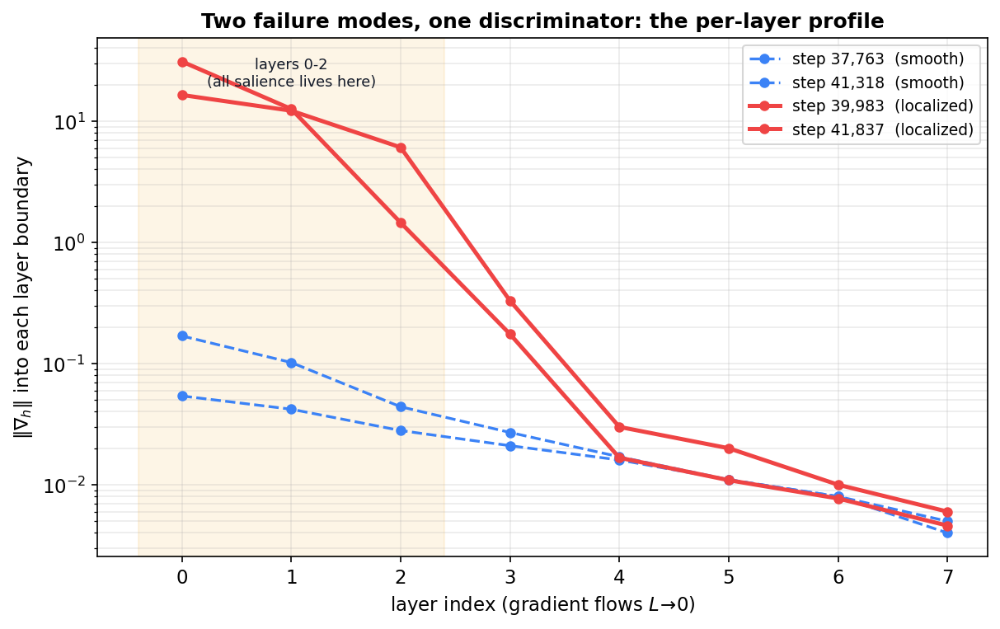
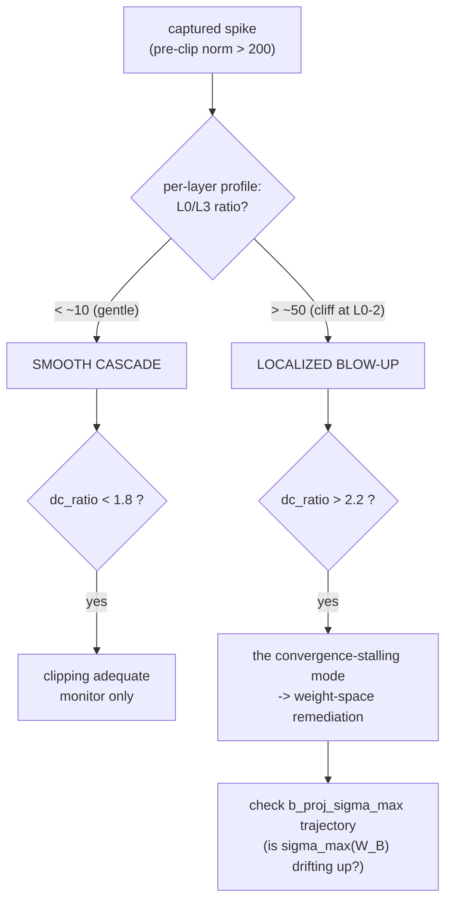
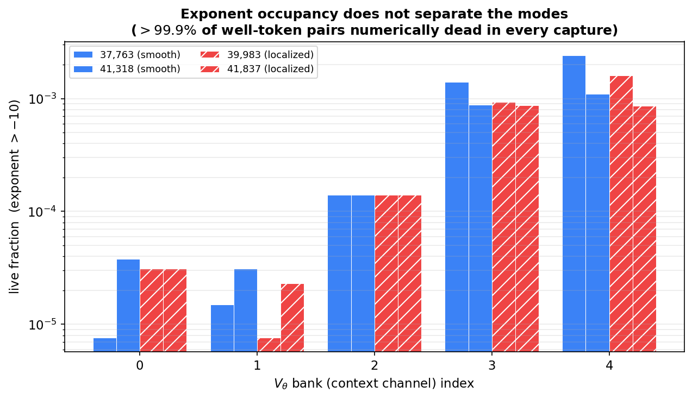
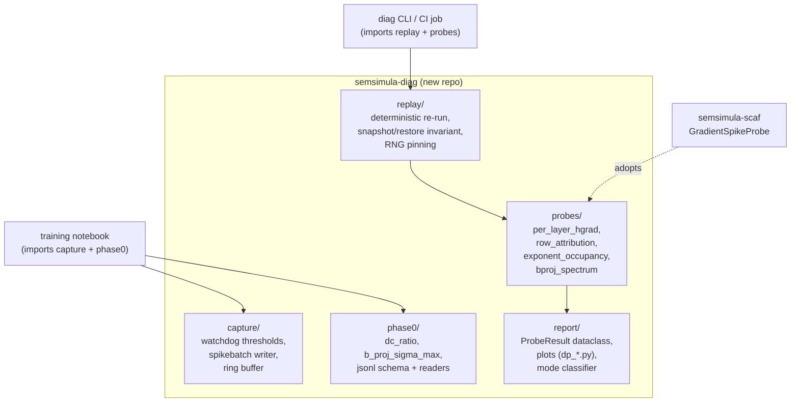

# A Diagnostic Programme for Gradient Spikes in the CfC/BAOAB Fock-PARFLM

Companion to
[`CfC_BAOAB_Integrator_and_Mitigations.md`](CfC_BAOAB_Integrator_and_Mitigations.md)
and its parent
[`Training_Instabilities_in_Fock-PARFLM_with_structured_V_theta.md`](Training_Instabilities_in_Fock-PARFLM_with_structured_V_theta.md).

Where those notes tell the *chronological* story of the CfC/BAOAB integrator
and the spike hunt section by section (§24–§39), this note steps back and
describes the **programme** as a whole: the set of diagnostics we have grafted
onto the `L=8`, `d=384`, anisotropic-Gaussian $V_\theta$ OpenWebText (OWT) run,
*why each one exists*, what mathematical object it is trying to measure, and
how the collection lets us **categorize → classify → diagnose → remediate** the
gradient spikes rather than merely survive them with a watchdog.

The thesis of the programme is a single sentence:

> The spikes are not an accident of one bad batch; they are the training
> gradient of a **sharp, low-rank direction in the anisotropic Gaussian well**
> becoming briefly resonant with the data, so the right instruments are the
> ones that measure the **spectrum of the low-rank precision factor $B_k$** and
> the **shape** of the gradient across layers and rows — not just its size.

---

## Table of Contents

1. [The phenomenon we are chasing](#1-the-phenomenon-we-are-chasing)
2. [The anisotropic Gaussian well, and where a spike can hide in it](#2-the-anisotropic-gaussian-well-and-where-a-spike-can-hide-in-it)
3. [Why the low-rank / off-diagonal entries are the spike generator (derivation)](#3-why-the-low-rank--off-diagonal-entries-are-the-spike-generator-derivation)
4. [The diagnostic programme: four phases](#4-the-diagnostic-programme-four-phases)
5. [Phase 0 — mine what is already logged (`dc_ratio`, `b_proj_sigma_max`)](#5-phase-0--mine-what-is-already-logged-dc_ratio-b_proj_sigma_max)
6. [Phase 1 — capture: decoupled thresholds and the spikebatch sidecar](#6-phase-1--capture-decoupled-thresholds-and-the-spikebatch-sidecar)
7. [Phase 2 — replay forensics: `replay_spike_batch`, `inspect_spike_tokens`, `attribute_spike_rows`](#7-phase-2--replay-forensics-replay_spike_batch-inspect_spike_tokens-attribute_spike_rows)
8. [The taxonomy the programme produced: two failure modes](#8-the-taxonomy-the-programme-produced-two-failure-modes)
9. [What the programme has already falsified](#9-what-the-programme-has-already-falsified)
10. [Categorize → classify → diagnose → remediate](#10-categorize--classify--diagnose--remediate)
11. [Refactoring the diagnostics into a standalone library](#11-refactoring-the-diagnostics-into-a-standalone-library)
12. [Status and open questions](#12-status-and-open-questions)

---

## 1. The phenomenon we are chasing

Under the CfC/BAOAB integrator (`integrator='baoab_cfc'`), the `L=8`, `d=384`
anisotropic-Gaussian $V_\theta$ OWT run trains stably for tens of thousands of
steps and then, intermittently, the **pre-clip global gradient norm** jumps by
one to three orders of magnitude for a single optimiser step before per-group
clipping absorbs it. Most such jumps are harmless — clipping does its job — but
they correlate with convergence stalls, and a fraction cross the watchdog's
hard trigger (`GRAD_NORM_HARD_TRIGGER = 500`), forcing a reload of the last
good checkpoint and wasting wall-clock.

The naive response — "clip harder" — is what we have been doing, and it treats
the symptom. The programme's goal is to answer three questions the watchdog
cannot:

- **Is there one spike mechanism or several?** (Answer, §8: at least two.)
- **Is a spike a property of the batch, or of the weights?** (Answer, §9:
  the dangerous mode is a property of the weights.)
- **Can we see a spike coming?** (Open; the Phase-0 leading-indicator logging
  added in commit `6c8d049ba010` is collecting the data to decide.)

---

## 2. The anisotropic Gaussian well, and where a spike can hide in it

Each context channel's scalar potential is a mixture of $K$ inverted Gaussian
"anti-bumps". For a single bank, with context vector $\xi$ (already shifted by
the per-layer `depth_code`) and hidden state $h\in\mathbb{R}^d$:

$$
V(h;\xi) \;=\; -\sum_{k=1}^{K} w_k \,
\exp\!\Big(-\tfrac12\,(h-\mu_k)^{\top} P_k\,(h-\mu_k)\Big),
\qquad
P_k \;=\; \underbrace{\mathrm{diag}(a_k)}_{\text{diagonal}}
        \;+\; \underbrace{B_k B_k^{\top}}_{\text{low-rank}} .
$$

Every well parameter is a **linear projection of the context**, so the geometry
of the well is data- and depth-dependent:

$$
\mu_k = W_\mu\,\xi,\quad
a_k = \mathrm{softplus}(W_a\,\xi)+\varepsilon,\quad
w = \mathrm{softmax}(W_w\,\xi)\cdot w_{\mathrm{scale}},\quad
B_k = \mathrm{reshape}\!\big(W_B\,\xi\big)\in\mathbb{R}^{d\times r},\; r\ll d .
$$

The two curvature contributions are qualitatively different objects:

- $\mathrm{diag}(a_k)$ is an **axis-aligned** precision. It cannot make a
  narrow ridge along an oblique direction; its stiffness in every coordinate is
  bounded and separately clamped (`precision_max`).
- $B_k B_k^{\top}$ is a rank-$r$ **PSD, off-diagonal** precision. It adds
  curvature $\sigma_i(B_k)^2$ along the (oblique, data-chosen) singular
  directions $u_i$ of $B_k$. This is the term that can turn a round basin into
  a razor ridge.

The forward code makes the split explicit — `diag_term` is the diagonal
quadratic form, `lr_term` is the low-rank one:

```python
diag_term = (a * diff * diff).sum(dim=-1)                     # (h-mu)^T diag(a) (h-mu)
Bt_diff   = torch.einsum('...kd,...kdr->...kr', diff, B)      # B_k^T (h-mu)
lr_term   = (Bt_diff * Bt_diff).sum(dim=-1)                   # (h-mu)^T B_k B_k^T (h-mu)
exponent  = -0.5 * (diag_term + lr_term)
```
*(`model_aniso_gaussian_vtheta.py`, `AnisotropicMixtureGaussianVTheta.forward`)*

Empirically (companion note §38–§39) the low-rank term dominates the exponent:
`lr_term_share` sits at $\approx 0.999$. So to a very good approximation the
well's stiffness *is* the spectrum of $B_k$.


The left panel is a purely diagonal well; the middle panel is the same well
after adding one low-rank factor $B_k B_k^{\top}$ oriented along an oblique
direction; the right panel plots $|\nabla_h V|$ and shows the key structural
fact used throughout this note: **the force is largest on a thin shell, not at
the well centre.** The amber dots mark that shell.

---

## 3. Why the low-rank / off-diagonal entries are the spike generator (derivation)

### 3.1 Force and its spectrum

The potential is smooth, so the force is exact:

$$
\nabla_h V \;=\; \sum_{k=1}^{K} g_k\, P_k\,(h-\mu_k),
\qquad
g_k \;=\; w_k \exp\!\Big(-\tfrac12 (h-\mu_k)^{\top} P_k (h-\mu_k)\Big)\;>\;0 .
$$

*(this is exactly `analytical_grad`; the physical force is $f=-\nabla_h V$.)*
Because $B_kB_k^{\top}$ is rank-$r$ PSD with eigenvalues $\sigma_i(B_k)^2$,

$$
\sigma_{\max}(P_k) \;\le\; \max_d a_{k,d} \;+\; \sigma_{\max}(B_k)^2 ,
$$

and with `lr_term_share` $\approx 0.999$ the diagonal part is negligible, so we
write $\lambda := \sigma_{\max}(P_k) \approx \sigma_{\max}(B_k)^2$ for the
stiffness of the sharpest direction $v$ (top eigenvector of $P_k$).

### 3.2 Reduction to a one-dimensional force profile

Project the displacement onto that sharp direction, $t := v^{\top}(h-\mu_k)$,
and drop the soft directions (they contribute only $O(a)$). One well's
along-$v$ force is

$$
\boxed{\;\phi(t)\;=\;\lambda\, t \,\exp\!\big(-\tfrac12\,\lambda t^2\big)\;}
$$

This little function is the whole story. It vanishes at the centre ($t=0$) and
in the tail ($t\to\infty$), and peaks in between at

$$
t^{\star} \;=\; \frac{1}{\sqrt{\lambda}},
\qquad
\phi_{\max} \;=\; \sqrt{\lambda/e}\;\propto\;\sigma_{\max}(B_k).
$$

Two consequences, both visible in the figure below:

1. **Peak force grows like $\sqrt{\lambda}=\sigma_{\max}(B_k)$.** A sharper
   low-rank direction produces a proportionally larger force.
2. **The active shell moves inward and thins,** $t^{\star}=\lambda^{-1/2}$. As
   the well sharpens, the band of displacements that experience a near-peak
   force shrinks *and* moves closer to the centre.


### 3.3 From force to parameter gradient: the quadratic that `precision_lr_max` bounds

Training does not differentiate $V$ with respect to $h$; it differentiates the
loss with respect to the *parameters* that shape the well — ultimately $W_B$ and
the `depth_code` that shifts $\xi$. The curvature $\lambda$ is a function of
those parameters, so differentiating the along-$v$ force with respect to the
parameter $\theta$ that controls $\lambda$ gives

$$
\frac{\partial}{\partial \lambda}\Big[\lambda\, t\, e^{-\lambda t^2/2}\Big]
\;=\; t\,e^{-\lambda t^2/2}\Big(1-\tfrac12\lambda t^2\Big).
$$

Evaluated on the peak-force shell $t=t^{\star}=\lambda^{-1/2}$ this is
$\tfrac12\lambda^{-1/2}e^{-1/2}$; but the loss gradient couples this to the
upstream $h$-gradient, whose own magnitude scales as $\sqrt{\lambda}$
(§3.2). The two $\sqrt{\lambda}$ factors compound, so the **worst-case
per-token contribution to $\nabla_\theta$ scales as**

$$
\big\|\nabla_\theta \mathcal{L}\big\|_{\text{worst}} \;\sim\; \lambda \;=\; \sigma_{\max}(B_k)^2 .
$$

That single quadratic is exactly the quantity mitigation #2 was designed to
cap. `_bound_lowrank` bounds $\sigma_{\max}(B_k)^2 \le$ `precision_lr_max` by a
smooth Frobenius cap (using $\sigma_{\max}(B_k)\le\|B_k\|_F$):

```python
def _bound_lowrank(self, B):                       # B: (..., K, d, rank)
    if self._precision_lr_max is None or self.rank == 0:
        return B
    budget = self._precision_lr_max ** 0.5
    fro   = B.flatten(-2, -1).norm(dim=-1).clamp(min=1e-12)   # ||B_k||_F, per well
    scale = budget * torch.tanh(fro / budget) / fro          # identity for small, -> budget for large
    return B * scale.unsqueeze(-1).unsqueeze(-1)
```
*(`model_aniso_gaussian_vtheta.py`)*

The catch — and the reason the programme exists — is that this cap acts on the
**runtime output** $B_k=\mathrm{reshape}(W_B\xi)$. The **raw weight**
$W_B$ (`B_proj.weight`) can keep drifting to larger spectral norm while the
capped output stays flat, and $\sigma_{\max}(W_B)$ sets how hard the model is
pushing against the cap for *any* unit-norm context. That is precisely why we
now log $\sigma_{\max}(W_B)$ (§5): it is the pre-clamp, batch-independent proxy
for how close the well is to the spike-generating regime.

### 3.4 Why the dangerous mode is batch-wide, not batch-specific (working hypothesis)

Because $t^{\star}=\lambda^{-1/2}$ shrinks as the well sharpens, a *larger*
fraction of a batch's tokens land within an $O(t^{\star})$ neighbourhood of the
peak-force shell. In the sharp-well limit essentially every token that projects
onto $v$ at all sees a near-peak force. So the aggregate gradient of a sharp
well is carried **democratically across the batch**, and its size is set by the
shared weight $\lambda$ — not by any one token.

This is a *hypothesis*, but it is the one consistent with everything the
programme has measured: the localized-mode captures are the **flattest** across
rows (§9), and the natural leading indicator is therefore a **weight-space**
scalar, $\sigma_{\max}(W_B)$, rather than any batch statistic. The rest of the
programme is built to test it.

---

## 4. The diagnostic programme: four phases

The diagnostics are organised as a pipeline of increasing cost and specificity.
The cheap, always-on end mines data the training loop already produces; the
expensive end reconstructs a single offending step bit-for-bit.

```mermaid
flowchart LR
    subgraph P0["Phase 0 — always on (near-zero cost)"]
        A0["training_log.jsonl<br/>per-group grad norms"]
        A1["dc_ratio<br/>(depth_code / next group)"]
        A2["b_proj_sigma_max<br/>sigma_max(W_B) per bank"]
    end
    subgraph P1["Phase 1 — on trigger (cheap)"]
        B0["watchdog:<br/>CAPTURE=200, HARD=500"]
        B1["*_spikebatch.pt<br/>batch + RNG + weights"]
    end
    subgraph P2["Phase 2 — offline (expensive, exact)"]
        C0["replay_spike_batch<br/>per-layer + per-well forensics"]
        C1["inspect_spike_tokens<br/>token degeneracy"]
        C2["attribute_spike_rows<br/>per-row concentration"]
    end
    subgraph P3["Phase 3 — productionize"]
        D0["SCAF GradientSpikeProbe<br/>InterventableModel / ProbeResult"]
    end
    P0 -->|"threshold crossed"| P1
    P1 -->|"ring buffer of bundles"| P2
    P2 -->|"validated signal"| P3
    P3 -.->|"feeds new scalar"| P0
```



Each phase answers a different question: Phase 0 asks *when and how often*;
Phase 1 asks *which exact step*; Phase 2 asks *where inside the model*; Phase 3
turns a validated answer into a reusable, tested probe.

---

## 5. Phase 0 — mine what is already logged (`dc_ratio`, `b_proj_sigma_max`)

The training loop already computes per-group gradient norms for per-group
clipping. Phase 0 costs almost nothing: it reads numbers that exist anyway and
writes two derived scalars into `training_log.jsonl` at `LOG_INTERVAL` cadence.

**`dc_ratio` — the discriminator we found for free.** The parameter groups are
`depth_code, E, P, creation_gate, register, reverse_channel_scale, V_theta,
V_phi`. Define

$$
\text{dc\_ratio} \;=\; \frac{\|\nabla_{\text{depth\_code}}\|}{\max_{g\neq\text{depth\_code}}\|\nabla_g\|}.
$$

Mining the seven archived replay reports (`spike_replay_reports.json`) showed
this ratio cleanly separates the two modes *from data the watchdog already
collected*: smooth-cascade events sit at `dc_ratio` $< 1.8$, localized ones at
$> 2.2$. Logging it every interval lets us ask the one thing the archived
reports cannot — whether it **rises before** a hard trigger:

```python
_dc_ratio = _dc_norm / _second if _second > 0 else float('inf')
_top_grp += f'dc_ratio={_dc_ratio:.2f}  '
```

**`b_proj_sigma_max` — the weight-space leading indicator (§3.3).** After §9
pointed at the weights rather than the batch, we added the un-clamped spectral
norm of each bank's low-rank projection, and its max across banks:

```python
# weight-space stiffness proxy: sigma_max(W_B) bounds how large ||B_proj(xi)||
# can get for ANY unit-norm xi, *before* _bound_lowrank's runtime tanh cap
# engages -- a pure function of the current weights, independent of the batch.
_vt_banks = model.V_theta.bank.banks
_sigmas = []
with torch.no_grad():
    for _bk in _vt_banks:
        _bp = getattr(_bk, 'B_proj', None)
        if _bp is None:
            continue
        _sigmas.append(float(torch.linalg.matrix_norm(_bp.weight.detach(), ord=2)))
if _sigmas:
    _bproj_sigma_by_bank = [round(s, 4) for s in _sigmas]
    _bproj_sigma_max     = max(_sigmas)
    _top_grp += f'bproj_sig={_bproj_sigma_max:.2f}  '
```

Both are written to the JSONL log so the trajectory can be plotted against the
spike timeline after the fact:

```python
_log_write(json.dumps({
    'step': step + 1, 'train_loss': avg_ntp, 'grad_norm': float(grad_norm),
    'dc_ratio': round(_dc_ratio, 4) if math.isfinite(_dc_ratio) else _dc_ratio,
    'b_proj_sigma_max': round(_bproj_sigma_max, 4) if _bproj_sigma_max is not None else None,
    'b_proj_sigma_by_bank': _bproj_sigma_by_bank,
    ...
}) + '\n')
```

An SVD of a $(K\,d\,r)\times d_{\text{in}}$ matrix is real compute, so — unlike
`dc_ratio`, which only reads existing numbers — `b_proj_sigma_max` runs at
`LOG_INTERVAL` cadence, not every step. Its promotion to a per-step guard is a
Phase-3 decision, gated on whether the logged trajectory actually leads spikes.

---

## 6. Phase 1 — capture: decoupled thresholds and the spikebatch sidecar

The single most important design choice in Phase 1 is **decoupling the capture
threshold from the reload threshold** (companion note §36). The watchdog reload
(`GRAD_NORM_HARD_TRIGGER = 500`) is a rare crisis; the plateau-inducing spikes
are the ordinary 200–500 ones that clipping silently absorbs. If we only
captured on reload we would never see the mechanism that actually stalls
convergence.

```python
GRAD_NORM_HARD_TRIGGER      = 500.0   # reload last-good checkpoint (rare crisis)
CAPTURE_SPIKE_THRESHOLD     = 200.0   # snapshot for forensics (the real target)
SPIKEBATCH_SNAPSHOT_MAX_KEEP = 12     # ring buffer of bundles
```

On any step whose pre-clip norm crosses `CAPTURE_SPIKE_THRESHOLD`, we write a
self-contained `*_spikebatch.pt` sidecar that makes the step **exactly
replayable** later, on CPU, without the training runtime:

- the microbatches (`batches`) and `grad_accum`,
- the CPU **and** CUDA RNG state (so the BAOAB O-step noise is reproducible),
- the full `model_state_dict` *as of that step*,
- the recorded `pre_clip_grad_norm` and `step`.

The ring buffer keeps the last 12 so a cluster of spikes can be compared, not
just the newest one.

---

## 7. Phase 2 — replay forensics: `replay_spike_batch`, `inspect_spike_tokens`, `attribute_spike_rows`

Phase 2 reconstructs the captured step and instruments it. All three tools share
a **non-pollution invariant**: weights, `.grad` tensors, and RNG state are
snapshotted up front and restored in a `finally` block, so forensics can be
interleaved with a live training session without perturbing it.

### 7.1 `replay_spike_batch` — where in the model the gradient lives

The workhorse. It monkeypatches `_fock_layer_step` to register a backward hook
on each layer boundary's hidden state, recovering the **per-layer $h$-gradient
profile**, and it turns on `set_fock_capture(True)` to log per-layer activation
extremes and a $V_\theta$ **exponent-occupancy histogram**. The per-layer hook
is the core idea:

```python
def _instrumented_layer_step(h, h_prev, r, salience, m_b, gamma, dt, layer_idx, *a, **k):
    out   = _orig_layer_step(h, h_prev, r, salience, m_b, gamma, dt, layer_idx, *a, **k)
    h_new = out[0]
    if torch.is_tensor(h_new) and h_new.requires_grad:
        _current_layer[0] = layer_idx
        h_new.register_hook(lambda g: _record_layer_grad(layer_idx, g))
    return out
```

The resulting profile is the programme's headline discriminator (§8): a *shape*,
not a *size*.

### 7.2 `inspect_spike_tokens` — is the batch degenerate?

Decodes the captured token IDs and reports per-sequence degeneracy metrics
(`unique_token_ratio`, `max_repeat_run`). Designed to test "is this just a
pathological repeated-token sequence?" — and, per §9, it is not.

### 7.3 `attribute_spike_rows` — is one row driving the update?

Re-runs the captured batch **one row at a time**, each scaled by
$1/(\text{grad\_accum}\cdot\text{rows\_per\_mb})$ so its number is its own share
of the aggregate, with the RNG reset to the pinned state before every row so all
rows are compared under an identical noise draw. Because gradient norms do not
add, the concentration metric is

$$
\text{top1\_share} \;=\; \frac{\max_i \|g_i\|}{\sum_i \|g_i\|},
$$

which equals $1/n$ for a perfectly flat batch and tends to $1$ when a single row
owns the gradient. This is the test that falsified the token-minority
conjecture (§9).

---

## 8. The taxonomy the programme produced: two failure modes

The per-layer $h$-gradient profile from `replay_spike_batch` splits every
captured event cleanly into two families.



| Mode | Per-layer profile (L0 → L3) | `dc_ratio` | Crossed 500? | Reading |
|---|---|---|---|---|
| **Smooth cascade** | gentle, $2.6$–$6.3\times$ | $< 1.8$ | never | broad, well-conditioned; clipping is adequate |
| **Localized blow-up** | cliff, $50$–$177\times$ within L0–2 | $> 2.2$ | **only mode that has** | sharp low-rank direction resonating at layers 0–2 |

The layers that blow up (0–2) are exactly the layers that carry meaningful
`salience` ($\sim 0.32/0.14$–$0.22/0.06$–$0.15$ at L0–2 vs. $\sim 10^{-3}$–$10^{-4}$
at L5–6, identically across every replay). The localized mode is not a random
layer failing; it is the **only layers where the well is doing work**.



---

## 9. What the programme has already falsified

Two forward-pass hypotheses for the localized mode were each designed *before*
being tested, and both came back negative against all four instrumented
captures — a good sign the instruments have teeth.

**Falsification 1 — token minority.** Conjecture: a small minority of rows whose
tokens land near a sharp well dictates the update direction. `attribute_spike_rows`
says the opposite: the localized captures are the **flattest** across rows.


The right panel is the punchline: top-1 row share is **monotonically
anti-correlated** with localization severity. The more the event concentrates in
*layers*, the more it spreads across *rows* — exactly what §3.4 predicts for a
shared-weight, batch-wide mechanism.

**Falsification 2 — well occupancy.** Conjecture: the localized mode has denser
$V_\theta$ well occupancy (more tokens "inside" a well). The exponent-occupancy
histogram shows no separation between the modes, and $>99.9\%$ of well–token
pairs are numerically dead ($\exp(\text{exponent})\approx 0$) in *every* capture.



Both negatives point the same way: the discriminator is not in *which tokens are
in this batch*. It is in the **weights** feeding the low-rank precision factor —
which is why `b_proj_sigma_max` (§5) was added.

---

## 10. Categorize → classify → diagnose → remediate

Putting the pieces together, the programme is a closed loop from a raw spike to
a targeted fix, with each verb owned by a specific instrument.

| Verb | Instrument | Signal | Output |
|---|---|---|---|
| **Categorize** | Phase-1 watchdog | pre-clip norm vs {200, 500} | is this worth a bundle? worth a reload? |
| **Classify** | `replay_spike_batch` per-layer profile + Phase-0 `dc_ratio` | profile shape; group-norm ratio | smooth cascade vs localized blow-up |
| **Diagnose** | `attribute_spike_rows`, exponent histogram, `b_proj_sigma_max` | row concentration; occupancy; $\sigma_{\max}(W_B)$ | batch-wide vs token-specific; weight drift |
| **Remediate** | targeted by class (below) | — | the smallest intervention that fits the mechanism |

The remediation menu is deliberately **matched to the diagnosed mechanism**
rather than applied blanket:

```mermaid
flowchart LR
    C["classified event"] --> A{smooth or localized?}
    A -->|smooth cascade| M1["per-group clip<br/>(already adequate)"]
    A -->|localized| B{sigma_max&#40;W_B&#41; drifting?}
    B -->|yes| M2["tighten precision_lr_max<br/>or weight-decay W_B"]
    B -->|"no / spiky"| M3["baoab_cfc_lowrank<br/>exact low-rank substep<br/>(correct but costly, note §34)"]
    M2 --> V["re-mine Phase-0 trajectory:<br/>did spikes drop?"]
    M3 --> V
    M1 --> V
```



Crucially, the programme lets us **rank** remediations by evidence: the
un-clamped $\sigma_{\max}(W_B)$ trajectory tells us whether tightening
`precision_lr_max` would even bite (if the raw weight is not pushing the cap,
tightening it does nothing), and the exact low-rank substep
(`baoab_cfc_lowrank`, §34) is reserved for the case where the drift is real but
weight-decay is too blunt — bought with the compute cost that note §34 found
prohibitive at production scale.

---

## 11. Refactoring the diagnostics into a standalone library

Right now the diagnostics live in three places: (a) inline in the Colab notebook
Cell 6/8, (b) a first extraction, `grad_clip_utils.py` (with unit tests
`test_grad_clip_utils.py`), and (c) the SCAF probe framework in `semsimula-scaf`.
This is fine for a single run but does not scale to the several model variants
(isotropic vs anisotropic $V_\theta$, `L=8` vs `L=16`, Verlet vs `baoab_cfc`)
that all want the same forensics. The natural next step is a dedicated package.

### 11.1 Why extract at all

- **Portability.** `replay_spike_batch` only needs `forward_with_vreg`, the
  model, and a bundle path. Nothing about it is Colab- or OWT-specific; it
  should run against any Fock-PARFLM checkpoint from a script or CI job.
- **Testability.** The non-pollution invariant (snapshot/restore of weights,
  grads, RNG) and the per-row scaling are exactly the kind of subtle logic that
  needs unit tests — as `grad_clip_utils.py` already demonstrated by surfacing
  the `replay_all_captures()` leak (§37.4). Notebook cells cannot be unit-tested.
- **Separation of concerns.** Capture (writing a bundle) and analysis (reading
  one) have different dependencies: capture must live inside the training loop;
  analysis wants to be a pure function of a `*_spikebatch.pt` file and a model
  factory.

### 11.2 Proposed shape: `semsimula-diag`



Concretely:

- `semsimula_diag.capture` — the Phase-1 machinery (thresholds, bundle writer,
  ring buffer). The notebook imports this instead of inlining it.
- `semsimula_diag.replay` — the deterministic re-run engine and the
  snapshot/restore context manager, model-agnostic (takes a model + bundle).
- `semsimula_diag.probes` — one function per instrument
  (`per_layer_hgrad`, `row_attribution`, `exponent_occupancy`,
  `bproj_spectrum`), each returning a plain dataclass so results are
  serialisable and diffable across runs.
- `semsimula_diag.phase0` — the JSONL schema, the `dc_ratio` /
  `b_proj_sigma_max` writers, and readers that turn a log into a trajectory.
- `semsimula_diag.report` — the mode classifier (§8 decision tree) and the
  figure scripts (this note's `dp_*` plots would move here as reusable
  functions).

The alignment with SCAF is deliberate: `probes/` should return SCAF-compatible
`ProbeResult` objects so the same instruments run both offline (against a
bundle) and online (as a `GradientSpikeProbe` on an `InterventableModel`). That
makes Phase 3 (productionization) a matter of *adopting* the library's probes,
not rewriting them.

### 11.3 Migration order (low-risk first)

1. Lift `replay_spike_batch` / `attribute_spike_rows` into
   `semsimula_diag.replay` + `probes/` with the notebook re-importing them
   (pure move, behaviour-preserving, add tests for the invariant).
2. Move the Phase-0 writers into `semsimula_diag.phase0` and have Cell 6 import
   them (removes the most-duplicated code across notebook variants).
3. Move the capture watchdog into `semsimula_diag.capture`.
4. Fold the SCAF `GradientSpikeProbe` onto `probes/` so there is one
   implementation with two entry points.

---

## 12. Status and open questions

- **Two modes confirmed, one dangerous.** The localized blow-up is the only mode
  to cross 500 and the one correlated with stalls; the smooth cascade is handled
  by clipping (§8).
- **The dangerous mode is a weight property, not a batch property.** Two
  batch-side hypotheses falsified (§9); the working mechanistic model is the
  sharp low-rank direction of §3.
- **Leading-indicator question is open and now instrumented.** `dc_ratio` and
  `b_proj_sigma_max` are logging every interval as of commit `6c8d049ba010`. The
  decisive test is whether $\sigma_{\max}(W_B)$ (or `dc_ratio`) **rises before** a
  hard trigger. If it does, the remediation in §10 becomes preventive rather than
  reactive, and `b_proj_sigma_max` graduates to a per-step guard (Phase 3).
- **Refactor pending.** The library extraction (§11) is proposed, not started;
  the low-risk first step is lifting the replay/probe functions out of the
  notebook with tests.

---

*Provenance. The math in §2–§3 is the exact energy/force of
`notebooks/conservative_arch/parf/model_aniso_gaussian_vtheta.py`
(`AnisotropicMixtureGaussianVTheta.forward` / `analytical_grad` /
`_bound_lowrank`). The diagnostics in §5–§7 are the instruments added to
`notebooks/conservative_arch/scaleup/colab_fock_cfc_baoab_aniso_gaussian_openwebtext_d384.ipynb`
and `grad_clip_utils.py`; their chronological derivation and the underlying data
are companion note
[`CfC_BAOAB_Integrator_and_Mitigations.md`](CfC_BAOAB_Integrator_and_Mitigations.md)
§35–§39. All five figures are produced by
`figures/_make_diagnostic_programme_figs.py`: the well and force panels are exact
evaluations of the potential, and the mode-profile, per-row, and occupancy panels
are the literal replay numbers from the four Phase-1/2-instrumented captures
(steps 37,763 / 41,318 / 39,983 / 41,837).*

*Last updated: 31 August 2026 (initial version: consolidates the §35–§39
diagnostic programme into a standalone strategy note with the low-rank
spike-generation derivation, the four-phase pipeline, the two-mode taxonomy, and
a proposed `semsimula-diag` library extraction).*
