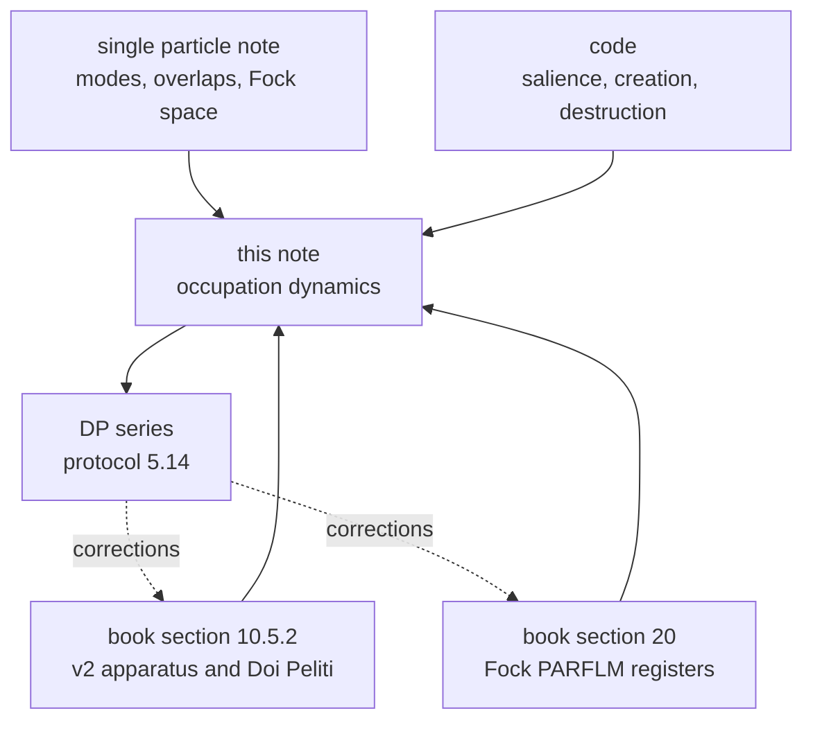
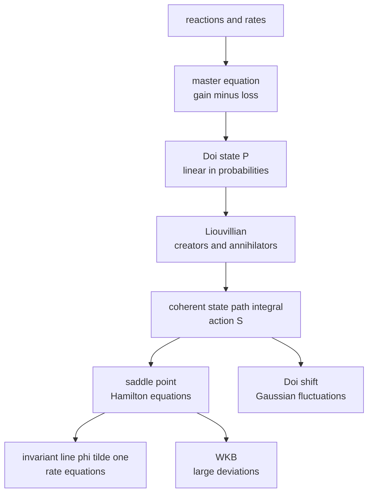
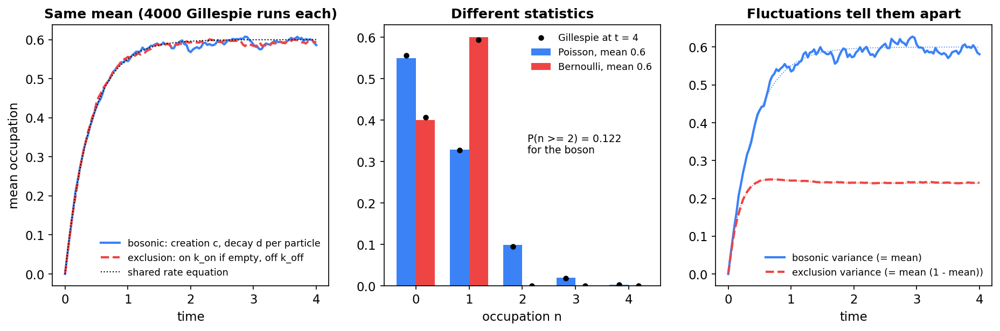
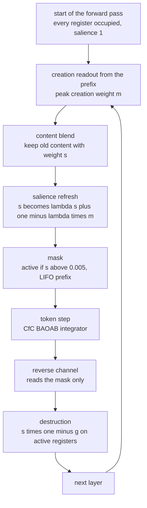
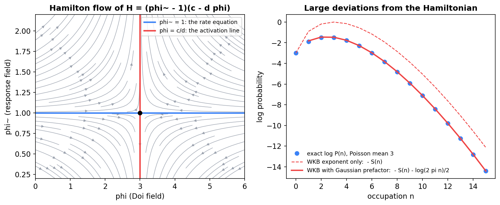
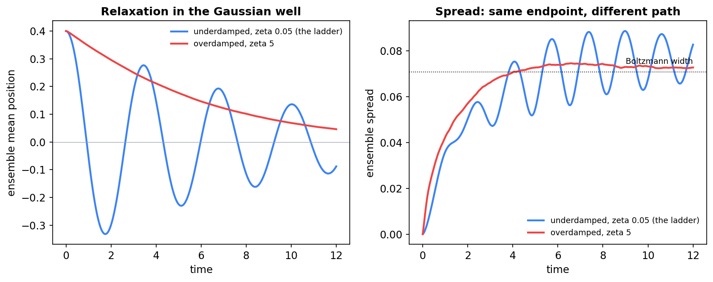
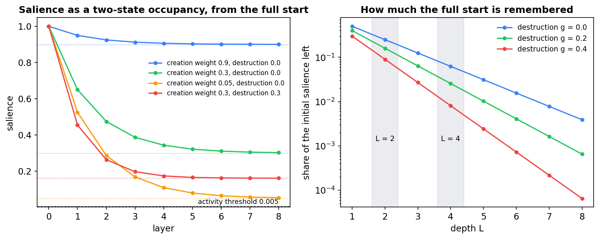
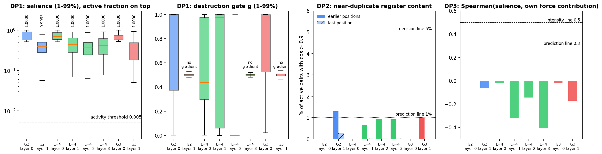

# Doi–Peliti Dynamics of Semantic Particles and Registers

**What stochastic process the Fock registers implement, derived from the master equation and measured on the trained models**

Companion note to Section 10.5.2 and Section 20 of the book, and to [*The Single-Particle Hilbert Space in the Semantic Simulation Framework*](Single_Particle_Hilbert_Space_in_Semantic_Simulation.md). The single-particle note fixes the **geometry**: the modes, their overlaps, and the Fock space built on them. This note supplies the **dynamics**: how occupations change, what the book's Doi–Peliti claims mean once derived, and what the trained registers actually do. The measurements are the pre-registered DP series (protocol §5.14).

---

## Contents

0. [Scope and the three claims under test](#0-scope-and-the-three-claims-under-test)
1. [From master equation to Liouvillian](#1-from-master-equation-to-liouvillian)
2. [Bosons and exclusion: the two-state register](#2-bosons-and-exclusion-the-two-state-register)
3. [The SemSimula register scheme, as implemented](#3-the-semsimula-register-scheme-as-implemented)
4. [The coherent-state path integral and Hamilton's equations](#4-the-coherent-state-path-integral-and-hamiltons-equations)
5. [Particles that move: transport with inertia](#5-particles-that-move-transport-with-inertia)
6. [Vacuum, absorbing and stationary states](#6-vacuum-absorbing-and-stationary-states)
7. [What the trained models implement: the DP series](#7-what-the-trained-models-implement-the-dp-series)
8. [Consequences for the book, and a dictionary](#8-consequences-for-the-book-and-a-dictionary)

---

## 0. Scope and the three claims under test

Book §10.5.2 makes three claims about the Doi–Peliti specialization of the v2 apparatus (creation and destruction), and states each in a sentence:

1. **Coherent states are product Poisson distributions.**
2. **A continuous salience variable plays the role of a Poisson mean**, the natural mean-field amplitude of the formalism.
3. **The field equations are classical Hamilton equations** on the resulting symplectic manifold.

Claims 1 and 3 are standard results of the formalism. This note derives them in the framework's terms (§1, §4). Claim 2 is a statement about the trained models, and it turns out to be false for them (§2, §3, §7). The registers are exclusion objects, one content vector per slot. Their number never changes in practice, and their salience behaves as a **retention probability**, not as an intensity.

Notation: $a_v$ and $a_v^\dagger$ are the annihilator and creator of mode $v$, written for orthonormal (Löwdin) modes throughout, as Doi–Peliti requires (single-particle note §7.1). $\lvert P\rangle$ is the Doi–Peliti state and $\langle\mathbf{1}|$ the projection state. For one register, $\lambda$ is the salience decay (0.5 in every ladder model), $m$ the peak creation weight and $g$ the destruction gate.

---

## 1. From master equation to Liouvillian

### 1.1 The master equation

A configuration $\mathbf{n} = (n_v)$ lists the occupation of every mode. A Markov jump process on configurations is defined by reactions. Reaction $r$ changes the configuration by $\Delta_r$ at rate $w_r(\mathbf{n})$, and the probabilities obey the master equation (1.1):

$$
\partial_t P(\mathbf{n}) = \sum_r \left[ w_r(\mathbf{n} - \Delta_r)P(\mathbf{n} - \Delta_r) - w_r(\mathbf{n})P(\mathbf{n}) \right]. \qquad (1.1)
$$

The first term is the gain from configurations one reaction away; the second is the loss.

### 1.2 Doi's encoding

Doi's construction turns (1.1) into a linear operator equation. Unnormalized number states $\lvert\mathbf{n}\rangle = \prod_v (a_v^\dagger)^{n_v}\lvert 0\rangle$ satisfy

$$
a_v^\dagger\lvert\mathbf{n}\rangle = \lvert\mathbf{n} + \mathbf{e}\_v\rangle, \qquad a_v\lvert\mathbf{n}\rangle = n_v\lvert\mathbf{n} - \mathbf{e}\_v\rangle, \qquad [a_v, a_w^\dagger] = \delta_{vw}. \qquad (1.2)
$$

A distribution is encoded linearly, as in (1.3), and (1.1) becomes $\partial_t\lvert P\rangle = \mathcal{L}\lvert P\rangle$:

$$
\lvert P\rangle = \sum_{\mathbf{n}} P(\mathbf{n})\lvert\mathbf{n}\rangle. \qquad (1.3)
$$

### 1.3 The construction rule

**A reaction $kA \to lA$ in one mode, at rate $\kappa$ per ordered $k$-tuple of particles, has the Liouvillian (1.4):**

$$
\mathcal{L} = \kappa\left((a^\dagger)^l - (a^\dagger)^k\right)a^k. \qquad (1.4)
$$

*Derivation.* By (1.2), $a^k\lvert n\rangle = \frac{n!}{(n-k)!}\lvert n-k\rangle$, which is the mass-action rate times the configuration with $k$ particles removed. Applying $(a^\dagger)^l$ adds $l$ particles back: the gain term of (1.1). Applying $(a^\dagger)^k$ restores the original configuration with the same rate: the loss term. Several modes and several reactions simply add their terms.

| reaction | rate | Liouvillian term |
|---|---|---|
| spontaneous creation, nothing to A | $c$ | $c(a^\dagger - 1)$ |
| decay, A to nothing | $d$ per particle | $d(a - a^\dagger a)$ |
| branching, A to 2A | $b$ per particle | $b((a^\dagger)^2 - a^\dagger)a$ |
| pair annihilation, 2A to nothing | $\kappa$ per ordered pair | $\kappa(1 - (a^\dagger)^2)a^2$ |
| hopping from mode $v$ to mode $w$ | $D$ per particle | $D(a_w^\dagger - a_v^\dagger)a_v$ |

### 1.4 Probability is conserved, term by term

The projection state satisfies $\langle\mathbf{1}|a_v^\dagger = \langle\mathbf{1}|$ (single-particle note §7.1). Every term of (1.4) has the form (creators − creators) times annihilators, and both sets of creators collapse to 1 against $\langle\mathbf{1}|$. So $\langle\mathbf{1}|\mathcal{L} = 0$, and $\langle\mathbf{1}|P\rangle = 1$ is preserved.

**Moments follow without solving anything.** For creation and decay, (1.5) holds:

$$
\frac{d}{dt}\mathbb{E}[n] = \langle\mathbf{1}|a^\dagger a\mathcal{L}|P\rangle = c - d\mathbb{E}[n]. \qquad (1.5)
$$

This is the rate equation. Every linear process closes on its first moment this way. Nonlinear ones, such as pair annihilation, couple each moment to the next.

---

## 2. Bosons and exclusion: the two-state register

### 2.1 Exclusion: at most one particle per slot

A **slot** that holds at most one particle has a two-dimensional state space: empty $\lvert\circ\rangle$ and occupied $\lvert\bullet\rangle$. The raising and lowering operators $\sigma^+$ and $\sigma^-$ move between them, with $\hat n = \sigma^+\sigma^-$. Filling an empty slot at rate $k_{\mathrm{on}}$ and emptying an occupied one at rate $k_{\mathrm{off}}$ gives (2.1):

$$
\mathcal{L}\_{\mathrm{exc}} = k_{\mathrm{on}}\left(\sigma^+ - (1 - \hat n)\right) + k_{\mathrm{off}}\left(\sigma^- - \hat n\right). \qquad (2.1)
$$

On the basis states, $\mathcal{L}\lvert\circ\rangle = k_{\mathrm{on}}(\lvert\bullet\rangle - \lvert\circ\rangle)$ and $\mathcal{L}\lvert\bullet\rangle = k_{\mathrm{off}}(\lvert\circ\rangle - \lvert\bullet\rangle)$. The projection state is $\langle\circ| + \langle\bullet|$, which annihilates both from the left. The occupation probability $\rho$ obeys (2.2):

$$
\frac{d\rho}{dt} = k_{\mathrm{on}}(1 - \rho) - k_{\mathrm{off}}\rho. \qquad (2.2)
$$

### 2.2 The bosonic twin with the same mean

Bosonic creation at rate $c = k_{\mathrm{on}}$ and decay at rate $d = k_{\mathrm{on}} + k_{\mathrm{off}}$ give the rate equation (1.5) with the same coefficients. **The two processes have identical mean dynamics and different statistics** (Figure 1):

| | bosonic | exclusion |
|---|---|---|
| stationary law | Poisson, mean $\rho^{\ast}$ | Bernoulli, mean $\rho^{\ast}$ |
| variance | $\rho^{\ast}$ | $\rho^{\ast}(1-\rho^{\ast})$ |
| double occupancy | $1 - e^{-\rho^{\ast}}(1+\rho^{\ast})$: 0.122 at 0.6, 0.264 at 1 | never |

Here $\rho^{\ast} = k_{\mathrm{on}}/(k_{\mathrm{on}} + k_{\mathrm{off}})$. The difference lies in the creation term: the boson is created at the same rate whether or not the mode is already occupied, so it can be doubly occupied. **A mean equation alone can never say which process it belongs to.**

**Figure 1.** Left: 4000 exact (Gillespie) runs of each process, started empty, follow the same rate equation. Centre: the stationary laws differ, Poisson against Bernoulli at the same mean 0.6; dots are the simulated frequencies at the last time. Right: the variances tell the processes apart, equal to the mean for the boson and to the mean times its complement under exclusion.

### 2.3 The code's salience update is the mean of a two-state chain

The registers evolve in discrete steps, once per layer. A register's salience $s$ is updated in two stages, (2.3), where $m$ is the peak creation weight and $g$ the destruction gate:

$$
s \leftarrow \lambda s + (1 - \lambda)m, \qquad s \leftarrow s(1 - g). \qquad (2.3)
$$

**This is exactly the mean of a two-state chain.** Its transition probabilities are (2.4):

$$
p_{\circ\to\bullet} = (1-\lambda)m(1-g), \qquad p_{\bullet\to\bullet} = (1-g)\left(\lambda + (1-\lambda)m\right). \qquad (2.4)
$$

*Check.* The new occupation probability is $p_{\bullet\to\bullet}s + p_{\circ\to\bullet}(1-s) = (1-g)\left(\lambda s + (1-\lambda)m\right)$, which is (2.3). Both probabilities lie in $[0,1]$ for any $\lambda$, $m$ and $g$ in $[0,1]$. The chain has a plain reading: each layer, with probability $1-\lambda$ the slot is redrawn and comes up occupied with probability $m$; otherwise it keeps its state; then the destruction gate empties it with probability $g$.

The same mean also comes from a bosonic process: keep each particle with probability $\lambda(1-g)$, then add a Poisson number with mean $(1-\lambda)m(1-g)$. Thinning and adding Poisson numbers both preserve the Poisson law. So (2.3) is consistent with both readings, as §2.2 says it must be. **What decides between them is the slot.** A register holds one content vector; it has no representation for a second particle in the same register. At salience 1, a Poisson reading would put 26% of the register's probability on states it cannot hold.

### 2.4 What salience does to content

Salience enters the content update as a retention weight, (2.5), with the salience taken before the current layer's refresh:

$$
r \leftarrow s r + (1 - s)\cdot\mathrm{readout}. \qquad (2.5)
$$

This is the expected content of a slot that keeps its old content with probability $s$ and takes the fresh readout otherwise. Salience is therefore, structurally, the **probability that the slot still holds its old content**. That is a retention probability, not an amount of meaning.

---

## 3. The SemSimula register scheme, as implemented

### 3.1 The cycle, layer by layer

The ladder models use the prefix-causal v2 registers of [`model_fock_parf_multixi.py`](../notebooks/conservative_arch/parf/model_fock_parf_multixi.py), with $M = 32$ registers, decay 0.5, threshold 0.005 and LIFO stack discipline.

| code step | process event | effect on salience | effect on content |
|---|---|---|---|
| initialization | every slot occupied | 1 | the learned register embedding |
| creation readout | candidate new content and its peak weight $m$ | none yet | readout computed |
| blend (2.5) | old content kept with probability $s$ | none | retained or replaced |
| refresh (2.3) | redraw with probability $1-\lambda$ | as in (2.3) | none |
| mask | coarse occupancy: active if above threshold | read | none |
| reverse channel | registers act on tokens | not read: only the mask | read |
| destruction | emptied with probability $g$ | times $1-g$ on active slots | none |

### 3.2 Four structural facts

Each of the following holds before any measurement, by construction.

1. **Time is depth.** The process runs over layers: 2 or 4 steps in the ladder. It runs separately at every position, since the registers are prefix-causal.
2. **The process starts full.** Every register starts at salience 1, so the vacuum, the empty discourse of book §10.5.2, is never the initial state.
3. **The force sees only the mask.** The reverse channel receives the yes/no mask, never the salience. In the token dynamics a register is either present or absent.
4. **The threshold is nearly unreachable.** Right after the refresh, and before the mask is taken, the salience satisfies (3.1), since the peak of a softmax over $t+1$ prefix positions is at least $1/(t+1)$:

$$
s \ge (1 - \lambda)m \ge \frac{1 - \lambda}{t + 1}. \qquad (3.1)
$$

With $\lambda = 0.5$ and threshold 0.005, no register can be inactive at any of the first 99 positions, whatever the destruction gate does. Every register is necessarily active at layer 0, since its salience there is at least 0.5. Further on, a register goes inactive only if destruction nearly empties it *and* its creation attention is nearly uniform over a long prefix.

A fifth fact concerns training rather than the forward pass. **The last layer's destruction gate receives no gradient.** Its output multiplies a salience that nothing downstream reads. Measured on G2 and on the L=4 model, the gradient reaching the last gate is exactly zero; the earlier gates receive 0.002–0.015. One gate per model is dead weight, sitting at its initialization, about 0.5 (§7.2).

---

## 4. The coherent-state path integral and Hamilton's equations

### 4.1 The action

Inserting resolutions of the identity in Doi–Peliti coherent states at each small time step turns the evolution $e^{t\mathcal{L}}$ into a path integral over two fields: the Doi field $\phi(t)$ and the response field $\tilde\phi(t)$. The standard result (Doi 1976; Peliti 1985; Täuber, Howard and Vollmayr-Lee 2005) is a weight $e^{-S}$ with action (4.1), up to boundary terms:

$$
S[\tilde\phi, \phi] = \int dt \left[ \tilde\phi\partial_t\phi - H(\tilde\phi, \phi) \right]. \qquad (4.1)
$$

Here $H$ is the normal-ordered Liouvillian, with $a^\dagger$ replaced by $\tilde\phi$ and $a$ by $\phi$. For creation and decay, (4.2):

$$
H(\tilde\phi, \phi) = c(\tilde\phi - 1) + d(\phi - \tilde\phi\phi) = (\tilde\phi - 1)(c - d\phi). \qquad (4.2)
$$

### 4.2 The saddle point is Hamilton's equations

Varying (4.1) with respect to $\tilde\phi$ and $\phi$ gives (4.3):

$$
\partial_t\phi = \frac{\partial H}{\partial\tilde\phi}, \qquad \partial_t\tilde\phi = -\frac{\partial H}{\partial\phi}. \qquad (4.3)
$$

These are Hamilton's equations, with $(\phi, \tilde\phi)$ a canonical pair and $H$ the Hamiltonian. For bosons the phase space is the plane of the two fields. This is book claim 3, derived. For exclusion slots, spin coherent states replace the bosonic ones, and the phase space becomes a sphere with the same Hamiltonian structure; we state that case without derivation.

**The rate equation is an invariant line.** Conservation of probability (§1.4) means $H(1, \phi) = 0$ for every $\phi$. Hence $\partial H/\partial\phi = 0$ on the line $\tilde\phi = 1$, so (4.3) keeps $\tilde\phi = 1$ forever once it starts there. On that line, $\partial_t\phi = \partial H/\partial\tilde\phi$ evaluated at $\tilde\phi = 1$: for (4.2), $c - d\phi$, the rate equation (1.5). **Mean-field theory is the Hamiltonian flow restricted to the invariant line $\tilde\phi = 1$.**

### 4.3 Fluctuations: the Doi shift

Write $\tilde\phi = 1 + \tilde\psi$ and expand, as in (4.4):

$$
H(1 + \tilde\psi, \phi) = \tilde\psi A(\phi) + \tfrac12\tilde\psi^2 B(\phi) + O(\tilde\psi^3). \qquad (4.4)
$$

Truncated at second order, the path integral is that of a Langevin equation (4.5), with Gaussian noise whose correlator is $B$:

$$
\partial_t\phi = A(\phi) + \eta, \qquad \langle\eta(t)\eta(t')\rangle = B(\phi)\delta(t - t'). \qquad (4.5)
$$

- **Creation and decay:** $A = c - d\phi$ and $B = 0$. The Doi field is deterministic. This is the field-theoretic statement that a Poisson state stays Poisson (single-particle note §6.3).
- **Pair annihilation:** $H = \kappa(1 - \tilde\phi^2)\phi^2$, so $A = -2\kappa\phi^2$ and $B = -2\kappa\phi^2$, a *negative* noise correlator. The Doi field is not the particle number; it is the mean of a local Poisson law. Processes that are sub-Poissonian need "imaginary noise" in that field.

This makes book claim 2 precise. In Doi–Peliti the field $\phi$ *is* a Poisson mean. Whether a model's salience is that field is a separate question, answered in §7: for the trained registers it is not.

### 4.4 Large deviations from the same Hamiltonian

In the number representation, the same process has the WKB Hamiltonian (4.6) in the occupation $n$ and a conjugate momentum $p$:

$$
H(p, n) = c(e^p - 1) + dn(e^{-p} - 1). \qquad (4.6)
$$

Besides $p = 0$ (the rate equation), its zero-energy set includes $e^p = dn/c$. Along that branch the action is (4.7), with $\alpha = c/d$:

$$
S(n) = \int_{\alpha}^{n} p dn' = n\ln\frac{n}{\alpha} - n + \alpha. \qquad (4.7)
$$

So $P(n) \approx e^{-S(n)}$. With the Gaussian prefactor added, this reproduces the exact Poisson law (Figure 2, right).

**Figure 2.** Left: the flow (4.3) for (4.2) with creation rate 3 and decay rate 1. The horizontal line is the invariant line, on which the flow is the rate equation and relaxes to the fixed point. The vertical line, the other zero-energy branch, carries the rare fluctuations. Right: the exact log-probabilities of the Poisson law with mean 3 (dots), the WKB exponent (4.7) alone (dashed), and with its Gaussian prefactor (solid).

---

## 5. Particles that move: transport with inertia

### 5.1 The one-body operator

The registers react; the token particles move. A particle with position $h$, velocity $v$, mass $m$ and friction $\gamma$ in a potential $U$, at temperature $T$, has a phase-space density evolved by the Kramers operator (5.1):

$$
\mathcal{K}f = -v\cdot\nabla_h f + \frac{1}{m}\nabla U\cdot\nabla_v f + \gamma\nabla_v\cdot(vf) + \frac{\gamma T}{m}\nabla_v^2 f. \qquad (5.1)
$$

Its four terms are streaming, the potential force, friction, and the thermostat's diffusion. Particle number is conserved ($\int\mathcal{K}f = 0$), so in the field theory transport enters linearly, as $\int\tilde\phi\mathcal{K}\phi$ over phase space, beside the reaction terms of §1. With pair interactions, in mean field, the potential becomes the Vlasov form (5.2):

$$
U_{\mathrm{eff}}(h) = V_\theta(h) + \int V_\phi(h, h')\rho(h')dh'. \qquad (5.2)
$$

### 5.2 Standard Doi–Peliti is the overdamped limit

For large friction the velocity relaxes in a time of order $1/\gamma$. Eliminating it gives the Smoluchowski equation (5.3), a drift–diffusion equation in position alone:

$$
\partial_t\rho = \frac{1}{m\gamma}\nabla\cdot(\rho\nabla U) + \frac{T}{m\gamma}\nabla^2\rho. \qquad (5.3)
$$

This is the transport of standard reaction–diffusion Doi–Peliti. The trained ladder runs at γ = 0.1, a damping ratio near 0.05, far from that limit. Resetting the velocity entering each layer costs 33–55% in perplexity (Gate 1 of the flow-or-maps probe), so position-only Doi–Peliti would discard the part of the dynamics the models rely on most. Figure 3 shows the difference in the Gaussian well. Whether OpenWebText needs the inertial term at all is the pre-registered FO series (protocol §5.13).

**Figure 3.** 4000 particles started at 0.4 in the Gaussian well (inflection radius 0.5), integrated by BAOAB at low temperature. Left: the ensemble mean rings at the ladder's damping ratio 0.05 and creeps monotonically when overdamped. Right: both spreads reach the Boltzmann width; the underdamped one oscillates on the way.

### 5.3 Causal forces have no Boltzmann state

At zero temperature, as trained, (5.1) loses its diffusion term and transport is deterministic: the density is carried by the integrator's flow. More importantly, the trained pair forces are **causal**. The token at position $t$ feels sources at $s \lt t$, and they do not feel it back. The forces are therefore not reciprocal, and the joint force on all tokens is not the gradient of any total potential, even when each pairwise term is conservative. Detailed balance fails, and the stationary state of the thermostatted dynamics is not the Boltzmann density.

The Boltzmann statement in the single-particle note §4.3 therefore holds for the framework's reciprocal force law, not for the causal models as trained. This is the dynamical counterpart of the symmetry caveat in §5.4 of that note.

---

## 6. Vacuum, absorbing and stationary states

### 6.1 Stationary states

- **Bosonic creation and decay:** Poisson with mean $c/d$ (single-particle note §6.3).
- **Exclusion slot:** Bernoulli with occupation probability $k_{\mathrm{on}}/(k_{\mathrm{on}} + k_{\mathrm{off}})$, by (2.2).
- **The per-layer chain (2.4)**, with $m$ and $g$ held fixed: the fixed point and the per-layer contraction are (6.1).

$$
s^{\ast} = \frac{(1-\lambda)m(1-g)}{1 - \lambda(1-g)}, \qquad s_{l+1} - s^{\ast} = \lambda(1-g)(s_l - s^{\ast}). \qquad (6.1)
$$

### 6.2 Absorbing states and the vacuum

- **The vacuum would be absorbing only without creation.** In the code the refresh always adds $(1-\lambda)m \gt 0$, so there is no absorbing state, and an exactly empty register never occurs. "Inactive" is a coarse-grained state defined by the threshold.
- **The vacuum is never visited.** The process starts full (§3.2), and the bound (3.1) keeps it away from empty for at least the first 99 positions.

### 6.3 Memory of the full start

By (6.1), after $L$ layers the initial salience survives with weight $\prod_l\lambda(1-g_l)$. With no destruction that is 0.25 at L=2 and 0.0625 at L=4, so the full start would weigh heavily at L=2 (Figure 4). The measured weights are far smaller (§7.2): the models forget the full start mainly by destroying at layer 0, not by decay.

**Figure 4.** Left: salience under (2.3) from the full start, for four combinations of creation weight and destruction; dotted lines are the fixed points (6.1), and the dashed line is the activity threshold. Right: the share of the initial salience left after L layers, for three destruction strengths.

**LIFO stack discipline** makes the active set the top-salience prefix of the registers, a constraint that couples them and is what the book's stack argument uses. It binds only when some register is inactive. In the trained models that almost never happens (§7.2).

---

## 7. What the trained models implement: the DP series

### 7.1 Design

Pre-registered in protocol §5.14 before any measurement. Script: [`debug/dp_register_statistics.py`](../notebooks/conservative_arch/scaleup/debug/dp_register_statistics.py), with its output and JSON.

- **Models:** G2 (L=2 Fock, live gradients, best checkpoint at step 31,000), the L=4 Fock live model (step 32,500), and G3 (L=2 with the exchange field, step 31,000).
- **Tokens:** 8 × 512 validation tokens.
- **Recorded:** at every layer, position and register, the salience that sets the mask, the mask, the destruction gate, and the content the reverse channel reads. For DP3, also each active register's leave-one-out contribution to the reverse-channel force.

Layer checkpointing was switched off for the measurement; the logits are bit-identical with and without it.

### 7.2 Results

**Figure 5.**
- **First panel:** salience per model and layer (1st to 99th percentile, log scale), with the active fraction printed on top. Every box sits far above the threshold.
- **Second panel:** the destruction gate. It is switch-like at the early layers and pinned at 0.5 at the last layer, which receives no gradient.
- **Third panel:** the share of active register pairs with near-identical content, against the 1% prediction and the 5% decision line.
- **Fourth panel:** the Spearman correlation between a register's salience and its own contribution to the force, which is negative where it is not zero.

| test | measure | G2 | L=4 live | G3 | prediction | outcome |
|---|---|---|---|---|---|---|
| DP1 | active fraction, layer 1 on | 0.9995 | 1.0000 at layers 1–3 | 1.0000 | at least 0.95 (65%, 55%) | **hit** |
| DP2 | near-duplicate pairs, earlier positions | 1.30% | 0.66–0.94% | 0.98% | under 1% everywhere (55%) | **miss**, narrowly (G2) |
| DP2 | weighted absolute cosine, earlier minus last | 0.037 | 0.054–0.070 | 0.051 | at least 0.05 everywhere (50%) | **miss** (G2); hit elsewhere at layers 1 on |
| DP3 | Spearman, salience against own force | −0.005, −0.061 | −0.022, −0.321, −0.144, −0.407 | −0.022, −0.172 | below 0.3 (60%) | **hit**: negative, not merely weak |

Further readings, not pre-registered:
- **Destruction is used, and switch-like.** At layer 0 the median destruction gate is 0.994 (G2) and 0.978 (G3), with a tenth percentile of 0.016 (G2). Most registers are nearly emptied, a minority kept.
- **Destruction changes content, not number.** An emptied register is refreshed before the next mask (3.1) and stays active. Its low salience then makes the blend (2.5) replace its content with the fresh readout. **Destruction acts as a content reset.**
- **The last layer's gate is dead.** Its 1st–99th percentile range lies within 0.46–0.54 in every model, and its gradient is exactly zero.
- **The full start is forgotten through destruction.** The median weight of the initial salience after the last layer is 0.0007 (G2), 0.0001 (L=4) and 0.0027 (G3), against 0.25 and 0.0625 without destruction.
- **LIFO never binds**, since all registers are active.

### 7.3 Reading

- **DP1: there are no particle-number dynamics in practice.** The register count stays at $M = 32$ at every layer and position, as (3.1) nearly forces. The creation and destruction machinery of v2 operates entirely through content: destruction resets a slot, creation refills it. The Fock-space number operator is constant on everything the trained models visit.
- **DP3: salience is not an intensity.** If salience were a Poisson mean, more salience would mean more particles and more force. Instead the correlation is zero to clearly negative, down to −0.41 at L=4. The explanation is (2.5). A low-salience register has just been reset to the current readout, so it carries the context most relevant to the current token. A high-salience register still holds older content. Salience measures *how much old content a slot retains*, and fresh content is what the force uses.
- **DP2: registers do not share content.** Near-duplicates are 1.3% of active pairs at most, far below the 5% line, even at earlier positions, where the repulsion penalty does not act. Registers are distinct slots with distinct content: exclusion per slot and no sharing of content modes. The hybrid statistic (exclusive in slot, bosonic in content) of the single-particle note §5.5 is not what the trained registers use.

**Conclusion.** The trained registers are $M$ always-occupied exclusion slots whose content is renewed layer by layer. Salience is the retention probability of the two-state chain (2.4) on top of (2.5). The bosonic Doi–Peliti apparatus correctly describes the architecture's *capacity*: what creation and destruction could express if registers emptied and refilled. It does not describe what the trained models do. The exclusion version (§2.1) is the honest formal home for the registers, and the book should say so. The scope is three models at d = 384 with L of 2 or 4, one seed each, and the salience decay fixed at 0.5. A model with a higher threshold, a smaller decay or more registers could behave differently, and (3.1) says how.

---

## 8. Consequences for the book, and a dictionary

### 8.1 Book changes (next edition)

1. **§10.5.2, Doi–Peliti paragraph.**
   - Add the construction rule (1.4).
   - Derive claim 1 (coherent states as product Poisson distributions) and claim 3 (the saddle point (4.3) as Hamilton's equations, with the rate equations as the invariant line).
   - Replace "salience plays the role of a Poisson mean" with the two-state chain (2.4) and the retention reading (2.5).
   - Report DP1–DP3 and the conclusion of §7.3.
2. **§10.5.2, bosonic justification.** The permutation argument holds for the framework's reciprocal force law. The trained models' causal forces break it (single-particle note §5.4; §5.3 here).
3. **§10.5.2, the v2 mapping table and the class implication.** Mark creation and annihilation as capacity: in the trained models with 32 registers the number stays constant and v2 acts as content renewal. The growth of the active state with input length, on which the class implication rests, is a property of the architecture family, not of the trained models.
4. **§20, the salience update.**
   - "Register k is active (created) iff its salience exceeds the threshold" needs the bound (3.1): at the ladder's settings the threshold is unreachable for the first 99 positions and rarely crossed after.
   - The last layer's destruction gate receives no gradient.
5. **Appendix A3:** the DP rows.

### 8.2 Dictionary

| object | in Doi–Peliti | in the trained registers |
|---|---|---|
| Doi field | mean of a local Poisson law | not the salience (DP3) |
| salience | (book: a Poisson mean) | retention probability of the slot's content, (2.4)–(2.5) |
| number operator | dynamical | constant at M (DP1) |
| creation | a creator, adding a particle | refill of a slot's content from the prefix |
| destruction | an annihilator, removing a particle | content reset; the last layer's gate is dead |
| vacuum | the empty configuration | never visited; the process starts full |
| statistics | bosonic | exclusion per slot, distinct content (DP2) |
| time | continuous | depth, 2 or 4 discrete steps per position |
| transport | diffusion (overdamped) | Kramers with inertia, deterministic at T = 0, causal and non-reciprocal |
| Hamilton's equations | saddle point of the coherent-state action | the formal content of the book's claim 3 |

**References.** M. Doi, Second quantization representation for classical many-particle system, J. Phys. A 9 (1976). L. Peliti, Path integral approach to birth-death processes on a lattice, J. Physique 46 (1985). U. C. Täuber, M. Howard and B. P. Vollmayr-Lee, Applications of field-theoretic renormalization group methods to reaction-diffusion problems, J. Phys. A 38 (2005). H. Risken, The Fokker–Planck Equation (Springer, 1989), for the Kramers operator.
