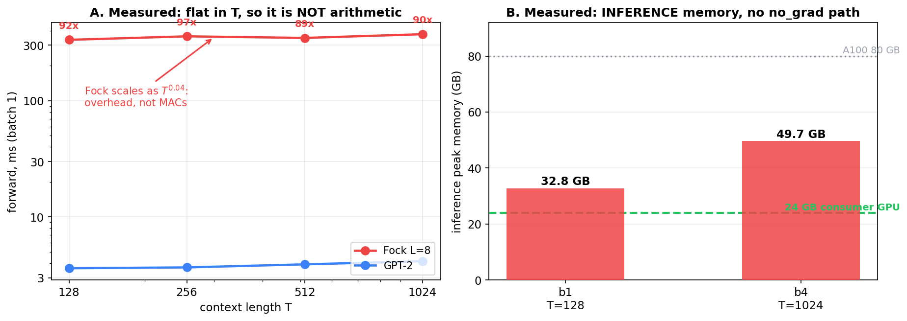
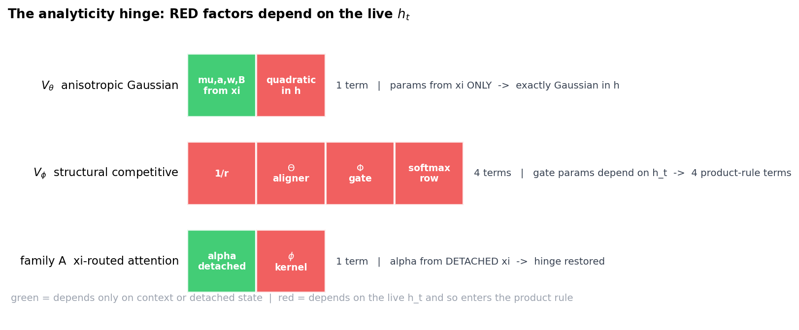
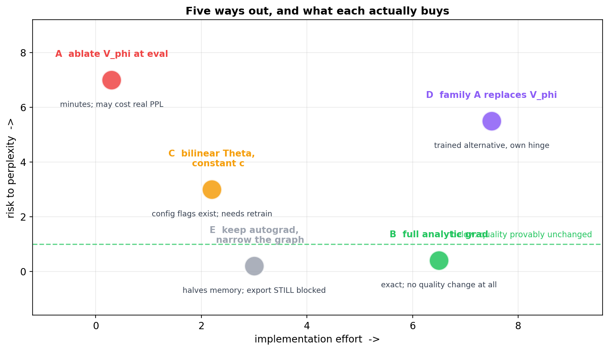
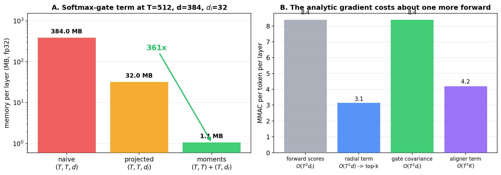

# Eliminating the autograd dependency in $V_\phi$

> **Status: design and derivation. Nothing measured.** Every number quoted
> as measured is cited from
> [`Fock_Inference_Productionization_Plan.md`](Fock_Inference_Productionization_Plan.md)
> §8a.3; everything else is exact arithmetic on the deployed shapes or a
> derivation. §4 is the one option testable today, in minutes.

**Read alongside.** The pair potential's design and its diagnostics are
developed in
[`Structured_VPhi_Design_and_Theory.md`](Structured_VPhi_Design_and_Theory.md)
and
[`On_the_MLP_Layer_modeling_pairwise_potential.md`](On_the_MLP_Layer_modeling_pairwise_potential.md);
its role in the force law in
[`On_Training_the_PARF_Force.md`](On_Training_the_PARF_Force.md) and
[`PARF_Augmented_SPLM_Architecture_v2.md`](PARF_Augmented_SPLM_Architecture_v2.md).
The template this note follows —
*make the gate parameters independent of the live state, and the gradient
becomes closed form* — is
[`Analytic_Multi_Channel_Integration_in_Structured_Vtheta.md`](Analytic_Multi_Channel_Integration_in_Structured_Vtheta.md)
§2. The alternative pair mechanisms are catalogued in
[`Context_Mixing_Mechanisms_in_the_Conservative_Framework.md`](Context_Mixing_Mechanisms_in_the_Conservative_Framework.md).

---

## 1. Why a 3.85% term blocks the whole inference path

$V_\phi$ is **3.85% of the per-token MAC count** and **100% of the reason
the model cannot run under `torch.no_grad()`**. The mechanism is a cascade,
not a cost.

```python
# model_parf_multixi.py :: _layer_forces
U_pair = self._pair_potential(h_in, layer_idx, xis=xis)
...
grad_U, = torch.autograd.grad(U.float(), h_in, ...)
```

`autograd.grad` requires `h_in.requires_grad`. That single requirement
propagates outward:

```mermaid
flowchart TB
  A["V&#95;phi has no analytic gradient"] --> B["autograd.grad on U&#95;pair"]
  B --> C["h&#95;in must require grad"]
  C --> D["EVERY op on h&#95;in records a graph"]
  D --> E["V&#95;theta analytic force<br>becomes graph building too"]
  D --> F["no torch.no&#95;grad path"]
  E --> G["32.8 GB at batch 1 with T of 128"]
  F --> H["no TorchScript, no ONNX"]
  D --> I["graph construction dominates<br>the forward wall clock"]
```



The middle link is the expensive one and it is easy to miss.
`V_theta.analytical_grad` is *ordinary tensor arithmetic* — matmuls against
$V_\theta$'s own parameters — not a discrete `autograd.grad` call, so it is
**not** gated by `create_graph` / `retain_graph`. With `h_in` requiring
grad it records a graph anyway, at every layer, for the term that is 87.6%
of the compute. Remove $V_\phi$'s requirement and the largest component of
the model stops building graphs as a side effect.



Panel A is the signature. Fock's forward time is **essentially flat in T**,
scaling as $O(T^{0.04})$ from T=128 to T=1024. Arithmetic cannot behave that
way. The ~90x gap against GPT-2 is graph construction and kernel-launch
overhead, not the multiplies the FLOP model counts — which is why the
measured ratio and the modelled 8.84x are both real and answer different
questions (§8a.3).

Panel B is the other consequence: **inference** peak memory of 32.8 GB at
batch 1.

---

## 2. What $V_\phi$ actually computes

From `StructuralVPhi` and its competitive subclass:

$$V_\phi(h_t, h_s) = -C \cdot \Theta_\phi(\theta_t, \theta_s) \cdot \Phi_\phi(l_t, l_s) \cdot \frac{1}{r_{ts}}$$

with, at the deployed configuration (`d=384`, `v_phi_d_type=32`,
`v_phi_d_angle=16`, `v_phi_kind='structural_competitive'`):

| symbol | definition | shape |
| --- | --- | --- |
| type vector | `l = W_l h` | 32 |
| angle vector | `theta = W_theta h` | 16 |
| radius | `r_ts = sqrt(dist^2 + eps^2)` | scalar |
| type gate | `Phi = exp(-c u)` with `u = dist(l_t, l_s)^2` | scalar |
| bandwidth | `c = softplus(g(u))`, g a 1-to-1 MLP | scalar |
| aligner | `Theta = act(w2 . GELU(A theta_t + B theta_s + b))` | scalar |

The **competitive** variant replaces the unnormalised gate with a
row-softmax over the causal sources,

$$\tilde\Phi_\phi(t,s) = \sigma_t \cdot p_{ts}, \qquad p_{ts} = \mathrm{softmax}_{s \lt t}\left(\frac{-c_{ts} u_{ts}}{\tau}\right)$$

where $\sigma_t$ is the row scale (`'row'`, `'mean'` or `'none'`).

### 2.1 The analyticity hinge, and why $V_\phi$ sits on the wrong side of it



`Analytic_Multi_Channel_Integration_in_Structured_Vtheta.md` §2 states the
rule that makes $V_\theta$ closed form: **the well parameters come from
projections of $\xi$ only, never of $h$.** The potential is therefore
exactly Gaussian in $h$ however elaborate the parameter map, and the force,
the Hessian and the CfC harmonic split all follow in closed form.

$V_\phi$ breaks that rule in three places at once. $\Theta$, $\Phi$ and the
softmax row all depend on the **live** $h_t$, so each contributes a
product-rule term. That is the entire reason $V_\theta$ got an analytic
gradient years ahead of $V_\phi$ — not difficulty, but structure.

Family A (`pair_potential='xi_attention'`) restores the hinge deliberately:
$\alpha$ is computed from **detached** $\xi$, so $\nabla_{h_t}\alpha = 0$
and only the kernel term survives. See §7.

---

## 3. The option space



| | option | effort | quality risk | unblocks `no_grad`? |
| --- | --- | --- | --- | --- |
| **A** | ablate `V_phi` at eval | minutes | **unknown, possibly large** | yes |
| **B** | full analytic gradient | days | **none, exact** | yes |
| **C** | simplify the form, then retrain | hours + a run | moderate | yes, after B on the simpler form |
| **D** | replace with family A | a training run | moderate | only with its own analytic gradient |
| **E** | narrow the autograd graph | hours | none | **no** |

Only **B** is both exact and sufficient. **A** is the cheap experiment that
tells you whether B is worth writing.

---

## 4. Option A — ablate at eval, and do it first

There is already a knob. `per_layer_scale` multiplies the pair term:

```python
s_ell = self.per_layer_scale(layer_idx)        # softplus(raw_v_phi_scale[l])
if s_ell is not None:
    U_pair = U_pair * s_ell
```

Driving `raw_v_phi_scale` to $-\infty$ (or the branch to `None`) zeroes
$V_\phi$'s contribution without touching a weight elsewhere. That is exactly
the ablation Cell 6b-6 already performs on $\lambda$, restoring in a
`finally`.

**Pre-registered expectation: this should hurt.** $V_\phi$ is the only
genuine content-dependent inter-token coupling in the conservative path —
$\xi$ pools by *distance* and never by content, and $V_\theta$ is per-token
given its context. Removing it may leave the conservative model with no
token interaction at all, which is the configuration
`Fock_Mechanism_Ablation_Study_d384_OpenWebText.md` §5 never tested.

Read it three ways:

| delta PPL at eval | reading |
| --- | --- |
| under ~0.5 | `V_phi` is decorative at the endpoint. Drop it, and skip B entirely. |
| 1 to 4 | load-bearing but recoverable. A short fine-tune with `V_phi` off may close it — still a far better trade than 32.8 GB. |
| over 10 | `V_phi` is structural. Option B is the right investment and §8a.4 already ordered it ahead of Phase 2. |

---

## 5. Option B — the analytic gradient, derived

### 5.1 Two simplifications that come free

**The source side is already detached.** With `causal_force=True`,
`h_src = h_in.detach()`, so every $\partial/\partial h_s$ path vanishes and
only $\partial/\partial h_t$ survives. Half the chain rule disappears
before we start.

**The top-k mask is hard at eval.** `_sparse_mask` builds a straight-through
composite, `m = stop_grad(m_hard - k y) + k y`. In eval the *forward value*
is the hard 0/1 mask, so the gradient sums over the selected pairs only:

$$\nabla_{h_t} U_{\text{pair}} = \sum_{s \in \mathcal{K}(t)} \nabla_{h_t} V_\phi(h_t, h_s)$$

with $|\mathcal{K}(t)| = 16$. The STE path exists for training and is
irrelevant here.

### 5.2 The product rule

Writing $V_\phi = -C \Theta \Phi r^{-1}$,

$$\nabla_{h_t} V_\phi = -C\Big[ \Phi r^{-1} \nabla_{h_t}\Theta  +  \Theta r^{-1} \nabla_{h_t}\Phi  +  \Theta\Phi \nabla_{h_t} r^{-1} \Big]$$

Three terms, taken in increasing order of difficulty.

### 5.3 Radial term

$$\nabla_{h_t} r_{ts} = \frac{h_t - h_s}{r_{ts}}, \qquad \nabla_{h_t} r_{ts}^{-1} = -\frac{h_t - h_s}{r_{ts}^{3}} = -\frac{\hat r_{ts}}{r_{ts}^{2}}$$

so the radial contribution to the **force** $-\nabla V_\phi$ is

$$f^{\text{rad}}_t = -C \sum_{s \in \mathcal{K}(t)} \Theta_{ts} \Phi_{ts} \frac{\hat r_{ts}}{r_{ts}^{2}}$$

This is the gravity-like term the class docstring quotes. It is the only one
that needs the full $d$-dimensional difference, and the top-k mask limits it
to 16 pairs per query.

When `ln_before_distance` is on, $r$ is computed on LayerNormed inputs and
the chain rule picks up LN's Jacobian $\frac{1}{\lVert x \rVert}(I - \hat x \hat x^\top)$
— closed form, one extra projection.

### 5.4 Type-gate term (unnormalised $\Phi$)

With $u = \lVert l_t - l_s \rVert^2$ and $c = \mathrm{softplus}(g(u))$, the gate
$\Phi = e^{-cu}$ depends on $u$ **twice** — directly and through the learned
bandwidth. Differentiating carefully:

$$\frac{d\Phi}{du} = -\big(c + u c'(u)\big) \Phi, \qquad c'(u) = \mathrm{sigmoid}\big(g(u)\big) g'(u)$$

and $g$ is a scalar-to-scalar two-layer MLP, so $g'$ is one GELU derivative
between two weights — a closed-form expression on a scalar, not a
differentiation. Then

$$\nabla_{h_t} u = 2 W_l^{\top}(l_t - l_s) \quad \Longrightarrow \quad \nabla_{h_t}\Phi = -2\big(c + u c'\big)\Phi W_l^{\top}(l_t - l_s)$$

The work happens in $d_l = 32$ dimensions and is lifted to $d = 384$ once by
$W_l^{\top}$.

### 5.5 Aligner term

The aligner is $\Theta = \mathrm{act}(z)$ with

$$z = w_2^{\top}\ \mathrm{GELU}(P_t + P_s + b), \qquad P_t = (W_q + W_d)\theta_t, \qquad P_s = (W_s - W_d)\theta_s$$

where the code pre-splits the first layer so the broadcast happens after
the projections. Only $P_t$ carries $h_t$:

$$\nabla_{h_t} z = W_\theta^{\top}(W_q + W_d)^{\top}\Big[w_2 \odot \mathrm{GELU}'(P_t + P_s + b)\Big]$$

$$\nabla_{h_t}\Theta = \mathrm{act}'(z) \nabla_{h_t} z$$

with $\mathrm{act}' = 1 - \tanh^2 z$ or, under `theta_activation='softsign'`,
$(1+|z|)^{-2}$. Everything is elementwise on a hidden of width
`v_phi_theta_hidden`, then two thin lifts back to $d$.

### 5.6 The competitive softmax, and the identity that makes it cheap

The remaining term is the one that looks prohibitive. Write

$$a_{ts} = \frac{-c_{ts}u_{ts}}{\tau}, \qquad p = \mathrm{softmax}_s(a), \qquad q_{ts} = \Theta_{ts}\ r_{ts}^{-1}$$

with $q$ the per-pair payload. Then

$$\frac{\partial p_{ts}}{\partial a_{tu}} = p_{ts}\big(\delta_{su} - p_{tu}\big)$$

and differentiating the whole row-sum gives

$$\nabla_{h_t}\sum_{s} q_{ts} \sigma_t p_{ts} = \sigma_t \sum_s p_{ts} q_{ts}\Big[\nabla_{h_t}a_{ts} - \sum_u p_{tu}\nabla_{h_t}a_{tu}\Big]$$

which is exactly a **covariance under the gate distribution**:

$$\boxed{ \sigma_t \cdot \mathrm{Cov}_{p}\big(q,  \nabla_{h_t} a\big) = \sigma_t\Big( \mathbb{E}_p[q \nabla a] - \mathbb{E}_p[q] \mathbb{E}_p[\nabla a] \Big) }$$

Two facts make this cheap rather than quadratic.

**It lives in $d_l$, not $d$.** From §5.4,

$$\nabla_{h_t}a_{ts} = \beta_{ts}\ W_l^{\top}(l_t - l_s), \qquad \beta_{ts} = \frac{-2}{\tau}\big(c + u c'\big)$$

with $\beta$ a scalar. Factor $W_l^{\top}$ out of
the covariance and do all the work in 32 dimensions, lifting once at the
end.

**It is linear in $(l_t - l_s)$, so it reduces to moments.** For any weights
$w_s$,

$$\sum_s w_s (l_t - l_s) = \Big(\sum_s w_s\Big) l_t - \sum_s w_s l_s$$

a scalar times $l_t$ minus one weighted sum — an attention-style matvec.
**No $(T, T, d)$ or even $(T, T, d_l)$ tensor is ever materialised.**



Panel A: at T=512 the naive pairwise form would need **384 MB per layer**;
the moment form needs **1.1 MB**, a 361x reduction, and most of that is the
score matrix the forward already holds. Panel B: summed over the four
terms, the analytic gradient costs roughly **one extra forward pass** —
against an autograd backward that costs about two, plus the graph.

### 5.7 Verification is not optional

The softmax covariance is where a silent sign or centering error would
live, and a wrong force does not crash — it trains to a slightly different
model. The gate is therefore:

> Implement `StructuralCompetitiveVPhi.analytical_grad`, then assert it
> matches `torch.autograd.grad` to **1e-6 relative** on a real batch, at
> every layer, in both `theta_activation` modes and both
> `competitive_scale` settings, **before** any run uses it.

This is the same discipline `vtheta_analytic_force` must have passed. A
cheap extra check: with the analytic path on, a forward under `no_grad`
must reproduce the autograd path's logits bit-for-bit.

---

## 6. Option C — change the form so the derivation shrinks

Two config flags already exist that remove whole terms.

**`theta_form='bilinear'`** replaces the GELU MLP aligner with
$z = \theta_t^{\top} W \theta_s + b$, whose gradient is simply
$\mathrm{act}'(z) W_\theta^{\top}W\theta_s$ — §5.5 collapses to one matvec
with no elementwise nonlinearity to differentiate.

**A constant $c$** (drop `phi_c_net`) removes the $u c'(u)$ term from
§5.4, leaving

$$\nabla\Phi = -2c\Phi W_l^{\top}(l_t - l_s)$$


Both are expressiveness reductions and both need a retrain to know their
cost. They are worth considering only if option B's derivation proves
troublesome in practice — which §5.6 suggests it will not.

---

## 7. Option D — family A, which has the hinge by construction

`pair_potential='xi_attention'` sets `V_phi = None` and `score_head = None`
and substitutes the $\xi$-routed conservative attention of
`Context_Mixing_Mechanisms_in_the_Conservative_Framework.md` §4.3. Because
$\alpha$ is read from **detached** $\xi$,

$$\nabla_{h_t}V_{\text{attn}} = \sum_{s \lt t}\alpha(t,s) \nabla_{h_t}\phi(h_t, h_s)$$

with no routing term at all. If $\phi$ is a dot product or a Gaussian
kernel this is a one-line closed form — **far** easier than §5.

The catch: it is a *different model* and needs its own training run, and as
shipped it still goes through `autograd.grad` like everything else. It
removes the hard part of the derivation, not the derivation.

---

## 8. Option E, and why it is not enough

Wrapping only the $V_\phi$ subgraph in `enable_grad` while the rest runs
under `no_grad` would cut memory materially — it is the cascade in §1 that
costs, and narrowing it helps. But `h_in` still requires grad inside that
scope, so **export stays blocked** and the graph-construction overhead in
Panel A of the blocker figure is only reduced, not removed. It is a
mitigation, not a fix.

---

## 9. Recommended sequence

1. **Option A, today.** Minutes on an existing checkpoint. It decides
   whether anything else is worth doing and it is the only $V_\phi$
   ablation this programme has never run.
2. If A is cheap, **drop $V_\phi$** and fine-tune briefly. Done.
3. If A is expensive, **write option B**, radial and type-gate terms first
   (§5.3, §5.4), then the aligner (§5.5), then the covariance (§5.6),
   gating each against autograd at 1e-6 as it lands.
4. Re-run `bench_inference.py` Part B under `no_grad` and report the
   *measured* ratio. §8a.2 records two earlier occasions where this
   document's FLOP model mispredicted wall clock; a third would be
   careless.

## 10. Honest caveats

- **The 3.85% share is a FLOP share.** $V_\phi$'s contribution to *wall
  clock* has never been isolated, and Panel A says the model is overhead
  -bound, so the two need not agree. Part B2 of `bench_inference.py` hooks
  the modules individually and would settle it.
- **Option A's outcome is genuinely unknown.** The ablation study removed
  the reverse channel and the registers, never $V_\phi$, so there is no
  prior to anchor on.
- **An analytic gradient does not make the model fast**, it makes it
  *exportable and no-grad-able*. The ~90x is overhead across the whole
  stack; this removes one large source of it and the rest is still to be
  measured.
