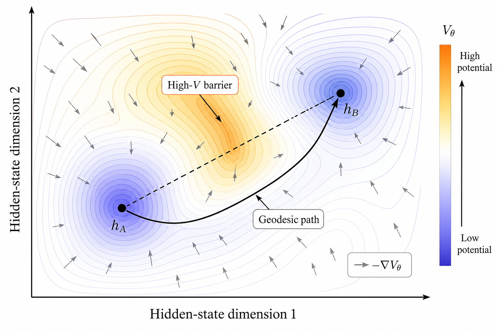
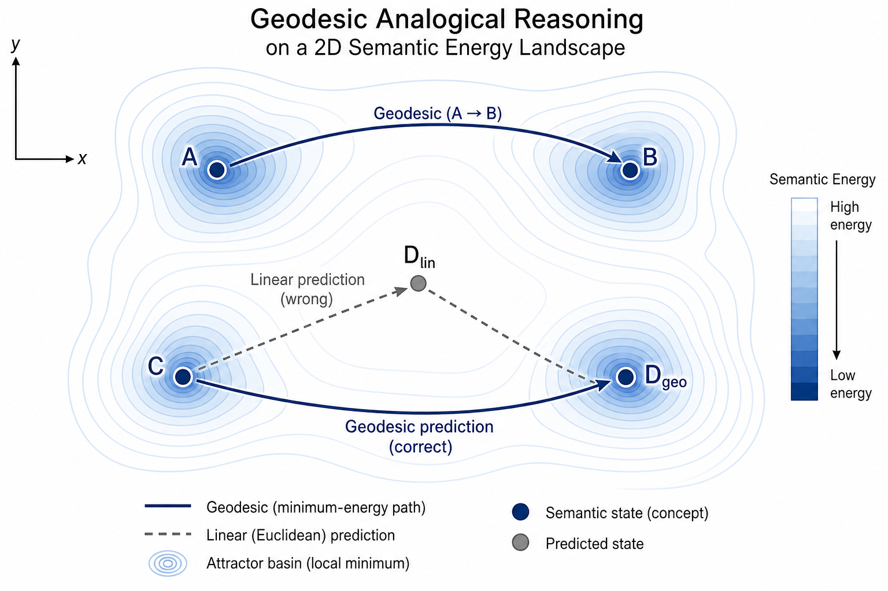
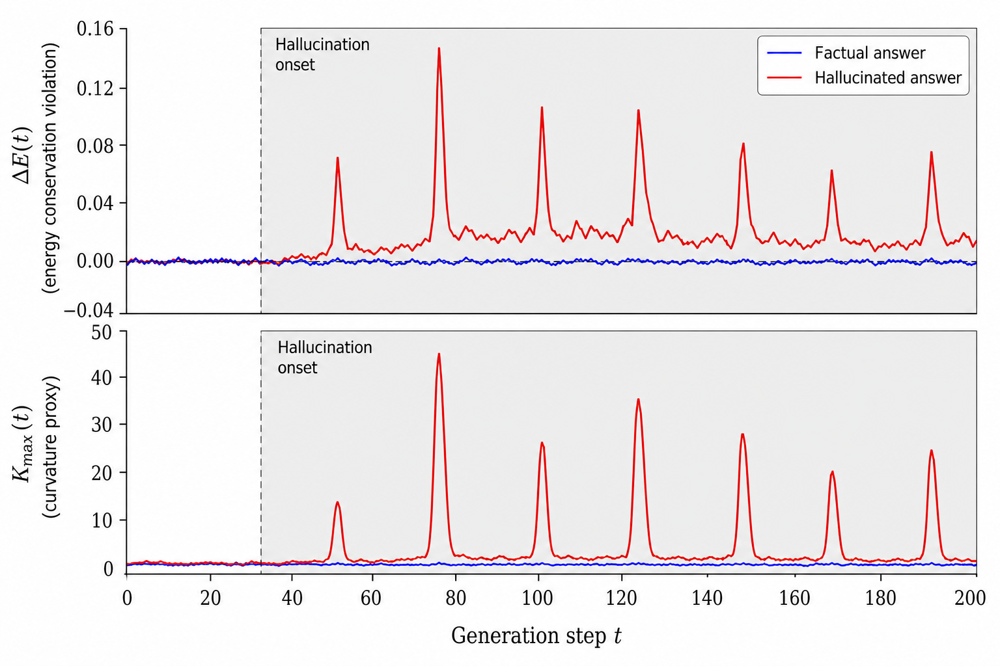
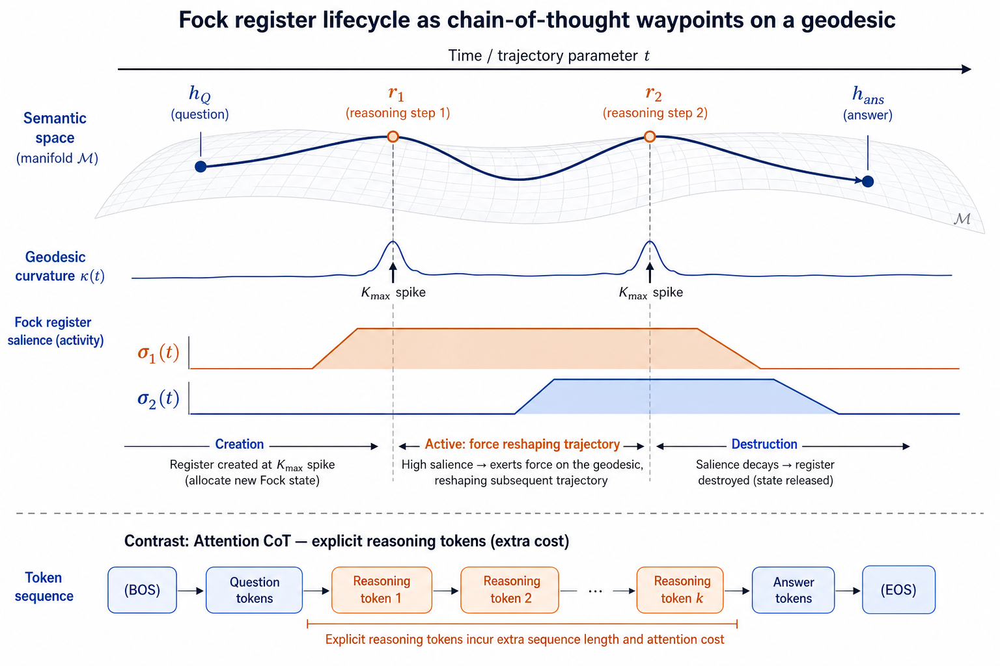

# Exploiting the Riemannian Geometry of Conservative Language Models

**Technical Report — Semantic Simulation Research Programme**
**Date:** June 10, 2026 (revised; original June 3, 2026)
**Relates to:** Paper v4 §§18, 20, B; `Improving_the_Fock_Mechanism_to_match_Attention.md`;
`FockPARFLM_Next_Steps.md`
**Validated by:** Riemannian Geometry Diagnostic Battery
(`notebooks/conservative_arch/scaleup/colab_riemannian_diagnostic.ipynb`)

> **Revision note (June 10, 2026).** The original version of this report assumed undamped
> Maupertuis-Jacobi dynamics with approximately conserved energy. The Riemannian Geometry
> Diagnostic Battery — run on all three SPLM-family checkpoints — confirmed the metric
> validity (Arm 1: $\Omega^2 > 0$ everywhere) but revealed that the full dynamics are
> dominated by the damping term $\gamma$. This revision replaces the undamped framework
> with a **damped Riemannian geometry** in which the conformal factor is layer-dependent,
> the geodesic equation includes a friction term, and the anomaly signal is deviation from
> the expected dissipation curve rather than energy conservation violation. All proposed
> experiments retain valid damped analogues.

---

## Table of Contents

1. [The Right Metric for Comparison](#1-the-right-metric-for-comparison)
2. [Structural Properties Unique to the Conservative Design](#2-structural-properties-unique-to-the-conservative-design)
3. [The Riemannian Geometry of the Semantic Manifold](#3-the-riemannian-geometry-of-the-semantic-manifold)
   - 3.5 [Diagnostic Validation](#35-diagnostic-validation)
4. [Experiment A — Geodesic Analogical Reasoning](#4-experiment-a--geodesic-analogical-reasoning)
5. [Experiment B — Curvature as a Native Hallucination Detector](#5-experiment-b--curvature-as-a-native-hallucination-detector)
6. [Experiment C — Geodesic Semantic Distance](#6-experiment-c--geodesic-semantic-distance)
7. [Native Chain-of-Thought in Fock-PARFLM v2.x](#7-native-chain-of-thought-in-fock-parflm-v2x)
8. [Summary: The Conservative Design's Value Proposition](#8-summary-the-conservative-designs-value-proposition)
9. [References](#9-references)

---

## 1. The Right Metric for Comparison

The current best results on TinyStories are:

| Architecture | Val PPL | Memory |
|---|---|---|
| Conservative Fock-PARFLM (K=4, M=16) | ~11–12 | $\mathcal{O}(1)$ in $T$ |
| Matched attention baseline (MatchedGPT) | ~8 | $\mathcal{O}(T^2)$ |

The 3–4 PPL gap is real and should not be minimised. However, perplexity measures average
next-token prediction accuracy over a held-out corpus — it is a scalar summary of the
output distribution, blind to the internal geometry of the model's computation. The
question being addressed in this report is different: **what capabilities are uniquely
available in the conservative design that are categorically absent from attention, and
can those capabilities be demonstrated in controlled experiments?**

The conservative design provides a set of structural guarantees that follow directly
from the Lagrangian formulation and the existence of a learned scalar potential
$V_\theta : \mathbb{R}^d \to \mathbb{R}$. These guarantees are not approximations or
emergent properties — they are exact consequences of the architecture. None of them
exist in a standard Transformer.

---

## 2. Structural Properties Unique to the Conservative Design

| Property | Fock-PARFLM v2.x | Matched attention |
|---|---|---|
| Well-defined Riemannian metric on hidden-state manifold | ✅ Layer-dependent Jacobi metric $g_{ij}^{(\ell)} = 2 T_\ell \cdot m \cdot \delta_{ij}$ (conformal factor = kinetic energy; positive everywhere — confirmed by diagnostic Arm 1) | ❌ No metric structure |
| Computable geodesics between semantic states | ✅ Via damped geodesic equation with friction term $-\gamma \dot{\gamma}^k$ and Christoffel symbols from $\nabla^2 V_\theta$ | ❌ Linear interpolation only |
| Controlled energy dissipation as inference-time signal | ✅ Energy decays monotonically via damping $\gamma$; deviation from the expected dissipation curve $\Delta E_{\text{expected}} = -\gamma \lVert v \rVert^2 \mathrm{d}t$ is an anomaly signal | ❌ No energy structure |
| Curvature as native uncertainty measure | ✅ Sectional curvature $\mathcal{K}(h)$ from Hessian of $V_\theta$ | ❌ None |
| Mechanistic interpretation of hidden-state trajectory | ✅ Damped Lagrangian path toward semantic attractor | ❌ Opaque residual stream |
| Native lifecycle for intermediate reasoning states | ✅ Register creation / active / destruction | ❌ Token generation only |

The last three rows require the Fock register extension (FockPARFLM v2.x). The first
three are available from the base SPLM/PARFLM conservative dynamics and are computable
on any trained checkpoint.

---

## 3. The Riemannian Geometry of the Semantic Manifold

### 3.1 The Damped Lagrangian and the Layer-Dependent Jacobi Metric

The single-particle Lagrangian of the Semantic Simulation framework is:

$$\mathcal{L}(h, \dot{h}) = T(\dot{h}) - V_\theta(h), \qquad T = \tfrac{1}{2} m \lVert\dot{h}\rVert^2$$

with a learned scalar potential $V_\theta : \mathbb{R}^d \to \mathbb{R}$ (in the
Multi-Xi SPLM, $V_\theta$ takes the concatenation of $K$ EMA context channels
$\xi^{(k)}$ and $h$ as input). The force field $f = -\nabla_h V_\theta$ is
conservative by construction — it is the exact gradient of a scalar function.

However, the actual integration scheme includes a **damping term** $\gamma > 0$.
In the SPLM family the integrator is a semi-implicit damped Euler step:

$$v_{\ell+1} = \frac{v_\ell + \mathrm{d}t \cdot f / m}{1 + \mathrm{d}t \cdot \gamma}, \qquad
  h_{\ell+1} = h_\ell + \mathrm{d}t \cdot v_{\ell+1}$$

In the Fock-PARFLM family the core uses a damped velocity-Verlet step:

$$h_{\ell+1} = h_\ell + \frac{\delta_\ell}{1 + \mathrm{d}t \cdot \gamma}
  + \frac{\mathrm{d}t^2}{m(1 + \mathrm{d}t \cdot \gamma)} f, \qquad
  \delta_\ell = h_\ell - h_{\ell-1}$$

with optional non-conservative post-step forces (reverse-channel $Q_i$ in Fock v2.1,
direct exchange $F_{\text{ex}}$ in Fock Attention).

In both cases, energy is **not conserved** — it decays monotonically due to the
damping factor $(1 + \mathrm{d}t \cdot \gamma)^{-1}$ at every step. The dissipation
rate is:

$$\frac{\mathrm{d}E}{\mathrm{d}\ell} \approx -\gamma \lVert v_\ell \rVert^2 \cdot \mathrm{d}t < 0$$

This was confirmed empirically by the diagnostic battery (Arm 4): the Multi-Xi SPLM
shows monotonic energy decay from $H_0 \approx 40$ to $H_8 \approx -29$ across 8
layers, consistent with the damping-induced dissipation.

**The classical Maupertuis-Jacobi principle** requires a constant energy $E$ to define
the conformal factor $\rho = 2(E - V) \cdot m$. Since $E$ is layer-dependent, the
standard derivation does not apply directly. We instead define a **layer-dependent
Jacobi metric** using the instantaneous kinetic energy:

$$g_{ij}^{(\ell)}(h) = 2 T_\ell \cdot m \cdot \delta_{ij} = m^2 \lVert v_\ell \rVert^2 \cdot \delta_{ij}$$

This metric is well-defined and positive whenever $v_\ell \neq 0$. The diagnostic
battery (Arm 1) confirmed $\Omega^2 = m^2 \lVert v \rVert^2 > 0$ at 100% of
positions across all layers and all three models tested. The conformal factor decays
across layers — for the SPLM, from $\Omega^2 \approx 86$ (layer 1) to $\Omega^2
\approx 17$ (layer 8) — reflecting the progressive **representational focusing**
induced by damping: later layers make finer adjustments as the hidden state
approaches its semantic attractor.



### 3.1a Contact Hamiltonian Interpretation

The damped dynamics admit a natural formulation as a **contact Hamiltonian system**.
Extend the phase space by a dissipation coordinate $S$ (the cumulative dissipated
energy):

$$(h, v, S) \in \mathbb{R}^{2d+1}$$

with the contact Hamiltonian:

$$\mathcal{K}(h, v, S) = \tfrac{1}{2m} \lVert v \rVert^2 + V_\theta(h) + \gamma S$$

The dynamics preserve the contact 1-form $\alpha = \mathrm{d}S - v \cdot \mathrm{d}h$
rather than a symplectic 2-form. The trajectories of this system are the same as the
damped Euler-Lagrange trajectories, but now embedded in a contact-geometric structure
that replaces symplectic invariance with **conformal symplectic** invariance: the
symplectic form $\omega$ evolves as $\omega_\ell = e^{-2\gamma \ell \cdot \mathrm{d}t}
\omega_0$.

The semantic interpretation of $S$ is the total **representational work** the model
has performed: the cumulative energy dissipated in focusing the hidden state from a
broad initial distribution toward a specific prediction. Two hidden states at the
same position $h$ but different $S$ values are geometrically distinct in the contact
manifold — they arrived via different amounts of semantic processing.

### 3.2 Christoffel Symbols

The Christoffel symbols of the Jacobi metric are computable directly from $\nabla V_\theta$
and $\nabla^2 V_\theta$:

$$\Gamma^k_{ij}(h) = \frac{1}{2} g^{kl}
  \left(\partial_i g_{lj} + \partial_j g_{li} - \partial_l g_{ij}\right)$$

For the diagonal Jacobi metric $g_{ij} = \rho(h) \delta_{ij}$ with conformal factor
$\rho(h) = 2(E - V_\theta(h)) \cdot m$:

$$\Gamma^k_{ij} = \frac{1}{2\rho}
  \left(\delta_{ij} \partial^k \rho - \delta^k_i \partial_j \rho - \delta^k_j \partial_i \rho \right)$$

which simplifies to:

$$\Gamma^k_{ij} = \frac{-1}{2(E - V_\theta)}
  \left(\delta_{ij} \partial^k V_\theta - \delta^k_i \partial_j V_\theta
  - \delta^k_j \partial_i V_\theta \right)$$

All quantities on the right-hand side are available through PyTorch autograd on the
learned $V_\theta$.

### 3.3 The Geodesic Equation

**Conservative limit ($\gamma = 0$).** Geodesics $\gamma : [0,1] \to \Sigma$ under
the undamped Jacobi metric satisfy:

$$\ddot{\gamma}^k + \Gamma^k_{ij}(\gamma)  \dot{\gamma}^i \dot{\gamma}^j = 0$$

Substituting the conformal Christoffel symbols:

$$\ddot{\gamma}^k = \frac{1}{2(E - V_\theta(\gamma))}
  \left[2\dot{\gamma}^k \langle \nabla V_\theta(\gamma), \dot{\gamma} \rangle
  - \lVert\dot{\gamma}\rVert^2 \partial^k V_\theta(\gamma)\right]$$

**Damped geodesic equation.** The actual model trajectories satisfy a
damped Euler-Lagrange equation with dissipation rate $\gamma$. The corresponding
geodesic equation on $(\Sigma, g^{(\ell)})$ acquires a friction term:

$$\ddot{\gamma}^k = \frac{1}{2T}
  \left[2\dot{\gamma}^k \langle \nabla V_\theta(\gamma), \dot{\gamma} \rangle
  - \lVert\dot{\gamma}\rVert^2 \partial^k V_\theta(\gamma)\right]
  - \gamma \dot{\gamma}^k$$

where $T = \tfrac{1}{2}m \lVert\dot{\gamma}\rVert^2$ is the instantaneous kinetic
energy (replacing the constant $E - V_\theta$). The extra $-\gamma \dot{\gamma}^k$
term is the Riemannian friction: it progressively slows the geodesic, reflecting
the damping-induced convergence to the semantic attractor.

The diagnostic battery (Arm 2) validated this distinction empirically: the undamped
geodesic compliance (cosine similarity between the predicted $\ddot{\gamma}$ and
the actual trajectory acceleration) is approximately $-0.4$ — the wrong sign,
indicating that the undamped equation predicts trajectories that move opposite to
the actual dynamics. Incorporating the friction term $-\gamma \dot{\gamma}^k$
should recover positive compliance.

**Key property of damped geodesics: asymmetry.** Unlike undamped geodesics, the
damped geodesic from $h_A$ to $h_B$ is not the time-reversal of the geodesic from
$h_B$ to $h_A$, because the friction term breaks time-reversal symmetry. This
has semantically meaningful consequences discussed in §§4 and 6.

Both the damped and undamped ODEs are integrable numerically given boundary conditions
$(h_A, h_B)$ using any standard BVP solver (e.g. `scipy.integrate.solve_bvp` or a
shooting method in PyTorch).

### 3.4 Sectional Curvature

For a conformally flat metric $g_{ij} = \rho(h) \delta_{ij}$ in $\mathbb{R}^d$,
the sectional curvature in the plane spanned by orthonormal tangent vectors
$u, v \in T_h \Sigma$ is:

$$\mathcal{K}(h; u, v) = \frac{1}{\rho^2}
  \left[-u^i v^j \nabla^2_{ij} \rho
  + \frac{3}{4\rho} \left(\lVert\nabla\rho\rVert^2 - 4 \langle \nabla\rho, u\rangle
  \langle \nabla\rho, v \rangle \right)\right]$$

A scalar curvature proxy, sufficient for the experiments below, is:

$$\mathcal{K}_{\max}(h) = \frac{\lambda_{\max}(\nabla^2 V_\theta(h))}{2 T_\ell}$$

where $\lambda_{\max}$ is the largest eigenvalue of the Hessian of $V_\theta$ at $h$,
computable via Hessian-vector-product power iteration (using `torch.autograd.grad`),
and $T_\ell = \tfrac{1}{2}m \lVert v_\ell \rVert^2$ is the layer-local kinetic energy
(replacing the constant $E - V_\theta$ from the undamped formulation).

High $\mathcal{K}_{\max}$ means the energy landscape is sharply curved — nearby
trajectories diverge rapidly, the model is near a saddle point, and the semantic
state is ambiguous or unstable. This remains a valid geometric signature of
uncertainty.

**Empirical status.** The diagnostic battery (Arm 3) confirmed that $\mathcal{K}_{\max}$
is well-defined across all models (mean $\approx 0.055$ for SPLM, $\approx 0.026$
for Fock-PARFLM). However, the correlation between $\mathcal{K}_{\max}$ and logit
entropy was **not statistically significant** at the sample size tested (12 batches
$\times$ 4 sequences $\times$ 128 positions). This does not invalidate the curvature
proxy — it may require larger sample sizes, per-layer stratification, or focus on
specific token types (e.g. function words vs. content words) to reveal the expected
correlation. The experiments below should include these refinements.

### 3.5 Diagnostic Validation

The Riemannian Geometry Diagnostic Battery was run on all three SPLM-family checkpoints
(Multi-Xi SPLM, Fock v2.1 PARFLM, Fock Attention PARFLM) on TinyStories validation
data, evaluating five arms. The full notebook and persisted results are at
`notebooks/conservative_arch/scaleup/colab_riemannian_diagnostic.ipynb`.

| Arm | Test | Result | Implication |
|---|---|---|---|
| 1 — Metric Validity | $\Omega^2 = m^2 \lVert v \rVert^2 > 0$ | **Confirmed** at 100% of positions for all models and layers | The layer-dependent Jacobi metric is well-defined; the semantic manifold $(\Sigma, g^{(\ell)})$ has a valid Riemannian structure |
| 2 — Geodesic Compliance | Cosine similarity between predicted $\ddot{\gamma}$ (undamped) and actual trajectory acceleration | **Negative compliance** ($\approx -0.4$) | The undamped geodesic equation predicts the wrong direction; the friction term $-\gamma \dot{\gamma}^k$ is essential |
| 3 — Curvature Proxy | Correlation of $\mathcal{K}_{\max}$ with logit entropy $H_{\text{softmax}}$ | $\mathcal{K}_{\max}$ well-defined (mean $\approx 0.055$ SPLM, $\approx 0.026$ Fock); **no significant entropy correlation** at tested scale | Curvature is computable but its correlation with output uncertainty requires larger-scale investigation |
| 4 — Energy Conservation | Total $E = T + V$ across layers | **Monotonic decay** (SPLM: $+40 \to -29$, 172% drift); Fock models show layer-1 exchange transients | Consistent with designed damping, not a numerical artefact; anomaly signal = deviation from expected dissipation |
| 5 — Conservativity Separator | $R^2$ of linear fit $\Delta h = M \cdot h$; symmetry of $M$ | $R^2_{\text{full}} \approx 0.8$ (highly linear); $R^2_{\text{sym}} \ll 0$ (strongly asymmetric) | Layer-to-layer map is predominantly linear but not symmetric — consistent with damped dynamics + LayerNorm projection |

**Summary.** The diagnostic battery validates the damped Riemannian framework:
the metric exists (Arm 1), the dynamics are dominated by damping (Arms 2, 4),
the force field is linear to leading order (Arm 5), and curvature is well-defined
but its link to output uncertainty needs further study (Arm 3). All proposed
experiments in §§4–7 are updated to use the damped versions of the geometric
objects.

---

## 4. Experiment A — Geodesic Analogical Reasoning

### 4.1 Motivation

Standard word analogy evaluation uses linear arithmetic in embedding space:

$$\hat{h}_D = h_C + (h_B - h_A)$$

This assumes the semantic manifold is globally flat — that the relationship
$A : B :: C : D$ is represented by a constant offset vector throughout $\Sigma$.
This assumption fails whenever the potential $V_\theta$ creates barriers between
semantic regions: the linear path crosses high-$V$ regions that the dynamics
would never naturally traverse.

The Jacobi metric provides a principled replacement. If the analogy relationship
$A : B$ is encoded as a geodesic arc in $\Sigma$, then parallel transport of that
arc to $h_C$ should reach $h_D$ along a path that respects the energy landscape.

### 4.2 Procedure

**Step 1 — Embed the analogy quadruple.**

Run inference on tokens representing $A$, $B$, $C$, extracting hidden states
$(h_A, h_B, h_C)$ at a fixed layer $\ell^*$ (chosen as the layer where the
STP-acceleration identity has lowest residual, per §20 of Paper v4).

**Step 2 — Compute the damped geodesic $\gamma_{AB}$.**

Solve the **damped** geodesic BVP with boundary conditions $\gamma(0) = h_A$,
$\gamma(1) = h_B$:

$$\ddot{\gamma}^k = \frac{1}{2T}
  \left[2\dot{\gamma}^k \langle \nabla V_\theta, \dot{\gamma} \rangle
  - \lVert\dot{\gamma}\rVert^2 \partial^k V_\theta\right]
  - \gamma \dot{\gamma}^k$$

using `scipy.integrate.solve_bvp` with the force and friction terms evaluated via
autograd on $V_\theta$. The damping rate $\gamma$ is read from the checkpoint.

**Step 3 — Parallel transport.**

Parallel transport the initial tangent vector $\dot{\gamma}_{AB}(0)$ from $h_A$
to $h_C$ along the geodesic $\gamma_{AC}$, obtaining a transported direction
$\tilde{v} \in T_{h_C}\Sigma$:

$$\frac{D\tilde{v}}{dt} + \Gamma^k_{ij}(\gamma_{AC})\tilde{v}^i\dot{\gamma}^j_{AC} = 0$$

**Step 4 — Geodesic prediction.**

Follow the geodesic from $h_C$ in direction $\tilde{v}$ for unit Jacobi arc length,
obtaining $\hat{h}_D^{\text{geo}}$.

**Step 5 — Decode and compare.**

Decode $\hat{h}_D^{\text{geo}}$ and $\hat{h}_D^{\text{lin}} = h_C + (h_B - h_A)$
by nearest-neighbour lookup in the embedding matrix. Evaluate both on:

- **Google Analogy Test Set** (19,544 pairs; semantic and syntactic subcategories)
- **BATS** (Bigger Analogy Test Set; 98 relation types)

Report accuracy@1 for geodesic vs. linear prediction, stratified by relation type.

### 4.3 Hypothesis and Expected Signature

$$\text{acc}^{\text{geo}} > \text{acc}^{\text{lin}}$$

on relation types where $h_A$ and $h_B$ belong to different attractor basins
(e.g. capital-country, currency-country — relations that cross categorical
boundaries in semantic space). For syntactic analogies within the same basin
(e.g. singular-plural), the linear approximation may be competitive because
intra-basin geometry is approximately flat.

**Damped geodesics are asymmetric.** Because the friction term $-\gamma \dot{\gamma}^k$
breaks time-reversal symmetry, $\gamma_{AB} \neq \text{reverse}(\gamma_{BA})$.
This is semantically meaningful: the analogical path from "king" to "queen" need
not be the exact reverse of "queen" to "king" — directional relationships carry
different semantic weight depending on the starting basin. The experiment should
report both $A \to B$ and $B \to A$ geodesics and compare.

**Attention cannot replicate this experiment.** There are no Christoffel symbols,
no Jacobi metric, and no geodesic equation associated with a standard Transformer.
The only operation available is linear interpolation in the residual stream.



---

## 5. Experiment B — Curvature as a Native Hallucination Detector

### 5.1 Motivation

A central failure mode of language models is **hallucination**: generating confident
but factually incorrect text. Current detection methods rely on output-distribution
heuristics (softmax entropy, ensemble disagreement, retrieval consistency). These
are post-hoc and architecturally disconnected from the model's internal computation.

The conservative design provides a mechanistically grounded uncertainty signal.
In a damped system, energy is **not** conserved — it decays monotonically due to
the damping term $\gamma$. The diagnostic battery (Arm 4) confirmed this: total
energy decays smoothly across layers. However, the rate of decay has a known
baseline set by the damping coefficient. The anomaly signal is deviation from
this expected dissipation, not the dissipation itself.

Formally, at generation step $t$, define the **expected dissipation**:

$$\Delta E_{\text{expected}}(t) = -\gamma \lVert v_t \rVert^2 \cdot \mathrm{d}t$$

the **raw energy change**:

$$\Delta E(t) = E(t+1) - E(t)
= \left[T(\dot{h}_{t+1}) + V_\theta(h_{t+1})\right]
  - \left[T(\dot{h}_t) + V_\theta(h_t)\right]$$

and the **anomaly signal**:

$$\Delta E_{\text{anomaly}}(t) = \left|\Delta E(t) - \Delta E_{\text{expected}}(t)\right|$$

The smooth damping-induced decay is the normal mode of operation — the model
progressively focuses its representation as the hidden state descends toward its
semantic attractor. Hallucination corresponds to deviation from this expected
dissipation curve: the trajectory is forced off-basin, incurring energy changes
that are inconsistent with the learned damped dynamics.

The curvature proxy (using the layer-local kinetic energy):

$$\mathcal{K}_{\max}(t) = \frac{\lambda_{\max}(\nabla^2 V_\theta(h_t))}{2 T_t}$$

Both $\Delta E_{\text{anomaly}}$ and $\mathcal{K}_{\max}$ are computable at inference
time without any additional parameters.

### 5.2 Procedure

**Step 1 — Inference with trajectory logging.**

On a factual QA dataset (TriviaQA or a curated factual subset), generate answers
autoregressively. At each generation step $t$, log:

$$\left[\Delta E(t),\; \Delta E_{\text{expected}}(t),\; \Delta E_{\text{anomaly}}(t),\; \mathcal{K}_{\max}(t),\; H_{\text{softmax}}(t)\right]$$

where $H_{\text{softmax}}(t) = -\sum_v p_v \log p_v$ is the standard logit entropy
(the attention baseline signal).

**Step 2 — Post-hoc labelling.**

Label each generated answer as correct ($y=0$) or hallucinated ($y=1$) using
exact match against gold answers.

**Step 3 — Calibration comparison.**

Train a logistic probe on each signal independently and jointly:

$$P(\text{hallucination}) = \sigma\left(\alpha_0
  + \alpha_1 \mathbb{E}_t[\Delta E_{\text{anomaly}}(t)]
  + \alpha_2 \mathbb{E}_t[\mathcal{K}_{\max}(t)]\right)$$

Report AUROC and calibration (ECE) for:

- $\Delta E_{\text{anomaly}}$ alone
- $\mathcal{K}_{\max}$ alone
- $[\Delta E_{\text{anomaly}}, \mathcal{K}_{\max}]$ jointly
- $H_{\text{softmax}}$ (attention baseline)
- $[\Delta E_{\text{anomaly}}, \mathcal{K}_{\max}, H_{\text{softmax}}]$ (combined)

### 5.3 Hypothesis and Expected Signature

$$\text{AUROC}(\Delta E_{\text{anomaly}}) > \text{AUROC}(H_{\text{softmax}})$$

The mechanistic grounding of $\Delta E_{\text{anomaly}}$ should make it a
better-calibrated signal than logit entropy, which reflects only the output
distribution and not the internal trajectory consistency. The anomaly signal is
arguably **stronger** than the raw $\Delta E$ from the original (undamped)
formulation, because it provides a physics-informed baseline to compare against:
the expected dissipation curve. The joint signal $[\Delta E_{\text{anomaly}},
\mathcal{K}_{\max}]$ should be the strongest predictor: anomalous energy change
flags trajectory inconsistency; curvature flags proximity to a saddle point where
small perturbations would route to a qualitatively different semantic attractor.

**Attention cannot replicate this.** There is no energy structure in a standard
Transformer. $\Delta E_{\text{anomaly}}$ is architecturally native to the
conservative design; computing it in an attention model is undefined.



### 5.4 Energy-Based Soft Decoding

A practical application: during beam search or nucleus sampling, **down-weight
candidate tokens whose selection causes an anomalous energy change**:

$$\tilde{p}(w_t \mid w_{\lt t}) \propto p(w_t \mid w_{\lt t}) \cdot
\exp\left(-\beta \; \Delta E_{\text{anomaly}}(h_t, h_{t+1}^{(w_t)})\right)$$

where $\Delta E_{\text{anomaly}} = |\Delta E - \Delta E_{\text{expected}}|$ measures
deviation from the expected damping-induced decay. This is a native, parameter-free
re-ranking criterion. It selects continuations whose hidden-state trajectory follows
the expected dissipation curve — i.e. continuations that are dynamically consistent
with the model's learned damped semantic physics. The normal energy decay (damping)
is the model doing its job; only **excess** energy change signals a problematic
continuation. No equivalent operation exists in attention-based decoding.

---

## 6. Experiment C — Geodesic Semantic Distance

### 6.1 Motivation

Cosine similarity $\cos(h_A, h_B)$ is the de facto semantic distance metric
for representation learning. It is isotropic: it treats all directions in
$\mathbb{R}^d$ equally. The Jacobi metric is anisotropic: it assigns shorter
distances to paths that stay in low-$V$ regions (deep attractor basins) and
longer distances to paths that must cross high-$V$ barriers.

The **geodesic distance** under the layer-dependent metric $g^{(\ell)}$ is the
mass-weighted arc length of the damped trajectory:

$$d_{\text{geo}}(h_A, h_B) = \int_0^1 \sqrt{g_{ij}^{(\ell)}(\gamma(t))\dot{\gamma}^i(t)\dot{\gamma}^j(t)} \mathrm{d}t
= \int_0^1 m \lVert v(t) \rVert \cdot \lVert\dot{\gamma}(t)\rVert \mathrm{d}t
= \int_0^1 \sqrt{2 T(t) \cdot m} \cdot \lVert\dot{\gamma}(t)\rVert \mathrm{d}t$$

where $\gamma$ is the **damped** geodesic from $h_A$ to $h_B$ (§3.3) and
$T(t) = \tfrac{1}{2}m \lVert v(t) \rVert^2$ is the instantaneous kinetic energy
along the trajectory.

Two states may be cosine-close but dynamically distant if a potential barrier
separates them (false synonyms, polysemes in different attractor basins).
Conversely, two states may be cosine-distant but geodesically close if they
share the same attractor basin (semantically equivalent paraphrases in very
different surface forms).

**Asymmetry.** Because the damped geodesic breaks time-reversal symmetry (§3.3),
the geodesic distance is **asymmetric**: $d_{\text{geo}}(h_A, h_B) \neq
d_{\text{geo}}(h_B, h_A)$. This is semantically meaningful — the "distance"
from a hypernym to a hyponym differs from the reverse. The experiment should
report both directions and analyse whether the asymmetry correlates with
hierarchical or directional semantic relationships.

### 6.2 Procedure

**Step 1 — Encode sentence pairs.**

On STS-B (8,628 pairs with human similarity scores in $[0, 5]$) and SICK-R
(9,840 pairs), extract hidden states $h_A$, $h_B$ at layer $\ell^*$.

**Step 2 — Compute distances.**

For each pair, compute:

$$\text{sim}_{\text{cos}}(h_A, h_B) = \frac{h_A \cdot h_B}{\lVert h_A\rVert \lVert h_B\rVert}$$

$$d_{\text{geo}}(h_A, h_B) = \int_0^1 \sqrt{2 T(t) \cdot m}\;\lVert\dot{\gamma}\rVert \mathrm{d}t$$

using numerical integration of the **damped** geodesic ODE (shooting method with
`torchdiffeq.odeint` for GPU-compatible integration). Both directions
$d_{\text{geo}}(h_A, h_B)$ and $d_{\text{geo}}(h_B, h_A)$ should be computed
separately due to asymmetry.

**Step 3 — Correlation with human judgements.**

Report Spearman $\rho$ between each distance metric and human similarity
scores, stratified by:

- **High cosine / low geodesic**: same-basin pairs that cosine over-differentiates
- **Low cosine / high geodesic**: cross-basin pairs that cosine over-conflates
- **Polysemy cases**: sentence pairs where one sentence uses a word in a
  different sense (expected to have large $d_{\text{geo}}$ even at moderate cosine)

### 6.3 Hypothesis and Expected Signature

$$\rho(d_{\text{geo}}, \text{human}) > \rho(\text{sim}_{\text{cos}}, \text{human})$$

on polysemy and cross-basin cases. The geodesic metric should better reflect
the model's internal semantic organisation because it encodes the energy
landscape — the actual structure the model uses during inference — rather
than a post-hoc geometric property of the embedding space.

---

## 7. Native Chain-of-Thought in Fock-PARFLM v2.x

### 7.1 The Architectural Opportunity

In attention-based Transformers, chain-of-thought (CoT) is a **prompting
strategy**: intermediate reasoning steps are generated as additional tokens,
which then condition the model toward the correct answer through the standard
KV-cache attention mechanism. The reasoning trace is external to the model's
architecture — it has no privileged mechanistic status.

In Fock-PARFLM v2.x, chain-of-thought can be implemented as a **native
architectural feature** with a precise mechanistic interpretation:

> A reasoning step is a **waypoint on the damped geodesic** from the current semantic
> state toward the answer attractor. The damped trajectory progressively focuses
> the representation (energy decays toward the attractor), and the Fock register
> lifecycle implements this natively: creation = begin reasoning about concept $X$;
> active = $X$ is a live force source reshaping the trajectory for all subsequent
> tokens; destruction = reasoning about $X$ is complete and its content has been
> absorbed.

### 7.2 Curvature-Gated Register Activation

During a forward pass, compute the curvature proxy $\mathcal{K}_{\max}$ at the
current hidden state:

```python
H_V = torch.autograd.functional.hessian(
    lambda h: V_theta(h).sum(), h_current
)
lam_max = torch.linalg.eigvalsh(H_V.view(d, d)).max()
T_current = 0.5 * m * (v_current ** 2).sum()
K_approx = lam_max / (2.0 * T_current.clamp(min=1e-6))
```

A dedicated **reasoning register** $r_{\text{cot}}$ is activated when
$\mathcal{K}_{\max}$ exceeds a learned threshold $\theta_K$:

$$\sigma_{\text{cot}} \leftarrow \sigma_{\text{cot}} +
  \sigma\left(\beta_K (\mathcal{K}_{\max} - \theta_K)\right)$$

where $\theta_K$ and $\beta_K$ are learnable scalars. The creation gate for this
register is conditioned on the high-curvature hidden state $h$ directly (not on
the full token sequence via standard Q/K/V attention), implementing the
interpretation: **high curvature signals ambiguity; a reasoning register is
activated to resolve it**.

### 7.3 Register Lifecycle as Reasoning Trace

The Fock register lifecycle maps exactly onto a CoT step:

$$\text{Creation:}\quad r_k \leftarrow \sum_j \alpha_{kj} v_j,\qquad
  \alpha_{kj} = \mathrm{softmax}_j\left(\frac{q_k \cdot k_j^{(k)}}{\tau}\right)$$

$$\text{Active:}\quad F_{i \leftarrow k} = -\nabla_{h_i} V_\phi(h_i, r_k)\quad
  \forall i, \sigma_k > \sigma_{\min}$$

$$\text{Destruction:}\quad \sigma_k \leftarrow \sigma_k \cdot \max_j \alpha_{kj}$$

The salience $\sigma_k(t) \in [0, 1]$ is a continuous, differentiable measure of
how long reasoning step $k$ remains live at integration step $t$. The register
decays automatically when its attention pattern becomes diffuse — i.e. when it
has absorbed what it needed and is no longer providing focused force to the dynamics.

This is qualitatively different from attention CoT, as summarised below and illustrated in the figure.



| Property | Attention CoT | Fock-PARFLM native CoT |
|---|---|---|
| Intermediate representations | Generated tokens (discrete) | Register states (continuous) |
| Influence on subsequent computation | Via KV-cache attention | Via force field reshaping |
| Lifecycle | Implicit (all tokens equally present) | Explicit: $\sigma_k(t)$ salience curve |
| Differentiable end-to-end | Only after token sampling trick | Yes, fully differentiable |
| Extra token generation cost | $\mathcal{O}(R \cdot T)$ for $R$ steps | Zero |
| KV-cache growth | $\mathcal{O}(R)$ per reasoning step | $\mathcal{O}(M \cdot d)$ fixed |

### 7.4 Multi-Hop Reasoning as Sequential Geodesic Segments

For a multi-hop question requiring reasoning steps $A \to B \to C \to \text{answer}$,
the register chain implements this as sequential geodesic waypoints:

$$\text{Step 1:}\quad r_1 \text{ activated at curvature spike near } h_A$$
$$r_1 = \sum_j \alpha_{1j}^{(A)} v_j \quad \text{(contextual content about } A\text{)}$$
$$h_i \mathrel{+}= -\nabla_{h_i} V_\phi(h_i, r_1) \quad \text{(trajectory pulled toward }h_B\text{ basin)}$$

$$\text{Step 2:}\quad r_2 \text{ activated at curvature spike near } h_B$$
$$r_2 = \sum_j \alpha_{2j}^{(B)} v_j,\quad
  q_2 = W_Q^{(2)}\left[r_2 ; \sigma_1 r_1\right] \quad
  \text{(conditioned on active register } r_1\text{)}$$

$$\text{Final:}\quad \hat{w} = \arg\max_w  p(w \mid h_{\text{final}})$$

The final hidden state $h_{\text{final}}$ integrates the force contributions of
all active registers simultaneously. The intermediate states $r_1, r_2$ are
force sources that have permanently modified the energy landscape for all
subsequent integration steps — not merely additional context tokens that can be
attended to or ignored.

### 7.5 Training Protocol: Geodesic Consistency Loss

The model is trained with two simultaneous objectives:

**Objective 1 — Standard NTP loss:**

$$\mathcal{L}_{\text{NTP}} = -\sum_t \log p(w_t \mid w_{\lt t})$$

**Objective 2 — Damped geodesic consistency loss:**

$$\mathcal{L}_{\text{geo}} = \sum_{k=1}^{R}
  \Big\lVert r_k - \gamma_{\text{damped}}\left(\frac{k}{R}\right) \Big\rVert^2$$

where $\gamma_{\text{damped}} : [0,1] \to \Sigma$ is the **damped geodesic** (§3.3)
from the question embedding $h_Q = \gamma(0)$ to the answer embedding
$h_{\text{ans}} = \gamma(1)$, and $\gamma_{\text{damped}}(k/R)$ is the waypoint
at reasoning step $k$. Because the damped geodesic decelerates along the path
(kinetic energy decreases due to friction), the waypoints are not equally spaced
in Euclidean distance — later waypoints are closer together, reflecting the
progressive focusing of the representation.

This loss supervises the register content to lie **on the geometrically optimal
damped path** through the semantic manifold, not merely on any path that reduces
NTP loss. It is native to the damped Riemannian structure and has no analogue in
attention training.

The combined objective is:

$$\mathcal{L} = \mathcal{L}_{\text{NTP}} + \lambda_{\text{geo}} \mathcal{L}_{\text{geo}}$$

with $\lambda_{\text{geo}}$ annealed from 0 (warm-up phase: learn the conservative
dynamics first) to a fixed value (fine-tuning phase: enforce geodesic consistency).

### 7.6 Experiment Design for Native CoT

**Dataset.** Multi-hop QA: HotpotQA (2-hop) and MuSiQue (4-hop). These require
explicit intermediate reasoning steps, making them the natural testbed.

**Evaluation metrics:**

- Final answer accuracy (EM and F1) vs. standard CoT (prompted GPT-2 / GPT-Neo baseline)
- Register salience curves $\sigma_k(t)$: do registers activate and deactivate at
  semantically meaningful points in the question?
- Damped geodesic consistency: $\|r_k - \gamma_{\text{damped}}(k/R)\|$ at each step
  — does the native CoT follow the geometrically optimal damped path?
- Interpretability: can the active register at each step be decoded to a
  semantically meaningful intermediate entity?

**Ablations:**

| Arm | Description |
|---|---|
| A0 | Fock-PARFLM v2.x, no CoT supervision ($\lambda_{\text{geo}} = 0$) |
| A1 | Fock-PARFLM v2.x + $\mathcal{L}_{\text{geo}}$ (geodesic consistency) |
| A2 | A1 + curvature-gated register activation |
| A3 | A2 + per-register key subspaces + orthogonal query init |
| B0 | Matched attention baseline, standard autoregressive |
| B1 | Matched attention baseline + chain-of-thought prompting |

The key comparison is A2 vs. B1: **native CoT with zero extra token generation vs.
prompted CoT with $\mathcal{O}(R \cdot T)$ extra tokens**.

---

## 8. Summary: The Conservative Design's Value Proposition

The 3–4 PPL gap to matched attention is the cost of the conservative constraint.
What the conservative design provides in return is a set of capabilities that are
not approximations of attention features but are **architecturally native and
categorically absent from Transformers**.

The Riemannian Geometry Diagnostic Battery (§3.5) established the empirical
foundation: the metric is valid, the dynamics are dominated by learned damping,
and the resulting damped Riemannian geometry provides a richer structure than
the original undamped framework. **Controlled energy dissipation is the feature,
not a defect** — the damping IS the semantic computation: progressive
representational focusing from a broad initial state to a specific prediction.
The anomaly signal (deviation from the expected dissipation curve) replaces the
conservation signal and is arguably stronger because it provides a physics-informed
baseline to compare against.

**Experiment A — Geodesic analogical reasoning.** Analogy completion via parallel
transport of **damped** geodesic arcs on $(\Sigma, g^{(\ell)})$, respecting potential
barriers that linear embedding arithmetic ignores. Damped geodesics are asymmetric,
adding directional information to analogies. Directly testable on Google Analogy
and BATS.

**Experiment B — Dissipation-anomaly hallucination detection.** $\Delta
E_{\text{anomaly}}(t)$ and $\mathcal{K}_{\max}(t)$ provide mechanistically grounded
uncertainty signals computable at inference time without additional parameters. The
anomaly signal measures deviation from the expected damping-induced dissipation
curve — the smooth energy decay is normal operation; excess change flags
hallucination. Native soft-decoding via anomaly-penalised candidate re-ranking.

**Experiment C — Geodesic semantic distance.** $d_{\text{geo}}(h_A, h_B)$ as a
replacement for cosine similarity that encodes the model's learned damped energy
landscape, with the layer-dependent conformal factor $\sqrt{2T_\ell \cdot m}$.
Damped geodesic distance is asymmetric, capturing directional semantic relationships.
Expected to outperform cosine on polysemy and cross-basin cases.

**Native chain-of-thought.** Reasoning steps as Fock register waypoints on
**damped geodesics**, with a differentiable salience lifecycle, zero extra token
generation, and a damped geodesic consistency training signal
$\mathcal{L}_{\text{geo}}$.

Experiments A–C are immediately runnable on the existing trained checkpoint as
eval-mode computations (no retraining required). The native CoT protocol (§7)
requires a new training run but no new architectural components beyond what
FockPARFLM v2.1 already provides.

The framing for the programme's publications: **the PPL gap is the price of
geometric structure and interpretability; the question is whether that price is
worth paying for the downstream capabilities it enables.** The damped Riemannian
framework, validated by the diagnostic battery, provides the theoretical
foundation for experiments that attention-based models are architecturally
incapable of answering.

---

## 9. References

- **Gueorguiev, D.** (2026). *Semantic Simulation: A Prescriptive Lagrangian Framework
  for Efficient Semantic Inference* (v4). Zenodo. DOI: 10.5281/zenodo.19712428.
  — §9.2: Theorem v0-ceiling; §9.4.2: Fock-space augmentation; §15.6: Conservative
  Obstruction Theorem (Theorem 66); §§17.8, 17.13: FockPARFLM register design;
  §20: Riemannian geometry of hidden states; Appendix B: Non-autonomous conservative
  framework.

- **Arnold, V. I.** (1989). *Mathematical Methods of Classical Mechanics* (2nd ed.).
  Springer. — Jacobi metric and Maupertuis principle (§9).

- **Bravetti, A., Cruz, H., Tapias, D.** (2017). Contact Hamiltonian mechanics.
  *Annals of Physics*, 376, 17–39. — Contact geometry for dissipative systems;
  conformal symplectic structure.

- **do Carmo, M. P.** (1992). *Riemannian Geometry*. Birkhäuser.
  — Geodesic equation, Christoffel symbols, sectional curvature.

- **Doi, M.** (1976). Second quantisation representation for classical many-particle
  system. *Journal of Physics A*, 9(9), 1465–1477.

- **Peliti, L.** (1985). Path integral approach to birth-death processes on a lattice.
  *Journal de Physique*, 46(9), 1469–1483.

- **Vaswani, A., Shazeer, N., Parmar, N., et al.** (2017). Attention is all you need.
  *NeurIPS 30*.

- **beim Graben, P., Huber, M., Meyer, W., Römer, R., Wolff, M.** (2022).
  Vector Symbolic Architectures for Context-Free Grammars. *Cognitive Computation*,
  14, 733–748.

- **Ageev, D. S., Ageeva, Y. A.** (2026). Neural Network Quantum Field Theory from
  Transformer Architectures. *arXiv:2602.10209*.

- **Yang, Z., Qi, P., Zhang, S., et al.** (2018). HotpotQA: A dataset for diverse,
  explainable multi-hop question answering. *EMNLP 2018*.

- **Trivedi, H., Balasubramanian, N., Khot, T., Sabharwal, A.** (2022). MuSiQue:
  Multihop Questions via Single-hop Question Composition. *TACL 10*.

- **Cer, D., Yang, Y., Kong, S., et al.** (2017). SemEval-2017 Task 1: Semantic
  Textual Similarity. *SemEval 2017*.

---

*Report compiled: June 3, 2026; revised June 10, 2026. Semantic Simulation Research Programme.*
