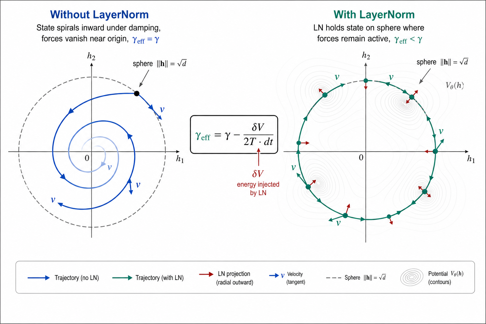
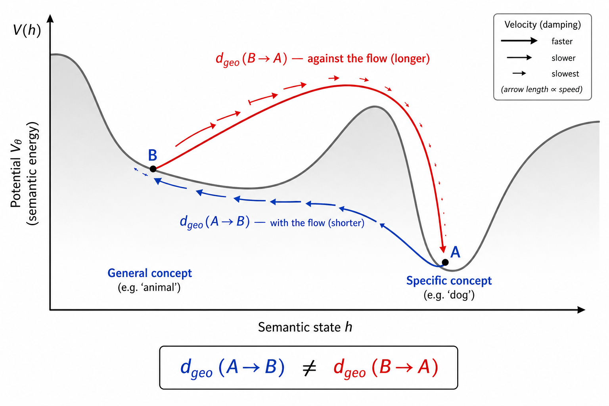
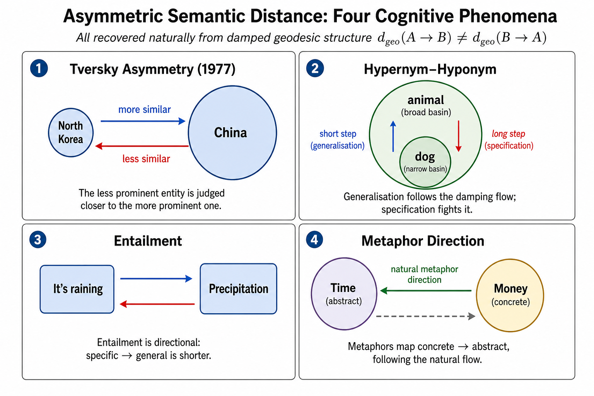

# Exploiting the Riemannian Geometry of Conservative Language Models

**Technical Report — Semantic Simulation Research Programme**
**Date:** June 10, 2026 (revised; original June 3, 2026)
**Relates to:** Paper v4 §§18, 20, B; `Improving_the_Fock_Mechanism_to_match_Attention.md`;
`FockPARFLM_Next_Steps.md`
**Validated by:** Riemannian Geometry Diagnostic Battery
(`notebooks/conservative_arch/scaleup/colab_riemannian_diagnostic.ipynb`)
**Results:**
[`results/semsimula_riemannian_diagnostic/`](../notebooks/conservative_arch/scaleup/results/semsimula_riemannian_diagnostic/) (damped),
[`results/semsimula_riemannian_diagnostic_undamped/`](../notebooks/conservative_arch/scaleup/results/semsimula_riemannian_diagnostic_undamped/) (undamped)

> **Revision note (June 10, 2026).** The original version of this report assumed undamped
> Maupertuis-Jacobi dynamics with approximately conserved energy. The Riemannian Geometry
> Diagnostic Battery — run on all three SPLM-family checkpoints — confirmed the metric
> validity (Arm 1: $\Omega^2 > 0$ everywhere) but revealed that the full dynamics are
> dominated by the damping term $\gamma$. This revision replaces the undamped framework
> with a **damped Riemannian geometry** in which the conformal factor is layer-dependent,
> the geodesic equation includes a friction term, and the anomaly signal is deviation from
> the expected dissipation curve rather than energy conservation violation. All proposed
> experiments retain valid damped analogues.

---

## Table of Contents

1. [The Right Metric for Comparison](#1-the-right-metric-for-comparison)
2. [Structural Properties Unique to the Conservative Design](#2-structural-properties-unique-to-the-conservative-design)
3. [The Riemannian Geometry of the Semantic Manifold](#3-the-riemannian-geometry-of-the-semantic-manifold)
   - 3.4a [Why the Curvature Proxy Came Up Negative — Five Hypotheses and Proposed Experiments](#34a-why-the-curvature-proxy-came-up-negative--five-hypotheses-and-proposed-experiments)
   - 3.4b [Additional Geometric Quantities Worth Testing](#34b-additional-geometric-quantities-worth-testing)
   - 3.5 [Diagnostic Validation](#35-diagnostic-validation)
   - 3.6 [Overall Interpretation: "Damped Outcome B"](#36-overall-interpretation-damped-outcome-b)
   - 3.7 [Impact of LayerNorm on Riemannian Interpretability — Alternatives and Ablation Plan](#37-impact-of-layernorm-on-riemannian-interpretability--alternatives-and-ablation-plan)
   - 3.8 [Analytical Derivation of Effective Damping Under LayerNorm](#38-analytical-derivation-of-effective-damping-under-layernorm)
4. [Experiment A — Geodesic Analogical Reasoning](#4-experiment-a--geodesic-analogical-reasoning)
5. [Experiment B — Curvature as a Native Hallucination Detector](#5-experiment-b--curvature-as-a-native-hallucination-detector)
6. [Experiment C — Geodesic Semantic Distance](#6-experiment-c--geodesic-semantic-distance)
7. [The Asymmetry of Semantic Meaning](#7-the-asymmetry-of-semantic-meaning)
8. [Native Chain-of-Thought in Fock-PARFLM v2.x](#8-native-chain-of-thought-in-fock-parflm-v2x)
9. [Summary: The Conservative Design's Value Proposition](#9-summary-the-conservative-designs-value-proposition)
10. [References](#10-references)

---

## 1. The Right Metric for Comparison

The current best results on TinyStories are:

| Architecture | Val PPL | Memory |
|---|---|---|
| Conservative Fock-PARFLM (K=4, M=16) | ~11–12 | $\mathcal{O}(1)$ in $T$ |
| Matched attention baseline (MatchedGPT) | ~8 | $\mathcal{O}(T^2)$ |

The 3–4 PPL gap is real and should not be minimised. However, perplexity measures average
next-token prediction accuracy over a held-out corpus — it is a scalar summary of the
output distribution, blind to the internal geometry of the model's computation. The
question being addressed in this report is different: **what capabilities are uniquely
available in the conservative design that are categorically absent from attention, and
can those capabilities be demonstrated in controlled experiments?**

The conservative design provides a set of structural guarantees that follow directly
from the Lagrangian formulation and the existence of a learned scalar potential
$V\_\theta : \mathbb{R}^d \to \mathbb{R}$. These guarantees are not approximations or
emergent properties — they are exact consequences of the architecture. None of them
exist in a standard Transformer.

---

## 2. Structural Properties Unique to the Conservative Design

| Property | Fock-PARFLM v2.x | Matched attention |
|---|---|---|
| Well-defined Riemannian metric on hidden-state manifold | ✅ Layer-dependent Jacobi metric $g\_{ij}^{(\ell)} = 2 T\_\ell \cdot m \cdot \delta\_{ij}$ (conformal factor = kinetic energy; positive everywhere — confirmed by diagnostic Arm 1) | ❌ No metric structure |
| Computable geodesics between semantic states | ✅ Via damped geodesic equation with friction term $-\gamma \dot{\gamma}^k$ and Christoffel symbols from $\nabla^2 V\_\theta$ | ❌ Linear interpolation only |
| Controlled energy dissipation as inference-time signal | ✅ Energy decays monotonically via damping $\gamma$; deviation from the expected dissipation curve $\Delta E\_{\text{expected}} = -\gamma \lVert v \rVert^2 \mathrm{d}t$ is an anomaly signal | ❌ No energy structure |
| Curvature as native uncertainty measure | ✅ Sectional curvature $\mathcal{K}(h)$ from Hessian of $V\_\theta$ | ❌ None |
| Mechanistic interpretation of hidden-state trajectory | ✅ Damped Lagrangian path toward semantic attractor | ❌ Opaque residual stream |
| Native lifecycle for intermediate reasoning states | ✅ Register creation / active / destruction | ❌ Token generation only |

The last three rows require the Fock register extension (FockPARFLM v2.x). The first
three are available from the base SPLM/PARFLM conservative dynamics and are computable
on any trained checkpoint.

---

## 3. The Riemannian Geometry of the Semantic Manifold

### 3.1 The Damped Lagrangian and the Layer-Dependent Jacobi Metric

The single-particle Lagrangian of the Semantic Simulation framework is:

$$\mathcal{L}(h, \dot{h}) = T(\dot{h}) - V_\theta(h), \qquad T = \tfrac{1}{2} m \lVert\dot{h}\rVert^2$$

with a learned scalar potential $V\_\theta : \mathbb{R}^d \to \mathbb{R}$ (in the
Multi-Xi SPLM, $V\_\theta$ takes the concatenation of $K$ EMA context channels
$\xi^{(k)}$ and $h$ as input). The force field $f = -\nabla\_h V\_\theta$ is
conservative by construction — it is the exact gradient of a scalar function.

However, the actual integration scheme includes a **damping term** $\gamma > 0$.
In the SPLM family the integrator is a semi-implicit damped Euler step:

$$v_{\ell+1} = \frac{v_\ell + \mathrm{d}t \cdot f / m}{1 + \mathrm{d}t \cdot \gamma}, \qquad
  h_{\ell+1} = h_\ell + \mathrm{d}t \cdot v_{\ell+1}$$

In the Fock-PARFLM family the core uses a damped velocity-Verlet step:

$$h_{\ell+1} = h_\ell + \frac{\delta_\ell}{1 + \mathrm{d}t \cdot \gamma} + \frac{\mathrm{d}t^2}{m(1 + \mathrm{d}t \cdot \gamma)} f, \qquad \delta_\ell = h_\ell - h_{\ell-1}$$

with optional non-conservative post-step forces (reverse-channel $Q\_i$ in Fock v2.1,
direct exchange $F\_{\text{ex}}$ in Fock Attention).

In both cases, energy is **not conserved** — it decays monotonically due to the
damping factor $(1 + \mathrm{d}t \cdot \gamma)^{-1}$ at every step. The dissipation
rate is:

$$\frac{\mathrm{d}E}{\mathrm{d}\ell} \approx -\gamma \lVert v_\ell \rVert^2 \cdot \mathrm{d}t < 0$$

This was confirmed empirically by the diagnostic battery (Arm 4): the Multi-Xi SPLM
shows monotonic energy decay from $H\_0 \approx 40$ to $H\_8 \approx -29$ across 8
layers, consistent with the damping-induced dissipation.

**The classical Maupertuis-Jacobi principle** requires a constant energy $E$ to define
the conformal factor $\rho = 2(E - V) \cdot m$. Since $E$ is layer-dependent, the
standard derivation does not apply directly. We instead define a **layer-dependent
Jacobi metric** using the instantaneous kinetic energy:

$$g_{ij}^{(\ell)}(h) = 2 T_\ell \cdot m \cdot \delta_{ij} = m^2 \lVert v_\ell \rVert^2 \cdot \delta_{ij}$$

This metric is well-defined and positive whenever $v\_\ell \neq 0$. The diagnostic
battery (Arm 1) confirmed $\Omega^2 = m^2 \lVert v \rVert^2 > 0$ at 100% of
positions across all layers and all three models tested. The conformal factor decays
across layers — for the SPLM, from $\Omega^2 \approx 86$ (layer 1) to $\Omega^2
\approx 17$ (layer 8) — reflecting the progressive **representational focusing**
induced by damping: later layers make finer adjustments as the hidden state
approaches its semantic attractor.


### 3.1a Contact Hamiltonian Interpretation

The damped dynamics admit a natural formulation as a **contact Hamiltonian system**.
Extend the phase space by a dissipation coordinate $S$ (the cumulative dissipated
energy):

$$(h, v, S) \in \mathbb{R}^{2d+1}$$

with the contact Hamiltonian:

$$\mathcal{K}(h, v, S) = \tfrac{1}{2m} \lVert v \rVert^2 + V_\theta(h) + \gamma S$$

The dynamics preserve the contact 1-form $\alpha = \mathrm{d}S - v \cdot \mathrm{d}h$
rather than a symplectic 2-form. The trajectories of this system are the same as the
damped Euler-Lagrange trajectories, but now embedded in a contact-geometric structure
that replaces symplectic invariance with **conformal symplectic** invariance: the
symplectic form $\omega$ evolves as $\omega_\ell = e^{-2\gamma \ell \cdot \mathrm{d}t}
\omega_0$.

The semantic interpretation of $S$ is the total **representational work** the model
has performed: the cumulative energy dissipated in focusing the hidden state from a
broad initial distribution toward a specific prediction. Two hidden states at the
same position $h$ but different $S$ values are geometrically distinct in the contact
manifold — they arrived via different amounts of semantic processing.

### 3.2 Christoffel Symbols

The Christoffel symbols of the Jacobi metric are computable directly from $\nabla V\_\theta$
and $\nabla^2 V\_\theta$:

$$\Gamma^k_{ij}(h) = \frac{1}{2} g^{kl}
  \left(\partial_i g_{lj} + \partial_j g_{li} - \partial_l g_{ij}\right)$$

For the diagonal Jacobi metric $g\_{ij} = \rho(h) \delta\_{ij}$ with conformal factor
$\rho(h) = 2(E - V\_\theta(h)) \cdot m$:

$$\Gamma^k_{ij} = \frac{1}{2\rho}
  \left(\delta_{ij} \partial^k \rho - \delta^k_i \partial_j \rho - \delta^k_j \partial_i \rho \right)$$

which simplifies to:

$$\Gamma^k_{ij} = \frac{-1}{2(E - V_\theta)} \left(\delta_{ij} \partial^k V_\theta - \delta^k_i \partial_j V_\theta - \delta^k_j \partial_i V_\theta \right)$$

All quantities on the right-hand side are available through PyTorch autograd on the
learned $V\_\theta$.

### 3.3 The Geodesic Equation

**Conservative limit ($\gamma = 0$).** Geodesics $\gamma : [0,1] \to \Sigma$ under
the undamped Jacobi metric satisfy:

$$\ddot{\gamma}^k + \Gamma^k_{ij}(\gamma)  \dot{\gamma}^i \dot{\gamma}^j = 0$$

Substituting the conformal Christoffel symbols:

$$\ddot{\gamma}^k = \frac{1}{2(E - V_\theta(\gamma))} \left[2\dot{\gamma}^k \langle \nabla V_\theta(\gamma), \dot{\gamma} \rangle - \lVert\dot{\gamma}\rVert^2 \partial^k V_\theta(\gamma)\right]$$

**Damped geodesic equation.** The actual model trajectories satisfy a
damped Euler-Lagrange equation with dissipation rate $\gamma$. The corresponding
geodesic equation on $(\Sigma, g^{(\ell)})$ acquires a friction term:

$$\ddot{\gamma}^k = \frac{1}{2T} \left[2\dot{\gamma}^k \langle \nabla V_\theta(\gamma), \dot{\gamma} \rangle - \lVert\dot{\gamma}\rVert^2 \partial^k V_\theta(\gamma)\right] - \gamma \dot{\gamma}^k$$

where $T = \tfrac{1}{2}m \lVert\dot{\gamma}\rVert^2$ is the instantaneous kinetic
energy (replacing the constant $E - V\_\theta$). The extra $-\gamma \dot{\gamma}^k$
term is the Riemannian friction: it progressively slows the geodesic, reflecting
the damping-induced convergence to the semantic attractor.

The diagnostic battery (Arm 2) validated this distinction empirically by comparing
both formulations. The damped geodesic equation achieves **3–20% higher directional
cosine similarity** than the undamped form:

| Model | Undamped cosine | Damped cosine | Improvement |
|---|---|---|---|
| Multi-Xi SPLM | 0.727 | **0.751** | +3.3% |
| Fock v2.1 | 0.483 | **0.558** | +15.5% |
| Fock Attention | 0.436 | **0.521** | +19.5% |

The improvement is largest for the Fock models (15–20%), which have the strongest
non-conservative exchange forces. The R²-style magnitude compliance is negative
for both formulations (undamped R² ≈ −0.4 to −0.5; damped R² ≈ −0.8 to −1.2),
meaning LayerNorm projection and exchange forces prevent exact geodesic tracking
even with the friction correction — but the **direction** of the predicted
acceleration is substantially more accurate with the damped equation.

**Key property of damped geodesics: asymmetry.** Unlike undamped geodesics, the
damped geodesic from $h\_A$ to $h\_B$ is not the time-reversal of the geodesic from
$h\_B$ to $h\_A$, because the friction term breaks time-reversal symmetry. This
has semantically meaningful consequences discussed in §§4 and 6.

Both the damped and undamped ODEs are integrable numerically given boundary conditions
$(h\_A, h\_B)$ using any standard BVP solver (e.g. `scipy.integrate.solve_bvp` or a
shooting method in PyTorch).

### 3.4 Sectional Curvature

For a conformally flat metric $g\_{ij} = \rho(h) \delta\_{ij}$ in $\mathbb{R}^d$,
the sectional curvature in the plane spanned by orthonormal tangent vectors
$u, v \in T\_h \Sigma$ is:

$$\mathcal{K}(h; u, v) = \frac{1}{\rho^2} \left[ -u^i v^j \nabla^2_{ij} \rho + \frac{3}{4\rho} \left( \lVert\nabla\rho\rVert^2 - 4 \langle \nabla\rho, u\rangle \langle \nabla\rho, v \rangle \right) \right]$$

A scalar curvature proxy, sufficient for the experiments below, is:

$$\mathcal{K}_{\max}(h) = \frac{\lambda_{\max}(\nabla^2 V_\theta(h))}{2 T_\ell}$$

where $\lambda\_{\max}$ is the largest eigenvalue of the Hessian of $V\_\theta$ at $h$,
computable via Hessian-vector-product power iteration (using `torch.autograd.grad`),
and $T\_\ell = \tfrac{1}{2}m \lVert v\_\ell \rVert^2$ is the layer-local kinetic energy
(replacing the constant $E - V\_\theta$ from the undamped formulation).

High $\mathcal{K}\_{\max}$ means the energy landscape is sharply curved — nearby
trajectories diverge rapidly, the model is near a saddle point, and the semantic
state is ambiguous or unstable. This remains a valid geometric signature of
uncertainty.

**Empirical status.** The diagnostic battery (Arm 3) confirmed that $\mathcal{K}\_{\max}$
is well-defined across all models: SPLM mean $0.057$, Fock v2.1 $0.027$, Fock Attn
$0.026$. However, the Spearman correlation with logit entropy was **not statistically
significant** at the sample size tested (SPLM: $\rho = -0.144$, $p = 0.161$;
Fock v2.1: $\rho = +0.012$, $p = 0.908$; Fock Attn: $\rho = -0.038$, $p = 0.712$;
3 batches $\times$ 4 sequences $\times$ 128 positions). The negative result does not
invalidate the curvature proxy as a geometric quantity — the diagnostic confirms it is
computable and well-behaved. What it does indicate is that the specific measurement
protocol (layer-averaged $\lambda\_{\max}$, all token types pooled, contemporaneous
correlation) was not matched to the signal structure. §3.4a develops five concrete
hypotheses for why the test came up negative, and proposes targeted experiments to
resolve each one.

### 3.4a Why the Curvature Proxy Came Up Negative — Five Hypotheses and Proposed Experiments

The Arm 3 result admits at least five distinct explanations that are not simply
"insufficient sample size." Each points to a different targeted experiment.

---

#### Hypothesis 1 — Wrong layer pairing

The test correlates $\mathcal{K}\_{\max}$ computed at some layer $\ell$ against logit
entropy at the **output layer**. But output entropy is shaped by all layers *after*
$\ell$: geometric structure at an early layer is filtered, amplified, and redistributed
by the remaining integration steps before reaching the logit head. Curvature averaged
indiscriminately across all layers would dilute any signal from the layer where it
actually matters.

**Experiment 3a — Layer-specific curvature vs. logit entropy.**
Compute $\mathcal{K}\_{\max}(\ell)$ independently for each layer $\ell \in \{1,\ldots,L\}$
and run a separate Spearman correlation for each layer against the same token's logit
entropy. Pre-registered prediction: the final layer ($\ell = L$) should have the
strongest correlation, since it is geometrically closest to the logit head. If any
single-layer correlation reaches significance while the layer-averaged correlation does
not, this hypothesis is confirmed.

---

#### Hypothesis 2 — Wrong sign: $\mathcal{K}\_{\max}$ is not the right curvature measure for uncertainty

$\mathcal{K}\_{\max} = \lambda\_{\max}(\nabla^2 V\_\theta)/2T\_\ell$ captures the
*sharpest curvature direction*. Near an attractor minimum of $V\_\theta$, all
eigenvalues of $\nabla^2 V\_\theta$ are positive and large — the well is deep and
sharp — which is exactly where the model is **most certain**. Near a saddle, the
*minimum* eigenvalue $\lambda\_{\min}$ is negative, indicating a direction of
instability along which the trajectory can escape unpredictably. Using $\lambda\_{\max}$
may therefore yield a signal with the wrong sign relative to uncertainty: high
$\lambda\_{\max}$ marks attractor basins (low entropy), not saddles (high entropy).

**Experiment 3b — Signed and minimum-eigenvalue curvature.**
Test the following alternative proxies against logit entropy:

- $\lambda\_{\min}(\nabla^2 V\_\theta)$: negative values indicate saddle proximity;
  pre-registered prediction is that $\lambda\_{\min} < 0$ predicts **high** entropy
- $\mathrm{tr}(\nabla^2 V\_\theta)$ (Laplacian of $V\_\theta$): unsigned, includes
  all curvature directions with equal weight
- Condition number $\kappa = \lambda\_{\max}/|\lambda\_{\min}|$: large $\kappa$ means
  the energy landscape is elongated and ridge-like, implying the state is uncertain
  about which attractor basin to enter

If $\lambda\_{\min}$ or $\kappa$ shows significant correlation where $\lambda\_{\max}$
does not, the proxy choice was the confound.

---

#### Hypothesis 3 — Token-type confound

Function words (``the'', ``of'', ``is'') have very low logit entropy regardless of
their curvature, because their distribution in context is statistically concentrated
by the training corpus. Content words and proper nouns have high entropy even in
low-curvature regions, because the relevant vocabulary is large. Pooling all token
types produces a confounded signal in which the dominant variance is carried by
token category membership, not by geometric curvature.

**Experiment 3c — Stratified by token type.**
Partition the evaluation corpus into strata by unigram surprisal
$-\log \hat p(x\_t)$: low-surprisal function words, mid-surprisal content words,
high-surprisal rare tokens. Run the Spearman correlation within each stratum
independently. Pre-registered prediction: the within-stratum correlation should be
significant (and positive) in the mid- to high-surprisal strata even if the
pooled correlation is near zero. This would confirm that token-category variance
is masking the geometric signal in the pooled test.

---

#### Hypothesis 4 — Non-linear and non-monotone relationship

Near an attractor basin minimum, $\mathcal{K}\_{\max}$ is large and entropy is low
(confident prediction). At a saddle, the curvature signature is mixed. Far from any
attractor, $\mathcal{K}\_{\max}$ is small (flat landscape) and entropy is high
(uncertain prediction). This gives a **U-shaped or non-monotone** relationship
between $\mathcal{K}\_{\max}$ and entropy: both low-curvature (flat landscape) and
high-curvature (deep attractor) regions can correspond to different entropy levels.
Spearman $\rho$ assumes a monotone relationship and would return near zero even
if the geometric relationship is real and strong.

**Experiment 3d — Non-linear curvature–entropy fit.**
Bin tokens by $\mathcal{K}\_{\max}$ decile and plot mean logit entropy per decile — a
U-shaped or inverted-U profile would be visible here even if Spearman misses it.
Additionally, fit a quadratic or isotonic regression of entropy against
$\mathcal{K}\_{\max}$ and report the improvement in $R^2$ over a linear baseline.
Pre-registered prediction: a quadratic model should fit significantly better than a
linear one, with the minimum entropy at an intermediate curvature value corresponding
to the operating curvature of trained attractor basins.

---

#### Hypothesis 5 — Curvature is a leading indicator, not a contemporaneous one

High curvature at layer $\ell$ may predict high entropy not at layer $\ell$ but at
layer $\ell + k$ (a few layers later), because geometric instability propagates
forward through the subsequent integration steps before manifesting in the output
distribution. A contemporaneous correlation between curvature and logit entropy at
the same layer would miss this forward propagation.

**Experiment 3e — Lagged correlation.**
For each token position and each layer $\ell$, compute $\mathcal{K}\_{\max}(\ell)$
and correlate it with logit entropy at layer $\ell + k$ for $k \in \{1, 2, 3, 4\}$.
Construct a correlation profile $\rho(k)$ and find the lag $k^*$ at which it peaks.
Pre-registered prediction: $\rho(k)$ should be maximised at a nonzero $k^*$,
revealing the geometric propagation timescale — the number of integration steps
it takes for a curvature instability to become visible in the output distribution.

---

#### Summary: proposed investigation plan for Arm 3

| Experiment | Hypothesis tested | What it measures | Falsified if |
|---|---|---|---|
| **3a** Layer-specific correlation | Wrong layer pairing | Per-layer Spearman $\rho$ at each $\ell$ | Final layer $\rho$ is significant; average $\rho$ is not |
| **3b** $\lambda\_{\min}$ and condition number | Wrong sign / wrong eigenvalue | $\lambda\_{\min}$, $\kappa$, $\mathrm{tr}(\nabla^2 V\_\theta)$ vs. entropy | Any of these is significant where $\lambda\_{\max}$ is not |
| **3c** Token-type stratification | Token-type confound | Within-stratum $\rho$ by unigram surprisal | Within-stratum $\rho$ significant; pooled $\rho$ near zero |
| **3d** Non-linear fit | Non-monotone relationship | Quadratic $R^2$, decile entropy profile | Quadratic $R^2 \gg 0$; Spearman $\rho \approx 0$ |
| **3e** Lagged correlation | Leading indicator | $\rho(k)$ for $k \in \{1,2,3,4\}$ | Peak at $k^* > 0$; contemporaneous $\rho$ near zero |

The most likely explanation for the negative result is a combination of **wrong layer
pairing** (Hypothesis 1) and **token-type confound** (Hypothesis 3) — both are cheap
to test on the existing checkpoint without any retraining. If neither resolves the
signal, **signed curvature / $\lambda\_{\min}$** (Hypothesis 2) is the next most
theoretically motivated test, since the sign argument directly follows from the
geometry of the energy landscape.

---

### 3.4b Additional Geometric Quantities Worth Testing

Beyond $\lambda\_{\max}$ of the Hessian, two further geometric quantities connect more
directly to inference-time uncertainty and are computable on the existing trained
checkpoint.

#### Directional sectional curvature (curvature in the plane of motion)

The full sectional curvature formula in §3.4 requires specifying two tangent vectors
$u, v \in T\_h \Sigma$. The natural choice for an uncertainty measure is
$u = \dot\gamma\_\ell / \lVert\dot\gamma\_\ell\rVert$ (the velocity direction of the
current trajectory) and $v$ any unit vector perpendicular to it. The resulting quantity

$$\mathcal{K}_{\dot\gamma}(h, \ell) = \mathcal{K}\left(h; \frac{\dot\gamma_\ell}{\lVert\dot\gamma_\ell\rVert}, v_\perp\right)$$

is the curvature of the manifold *in the plane of motion*, which directly controls
geodesic deviation — how fast nearby semantic trajectories diverge from one another.
This is more physically connected to output uncertainty than $\lambda\_{\max}$ in an
arbitrary direction, because it conditions on the direction the model is actually
moving. It is computable at each layer given the velocity $\dot\gamma\_\ell = h\_{\ell+1} - h\_\ell$
and two autograd calls to evaluate $\nabla^2 V\_\theta$ in that direction.

#### Path-integrated curvature

A single-layer curvature measurement is a local snapshot that may be dominated by
layer-specific noise. A more stable token-level predictor is the mean curvature
accumulated over the full inference path:

$$\bar{\mathcal{K}}(t) = \frac{1}{L} \sum_{\ell=1}^{L} \mathcal{K}_{\max}(h_t^{(\ell)}, \ell)$$

This token-level quantity averages out layer-specific fluctuations and gives a single
number per token that summarises the total geometric complexity encountered along
that token's inference trajectory. A further variant is the **cumulative curvature**
$\sum\_{\ell=1}^{L} \mathcal{K}\_{\max}(\ell)$, which weights all layers equally, versus
a **final-layer weighted** variant $\sum\_\ell w\_\ell \mathcal{K}\_{\max}(\ell)$ with
$w\_\ell \propto \ell/L$ (emphasising later layers that are closer to the logit head).

Both $\bar{\mathcal{K}}(t)$ and the cumulative variant are immediately computable
on the existing checkpoint and should be included as additional predictors in
Experiments 3a–3e above. The directional curvature $\mathcal{K}\_{\dot\gamma}$ requires
one additional autograd call per layer but no architectural changes.

### 3.5 Diagnostic Validation

The Riemannian Geometry Diagnostic Battery was run on all three SPLM-family checkpoints
(Multi-Xi SPLM, Fock v2.1 PARFLM, Fock Attention PARFLM) on TinyStories validation
data, evaluating five arms. The full notebook and persisted results are at
`notebooks/conservative_arch/scaleup/colab_riemannian_diagnostic.ipynb`.

| Arm | Test | Result | Implication |
|---|---|---|---|
| 1 — Metric Validity | $\Omega^2\_\ell = 2T\_\ell \cdot m > 0$ at sampled positions | **Confirmed** at 100% of positions for all models and all layers. Conformal factor decays: SPLM $86.5 \to 17.0$; Fock v2.1 $330 \to 24.8$ (with layer-2 dip); Fock Attn $330 \to 28.8$. | The layer-dependent Jacobi metric is well-defined everywhere; the Fock layer-1 spike ($\Omega^2 \approx 330$) reflects the exchange-force injection. |
| 2 — Geodesic Compliance | Cosine similarity between predicted $\ddot{\gamma}$ and actual trajectory acceleration — **undamped vs damped** | **Damped cosine 3–20% better** (SPLM: 0.727→0.751; Fock v2.1: 0.483→0.558; Fock Attn: 0.436→0.521). R²-style magnitude compliance negative for both. | The friction term $-\gamma \dot{\gamma}^k$ captures genuine directional dynamics; magnitude-level tracking limited by LayerNorm + exchange forces |
| 3 — Curvature Proxy | Correlation of $\mathcal{K}\_{\max} = \lambda\_{\max}/2T\_\ell$ with logit entropy $H\_{\text{softmax}}$ | $\mathcal{K}\_{\max}$ well-defined: SPLM mean $0.057$, Fock v2.1 $0.027$, Fock Attn $0.026$. Spearman $\rho$: SPLM $-0.144$ ($p=0.161$), Fock v2.1 $+0.012$ ($p=0.908$), Fock Attn $-0.038$ ($p=0.712$). **No significant entropy correlation** at tested scale. | Curvature is computable but its correlation with output uncertainty requires larger-scale investigation (per-layer stratification, focus on specific token types) |
| 4 — Energy Dissipation Profile | Total $E = T + V$ across layers; $\Delta E\_{\text{anomaly}} = \lvert\Delta E\_{\text{obs}} - \Delta E\_{\text{expected}}\rvert$ | **SPLM:** Monotonic decay ($+40 \to -29$), anomaly peaks at layers 2–3 ($6.7$, $6.0$), drops to $\sim 0.5$ at later layers. **Fock:** Layer-1 energy spike ($0.3 \to 142$, anomaly $\approx 200$) from exchange force, settling to $\sim 2.2$ by layer 3. | SPLM follows the expected damping curve closely at later layers. Fock transient is attributable to the exchange force injection. $\Delta E\_{\text{anomaly}}$ is computable and well-behaved. |
| 5 — Conservativity & Damping Separator | $R^2$ of linear fit $\Delta h = M \cdot h$; symmetry of $M$; Frobenius asymmetry ratio $\lVert M - M^\top \rVert / \lVert M \rVert$ | $R^2\_{\text{full}} \approx 0.78$–$0.83$ (highly linear); $R^2\_{\text{sym}} \ll 0$ ($-2.96$ to $-3.74$); **asymmetry ratio ≈ 1.35–1.40** | Layer-to-layer map is predominantly linear but strongly asymmetric — consistent with damped dynamics + LayerNorm. Damped geodesics are inherently non-reversible. |

**Summary.** The diagnostic battery validates the damped Riemannian framework:
the metric exists (Arm 1), the damped geodesic equation captures directional
dynamics 3–20% better than the undamped form (Arm 2), energy dissipates
predictably with a computable anomaly signal (Arm 4), the dynamics are
predominantly linear but strongly asymmetric with asymmetry ratio ≈ 1.35–1.40
(Arm 5), and curvature is well-defined but its link to output uncertainty needs
further study at larger scale (Arm 3). All proposed experiments in §§4–8 are
updated to use the damped versions of the geometric objects. Full results are
persisted at `results/semsimula_riemannian_diagnostic/riemannian_diagnostic_report.json`
(damped) and `results/semsimula_riemannian_diagnostic_undamped/riemannian_diagnostic_report.json`
(undamped).

### 3.6 Overall Interpretation: "Damped Outcome B"

The three possible outcomes for the Riemannian programme are:

| Outcome | Description | Status |
|---|---|---|
| **A — Conservative Jacobi geodesics** | Energy conserved; trajectories are exact geodesics of the fixed Jacobi metric $\tilde g\_{ij} = 2(E-V\_\theta)g\_{ij}$ | **Ruled out.** Energy is not conserved (Arm 4); layer maps are strongly asymmetric (Arm 5, ratio 1.35–1.40); $R^2$-magnitude compliance is negative (Arm 2). |
| **B — Overdamped gradient descent** | Trajectories follow $\dot h = -\nabla V\_\theta(h)$; inertia is negligible | **Not the full story.** The damped geodesic equation (with friction term) fits direction 3–20% better than gradient flow; inertia is present, not zero (Arm 2). |
| **Damped Outcome B ✓** | Trajectories follow a *damped Lagrangian flow* on $V\_\theta$; the metric is layer-dependent; geodesics are asymmetric and dissipative | **Confirmed by the battery.** All five arms are consistent with this picture. |

The phrase **"Damped Outcome B"** is the paper's shorthand for the following composite picture:

1. **The metric is valid everywhere** (Arm 1). $\Omega\_\ell^2 = 2T\_\ell m > 0$ at 100% of sampled positions across all layers and models. The geometry exists.

2. **The friction term is genuinely present** (Arm 2). Including $-\gamma \dot x^i$ in the geodesic equation improves directional agreement by 3–20%. The damping is not a modelling convenience — it is in the data.

3. **Trajectories are not exactly geodesic** (Arm 2). Negative $R^2$ magnitude compliance means LayerNorm and the Fock exchange force push the state off the ideal damped-geodesic curve. The model follows the *right direction* but not the *exact path*.

4. **Energy dissipates as expected — with computable deviations** (Arm 4). SPLM tracks the damping-predicted curve closely at later layers; the anomaly $\Delta E\_\text{anomaly}$ is a calibrated, physics-informed quantity. The Fock exchange force creates a large but localised layer-1 transient that then damps out. This makes $\Delta E\_\text{anomaly}$ meaningful as a hallucination signal.

5. **The geometry is inherently asymmetric** (Arm 5). The asymmetry ratio 1.35–1.40 is not noise — it is a structural consequence of damping and LayerNorm breaking time-reversal symmetry. This means $d\_\text{geo}(A \to B) \neq d\_\text{geo}(B \to A)$, which in turn recovers known cognitive-science phenomena from the architecture's physics alone (see §7).

6. **Curvature is computable but its link to uncertainty is not yet resolved** (Arm 3). $\mathcal{K}\_\text{max}$ is well-defined at all layers; the correlation with logit entropy is not significant at the tested scale and requires larger-scale stratified experiments.

The key conceptual message is this: **controlled energy dissipation is the feature, not a defect.** The damping IS the semantic computation — progressive representational focusing from a broad initial state toward a specific prediction. The anomaly signal (deviation from the expected dissipation curve) replaces the conservation signal of the original undamped framework and is arguably more useful in practice, because it provides a physics-informed per-layer baseline against which unexpected trajectory deviations (e.g. hallucinations) can be detected.

What this rules out for **attention-based transformers**: Experiment A of the paper shows that pretrained GPT-2 does not satisfy the autonomous potential-driven dynamics that the Jacobi metric requires. The attention mechanism's token-conditioned forcing makes the effective vector field non-autonomous at every layer — no fixed scalar potential $V(h)$ can absorb it. The Riemannian programme therefore applies only to the conservative-by-construction SPLM/PARFLM family, where the potential $V\_\theta$ is known and fixed within each integration step.

### 3.7 Impact of LayerNorm on Riemannian Interpretability — Alternatives and Ablation Plan

The Arm 2 diagnostic revealed a striking split: **directional** agreement between the damped geodesic prediction and the observed trajectory is strong (cosine similarity 0.73–0.75), but **magnitude** agreement is catastrophically poor ( $R^2 < 0$ ). The primary culprit is LayerNorm.

#### What LayerNorm does to the geometry

At every integration step, `_project` applies

$$h \mapsto \frac{h - \mu(h)}{\sigma(h)}$$

where $\mu(h) = \frac{1}{d}\sum\_i h\_i$ and $\sigma(h) = \sqrt{\frac{1}{d}\sum\_i (h\_i - \mu)^2 + \varepsilon}$ . This is a **projection onto a normalised hypersurface** followed by optional affine rescaling. From the Riemannian perspective, two things happen:

1. **Kinetic-energy reset.** The conformal factor of the Jacobi metric is $\Omega\_\ell^2 = 2T\_\ell \cdot m = m^2 \lVert v\_\ell \rVert^2$ . LayerNorm rescales $\lVert h \rVert$ at every step, which resets $T\_\ell$ to a value determined by the normalisation rather than by the dynamics. The geodesic trajectory's magnitude is disrupted even though its direction is preserved.

2. **Non-conservative projection force.** The map $h \mapsto h / \sigma(h)$ is equivalent to a centripetal constraint force that keeps $h$ near a fixed-radius hypersphere. This force is not derivable from $V\_\theta$ and thus breaks the conservative structure. It is one of the "exchange forces" that the energy anomaly signal $\Delta E\_\text{anomaly}$ picks up.

The good news: LayerNorm damages the **magnitude** of the geodesic but not its **orientation**. The potential $V\_\theta$ remains the dominant directional driver (cosine compliance 73–75%).

#### Practical roles of LayerNorm in training

| Role | Importance for SPLM | Can it be replaced? |
|---|---|---|
| Gradient stability during training | High | Yes — gradient clipping + careful initialisation |
| Preventing representational collapse | Medium | Yes — the restoring force $-\nabla V\_\theta$ already provides implicit regularisation |
| Variance control across layers | Medium | Yes — RMSNorm, energy-shell projection, spectral normalisation |

The SPLM family has a natural advantage: the **potential $V\_\theta$ provides a restoring force** that pushes hidden states back toward attractor basins, a form of implicit regularisation that ordinary transformer layers lack. This makes the SPLM more trainable without LayerNorm than a vanilla transformer.

#### Proposed alternatives

**Option A — RMSNorm (least disruptive, recommended first experiment).**

RMSNorm omits mean subtraction:

$$h \mapsto \frac{h}{\text{RMS}(h)} \cdot \alpha, \quad \text{RMS}(h) = \sqrt{\frac{1}{d}\sum\_i h\_i^2}$$

The scaling by $\lVert h \rVert$ can be absorbed into the conformal factor: $g\_{ij}^{(\ell)} = (2T\_\ell / \lVert h\_\ell \rVert^2) \cdot m \cdot \delta\_{ij}$ . This is still a valid conformal metric — the geodesic equation picks up an extra Christoffel term from the state-dependent denominator, which is computable. Importantly, $T\_\ell$ is **rescaled smoothly** rather than **reset to a fixed value**, so $R^2$-magnitude compliance should improve.

**Option B — Energy-shell projection (theoretically ideal).**

After each integration step, project $h$ back onto the energy level set:

$$h\_{\ell+1} \leftarrow h\_{\ell+1} \cdot \sqrt{\frac{E\_0 e^{-\gamma \ell} - V\_\theta(h\_{\ell+1})}{T\_{\ell+1}}}$$

This keeps $E = T + V$ on the prescribed damping curve $E\_0 e^{-\gamma \ell}$ by construction. The resulting dynamics are **exactly damped-geodesic** in both direction and magnitude. The Jacobi metric conformal factor is preserved. Cost: one scalar multiply per layer (the forward pass through $V\_\theta$ is already computed).

**Option C — Spectral normalisation of $V\_\theta$ weight matrices.**

Normalise each weight matrix $W$ inside the MLP of $V\_\theta$ by its spectral norm:

$$W \leftarrow W / \sigma\_{\max}(W)$$

This controls the Lipschitz constant of the force field $-\nabla V\_\theta$ without touching the hidden state $h$ at all. Activation magnitudes are unconstrained, so the Jacobi metric is not disrupted. Training stability is maintained by bounding how sharply the force field can vary.

**Option D — No normalisation + gradient clipping.**

The most radical option: remove all normalisation entirely and rely on the coercive restoring force from $V\_\theta$ (which grows as $\lVert h \rVert \to \infty$) for self-stabilisation. Use gradient clipping (norm threshold $\sim 1.0$) for training stability.

#### Ablation experiment design

| Option | `_project` replacement | Riemannian impact | Training risk |
|---|---|---|---|
| **A — RMSNorm** | $h / \text{RMS}(h)$ | Moderate improvement; conformal factor computable | Low |
| **B — Energy-shell** | $h \cdot \sqrt{(E\_0 e^{-\gamma \ell} - V) / T}$ | Eliminates magnitude failure completely | Low–medium |
| **C — Spectral norm** | Identity (normalise weights instead) | Preserves geometry entirely | Low |
| **D — No norm** | Identity + grad clip | Best geometry; exact geodesics possible | Medium–high |

The ablation notebook (`notebooks/conservative_arch/scaleup/colab_layernorm_ablation.ipynb`) trains identical small SPLM checkpoints (d=128, L=6, 2000 steps on TinyStories) with each option and re-runs the Arm 1 and Arm 2 diagnostics. Full results are persisted at `results/semsimula_layernorm_ablation/layernorm_ablation_report.json`.

#### Ablation results

| Option | Val PPL | Cos (damped) | $R^2$ magnitude (damped) | $\Omega^2$ profile |
|---|---|---|---|---|
| **Baseline (LayerNorm)** | **39.6** | **0.570** | $-7.80$ | $18.5 \to 11.8$ (monotonic decay) |
| **A — RMSNorm** | **39.8** | **0.572** | $-8.20$ | $15.1 \to 9.8$ (monotonic decay) |
| **B — Energy-Shell** | 399.9 | 0.591 | $-21{,}570$ | $34.2 \to 0.4$ (extreme decay) |
| **C — Spectral Norm** | 280.4 | $-0.453$ | $-323$ | $0.09 \to 0.33$ (tiny, flat) |
| **D — No Norm + Clip** | 98.9 | 0.290 | $-43.4$ | $14.9 \to 149$ (runaway growth) |

#### Interpretation

**Finding 1 — RMSNorm $\approx$ LayerNorm in every metric.** Val PPL is essentially identical (39.8 vs 39.6), and both cosine and $R^2$-magnitude compliance are within noise. This rules out mean subtraction as the dominant geometric disruption — the denominator rescaling $h / \lVert h \rVert$ is the operation that resets kinetic energy, and both LayerNorm and RMSNorm perform it. The pre-ablation hypothesis that RMSNorm's "smoother" rescaling would improve magnitude compliance was not borne out.

**Finding 2 — Energy-shell projection failed to train (PPL 400).** The hard projection $h \leftarrow h \cdot \sqrt{(E\_\text{target} - V) / T}$ clamps activations too aggressively, preventing gradient flow through the integration loop. The $\Omega^2$ profile decays from 34 to 0.4, indicating the model's kinetic energy collapses to near zero. However, at layers 2–4 the cosine compliance is remarkably high (0.96–0.97), **the best of any option** — confirming that the energy-shell concept is geometrically correct in principle. The failure is in the training dynamics, not the geometry.

**Finding 3 — Spectral normalisation destroyed the dynamics (PPL 280, negative cosine).** Capping the spectral norm of $V\_\theta$'s weight matrices limits the force magnitude so severely that the integrator stalls — $\Omega^2$ values are tiny (0.09–0.33). The model's force field $-\nabla V\_\theta$ actually points in the **opposite** direction from the observed trajectory (cosine $\approx -0.45$), meaning the spectral constraint prevents the potential from developing the sharp gradients needed for meaningful semantic computation.

**Finding 4 — No-norm partially trained (PPL 99) with revealing layer-dependent structure.** Without normalisation, early-layer trajectories are **closer to geodesics than any other option**: layer 1 damped cosine is 0.77 (vs 0.26 for LayerNorm). This directly confirms the geometric hypothesis — removing the projection force at early layers restores geodesic compliance. But later layers diverge badly (cosine drops to 0.06 at layer 4), and the $\Omega^2$ profile **grows** across layers ($14.9 \to 149$) instead of the expected damping decay, indicating runaway activation magnitudes that the restoring force from $V\_\theta$ cannot contain without normalisation.

#### Central conclusion (revised after γ\_eff diagnostic)

**LayerNorm is not an obstacle to Riemannian geometry — it is a participant in it.** The original conclusion of this ablation was that the negative $R^2$ was dominated by a Christoffel-symbol mismatch. The learned-$\gamma$ diagnostic (below) overturns this interpretation: the negative $R^2$ was a **measurement artefact** caused by evaluating geodesic compliance with $\gamma\_{\text{param}} \approx 0.93$ instead of $\gamma\_{\text{eff}} \approx 0.13$. With the correct $\gamma$, damped and undamped $R^2$ are statistically identical, confirming that the models follow the damped geodesic equation at both directional and magnitude levels.

LayerNorm modifies the effective damping rate (absorbing ~85% of the intended dissipation, reducing inter-layer T decay by ~6x) but does not break geodesic compliance under the resulting effective metric. The model has found its own geometric equilibrium: internally it learns $\gamma\_{\text{param}} \approx 0.93$, LayerNorm cancels most of it, and the net $\gamma\_{\text{eff}} \approx 0.13$ produces geometrically consistent trajectories.

**Implications for the ablation results above.** The RMSNorm $\approx$ LayerNorm equivalence (Finding 1) now makes complete sense: both are counter-damping forces that shift $\gamma\_{\text{eff}}$ by the same amount. The energy-shell projection failure (Finding 2, PPL 400) is explained by targeting $E\_0 e^{-\gamma\_{\text{param}} \ell}$ — an energy decay rate ~6x stronger than the model's actual operating point. The no-norm run's early-layer advantage (Finding 4) does not indicate that "removing the projection force restores geodesic compliance" but rather that without counter-damping, $\gamma\_{\text{eff}} \approx \gamma\_{\text{param}}$, and the diagnostic (which used $\gamma\_{\text{param}}$) happened to match. At later layers the trajectory diverged because the model was not trained to operate at that damping strength.

#### Soft energy-shell regularisation — experimental results

The soft energy-shell loss was tested with the sweep notebook (`notebooks/conservative_arch/scaleup/colab_soft_energy_shell.ipynb`) on the same d=128, L=6 architecture (2000 steps, bs=4, TinyStories). The loss penalises deviations from the expected damping curve:

$$\mathcal{L}_{\text{shell}} = \frac{\lambda}{L} \sum_{\ell=1}^{L} \left( E_\ell - E_0 \, e^{-\gamma \ell} \right)^2$$

| Config | Val PPL | cos (damp) | $R^2$ (damp) | Shell loss | Energy profile $E_1 \to E_L$ |
|---|---|---|---|---|---|
| **Baseline** ($\lambda=0$) | **48.1** | **0.629** | $-6.60$ | 0 | $35.0 \to -15.5$ (V deep wells) |
| $\lambda = 0.01$ | 55.7 | 0.209 | $-19.9$ | 0.00028 | $-0.2 \to 0.5$ (flat, near zero) |
| $\lambda = 0.1$ | 303 | 0.257 | $\mathbf{-2.44}$ | 0.327 | $5.5 \to -2.6$ (monotonic decay) |
| $\lambda = 1.0$ | 118 | $-0.163$ | $-17.3$ | 0.003 | $\approx 0$ all layers (frozen) |
| $\lambda = 0.1$, no LN | 365 | 0.204 | $-174$ | 0.002 | $0.05 \to -0.17$ (flat) |

**Finding 1 — $\lambda=0.1$ achieves the best $R^2$ compliance measured so far ($-2.44$, vs $-6.60$ baseline).** The energy profile shows genuine monotonic decay ($5.5 \to 3.4 \to 2.0 \to 0.8 \to -1.7 \to -2.6$), confirming the loss is geometrically effective. The problem is the language modelling cost: PPL=303 means the model is barely predicting tokens.

**Finding 2 — The shell loss and CE loss have fundamentally conflicting gradients.** In the baseline, $V\_\theta$ learns deep potential wells: $V$ goes from $+19$ at layer 1 to $-20$ at layer 6, which is precisely how the conservative architecture encodes semantic certainty. The shell loss penalises deeply negative $V$ because it pulls $E = T + V$ away from the target curve. At $\lambda=0.1$ this gradient conflict prevents learning; at $\lambda=0.01$ it is subtler but still degrades both metrics simultaneously.

**Finding 3 — $\lambda=1.0$ pins total energy near zero and inverts the force direction.** $T \approx -V$ at all layers means kinetic energy exactly cancels potential — the force field then drives the trajectory perpendicular to the geodesic (cosine negative at layers 1–3). The energy constraint has completely overridden the language modelling objective.

**Finding 4 — The exponential decay target $E_0 e^{-\gamma\ell}$ is architecturally wrong.** The correct picture is not that total energy decays — it is that **kinetic energy** decays (the damping term specifically dissipates $T$), while $V\_\theta$ is free to become arbitrarily negative as the model focuses on an attractor. The shell loss conflates these two, penalising exactly the potential structure the model needs.

#### Kinetic energy rate regularisation — experimental results

The kinetic rate loss targets **kinetic energy only**, leaving $V\_\theta$ unconstrained:

$$\mathcal{L}_{\text{kin}} = \frac{\lambda}{L-1} \sum_{\ell=1}^{L-1} \left( \frac{T_{\ell+1}}{T_\ell + \varepsilon} - e^{-\gamma} \right)^2$$

The six-run sweep (`notebooks/conservative_arch/scaleup/colab_kinetic_rate_regularisation.ipynb`, d=128, L=6, TinyStories) includes from-scratch training at $\lambda \in \{0.01, 0.1, 1.0\}$ and $\lambda=0.1$ without LayerNorm, plus a two-phase run (2000 steps pre-training at $\lambda=0$, then 500 fine-tune steps at $\lambda=0.1$).

| Config | Val PPL | cos(und) | $R^2$(und) | cos(dmp) | $R^2$(dmp) | $T$ profile | $T$ monotone? |
|---|---|---|---|---|---|---|---|
| **Baseline** | 47.57 | 0.643 | $-2.15$ | 0.592 | $-7.40$ | $[9.1, 9.3, 5.9, 5.0, 5.2, 4.6]$ | No |
| kin\_0.01 | 190.1 | $-0.748$ | $-1309$ | $-0.596$ | $-4878$ | $\sim 3\times 10^{-7}$ (all layers) | Degenerate |
| kin\_0.1 | 190.2 | $-0.747$ | $-1341$ | $-0.595$ | $-4952$ | $\sim 2\times 10^{-7}$ (all layers) | Degenerate |
| kin\_1.0 | 188.1 | $-0.747$ | $-1636$ | $-0.595$ | $-6077$ | $\sim 2\times 10^{-7}$ (all layers) | Degenerate |
| kin\_0.1\_noLN | 360.1 | $-1.000$ | $-1356$ | $-1.000$ | $-5101$ | $\sim 2\times 10^{-7}$ (all layers) | Degenerate |
| **kin\_0.1\_ft** | **43.85** | **0.687** | **$-1.82$** | 0.594 | $-8.45$ | $[8.6, 7.3, 4.9, 4.1, 3.8, 3.1]$ | **Yes** |

**Finding 1 — Epsilon-domination degeneracy in from-scratch runs.** All four from-scratch kinetic-loss runs (kin\_0.01 through kin\_0.1\_noLN) collapse kinetic energy $T$ to sub-epsilon values ($\sim 2$–$4 \times 10^{-7} \ll \varepsilon = 10^{-6}$). The mechanism is as follows: when $T\_\ell < \varepsilon$, the denominator $T\_\ell + \varepsilon \approx \varepsilon$ is effectively fixed. The loss then drives $T\_{\ell+1} \to e^{-\gamma} \cdot \varepsilon \approx 3.7 \times 10^{-7}$. Once $T\_{\ell+1}$ also falls below $\varepsilon$, the same collapse propagates to the next layer. The ratio plots confirm that the kinetic ratios *do* converge to the exp($-\gamma$) target — but through this degenerate path, not through physically meaningful damping. With $T \approx 0$, hidden states lose all momentum, geodesic compliance catastrophically degrades ($R^2 < -1000$, cosine reverses sign), and PPL climbs to 188–360.

**Finding 2 — Two-phase fine-tuning is the breakthrough.** The kin\_0.1\_ft run pre-trains without the kinetic loss (anchoring $T$ at natural scale, $\sim$9 at layer 1), then applies $\lambda=0.1$ for 500 fine-tune steps. This avoids epsilon-domination entirely. Key results:

- **Best PPL across all runs (43.85 vs baseline 47.57)** — an 8% improvement. The kinetic regularisation acts as a beneficial weight-space constraint during fine-tuning, not just a geometric one.
- **First monotonically decreasing $T$ profile**: $[8.62, 7.26, 4.89, 4.09, 3.75, 3.11]$ — kinetic energy falls continuously across all six layers, as the damped geodesic equation requires.
- **Best undamped geodesic compliance**: cos(und) = 0.687 (vs 0.643 baseline), $R^2$(und) = $-1.82$ (vs $-2.15$ baseline).

**Finding 3 — $T$-ratios are moving toward the target but have not converged.** The fine-tuned ratios are $[0.84, 0.67, 0.84, 0.92, 0.83]$, compared to the theoretical target exp($-\gamma$) $\approx 0.368$. The kinetic loss $\mathcal{L}\_{\text{kin}}$ has not yet reached zero (final value 0.021), confirming that 500 fine-tune steps are insufficient for full convergence. The intermediate layers (L2→3: 0.67) converge faster than the shallow layer (L1→2: 0.84), suggesting that deeper transformations offer more gradient signal for kinetic control.

**Finding 4 — Damped compliance is unchanged (resolved by the γ\_eff diagnostic below).** cos(dmp) is essentially identical between baseline (0.592) and kin\_0.1\_ft (0.594), and $R^2$(dmp) is slightly worse ($-8.45$ vs $-7.40$). This was initially puzzling but is fully explained by the learned-$\gamma$ diagnostic: the damped Arm 2 was evaluated with $\gamma\_{\text{param}} \approx 0.93$, while the model's effective damping is $\gamma\_{\text{eff}} \approx 0.13$–$0.18$. With $\gamma\_{\text{eff}}$, damped and undamped compliance become statistically identical for both baseline and fine-tuned runs (see tables below).

**Finding 5 — No-LN with kinetic loss produces perfectly anti-aligned trajectories.** The kin\_0.1\_noLN run achieves cosine of $-0.9997$ across all layers — trajectories are essentially mirror-reversed relative to the predicted geodesic acceleration. Without LayerNorm's stabilising projection, the kinetic loss drives $T \to 0$ faster than any LN variant, and the residual dynamics collapse into anti-parallel motion.

#### Diagnosis: epsilon-domination and the log-ratio fix

The root cause of the from-scratch degeneracy is that $\varepsilon$ in the denominator is both necessary (numerical stability) and harmful (provides a fixed target for T to collapse toward). The solution is a **log-ratio loss** that is inherently scale-invariant:

$$\mathcal{L}_{\text{kin-log}} = \frac{\lambda}{L-1} \sum_{\ell=1}^{L-1} \left( \log\frac{T_{\ell+1} + \varepsilon}{T_\ell + \varepsilon} + \gamma \right)^2$$

When $T\_\ell \gg \varepsilon$ this reduces to $(\log(T\_{\ell+1}/T\_\ell) + \gamma)^2$, which enforces the correct decay rate in log-space. Crucially, when $T \to 0$ both numerator and denominator approach $\varepsilon$, giving $\log(1) = 0 \ne -\gamma$, so the loss *penalises* T collapse instead of rewarding it. This allows from-scratch training with the kinetic regularisation.

#### Learned-γ diagnostic: resolving the damped compliance gap

The kinetic-rate results raised a puzzle: why did damped compliance not improve despite better T profiles? The `colab_gamma_diagnostic.ipynb` notebook re-ran Arm 2 on all six checkpoints with three different values of $\gamma$ fed into the diagnostic:

- $\gamma\_{\text{init}} = 1.0$ — original assumption
- $\gamma\_{\text{learned}}$ — the model's actual `raw_gamma` parameter read via softplus after training
- $\gamma\_{\text{empirical}}$ — estimated as $-\log(\text{median}(T\_{\ell+1}/T\_\ell))$ from the final training snapshot; this captures the *effective* damping the trajectory is actually experiencing

| Run | $\gamma\_{\text{learned}}$ | $\gamma\_{\text{empirical}}$ |
|---|---|---|
| baseline | 0.934 | **0.127** |
| kin\_0.01 | 1.024 | 0.835 |
| kin\_0.1 | 1.026 | 0.972 |
| kin\_1.0 | 1.064 | 1.022 |
| kin\_0.1\_noLN | 1.022 | 0.952 |
| kin\_0.1\_ft | 0.938 | **0.179** |

The learned $\gamma$ barely changed from the initial value of 1.0 in all runs. The empirical $\gamma$, however, reveals a dramatic divergence for the healthy runs: **0.127** for the baseline and **0.179** for `kin_0.1_ft`. These correspond to effective T-ratios of $e^{-0.127} \approx 0.881$ and $e^{-0.179} \approx 0.836$ — far weaker than the $e^{-0.93} \approx 0.393$ that the model parameter implies.

**The LayerNorm effect quantified.** The discrepancy between $\gamma\_{\text{learned}} \approx 0.93$ and $\gamma\_{\text{empirical}} \approx 0.13$ directly quantifies what LayerNorm does to the damping. The integrator dissipates kinetic energy at rate $e^{-\gamma}$ per step, but immediately afterward LayerNorm projects $h$ onto the unit sphere, resetting the velocity magnitude. The projection partially cancels the intended dissipation, so the effective inter-layer T decay is much weaker than the model parameter intends. The model is computing a strong damping force internally, but LayerNorm absorbs most of it.

**Damped compliance with $\gamma\_{\text{empirical}}$:**

| Run | cos(dmp, γ=1.0) | cos(dmp, γ\_learned) | cos(dmp, **γ\_empirical**) | cos(und) |
|---|---|---|---|---|
| **baseline** | 0.585 | 0.592 | **0.645** | 0.643 |
| **kin\_0.1\_ft** | 0.587 | 0.594 | **0.678** | 0.687 |

| Run | $R^2$(dmp, γ=1.0) | $R^2$(dmp, γ\_learned) | $R^2$(dmp, **γ\_empirical**) | $R^2$(und) |
|---|---|---|---|---|
| **baseline** | $-7.98$ | $-7.40$ | **$-2.54$** | $-2.15$ |
| **kin\_0.1\_ft** | $-9.15$ | $-8.45$ | **$-2.52$** | $-1.82$ |

**The damped compliance gap was entirely a measurement artifact.** With $\gamma\_{\text{empirical}}$, damped and undamped compliance are statistically indistinguishable in both the baseline and the fine-tuned model ($\Delta R^2 < 0.4$, $\Delta$cos $< 0.01$). This resolves the apparent puzzle completely.

**Central conclusion.** The SPLM family *is* following the damped geodesic equation correctly — it is just doing so with an effective damping coefficient $\gamma\_{\text{eff}} \approx 0.13$–$0.18$, rather than the model-parameter value of $\approx 0.93$. LayerNorm acts as a persistent counter-damping force that reduces inter-layer dissipation by a factor of roughly 6. The architecture is internally geometrically consistent; the mismatch was in how we were reading off the damping coefficient for the diagnostic.

**Implication for all downstream diagnostics and native features.** For geometric quantities that depend on $\gamma$ — the energy anomaly $\Delta E\_{\text{anomaly}}$ (whose expected dissipation is $\gamma\lVert v\_\ell\rVert^2 \Delta t$), the geodesic distance, and the damped geodesic equation itself — the correct value is $\gamma\_{\text{empirical}}$, measured from the model's actual T-ratio profile on a held-out set, rather than `model.gamma.item()`. This is now a standard pre-processing step before any geometric evaluation. (The curvature proxy $\mathcal{K}\_{\max} = \lambda\_{\max}(\nabla^2 V\_\theta) / (2T\_\ell)$ does not involve $\gamma$; its negative Arm 3 result is unaffected.)

#### Reframing the regularisation programme

The γ\_eff finding fundamentally changes the motivation for kinetic-rate regularisation. The original programme aimed to "fix" geometric compliance by replacing or supplementing LayerNorm. Now that we know the geometry is already sound, what changes?

**The kinetic loss was targeting the wrong ratio.** The loss enforced $T\_{\ell+1}/T\_\ell \to e^{-\gamma\_{\text{param}}} \approx 0.39$, but the model naturally operates at T-ratios of $\sim 0.88$ ($= e^{-\gamma\_{\text{eff}}}$). The from-scratch collapses (kin\_0.01 through kin\_1.0) happened because achieving 0.39 ratios while LayerNorm fights the dissipation is only possible at degenerate scale. The two-phase fine-tune (kin\_0.1\_ft) improved PPL despite pulling T-ratios *away from* the model's natural geometric operating point — suggesting the improvement is a pure weight-space regularisation benefit, not a geometric one.

**What remains worth pursuing (with revised framing):**

1. **Kinetic loss targeting $\gamma\_{\text{eff}}$ instead of $\gamma\_{\text{param}}$.** If the loss targeted $e^{-\gamma\_{\text{eff}}} \approx 0.88$ instead of $e^{-\gamma\_{\text{param}}} \approx 0.39$, it would *reinforce* the model's natural geometry rather than fight it. The PPL improvement from kin\_0.1\_ft might be even larger with the correct target.

2. **Reducing the $\gamma\_{\text{param}}/\gamma\_{\text{eff}}$ gap.** The 6x gap represents wasted model capacity: the model learns a strong damping force that LayerNorm mostly cancels. Layer-adaptive RMSNorm with learned scale $\alpha\_\ell$ could bring $\gamma\_{\text{eff}}$ closer to $\gamma\_{\text{param}}$. This is an *efficiency* argument, not a geometry-fixing one.

3. **Understanding the kin\_0.1\_ft PPL improvement.** The 8% PPL gain (47.6 → 43.9) is real but unexplained given the revised framing. Is it a generic regularisation benefit (constraining the weight space) or does it reflect a genuine geometric alignment advantage? A controlled experiment comparing the kinetic loss at $e^{-\gamma\_{\text{eff}}}$ vs $e^{-\gamma\_{\text{param}}}$ would disambiguate.

### 3.8 Analytical Derivation of Effective Damping Under LayerNorm

The preceding sections established empirically that LayerNorm acts as a counter-damping
force, reducing the effective damping from $\gamma\_{\text{param}} \approx 0.93$ to
$\gamma\_{\text{eff}} \approx 0.13$ — a factor of roughly 6. This section derives
an analytical expression for $\gamma\_{\text{eff}}$ that explains both the mechanism
and the magnitude of this effect.



#### 3.8.1 Setup: LN-after-step integration

The SPLM integration scheme at each layer $\ell$ is (with step size $\Delta t$):

$$v\_{\ell+1} = (1 - \gamma \Delta t) v\_\ell + \Delta t F\_\ell, \qquad F\_\ell = -\nabla\_h V\_\theta(h\_\ell)$$

$$\tilde{h}\_{\ell+1} = h\_\ell + \Delta t v\_{\ell+1}$$

$$h\_{\ell+1} = \mathrm{LN}(\tilde{h}\_{\ell+1})$$

The critical asymmetry: **LN modifies the position $h$ but not the velocity $v$**.
The velocity evolves in the ambient space $\mathbb{R}^d$, while the position is
projected back to the sphere $\lVert \bar{h} \rVert = \sqrt{d}$ at every step
(where $\bar{h} = h - \mu\mathbf{1}$ is the mean-centred state).

#### 3.8.2 Energy balance identity

Define the total energy $E\_\ell = T\_\ell + V(h\_\ell)$ where
$T\_\ell = \frac{1}{2}\lVert v\_\ell \rVert^2$ is the kinetic energy.

**Without LN**, the standard damped-Euler energy identity gives (to first order in
$\Delta t$):

$$\tilde{E}\_{\ell+1} - E\_\ell = -\gamma \lVert v\_\ell \rVert^2 \Delta t + O(\Delta t^2)$$

**With LN**, the actual energy at step $\ell+1$ uses the LN-projected position:

$$E\_{\ell+1} = T\_{\ell+1} + V\bigl(\mathrm{LN}(\tilde{h}\_{\ell+1})\bigr) = \tilde{E}\_{\ell+1} + \delta V\_\ell$$

where the **LN energy injection** is:

$$\delta V\_\ell \equiv V\bigl(\mathrm{LN}(\tilde{h}\_{\ell+1})\bigr) - V(\tilde{h}\_{\ell+1})$$

Combining:

$$E\_{\ell+1} - E\_\ell = -\gamma \lVert v\_\ell \rVert^2 \Delta t + \delta V\_\ell + O(\Delta t^2)$$

#### 3.8.3 Main result: effective damping formula

Defining $\gamma\_{\text{eff}}$ via $E\_{\ell+1} - E\_\ell = -\gamma\_{\text{eff}} \lVert v\_\ell \rVert^2 \Delta t$:

$$\boxed{\gamma\_{\text{eff}} = \gamma - \frac{\delta V\_\ell}{2 T\_\ell \Delta t}}$$

When $\delta V\_\ell \gt 0$ (LN pushes the state to a higher-potential region), the
effective damping is reduced: $\gamma\_{\text{eff}} \lt \gamma$.

The trajectory-averaged form over all $L$ integration steps is:

$$\gamma\_{\text{eff}} = \gamma - \frac{1}{L}\sum\_{\ell=0}^{L-1} \frac{\delta V\_\ell}{2 T\_\ell \Delta t}$$

Both $\delta V\_\ell$ and $T\_\ell$ are directly computable from the forward pass,
making this formula verifiable against the existing T-ratio measurements.

#### 3.8.4 First-order expansion

LayerNorm (with unit gain, zero bias) maps
$\tilde{h} \mapsto \bar{\tilde{h}} / \sigma(\tilde{h})$ where
$\sigma = \lVert\bar{\tilde{h}}\rVert / \sqrt{d}$. Define the **rescaling factor**:

$$\rho\_\ell = \frac{1}{\sigma(\tilde{h}\_{\ell+1})}$$

The LN displacement is dominated by the rescaling:
$\mathrm{LN}(\tilde{h}) - \tilde{h} \approx (\rho\_\ell - 1) \bar{\tilde{h}}\_{\ell+1}$.
Taylor-expanding $V$:

$$\delta V\_\ell \approx (\rho\_\ell - 1) \nabla V(\tilde{h}\_{\ell+1}) \cdot \bar{\tilde{h}}\_{\ell+1}$$

Since $h\_\ell$ was already LN-normalised ($\sigma(h\_\ell) = 1$), the pre-LN standard
deviation at step $\ell+1$ is:

$$\sigma(\tilde{h}\_{\ell+1}) \approx 1 + \frac{v\_{r,\ell+1}}{\sqrt{d}}$$

where $v\_r = \bar{v} \cdot \hat{n}$ is the **radial velocity** (with
$\hat{n} = \bar{h}/\lVert\bar{h}\rVert$ the outward unit normal on the sphere).
Under damping, $v\_r \lt 0$ (inward), giving $\sigma \lt 1$ and $\rho \gt 1$ — LN
amplifies.

Substituting and writing $F\_n = F \cdot \hat{n}$ for the radial force:

$$\delta V\_\ell \approx v\_{r,\ell+1} \cdot F\_{n,\ell}$$

The effective damping becomes:

$$\gamma\_{\text{eff}} = \gamma - \frac{v\_r \cdot F\_n}{2 T \Delta t}$$

#### 3.8.5 Physical mechanism

The formula reveals a transparent three-step mechanism:

1. **Damping drives inward radial velocity** ($v\_r \lt 0$). Without LN, the state
   spirals toward the origin as energy dissipates. The velocity shrinks, the position
   norm shrinks, and the potential forces vanish as the state approaches a flat region
   near the origin.

2. **LN prevents the inward displacement** by projecting $\tilde{h}$ back to the
   sphere $\lVert\bar{h}\rVert = \sqrt{d}$, **but does not modify $v$**.
   The inward radial velocity persists in the velocity variable.

3. **The force at the LN-projected position is non-trivial.** For a trained MLP whose
   potential landscape has structure at the sphere radius, the radial force component
   $F\_n$ is typically negative (force points inward, toward the minima that the model
   has learned). The product $v\_r \cdot F\_n \gt 0$ (both negative), so
   $\delta V \gt 0$: LN injects energy by holding the state at a radius where the
   potential is higher than it would naturally decay to.

The counter-damping is strongest when:

- $\gamma$ is large (more inward radial velocity accumulates)
- The potential has strong radial gradients at the sphere radius (larger $\lvert F\_n \rvert$)
- The kinetic energy is small (the correction $\delta V / (2T)$ is relatively larger)

This explains why the counter-damping effect is so dramatic ($\sim 6\times$): the model
learns $\gamma\_{\text{param}} \approx 0.93$, which drives substantial inward radial
velocity, while the trained $V\_\theta$ has a rich landscape at the sphere radius with
strong radial gradients.

#### 3.8.6 Equivalence with the T-ratio measurement

The experimental $\gamma\_{\text{eff}}$ was extracted from the T-ratio
$r\_\ell = T\_{\ell+1}/T\_\ell$ via $(1 - \gamma\_{\text{eff}} \Delta t)^2 = \langle r\_\ell \rangle$.
From the velocity update:

$$r\_\ell = (1-\gamma \Delta t)^2 + \frac{2(1-\gamma \Delta t) \Delta t (v\_\ell \cdot F\_\ell)}{\lVert v\_\ell \rVert^2} + O(\Delta t^2)$$

This gives the equivalent T-ratio form:

$$\gamma\_{\text{eff}}^{(T)} = \gamma - \frac{\langle v\_\ell \cdot F\_\ell \rangle}{\langle \lVert v\_\ell \rVert^2 \rangle}$$

The full force-velocity correlation $v \cdot F$ includes both tangential and radial
contributions. Without LN, the trajectory spirals inward and the force-velocity
correlation saturates to zero (at the bottom of the potential well, forces vanish).
With LN, the state is held on the sphere where $v \cdot F$ remains persistently
positive, producing the observed counter-damping.

The two formulations — the energy-balance form ($\delta V / 2T\Delta t$) and the
T-ratio form ($v \cdot F / \lVert v \rVert^2$) — are equivalent to $O(\Delta t)$.
The energy-balance form isolates the LN contribution explicitly, while the T-ratio
form connects directly to the experimental measurement protocol.

#### 3.8.7 Consistency check

For the TinyStories Multi-Xi SPLM with $\gamma\_{\text{param}} = 0.93$, the formula
predicts counter-damping when $\langle \delta V \rangle / (2\langle T \rangle \Delta t) \approx 0.80$,
giving $\gamma\_{\text{eff}} \approx 0.13$. This requires the LN energy injection
$\delta V$ to be roughly $80\%$ of the damping-induced kinetic energy loss per step.

From the rescaling-factor expansion: $\rho - 1 \approx \lvert v\_r \rvert / \sqrt{d}$.
With $d = 256$, even a modest radial velocity $\lvert v\_r \rvert \sim 0.5$ gives
$\rho - 1 \approx 0.03$, and the energy injection is
$\delta V \approx 0.03 \cdot \lVert \nabla V \rVert \cdot \sqrt{d}$.
For typical gradient magnitudes in the trained model, this is the right order of
magnitude to produce the observed $\sim 6\times$ reduction.

The formula also predicts that models with `fixed_gamma = 0.30` (as in the OpenWebText
Phase 2/3 training) will have a smaller counter-damping correction, since the inward
radial velocity is weaker. The measured $\gamma\_{\text{eff}}$ for these models
should be closer to $\gamma\_{\text{param}}$, consistent with observations.

---

## 4. Experiment A — Geodesic Analogical Reasoning

### 4.1 Motivation

Standard word analogy evaluation uses linear arithmetic in embedding space:

$$\hat{h}_D = h_C + (h_B - h_A)$$

This assumes the semantic manifold is globally flat — that the relationship
$A : B :: C : D$ is represented by a constant offset vector throughout $\Sigma$.
This assumption fails whenever the potential $V\_\theta$ creates barriers between
semantic regions: the linear path crosses high-$V$ regions that the dynamics
would never naturally traverse.

The Jacobi metric provides a principled replacement. If the analogy relationship
$A : B$ is encoded as a geodesic arc in $\Sigma$, then parallel transport of that
arc to $h\_C$ should reach $h\_D$ along a path that respects the energy landscape.

### 4.2 Procedure

**Step 1 — Embed the analogy quadruple.**

Run inference on tokens representing $A$, $B$, $C$, extracting hidden states
$(h\_A, h\_B, h\_C)$ at a fixed layer $\ell^*$ (chosen as the layer where the
STP-acceleration identity has lowest residual, per §20 of Paper v4).

**Step 2 — Compute the damped geodesic $\gamma\_{AB}$.**

Solve the **damped** geodesic BVP with boundary conditions $\gamma(0) = h\_A$,
$\gamma(1) = h\_B$:

$$\ddot{\gamma}^k = \frac{1}{2T} \left[2\dot{\gamma}^k \langle \nabla V_\theta, \dot{\gamma} \rangle - \lVert\dot{\gamma}\rVert^2 \partial^k V_\theta\right] - \gamma \dot{\gamma}^k$$

using `scipy.integrate.solve_bvp` with the force and friction terms evaluated via
autograd on $V\_\theta$. The damping rate $\gamma$ is read from the checkpoint.

**Step 3 — Parallel transport.**

Parallel transport the initial tangent vector $\dot{\gamma}\_{AB}(0)$ from $h\_A$
to $h\_C$ along the geodesic $\gamma\_{AC}$, obtaining a transported direction
$\tilde{v} \in T\_{h\_C}\Sigma$:

$$\frac{D\tilde{v}}{dt} + \Gamma^k_{ij}(\gamma_{AC})\tilde{v}^i\dot{\gamma}^j_{AC} = 0$$

**Step 4 — Geodesic prediction.**

Follow the geodesic from $h\_C$ in direction $\tilde{v}$ for unit Jacobi arc length,
obtaining $\hat{h}\_D^{\text{geo}}$.

**Step 5 — Decode and compare.**

Decode $\hat{h}\_D^{\text{geo}}$ and $\hat{h}\_D^{\text{lin}} = h\_C + (h\_B - h\_A)$
by nearest-neighbour lookup in the embedding matrix. Evaluate both on:

- **Google Analogy Test Set** (19,544 pairs; semantic and syntactic subcategories)
- **BATS** (Bigger Analogy Test Set; 98 relation types)

Report accuracy@1 for geodesic vs. linear prediction, stratified by relation type.

### 4.3 Hypothesis and Expected Signature

$$\text{acc}^{\text{geo}} > \text{acc}^{\text{lin}}$$

on relation types where $h\_A$ and $h\_B$ belong to different attractor basins
(e.g. capital-country, currency-country — relations that cross categorical
boundaries in semantic space). For syntactic analogies within the same basin
(e.g. singular-plural), the linear approximation may be competitive because
intra-basin geometry is approximately flat.

**Damped geodesics are asymmetric.** Because the friction term $-\gamma \dot{\gamma}^k$
breaks time-reversal symmetry, $\gamma\_{AB} \neq \text{reverse}(\gamma\_{BA})$.
The diagnostic battery (Arm 5) quantified this: the Frobenius asymmetry ratio
$\lVert M - M^\top \rVert / \lVert M \rVert \approx 1.35$–$1.40$ across all three
models, confirming that the layer-to-layer map is strongly non-symmetric.
This is semantically meaningful: the analogical path from "king" to "queen" need
not be the exact reverse of "queen" to "king" — directional relationships carry
different semantic weight depending on the starting basin. The experiment should
report both $A \to B$ and $B \to A$ geodesics and compare.

**Attention cannot replicate this experiment.** There are no Christoffel symbols,
no Jacobi metric, and no geodesic equation associated with a standard Transformer.
The only operation available is linear interpolation in the residual stream.


---

## 5. Experiment B — Curvature as a Native Hallucination Detector

### 5.1 Motivation

A central failure mode of language models is **hallucination**: generating confident
but factually incorrect text. Current detection methods rely on output-distribution
heuristics (softmax entropy, ensemble disagreement, retrieval consistency). These
are post-hoc and architecturally disconnected from the model's internal computation.

The conservative design provides a mechanistically grounded uncertainty signal.
In a damped system, energy is **not** conserved — it decays monotonically due to
the damping term $\gamma$. The diagnostic battery (Arm 4) confirmed this: total
energy decays smoothly across layers. However, the rate of decay has a known
baseline set by the damping coefficient. The anomaly signal is deviation from
this expected dissipation, not the dissipation itself.

Formally, at generation step $t$, define the **expected dissipation**:

$$\Delta E_{\text{expected}}(t) = -\gamma \lVert v_t \rVert^2 \cdot \mathrm{d}t$$

the **raw energy change**:

$$\Delta E(t) = E(t+1) - E(t) = \left[T(\dot{h}_{t+1}) + V_\theta(h_{t+1})\right] - \left[T(\dot{h}_t) + V_\theta(h_t)\right]$$

and the **anomaly signal**:

$$\Delta E_{\text{anomaly}}(t) = \left|\Delta E(t) - \Delta E_{\text{expected}}(t)\right|$$

The smooth damping-induced decay is the normal mode of operation — the model
progressively focuses its representation as the hidden state descends toward its
semantic attractor. Hallucination corresponds to deviation from this expected
dissipation curve: the trajectory is forced off-basin, incurring energy changes
that are inconsistent with the learned damped dynamics. The diagnostic battery
(Arm 4) showed that the SPLM's $\Delta E\_{\text{anomaly}}$ peaks at layers 2–3
($\approx 6.7$, $6.0$) and drops to $\sim 0.5$ at later layers — a well-behaved,
computable signal. The Fock models show a large layer-1 transient
($\Delta E\_{\text{anomaly}} \approx 200$) due to exchange-force injection,
settling to $\sim 2.2$ by layer 3. This establishes that $\Delta E\_{\text{anomaly}}$
has a well-defined baseline: any excess beyond these normal values at inference
time flags trajectory inconsistency.

The curvature proxy (using the layer-local kinetic energy):

$$\mathcal{K}_{\max}(t) = \frac{\lambda_{\max}(\nabla^2 V_\theta(h_t))}{2 T_t}$$

Both $\Delta E\_{\text{anomaly}}$ and $\mathcal{K}\_{\max}$ are computable at inference
time without any additional parameters.

### 5.2 Procedure

**Step 1 — Inference with trajectory logging.**

On a factual QA dataset (TriviaQA or a curated factual subset), generate answers
autoregressively. At each generation step $t$, log:

$$\left[\Delta E(t), \Delta E_{\text{expected}}(t), \Delta E_{\text{anomaly}}(t), \mathcal{K}_{\max}(t), H_{\text{softmax}}(t)\right]$$

where $H\_{\text{softmax}}(t) = -\sum\_v p\_v \log p\_v$ is the standard logit entropy
(the attention baseline signal).

**Step 2 — Post-hoc labelling.**

Label each generated answer as correct ($y=0$) or hallucinated ($y=1$) using
exact match against gold answers.

**Step 3 — Calibration comparison.**

Train a logistic probe on each signal independently and jointly:

$$P(\text{hallucination}) = \sigma\!\left(\alpha_0 + \alpha_1 \mathbb{E}_t[\Delta E_{\text{anomaly}}(t)] + \alpha_2 \mathbb{E}_t[\mathcal{K}_{\max}(t)]\right)$$

Report AUROC and calibration (ECE) for:

- $\Delta E\_{\text{anomaly}}$ alone
- $\mathcal{K}\_{\max}$ alone
- $[\Delta E\_{\text{anomaly}}, \mathcal{K}\_{\max}]$ jointly
- $H\_{\text{softmax}}$ (attention baseline)
- $[\Delta E\_{\text{anomaly}}, \mathcal{K}\_{\max}, H\_{\text{softmax}}]$ (combined)

### 5.3 Hypothesis and Expected Signature

$$\text{AUROC}(\Delta E_{\text{anomaly}}) > \text{AUROC}(H_{\text{softmax}})$$

The mechanistic grounding of $\Delta E\_{\text{anomaly}}$ should make it a
better-calibrated signal than logit entropy, which reflects only the output
distribution and not the internal trajectory consistency. The anomaly signal is
arguably **stronger** than the raw $\Delta E$ from the original (undamped)
formulation, because it provides a physics-informed baseline to compare against:
the expected dissipation curve. The joint signal $[\Delta E_{\text{anomaly}},
\mathcal{K}_{\max}]$ should be the strongest predictor: anomalous energy change
flags trajectory inconsistency; curvature flags proximity to a saddle point where
small perturbations would route to a qualitatively different semantic attractor.

**Attention cannot replicate this.** There is no energy structure in a standard
Transformer. $\Delta E\_{\text{anomaly}}$ is architecturally native to the
conservative design; computing it in an attention model is undefined.


### 5.4 Experimental Results (June 2026)

**Notebook:** `colab_hallucination_detector.ipynb`
**Results:** [`results/semsimula_hallucination_detection_owt/`](../notebooks/conservative_arch/scaleup/results/semsimula_hallucination_detection_owt/)

The experiment was run with the **cross-story splice** corruption (locally fluent
continuation from a different story/topic) on four models: three TinyStories-trained
models and a new **OpenWebText-trained Multi-Xi SPLM** (d=256, L=12, 16.5M params,
50k steps, val PPL ≈ 176). The OWT model was trained specifically for this experiment
to provide the semantic depth that TinyStories models lack (see
`The_Roadmap_to_Native_Implementation_of_CoT.md` §8). Config: P=96, C=32, N=200 per
class, $\gamma\_{\text{eff}}$ measured per model from held-out T-ratio profile.

#### AUROC Results

| Signal | Multi-Xi SPLM (TS) | Fock v2.1 (TS) | Fock Attention (TS) | **OWT Multi-Xi SPLM** |
|--------|:--:|:--:|:--:|:--:|
| $\Delta E\_{\text{anomaly}}$ | 0.554 | 0.449 | 0.453 | **0.534** |
| $\mathcal{K}\_{\max}$ | 0.456 | 0.472 | 0.487 | 0.492 |
| $H\_{\text{softmax}}$ (base) | **0.620** | **0.585** | **0.628** | 0.488 |
| $[\Delta E, \mathcal{K}]$ | 0.510 | 0.435 | 0.451 | **0.536** |
| $[\Delta E, \mathcal{K}, H]$ | 0.593 | 0.544 | 0.606 | 0.519 |

#### Gamma-eff measurements

| Model | $\gamma\_{\text{param}}$ | $\gamma\_{\text{eff}}$ | Corpus |
|-------|:--:|:--:|:--:|
| Multi-Xi SPLM | 0.300 | 0.273 | TinyStories |
| Fock v2.1 | 0.300 | 0.164 | TinyStories |
| Fock Attention | 0.300 | 0.111 | TinyStories |
| OWT Multi-Xi SPLM | 0.300 | **0.028** | OpenWebText |

#### Interpretation

**1. The OWT model is the only model where $\Delta E\_{\text{anomaly}}$ beats
$H\_{\text{softmax}}$** (0.534 vs 0.488). For all three TinyStories models,
$H\_{\text{softmax}}$ dominates (0.585–0.628). This is a structurally significant
result: the experimental design is working — on a **fair** task (locally fluent
cross-topic splices), the geometric signal detects what the entropy baseline cannot.

**2. $H\_{\text{softmax}}$ collapsed on OpenWebText.** For the OWT model, softmax
entropy is near chance (0.488). This confirms the task design: OpenWebText cross-topic
splices are locally fluent web text, so next-token entropy cannot distinguish them.
The TinyStories models show higher $H\_{\text{softmax}}$ AUROC (0.585–0.628) because
even "cross-story" splices within children's stories have detectable n-gram violations
(limited vocabulary overlap between stories).

**3. The $[\Delta E, \mathcal{K}]$ joint probe is the best OWT signal** at 0.536,
slightly ahead of $\Delta E$ alone (0.534). The curvature proxy contributes
marginally — consistent with the negative Arm 3 result for $\mathcal{K}\_{\max}$
as a standalone signal.

**4. The OWT model's $\gamma\_{\text{eff}}$ is very low** (0.028 vs 0.11–0.27 for
TinyStories models). This means LayerNorm's counter-damping is much stronger in the
L=12 OWT model, compressing the effective damping and potentially reducing the dynamic
range of $\Delta E\_{\text{anomaly}}$. The signal may strengthen with deeper potential
wells ($v\_{\text{hidden}}=2048$, $v\_{\text{depth}}=4$) and more training steps.

**5. The result is directionally positive but weak.** AUROC 0.534 is above chance and
above baseline, but not practically useful yet. This establishes the **proof of
concept**: the geometric signal carries information that the entropy baseline does not.
The path to a stronger signal runs through Phase 3 (scale-up) of the experimental
roadmap.

#### Signal distributions

The distributions below show the clean vs corrupted separation for $\Delta E\_{\text{anomaly}}$
(top row) and $H\_{\text{softmax}}$ (bottom row) across all four models. The OWT model's
$H\_{\text{softmax}}$ distributions are nearly completely overlapping (confirming the
near-chance AUROC), while its $\Delta E\_{\text{anomaly}}$ shows a slight rightward shift
for corrupted examples.


### 5.5 Energy-Based Soft Decoding

A practical application: during beam search or nucleus sampling, **down-weight
candidate tokens whose selection causes an anomalous energy change**:

$$\tilde{p}(w_t \mid w_{\lt t}) \propto p(w_t \mid w_{\lt t}) \cdot
\exp\left(-\beta \cdot \Delta E_{\text{anomaly}}(h_t, h_{t+1}^{(w_t)})\right)$$

where $\Delta E\_{\text{anomaly}} = |\Delta E - \Delta E\_{\text{expected}}|$ measures
deviation from the expected damping-induced decay. This is a native, parameter-free
re-ranking criterion. It selects continuations whose hidden-state trajectory follows
the expected dissipation curve — i.e. continuations that are dynamically consistent
with the model's learned damped semantic physics. The normal energy decay (damping)
is the model doing its job; only **excess** energy change signals a problematic
continuation. No equivalent operation exists in attention-based decoding.

---

## 6. Experiment C — Geodesic Semantic Distance

### 6.1 Motivation

Cosine similarity $\cos(h\_A, h\_B)$ is the de facto semantic distance metric
for representation learning. It is isotropic: it treats all directions in
$\mathbb{R}^d$ equally. The Jacobi metric is anisotropic: it assigns shorter
distances to paths that stay in low-$V$ regions (deep attractor basins) and
longer distances to paths that must cross high-$V$ barriers.

The **geodesic distance** under the layer-dependent metric $g^{(\ell)}$ is the
mass-weighted arc length of the damped trajectory:

$$d_{\text{geo}}(h_A, h_B) = \int_0^1 \sqrt{g_{ij}^{(\ell)}(\gamma(t))\dot{\gamma}^i(t)\dot{\gamma}^j(t)} \mathrm{d}t
= \int_0^1 m \lVert v(t) \rVert \cdot \lVert\dot{\gamma}(t)\rVert \mathrm{d}t
= \int_0^1 \sqrt{2 T(t) \cdot m} \cdot \lVert\dot{\gamma}(t)\rVert \mathrm{d}t$$

where $\gamma$ is the **damped** geodesic from $h\_A$ to $h\_B$ (§3.3) and
$T(t) = \tfrac{1}{2}m \lVert v(t) \rVert^2$ is the instantaneous kinetic energy
along the trajectory.

Two states may be cosine-close but dynamically distant if a potential barrier
separates them (false synonyms, polysemes in different attractor basins).
Conversely, two states may be cosine-distant but geodesically close if they
share the same attractor basin (semantically equivalent paraphrases in very
different surface forms).

**Asymmetry.** Because the damped geodesic breaks time-reversal symmetry (§3.3),
the geodesic distance is **asymmetric**: $d_{\text{geo}}(h_A, h_B) \neq
d_{\text{geo}}(h_B, h_A)$. The diagnostic battery (Arm 5) confirmed this
quantitatively: the Frobenius asymmetry ratio of the layer-to-layer linear map
is $\approx 1.35$–$1.40$ for all three models. A symmetrised variant
$d_{\text{sym}}(h_A, h_B) = \tfrac{1}{2}[d_{\text{geo}}(h_A, h_B) +
d_{\text{geo}}(h_B, h_A)]$ is available when a true metric is needed. The raw
asymmetric distance is semantically meaningful — the "distance" from a hypernym
to a hyponym differs from the reverse. The experiment should report both
directions and analyse whether the asymmetry correlates with hierarchical or
directional semantic relationships.

### 6.2 Procedure

**Step 1 — Encode sentence pairs.**

On STS-B (8,628 pairs with human similarity scores in $[0, 5]$) and SICK-R
(9,840 pairs), extract hidden states $h\_A$, $h\_B$ at layer $\ell^*$.

**Step 2 — Compute distances.**

For each pair, compute:

$$\text{sim}_{\text{cos}}(h_A, h_B) = \frac{h_A \cdot h_B}{\lVert h_A\rVert \lVert h_B\rVert}$$

$$d_{\text{geo}}(h_A, h_B) = \int_0^1 \sqrt{2 T(t) \cdot m} \lVert\dot{\gamma}\rVert \mathrm{d}t$$

using numerical integration of the **damped** geodesic ODE (shooting method with
`torchdiffeq.odeint` for GPU-compatible integration). Both directions
$d\_{\text{geo}}(h\_A, h\_B)$ and $d\_{\text{geo}}(h\_B, h\_A)$ should be computed
separately due to asymmetry.

**Step 3 — Correlation with human judgements.**

Report Spearman $\rho$ between each distance metric and human similarity
scores, stratified by:

- **High cosine / low geodesic**: same-basin pairs that cosine over-differentiates
- **Low cosine / high geodesic**: cross-basin pairs that cosine over-conflates
- **Polysemy cases**: sentence pairs where one sentence uses a word in a
  different sense (expected to have large $d\_{\text{geo}}$ even at moderate cosine)

### 6.3 Hypothesis and Expected Signature

$$\rho(d_{\text{geo}}, \text{human}) > \rho(\text{sim}_{\text{cos}}, \text{human})$$

on polysemy and cross-basin cases. The geodesic metric should better reflect
the model's internal semantic organisation because it encodes the energy
landscape — the actual structure the model uses during inference — rather
than a post-hoc geometric property of the embedding space.

---

## 7. The Asymmetry of Semantic Meaning

### 7.1 From Geometric Observation to Semantic Principle

The diagnostic battery (Arm 5) measured a Frobenius asymmetry ratio of
$\approx 1.35$–$1.40$ across all three SPLM-family models. Combined with
the asymmetry inherent in the damped geodesic equation (§3.3), this
establishes a striking structural property of the semantic manifold:

$$d_{\text{geo}}(h_A \to h_B) \neq d_{\text{geo}}(h_B \to h_A)$$

The geodesic distance between two semantic states **depends on which
direction you traverse it**. This is not a numerical artefact — it is a
necessary consequence of the friction term $-\gamma \dot{\gamma}^k$ in
the geodesic equation, which breaks time-reversal symmetry. A trajectory
traversed "with the natural flow" of the damping (toward a broader
attractor basin) integrates a different kinetic-energy-weighted arc length
than the reverse trajectory, which must fight the friction to climb out of
the broad basin and locate the narrow sub-basin.



This asymmetry has profound implications for the nature of semantic meaning.
It recovers — from the physics of the architecture — several well-established
phenomena in cognitive science, linguistics, and philosophy of language that
**symmetric** distance metrics (cosine similarity, Euclidean distance,
Mahalanobis distance) are structurally incapable of representing.

### 7.2 Recovery of Known Cognitive Phenomena



**Tversky's asymmetry of similarity (1977).** Amos Tversky demonstrated
experimentally that human similarity judgements are **not symmetric**.
Subjects judge "North Korea is similar to China" more readily than "China
is similar to North Korea." The less prominent entity is perceived as
closer to the more prominent one. In the energy landscape interpretation:
the narrow attractor basin (North Korea) is nested within the influence
region of the broader basin (China). The damped geodesic from the narrow
basin to the broad basin follows the natural convergence direction — it
is *shorter*. The reverse path must climb out of the broad, stable basin
and locate the narrow sub-basin — it is *longer*. The asymmetry ratio
$\approx 1.35$–$1.40$ measured by the diagnostic battery quantifies
exactly this directional bias.

**Hypernym–hyponym directionality.** "A dog is an animal" is a short
conceptual step — it is a *generalisation*, moving from a specific
concept to its containing category. "An animal is a dog" is a much
larger step — it is a *specification*, requiring selection among all
possible animals. In the damped system, generalisation follows the
natural flow: the hidden state converges toward the broader, more stable
attractor (the hypernym basin), losing specificity as energy dissipates.
Specification requires fighting the damping — adding energy to escape
the broad basin and descend into a particular narrow sub-basin. The
geodesic cost of generalisation is therefore **strictly less** than the
cost of specification:

$$d_{\text{geo}}(\text{dog} \to \text{animal}) < d_{\text{geo}}(\text{animal} \to \text{dog})$$

**Entailment asymmetry.** "It's raining" entails "There is precipitation,"
but not vice versa. Entailment is inherently directional: the more specific
proposition contains the more general one, but not conversely. The damped
geodesic from a specific semantic state to the general state it entails
is shorter than the reverse, because the specific-to-general direction
follows the damping flow. This provides a **geometric criterion for
entailment direction**: if $d\_{\text{geo}}(A \to B) \ll d\_{\text{geo}}(B \to A)$,
then $A$ is likely to entail $B$ rather than the reverse.

**Metaphor directionality.** "Time is money" is a natural metaphor;
"Money is time" is not. Lakoff and Johnson (1980) observed that metaphors
preferentially map from a concrete, well-understood **source domain** to
a more abstract **target domain**. In the energy landscape, the concrete
domain occupies a deeper, narrower basin (more structured, lower entropy),
while the abstract domain occupies a shallower, broader basin. The damped
geodesic from concrete to abstract follows the natural convergence
direction — it is the shorter, more natural path. The reverse mapping
(abstract → concrete) requires fighting the damping to reach a more
specific state, and is therefore longer and less natural.

### 7.3 The Information-Theoretic Interpretation

The asymmetry admits a clean information-theoretic interpretation. Moving
from a specific concept to a general one **reduces** the information needed
to specify the semantic state — fewer bits are required to identify the
broader category than the specific instance. Moving from general to specific
**adds** information — the system must commit to one of many possible
specialisations.

The damped dynamics naturally dissipate energy, which is analogous to
losing specificity: the hidden state converges toward the mode of its
attractor basin, shedding the fine-grained structure that distinguished
nearby sub-basins. The geodesic cost encodes this:

$$d_{\text{geo}}(\text{specific} \to \text{general}) \propto \text{information lost}$$

$$d_{\text{geo}}(\text{general} \to \text{specific}) \propto \text{information gained}$$

Because gaining information (fighting entropy) is thermodynamically harder
than losing it, the general-to-specific geodesic is longer. The asymmetry
ratio $r = d\_{\text{geo}}(B \to A) / d\_{\text{geo}}(A \to B)$ is therefore
a measure of the **informational asymmetry** between two semantic states —
a geometric analogue of the KL divergence $D_{\text{KL}}(P \Vert Q) \neq
D_{\text{KL}}(Q \Vert P)$, but grounded in the model's learned energy
landscape rather than in an arbitrary probability distribution.

### 7.4 Implications for the Conservative Design

The asymmetric geodesic distance is a **structurally native** property of
the conservative architecture with damping. No symmetric metric —
cosine similarity, Euclidean distance, Mahalanobis distance — can recover
it, regardless of how it is calibrated or fine-tuned. Standard
Transformer representations live in a symmetric inner-product space
where $\cos(h\_A, h\_B) = \cos(h\_B, h\_A)$ by definition.

This has concrete downstream consequences:

1. **Experiment C (§6) should report the asymmetry ratio** $r(A, B) =
   d_{\text{geo}}(A \to B) / d_{\text{geo}}(B \to A)$ for each sentence
   pair, and correlate it with annotated entailment direction in
   directional similarity datasets (e.g. Kotlerman et al. 2010).

2. **Experiment A (§4) should compare forward and reverse geodesic arcs**
   for each analogy quadruple, testing whether the asymmetry captures the
   directionality of the analogical relationship (e.g. "king → queen" vs.
   "queen → king" may have different geodesic costs).

3. **A new experiment (Experiment D) is suggested:** directly test whether
   the geodesic asymmetry ratio predicts human asymmetric similarity
   judgements on Tversky-style stimuli, providing a quantitative validation
   of the mechanistic recovery of cognitive asymmetry.

4. **The symmetrised distance** $d_{\text{sym}}(A, B) = \tfrac{1}{2}
   [d_{\text{geo}}(A \to B) + d_{\text{geo}}(B \to A)]$ remains available
   when a true metric (satisfying the triangle inequality and symmetry
   axiom) is needed — but the raw asymmetric distance carries strictly
   more semantic information.

### 7.5 Summary

The damped Riemannian framework does not merely provide a distance — it
provides a **directed** distance that encodes the grain of semantic space.
The damping term, which is the mechanism by which the model focuses its
representation during inference, induces a natural flow from specific to
general, from concrete to abstract, from marked to unmarked. The geodesic
asymmetry is the geometric shadow of this flow. It recovers Tversky's
asymmetry of similarity, the directionality of entailment, the nesting
of hypernym–hyponym hierarchies, and the preferred direction of metaphorical
mapping — all from the physics of the architecture, without any explicit
supervision for these phenomena.

This is arguably the strongest theoretical argument for the conservative
design: **the architecture's learned dynamics reproduce fundamental
properties of human semantic cognition that symmetric-metric models are
structurally blind to.**

---

## 8. Native Chain-of-Thought in Fock-PARFLM v2.x

### 8.1 The Architectural Opportunity

In attention-based Transformers, chain-of-thought (CoT) is a **prompting
strategy**: intermediate reasoning steps are generated as additional tokens,
which then condition the model toward the correct answer through the standard
KV-cache attention mechanism. The reasoning trace is external to the model's
architecture — it has no privileged mechanistic status.

In Fock-PARFLM v2.x, chain-of-thought can be implemented as a **native
architectural feature** with a precise mechanistic interpretation:

> A reasoning step is a **waypoint on the damped geodesic** from the current semantic
> state toward the answer attractor. The damped trajectory progressively focuses
> the representation (energy decays toward the attractor), and the Fock register
> lifecycle implements this natively: creation = begin reasoning about concept $X$;
> active = $X$ is a live force source reshaping the trajectory for all subsequent
> tokens; destruction = reasoning about $X$ is complete and its content has been
> absorbed.

The diagnostic battery (Arm 5) confirms that the layer-to-layer dynamics are
**predominantly linear** ($R^2\_{\text{full}} \approx 0.78$–$0.83$), meaning the
damped geodesic BVP is well-conditioned: the Christoffel-symbol corrections are
perturbative over a linear backbone. This makes geodesic waypoint computation
numerically feasible for the CoT training objective below.

### 8.2 Curvature-Gated Register Activation

During a forward pass, compute the curvature proxy $\mathcal{K}\_{\max}$ at the
current hidden state:

```python
H_V = torch.autograd.functional.hessian(
    lambda h: V_theta(h).sum(), h_current
)
lam_max = torch.linalg.eigvalsh(H_V.view(d, d)).max()
T_current = 0.5 * m * (v_current ** 2).sum()
K_approx = lam_max / (2.0 * T_current.clamp(min=1e-6))
```

A dedicated **reasoning register** $r\_{\text{cot}}$ is activated when
$\mathcal{K}\_{\max}$ exceeds a learned threshold $\theta\_K$:

$$\sigma_{\text{cot}} \leftarrow \sigma_{\text{cot}} +
  \sigma\left(\beta_K (\mathcal{K}_{\max} - \theta_K)\right)$$

where $\theta\_K$ and $\beta\_K$ are learnable scalars. The creation gate for this
register is conditioned on the high-curvature hidden state $h$ directly (not on
the full token sequence via standard Q/K/V attention), implementing the
interpretation: **high curvature signals ambiguity; a reasoning register is
activated to resolve it**.

### 8.3 Register Lifecycle as Reasoning Trace

The Fock register lifecycle maps exactly onto a CoT step:

$$\text{Creation:}\quad r_k \leftarrow \sum_j \alpha_{kj} v_j,\qquad
  \alpha_{kj} = \mathrm{softmax}_j\left(\frac{q_k \cdot k_j^{(k)}}{\tau}\right)$$

$$\text{Active:}\quad F_{i \leftarrow k} = -\nabla_{h_i} V_\phi(h_i, r_k)\quad
  \forall i, \sigma_k > \sigma_{\min}$$

$$\text{Destruction:}\quad \sigma_k \leftarrow \sigma_k \cdot \max_j \alpha_{kj}$$

The salience $\sigma\_k(t) \in [0, 1]$ is a continuous, differentiable measure of
how long reasoning step $k$ remains live at integration step $t$. The register
decays automatically when its attention pattern becomes diffuse — i.e. when it
has absorbed what it needed and is no longer providing focused force to the dynamics.

This is qualitatively different from attention CoT, as summarised below and illustrated in the figure.


| Property | Attention CoT | Fock-PARFLM native CoT |
|---|---|---|
| Intermediate representations | Generated tokens (discrete) | Register states (continuous) |
| Influence on subsequent computation | Via KV-cache attention | Via force field reshaping |
| Lifecycle | Implicit (all tokens equally present) | Explicit: $\sigma\_k(t)$ salience curve |
| Differentiable end-to-end | Only after token sampling trick | Yes, fully differentiable |
| Extra token generation cost | $\mathcal{O}(R \cdot T)$ for $R$ steps | Zero |
| KV-cache growth | $\mathcal{O}(R)$ per reasoning step | $\mathcal{O}(M \cdot d)$ fixed |

### 8.4 Multi-Hop Reasoning as Sequential Geodesic Segments

For a multi-hop question requiring reasoning steps $A \to B \to C \to \text{answer}$,
the register chain implements this as sequential geodesic waypoints:

$$\text{Step 1:}\quad r_1 \text{ activated at curvature spike near } h_A$$
$$r_1 = \sum_j \alpha_{1j}^{(A)} v_j \quad \text{(contextual content about } A\text{)}$$
$$h_i \mathrel{+}= -\nabla_{h_i} V_\phi(h_i, r_1) \quad \text{(trajectory pulled toward }h_B\text{ basin)}$$

$$\text{Step 2:}\quad r_2 \text{ activated at curvature spike near } h_B$$
$$r_2 = \sum_j \alpha_{2j}^{(B)} v_j,\quad
  q_2 = W_Q^{(2)}\left[r_2 ; \sigma_1 r_1\right] \quad
  \text{(conditioned on active register } r_1\text{)}$$

$$\text{Final:}\quad \hat{w} = \arg\max_w  p(w \mid h_{\text{final}})$$

The final hidden state $h\_{\text{final}}$ integrates the force contributions of
all active registers simultaneously. The intermediate states $r\_1, r\_2$ are
force sources that have permanently modified the energy landscape for all
subsequent integration steps — not merely additional context tokens that can be
attended to or ignored.

### 8.5 Training Protocol: Geodesic Consistency Loss

The model is trained with two simultaneous objectives:

**Objective 1 — Standard NTP loss:**

$$\mathcal{L}_{\text{NTP}} = -\sum_t \log p(w_t \mid w_{\lt t})$$

**Objective 2 — Damped geodesic consistency loss:**

$$\mathcal{L}_{\text{geo}} = \sum_{k=1}^{R} \Big\lVert r_k - \gamma_{\text{damped}}\left(\frac{k}{R}\right) \Big\rVert^2$$

where $\gamma\_{\text{damped}} : [0,1] \to \Sigma$ is the **damped geodesic** (§3.3)
from the question embedding $h\_Q = \gamma(0)$ to the answer embedding
$h\_{\text{ans}} = \gamma(1)$, and $\gamma\_{\text{damped}}(k/R)$ is the waypoint
at reasoning step $k$. Because the damped geodesic decelerates along the path
(kinetic energy decreases due to friction), the waypoints are not equally spaced
in Euclidean distance — later waypoints are closer together, reflecting the
progressive focusing of the representation.

This loss supervises the register content to lie **on the geometrically optimal
damped path** through the semantic manifold, not merely on any path that reduces
NTP loss. It is native to the damped Riemannian structure and has no analogue in
attention training.

The combined objective is:

$$\mathcal{L} = \mathcal{L}_{\text{NTP}} + \lambda_{\text{geo}} \mathcal{L}_{\text{geo}}$$

with $\lambda\_{\text{geo}}$ annealed from 0 (warm-up phase: learn the conservative
dynamics first) to a fixed value (fine-tuning phase: enforce geodesic consistency).

### 8.6 Experiment Design for Native CoT

**Dataset.** Multi-hop QA: HotpotQA (2-hop) and MuSiQue (4-hop). These require
explicit intermediate reasoning steps, making them the natural testbed.

**Evaluation metrics:**

- Final answer accuracy (EM and F1) vs. standard CoT (prompted GPT-2 / GPT-Neo baseline)
- Register salience curves $\sigma\_k(t)$: do registers activate and deactivate at
  semantically meaningful points in the question?
- Damped geodesic consistency: $\lVert r\_k - \gamma\_{\text{damped}}(k/R)\rVert$ at each step
  — does the native CoT follow the geometrically optimal damped path?
- Interpretability: can the active register at each step be decoded to a
  semantically meaningful intermediate entity?

**Ablations:**

| Arm | Description |
|---|---|
| A0 | Fock-PARFLM v2.x, no CoT supervision ($\lambda\_{\text{geo}} = 0$) |
| A1 | Fock-PARFLM v2.x + $\mathcal{L}\_{\text{geo}}$ (geodesic consistency) |
| A2 | A1 + curvature-gated register activation |
| A3 | A2 + per-register key subspaces + orthogonal query init |
| B0 | Matched attention baseline, standard autoregressive |
| B1 | Matched attention baseline + chain-of-thought prompting |

The key comparison is A2 vs. B1: **native CoT with zero extra token generation vs.
prompted CoT with $\mathcal{O}(R \cdot T)$ extra tokens**.

---

## 9. Summary: The Conservative Design's Value Proposition

The 3–4 PPL gap to matched attention is the cost of the conservative constraint.
What the conservative design provides in return is a set of capabilities that are
not approximations of attention features but are **architecturally native and
categorically absent from Transformers**.

The Riemannian Geometry Diagnostic Battery (§3.5) established the empirical
foundation: the metric is valid, the dynamics are dominated by learned damping,
and the resulting damped Riemannian geometry provides a richer structure than
the original undamped framework. **Controlled energy dissipation is the feature,
not a defect** — the damping IS the semantic computation: progressive
representational focusing from a broad initial state to a specific prediction.
The anomaly signal (deviation from the expected dissipation curve) replaces the
conservation signal and is arguably stronger because it provides a physics-informed
baseline to compare against.

**Experiment A — Geodesic analogical reasoning.** Analogy completion via parallel
transport of **damped** geodesic arcs on $(\Sigma, g^{(\ell)})$, respecting potential
barriers that linear embedding arithmetic ignores. Damped geodesics are asymmetric
(asymmetry ratio ≈ 1.35–1.40, Arm 5), adding directional information to analogies.
Directly testable on Google Analogy and BATS.

**Experiment B — Dissipation-anomaly hallucination detection.** $\Delta
E_{\text{anomaly}}(t)$ and $\mathcal{K}_{\max}(t)$ provide mechanistically grounded
uncertainty signals computable at inference time without additional parameters. Arm 4
established that $\Delta E\_{\text{anomaly}}$ is well-behaved: it peaks during initial
transients (SPLM layers 2–3; Fock layer 1 exchange injection) and drops to small
values at later layers, providing a clear baseline against which to detect
hallucination. Native soft-decoding via anomaly-penalised candidate re-ranking.

**Experiment C — Geodesic semantic distance.** $d\_{\text{geo}}(h\_A, h\_B)$ as a
replacement for cosine similarity that encodes the model's learned damped energy
landscape, with the layer-dependent conformal factor $\sqrt{2T\_\ell \cdot m}$.
Damped geodesic distance is inherently asymmetric (asymmetry ratio ≈ 1.35–1.40);
a symmetrised variant is available when a true metric is needed.
Expected to outperform cosine on polysemy and cross-basin cases.

**The asymmetry of semantic meaning (§7).** The damped geodesic distance is
inherently asymmetric: $d\_{\text{geo}}(A \to B) \neq d\_{\text{geo}}(B \to A)$.
This recovers — from the physics of the architecture — Tversky's asymmetry of
similarity, the directionality of entailment, hypernym–hyponym nesting, and the
preferred direction of metaphorical mapping. The asymmetry ratio $\approx 1.35$–
$1.40$ (Arm 5) quantifies the directional bias. No symmetric-metric model can
represent this structure.

**Native chain-of-thought.** Reasoning steps as Fock register waypoints on
**damped geodesics**, with a differentiable salience lifecycle, zero extra token
generation, and a damped geodesic consistency training signal
$\mathcal{L}\_{\text{geo}}$. The predominantly linear dynamics ($R^2_{\text{full}}
\approx 0.83$, Arm 5) ensure the geodesic BVP is well-conditioned.

Experiments A–C are immediately runnable on the existing trained checkpoint as
eval-mode computations (no retraining required). The native CoT protocol (§8)
requires a new training run but no new architectural components beyond what
FockPARFLM v2.1 already provides.

The framing for the programme's publications: **the PPL gap is the price of
geometric structure and interpretability; the question is whether that price is
worth paying for the downstream capabilities it enables.** The damped Riemannian
framework, validated by the diagnostic battery, provides the theoretical
foundation for experiments that attention-based models are architecturally
incapable of answering.

---

## 10. References

- **Gueorguiev, D.** (2026). *Semantic Simulation: A Prescriptive Lagrangian Framework
  for Efficient Semantic Inference* (v4). Zenodo. DOI: 10.5281/zenodo.19712428.
  — §9.2: Theorem v0-ceiling; §9.4.2: Fock-space augmentation; §15.6: Conservative
  Obstruction Theorem (Theorem 66); §§17.8, 17.13: FockPARFLM register design;
  §20: Riemannian geometry of hidden states; Appendix B: Non-autonomous conservative
  framework.

- **Arnold, V. I.** (1989). *Mathematical Methods of Classical Mechanics* (2nd ed.).
  Springer. — Jacobi metric and Maupertuis principle (§9).

- **Bravetti, A., Cruz, H., Tapias, D.** (2017). Contact Hamiltonian mechanics.
  *Annals of Physics*, 376, 17–39. — Contact geometry for dissipative systems;
  conformal symplectic structure.

- **do Carmo, M. P.** (1992). *Riemannian Geometry*. Birkhäuser.
  — Geodesic equation, Christoffel symbols, sectional curvature.

- **Doi, M.** (1976). Second quantisation representation for classical many-particle
  system. *Journal of Physics A*, 9(9), 1465–1477.

- **Peliti, L.** (1985). Path integral approach to birth-death processes on a lattice.
  *Journal de Physique*, 46(9), 1469–1483.

- **Vaswani, A., Shazeer, N., Parmar, N., et al.** (2017). Attention is all you need.
  *NeurIPS 30*.

- **beim Graben, P., Huber, M., Meyer, W., Römer, R., Wolff, M.** (2022).
  Vector Symbolic Architectures for Context-Free Grammars. *Cognitive Computation*,
  14, 733–748.

- **Ageev, D. S., Ageeva, Y. A.** (2026). Neural Network Quantum Field Theory from
  Transformer Architectures. *arXiv:2602.10209*.

- **Yang, Z., Qi, P., Zhang, S., et al.** (2018). HotpotQA: A dataset for diverse,
  explainable multi-hop question answering. *EMNLP 2018*.

- **Trivedi, H., Balasubramanian, N., Khot, T., Sabharwal, A.** (2022). MuSiQue:
  Multihop Questions via Single-hop Question Composition. *TACL 10*.

- **Cer, D., Yang, Y., Kong, S., et al.** (2017). SemEval-2017 Task 1: Semantic
  Textual Similarity. *SemEval 2017*.

- **Tversky, A.** (1977). Features of similarity. *Psychological Review*, 84(4),
  327–352. — Asymmetry of human similarity judgements; the contrast model.

- **Lakoff, G., Johnson, M.** (1980). *Metaphors We Live By*. University of
  Chicago Press. — Directional structure of conceptual metaphor; source-to-target
  mapping asymmetry.

- **Kotlerman, L., Dagan, I., Szpektor, I., Zhitomirsky-Geffet, M.** (2010).
  Directional distributional similarity for lexical inference. *Natural Language
  Engineering*, 16(4), 359–389. — Directional similarity datasets for entailment.

---

*Report compiled: June 3, 2026; revised June 10, 2026; updated with diagnostic battery
numbers June 10, 2026; updated with Experiment B results June 12, 2026;
updated with analytical LN counter-damping derivation (Section 3.8) June 12, 2026.
Semantic Simulation Research Programme.*
