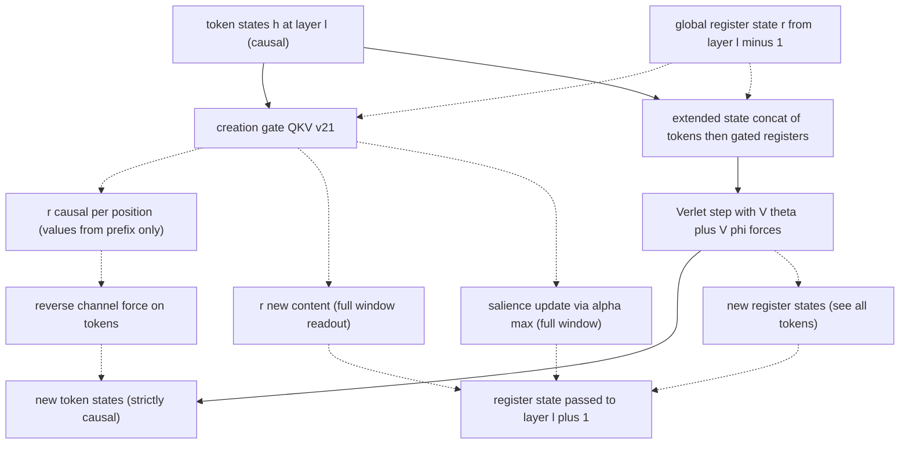
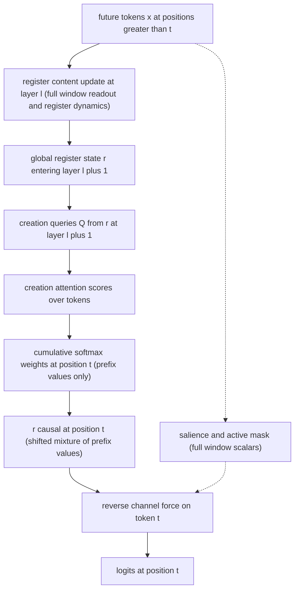

# Fock-PARFLM v2.1 — Causal Leak Audit Results

**Artifact under audit:** the Fock-PARFLM v2.1 model as instantiated by
`notebooks/conservative_arch/scaleup/colab_fock_depthcond_vtheta_openwebtext_ext2.ipynb`
(d=384, L=16, M=32 registers, xi=5long, top-k=16, reverse channel ON, depth-conditioned Gaussian V_theta).

**Motivation:** the d=384 run reached validation PPL 14.59 at 53M parameters on OpenWebText — strong enough that a hidden causal leak (future tokens influencing past predictions) must be ruled out before the number is trusted or published.

**Method:** a two-track audit. Track 1 is a static line-by-line review of every information pathway in the computation graph, across the full inheritance chain (`PARFLM` → `SparsePARFLM` → `MultiXiPARFLM` → `FockMultiXiPARFLM` plus the v2 gate modules and the depth-conditioned V_theta). Track 2 is an empirical falsification probe: perturb future tokens and measure, in float64 on deterministic CPU kernels, whether any logit at an earlier position moves. The probe scripts are committed at `notebooks/conservative_arch/scaleup/debug/fock_causality_probe.py` and `notebooks/conservative_arch/scaleup/debug/fock_leak_decompose.py`.

**Last updated:** 22 July 2026.

---

## 1. Executive summary

| # | Pathway | Static verdict | Empirical verdict |
|---|---------|----------------|-------------------|
| 1 | Embedding, positional table, per-token mass, read-out head | clean | clean |
| 2 | Multi-channel xi (causal EMA context) | clean | clean |
| 3 | V_theta (depth-conditioned Gaussian bank) | clean | clean |
| 4 | V_phi pair potential + score head + top-k routing | clean | clean |
| 5 | Force computation via `autograd.grad` (back-reaction severed by detach) | clean | clean (positive control confirms probe power) |
| 6 | Register creation gate (cumulative causal softmax) | clean in values | clean |
| 7 | Registers inside the Verlet dynamics (extended state) | clean toward tokens | clean |
| 8 | **Reverse channel + cross-layer register state** | **weights-only acausality found** | **confirmed: ~1e-5 logit shift at init scale** |

**Bottom line.** The conservative backbone of Fock-PARFLM is **exactly causal** — not approximately, exactly: with the reverse channel disabled, perturbing future tokens changes past logits by 0.0 in float64. One genuine acausal pathway exists, and it flows exclusively through the reverse channel: the global register state carries a full-window summary across layers, and at the next layer it modulates the **weights** (never the values) of the causal creation readout that feeds the reverse-channel force. The measured effect at initialization scale is a relative logit shift of about 9e-5, which first-order-bounds the PPL impact at roughly 3e-4 PPL points. The channel is low-bandwidth by construction (position-independent, weights-only, mediated by M=32 register vectors per window). It cannot plausibly explain a PPL of 14.59, but it should be measured on the trained checkpoint and disclosed in the paper. Sections 9–11 give the quantitative argument and the recommended certification protocol.

---

## 2. Scope and audit protocol

### 2.1 What counts as a causal leak

The model is trained and evaluated with next-token cross-entropy over full windows: the loss at position t is computed from `logits[:, t]`, which must be a function of tokens $x_0 \ldots x_t$ only. A causal leak is any dependency

$$
\frac{\partial \mathrm{logits}[:, t]}{\partial x_s} \neq 0 \quad \text{for some } s \gt t.
$$

Both training and the in-notebook `evaluate()` score all positions of each 512-token window, so a leak at any position inflates the reported PPL benchmark.

### 2.2 Files audited

| File | Role | Key classes / functions |
|------|------|------------------------|
| `notebooks/conservative_arch/parf/model_parf.py` | Base PARF LM | `PARFLM`, `StructuralVPhi`, `StructuralCompetitiveVPhi`, `MultiHeadVPhi`, `_pair_mask_for`, `_layer_step` |
| `notebooks/conservative_arch/parf/model_parf_sparse.py` | Sparse top-k routing | `SparsePARFLM`, `ScoreHead`, `_sparse_topk_indices`, `_sparse_mask` |
| `notebooks/conservative_arch/parf/model_parf_multixi.py` | Multi-channel xi | `MultiXiPARFLM._layer_step` |
| `notebooks/conservative_arch/multixi/model_multixi.py` | EMA context | `MultiChannelXi`, `causal_ema_weights` |
| `notebooks/conservative_arch/parf/model_fock_parf_multixi.py` | Fock registers on multi-xi | `FockMultiXiPARFLM`, `_fock_layer_step`, `_active_mask`, `_stack_forward` |
| `notebooks/conservative_arch/parf/model_fock_parf_v2.py` | v2 gates | `QKVCreationGate_v21`, `ReverseChannel`, `DestructionGate_v2`, `_causal_creation_readout` |
| `notebooks/conservative_arch/parf/model_gaussian_vtheta.py` | Depth-conditioned V_theta | `DepthConditionedMultiContextGaussianVTheta`, `install_depth_routing` |

### 2.3 Exact configuration audited

Pinned from the notebook's `make_config` (cell defining `ARCH_TIERS = [(384, 16, 32), ...]`): `fock_version='v2'`, `causal_force=True`, `v_phi_kind='structural_competitive'` with `v_phi_n_heads=4` and `use_gathered_v_phi=True`, `top_k=16`, `xi_alpha_inits=[0.50, 0.75, 0.95, 0.99, 0.995]` (5 channels), `mass_mode='logfreq'`, `fixed_gamma=0.30`, `n_registers=32`, `stack_discipline=True`, `per_register_keys=True`, `tau_create_init=8.0`, `reverse_channel=True` with `stable`, `pre_ln`, `soft_norm`, `per_layer` gates and 4000-step warmup, `register_salience_decay=0.5`, `register_salience_threshold=0.005`, untied embeddings with log-frequency output bias, `BLOCK_SIZE=512`. V_theta is swapped post-construction for `DepthConditionedMultiContextGaussianVTheta` (5 heads x 8 wells, shared bank + per-layer depth codes) and `install_depth_routing` monkey-patches `_fock_layer_step`.

One incidental observation (not causality-related): with `use_gathered_v_phi=True`, `StructuralCompetitiveVPhi.forward_gathered` deliberately falls back to the base-class unnormalized Gaussian gate (`model_parf.py` lines 726–738), because the Gumbel top-k routing already provides the competition. The competitive row-softmax path is only exercised in dense mode.

---

## 3. Information-flow map

One Fock v2 layer step (`FockMultiXiPARFLM._fock_layer_step`, `model_fock_parf_multixi.py` lines 282–404) moves information as follows. Solid arrows are the conservative backbone; dotted arrows belong to the Fock register machinery.



The audit question reduces to: which of the dotted register paths can move future-token information into `NewTokens` at a position earlier than the future token? Sections 4–6 walk each path; section 7 shows the one that does.

---

## 4. Static audit — the conservative backbone

### 4.1 Per-position modules (embedding, mass, projection, read-out)

All four are position-local and trivially causal:

- `PARFLM._embed` (`model_parf.py` lines 1058–1061): `E(x) + P[t]` — token embedding plus positional row, no cross-position mixing.
- `PARFLM.compute_mass` (lines 1043–1052): with `mass_mode='logfreq'`, the mass at position t is `softplus(raw_m_bias + alpha * surprisal[x_t])` — a lookup on the token id at position t only.
- `PARFLM._project` (line 1055): `F.layer_norm(h, (d,))` — normalizes over the feature dimension only; per-token statistics, no sequence mixing.
- `PARFLM.compute_logits` (lines 1064–1078): `W_out @ h_t + b` per position.

**Verdict: clean.**

### 4.2 The xi context field

`MultiXiPARFLM._layer_step` (`model_parf_multixi.py` lines 187–189) computes the context as K causal EMAs:

```python
# model_parf_multixi.py, lines 187-189
xi_input = h.detach() if cfg.causal_force else h
xis = self.xi_module(xi_input)                           # (B, T, K, d)
```

`causal_ema_weights` (`model_multixi.py` lines 97–127) builds the weight matrix

$$
W[t, s] = \frac{\alpha^{t-s}}{Z_t} \quad \text{for } s \le t, \qquad W[t, s] = 0 \quad \text{otherwise},
$$

which is lower-triangular by construction: `diffs = s_idx.view(T,1) - s_idx.view(1,T)` and `causal = (diffs >= 0)`. Position t aggregates positions 0..t only. Additionally the input is detached (`causal_force=True`), so the force gradient cannot flow back through xi into other positions at all.

**Verdict: clean.**

### 4.3 V_theta — depth-conditioned Gaussian bank

`DepthConditionedMultiContextGaussianVTheta` (`model_gaussian_vtheta.py` lines 362–468) evaluates a shared multi-context well bank at each position, with a learned per-layer depth code added to the xi input. Two facts matter for causality:

1. The bank is evaluated per position: `forward(xis, h)` maps `(B, T, n_ctx, d), (B, T, d)` to `(B, T, 1)` with no cross-position term.
2. The depth codes `e_g` are learned parameters, constant with respect to the data, so `install_depth_routing` (lines 471–507) — which sets `_active_layer` before each layer step — cannot transport token information.

**Verdict: clean.**

### 4.4 V_phi, the score head, and top-k routing

Three independent layers of causal enforcement protect the pair interaction.

**(a) The strict pair mask.** `PARFLM._pair_mask_for` (`model_parf.py` lines 1108–1117) caches `torch.tril(ones(T, T), diagonal=-1)` — strictly lower-triangular, diagonal excluded, so the source set for query t is exactly s in 0..t-1.

**(b) Top-k selection under the mask.** `SparsePARFLM._sparse_topk_indices` (`model_parf_sparse.py` lines 344–386) masks non-causal score logits to negative infinity **before** the top-k:

```python
# model_parf_sparse.py, lines 369-381
z_topk = z_unmasked.masked_fill(~causal, float("-inf"))
_, idx = z_topk.topk(k_eff, dim=-1)                   # (B, T, k_eff)
...
causal_g = causal_exp.gather(-1, idx)                  # (B, T, k_eff)
m_hard_g = m_hard_g * causal_g.to(m_hard_g.dtype)
y_g = y_g * causal_g.to(y_g.dtype)
```

A non-causal source can never be selected, and even if a row has fewer than k valid sources the residual slots are zeroed by the second multiplication. The straight-through gradient flows through `y_g`, itself computed from a softmax whose non-causal logits were set to a large negative number — the STE backward path is causal too.

**(c) Gathered V_phi evaluation.** `StructuralVPhi.forward_gathered` (`model_parf.py` lines 504–563) only ever sees the gathered source tensor `h_src_g`, which was indexed by the causally-restricted `idx`. The multi-head wrapper `MultiHeadVPhi.forward_gathered` (lines 800–806) sums per-head evaluations of the same gathered sources.

**Verdict: clean.**

### 4.5 The force computation — why detach is load-bearing

This is the most physics-specific part of the audit and deserves the full argument. The per-layer potential is

$$
U = \sum_t V_\theta\big(\xi_t, h_t\big) + \sum_t \sum_{s \lt t} \tilde{m}_{ts} \cdot V_\phi\big(h_t, h_s\big)
$$

and the force on every token is a single `autograd.grad(U, h)` call (`model_parf_multixi.py` lines 237–244). Here is the subtlety: **the causal mask alone is not sufficient in a force-based architecture.** Differentiating the masked potential with respect to $h_s$ gives two terms:

$$
\frac{\partial U}{\partial h_s} = \underbrace{\frac{\partial}{\partial h_s} \sum_{u \lt s} V_\phi(h_s, h_u)}_{\text{query side: causal}} + \underbrace{\sum_{t \gt s} \frac{\partial}{\partial h_s} V_\phi(h_t, h_s)}_{\text{source side: back reaction}}
$$

The second term is Newton's third law: every future query $h_t$ exerts a reaction force on its past sources. Through it, the force on token s — and hence the next-layer state and logits at position s — would depend on all future tokens. The code severs exactly this term by detaching the source slice before the pair potential is built:

```python
# model_parf_multixi.py, lines 188-198
xi_input = h.detach() if cfg.causal_force else h
...
h_src = h_in.detach() if cfg.causal_force else h_in
h_src_for_score = (
    h_in.detach() if cfg.score_head_use_detached_h_src else h_in
)
```

With `causal_force=True` (the production setting, confirmed in the notebook config), `autograd.grad(U, h_in)` sees $h_s$ as source only through a detached copy: the back-reaction gradient is identically zero and the force on token t is a function of $h_0 \ldots h_t$ alone. The empirical probe validates both directions: with the detach in place the past-logit delta is exactly 0.0; flipping `causal_force=False` (test T3, section 8) produces an immediate measurable leak — confirming both that the mechanism matters and that the probe has the power to detect a leak of this kind.

**Verdict: clean, and empirically load-tested.**

---

## 5. Static audit — the Fock register machinery

### 5.1 Geometry of the extended state: tokens cannot see registers

`_fock_layer_step` concatenates the M gated registers **after** the T tokens:

```python
# model_fock_parf_multixi.py, lines 326-327
h_ext = torch.cat([h, r_gated], dim=1)        # positions 0..T-1 tokens, T..T+M-1 registers
h_prev_ext = torch.cat([h_prev, r_gated], dim=1)
```

The inner Verlet step then applies the strict mask `tril(ones(T+M, T+M), diagonal=-1)`. Because every register sits at a position index greater than or equal to T, and every token query t satisfies t < T:

- token queries can select only sources s < t < T — **all tokens, never registers**;
- register queries (positions T+k) can select every token and lower-indexed registers.

The same geometry governs the score head and the xi EMA on the extended sequence: for a token position t, the lower-triangular EMA aggregates positions 0..t, which are all tokens. Registers therefore act as **pure observers** inside the conservative dynamics — they absorb token information but exert no force on tokens. After the step the states are split back (`model_fock_parf_multixi.py` lines 341–343) and inactive register rows are restored from the pre-step state.

**Verdict: clean toward tokens.** (The registers themselves absorb full-window information — that is their job — and section 6 tracks where that information is allowed to go.)

### 5.2 The creation gate: causal values, cumulative softmax

`QKVCreationGate_v21.forward` (`model_fock_parf_v2.py` lines 292–336) computes per-register attention scores over all tokens, then delegates to `_causal_creation_readout` (lines 59–99), which is the heart of the causal design:

```python
# model_fock_parf_v2.py, lines 83-97
s_max = scores.max(dim=-1, keepdim=True).values          # (B, M, 1)
exp_s = torch.exp(scores - s_max)                        # (B, M, T)
Z = torch.cumsum(exp_s, dim=-1)                          # (B, M, T)
weighted_V = exp_s.unsqueeze(-1) * V.unsqueeze(1)        # (B, M, T, d)
numerator = torch.cumsum(weighted_V, dim=2)              # (B, M, T, d)
r_causal_mt = numerator / Z.unsqueeze(-1).clamp(min=1e-8)  # (B, M, T, d)

r_new = r_causal_mt[:, :, -1, :]                         # (B, M, d)
...
alpha = exp_s / Z[:, :, -1:].clamp(min=1e-8)             # (B, M, T)
alpha_max = alpha.max(dim=-1).values                     # (B, M)
```

The position-dependent register content is a prefix-normalized softmax readout:

$$
r^{\mathrm{causal}}_{m,t} = \frac{\sum_{j \le t} e^{s_{m,j}} \cdot V_j}{\sum_{j \le t} e^{s_{m,j}}}
$$

Only values $V_j$ with $j \le t$ enter the readout at position t, with weights normalized over the same prefix. (The full-sequence `s_max` subtraction cancels exactly in the ratio; it is a numerical stabilizer, not an information channel.) Two of the three outputs, however, are **full-window quantities by design**: `r_new` is the readout at the last position, and `alpha_max` is the peak weight of the full-sequence softmax. They are meant to update the persistent register bank and its salience. Whether that is safe depends entirely on where they flow — which is the subject of section 6.

### 5.3 The reverse channel: causal values, one global gate

`ReverseChannel.forward` (`model_fock_parf_v2.py` lines 427–516) supports both a global `(B, M, d)` register input and the position-dependent `(B, T, M, d)` causal variant. The Fock layer passes the causal variant:

```python
# model_fock_parf_multixi.py, lines 358-361
# Use position-dependent causal register content so that
# the force on token t only reflects tokens 1..t (no leak).
r_rev = r_causal if r_causal is not None else r_new
Q_force = self.reverse_ch(h_new, r_rev, active)
```

Inside, keys and values at position t are projections of `r_causal[:, t]` (prefix-only content), the query is the token's own state, and the softmax runs over the M registers. The force injected into token t is therefore built from causal values. Two non-value inputs enter the computation: the **active mask** (from salience — a full-window quantity) and, indirectly, the score distribution shaped by the register-derived queries of the creation gate at this layer (whose Q came from the cross-layer register state). Both are weights-only modulators.

### 5.4 Salience, active mask, destruction

`_active_mask` (`model_fock_parf_multixi.py` lines 266–279) thresholds salience and applies stack discipline via a sorted cumulative product. Salience itself is updated with `alpha_max` (full-window) and decayed by the destruction gate applied to the post-dynamics register states (full-window). These are scalar, per-register, per-window quantities — no position dependence, but data dependence on the whole window including the future of any interior position.

---

## 6. The finding: a weights-only cross-layer register channel

### 6.1 The pathway

Assembling the pieces from section 5, exactly one route lets future-token information touch a past position's logits, and it requires **at least two layers** plus the reverse channel:



In words: at layer $\ell$, the persistent register state absorbs a full-window summary through two mechanisms — the creation-gate blend `r = blend * r + (1 - blend) * r_new_content` (`model_fock_parf_multixi.py` lines 315–318, with `r_new_content` being the last-position readout) and the register rows of the Verlet dynamics output (registers attend to every token as sources). At layer $\ell + 1$, that state produces the creation queries `Q = einsum(register_states, W_Q)` (`model_fock_parf_v2.py` line 313). The queries shift the attention scores; the scores shift the **weights** of the prefix-normalized cumulative softmax at every position t; the reweighted (but still prefix-valued) `r_causal[:, t]` feeds the reverse-channel force on token t; the force shifts the logits.

A parallel, lower-order route runs through salience: `alpha_max` is a full-window scalar per register, salience blends and gates with it, and the active mask enters the reverse-channel softmax masking.

### 6.2 Why the channel is weights-only and position-independent

Three structural facts bound what this channel can transmit:

1. **Values stay causal everywhere.** At no point does a token value $V_j$ with $j \gt t$ enter any quantity consumed at position t. The future can only change **how the prefix is mixed**, never **what is in the mix**.
2. **The carrier is position-independent.** The register state r, the creation queries, salience, and the active mask are all shared across every position of the window. The channel physically cannot address "position t should expect token X"; it can only broadcast one global signal per window (M vectors of dimension d, further squeezed through weight-softmax modulation).
3. **The gate is bounded.** The reverse force passes through tanh gates, an RMS soft-norm, and the `(dt^2 / m)` scaling before touching token states, and the whole channel was measured at roughly 22 percent of the conservative force magnitude in the training diagnostics (`qforce_ratio`).

The closest analogy: the leak is like letting the model glimpse a blurry **topic vector** of the whole 512-token window while predicting each token — not like letting it read ahead.

### 6.3 The gradient does flow through the channel

One honest caveat for the training story: this is not a dead-end numerical artifact. `r_new_content` is in the autograd graph and the creation values `V = W_V(h_tokens)` are not detached, so the training loss at position t backpropagates through the reverse force into future-token states of the previous layer. The optimizer is therefore **able** to strengthen this channel if doing so lowers the loss. The bandwidth constraints of section 6.2 still apply — but the magnitude measured at initialization (section 8) is a lower bound on what a trained model might exhibit, which is why section 11 recommends re-running the probe on the trained checkpoint.

---

## 7. Empirical probe — methodology

Static analysis can miss what code actually does; the probe cannot. `fock_causality_probe.py` builds a scaled-down model (d=32, L=4, T=48, M=8, 3 xi channels) that preserves **every structural feature** of the audited config: `fock_version='v2'`, gathered structural-competitive V_phi with 2 heads, top-k routing, logfreq mass, per-register keys and temperatures, stable reverse channel with pre-LN and soft-norm and per-layer gates, depth-conditioned Gaussian V_theta with `install_depth_routing`, stack discipline. The model runs in **float64** on CPU with deterministic kernels, in eval mode (Gumbel noise is training-only: `gumbel_active = self.training and cfg.gumbel_noise`).

The test statistic is

$$
\Delta_{\max} = \max_{b, t \lt t_p, v} \big| \mathrm{logits}(x)[b, t, v] - \mathrm{logits}(x')[b, t, v] \big|
$$

where $x'$ agrees with $x$ on positions $0 \ldots t_p - 1$ and is resampled on positions $t_p \ldots T-1$ (here $t_p = 24$, $T = 48$). For a strictly causal deterministic model, $\Delta_{\max} = 0$ exactly — float64 leaves no room for "small but real" ambiguity, since identical inputs produce bit-identical prefixes (verified by test T0).

Design notes:

- The reverse-channel gate initializes closed (`reverse_channel_scale` is zeros, tanh(0) = 0) and the warmup counter starts at 0. Tests T2 onward force the gate fully open (`scale = 1.0`, warmup complete) — a **worst-case** setting relative to the trained model.
- T3 is a positive control: rebuild the model with `causal_force=False` (back-reaction detach removed, section 4.5) and confirm the probe detects that known acausality.
- T4 is a sensitivity control: perturbing a **past** token must move later logits by a large margin.
- T5 repeats the future perturbation in training mode with identical RNG seeds, exercising the Gumbel/STE routing path.

---

## 8. Empirical probe — results

### 8.1 Main results (`fock_causality_probe.py`)

| Test | Condition | Max past-logit delta | Verdict |
|------|-----------|---------------------:|---------|
| T0 | determinism: same input twice | 0.0 (exact) | deterministic |
| T1 | future perturbed, reverse channel OFF | **0.0 (exact)** | **backbone exactly causal** |
| T2 | future perturbed, reverse channel fully open | 1.08e-05 | leak confirmed, tiny |
| T3 | positive control: `causal_force=False` | 4.86e-04 | probe detects known leak (45x larger) |
| T4 | past token perturbed (sensitivity floor) | 7.94e-02 | normal signal (7000x larger) |
| T5 | as T2, training mode, seeded Gumbel | 1.09e-05 | STE path adds nothing |

Context for T2: the logit RMS in the probe model is 0.116, so the relative shift is 9.3e-05. The delta is non-zero at all 24 past positions (mean 6.7e-06) — consistent with a broadcast, position-independent carrier rather than a targeted lookahead.

T1 is the strongest single statement in this audit: **with the reverse channel off, the entire remaining architecture — xi EMAs, depth-conditioned V_theta, 4-head gathered V_phi, score head, Gumbel top-k, logfreq mass, register creation, register dynamics, destruction, salience, stack discipline — transmits exactly zero future information to past logits**, even though registers are live and absorbing the full window at every layer. The mask geometry of section 5.1 (tokens can never see registers) does all of that work.

### 8.2 Attribution (`fock_leak_decompose.py`)

All runs: eval mode, float64, reverse gate fully open, future perturbation at $t_p = 24$.

| Run | Intervention | Max past-logit delta | Reading |
|-----|-------------|---------------------:|---------|
| D1 | baseline, L=4 | 1.08e-05 | total leak |
| D2 | active mask forced all-True | 1.08e-05 | mask flips contribute ~0 here |
| D3 | salience pinned to 1.0 (blend never admits new content) | 5.74e-07 | ~95 percent of the leak removed |
| D6 | salience pinned to 0.5 (constant blend, content flows) | 1.74e-05 | content channel alone reproduces (even exceeds) the leak |
| D4 | L=1 (no cross-layer register reuse) | 1.1e-16 | float-epsilon: single layer is exactly causal |
| D5 | L=1 plus pinned salience and mask | 1.1e-16 | consistency check |

Interpretation:

- **The leak requires layer-to-layer register carryover.** At L=1 it vanishes to one ulp of float64 (1.1e-16 is a single rounding step, not a signal), because the reverse channel at any single layer consumes only the position-dependent causal readout.
- **The dominant carrier is register content, not salience gating.** Pinning the blend closed (D3) removes ~95 percent; holding the blend constant but open (D6) restores the full effect. The binary active mask contributed nothing in this configuration (D2), though it remains a potential (low-bandwidth) channel if salience were to hover near the threshold.
- The residual 5.7e-07 in D3 is the register-dynamics route: register rows of the Verlet output (which attend to all tokens as sources) are carried to the next layer even when the creation blend is closed.

---

## 9. Magnitude analysis: what the leak can and cannot do to PPL

Let $z$ be the logit vector at a past position and $\Delta z$ the leak-induced shift. The per-token NLL is $\mathrm{nll}(z) = \mathrm{logsumexp}(z) - z_y$, whose gradient $\big(\mathrm{softmax}(z) - e_y\big)$ has L1 norm at most 2. First order:

$$
|\Delta \mathrm{nll}| \le 2 \lVert \Delta z \rVert_\infty
$$

With the probe's worst-case gate and initialization-scale weights, $\lVert \Delta z \rVert_\infty \approx 1.1 \times 10^{-5}$, so $|\Delta \mathrm{nll}| \lesssim 2.2 \times 10^{-5}$ nats per token, and the PPL effect is

$$
\Delta \mathrm{PPL} \approx \mathrm{PPL} \cdot \Delta \mathrm{nll} \approx 14.59 \times 2.2 \times 10^{-5} \approx 3 \times 10^{-4}
$$

— three ten-thousandths of a PPL point. For the leak to account for even 0.1 PPL at 14.59 (a 0.7 percent NLL change of about 0.0069 nats), the trained model would need to amplify the initialization-scale coupling by roughly **300x** and, more importantly, convert it into *predictively useful* information under the constraints of section 6.2: position-independent, weights-only, M=32 registers per 512-token window. The realistic best case for such a channel is global topic conditioning — genuinely worth something, but small, and bounded by the same information bottleneck that makes the registers useful in the first place.

Two honest qualifications:

1. The 300x figure is not a proof — trained weights can differ qualitatively from initialization (the creation temperature `tau_create_init=8.0` sharpens during training, the reverse gates open to their tanh asymptotes, and section 6.3 showed the gradient actively flows through the channel). The bound must be checked on the trained checkpoint (section 11, step 1).
2. A standard transformer baseline evaluated the same way has **no** such channel (strict causal attention only), so cross-architecture PPL comparisons carry this asymmetry until the certification of section 11 is run.

---

## 10. Verdict on the reported PPL

**No hard causal leak exists.** Every value pathway is causal, enforced redundantly by (a) strict lower-triangular masks with negative-infinity pre-masking, (b) source detachment that severs the Newton back-reaction (and is confirmed load-bearing by the positive control), (c) prefix-normalized cumulative softmax readouts, and (d) an extended-state geometry in which registers are dynamically invisible to tokens.

**One soft, weights-only leak exists**, flowing through the reverse channel via the cross-layer register state and salience. Measured at worst-case gate settings and initialization scale, it shifts past logits by about one part in ten thousand, bounding its PPL impact near 3e-4 points. It is a per-window global-context channel, structurally incapable of per-position lookahead.

On current evidence, **PPL 14.59 is not an artifact of a causal leak.** The result stands, subject to one certification step on the trained checkpoint (below) that would close the remaining gap between "measured at init scale" and "measured on the published model".

---

## 11. Recommendations

1. **Run the probe on the trained checkpoint** (highest value, ~30 min on the CPU Colab already set up for `eval_ppl_proper.py`). Load the d=384 step-83500 best checkpoint via `build_model` from `notebooks/conservative_arch/scaleup/debug/eval_ppl_proper.py`, then apply the T2 perturbation test from `fock_causality_probe.py` at T=512 in float64. This directly measures the **trained** leak magnitude and replaces the 300x-amplification argument with a number.
2. **Leak-free PPL certification.** Score every token as the **last position of its own window** (stride-1 sliding window, or stride equal to a small chunk with only trailing positions scored). At the last position the cumulative readout equals the full-sequence readout and no future exists inside the window, so this protocol is exactly leak-free by construction. Compare against the standard full-window PPL: the difference (after accounting for the longer average context, which works in the sliding protocol's favor) upper-bounds the leak's contribution on real data. `eval_ppl_proper.py` already implements strided evaluation and needs only a scoring-mask change.
3. **Optional architectural hardening** (only if the paper wants to claim exact causality with the reverse channel on): pass the position-dependent `r_causal` forward as the cross-layer register state (making r a `(B, T, M, d)` object throughout) or, cheaper, stop-gradient and prefix-truncate the creation-blend update. Both close the channel at some memory or expressivity cost; given the measured magnitude, disclosure may be preferable to surgery.
4. **Paper disclosure.** One sentence in the experimental section: the reverse channel introduces a weights-only, position-independent within-window coupling through the persistent register state; a future-token perturbation probe bounds its effect on past logits at the 1e-4 relative level (exactly zero with the reverse channel disabled), and the certification protocol of item 2 bounds its PPL contribution.

---

## Appendix A — probe artifacts

| Script | Purpose |
|--------|---------|
| `notebooks/conservative_arch/scaleup/debug/fock_causality_probe.py` | Main falsification probe: T0–T5 of section 8.1. Self-contained, CPU, ~7 s. |
| `notebooks/conservative_arch/scaleup/debug/fock_leak_decompose.py` | Attribution runs D1–D6 of section 8.2 via targeted monkey-patches (`_active_mask` override, salience pinning, L ablation). |

Both scripts seed all RNGs, build identical weights across variants (fixed `torch.manual_seed` before construction), and run in float64 so that "zero" means bit-exact zero.

## Appendix B — quick reference: where each causal guarantee lives

| Guarantee | File | Location |
|-----------|------|----------|
| Strict pair mask (s < t) | `model_parf.py` | `_pair_mask_for`, lines 1108–1117 |
| Back-reaction severed (source detach) | `model_parf_multixi.py` | lines 188–198 |
| Top-k cannot select non-causal sources | `model_parf_sparse.py` | `_sparse_topk_indices`, lines 369–381 |
| Causal EMA weights for xi | `model_multixi.py` | `causal_ema_weights`, lines 97–127 |
| Registers invisible to token queries | `model_fock_parf_multixi.py` | `_fock_layer_step`, lines 326–343 (concat order) plus the strict mask |
| Prefix-normalized creation readout | `model_fock_parf_v2.py` | `_causal_creation_readout`, lines 83–97 |
| Reverse channel fed causal content | `model_fock_parf_multixi.py` | lines 358–361 |
| Competitive V_phi causal pre-softmax mask | `model_parf.py` | lines 699–706 |

## Appendix C — known non-issues checked and cleared

- **Full-sequence `s_max` in the cumulative softmax**: cancels exactly in the readout ratio; numerical stabilizer only.
- **Gumbel noise at eval**: disabled (`gumbel_active = self.training and cfg.gumbel_noise`); eval-mode routing is deterministic top-k.
- **Layer checkpointing**: recomputation replays the same layer step with the same inputs; `install_depth_routing` sets the active-layer index inside the same call that consumes it, so the depth code is correct on both passes.
- **Batch mixing**: no cross-batch statistics anywhere in the forward pass (LayerNorm is per-token; diagnostics use `no_grad` and do not feed back).
- **Positional embeddings beyond the trained range**: positions 512–1023 are untrained (training uses `BLOCK_SIZE=512`); an evaluation concern (documented in `eval_ppl_proper.py`) but not a causality concern.
- **`reverse_warmup_step` buffer**: a training-progress counter; affects the gate magnitude, carries no token information.
