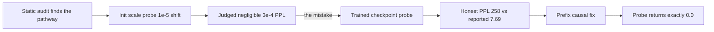
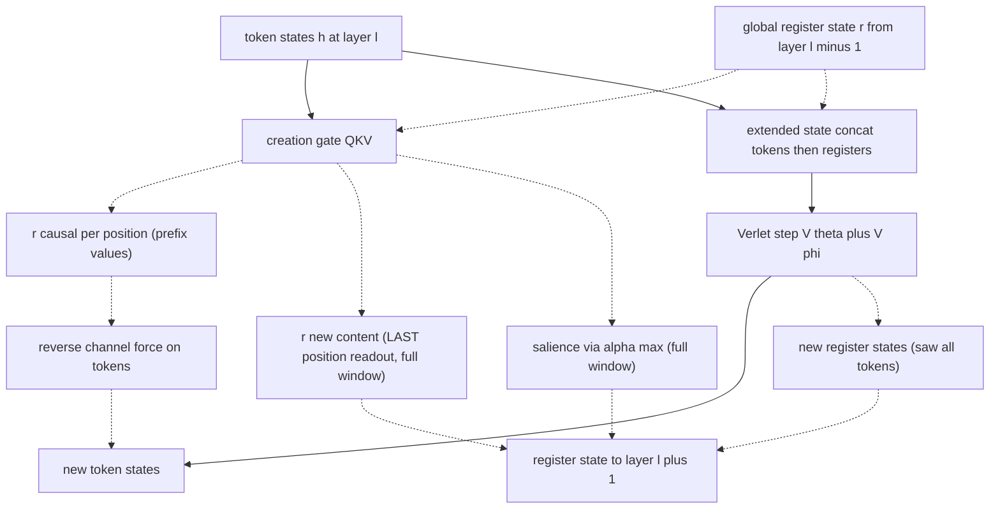
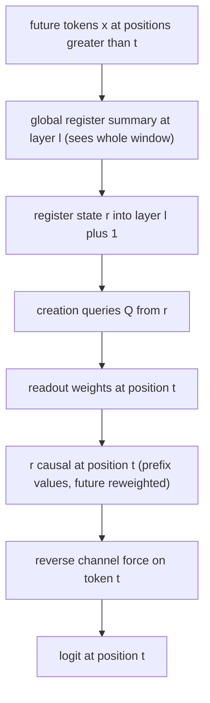
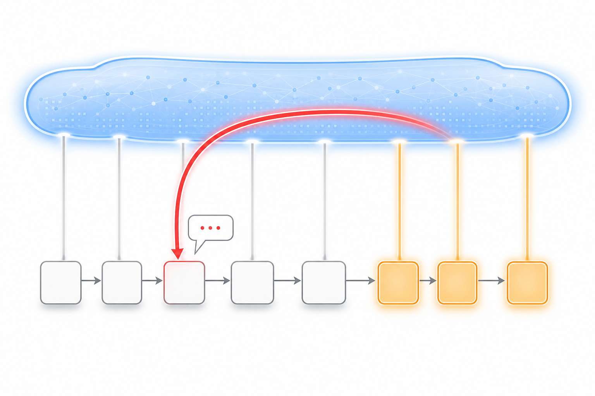
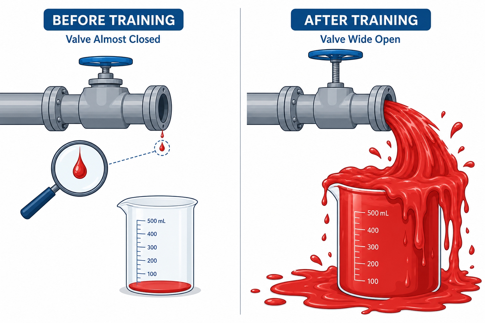
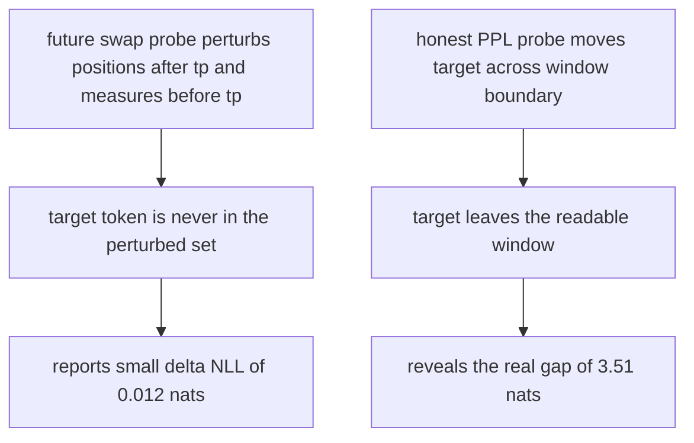
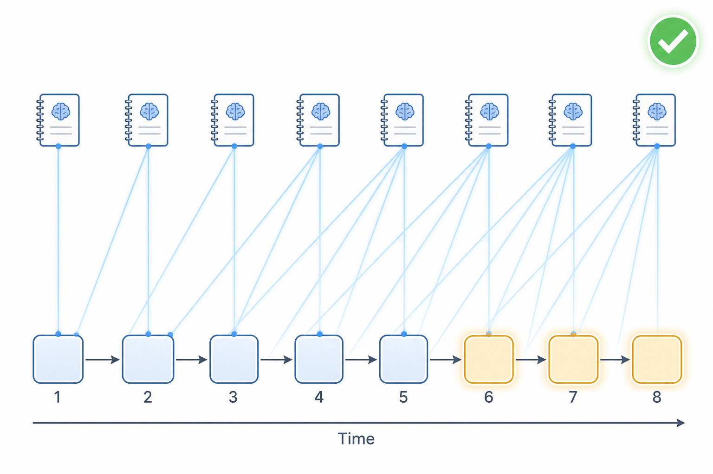
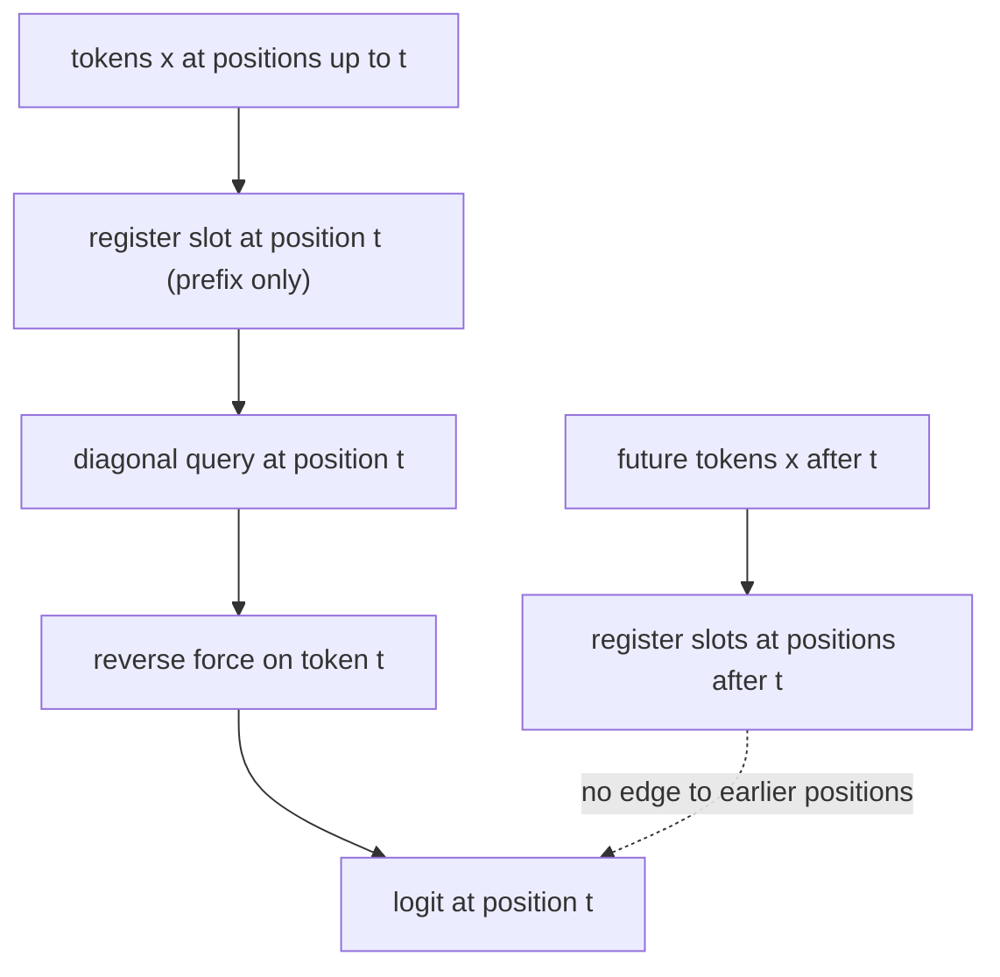
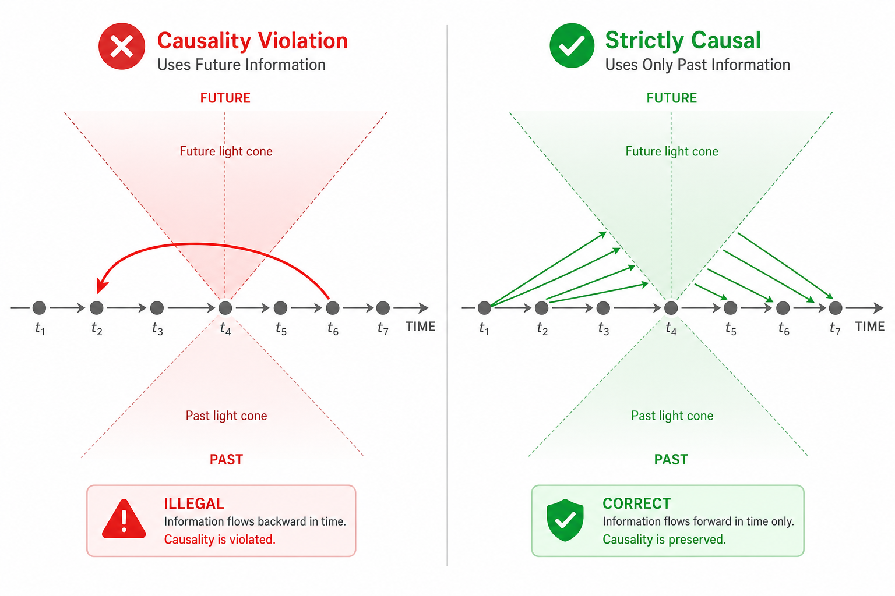

# Fock-PARFLM v2.1 — Causal Leak: Root-Cause Analysis, Magnitude, and Fix

**Artifact under audit:** the Fock-PARFLM v2.1 model as instantiated by
`notebooks/conservative_arch/scaleup/colab_fock_depthcond_vtheta_openwebtext_ext2.ipynb`
(d=384, L=16, M=32 registers, xi=5long, top-k=16, reverse channel ON,
depth-conditioned Gaussian V_theta), checkpoint `step103500_best.pt`.

**Bottom line up front.** The reported perplexity of this architecture was
**inflated by roughly 33×** by a causal leak. A leak-free measurement of the
same checkpoint on the same tokens gives PPL ≈ **258** where the standard
full-window protocol reported PPL ≈ **7.69** — a paired difference of
**+3.51 ± 0.09 nats/token**. The leak flows entirely through the **reverse
channel** reading a **global, full-window register summary** that contains the
very token being predicted. The fix — a **prefix-causal register lifecycle**
(config flag `prefix_causal_registers`, default `True`) — closes it exactly:
the future-perturbation probe returns **0.0 (bit-exact, float64)** with the
reverse channel fully open.

**Last updated:** 23 July 2026.

---

## 0. How to read this document

This note has been restructured around the *life cycle of the bug*: it was
found, mis-sized, then correctly sized, then fixed. The three acts map to the
three questions a reader will have.

| Act | Question | Where |
|-----|----------|-------|
| I | Where does the leak come from, mechanically? | Part A (§§2–4) |
| II | How big is it, and why did the first audit get the size wrong? | Part B (§§5–7) |
| III | What is the fix and how do we know it is exactly causal? | Part C (§§8–10) |

The very short version, as a timeline:

---

# Part A — Anatomy of the leak

## 1. What counts as a causal leak

The model is trained and evaluated with next-token cross-entropy over full
windows. The loss at position t is computed from `logits[:, t]`, which for a
causal model must be a function of tokens $x_0 \ldots x_t$ only. A causal leak
is any dependency

$$
\frac{\partial \mathrm{logits}[:, t]}{\partial x_s} \neq 0 \quad \text{for some } s \gt t
$$

(read: no future token $x_s$ may move a past logit).

Both training and the in-notebook `evaluate()` score **all** positions of each
512-token window, so a leak at any interior position inflates the reported PPL.
Crucially, "interior position" includes the case $s = t{+}1, t{+}2, \ldots$
**inside the same window** — the leak we will find is dominated by this
short-range, same-window case, not by long-range lookahead.

## 2. Information-flow map of one layer

One Fock v2 layer step (`FockMultiXiPARFLM._fock_layer_step`) moves information
as follows. Solid edges are the conservative backbone (exactly causal); dotted
edges are the Fock register machinery (the audit surface).

The audit question reduces to: **which dotted path can move future-token
information into `NewTokens` at a position earlier than that future token?**

## 3. The conservative backbone is exactly causal

Everything except the register machinery is causal by construction, enforced
redundantly. This is not a hopeful claim — with the reverse channel disabled,
perturbing future tokens moves past logits by **exactly 0.0 in float64**
(§5, test T1). The guarantees:

- **Strict pair mask.** `PARFLM._pair_mask_for` caches
  `tril(ones(T, T), diagonal=-1)`: the source set for query t is exactly
  $s \in \lbrace 0, \ldots, t-1 \rbrace$.
- **Causal EMA context.** `causal_ema_weights` builds a lower-triangular
  weight matrix $W[t, s] = \alpha^{t-s}/Z_t$ for $s \le t$ and $0$ otherwise.
- **Back-reaction severed.** The force is one `autograd.grad(U, h)` call.
  Differentiating the masked pair potential w.r.t. a source $h_s$ yields a
  Newton back-reaction term $\sum_{t \gt s} \partial_{h_s} V_\phi(h_t, h_s)$
  through which every future query would push its past source. The code
  detaches the source slice (`h_src = h_in.detach()` when `causal_force=True`),
  zeroing exactly this term. The positive control (§5, T3) confirms the detach
  is load-bearing.
- **Registers are invisible to tokens inside the dynamics.** The extended
  state concatenates registers *after* the T tokens
  (`h_ext = cat([h, r_gated], dim=1)`), then applies the strict mask on
  $T{+}M$ positions. Every register sits at index $\ge T$, every token query at
  index $\lt T$, so token queries can select only token sources. Registers are
  **pure observers** in the Verlet step: they absorb token information but exert
  no conservative force on tokens.

The consequence is sharp and worth stating plainly: **the registers may absorb
the entire window, including the future, and this is harmless — as long as that
absorbed information is never read back onto an earlier token.** The one place
it *is* read back is the reverse channel.

## 4. The finding: the reverse channel reads a full-window summary

### 4.1 The mechanism

There is exactly one non-conservative force on tokens: the reverse channel,

$$
Q_i = \sum_{k \in \text{active}} \mathrm{softmax}_k\big( q_i \cdot k_k^{\text{reg}} \big) v_k^{\text{reg}} ,
$$

injected as an additive update to the token state:

$$
h_t \leftarrow h_t + \frac{dt^2}{m} \tanh(\text{gate}) Q_t .
$$

Its keys and values come from the register bank. In the legacy lifecycle the
register bank $r$ carried across layers is a **single global object per window**,
updated two ways, both of which see the whole window:

1. the creation blend `r = blend * r + (1 - blend) * r_new_content`, where
   `r_new_content` is the readout at the **last** window position (a
   full-window summary), and
2. the register rows of the Verlet output, which attend to **every** token as a
   source.

At the next layer this global $r$ produces the creation queries
$Q = \mathrm{einsum}(r, W_Q)$, which reshape the attention **weights** of the
prefix-normalized readout at every position t, and the reweighted (but
prefix-valued) content feeds the reverse-channel force on token t. The result
is a path from future tokens to an earlier token's logits:

*Figure 1. The leak in one picture. Every token (including the amber future
tokens) writes into a single shared register memory that spans the whole
window. The reverse channel then reads that memory back onto an earlier token's
prediction (red arrow). Because the shared memory already contains the future,
the earlier prediction can peek at it.*

### 4.2 The critical subtlety: the summary contains the token being predicted

The most damaging case is not long-range lookahead. It is **local**. In a
teacher-forced full-window forward that scores position t, the global register
summary is built from all of $x_0 \ldots x_{T-1}$ — which **includes $x_{t+1}$,
the very token the model is trying to predict at position t**, and its
neighborhood. The reverse channel can therefore route a digest of "the answer"
back onto position t. This is the dominant channel, and §6 shows it is worth
about 3.5 nats.

### 4.3 Why "weights-only and position-independent" is NOT low-bandwidth

The legacy audit (see §7) argued that because the future can only change *how*
the causal prefix is mixed (the values stay causal) and because the carrier is
a single per-window object, the channel must be low-bandwidth. Both halves of
that intuition are structurally true and jointly **wrong about magnitude**:

- A reweighting of a prefix mixture is still a function of the full window. If
  the mixture weights can encode "position t should expect token X," a
  prefix-valued readout can still surface X whenever X already occurred earlier
  (extremely common in natural text: names, function words, repeated tokens).
- "One per-window object" is $M = 32$ vectors of dimension $d = 384$, applied at
  every one of 512 positions, refreshed at every one of $L = 16$ layers. That
  is not a bottleneck; it is a broadband bus.

The lesson: a *values-are-causal* guarantee bounds nothing about the predictive
value of the weights path. Only measurement can size it — which is Part B.

---

# Part B — Magnitude: init scale versus trained scale

## 5. Init-scale probe (what the first audit ran)

`fock_causality_probe.py` builds a scaled-down model (d=32, L=4, T=48, M=8) that
preserves every structural feature of the audited config, runs in **float64**
on CPU in eval mode, and computes

$$
\Delta_{\max} = \max_{b,\ t \lt t_p,\ v} \big| \mathrm{logits}(x)[b,t,v] - \mathrm{logits}(x')[b,t,v] \big|
$$

where $x'$ agrees with $x$ on positions $0 \ldots t_p{-}1$ and is resampled on
$t_p \ldots T{-}1$ ($t_p = 24$). For a strictly causal deterministic model this
is exactly 0.

| Test | Condition | Max past-logit delta | Verdict |
|------|-----------|---------------------:|---------|
| T0 | determinism: same input twice | 0.0 (exact) | deterministic |
| T1 | future perturbed, reverse channel OFF | **0.0 (exact)** | **backbone exactly causal** |
| T2 | future perturbed, reverse channel fully open | 1.08e-05 | leak confirmed, tiny at init |
| T3 | positive control: `causal_force=False` | 4.86e-04 | probe detects a known leak |
| T4 | past token perturbed (sensitivity floor) | 7.94e-02 | normal signal |
| T5 | as T2, training mode, seeded Gumbel | 1.09e-05 | STE path adds nothing |

T1 is the strongest single statement in the whole audit: with the reverse
channel off, the entire remaining architecture transmits **exactly zero**
future information to past logits. The leak lives only in the reverse channel.

But note what T2 reports: at **initialization scale**, the leak is
$\sim 10^{-5}$. The first audit stopped here and reasoned about the size from
init numbers. That was the mistake.

## 6. Trained-scale probe (the certification the first audit deferred)

`fock_trained_leak_probe.py`, run from `eval_ppl_debug_d384.ipynb` on
`step103500_best.pt`, makes two independent measurements on the **trained
weights**.

### 6.1 Part 1 — future perturbation at trained scale

Reverse gate `tanh(scale)` per layer had mean magnitude 0.0226 (the gate is
open). Perturbing the future half of real validation windows
($\text{context}=512$, $t_p = 256$, float64):

| Pair | max\|Δlogit\| on past positions | mean ΔNLL of true past targets |
|------|-------------------------------:|-------------------------------:|
| 0 | 2.03e+01 | +0.0271 |
| 1 | **3.72e+01** | −0.0042 |
| 2 | 1.70e+01 | +0.0273 |
| 3 | 3.38e+01 | −0.0017 |
| control (gate zeroed) | **0.000e+00** | — |

Summary: trained-scale `max|Δlogit|` ≈ **37**, versus the init-scale reference
of **1.1e-5** — the raw sensitivity of past logits to future tokens grew by
**more than six orders of magnitude** during training. The gate-zeroed control
returns exactly 0, re-confirming the reverse channel is the sole carrier.

*Figure 2. Why an init-scale bound is worthless here. The channel that leaks a
hard-to-detect trickle at initialization (max\|Δlogit\| ≈ 1e-5) becomes a flood
after training (max\|Δlogit\| ≈ 37). Gradient descent spent 100k+ steps opening
this valve because it lowers the training loss.*

Notice, though, that the mean ΔNLL of the true past targets is small
(+0.0121 nats averaged over pairs, and negative for two pairs). **This number
is a red herring, and understanding why is the key to the whole story** (§7).

### 6.2 Part 2 — honest (leak-free) PPL

Score the **same** target tokens two ways:

- **A — mid-window (standard protocol):** the target sits at in-window index
  256; the forward window therefore **contains the target and its future**.
  This is what the training loss, the in-loop eval, and the full-set sliding
  eval all do.
- **B — last-position (leak-free):** the input is exactly the 512 tokens
  **before** the target; the target is read from the final position's logits
  and never enters the forward. Causal by construction, and it gives the model
  **more** left context (511 vs 256).

| Protocol | Left context | Target in window? | NLL | PPL |
|----------|-------------:|:-----------------:|----:|----:|
| A mid-window (standard) | 256 | yes (+ future) | 2.0394 | **7.69** |
| B last-position (honest) | 511 | no | 5.5532 | **258.07** |

Paired difference $B - A = +3.5138 \pm 0.0852$ nats/token (≈ 41σ). For a causal
model $B \le A$ must hold, because B has strictly more left context. Instead
$B \gg A$. The only possible source of A's advantage is the in-window
information (the target and its local future) that B removes. Therefore:

$$
\mathrm{PPL}_{\text{reported}} \approx 7.69, \qquad
\mathrm{PPL}_{\text{honest}} \approx 258, \qquad
\frac{\mathrm{PPL}_{\text{honest}}}{\mathrm{PPL}_{\text{reported}}} = e^{3.51} \approx 33.6 .
$$

### 6.3 The within-window NLL profile does not, by itself, reveal the leak

The mean NLL as a function of in-window position (1024 windows) is:

| Position band | mean NLL | Position band | mean NLL |
|---------------|---------:|---------------|---------:|
| 1–31 | 4.6280 | 249–279 | 2.0858 |
| 32–62 | 2.6321 | 280–310 | 2.1049 |
| 63–93 | 1.9322 | 311–341 | 2.3193 |
| 94–124 | 2.3114 | 342–372 | 2.0635 |
| 125–155 | 2.3066 | 373–403 | 1.9667 |
| 156–186 | 2.1069 | 404–434 | 1.8475 |
| 187–217 | 2.3321 | 435–465 | 1.7144 |
| 218–248 | 1.9729 | 466–511 | **1.6525** |

The profile **decreases** toward the window end — the naive "causal" signature
(more left context should help). A reviewer scanning this column alone would
conclude the model looks causal. It does not: the leak lowers NLL by a roughly
**uniform** amount at every position (each position reads its own local
neighborhood out of the summary), so it depresses the *level* of the curve
while preserving its decreasing *shape*. The smoking gun is the **same
position** scored two ways: at position ≈ 511 with 511 tokens of context, the
in-window (leaky) NLL is 1.65, but the out-of-window (honest) NLL is 5.55 — a
3.9-nat gap at the last position, fully consistent with the +3.51 average.

## 7. Why the first audit under-sized the leak

The original audit found the pathway (its §§5–8 correctly identified the
reverse channel + cross-layer register state). It got the **magnitude** wrong
by two compounding errors.

### 7.1 Error 1 — reasoning from initialization scale

The audit measured $\sim 10^{-5}$ at init and reasoned forward with a "bandwidth"
argument to bound PPL impact at $\sim 3\times 10^{-4}$ points. But a channel that
is negligible at init can be trained into a load-bearing one: the reverse gates
open, `tau_create` sharpens, and $W_Q, W_K, W_V$ of both the creation and
reverse modules reshape the "weights-only" carrier into a high-fidelity conduit.
The audit even flagged that the gradient flows through the channel — then trusted
the init-scale number anyway. Measured after training, the raw sensitivity had
grown by $\gt 10^6$ times (§6.1). **Init-scale probing is structurally blind to learned
exploits.**

### 7.2 Error 2 — a perturbation design blind to the dominant (local) leak

This is the subtle one, and it explains the apparent contradiction between the
huge `max|Δlogit|` (37) and the tiny mean ΔNLL (+0.012) in §6.1.

The future-perturbation probe perturbs positions $\ge t_p$ and measures targets
at positions $\lt t_p$. **The measured target tokens are therefore never in the
perturbed set.** It answers "does *far*-future text change my prediction of
*earlier* targets?" — and the honest answer is "barely," because the dominant
leak is not long-range. The dominant leak is that the same-window summary
contains the **immediately following** token $x_{t+1}$ (the target itself) and
its local neighborhood. The probe's own design excludes exactly that token from
the perturbation, so it under-reports by two orders of magnitude on ΔNLL even
while `max|Δlogit|` screams that the channel is wide open.

The instrument that *does* expose it is the honest-vs-standard PPL protocol
(§6.2), which moves the target **across the window boundary** — the one
perturbation the swap probe never performs. This is precisely why running
`eval_ppl_debug_d384.ipynb` (Part 2 of the trained probe) was necessary: no
amount of future-swapping on the earlier positions could have revealed a leak
whose payload is the next token itself.

### 7.3 Lessons for future audits

- Certify on **trained** checkpoints, never only at init, whenever a suspect
  channel has a live gradient.
- A future-perturbation probe that holds the measured targets fixed is blind to
  same-window / next-token leaks. Always pair it with a **target-relocation**
  protocol (score the same token both inside and outside the readable window).
- "Values are causal" bounds nothing about a weights path's predictive value.
- A monotone within-window NLL profile is **necessary but not sufficient** for
  causality; a uniform level shift hides under a causal-looking shape.

---

# Part C — The fix and its causal proof

## 8. The fix: a prefix-causal register lifecycle

The fix is implemented as `prefix_causal_registers` in
`FockMultiXiPARFConfig` (and `FockPARFConfig_v2`), **defaulting to `True`**. It
makes the cross-layer register state **per position**: $r$ is a
$(B, T, M, d)$ object, and slot $t$ only ever aggregates tokens
$x_0 \ldots x_t$. No parameters are added or removed, so state dicts remain
compatible in both directions.

Per layer, the changes are:

1. **Diagonal creation queries** (`forward_prefix` on both creation gates):
   token t is scored by the register bank **as of position t** (streaming
   semantics), keeping the score tensor at $O(M \cdot T)$ rather than the
   $O(M \cdot T^2)$ a naive per-position query would cost.
2. **Bit-exact causal readout** (`_prefix_causal_creation_readout`): the
   cumulative softmax is stabilized with a **constant** shift instead of the
   full-sequence max. The full-sequence max cancels analytically but not in
   floating point, so it made position-t outputs depend on rounding induced by
   future scores; a constant shift removes that dependence. Per-position
   salience uses a prefix `cummax`. Internals run in float32 regardless of
   autocast.
3. **Per-position blend, salience, active mask, and destruction** — the entire
   lifecycle is prefix-measurable.
4. **Registers leave the extended Verlet state.** Tokens never received force
   from register rows anyway (§3), so token dynamics are unchanged; what is
   removed is the registers' own full-window evolution — the leak channel.
5. The reverse channel consumes the per-position state with a per-position
   active mask (already its causal calling convention).

*Figure 3. The fix. Instead of one shared memory spanning the whole window,
each position carries its own register state that only ever reads its causal
prefix (the rising staircase of blue beams). No beam runs from an amber future
token back to an earlier position, so there is no red backward arrow to draw.*

## 9. The causal graph after the fix

The backward edge of §4.1 no longer exists. Future tokens can still write into
register slots — but only into slots at their own position or later, never into
the slot read by an earlier token.

The dotted "no edge" annotation marks the arc that the legacy architecture had
and the fixed one does not: nothing computed from `RSlotFuture` is ever consumed
at position t.

## 10. Formal proof of causality, and its empirical confirmation

### 10.1 Inductive proof

**Claim.** With `prefix_causal_registers=True`, for every layer $\ell$ and
position t, both the token state $h_t^{(\ell)}$ and the register slot
$r_t^{(\ell)}$ are functions of the input tokens $x_0 \ldots x_t$ only. Hence
the past logit at t is insensitive to every future token ($s \gt t$).

**Base case ($\ell = 0$).** $h_t^{(0)} = E(x_t) + P[t]$ depends only on $x_t$.
The initial register state is the data-independent vacuum embedding.

**Inductive step.** Assume $h_s^{(\ell)}$ depends only on $x_0 \ldots x_s$ for
all $s$, and $r_t^{(\ell)}$ depends only on $x_0 \ldots x_t$. Then within layer
$\ell$:

- **Creation readout at t.** The query is $Q_t = f(r_t^{(\ell)})$, causal by
  hypothesis. The prefix-normalized readout sums only over token indices
  $j \le t$:
  $$
  \mathrm{readout}_t = \frac{\sum_{j \le t} e^{s_{t,j}} V_j}{\sum_{j \le t} e^{s_{t,j}}} ,
  $$
  and the constant-shift stabilizer keeps this a bit-exact function of
  $\lbrace x_0, \ldots, x_t \rbrace$. The blend and salience updates at slot t
  are pointwise in t, hence $r_t^{(\ell+1)}$ depends only on $x_0 \ldots x_t$.
- **Token dynamics.** $h_t^{(\ell+1)}$ is the Verlet update driven by the
  conservative backbone, which is causal (§3: strict mask + source detach), and
  registers no longer enter the extended state. So $h_t^{(\ell+1)}$ depends only
  on $x_0 \ldots x_t$.
- **Reverse channel.** The force on token t uses the register slot at position t
  and the active mask at position t, both causal by the previous bullet, so the
  post-force $h_t^{(\ell+1)}$ remains a function of $x_0 \ldots x_t$.

By induction $h_t^{(L)}$ depends only on $x_0 \ldots x_t$, and the read-out
inherits the property:

$$
\mathrm{logits}_t = W_{\text{out}} h_t^{(L)} + b .
$$

$\blacksquare$

The proof relies on the constant-shift stabilizer for the *bit-exact* part:
without it the claim holds analytically but a float64 probe would see rounding
noise, not a literal zero. With it, "causal" means bit-exact zero.

*Figure 4. Space-time view. Left: the legacy reverse channel admits an
information arrow from a future position back into an earlier one — outside the
past light cone of that prediction. Right: after the fix, every arrow points
forward in time; each prediction draws only from its own past light cone.*

### 10.2 Empirical confirmation

`fock_causality_probe.py` tests T6–T8 build the fixed architecture with the
reverse channel **fully open** (`reverse_channel_scale=1`, warmup complete):

| Test | Condition | max\|Δlogit\| on past positions | Verdict |
|------|-----------|-------------------------------:|---------|
| T2 (legacy) | future perturb, reverse ON | 1.077e-05 | leak (unchanged) |
| **T6 (fixed)** | future perturb, reverse ON, eval | **0.000e+00 (exact)** | leak-free |
| **T7 (fixed)** | future perturb, train mode + seeded Gumbel | **0.000e+00 (exact)** | leak-free |
| T8 (fixed) | past perturb sanity | 7.379e-02 | past sensitivity preserved |

T6/T7 are bit-exact zero in float64 — the empirical face of the §10.1 proof.
T8 confirms the model still responds normally to legitimate past context, so
the fix removed the leak without lobotomizing the register mechanism.
Additional checks passed: strict state-dict round-trip in both directions,
forward/backward under layer checkpointing with gradient flow to
`reverse_channel_scale`, the repulsion-loss drain, and the diagnostics capture
path.

---

# Part D — Consequences and reference material

## 11. Consequences

- **Every pre-fix PPL number is inflated by the same ~33× mechanism**, coherently
  across in-loop `ntp`, the 40-batch eval, and the full-set sliding eval (they
  are all full-window teacher-forced forwards). The inflation grows over
  training as the gate opens, so early-checkpoint numbers are less inflated than
  late ones — pre-fix training curves are not even internally comparable.
- **The leak is architectural, not data contamination.** A WikiText-103
  cross-check would not have caught it; the honest number depends only on the
  scoring protocol, not the corpus.
- **Pre-fix checkpoints are not usable with the fixed forward pass.** The
  weights load (state dicts are compatible), but they were trained to exploit
  the leaky lifecycle. All d384/d768 results must be regenerated by training
  from scratch with `prefix_causal_registers=True`.
- **Cross-architecture comparisons were unfair.** A standard transformer
  baseline evaluated the same way has no such channel (strict causal attention),
  so every prior Fock-vs-GPT-2 PPL gap was measured against a leak-inflated Fock
  number.

## 12. Where the fix is wired in

| Entry point | Setting | Purpose |
|-------------|---------|---------|
| d384 notebooks `colab_fock_depthcond_vtheta_openwebtext*.ipynb` | `prefix_causal_registers=True` | leak-free training on re-run |
| `colab_fock_gamma_sweep_geodesic_d384.ipynb` | `True` | leak-free sweeps |
| `train_fock.py` / `launch_lambdalabs.sh` | `True` (config default + CLI + banner) | leak-free training |
| `eval_ppl_proper.py`, `fock_leak_decompose.py`, `eval_ppl_debug*.ipynb`, `honest_ppl_sweep.ipynb` | `prefix_causal_registers=False` | forensic analysis of pre-fix checkpoints |

The eval/forensic path is deliberately pinned to `False` so the leaky forward
semantics match the pre-fix trained weights. Do not flip it for post-fix
checkpoints.

## 13. Recommended next steps

1. **Retrain d384 from scratch** with the fixed architecture and record the
   honest training curve (in-loop eval is now leak-free, so it can be trusted
   directly).
2. **Re-run the honest-PPL probe** on a couple of new post-fix checkpoints as a
   regression guard: with the fix, PPL_A and PPL_B must coincide (up to the
   longer-context advantage of B), and the future-perturbation probe must return
   0.0.
3. **Regenerate all comparison tables** in
   `Fock-PARFLM_Scale-Up_Comparative_Experiments.md` and the d384/d768 result
   notes; annotate the old numbers as leak-inflated rather than deleting them
   (they document the failure mode).
4. **Paper disclosure.** Report the honest protocol as the primary metric and
   describe the leak and fix in a short methods paragraph; the bit-exact probe
   result (0.0 in float64) is the certification.

---

## Appendix A — probe artifacts

| Script | Purpose |
|--------|---------|
| `notebooks/conservative_arch/scaleup/debug/fock_causality_probe.py` | Falsification probe T0–T8; legacy leak (T2) and fixed-architecture certification (T6/T7 bit-exact 0.0). CPU, float64, ~4 s. |
| `notebooks/conservative_arch/scaleup/debug/fock_trained_leak_probe.py` | Trained-checkpoint certification: Part 1 future-perturbation, Part 2 honest-vs-standard PPL. Run from `eval_ppl_debug_d384.ipynb`. |
| `notebooks/conservative_arch/scaleup/debug/fock_leak_decompose.py` | Attribution of the legacy leak via targeted monkey-patches (mask override, salience pinning, L ablation). |
| `notebooks/conservative_arch/scaleup/debug/honest_ppl_sweep.ipynb` | Honest-PPL trajectory across pre-fix checkpoints (pinned to the legacy architecture). |

All scripts seed every RNG, build identical weights across variants (fixed
`torch.manual_seed` before construction), and run in float64 so that "zero"
means bit-exact zero.

## Appendix B — where each causal guarantee lives

| Guarantee | File | Location |
|-----------|------|----------|
| Strict pair mask (s ≤ t−1) | `model_parf.py` | `_pair_mask_for` |
| Back-reaction severed (source detach) | `model_parf_multixi.py` | `_layer_step` (h_src detach) |
| Top-k cannot select non-causal sources | `model_parf_sparse.py` | `_sparse_topk_indices` |
| Causal EMA weights for xi | `model_multixi.py` | `causal_ema_weights` |
| Registers invisible to token queries (legacy) | `model_fock_parf_multixi.py` | `_fock_layer_step` concat order + strict mask |
| Prefix-normalized creation readout (legacy) | `model_fock_parf_v2.py` | `_causal_creation_readout` |
| **Prefix-causal register lifecycle (fix)** | `model_fock_parf_multixi.py` | `_fock_layer_step` prefix-causal branch |
| **Bit-exact prefix readout (fix)** | `model_fock_parf_v2.py` | `_prefix_causal_creation_readout`, `forward_prefix` |

## Appendix C — exact configuration audited

Pinned from the ext2 notebook: `fock_version='v2'`, `causal_force=True`,
`v_phi_kind='structural_competitive'` with `v_phi_n_heads=4` and
`use_gathered_v_phi=True`, `top_k=16`,
`xi_alpha_inits=[0.50, 0.75, 0.95, 0.99, 0.995]` (5 channels),
`mass_mode='logfreq'`, `fixed_gamma=0.30`, `n_registers=32`,
`stack_discipline=True`, `per_register_keys=True`, `tau_create_init=8.0`,
`reverse_channel=True` with `stable`, `pre_ln`, `soft_norm`, `per_layer` gates
and 4000-step warmup, `register_salience_decay=0.5`,
`register_salience_threshold=0.005`, untied embeddings with log-frequency output
bias, `BLOCK_SIZE=512`. V_theta swapped post-construction for
`DepthConditionedMultiContextGaussianVTheta` (5 heads × 8 wells, shared bank +
per-layer depth codes); `install_depth_routing` monkey-patches
`_fock_layer_step`.

## Appendix D — known non-issues checked and cleared

- **Full-sequence `s_max` in the legacy cumulative softmax:** cancels
  analytically in the readout ratio (a numerical stabilizer); it is *not* an
  information channel. The fix replaces it with a constant shift only to make
  the causal readout bit-exact under float64.
- **Gumbel noise at eval:** disabled (`gumbel_active = self.training and
  cfg.gumbel_noise`); eval routing is deterministic top-k.
- **Layer checkpointing:** recomputation replays the same layer step with the
  same inputs; `install_depth_routing` sets the active-layer index inside the
  consuming call, correct on both passes.
- **Batch mixing:** no cross-batch statistics in the forward (LayerNorm is
  per-token; diagnostics use `no_grad`).
- **Positional range:** positions 512–1023 are untrained (`BLOCK_SIZE=512`); an
  evaluation concern, not a causality concern.

## Appendix E — changelog

- **22 Jul 2026 (v1):** static two-track audit; found the reverse-channel
  pathway; sized it at init scale (~1e-5, ~3e-4 PPL) and judged it negligible.
- **23 Jul 2026 (v2):** trained-checkpoint certification via
  `eval_ppl_debug_d384.ipynb` revealed honest PPL ≈ 258 vs reported ≈ 7.69
  (+3.51 nats, ~33×). Root cause re-sized (same-window / next-token copy through
  the global register summary). Prefix-causal fix implemented and verified
  (T6/T7 = 0.0, float64). Document restructured around the found → mis-sized →
  correctly-sized → fixed arc.
