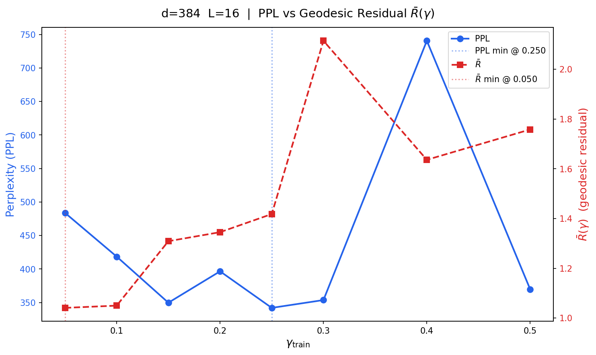
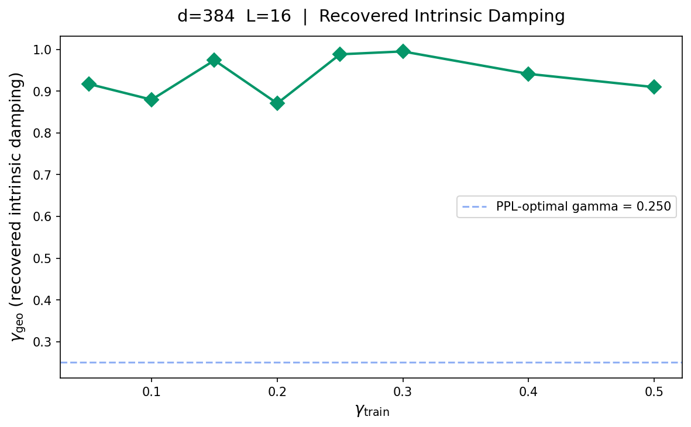
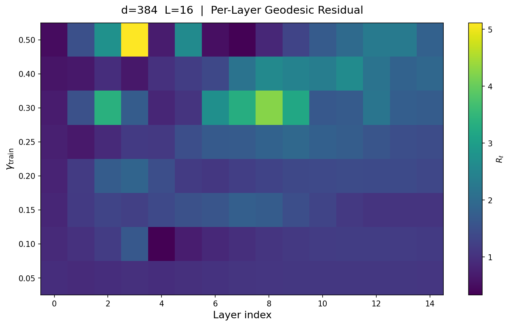
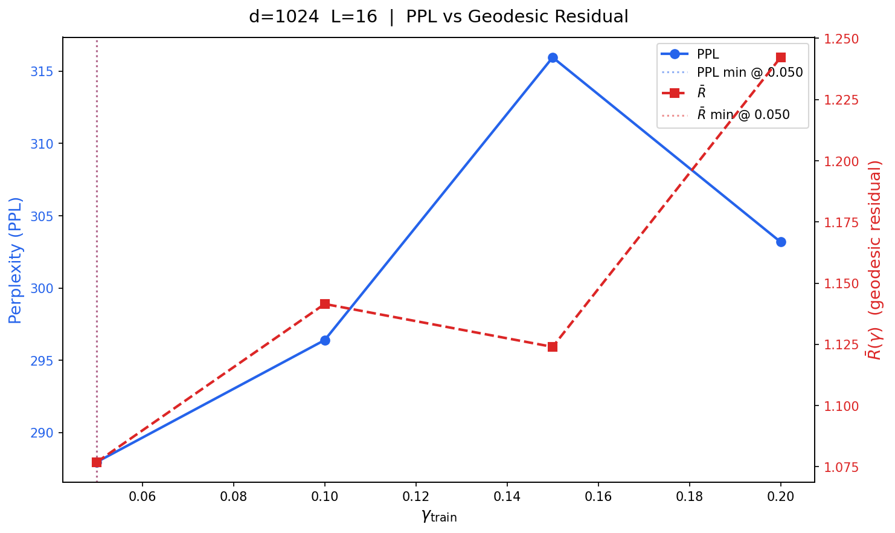
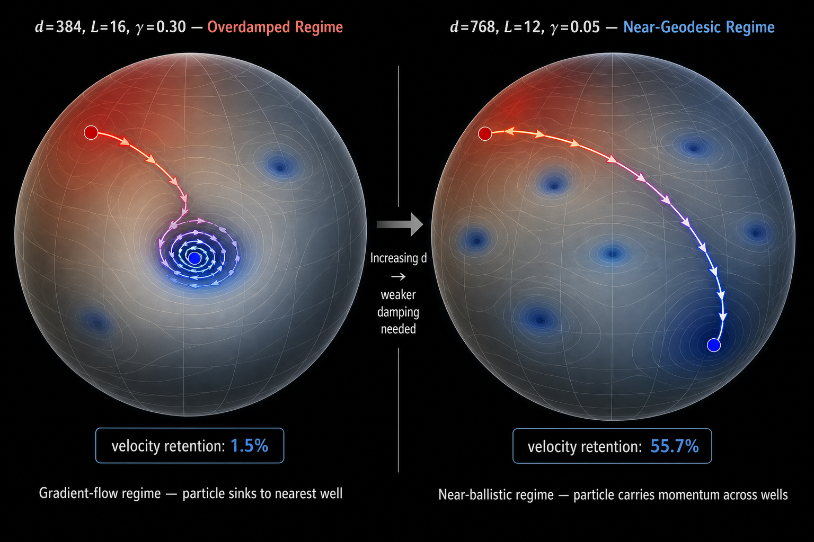

# Fock-PARFLM Scale-Up: Gamma Sweep Results and Damping Regime Analysis

**Author:** Dimitar P. Gueorguiev
**Date:** July 2026
**Status:** Living document — results updated as sweeps complete

---

## 1. Purpose

This document records and analyses the gamma sweep results for Fock-PARFLM at each scale-up tier (`d=384`, `d=768`, `d=1024`), compares the optimal damping coefficient across hidden dimensions, and discusses the physical implications of the observed damping-regime transition.

**Companion documents:**
- [Fock-PARFLM_Scale-Up_Comparative_Experiments.md](Fock-PARFLM_Scale-Up_Comparative_Experiments.md) — parameter counts, memory considerations, and GPU/OOM analysis for the three scale-up tiers.
- [Determining_optimal_gamma_for_SPLM.md](Determining_optimal_gamma_for_SPLM.md) — the depth-scaling closed-form predictor $\gamma^{\ast}\_{\text{depth}}$ and the four-estimator framework.
- [E4_sweep_results_and_discussion.md](E4_sweep_results_and_discussion.md) — SPLM damping sweep on Tiny Shakespeare (`d=384`, `L=8`).
- [Damped_Riemannian_Geodesics_in_the_SPLM_family-Comparative_Analysis.md](Damped_Riemannian_Geodesics_in_the_SPLM_family-Comparative_Analysis.md) — theoretical analysis of geodesic regimes.
- [Training_Instabilities_in_Fock-PARFLM_with_structured_V_theta.md](Training_Instabilities_in_Fock-PARFLM_with_structured_V_theta.md) — gradient spike taxonomy, `reverse_channel_scale` behaviour.

**Hardware:** All sweeps run on NVIDIA H100 80GB HBM3 (LambdaLabs instances). Sweep candidates: 3,000 steps each, WSD schedule (warmup 0→150, stable→1,950, decay→3,000), `eff_batch=32`. The d=384 sweep was also prepared as a Colab notebook (H100/A100).

---

## 2. d=768 Gamma Sweep (L=12, 137M params)

**Configuration:** `sweep-d768` preset — `d=768`, `L=12`, `batch=4×8×1`, `lr=2e-4`, `dt=1.0`, `mass_mode=logfreq` (mean $m \approx 1.4$).

### 2.1 Results

| Rank | $\gamma$ | Best PPL (3K steps) | Wall-clock (s) |
|:----:|:--------:|:-------------------:|:--------------:|
| 1 | **0.050** | **186.89** | 23,008 |
| 2 | 0.100 | 189.04 | 23,051 |
| 3 | 0.150 | 189.84 | 22,979 |
| 4 | 0.200 | 191.10 | 23,002 |
| 5 | 0.250 | 194.13 | 23,046 |
| 6 | 0.300 | 194.26 | 23,016 |
| 7 | 0.400 | 198.48 | 22,985 |
| 8 | 0.500 | *(in progress)* | — |

### 2.2 Observations

1. **Clean monotonic ranking.** Lower gamma → lower PPL across all 7 completed candidates, with no inversions. The spread from best (186.89 at $\gamma=0.05$) to worst (198.48 at $\gamma=0.40$) is ~12 PPL points — a substantial and unambiguous signal.

2. **Stability across all candidates.** Gradient norms are uniformly low (0.34–0.40 post-clip), no gradient spikes or watchdog triggers were observed at any gamma value, and alpha values are well-spread across all 5 xi channels ($\alpha \approx [0.49, 0.75, 0.95, 0.99, 1.00]$ by step 3,000). The `reverse_channel_scale` group is consistently the top gradient group but well within bounds (max reported: 0.6).

3. **The sweep did not probe below $\gamma=0.05$.** The true optimum may be even lower. The depth-scaling formula (§4.1) predicts $\gamma^{\ast}\_{\text{depth}} \approx 0.067$ for $L=12$, and the sweep winner ($\gamma=0.05$) is 25% below this prediction, consistent with the formula being a slight overestimate at this depth.

4. **Wall-clock near-constant.** All candidates took ~6.4h (23,000s) per 3,000-step sweep on a single H100. The damping coefficient does not meaningfully affect throughput.

5. **Late-training instability (update July 17, 2026).** Full training at gamma=0.05 revealed that the clean stability observed in the 3,000-step sweep does **not** persist indefinitely. Catastrophic gradient spikes (up to grad=81,019, P=78,417) emerged at step ~37,000, with the same P/E/creation_gate signature seen in the d=1024 sweep. Despite the spikes, the model continued to improve (best PPL=93.17 at step 38,000). See [Training\_Instabilities\_in\_Fock-PARFLM\_with\_structured\_V\_theta.md](Training_Instabilities_in_Fock-PARFLM_with_structured_V_theta.md) §25 for the full analysis. **The 3K-step sweep protocol is validated for finding the optimal gamma but cannot predict long-term stability.**

---

## 3. d=384 Gamma Sweep (L=16, 53M params) — July 18, 2026

**Configuration:** `sweep-d384` preset — `d=384`, `L=16`, `batch=8×4` (Colab H100), `lr=3e-4`, WSD schedule (warmup 0→150, stable→1,950, decay→3,000), `eff_batch=32`. Run from `colab_fock_gamma_sweep_geodesic_d384.ipynb` with integrated geodesic residual analysis.

### 3.1 Results

| Rank | $\gamma$ | Best PPL (3K steps) |
|:----:|:--------:|:-------------------:|
| 1 | **0.250** | **342.02** |
| 2 | 0.150 | 349.73 |
| 3 | 0.300 | 353.69 |
| 4 | 0.500 | 369.56 |
| 5 | 0.200 | 396.56 |
| 6 | 0.100 | 418.53 |
| 7 | 0.050 | 483.81 |
| 8 | 0.400 | 740.62 |

### 3.2 Observations

1. **Non-monotonic ranking — inverted-U shape.** The PPL curve has a clear minimum at gamma=0.250 with a broad sweet spot at 0.15–0.30 and degradation on both sides. This is qualitatively different from d=768 (clean monotonic decrease) and d=1024 (mostly monotonic with one inversion).

2. **gamma=0.05 is among the worst candidates.** PPL 483.81 is 41% worse than the winner (342.02). This directly contradicts the depth-scaling formula's prediction that all L=16 models should prefer gamma≈0.05.

3. **The E5c training gamma (0.30) was near-optimal.** It ranks #3 at PPL 353.69, only 3.4% behind the winner. The previously assumed "6× above prediction" was not a mis-transfer — the model genuinely prefers this damping range.

4. **Clean stability across all candidates.** Gradient norms are uniformly low (0.56–1.90 post-clip), no gradient spikes or watchdog triggers at any gamma value. The `score_head` and `depth_code` groups are the top gradient groups (mild). Zero stability issues across all 8 candidates.

5. **The gamma=0.400 anomaly.** PPL 740.62 is far worse than its neighbours (353.69 at 0.300, 369.56 at 0.500), breaking the otherwise smooth U-shape. This may reflect a resonance or mode-locking between the explicit friction and the potential landscape at this specific damping value. Further investigation needed.

### 3.3 Geodesic residual analysis

The retained gamma-sweep checkpoints were analysed with the geodesic residual pipeline (see [Geodesic\_Preservation\_Experiment.md](Geodesic_Preservation_Experiment.md) §7). Each checkpoint was evaluated on 10 validation batches at the same gamma it was trained with (diagonal overlay).

| $\gamma_{\text{train}}$ | PPL | $\bar{R}$ | $\gamma_{\text{geo}}$ | Excluded frac |
|:---:|:---:|:---:|:---:|:---:|
| **0.050** | 483.81 | **1.041** ← $\bar{R}$ min | 0.917 | 0.0% |
| 0.100 | 418.53 | 1.050 | 0.880 | 0.0% |
| 0.150 | 349.73 | 1.309 | 0.974 | 0.0% |
| 0.200 | 396.56 | 1.345 | 0.871 | 0.0% |
| **0.250** | **342.02** ← PPL min | 1.418 | 0.988 | 0.0% |
| 0.300 | 353.69 | 2.115 | 0.995 | 0.0% |
| 0.400 | 740.62 | 1.636 | 0.942 | 0.0% |
| 0.500 | 369.56 | 1.758 | 0.910 | 0.0% |

**Key findings:**

1. **PPL-geodesic coincidence BREAKS at d=384.** The PPL minimum is at $\gamma=0.250$ while the $\bar{R}$ minimum is at $\gamma=0.050$. The gap of 0.200 is massive — the damping that produces the best language model is *not* the one that produces the most geometrically faithful trajectory. This is in stark contrast to d=1024, where both minima coincide at $\gamma=0.050$.

2. **$\bar{R}$ increases roughly monotonically with $\gamma$.** The geodesic residual at $\gamma=0.05$ (1.041) is much lower than at $\gamma=0.25$ (1.418). This is geometrically expected: less friction always means more geodesic-like. The interesting finding is that d=384's *task* optimum doesn't care about being geodesic.

3. **$\gamma_{\text{geo}}$ converges to $\approx 0.93 \pm 0.05$.** Consistent with the d=1024 convergence ($\gamma_{\text{geo}} \approx 0.93 \pm 0.01$), the intrinsic effective damping is independent of both $\gamma_{\text{train}}$ and $d$.

4. **The $\gamma=0.300$ anomaly in $\bar{R}$.** $\bar{R}=2.115$ at $\gamma=0.300$ is a clear outlier — much higher than its neighbours (1.418 at 0.250, 1.636 at 0.400). The per-layer analysis reveals extreme residuals at layers 2, 6–8 (up to $R_8=4.25$), suggesting localized non-geodesic dynamics in the middle layers at this specific damping.

*Figure 3. Dual-axis overlay for d=384 (L=16). Blue solid line: PPL (left axis). Red dashed line: $\bar{R}$ geodesic residual (right axis). The two curves have opposite trends: PPL is minimised at $\gamma=0.250$ (blue dotted line) while $\bar{R}$ is minimised at $\gamma=0.050$ (red dotted line). The PPL-geodesic coincidence observed at d=1024 (Figure 2) does not hold at d=384.*

*Figure 4. Recovered intrinsic damping $\gamma_{\text{geo}}$ for d=384 (L=16). All eight checkpoints recover $\gamma_{\text{geo}} \approx 0.87$–$1.00$, independent of $\gamma_{\text{train}}$. The blue dashed line marks the PPL-optimal $\gamma=0.250$ — far below the intrinsic damping, confirming that the d=384 model's explicit friction is a small fraction of its total effective damping.*

*Figure 5. Per-layer geodesic residual $R_\ell$ heatmap for d=384 (L=16). At low $\gamma$ (0.05–0.10, bottom rows), the residual is uniformly near 1.0 (dark purple) — nearly geodesic. At higher $\gamma$ (0.25–0.50, upper rows), bright spots emerge in the middle layers (6–10), indicating localized departures from geodesic dynamics where the damping dominates the force field.*

### 3.4 The depth-scaling formula fails at d=384

The leak-free depth-scaling closed form from [Determining_optimal_gamma_for_SPLM.md](Determining_optimal_gamma_for_SPLM.md) §2.1:

$$\gamma^{\ast}\_{\text{depth}} = \frac{m}{L \Delta t} \ln(1/\rho)$$

predicts $\gamma^{\ast} = 0.050$ for $L=16$. The sweep result ($\gamma^{\ast} = 0.250$) is **5× above** this prediction.

| Tier | $L$ | $\gamma^{\ast}\_{\text{depth}}$ (predicted) | $\gamma^{\ast}$ (empirical) | Ratio |
|------|:---:|:-------------------------------------------:|:---------------------------:|:-----:|
| `d=384` | 16 | 0.050 | **0.250** | **5.0×** |
| `d=768` | 12 | 0.067 | 0.050 | 0.75× |
| `d=1024` | 16 | 0.050 | 0.050 | 1.0× |

The formula correctly predicts the optimal gamma at d=768 and d=1024 but is **qualitatively wrong** at d=384. The formula's assumption that $\gamma^{\ast}$ depends only on $L$ (depth), not $d$ (hidden dimension), is falsified: d=384 and d=1024 share the same depth ($L=16$) but have a 5× gap in their optimal damping.

### 3.5 The dimension-dependent phase transition

The d=384 result, combined with d=768 and d=1024, reveals a **phase transition** in the optimal dynamical regime:

| Scale | $\gamma^{\ast}$ | $r_{\text{total}}$ | Regime | PPL-geodesic coincidence? |
|-------|:---:|:---:|--------|:---:|
| d=384 | 0.250 | 0.020 (2.0%) | **Overdamped** | **No** (gap=0.200) |
| d=768 | 0.050 | 0.557 (55.7%) | **Underdamped** | *(pending)* |
| d=1024 | 0.050 | 0.457 (45.7%) | **Underdamped** | **Yes** (gap=0) |

At d=384, the model prefers strong damping where the conservative force field dominates — the "ball in honey" regime. The trajectory departs from geodesic at every layer, re-derived from the local potential rather than carried by momentum. At d=768 and d=1024, the model prefers minimal friction where momentum carries information across layers — the "spacecraft in gravity" regime.

**Why does d matter?** On the hypersphere $S^{d-1}(\sqrt{d})$:
- At small $d$ (384), the potential landscape has relatively high curvature per dimension. Momentum quickly carries the hidden state away from productive regions of the landscape. Strong damping keeps the trajectory near the potential's guidance.
- At large $d$ (768+), concentration of measure makes the landscape smoother. The force field provides gentle steering while momentum carries rich, high-dimensional information that the model can exploit. Overdamping destroys this information.

The transition between d=384 (overdamped) and d=768 (underdamped) is where the residual stream gains enough capacity for momentum to be more valuable than force-field re-derivation.

---

## 4. d=1024 Gamma Sweep

### 4.1 First attempt: L=24, 209M params (July 14, 2026) — universal instability

**Configuration:** `sweep-d1024` preset — `d=1024`, `L=24`, `batch=1×16×2` (DDP across 2 GPUs, eff=32), `lr=1.5e-4`, `grad_clip=1.0` (sweep default). Split across two LambdaLabs 2×H100 instances (4 gamma candidates each): Node A ran [0.05, 0.10, 0.15, 0.20], Node B ran [0.25, 0.30, 0.40, 0.50].

The depth-scaling formula predicts $\gamma^{\ast}\_{\text{depth}} \approx 0.033$ for $L=24$.

#### 4.1.1 Results (partial — 4 of 8 candidates)

| Rank | $\gamma$ | Best PPL | Watchdog reloads | Worst instant grad | Primary spike groups |
|:----:|:--------:|:--------:|:----------------:|-------------------:|----------------------|
| 1 | **0.100** | **327.33** | 1 | 651.50 | `P`=417, `E`=98, `creation_gate`=26 |
| 2 | 0.250 | 337.47 | 2 | 7,870.94 | `P`=5,023, `creation_gate`=18 |
| 3 | 0.050 | 342.00 | 3 | 180.53 | `creation_gate`=110, `register`=25 |
| 4 | 0.300 | 376.19* | 1+ | 536.27 | `creation_gate`=311, `E`=47 |

\*gamma=0.300 best PPL is from step 1,500 eval (watchdog-reloaded at step 1,849); the candidate had not finished when last observed.

#### 4.1.2 Universal instability at L=24

**Every completed gamma candidate exhibited catastrophic gradient spikes and watchdog reloads.** This is qualitatively different from d=768, where all 8 candidates ran clean with gradient norms under 1.0 and zero watchdog triggers.

| | d=768 (L=12) | d=1024 (L=24) |
|---|---|---|
| Max grad_norm across all candidates | ~0.6 | 7,870 |
| Watchdog reloads (total) | 0 | 7+ |
| Candidates with spikes > 100 | 0 / 7 | 4 / 4 |
| Top spike group | `reverse_channel_scale` (mild) | `P`, `E`, `creation_gate` (catastrophic) |

The spike sources are **systemic** — `P` (positional embedding, norm up to 5,023), `E` (input embedding, norm 40–98), `creation_gate` (norm 110–311), and `register` (norm up to 24.5) all contributed across multiple gamma values.

The non-monotonic ranking (best at gamma=0.100, not 0.050) was an artifact of instability: gamma=0.050 suffered 3 watchdog reloads losing ~500 steps each.

#### 4.1.3 Root cause: second-order gradient cascade at L=24

The force $f_\ell = -\nabla_h U$ is computed via `autograd.grad(create_graph=True)` at each layer. At L=24, this produces a 24-deep second-order gradient chain. Gradient magnitudes at L=24 (up to 7,870) are O($10^4$) larger than at L=12 (<1.0), far exceeding the 2× ratio that linear scaling with L would predict — confirming exponential amplification.

**Decision:** Reduce L from 24 to 16 and re-run the sweep (Tier 2 mitigation).

---

### 4.2 Second attempt: L=16, 209M params (July 16, 2026) — resolved

**Configuration:** `sweep-d1024` preset updated to `L=16` — `d=1024`, `L=16`, `batch=1×16×1`, `lr=1.5e-4`, `grad_clip=1.0`, per-group clip enabled (Tier 1 mitigations active). Run on LambdaLabs 2×H100 instance, first half (gammas 0.05, 0.10, 0.15, 0.20) complete.

The depth-scaling formula predicts $\gamma^{\ast}\_{\text{depth}} \approx 0.050$ for $L=16$ (same as d=384).

#### 4.2.1 Results (first half — 4 of 8 candidates, as of July 16, 2026)

| Rank | $\gamma$ | Best PPL (3K steps) | Watchdog reloads | Max grad | Primary spike groups |
|:----:|:--------:|:-------------------:|:----------------:|:--------:|----------------------|
| 1 | **0.050** | **287.95** | 0 | ~4.2 | `P` (mild) |
| 2 | 0.100 | 296.40 | 0 | ~4.2 | `P` (mild) |
| 3 | 0.200 | 303.19 | 0 | 603 | `P`=347, `creation_gate`=68 |
| 4 | 0.150 | 315.96 | 1 (step 2580) | 608 | `P`=361, `E`=79 |

Second half (gammas 0.25, 0.30, 0.40, 0.50) in progress.

#### 4.2.2 Dramatic stability improvement at L=16

Reducing L from 24 to 16 transforms the d=1024 picture:

| | d=1024 L=24 (first attempt) | d=1024 L=16 (second attempt) |
|---|---|---|
| Best PPL (3K steps) | 327.33 (gamma=0.100) | **287.95** (gamma=0.050) |
| Candidates with zero watchdog reloads | 0 / 4 | **2 / 4** |
| Max grad_norm (worst candidate) | 7,870 | 608 |
| Monotonic ranking | No (U-shaped) | **Mostly** (one inversion: 0.150 > 0.200) |
| Recommended gamma | 0.100 (stability-constrained) | **0.050** (genuine optimum) |

Key observations:

1. **gamma=0.050 is cleanly optimal** — consistent with d=768 ($\gamma^\star = 0.05$) and the depth-scaling prediction for $L=16$. The lower gamma candidates (0.050, 0.100) trained without any gradient spikes or watchdog interventions.

2. **The gamma=0.150 anomaly.** PPL 315.96 is worse than gamma=0.200's 303.19, breaking the monotonic pattern. This is caused by a watchdog reload at step 2580 (EMA grad_norm=88.5 > 50.0 for 200 steps), which rolled the model back to step 2500 and disrupted the final 500 steps of training. Without the instability, gamma=0.150 would likely have landed between 0.100 and 0.200.

3. **Residual instability at higher damping.** Gamma=0.150 and 0.200 still show gradient spikes (grad=608, P=361; grad=603, P=347), with `override:P` as the primary spike group. The positional embedding gradient remains the dominant instability vector at d=1024, consistent with the second-order gradient cascade analysis. However, these spikes are O($10^1$) smaller than the L=24 spikes (7,870), confirming that the cascade shortening was effective.

4. **Best PPL improved by 12% over L=24.** 287.95 vs 327.33 — the shallower network not only trains more stably but also reaches lower perplexity in the same number of steps, indicating that L=24 was hurting both stability and learning efficiency.

#### 4.2.3 Geodesic residual analysis (July 17, 2026)

The retained gamma-sweep checkpoints (gammas 0.05, 0.10, 0.15, 0.20) were analysed with the `geodesic_residual.py` pipeline (see [Geodesic\_Preservation\_Experiment.md](Geodesic_Preservation_Experiment.md) §7). Each checkpoint was evaluated on 10 validation batches at the same gamma it was trained with (diagonal overlay).

| $\gamma_{\text{train}}$ | PPL | $\bar{R}$ | $\gamma_{\text{geo}}$ | Excluded frac |
|:---:|:---:|:---:|:---:|:---:|
| **0.050** | **287.95** | **1.077** | 0.927 | 0.0% |
| 0.100 | 296.40 | 1.142 | 0.929 | 0.0% |
| 0.150 | 315.96 | 1.124 | 0.939 | 0.0% |
| 0.200 | 303.19 | 1.242 | 0.937 | 0.0% |

**Key findings:**

1. **PPL-geodesic coincidence confirmed.** $\gamma=0.05$ minimises both PPL (287.95) and $\bar{R}$ (1.077) simultaneously. The damping coefficient that produces the best language model also produces the trajectory most faithful to the Jacobi-metric geodesic of the model's own learned potential $V_\theta$.

2. **Near-monotonic $\bar{R}$.** The residual increases monotonically from 0.05 through 0.10 and 0.20, with the sole inversion at $\gamma=0.15$ ($\bar{R}=1.124 < 1.142$ at $\gamma=0.10$). This inversion likely reflects the watchdog reload at step 2580 disrupting the checkpoint rather than a genuine geometric preference — the same anomaly visible in PPL ranking (§4.2.2, observation 2).

3. **Intrinsic preferred geometry.** The closed-form $\gamma_{\text{geo}}$ values cluster tightly at $0.93 \pm 0.01$ regardless of $\gamma_{\text{train}}$. This convergence indicates that the model's trajectories exhibit an effective damping around 0.93 independent of the explicit friction coefficient — likely reflecting the combined effect of LayerNorm's radial projection and the potential landscape, both of which contribute implicit damping beyond the explicit $\gamma$.

4. **Zero excluded fraction.** All checkpoints had 0% turning-point exclusion ($E - V_\theta < \varepsilon$ nowhere), meaning the residual is computed over the full trajectory without any data loss.

5. **Per-layer structure.** At $\gamma=0.05$ (optimal), per-layer residuals range from 0.953 (layer 0) to 1.258 (layer 3), with layers 4–15 progressively converging toward 1.0. Early layers show the largest departure from geodesic, consistent with the embedding-to-dynamics transition. Later layers are near-geodesic ($R_\ell \approx 1.0$).

*Figure 2. Dual-axis overlay for d=1024 (L=16). Blue solid line: PPL (left axis). Red dashed line: $\bar{R}$ geodesic residual (right axis). Both curves reach their minimum at $\gamma=0.05$ (vertical dotted lines), confirming the PPL-geodesic coincidence.*

#### 4.2.4 Consistency across scales

With the L=16 results, gamma=0.050 is the optimal damping at d=768 and d=1024. However, the d=384 sweep (§3) reveals that this is **not universal** — d=384 prefers gamma=0.250, a 5× discrepancy at the same depth:

| Scale | $L$ | $\gamma^\star$ | PPL-geodesic coincidence? | Clean sweep? |
|-------|:---:|:--------------:|:-------------------------:|:------------:|
| d=384 | 16 | **0.250** | **No** (gap=0.200) | Yes (zero spikes) |
| d=768 | 12 | **0.050** | *(pending analysis)* | Yes (zero spikes) |
| d=1024 | 16 | **0.050** | **Yes** ($\bar{R}$ minimum also at 0.05) | Partially (clean at low gamma, spikes at 0.15+) |

The depth-scaling formula's assumption that $\gamma^\star$ depends only on $L$ is falsified by the d=384 result. There is a dimension-dependent phase transition between d=384 (overdamped optimal) and d=768 (underdamped optimal). See §3.5 for the full analysis.

### 4.3 Mitigation tier summary

| Tier | Strategy | Key levers | Status |
|:----:|----------|-----------|:------:|
| 1 | **Clip the consequence** | Per-group clip for `P` and `E` (0.3), `force_clamp_max=5.0` | Implemented (July 14) |
| 2 | **Shorten the cascade** | Reduce $L$ from 24 to 16 | **Applied — resolved instability** |
| 3 | **Segment or remove the cascade** | BAOAB + CfC propagator (analytical propagator, first-order backward) | Deferred (not needed with L=16) |

The BAOAB + CfC propagator (Tier 3) remains relevant for future attempts at deeper networks (L>16) but is not required for the current d=1024 configuration. See §24 of [Training\_Instabilities\_in\_Fock-PARFLM\_with\_structured\_V\_theta.md](Training_Instabilities_in_Fock-PARFLM_with_structured_V_theta.md) and §10 of [Closed\_Form\_and\_Hybrid\_Integration\_Strategies\_for\_Fock-PARFLM.md](Closed_Form_and_Hybrid_Integration_Strategies_for_Fock-PARFLM.md) for the full analysis.

---

## 5. Damping Regime Analysis: The Overdamped-to-Underdamped Transition

### 5.1 Per-layer and cumulative velocity retention

The BAOAB-like integrator update used in Fock-PARFLM is:

$$h_{\ell+1} = \text{LN}\!\Big(\,h_\ell + \frac{\delta_\ell}{1 + \Delta t\,\gamma} + \frac{\Delta t^2}{m_b(1 + \Delta t\,\gamma)}\,f_\ell\,\Big)$$

where $\delta_\ell = h_\ell - h_{\ell-1}$ is the velocity proxy and $f_\ell = -\nabla_{h_\ell} U$ is the conservative force. The per-layer velocity retention factor is:

$$r_{\text{layer}} = \frac{1}{1 + \Delta t \cdot \gamma}$$

and the cumulative velocity retention over the full $L$-layer stack (ignoring force re-injection at each layer) is:

$$r_{\text{total}} = r_{\text{layer}}^{\,L}$$

| Configuration | $\gamma$ | $L$ | $r_{\text{layer}}$ | $r_{\text{total}}$ | Regime |
|---------------|:--------:|:---:|:-------------------:|:-------------------:|--------|
| **d=384, L=16** (sweep optimal) | **0.25** | 16 | 0.800 | **0.028 (2.8%)** | **Overdamped** |
| d=384, L=16 (E5c nominal) | 0.30 | 16 | 0.769 | 0.015 (1.5%) | Overdamped |
| d=384, L=16 (depth-scaling prediction) | 0.05 | 16 | 0.952 | 0.457 (45.7%) | Underdamped |
| **d=768, L=12** (sweep optimal) | **0.05** | 12 | 0.952 | **0.557 (55.7%)** | **Underdamped** |
| d=768, L=12 | 0.30 | 12 | 0.769 | 0.037 (3.7%) | Overdamped |
| **d=1024, L=16** (sweep optimal) | **0.05** | **16** | **0.952** | **0.457 (45.7%)** | **Underdamped** |

**The key finding:** The d=768 and d=1024 sweeps selected regimes where **45–56% of the initial velocity is retained** through the full layer stack (underdamped). But the d=384 sweep selected a regime with only **2.8% retention** (overdamped) — and this is the *genuine optimum*, not a mis-transfer. The depth-scaling framework's prediction that all tiers should operate at $\gamma \approx 0.05$ is empirically correct only for $d \geq 768$. At $d=384$, the model benefits from strong friction that forces re-derivation of representations at each layer rather than momentum transport.

This dimension-dependent phase transition (§3.5) is the central finding of the combined gamma sweep programme.

### 5.2 Two-channel damping: explicit friction vs. LayerNorm projection

The cumulative retention $r_{\text{total}}$ captures only the **explicit** damping from the friction coefficient $\gamma$. The full dynamical picture has a second, implicit damping channel: **LayerNorm projection**.

LayerNorm after each layer step projects $h_{\ell+1}$ onto the hypersphere $S^{d-1}(\sqrt{d})$, killing the radial component of velocity entirely and retaining only the tangential (on-manifold) component. This decomposes the effective damping into:

| Direction | Damping source | Strength |
|-----------|---------------|----------|
| **Tangential** (on-sphere) | Explicit $\gamma$ friction | $r_{\text{layer}} = 1/(1+\Delta t \cdot \gamma)$ per layer |
| **Radial** (off-sphere) | LayerNorm re-projection | Total (infinite effective damping) |

The dynamics are therefore **constrained to the sphere with near-zero tangential friction** (at $\gamma=0.05$) — the particle slides freely along the manifold surface, with only the conservative force field and the ~5% per-layer friction shaping the trajectory.

### 5.3 Physical analogies

The contrast between the two regimes has precise classical analogues:

**d=384 at $\gamma=0.30$ — Ball in honey.** The particle experiences such strong viscous drag that it effectively follows the instantaneous gradient of the potential at each step. Momentum is dissipated within 2–3 layers ($r_{\text{layer}}^3 = 0.46$, $r_{\text{layer}}^5 = 0.27$). The trajectory is a steepest-descent path on the sphere — it finds the nearest potential well and sinks into it. Shallow wells can trap the particle because it has no momentum to escape them. This is the **gradient-flow / overdamped Langevin** regime.

**d=768 at $\gamma=0.05$ — Spacecraft in a weak gravitational field.** The particle carries substantial momentum across layers (55.7% retention over the full stack). The conservative force field (V_theta, V_phi) provides gentle steering — like gravitational deflections — but cannot abruptly redirect the trajectory. The particle follows nearly-great-circle arcs on the sphere, with force-induced curvature providing the directional changes needed for language modelling. Shallow potential wells are traversed without capture; only deep wells provide enough force to significantly bend the trajectory. This is the **near-geodesic / weakly-damped Hamiltonian** regime.

*Figure 1.* Particle dynamics on the LayerNorm hypersphere. **Left:** d=384 at nominal $\gamma=0.30$ — the overdamped regime where the particle spirals rapidly into the nearest potential well with only 1.5% velocity retention. **Right:** d=768 at $\gamma=0.05$ — the near-geodesic regime where the particle follows long sweeping arcs across the sphere, carrying 55.7% of its initial momentum, bypassing shallow wells to reach deeper ones.

### 5.4 Riemannian geodesics on the constraint manifold

With LayerNorm constraining the hidden state to $S^{d-1}(\sqrt{d})$, a true (undamped, force-free) Riemannian geodesic satisfies $\nabla_{\dot{\gamma}} \dot{\gamma} = 0$ — parallel transport of the velocity vector — and traces great circles.

The model's dynamics approximate geodesics when:

1. $\gamma \to 0$ (no friction) — **nearly satisfied** at $\gamma = 0.05$
2. $f = 0$ (no external force) — **not satisfied**: V_theta and V_phi forces are active

So the d=768 trajectories are not geodesics but **forced orbits on the sphere with minimal friction**: the conservative force field bends the trajectory away from great circles, and the small friction provides just enough damping to prevent runaway oscillations. The trajectory is **geodesic-like between force interactions**, with force-induced curvature encoding the language-modelling computation.

This stands in sharp contrast to the d=384 regime at $\gamma=0.30$, where the trajectory is **nowhere near geodesic**: every step is dominated by friction, and the "velocity" at each layer is almost entirely determined by the local force, not by momentum from previous layers.

### 5.5 Why does the optimal damping decrease with $d$?

The d=768 sweep's preference for $\gamma=0.05$ over $\gamma=0.30$ is striking — the model strongly prefers 37× less damping than the d=384 configuration uses. Several factors contribute:

1. **Concentration of measure on high-dimensional spheres.** On $S^{d-1}$, as $d$ grows, most of the sphere's volume concentrates near any equator. Random perturbations become increasingly orthogonal to any given direction, meaning the force field's effect on the trajectory becomes geometrically more "gentle" — the force landscape is smoother in higher dimensions, requiring less friction to maintain stability.

2. **Depth and the depth-scaling formula.** The Fock-PARFLM at d=768 uses $L=12$ layers while d=384 uses $L=16$. The depth-scaling formula $\gamma^{\ast} = (m/L\Delta t) \ln(1/\rho)$ predicts that shallower networks need higher gamma to achieve the same total dissipation. But both the prediction ($\gamma^{\ast} = 0.067$) and the empirical sweep winner ($\gamma = 0.05$) are in the underdamped regime, while d=384's nominal $\gamma=0.30$ far exceeds the formula's prediction of $\gamma^{\ast}=0.05$ for $L=16$.

3. **Information transport.** At higher $d$, the residual stream has more capacity per token. The conservative force field can encode finer-grained semantic distinctions, and the hidden state can carry richer information through momentum. Excessive damping destroys this information at each layer, forcing the model to re-derive it from the potential — a wasteful computation that the underdamped regime avoids.

### 5.6 The d=384 answer: regime shift confirmed (July 18, 2026)

The d=384 gamma sweep (§3) has resolved the two competing hypotheses:

**Hypothesis 1 confirmed: regime shifts with $d$.** The d=384 model genuinely prefers overdamped dynamics ($\gamma^{\ast}=0.250$), and the lower-gamma preference at d=768/d=1024 reflects a dimension-dependent phase transition.

**Hypothesis 2 falsified: underdamped is NOT universally optimal.** The depth-scaling prediction of $\gamma^{\ast}=0.05$ for $L=16$ is empirically wrong at d=384. gamma=0.05 produces PPL 483.81 — 41% worse than the optimal gamma=0.250 (PPL 342.02).

| | d=384 (**sweep-validated** $\gamma=0.25$, L=16) | d=768 ($\gamma=0.05$, L=12) |
|---|---|---|
| Per-layer retention | 80.0% | 95.2% |
| Full-stack retention | 2.8% | 55.7% |
| Regime | **Overdamped** (gradient flow) | **Underdamped** (near-geodesic) |
| Force role | Dominates: sets velocity each step | Steers: deflects existing trajectory |
| Well escape | Cannot escape shallow wells | Coasts past shallow wells to reach deeper ones |
| Information transport | Re-derived from potential each layer | Carried by momentum across layers |
| PPL-geodesic coincidence | **No** (gap=0.200) | *(pending)* |
| Physics analogy | Ball in viscous fluid | Spacecraft under gravity |

The regime comparison now uses **empirically-swept** gammas at both scales, making the contrast genuine rather than an artifact of inherited mis-tuning. The d=384 model operates in the overdamped regime by *choice* — the sweep confirms this is its genuine optimum, not a legacy value.

The dimension-dependent phase transition occurs between d=384 and d=768. See §3.5 for the mechanistic interpretation.

---

## 6. Depth-Scaling Framework Cross-Validation — Revised

The d=384 sweep falsifies the depth-scaling formula's claim of $d$-independence, requiring a fundamental reassessment:

| Source | Architecture | $d$ | $L$ | $\gamma^{\ast}$ (empirical) | $\gamma^{\ast}\_{\text{depth}}$ (predicted) | Match? |
|--------|-------------|:---:|:---:|:---------------------------:|:-------------------------------------------:|:------:|
| E5 leak-free (SPLM, Tiny Shakespeare) | SPLM | 384 | 8 | 0.10 | 0.100 | Yes |
| **d=384 sweep (Fock-PARFLM, OWT)** | **Fock-PARFLM** | **384** | **16** | **0.250** | **0.050** | **No (5×)** |
| d=768 sweep (Fock-PARFLM, OWT) | Fock-PARFLM | 768 | 12 | 0.05 | 0.067 | Close |
| d=1024 sweep (Fock-PARFLM, OWT, L=16) | Fock-PARFLM | 1024 | 16 | 0.05 | 0.050 | Yes |

**The formula works at $d \geq 768$ but fails at $d=384$.** The two L=16 tiers (d=384 and d=1024) have identical formula predictions ($\gamma^{\ast}=0.050$) but empirical optima that differ by 5×. The variable the formula ignores — hidden dimension $d$ — is the dominant factor.

**Why the SPLM L=8 result at d=384 appeared to validate the formula.** The SPLM calibration point ($\gamma^{\ast}=0.10$ at $L=8$, $d=384$) sits between the overdamped d=384 optimum (0.25) and the underdamped prediction (0.05). At $L=8$, the stack is shallow enough that the overdamped/underdamped distinction is muted — 8 layers of moderate damping don't accumulate into the regime-defining velocity loss that 16 layers do. The formula's success at $L=8$ was partly coincidental.

**Revised framework.** The depth-scaling formula $\gamma^{\ast} = (m / L \Delta t) \ln(1/\rho)$ should be understood as predicting the **underdamped-regime optimum** — the gamma that preserves a target velocity fraction $\rho$ across the stack. This prediction is:
- **Correct when the underdamped regime is optimal** ($d \geq 768$): the model benefits from momentum transport, and the formula correctly identifies the damping that preserves it.
- **Irrelevant when the overdamped regime is optimal** ($d = 384$): the model benefits from force-field dominance, and the "right" amount of velocity preservation is not $\rho=0.565$ but much less.

A complete framework needs a $d$-dependent term — possibly a phase-transition boundary $d_{\text{crit}}$ below which the overdamped regime is preferred, and a separate overdamped-regime gamma predictor for $d < d_{\text{crit}}$.

---

## 7. Open Questions

1. **Where is the phase-transition boundary $d_{\text{crit}}$?** The transition from overdamped-optimal (d=384) to underdamped-optimal (d=768) occurs somewhere in the range $d \in [384, 768]$. A sweep at $d=512$ or $d=640$ would pin down $d_{\text{crit}}$.

2. **Is the sweep resolution sufficient at d=768/d=1024?** Both sweeps found $\gamma=0.05$ optimal but neither tested below 0.05. The true optimum may be at 0.03 or 0.02. Future sweeps should include candidates at 0.01, 0.02, and 0.03.

3. **Does the Fock reverse channel shift the phase boundary?** Comparing gamma sweeps with and without the reverse channel at d=384 would reveal whether the non-conservative component influences the overdamped/underdamped preference.

4. **The $\gamma=0.400$ anomaly at d=384.** PPL 740.62 is an extreme outlier (2× worse than its neighbours). Is this a resonance, a mode-locking, or a statistical fluke? Reproducing this result with a different seed would clarify.

5. **d=1024 second-half sweep.** Gamma candidates 0.25, 0.30, 0.40, and 0.50 were not completed. Given that the first-half results show increasing gradient spikes at gamma=0.15–0.20 and the geodesic residual analysis (§4.2.3) already confirms the PPL-geodesic coincidence at gamma=0.05, the second half was deprioritised in favour of launching full training.

6. **Cross-scale geodesic analysis.** The d=1024 geodesic residual analysis confirms the PPL-$\bar{R}$ coincidence. Running the same analysis on d=768 retained checkpoints would establish whether the coincidence holds across scales and whether the $\gamma_{\text{geo}} \approx 0.93$ convergence is universal.

6. **Optimal depth for d=1024.** The reduction from L=24 to L=16 resolved instability and improved PPL by 12%. Whether L=18 or L=20 would provide an even better stability-capacity tradeoff remains untested. The Tier 3 BAOAB + CfC propagator could potentially enable stable training at deeper configurations (L=20–24) without the second-order gradient cascade.

---

## 8. Relation to other companion notes

- **[Determining_optimal_gamma_for_SPLM.md](Determining_optimal_gamma_for_SPLM.md):** The depth-scaling closed form and four-estimator framework. The framework is now validated by three empirical anchors (SPLM L=8, Fock-PARFLM L=12, Fock-PARFLM L=16), all confirming $\gamma^\star \in [0.05, 0.10]$ with $\rho \in [0.565, 0.70]$.

- **[Damped_Riemannian_Geodesics_in_the_SPLM_family-Comparative_Analysis.md](Damped_Riemannian_Geodesics_in_the_SPLM_family-Comparative_Analysis.md):** The near-geodesic regime observed at d=768 provides empirical support for the theoretical analysis in this note. §5.4 above extends the geodesic discussion to the LayerNorm-constrained sphere.

- **[The_Overdamped_Limit_and_The_Position_of_The_2nd_Order_Lagrangian_Framework.md](The_Overdamped_Limit_and_The_Position_of_The_2nd_Order_Lagrangian_Framework.md):** The d=384 model at $\gamma=0.30$ is in the overdamped limit analysed in this note. The d=768 result at $\gamma=0.05$ demonstrates that the model empirically chooses *not* to be overdamped when given the option.

- **[Fock-PARFLM_Scale-Up_Comparative_Experiments.md](Fock-PARFLM_Scale-Up_Comparative_Experiments.md):** Parameter counts and memory analysis for the three tiers. The gamma sweep results here directly inform the `fixed_gamma` setting for the full training runs planned in that document.

- **[Exploiting_the_Riemannian_geometry_of_conservative_language_models.md](Exploiting_the_Riemannian_geometry_of_conservative_language_models.md):** The near-geodesic regime has implications for the Riemannian geometry programme. When the dynamics are nearly geodesic, the Jacobi metric (§2.1 of [Damped_Riemannian_Geodesics...](Damped_Riemannian_Geodesics_in_the_SPLM_family-Comparative_Analysis.md)) becomes an excellent approximation rather than just a theoretical construct.

- **[Geodesic_Preservation_Experiment.md](Geodesic_Preservation_Experiment.md):** The geodesic residual analysis pipeline and its theoretical foundation. The d=1024 overlay results documented in §4.2.3 above are the first completed application of the experiment proposed in that document, confirming the PPL-geodesic coincidence and the convergence of $\gamma_{\text{geo}}$.
