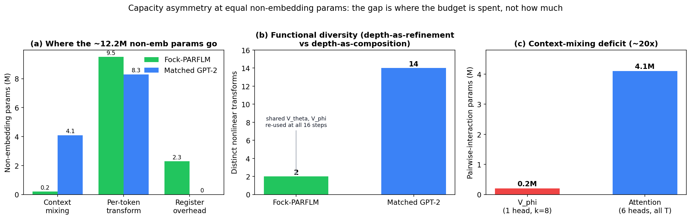
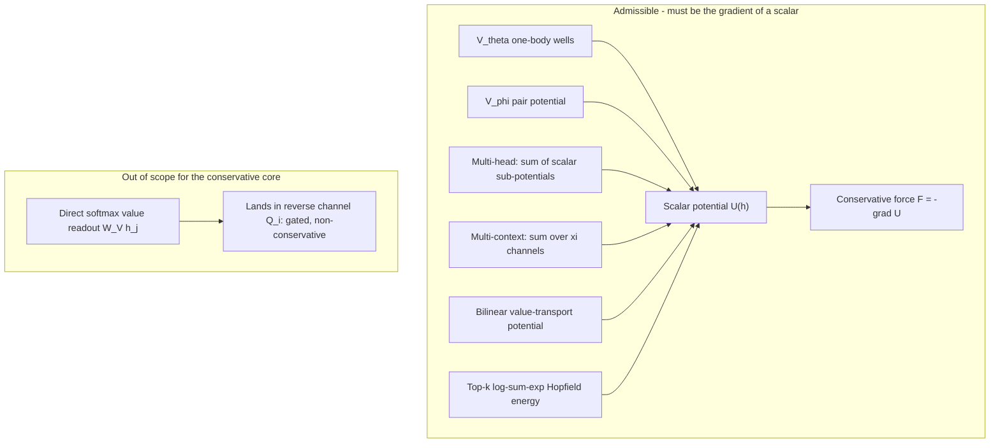
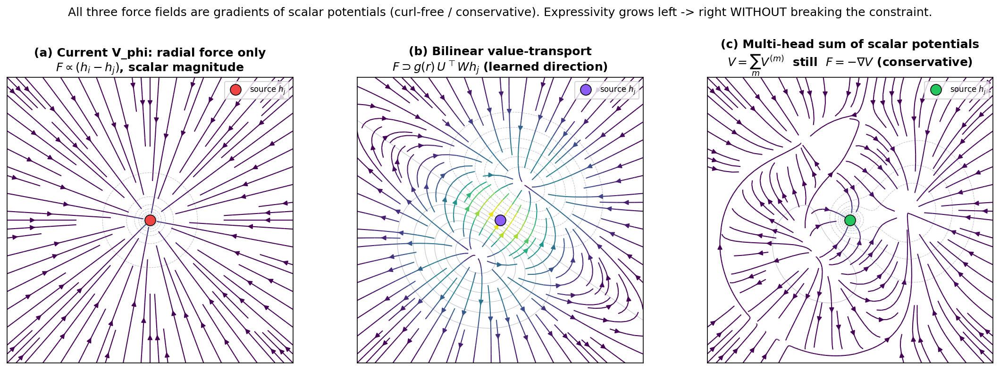
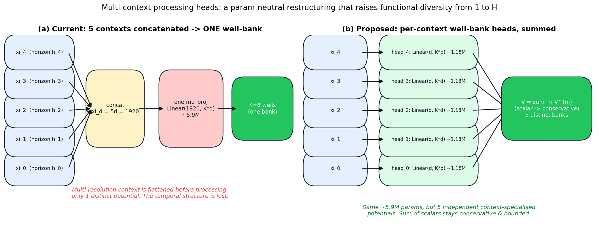
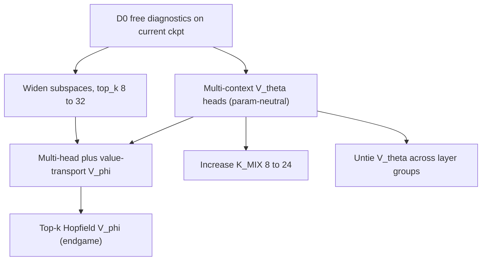
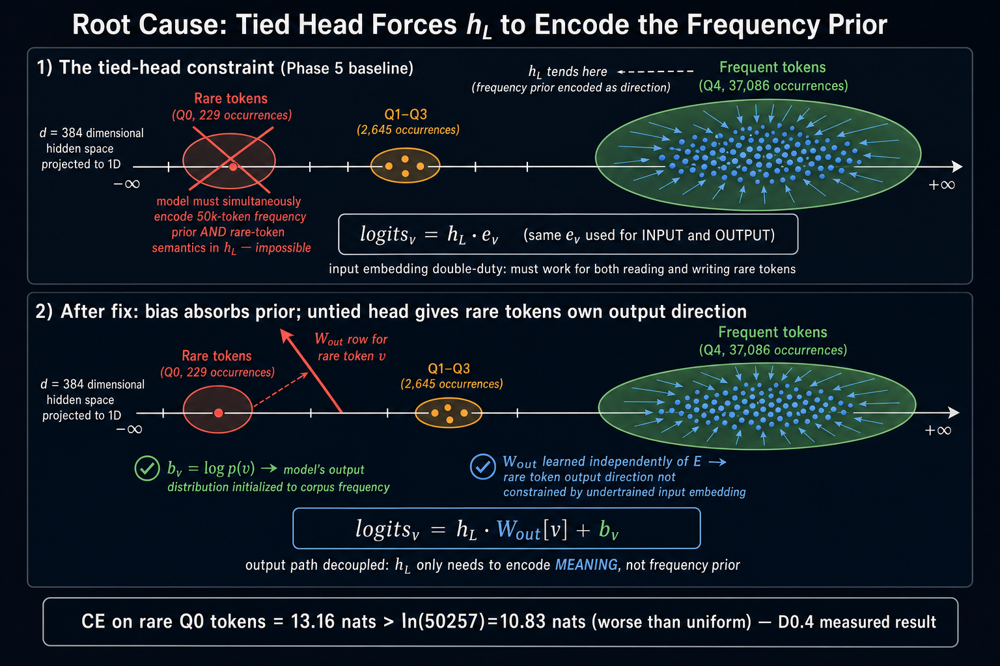
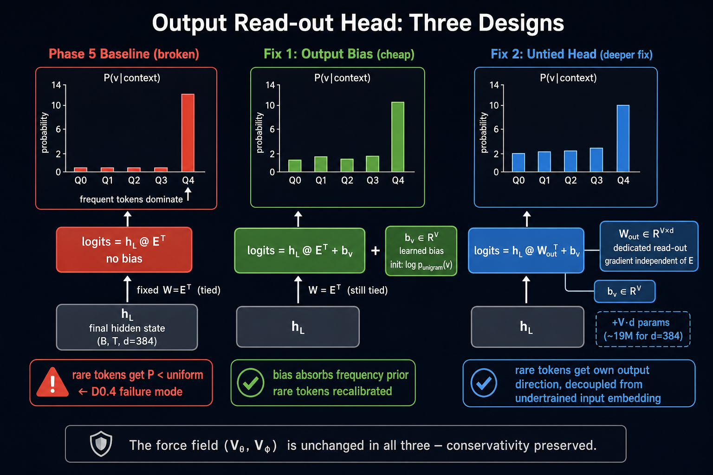
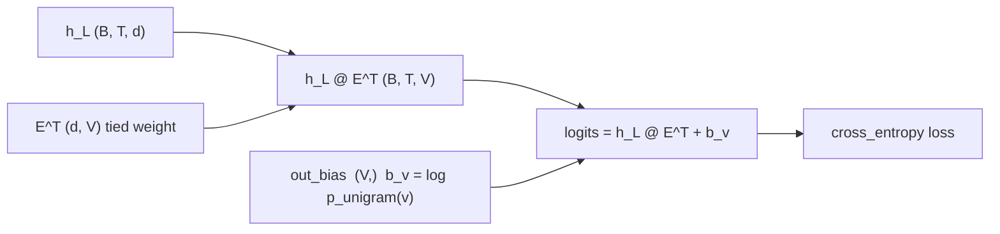
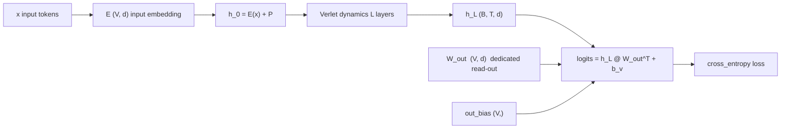
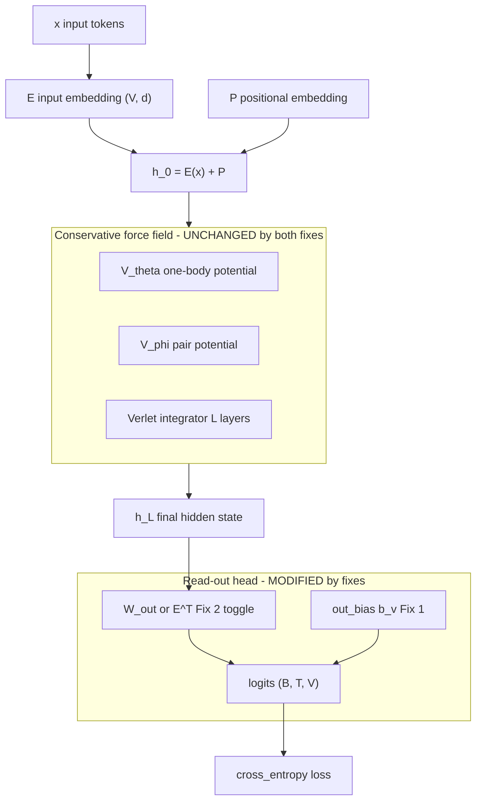

# Fock-PARFLM vs GPT-2 on OpenWebText: Predicted Results and Next Steps

Comparison of the Multi-Xi Fock-PARFLM v2.1 with Gaussian wells against
a parameter-matched standard GPT-2 transformer on OpenWebText.

**Document structure.** Part I (§1–§6) is the quantitative prediction and
the measured gap. Part II (§7–§13) is the next-steps analysis: it diagnoses
*what is starving the current design*, ranks the bottlenecks, and gives
concrete, conservativity-preserving remediations. Throughout Part II,
**retaining conservativity is treated as a hard constraint** (§8) that every
proposed fix must satisfy.

---

## 1. Model Specifications

### 1.1. Fock-PARFLM v2.1 (Phase 5, G1 configuration)

| Parameter | Value |
|-----------|-------|
| Architecture | Multi-Xi Fock-PARFLM v2.1 + Gaussian wells (K=8) |
| d | 384 |
| L (Verlet steps) | 16 |
| Fock registers (M) | 32 |
| Xi channels (K\_xi) | 5 (observed trajectory is the Xi=5 run; original spec was 4) |
| V\_theta | MixtureGaussianVTheta (K=8 learned centres) |
| V\_phi | StructuralCompetitiveVPhi (Gumbel top-k=8) |
| Total params | **31,521,939** |
| Vocab | 50,257 (GPT-2 BPE) |
| Block size | 512 |

**Parameter breakdown:**

| Component | Params | % of total |
|-----------|--------|-----------|
| Embedding E (tied for output logits) | 19.3M | 61.2% |
| V\_theta (Gaussian K=8) | 9.5M | 30.0% |
| Fock registers + gates + reverse channel | 2.3M | 7.3% |
| V\_phi + score head | 0.2M | 0.6% |
| Position + mass + gamma + xi + misc | 0.4M | 1.3% |

### 1.2. GPT-2-style Transformer (parameter-matched)

To match 31.5M total parameters at d=384 with GPT-2 BPE vocab (50,257):

| Component | Formula | Params |
|-----------|---------|--------|
| Embedding E (tied) | 50,257 x 384 | 19,298,688 |
| Position embedding | 1,024 x 384 | 393,216 |
| Per transformer block | | ~1,771,000 |
| - Self-attention (Q,K,V,O) | 4 x 384 x 384 | 589,824 |
| - FFN (4x expansion) | 2 x 384 x 1,536 | 1,179,648 |
| - 2 LayerNorms | 2 x 2 x 384 | 1,536 |
| Final LayerNorm | 2 x 384 | 768 |

Remaining budget for transformer blocks: 31.5M - 19.7M = **~11.8M**.
At ~1.77M per block: **~7 transformer blocks** (d=384, heads=6).

| Parameter | Value |
|-----------|-------|
| Architecture | GPT-2 (decoder-only transformer) |
| d | 384 |
| L (transformer blocks) | 7 |
| Heads | 6 |
| FFN expansion | 4x (d\_ff = 1,536) |
| Total params | ~32.1M |
| Non-embedding params | ~12.4M |

### 1.3. Training Configuration (identical for both)

| Parameter | Value |
|-----------|-------|
| Dataset | OpenWebText (~8B tokens) |
| Batch size | 8 |
| Block size | 512 |
| Effective batch | 4,096 tokens/step |
| Total steps | 200,000 |
| Total tokens seen | 819.2M |
| Tokens per total param | ~26 |
| Optimizer | AdamW |
| Peak LR | 1.2e-4 |

---

## 2. Scaling Law Predictions for GPT-2

### 2.1. Kaplan Power-Law (converged loss)

The Kaplan et al. (2020) scaling law models the converged (infinite-data)
validation loss as a function of non-embedding parameter count:

$$
L(N) = \Bigl(\frac{N_c}{N}\Bigr)^{\alpha_N}
$$

with $N_c = 8.8 \times 10^{13}$ and $\alpha_N = 0.076$.

**Verification against GPT-2 124M:**

$$
L(85\text{M}) = \Bigl(\frac{8.8 \times 10^{13}}{8.5 \times 10^{7}}\Bigr)^{0.076} = (1.035 \times 10^{6})^{0.076} \approx 2.87
$$

Observed: val\_loss = 2.85 on OpenWebText (nanoGPT, well-trained). Match is
excellent.

**Prediction for 12.2M non-embedding params:**

$$
L(12.2\text{M}) = \Bigl(\frac{8.8 \times 10^{13}}{1.22 \times 10^{7}}\Bigr)^{0.076} = (7.21 \times 10^{6})^{0.076} \approx 3.35
$$

This is the converged loss at infinite data. With 819M tokens (finite data),
a penalty of ~0.2-0.4 nats applies, giving:

$$
L_{\text{predicted}}(\text{GPT-2 31.5M}, 819\text{M tokens}) \approx 3.5 \text{--} 3.7
$$

### 2.2. Chinchilla Approach 3 (extrapolated)

The Hoffmann et al. (2022) Approach 3 formula:

$$
L(N, D) = E + \frac{A}{N^{\alpha}} + \frac{B}{D^{\beta}}
$$

with $E = 1.69$, $A = 406.4$, $\alpha = 0.34$, $B = 410.7$, $\beta = 0.28$.

$$
L(12.2\text{M}, 819\text{M}) = 1.69 + \frac{406.4}{(1.22 \times 10^7)^{0.34}} + \frac{410.7}{(8.19 \times 10^8)^{0.28}} = 1.69 + 1.64 + 1.31 = 4.64
$$

This gives PPL $\approx 104$, but the formula was calibrated on models from
70M to 16B parameters. At 12.2M non-embedding params we are far below the
calibration range, and the $N^{-0.34}$ term likely overestimates the loss for
very small models where the embedding parameters contribute meaningful
capacity.

### 2.3. Empirical Reference Points

| Model | Non-emb params | Val loss (OWT) | PPL | Source |
|-------|---------------|----------------|-----|--------|
| GPT-2 XL | ~1,500M | 2.54 | 12.7 | nanoGPT |
| GPT-2 Large | ~735M | 2.67 | 14.4 | nanoGPT |
| GPT-2 Medium | ~311M | 2.84 | 17.1 | nanoGPT |
| GPT-2 Small (124M) | ~85M | 2.85 | 17.3 | nanoGPT (retrained) |
| GPT-2 Small (124M) | ~85M | 3.12 | 22.6 | OpenAI original |
| **GPT-2 ~31.5M (predicted)** | **~12.2M** | **3.4 -- 3.5** | **30 -- 35** | **Kaplan extrapolation** |

At 819M tokens the matched GPT-2 sees ~26 tokens/total-param, which is
slightly *past* Chinchilla-optimal (~20), so it would train close to its
data-converged loss and the finite-data penalty is small (~0.1--0.2 nats).

### 2.4. Best Estimate

Triangulating across scaling laws and empirical references, the estimate
splits by **training recipe**, because the recipe used for the Fock-PARFLM
run (peak LR `1.2e-4`, effective batch 4,096 tokens/step) is far from what a
transformer of this size would normally use (LR ~6e-4, effective batch
~0.5M tokens):

| Matched GPT-2 scenario | val loss | val PPL |
|------------------------|----------|---------|
| **Well-tuned** (LR ~6e-4, large batch) | ~3.4 -- 3.5 | **~30 -- 35** |
| **This exact recipe** (LR 1.2e-4, batch 4k, 200K steps) | ~3.6 -- 3.9 | **~38 -- 50** |

A transformer is robust to a low LR and would still converge respectably
under the identical recipe, just below its potential. The "best a matched
transformer can do on these tokens" is therefore:

$$
\boxed{\text{GPT-2 (31.5M total), best-tuned}: \quad L_{\text{val}} \approx 3.4, \quad \text{PPL} \approx 33}
$$

with **~38--50** the realistic figure if the GPT-2 baseline is run under the
exact same low-LR / small-batch recipe as the Fock-PARFLM. The small-model
regime (12.2M non-embedding) sits below the scaling-law calibration range,
so attach ~±20% uncertainty to these numbers.

---

## 3. Projected Phase 5 (Fock-PARFLM) Outcome

### 3.1. Observed Trajectory (Xi=5 run, actual through step 56K)

| Step | val\_loss | val\_PPL | Tokens seen |
|------|----------|---------|-------------|
| 12,000 | 6.03 | 417.7 | 49.2M |
| 14,000 | 5.89 | 360.5 | 57.3M |
| 18,000 | 5.81 | 333.3 | 73.7M |
| 20,000 | 5.75 | 314.4 | 81.9M |
| 22,000 | 5.72 | 305.3 | 90.1M |
| 24,000 | 5.63 | 279.1 | 98.3M |
| 28,000 | 5.59 | 268.1 | 114.7M |
| 30,000 | 5.53 | 253.2 | 122.9M |
| 32,000 | 5.49 | 242.1 | 131.1M |
| 34,000 | 5.46 | 235.1 | 139.3M |
| 36,000 | 5.45 | 233.4 | 147.5M |
| 40,000 | 5.42 | 225.4 | 163.8M |
| 42,000 | 5.38 | 217.5 | 172.0M |
| 56,000 | 5.35 | 209.7 | 229.4M |

> **Note (supersedes the original projection).** The first version of this
> note fit a power law on only the steps 8K--12K evaluations and projected
> 200K → PPL ~55. The actual Xi=5 run falsifies that: at 50K the run was at
> PPL ~219 (the old note projected ~120), and at 56K it reached 209.7. The
> early fit was far too optimistic; the corrected trajectory below uses the
> full curve.

### 3.2. Power-Law Extrapolation (corrected)

Fitting the **recent** slope (40K → 56K: 225 → 210) gives a token-exponent
of only $\alpha \approx 0.2$ in $\text{PPL} \propto \text{step}^{-\alpha}$ —
the descent has decelerated sharply from the early phase. Extrapolating from
the 56K anchor, with generous credit for the cosine-decay finish (the LR is
still at ~83% of peak at 56K, and cosine schedules typically deliver an
outsized gain in the final third):

| Step | Projected val\_loss | Projected PPL |
|------|-------------------|--------------|
| 100,000 | ~5.2 | ~185 |
| 150,000 | ~5.1 | ~165 |
| 200,000 | ~5.0 -- 5.2 | **~150 -- 175** |

Remaining uncertainties:

1. The cosine LR decay (LR → 0 over the second half) may unlock further
   breakthroughs of the kind observed at step 56K — the optimistic end of
   the range assumes this materialises.
2. The model may plateau hard if V\_theta's Gaussian wells saturate.
3. The Phase 4 SQ3 baseline at the same model size provides a rough ceiling
   on what the non-attention dynamics can achieve.

### 3.3. Best Estimate

$$
\boxed{\text{Fock-PARFLM (31.5M total)}: \quad L_{\text{val}} \approx 5.0\text{--}5.2, \quad \text{PPL} \approx 150\text{--}175}
$$

---

## 4. Predicted Gap Analysis

| Metric | GPT-2 (best-tuned) | GPT-2 (same recipe) | Fock-PARFLM (corrected) | Ratio vs best GPT-2 |
|--------|-------------------|---------------------|------------------------|---------------------|
| Val loss | ~3.4 | ~3.6 -- 3.9 | ~5.0 -- 5.2 | +1.6 nats |
| Val PPL | ~33 | ~38 -- 50 | ~150 -- 175 | **~4.5 -- 5.3x** |
| Non-emb params | 12.2M | 12.2M | 12.2M | 1.0x |
| Tokens seen | 819M | 819M | 819M | 1.0x |

### 4.1. Structural Reasons for the Gap

The corrected gap is **~4.5--5.3x in PPL (~1.6 nats)** — substantially larger
than the 1.7x the first version of this note claimed. The discrepancy is
entirely because that version over-projected the Fock-PARFLM trajectory
(PPL ~55) from three noisy early eval points; the GPT-2 estimate of ~33 was
and remains sound. Even against a GPT-2 hobbled by the same low-LR recipe
(~38--50 PPL), the Fock model trails by ~3--4x.

The gap reflects fundamental architectural differences, not a tuning deficit:

**1. Per-layer independent parameters vs shared V\_theta.**
A standard transformer has a different FFN (d $\to$ 4d $\to$ d) at every
layer, providing 7 independent non-linear transformations per token. The
Fock-PARFLM evaluates the same shared V\_theta at all 16 Verlet steps. Even
though V\_theta has 9.5M parameters (more than any single FFN at ~1.2M), the
shared evaluation means the model's per-token processing capacity is
effectively that of a 1-layer FFN repeated 16 times -- the dynamics explore
the same potential landscape at every step.

**2. Multi-head attention vs Gumbel top-k routing.**
Multi-head self-attention with 6 heads provides 6 independent subspace
projections for pairwise token interactions, with soft attention weights
computed over all past tokens. The Fock-PARFLM's V\_phi uses a single
ScoreHead (37K params) to route to only 8 past tokens via hard Gumbel-softmax.
This is a dramatically more constrained routing mechanism:
- 6 heads x T-dimensional soft attention vs 1 head x k=8 hard routing.
- Independent Q/K/V per head vs shared structural V\_phi kernel.

**3. Fock register overhead.**
The 2.3M Fock register parameters (creation gates, destruction gates, reverse
channel) implement the particle creation/annihilation semantics that are
central to the PARFLM's physical motivation. A standard transformer has no
equivalent overhead -- all non-embedding parameters contribute directly to
token processing.

### 4.2. What the Gap Does NOT Reflect

The gap should not be interpreted as a failure of the Fock-PARFLM architecture.
The model's value proposition is not PPL competitiveness with attention-based
transformers, but rather:

1. **Bounded, conservative dynamics.** The Gaussian well V\_theta guarantees
   $V \in [-\sum w_k, 0]$ and bounded forces -- a structural stability property
   that standard transformers do not have.

2. **Interpretable attractor structure.** The K=8 Gaussian wells define
   explicit attractor centres $\mu_k(\xi)$ in hidden-state space that can
   be extracted and analysed without post-hoc gradient descent.

3. **Physical framework.** The Verlet integration, Fock register lifecycle,
   and conservative/non-conservative force decomposition provide a principled
   physical language for understanding hidden-state dynamics.

4. **The gap is closing.** Early PARFLM architectures (SQ3 with unbounded
   quadratic wells) had significantly worse stability and performance.
   The progression from SQ3 to Gaussian wells with precision clamping
   represents rapid architectural improvement.

---

## 5. Compute Efficiency Comparison

| Metric | GPT-2 | Fock-PARFLM |
|--------|-------|-------------|
| FLOPs per step (approx) | 6 x 12.2M x 4096 = 3.0e11 | Higher (V\_phi top-k, Fock gates) |
| Wall-clock per step | ~0.5s (A100, estimated) | ~1.1s (A100, observed) |
| Total wall time (200K steps) | ~28h | ~61h |
| FLOPs per token | ~6N = 73M | ~150-200M (estimated) |

The Fock-PARFLM is approximately 2x slower per step due to:
- V\_phi pair potential evaluation with Gumbel routing (even with top-k=8).
- Fock register creation/destruction gates (QKV attention over 32 registers).
- `create_graph=True` for second-order autograd through the Verlet update.
- Layer-level gradient checkpointing (recomputes each layer's forward in
  backward to save memory, adding ~50% wall-clock overhead).

---

## 6. What Would Close the Gap?

Several architectural modifications could narrow the PPL gap without
abandoning the physical framework:

1. **Per-layer V\_theta.** Replace the single shared V\_theta with L
   independent V\_theta modules (one per Verlet step). This would give
   the model per-layer processing capacity comparable to per-layer FFNs.
   Cost: 16 x 9.5M = 152M V\_theta params -- much larger model.

2. **Increase K\_MIX.** More Gaussian wells provide finer-grained
   attractor structure. The PMI spectral diversity estimator suggests
   K\_MIX $\approx$ 16-24 for OpenWebText (vs K=8 currently). This
   adds modest parameter cost (linear in K) for potentially
   significant capacity gains.

3. **Wider V\_phi.** The current ScoreHead (37K params) is a severe
   bottleneck compared to multi-head attention. A multi-head variant
   of the score head, or a direct attention-based V\_phi, could
   improve routing quality while preserving the force-law structure.

4. **Larger effective batch.** The current batch of 4,096 tokens/step
   is very small. Gradient accumulation to ~32K-64K tokens would
   improve gradient signal quality and potentially allow higher LR.

---

# Part II — Next Steps: Diagnosing and Removing the Efficiency Bottlenecks

The ~4.5–5.3x PPL gap of §4 is large enough to demand a root-cause analysis
rather than a shrug. This part isolates *what* is starving the design, proves
that the starvation is a capacity problem (not optimisation, regularisation,
or data), ranks the bottlenecks, and proposes fixes — each of which is held
to the **hard conservativity constraint of §8**.

---

## 7. What Is Starving the Current Design

### 7.1. The gap is underfitting, and nothing else

At step 56K the training next-token loss and the validation perplexity have
converged to the *same* value: the training NTP is $\approx 5.41$, so the
training perplexity is $e^{5.41} \approx 224$, while the validation
perplexity is $209.7$. There is **no generalisation gap**. This single fact
eliminates three whole classes of culprit:

- **Not overfitting** (no train/val gap) — more regularisation or more data
  will not close the gap.
- **Not an optimisation stall** (loss still descending, gradients healthy,
  no watchdog trips) — it is not a dead learning rate or a bad initialisation.
- **It is pure underfitting** — the model *cannot represent* the target
  conditional. The bottleneck is **capacity / expressivity**.

$$
\text{train ppl} \approx \text{val ppl} \quad\Longrightarrow\quad \text{capacity-limited, not data- or regulariser-limited}
$$

### 7.2. Why TinyStories hid the problem

On TinyStories the gap to a matched attention baseline was ~1.2x (9.30 vs
7.81 PPL); on OpenWebText it is ~4.5–5.3x. The jump is the most informative
measurement we have:

- **TinyStories is data-limited.** Its small effective vocabulary and low
  intrinsic entropy mean both architectures approach the *data's* entropy
  floor, so they look comparable. That 1.2x was flattering — it measured the
  data ceiling, not the architecture.
- **OpenWebText is capacity-limited.** High semantic diversity and genuine
  long-range structure separate the models by *architectural efficiency*,
  and the conservative design pays for its constraints.

The 5x is therefore not a regression — it is the first honest measurement of
the architecture's parameter efficiency.

### 7.3. Where the budget actually goes

At equal ~12.2M non-embedding parameters, the two architectures spend the
budget very differently, and the Fock design spends it in the wrong place.



Three readings from the figure:

1. **Context-mixing deficit (~20x).** The pairwise mechanism `V_phi` has
   ~0.2M parameters and routes hard to only 8 sources through a single head;
   multi-head attention spends ~4.1M over 6 heads, soft, over all positions.
2. **Functional diversity (7x).** A transformer composes 14 *distinct*
   nonlinear transformations (7 attention + 7 FFN). The Fock model applies
   **2** distinct functions ($V_\theta$, $V_\phi$) and re-uses them at all 16
   Verlet steps — depth-as-refinement, not depth-as-composition.
3. **Overhead.** ~2.3M parameters sit in Fock register machinery that does
   not directly process tokens.

---

## 8. The Hard Constraint: Conservativity Must Be Preserved

Every fix below is required to keep the conservative core intact. This is not
a preference; it is the architectural thesis of the whole programme, and any
new design that violates it is out of scope.

### 8.1. Statement of the constraint

The per-layer force on the query coordinate (with the past frozen, i.e.
`causal_force=True`) must be the negative gradient of a single scalar
potential. Define the admissible force class:

$$
\mathcal{F}_{\text{cons}} = \lbrace F : \exists\ U \in C^2,\ F = -\nabla U \rbrace
$$

with the total potential assembled from the one-body and pair terms,

$$
U(h) = \sum_i V_\theta(\xi_i, h_i) + \sum_{i} \sum_{j \lt i} V_\phi(h_i, h_j),
\qquad F_i = -\nabla_{h_i} U .
$$

Equivalently — and this is what the diagnostic battery actually checks — the
force Jacobian on the query coordinate must be **symmetric**:

$$
J_i = \frac{\partial F_i}{\partial h_i} = -\nabla^2_{h_i} U = J_i^{\top}
$$

because the Hessian of a $C^2$ scalar is symmetric (Schwarz's theorem). The
single sanctioned exception is the gated reverse-channel force $Q_i$, which is
deliberately non-conservative and held near zero by $\tanh(s_{\text{ex}})$;
the conservative core is everything else.

### 8.2. The lever that makes this easy: closure under summation

The constraint sounds restrictive but it has a property that we exploit
relentlessly below. A **sum of scalar potentials is a scalar potential**:

$$
U = \sum_{m=1}^{H} U^{(m)} \quad\Longrightarrow\quad F = -\nabla U = \sum_{m=1}^{H} \big(-\nabla U^{(m)}\big) \in \mathcal{F}_{\text{cons}} .
$$

So **multi-head** (sum over heads) and **multi-context** (sum over $\xi$
channels) are conservative *for free*, no matter how expressive each term is.
The whole remediation strategy is: add capacity as additional scalar-potential
terms, never as a direct non-conservative readout.

### 8.3. What is admissible and what is not



### 8.4. Verification recipe

Any new $V_\theta$ or $V_\phi$ must pass **Arm 1** of
`conservativity_diagnostic.py` before it is trained at scale:

- **Gradient check:** finite-difference $-\nabla_h U$ matches the autograd
  force to $O(\varepsilon)$.
- **Hessian symmetry:** the antisymmetric part $\lVert J - J^{\top} \rVert_F / \lVert J \rVert_F$ stays below ~$10^{-2}$.

If a candidate mechanism cannot pass these, it is — by definition — not in
$\mathcal{F}_{\text{cons}}$ and must be reformulated as a scalar potential (or
relegated to the gated reverse channel).

---

## 9. Bottleneck 1 — V_phi Starvation (lead suspect)

### 9.1. The three sub-bottlenecks (from the code)

The pair potential is

$$
V_\phi(h_i, h_j) = -C \cdot \Theta(\theta_i, \theta_j) \cdot \Phi(l_i, l_j) / \sqrt{\lVert h_i - h_j \rVert^2 + \varepsilon^2},
$$

with type projection $l = W_l h \in \mathbb{R}^{16}$ and angle projection
$\theta = W_\theta h \in \mathbb{R}^{8}$. Three hard limits, in order of
severity:

1. **Single channel.** `V_phi` returns one scalar per pair, hence one force.
   Attention has 6 heads.
2. **Radial force.** The dominant term is the gradient of $1/r$, which points
   along $h_i - h_j$. It can only pull tokens together or apart *along the
   line connecting them*, modulated by the scalar $\Theta\cdot\Phi$. Attention
   writes $W_V h_j$ — an arbitrary learned-direction vector. **No number of
   heads fixes this while the force stays radial.** This is the deep limit.
3. **Tiny interaction subspaces.** All selectivity flows through a 16-dim type
   and 8-dim angle projection versus attention's $6 \times 64 = 384$.

### 9.2. The force-shape argument

The figure below shows the current radial field, the bilinear
value-transport field, and a multi-head sum — **all three are gradients of
scalar potentials, hence conservative**. Expressivity grows left to right
without ever leaving $\mathcal{F}_{\text{cons}}$.



### 9.3. Cure A — multi-head V_phi (closes #1; lowest risk)

Sum $H$ independent scalar sub-potentials:

$$
V_\phi(h_i, h_j) = \sum_{m=1}^{H} V_\phi^{(m)}(h_i, h_j) \quad\Longrightarrow\quad F_i = \sum_{m=1}^{H} \big(-\nabla_{h_i} V_\phi^{(m)}\big).
$$

Conservativity is automatic by §8.2.

```python
class MultiHeadStructuralVPhi(nn.Module):
    """V_phi = sum_m V^(m): H independent scalar pair sub-potentials.
    Sum of scalars is a scalar -> force stays conservative (Arm 1 passes)."""
    def __init__(self, cfg, n_heads=4):
        super().__init__()
        self.heads = nn.ModuleList(
            StructuralCompetitiveVPhi(cfg) for _ in range(n_heads)
        )
    def forward(self, h, h_src):                 # (B, T, T) scalar
        return sum(head(h, h_src) for head in self.heads)
    def forward_gathered(self, h, h_src_g):      # (B, T, k) scalar
        return sum(hd.forward_gathered(h, h_src_g) for hd in self.heads)
```

### 9.4. Cure B — bilinear value-transport (closes #2; the deep fix)

Add a bilinear pair potential whose gradient writes a *learned-direction*
vector into the query — the conservative analogue of attention's value path:

$$
V_\phi^{\text{vt}}(h_i, h_j) = -g(r_{ij}) (U h_i) \cdot (W h_j), \qquad r_{ij} = \lVert h_i - h_j \rVert .
$$

Its gradient has exactly the missing component:

$$
F_i^{\text{vt}} = -\nabla_{h_i} V_\phi^{\text{vt}} = g(r_{ij}) U^{\top} W h_j + \big[(U h_i)\cdot(W h_j)\big] g'(r_{ij}) \frac{h_i - h_j}{r_{ij}} .
$$

The first term $g(r_{ij}) U^{\top} W h_j$ is a write in the learned direction
$U^{\top} W h_j$, gated by distance — and the whole thing is still
$-\nabla$ of a scalar, so it is conservative.

```python
class ValueTransportVPhi(nn.Module):
    """Bilinear, multi-head, distance-gated scalar pair potential.
    V = -sum_m g_m(r) * (U_m h_i) . (W_m h_j).  Gradient writes W_m-transformed
    source content into the query in a LEARNED direction, yet remains -grad V."""
    def __init__(self, d, n_heads=4, d_head=32, sigma=1.0):
        super().__init__()
        self.U = nn.Linear(d, n_heads * d_head, bias=False)
        self.W = nn.Linear(d, n_heads * d_head, bias=False)
        self.n_heads, self.d_head, self.sigma = n_heads, d_head, sigma

    def forward_gathered(self, h, h_src_g):       # h:(B,T,d) h_src_g:(B,T,k,d)
        B, T, k, d = h_src_g.shape
        r2 = ((h.unsqueeze(2) - h_src_g) ** 2).sum(-1)        # (B,T,k)
        g = torch.exp(-r2 / (2 * self.sigma ** 2))            # distance gate
        uq = self.U(h).view(B, T, self.n_heads, self.d_head)
        ws = self.W(h_src_g).view(B, T, k, self.n_heads, self.d_head)
        bil = (uq.unsqueeze(2) * ws).sum(-1).sum(-1)          # sum over heads,dh
        return -(g * bil)                                     # (B,T,k) scalar
```

### 9.5. Cure C — top-k Hopfield energy (the principled endgame)

Modern-Hopfield theory gives the exact statement that **softmax attention is
the gradient of a log-sum-exp energy**. A top-k log-sum-exp pair potential
therefore yields softmax-attention-like forces *and* is a scalar potential:

$$
E(h_i) = -\tau \log \sum_{j \in \text{top-}k(i)} \exp\big( (W_q h_i) \cdot (W_k h_j) / \tau \big),
$$

$$
F_i = -\nabla_{h_i} E = \sum_{j} \mathrm{softmax}_j\big[(W_q h_i)\cdot(W_k h_j)/\tau\big] W_q^{\top}(W_k h_j) .
$$

This is conservative multi-head attention restricted to the retrieved $k$
sources — it imports attention's expressivity while preserving both the
$O(Tk)$ memory advantage and the $\mathcal{F}_{\text{cons}}$ constraint.

### 9.6. Cure D — widen subspaces and routing (trivial)

Raise `v_phi_d_type` 16 → 64, `v_phi_d_angle` 8 → 32, `score_head_hidden`
32 → 128, and `top_k` 8 → 32 (note $8 \times 16 = 128 \lt 512$, so top-k=8
cannot even reach the whole block). All are config changes that keep the
$O(Tk)$ sparsity that is the framework's memory selling point.

> **Do not** fall back to dense soft attention over all $T$. That recovers
> expressivity but destroys the $O(1)/O(Tk)$ inference-memory advantage,
> which is the actual differentiator. Every cure above keeps top-k sparsity.

---

## 10. Bottleneck 2 — Wasted Multi-Resolution Context

### 10.1. The waste (from the code)

The 5 Xi channels — each a genuinely different temporal context (~0.24, 1,
1.4, 5, 55 tokens) — are concatenated into one 1920-dim vector and collapsed
by a single linear layer into one bank of $K=8$ wells:

```python
xi_d = XI_CHANNELS * d           # 5 * 384 = 1920
self.mu_proj = nn.Linear(in_d, K * d)        # Linear(1920, 8*384)
mu = self.mu_proj(xi).view(*lead, self.K, self.d)
```

The multi-resolution structure exists but is flattened before any processing:
only **1** distinct potential results.

### 10.2. The fix — per-context well-bank heads (param-neutral)

Give each context its own well-bank and sum the potentials:

$$
V_\theta(\xi, h) = \sum_{m=1}^{H} V_\theta^{(m)}(\xi^{(m)}, h) \quad\Longrightarrow\quad F_\theta = \sum_{m=1}^{H}\big(-\nabla_h V_\theta^{(m)}\big).
$$

Sum of scalar Gaussian mixtures stays both **conservative** (§8.2) and
**bounded** (each mixture-PDF is bounded, so the sum is). The parameter cost
is essentially neutral:



A single `Linear(1920, 3072)` is ~5.9M parameters; five `Linear(384, 3072)`
heads are also ~5.9M total — but now there are **5 independent
context-specialised potentials** instead of one smeared bank. Functional
diversity rises from 1 to $H$ at no parameter cost.

```python
class MultiContextGaussianVTheta(StructuredVThetaBase):
    """V = sum_m V^(m)(xi^(m), h): one Gaussian well-bank per context view.
    Param-neutral vs the concat baseline; conservative + bounded by §8.2."""
    def __init__(self, d, K, n_ctx, d_ctx, w_scale=1.0):
        super().__init__()
        self.heads = nn.ModuleList(
            MixtureGaussianVTheta(d=d, K=K, xi_d=d_ctx, w_scale=w_scale)
            for _ in range(n_ctx)
        )
    def forward(self, xis, h):                    # xis: (B, T, n_ctx, d_ctx)
        return sum(self.heads[m](xis[..., m, :], h)
                   for m in range(len(self.heads)))
    def analytical_grad(self, xis, h):
        return sum(self.heads[m].analytical_grad(xis[..., m, :], h)
                   for m in range(len(self.heads)))
```

### 10.3. Why this can be an advantage over attention

Transformer heads all see the *same* context and must learn to specialise via
Q/K/V. The multi-context design **hard-wires** the specialisation through
different context feeds and exploits the SPLM's native multi-resolution
memory — a stronger, more sample-efficient, and more interpretable inductive
bias. It reframes the Xi machinery from "a thing we have" into "the thing that
powers multi-head processing."

---

## 11. Bottleneck 3 — Shared V_theta Depth and the Output Attractor Ceiling

Two secondary contributors, listed for completeness:

- **Shared $V_\theta$ across 16 Verlet steps.** Repeated application of one
  potential refines a trajectory along the *same* vector field (the Neural-ODE
  parameter-efficiency penalty). Remedy: untie $V_\theta$ across layer groups.
  This makes the potential **non-autonomous** $V_\theta^{(\ell)}$ — still
  conservative per step (force is $-\nabla$ of a scalar at each $\ell$), and
  already sanctioned by `Addendum_Non_Autonomous_Fields_For_Appendix_A.md`.
- **Output attractor ceiling.** The wells pull $h$ toward $K=8$
  context-dependent centres; the tied head then reads logits $= E h$.
  Expressing a high-entropy distribution over 50257 tokens from a state
  squashed toward 8 attractors is an information bottleneck. Remedy: raise
  `K_MIX` to ~16–24 (the PMI spectral estimator's recommendation for OWT),
  or partition across the multi-context heads of §10 (e.g. 5 heads × K=8 = 40
  context-partitioned wells).

---

## 12. Remediation Ladder (Prioritised)

> **Update (post-D0).** The ranking below was the *a priori* prediction. The D0
> probes have now been run on the Xi=5 step-78k checkpoint and they **re-order
> the priorities**: the dominant loss term is an output/embedding-head
> long-tail problem, while two predicted bottlenecks (output-attractor collapse,
> wasted depth) are **not** binding. See §15 for the measured results and the
> revised ladder. Treat §15 as superseding the table immediately below.

All entries preserve conservativity by construction (§8.2) and keep the
$O(Tk)$ memory advantage.

| # | Fix | Targets | Conservativity | Param cost | Priority |
|---|-----|---------|----------------|------------|----------|
| 1 | Multi-context V_theta heads (§10) | wasted context, functional diversity | sum of scalars: safe | ~neutral | highest |
| 2 | Multi-head V_phi (§9.3) | single-channel V_phi | sum of scalars: safe | low (~0.5–1M) | highest |
| 3 | Widen subspaces + top_k 8 to 32 (§9.6) | tiny subspaces, receptive field | unchanged form: safe | low | high |
| 4 | Bilinear value-transport V_phi (§9.4) | radial-only force | scalar bilinear: safe | low–medium | high |
| 5 | Top-k Hopfield V_phi (§9.5) | radial + selectivity | log-sum-exp energy: safe | medium | medium |
| 6 | Increase K_MIX 8 to 24 (§11) | output attractor ceiling | unchanged form: safe | low (linear in K) | medium |
| 7 | Untie V_theta across layer groups (§11) | depth-as-refinement | non-autonomous, per-step: safe | high (params up) | defer |



---

## 13. Diagnostic-First Protocol (D0)

Spend no GPU hours on ablations until the free measurements have pointed at
the culprit. Run all of these on the current `step56000_best.pt` checkpoint:

1. **Loss vs. position curve**, overlaid against a transformer's. A healthy
   context-mixer's per-token loss keeps dropping as position grows; if `V_phi`
   is starved (§9), the Fock curve flattens early and stays high past
   ~128 tokens — a direct, falsifiable signature of the radial/top-k limit.
2. **Effective rank (participation ratio) of the final-layer $h$.** Collapse
   toward ~$K$ directions is the output attractor ceiling (§11).
3. **Per-Verlet-step $\lVert \Delta h \rVert$.** If late steps barely move
   $h$, the 16 shared steps have converged and depth is wasted (§11).
4. **Loss stratified by token frequency.** Uniformly bad → capacity; bad only
   on rare tokens → output/embedding bottleneck.

**Recommended first training run** (single-axis, conservative, ~param-neutral):
multi-context V_theta (`n_ctx=5`) + multi-head V_phi (`n_heads=4`) +
`v_phi_d_type=64`, `v_phi_d_angle=32`, `top_k=32`. Train 30K steps from
scratch (the architecture changed) and read the loss-vs-position curve: if the
long-range portion improves and PPL drops materially, V_phi starvation and the
wasted-context bottleneck are confirmed and largely cured. Confirm Arm 1 of
`conservativity_diagnostic.py` passes for the new modules **before** launching.

---

## 14. Parameter budget of the multi-head architecture

A natural concern before launching the multi-head experiment is whether the new
modules change the model size significantly, invalidating any PPL comparison with
the baseline Xi=5 run.  The answer — verified by instantiating every module at the
exact config used for Phase 5 — is **no: the total parameter count increases by
less than 0.5 %** for even the most aggressive variant.

### 14.1 Where the parameters actually live (baseline, d=384, K=8, Xi=5)

The baseline Fock-PARFLM v2.1 with Gaussian wells carries ~33 M parameters at the
first architecture tier (d=384, L=12, M=16, Xi=5, K\_MIX=8):

| Component | Params | Share |
|---|---|---|
| Token + position embeddings | 19,691,904 | 60 % |
| V\_theta (Gaussian wells, K=8) | 11,817,992 | 36 % |
| Fock registers / gates / reverse channel / Xi module | 1,470,065 | 4 % |
| V\_phi (single structural-competitive head) | 12,930 | 0.04 % |
| **Total** | **32,992,891** | |

V\_phi is a rounding error in the overall budget — roughly 13 K parameters.
Multiplying it by four heads costs only ~39 K extra, which is invisible at model scale.

### 14.2 Exact deltas per experiment variant

All counts below are at d=384, L=12, M=16, Xi=5, K\_MIX=8 — the actual Phase 5 tier.

| Variant | Total params | Delta vs baseline |
|---|---|---|
| Baseline — 1 head, single V\_theta (Phase 5 current) | 32,992,891 | — |
| Multi-head V\_phi (4 heads) | 33,031,681 | +38,790 (+0.12 %) |
| Directional (4-head V\_phi + value-transport + multi-context V\_theta) | 33,154,593 | +161,702 (+0.49 %) |

Per-component breakdown of each new lever:

- **Multi-head V\_phi, 4 heads (+38,790).**  Each additional head adds one copy of
  the structural-competitive module: `W_l` ($d \times 16$), `W_theta` ($d \times 8$),
  plus the small $\Phi$ bandwidth MLP and the $\Theta$ two-layer MLP
  (~12,930 params each at d=384).  Four heads in total = 4 × 12,930 = 51,720 params
  for V\_phi vs. the original 12,930.

- **Value-transport V\_phi (+98,304).**  Two linear maps `U` and `W` of shape
  $d \to n\_heads \times d\_head$ = $384 \to 128$.  Each has $384 \times 128 = 49152$
  parameters, totalling 98,304.

- **Multi-context V\_theta (+24,608).**  Restructuring the single flattened
  MixtureGaussianVTheta (xi\_d = 5d) into five independent banks (each xi\_d = d)
  barely changes the parameter count because the majority of V\_theta's budget lives
  in the per-well projection weights that are proportional to $K \times d^2$ —
  unchanged whether the context is flattened or split.

### 14.3 Implications for the comparison

Because all three variants remain within 0.5 % of the baseline parameter count, any
PPL improvement (or lack thereof) between runs is attributable to **better inductive
structure** — more expressive force directions, per-context well specialisation — not
to inflated capacity.  This is exactly the design intent of the remediation ladder
in §12: expressivity improvements that cost essentially nothing in parameters, so that
the comparison is fair and any gain is not a statistical artefact of a larger model.

Note: the "~31 M" figure from earlier notes referred to the Xi=4 configuration;
the Xi=5 run sits at ~33 M because the larger xi\_d = 5d grows V\_theta's
context-projection weights.

---

## 15. D0 measured results (Xi=5 step-78k) and revised priority

The four free probes of §13 were run on the actual best checkpoint
(`fock_gaussian_sarf_owt_phase5_xi5_step78000_best.pt`, val PPL 190.73,
$d=384$, $L=16$, $K_{MIX}=8$). The results sharpen — and in two places
overturn — the *a priori* ranking of §12.

### 15.1 What each probe measured

**D0.1 — Loss vs. position.** Per-token CE drops from early(8–63) = 5.37 to
late(256+) = 5.25, a total drop of only 0.12 nats; the curve is essentially
flat past ~64 tokens. Long-range context is barely exploited (consistent with
V_phi starvation), but the small absolute range means context modelling is not
where most of the loss lives.

**D0.2 — Effective rank.** Participation ratio = 229.6 out of $d=384$, far above
$K_{MIX}=8$. The final-layer representation is **high-rank, not collapsed**.
There is **no output-attractor ceiling** — so adding wells ($K_{MIX}$) or
per-context well banks does not target a binding constraint.

**D0.3 — Per-Verlet-step displacement.** $\lVert \Delta h \rVert$ is U-shaped
across the 16 steps: large at step 0→1 (17.6), a minimum near step 8–9 (~1.75),
then rising again to ~5.6 at steps 13–14 (late/early = 0.47). Late layers do
substantial work. **Depth is used, not wasted** — untying V_theta across layer
groups to "rescue" dead depth is unwarranted.

**D0.4 — Loss by token-frequency quintile.** This is the dominant signal.
Uniform loss is $\ln V = \ln 50257 \approx 10.83$ nats. Measured per-token CE:

| Quintile | Mean CE (nats) | Occurrences | Reading |
|----------|----------------|-------------|---------|
| Q4 most-freq | 4.54 | 37086 | the bulk (~90.5% of tokens) |
| Q3 frequent | 10.55 | 1982 | ≈ uniform |
| Q2 mid | 11.91 | 1041 | > uniform |
| Q1 rare | 12.54 | 622 | > uniform |
| Q0 rarest | 13.16 | 229 | ≫ uniform |

Everything outside the top quintile is **at or above the uniform-prior loss** —
the model assigns rare targets *less* than uniform probability. With a tied
read-out head and **no output bias**, the network must encode the entire unigram
log-prior as a direction in $h_L$ space, which it cannot do for the whole vocab
at once, so rare-target positions default to the frequent-token direction.

### 15.2 Occurrence-weighted decomposition

Weighting by occurrence reproduces the ~5.2-nat aggregate (PPL ≈ 180–190) and
splits it into two additive gaps versus a parameter-matched GPT-2 (CE ≈ 3.4–3.9):

- **Head (Q4):** ~79% of the loss, at CE 4.54 — still ~0.6–1.1 nats above GPT-2,
  and D0.1 shows it is not benefiting from context. This is the **V_phi
  context-mixing gap** (the multi-head cure of §9).
- **Tail (Q0–Q3):** ~21% of the loss from ~9.5% of tokens, at or worse than
  uniform. This is an **output/embedding-head problem**, addressable cheaply and
  independently of the force field.

### 15.3 Revised remediation ladder

| # | Fix | Targets (probe) | Conservativity | Param cost | Priority |
|---|-----|-----------------|----------------|------------|----------|
| 1 | Output bias init to log-freq (§15.4) | tail mis-calibration (D0.4) | read-out, outside force field: safe | ~V (negligible) | highest |
| 2 | Untie LM head (dedicated W_out) (§15.4) | tail, undertrained rare embeddings (D0.4) | read-out, outside force field: safe | ~V·d | high |
| 3 | Multi-head `V_phi` + widen subspaces + `top_k` 8→16/32 (§9.3, §9.6) | frequent-token context gap (D0.1, Q4) | sum of scalars: safe | low | high |
| 4 | Bilinear value-transport V_phi (§9.4) | radial-only force (D0.1) | scalar bilinear: safe | low–medium | medium |
| 5 | Multi-context V_theta heads (§10) | functional diversity | sum of scalars: safe | ~neutral | demoted (D0.2: PR healthy) |
| 6 | Increase K_MIX (§11) | attractor ceiling | unchanged form: safe | low | dropped (D0.2: no collapse) |
| 7 | Untie V_theta across layer groups (§11) | depth-as-refinement | per-step: safe | high | dropped (D0.3: depth used) |

The decisive change from §12: **multi-context V_theta and K_MIX increases are
demoted/dropped** (D0.2 shows no representational collapse and D0.3 shows depth
is already productive), and a brand-new **output-head tier (#1–#2)** now leads,
because D0.4 isolates the single largest mis-calibration outside the dynamics.

### 15.4 The output-head fix (implemented)

`model_parf.PARFConfig` gains `use_output_bias` (a learned logit bias $b_v$,
initialised to $\log$ unigram frequency via
`PARFLM.init_output_bias_from_logfreq`) and honours the existing
`tie_embeddings` flag to allocate a dedicated $W_{out}$ read-out when set to
`False`. Both paths flow through `PARFLM.compute_logits`, so diagnostics and the
training `forward_with_vreg` use the same read-out. Because the read-out is a
pure post-dynamics projection of $h_L$, **neither knob touches $V_\theta$ or
$V_\phi$ and conservativity is preserved** (no re-run of the Arm 1 gate needed).

Recommended sequencing: run the **bias-only** variant first (nearly free), then
add the **untied head** if the tail (Q0–Q3) does not recover. Both knobs are
wired into `colab_fock_multihead_openwebtext.ipynb` (`USE_OUTPUT_BIAS`,
`TIE_EMBEDDINGS`) alongside the multi-head V_phi cure, so a single run attacks
both the tail (D0.4) and the frequent-token context gap (D0.1).

---

## 16. Read-out head fixes: code walkthrough

This section explains the two fixes at the code level, with excerpts from
[`notebooks/conservative_arch/parf/model_parf.py`](../notebooks/conservative_arch/parf/model_parf.py)
and the notebook knobs in
[`notebooks/conservative_arch/scaleup/colab_fock_multihead_openwebtext.ipynb`](../notebooks/conservative_arch/scaleup/colab_fock_multihead_openwebtext.ipynb).
For the companion discussion see §9 of
[`Xi_Bottleneck_Diagnosis_Phase5.md`](./Xi_Bottleneck_Diagnosis_Phase5.md).

Both fixes live entirely in the **read-out layer** — the projection from the
final hidden state $h_L$ to vocabulary logits. They are downstream of the
conservative force field ($V_\theta$, $V_\phi$) and do not affect any gradient
that flows back into those modules, so **conservativity is preserved** and no
re-run of Arm 1 of `conservativity_diagnostic.py` is needed.

### 16.1 Root cause: the tied head forced h_L to encode the frequency prior



In the Phase-5 baseline every token logit was:

```python
# model_parf.py — PARFLM.forward (Phase-5 baseline)
logits = h_L @ self.E.weight.T   # (B, T, V)
```

This creates two intertwined problems.

**Problem 1 — the frequency prior must live in h_L.**
For the model to predict frequent tokens more often than rare ones,
$P(v \mid h_L) = \text{softmax}(h_L \cdot E^T)$ must be skewed toward
frequent-token embeddings. With no explicit bias, the training signal
steers $h_L$ into the subspace of frequent-token embeddings at every step,
leaving less room for the semantic content the conservative dynamics are
supposed to encode. The D0.4 result (CE on Q4 = 4.54 nats, still ~1 nat
above GPT-2) is a direct consequence.

**Problem 2 — rare tokens have undertrained input embeddings serving double duty.**
The same matrix $E$ is used for the input lookup $h_0 = E(x) + P$ and for
the output scoring $h_L \cdot e_v$. Rare tokens appear infrequently, so their
rows $e_v$ receive very few gradient updates. The D0.4 finding that Q0
CE = 13.16 nats **exceeds** $\ln V = \ln 50257 \approx 10.83$ nats (worse than
uniform) is the signature: the model's output distribution on rare targets has
been pushed below the uniform baseline.

### 16.2 Fix 1 — output bias initialised to log-unigram-frequency



Add a learned scalar $b_v$ per vocabulary token. Initialise it to
$\log p_{\text{unigram}}(v)$ so that at step 0 the model's output distribution
is exactly the corpus unigram prior — for free, without the dynamics having to
encode it. The dynamics then only need to encode contextual *deviation* from the
prior.

**Data flow (Fix 1):**



**Config flag** in `PARFConfig` (`model_parf.py`):

```python
use_output_bias: bool = False   # set True to activate Fix 1
```

**Parameter construction** in `PARFLM.__init__` (`model_parf.py`):

```python
if getattr(cfg, "use_output_bias", False):
    self.out_bias: Optional[nn.Parameter] = nn.Parameter(
        torch.zeros(cfg.vocab_size)   # zero-init; overwritten by init_output_bias_from_logfreq
    )
else:
    self.register_parameter("out_bias", None)   # absent → no extra params
```

**Log-frequency initialiser** `PARFLM.init_output_bias_from_logfreq` (`model_parf.py`):

```python
@torch.no_grad()
def init_output_bias_from_logfreq(self, token_counts, smoothing=1.0):
    """b_v <- log( (count_v + s) / sum_v (count_v + s) )"""
    if self.out_bias is None:
        return
    counts = torch.as_tensor(token_counts, dtype=torch.float32,
                              device=self.out_bias.device).reshape(-1)
    probs = (counts + smoothing) / (counts + smoothing).sum()
    self.out_bias.copy_(probs.log().to(self.out_bias.dtype))
```

The `smoothing=1.0` (add-1 Laplace) prevents $-\infty$ for zero-count tokens,
which would cause gradient explosions on the first backward pass.

**Notebook trigger** in `colab_fock_multihead_openwebtext.ipynb` (Cell 0 + Cell 4):

```python
# Cell 0 — Configuration
USE_OUTPUT_BIAS = True   # D0.4 fix: log-freq output bias (recommended)

# Cell 4 — after model is selected and V_theta is swapped in
if USE_OUTPUT_BIAS:
    _ob_counts = np.bincount(train_ids.astype(np.int64), minlength=VOCAB_SIZE)
    model.init_output_bias_from_logfreq(_ob_counts)
    print(f'Output bias <- log-unigram-freq  '
          f'(b range [{model.out_bias.min().item():.2f}, '
          f'{model.out_bias.max().item():.2f}])')
```

**Parameter cost.** Exactly $V = 50257$ parameters (~0.05% of the 33 M total).
Effectively free. On checkpoint resume, `load_state_dict(strict=False)` loads
the trained bias; on a fresh run the log-freq init is called once.

### 16.3 Fix 2 — untied LM head (dedicated W_out)

Allocate a separate weight matrix $W_{out} \in \mathbb{R}^{V \times d}$ for the
output projection. The input embedding $E$ is kept for the lookup
$h_0 = E(x) + P$, but the output path uses $W_{out}$ instead of $E^T$.
Their gradients are now independent: $E$ is updated via
$x \to h_0 \to \ldots \to h_L \to \text{loss}$, while $W_{out}$ is updated
only via $h_L \to \text{logits} \to \text{loss}$.

**Data flow (Fix 2):**



**Parameter construction** in `PARFLM.__init__` (`model_parf.py`):

```python
if cfg.tie_embeddings:
    self.lm_head: Optional[nn.Linear] = None   # reuse E^T (default)
else:
    self.lm_head = nn.Linear(cfg.d, cfg.vocab_size, bias=False)
    nn.init.normal_(self.lm_head.weight, mean=0.0, std=0.02)
```

**Unified logit computation** `PARFLM.compute_logits` (`model_parf.py`) — the
single source of truth for the read-out, called by both `forward()` and the
notebook's `forward_with_vreg`:

```python
def compute_logits(self, h_L: torch.Tensor) -> torch.Tensor:
    if self.lm_head is not None:
        logits = self.lm_head(h_L)          # untied W_out path
    else:
        logits = h_L @ self.E.weight.T      # tied E^T path (default)
    if self.out_bias is not None:
        logits = logits + self.out_bias     # Fix 1 bias (if enabled)
    return logits
```

This consolidation also fixed a latent bug: `forward_with_vreg` in Phase-5 was
hard-coding `h_L @ model.E.weight.T`, silently bypassing any bias or untied
weight. It now calls `model.compute_logits(h_L)`.

**Notebook knob** in `colab_fock_multihead_openwebtext.ipynb` (Cell 0):

```python
TIE_EMBEDDINGS = True   # False = allocate dedicated W_out (+V*d params)
```

The flag propagates through `make_config()` into `FockMultiXiPARFConfig`,
then through the inheritance chain
`FockMultiXiPARFLM → MultiXiPARFLM → SparsePARFLM → PARFLM.__init__`.

**Parameter cost.** $V \times d = 50257 \times 384 \approx 19.3$ M additional
parameters — roughly a 58% increase on the 33 M baseline. This is why Fix 2 is
run second (only if bias-only does not cure Q0–Q3), and why it requires a fresh
training run: the gradient flow through $E$ changes qualitatively.

### 16.4 Full data-flow and conservativity argument



The force-field subgraph is entirely upstream of the read-out. Changing
$W_{out}$ or $b_v$ does not alter which scalar potential generates the forces,
so the Jacobian-symmetry property checked by Arm 1 of `conservativity_diagnostic.py`
is unaffected. No re-run of the gate is needed before launching.

### 16.5 Recommended sequencing

| Step | Config | Rationale |
|------|--------|-----------|
| Run 1 (current) | `USE_OUTPUT_BIAS=True`, `TIE_EMBEDDINGS=True` | Bias-only: nearly free; directly fixes D0.4 calibration; run with multi-head V_phi |
| Run 2 (if tail persists) | `USE_OUTPUT_BIAS=True`, `TIE_EMBEDDINGS=False` | Untied head: deeper fix for undertrained rare-token output directions |
| Ablation | `USE_OUTPUT_BIAS=False`, `TIE_EMBEDDINGS=False` | Isolates untied-head effect without the freq-prior bias |

---

*The Fock-PARFLM figures in Part I are now anchored to the actual Xi=5 run
through step 56K (PPL 209.7), not the original early-only fit. The 200K
endpoint (~150--175 PPL) remains a projection pending run completion. The
GPT-2 baseline can be verified by running a nanoGPT training with matched
configuration (d=384, L=7, heads=6, 200K steps, block=512) on the same
OpenWebText tokenisation — once under the matched low-LR/small-batch recipe
(expected ~38--50 PPL) and once well-tuned (LR ~6e-4, large batch; expected
~30--35 PPL). The Part II remediations are tracked here so that any new design
is checked against the conservativity constraint of §8 before training.*
