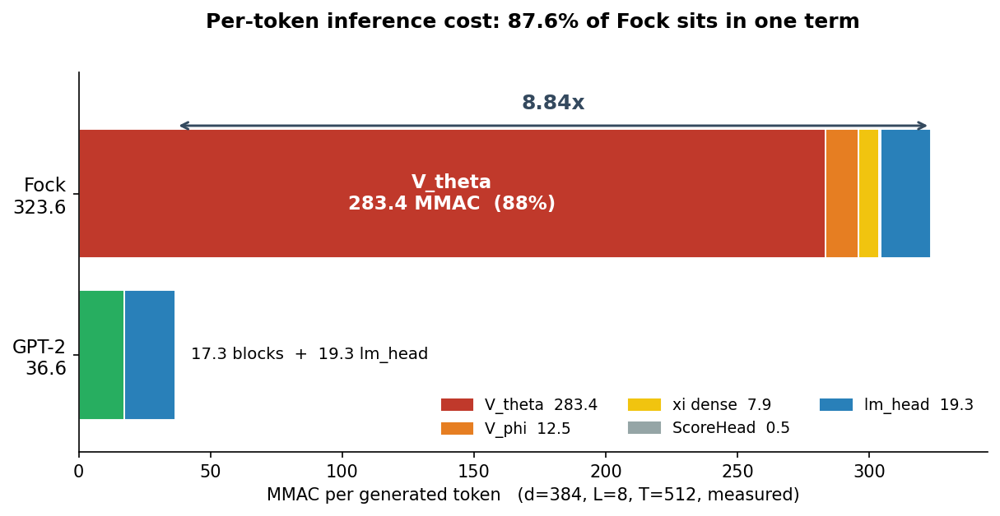
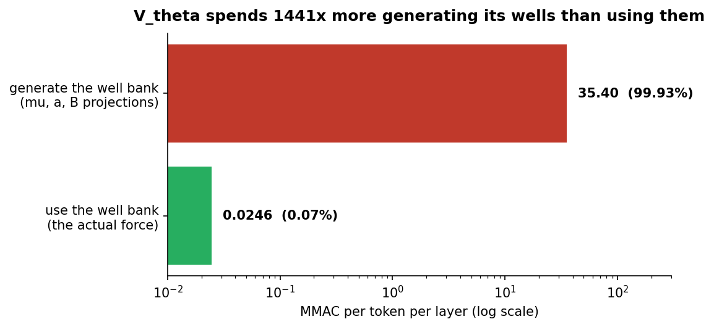
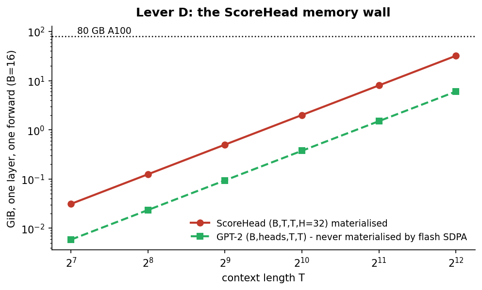
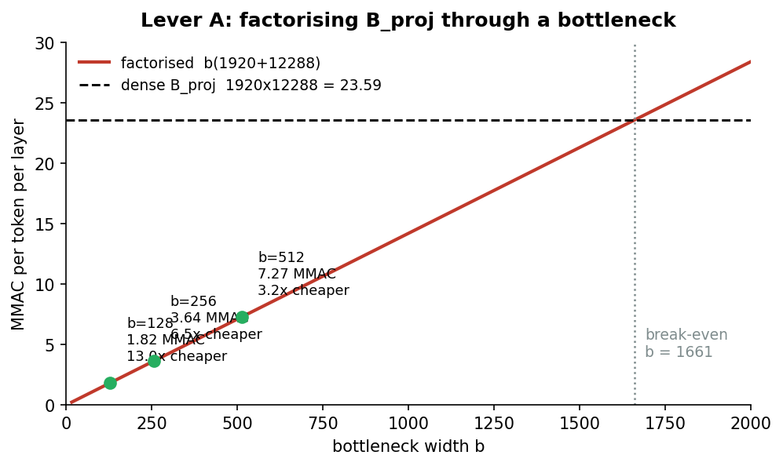
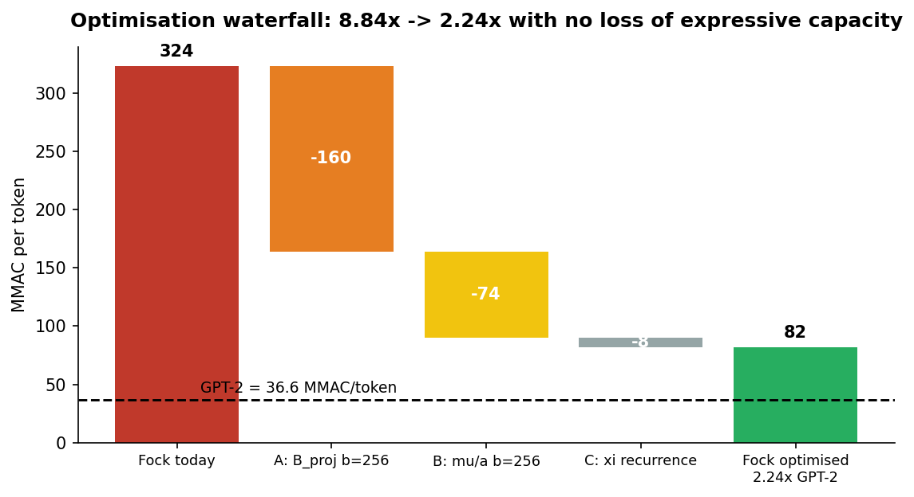

# Productionizing Fock-PARFLM: Where the Inference Cost Is, and How to Remove It

**Status:** analysis complete, measured, no code changes applied yet.
**Date:** 2026-09-18.
**Scope:** the joint `V_theta` + QK-norm arm at `d=384`, `L=8`, as configured in
[`colab_fock_cfc_baoab_joint_vtheta_qknorm_openwebtext_d384.ipynb`](../notebooks/conservative_arch/scaleup/colab_fock_cfc_baoab_joint_vtheta_qknorm_openwebtext_d384.ipynb).

---

## 0. Executive summary

A matched-width GPT-2 costs **36.6 MMAC per generated token**. Fock-PARFLM
costs **323.6 MMAC** — a factor of **8.84**. But the cost is not spread across
the architecture's interesting mechanisms. It is concentrated almost entirely
in one place:

| Component | MMAC/token | Share |
| --------- | ---------: | ----: |
| `V_theta` | 283.435 | **87.60%** |
| `lm_head` | 19.299 | 5.96% |
| `V_phi` (top-k pair potential) | 12.452 | 3.85% |
| `xi` channels (as implemented) | 7.864 | 2.43% |
| `ScoreHead` (routing) | 0.524 | 0.16% |
| **Fock total** | **323.574** | |
| **GPT-2 total** | **36.600** | |



And within `V_theta`, the split is more extreme still. `V_theta` is a
*hypernetwork*: each token, at each layer, it **generates** a bank of 8
anisotropic Gaussian wells from its context, then evaluates a force against
them. Separating those two phases:

| `V_theta` phase | MMAC/token/layer | Share |
| --------------- | ---------------: | ----: |
| **generate** the well bank | 35.4048 | 99.93% |
| **use** the well bank (the actual force) | 0.0246 | 0.07% |

**The model spends 1441 MACs generating well parameters for every 1 MAC of
force it computes with them.** That single ratio is the whole optimization
story. Nothing else in this document matters as much.

The good news: parameter generation is a dense linear map, and dense linear
maps factorize. Three changes — none of which alters what the model can
express beyond introducing a bottleneck — take it from **8.84x to 2.24x**;
a fourth, which does change the hypothesis class, reaches **1.45x**.

---

## 1. Methodology

All FLOP counts in this document are **measured**, not derived by hand, using
`torch.utils.flop_counter.FlopCounterMode` against the real modules imported
from the repository. Hand derivations are given alongside and agree to the
digit; where they disagreed, the measurement won and the derivation was
corrected.

One MAC is one multiply-accumulate. `FlopCounterMode` reports FLOPs and counts
one MAC as 2 FLOPs, so every figure below is `flops / 2 / n_tokens`.

**What is counted:** all matmul and einsum work in the forward pass.

**What is not counted:** elementwise operations (GELU, softmax, exponentials,
LayerNorm) and memory traffic. This matters in exactly one place — the
`ScoreHead`, whose FLOP cost is negligible but whose *memory* cost is not.
Section 5.5 treats it separately for that reason.

**Configuration under test**, read from the notebook rather than assumed:

| Symbol | Meaning | Value |
| ------ | ------- | ----: |
| $d$ | model width | 384 |
| $L$ | layers, i.e. integration steps | 8 |
| $n_c$ | `xi` channels, also `V_theta` contexts | 5 |
| $K$ | Gaussian wells per bank | 8 |
| $r$ | anisotropic low-rank width | 4 |
| $k$ | top-k routing fan-in | 16 |
| $H_s$ | `ScoreHead` hidden width | 32 |
| $n_\phi$ | `V_phi` heads | 4 |
| $V$ | vocabulary | 50257 |
| $T$ | context length | 512 |

Coupling is `joint`, so the `V_theta` bank sees the **concatenated** channels,
giving an input width of

$$\xi_{\dim} = n_c \cdot d = 5 \cdot 384 = 1920 .$$

---

## 2. The cost model, term by term

### 2.1 Reference: the GPT-2 decoder block

A pre-LN block with $d_F = 4d$ costs, per token:

$$F_{\mathrm{blk}} = \underbrace{3d^2}_{\text{QKV}} + \underbrace{d^2}_{\text{out}} + \underbrace{8d^2}_{\text{FFN}} + \underbrace{2Td}_{\text{attention}} = 12d^2 + 2Td .$$

At $d = 384$ and $T = 512$ this is $1769472 + 393216 = 2162688$ MAC, and over
$L = 8$ layers, $17.302$ MMAC. The output projection adds $Vd = 19298688$, so

$$F_{\mathrm{gpt2}} = L(12d^2 + 2Td) + Vd = 36.600 \text{ MMAC/token} .$$

Measurement agrees to five significant figures. Note that the `lm_head` alone
is **larger than the entire 8-layer body** at this width — a fact that
compresses every architectural ratio in this document, and one worth keeping
in mind before reading too much into any of them.

### 2.2 The `xi` channels

Mathematically each channel is a normalized causal EMA,

$$\xi^{(j)}_t = \frac{1}{Z_t}\sum_{s \le t} \alpha_j^{t-s} h_s, \qquad Z_t = \sum_{i=0}^{t}\alpha_j^{i} = \frac{1 - \alpha_j^{t+1}}{1 - \alpha_j} .$$

This is a first-order linear recurrence and costs $O(d)$ per token. The
implementation in `model_multixi.py` does not exploit that. It builds the dense
$(T, T)$ weight matrix explicitly and multiplies:

```python
def forward(self, h):                       # h: (B, T, d) -> (B, T, K, d)
    B, T, d = h.shape
    xis = []
    for k in range(self.K):
        W_k = causal_ema_weights(T, self.alpha[k], h.dtype, h.device)  # (T, T)
        xi_k = W_k.unsqueeze(0) @ h                                    # (B, T, d)
        xis.append(xi_k)
    return torch.stack(xis, dim=2)
```

Cost per token per layer:

$$F_{\xi}^{\mathrm{dense}} = n_c T d = 983040, \qquad F_{\xi}^{\mathrm{rec}} = n_c d = 1920 .$$

A factor of $T = 512$, for identical values. Verified exact to `4.9e-15` in
float64 against the dense form, and the single-step decode update verified to
`4.4e-16` against ground truth.

### 2.3 `V_theta`: the dominant term

This is the whole ballgame. `AnisotropicDepthConditionedGaussianVTheta` parses
the context into well parameters through four linear projections:

```python
def _components(self, xi):
    lead = xi.shape[:-1]
    mu = self.mu_proj(xi).view(*lead, self.K, self.d)
    a  = (F.softplus(self.a_proj(xi)) + 1e-4).view(*lead, self.K, self.d)
    w  = F.softmax(self.w_proj(xi), dim=-1) * self.w_scale
    B  = self.B_proj(xi).view(*lead, self.K, self.d, self.rank)
    B  = self._bound_lowrank(B)
    return mu, a, w, B
```

Write $W_\mu$, $W_a$, $W_w$ and $W_B$ for those four maps. The
per-token-per-layer generation cost is

$$F_{\mathrm{gen}} = \underbrace{\xi_{\dim} K d}_{W_\mu} + \underbrace{\xi_{\dim} K d}_{W_a} + \underbrace{\xi_{\dim} K}_{W_w} + \underbrace{\xi_{\dim} K d r}_{W_B}$$

$$F_{\mathrm{gen}} = \xi_{\dim} K d \left( 2 + r + \tfrac{1}{d} \right) = 1920 \cdot 8 \cdot 384 \cdot 6.0026 = 35404800 .$$

Numerically:

| projection | shape | MAC/token/layer | share |
| ---------- | ----- | --------------: | ----: |
| $W_B$ | 1920 → 12288 | **23592960** | **66.6%** |
| $W_\mu$ | 1920 → 3072 | 5898240 | 16.7% |
| $W_a$ | 1920 → 3072 | 5898240 | 16.7% |
| $W_w$ | 1920 → 8 | 15360 | 0.04% |
| total | | 35404800 | |

Now the force. Given the generated components, `analytical_grad` computes

$$f_t = -\nabla_h V_\theta = \sum_{k=1}^{K} g_k \left( a_k \odot \delta_k + B_k B_k^{\top} \delta_k \right), \qquad \delta_k = h_t - \mu_k,$$

where the per-well gate is

$$g_k = w_k \exp\left(-\tfrac{1}{2}\left(\delta_k^{\top} a_k \delta_k + \lVert B_k^{\top}\delta_k \rVert^2\right)\right).$$

The only matmul work is the two einsums forming $B_k^{\top}\delta_k$ and then
the product of $B_k$ with that vector:

$$F_{\mathrm{use}} = 2 K d r = 2 \cdot 8 \cdot 384 \cdot 4 = 24576 .$$

Measured: `0.0246` MMAC. Exact agreement.

$$\boxed{\ \frac{F_{\mathrm{gen}}}{F_{\mathrm{use}}} = \frac{35404800}{24576} = 1441 \ }$$



The model manufactures $K(2d + dr) = 8 \cdot (768 + 1536) = 18432$ fresh
numbers per token per layer, and then performs 24576 MACs with them. Put
differently: **the generated well bank is 18432 numbers wide, while the state
it acts on is 384 numbers wide.** The bank is 48 times larger than the vector
it is built to push around.

This also explains a parameter-count anomaly noted earlier in the programme:
`V_theta` holds **35438600 parameters, which is 93.9% of Fock's 37.76M
non-embedding parameters.** The architecture is, by parameter mass, almost
entirely a well-parameter generator.

### 2.4 `ScoreHead`: cheap in FLOPs, expensive in memory

```python
def forward(self, h_q, h_s):                       # -> (B, T, T)
    proj_t = self.w_q(h_q) + self.w_d(h_q) + self.b1
    proj_u = self.w_s(h_s) - self.w_d(h_s)
    hidden = proj_t.unsqueeze(2) + proj_u.unsqueeze(1)   # (B, T, T, H)
    return self.w2(F.gelu(hidden)).squeeze(-1)
```

Four projections of width $H_s$ (note `w_d` is applied to **both** sides), plus
the readout over pairs:

$$F_{\mathrm{score}} = \underbrace{4 d H_s}_{\text{projections}} + \underbrace{T H_s}_{\text{readout}} = 49152 + 16384 = 65536 .$$

That is 0.52 MMAC over all 8 layers — **0.16% of the model**. In FLOPs the
routing is free.

The memory is not. The intermediate `hidden` is a real materialized tensor of
shape $(B, T, T, H_s)$:

$$M_{\mathrm{score}} = 4 B T^2 H_s \text{ bytes} = 537 \text{ MiB at } B=16, T=512 ,$$

per layer, per forward, growing as $T^2$. GPT-2's comparable quantity is
$(B, n_h, T, T)$ and **flash SDPA never materializes it at all**.



### 2.5 `V_phi` and the output head

`MultiHeadVPhi.forward_gathered` over $k = 16$ gathered sources with
$n_\phi = 4$ heads measures **1.5565 MMAC/token/layer**, so 12.45 over the
stack — 3.85% of the model. The output projection is $Vd = 19.299$ MMAC,
identical to GPT-2's.

Both are minor. This corrects an earlier hypothesis in this programme that
`V_phi` width was the leading optimization target; it is not, by a factor
of 23.

---

## 3. Where the cost goes

```mermaid
flowchart LR
  TOK["token h&#95;t at layer l"]
  XI["xi channels<br>n&#95;c EMAs<br>0.98 MMAC dense<br>0.002 MMAC as recurrence"]
  GEN["V&#95;theta GENERATE<br>four dense projections<br>35.40 MMAC"]
  WB["W&#95;B  1920 to 12288<br>23.59 MMAC<br>66.6 percent of V&#95;theta"]
  WMA["W&#95;mu plus W&#95;a<br>11.80 MMAC"]
  USE["V&#95;theta USE<br>two einsums<br>0.025 MMAC"]
  SH["ScoreHead<br>0.07 MMAC<br>but B T T H memory"]
  VP["V&#95;phi on top k pairs<br>1.56 MMAC"]
  OUT["force f&#95;t and integrator step"]

  TOK --> XI
  XI --> GEN
  GEN --> WB
  GEN --> WMA
  WB --> USE
  WMA --> USE
  TOK --> SH
  SH --> VP
  USE --> OUT
  VP --> OUT
```



The single fat edge is `xi` into `GEN`: a 1920-dimensional context is expanded
into 18432 well parameters, and 66.6% of that expansion is $W_B$ alone.

---

## 4. Two cost regimes: prefill and decode

These behave very differently and must be optimized separately.

```mermaid
flowchart TB
  P1["V&#95;theta  L times T times 35.40 MMAC<br>linear in T, dominant"]
  P2["ScoreHead  materialises B T T H<br>quadratic in T, memory bound"]
  P3["xi dense  L times T times T times n&#95;c times d<br>quadratic in T"]
  D1["V&#95;theta  L times 35.40 MMAC<br>constant in T, dominant"]
  D2["ScoreHead row  L times T times H&#95;s<br>linear in T, tiny"]
  D3["xi recurrence  L times n&#95;c times d<br>constant in T"]

  subgraph PF [Prefill or scoring, one forward over T tokens]
    P1
    P2
    P3
  end
  subgraph DC [Decode, one new token at context T]
    D1
    D2
    D3
  end
  PF --> DC
```



**Prefill** is what `val_ppl` evaluation and any batch-scoring workload do. It
is dominated by `V_theta` in compute and by `ScoreHead` in memory.

**Decode** is what a deployed model does. Here the picture is better than it
first looks, and one earlier claim in this programme was wrong and is corrected
here: the `ScoreHead` **does** admit an incremental form. Because

$$\mathrm{hidden}[t,s] = \mathrm{proj}_t[t] + \mathrm{proj}_u[s]$$

and $\mathrm{proj}_u[s]$ depends only on the source token, it can be cached.
A new token needs one row, at $O(T H_s)$ work against a cache of $H_s = 32$
floats per token per layer. What the GELU between the two indices blocks is
collapsing the sum over $s$ into a *fixed-size* recurrent state — but top-k
ranking needs per-source scores anyway, so that was never available.

The resulting runtime state compares favourably with attention:

| per token per layer | GPT-2 | Fock |
| ------------------- | ----: | ---: |
| routing work at context $T$ | $2Td = 768T$ | $T H_s = 32T$ |
| cache | K and V, 768 floats | `proj_u` 32 + `h` 384 = 416 floats |

Fock's routing is ≈24x cheaper per decode token than attention, on a cache
about half the size. **The paper's claim of $O(1)$ runtime state does not hold
for the deployed sparse form — it is $O(T)$ — but the honest correction is
"$O(T)$ at roughly half a KV cache", which remains a selling point.**

So decode cost is set by `V_theta`, which is constant in $T$ and enormous in
constant. Everything below targets that constant.

---

## 5. The optimization levers

### 5.1 Lever A — factorize $W_B$ through a bottleneck

$W_B$ maps $\mathbb{R}^{1920} \to \mathbb{R}^{12288}$ densely: 23.59 MMAC and
23.6M parameters. Replace it with $W_B \approx U V^{\top}$ of inner width $b$:

$$F_A(b) = b\left(\xi_{\dim} + K d r\right) = b \cdot 14208 .$$

Break-even against the dense map is at

$$b^{\ast} = \frac{\xi_{\dim} \cdot K d r}{\xi_{\dim} + K d r} = \frac{1920 \cdot 12288}{14208} = 1660 ,$$

so **any** $b \lt 1660$ is a strict win. The dense map has rank at most
$\min(1920, 12288) = 1920$ to begin with, so $b = 1920$ is already lossless;
every reduction below that is a genuine capacity constraint, but a mild one.



| $b$ | MMAC/token/layer | vs dense | saving over 8 layers |
| --: | ---------------: | -------: | -------------------: |
| 128 | 1.82 | 13.0x | 174.2 MMAC |
| 256 | 3.64 | 6.5x | **159.6 MMAC** |
| 512 | 7.27 | 3.2x | 130.5 MMAC |
| 1024 | 14.55 | 1.6x | 72.3 MMAC |

At $b = 256$ this **single change removes 49% of the model's inference cost**.

### 5.2 Lever B — factorize $W_\mu$ and $W_a$

Identical treatment, $\mathbb{R}^{1920} \to \mathbb{R}^{3072}$ each:

$$F_B(b) = 2b\left(\xi_{\dim} + K d\right) = 2b \cdot 4992, \qquad b^{\ast} = 1181 .$$

At $b = 256$: 2.56 MMAC against 11.80, saving 73.9 MMAC over the stack — a
further 23%.

### 5.3 Lever C — make $B$ context-independent or well-shared

Two stronger variants, which do change the hypothesis class:

1. **Static $B$.** Learn $B_k$ per well per layer as a plain parameter instead
   of generating it from $\xi$. Generation cost falls to zero: **saves the full
   188.7 MMAC, 58.3% of the model.** The wells keep context-dependent
   *location* ($\mu$) and *scale* ($a$); only the anisotropic *orientation*
   becomes fixed.
2. **Shared $B$ across wells.** Emit one $d \times r$ factor instead of $K$,
   reducing the output width from 12288 to 1536, an 8x cut.

These are the highest-yield changes available and also the only ones in this
section that require a quality ablation before adoption.

### 5.4 Lever D — `xi` as the recurrence

Exact, verified, no hypothesis change. Saves 7.85 MMAC/token (2.4%) in compute,
which is modest — but it also removes a $(T,T)$ materialization per channel per
layer and turns the decode-time `xi` update from $O(Td)$ into $O(d)$. Do it
regardless of the FLOP number; it is a prerequisite for a real decode path.

For the chunked-parallel form needed at training time, note the recurrence is
scan-associative: with $u_t = \alpha u_{t-1} + h_t$ two
successive steps compose as

$$(\alpha_2\alpha_1, \ \alpha_2 h_1 + h_2),$$

so a Blelloch scan gives $O(Td)$ work at matmul throughput.

### 5.5 Lever E — fuse the `ScoreHead`, cache `proj_u`

Zero FLOP change, zero quality risk, two distinct wins:

1. **Tile the pairwise MLP** over blocks of $s$ so $(B,T,T,H_s)$ is never
   materialized — the same transformation flash attention applies to the
   $(T,T)$ score matrix. Removes the 537 MiB-per-layer prefill wall.
2. **Cache `proj_u`** at decode. Without it there is no incremental path at
   all, and the model cannot generate a sequence in better than $O(T^3)$.

### 5.6 Levers deliberately rejected

| Candidate | Why not |
| --------- | ------- |
| Reduce $r$ from 4 | Participation ratio measured at **3.68 against rank 4** — the anisotropy is nearly fully used. This is the one dimension already correctly sized. |
| Shrink `V_phi` (heads, hidden, $k$) | Only 3.85% of cost. Even eliminating it entirely leaves 8.5x. Previously hypothesised as the main lever; the measurement refutes that. |
| Reduce $L$ from 8 | Linear saving but directly trades model capacity, and `L=16` was already tested without benefit. Use only after Levers A-E are exhausted. |
| Tie embeddings | Saves 19.3M parameters of memory but no inference FLOPs — the output projection is still required. |
| Reduce $K$ from 8 wells | Saves proportionally, but `K=8` joint already beat `K=40` additive on quality; do not disturb without cause. |

---

## 6. Roadmap

```mermaid
flowchart TB
  P0["Phase 0 verify<br>run bench&#95;inference.py<br>confirm the profile on real hardware"]
  P1["Phase 1 free wins<br>xi recurrence plus ScoreHead tiling plus proj&#95;u cache<br>no quality risk"]
  P2["Phase 2 factorise<br>W&#95;B and W&#95;mu and W&#95;a at b equal 256<br>retrain, ablate quality"]
  P3["Phase 3 structural<br>static or shared B<br>needs a full ablation"]
  P4["Phase 4 decode path<br>generate loop with caches<br>first quotable inference numbers"]

  P0 --> P1
  P1 --> P2
  P2 --> P3
  P1 --> P4
  P3 --> P4
```





| Phase | Change | Fock MMAC/token | vs GPT-2 | Quality risk |
| ----- | ------ | --------------: | -------: | ------------ |
| today | | 323.57 | 8.84x | |
| 1 | `xi` recurrence | 315.73 | 8.63x | none, exact |
| 2 | + $W_B$, $W_\mu$, $W_a$ at $b = 256$ | **82.16** | **2.24x** | bottleneck only |
| 2' | same at $b = 128$ | 57.38 | 1.57x | bottleneck only |
| 3 | + static $B$ | **53.06** | **1.45x** | real, needs ablation |

The Phase 2 number is the one to aim at first. It requires no change to the
model's functional form beyond constraining four matrices to be low-rank, and
it recovers **75% of the gap to GPT-2**.

---

## 7. The bottleneck diagnosis: why this capacity does not convert into quality

A matched GPT-2 baseline at the same tokens, same val set and same endpoint
crossed this arm's fully-decayed PPL at **47% of the token budget**, using
**2.28x fewer parameters**. The cost analysis above explains why, and the
explanation is not about cost at all.

### 7.1 The information path

```mermaid
flowchart LR
  H["all history h&#95;s"]
  XI["xi&#95;t   five fixed decay EMAs<br>weight depends on distance t minus s<br>NEVER on content"]
  GEN["35.4M parameter generator<br>93.9 percent of all non embedding params"]
  W["eight Gaussian wells<br>mu and a and B"]
  F["force on h&#95;t"]

  H --> XI
  XI --> GEN
  GEN --> W
  W --> F
```



The first arrow is the constriction. An EMA weights token $s$ by
$\alpha^{t-s}$ — **purely by distance, never by content**. What $h_s$
contains, and what $h_t$ is looking for, are both irrelevant to the weighting.
Attention's $q_t^{\top} k_s$ is content-addressed; this is a fixed five-tap
filter bank.

That compression is irreversible. **The 35.4M-parameter generator sits
downstream of it** and can only reshape what survived. This is the most likely
reason 2.28x GPT-2's parameters do not buy quality: they are spent on the
wrong side of the bottleneck.

### 7.2 Every prior ablation is consistent with this

| Ablation | Result | Reading under this diagnosis |
| -------- | ------ | ---------------------------- |
| wells, K=40 additive vs K=8 joint | K=8 won | widening a downstream stage does not help |
| anisotropic rank $r=4$ | participation ratio 3.68 of 4 | already fully used; correctly sized |
| depth, L=16 vs L=8 | not better, spikier | reprocessing impoverished context does not recover it |
| `V_phi` width | 3.85% of compute | the content-addressed path is 16 pairs against attention's 512 positions per head |

Four independent negative results, all pointing upstream.

### 7.3 The learned decays say it directly

Comparing initialization against the values at step 32,500, in horizons
$1/(1-\alpha)$:

| channel | init horizon | learned horizon | direction |
| ------: | -----------: | --------------: | --------- |
| 1 | 2.0 | 1.4 | contracted |
| 2 | 4.0 | 2.5 | contracted |
| 3 | 20.0 | 5.2 | contracted |
| 4 | 100.0 | 27.8 | contracted |
| 5 | 200.0 | 500.0 | **expanded 2.5x** |

Four channels pulled in toward fine local resolution while one pushed out to
500 tokens. The model is spreading its taps as far apart as it can in both
directions at once — the signature of a filter bank starved for resolution it
cannot buy, because it has only five fixed taps to allocate.

### 7.4 What this does not establish

It does not separate the context hypothesis from a second one: that a
second-order conservative flow is simply a weaker inductive bias for language
than a residual stream, independent of how context is pooled. The ablations
point upstream, but they do not distinguish these two.

### 7.5 Pre-registered predictions

1. **Phase 2 factorization at $b = 256$** cuts `V_theta` parameters ≈6.5x.
   **Prediction: PPL moves by less than 2.** If it holds, the parameters were
   not doing work and the bottleneck is upstream. If PPL degrades sharply,
   this diagnosis is wrong.
2. **`XI_CHANNELS` from 5 to 10.** **Prediction: gain under 2 PPL.** More
   fixed taps do not fix content-independence.
3. **Content-addressed pooling** — paper section `17f` family A (xi-routed
   attention, $O(T^2 d)$) or family C (RFF or Mercer kernel, $O(TMd)$ and
   factorizing by construction). **Prediction: gain of 10 PPL or more.**

Predictions 2 and 3 separate "too few taps" from "wrong kind of pooling".
Prediction 1 is the cheapest, is the sharpest discriminator, and is already
scheduled for cost reasons — which makes the cheapest optimization also the
best diagnostic available.

---

## 8. What must be validated before any of this is believed

1. **Run [`bench_inference.py`](../notebooks/conservative_arch/scaleup/debug/bench_inference.py).**
   Everything above is an analytic FLOP count. FLOPs are not wall-clock: the
   `ScoreHead` is the clearest case where a negligible FLOP count hides a
   severe memory-bandwidth cost, and there may be others. The benchmark's
   Part B2 hooks `V_theta`, `V_phi`, `score_head` and `xi_module` and times
   them with CUDA events on a real forward.
2. **Ablate the bottleneck width.** Levers A and B constrain rank. Train at
   $b \in \lbrace 128, 256, 512 \rbrace$ against the current 81.58 settled
   baseline and read the PPL cost.
3. **Ablate static $B$ separately.** This is the only change that alters what
   the model can represent. It is also the single largest saving, so it
   deserves its own experiment rather than being bundled.
4. **Re-derive the paper's cost claims.** Appendix `A2_inference_efficiency`
   is correct for the SPLM core but does not cover the PARF pair term, and
   section `17f`'s table lists the deployed baseline at $O(Tkd)$ compute
   and $O(Tk)$ memory, which accounts for the `V_phi` evaluation but not the
   `ScoreHead` that selects the pairs. Both need amending before review.

---

## 8a. Benchmark results (A100, 2026-09-19) — PARTIAL

Parts A, A2 and C ran in the GPT-2 session. **Part B did not**, so `V_theta`
— the 87.6% term this entire roadmap rests on — has **not** been measured on
hardware. Read §6 as provisional until it has.

### 8a.1 Confirmed

| claim | measured |
| ----- | -------- |
| `xi` recurrence beats the dense path at decode | **14x to 22x** across T = 128 to 2048, flat in T as predicted |
| `ScoreHead` materialises `(B,T,T,H)` and it grows as T squared | 8, 32, 128, 512 MiB at T = 128, 256, 512, 1024 — exactly 4x per doubling |
| the naive recurrence loop is launch-bound and loses on full sequences | 0.01x to 0.03x, scaling O(T^0.99) — one launch per token, as the script warned |

### 8a.2 Refuted — two of this document's claims

**Wall-clock does not follow the T-squared exponent.** Dense `xi` measured
**O(T^0.37)** and `ScoreHead` **O(T^0.98)**, against ~2 predicted for both.
The FLOP counts are not wrong — `ScoreHead`'s memory grows as T squared
exactly — but at these sizes both kernels are launch- and overhead-bound on
an A100, not compute-bound. The exponent only begins to appear at T = 2048.

**`ScoreHead` is far more expensive than its FLOP share implied.** §2.4 put
it at 0.16% of per-token compute. Measured at T = 512, B = 4, one layer costs
0.84 ms, so eight layers cost **6.7 ms — about 69% of a complete GPT-2
forward pass (9.78 ms)**, for a term this document called negligible. At
T = 1024 it is 21.1 ms against GPT-2's 19.3 ms: one Fock routing term exceeds
an entire GPT-2 forward.

**Consequence for §5: Lever E is under-prioritised.** It was filed as a
zero-quality-risk win worth only 0.16% of FLOPs. On wall-clock it is worth
far more, and it remains zero-risk. It should move ahead of Lever B.

### 8a.3 What this does and does not say about the roadmap

FLOP counts mispredicted wall-clock for the two **memory-bound** terms. They
are most reliable exactly where arithmetic intensity is high, and `V_theta`
is four dense matmuls — 1920 by 12288 and three smaller — which is the
compute-bound regime where a FLOP model should hold. So §6 is probably sound.

But "probably" is doing real work in that sentence, and this benchmark is a
demonstration that it should not be trusted on this architecture without
measurement. **Run Part B in a Fock session before acting on Phase 2.**

### 8a.4 Stale output note

The Part D narrative printed in that run is the pre-`4e554b7` text and still
carries two retracted claims: that no per-source cache can reconstruct the
routing scores (`proj_u` caches fine, §4), and that the integrator is "8
substeps x 32 wells x rank-16" and sets the floor (ABOBA takes one force
evaluation per layer over 40 wells at rank 4, and `V_theta` sets the floor).
Measurements were unaffected. The cross-check against the real
`model_multixi.causal_ema_weights` also skipped, since that path is not on
`sys.path` in the GPT-2 notebook; the identity was verified locally instead.

---

## 9. Honest caveats

- **These are MAC counts, not times.** The conversion depends on arithmetic
  intensity, and the terms here differ wildly in it. A dense 1920x12288 matmul
  runs near peak; the `ScoreHead`'s broadcast-add-GELU does not.
- **`lm_head` compresses every ratio.** It is 19.3 MMAC on both sides and
  5.96% of Fock but 52.7% of GPT-2. Body-only, the ratio is
  304.3 / 17.3 = **17.6x**, not 8.84x. Quote whichever is appropriate, but
  say which.
- **Two earlier cost models in this programme were wrong** — one estimating
  the integrator at 8 substeps per layer when ABOBA uses one, another placing
  the dominant cost in `V_phi`. Both were hand-derived. That is why every
  number here is measured, and why Phase 0 exists.
