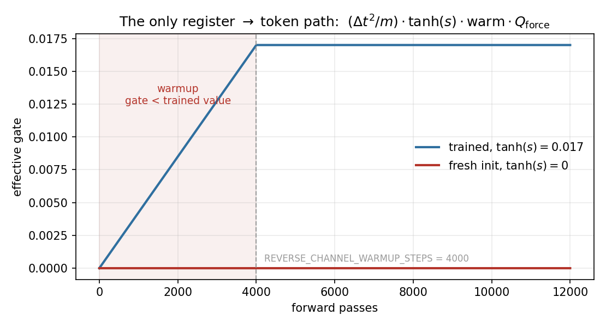
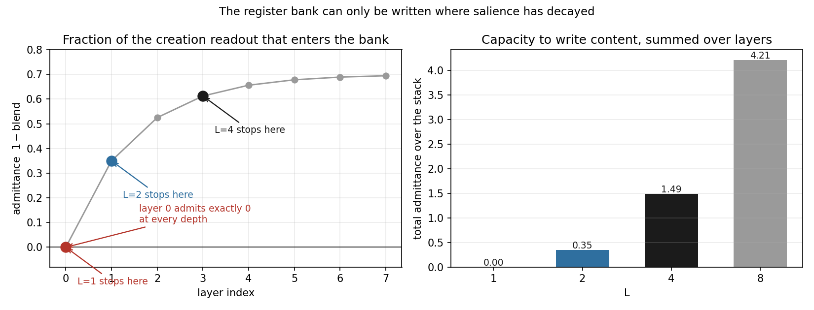
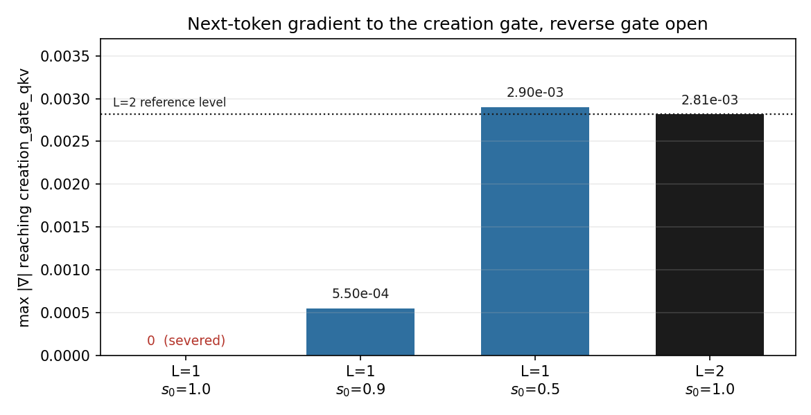

# The Fock mechanism across layer depth: what works at L=1, L=2 and L=4

> **Status.** Written **2026-09-24**, from measurements taken while preparing
> the L=1 point of the depth ladder. Everything numeric here is measured, and
> §8 records three wrong conclusions reached along the way, because each was
> wrong in a way that is easy to repeat.
>
> **Scope.** How much of the Fock register mechanism is actually *live* as a
> function of `L`, why L=1 is degenerate, and how to measure the mechanism's
> contribution at each depth. Distinct from
> [`Fock_Mechanism_Ablation_Study_d384_OpenWebText.md`](Fock_Mechanism_Ablation_Study_d384_OpenWebText.md),
> which reports one completed L=8 experiment, and from
> [`Depth_Ladder_and_Matched_Baseline_Protocol.md`](Depth_Ladder_and_Matched_Baseline_Protocol.md),
> whose §6.1 carries the L=1 consequence for that programme.

---

## 0. Summary

Three findings, in increasing order of how surprising they were.

1. **Registers reach the tokens through exactly one route**, the reverse
   channel, and that route is **gated shut on a freshly built model**. Any
   probe run at initialisation reports "the registers do nothing" at *every*
   depth, for reasons that have nothing to do with the architecture.

2. **Layer 0 can never train the creation gate, at any depth.** `salience`
   initialises to exactly $1.0$, and the creation step weights the readout by
   $(1 - \text{blend}) = 0$. At $L \ge 2$ the later layers train the shared
   gate and this is invisible. **At L=1 there is no later layer.**

3. **So L=1 runs with a *static* register bank** — read by the reverse
   channel, never updated, with $1{,}720{,}352$ parameters (2.24% of the
   model) receiving no next-token gradient. It is not a depth-1 Fock model;
   it is a depth-1 model with a learned constant memory.

The mechanism's capacity to write content is therefore a **function of
depth**, zero at L=1 and growing with `L`. §5 proposes the measurement and
§6 reports it: the register-to-token path is worth **+52.2% at L=1 and
+275.1% at L=2**, so the capacity is not merely present but used. The same
section records an ablation that *failed* — freezing the bank is worse than
removing it, because you cannot ablate a trained component's input without
going off-distribution.

---

## 1. The only path from registers to tokens

```mermaid
flowchart LR
  H["h (tokens)"] -->|"query"| CG["creation gate<br>forward&#95;prefix"]
  R0["register bank r"] --> CG
  CG -->|"readout"| BL["blend step<br>convex mix of bank and readout"]
  R0 --> BL
  BL --> RN["r&#95;new"]
  RC["reverse channel<br>Q&#95;force"]
  REP["repulsion penalty"]
  RN --> RC
  H --> RC
  RC -->|"gated"| HN["h&#95;new"]
  RN -.->|"loss only"| REP
  style BL fill:#fdf1ef,stroke:#b4342a
  style RC fill:#eef4fa,stroke:#2f6f9f
```



The solid path `r_new -> reverse channel -> h_new` is the **whole** influence
of the register bank on the model's predictions. The dotted path is the
anti-collapse regulariser, which the source labels:

```python
# --- Register repulsion (B4): differentiable anti-collapse penalty on
#     the dynamic active register states (mirrors the reg_cos_sim probe).
#     Loss-only term -- never enters the forward logits, so the
#     last-position (full-prefix) bank is causally fine here.
```

Under `prefix_causal_registers=True` the bank does **not** join the extended
Verlet state; under the legacy path it does, but the strict lower-triangular
pair mask means tokens cannot read register rows. Neither route closes the
loop. The reverse channel is the only one that does:

```python
Q_force   = self.reverse_ch(h_new, r_rev, active)
scale     = torch.tanh(rev_raw)
warm      = (self.reverse_warmup_step.float() / warmup_steps).clamp(max=1.0)
increment = (dt * dt / m_b) * (scale * warm) * Q_force
```

---

## 2. Two gates that both read zero at initialisation

`reverse_channel_scale` is `nn.Parameter(torch.zeros(n_gate))`, so
$\tanh(0) = 0$. And `reverse_warmup_step` starts at 0, so
$\text{warm} = 0/4000 = 0$. The product is exactly zero on any model that has
not trained past warmup.



**Consequence.** Any gradient or perturbation probe on a *freshly built*
model measures a network in which registers are disconnected by construction,
and will report that the Fock mechanism does nothing — at L=1, at L=2, at any
depth. This is the trap §8 records falling into twice.

In the live arms `tanh(scale)` settles around **0.016–0.022** per layer and
warmup finished long ago, so the path is open but *weak*. That weakness is
itself a finding: the reverse channel was worth `125.94 -> 27.23` PPL before
the causal-leak fix, and the model card notes the post-fix value
["will only be known after re-training with `prefix_causal_registers=True`"](Fock-PARFLM_Causal_Leak_Audit_Results.md).
These arms are that re-training.

---

## 3. Layer 0 cannot train the creation gate

`_init_registers` sets salience to exactly one:

```python
r        = self.register_embed.view(1, 1, M, d).expand(B, 1, M, d)
salience = torch.full((B, 1, M), s0, device=device)     # s0 == 1.0 by default
```

and the creation step blends by it:

```python
readout, alpha_max = self.creation_gate_qkv.forward_prefix(h, r)
blend = salience.unsqueeze(-1)
r = blend * r + (1.0 - blend) * readout
```

With $s_0 = 1$ the readout carries weight $(1 - 1) = 0$. The gate's only other
exit is $\alpha_{\max} \to \text{salience} \to \text{active}$, and

```python
above_thresh = salience > cfg.register_salience_threshold     # boolean
```

is a comparison, with no gradient. **Both exits are closed at layer 0.**

At layer $\ell \ge 1$ the salience has decayed under

$$s_{\ell+1} = s_\ell \cdot \text{decay} + \alpha_{\max} (1 - \text{decay})$$

with `register_salience_decay = 0.5` in the live config, so $s_1 \le 1$ and
the readout is admitted. The *admittance* $1 - s_\ell$ is therefore zero at
layer 0 and rises with depth:



Every depth walks the same curve — only how far it walks differs. Summed over
the stack, the capacity to write content is **0.00 at L=1, 0.35 at L=2, 1.49
at L=4, 4.21 at L=8** (at a representative $\alpha_{\max} = 0.3$; the
asymptote moves with it, the shape does not).

---

## 4. What that means at each depth

Measured with the reverse gate at its trained value, next-token loss only:

| arm | grad to `register_embed` | grad to `creation_gate_qkv` | bank varies with input? |
| --- | ---: | ---: | --- |
| L=1, s0 1.0 | 3.370e-02 | **0.000e+00** | **no — static** |
| L=1, s0 0.9 | 3.175e-02 | 5.503e-04 | yes |
| L=1, s0 0.5 | 1.848e-02 | 2.900e-03 | yes |
| L=2, s0 1.0 | 2.185e-02 | 2.815e-03 | yes |



At L=1 the bank was checked directly and is bit-identical to
`register_embed`, and bit-identical across two different inputs:

```
salience entering the blend : min=1.0000  max=1.0000
r_out vs register_embed     : max|diff| = 0.000e+00
r_out on input A vs input B : max|diff| = 0.000e+00
```

### 4.1 The model turns the channel down when the bank carries nothing

Measured on the two trained checkpoints — nobody set these, training chose
them:

| | `tanh(scale)` per layer | effective gate |
| --- | --- | ---: |
| L=1 | [0.0037] | **0.003671** |
| L=2 | [0.0174, 0.0148] | **0.01738** |

**4.7x weaker at L=1.** With a static bank carrying no information about the
input, the reverse channel's force is worth less, and the learned gate shrank
to match. This is the architecture reporting on its own usefulness, and it is
the cleanest single piece of evidence that depth changes what the mechanism
is worth.

The creation gate at L=1 is also deader than §3 predicted. It receives zero
gradient from the **repulsion term as well** — because `blend = 1` makes
`r_new` identical to `register_embed`, the penalty is computed on a
quantity the gate never touched:

```
creation_gate_qkv.W_K / W_Q / W_V / logit_scale :  ntp 0.000e+00   repulsion 0.000e+00
register_embed                                  :  ntp 2.875e-03   repulsion 1.063e-06
```

So 1,720,352 parameters — 2.24% of the model — received gradient from
**nothing at all** across 32,500 training steps.

So the depth ladder reads:

| | what the mechanism is | live parameters |
| --- | --- | --- |
| **L=1** | tokens attend to 32 **static** learned vectors — a soft prompt, not a register system | `register_embed` only (12,288) |
| **L=2** | one layer of accumulation; the shared gate is trained by layer 1 | + `creation_gate_qkv` (1,720,352) |
| **L=4** | three layers of accumulation, and an admittance that grows along the stack | same modules, more writes |

The corroborating observation from the live L=1 run: `sig_max`, which reads
the clamped creation-gate logit scale, sits at exactly
**14.2857** — its initialisation — for hundreds of steps with the register
index pinned at 0, while both L=2 arms differentiate within 50 steps.

---

## 5. How to measure whether depth makes the mechanism *better*

§4 shows the mechanism's **capacity** grows with `L`. It does not show the
**contribution** grows. Two ablations separate them, plus one structural
probe. All are evaluation-only, minutes per checkpoint.

```mermaid
flowchart TD
  M["trained checkpoint at depth L"] --> A["Ablation A<br>zero reverse&#95;channel&#95;scale"]
  M --> B["Ablation B<br>substitute the static bank<br>r&#95;rev &lt;- register&#95;embed"]
  M --> C["Structural probe<br>max |r&#95;l - r&#95;0| by layer"]
  A --> AR["cost of the whole register path"]
  B --> BR["cost of ACCUMULATION only"]
  C --> CR["does content keep being written<br>or saturate"]
  style B fill:#eef4fa,stroke:#2f6f9f
  style BR fill:#eef4fa,stroke:#2f6f9f
```



**Ablation A** removes the whole path and conflates two things: that the bank
carries information, and that a non-conservative force exists at all. Since
$Q_{\rm force}$ is register-derived by construction, A cannot separate them.

**Ablation B was designed as the discriminating one** — keep the force firing,
feed it the *static* `register_embed` instead of the accumulated `r_new`, so
that B − A prices accumulation. **It does not work**, for a reason worth
reading before designing the next one: §6.2. A is the measure that survived.

**B has a built-in validity check: at L=1 it is a no-op by construction**,
because the bank is already static there. A non-zero cost at L=1 means the
harness is wrong and nothing downstream counts — the role gate 0 plays in
[`Composing_Single_Layer_Inferences_Flow_or_Maps.md`](Composing_Single_Layer_Inferences_Flow_or_Maps.md).

---

## 6. Results — **measured 2026-09-24**, and what B got wrong

Both ablations run, both checkpoints probed. The validity check passed
(`|delta| = 0.0000` at L=1), so the harness is sound.

| | gate | baseline | **A** path removed | **B** bank frozen |
| --- | ---: | ---: | ---: | ---: |
| L=1 | 0.003671 | 81.91 | 124.68 (**+52.2%**) | 81.91 (+0.0%, no-op) |
| L=2 | 0.01738 | 66.22 | 248.37 (**+275.1%**) | 878.33 (+1226.4%) |

(Baselines are the cell's 12x4 fixed-batch estimate, lower than the settled
figures of 87.09 and 66.98; they are internally consistent, which is what a
paired ablation needs.)

### 6.1 A answers the depth question

**The register-to-token path is worth five times more at L=2 than at L=1** —
+275.1% against +52.2%. That is §5's "the contribution grows with `L`"
outcome, arriving through ablation A rather than B.

Part of that difference is the learned gate (§4.1): the L=2 model relies on
the channel more because its bank carries information. That is not a
confound to be subtracted — *choosing* to rely on the channel more is part of
what the extra layer buys.

A also supplies a number the programme has been missing. The model card
records that the reverse channel's post-leak-fix value
["will only be known after re-training with `prefix_causal_registers=True`"](Fock-PARFLM_Causal_Leak_Audit_Results.md).
These arms are that re-training, and **+275.1% at L=2** is the answer: the
channel is still decisive after the causal fix, not mostly leak. It is an
ablation rather than a trained-without arm, so read it as an upper bound.

### 6.2 B failed, and the failure is instructive

**B is 3.5x more damaging than A.** Removing the force entirely costs +275%;
feeding it a *static* bank costs +1226%. Absence is survivable; a wrong
signal is not — the trained model has adapted to a particular register input,
and substituting another injects a large spurious force.

So **B measures out-of-distribution sensitivity, not the value of
accumulation**, and the +1226% must not be quoted as the price of the Fock
mechanism. Part B of the cell corroborates the sensitivity: perturbing
`register_embed` by 0.01 moves the logits as much as perturbing
`lm_head`.

The general lesson, and it applies to any future ablation here:

> **You cannot ablate a trained component's input without going
> off-distribution.** Removing a component from a trained model and training
> a model without it are different measurements, and only the second prices
> the component.

The programme already had this right elsewhere: the model card's
`125.94 vs 27.23` comes from an arm **trained without** the reverse channel,
not from ablating one that had it. That is why it is the honest comparison.

### 6.3 What this does and does not settle

**Settled.** The mechanism is load-bearing at both depths, and markedly more
so at L=2. L=1 is *not* "Fock switched off" — it runs a degraded version,
static bank and a gate turned down 4.7x, still worth +52.2%.

**Not settled: how much of the L=1 vs L=2 PPL gap is Fock.** The measured gap
is 87.09 against 66.98, +30.0%. The register path is worth more than that at
*both* depths, so the gap cannot be read as "the mechanism is missing at
L=1" — if it were missing, removing it at L=1 would cost nothing, and it
costs 52%. The gap is a degraded mechanism *plus* `v == 0`, `dt = 8` against
4, a 2.6% clip rate against 0.0%, and one fewer composition step.

Pricing the degradation alone needs a **trained** arm: L=2 with salience
pinned at 1.0 at every layer, reproducing L=1's frozen-bank condition while
holding depth, `dt`, velocity and clip rate fixed. About 13h, and the only
clean version.

### 6.4 The standing tension, unresolved

If deeper meant a better mechanism *and* the mechanism dominated, the L=8 arm
should have beaten L=2. It did not: **81.58 against 74.75**. §6.1 shows the
contribution does grow with depth, so the tension sharpens rather than
dissolves — something else (homogenisation, refinement removing expressivity)
more than cancels a mechanism that is getting stronger. Running A on the L=8
checkpoint would extend the curve to three points and cost minutes.

Note the L=8 arm is warm-started on a different schedule, which corrupts
*absolute* PPL comparisons but not within-model ablation deltas. It is usable
here in a way it is not in §5 of the ladder protocol.

**Caveat on the cross-depth comparison.** L=1 and L=2 are separately trained
models. Each delta is properly paired *within* a model; comparing deltas
*across* models mixes mechanism effectiveness with different learned
solutions — including the learned gate strength, which §6.1 argues is part of
the effect rather than noise. A monotone trend over three depths would be
stronger than two.

---

## 7. The `register_salience_init` knob

Added 2026-09-24, default **1.0**, which reproduces every completed arm
bit-exactly — verified against pre-change measurements, so existing
checkpoints still correspond to the code that made them. Below 1.0 it opens
$(1 - \text{blend})$ at layer 0, and a single layer gets a creation gate
trained at L=2-comparable strength (2.900e-03 against 2.815e-03).

**A model with $s_0 \lt 1$ is a different architecture, not a ladder rung.** It
carries a `sal` tag component and Cell 5b prints a non-ladder banner. Its
purpose is to be the instrument
[`Composing_Single_Layer_Inferences_Flow_or_Maps.md`](Composing_Single_Layer_Inferences_Flow_or_Maps.md)
needs: one trained layer with a fully live Fock mechanism, to chain $k$ times
and compare against an $L = k$ model.

**Causality.** It scales a position-independent mixing coefficient and touches
no mask and no readout path. The guarantee still rests on `forward_prefix`
being prefix-causal — which is what `prefix_causal_registers=True` exists to
provide, and which every L=2 arm already exercises at layer 1. At $s_0 \lt 1$
layer 0 exercises it too, so the trained-leak probe stops being a formality
there and becomes the first thing to check.

---

## 8. Three wrong conclusions, recorded

Each was reached from a real measurement and was wrong anyway.

1. **"The Fock mechanism is untrainable at L=1."** Too strong. The
   *creation gate* is; the bank is still read by the reverse channel and does
   affect predictions.

2. **"Registers do not reach the logits at any depth."** Wrong, and it came
   from probing freshly built models where both gate factors are zero (§2).
   It briefly implied that M=32 registers were inert in every arm ever
   trained.

3. **"`salience_init = 0.5` carries no causality risk because registers never
   reach the output."** The conclusion may hold; the *reason* was false.

4. **Ablation B prices accumulation.** It does not — it prices
   out-of-distribution sensitivity, and returned +1226% where removing the
   component entirely costs +275% (§6.2). Designed 2026-09-24, refuted the
   same day by its own first result.

The common cause of 1–3: measuring a mechanism without first establishing
whether the path carrying it was open. **Cell 6b-8 prints the effective gate
before anything else** for this reason, and refuses to be read as a null when
the gate is shut.

The cause of 4 is different and worth stating separately, because it will
recur: **an ablation and a trained-without arm measure different things.**
Substituting an input a trained model has adapted to is not "removing the
contribution", it is "supplying a wrong one", and the second can be
arbitrarily worse than absence. Prefer a trained-without arm whenever the
question is *what is this component worth*.
