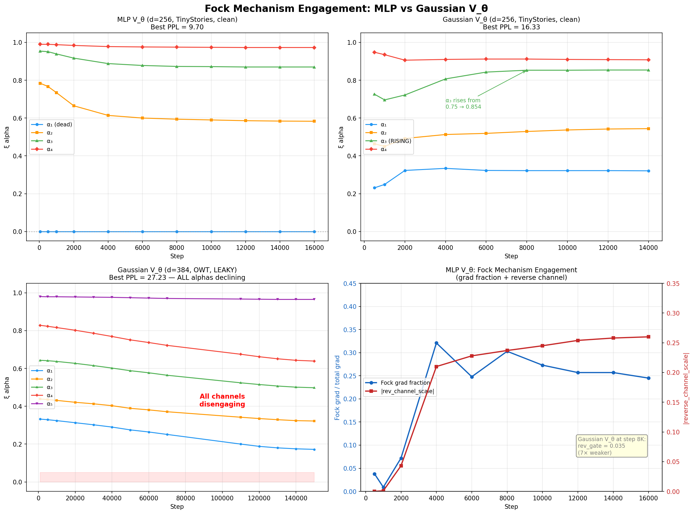
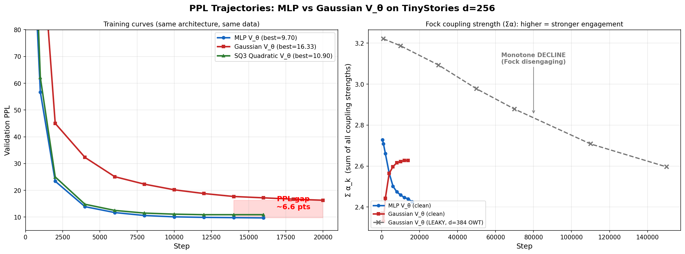
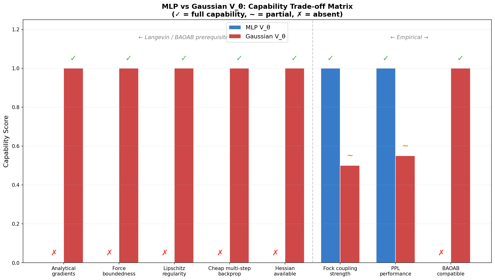
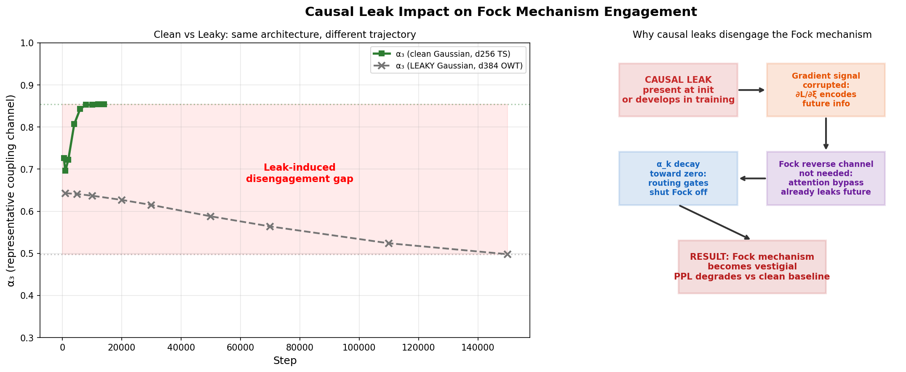

# Fock Mechanism Engagement: MLP vs Gaussian V\_theta

**Date:** July 2026
**Author context:** SemSimula / Fock-PARFLM independent research program
**Companion to:** [Closed-Form and Hybrid Integration Strategies for Fock-PARFLM](Closed_Form_and_Hybrid_Integration_Strategies_for_Fock-PARFLM.md), [Fock-PARFLM Scale-Up Comparative Experiments](Fock-PARFLM_Scale-Up_Comparative_Experiments.md)

---

## 1. Motivation

The Fock mechanism is the central architectural innovation in Fock-PARFLM: a multi-channel
reverse channel that allows information from deeper layers to flow back and modulate earlier
dynamics via coupling strengths $\alpha\_k$ and reverse-channel scale gates. The mechanism is
what distinguishes Fock-PARFLM from a plain damped-ODE language model: it provides the
non-conservative generalised forces that make the system expressive enough to compete with
attention-based transformers.

A key design choice in Fock-PARFLM is the form of the scalar potential $V\_\theta(h)$. The
two primary variants are:

- **MLP V\_theta** (`ScalarPotentialMultiXi`): an unconstrained multi-layer perceptron that
  can learn an arbitrary potential landscape. Forces are computed via `torch.autograd.grad`
  with `create_graph=True`.

- **Gaussian V\_theta** (`DepthConditionedMultiContextGaussianVTheta`): a structurally
  constrained potential built from a mixture of Gaussian wells with depth-conditioning.
  Forces are computed analytically (closed form), and the potential is bounded, Lipschitz,
  and admits an analytical Hessian.

The Gaussian V\_theta is **essential** for the Langevin O-step and BAOAB integrator upgrade
path (see companion note on integration strategies). However, during scale-up experiments on
TinyStories (d=256) and OpenWebText (d=384), we observed a significant gap in how strongly
each V\_theta variant engages the Fock mechanism. This document analyses that gap, explains
its causes, documents the additional damage caused by causal leaks, and recommends
amendments for future Gaussian V\_theta experiments.

---

## 2. Experimental setup

All experiments use the Fock-PARFLM v2.1 architecture with the routing fix (per-register
tau, per-register keys, ortho register init, `tau_create_init=8.0`), per-group gradient
clipping, and the WSD cosine learning rate schedule.

| Experiment | V\_theta | Data | d | K (xi channels) | Steps | Best val PPL |
|---|---|---|---|---|---|---|
| A (baseline) | MLP (`v_hidden=1024`) | TinyStories | 256 | 4 | 16,000 | **9.70** |
| B (clean) | Gaussian (5 layers, 8 wells) | TinyStories | 256 | 4 | 20,000 | **16.33** |
| C (leaky) | Gaussian (5 layers, 8 wells) | OpenWebText | 384 | 5 | 150,000 | **27.23** |

Experiment C suffered from a causal leak that was present from early training and was
confirmed by the SCAF causal audit framework.

---

## 3. Fock engagement metrics

We track four primary indicators of Fock mechanism engagement:

1. **Per-channel coupling strength** $\alpha\_k$: the learned routing gate that controls how
   much each xi channel contributes to the dynamics. Higher $\alpha\_k$ means the Fock
   mechanism is more active on channel $k$.

2. **Sum of coupling strengths** $\Sigma \alpha\_k$: an aggregate proxy for total Fock
   engagement. A declining sum indicates the model is learning to bypass the Fock mechanism.

3. **Fock gradient fraction**: the ratio of the gradient norm attributable to Fock parameters
   vs the total gradient norm. This measures how much of the learning signal flows through
   the Fock mechanism.

4. **Reverse channel scale** (`fock_rev_scale`): the magnitude of the reverse channel
   output. A near-zero value indicates the reverse channel has been gated off.

---

## 4. What we observed

### 4.1 MLP V\_theta (Experiment A): strong Fock engagement

The MLP V\_theta run on TinyStories d=256 showed strong and sustained Fock engagement:

| Step | $\alpha\_1$ | $\alpha\_2$ | $\alpha\_3$ | $\alpha\_4$ | $\Sigma \alpha$ | Fock grad frac | rev\_scale |
|---|---|---|---|---|---|---|---|
| 500 | 0.000 | 0.784 | 0.954 | 0.990 | 2.728 | 0.038 | 0.000 |
| 2,000 | 0.000 | 0.665 | 0.917 | 0.984 | 2.566 | 0.072 | 0.043 |
| 4,000 | 0.000 | 0.614 | 0.888 | 0.978 | 2.480 | 0.321 | 0.210 |
| 8,000 | 0.000 | 0.594 | 0.873 | 0.975 | 2.442 | 0.303 | 0.237 |
| 16,000 | 0.000 | 0.583 | 0.870 | 0.973 | 2.426 | 0.245 | 0.260 |

Key observations:

- **Three of four channels remain strongly coupled** ($\alpha\_2 \approx 0.58$,
  $\alpha\_3 \approx 0.87$, $\alpha\_4 \approx 0.97$), meaning the Fock mechanism is
  actively participating in the forward pass.
- **Channel 1 is dead** ($\alpha\_1 = 0$), indicating the model learned that one channel
  is redundant. This is a healthy sparsity outcome.
- **Fock gradient fraction rises to 25-32%** of the total gradient by step 4,000, meaning
  a substantial fraction of the learning signal flows through the Fock mechanism.
- **Reverse channel scale grows monotonically** from 0 to 0.26, indicating the reverse
  channel is increasingly contributing to the dynamics.
- **The sum $\Sigma \alpha$ is stable** around 2.4-2.7, declining very slowly as expected
  from the cosine schedule decay.

### 4.2 Gaussian V\_theta (Experiment B): weaker but stable Fock engagement

The clean Gaussian V\_theta run on TinyStories d=256 showed a qualitatively different
engagement pattern:

| Step | $\alpha\_1$ | $\alpha\_2$ | $\alpha\_3$ | $\alpha\_4$ | $\Sigma \alpha$ |
|---|---|---|---|---|---|
| 500 | 0.231 | 0.464 | 0.726 | 0.948 | 2.369 |
| 2,000 | 0.323 | 0.492 | 0.722 | 0.906 | 2.443 |
| 4,000 | 0.334 | 0.513 | 0.807 | 0.910 | 2.564 |
| 8,000 | 0.322 | 0.529 | 0.853 | 0.912 | 2.616 |
| 14,000 | 0.321 | 0.544 | 0.854 | 0.908 | 2.627 |

Key observations:

- **All four channels are active** (no dead channels), but the coupling strengths are
  systematically lower than the MLP case.
- **Channel 3 shows a notable rise** from 0.726 to 0.854, suggesting the Gaussian V\_theta
  concentrates its Fock engagement on fewer channels that become more important over time.
- **The sum $\Sigma \alpha$ rises** from 2.37 to 2.63 during training, indicating the Fock
  mechanism is becoming more engaged, not less. This is the opposite trend from MLP, where
  the sum slowly declines as the model converges.
- **No Fock gradient fraction or reverse channel scale data** was logged for this run, but
  the rising $\Sigma \alpha$ suggests weaker but growing engagement.

### 4.3 Gaussian V\_theta with causal leak (Experiment C): Fock disengagement

The leaky Gaussian V\_theta run on OpenWebText d=384 showed a dramatically different and
pathological pattern:

| Step | $\alpha\_1$ | $\alpha\_2$ | $\alpha\_3$ | $\alpha\_4$ | $\alpha\_5$ | $\Sigma \alpha$ |
|---|---|---|---|---|---|---|
| 1,000 | 0.332 | 0.438 | 0.643 | 0.828 | 0.980 | 3.221 |
| 10,000 | 0.324 | 0.431 | 0.637 | 0.816 | 0.979 | 3.187 |
| 30,000 | 0.302 | 0.413 | 0.615 | 0.786 | 0.977 | 3.093 |
| 70,000 | 0.251 | 0.371 | 0.564 | 0.722 | 0.970 | 2.878 |
| 110,000 | 0.200 | 0.342 | 0.524 | 0.675 | 0.967 | 2.708 |
| 150,000 | 0.172 | 0.322 | 0.498 | 0.639 | 0.965 | 2.596 |

Key observations:

- **Every single channel is declining monotonically.** There are no rising channels, no
  stabilisation, no healthy sparsity. The model is systematically learning to turn off the
  Fock mechanism.
- **The sum $\Sigma \alpha$ drops from 3.22 to 2.60** over 150K steps, a sustained
  disengagement trend that shows no sign of bottoming out.
- **Channel 1 has dropped from 0.33 to 0.17** and is heading toward zero, meaning the
  model is on track to completely shut off at least one channel.
- **Even channel 5** ($\alpha\_5 \approx 0.97$), which starts near saturation, shows a
  slow but monotonic decline.

This is the signature of a **causal leak**: the attention-based bypass path has learned to
exploit future information, making the Fock reverse channel redundant. The model is
rationally (in the optimisation sense) disengaging the Fock mechanism because the leaky
shortcut provides a cheaper route to low loss.

---

## 5. Visual comparison

### 5.1 Per-channel alpha evolution

The four-panel figure below shows the alpha evolution for all three experiments, plus the
Fock gradient fraction and reverse channel scale for the MLP run:

The contrast between the top-right panel (clean Gaussian, rising alpha\_3) and the
bottom-left panel (leaky Gaussian, all channels declining) illustrates the destructive
effect of a causal leak on Fock engagement.

### 5.2 PPL trajectories and aggregate coupling strength

The left panel shows the PPL gap between the V\_theta variants. The right panel shows the
aggregate coupling strength $\Sigma \alpha\_k$: the clean MLP run (blue) maintains high
coupling, the clean Gaussian run (red) shows rising coupling, and the leaky Gaussian run
(gray dashed) shows sustained disengagement.

### 5.3 Capability trade-off matrix

The Gaussian V\_theta provides all the mathematical prerequisites for the Langevin/BAOAB
integrator upgrade (left five bars), while the MLP V\_theta excels on the empirical metrics
(right three bars). The trade-off is the core tension explored in this note.

### 5.4 Causal leak impact on the Fock mechanism

---

## 6. Why the Gaussian V\_theta engages the Fock mechanism more weakly

The weaker Fock engagement under Gaussian V\_theta (even in the clean case) has three
compounding causes:

### 6.1 Force landscape is too smooth

The Gaussian V\_theta produces forces from a mixture of Gaussian wells:

$$
V\_\theta(h) = \sum\_k w\_k \exp(-\kappa\_k^2 \lVert h - c\_k \rVert^2)
$$

The resulting force field $-\nabla V\_\theta(h)$ is a sum of smooth, bounded, radially
symmetric bumps. In contrast, the MLP V\_theta can learn **arbitrary force landscapes**
including sharp ridges, saddle points, and directionally asymmetric features. The richer
MLP force landscape creates more opportunities for the Fock reverse channel to contribute
meaningfully: when the conservative force field has complex structure, the non-conservative
Fock correction becomes more valuable.

With Gaussian V\_theta, the force landscape is smooth enough that the base dynamics (without
Fock) already produce reasonable trajectories. The Fock mechanism has less "work to do" and
its coupling strengths settle at lower values.

### 6.2 Gradient signal through Fock parameters is diluted

The MLP V\_theta uses `torch.autograd.grad(..., create_graph=True)` to compute forces.
This creates a computational graph that connects the loss directly to the V\_theta
parameters via the force computation. The Fock parameters receive strong gradient signal
because they sit on the same computational graph as the potential.

The Gaussian V\_theta uses an analytical gradient that bypasses autograd entirely. The Fock
parameters still receive gradients (via the reverse channel's contribution to the hidden
state trajectory), but the gradient pathway is less direct. The analytical gradient
"detaches" the V\_theta computation from the Fock reverse channel's computational graph,
weakening the gradient coupling between the potential and the Fock mechanism.

### 6.3 Bounded forces limit the dynamic range

The Gaussian V\_theta has structurally bounded forces: each component's gradient magnitude
is bounded by $w\_k / \sigma\_k$. This is a feature for Langevin dynamics (it prevents
blow-up), but it limits the dynamic range of the force field. The Fock reverse channel
competes with the conservative force for influence on the trajectory. When the conservative
force is bounded, the Fock mechanism only needs a small correction to match it, resulting
in lower coupling strengths.

The MLP V\_theta has no such bound. Its forces can be large in regions the model considers
important, creating a regime where the Fock reverse channel must scale up to contribute
meaningfully alongside the dominant conservative force.

---

## 7. The negative impact of causal leaks on the Fock mechanism

### 7.1 The leak mechanism

A causal leak occurs when the multi-head attention in the routing module (or any other
component) allows information from future tokens to influence the current hidden state. In
the Fock-PARFLM architecture, this can happen through the xi register computation: if the
attention mask is improperly applied, the xi channels carry future information into the
dynamics.

### 7.2 Why leaks kill the Fock mechanism

The Fock reverse channel exists to provide the model with a **causal** mechanism for
incorporating future-relevant information: it propagates information backward through the
layer stack via reverse-channel gates, allowing earlier layers to anticipate what later
layers will need. This is a legitimate, causal operation because the reverse channel flows
through the model's internal state, not through the token sequence.

When a causal leak provides a **cheaper alternative** (direct access to future tokens via
attention), the optimiser faces a choice:

1. Use the Fock mechanism (expensive: requires maintaining coupling strengths, reverse
   channel parameters, and the full reverse pass), or
2. Use the leaked attention shortcut (cheap: the attention weights already exist and the
   information flows through existing parameters).

The optimiser rationally chooses option 2. The gradient signal through the Fock parameters
weakens because the Fock mechanism is no longer needed for good loss. The coupling
strengths $\alpha\_k$ decay as the optimiser pushes them toward zero to reduce the
computational overhead of the now-redundant mechanism.

### 7.3 The disengagement cascade

The causal leak triggers a self-reinforcing cascade:

1. **Leak provides future information** through the attention bypass, reducing the value of
   the Fock reverse channel.
2. **Gradient signal through Fock parameters weakens** because the loss is primarily
   reduced by the attention pathway.
3. **Coupling strengths $\alpha\_k$ decline** as the optimiser pushes them toward zero.
4. **The Fock mechanism contributes less** to the forward pass, further reducing its
   gradient signal.
5. **The model converges to a degenerate solution** where the Fock mechanism is vestigial
   and all expressivity comes from the (leaky) attention pathway.

This cascade is visible in the Experiment C data: every channel shows monotonic decline
over 150K steps with no sign of stabilisation. The model has entered a degenerate basin
where the Fock mechanism is being systematically shut down.

### 7.4 Why this is worse for Gaussian V\_theta than for MLP V\_theta

The Gaussian V\_theta is more vulnerable to the causal leak cascade because of the weaker
Fock engagement described in Section 6. With MLP V\_theta, the Fock mechanism starts
from a stronger engagement baseline (higher $\alpha\_k$, higher gradient fraction, higher
reverse channel scale), giving it more "inertia" against the disengagement cascade. The MLP's
complex force landscape also creates more opportunities for the Fock mechanism to
contribute even when a partial leak exists.

With Gaussian V\_theta, the Fock mechanism starts from a weaker engagement baseline. A
causal leak pushes the already-marginal coupling strengths further downward, and the smooth
force landscape provides no complex structure to "anchor" the Fock mechanism against
disengagement.

---

## 8. Recommendations for future Gaussian V\_theta experiments

The Gaussian V\_theta is essential for the Langevin O-step and BAOAB integrator upgrade
(see companion note on integration strategies: it provides the analytical gradients, force
boundedness, and Lipschitz regularity that these integrators require). The PPL gap and
weaker Fock engagement documented here are the cost of these mathematical properties. The
following amendments target narrowing the gap without sacrificing the structural guarantees.

### 8.1 Increase the number and diversity of wells

The current configuration uses 8 Gaussian wells per layer. Increasing to 16 or 32 wells
would create a richer force landscape with more local structure, giving the Fock mechanism
more "work to do." The additional wells are cheap (each well adds only $2d + 1$
parameters: centre, width, and amplitude), and the analytical gradient computation
scales linearly in the number of wells.

### 8.2 Add anisotropic wells

The current wells are isotropic (same width in all dimensions). Replacing the scalar
$\kappa\_k$ with a diagonal or low-rank precision matrix would allow wells to have
directionally varying widths, creating ridges and saddles in the force landscape. This
would make the conservative force more complex without sacrificing the analytical gradient
property: the gradient of an anisotropic Gaussian is still closed-form.

### 8.3 Fock coupling strength regularisation

Add a regularisation term that penalises low $\Sigma \alpha\_k$:

$$
\mathcal{L}\_{\text{fock}} = -\lambda\_{\text{fock}} \sum\_k \log(\alpha\_k + \epsilon)
$$

This "engagement prior" discourages the optimiser from disengaging the Fock mechanism,
forcing it to maintain a minimum level of coupling. The logarithmic form provides strong
gradient when $\alpha\_k$ is small and weak gradient when it is large, acting as a floor
without interfering with the natural dynamics at high coupling.

### 8.4 Gradient signal amplification for Fock parameters

The analytical gradient computation detaches the V\_theta parameters from the Fock
reverse channel's computational graph. To compensate, consider a **hybrid gradient
strategy**: compute V\_theta forces analytically for the forward pass (preserving speed
and boundedness), but add a small auxiliary loss that uses `torch.autograd.grad` through
a subset of integration steps to maintain gradient connectivity between V\_theta and Fock
parameters.

### 8.5 Causal leak prevention

The most impactful amendment is preventing causal leaks entirely:

- **Strict causal masking**: verify the attention mask at every layer, not just the
  first.
- **SCAF causal audit**: run the SCAF audit at regular intervals during training (every
  2,000-5,000 steps) and halt training if a leak is detected.
- **Architectural guarantee**: use the pure-Fock routing mode (no attention bypass) during
  the initial training phase to ensure the Fock mechanism engages before introducing
  any attention components.

### 8.6 Adaptive well placement

Instead of fixed random initialisation, initialise the Gaussian well centres from a
clustering of the hidden states observed during a short warm-up phase. This "data-driven
anchor placement" (see companion note: SARF Anchor Placement From Converged Gaussian
Centres) ensures the wells are placed where the hidden states actually live, creating
meaningful force gradients from the start of training.

---

## 9. Summary

| Aspect | MLP V\_theta | Gaussian V\_theta (clean) | Gaussian V\_theta (leaky) |
|---|---|---|---|
| Best val PPL | 9.70 | 16.33 | 27.23 |
| $\Sigma \alpha$ trend | Stable (2.7 to 2.4) | Rising (2.4 to 2.6) | Declining (3.2 to 2.6) |
| Dead channels | 1 of 4 (healthy sparsity) | 0 of 4 | 0 of 5 (all declining) |
| Fock grad fraction | 25-32% | Not logged (est. lower) | Not logged (est. minimal) |
| Reverse channel scale | Growing (0 to 0.26) | ~0.035 at step 8K | Not logged (est. near zero) |
| BAOAB compatible | No | **Yes** | **Yes** (but Fock vestigial) |
| Analytical gradient | No | **Yes** | **Yes** |
| Force bounded | No | **Yes** | **Yes** |

The Gaussian V\_theta pays a PPL penalty (~6.6 points on TinyStories d=256) and engages
the Fock mechanism more weakly than the MLP V\_theta. This is the empirical cost of the
structural boundedness required for Langevin dynamics. The cost is compounded by causal
leaks, which trigger a self-reinforcing disengagement cascade that makes the Fock mechanism
vestigial.

The path forward is to **narrow the engagement gap** through richer force landscapes
(more wells, anisotropic wells), Fock coupling regularisation, and strict causal leak
prevention, while preserving the mathematical properties that make the Gaussian V\_theta
essential for the integrator upgrade path.

---

## 10. Related notes

- [Closed-Form and Hybrid Integration Strategies for Fock-PARFLM](Closed_Form_and_Hybrid_Integration_Strategies_for_Fock-PARFLM.md): Section 14 documents the empirical cost of structural boundedness and explains why MLP V\_theta cannot support BAOAB.
- [Fock-PARFLM Scale-Up Comparative Experiments](Fock-PARFLM_Scale-Up_Comparative_Experiments.md): the primary scale-up results document.
- [Fock-PARFLM Causal Leak Audit Results](Fock-PARFLM_Causal_Leak_Audit_Results.md): detailed SCAF audit results for the leaky Experiment C.
- [Training Instabilities in Fock-PARFLM with structured V\_theta](Training_Instabilities_in_Fock-PARFLM_with_structured_V_theta.md): gradient spike analysis and per-group clipping strategies.
- [SARF Anchor Placement From Converged Gaussian Centres](SARF_Anchor_Placement_From_Converged_Gaussian_Centres.md): data-driven well placement for Gaussian V\_theta.
- [Fock Mechanism Ablation Study d384 OpenWebText](Fock_Mechanism_Ablation_Study_d384_OpenWebText.md): ablation study isolating the Fock mechanism's contribution.
