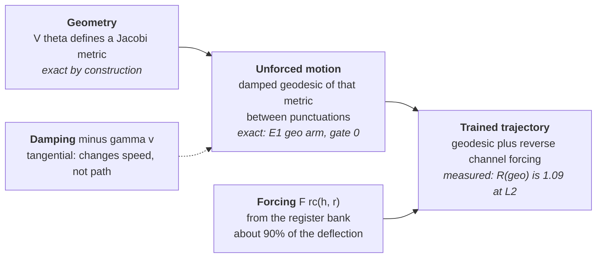
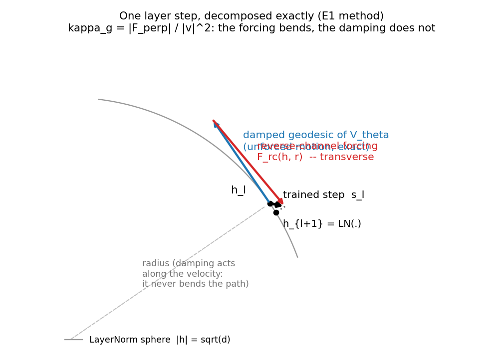

# The forced Lagrangian: reformulating Semantic Simulation around the non-conservative forces

> **Status.** Opened **2026-09-25**, the day E1 (R(geo) = 1.09) and E3
> (null at L=2) closed the geodesic reading of the trained trajectory. This
> is the thesis document; the lab notebook with the pre-registered
> experiments and gate-0 checks stays in
> [`Geodesic_Experiments_with_CfC_BAOAB.md`](Geodesic_Experiments_with_CfC_BAOAB.md)
> and is cited, not repeated. **F1 is built (Cell 6b-12) and
> harness-validated; nothing in the F-series has run.** E5 (Cell 6b-11)
> has run: §3.0. The paper-side consequences are
> planned separately in
> [`Paper_v5_Restructure_Plan.md`](Paper_v5_Restructure_Plan.md).
>
> **Rule for this document.** Every claim is tagged *measured*, *exact by
> construction*, or *open*. The programme's forecast record (checklist §8)
> is three misses from three extrapolations; the reformulation must not
> add a fourth by wording a thesis ahead of F1.

---

## 0. Summary

**The finding.** With CfC+BAOAB the integrator is stable, the E/P spikes
are gone, and the L=2 `'none'` model reaches 66.98 against a matched
GPT-2's 49.81. But the trained layer step is *not* the damped geodesic of
$V_\theta$'s Jacobi metric: replacing the full step by that geodesic leaves
a residual of 109% of the step, and about 90% of the deflection is the
reverse channel — the force by which the Fock register bank acts on the
token state. Damping is not the cause; friction is tangential and bends
nothing (master doc §4.8). The pairwise potential $V_\phi$ is inert. At
L=2 the second-order state at layer 1 is the raw embedding, not a velocity
along a curve (E3, §6.8). Refinement fails (Gate 3). *All measured, at
L=2.*

**The reformulation.** Non-conservative forces do not leave Lagrangian
mechanics; they enter through the Lagrange–d'Alembert principle. What died
is the **geodesic** reading — inference as *free* motion on a learned
metric — not the framework. The restated thesis:

> *Semantic inference is the numerical integration of a forced, damped
> mechanical system. The conservative potential sets the default motion —
> what the state would do with no new information — and the Fock register
> bank supplies the forcing that redirects it. Every layer step decomposes
> exactly, per token, into what the prior geometry would have done and
> what memory did.*

The last sentence is the asset. A transformer's residual stream is also
forced — by attention — but it has no principled null motion to subtract.
Here the decomposition is exact and already computed (E1's replay).

**The programme.** Five experiments on the forcing itself (§3), each
pre-registered. F1 — is the forcing *sparse* across tokens? — decides the
wording of the thesis and runs first.

---

## 1. What was claimed, what was measured

| stage | claim | what happened | status |
| --- | --- | --- | --- |
| Verlet era | trajectory = damped geodesic; residual diagnostic (§18 of the paper) | trained stiffness pushed ω·Δt past Verlet's stability bound of 2; E/P spikes; runs unstable | integrator replaced |
| CfC+BAOAB | exact harmonic A-substep, exact friction; Jacobi's theorem removes the Christoffel symbols | stable; 66.98 at L=2 `'none'`; spikes gone | **kept, exact** |
| Gate 3 (Cell 6b-7) | refinement invariance: the stack samples one curve | PPL 68.7 → 435.6 as N goes 2 → 8; the stack is maps between flows | **withdrawn** |
| E1 (Cell 6b-9) | the step is the damped V_θ geodesic | R(geo) = 1.09; reverse channel ~90%; V_φ inert; LN helps | **withdrawn at L=2** |
| E3 (Cell 6b-10) | the second-order state makes the trajectory forecastable | null at L=2; two of three metrics structurally invalid there | **open, L ≥ 3** |
| L=1 (ladder run 7) | one hop is the floor | 87.09, +30% vs L=2; register bank static | measured |

What is *not* on this list, because nothing measured touches it: the
geometry (§2 of the paper through §6), the exact machinery of the
integrator, the energy bookkeeping, and the Fock mechanism's contribution
(+275% when its token path is ablated at L=2, OOD-inflated but large).

---

## 2. The reformulation

### 2.1 Three layers, three statuses

The geodesic programme conflated three claims of different strength.
Separating them is the whole of the reformulation:

| layer | claim | status |
| --- | --- | --- |
| geometry | V_θ defines a Jacobi metric g = (E − V_θ)·δ on semantic space | exact by construction |
| unforced motion | with the reverse channel off, one CfC+BAOAB step is exactly one damped-geodesic step of that metric | exact: E1's `geo` arm, validated bit-exactly by gate 0 |
| trained trajectory | the trained step *is* that geodesic step | **false at L=2**: R(geo) = 1.09 |

The first two are the framework. The third was the thesis as stated, and
it is the one E1 measured.

### 2.2 The formal home: Lagrange–d'Alembert

A mechanical system with Lagrangian $L = T - V_\theta$ and a
non-conservative force $F$ obeys

$$\delta \int L dt + \int F \cdot \delta h dt = 0$$

which yields the equation of motion the trained model actually integrates
(master doc §4.8):

$$m \ddot{h} = -\nabla V_\theta(h) - \gamma m \dot{h} + F_{\mathrm{rc}}(h, r) + F_\phi(h)$$

with $F_\phi$ measured inert. This is standard mechanics — a driven, damped
system — and everything the paper builds on the Lagrangian (energy
bookkeeping, the BAOAB splitting, the exact propagators, semantic mass)
survives unchanged. What does not survive is any statement that begins
"the trajectory is a geodesic".

### 2.3 Damping bends nothing; the forcing does

Stated once, in master doc §4.8, and load-bearing here: friction is
parallel to the velocity, so it changes the speed along the path and not
the path. The geodesic curvature of the trained trajectory is

$$\kappa_g = \frac{\lVert F_\perp \rVert}{\lVert \dot{h} \rVert^2}$$

— the transverse part of the non-gradient forcing. At L=2 that is the
reverse channel. This is why "heavily damped" was never the threat to the
geodesic reading, and why a slider on the damping would show nothing while
a slider on the reverse channel (E5) shows everything.

*Figure 1. One layer step, decomposed the way E1 computes it. The damped
geodesic step of $V_\theta$ (blue) is the unforced motion and is exact; the
reverse-channel forcing (red) is transverse and is what bends the path; the
trained step (black) is their sum, projected back to the LayerNorm sphere.
Damping acts along the radius of the velocity and never enters $\kappa_g$.*

### 2.4 The decomposition is the asset

Every step of the trained model splits, per token and per layer, into

$$s_\ell = s_\ell^{\mathrm{geo}} + \big(s_\ell - s_\ell^{\mathrm{geo}}\big)$$

where $s_\ell^{\mathrm{geo}}$ is what the prior geometry would have done
from the same state, and the remainder is what memory did. E1 computes
both terms exactly (replay on the captured state, gate 0). No transformer
offers this: its residual stream is forced by attention, but there is no
principled null motion to subtract — the whole step is "what the network
did".

Three things follow from taking the decomposition seriously rather than
treating the remainder as an error:

1. **The geodesic residual is the signal, not a defect.** The paper's §18
   residual and §13 STP loss (normalised normal acceleration — that *is*
   $\kappa_g$) stop being diagnostics to drive to zero and become the
   measurement of how hard memory steered at each token.
2. **Anomaly has a definition.** A hallucination, in this picture, is an
   atypical forcing — the register readout driving the state somewhere the
   geometry would not take it. That is a per-token scalar with a null
   distribution (F4).
3. **The thesis has a testable strong form.** If the forcing is *sparse*
   across tokens — most tokens near-geodesic, a minority strongly steered —
   then "geodesic between events, forced at events" is true at the token
   level even though the average R is 1.09. That is F1, and it decides
   whether the thesis says *memory steers* or *memory steers occasionally*.

### 2.5 What "semantic simulation" now means

The word *simulation* survives: the model is a numerical integrator of a
mechanical system in semantic space, with an exact propagator per
substep. What is dropped is *free*. The system is driven, and the driver is
a working-memory mechanism whose output is a force. "Semantic simulation of
a driven system" is a narrower name and a true one.

### 2.6 Given up, without hedging

- Refinement invariance and any continuum-limit language (Gate 3; Remark
  52 and its footnote already in the paper).
- Depth as an inference-time knob.
- The geodesic residual as a *geometric* statement about a curve; it is a
  property of the trained discretisation (flow/maps note §5).
- Any claim that the dynamics are more forecastable than a transformer's,
  pending L ≥ 3 (E3 §6.8).
- "$V_\phi$ is inert at 0.0002." That number was the *change in E1's
  residual* between two arms, not $V_\phi$'s contribution. E5 measured
  the contribution directly: 6% of the step at layer 0, 0.5% at layer 1,
  resolvable and small. "Minor" is the word; "inert" overstated it.

---

## 3. The F-series: experiments on the forcing

All zero-training unless marked. All use the E1 replay method and carry a
gate-0 check. Pre-registered readings are stated before any of them runs.

### 3.0 E5 — the reverse-channel slider (Cell 6b-11) — **run 2026-09-25**

Prices geodesicity in PPL by turning the forcing down continuously; full
table and reading in master doc §11.6. Three results carry into the thesis:

1. **No free region.** PPL 69.5 at λ = 1 to 271.8 at λ = 0, a factor 3.91,
   smooth and convex in log-PPL, with every notch below λ = 0.9 costing.
   The unforced motion predicts at bigram level. *Measured.*
2. **At layer 1 the forcing sets the direction outright.** R_geo at layer 1
   is invariant to λ from 1 down to 0.3 and only then collapses: the
   layer-1 output is the normalised direction of the reverse-channel
   increment, and the geodesic-stepped state shows through only when the
   increment is scaled below the state's own size. Layer 0 behaves
   linearly instead. So "forcing" is the right word at layer 0 and too
   weak at layer 1, where the register readout *replaces* the state — a
   state-keyed read from memory. *Measured; the pre-LN increment-to-state
   ratio is to be read on the next run.*
3. **V_φ's direct contribution is 6% of the step at layer 0 and 0.5% at
   layer 1** (the λ = 0 row, where nothing modulates it), and it does not
   grow anywhere in the sweep. E1's "−0.0002" was the change in the
   residual between two arms, not this quantity; the two are consistent.
   With the reverse channel on, V_φ's effect is amplified at layer 1 and
   masked at layer 0 because the readout reads `h_new`. *Measured.*

Consequence for §2: the driven-system picture is confirmed and, at layer
1, strengthened past "driven" — the last layer's output is a memory read.
The thesis wording still waits for F1, which asks whether this holds for
every token.

### 3.1 F1 — is the forcing sparse? (Cell 6b-12, built, harness-validated)

**Question.** E1's R(geo) = 1.09 is an RMS ratio averaged over tokens. Is
it carried uniformly, or by a minority?

**Measured.** Per token, per layer,

$$R_{\mathrm{tok}} = \frac{\lVert h_{\mathrm{full}} - h_{\mathrm{arm}} \rVert}{\lVert h_{\mathrm{full}} - h_{\mathrm{in}} \rVert}$$

with the arm replayed on the same captured state. Primary arm: damped
geodesic with LN kept and $V_\phi$ kept (E1's `cons+LN`, since LN is a
constraint, master doc §7). Reference arm: bare $V_\theta$ geodesic. 16,384
tokens per layer (8 batches × 4 × 512), TF32 off. Reported: quantiles,
fraction below 0.25 and above 0.75, Sarle's bimodality coefficient, and
rank correlations of $R_{\mathrm{tok}}$ with position in block, semantic
mass, the model's own next-token loss, and step size. Layer 1 is the clean
layer; layer 0's step is the embedding-to-sphere projection.

**Pre-registered readings.**

| pattern | criterion (layer 1, primary arm) | thesis wording |
| --- | --- | --- |
| **SPARSE** | ≥ 30% of tokens with R_tok below 0.25 while RMS ≈ 1, or bimodality above 0.555 | *memory steers occasionally*: piecewise-geodesic holds at the token level; F3 asks what the events are |
| **UNIFORM** | IQR inside [0.6, 1.6] and < 10% below 0.25 | *memory steers*: the geodesic is not the default motion for any sizeable class of tokens |
| neither | — | read the histogram; do not word the thesis yet |

**What could turn.** The correlates. If $R_{\mathrm{tok}}$ tracks the
model's own loss (high-surprise tokens forced harder), forcing is
*corrective*; if it tracks position (early tokens forced, later ones
geodesic), forcing is *initialisation*; if it tracks nothing, the events
are semantic and F3 needs token classes.

**Harness (2026-09-25).** Random-init toy at the live configuration:
gate 0 passes at $0.000\mathrm{e}{+00}$; all quantities compute; the
reading logic fires; weights, gate and warmup buffer restore bit-exactly.
At random init the reading is UNIFORM (99% of layer-1 tokens above 0.75),
which is what an untrained reverse channel with the gate forced open
should give and says nothing about the trained model.

### 3.2 F2 — does the forcing shrink with depth? (needs the L=4 run)

E1 at L=4 (and at L=8 on the earlier ladder arm if its gate state permits).
Per-step geodesic segments are shorter with more layers; the reverse
channel may need to redirect less per layer, or may not.
**Pre-registered:** no strong prior on the sign; the *shape* of
$R(\mathrm{geo})$ versus $L$ is the result. If it falls, L=2 is a floor and
the geodesic share of the dynamics grows with depth. If it is flat, the
forcing is a fixed fraction of every step and depth does not buy
geodesicity.

### 3.3 F3 — what triggers the forcing? (minutes on F1 captures)

Conditional on F1 returning SPARSE. Which tokens are the events: by
part-of-speech class, by position, by register age (how recently the
registers read were written), by the surprise of the token itself and of
the token *predicted*. The E1 captures already carry `r` and `salience`
per layer, so register age is available without re-running.
**Pre-registered:** the reverse channel reads registers and registers
change slowly (master doc §6.6), so forcing should be *smooth in position*
and *spiky in surprise*; the opposite would say the bank is being rewritten
every token, which the salience decay makes unlikely.

### 3.4 F4 — forcing as an anomaly score (hours)

The hallucination claim, re-based. Compute the per-token forcing on
held-out text and on the same text with controlled corruptions (swapped
entities, negated clauses, shuffled sentences); ask whether the forcing
distribution separates them, and at what layer. **Pre-registered:** the
null distribution of $\kappa_g$ on clean text is what F1 measures; the
claim survives only if corruptions land in its tail at a rate a simple
loss-based detector does not match. Loss is the baseline to beat, and it
may win.

### 3.5 F5 — can $V_\phi$ be active at all? (one L=2 run)

From scratch at $\lambda = 0$ (reverse channel off): pure
$V_\theta + V_\phi$ at this configuration. The control for any claim about
the pairwise potential being crowded out. **Pre-registered:** if $V_\phi$
is inert here too, its inertness is a $V_\phi$/PARF matter — likely the
gathered top-k force scale — and no amount of turning the Fock mechanism
off recovers it; the branch-and-anneal variant (master doc §11.4) is then
not worth running.

---

## 4. Where the paper already has the machinery

Three sections of `paper_v5` turn out to contain the reformulation's
formal apparatus, written for a different purpose:

- **§13, the STP loss as normalised normal acceleration.** This is
  $\kappa_g$ up to normalisation. Written as a diagnostic to be driven
  down; in the reformulation it is the forcing measurement.
- **Appendix A1, the non-autonomous framework** — "two non-autonomy
  mechanisms", the fibre-bundle geometry and holonomy, adiabaticity. A
  time-dependent forcing from a slowly changing register bank is exactly a
  non-autonomous system with an adiabatic parameter. The reformulation
  should be written *in* this language rather than beside it.
- **§17h, first-order sufficiency.** E3's L=2 finding — the layer-1
  "velocity" is the embedding-projection step — is direct evidence for the
  depth-memory mismatch that section describes.

---

## 5. Ledger

| item | status | date |
| --- | --- | --- |
| reformulation stated (§2) | drafted; wording of the strong form held for F1 | 2026-09-25 |
| F1 | **built, Cell 6b-12, harness-validated**; not run | 2026-09-25 |
| E5 | **run**: 3.91× price, no knee; layer-1 direction set by the readout; V_φ 6% / 0.5% direct | 2026-09-25 |
| F2 | needs L=4 (ladder run 4, queued) | — |
| F3 | conditional on F1 SPARSE | — |
| F4 | designed | — |
| F5 | designed; one training run | — |
