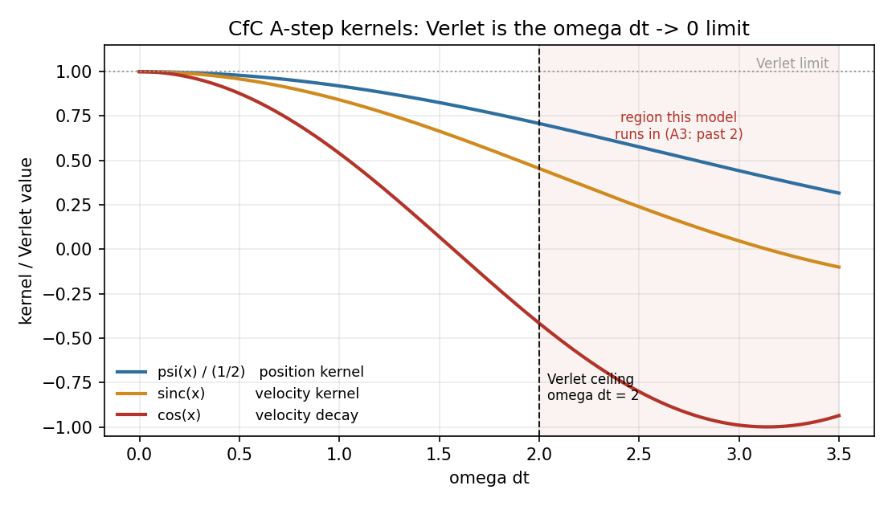
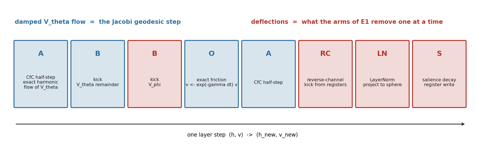
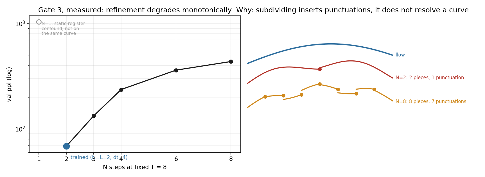
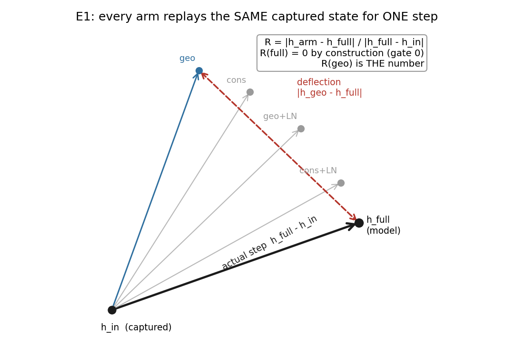
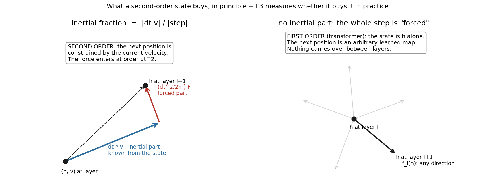
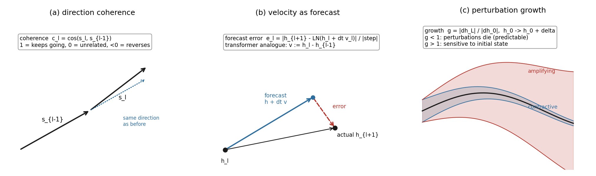
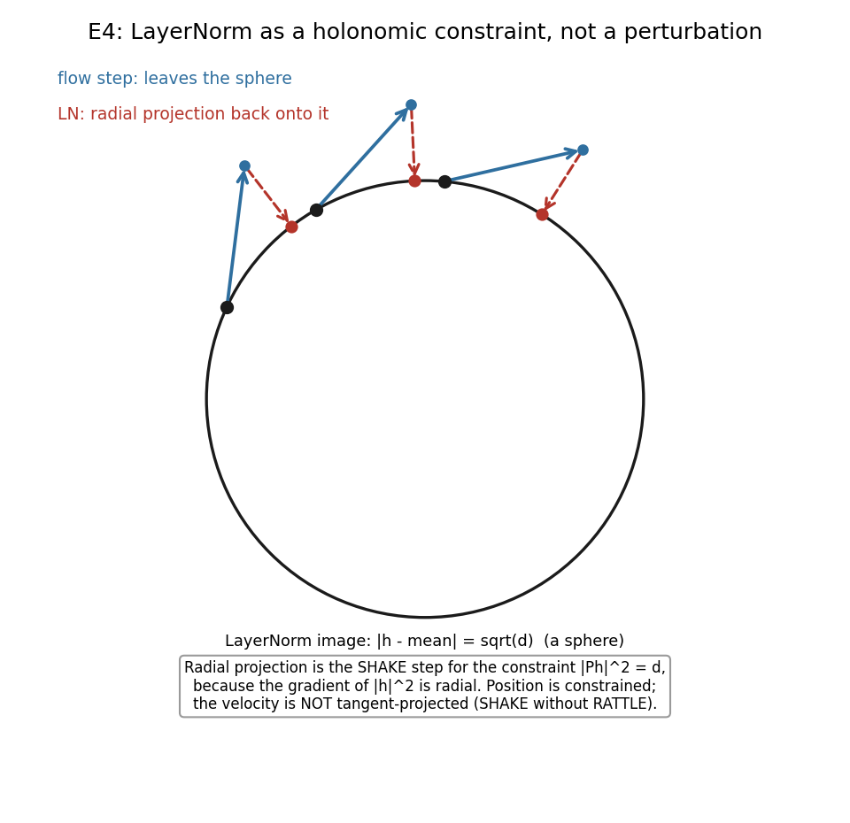

# Geodesic experiments under CfC+BAOAB: E1 and the programme it opens

> **Status.** Master document for the Riemannian-geodesic programme on the
> **CfC+BAOAB** integrator. Opened **2026-09-25**, immediately after the
> flow/maps sweep (Cell 6b-7) returned its verdict. **E1 has run (Cell 6b-9,
> §4.7): R(geo) = 1.09.** E3 (Cell 6b-10, §6) and E5 (Cell 6b-11, §11) are
> built and harness-validated, awaiting their first runs; E2 and E4 are
> designed and pre-registered here so their predictions are on record before
> any of them is measured.
>
> **Scope.** The Verlet-regime geodesic work lives in
> [`Geodesic_Preservation_Experiment.md`](Geodesic_Preservation_Experiment.md),
> which scopes itself to Velocity-Verlet in its §8.1. This document is its
> successor for the integrator the production models actually use. It does
> not repeat that derivation; it asks what survives the move, and how to
> find out.
>
> **Depends on.**
> [`Composing_Single_Layer_Inferences_Flow_or_Maps.md`](Composing_Single_Layer_Inferences_Flow_or_Maps.md)
> (the refinement result),
> [`Fock_Mechanism_Efficiency_Across_Layer_Depth.md`](Fock_Mechanism_Efficiency_Across_Layer_Depth.md)
> (what the register path is worth),
> [`CfC_BAOAB_Integrator_and_Mitigations.md`](CfC_BAOAB_Integrator_and_Mitigations.md)
> (the integrator itself).

---

## 0. Summary

The flow/maps sweep showed that a trained L=2 Fock-PARFLM is **not
refinement-invariant**: re-run at N steps of size $T/N$ with $T$ held at 8,
its perplexity climbs monotonically from 68.7 at the trained $N=2$ to 435.6
at $N=8$. That refutes one specific claim — that the layers sample a
continuous curve which finer sampling would resolve.

It does **not** refute the claim the Riemannian programme rests on, which is
different and has never been tested on this integrator:

> at the trained $(L, \Delta t)$, does each layer step follow the damped
> geodesic of the Jacobi metric induced by $V_\theta$?

Three things follow, and they organise the rest of this document.

1. **CfC+BAOAB is a better home for geodesics than Verlet, not a worse one.**
   Its A-substep is the *exact* flow of $V_\theta$'s harmonic part, and by
   Jacobi's theorem exact Hamiltonian flow *is* the geodesic. Verlet only
   approximates that, and past $\omega\Delta t = 2$ does not do so stably
   (§2).

2. **What breaks refinement is not the flow but the punctuations** — the
   per-step maps interleaved between flow segments: LayerNorm, salience
   decay, register writes, top-$k$ selection. The layer stack is $L$ geodesic
   segments separated by $L$ non-Hamiltonian maps. Subdividing a step
   inserts more punctuations; it does not resolve a curve (§3).

3. **So the decisive measurement is the per-step deflection from the
   $V_\theta$ geodesic, at the trained step.** E1 makes it, and it can be
   made without Christoffel symbols: the geodesic step from a captured
   $(h, v)$ is simply the model's own integrator run with $V_\theta$ as the
   only force (§4).

If E1's residual is small, the framework survives as **piecewise-geodesic
flow** — exact between punctuations, learned across them — and Gate 3 only
says the pieces cannot be subdivided. If it is near 1, the geodesic reading
fails at the trained step too, and that should be said plainly.

**E1 has now run (§4.7): R(geo) = 1.09.** The geodesic reading fails at the
trained step. The step is the $V_\theta$ geodesic plus the reverse channel,
and the reverse channel is the larger part. Damping is not the reason:
friction is tangential and changes only the speed along the path, while the
reverse channel is a transverse, non-gradient force and is what bends it
(§4.8). What that leaves — a second-order state that provably carries
information, exact energy bookkeeping, and an open question about
*forecastability* rather than *geodesicity* — is the subject of §6.

---

## 1. What Gate 3 showed, and what it did not

```mermaid
flowchart LR
  G3["Gate 3, Cell 6b 7<br>refine N at fixed T"] --> A["claim A<br>REFINEMENT INVARIANCE<br>layers sample one curve"]
  A --> AR["REFUTED<br>68.7 to 435.6, monotone"]
  B["claim B<br>GEODESIC PROPERTY<br>each step follows the<br>V&#95;theta Jacobi geodesic"]
  E1["E1, Cell 6b 9<br>per step deflection<br>at the trained dt"] --> B
  B --> BR["UNTESTED on CfC+BAOAB<br>this document"]
  A -.->|"does NOT imply"| B
  style AR fill:#fdf1ef,stroke:#b4342a
  style BR fill:#eef4fa,stroke:#2f6f9f
```



The measurement, from Cell 6b-7 on the L=2 `'none'` @1.2e-03 checkpoint:

| N | dt | ppl | vs trained |
| ---: | ---: | ---: | ---: |
| 1 | 8.000 | 1032.73 | static-register confound, not on this curve |
| **2** | **4.000** | **68.65** | trained |
| 3 | 2.667 | 133.46 | +94% |
| 4 | 2.000 | 236.62 | +245% |
| 6 | 1.333 | 361.09 | +426% |
| 8 | 1.000 | 435.61 | +535% |

Gate 0 reproduced the checkpoint bit-exactly, so this is the model that was
trained. Successive changes (64.8, 103.2, 124.5, 74.5) do not shrink: not a
Cauchy sequence, hence not a discretisation of anything.

Claim B is logically independent. A sequence can satisfy a discrete
geodesic equation at one step size without being the restriction of a
continuous geodesic to a grid. Gate 3 never computed a residual, so it has
nothing to say about B. Remark 52 of the paper (§`10_jepa_connection`) now
records exactly this scoping.

---

## 2. Why CfC+BAOAB is where geodesics should live

### 2.1 Jacobi's theorem removes the Christoffel symbols

At fixed energy $E$, trajectories of $m\ddot{h} = -\nabla V$ are geodesics of
the Jacobi metric

$$\tilde g_{ij}(h) = 2\bigl(E - V(h)\bigr) g_{ij}$$

This is an *equivalence*: the geodesic equation of $\tilde g$ and Newton's
equation under $V$ have the same solution curves. So "follows the
$V_\theta$ Jacobi geodesic" and "follows Newtonian motion under $V_\theta$"
are one claim, and the second form needs no metric, no Christoffel symbols
and no covariant derivative — only an integrator and a force.

With damping the paper's residual carries a $+\gamma v$ term. In Newtonian
form that is

$$m\ddot{h} = -\nabla V_\theta - \gamma m \dot{h}$$

and the BAOAB O-substep integrates the friction part *exactly*,
$v \leftarrow e^{-\gamma\Delta t} v$. So a BAOAB step under $V_\theta$ alone
**is the damped-geodesic step**, to the accuracy of the integrator.

### 2.2 The A-substep is exact, not approximate

For the frozen-coefficient harmonic force $f = -K(h - \mu)$ with
$\omega = \sqrt{K/m}$, the CfC substep is the closed-form solution

$$h(t+\Delta t) = h + \frac{\Delta t^2}{m} \psi(\omega\Delta t) f + \Delta t \cdot \mathrm{sinc}(\omega\Delta t) v$$

$$v(t+\Delta t) = \cos(\omega\Delta t) v + \frac{\Delta t}{m} \mathrm{sinc}(\omega\Delta t) f$$

with $\mathrm{sinc}(x) = \sin x / x$ and $\psi(x) = (1 - \cos x)/x^2$. From
[`cfc_baoab.py`](../notebooks/conservative_arch/parf/cfc_baoab.py):

```python
# Below this, sin(x)/x is replaced by its Taylor series. The truncation
# error there is x^4/120 <= 8.3e-15 at the cutoff ...
_SINC_TAYLOR_EPS = 1e-3

def _sinc(x):
    small = x.abs() < _SINC_TAYLOR_EPS
    safe = torch.where(small, torch.ones_like(x), x)
    return torch.where(small, 1.0 - x * x / 6.0, torch.sin(safe) / safe)
```

Within a step, for the harmonic part, this **is** the geodesic — not a
second-order approximation to it. Verlet is the $\omega\Delta t \to 0$ limit
($\psi \to 1/2$, $\mathrm{sinc} \to 1$, $\cos \to 1$):



`A3_experiment_index` records that $\sigma_{\max}(B_k)^2$ drives
$\omega\Delta t$ **past the Verlet ceiling of 2** — the stated reason the
programme adopted CfC+BAOAB. At $\omega\Delta t = 2$ the position kernel
sits 29% below Verlet's and the velocity kernel 55% below. Two consequences:

- Verlet is not merely less accurate here; it is unstable. "We cannot use
  Verlet" is correct, and it is not a loss for the geodesic programme.
- Any residual that estimates acceleration by a plain second difference of
  positions — the Verlet convention — would book that $\psi$/$\mathrm{sinc}$
  modulation as geodesic deviation. That is an artefact of the estimator,
  not of the trajectory (§8). E1 avoids it entirely by never estimating an
  acceleration.

---

## 3. The piecewise-geodesic picture

### 3.1 Anatomy of one layer step

From `_layer_step_langevin` in
[`model_parf_multixi.py`](../notebooks/conservative_arch/parf/model_parf_multixi.py),
with the Fock wrapper around it:

```python
# A: exact harmonic flow of V_theta's low-rank part, half step
h_mid, v_mid = lowrank_cfc_substep(h_in, v, lr_U, lr_kappa, f_L, m_b, half)

# B: kick with whatever the A substeps did not already carry
f_theta, f_phi = self._layer_forces(h_mid, xis, layer_idx, split=True, ...)
f_kick = f_theta + f_phi - f_L_mid          # V_theta remainder + V_phi
v_mid = v_mid + (dt / m_b) * f_kick

# O: exact friction
v_mid = ou_step(v_mid, gamma, dt, m=m_b, T=0.0, ...)

# A: second half step
h_new, v_new = lowrank_cfc_substep(h_mid, v_mid, ...)

if cfg.ln_after_step:
    h_new = self._project(h_new)            # F.layer_norm, no affine
return h_new, encode_velocity(h_new, v_new, dt)
```

and, in `_fock_layer_step` after that returns: the reverse-channel kick
`(dt*dt/m_b) * tanh(scale) * warm * Q_force`, a second `_project`, then the
salience decay and register write.



Shaded blue is the damped $V_\theta$ flow — the geodesic. Red is everything
else. The geodesic claim is a claim about how much of the step is blue.

### 3.2 Why punctuations obstruct refinement

Write one layer step as $\Phi_{\Delta t} = M \circ F_{\Delta t}$, where
$F$ is a genuine flow map (composition adds times: $F_a \circ F_b$ equals $F$ at $a+b$) and $M$ is a map that
does not depend on $\Delta t$. Refining at fixed $T$ replaces
$\Phi_{T}$ by

$$\bigl(M \circ F_{T/N}\bigr)^{N}$$

which is not $M \circ F_T$ for any $N \gt 1$ unless $M$ commutes with the
flow. **Refinement multiplies $M$, it does not resolve $F$.** Whether the
composition converges to *anything* as $N \to \infty$ depends on what $M$
is:

| per-step map | scales with dt | refinement limit |
| --- | --- | --- |
| reverse-channel kick `(dt*dt/m)*...` | yes | fine — it is part of the flow |
| LayerNorm (projection onto a fixed sphere) | no | **converges** — to the flow constrained to that sphere (§7) |
| salience decay `s <- 0.5 s + 0.5 alpha` | no | the bank is rewritten N times; its state is N-dependent |
| top-k selection in `V_phi` | no | discontinuous in N |



This table is a prediction machine. It says LayerNorm alone should *not*
obstruct refinement (it converges to constrained flow), while the register
machinery *should*. E2 tests exactly that (§5).

---

## 4. E1 — the per-step deflection from the $V_\theta$ geodesic

### 4.1 Method: replay, do not re-run

The naive test would integrate $V_\theta$ alone for $L$ steps and compare
endpoints. That conflates the per-step deflection with its compounding over
the stack — after one deflected step the two trajectories are at different
points and no longer comparable.

E1 instead **captures every layer's input state** during one real forward
pass — the tuple `(h, h_prev, r, salience)` at each layer — and replays
*that same state* through the model's own `_fock_layer_step` under each arm.
Every comparison is one step from one shared starting point.

```python
def _r9_spy(h, h_prev, r, sal, m_b, gamma, dt, layer_idx=0, **kw):
    out = _r9_orig_step(h, h_prev, r, sal, m_b, gamma, dt, layer_idx=layer_idx, **kw)
    _caps.append((layer_idx, h.detach().clone(), h_prev.detach().clone(),
                  r.detach().clone(), sal.detach().clone(), m_b, gamma,
                  out[0].detach().clone(), out[1].detach().clone()))
    return out
```

Velocity is never estimated. `encode_velocity` stores
$h^{\mathrm{prev}} = h_{\mathrm{new}} - \Delta t \cdot v_{\mathrm{new}}$, so

$$v_\ell = \frac{h_\ell - h^{\mathrm{prev}}_\ell}{\Delta t}$$

is the integrator's own velocity, exactly, with no staggering ambiguity and
no dependence on the $\psi$/$\mathrm{sinc}$ kernels.

### 4.2 The arms

Each arm runs the **same code path** with one term zeroed by a patch —
never a reimplementation. The three patches:

```python
# V_phi off:   the split force path returns (f_theta, f_phi) separately
def _forces(*a, **kw):
    ft, fp = _r9_orig_forces(*a, **kw)
    return ft, (fp if phi_on else torch.zeros_like(fp))

# LayerNorm off:  _project is bare F.layer_norm; identity removes it
model._project = _r9_orig_project if ln_on else (lambda h_: h_)

# reverse channel off:  the gate is one scalar per layer
model.reverse_channel_scale.zero_()
```



```mermaid
flowchart TD
  GEO["geo<br>V&#95;theta only, damped, no LN<br>the Jacobi geodesic step"]
  GLN["geo+LN<br>plus the sphere projection"]
  CON["cons<br>V&#95;theta plus V&#95;phi, no LN<br>all conservative forces"]
  CLN["cons+LN<br>everything except the<br>reverse channel"]
  FULL["full<br>the actual step<br>GATE 0: must be bit exact"]
  GEO --> GLN
  GLN --> CLN
  CLN --> FULL
  GEO --> CON
  CON --> CLN
  style GEO fill:#eef4fa,stroke:#2f6f9f
  style FULL fill:#f3f3f3,stroke:#1b1b1b
```

| arm | `V_phi` | reverse channel | LayerNorm | what it is |
| --- | :---: | :---: | :---: | --- |
| `geo` | off | off | off | damped `V_theta` flow — the geodesic |
| `geo+LN` | off | off | on | geodesic constrained to the LN sphere |
| `cons` | on | off | off | all conservative forces |
| `cons+LN` | on | off | on | all but the reverse channel |
| `full` | on | on | on | the model; reproduces the capture bit-exactly |

### 4.3 The residual

$$R_h = \frac{\lVert h_{\mathrm{arm}} - h_{\mathrm{full}} \rVert}{\lVert h_{\mathrm{full}} - h_{\mathrm{in}} \rVert}, \qquad R_v = \frac{\lVert v_{\mathrm{arm}} - v_{\mathrm{full}} \rVert}{\lVert v_{\mathrm{full}} - v_{\mathrm{in}} \rVert}$$

Deflection as a fraction of the step actually taken, per layer, Frobenius
over the batch. $R(\mathrm{full}) = 0$ by construction; that is gate 0.



**$R(\mathrm{geo})$ is the number.** The gaps between arms attribute the
deflection: `geo -> geo+LN` is LayerNorm's share, `geo -> cons` is
$V_\phi$'s, `cons+LN -> full` is the reverse channel's.

### 4.4 Gate 0, and why it is not a formality

The first draft of Cell 6b-7 patched `_layer_step_ex` into the loop instead
of `_fock_layer_step` — the inner multi-xi step rather than the Fock
wrapper — and so silently dropped the registers, the reverse channel and
one of the two LayerNorms. Gate 0 would have failed by roughly the value of
the register path, **+275%**. It was caught before running, by the same
bit-exactness check E1 carries. Any harness that reports a residual without
first reproducing the model's own step is reporting on a different model.

The E1 harness was validated on the live-config build before this document
was written: gate 0 at `0.000e+00`, and each of the three patches shown to
change the output (`geo` differs from `geo+LN`, from `cons`, and `cons+LN`
is non-zero).

### 4.5 An interpretive caution, stated before the run

The reverse channel's learned gate is $\tanh(s) \approx 0.017$ — small —
yet ablating it costs **+275% perplexity** (Cell 6b-8). So its deflection
may be small in norm while the model is exquisitely sensitive to its
direction. Formally, the loss change under a deflection $\delta h$ is
$\langle \nabla_h \mathcal{L}, \delta h \rangle$, which can be large when
$\delta h$ is small but aligned with the gradient.

**E1 measures geometry, not importance.** A small $R(\mathrm{geo})$ says the
step is mostly geodesic in the $\ell_2$ sense. It does not say the
non-geodesic remainder is dispensable for prediction — that is E3's question
(§6).

### 4.6 Pre-registered readings

| R(geo) | reading |
| --- | --- |
| below ~0.3 | the step is predominantly the `V_theta` geodesic; the framework survives as piecewise-geodesic flow and Gate 3 only forbids subdivision |
| 0.3 to 0.7 | geodesic and deflection are comparable; the framework is a first-order description with a large learned correction |
| above ~0.7 | the `V_theta` geodesic is a minority of the step; the Riemannian reading fails at the trained step as well |

Sub-predictions, from §3.2's table: `geo+LN` should sit *closer* to `full`
than `geo` does (LN is a constraint, not a perturbation), and the reverse
channel's share should be small in norm despite its PPL weight (§4.5).

---

### 4.7 Result — **run 2026-09-25**, L=2 `'none'` @1.2e-03

Gate 0 passed bit-exactly (`max |d| = 0.000e+00`, all six captured steps).

| arm | layer 0 R_h | layer 0 R_v | layer 1 R_h | layer 1 R_v |
| --- | ---: | ---: | ---: | ---: |
| `geo` | 0.9054 | 0.9948 | **1.2656** | 0.7246 |
| `geo+LN` | 0.7691 | 0.9948 | 1.0343 | 0.7246 |
| `cons` | 0.9052 | 0.9898 | 1.2653 | 0.7238 |
| `cons+LN` | 0.7616 | 0.9898 | 1.0350 | 0.7238 |
| `full` | 0 | 0 | 0 | 0 |

**R(geo) = 1.09** averaged — the third band of §4.6. At layer 1, the
cleaner layer (step size 1.10 x |h_in| against 5.36 x at layer 0, where the
embedding-to-sphere rescaling dominates), R_h = 1.27: following the
$V_\theta$ geodesic lands further from the true next state than not moving.

Attribution, averaged R_h: LayerNorm moves R by **−0.18** (a constraint, as
§7 predicted); $V_\phi$ by **−0.0002** (inert); the reverse channel by
**−0.90** (cons+LN sits at 0.90, full at 0). The step is, to first order,
the $V_\theta$ geodesic *plus* the reverse channel, and the reverse channel
is the larger part. §4.5's caution was backwards — the deflection is not
small in norm.

What this settles and what it opens is taken up in §6 and §10; the
$V_\phi$ result is an architecture finding in its own right and needs its
own ablation.

### 4.8 Damping does not bend the path; the reverse channel does

A natural first reading of §4.7 is "the flow is heavily damped, and true
Riemannian geodesics do not survive heavy damping". That reading conflates
two things that act on the path differently, and only one of them bends it.

**What damping does.** The damped geodesic equation is

$$\nabla_{\dot{h}} \dot{h} = -\gamma \dot{h}$$

The friction term is parallel to the velocity, so its component normal to
the path is zero: it changes *how fast* the curve is traversed, not *which
curve* is traversed. Reparametrise by arc length and the damped solution is
the same geodesic as the undamped one. This is why the heavy damping seen in
the Verlet era did not, by itself, threaten the geodesic reading: heavily
damped, but still a geodesic path of the Jacobi metric of $V_\theta$,
taken with decaying speed. The one wrinkle is that the Jacobi conformal
factor $E - V_\theta$ uses the energy, which decays along the path, so
strictly the path is a geodesic of a slowly changing metric — a
technicality, not the obstruction.

For the record, the nominal damping of the live configuration is mild:
$\gamma = 0.1$, so the per-layer O-step factor $e^{-\gamma \Delta t}$ is
$0.67$ at L=2 ($\Delta t = 4$) and $0.905$ at L=8 ($\Delta t = 1$). The
Verlet-era measurement was different in kind: $\gamma_{\mathrm{param}}
\approx 0.93$ with an effective $\gamma_{\mathrm{eff}} \approx 0.13$,
because the LayerNorm re-projection injects energy and nearly cancels the
explicit friction
([`Determining_optimal_gamma_for_Fock-PARFLM.md`](Determining_optimal_gamma_for_Fock-PARFLM.md)
§2.2). Whichever figure one takes, it is a statement about speed along the
path.

**What the non-conservative forces do.** The equation of motion the trained
L=2 model actually integrates is

$$m \ddot{h} = -\nabla V_\theta(h) - \gamma m \dot{h} + F_{\mathrm{rc}}(h, r) + F_\phi(h)$$

with $F_\phi$ measured inert in §4.7. The geodesic curvature of the path
in the Jacobi metric of $V_\theta$ is

$$\kappa_g = \frac{\lVert F_\perp \rVert}{\lVert \dot{h} \rVert^2}$$

the *transverse* part of whatever force is not the gradient of the
potential that defines the metric. $F_{\mathrm{rc}}$ is a function of the
register bank, is not the gradient of anything in $h$, and is not
tangential. So the reverse channel bends the path and the damping does not.
§4.7 gives the size: replacing the full step by the damped $V_\theta$
geodesic step leaves a residual of 109% of the step, with about 90% of the
deflection attributable to $F_{\mathrm{rc}}$. That is not a geodesic with
a perturbation on top; the geodesic term is the minority partner.

**So: no damped geodesics at L=2.** In the sense that matters — is the
trained path a damped geodesic of $V_\theta$'s Jacobi metric? — no. Three
escape routes, all closed:

1. **Absorb the reverse-channel force into the metric.** Only gradient forces can be
   absorbed into a conformal factor; $F_{\mathrm{rc}}$ is not a gradient
   in $h$.
2. **Enlarge the configuration space to the pair (h, r).** A magnetic-type force
   can become geodesic in a larger space (Kaluza–Klein), but that requires
   the $r$-dynamics to be Lagrangian. Register writes are top-k selection,
   salience decay and gated overwrites — maps, not flow. Gate 3 already
   showed the consequence: $(M \circ F_{T/N})^N \neq M \circ F_T$
   (§1, and
   [`Composing_Single_Layer_Inferences_Flow_or_Maps.md`](Composing_Single_Layer_Inferences_Flow_or_Maps.md)
   §8.1).
3. **Damping rescues it.** It cannot; damping is tangential.

**What is true.** Between punctuations, with $F_{\mathrm{rc}}$ switched
off, the CfC+BAOAB step is *exactly* a damped Jacobi geodesic step —
Jacobi's theorem (§2.1) plus the tangential-friction argument above. That
is the `geo` arm of E1, and it is what gate 0 validated bit-exactly. The
machinery is right; the trained model does not use it as the dominant term
at L=2. This is also why E3 (§6) drops geodesicity as the question and asks
about forecastability instead: a forced, damped, non-geodesic flow can
still be forecastable in a way a stack of arbitrary maps need not be. E5
(§11) turns the reverse channel down continuously on the trained model and
prices the geodesic in PPL.

## 5. E2 — decomposed refinement

Re-run Gate 3, but refine **only the $V_\theta$ flow**: $k$ CfC substeps of
size $\Delta t/k$ per layer, recomputing the frozen coefficients at each,
with every per-step map applied once as trained. Prediction: **converges** —
it is a Hamiltonian ODE under an exponential integrator, and nothing in
§3.2's table is being multiplied.

Then peel the punctuations back in, one at a time, and refine each:

| refined system | §3.2 predicts |
| --- | --- |
| `V_theta` flow only | converges |
| plus LayerNorm | converges, to the sphere-constrained flow |
| plus `V_phi` | converges up to top-k discontinuities |
| plus the reverse channel | **does not** — the register state is N-dependent |

The sharpest version: with the reverse channel gate zeroed, refinement of
everything else should nearly converge. If it does, the flow is proven real
and the punctuations are proven to be the cause of Gate 3. If it does not,
§3.2's account is wrong and the obstruction is somewhere in the forces.

Evaluation-only; reuses Cell 6b-7's loop with the A-substep subdivided.

---

## 6. E3 — is the semantic trajectory more forecastable than a transformer's?

### 6.1 What E1 ruled out, and what it left open

E1 answered one specific form of "predictable": *the next state follows
from $(h, v)$ through $V_\theta$ alone*. It does not — $R(\mathrm{geo}) =
1.09$, and at layer 1 the $V_\theta$ geodesic lands further from the true
next state than not moving at all (§4.7). That was the strongest possible
form of the claim.

But "predictable" is broader than "geodesic". The architecture is called a
*semantic simulation* because it evolves a state under a dynamical law, and
the question that name actually poses is whether that evolution is more
forecastable than a transformer's hidden-state sequence, which is a stack of
arbitrary learned maps with no dynamical structure at all. That is an
empirical question, it has never been tested, and E1's own attribution
sharpens it: the step is dominated by the reverse channel, so predictability
now rests on whether *that* force is smooth — not on $V_\theta$.

### 6.2 What holds by construction

Three properties the transformer lacks by design, none of which E1 touched:

| property | Fock-PARFLM under CfC+BAOAB | transformer |
| --- | --- | --- |
| a velocity that carries information | gate 1: resetting it costs **+50.5%** | no velocity exists |
| an energy with per-channel bookkeeping | `E = 1/2 m v^2 + V_theta(h)`; the A and O substeps are exact, so every change is attributable (§17c of the paper) | no such quantity |
| exact, known dissipation | the O-step contracts `v` by `exp(-gamma dt)` per step, precisely | no invariant of any kind |

The second is what the hallucination detector runs on, and it is untouched
by E1. But none of the three says the trajectory is *forecastable*. That is
what §6.4 measures.

### 6.3 The physics: why inertia should constrain the next state

For a second-order system the position update over one step is

$$h_{\ell+1} = h_\ell + \Delta t \cdot v_\ell + \frac{\Delta t^2}{2m} F_\ell + O(\Delta t^3)$$

The first term is fixed by the current state; the force enters only at
second order in $\Delta t$. For a first-order map — a transformer block,
or the reset arm of §3.1 — there is no such decomposition: $h_{\ell+1} =
f_\ell(h_\ell)$, and the whole step is "forced".



Define the **inertial fraction** of a step as

$$\frac{\lVert \Delta t \cdot v_\ell \rVert}{\lVert h_{\ell+1} - h_\ell \rVert}$$

Near 1, the state determines the next position and the force is a
correction; near 0, the force is the step. Two things make the answer
non-obvious here rather than a corollary of the equation above. First,
$\Delta t = 4$ is not small, so the "second order" term need not be. Second,
E1 measured the forced part at roughly 90% of the step. So inertia
constrains the trajectory in principle, and whether it constrains it in
practice is exactly what is unknown.

### 6.4 Three metrics, one comparison

All three are evaluation-only, computed per token on the same OpenWebText
validation batches for both models — the **matched GPT-2 d384 baseline**
(§5.4 of the ladder protocol) shares the tokenizer and the data, so the
comparison is genuinely paired.



**(a) Direction coherence.** With the step at layer $\ell$ written
$s_\ell$ (the difference of consecutive hidden states),

$$c_\ell = \frac{\langle s_\ell, s_{\ell-1} \rangle}{\lVert s_\ell \rVert \lVert s_{\ell-1} \rVert}$$

Does the trajectory keep going, or jump? For a damped system with no
force, $s_\ell \propto v_\ell$ and $v_{\ell+1} = e^{-\gamma\Delta t} v_\ell$,
so $c_\ell = 1$ exactly: inertia sets a default of "same direction" that
forces must overcome. A transformer has no default. Scale-free, so the
normalisation difference in §6.5 does not bias it.

**(b) Velocity as forecast.** Extrapolate the current state one step and
measure the miss:

$$e_\ell = \frac{\lVert h_{\ell+1} - \mathrm{LN}(h_\ell + \Delta t \cdot v_\ell) \rVert}{\lVert h_{\ell+1} - h_\ell \rVert}$$

The forecast is passed through LayerNorm because the true $h_{\ell+1}$ is
post-LN; a raw extrapolation would be penalised for leaving the sphere,
which is not the question. $e_\ell = 0$ means the velocity alone predicts
the step; $e_\ell = 1$ means it predicts nothing.

Three versions run side by side:

| predictor | velocity used | model |
| --- | --- | --- |
| true-velocity | the integrator's own `v` from `encode_velocity` | Fock only |
| finite-difference | `v := h_l - h_{l-1}`, one-step momentum | Fock |
| finite-difference | `v := h_l - h_{l-1}` | GPT-2 |

The two finite-difference rows are the like-for-like comparison. The
true-velocity row asks a second question: does the integrator's velocity
beat the naive momentum estimate on its own trajectory? If it does not,
the second-order state is not adding forecast information beyond what
the position sequence already contains.

**(c) Perturbation growth.** Perturb the embedding, $h_0 \to h_0 + \delta$
with $\lVert \delta \rVert = \epsilon \lVert h_0 \rVert$, and measure

$$g_\ell = \frac{\lVert \delta h_\ell \rVert / \lVert h_\ell \rVert}{\lVert \delta h_0 \rVert / \lVert h_0 \rVert}$$

per layer, at several $\epsilon$ to confirm linearity. This is
predictability in the dynamical-systems sense — a finite-depth Lyapunov
ratio. Damping alone would give $g \lt 1$; forces can amplify. It is also
the metric that connects to the hallucination programme: an anomalous
trajectory is one that leaves the contracting regime.

The core of the cell, in the same capture-and-replay style as E1:

```python
# capture h_l for every layer, and v_l where the model has one
caps = []                                  # (layer, h_in, h_prev_in, h_out, h_prev_out)
...
s_prev = caps[l-1].h_out - caps[l-1].h_in     # step l-1
s_cur  = caps[l].h_out   - caps[l].h_in       # step l
coherence[l] = cos(s_cur, s_prev)                                        # (a)
v_true = (caps[l].h_in - caps[l].h_prev_in) / dt                         # decode_velocity
v_fd   = caps[l].h_in - caps[l-1].h_in
for name, v in (('true', v_true), ('fd', v_fd)):
    forecast = layer_norm(caps[l].h_in + dt * v)
    err[name][l] = norm(caps[l].h_out - forecast) / norm(s_cur)           # (b)
# (c): re-run the stack from h_0 + delta, read |dh_l|/|h_l| against |delta|/|h_0|
```

Implemented as **Cell 6b-10** of the ladder notebook. Details fixed at build
time, beyond the sketch:

- The GPT-2 side re-implements the baseline's modules with the same
  attribute names and loads its `gpt2_baseline_best.pt` with `strict=True`,
  then splits the forward into embed / block loop / head so the residual
  stream is readable after every block. Two gate-0 checks guard the
  re-implemented stacks: the Fock trajectory path must reproduce the spy
  capture, and the GPT-2 block loop must reproduce `model(idx)` logits,
  both bit-exact. A PPL-on-these-batches line for both models catches a
  wrong checkpoint.
- Null values, so a number can be read without a reference run: (a) is 0
  for unrelated steps and $+1$ for pure inertia; (b) is 1 when the velocity
  predicts nothing beyond "stay put", and the finite-difference row has null
  $\sqrt{2} \approx 1.414$ for unrelated equal-norm steps. Both nulls were
  reproduced at random initialisation.
- (b) on the GPT-2 side is raw extrapolation $2h_\ell - h_{\ell-1}$: its
  residual stream is not normalised between blocks, so no LN is applied.
  The Fock $\ell = 0$ true-velocity entry is degenerate ($v_0 = 0$, the
  forecast is $\mathrm{LN}(h_0)$) and is excluded from the summary.
- (c) uses the same unit random direction for both models, scaled to
  $\epsilon \lVert h_0 \rVert$ per token, at $\epsilon \in \{10^{-3}, 10^{-2}\}$;
  the two rows agreeing is the linearity check. The per-step figure is the
  $L$-th root of the final-layer median.
- The cell restores the live training weights and releases the GPT-2 on
  exit, so it can run mid-training like 6b-8 and 6b-9.

### 6.5 Comparability — what is and is not matched

**Matched:** tokenizer (GPT-2 BPE, 50,257), data, batches, width
$d = 384$, and the token budget (§4 of the ladder protocol).

**Not matched, and it matters:**

- **Depth.** The Fock arms available are L=1 and L=2; the matched GPT-2 is
  L=8. Metrics (a) and (b) are per-step and depth-agnostic — compare their
  *distributions*. Metric (c) compounds with depth, so report $g_\ell$ per
  layer and compare the per-step geometric mean, not the total. The L=4
  ladder point, when it runs, tightens this.
- **Normalisation.** Fock's $h_\ell$ is LayerNormed to $\sqrt d$ after every
  step; GPT-2's residual stream is not normalised between blocks and grows
  with depth. (a) is a cosine and immune. (b) forecasts through LN on the
  Fock side and has no LN to apply on the GPT-2 side — so for GPT-2 the raw
  extrapolation is the forecast, which is the honest analogue. (c) uses
  *relative* norms at every layer precisely to cancel the drift.
- **L=1 is a degenerate control, not a data point.** At L=1 there is one
  step, no $s_{\ell-1}$, and $v_0 = 0$, so (a) and the true-velocity (b)
  are undefined; and its register bank is static (depth document §4). It
  is useful only for (c).

### 6.6 Pre-registered predictions

Committed before any of this is run.

| metric | Fock L=2 | GPT-2 L=8 | prediction |
| --- | --- | --- | --- |
| (a) coherence | positive, 0.3 to 0.6 — inertia sets the default, the reverse channel bends it | near 0, at most ~0.3 from residual-stream feature persistence | **Fock higher**, moderate confidence |
| (b) forecast error, finite-difference rows | 0.6 to 0.9 | near 1 | **Fock lower**, moderate confidence |
| (b) true-velocity vs finite-difference, Fock only | true `v` beats the FD estimate | — | low confidence — E1's `R_v` says the velocity is heavily redirected |
| (c) growth per step | at or below 1 | unknown | **Fock at or below GPT-2**, low confidence |

The risk to every row is the same one E1 exposed: the reverse channel is
~90% of the step, and if it redirects the trajectory arbitrarily between
layers then inertia is overridden and coherence collapses. The reason it
might *not* is that the channel reads registers, and registers are an
EMA-like causal summary that changes slowly — a large force that varies
smoothly is still forecastable. So the outcome turns on whether the
extended state $(h, v, r)$ is smooth even where $(h, v)$ alone is not.
That is the same extended-space question §10 raises, arriving from the
predictability side.

**What counts as an answer.** Fock ahead on all three: the "semantic
simulation" name has measurable content beyond the energy bookkeeping, and
the distinguishing characteristic is *forecastability*, stated as numbers.
Two of three: suggestive; report the exception. None: the second-order
structure is real (gate 1) but confers no predictability advantage at this
depth, and the name should be defended on the energy bookkeeping alone.

### 6.7 A complementary one-line addition to E1

E1's arms remove the *deflections*. The mirror arm — zero $V_\theta$'s
force and keep the reverse channel — asks whether the step is
"inertia plus reverse channel" with $V_\theta$ as the residual. If that
arm's $R$ is small, it settles the attribution from the other side, and it
says the forecastable part of the dynamics, if any, is the register-driven
part. One extra entry in `R9_ARMS`; worth running alongside E3.

---

## 7. E4 — LayerNorm is a constraint, not a perturbation

`_project` is `F.layer_norm(h, (d,), eps)` with **no affine parameters**:

```python
def _project(self, h):
    return F.layer_norm(h, (self.cfg.d,), eps=self.cfg.ln_eps)
```

Its image is the set $\{h : \lVert P h \rVert^2 = d\}$ where $P$ centres —
a sphere of radius $\sqrt d$ in the centred subspace. Applying it after
every step enforces the **holonomic constraint** $g(h) = \lVert Ph\rVert^2 - d = 0$
by projection. And because $\nabla_h \lVert h \rVert^2$ is radial, radial
rescaling *is* projection along the constraint gradient — which is exactly
the SHAKE position step for a sphere.



Constrained Hamiltonian dynamics is still geodesic, on the constraint
manifold under the induced metric. So LayerNorm need not break the geodesic
picture; it may only change the manifold it lives on. Two qualifications:

- The velocity is **not** tangent-projected. `encode_velocity` stores
  $h^{\mathrm{prev}} = h_{\mathrm{new}} - \Delta t \cdot v_{\mathrm{new}}$ with the
  *projected* $h_{\mathrm{new}}$ and the *unprojected* $v_{\mathrm{new}}$,
  so the next layer decodes $v_{\mathrm{new}}$ unchanged. That is SHAKE
  without RATTLE — a legitimate constrained integrator, but not symplectic
  on the manifold.
- It is applied twice per Fock step (after the integrator, and again after
  the reverse-channel kick). Both sites are covered by the E1 patch.

E1's `geo` vs `geo+LN` gap measures LN's share directly; E2's second row
tests whether it obstructs refinement. If LN is benign on both, the finger
points squarely at the register machinery.

---

## 8. Portability of the Verlet-form residual — a separate issue

`Geodesic_Preservation_Experiment.md` estimates $a_\ell$ as the second
difference of positions, consistent with Verlet's leapfrog staggering. On a
CfC+BAOAB checkpoint that estimator is biased by the kernels of §2.2 — at
$\omega\Delta t = 2$, by 29% in position and 55% in velocity — and by the
exact-exponential O-step against the linear $\gamma v$ term (12% at
$\gamma = 0.1$, $\Delta t = 4$).

This is why E1 does not compute $R_\ell$ in that form. It is a portability
problem for the *diagnostic*, distinct from the refinement question, and it
resolves the same way: read velocities from the integrator's own state, and
compare against the integrator's own $V_\theta$-only step. A residual
written that way is exact for the scheme it is measuring.

---

## 9. Results ledger

| experiment | cell | status | result |
| --- | --- | --- | --- |
| Gate 3 (refinement) | 6b-7 | **done 2026-09-24** | fails, monotone 68.7 to 435.6; §1 |
| **E1** deflection | **6b-9** | **run 2026-09-25** | **R(geo) = 1.09**; reverse channel ~90% of the step, V_phi inert; §4.7 |
| E2 decomposed refinement | — | designed, §5 | — |
| E3 forecastability vs matched GPT-2 | **6b-10** | **built 2026-09-25**, harness-validated, not yet run | — |
| E4 LN as constraint | via E1, E2 | analysis, §7 | — |
| E5 reverse-channel slider | **6b-11** | **built 2026-09-25**, harness-validated, not yet run | — |

---

## 10. What each E1 outcome means for the Lagrangian programme

**Small residual.** The framework is correct at the level it can be correct
at: the trained model is piecewise-geodesic flow of $V_\theta$'s Jacobi
metric, exact between punctuations, learned across them. Every geodesic
claim gets the qualifier *at the trained step size* (Remark 52), which is a
narrower statement than the paper once made and a true one. Depth is not an
inference-time knob, and the residual's noise cannot be estimated by
refinement — but it can by training deeper, which supplies more second
differences per token directly.

**Large residual.** The $V_\theta$ geodesic is a minority of what each layer
does. Then the honest statement is that the conservative potential *shapes*
the trajectory without *determining* it, and the predictive claims of §6
need to be re-based on the full step rather than the geodesic. That would be
a real retreat, and it would be measured rather than argued.

Either way the measurement is minutes, the harness has passed its own gate,
and the reading is pre-registered above.

**Which branch obtained (2026-09-25).** The large-residual branch, and by
more than the pre-registered band anticipated: R(geo) = 1.09. §4.8 states
the resolution in one line — the conservative potential defines a metric
whose damped geodesic the integrator follows *exactly* when the reverse
channel is off, and the trained model turns the reverse channel on and lets
it dominate. The retreat is therefore specific: geodesic claims about the
trained trajectory are withdrawn; claims about the machinery (Jacobi
metric, exact A-substep, exact friction) stand; and the predictive content
of the second-order state is re-based on the full forced step, which is
what E3 measures.

---

## 11. E5 — the reverse-channel slider: buying geodesicity with PPL

### 11.1 The question

§4.8 established that the reverse channel, not damping, is what bends the
trained path away from the damped $V_\theta$ geodesic. Two questions follow
that a single number (R(geo) = 1.09) does not answer:

1. Turn the reverse channel down *continuously*. At what point does the
   trajectory become a damped geodesic, and what does that cost in
   prediction quality?
2. Does the pairwise potential $V_\phi$, measured inert at 0.0002 of the
   step in §4.7, recover when the reverse channel is removed?

### 11.2 The knob already exists

The reverse-channel increment in `_fock_layer_step` is

$$\Delta h_{\mathrm{rc}} = \frac{\Delta t^2}{m} \tanh(s_\ell) w Q_{\mathrm{force}}, \qquad w = \min(1, n_{\mathrm{warm}} / N_{\mathrm{warm}})$$

where $n_{\mathrm{warm}}$ is the `reverse_warmup_step` buffer and $N_{\mathrm{warm}}$ is `reverse_channel_warmup_steps`. Setting the buffer to $\lambda N_{\mathrm{warm}}$ gives
$\tanh(s_\ell) \to \lambda \tanh(s_\ell)$ exactly, for any
$\lambda \in [0, 1]$, with nothing else in the model reading that buffer
at eval time. Training itself was this slider ramped from 0 to 1. The
registers are still written at every $\lambda$; the slider scales the only
path by which they reach $h$. (A model built without warmup gets the same
$\lambda$ through the gate parameter, via $\operatorname{artanh}(\lambda
\tanh s)$.)

### 11.3 What is measured, at each $\lambda \in \{1, 0.9, \ldots, 0.1, 0.05, 0\}$

On the same eight validation batches:

| quantity | definition | what it answers |
| --- | --- | --- |
| PPL(λ) | validation perplexity with the gate at λ | the price of geodesicity |
| R_geo(λ) per layer | E1 replay: same captured state, gate at 0, LN and V_φ kept (the `cons+LN` arm), against the λ-step | how far the λ-trajectory is from the damped geodesic |
| ‖Δ_φ‖(λ) per layer | RMS per-token norm of the step change when f_φ is zeroed on the same state | whether V_φ's **absolute** force moves at all |
| V_φ share | the same, divided by the step norm | reported, but see below |
| coherence | E3's metric (a), cos(s_1, s_0) | free |

The printed reading gives PPL(0)/PPL(1), and $\lambda^\ast$ = the
smallest $\lambda$ within 5% of PPL(1) — the point down to which the
reverse channel is redundant. Gate 0 (replay at $\lambda = 1$ reproduces
the capture bit-exactly) guards the replay.

### 11.4 What to expect, stated before the run

**The geometry curve has no threshold.** Pre-LN the step is linear in
$\lambda$: $h_{\ell+1}(\lambda) = \mathrm{LN}(h_{\mathrm{geo}} +
\lambda\, \Delta h_{\mathrm{rc}})$. So $R_{\mathrm{geo}}(\lambda)$
falls smoothly and reaches 0 at $\lambda = 0$ *by construction* — the
damped geodesic does not emerge at a critical $\lambda$; it is always
underneath and the slider uncovers it. The curve with content is
PPL($\lambda$):

- a **knee** — flat down to some $\lambda^\ast$, then a break — means the
  reverse channel is partly redundant above $\lambda^\ast$ and the model
  can be made more geodesic at little cost;
- a **rise from the first notch** means the geodesic component is worthless
  for prediction on its own, which is what the size of R(geo) suggests.

**$V_\phi$ cannot recover at inference.** The weights are fixed. Its
*share* of the step grows as $\lambda \to 0$ trivially, because the
denominator shrinks; only the *absolute* norm $\lvert \Delta_\phi \rvert$
can say anything, and it changes only if the $\lambda$-trajectory wanders
into regions where $V_\phi$ has gradient. The cell prints the ratio of the
largest $\lvert \Delta_\phi \rvert$ over the sweep to its value at
$\lambda = 1$; below 2x, $V_\phi$ does not stir. Recovery is then a
training question with two honest designs:

1. **Branch-and-anneal** from the trained checkpoint (the T1 method of the
   tuning checklist): decay $\lambda$ from 1 to 0 over a few thousand
   steps while training continues, tracking $\lvert \Delta_\phi \rvert$
   and PPL at each eval. Tests whether the model *re-routes* to the
   pairwise potential when the reverse channel is taken away.
2. **From scratch at $\lambda = 0$** — pure $V_\theta + V_\phi$ at this
   configuration. This is the control, and it comes first: if $V_\phi$ is
   inert without any competition, its inertness is a $V_\phi$/PARF matter
   and no amount of turning the Fock mechanism off will recover it.

### 11.5 Harness validation (2026-09-25)

Random-init toy at the live configuration ($d = 32$, $L = 2$, warmup 4000,
layer checkpointing on): gate 0 passes at $0.000\mathrm{e}{+00}$;
$R_{\mathrm{geo}}$ runs monotonically to exactly 0 at $\lambda = 0$;
$\lvert \Delta_\phi \rvert$ is flat across the sweep (ratio 1.00x, as it
must be for fixed weights on a nearly unchanged trajectory); weights, gate
parameter and warmup buffer are restored bit-exactly on exit. One
observation from the toy worth keeping in mind for the real run: at layer 1
$R_{\mathrm{geo}}$ stayed near 0.9 down to $\lambda = 0.1$ and only
collapsed below 0.05, because the untrained reverse-channel increment was
large compared with the geodesic step, so after LN even a small
$\lambda$ fixes the direction. Linear-in-$\lambda$ holds pre-LN; the
post-LN curve bends wherever $\lvert \Delta h_{\mathrm{rc}} \rvert$
dominates $\lvert h_{\mathrm{geo}} \rvert$.
