# Geodesic experiments under CfC+BAOAB: E1 and the programme it opens

> **Status.** Master document for the Riemannian-geodesic programme on the
> **CfC+BAOAB** integrator. Opened **2026-09-25**, immediately after the
> flow/maps sweep (Cell 6b-7) returned its verdict. E1 is built and validated
> (Cell 6b-9) and awaits its first run; E2–E4 are designed and pre-registered
> here so their predictions are on record before any of them is measured.
>
> **Scope.** The Verlet-regime geodesic work lives in
> [`Geodesic_Preservation_Experiment.md`](Geodesic_Preservation_Experiment.md),
> which scopes itself to Velocity-Verlet in its §8.1. This document is its
> successor for the integrator the production models actually use. It does
> not repeat that derivation; it asks what survives the move, and how to
> find out.
>
> **Depends on.**
> [`Composing_Single_Layer_Inferences_Flow_or_Maps.md`](Composing_Single_Layer_Inferences_Flow_or_Maps.md)
> (the refinement result),
> [`Fock_Mechanism_Efficiency_Across_Layer_Depth.md`](Fock_Mechanism_Efficiency_Across_Layer_Depth.md)
> (what the register path is worth),
> [`CfC_BAOAB_Integrator_and_Mitigations.md`](CfC_BAOAB_Integrator_and_Mitigations.md)
> (the integrator itself).

---

## 0. Summary

The flow/maps sweep showed that a trained L=2 Fock-PARFLM is **not
refinement-invariant**: re-run at N steps of size $T/N$ with $T$ held at 8,
its perplexity climbs monotonically from 68.7 at the trained $N=2$ to 435.6
at $N=8$. That refutes one specific claim — that the layers sample a
continuous curve which finer sampling would resolve.

It does **not** refute the claim the Riemannian programme rests on, which is
different and has never been tested on this integrator:

> at the trained $(L, \Delta t)$, does each layer step follow the damped
> geodesic of the Jacobi metric induced by $V_\theta$?

Three things follow, and they organise the rest of this document.

1. **CfC+BAOAB is a better home for geodesics than Verlet, not a worse one.**
   Its A-substep is the *exact* flow of $V_\theta$'s harmonic part, and by
   Jacobi's theorem exact Hamiltonian flow *is* the geodesic. Verlet only
   approximates that, and past $\omega\Delta t = 2$ does not do so stably
   (§2).

2. **What breaks refinement is not the flow but the punctuations** — the
   per-step maps interleaved between flow segments: LayerNorm, salience
   decay, register writes, top-$k$ selection. The layer stack is $L$ geodesic
   segments separated by $L$ non-Hamiltonian maps. Subdividing a step
   inserts more punctuations; it does not resolve a curve (§3).

3. **So the decisive measurement is the per-step deflection from the
   $V_\theta$ geodesic, at the trained step.** E1 makes it, and it can be
   made without Christoffel symbols: the geodesic step from a captured
   $(h, v)$ is simply the model's own integrator run with $V_\theta$ as the
   only force (§4).

If E1's residual is small, the framework survives as **piecewise-geodesic
flow** — exact between punctuations, learned across them — and Gate 3 only
says the pieces cannot be subdivided. If it is near 1, the geodesic reading
fails at the trained step too, and that should be said plainly.

---

## 1. What Gate 3 showed, and what it did not

```mermaid
flowchart LR
  G3["Gate 3, Cell 6b 7<br>refine N at fixed T"] --> A["claim A<br>REFINEMENT INVARIANCE<br>layers sample one curve"]
  A --> AR["REFUTED<br>68.7 to 435.6, monotone"]
  B["claim B<br>GEODESIC PROPERTY<br>each step follows the<br>V&#95;theta Jacobi geodesic"]
  E1["E1, Cell 6b 9<br>per step deflection<br>at the trained dt"] --> B
  B --> BR["UNTESTED on CfC+BAOAB<br>this document"]
  A -.->|"does NOT imply"| B
  style AR fill:#fdf1ef,stroke:#b4342a
  style BR fill:#eef4fa,stroke:#2f6f9f
```



The measurement, from Cell 6b-7 on the L=2 `'none'` @1.2e-03 checkpoint:

| N | dt | ppl | vs trained |
| ---: | ---: | ---: | ---: |
| 1 | 8.000 | 1032.73 | static-register confound, not on this curve |
| **2** | **4.000** | **68.65** | trained |
| 3 | 2.667 | 133.46 | +94% |
| 4 | 2.000 | 236.62 | +245% |
| 6 | 1.333 | 361.09 | +426% |
| 8 | 1.000 | 435.61 | +535% |

Gate 0 reproduced the checkpoint bit-exactly, so this is the model that was
trained. Successive changes (64.8, 103.2, 124.5, 74.5) do not shrink: not a
Cauchy sequence, hence not a discretisation of anything.

Claim B is logically independent. A sequence can satisfy a discrete
geodesic equation at one step size without being the restriction of a
continuous geodesic to a grid. Gate 3 never computed a residual, so it has
nothing to say about B. Remark 52 of the paper (§`10_jepa_connection`) now
records exactly this scoping.

---

## 2. Why CfC+BAOAB is where geodesics should live

### 2.1 Jacobi's theorem removes the Christoffel symbols

At fixed energy $E$, trajectories of $m\ddot{h} = -\nabla V$ are geodesics of
the Jacobi metric

$$\tilde g_{ij}(h) = 2\bigl(E - V(h)\bigr) g_{ij}$$

This is an *equivalence*: the geodesic equation of $\tilde g$ and Newton's
equation under $V$ have the same solution curves. So "follows the
$V_\theta$ Jacobi geodesic" and "follows Newtonian motion under $V_\theta$"
are one claim, and the second form needs no metric, no Christoffel symbols
and no covariant derivative — only an integrator and a force.

With damping the paper's residual carries a $+\gamma v$ term. In Newtonian
form that is

$$m\ddot{h} = -\nabla V_\theta - \gamma m \dot{h}$$

and the BAOAB O-substep integrates the friction part *exactly*,
$v \leftarrow e^{-\gamma\Delta t} v$. So a BAOAB step under $V_\theta$ alone
**is the damped-geodesic step**, to the accuracy of the integrator.

### 2.2 The A-substep is exact, not approximate

For the frozen-coefficient harmonic force $f = -K(h - \mu)$ with
$\omega = \sqrt{K/m}$, the CfC substep is the closed-form solution

$$h(t+\Delta t) = h + \frac{\Delta t^2}{m} \psi(\omega\Delta t) f + \Delta t \cdot \mathrm{sinc}(\omega\Delta t) v$$

$$v(t+\Delta t) = \cos(\omega\Delta t) v + \frac{\Delta t}{m} \mathrm{sinc}(\omega\Delta t) f$$

with $\mathrm{sinc}(x) = \sin x / x$ and $\psi(x) = (1 - \cos x)/x^2$. From
[`cfc_baoab.py`](../notebooks/conservative_arch/parf/cfc_baoab.py):

```python
# Below this, sin(x)/x is replaced by its Taylor series. The truncation
# error there is x^4/120 <= 8.3e-15 at the cutoff ...
_SINC_TAYLOR_EPS = 1e-3

def _sinc(x):
    small = x.abs() < _SINC_TAYLOR_EPS
    safe = torch.where(small, torch.ones_like(x), x)
    return torch.where(small, 1.0 - x * x / 6.0, torch.sin(safe) / safe)
```

Within a step, for the harmonic part, this **is** the geodesic — not a
second-order approximation to it. Verlet is the $\omega\Delta t \to 0$ limit
($\psi \to 1/2$, $\mathrm{sinc} \to 1$, $\cos \to 1$):


`A3_experiment_index` records that $\sigma_{\max}(B_k)^2$ drives
$\omega\Delta t$ **past the Verlet ceiling of 2** — the stated reason the
programme adopted CfC+BAOAB. At $\omega\Delta t = 2$ the position kernel
sits 29% below Verlet's and the velocity kernel 55% below. Two consequences:

- Verlet is not merely less accurate here; it is unstable. "We cannot use
  Verlet" is correct, and it is not a loss for the geodesic programme.
- Any residual that estimates acceleration by a plain second difference of
  positions — the Verlet convention — would book that $\psi$/$\mathrm{sinc}$
  modulation as geodesic deviation. That is an artefact of the estimator,
  not of the trajectory (§8). E1 avoids it entirely by never estimating an
  acceleration.

---

## 3. The piecewise-geodesic picture

### 3.1 Anatomy of one layer step

From `_layer_step_langevin` in
[`model_parf_multixi.py`](../notebooks/conservative_arch/parf/model_parf_multixi.py),
with the Fock wrapper around it:

```python
# A: exact harmonic flow of V_theta's low-rank part, half step
h_mid, v_mid = lowrank_cfc_substep(h_in, v, lr_U, lr_kappa, f_L, m_b, half)

# B: kick with whatever the A substeps did not already carry
f_theta, f_phi = self._layer_forces(h_mid, xis, layer_idx, split=True, ...)
f_kick = f_theta + f_phi - f_L_mid          # V_theta remainder + V_phi
v_mid = v_mid + (dt / m_b) * f_kick

# O: exact friction
v_mid = ou_step(v_mid, gamma, dt, m=m_b, T=0.0, ...)

# A: second half step
h_new, v_new = lowrank_cfc_substep(h_mid, v_mid, ...)

if cfg.ln_after_step:
    h_new = self._project(h_new)            # F.layer_norm, no affine
return h_new, encode_velocity(h_new, v_new, dt)
```

and, in `_fock_layer_step` after that returns: the reverse-channel kick
`(dt*dt/m_b) * tanh(scale) * warm * Q_force`, a second `_project`, then the
salience decay and register write.


Shaded blue is the damped $V_\theta$ flow — the geodesic. Red is everything
else. The geodesic claim is a claim about how much of the step is blue.

### 3.2 Why punctuations obstruct refinement

Write one layer step as $\Phi_{\Delta t} = M \circ F_{\Delta t}$, where
$F$ is a genuine flow map (composition adds times: $F_a \circ F_b$ equals $F$ at $a+b$) and $M$ is a map that
does not depend on $\Delta t$. Refining at fixed $T$ replaces
$\Phi_{T}$ by

$$\bigl(M \circ F_{T/N}\bigr)^{N}$$

which is not $M \circ F_T$ for any $N \gt 1$ unless $M$ commutes with the
flow. **Refinement multiplies $M$, it does not resolve $F$.** Whether the
composition converges to *anything* as $N \to \infty$ depends on what $M$
is:

| per-step map | scales with dt | refinement limit |
| --- | --- | --- |
| reverse-channel kick `(dt*dt/m)*...` | yes | fine — it is part of the flow |
| LayerNorm (projection onto a fixed sphere) | no | **converges** — to the flow constrained to that sphere (§7) |
| salience decay `s <- 0.5 s + 0.5 alpha` | no | the bank is rewritten N times; its state is N-dependent |
| top-k selection in `V_phi` | no | discontinuous in N |


This table is a prediction machine. It says LayerNorm alone should *not*
obstruct refinement (it converges to constrained flow), while the register
machinery *should*. E2 tests exactly that (§5).

---

## 4. E1 — the per-step deflection from the $V_\theta$ geodesic

### 4.1 Method: replay, do not re-run

The naive test would integrate $V_\theta$ alone for $L$ steps and compare
endpoints. That conflates the per-step deflection with its compounding over
the stack — after one deflected step the two trajectories are at different
points and no longer comparable.

E1 instead **captures every layer's input state** during one real forward
pass — the tuple `(h, h_prev, r, salience)` at each layer — and replays
*that same state* through the model's own `_fock_layer_step` under each arm.
Every comparison is one step from one shared starting point.

```python
def _r9_spy(h, h_prev, r, sal, m_b, gamma, dt, layer_idx=0, **kw):
    out = _r9_orig_step(h, h_prev, r, sal, m_b, gamma, dt, layer_idx=layer_idx, **kw)
    _caps.append((layer_idx, h.detach().clone(), h_prev.detach().clone(),
                  r.detach().clone(), sal.detach().clone(), m_b, gamma,
                  out[0].detach().clone(), out[1].detach().clone()))
    return out
```

Velocity is never estimated. `encode_velocity` stores
$h^{\mathrm{prev}} = h_{\mathrm{new}} - \Delta t \cdot v_{\mathrm{new}}$, so

$$v_\ell = \frac{h_\ell - h^{\mathrm{prev}}_\ell}{\Delta t}$$

is the integrator's own velocity, exactly, with no staggering ambiguity and
no dependence on the $\psi$/$\mathrm{sinc}$ kernels.

### 4.2 The arms

Each arm runs the **same code path** with one term zeroed by a patch —
never a reimplementation. The three patches:

```python
# V_phi off:   the split force path returns (f_theta, f_phi) separately
def _forces(*a, **kw):
    ft, fp = _r9_orig_forces(*a, **kw)
    return ft, (fp if phi_on else torch.zeros_like(fp))

# LayerNorm off:  _project is bare F.layer_norm; identity removes it
model._project = _r9_orig_project if ln_on else (lambda h_: h_)

# reverse channel off:  the gate is one scalar per layer
model.reverse_channel_scale.zero_()
```



```mermaid
flowchart TD
  GEO["geo<br>V&#95;theta only, damped, no LN<br>the Jacobi geodesic step"]
  GLN["geo+LN<br>plus the sphere projection"]
  CON["cons<br>V&#95;theta plus V&#95;phi, no LN<br>all conservative forces"]
  CLN["cons+LN<br>everything except the<br>reverse channel"]
  FULL["full<br>the actual step<br>GATE 0: must be bit exact"]
  GEO --> GLN
  GLN --> CLN
  CLN --> FULL
  GEO --> CON
  CON --> CLN
  style GEO fill:#eef4fa,stroke:#2f6f9f
  style FULL fill:#f3f3f3,stroke:#1b1b1b
```

| arm | `V_phi` | reverse channel | LayerNorm | what it is |
| --- | :---: | :---: | :---: | --- |
| `geo` | off | off | off | damped `V_theta` flow — the geodesic |
| `geo+LN` | off | off | on | geodesic constrained to the LN sphere |
| `cons` | on | off | off | all conservative forces |
| `cons+LN` | on | off | on | all but the reverse channel |
| `full` | on | on | on | the model; reproduces the capture bit-exactly |

### 4.3 The residual

$$R_h = \frac{\lVert h_{\mathrm{arm}} - h_{\mathrm{full}} \rVert}{\lVert h_{\mathrm{full}} - h_{\mathrm{in}} \rVert}, \qquad R_v = \frac{\lVert v_{\mathrm{arm}} - v_{\mathrm{full}} \rVert}{\lVert v_{\mathrm{full}} - v_{\mathrm{in}} \rVert}$$

Deflection as a fraction of the step actually taken, per layer, Frobenius
over the batch. $R(\mathrm{full}) = 0$ by construction; that is gate 0.


**$R(\mathrm{geo})$ is the number.** The gaps between arms attribute the
deflection: `geo -> geo+LN` is LayerNorm's share, `geo -> cons` is
$V_\phi$'s, `cons+LN -> full` is the reverse channel's.

### 4.4 Gate 0, and why it is not a formality

The first draft of Cell 6b-7 patched `_layer_step_ex` into the loop instead
of `_fock_layer_step` — the inner multi-xi step rather than the Fock
wrapper — and so silently dropped the registers, the reverse channel and
one of the two LayerNorms. Gate 0 would have failed by roughly the value of
the register path, **+275%**. It was caught before running, by the same
bit-exactness check E1 carries. Any harness that reports a residual without
first reproducing the model's own step is reporting on a different model.

The E1 harness was validated on the live-config build before this document
was written: gate 0 at `0.000e+00`, and each of the three patches shown to
change the output (`geo` differs from `geo+LN`, from `cons`, and `cons+LN`
is non-zero).

### 4.5 An interpretive caution, stated before the run

The reverse channel's learned gate is $\tanh(s) \approx 0.017$ — small —
yet ablating it costs **+275% perplexity** (Cell 6b-8). So its deflection
may be small in norm while the model is exquisitely sensitive to its
direction. Formally, the loss change under a deflection $\delta h$ is
$\langle \nabla_h \mathcal{L}, \delta h \rangle$, which can be large when
$\delta h$ is small but aligned with the gradient.

**E1 measures geometry, not importance.** A small $R(\mathrm{geo})$ says the
step is mostly geodesic in the $\ell_2$ sense. It does not say the
non-geodesic remainder is dispensable for prediction — that is E3's question
(§6).

### 4.6 Pre-registered readings

| R(geo) | reading |
| --- | --- |
| below ~0.3 | the step is predominantly the `V_theta` geodesic; the framework survives as piecewise-geodesic flow and Gate 3 only forbids subdivision |
| 0.3 to 0.7 | geodesic and deflection are comparable; the framework is a first-order description with a large learned correction |
| above ~0.7 | the `V_theta` geodesic is a minority of the step; the Riemannian reading fails at the trained step as well |

Sub-predictions, from §3.2's table: `geo+LN` should sit *closer* to `full`
than `geo` does (LN is a constraint, not a perturbation), and the reverse
channel's share should be small in norm despite its PPL weight (§4.5).

---

## 5. E2 — decomposed refinement

Re-run Gate 3, but refine **only the $V_\theta$ flow**: $k$ CfC substeps of
size $\Delta t/k$ per layer, recomputing the frozen coefficients at each,
with every per-step map applied once as trained. Prediction: **converges** —
it is a Hamiltonian ODE under an exponential integrator, and nothing in
§3.2's table is being multiplied.

Then peel the punctuations back in, one at a time, and refine each:

| refined system | §3.2 predicts |
| --- | --- |
| `V_theta` flow only | converges |
| plus LayerNorm | converges, to the sphere-constrained flow |
| plus `V_phi` | converges up to top-k discontinuities |
| plus the reverse channel | **does not** — the register state is N-dependent |

The sharpest version: with the reverse channel gate zeroed, refinement of
everything else should nearly converge. If it does, the flow is proven real
and the punctuations are proven to be the cause of Gate 3. If it does not,
§3.2's account is wrong and the obstruction is somewhere in the forces.

Evaluation-only; reuses Cell 6b-7's loop with the A-substep subdivided.

---

## 6. E3 — predictive utility

The claim the programme actually wants is that geodesics can be **used to
predict** propagation across layers. That is a forecasting question, not a
residual question. From the captured $(h_\ell, v_\ell)$, compare predictors
of $h_{\ell+1}$:

| predictor | what it is |
| --- | --- |
| `V_theta` geodesic step | the `geo` arm |
| straight-line extrapolation | `h_l + dt * v_l` |
| gradient-descent step | the reset arm of the flow/maps note, §3.1 |
| random direction, matched norm | the null |

Score each by its error against the true $h_{\ell+1}$, and — the part E1
cannot give — by the **perplexity of the logits computed from the predicted
state**. A framework that forecasts is useful whether or not it refines;
one that does not is decorative even if $R$ is small.

---

## 7. E4 — LayerNorm is a constraint, not a perturbation

`_project` is `F.layer_norm(h, (d,), eps)` with **no affine parameters**:

```python
def _project(self, h):
    return F.layer_norm(h, (self.cfg.d,), eps=self.cfg.ln_eps)
```

Its image is the set $\{h : \lVert P h \rVert^2 = d\}$ where $P$ centres —
a sphere of radius $\sqrt d$ in the centred subspace. Applying it after
every step enforces the **holonomic constraint** $g(h) = \lVert Ph\rVert^2 - d = 0$
by projection. And because $\nabla_h \lVert h \rVert^2$ is radial, radial
rescaling *is* projection along the constraint gradient — which is exactly
the SHAKE position step for a sphere.


Constrained Hamiltonian dynamics is still geodesic, on the constraint
manifold under the induced metric. So LayerNorm need not break the geodesic
picture; it may only change the manifold it lives on. Two qualifications:

- The velocity is **not** tangent-projected. `encode_velocity` stores
  $h^{\mathrm{prev}} = h_{\mathrm{new}} - \Delta t \cdot v_{\mathrm{new}}$ with the
  *projected* $h_{\mathrm{new}}$ and the *unprojected* $v_{\mathrm{new}}$,
  so the next layer decodes $v_{\mathrm{new}}$ unchanged. That is SHAKE
  without RATTLE — a legitimate constrained integrator, but not symplectic
  on the manifold.
- It is applied twice per Fock step (after the integrator, and again after
  the reverse-channel kick). Both sites are covered by the E1 patch.

E1's `geo` vs `geo+LN` gap measures LN's share directly; E2's second row
tests whether it obstructs refinement. If LN is benign on both, the finger
points squarely at the register machinery.

---

## 8. Portability of the Verlet-form residual — a separate issue

`Geodesic_Preservation_Experiment.md` estimates $a_\ell$ as the second
difference of positions, consistent with Verlet's leapfrog staggering. On a
CfC+BAOAB checkpoint that estimator is biased by the kernels of §2.2 — at
$\omega\Delta t = 2$, by 29% in position and 55% in velocity — and by the
exact-exponential O-step against the linear $\gamma v$ term (12% at
$\gamma = 0.1$, $\Delta t = 4$).

This is why E1 does not compute $R_\ell$ in that form. It is a portability
problem for the *diagnostic*, distinct from the refinement question, and it
resolves the same way: read velocities from the integrator's own state, and
compare against the integrator's own $V_\theta$-only step. A residual
written that way is exact for the scheme it is measuring.

---

## 9. Results ledger

| experiment | cell | status | result |
| --- | --- | --- | --- |
| Gate 3 (refinement) | 6b-7 | **done 2026-09-24** | fails, monotone 68.7 to 435.6; §1 |
| **E1** deflection | **6b-9** | built, validated, **not yet run** | — |
| E2 decomposed refinement | — | designed, §5 | — |
| E3 predictive utility | — | designed, §6 | — |
| E4 LN as constraint | via E1, E2 | analysis, §7 | — |

---

## 10. What each E1 outcome means for the Lagrangian programme

**Small residual.** The framework is correct at the level it can be correct
at: the trained model is piecewise-geodesic flow of $V_\theta$'s Jacobi
metric, exact between punctuations, learned across them. Every geodesic
claim gets the qualifier *at the trained step size* (Remark 52), which is a
narrower statement than the paper once made and a true one. Depth is not an
inference-time knob, and the residual's noise cannot be estimated by
refinement — but it can by training deeper, which supplies more second
differences per token directly.

**Large residual.** The $V_\theta$ geodesic is a minority of what each layer
does. Then the honest statement is that the conservative potential *shapes*
the trajectory without *determining* it, and the predictive claims of §6
need to be re-based on the full step rather than the geodesic. That would be
a real retreat, and it would be measured rather than argued.

Either way the measurement is minutes, the harness has passed its own gate,
and the reading is pre-registered above.
