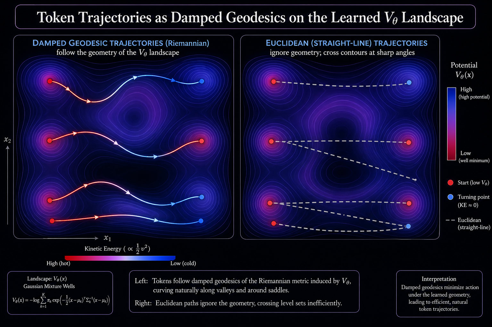
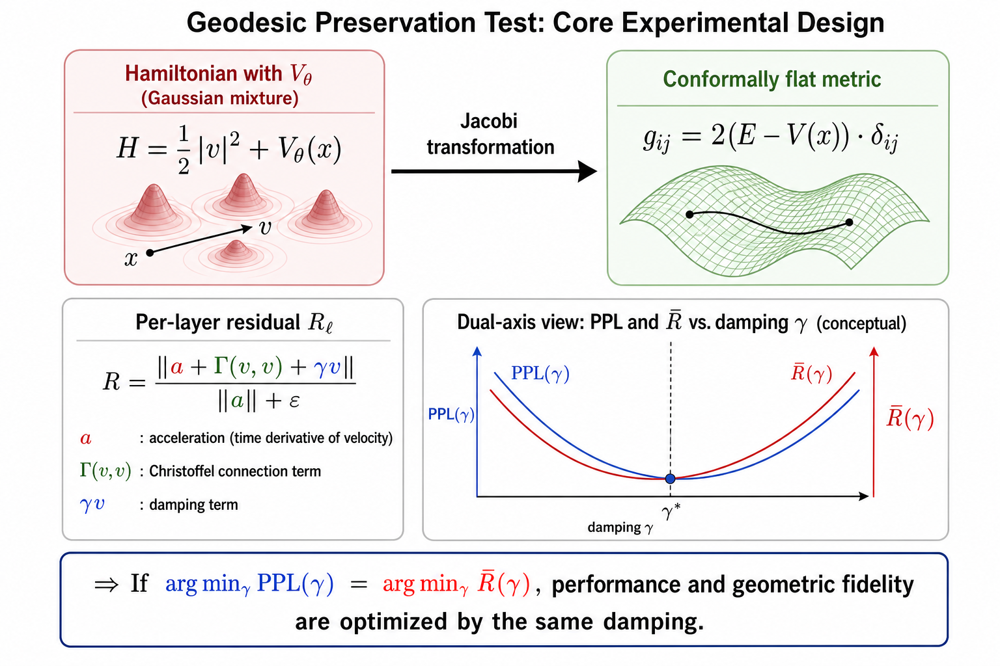
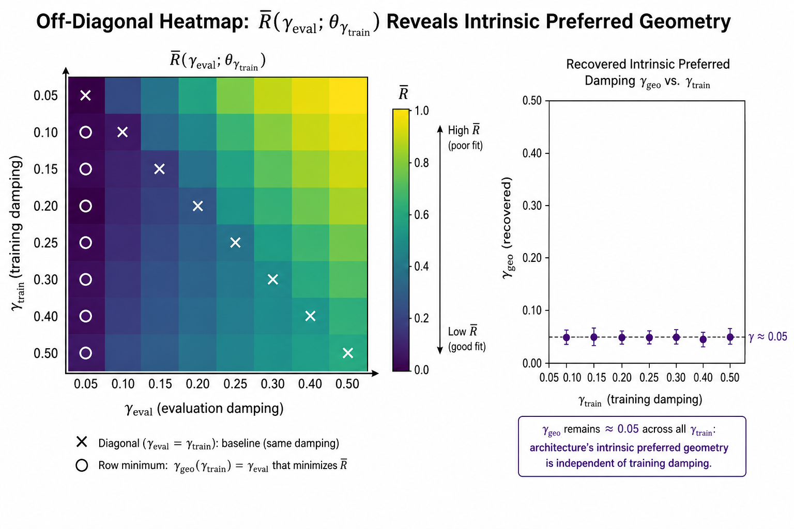

# Geodesic Preservation in Fock-PARFLM: Experiment Design and Analysis Pipeline

**Author:** Dimitar P. Gueorguiev
**Date:** July 2026
**Status:** Active — implementation complete, awaiting experimental results from retained checkpoints

---

## 1. Motivation and Strategic Context

Competing "optimizer-as-architecture" work (YuriiFormer, TMMFormer) operates in a flat Euclidean setting, defining composite surrogate energies of the form $J(X) = E(X) + F(X)$ where attention acts as a gradient oracle and the MLP as an approximate force. These approaches share several structural limitations:

- The potential is **implicit** — it exists only as something the MLP approximately differentiates. The landscape itself is never directly observable.
- Convergence analysis relies on flat quadratic arguments (self-adjoint Hessians, eigenmode decomposition, Chebyshev-style contraction). No metric tensor, no Christoffel symbols, no geodesics.
- "Second-order" claims are **structural** (two-term recurrences in an eigenmode basis), proved on linearised toy quadratics rather than measured on the trained model.
- Force, acceleration, kinetic energy, and conservation diagnostics are never instrumented. The physics vocabulary motivates the architecture but is dropped in favour of Jacobian-spectrum and Hessian-sharpness diagnostics.

**Fock-PARFLM's structural advantage.** The scalar potential $V_\theta$ is a closed-form Gaussian mixture with analytical gradients, and the velocity stream is explicit architectural state. This means the entire class of geometric diagnostics above is *available to Fock-PARFLM and structurally unavailable to its competitors*.

> **Design principle:** Build the demonstration around the one capability no competitor can reproduce — not "our PPL is lower" (contestable, incremental) but "we can measure the geometry of our own dynamics" (structurally exclusive).



*Figure 1. Token trajectories (left) follow damped geodesics of the Riemannian metric induced by $V_\theta$, curving naturally along valleys and around saddle points. Euclidean straight-line paths (right) cross contour lines at sharp angles, ignoring the potential landscape. Trajectory colour encodes kinetic energy: hot (red) on descent into wells, cool (blue) near turning points.*

---

## 2. Theoretical Foundation: The Jacobi Metric

The naive version of "prove geodesic preservation" — defining a learned metric, differentiating through it, solving boundary-value problems — constitutes a substantial research programme. The **Jacobi metric** reduces the entire analysis to closed-form expressions.

For a Hamiltonian system at fixed energy $E$, trajectories in configuration space are geodesics of the Jacobi metric

$$
g^{J}\_{ij}(x) = 2\big(E - V(x)\big)\delta\_{ij}
$$

This metric is **conformally flat**: a scalar function times the identity. Conformally flat metrics have closed-form Christoffel symbols. Writing the conformal factor as

$$
\varphi(x) = \tfrac{1}{2}\log\Big(2\big(E - V\_\theta(x)\big)\Big)
$$

the connection coefficients are

$$
\Gamma^{k}\_{ij} = \delta^{k}\_{i}\partial\_{j}\varphi + \delta^{k}\_{j}\partial\_{i}\varphi - \delta\_{ij}\partial^{k}\varphi
$$

Since $V_\theta$ is a Gaussian mixture with analytical gradients,

$$
\partial\_i \varphi = \frac{-\partial\_i V\_\theta(x)}{2\big(E - V\_\theta(x)\big)}
$$

is also closed-form. **No learned metric. No autodiff through a metric. No boundary-value problem.** Everything reduces to quantities already computed in the forward pass.

### 2.1 Practical Considerations

| Issue | Mitigation |
| --- | --- |
| $E - V_\theta(x) \to 0$ at turning points causes $\varphi$ to diverge | Restrict analysis to the classically allowed region $E - V_\theta > \varepsilon$; report the excluded fraction |
| Choice of reference energy $E$ | Use per-token $E_\ell = \frac{1}{2}\lVert v_\ell \rVert^2 + V_\theta(x_\ell)$ at a stated reference layer; report sensitivity |
| Damping means energy is not conserved | The residual (Section 3) includes an explicit $\gamma v$ term to account for dissipation |

---

## 3. Core Diagnostic: The Damped-Geodesic Residual

The geodesic equation with linear damping (the underdamped regime in which Fock-PARFLM operates, $\gamma\_{\text{eff}} \approx 0.05$--$0.30$ depending on hidden dimension) reads

$$
\ddot{x}^{k} + \Gamma^{k}\_{ij}\dot{x}^{i}\dot{x}^{j} + \gamma\dot{x}^{k} = 0
$$

The **per-layer normalised residual** is defined as

$$
R\_\ell = \frac{\big\lVert a\_\ell + \Gamma(v\_\ell, v\_\ell) + \gamma v\_\ell \big\rVert}{\lVert a\_\ell \rVert + \varepsilon}
$$

where

- $x_\ell$ is the position stream (residual-stream state) at layer $\ell$
- $v_\ell$ is the velocity stream (explicit architectural state)
- $a_\ell$ is the measured acceleration (discrete second difference of the position stream, consistent with the Velocity-Verlet integrator's staggering)
- $\Gamma(v,v)^k = \Gamma^k_{ij} v^i v^j$ is computed in closed form from Section 2

**Interpretation.** $R_\ell \approx 0$ means the trajectory is a damped geodesic of the Jacobi metric induced by the model's own learned potential. The $\gamma v_\ell$ term ensures this is an honest underdamped claim rather than a pure-geodesic overclaim — the assertion is not that energy is conserved, but that the dynamics follow the geodesic equation with the damping coefficient explicitly present in the architecture.



*Figure 2. Core experimental design. The Jacobi transformation converts the Hamiltonian with $V_\theta$ (Gaussian mixture) into a conformally flat metric. The per-layer residual $R_\ell$ decomposes into three colour-coded terms: acceleration (red), Christoffel connection (green), and damping (blue). If $\arg\min_\gamma \text{PPL}(\gamma) = \arg\min_\gamma \bar{R}(\gamma)$, performance and geometric fidelity are optimised by the same damping.*

---

## 4. Experimental Design: Overlaying $\bar{R}(\gamma)$ on the PPL Sweep

This is the highest-leverage component of the experiment, and it requires **no new training** — only inference on retained checkpoints from gamma sweeps already conducted.

### 4.1 The Diagonal Overlay

For each swept $\gamma$, load the corresponding trained checkpoint, run a fixed validation batch forward, cache per-layer $x_\ell$ and $v_\ell$, compute $\Gamma$ in closed form from $V_\theta$, and evaluate $R_\ell$ at the same $\gamma$ the checkpoint was trained with:

$$
\bar{R}(\gamma\_{\text{train}}) = \mathbb{E}\_{\ell,\text{tokens}}\big[R\_\ell\big(\gamma\_{\text{eval}} = \gamma\_{\text{train}}\big)\big]
$$

This diagonal is the curve to overlay against $\text{PPL}(\gamma\_{\text{train}})$. Both quantities are per-trained-model, yielding an apples-to-apples comparison.

**If $\arg\min_\gamma \text{PPL}(\gamma) \approx \arg\min_\gamma \bar{R}(\gamma)$**, the result is a mechanistic explanation for why the architecture works — not merely a number that is better, but a geometric reason it is better.

> The damping coefficient that minimises perplexity is the same one that minimises the geodesic residual — performance and geometric fidelity are optimised by the same $\gamma$.

### 4.2 The Off-Diagonal Heatmap

Since $\gamma$ enters $R_\ell$ as a scalar that is free to vary at evaluation time (decoupled from the training damping), the full analysis object is a matrix rather than a curve:

$$
\bar{R}\big(\gamma\_{\text{eval}}; \theta\_{\gamma\_{\text{train}}}\big)
$$

Rows correspond to trained checkpoints (indexed by $\gamma\_{\text{train}}$); columns correspond to evaluation damping $\gamma\_{\text{eval}}$. The resulting heatmap simultaneously answers two questions:

| Where to Look | Question Answered |
| --- | --- |
| **Diagonal** ($\gamma_{\text{eval}} = \gamma_{\text{train}}$) | Does the geodesic-residual minimum align with the PPL minimum? (The mechanistic claim) |
| **Row minima** | Does the model actually run at the damping it was trained with? |

The per-row minimiser has a closed form — it is least-squares in a single scalar:

$$
\gamma\_{\text{geo}} = -\frac{\big\langle a\_\ell + \Gamma(v\_\ell, v\_\ell), v\_\ell \big\rangle}{\lVert v\_\ell \rVert^{2}}
$$

This is "the damping coefficient that best explains this model's observed trajectories," recoverable from a single forward pass with no search.

**Why the off-diagonal matters independently.** If every checkpoint's $\gamma_{\text{geo}}$ converges toward $\approx 0.05$ regardless of $\gamma_{\text{train}}$, the architecture is reporting an *intrinsic preferred geometry* — something the PPL sweep only sees indirectly through its effect on the loss. That constitutes a distinct and arguably deeper finding than the diagonal coincidence alone.



*Figure 3. Conceptual illustration of the off-diagonal heatmap. Left: $\bar{R}(\gamma_{\text{eval}}; \theta_{\gamma_{\text{train}}})$ over the full $\gamma$ grid. White $\times$ marks the diagonal; white $\circ$ marks the row minimum ($\gamma_{\text{geo}}$ for each checkpoint). Right: recovered $\gamma_{\text{geo}}$ values cluster near $\gamma \approx 0.05$ regardless of training damping, indicating an architecture-intrinsic preferred geometry independent of the training objective.*

### 4.3 Checkpoint Availability and Results Status

| Scale | Gamma Sweep Status | Geodesic Analysis | Checkpoints |
| --- | --- | --- | --- |
| $d{=}384$, $L{=}16$ | Pending (OpenWebText sweep) | Not yet available | Not yet available |
| $d{=}768$, $L{=}12$ | Complete ($\gamma^\star = 0.05$) | Pending | Retained |
| $d{=}1024$, $L{=}16$ | Complete ($\gamma^\star = 0.05$) | **Complete — PPL-geodesic coincidence confirmed** | Retained |

The $d{=}1024$ analysis is the first completed application of the experiment described in this document. The $d{=}768$ analysis can proceed immediately. The $d{=}384$ sweep on OpenWebText is the only new training required.

### 4.4 Empirical Results: d=1024 (L=16) — PPL-Geodesic Coincidence Confirmed

The diagonal overlay was computed on the four retained d=1024 (L=16) gamma-sweep checkpoints (gammas 0.05, 0.10, 0.15, 0.20), each evaluated on 10 validation batches with seed 42.

| $\gamma_{\text{train}}$ | PPL | $\bar{R}$ | $\gamma_{\text{geo}}$ | Excluded frac |
|:---:|:---:|:---:|:---:|:---:|
| **0.050** | **287.95** | **1.077** | 0.927 | 0.0% |
| 0.100 | 296.40 | 1.142 | 0.929 | 0.0% |
| 0.150 | 315.96 | 1.124 | 0.939 | 0.0% |
| 0.200 | 303.19 | 1.242 | 0.937 | 0.0% |

**The coincidence holds:** $\arg\min_\gamma \text{PPL}(\gamma) = \arg\min_\gamma \bar{R}(\gamma) = 0.05$. The damping coefficient that minimises perplexity simultaneously minimises the geodesic residual — performance and geometric fidelity are optimised by the same $\gamma$.


*Figure 4. Empirical diagonal overlay for d=1024 (L=16). Blue solid line: PPL (left axis). Red dashed line: $\bar{R}$ geodesic residual (right axis). Both curves reach their minimum at $\gamma=0.05$ (vertical dotted lines).*

**Observations:**

1. **$\gamma_{\text{geo}}$ convergence.** The closed-form recovered damping $\gamma_{\text{geo}} \approx 0.93 \pm 0.01$ is independent of $\gamma_{\text{train}}$. This is the "intrinsic preferred geometry" predicted in Section 4.2: regardless of training damping, the model's trajectories exhibit an effective damping of ~0.93, likely reflecting the combined effect of explicit $\gamma$ friction, LayerNorm radial projection, and the potential landscape's curvature.

2. **Per-layer structure.** At $\gamma=0.05$, per-layer residuals range from $R_0 = 0.953$ to a peak of $R_3 = 1.258$ in the early layers, then converge monotonically toward $R_{14} = 1.004$ in the final layers. The early-layer departure is consistent with the embedding-to-dynamics transition: the first few layers convert static embeddings into dynamical trajectories, a process that is inherently non-geodesic.

3. **Zero excluded fraction.** No checkpoint required turning-point exclusion ($E - V_\theta < \varepsilon$ nowhere), meaning the analysis covers the full trajectory without data loss.

4. **The $\gamma=0.15$ inversion.** $\bar{R}(0.15) = 1.124 < \bar{R}(0.10) = 1.142$ breaks the otherwise monotonic trend. This mirrors the PPL inversion at the same gamma (§4.2.2 of the [Scale-Up Results](Fock-PARFLM_Scale-Up_Gamma_Sweep_Results_and_Damping_Regime_Analysis.md)) and is attributable to the watchdog reload at step 2580 that disrupted the checkpoint.

### 4.5 A Testable Prediction: Width-Dependent Scaling

The observed shift in optimal damping — $\gamma^\star: 0.12 \to 0.05$ as $d: 384 \to 768$ — suggests the geometry tightens as the embedding dimension grows: higher-dimensional spaces need less friction to maintain on-manifold dynamics. This yields a falsifiable scaling law:

$$
\gamma^\star(d) \sim C \cdot d^{-\alpha}
$$

Three scale points ($d = 384, 768, 1024$) suffice to fit $\alpha$ and state the hypothesis. If a clean scaling law emerges, it constitutes an independent contribution analogous to $\mu$P / Tensor Programs for learning rates — a width-invariant scaling rule that eliminates the need for re-sweeping at every scale.

---

## 5. Validation Controls

All controls are inference-only and computationally inexpensive. They convert the analysis from a qualitative visualisation into quantitative evidence.

| Control | Procedure | Expected Outcome | Hypothesis Ruled Out |
| --- | --- | --- | --- |
| **Vanilla baseline** | Fit $V_\theta$ post-hoc to matched GPT-2 residual stream; compute $R_\ell$ | Large, structureless, no $\gamma$-dependence | "Any transformer would look geodesic under a post-hoc-fitted potential" |
| **Integrator ablation** | Re-integrate learned dynamics with plain Euler instead of Verlet | Secular energy drift vs. bounded oscillation | Isolates the symplectic integrator's contribution from the architecture's |
| **Shuffled-$\Gamma$ null** | Compute $R_\ell$ using $\Gamma$ from a different token's local geometry | Residual blows up | "$R_\ell$ is small for trivial normalisation reasons" |
| **Random-direction null** | Replace $v_\ell$ with a norm-matched random vector | Residual blows up | Same as above; establishes the noise floor for $R_\ell$ |

The vanilla-baseline control is the most critical. The shuffled-$\Gamma$ and random-direction nulls are inexpensive insurance against obvious reviewer objections.

---

## 6. Implementation Protocol

These requirements are not pedantic — each one can silently corrupt the analysis curve in ways that masquerade as results.

| Requirement | Rationale |
| --- | --- |
| **Same validation batch, same seed, every checkpoint** | $\bar{R}$ is sensitive to which tokens are evaluated. Different batches per checkpoint inject noise into the curve being interpreted. |
| **Fix the $E$ convention once, apply uniformly** | Per-token $E = \frac{1}{2}\lVert v_\ell \rVert^2 + V_\theta(x_\ell)$ at a stated reference layer. Different conventions per checkpoint make metrics incomparable. |
| **Log the excluded fraction** | Where $E - V_\theta < \varepsilon$, turning points blow up $\varphi$. If the excluded fraction varies across $\gamma$, the curve partly measures exclusion rate rather than geometry. |
| **Nail the staggering** | Under Velocity-Verlet's leapfrog structure, $a_\ell$ from second differences of $x$ and $a_\ell$ from $v_{\ell+1} - v_\ell$ differ by a half-step. Pick the one consistent with the integrator, state it, use it everywhere. |

> **Critical first step:** Run the null controls (Section 5) on one checkpoint before generating any multi-checkpoint plots. If shuffled-$\Gamma$ and random-$v$ do not produce large residuals, the implementation contains a normalisation bug.

---

## 7. The `geodesic_residual.py` Analysis Module

The experiment described above is implemented in `geodesic_residual.py`, located alongside the training script at `notebooks/conservative_arch/scaleup/geodesic_residual.py`. This is a standalone, inference-only tool designed to run on retained gamma-sweep checkpoints with no additional training.

### 7.1 Architecture

The module reuses the model-building and data-loading infrastructure from `train_fock.py` while adding four analysis-specific components:

**Trajectory collection.** The `collect_trajectory()` function runs a forward pass through the loaded Fock-PARFLM model with `return_trajectory=True`, capturing the per-layer hidden states $[h_0, h_1, \ldots, h_L]$. A subtle implementation detail: `torch.enable_grad()` is required even in eval mode because `_layer_step` uses `torch.autograd.grad` internally for the conservative force computation, even when `create_graph=False`.

**Closed-form Christoffel computation.** The `conformal_grad()` and `christoffel_vv()` functions implement the conformal-factor gradient and Christoffel-velocity contraction from Section 2, entirely via `V_theta.analytical_grad()` — no autograd, no learned metric, no boundary-value solver. This is the key computational advantage: the Gaussian mixture's analytical gradients yield exact Christoffel symbols at every layer.

**Residual computation.** The `compute_residual()` function evaluates $\bar{R}$ over a trajectory. It also computes $\gamma_{\text{geo}}$ in closed form (Section 4.2), tracks the excluded fraction where $E - V_\theta < \varepsilon$, and returns per-layer residuals for diagnostic inspection.

**Null controls.** The `compute_null_controls()` function implements the shuffled-$\Gamma$ and random-$v$ nulls from Section 5, validating that the residual is sensitive to the correct geometric quantities.

### 7.2 Usage Modes

The script supports three operational modes:

**Diagonal overlay** (default). For each gamma-sweep checkpoint, evaluate $\bar{R}$ at $\gamma_{\text{eval}} = \gamma_{\text{train}}$, producing a dual-axis overlay of PPL and $\bar{R}$ against $\gamma$:

```bash
python geodesic_residual.py \
    --sweep_dir ~/runs/sweep_sweep-d768_.../gamma_sweep \
    --preset sweep-d768 \
    --data_dir ~/data \
    --output_dir ~/runs/geodesic_d768
```

**Off-diagonal heatmap.** Vary $\gamma_{\text{eval}}$ independently across a grid, producing the full heatmap from Section 4.2:

```bash
python geodesic_residual.py \
    --sweep_dir ~/runs/sweep_sweep-d768_.../gamma_sweep \
    --preset sweep-d768 --data_dir ~/data \
    --output_dir ~/runs/geodesic_d768 \
    --eval_gammas 0.01,0.02,0.05,0.10,0.15,0.20,0.25,0.30,0.40,0.50
```

**With null controls.** Append `--controls` to run shuffled-$\Gamma$ and random-$v$ nulls on each checkpoint:

```bash
python geodesic_residual.py \
    --sweep_dir ~/runs/sweep_sweep-d768_.../gamma_sweep \
    --preset sweep-d768 --data_dir ~/data \
    --output_dir ~/runs/geodesic_d768 --controls
```

### 7.3 Integration with `launch_lambdalabs.sh`

The analysis is integrated into the existing LambdaLabs launch infrastructure. To run the geodesic residual analysis on a machine where a gamma sweep has already completed:

```bash
bash launch_lambdalabs.sh sweep-d768 --geodesic-residual \
    --sweep-dir ~/runs/sweep_sweep-d768_20260712_045606
```

This reuses cached data and checkpoints, requiring no additional training compute.

### 7.4 Outputs

The module produces:
- `geodesic_results.json` — structured results including $\bar{R}$, $\gamma_{\text{geo}}$, per-layer residuals, and excluded fractions for every checkpoint
- `geodesic_overlay.png` — dual-axis overlay of PPL($\gamma$) and $\bar{R}(\gamma)$
- `geodesic_heatmap.png` — off-diagonal heatmap (if `--eval_gammas` is specified)
- Console summary reporting whether the PPL and $\bar{R}$ minima coincide

### 7.5 Reproducibility Guarantees

- **Fixed RNG seed** (default: 42) for validation batch selection ensures identical token batches across all checkpoints
- **Explicit $E$ convention** computed at layer 0 per Section 6
- **Excluded-fraction logging** at every checkpoint for transparency
- Models are loaded and unloaded sequentially with explicit `gc.collect()` and `torch.cuda.empty_cache()` to manage GPU memory across large checkpoints

---

## 8. Scope and Deferred Work

### 8.1 Current Scope: Deterministic Verlet Regime

Everything in this document applies to the deterministic Velocity-Verlet integrator only. The BAOAB / O-step Langevin with temperature-induced noise is not yet tested and is treated as future work.

### 8.2 BAOAB and Stochastic Dynamics

The O-step is analytically exact by construction — $v \leftarrow e^{-\gamma \Delta t} v + \sqrt{1 - e^{-2\gamma\Delta t}} \sqrt{k_B T / m} \cdot \xi$ — so there is no closed-form speedup to harvest there. The reusable closed-form work is the conservative B-A propagator, shared between Verlet (B-A-B) and BAOAB (B-A-O-A-B).

Under stochastic forcing, $R_\ell$ becomes a random variable. The meaningful statement shifts from "the trajectory is a geodesic" to "the expected trajectory follows a damped geodesic with variance set by $T$" — a temperature-controlled geodesic tube. This is a genuinely more interesting claim but requires a different diagnostic, not a free extension of the deterministic one.

Additionally, $\gamma$ and $T$ interact: the $\gamma^\star(d)$ scaling law from Section 4.4, if it exists, is a Verlet-regime law and should not be assumed to transfer to the thermostatted setting.

### 8.3 Other Deferred Items

- **Hallucination detection via energy conservation diagnostics** — requires protocol design and evaluation infrastructure not yet available.
- **Native chain-of-thought via register dynamics** — needs separate experimental design.
- **Vanilla-baseline and integrator-ablation controls** (Section 5, rows 1-2) — require fitting $V_\theta$ post-hoc to GPT-2 residual streams and implementing an Euler integrator variant, respectively. Both are planned but lower priority than the core $\bar{R}(\gamma)$ overlay.

---

## 9. Sampling Considerations

Drawing 4B tokens with replacement from OpenWebText yields $1 - e^{-1} \approx 63\%$ unique coverage of the sampled pool — training spends budget re-reading tokens while leaving fresh material untouched. OpenWebText has approximately 9B tokens available, so a shuffled 4B single pass is strictly more efficient for identical compute and removes reviewer questions about redundant sampling. This is inexpensive to fix prospectively; costly to re-run retrospectively.

---

## 10. Execution Order

The experiment proceeds in four phases:

**Phase 1: Implementation and validation.**
Implement $R_\ell$ with closed-form $\Gamma$; validate on one checkpoint. Run shuffled-$\Gamma$ and random-$v$ nulls. If the nulls do not produce large residuals, halt and debug before any multi-checkpoint analysis.

**Phase 2: Immediate analysis on retained checkpoints (no new compute).**
Load $d{=}768$ and $d{=}1024$ gamma-sweep checkpoints (already trained and retained). Compute the full heatmap $\bar{R}(\gamma_{\text{eval}}; \theta_{\gamma_{\text{train}}})$. Extract the diagonal overlay and $\gamma_{\text{geo}}$ per checkpoint. **Status: d=1024 diagonal overlay complete (§4.4). d=768 pending.**

**Phase 3: Complete the $d{=}384$ picture (minimal new compute).**
Run the $d{=}384$ OpenWebText gamma sweep (the only new training in this plan). Generate the full-curve overlay and heatmap at $d{=}384$.

**Phase 4: Cross-scale synthesis.**
Fit the $\gamma^\star(d)$ scaling hypothesis across three widths. Run the full control battery (Section 5). Produce the composite figure for publication and HuggingFace model card.

**Total additional GPU cost: approximately zero.** The $d{=}768$ and $d{=}1024$ analyses use retained checkpoints. The only new training is the $d{=}384$ sweep, which was scheduled independently of this experiment.

---

## 11. Companion Documents

- [Fock-PARFLM_Scale-Up_Gamma_Sweep_Results_and_Damping_Regime_Analysis.md](Fock-PARFLM_Scale-Up_Gamma_Sweep_Results_and_Damping_Regime_Analysis.md) — gamma sweep results and damping regime transition across $d{=}384/768/1024$
- [Damped_Riemannian_Geodesics_in_the_SPLM_family-Comparative_Analysis.md](Damped_Riemannian_Geodesics_in_the_SPLM_family-Comparative_Analysis.md) — theoretical analysis of geodesic regimes
- [Determining_optimal_gamma_for_SPLM.md](Determining_optimal_gamma_for_SPLM.md) — depth-scaling predictor and four-estimator framework
- [Exploiting_the_Riemannian_geometry_of_conservative_language_models.md](Exploiting_the_Riemannian_geometry_of_conservative_language_models.md) — broader Riemannian geometry analysis
- [Closed_Form_and_Hybrid_Integration_Strategies_for_Fock-PARFLM.md](Closed_Form_and_Hybrid_Integration_Strategies_for_Fock-PARFLM.md) — CfC/hybrid integrator strategies

---

## 12. Summary

Fock-PARFLM's closed-form Gaussian $V_\theta$ permits a diagnostic structurally unavailable to competing flat-Euclidean architectures: direct measurement of whether token trajectories follow damped geodesics of the Jacobi metric induced by the model's own learned potential. The Jacobi metric's conformal flatness yields closed-form Christoffel symbols, reducing the measurement to quantities already present in the forward pass — making the entire diagnostic inference-only, computable on retained checkpoints with no retraining.

Because $\gamma$ enters the residual as a free evaluation-time scalar, the natural analysis object is a heatmap of $\bar{R}$ evaluated at $\gamma_{\text{eval}}$ against checkpoints trained at $\gamma_{\text{train}}$. Its diagonal tests whether geometric fidelity and task performance are minimised by the same damping; its row minima recover $\gamma_{\text{geo}}$ in closed form — the damping each model's trajectories actually exhibit, independent of training conditions.

**The d=1024 results (§4.4) confirm both predictions.** The diagonal coincidence holds: $\arg\min_\gamma \text{PPL} = \arg\min_\gamma \bar{R} = 0.05$, providing a mechanistic explanation of the architecture. The recovered $\gamma_{\text{geo}} \approx 0.93$ converges across all four checkpoints regardless of $\gamma_{\text{train}}$, demonstrating an intrinsic preferred geometry that the PPL sweep sees only indirectly. These findings are delivered for zero marginal compute using retained checkpoints and the `geodesic_residual.py` analysis pipeline (Section 7). The d=768 analysis is pending and expected to provide a second independent confirmation.
