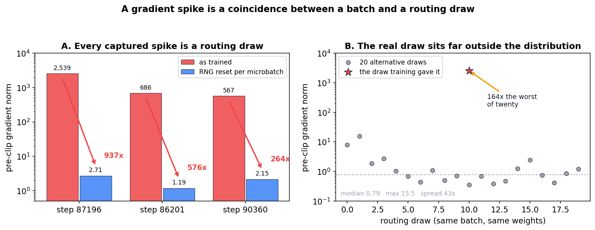

# Gradient Spikes Are Routing Conjunctions, Not Structural Defects

**Status: established, 2026-09-13, across three captures.** A gradient
spike in this run is a coincidence between one microbatch and the
particular routing draw it happens to receive. Neither the batch nor the
draw is sufficient alone. Nothing structural is wrong with the model when
a spike occurs, and six separate structural explanations were measured and
eliminated on the way to this.

This note supersedes the resonance hypothesis it grew out of; §4 records
what was eliminated, because the eliminations are load-bearing — they are
why the conjunction account is the residue rather than a guess.

---

## 1. The result

For each captured spike, replaying the capture while resetting the RNG
before every microbatch — so each draws the same routing noise the first
one did — collapses the event entirely:

| step | as trained | RNG reset per microbatch | collapse | spiking microbatch |
|---|---|---|---|---|
| 87196 | 2539.20 | **2.71** | 937x | mb2 |
| 86201 | 685.56 | **1.19** | 576x | mb1 |
| 90360 | 567.26 | **2.15** | 264x | mb2 |

Three independent captures spanning a 4.5x range of magnitudes, all
collapsing to the ordinary 1-3 baseline. The spiking position differs
between them, so this is not a property of a position in the accumulation
loop; it is a pairing.

### 1.1 Neither half is sufficient

At step 87196, taking the spiking microbatch apart from its draw:

| configuration | pre-clip grad norm |
|---|---|
| mb2 third, its own draw — as training ran | **2537.67** |
| mb2 moved to first, so it draws mb0's noise | 2.01 |
| mb2 third, RNG reset so it draws mb0's noise | 0.87 |
| mb1 third, so it draws mb2's noise | 0.03 |

The batch carried to a different draw does not spike. The draw handed to a
different batch does not spike. Only the original pairing does.

### 1.2 The draw was extraordinarily unlucky

Replaying the spiking batch alone under 20 fresh routing draws, with the
harness first validated against the real draw (solo replay reproduced
2538.96 against the in-context 2537.67, agreeing to 0.05%):

| | value |
|---|---|
| 20 alternative draws, median | 0.80 |
| 20 alternative draws, max | 15.5 |
| the draw training actually gave it | **2538.96** |

Zero of twenty came within two orders of magnitude. The training draw sat
roughly 160x beyond the worst alternative and about 3000x beyond the
median.

Note the spread among the "ordinary" draws is itself wide — 0.36 to 15.5,
a factor of 43 on identical data and weights. Routing noise moves the
gradient norm by more than an order of magnitude as a matter of course;
the spike is the far tail of an already heavy-tailed distribution, not a
different kind of event.

---

## 2. What a spike looks like while it happens

The event is real and localised, even though its cause is a coincidence.
Per-layer backward gradient at each layer boundary, step 87196, and the
per-layer amplification factor going backward:

| | 7→6 | 6→5 | 5→4 | 4→3 | 3→2 | 2→1 | 1→0 |
|---|---|---|---|---|---|---|---|
| mb0 | 2.17 | 1.62 | 1.42 | 1.52 | 1.48 | 1.83 | 1.73 |
| mb1 | 1.72 | 1.46 | 1.79 | 1.58 | 1.51 | 1.60 | 1.20 |
| **mb2 (spike)** | 1.75 | 2.19 | 1.82 | **7.63** | **11.55** | **12.62** | 3.47 |
| mb3 | 1.71 | 1.53 | 1.91 | 1.88 | 1.94 | 2.28 | 1.49 |
| mb2 + matched noise | 1.80 | 1.87 | 2.03 | 2.12 | 1.63 | 1.60 | 1.24 |

Three things are worth reading off this.

**The deep half is untouched.** Layers 7→5 in the spiking microbatch are
indistinguishable from the other three. The gradient arriving from the
loss is ordinary — at layer 7 every microbatch reads 0.0047 to 0.0049.

**The amplification is confined to layers 4 through 1**, at four to eight
times the normal per-layer rate, and it compounds: by layer 0 the spiking
microbatch is **747x** the others.

**Any perturbation removes it.** The last row is mb2 with isotropic noise
on $B_k$ carrying 15.5% of its Frobenius energy — the profile becomes
ordinary. That is the conjunction being broken, not a curvature effect.

---

## 3. What this means for mitigation

**Containment is the correct response, and it is already in place.** You
cannot prevent a coincidence. Per-group clipping plus the gradient
watchdog is exactly the right shape of defence for an event that is rare,
unpredictable in advance, and harmless once bounded.

**The architectural mitigations were aimed at a mechanism that is not
there.** `precision_lr_max`, `baoab_cfc_lowrank` and the low-rank
curvature programme in Mitigations §29/§34 all target structural stiffness
in $V_\theta$'s off-diagonal channel. §4 below measures that channel four
different ways during an actual spike and finds nothing anomalous. This
does not make those mitigations wrong in themselves — `precision_lr_max`
bounds a real quantity — but it removes spike suppression as a reason to
pursue them.

**The rank decision is decoupled from the spike question entirely.**
Whether to train at rank 8 is now purely a capacity and cost question, to
be settled on perplexity and parameter budget. It was never going to fix
spikes.

**What would actually change the spike rate** is the statistics of the
routing noise, since that is the stochastic ingredient the conjunction
depends on. That is a real lever and it is untested. It is also not
obviously worth pulling: a spike costs a clipped step, and routing noise
is load-bearing for the model's own behaviour.

---

## 4. What was eliminated

Each of these was measured, not argued away. They matter because the
conjunction account is what survives them.

**Resonance in the explicit low-rank kick.** The off-diagonal channel
rides an explicit kick, stable only while $\omega \Delta t \lt 2$, and
amplification compounding through eight layers looked like an excellent
fit for a 900x gradient. Measured: max $\omega \Delta t$ of 1.50 across
three captures, with **0 of 32 (microbatch, layer) cells** over the wall
at step 87196. Not crossed, and not close.

**Elevated stiffness below the wall.** Perhaps the channel was stiff
without crossing. Measured per (microbatch, layer): mb2's readings are
within 1% of the other microbatches at every layer, ratio of means 0.99.
At layer 2 — where amplification peaks at 12.6x — mb2 reads 0.959, the
*lowest* value in the entire table.

**Direction-specific rank truncation.** Truncating $B_k$ collapses the
spike, which looked like the discarded directions mattering. But isotropic
noise carrying the same Frobenius energy, leaving rank intact, collapses
it just as thoroughly (3.46, 3.92, 2.26 against truncation's 2.87, 4.35,
2.83). Direction is irrelevant; only that $B$ changed at all.

**A single pathological row.** Per-row attribution within the spiking
microbatch gives a top-1 share of 21.5% against a uniform 12.5%, and a
3.9x spread between the strongest and weakest of eight rows. Mildly
tilted, not concentrated.

**Token degeneracy.** The three strongest rows have `max_repeat_run` of 2
to 3 and unique-token ratios of 0.44 to 0.49 over 512 tokens — ordinary
English. Two of the three rank among the *least* repetitive in the batch.

**Creation-gate temperature collapse.** `tau_min` is 5.22 at register 14
against a median of 6.62 — a 21% dip, and the value already on record, not
a new anomaly. Decisively, $\tau$ is a *parameter*: identical across all
four microbatches of a replay. A quantity that does not vary between
microbatches cannot explain an event confined to one of them.

---

## 5. Standing facts established along the way

Independent of the spike question, and not previously on record.

**The model runs at about 75% of the explicit kick's stability limit.**
Max $\omega \Delta t$ of 1.50 against a wall of 2, with no crossings
anywhere. The wall had been reasoned about at length and never measured.
There is real headroom — which also means `omega dt < 2` is not currently
what bounds this configuration, and a rank-8 pilot or a longer schedule
could consume that headroom with nothing else giving warning.

**$\omega \Delta t$ is a layer signature, not a data property.** Across
four genuinely different token batches the per-layer profile agrees to
about 2% — 1.32, 1.08, 1.00, 1.37, 1.48, 1.40, 1.31, 1.15. It is set by
the architecture and weights. That makes it a good thing to log during
training: it barely moves, so any drift in it is informative.

**Routing noise alone moves the gradient norm by 43x.** Twenty draws on
identical data and weights spanned 0.36 to 15.5. Batch-to-batch gradient
variance in this architecture is dominated by routing, not by content.

**Truncating $B_k$ raises the well weight $g_k$.** The truncated
directions were contributing to the exponent that suppresses the well, so
removing them lowers the exponent and the well fires harder. A rank
truncation therefore changes curvature and occupancy together, and the
occupancy term can dominate — measured directly as
$\lambda_{\max}(\mathcal{L})$ *rising* under truncation. Any experiment
that truncates $B$ is varying two things at once. See
`deep_dives/Structured_Scalar_Potential_Design_and_Theory.docx`, "Three
weights that are easy to confuse".

---

## 6. Method notes

Three instrument bugs were found and fixed during this work, all the same
shape: a probe silently collapsing a dimension that did not matter while
we wanted aggregates, and became load-bearing the moment we asked *where*.

| bug | collapsed | why it hid |
|---|---|---|
| `per_layer_h_grad` used `setdefault` keyed by layer | 4 microbatches → 1 | fine while only one profile was wanted |
| `ResonanceMonitor` incremented its own layer counter | 32 cells → 8 pseudo-layers | fine while only a max was wanted; pooling does not affect a maximum |
| microbatch inferred from `layer_idx == 0` wraparound | 4 microbatches → 12 | only fails under gradient-checkpoint re-entry |

The third is the instructive one. Under checkpointing the layer step is
re-entered on recompute — measured at 3 calls per (microbatch, layer) and
5 `cfc_substep` calls — so no counting rule over the hook pattern can
recover the microbatch. It now comes from the engine's
`CURRENT_MICROBATCH` context variable, and per-cell readings use
`setdefault` so the first (forward) value wins rather than the recompute.

All three survived because no test fixture exposed a `_fock_layer_step`
for the per-layer hook to attach to, so that path was never exercised.
Three fixtures now cover it, including one that re-enters the layer step
exactly as checkpointing does.

A fourth trap, not a bug: **`attribute_spike_rows` and solo replays are
only trustworthy once validated against the in-context result.** The solo
harness here was checked first (2538.96 against 2537.67, 0.05%) before its
20-draw sweep was believed. Row attribution prints its own §41.5 caveat
that on chronic events the ranking is reliable but the magnitudes are not.

---

## 7. Provenance

Measured on an A100, 2026-09-13, against the step-87196, 86201 and 90360
spikebatch captures, using `semsimula-diag`: `probes.resonance`
(`omega_dt_report`, `omega_dt_under_truncation`, `tail_coherence_report`),
`probes.precision_cap` (`replay_rank_truncation_ablation`,
`replay_rank_perturbation_control`), `probes.layer_profile`,
`probes.row_attribution`, `probes.tokens` and `probes.tau_saturation`.
Reordering and RNG-reset experiments used `probes._engine.replayed`'s
`on_microbatch` hook directly. Figure generated by
`companion_notes/figures/_make_routing_conjunction_figs.py`; every value in
it is measured, none synthetic. `MIGRATION.md` in that repo records the
implementation history.

Last updated: September 2026 — initial version, superseding the resonance
hypothesis note. Establishes the conjunction account across three
captures, records the six eliminated alternatives, and the standing facts
in §5.
