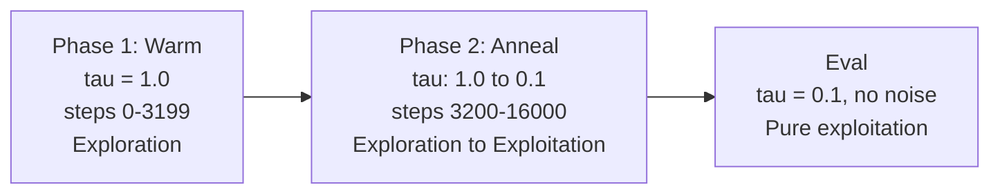
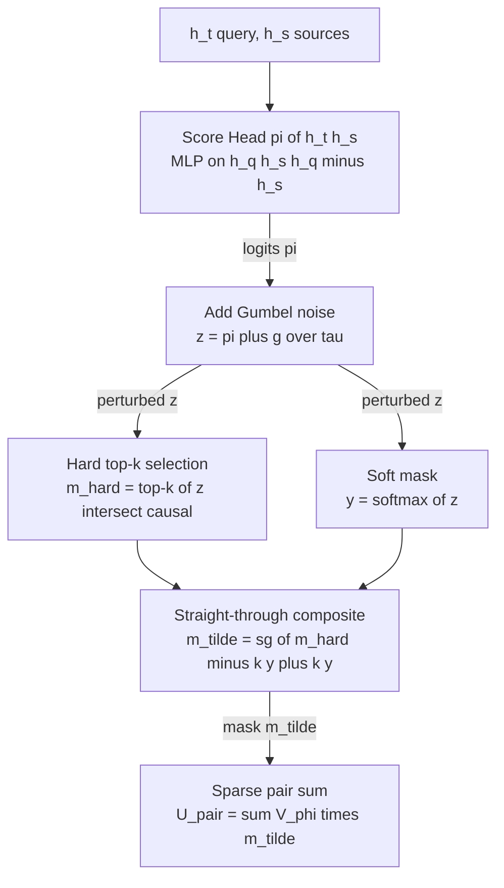
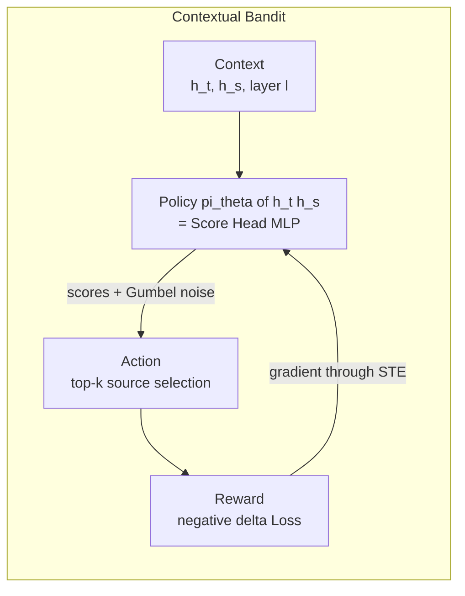
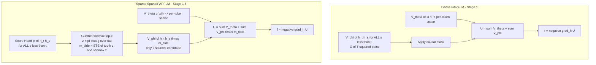

# Gumbel-Softmax Sparsity for the PARF Pair Potential

## Overview

This document describes the **Stage 1.5 Gumbel-softmax sparsity method** applied to the pair-interaction potential $V_\phi$ in the PARF-augmented SPLM (SparsePARFLM). The method solves a fundamental problem: the dense pair sum $\sum_{s \lt t} V_\phi(h_t, h_s)$ aggregates $O(T^2)$ pair contributions per layer, most of which are uninformative or destructively interfering. The quantile cutoff hypothesis predicts that only a few high-affinity pairs carry the useful signal. This method implements that cutoff as a differentiable top-$k$ selection with principled exploration.

**Implementation:** `notebooks/conservative_arch/parf/model_parf_sparse.py`
**Design doc:** `docs/parf/On_Gumbel_softmax_sparsity_applied_to_V_phi.md`
**Key result:** Stage 1.5 at $k = 4$ closed the gap from dense PARFLM (207 PPL) to the SPLM em_ln baseline (173.59 PPL), reaching 176.65 PPL — a $-30.93$ PPL improvement at ~1.6% of the dense pair compute.

---

## 1. The Problem: Dense Aggregation Destroys Signal

In the dense PARFLM (Stage 1), the per-token effective potential at layer $\ell$ is:

$$U_t^{(\ell)} = V_\theta(\xi_t, h_t) + \sum_{s \lt t} V_\phi(h_t, h_s)$$

The pair sum runs over all causal sources $s \in \lbrace 0, 1, \ldots, t-1 \rbrace$. At sequence length $T = 512$ and layer count $L = 8$, this is ~131,000 pair evaluations per layer. The diagnostic findings (P6, `diagnose_v_phi_channels.py`) revealed two failure modes in the dense regime:

1. **Type-gate saturation (F1):** The Gaussian type-matcher $\Phi_\phi$ saturates near 1 for most pairs — nearly every source contributes equally, regardless of semantic relevance.
2. **Destructive interference (F4):** The signed pair values $V_\phi(h_t, h_s) \in \mathbb{R}$ cancel when summed over many sources, washing out the directional pair force.

The quantile cutoff predicts that only the top few pairs (by affinity) carry the signal. The rest are noise. Sparsifying the sum to retain only the top-$k$ sources per query is the framework-native fix.

---

## 2. The Gumbel-Max Trick: Sampling as Optimisation

The core mathematical tool is the **Gumbel-max trick** (Gumbel 1954, Maddison et al. 2014):

**Theorem (Gumbel-max).** Let $\pi_1, \ldots, \pi_n$ be real-valued logits and $g_1, \ldots, g_n$ be i.i.d. draws from $\text{Gumbel}(0, 1)$. Then

$$\arg\max_i (\pi_i + g_i) \sim \text{Categorical}\left(\frac{e^{\pi_i}}{\sum_j e^{\pi_j}}\right)$$

That is, adding i.i.d. Gumbel noise to logits and taking the argmax is equivalent to **sampling** from the softmax distribution defined by those logits. No explicit normalisation is needed — the noise does the work.

For top-$k$ selection (rather than top-1), the extension is: the $k$ indices with the largest perturbed scores $\pi_i + g_i$ form a **sample without replacement** from the softmax distribution. Sources with higher scores are more likely to be selected, but every source has a nonzero chance.

The Gumbel(0, 1) distribution is sampled via the inverse-CDF transform:

$$g = -\log(-\log(u)), \quad u \sim \text{Uniform}(0, 1)$$

In the implementation:

```python
u = torch.rand_like(pi).clamp_min_(1e-9)
g = -torch.log(-torch.log(u))
z = (pi + g) / tau
```

---

## 3. Temperature-Controlled Exploration

The temperature parameter $\tau \gt 0$ scales the perturbed scores before selection:

$$z_i = \frac{\pi_i + g_i}{\tau}$$

This controls the **exploration-exploitation balance**:

- **High** $\tau$ **(e.g. 1.0):** The Gumbel noise $g_i$ is comparable in magnitude to $\pi_i / \tau$, so the top-$k$ selection is stochastic — exploration dominates.
- **Low** $\tau$ **(e.g. 0.1):** The scores $\pi_i / \tau$ are amplified by 10x while the noise stays $O(1)$, so the selection is nearly deterministic — exploitation dominates.
- $\tau \to 0$: The selection converges to the hard top-$k$ of the raw scores $\pi_i$, with zero exploration.

### The anneal schedule

Training uses a two-phase schedule. Let $w = (1 - \alpha) \cdot \text{total steps}$ be the warm-up boundary and $\alpha$ the anneal fraction (default 0.8):

- If $\text{step} \lt w$: $\tau(\text{step}) = \tau\_{\text{init}}$
- If $\text{step} \ge w$: $\tau(\text{step}) = \tau\_{\text{init}} + (\tau\_{\text{min}} - \tau\_{\text{init}}) \cdot \frac{\text{step} - w}{\text{total} - w}$

With the P10 settings ($\tau\_{\text{init}} = 1.0$, $\tau\_{\text{min}} = 0.1$, total = 16,000, $\alpha = 0.8$):

- **Steps 0-3199** (warm phase, 20%): $\tau = 1.0$ — pure exploration. The score head sees diverse source combinations and builds an initial ranking model.
- **Steps 3200-16000** (anneal phase, 80%): $\tau$ drops linearly from 1.0 to 0.1 — the score head progressively commits to its learned rankings.



---

## 4. The Straight-Through Estimator (STE)

The top-$k$ operation is not differentiable (it is a discrete selection). The **straight-through estimator** (Bengio et al. 2013) resolves this by using different functions in the forward and backward passes.

### Forward pass: hard mask

$$m\_{\text{hard}}[t, s] = \begin{cases} 1 & \text{if } s \in \text{top-k of } z\_{t,:} \text{ and } s \lt t \\ 0 & \text{otherwise} \end{cases}$$

This is a binary 0/1 mask. Exactly $k$ (or fewer, at small $t$) sources are selected per query.

### Backward pass: soft mask

$$y[t, s] = \text{softmax}\_s\left(\frac{\pi\_{t,s} + g\_{t,s}}{\tau}\right) \quad \text{for } s \lt t$$

This is a smooth, differentiable function of the score logits $\pi$. Gradients flow through $y$ to update the score head's parameters.

### Composite straight-through mask

The two are stitched together via the standard STE formula:

$$\tilde{m} = \underbrace{(m\_{\text{hard}} - k \cdot y)}\_{\text{detached (no grad)}} + \underbrace{k \cdot y}\_{\text{has grad}}$$

**In the forward pass:** $\tilde{m} = m\_{\text{hard}}$ (the detached term contributes its value, $k \cdot y$ cancels).

**In the backward pass:** $\nabla_\pi \tilde{m} = k \cdot \nabla_\pi y$ (the detached term is invisible to autograd).

The factor $k$ rescales the soft mask so that $\sum_s \tilde{m}[t, s] \approx k$ in both forward and backward, preserving the magnitude of the pair sum across the sparsity boundary.

### Data flow



---

## 5. The Contextual Bandit Interpretation

The Gumbel-softmax sparsity method has a precise correspondence to the **contextual multi-armed bandit** problem from reinforcement learning.

### 5.1. The multi-armed bandit analogy

In the classical multi-armed bandit (Robbins 1952), an agent repeatedly chooses from $K$ arms, observes a stochastic reward, and must balance exploration (trying unknown arms) against exploitation (pulling the best-known arm).

| Multi-armed bandit | PARF score head |
|---|---|
| $K$ arms | $T - 1$ causal source positions |
| Pull arm $i$ | Include source $s$ in the top-$k$ mask |
| Reward from arm $i$ | Loss reduction from $V_\phi(h_t, h_s)$ entering the pair sum |
| Epsilon-greedy exploration | Gumbel noise perturbation $g \sim \text{Gumbel}(0,1)$ |
| Exploit (pick best arm) | Deterministic top-$k$ at low $\tau$ |
| Regret (cost of exploring) | Wasted pair-force compute on uninformative sources |

The exploration mechanism in our setting corresponds to **Boltzmann (softmax) exploration** with the Gumbel trick as the sampling mechanism. At temperature $\tau$, the probability that source $s$ is included in the top-$k$ is proportional to $\exp(\pi(h_t, h_s) / \tau)$.

### 5.2. Why it is a contextual bandit, not a stationary one

The classical bandit assumes stationary reward distributions — each arm has a fixed expected reward. The PARF routing problem is fundamentally **non-stationary** and **context-dependent**:

1. **Context varies per query position.** The optimal set of $k$ sources for token $t$ at layer $\ell$ depends on the current hidden state $h_t^{(\ell)}$, which is different at every position and every layer.

2. **Context varies across training.** As the model trains, the hidden states $h_t$ and $h_s$ evolve, so the reward landscape shifts continuously. A source that was uninformative at step 100 may become critical at step 5000.

3. **The policy must generalise.** The score head $\pi(h_t, h_s)$ is a learned function (an MLP), not a lookup table. It must learn a routing policy that generalises across unseen (position, layer, sentence) triples — a function approximation problem that stationary bandits do not face.

This makes the setting a **contextual bandit** (Langford and Zhang 2007, Agarwal et al. 2014):

- **Context** $x = (h_t^{(\ell)}, h_s^{(\ell)}, \ell)$
- **Action** $a$ = top-$k$ source selection
- **Reward** $r = -\Delta\mathcal{L}$

The score head plays the role of the **policy** $\pi_\theta(a \mid x)$, and the Gumbel noise implements **Thompson-sampling-like exploration** (Thompson 1933) through the policy's action distribution.



### 5.3. The tau anneal as a decaying exploration rate

The connection to bandit exploration strategies is explicit:

| Bandit strategy | PARF analogue | Mechanism |
|---|---|---|
| Epsilon-greedy with epsilon going to 0 | tau anneal with tau going to tau_min | Probability of random selection decreases over time |
| Boltzmann exploration with T going to 0 | Gumbel-softmax with tau going to 0 | Sharpening the selection distribution |
| UCB (upper confidence bound) | not used | Would require per-pair uncertainty estimates |
| Thompson sampling | Gumbel-max trick | Sampling from the posterior is replaced by sampling from the score distribution |

The two-phase schedule maps directly:

- **Warm phase** ($\tau = 1.0$): Analogous to the **pure exploration** phase in phased bandits (Even-Dar et al. 2006) — the agent uniformly explores all arms to build initial reward estimates. In our setting, the score head sees random routing patterns and learns which source features correlate with loss reduction.

- **Anneal phase** ($\tau$: 1.0 to 0.1): Analogous to a **decaying exploration rate** — the agent increasingly exploits its learned policy while maintaining diminishing exploration. The annealing rate (linear over 80% of training) is an engineering choice; theoretical bandit algorithms prescribe $\varepsilon \propto 1/\sqrt{t}$ for optimal regret, but the linear schedule is simpler and has proven sufficient empirically.

- **Eval (no noise):** Pure exploitation. The bandit analogue is the **deployment policy** — after training, the agent commits to its best-known strategy with no further exploration.

### 5.4. Regret in the PARF setting

In the bandit framework, **regret** is the cumulative difference between the optimal arm's reward and the chosen arm's reward. In the PARF setting, regret takes the form:

$$\text{Regret}(\text{step}) = \sum_{\ell=1}^{L} \sum_{t=1}^{T} \left[ \mathcal{L}(\text{selected top-k}) - \mathcal{L}(\text{oracle top-k}) \right]$$

where $\mathcal{L}(\text{oracle top-k})$ is the loss under the optimal (unknown) source selection. Early in training, regret is high because the score head routes to random sources. As $\tau$ anneals and the score head improves, regret decreases. The anneal schedule trades off:

- **Too fast** ($\alpha$ small, short anneal): the score head commits before it has explored enough — high asymptotic regret (locked into suboptimal routing).
- **Too slow** ($\alpha$ large, long anneal): excessive exploration wastes training steps on known-bad sources — high cumulative regret.

The default $\alpha = 0.8$ (80% of training is anneal) was tuned empirically on the P5 Shakespeare-scale experiments, where $k = 4$ at this schedule produced the best val PPL.

---

## 6. Comparison: Dense vs Sparse PARF Forward Pass



---

## 7. Empirical Validation

### 7.1. Shakespeare-scale sparsity ladder (d=128, T=128, 4000 steps)

| $k$ | Val PPL | Train-loss floor | Final $\gamma$ | Final $\tau$ |
|---:|---:|---:|---:|---:|
| **4** | **176.65** | 4.34 | 0.134 | 0.100 |
| 8 | 218.73 | 4.37 | 0.134 | 0.100 |
| 16 | 205.25 | 4.41 | 0.085 | 0.100 |
| 32 | NaN | NaN | NaN | NaN |

**Reading:** The PPL ordering $k = 4 \lt k = 16 \lt k = 8$ is non-monotone. The score head's ability to learn good top-$k$ rankings degrades with $k$ (Gumbel signal dilution), and the integrator compensates by adjusting $\gamma$. At $k = 16$, $\gamma$ collapses to 0.085 (the suppressed-dissipation basin), while at $k = 4$ it stays at 0.134 (closer to the SPLM resonance anchor $\gamma^* \approx 0.166$).

### 7.2. TinyStories-scale P10 ladder (d=256, T=512, 16k steps)

| Cell | $k$ | Best val PPL | Final $\gamma$ |
|---|---:|---:|---:|
| P10g | 4 | 26.42 | ~0.134 |
| P10i | 8 | (in progress) | rising toward 0.15 |
| P10j | 16 | (in progress) | — |

### 7.3. The breakthrough: from dense failure to sparse success

| Configuration | Val PPL | Delta vs SPLM em_ln (173.59) |
|---|---:|---:|
| Dense PARFLM (P1, structural $V_\phi$) | 210.54 | +36.95 |
| Dense PARFLM (P1.6, wider $V_\phi$) | 207.58 | +33.99 |
| **Sparse PARFLM (P5, k=4)** | **176.65** | **+3.06** |

Sparsity closed 91% of the dense-PARF-to-SPLM gap at 1.6% of the dense pair compute.

---

## 8. Why Gumbel and Not Other Noise?

The choice of Gumbel(0, 1) noise is not arbitrary. Consider alternatives:

| Noise distribution | Top-$k$ semantics | Gradient property |
|---|---|---|
| **Gumbel(0, 1)** | Samples from softmax of $\pi$ | Exact match to softmax backward |
| Gaussian $\mathcal{N}(0, \sigma^2)$ | Biased toward high $\pi$ but not exactly softmax | Mismatch between forward sampling and backward gradient |
| Uniform $\mathcal{U}(-a, a)$ | Perturbs scores uniformly — heavy-tailed logits dominate regardless of noise scale | Poor exploration of the middle-ranked arms |
| No noise | Deterministic top-$k$ — zero exploration | Score head overfits to initial random ranking |

The Gumbel distribution is the **unique** choice where the argmax-with-noise trick samples from the softmax distribution. This means the soft mask $y = \text{softmax}(z)$ used in the backward pass is the **exact probability distribution** from which the hard mask $m\_{\text{hard}}$ was sampled in the forward pass. The straight-through estimator is therefore minimally biased — it computes gradients through the distribution that actually generated the selection.

---

## 9. The k=32 NaN Failure: Excessive Exploration Budget

The $k = 32$ cell at Shakespeare scale diverged to NaN at step 50. The hypothesised cause illustrates the regret trade-off:

At $\tau = 1.0$ with $k = 32$, the backward term $k \cdot y$ in the STE scales the soft mask by 32. The effective gradient on the score head's logits is ~32x larger than at $k = 4$. Combined with the $V_\phi$ output entering multiplicatively, this produces a gradient overshoot in the first few backprop steps that pushes the parameters of $V_\phi$ into a regime where the Plummer-softened $1/r$ factor produces inf/NaN.

This is the bandit analogue of **catastrophic over-exploration**: when the exploration budget is too large relative to the reward signal, the agent takes such poor actions that it destroys the environment (here, the numerical stability of the autograd graph).

---

## References

- Gumbel, E. J. (1954). Statistical Theory of Extreme Values and Some Practical Applications.
- Maddison, C. J., Mnih, A., and Teh, Y. W. (2017). The Concrete Distribution: A Continuous Relaxation of Discrete Random Variables. ICLR.
- Jang, E., Gu, S., and Poole, B. (2017). Categorical Reparameterization with Gumbel-Softmax. ICLR.
- Bengio, Y., Leonard, N., and Courville, A. (2013). Estimating or Propagating Gradients Through Stochastic Neurons for Conditional Computation. arXiv:1308.3432.
- Thompson, W. R. (1933). On the Likelihood that One Unknown Probability Exceeds Another in View of the Evidence of Two Samples. Biometrika.
- Robbins, H. (1952). Some Aspects of the Sequential Design of Experiments. Bulletin of the AMS.
- Langford, J. and Zhang, T. (2007). The Epoch-Greedy Algorithm for Contextual Multi-armed Bandits. NIPS.
- Agarwal, A., Hsu, D., Kale, S., Langford, J., Li, L., and Schapire, R. E. (2014). Taming the Monster: A Fast and Simple Algorithm for Contextual Bandits. ICML.
- Even-Dar, E., Mannor, S., and Mansour, Y. (2006). Action Elimination and Stopping Conditions for the Multi-Armed Bandit and Reinforcement Learning Problems. JMLR.
- Paper v4, section 5.2: Quantile cutoff hypothesis (the theoretical basis for sparse routing).
- Paper v4, section 17: PARF-augmented SPLM experiments (P1 through P10 ladder).
- `docs/parf/On_Gumbel_softmax_sparsity_applied_to_V_phi.md`: Full Stage 1.5 design document.
- `notebooks/conservative_arch/parf/model_parf_sparse.py`: Implementation.

---

*Last updated: 15 May 2026. P10i (k=8) and P10j (k=16) TinyStories runs in progress; early P10i trajectory tracks close to P10g (k=4), contradicting the large degradation seen at Shakespeare scale.*
