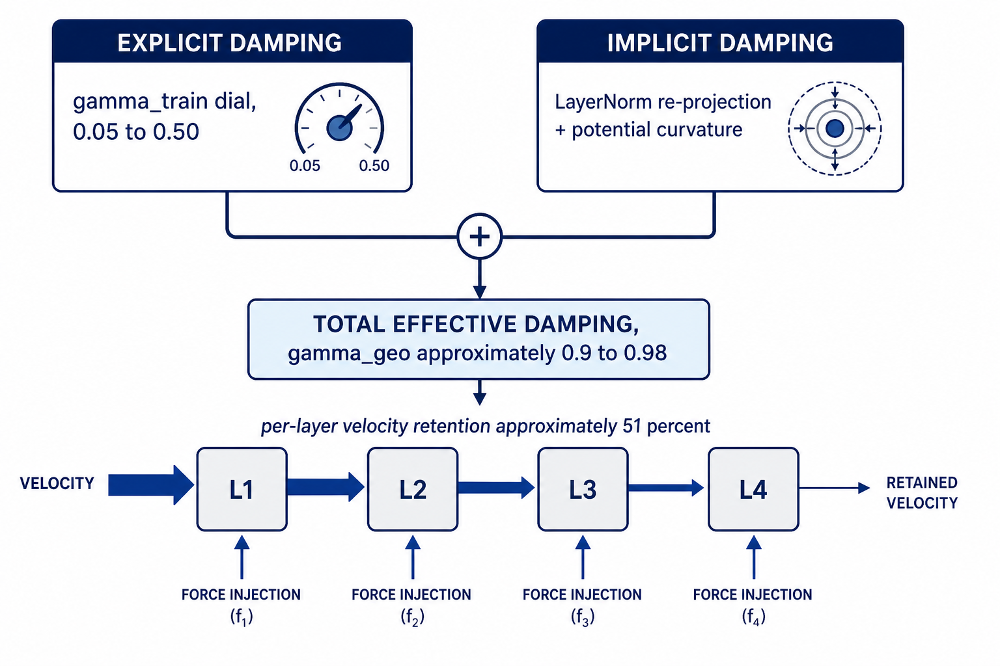

# Implicit vs. Explicit Damping, and the First-Order vs Second-Order Dynamics Hypothesis

> **Status.** Drafted **August 9, 2026**, by Dimitar Gueorguiev with Claude. Synthesises the cross-scale Fock-PARFLM gamma-sweep evidence (`Fock-PARFLM_Scale-Up_Gamma_Sweep_Results_and_Damping_Regime_Analysis.md`, `Determining_optimal_gamma_for_Fock-PARFLM.md`, `Geodesic_Preservation_Experiment.md`) together with the SPLM-family training-time and inference-time first-order ablations (`SPLM-1_ablation_pre-registered_protocol.md`, `first_order_ODE_rejection_pre-registered_protocol.md`) into a single account of what is and is not established about second-order dynamics in the Fock-PARFLM / SPLM family. §6 proposes a new pre-registered protocol — the aniso-Gaussian analogue of the SPLM-1 ablation — for the architecture family the current gamma sweeps actually use.

---

## Table of Contents

1. [Motivation](#1-motivation)
2. [Two Damping Channels: Explicit vs Implicit](#2-two-damping-channels-explicit-vs-implicit)
3. [Why "Implicit Dominates" Does Not Imply First-Order Suffices](#3-why-implicit-dominates-does-not-imply-first-order-suffices)
4. [Two Separate Hypotheses: Training-Phase vs Inference-Phase](#4-two-separate-hypotheses-training-phase-vs-inference-phase)
5. [What the Fock-PARFLM Gamma Sweeps Do and Do Not Establish](#5-what-the-fock-parflm-gamma-sweeps-do-and-do-not-establish)
6. [Proposed Protocol: Fock-G1, the Aniso-Gaussian First-Order Ablation](#6-proposed-protocol-fock-g1-the-aniso-gaussian-first-order-ablation)
7. [Summary](#7-summary)

---

## 1. Motivation

Across six independent gamma sweeps spanning the Fock-PARFLM and SPLM families (`d` = 256 to 1024, MLP and anisotropic Gaussian $V_\theta$, TinyStories and OpenWebText), a **geodesic residual analysis** consistently recovers an intrinsic effective damping $\gamma_{\text{geo}} \approx 0.9–0.98$ — largely independent of the explicit training-time damping $\gamma_{\text{train}}$, which ranges from 0.05 to 0.50 across these same sweeps. This raises an immediate question: if the realized dynamics is already heavily damped regardless of the explicit dial, does that mean the second-order machinery — the velocity buffer, the friction term, the whole inertial apparatus — is dispensable? Could a first-order gradient-flow Lagrangian have reached similar perplexities?

This document works through why that inference does not follow, disentangles two genuinely different hypotheses that are easy to conflate (does the model *behave* like a first-order system at inference, vs does *removing inertia during training* hurt), reviews the current evidentiary status of each, and proposes a new pre-registered ablation to close the gap for the architecture family (anisotropic Gaussian $V_\theta$ + Fock coupling regularisation) that the current scale-up work actually uses.

---

## 2. Two Damping Channels: Explicit vs Implicit

Fock-PARFLM's per-layer update (`model_parf_multixi.py`, `_layer_step`) is a damped velocity-Verlet step:

$$
\delta_\ell = h_\ell - h_{\ell-1}, \qquad f_\ell = -\nabla_h\big(V_\theta + U_{\text{pair}}\big),
$$

$$
h_{\ell+1} = \mathrm{LN}\left(h_\ell + \frac{\delta_\ell}{1+\Delta t \gamma} + \frac{\Delta t^2}{m_b(1+\Delta t \gamma)} f_\ell\right).
$$

The quantity $r_{\text{layer}} = 1/(1+\Delta t \gamma)$ is the **per-layer velocity retention factor**: the fraction of the previous step's displacement $\delta_\ell$ that survives into the next layer. $\gamma$ here is the single **explicit** friction coefficient exposed as a training hyperparameter ($\gamma_{\text{train}}$ in the sweep tables).

The geodesic residual pipeline (`Geodesic_Preservation_Experiment.md`) fits a *different* quantity: given an already-trained model's realized hidden-state trajectory, what value of $\gamma$ — plugged into the same damped-geodesic equation of motion — best explains the observed path? This recovered value, $\gamma_{\text{geo}}$, characterizes the model's **total effective damping**, from every source: the explicit $\gamma_{\text{train}}$ term, plus LayerNorm's radial re-projection at every layer, plus the curvature of the learned potential itself, plus the reverse channel and register dynamics. It is this total that governs how the trajectory actually behaves, not $\gamma_{\text{train}}$ in isolation.

The empirical finding is that $\gamma_{\text{geo}}$ clusters tightly around 0.9–0.98 in **every** sweep run to date, regardless of $\gamma_{\text{train}}$, $d$, or $V_\theta$ family:

| Sweep | $d$ | $V_\theta$ | $\gamma_{\text{train}}$ range tested | $\gamma_{\text{geo}}$ (mean, excl. instability outliers) | Implied $r_{\text{layer}}(\gamma_{\text{geo}})$ |
|---|---:|---|---|---:|---:|
| d=256, TinyStories | 256 | aniso-Gaussian | 0.05–0.50 | ~0.965 | ~0.509 |
| d=384, OWT | 384 | MLP | 0.05–0.50 | ~0.935 | ~0.517 |
| d=384, OWT | 384 | aniso-Gaussian | 0.05–0.50 | ~0.975 | ~0.506 |
| d=768, OWT (old) | 768 | MLP | 0.05–0.40 | *(geodesic analysis not run — pending)* | — |
| d=768, OWT (new) | 768 | aniso-Gaussian | 0.05–0.50 | 0.981 (std 0.0035) | ~0.505 |
| d=1024, OWT | 1024 | isotropic Gaussian | 0.05–0.20 | ~0.933 | ~0.517 |

The last column is new here and worth dwelling on: converting every recovered $\gamma_{\text{geo}}$ back into a per-layer retention factor gives **~0.50–0.52 across every architecture, scale, and corpus tested.** Roughly half the velocity survives each layer in the *realized* dynamics, essentially independent of what the explicit training dial was set to. That consistency is itself evidence that this is a genuine architectural invariant (dominated by LayerNorm's fixed-radius re-projection, which the companion notes already identify as the leading implicit-damping suspect) rather than noise.

**Figure 1.** The explicit friction dial ($\gamma_{\text{train}}$, 0.05–0.50) and the implicit damping contributed by LayerNorm's radial re-projection and the potential's curvature are separate channels that sum into the total effective damping an already-trained model exhibits ($\gamma_{\text{geo}} \approx 0.9$–$0.98$). The bottom row illustrates why this still carries genuine cross-layer memory rather than reducing to a per-step force lookup: at the recovered $\gamma_{\text{geo}}$, roughly half the previous layer's displacement survives into the next layer at every step.

---

## 3. Why "Implicit Dominates" Does Not Imply First-Order Suffices

It is tempting to read the table above as: *the realized system is already so damped that a first-order reduction would do just as well.* Three specific reasons this does not follow.

### 3.1 Two different senses of "damped enough to look first-order" — and they disagree

Section 2's $r_{\text{layer}}(\gamma_{\text{geo}}) \approx 0.51$ is a *per-layer* number. Whether that counts as "close to overdamped" depends entirely on what it is compared against — and the two natural comparisons give opposite answers. (An earlier draft of this section made only the first comparison and drew the wrong overall conclusion from it; both comparisons are given here.)

**By local, single-step comparison:** the first-order gradient-flow limit (`Replacing_The_Conservative_Mechanism_of_SPLM_with_First_Order.md`, §3.1) is the regime $\gamma \gg \omega_0$ (friction much larger than the system's natural frequency), where the velocity term becomes negligible *at every step* and the equation of motion collapses to $\dot h = -\tilde\beta \nabla V_\theta$. That is a statement about $r_{\text{layer}} \to 0$ — velocity forgotten almost entirely, one step to the next. $r_{\text{layer}}(\gamma_{\text{geo}}) \approx 0.51$ is nowhere near that: roughly half of the *immediately preceding* layer's displacement is still carried forward at every single step.

**By the cumulative, full-stack comparison the Scale-Up doc itself uses:** `Fock-PARFLM_Scale-Up_Gamma_Sweep_Results_and_Damping_Regime_Analysis.md` does not classify a configuration as "overdamped" or "underdamped" using $r_{\text{layer}}$ in isolation — it uses the cumulative retention over the network's full depth, $r_{\text{total}} = r_{\text{layer}}^{L}$. That is exactly how it labels d=384's $\gamma_{\text{train}}=0.25$–$0.30$ ($r_{\text{total}} = 1.5$–$2.8\%$) **overdamped**, and d=768/d=1024's $\gamma_{\text{train}}=0.05$ ($r_{\text{total}} = 45.7$–$55.7\%$) **underdamped**. Applying that identical formula to $\gamma_{\text{geo}}$ instead of $\gamma_{\text{train}}$, at the same depths, gives:

| Configuration | $\gamma_{\text{geo}}$ | $L$ | $r_{\text{total}}$ |
|---|---:|---:|---:|
| d=384 MLP | ~0.935 | 16 | ~0.0026% |
| d=384 aniso-Gaussian | ~0.975 | 16 | ~0.0019% |
| d=768 aniso-Gaussian | 0.981 | 16 | ~0.0018% |
| d=1024 isotropic | ~0.933 | 16 | ~0.0026% |

By this convention, $\gamma_{\text{geo}}$ implies a regime roughly **1,000x more overdamped** than the explicitly-labeled d=384 "overdamped" configuration — at every scale tested, including d=768 and d=1024, whose *training* dial sits in the "underdamped" regime. Judged by the project's own operational definition of the damping regime — cumulative decay over the network's actual depth, not a single layer's retention in isolation — the intrinsic, realized dynamics of every checkpoint analyzed to date are heavily overdamped, not moderately damped.

**Caveat:** $\gamma_{\text{geo}}$ is fit against the continuum damped-geodesic ODE — an additive $\gamma v$ term — not literally the discrete Verlet formula $\gamma_{\text{train}}$ enters through, so translating it via $r_{\text{layer}}=1/(1+\gamma_{\text{geo}})$ is an extrapolation the geodesic-residual pipeline itself does not make explicitly. The qualitative conclusion — $\gamma_{\text{geo}}$ implies far heavier cumulative damping than any $\gamma_{\text{train}}$ ever tested, whose maximum was 0.50 — is robust to this modeling choice, even though the exact percentages above should not be read as precisely as the paper's own reported 2.8%/55.7% figures.

**Neither comparison supersedes the other — they answer different questions.** The cumulative number says: by the time a token's representation reaches the final layer, almost none of its layer-0 velocity survives intact, so long-range momentum transport across the full stack is negligible. This is genuinely strong, independent corroboration of the inference-phase claim (§4.1) that trained models are observationally close to first-order at the resolution the Markov-order test probes. But the per-layer number says something the cumulative number cannot: at *every individual step*, roughly half of the *immediately preceding* layer's displacement is still live. Compounded over just 2–3 layers, that is still $0.51^2 \approx 26\%$ and $0.51^3 \approx 13\%$ of a *recent* (not layer-0) velocity contribution — a short-range inertial effect that a literal first-order recursion, which has zero retention at any range including the very next step, cannot replicate at all. Long-range memory being negligible does not mean short-range memory is; these are compatible, not contradictory, findings.

### 3.2 The first-order reduction collapses two knobs into one

The full second-order layer update independently controls a step-size-like quantity ($\Delta t^2/m_b$) and a friction coefficient ($\gamma$); the first-order reduction absorbs both into a single ratio $\tilde\beta = \beta/\gamma$. Even granting that a trained second-order model's trajectory can be *post-hoc* summarized by one $\gamma_{\text{geo}}$ value, that says nothing about whether the *optimum* of the strictly-smaller, one-parameter first-order family reaches the same task performance. If the useful behaviour requires independently tuning "how big a step" and "how much cross-layer smoothing," a family that only has one combined knob cannot reach it by construction — no matter how the knob is set.

**Figure 3.** The second-order family independently controls friction ($\gamma$) and step size ($\beta$); the first-order reduction fixes their ratio $\tilde\beta = \beta/\gamma$, confining it to a one-dimensional curve inside that plane. If a matched-compute second-order optimum sits off the curve, no choice of the single first-order knob reaches it — the gap illustrated here is the mechanism §6's Fock-G1 protocol is designed to measure directly rather than infer.

### 3.3 The gamma sweeps confound "higher $\gamma$" with "smaller effective step"

In every sweep reviewed here, $\gamma_{\text{train}}$ is varied while the learning-rate schedule is held fixed — $\tilde\beta = \beta/(1+\Delta t \gamma)$ is *not* held constant across the sweep. As $\gamma$ increases, the implied effective step size mechanically shrinks. So "larger $\gamma$ performs worse" in these sweeps is at least partly an "effective step size became too small" artifact, not necessarily a demonstration that a **properly, independently re-tuned** first-order model would also underperform. This is exactly the confound a fair first-order-vs-second-order test has to control for (§6.3 addresses it directly).

**Conclusion of this section:** the corrected picture is more decisive about inference than an earlier draft of this section claimed, and no more decisive about training. Cumulatively (§3.1), $\gamma_{\text{geo}}$ implies heavier long-range damping than any $\gamma_{\text{train}}$ ever tested — genuinely strong reinforcement of the inference-phase "observational first-order" reading (§4.1). But that reinforcement is silent on two separate things: (i) whether the surviving *short-range* momentum (§3.1's 2–3-layer retention) is doing real computational work a literal first-order recursion cannot replicate, and (ii) what would happen if the velocity state were removed at initialization and the network trained from scratch as a first-order system (§3.2–§3.3). Post-hoc approximability of a converged model's forward pass is not evidence that the smaller function class is equally *learnable* — the same reasoning that makes knowledge distillation work (a trained model is often compressible after the fact) does not imply training the compressed architecture from scratch reaches the same quality. That is a separate, structurally different question, addressed next.

---

## 4. Two Separate Hypotheses: Training-Phase vs Inference-Phase

The paper's position (v3, §12, "Generative second-order, observational first-order") already distinguishes two claims that are easy to conflate. This document keeps them explicitly separate, because the evidence for each is at a completely different stage of completion.

### 4.1 Inference-phase claim: is the *trained model's forward pass* well-approximated by a first-order ODE?

This is an **observational** claim about the fixed point reached after training, tested by the Markov-order regression protocol (`first_order_ODE_rejection_pre-registered_protocol.md`): does predicting $h_{t+1}$ from $h_t$ alone lose accuracy relative to using $\{h_t, h_{t-1}\}$? If not, the one-step (first-order) representation is not rejected.

- **Status: executed, 2026-04-27.** Outcome **C** — first-order **not rejected** on GPT-2-small ($\rho_{12}=0.979$, two-sided $p_{12}=0.124$) and confirmed on Pythia-160m.
- **Interpretation adopted by the paper:** this is the *predicted* observational signature of a second-order Lagrangian in the overdamped regime, not a refutation of it — at one-token temporal resolution, a heavily-damped second-order system and a genuinely first-order one are statistically indistinguishable by a Markov-order test.
- **How the $\gamma_{\text{geo}}$ finding relates:** it is an independent, closed-form corroboration of the same qualitative picture, via a completely different methodology (Jacobi-metric geodesic fitting on Fock-PARFLM rather than Markov-order regression on GPT-2/Pythia) — and, per §3.1's cumulative-retention analysis, a *quantitatively stronger* one than the Markov-order test alone provides: compounded over the network's full depth, $\gamma_{\text{geo}}$ implies that long-range velocity memory (carried from early layers) is negligible by the final layers, at every scale tested, more so than any explicitly-tested $\gamma_{\text{train}}$ configuration. Both pieces of evidence support "not rejected as approximately first-order at this resolution." Neither supports "is exactly first-order at every step," since (§3.1) short-range, few-layer momentum remains substantial even where long-range memory has decayed away.

### 4.2 Training-phase claim: does the inertial term contribute genuine value *during training*, at matched compute?

This is a **causal/architectural** claim: does removing the velocity buffer and the friction term (while keeping every other architectural component identical) and training a genuinely first-order model at the *same* learning-rate schedule produce a materially worse language model, or does a well-chosen but fixed step size fully recover the second-order winner's performance?

- **Design:** `SPLM-1_ablation_pre-registered_protocol.md`. SPLM-1 keeps $V_\theta$, the causal context pool $\xi_t$, the shared-$V_\psi$ structure, the optimiser, the LR schedule, and every other hyperparameter identical to the SPLM em_ln (second-order) baseline; the only change is removing the velocity buffer, the damping coefficient, and the inertial term. Deliberately, **no independent LR sweep is performed for SPLM-1** — it runs at the same nominal LR as the second-order winner, precisely so a defender of the null cannot claim an unfair pairing.
- **Hypotheses:** $H_1$ (genuine training-time value, $\overline\Delta \ge \Delta_{\min} > 0$ in PPL, matched compute) vs $H_0$ (the interior-$\gamma^\ast$ U-shape is an effective-learning-rate artifact and SPLM-1 matches it) vs $H_{-1}$ (SPLM-1 wins outright).
- **Status: pre-registered, not yet executed at the multi-seed level.** Only a 300-step smoke test (trainer plumbing only) has run; its results are explicitly excluded from setting any threshold. The author's own pre-registered prediction is Outcome A ($H_1$), $\overline\Delta \in [10, 30]$ PPL points — a prediction, not a result.

### 4.3 The two claims can point in different directions without contradiction

Nothing prevents "the trained model looks nearly first-order at inference" (§4.1, evidence exists, consistent with a heavily-damped-but-not-fully-overdamped second-order system) from coexisting with "training-time inertia contributed real predictive value that a first-order model at matched LR could not have replicated" (§4.2, evidence pending). These are claims about different phases of the model's life cycle — one about the converged forward map, one about the optimization trajectory that produced it — and conflating them is the exact trap this document is trying to avoid.

**Figure 2.** The inference-phase question (does the trained model's forward pass behave like a first-order system?) is settled: the Markov-order rejection test returned Outcome C on GPT-2/Pythia, consistent with a heavily-damped second-order Lagrangian. The training-phase question (does the inertial term add genuine value during optimization?) is a structurally different claim, pre-registered via the SPLM-1 ablation but not yet executed for the original MLP-$V_\theta$ SPLM, and has no existing analogue at all for the anisotropic Gaussian $V_\theta$ + Fock-reg family — the gap §6 proposes to fill.

---

## 5. What the Fock-PARFLM Gamma Sweeps Do and Do Not Establish

The gamma sweeps are not the §4.2 ablation — they vary $\gamma_{\text{train}}$ within the second-order family, they do not compare against a structurally first-order model. But they do bound the question, and the bound is scale-dependent.

| Sweep | $\gamma^\ast$ | Shape | What it establishes about $H_1$ vs $H_0$ |
|---|---:|---|---|
| d=256 aniso-Gaussian (full 20K run) | 0.300 | **Interior minimum** (worse at 0.05 *and* at 0.50) | Some intermediate friction beats both extremes *within the second-order family* — consistent with, but (per §3.3) not dispositive proof of, $H_1$ |
| d=384 MLP | 0.250 | **Interior minimum** (483.81 → 342.02 → 740.62) | Same as above; largest relative swing of any Fock-PARFLM sweep |
| d=384 aniso-Gaussian | 0.100 | **Interior minimum** (632.03 → 278.27 → 596.87) | Same as above |
| d=768 MLP (old) | 0.050 | **Boundary optimum** — sweep floor wins, clean monotonic decrease | Only shows "lower beats higher within [0.05, 0.50]"; does not rule out $\gamma \to 0$ being even better |
| d=768 aniso-Gaussian (new) | 0.050 | **Boundary optimum** — sweep floor wins | Same as above |
| d=1024 isotropic Gaussian | 0.050 | **Boundary optimum** — sweep floor wins (4/8 candidates tested) | Same as above |

Two things follow from this table:

1. **A genuine interior minimum — the strongest available signature of $H_1$-consistent behaviour — has only been observed at $d \le 384$.** At $d \ge 768$, every sweep run so far has never found a lower boundary; the true optimum could be at $\gamma_{\text{train}} \to 0$ (pure conservative/Hamiltonian dynamics, no explicit friction at all) rather than at some interior value.
2. **Even the cleanest interior minima (d=256, d=384) do not by themselves discriminate $H_1$ from $H_0$.** A pure first-order model swept over its own step size would *also* typically show a U-shape — too small a step underfits, too large destabilizes. Shape alone is generic optimization behaviour, not unique evidence that inertia specifically is doing useful work. Discriminating the two requires the matched-compute, fixed-LR, structurally-different-architecture comparison that only §4.2's design (or its analogue below) provides.

---

## 6. Proposed Protocol: Fock-G1, the Aniso-Gaussian First-Order Ablation

`SPLM-1_ablation_pre-registered_protocol.md` answers the training-phase question for the original MLP-$V_\theta$ SPLM. There is currently **no analogous ablation for the anisotropic Gaussian $V_\theta$ + Fock coupling regularisation family** — the architecture that every scale-up sweep from d=256 through the pending d=1024 run actually uses. This section drafts that protocol, following the same structure and the same fixed-LR design discipline as the SPLM-1 original. **This is a draft for review, not a locked pre-registration** — exact implementation details should be checked against the live `model_parf_multixi.py` / `model_fock_parf_v2.py` code before any commit-hash lock-in.

### 6.1 The Fock-G1 model

The only architectural change is in the position-update line of `_layer_step`; every other component — the aniso-Gaussian $V_\theta$, the pairwise $V_\phi$ (structural_competitive), the multi-channel $\xi$ context, the Fock register creation/destruction gates, the reverse channel, the Fock coupling regularisation term, `force_clamp_max` — is identical between the two arms.

| Family | Force | Position update |
|---|---|---|
| Fock v2.1 aniso-Gaussian (second-order, current sweeps) | same as Fock-G1 (identical) | full damped-Verlet step, Eq. in §2 |
| **Fock-G1** (first-order, proposed) | same as second-order arm (identical) | pure gradient step, Eq. below |

Both arms compute the identical force from the identical potentials:

$$
f = -\nabla_h\big(V_\theta + U_{\text{pair}}\big).
$$

The two arms differ only in how that force updates the position. The second-order arm uses the full damped-Verlet step already given in §2. Fock-G1 replaces it with a pure gradient step, dropping the velocity memory term and the friction coefficient entirely:

$$
h_{\text{new}} = \mathrm{LN}\big(h_{\text{old}} + \beta f\big).
$$

Fock-G1 **drops**: the velocity/displacement memory term $\delta_\ell/(1+\Delta t \gamma)$ entirely, and the explicit friction coefficient $\gamma$.

Fock-G1 **retains**: everything that makes the model a Fock-PARFLM rather than a generic scalar-potential network — the pairwise $V_\phi$ force is summed into $f_\ell$ exactly as in the second-order arm, so this ablation isolates the inertial term specifically, not the broader Fock coupling machinery.

**The step-size constant $\beta$**, to keep the comparison at matched LR (no independent tuning advantage for either arm, per the SPLM-1 design discipline), is fixed — not learned — at

$$
\beta = \frac{\Delta t^2}{\bar m (1+\Delta t \gamma^\ast)},
$$

i.e. exactly the initial effective step size the second-order anchor arm uses at its own sweep-optimal $\gamma^\ast$, with $\bar m$ the mean semantic mass. This makes Fock-G1's *initial* per-step displacement magnitude identical to the anchor's; if $H_0$ is correct (the interior optimum is purely an effective-step-size artifact), this choice of $\beta$ is exactly the one that should let Fock-G1 match the anchor.

### 6.2 The comparison anchor

**Primary arm: $d=384$, anisotropic Gaussian $V_\theta$, $\gamma^\ast = 0.100$** (PPL 278.27, the sweep winner from §12 of `Determining_optimal_gamma_for_Fock-PARFLM.md`). This scale is chosen because it has the cleanest, largest-effect-size interior minimum of any completed aniso-Gaussian sweep (632.03 at $\gamma=0.05$ down to 278.27 at $\gamma=0.10$, back up to 596.87 at $\gamma=0.50$ — a 2.3× range, larger than either the d=256 aniso sweep or the original SPLM E5 sweep), giving the ablation the best chance of a clearly-resolvable signal.

**Secondary arm (optional, recommended if compute allows): $d=768$, $\gamma^\ast=0.050$.** Because this scale never showed an interior minimum in its own sweep (§5), a Fock-G1 comparison here answers a *different* and arguably more interesting question: whether the boundary-optimum, low-$\gamma$ preference at large $d$ reflects a genuine training-time need for inertia (in which case Fock-G1 should underperform there too), or whether at large $d$ the model's task-relevant behaviour is closer to $H_0$ even though it wasn't at $d=384$ (in which case the $H_1$/$H_0$ answer would itself be $d$-dependent — a new and notable finding in its own right, echoing the already-documented $d$-dependent phase transition in the *damping regime*, §3.5 of `Fock-PARFLM_Scale-Up_Gamma_Sweep_Results_and_Damping_Regime_Analysis.md`).

### 6.3 Controlling the §3.3 confound

Because §3.3 identified that the existing $\gamma_{\text{train}}$ sweeps confound "more friction" with "smaller effective step," this protocol's fixed-$\beta$ design (§6.1) is specifically constructed to *not* repeat that confound in the ablation itself: Fock-G1 gets exactly the anchor's own initial effective step size, not a step size that happens to shrink as some other knob is turned. If Fock-G1 still underperforms at this matched step size, "the first-order reduction was just mistuned" is no longer an available explanation.

### 6.4 Hypotheses and decision rule

Let $P_A^{(s)}$ be Fock-G1's final validation PPL at seed $s$, $P_B^{(s)}$ the second-order anchor's, with $S=3$ seeds and $\overline\Delta = \frac{1}{S}\sum_s (P_A^{(s)} - P_B^{(s)})$.

| Hypothesis | Operational form | Reading |
|---|---|---|
| $H_1$ (training-time value) | $\overline\Delta \ge \Delta_{\min} > 0$ | inertia contributes genuine value beyond any first-order reduction at matched compute and matched step size |
| $H_0$ (artefact) | $\lvert\overline\Delta\rvert < \Delta_{\min}$ | the interior $\gamma^\ast$ is an effective-step-size artefact; Fock-G1 matches |
| $H_{-1}$ (refutation) | $\overline\Delta \le -\Delta_{\min}$ | Fock-G1 outperforms; the training-time-value claim is falsified for this architecture family |

**Proposed $\Delta_{\min} = 15.0$ PPL units** for the $d=384$ primary arm. Justification, mirroring the SPLM-1 protocol's own logic (§5 of that document, which used ~4–5-point adjacent-cell gaps at PPL~87–94): the adjacent-in-the-bowl gaps at $d=384$ aniso-Gaussian are $283.35 - 278.27 = 5.08$ ($\gamma=0.10 \to 0.15$) and $292.37 - 278.27 = 14.10$ ($\gamma=0.10 \to 0.25$); at this PPL scale (~278 vs. SPLM's ~87, roughly 3.2×), a proportionally-scaled version of the SPLM-1 threshold ($5.0 \times 3.2 \approx 16$) lands close to the larger of the two observed interior gaps. $\Delta_{\min}=15.0$ is proposed as a round number consistent with both approaches; a genuine training-time-value effect should be at least as large as the gap between adjacent points *inside* the already-observed bowl, or the mechanism is contributing less than a single $\gamma$-grid step of value.

Same decision-rule structure as SPLM-1 (§5 of that protocol): Outcome A requires $\overline\Delta \ge \Delta_{\min}$, consistent sign across all three seeds, and a paired one-sided Wilcoxon test at $p \le 0.10$.

### 6.5 What this would and would not settle

Confirming $H_1$ at $d=384$ would **not** automatically extend to $d\ge768$, given §5's finding that the interior-minimum signature itself has only been observed at $d\le384$ so far. This is exactly why §6.2 recommends the $d=768$ secondary arm: the training-phase question may itself be $d$-dependent, symmetric to how the optimal damping *regime* already is.

---

## 7. Summary

- **Two damping channels exist and are separable.** The explicit $\gamma_{\text{train}}$ dial and the implicit damping contributed by LayerNorm and potential curvature are different quantities; the latter dominates, converging to $\gamma_{\text{geo}}\approx0.9$–$0.98$ ($r_{\text{layer}}\approx0.51$ per layer) across every scale, corpus, and $V_\theta$ family tested to date.
- **Cumulatively, $\gamma_{\text{geo}}$ implies a heavily overdamped regime — but this still does not imply a first-order reduction would match second-order performance.** By the identical full-stack retention convention the sweep-results doc uses to label regimes, $\gamma_{\text{geo}}$ implies roughly 1,000x more long-range damping than the explicitly-labeled-overdamped d=384 configuration, at every scale (§3.1) — genuinely strong reinforcement of the inference-phase claim (§4.1). But short-range, 2–3-layer momentum remains substantial even so; the first-order reduction still collapses two independently-tunable quantities into one (§3.2); and the existing sweeps still confound higher $\gamma$ with smaller effective step size (§3.3) — none of which bears on whether training as first-order from scratch would match (§4.2).
- **Training-phase and inference-phase are separate claims with separate, differently-resourced evidence.** The inference-phase claim (first-order not rejected at the trained fixed point) is **settled** (Outcome C, executed 2026-04-27, on GPT-2/Pythia). The training-phase claim (inertia adds genuine value during optimization) is **pending** — pre-registered for the MLP-$V_\theta$ SPLM family (`SPLM-1_ablation_pre-registered_protocol.md`), not yet executed, and has **no existing analogue** for the anisotropic Gaussian $V_\theta$ + Fock-reg family that the current scale-up work actually uses.
- **The Fock-PARFLM gamma sweeps bound but do not resolve the training-phase question, and the bound is itself scale-dependent.** Genuine interior minima (the strongest available $H_1$-consistent signature within the second-order family) appear only at $d\le384$; at $d\ge768$ every sweep to date has hit its lower boundary without turning back up.
- **§6 proposes Fock-G1**, a fixed-step-size, matched-compute first-order ablation of the aniso-Gaussian architecture, anchored at the $d=384$ sweep winner ($\gamma^\ast=0.10$) with an optional $d=768$ secondary arm, as the concrete next experiment to close this gap for the architecture family this line of work is actually built on.

---

## Companion documents

- [`Fock-PARFLM_Scale-Up_Gamma_Sweep_Results_and_Damping_Regime_Analysis.md`](Fock-PARFLM_Scale-Up_Gamma_Sweep_Results_and_Damping_Regime_Analysis.md) — cross-scale gamma sweep results and the dimension-dependent damping-regime phase transition.
- [`Determining_optimal_gamma_for_Fock-PARFLM.md`](Determining_optimal_gamma_for_Fock-PARFLM.md) — the two-regime predictor and the d=256/d=384 anisotropic Gaussian sweeps.
- [`Geodesic_Preservation_Experiment.md`](Geodesic_Preservation_Experiment.md) — the Jacobi-metric geodesic residual pipeline, $\bar R(\gamma)$ and $\gamma_{\text{geo}}$ definitions.
- [`Replacing_The_Conservative_Mechanism_of_SPLM_with_First_Order.md`](Replacing_The_Conservative_Mechanism_of_SPLM_with_First_Order.md) — the overdamped-limit derivation of SPLM-1 from the second-order Euler-Lagrange equation.
- [`SPLM-1_ablation_pre-registered_protocol.md`](SPLM-1_ablation_pre-registered_protocol.md) — the training-phase first-order ablation for the MLP-$V_\theta$ SPLM family (pre-registered, not yet executed).
- [`first_order_ODE_rejection_pre-registered_protocol.md`](first_order_ODE_rejection_pre-registered_protocol.md) — the inference-phase Markov-order rejection test on GPT-2/Pythia (executed, Outcome C).
- [`Training_Instabilities_in_Fock-PARFLM_with_structured_V_theta.md`](Training_Instabilities_in_Fock-PARFLM_with_structured_V_theta.md) — gradient spike taxonomy and per-group clipping design referenced in §6.1's grad-clip-parity note.
