# Langevin-Dynamics Reformulation of the Classical Damped Lagrangian Flow

**Technical Report**

**Subject:** How the deterministic damped (Rayleigh–Lagrangian) flow used by the Semantic Simulation framework is the noise-free skeleton of an underdamped Langevin system, how the two are locked together by the fluctuation–dissipation theorem, how the deterministic experiments calibrate the stochastic model, and why a temperature is unavoidable but already present in the readout.

**Scope:** Theory only. Derivations, the Onsager–Machlup action, the temperature question, the calibration protocol, discretisation (BAOAB / STP-BAOAB), generalisations, and a full cross-reference map to paper v4/v5 and the companion notes.

**Companion to:**

- `Semantic_Simulator_EOM.md` — v0 equations of motion (deterministic damped Euler–Lagrange flow).
- `Modified_BAOAB_with_STP_identity_Detailed_Analysis.md` — the discretised thermostatted integrator.
- `Semantic_Simulator_RL_Calibration_Programme.md` — calibrating force-field parameters.
- `Lessons_from_AlphaFold.md` — the open "Verlet to Langevin O-step" lever and the AlphaFold3 diffusion precedent.
- `Parallels_and_Lessons_from_Liquid_Neural_Networks.md` — the conservation axis and the metriplectic reading.
- `GitHub_Markdown_LaTeX_Rendering_Cheatsheet.md` — the rendering rules this document was validated against.

**Last updated:** 5 July 2026.

---

## Table of Contents

1. [Introduction and scope](#1-introduction-and-scope)
2. [The deterministic starting point: the damped Rayleigh-Lagrangian flow](#2-the-deterministic-starting-point-the-damped-rayleigh-lagrangian-flow)
3. [From damped Lagrangian to Langevin: the fluctuation-dissipation completion](#3-from-damped-lagrangian-to-langevin-the-fluctuation-dissipation-completion)
4. [The stochastic Lagrangian: the Onsager-Machlup action](#4-the-stochastic-lagrangian-the-onsager-machlup-action)
5. [Temperature: why it is unavoidable and where it already lives](#5-temperature-why-it-is-unavoidable-and-where-it-already-lives)
6. [Calibrating the stochastic model from deterministic experiments](#6-calibrating-the-stochastic-model-from-deterministic-experiments)
7. [Discretisation: BAOAB and the exact O-step](#7-discretisation-baoab-and-the-exact-o-step)
8. [Applying the O-step to Fock-PARFLM: retrofit versus the exact simulator](#8-applying-the-o-step-to-fock-parflm-retrofit-versus-the-exact-simulator)
9. [Generalisations and caveats](#9-generalisations-and-caveats)
10. [Cross-reference map to paper v4/v5 and companion notes](#10-cross-reference-map-to-paper-v4v5-and-companion-notes)
11. [Summary](#11-summary)
- [Appendix A: Notation](#appendix-a-notation)
- [References](#references)

---

## 1. Introduction and scope

The Semantic Simulation framework runs inference as a **deterministic** damped Euler–Lagrange flow: a semantic particle of mass $m$ rolls in a context-conditioned potential $V(\xi, x)$ under a velocity-proportional friction $\gamma$, integrated for a fixed number of steps and then read out into a token distribution. This is the descriptive SPLM programme and the constructive Direct Dynamical Simulator alike (paper §20, `sec:dynamical-simulator`; `Semantic_Simulator_EOM.md`).

This report answers three questions in order.

1. **Can the deterministic damped Lagrangian be reformulated as Langevin dynamics of the same problem?** Yes. The damped flow is precisely the zero-noise drift of an underdamped Langevin system, and the completion is unique once the fluctuation–dissipation theorem (FDT) is imposed (§3). There is also a literal **stochastic Lagrangian** — the Onsager–Machlup action — whose most-probable path is the deterministic damped trajectory (§4).
2. **Can we calibrate the stochastic reformulation from the current deterministic results?** Yes, and cheaply: the deterministic fit already pins the entire **drift** (potential, mass, damping); the stochastic upgrade adds essentially **one** new scalar, the temperature, which must be fit against a fluctuation observable rather than a mean trajectory (§6).
3. **Do we need a temperature?** Yes — an effective temperature is inescapable if the noise is to have a principled amplitude and the dynamics a well-defined stationary law. Remarkably, that temperature is already present as the **readout inverse temperature** $\beta$ (§5).

The practical payoff, developed throughout and summarised in §11, is that switching Verlet to a thermostatted BAOAB step (paper Eqs. `eq:baoab-flow`, `eq:af-ostep`) is a low-cost, high-leverage accuracy lever whose only genuinely new degree of freedom is a temperature that can even be tied to a quantity already trained.

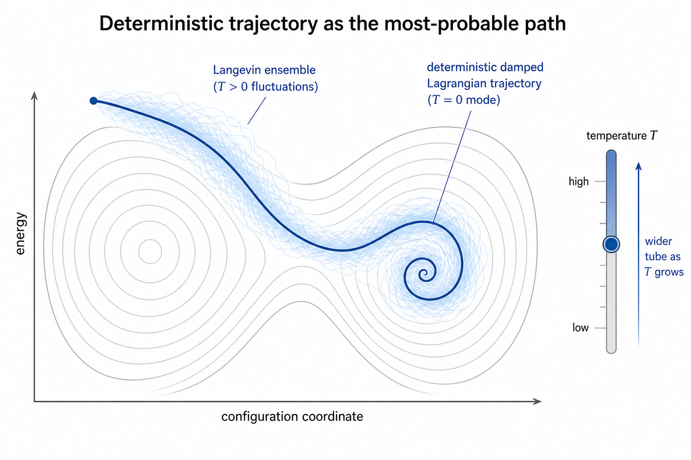

The figure states the whole thesis in one picture: the deterministic damped trajectory is the ridge (the mode); turning on FDT-consistent noise fans an ensemble around it; temperature sets the width of that tube and nothing about the ridge itself.

---

## 2. The deterministic starting point: the damped Rayleigh-Lagrangian flow

The framework's core dynamics is a **Rayleigh–Lagrangian** (dissipative Lagrangian) system: a conservative potential force plus a velocity-proportional Rayleigh dissipation (paper §7, remark at `rem:conservative-terminology`; Eq. `eq:lagrange-rayleigh`). For a single semantic particle the equation of motion is

$$
m  \ddot{x} = -\nabla_x V(\xi, x) - \gamma  \dot{x},
$$

equivalently, in first-order phase-space form with momentum $p = m\dot{x}$,

$$
\dot{x} = m^{-1} p,
\qquad
\dot{p} = -\nabla_x V(\xi, x) - \gamma  p .
$$

Here $V(\xi, x)$ is the composite potential of the framework — semantic wells, SARF, PARF, and the context coupling (paper Eq. `eq:composite-potential`),

$$
V(\xi, x) = V_{\text{wells}}(x) + V_{\text{SARF}}(x) + V_{\text{PARF}}(\xi, x) + V_{\text{ctx}}(\xi, x),
$$

and $\gamma$ is the single learned Rayleigh rate, obtained from the dissipation function $\mathcal{R} = \tfrac{1}{2}\eta(x)\lVert \dot{x} \rVert^2$ of paper Eq. `eq:rayleigh-tanh`. Two structural facts about this system drive everything below.

- **It is second-order and dissipative.** Energy leaves the particle into an unresolved "bath" — the coarse-grained modes and the demoted low-mass background field that the framework does not track explicitly. The damping term is the accounting of that outflow.
- **It is deterministic.** Given parameters and an initial condition, the trajectory is fixed. The bath appears only as a *sink* (friction); its *source* character (kicks back onto the particle) has been discarded.

The high-friction reduction of this flow is the overdamped gradient descent of paper Eq. `eq:overdamped`,

$$
\gamma  \dot{x} = -\nabla_x V(\xi, x)
\quad\text{as}\quad m \to 0 ,
$$

which is the first-order regime used to interpret transformer hidden states in the Riemannian analysis (paper §18, `sec:riemannian`). We will recover both the second-order and the overdamped pictures as noise-free limits of the stochastic system.

---

## 3. From damped Lagrangian to Langevin: the fluctuation-dissipation completion

### 3.1 The stochastic force and the FDT

A dissipative system that only loses energy cannot reach thermal equilibrium; the bath that absorbs energy must also return it as random kicks. Restoring that source term to §2 gives the **underdamped Langevin** system (paper Eqs. `eq:langevin-x`, `eq:langevin-p`; `eq:af-langevin`):

$$
\dot{x} = m^{-1} p,
\qquad
\dot{p} = -\nabla_x V(\xi, x) - \gamma  p + \sigma  \eta(t),
$$

with white noise $\eta$ satisfying, component-wise, $\langle \eta_i(t) \rangle = 0$ and $\langle \eta_i(t)\eta_j(t') \rangle = \delta_{ij} \delta(t - t')$. The drift of this SDE is *exactly* the deterministic damped Lagrangian of §2: setting $\sigma = 0$ recovers it identically. So the reformulation adds nothing to the mechanics — it only reinstates the fluctuating half of the bath coupling.

The amplitude $\sigma$ is **not free**. For the same bath to produce both the friction $\gamma$ and the kicks $\sigma$, the two must satisfy the **fluctuation–dissipation theorem** (second kind):

$$
\sigma^2 = 2  \gamma  m  k_B T = \frac{2  \gamma  m}{\beta},
\qquad
\beta = \frac{1}{k_B T} .
$$

In the framework's per-unit-mass convention ($m = 1$) this is the relation $\sigma^2 = 2\gamma/\beta$ recorded directly in paper §20 (below Eq. `eq:langevin-p`). The content of the FDT is a conservation of identity of the bath: friction and noise are two projections of one coupling, joined by a single scalar, the temperature.

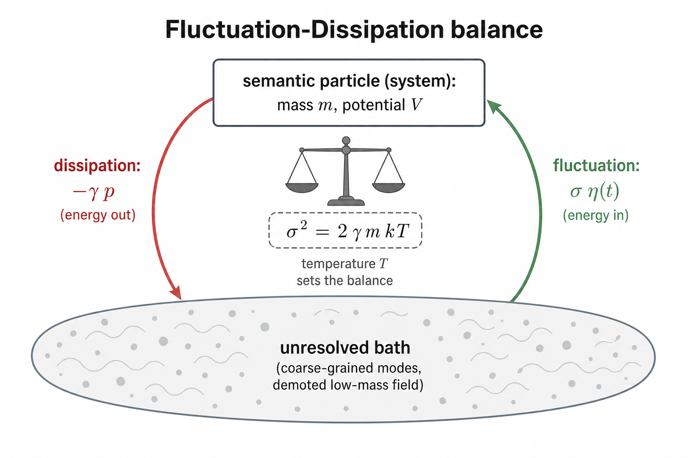

### 3.2 The Gibbs stationary measure

Under the FDT, the Fokker–Planck equation associated with the Langevin system has a unique stationary solution: the **Gibbs (canonical) measure** (paper Eq. `eq:gibbs`)

$$
\rho_\infty(x, p) \propto \exp\Big[ -\beta\big( \tfrac{1}{2} p^\top m^{-1} p + V(\xi, x) \big) \Big] .
$$

Its configurational marginal is obtained by integrating out momenta,

$$
\rho_x(x) \propto \exp\big( -\beta  V(\xi, x) \big),
$$

which is **exactly** the distribution the readout consumes. The next-token law is the Boltzmann-weighted score (paper Eq. `eq:af-readout`)

$$
p(v \mid x_L) \propto \exp\big( \beta  \langle e_v, x_L \rangle \big) .
$$

This alignment is the reason the stochastic reformulation is not cosmetic. The deterministic energy-conserving flow is the microcanonical (NVE) picture: it conserves a shadow Hamiltonian and collapses onto attractors, it does **not** sample $\rho_x$. The thermostatted flow is the canonical (NVT) picture: it *samples* the very measure the softmax reads out. This is the "object of inference is a distribution" argument of `Lessons_from_AlphaFold.md`, and AlphaFold3's diffusion module is its external, molecular-domain precedent (paper §18f, `sec:relation-alphafold`).

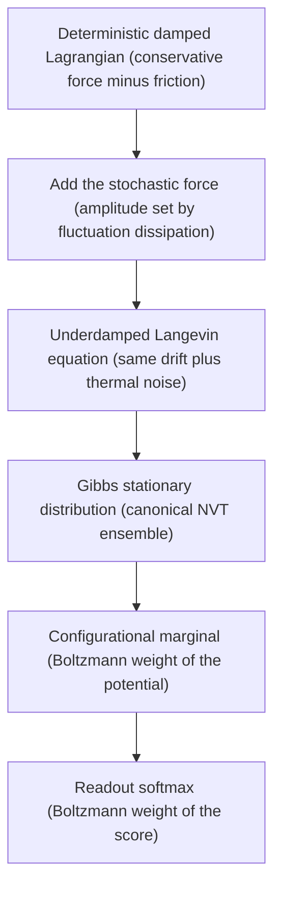

### 3.3 Uniqueness and the role of the bath

Given the Markovian (white-noise) assumption and the requirement of Gibbs stationarity, the completion in §3.1 is **unique up to the single scalar $T$**. Any other choice of noise amplitude either breaks detailed balance (no equilibrium) or silently redefines the temperature (see §5.1). The physical content is that the deterministic damped model already committed to a specific bath the moment it fixed $\gamma$; the FDT simply reads off the matching fluctuations. Non-Markovian baths (memory) relax this uniqueness and are treated in §9.2.

---

## 4. The stochastic Lagrangian: the Onsager-Machlup action

The question "is there a *stochastic version of the damped Lagrangian*?" has a precise affirmative answer beyond the SDE. Stochastic trajectories carry a probability *density on path space*, and that density has an action — the **Onsager–Machlup functional** (Onsager & Machlup, 1953; equivalently the Martin–Siggia–Rose–Janssen–De Dominicis response functional). Its extremum is the deterministic damped trajectory.

### 4.1 Overdamped action

Take the overdamped reduction of §2, written as $\dot{x} = -\mu \nabla_x V + \sqrt{2D} \xi$ with mobility $\mu = 1/\gamma$ and, by FDT, diffusion $D = \mu k_B T = k_B T/\gamma$. The probability of a path $x(\cdot)$ on $[0, \mathcal{T}]$ is

$$
P[x(\cdot)] \propto \exp\big( -S[x(\cdot)] \big),
\qquad
S[x(\cdot)] = \int_0^{\mathcal{T}} \mathcal{L}_{\text{OM}}(x, \dot{x})  dt,
$$

with the Onsager–Machlup Lagrangian

$$
\mathcal{L}_{\text{OM}}(x, \dot{x}) = \frac{1}{4D}  \big\lVert \dot{x} + \mu \nabla_x V \big\rVert^2 + \frac{1}{2}  \nabla_x \cdot \big( -\mu \nabla_x V \big) .
$$

The first term is the dominant one as $D \to 0$; it is minimised (and equals zero) exactly on $\dot{x} = -\mu \nabla_x V$, i.e. the deterministic overdamped flow of paper Eq. `eq:overdamped`. The second term is a subleading drift-divergence correction, independent of the noise scale. Thus the deterministic damped trajectory is the **mode** (most-probable path) of the stochastic dynamics, and $D \propto k_B T$ controls how sharply the measure concentrates on it.

### 4.2 Underdamped action and the deterministic path as the mode

For the full second-order system, only the momentum equation carries noise. Writing $f(x, p) = -\nabla_x V - \gamma p$ for the deterministic momentum drift, the path action is

$$
S[x(\cdot), p(\cdot)] = \frac{1}{2\sigma^2} \int_0^{\mathcal{T}} \big\lVert \dot{p} - f(x, p) \big\rVert^2  dt
= \frac{1}{4\gamma m k_B T} \int_0^{\mathcal{T}} \big\lVert \dot{p} + \nabla_x V + \gamma p \big\rVert^2  dt,
$$

where the second equality substitutes the FDT relation $\sigma^2 = 2\gamma m k_B T$. The integrand vanishes precisely on $\dot{p} = -\nabla_x V - \gamma p$ — the deterministic damped Lagrangian of §2. The prefactor $1/(4\gamma m k_B T)$ diverges as $T \to 0$, so the path measure collapses onto that deterministic trajectory in the zero-temperature limit.

This is the cleanest statement of the relationship:

$$
\text{deterministic damped Lagrangian trajectory} = \lim_{T \to 0}\ \arg\max_{\text{paths}}\ P[\text{path}] .
$$

The deterministic flow is simultaneously (i) the **drift** of the SDE (§3) and (ii) the **mode** of the stochastic action (§4); temperature is the single scalar that governs everything between the ridge and the tube in the figure of §1.

---

## 5. Temperature: why it is unavoidable and where it already lives

### 5.1 An effective temperature is inescapable

Suppose one refuses to name a temperature and instead picks a noise amplitude $\sigma$ (or diffusion $D$) directly. The stationary configurational law of the overdamped system is then

$$
\rho_x(x) \propto \exp\Big( -\frac{V(x)}{D/\mu} \Big) = \exp\Big( -\frac{V(x)}{k_B T_{\text{eff}}} \Big),
\qquad
k_B T_{\text{eff}} = \frac{D}{\mu} = \frac{\sigma^2}{2\gamma m} .
$$

A temperature reappears as $T\_{\text{eff}} = \sigma^2/(2\gamma m k\_B)$ whether or not it is named. There is therefore no noise model without an effective temperature; declining to call it temperature only discards the equilibrium-statistical-mechanics toolkit (Gibbs stationarity, detailed balance, the ensemble interpretation) while keeping the quantity.

### 5.2 The readout $\beta$ is the temperature

The framework already carries this scalar. The readout softmax uses an inverse temperature $\beta$ (paper Eq. `eq:af-readout`; `Semantic_Simulator_EOM.md` §6 calibrates the "softmax temperature to the calibrated effective scale"), and the Gibbs marginal of §3.2 uses the *same* $\beta$. For the distribution the dynamics samples to coincide with the distribution the softmax reads, the two temperatures must agree:

$$
T_{\text{dyn}} = \frac{1}{k_B  \beta_{\text{readout}}} .
$$

So the "new" degree of freedom introduced by making the dynamics stochastic is not foreign — it is the readout temperature, promoted from a static rescaling of final-state logits to the physical temperature of the sampling process.

### 5.3 Tie versus untie

This yields a clean design choice.

- **Tie** (recommended first move): set $T\_{\text{dyn}} = 1/(k\_B \beta\_{\text{readout}})$. Zero new parameters; the ensemble the dynamics samples is provably the one the readout consumes.
- **Untie**: let $T_{\text{dyn}}$ differ and calibrate it against a dispersion observable. This is a one-parameter study that also diagnoses whether the residual gap is a *sampling* problem (temperature fixes it) or a *capacity* problem (which points to force-law redesign and potential harvesting, per `Lessons_from_AlphaFold.md`).

---

## 6. Calibrating the stochastic model from deterministic experiments

### 6.1 What transfers: the entire drift

The deterministic damped-Lagrangian experiments determine every parameter of the SDE drift with nothing left over:

- the potential terrain $V$ — the RL-calibrated wells, SARF, PARF, and context coupling (`Semantic_Simulator_RL_Calibration_Programme.md`; paper Eq. `eq:composite-potential`);
- the per-position mass $m$ (paper §11 surprisal mass);
- the Rayleigh damping $\gamma$ (paper Eq. `eq:rayleigh-tanh`).

These are reused verbatim as warm-start initialisation — exactly the warm-start the Direct Dynamical Simulator already performs (paper §20 intro).

### 6.2 What is new and orthogonal: temperature

The only parameter the drift fit does not contain is $T$ (equivalently $\sigma$, via FDT). Writing the exact Ornstein–Uhlenbeck O-step in terms of $T$ instead of $\sigma$ leaves the noise with **no free parameter beyond $T$**:

$$
p \leftarrow e^{-\gamma h}  p + \sqrt{  m  k_B T  (1 - e^{-2\gamma h}) }  R,
\qquad R \sim \mathcal{N}(0, I) .
$$

Thus the entire stochastic upgrade adds a single scalar knob on top of the warm-started drift.

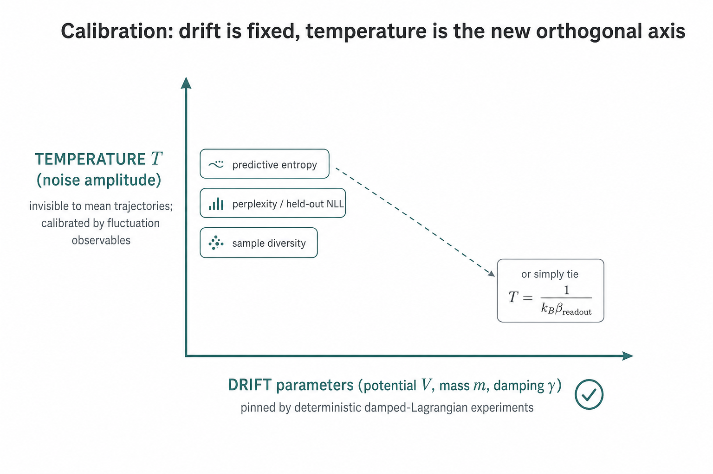

### 6.3 Identifiability: temperature only shows in fluctuations

A deterministic trajectory depends on $(m, V, \gamma)$ and **not** on $T$: temperature multiplies only the noise term, so it is orthogonal to everything a mean-trajectory fit can observe.

> Temperature cannot be read off deterministic trajectories. It must be calibrated against a **fluctuation / dispersion** observable — predictive entropy, held-out cross-entropy (perplexity), or sample diversity.

Fortunately the standard training loss already is such an observable: cross-entropy is a width statistic of the predictive distribution, so perplexity moves with $T$ even though the deterministic model cannot exercise that knob.

### 6.4 The $(\gamma, T)$ joint refit and back-reaction

The deterministic $\gamma$ was fit as *pure* dissipation to reproduce observed relaxation. Once FDT noise is switched on, part of the observed spread is now noise-sourced, so $\gamma$ may shift slightly to avoid double-counting. The robust procedure is therefore a small **joint $(\gamma, T)$ refit**, warm-started from the deterministic $\gamma$. This is the "sweep gamma and sigma together" caution of `Lessons_from_AlphaFold.md`, reparametrised as a cleaner $(\gamma, T)$ study.

### 6.5 Step-by-step calibration recipe

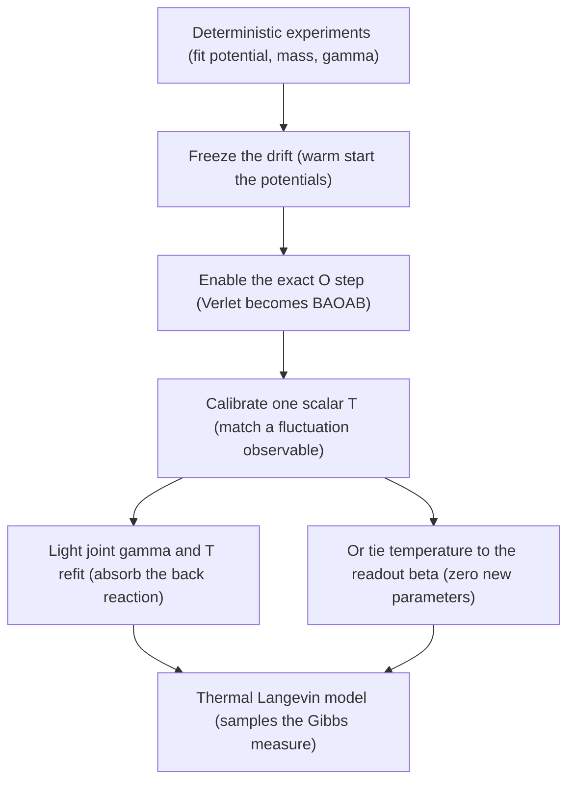

1. **Fit the drift deterministically** (already done): obtain $V$, $m$, $\gamma$.
2. **Freeze / warm-start** the drift into the simulator.
3. **Switch Verlet to BAOAB** with the FDT-tied O-step of §6.2.
4. **Calibrate $T$** against predictive entropy / perplexity / diversity — or **tie** $T = 1/(k\_B \beta\_{\text{readout}})$ for zero new parameters.
5. **Light joint $(\gamma, T)$ refit** to absorb the fluctuation back-reaction.

The net cost over the deterministic model is one scalar (at most a two-parameter sweep) — the calibration collapses from "fit a new SDE" to "fit a temperature".

---

## 7. Discretisation: BAOAB and the exact O-step

The continuous Langevin flow is realised discretely by the **BAOAB splitting** integrator (paper §20, `ssec:baoab`; `Modified_BAOAB_with_STP_identity_Detailed_Analysis.md`; Leimkuhler & Matthews, 2013). The generator splits into three exactly integrable pieces (paper Eq. `eq:splitting`): a position drift A, a velocity kick B, and an Ornstein–Uhlenbeck thermostat O. BAOAB applies them in the palindromic order B A O A B (paper Eq. `eq:baoab-flow`).

The three substeps for the semantic simulator are:

$$
\text{A:}\quad x \leftarrow x + h  m^{-1} p,
\qquad
\text{B:}\quad p \leftarrow p + h  F(\xi, x),
$$

$$
\text{O:}\quad p \leftarrow e^{-\gamma h}  p + \sqrt{  \frac{\sigma^2}{2\gamma} (1 - e^{-2\gamma h}) }  R,
\qquad R \sim \mathcal{N}(0, I),
$$

with $F(\xi, x) = -\nabla_x V(\xi, x)$ the composite force. Three properties make BAOAB the right choice (paper §20, `ssec:baoab`):

- **Exact O-step.** The Ornstein–Uhlenbeck substep is exact in distribution, not a discretisation — the noise term above is the closed-form solution of the O-generator over a step $h$.
- **Second-order weak accuracy** for observables, versus first-order for damped Euler.
- **Configurational-measure suppression.** The leading bias in $\rho_x$ scales as $h^2$ with a coefficient that decays as $\gamma^{-2}$, so the damping the dynamics needs also suppresses the integrator's sampling error.

The **STP-BAOAB** variant (paper §20, `ssec:stp-baoab`; Eq. `eq:stp-identity`) replaces the per-step gradient in the B-step by the closed-form Semantic Tensor Product acceleration field (Theorem 49, paper §13 `sec:accel`), removing the backward-AD pass where the identity applies. That is the framework's first move toward an *amortised* conservative propagator — the CfC-style lesson drawn from the Liquid Neural Network trajectory (`Parallels_and_Lessons_from_Liquid_Neural_Networks.md`).

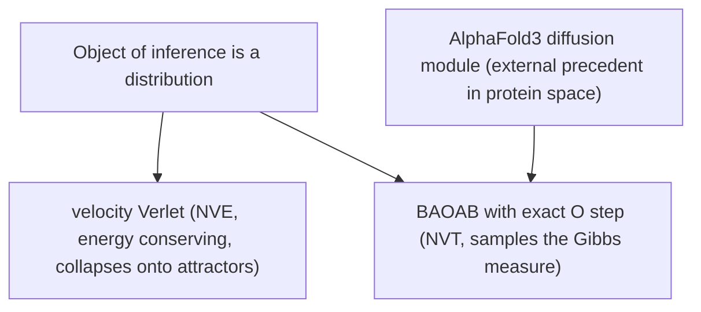

### 7.1 The O-step as the operational atom of the reformulation

The reformulation of §3–§4 is a statement in continuous time: the deterministic damped Lagrangian is the drift of a Langevin SDE, and the fluctuating half of the bath coupling — locked to the friction by the FDT — is what upgrades it to a thermal system. BAOAB makes this decomposition **operational**, and it localises the entire upgrade in a single substep. The A and B steps carry only the deterministic, conservative mechanics (position drift and the conservative force kick $F = -\nabla_x V$); the O step carries the **whole** system–bath coupling — both the dissipation $-\gamma p$ and the fluctuation $\sigma \eta$ — as one exact Ornstein–Uhlenbeck unit.

| Substep | Continuous piece it integrates | Role | Contains temperature? |
| ------- | ------------------------------ | ---- | --------------------- |
| A | position drift, xdot = inverse-mass times p | conservative mechanics | no |
| B | force kick, pdot = minus grad V | conservative mechanics | no |
| O | Ornstein-Uhlenbeck, pdot = minus gamma p plus sigma noise | full bath coupling (both FDT halves) | yes (via sigma) |

Two consequences follow, and together they say the O-step *is* the reformulation in executable form.

**The O-step is the sole carrier of temperature.** The noise amplitude in O is the only place $\sigma$ (hence $T$, via $\sigma^2 = 2\gamma m/\beta$) appears in the whole integrator. Everything the report says about temperature (§5) and its calibration (§6) is physically the tuning of this one substep. "Enable the O-step" and "instantiate the Langevin reformulation numerically" are the same act.

**Switching the O-step off collapses back to the deterministic starting point, in two stages.** Sending the noise to zero while keeping friction leaves the O-step as a pure dissipative contraction,

$$
\sigma \to 0 \quad\Longrightarrow\quad \text{O:}\ \ p \leftarrow e^{-\gamma h} p,
$$

so BAOAB reduces to a deterministic damped velocity-Verlet integrator — exactly the damped Rayleigh–Lagrangian flow of §2, which is the $T \to 0$ most-probable path (mode) of the stochastic action of §4. Sending the friction to zero as well removes the O-step entirely,

$$
\gamma \to 0,\ \sigma \to 0 \quad\Longrightarrow\quad \text{O:}\ \ p \leftarrow p,
\qquad
\Phi_h^{\text{BAOAB}} \to \Phi_h^{\text{velocity-Verlet}},
$$

leaving the conservative, symplectic NVE core. The three regimes — symplectic core, deterministic damped flow, and thermal Langevin — are therefore *one* integrator read at three settings of the O-step, and moving between them changes exactly one substep. This is the discrete-time image of the friction/temperature dial that the continuous reformulation describes, and it is why the Verlet-versus-BAOAB choice discussed in `Lessons_from_AlphaFold.md` is precisely the presence or absence of this single atom.

---

## 8. Applying the O-step to Fock-PARFLM: retrofit versus the exact simulator

The reformulation was derived for the transformer-free Direct Dynamical Simulator, but the practical question is whether it can be retrofitted into the neural **Fock-PARFLM** model already trained on OpenWebText, or whether a new simulator is required. The answer is: the O-step drops into Fock-PARFLM cheaply, but it yields an **approximate** Langevin, not the exact reformulation. The exact realisation remains the Direct Dynamical Simulator (paper §20, `sec:dynamical-simulator`). It is therefore not "Fock-PARFLM **or** a from-scratch simulator" but **Fock-PARFLM = the cheap approximate test runnable now on OpenWebText; the simulator = the exact realisation already available.** This retrofit is exactly the open "Verlet to Langevin" lever recorded in `Lessons_from_AlphaFold.md`.

### 8.1 Why the retrofit drops in (three enablers)

1. **The velocity state already exists.** Fock-PARFLM is a damped velocity-Verlet stack (paper §17c, `sec:fock-parflm`), so a velocity is carried across layers. The O-step is a drop-in stochastic update on that existing state, applied per layer with step $h = \Delta t$:

$$
v \leftarrow e^{-\gamma \Delta t} v + \sqrt{ \frac{\sigma^2}{2\gamma}(1 - e^{-2\gamma \Delta t}) } R,
\qquad R \sim \mathcal{N}(0, I).
$$

No new state and no re-architecture are required.

2. **It stays differentiable.** The O-step is already in reparameterised form: $R$ is drawn independently of the parameters, and gradients flow through the decay $e^{-\gamma \Delta t} v$ and the amplitude. Back-propagation through the unrolled layers is unaffected; this is exactly variational / stochastic-depth-style noise.

3. **The amplitude is free.** The FDT fixes $\sigma^2 = 2\gamma m/\beta$, and tying $T = 1/(k\_B \beta\_{\text{readout}})$ (§5.2) adds **zero** new parameters. Fold the *existing* Rayleigh damping into the O generator (which already contains the friction term) so the model is not damped twice.

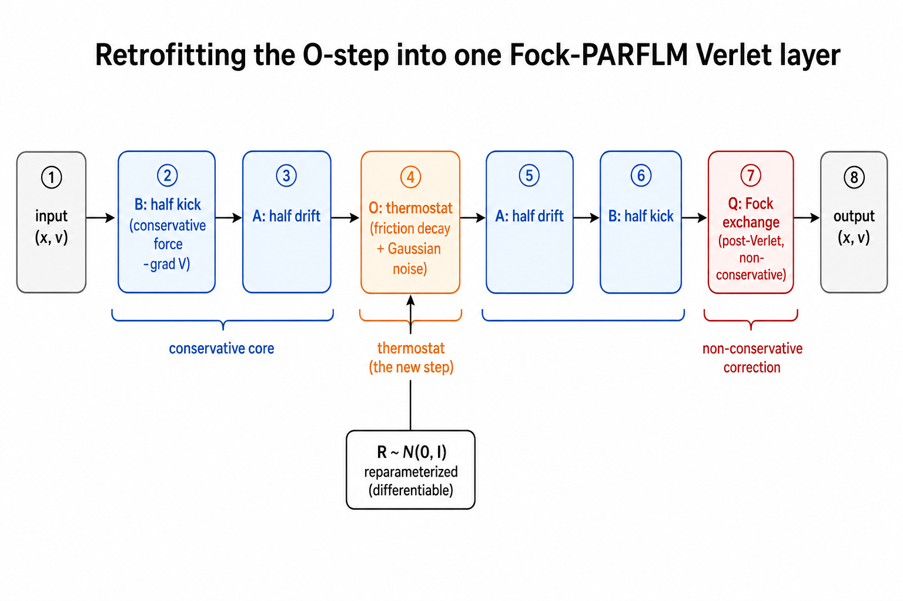

### 8.2 Why it is an approximate reformulation (three mismatches)

1. **The Fock force is non-conservative.** The exchange force $Q$ is a post-Verlet correction that is *not* a scalar gradient (paper §7 and §17c). The clean Gibbs law $\rho_x \propto \exp(-\beta V)$ (§3.2) holds only for the conservative sector (the well and pairwise potentials). With $Q$ switched on, the O-step thermostats a system whose drift is not a pure gradient, so the invariant law is a **non-equilibrium steady state**, not exact Gibbs. It is still useful — it breaks the "commits harder / punctuation-dominated basin" collapse observed in the Verlet ablation — but the exact canonical-sampling claim is lost.

2. **Finite, small depth is not equilibration.** The simulator runs many integration steps per token; Fock-PARFLM has only $L$ layers (of order 8 to 24). A handful of O-steps acts as **stochastic regularisation / exploration**, not convergence to the stationary measure — the "samples $\rho_x$" guarantee is asymptotic in the number of steps.

3. **Train-versus-inference noise is a new design axis.** One must choose whether to inject noise at training time (a regulariser), at inference time (sample diversity), or both, and whether to anneal it. Because each output position carries its own particle, the ensemble interpretation is per-position.

### 8.3 A minimal retrofit recipe

- Split each Verlet layer into the palindromic order B–A–O–A–B, folding the existing $-\gamma v$ damping into the O-step.
- Set the amplitude by FDT; tie $T = 1/(k\_B \beta\_{\text{readout}})$ or expose a single scalar $T$ for a sweep (§6).
- Keep $Q$ as the post-Verlet correction unchanged; accept the non-equilibrium steady state.
- Draw $R$ fresh per layer and per position (reparameterised), preserving differentiability.
- Run a small joint $(\gamma, T)$ sweep. The scale-up notebook currently uses a fixed damping with no noise, so this is a clean one-factor addition.
- Instrument validation perplexity, predictive entropy, and the basin-coarseness diagnostic of `Lessons_from_AlphaFold.md`.

### 8.4 Staged plan: the retrofit tests the lever, the simulator tests the theory

| Stage | Vehicle | What it tests | Cost |
| ----- | ------- | ------------- | ---- |
| 1 | O-step retrofit into Fock-PARFLM (OpenWebText) | Does thermostat noise cure the Verlet commits-harder collapse and move val perplexity? | near free (drop-in) |
| 2 | Joint (gamma, T) sweep on the retrofit | Is the residual gap a sampling problem or a capacity problem? | small |
| 3 | Direct Dynamical Simulator with STP-BAOAB | The exact reformulation: conservative closed-form forces, long horizon, true Gibbs sampling | already built |

The honest framing is that Stage 1 tells you whether stochastic dynamics helps the production model at near-zero cost, while only Stage 3 realises the reformulation exactly. The retrofit tests the *lever*; the simulator tests the *theory*.

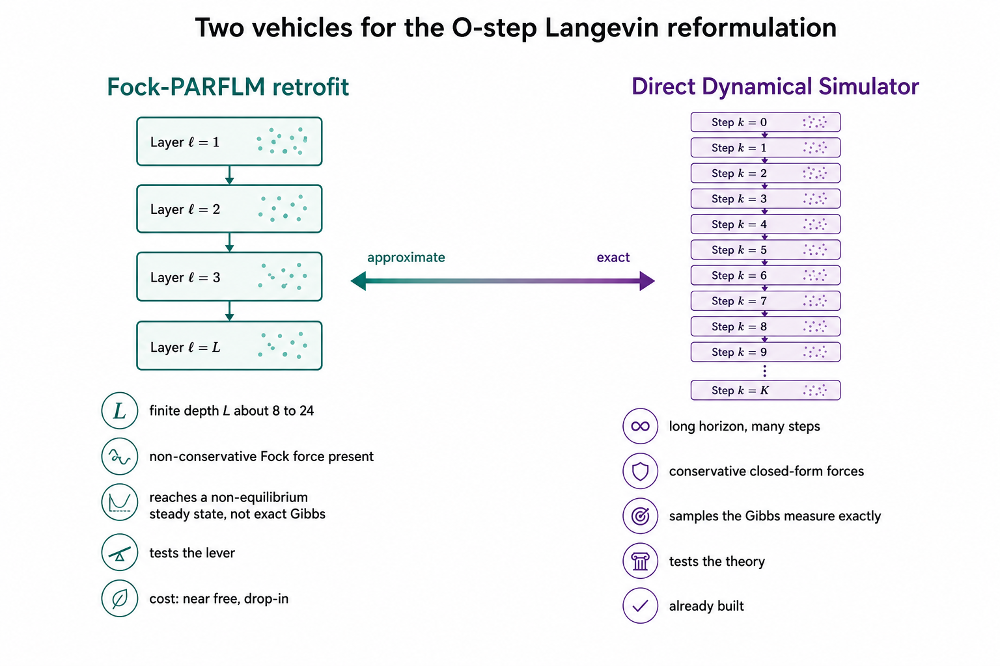

### 8.5 The assumptions the retrofit makes explicit

The shipped retrofit (`install_ostep` in `colab_fock_ostep_langevin_openwebtext.ipynb`) turns each Fock-PARFLM Verlet layer into a single thermostatted step. It is exact where it can be and approximate everywhere else, and the approximations are all downstream of a short, explicit list of assumptions. Naming them is what makes the flaws in §8.6 predictable rather than mysterious.

- **A1 — Velocity proxy.** The model stores position $h$ and the previous position $h\_{\text{prev}}$, not an explicit momentum. The retrofit reads the implicit velocity $v = (h\_{\text{new}} - h)/\Delta t$ from one conservative half-update and thermostats *that*. It assumes this finite difference is a faithful momentum.
- **A2 — Damping is friction, and only the O-step carries it.** The parent layer's learned denominator damping $1/(1+\gamma \Delta t)$ is folded out (gamma is set to zero for the drift call) so the exact Ornstein–Uhlenbeck contraction $c\_1 = e^{-\gamma \Delta t}$ is the sole friction. It assumes the learned damping and the OU friction are the same physical channel.
- **A3 — One layer equals one unit-time step.** $\Delta t = 1$ and the number of integration steps equals the network depth $L$ (about 16). It assumes a single large step per layer is an acceptable integrator.
- **A4 — Frozen local potential.** Within a layer step the potential $V\_\theta, V\_\phi$ is treated as static: the force is read once and held for the whole move.
- **A5 — Temperature lives in the readout.** $k\_B T$ is tied to the readout inverse temperature, $T = 1/(k\_B \beta\_{\text{readout}})$, or exposed as a single scalar; there is no separately learned thermodynamic temperature (§5).
- **A6 — Mass sets the noise scale.** Per-token mass $m\_b$ enters the FDT amplitude $\sqrt{(k\_B T/m\_b)(1 - c\_1^2)}$. It assumes the learned mass is the inertial mass of the Langevin particle.
- **A7 — Noise is a training-time regulariser.** Fresh reparameterised noise is drawn per layer and per position during training and switched off at evaluation by default. It assumes we want the deterministic *mode* at inference and the stochastic *tube* only for learning (§4, §7.1).
- **A8 — The non-conservative force is left alone.** The reverse-channel / Fock creation–destruction force $Q$ stays as the post-Verlet correction and is OFF by default. It assumes we may study the thermostat on the conservative skeleton first.

One honest discrepancy sits inside this list. The ideal recipe of §8.3 is the palindromic B–A–O–A–B step with the FDT amplitude; the shipped retrofit uses a single conservative drift followed by one O-step per layer — a first-order splitting with a single force evaluation, chosen for one force call and gradient-checkpoint compatibility. That gap is error #3 below.

### 8.6 From assumptions to error: the inaccuracy taxonomy

Each assumption is reasonable *locally*, but together they make the retrofit **locally faithful and globally approximate**. There is no single $\epsilon$ that bounds the gap to the full reformulation; instead there is a small set of distinct error channels. The figure ranks them for the default configuration, and the table maps each back to the assumption that causes it and the lever that reduces it.

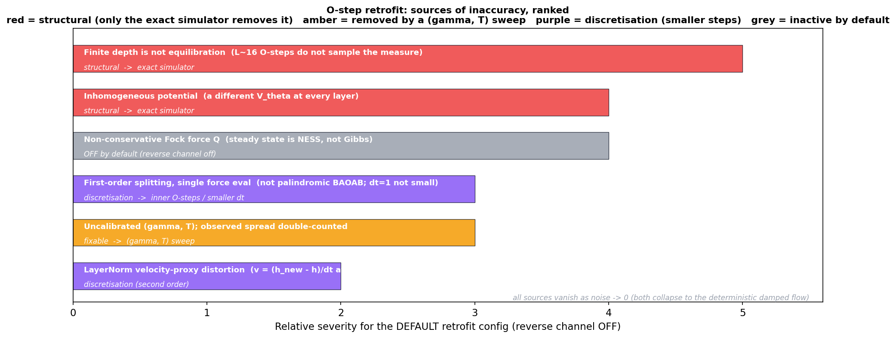

| Source of error | From assumption | What it costs | How to reduce it |
| --------------- | --------------- | ------------- | ---------------- |
| Finite depth is not equilibration | A3 | ~16 O-steps cannot relax to the stationary measure; the sampler never reaches Gibbs | more steps / exact simulator (§8.7) |
| Inhomogeneous potential | A4 + depth-conditioning | each layer is a different V, so there is no single measure to converge to | exact simulator: one shared V, many steps |
| First-order splitting, single force eval | A3, A4 | dt=1 with one force call loses the second-order accuracy of palindromic BAOAB | inner O-steps / smaller dt (§8.7) |
| Uncalibrated (gamma, T), spread double-counted | A2, A5, A6 | the learned drift already reproduces the observed spread; adding noise at kT=1 double-counts it | (gamma, T) sweep (§8.8) |
| Velocity-proxy + LayerNorm distortion | A1 | the projection LayerNorm after each step warps the finite-difference velocity and the re-encoded previous position | smaller dt; second-order effect |
| Non-conservative Q gives a NESS, not Gibbs | A8 | if the reverse channel is on, the steady state is a non-equilibrium steady state | keep Q off, or use the metriplectic simulator (§9) |

Reading the ranking honestly: the top two errors are **structural** — only the exact, homogeneous, many-step simulator removes them. Error #4 is **removed by a sweep**. Errors #3 and #5 are **discretisation** and shrink with smaller steps. Error #6 is **inactive by default**. Crucially, every one of them vanishes as the noise amplitude goes to zero: in that limit the retrofit and the full reformulation collapse onto the same deterministic damped flow (the $\sigma \to 0$ mode of §7.1). This is why the retrofit is a safe probe — its worst case is the model we already have.

### 8.7 Will increasing the integration steps help, and how?

"Increase the steps" is ambiguous, and the ambiguity matters because the three axes fix different errors. Only one of them fixes the structural pair.

- **Inner O-steps per layer (frozen potential).** Replace the single kick with $n\_{\text{inner}}$ short sub-steps that thermalise the *local* frozen potential. This drives the per-layer conditional toward its local stationary law geometrically,

$$
\text{KL}_n \approx \text{KL}_0 e^{-c n_{\text{inner}}} + \text{floor},
$$

  attacking error #1 (local non-equilibration) at a cost linear in $n\_{\text{inner}}$, as a drop-in. But it cannot cross the floor set by error #2 (inhomogeneity), and if $Q$ is on, error #6 (NESS) raises that floor.
- **More layers L (depth).** Adding depth raises capacity and lets each frozen potential be gentler, but a deeper stack is still a sequence of *different* potentials. It buys representational capacity, not sampling fidelity, and — because depth-conditioning introduces more distinct potentials — it can even *worsen* the inhomogeneity error.
- **Many small steps of one homogeneous potential (the exact simulator).** This is the theoretically correct reading: one shared conservative potential, small $\Delta t$, and hundreds of STP-BAOAB steps. It removes errors #1 and #2 together and is the only axis that realises true Gibbs sampling (§7; paper v5 §20 `sec:dynamical-simulator`; `Modified_BAOAB_with_STP_identity_Detailed_Analysis.md`).

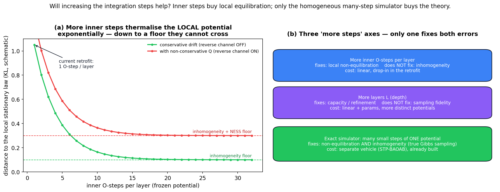

The practical diagnostic is cheap. Add a handful of inner O-steps and watch validation perplexity and predictive entropy. If they improve and then **saturate**, the residual gap is capacity / inhomogeneity (error #2), which points at the simulator or at more capacity. If they keep improving, the retrofit was simply under-equilibrated and the linear cost of inner steps is worth paying.

### 8.8 Will a (gamma, T) sweep help, and how?

Yes — for a specific, bounded purpose. A sweep calibrates the **regulariser optimum** and removes the double-counting bias (error #4). It does not touch the structural errors #1 and #2.

- **Temperature T (the clean axis).** $T$ sets the noise amplitude through the FDT, $\sigma^2 \propto k\_B T (1-c\_1^2)$. It is orthogonal to the drift, which the deterministic experiments already fixed (§6), so it is the safe first sweep. Too cold ($T \to 0$) recovers the Verlet "commits harder" collapse: low predictive entropy, punctuation-dominated basins (the `Lessons_from_AlphaFold.md` symptom). Too hot and the noise swamps the drift, so loss rises and entropy drifts toward uniform. Expect a U-shaped val-perplexity curve with a basin near the tied value $T = 1/\beta\_{\text{readout}}$, and predictive entropy rising monotonically with $T$.
- **Friction gamma (the coupled axis).** $\gamma$ controls both the OU contraction $c\_1 = e^{-\gamma \Delta t}$ *and*, through the FDT, the per-step noise variance $(k\_B T/m)(1-c\_1^2)$. Low $\gamma$ is underdamped: momentum persists across layers (ballistic, exploratory transport, weak noise per step). High $\gamma$ is overdamped: each step is nearly an independent draw from the local kick (fast local mixing, slow long-range transport). Because $\gamma$ moves damping and noise together it is not a pure knob, so a *joint* $(\gamma, T)$ refit is what actually removes the double-counting: it lets the model hand some deterministic damping back to the thermostat without changing the total observed spread.
- **What the sweep cannot do.** It optimises *within* the regulariser regime. It cannot make ~16 inhomogeneous steps sample a measure that does not exist. If the best $(\gamma, T)$ still leaves a gap to target, that gap is sampling structure or capacity, not calibration — and the answer is inner steps or the exact simulator.

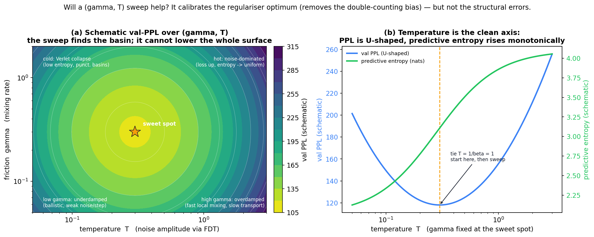

The recommended order follows the staged plan of §8.4: (1) tie $T = 1$ with $\gamma$ warm-started at 0.30 and confirm the thermostat moves perplexity and entropy at all; (2) sweep $T$ over a decade at fixed $\gamma$ (the cleanest axis); (3) apply a small joint $(\gamma, T)$ refinement around the basin.

### 8.9 Reading the outcome: a decision guide

The retrofit is the cheapest possible probe of the reformulation, and each of its inaccuracies points at the specific richer vehicle that removes it. The table turns the diagnostics above into a decision.

| Observation | Diagnosis | Action |
| ----------- | --------- | ------ |
| Retrofit lowers val perplexity and entropy rises into a healthy band | the thermostat cures the Verlet collapse; the lever works | proceed to the (gamma, T) sweep (§8.8) |
| Inner O-steps improve, then saturate above target | local equilibration achieved; residual is inhomogeneity / capacity | move to the exact simulator (§8.7) or add capacity |
| (gamma, T) sweep is monotone-worse for any noise | drift is already well-calibrated, or the model is too shallow to benefit | keep noise as mild regularisation only; invest in capacity or the simulator |
| Turning the reverse channel on raises the floor | the non-conservative Q pushes the system to a NESS | keep Q off for sampling, or move to the metriplectic simulator (§9; paper v5 §20) |

The single-sentence summary: the retrofit answers "does stochasticity help *this* model?" at near-zero cost, and it is faithful enough to trust that answer, while being explicit enough about its assumptions that a "no" or a "not enough" tells you exactly which of the three vehicles (inner steps, a sweep, or the exact simulator) to reach for next.

---

## 9. Generalisations and caveats

### 9.1 Anisotropic / state-dependent damping

If $\gamma$ is promoted to a matrix or made state-dependent (the framework contemplates $\gamma\_t = \gamma\_0/m\_t$, `Semantic_Simulator_EOM.md`), the FDT becomes a matrix identity: the diffusion tensor must match the friction tensor,

$$
D = \gamma  m  k_B T \quad (\text{as matrices}),
$$

otherwise there is no single Gibbs stationary state (detailed balance fails). State-dependent damping is admissible but not free.

### 9.2 Non-Markovian (generalised Langevin) baths

If the coarse-grained bath has memory — plausible, since demoted particles persist as a low-mass background field rather than vanishing — the honest object is the **generalised Langevin equation** with a friction kernel $K$ and coloured noise tied by the *second* FDT (Zwanzig; Kubo):

$$
m  \ddot{x}(t) = -\nabla_x V - \int_0^t K(t - s)  \dot{x}(s)  ds + \zeta(t),
\qquad
\langle \zeta(t)  \zeta(t')^\top \rangle = k_B T  K(t - t') .
$$

White noise with constant $\gamma$ is the memoryless special case $K(\tau) = 2\gamma \delta(\tau)$ and is the correct first move; memory kernels are a v2+ refinement.

### 9.3 Multiplicative noise and the Itô-Stratonovich choice

If the noise amplitude depends on state (for example through a state-dependent $\gamma$ feeding the FDT), the SDE has multiplicative noise and the Itô versus Stratonovich convention matters: a spurious-drift correction term must be added to preserve $\exp(-\beta V)$ as the stationary law. For the additive, constant-$\sigma$ model of §3 this subtlety does not arise.

---

## 10. Cross-reference map to paper v4/v5 and companion notes

The table maps each concept in this report to its home in the paper and the companion notes. (Equation and section labels are the LaTeX `\label` keys; they resolve in both `paper_v4` and `paper_v5` unless noted.)

| Concept in this report | Paper location (label) | Companion note |
| ---------------------- | ---------------------- | -------------- |
| Damped Rayleigh-Lagrangian EOM | §7, Eqs. eq:lagrange-rayleigh, eq:rayleigh-tanh | Semantic_Simulator_EOM.md |
| Composite potential (4 named terms) | §20, Eq. eq:composite-potential | Semantic_Simulator_EOM.md |
| Overdamped gradient-flow limit | §7, Eq. eq:overdamped; §18 sec:riemannian | Parallels_and_Lessons_from_Liquid_Neural_Networks.md |
| Underdamped Langevin SDE | §20, Eqs. eq:langevin-x, eq:langevin-p; §18f Eq. eq:af-langevin | Lessons_from_AlphaFold.md |
| FDT relation sigma^2 = 2 gamma m / beta | §20 (below eq:langevin-p) | Modified_BAOAB_with_STP_identity_Detailed_Analysis.md |
| Gibbs measure and readout marginal | §20, Eq. eq:gibbs; §18f Eqs. eq:af-readout | Lessons_from_AlphaFold.md |
| BAOAB splitting and exact O-step | §20, Eqs. eq:splitting, eq:baoab-flow; §18f Eq. eq:af-ostep | Modified_BAOAB_with_STP_identity_Detailed_Analysis.md |
| STP-BAOAB amortisation | §20 ssec:stp-baoab, Eq. eq:stp-identity; §13 sec:accel | Modified_BAOAB_with_STP_identity_Detailed_Analysis.md |
| NVE vs NVT and the AlphaFold3 precedent | §18f sec:relation-alphafold, tab:af-design-space | Lessons_from_AlphaFold.md |
| O-step retrofit into Fock-PARFLM | §17c sec:fock-parflm; §7 (Rayleigh damping) | Lessons_from_AlphaFold.md |
| Conservation axis / metriplectic reading | §18e sec:relation-liquid-nn | Parallels_and_Lessons_from_Liquid_Neural_Networks.md |
| RL calibration of force fields | §20 (roadmap) | Semantic_Simulator_RL_Calibration_Programme.md |

**Suggested paper insertion.** The natural home for a condensed version of this report is a short subsection either in §20 (`sec:dynamical-simulator`, right after `ssec:eom-langevin`) titled "From the damped Lagrangian to a thermal Langevin completion: FDT and temperature calibration", or adjacent to §18f (`sec:relation-alphafold`) where the O-step lever is already introduced. It would carry the FDT relation, the O-step in $T$-form (§6.2), and the tie-to-$\beta$ recipe (§5.2), citing this note for the Onsager–Machlup derivation and the calibration protocol.

---

## 11. Summary

- **Reformulation (yes).** The deterministic damped Rayleigh–Lagrangian flow is the zero-noise **drift** of an underdamped Langevin system and the $T \to 0$ **mode** of the Onsager–Machlup stochastic action. Restoring the fluctuating half of the bath, with amplitude locked to $\gamma$ by the FDT $\sigma^2 = 2\gamma m k_B T$, yields a system whose Gibbs marginal $\exp(-\beta V)$ is exactly what the readout softmax samples.
- **Calibration (yes, cheaply).** The deterministic experiments pin the entire drift $(V, m, \gamma)$; the stochastic upgrade adds a single orthogonal scalar, the temperature, which must be fit against a fluctuation observable (perplexity, entropy, diversity), followed by a light joint $(\gamma, T)$ refit.
- **Temperature (yes, and it is already there).** An effective temperature $T\_{\text{eff}} = \sigma^2/(2\gamma m k\_B)$ is inescapable, and it coincides with the readout inverse temperature $\beta$. The cleanest first experiment ties $T\_{\text{dyn}} = 1/(k\_B \beta\_{\text{readout}})$, switches Verlet to BAOAB with the exact O-step, and sweeps $(\gamma, T)$ lightly — a low-cost, high-leverage accuracy lever with essentially no new free parameters, and one for which AlphaFold3's diffusion module is the external precedent.

---

## Appendix A: Notation

| Symbol | Meaning |
| ------ | ------- |
| x, p | semantic particle position and momentum in R^d |
| m | per-position semantic mass (paper §11) |
| V(xi, x) | composite context-conditioned potential (Eq. eq:composite-potential) |
| xi | context / routing variable |
| gamma | Rayleigh dissipation rate (damping) |
| sigma | stochastic force amplitude |
| eta(t) | unit white noise, delta-correlated |
| beta | inverse temperature, beta = 1 / (kB T) |
| T | temperature; kB Boltzmann constant |
| rho_infinity | Gibbs stationary density on (x, p) |
| rho_x | configurational marginal, proportional to exp(-beta V) |
| F | composite force, F = -grad_x V |
| h | integrator step size |
| mu | mobility, mu = 1 / gamma (overdamped) |
| D | diffusion coefficient, D = mu kB T (overdamped) |
| S | Onsager-Machlup path action |

---

## References

**Companion notes (this repository).**

- `Semantic_Simulator_EOM.md` — v0 equations of motion.
- `Modified_BAOAB_with_STP_identity_Detailed_Analysis.md` — discretised STP-BAOAB integrator.
- `Semantic_Simulator_RL_Calibration_Programme.md` — RL calibration of force fields.
- `Lessons_from_AlphaFold.md` — the Verlet-to-Langevin lever and the AlphaFold3 precedent.
- `Parallels_and_Lessons_from_Liquid_Neural_Networks.md` — conservation axis and metriplectic reading.
- `GitHub_Markdown_LaTeX_Rendering_Cheatsheet.md` — rendering rules used to validate this note.

**Paper (v4 / v5).** §7 Lagrangian mechanics (Eqs. `eq:lagrange-rayleigh`, `eq:rayleigh-tanh`, `eq:overdamped`); §13 STP acceleration (`sec:accel`); §18 Riemannian geometry (`sec:riemannian`); §18e Relation to Liquid Neural Networks (`sec:relation-liquid-nn`); §18f Relation to AlphaFold (`sec:relation-alphafold`, Eqs. `eq:af-langevin`, `eq:af-ostep`, `eq:af-readout`); §20 Direct Dynamical Simulator (`sec:dynamical-simulator`, Eqs. `eq:langevin-x`, `eq:langevin-p`, `eq:gibbs`, `eq:composite-potential`, `eq:splitting`, `eq:baoab-flow`, `ssec:baoab`, `ssec:stp-baoab`, `eq:stp-identity`). Note: §20 is present in `paper_v5`; `paper_v4` carries the simulator via the companion notes.

**External literature.**

- L. Onsager and S. Machlup (1953). *Fluctuations and Irreversible Processes.* Physical Review 91, 1505.
- R. Kubo (1966). *The Fluctuation-Dissipation Theorem.* Reports on Progress in Physics 29, 255.
- R. Zwanzig (2001). *Nonequilibrium Statistical Mechanics.* Oxford University Press (generalised Langevin equation, Mori-Zwanzig projection).
- H. Risken (1989). *The Fokker-Planck Equation: Methods of Solution and Applications.* Springer.
- B. Leimkuhler and C. Matthews (2013). *Rational Construction of Stochastic Numerical Methods for Molecular Sampling.* Applied Mathematics Research eXpress 2013(1), 34-56 (BAOAB).
- B. Leimkuhler and C. Matthews (2015). *Molecular Dynamics with Deterministic and Stochastic Numerical Methods.* Springer.
- H. Goldstein, C. Poole, and J. Safko (2002). *Classical Mechanics* (3rd ed.). Addison-Wesley (Rayleigh dissipation function).
- J. Jumper et al. (2021). *Highly Accurate Protein Structure Prediction with AlphaFold.* Nature 596, 583-589.
- J. Abramson et al. (2024). *Accurate Structure Prediction of Biomolecular Interactions with AlphaFold 3.* Nature 630, 493-500.
- Y. Song et al. (2021). *Score-Based Generative Modeling through Stochastic Differential Equations.* ICLR (diffusion as overdamped Langevin / score-based SDE).
