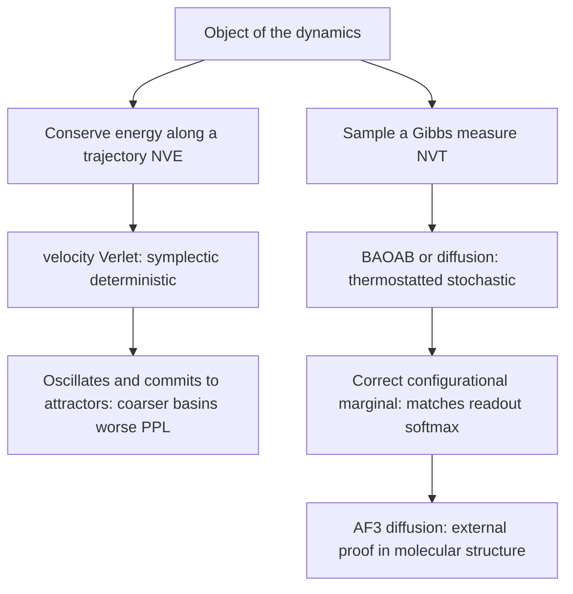
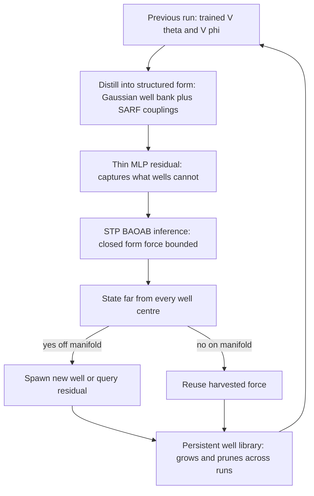
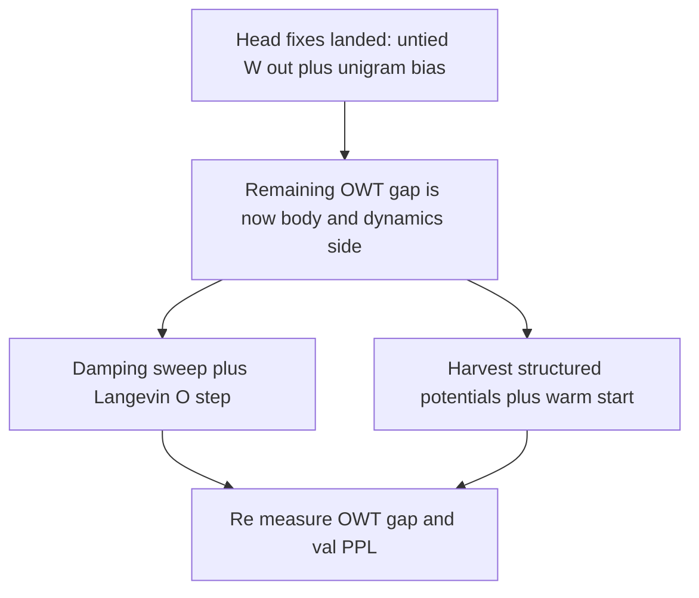

# Lessons from AlphaFold for Fock-PARFLM / SemSimula

A working synthesis of what the AlphaFold programme teaches us about SemSimula: the treatment of PARF/SARF forces, the Verlet to BAOAB transition, potential harvesting, and concretely how to improve convergence and best validation PPL of Fock-PARFLM on OpenWebText.

**Reconciliation note.** This version has been reconciled against the current implementation, in particular the OWT scale-up notebook `notebooks/conservative_arch/scaleup/colab_fock_depthcond_vtheta_openwebtext.ipynb`. Several head-side suggestions in the original draft are **already implemented** (untied output embedding, unigram output bias, WSD schedule, Gumbel anneal, bounded Gaussian wells, sparse pairwise `V_phi`, multi-context/depth-conditioned `V_theta`, Fock register repulsion, reverse-channel stabilisation). Those are marked **DONE** below and are not re-litigated. The note then concentrates on the suggestions that are still open and genuinely useful: **potential harvesting**, the **Verlet to underdamped-Langevin** step, and a **damping sweep on OWT**.

---

## Contents

1. [Status reconciliation (read this first)](#0-status-reconciliation-read-this-first)
2. [Design-space framing](#1-design-space-framing)
3. [Structural analogies that survive scrutiny](#2-structural-analogies-that-survive-scrutiny)
4. [Open direction A: harvest structured potentials](#3-open-direction-a-harvest-structured-potentials)
5. [Open direction B: Verlet to Langevin plus a damping sweep](#4-open-direction-b-verlet-to-langevin-plus-a-damping-sweep)
6. [Secondary levers and the AlphaFold citation gap](#5-secondary-levers-and-the-alphafold-citation-gap)
7. [Revised priority summary](#6-revised-priority-summary)
8. [Related-work abstract for the paper](#7-related-work-abstract-for-the-paper)

---

## 0. Status reconciliation (read this first)

The original draft was written without knowledge of the latest convergence fixes. The table separates what is already in the current OWT runs from what remains actionable.

| Suggestion | Status | Where / note |
| --- | --- | --- |
| Untie the output embedding (`W_out`) | DONE | `TIE_EMBEDDINGS = False` |
| Unigram output bias initialised to `log p(v)` | DONE | `USE_OUTPUT_BIAS = True`, `init_output_bias_from_logfreq` |
| WSD (warmup-stable-decay) schedule, longer warmup | DONE | `LR_SCHEDULE = 'wsd'`, 5% warmup, 60% stable |
| Gumbel-softmax temperature anneal | DONE | `gumbel_tau` 1.0 to 0.3, `gumbel_noise = True` |
| Bounded Gaussian well bank, not raw MLP | DONE | `V_THETA_VARIANT = 'gaussian'`, `precision_max`, `clamp_params` |
| Sparse pairwise `V_phi` (top-k routing) | DONE | `top_k = 16`, `structural_competitive`, multi-head |
| Multi-xi scaling / EMA horizons | DONE | `5long` preset, multi-context + depth-conditioned `V_theta` |
| Fock register stabilisation + anti-collapse | DONE | register repulsion (B4), per-register tau/keys, ortho init, reverse-channel stable (E5) |
| Mixture-of-Softmaxes head | OPTIONAL | lower priority now that untie + bias landed; revisit only if a residual readout ceiling is measured |
| Warm-start from TinyStories potentials (MSA-prior analogue) | OPEN | not implemented; data cache is reused, but potentials are not transferred |
| Potential harvesting into structured form + cross-run reuse | PARTIAL | structured bounded wells are already the default; **cross-run** reuse, persistent well library, and OOD-gated spawn are open |
| Verlet to underdamped-Langevin O-step (thermostat noise) | OPEN | dynamics are deterministic; no injected thermostat noise |
| Damping gamma sweep on OWT | OPEN | `fixed_gamma = 0.30` is a single fixed value, never swept |
| Weight-EMA for evaluation | OPEN | cheap, not implemented |
| Jacobi-metric preconditioner | OPEN (low) | flagged motivational; low priority |
| Cite AlphaFold in the manuscript | OPEN | the manuscript currently cites it nowhere |

**Takeaway.** The head-side "cheap discriminator" the original note recommended (untie plus unigram bias) is already in the runs, so the head ceiling has largely been addressed. The remaining OWT convergence work is genuinely on the **body / dynamics** side — which is exactly where the three open directions below apply.

---

## 1. Design-space framing

AlphaFold and SemSimula sit on opposite corners of one design space. Both aim at a Boltzmann/Gibbs endpoint; they differ in what they keep.

- **AlphaFold** discards the physical simulator and the empirical force field, keeping only a learned, amortised map from sequence to structure. Maximum accuracy, minimum mechanistic transparency of the pathway.
- **SemSimula / the Direct Dynamical Simulator (DDS)** keeps every named force term and exposes the integrator. Maximum transparency, at an accuracy cost.

| System | Accuracy / capacity | Pathway transparency |
| --- | --- | --- |
| AlphaFold2 and AF3 | high | opaque (learned endpoint) |
| Attention transformer | high | opaque |
| Fock-PARFLM transformer | medium-high | partial (named forces, amortised) |
| Classical MD plus Verlet | medium | transparent forces |
| Direct Dynamical Simulator | lower | fully transparent named forces |

**Consequence for the DDS.** AlphaFold is the strongest evidence that a learned endpoint map beats time-stepping on accuracy. The transformer-free DDS therefore cannot win on PPL and must justify itself on its stated grounds: falsifiability and by-name interpretability of the forces. Naming that tension strengthens the DDS framing rather than weakening it.

Factual anchor for citation: the 2024 Nobel in **Chemistry** went to Jumper and Hassabis (AlphaFold2) and Baker (protein design); the 2024 **Physics** Nobel went to Hopfield and Hinton. A physics-ML reviewer expects the AlphaFold reference, and the manuscript currently omits it.

---

## 2. Structural analogies that survive scrutiny

### 2.1 Amortisation

Classical structure prediction integrates Newton's equations under a molecular-mechanics force field with velocity-Verlet, hopeless at real folding timescales. AlphaFold threw the integrator away and learned the endpoint map. That is exactly what the Fock-PARFLM transformer already is: the amortiser. The DDS deliberately inverts this to recover transparency.

### 2.2 PARF/SARF are the bonded/non-bonded decomposition

The manuscript already frames the PARF to SARF lift as the exact analogue of passing from inter-atomic to inter-molecular forces, with intra-structure PARF as intramolecular bonds:

$$
V = \underbrace{V_{\text{bonded}}}_{\text{intra-structure PARF}} + \underbrace{V_{\text{non-bonded}}}_{\text{inter-property PARF}} \xrightarrow{\text{coarse-grain}} V_{\text{SARF}} = \text{coarse-grained PARF}.
$$

The architectural hook is that AlphaFold2 reasons over residues as SE(3) rigid frames via Invariant Point Attention (IPA): attention constrained to respect the manifold's isometries. That is the same property-to-structure coarse-graining plus geometry-constrained attention that SARF and xi-routed conservative attention implement:

$$
\text{IPA} \approx \text{frame-equivariant attention}, \qquad \xi\text{-routed conservative attention} \approx \text{attention constrained to be } -\nabla V.
$$

Both replace free dot-product attention with attention that has a physical/geometric constraint baked in.

### 2.3 AF3's diffusion module validates Verlet to BAOAB

AlphaFold3 replaced AF2's deterministic structure module with a diffusion generative process, i.e. overdamped Langevin / score-based sampling of a Boltzmann measure. The DDS targets the same object:

$$
\dot{x} = m^{-1} p, \qquad \dot{p} = -\nabla_x V(\xi, x) - \gamma p + \sigma \eta(t), \quad \eta \sim \mathcal{N}(0, I),
$$

$$
\rho_\infty(x, p) \propto \exp\big[-\beta\big(\tfrac{1}{2} p^\top m^{-1} p + V(\xi, x)\big)\big], \qquad \rho_x \propto \exp(-\beta V(\xi, x)),
$$

whose configurational marginal is exactly what the readout softmax samples:

$$
p(v \mid x_L) \propto \exp\big(\beta \langle e_v, x_L\rangle\big).
$$

The clean statement of why Verlet is the wrong apparatus:

> Velocity-Verlet is the symplectic integrator for microcanonical (NVE), energy-conserving dynamics. It does not sample the Gibbs measure.

The ablation confirms this: the Verlet variant "commits harder", producing coarser, punctuation-dominated basins and slightly worse PPL, because a deterministic energy-conserving flow collapses onto attractors rather than sampling the ensemble around them. BAOAB restores canonical (NVT) sampling via an exact Ornstein-Uhlenbeck thermostat step:

$$
\Phi^{\text{BAOAB}}_h = e^{(h/2)B} e^{(h/2)A} e^{h O} e^{(h/2)A} e^{(h/2)B},
$$

with the three sub-steps

- B step: $p \leftarrow p + h F(\xi, x)$
- A step: $x \leftarrow x + h m^{-1} p$
- O step: $p \leftarrow e^{-\gamma h} p + \sqrt{\tfrac{\sigma^2}{2\gamma}(1 - e^{-2\gamma h})} R$

AF3's diffusion sampler is the same philosophy in protein space: when the object is a distribution, reach for the sampler, not the symplectic integrator.

### 2.4 The geodesic thread is motivational only

The Jacobi metric

$$
ds^2_{J,\ell} = \frac{2}{m} T_\ell \lVert dh\rVert^2,
$$

the geodesic hypothesis, and the result that only the damped second-order regime keeps the Jacobi metric valid while remaining convergent have no genuine AlphaFold analogue. AF operates on a frame manifold with a left-invariant metric that IPA respects, so there is a shared "infer on a metric manifold" ethos, but AF makes no claim that trajectories are Jacobi geodesics. Flag this as motivational, not structural, or a sharp reviewer will call it. The metric does, however, become useful as a preconditioner (see [§5](#5-secondary-levers-and-the-alphafold-citation-gap)).

---

## 3. Open direction A: harvest structured potentials

The idea: reuse the learned potential terrain and PARF/SARF forces from previous runs, supplied in structured analytical form, to speed up computation and stabilise convergence. This unifies the Structured Scalar Potential, Continuous Learning, and Potential Harvesting sections of the manuscript.

**What is already done.** The current runs already harvest into a **structured bounded-Gaussian well bank** rather than a raw MLP, so the two wins the original draft argued for are in place:

$$
V_\theta(\xi, h) = -\sum_{k=1}^{K} w_k(\xi) \exp\left(-\frac{\lVert h - \mu_k(\xi)\rVert_G^2}{2\sigma_k^2}\right), \qquad w_k(\xi) = \mathrm{softmax}(W_w \xi)_k.
$$

This recovers the closed-form gradient and the STP algebraic path (speed), and boundedness by construction (safety: the well bank is bounded, decaying, whereas a raw MLP is unbounded, which a sampler would exploit). Depth-conditioning across layers is also in.

**What is still open** is turning this from an intra-run design into a **cross-run harvesting programme**. Three things to get right:

1. **Structured bulk plus a thin MLP residual — not pure analytical.** Pure analytical distillation re-imposes the low-capacity ceiling the paper works to escape. Keep the hybrid, paying AD only on the small residual:
   $$
   V_{\text{total}}(\xi, x) = \underbrace{V_\theta^{\text{harvested}}(\xi, x)}_{\text{structured, STP-clean, bounded}} + \underbrace{V_{\text{residual}}(\xi, x)}_{\text{thin MLP, AD only here}}.
   $$
2. **Aim the harvest at the pairwise kernel, not the one-body terrain.** The one-body `V_theta` gradient is already cheap. The term that scales with sequence length is the pairwise PARF (the semantic KV-cache analogue), and it is the genuine cross-run invariant: how properties attract or repel is run-independent physics, whereas the xi-routed context coupling is not reusable.
3. **Uncertainty / OOD gate.** Seeding run N from runs before N compounds fitting error and ossifies early basins (an MLIP-style extrapolation failure = the divergence failure). Add an OOD-triggered spawn: spawn a well or fall back to the residual when the state is far from every well centre.

External framing: this is the machine-learned interatomic potential (MLIP) programme (Behler-Parrinello, GAP, NequIP, MACE) transposed to semantics. Cite it; a physics-ML venue expects it.

---

## 4. Open direction B: Verlet to Langevin plus a damping sweep

This is the highest-leverage open lever for OWT convergence, and the one the current notebook most clearly does not exercise: the per-layer update is a deterministic damped step with a single fixed damping `fixed_gamma = 0.30`, and no thermostat noise is injected.

### 4.1 Sweep the damping gamma

The OWT landscape is rougher than TinyStories, so the optimal gamma almost certainly differs, and only the damped second-order regime keeps the Jacobi metric valid and convergent. Since gamma is currently a single fixed value, a sweep is cheap and well-motivated. Concretely: run a small grid over gamma (for example the current 0.30 plus a spread above and below it) at fixed seed and schedule, and read off the val-PPL and the gradient-norm stability. Because everything else is held fixed, the sweep is a clean one-factor study.

### 4.2 Turn the deterministic step into a discretised underdamped-Langevin step

Inject thermostat noise into the per-layer update: add the exact Ornstein-Uhlenbeck O-step so the deterministic Verlet-style step becomes an underdamped-Langevin (BAOAB) step. AF3's diffusion module is the external evidence that representing a distribution wants stochastic dynamics. The O-step is the single line

$$
p \leftarrow e^{-\gamma h} p + \sqrt{\tfrac{\sigma^2}{2\gamma}(1 - e^{-2\gamma h})} R, \qquad R \sim \mathcal{N}(0, I),
$$

inserted around the existing force step (B-A-O-A-B ordering). Two practical points:

- The noise scale `sigma` and the damping `gamma` are coupled through the fluctuation-dissipation balance; sweep them together, not independently.
- **Attribution caveat.** Noise in the body will not show up in PPL if a readout ceiling still binds. Because the head fixes (untie plus unigram bias) are already in, this caveat is largely discharged — but keep it in mind and confirm the head is not the bottleneck before attributing a null result to the O-step.

### 4.3 Why this matters for PPL, not just aesthetics

A deterministic energy-conserving flow collapses onto the nearest attractor, which the ablation already shows as coarser, punctuation-dominated basins and slightly worse PPL. Canonical (NVT) sampling around the attractor is exactly the configurational marginal the readout softmax consumes, so matching the integrator to the target measure is a direct PPL lever, not only a correctness argument.

---

## 5. Secondary levers and the AlphaFold citation gap

- **Warm-start from TinyStories potentials (the MSA-prior lesson).** AlphaFold never folds from scratch; it conditions on evolutionary/template priors. Analogue: initialise the OWT run's `V_theta`, `V_phi`, and well bank from the TinyStories-converged potentials, then spawn OWT-specific wells under an over-provision-and-prune schedule. Keep the OOD gate of [§3](#3-open-direction-a-harvest-structured-potentials) or transferred wells mislead on OWT-novel contexts. This is not implemented today (only the tokenised data cache is reused).
- **Weight-EMA for evaluation.** Near-free PPL gain; not implemented.
- **Mixture-of-Softmaxes, only if a residual readout ceiling is measured.** With `W_out` already untied and a unigram bias in place, the readout ceiling is largely addressed. If a rank probe still shows the softmax binding, add either a low-rank output adapter, $h_L \leftarrow h_L + U V^\top h_L$, or a mixture-of-softmaxes head,
  $$
  p(v \mid x_L) = \sum_{r=1}^{R} \pi_r(x_L) \mathrm{softmax}\big(\beta \langle e_v, h_L^{(r)}\rangle\big),
  $$
  which is philosophically identical to the multi-xi mixtures, just on the readout side.
- **Jacobi-metric preconditioner (low priority).** A natural-gradient-flavoured preconditioner would finally make the geodesic thread useful for optimisation. Motivational; defer.
- **Cite AlphaFold in the manuscript.** For a physics-inspired-ML paper, the omission is conspicuous. The three structural correspondences of [§2](#2-structural-analogies-that-survive-scrutiny) plus the MLIP framing of [§3](#3-open-direction-a-harvest-structured-potentials) give natural citation points.

For reference, the unigram output bias that is already in the runs is

$$
\text{logits}_v = \langle e_v, h_L\rangle + b_v, \qquad b_v^{(0)} = \log \hat{p}(v),
$$

which hands the model the token marginal for free and disproportionately helps the long tail.

---

## 6. Revised priority summary

| # | Lever | Targets | Cost | Status / do when |
| --- | --- | --- | --- | --- |
| 1 | Damping gamma sweep on OWT | sampling, regularisation | low-med | OPEN — do now (one-factor, gamma is fixed today) |
| 2 | Verlet to Langevin O-step (thermostat noise) | correct NVT sampling, PPL | med | OPEN — do with #1 (sweep gamma and sigma together) |
| 3 | Cross-run potential harvesting + OOD gate | speed, stability, continual learning | med | OPEN — aim at pairwise `V_phi` kernel |
| 4 | Warm-start from TinyStories potentials | early plateau | low | OPEN — pairs with #3 (keep OOD gate) |
| 5 | Weight-EMA for eval | near-free PPL | low | OPEN — cheap add |
| 6 | Mixture-of-Softmaxes / low-rank adapter | residual readout ceiling | low | OPTIONAL — only if a rank probe still binds |
| 7 | Jacobi preconditioner | convergence | low | OPEN (low) — motivational |
| 8 | Cite AlphaFold | reviewer expectation | near-free | OPEN — related work |

Already landed and not on the queue: untied `W_out`, unigram output bias, WSD schedule, Gumbel anneal, bounded Gaussian wells, sparse top-k `V_phi`, multi-context/depth-conditioned `V_theta`, Fock register repulsion and reverse-channel stabilisation.

### The single first move

> With the head fixes already in, run a **combined damping-gamma sweep with the Langevin O-step enabled** on OWT, holding schedule and seed fixed, and re-measure the val gap. That one study tells you whether the residual OWT gap is a **sampling/dynamics** problem (which the thermostat addresses) or a **capacity** problem (which then points to harvesting and warm-start) — and everything downstream depends on that answer.

---

## 7. Related-work abstract for the paper

> SemSimula and AlphaFold occupy opposite corners of one design space: AlphaFold discards the force field and integrator to learn an amortised endpoint map (maximal accuracy, opaque pathway), whereas the Direct Dynamical Simulator retains every named force and exposes the integrator (maximal transparency, at an accuracy cost). Both target a Boltzmann endpoint. Three structural correspondences follow: PARF/SARF reproduce the bonded/non-bonded decomposition of molecular mechanics; xi-routed conservative attention plays the role of AlphaFold2's geometry-constrained Invariant Point Attention; and AlphaFold3's diffusion module is external evidence, in molecular structure, that sampling a Gibbs measure calls for a thermostatted integrator (BAOAB) rather than energy-conserving velocity-Verlet.

---

### Related notes

- `Modified_BAOAB_with_STP_identity_Detailed_Analysis.md` — the STP-BAOAB integrator this note's O-step lever builds on.
- `Determining_optimal_gamma_for_SPLM.md` and `E4_damping_sweep_pre-registered_protocol.md` — prior damping-sweep methodology to reuse for the OWT gamma sweep.
- `On_Modeling_SARF_forces_in_PARF_augmented_SPLM_architectures.md` — the PARF/SARF coarse-graining behind the bonded/non-bonded analogy.
- `Continuous_Learning_in_Semantic_Simulation-based_models_vs_with_Transformer_models.md` — the continual-learning frame for cross-run harvesting.
- Notebook: `notebooks/conservative_arch/scaleup/colab_fock_depthcond_vtheta_openwebtext.ipynb` — current OWT scale-up run and the source of the status column above.
