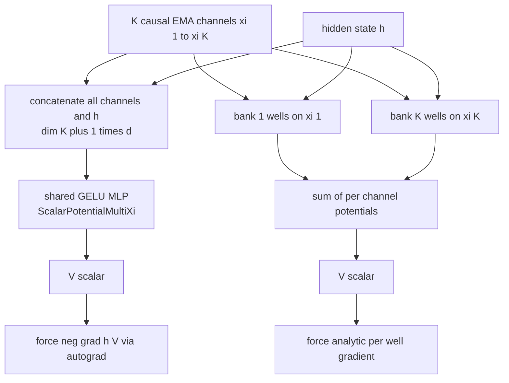
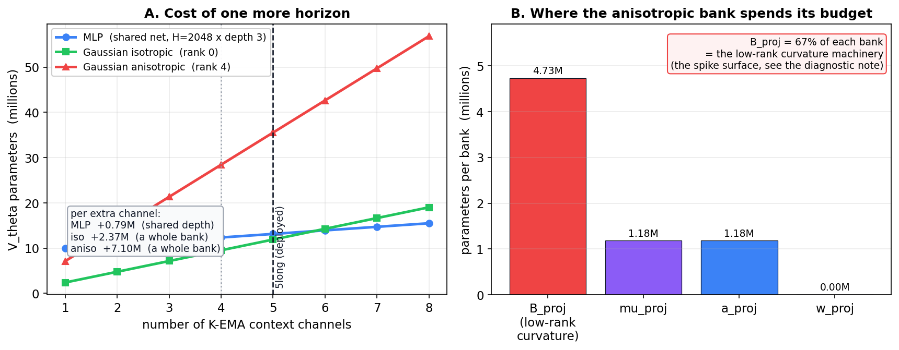
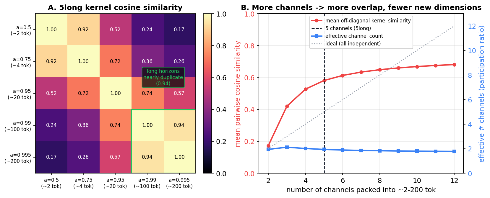
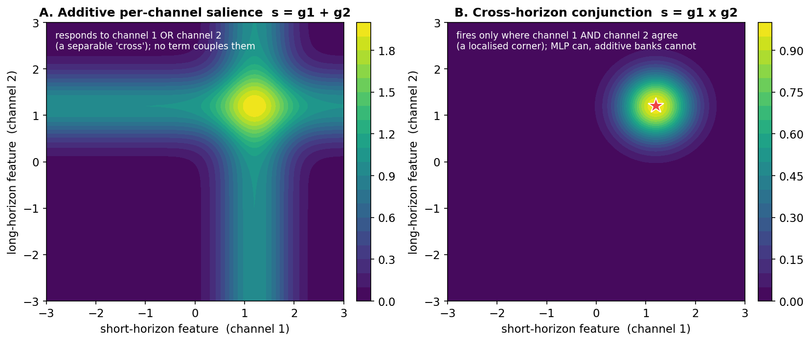
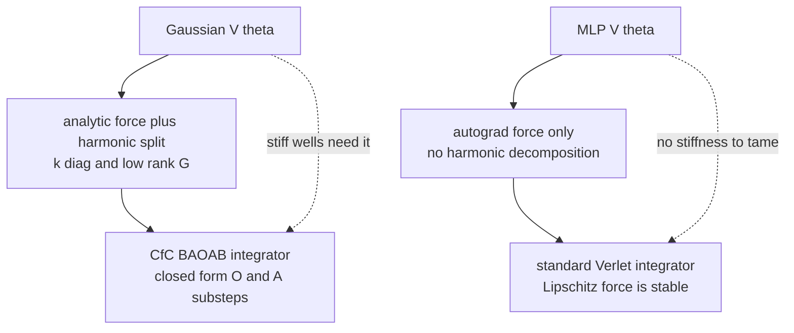
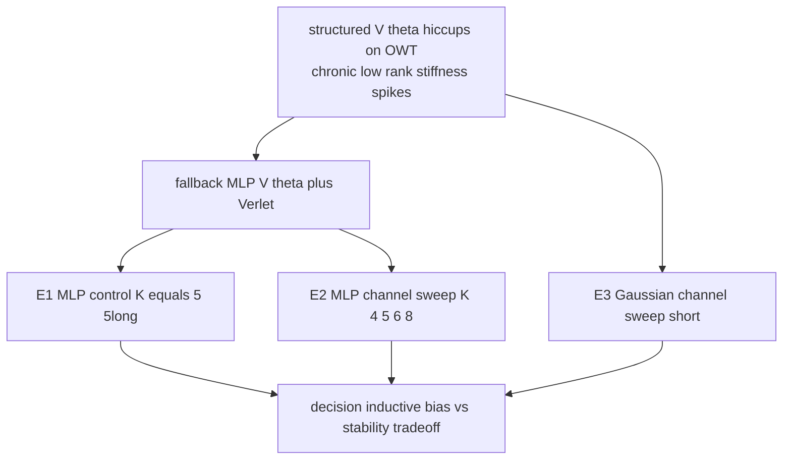

# MLP $V_\theta$ Fock-PARFLM on OpenWebText d384: Context Channels, the Verlet Fallback, and Planned Experiments

**Date:** September 2026
**Author context:** SemSimula / Fock-PARFLM independent research program
**Companion to:** [Fock Mechanism Engagement: MLP vs Gaussian V_theta](Fock_Mechanism_Engagement_MLP_vs_Gaussian_VTheta.md), [Training Instabilities in Fock-PARFLM with structured V_theta](Training_Instabilities_in_Fock-PARFLM_with_structured_V_theta.md), [CfC-BAOAB Integrator and Mitigations](CfC_BAOAB_Integrator_and_Mitigations.md), [Progressive Curvature Confinement for Aniso Gaussian V_theta](Progressive_Curvature_Confinement_for_Aniso_Gaussian_Vtheta.md), [Reducing the Information Bottleneck in Multi-Channel Xi SPLM](Reducing_Information_Bottleneck_In_Multi-Channel_Xi_SPLM.md)

---

> **Thesis.** The structured (anisotropic Gaussian) $V_\theta$ has stalled on OpenWebText d384 with a chronic, low-rank-curvature-driven gradient-spike problem (see the CfC-BAOAB note, §41, and the curvature-confinement note). This motivates re-running the **MLP $V_\theta$ arm with the standard Verlet integrator** as a stability control. This note (i) explains **how each $V_\theta$ consumes the K-EMA context channels** — the MLP *mixes* them, the Gaussian *superposes* them additively; (ii) argues from parameter cost, kernel redundancy, and expressivity that **the additive Gaussian sees diminishing, risk-increasing returns beyond ~4 channels**, whereas **the MLP scales more gracefully and can actually exploit extra horizons**; and (iii) lays out the planned OWT d384 experiments that test these predictions.

## Contents

- [1. Why revisit MLP $V_\theta$ now](#1-why-revisit-mlp-v_theta-now)
- [2. How the two $V_\theta$ consume the K-EMA context channels](#2-how-the-two-v_theta-consume-the-k-ema-context-channels)
- [3. The cost of one more horizon](#3-the-cost-of-one-more-horizon)
- [4. Redundancy: why extra EMAs hurt the additive Gaussian more](#4-redundancy-why-extra-emas-hurt-the-additive-gaussian-more)
- [5. Cross-horizon expressivity: the conjunction the additive form cannot represent](#5-cross-horizon-expressivity-the-conjunction-the-additive-form-cannot-represent)
- [6. Does the anisotropic Gaussian benefit beyond ~4 channels?](#6-does-the-anisotropic-gaussian-benefit-beyond-4-channels)
- [7. Will the MLP benefit more?](#7-will-the-mlp-benefit-more)
- [8. Why Verlet for the MLP arm](#8-why-verlet-for-the-mlp-arm)
- [9. Planned experiments on OWT d384](#9-planned-experiments-on-owt-d384)
- [10. Predictions and decision rules](#10-predictions-and-decision-rules)
- [11. Status and next steps](#11-status-and-next-steps)

---

## 1. Why revisit MLP $V_\theta$ now

The OpenWebText d384 scale-up has been run with a **structured** $V_\theta$: a depth-conditioned bank of anisotropic Gaussian wells (5 context banks $\times$ 8 wells, low-rank precision of rank 4). That parameterisation buys a strong inductive bias — 40 attractors exist from step 0 — but it owns two failure modes documented in the structured-instabilities note and re-confirmed by the CfC-BAOAB diagnostic programme:

1. **Precision runaway.** Each well carries a precision that, when it sharpens, produces a force spike near the well centre; the diagnostic replays (CfC-BAOAB note §41) show this is **chronic**, with the low-rank quadratic form supplying $\gt 99.9\%$ of the well exponent and catastrophic exponent tails.
2. **Well collision / ill-conditioning.** Two centres drifting together yield a stiff saddle — the dominant spike source at $d \ge 384$.

The MLP $V_\theta$ has **neither** failure mode. It is an unstructured GELU MLP over the concatenation of the context channels and the hidden state; a depth-$L_v$ MLP is Lipschitz-bounded by the product of its layer spectral norms, so no single parameter can produce an unbounded force. Its force is computed by autograd rather than in closed form, which — as we discuss in §8 — puts it on the **standard Verlet integrator** rather than the CfC-BAOAB path.

So the MLP arm is the natural stability control, and re-running it is the concrete "fall back to MLP $V_\theta$ + Verlet" step. Two standing questions come along for the ride:

- **Does the anisotropic Gaussian benefit from more than ~4 K-EMA context channels?**
- **Would the MLP benefit *more* from extra channels than the Gaussian?**

The rest of this note answers both from architecture, then turns the answers into experiments.

---

## 2. How the two $V_\theta$ consume the K-EMA context channels

A **context channel** $\xi^{(k)}$ is a causal, normalised exponential moving average of the hidden state at one timescale,

$$\xi^{(k)}_t = (1-\alpha_k) \sum_{s \le t} \alpha_k^{t-s} h_s ,$$

so the bank of $K$ channels is a bank of $K$ causal temporal views with horizons $\tau_k \approx 1/(1-\alpha_k)$. The deployed OWT config is `5long`, with $\alpha = [0.50, 0.75, 0.95, 0.99, 0.995]$ — horizons of roughly $2, 4, 20, 100, 200$ tokens.

The two $V_\theta$ variants differ entirely in **how they combine these views**.

**MLP $V_\theta$ (`ScalarPotentialMultiXi`) — full mixing.** It flattens all channels, concatenates the hidden state, and feeds one shared MLP:

```python
class ScalarPotentialMultiXi(nn.Module):
    """V_theta : R^{(K+1)*d} -> R. Concatenation of K xi-channels and h."""
    def __init__(self, d, hidden, depth, K):
        super().__init__()
        in_dim = (K + 1) * d
        layers = [nn.Linear(in_dim, hidden), nn.GELU()]
        for _ in range(depth - 1):
            layers += [nn.Linear(hidden, hidden), nn.GELU()]
        layers += [nn.Linear(hidden, 1)]
        self.net = nn.Sequential(*layers)

    def forward(self, xis, h):                 # xis: (B,T,K,d), h: (B,T,d)
        B, T, K, d = xis.shape
        flat_xis = xis.reshape(B, T, K * d)
        cat = torch.cat([flat_xis, h], dim=-1)  # (B,T,(K+1)*d)
        return self.net(cat)                    # (B,T,1)
```

Every channel meets every other channel in the very first linear layer. The potential is a single joint function

$$V^{\text{MLP}}(h; \xi^{(1)}, \dots, \xi^{(K)}) = f_{\text{MLP}}\big(\xi^{(1)}, \dots, \xi^{(K)}, h\big),$$

whose Hessian in the channel inputs is dense: cross-horizon second derivatives $\partial^2 V / \partial \xi^{(j)} \partial \xi^{(k)}$ are generically nonzero.

**Anisotropic Gaussian $V_\theta$ (`AnisotropicMultiContextGaussianVTheta`) — additive superposition.** It gives each channel its **own** well bank and **sums** the per-channel potentials:

```python
class AnisotropicMultiContextGaussianVTheta(nn.Module):
    """Per-context anisotropic Gaussian well banks: V = sum_m V^(m)(xi^(m), h)."""
    def forward(self, xis, h, *, comps=None):
        out = self.banks[0](xis[..., 0, :], h, comps=_ctx(comps, 0))
        for m in range(1, self.n_ctx):
            out = out + self.banks[m](xis[..., m, :], h, comps=_ctx(comps, m))
        return out
```

The functional form is

$$V^{\text{Gauss}}(h; \xi^{(1)}, \dots, \xi^{(K)}) = \sum_{m=1}^{K} V^{(m)}\big(\xi^{(m)}, h\big),$$

which is **separable across channels**: the channel-input Hessian is block-diagonal and every cross-horizon second derivative is exactly zero. This single structural fact — dense mixing versus block-diagonal superposition — drives everything in §§3–7.



---

## 3. The cost of one more horizon

How much does one extra context channel cost each parameterisation?

**MLP.** Only the first layer sees the channels, and adding a channel adds $d$ input columns to that layer's weight — the deep stack is shared and untouched:

$$\Delta P_{\text{MLP}} = d \cdot H .$$

For $d = 384$, $H = 2048$ that is $\approx 0.79\text{M}$ parameters per channel, *regardless of how many channels already exist*.

**Anisotropic Gaussian.** Adding a channel adds a whole new bank. Each bank has projections `mu_proj`, `a_proj`, `w_proj`, and (for rank $r$) `B_proj`, all from $\mathbb{R}^d$:

$$\Delta P_{\text{Gauss}} = (d+1)\big[\underbrace{2 W d}_{\mu,a} + \underbrace{W}_{w} + \underbrace{W d r}_{B}\big],$$

with $W = 8$ wells, $r = 4$: that is $\approx 7.10\text{M}$ per channel — nearly **9$\times$** the MLP's marginal cost. The isotropic ($r = 0$) bank is lighter at $\approx 2.37\text{M}$, still $3\times$ the MLP.

The breakdown matters as much as the total. Of each anisotropic bank, **67% is `B_proj`** — the low-rank curvature machinery that produces the precision factor $B_k$. That is *exactly the spike surface* identified in the diagnostic programme: adding a Gaussian channel does not just cost 9$\times$ more parameters, it **multiplies the low-rank curvature machinery that generates the spikes**.



*Figure 1. Left: $V_\theta$ parameter count vs. the number of context channels. The MLP grows with a gentle, constant slope (one channel adds a slice of the first layer only), while each Gaussian channel adds a whole bank — steeply for the anisotropic rank-4 variant. Right: per-bank breakdown of the anisotropic bank; `B_proj` (the low-rank curvature, i.e. the spike surface) dominates at 67%.*

---

## 4. Redundancy: why extra EMAs hurt the additive Gaussian more

Extra channels only help if they carry new information. But the EMA kernels themselves overlap heavily once horizons get long. Writing the kernel of channel $k$ over lags $j$ as $w_k[j] \propto \alpha_k^{j}$, the cosine similarity between the two longest `5long` kernels ($\alpha = 0.99$ and $\alpha = 0.995$) is **0.94** — they are near-duplicates. Diagonalising the kernel Gram matrix gives a **participation ratio of about 2.0**: the five channels span only ~2 effectively-independent temporal mixing kernels.



*Figure 2. Left: cosine similarity of the `5long` EMA kernels; the two long horizons are 0.94-correlated. Right: as more channels are packed into the same $2$–$200$ token band, mean pairwise kernel similarity rises and the effective channel count (participation ratio) stays near 2 instead of tracking the ideal diagonal — extra channels add overlap, not new dimensions.*

Redundancy is where the two consumers diverge sharply:

- The **MLP absorbs redundancy for free.** Its first linear layer can linearly recombine correlated channels; two near-duplicate horizons collapse into (approximately) one used direction, and the wasted capacity is a fraction of one shared weight matrix. Correlation costs it almost nothing.
- The **additive Gaussian pays full price for every redundant channel.** A near-duplicate horizon still gets its own 7.1M-parameter bank, and because the potential is a *sum with no cross terms*, the model cannot merge two correlated banks into one — it can only stack two overlapping sets of wells, doubling the curvature machinery (and the spike surface) for almost no new information.

This is the first half of the answer to "does the Gaussian benefit from more channels": past the point where kernels start overlapping (empirically around 4–5 for this horizon range), each new Gaussian channel is mostly redundant capacity **and** mostly new spike surface.

---

## 5. Cross-horizon expressivity: the conjunction the additive form cannot represent

Redundancy explains wasted capacity; separability explains a hard expressivity ceiling. Because $V^{\text{Gauss}} = \sum_m V^{(m)}(\xi^{(m)}, h)$ has no cross-channel term, it can only represent potentials that respond to the channels **independently** — "sharpen if the short-horizon context matches well A **or** the long-horizon context matches well B." It structurally *cannot* represent a **conjunction**: "sharpen only where the short-horizon context **and** the long-horizon context agree."

The MLP can, because its hidden units compute functions of *joint* channel inputs and its nonlinearity can gate one horizon on another.



*Figure 3. A toy two-channel salience field. Left: an additive field $s = g_1 + g_2$ — what per-channel Gaussian banks produce — responds to channel 1 OR channel 2 and forms a separable "cross"; no term couples the horizons. Right: a conjunction $s = g_1 \times g_2$ fires only where both channels agree (a localised corner). The MLP can represent the right panel; the additive Gaussian cannot.*

This is the second half — and the more fundamental half — of the "who benefits from more channels" question. Extra channels are only worth adding if the model can **combine** them. For the MLP, more channels means more raw material for cross-horizon conjunctions, so added channels have somewhere useful to go. For the additive Gaussian, more channels can only add independent, non-interacting wells; there is no mechanism that turns two horizons into a joint feature, so the marginal expressive gain of a channel decays quickly toward zero.

---

## 6. Does the anisotropic Gaussian benefit beyond ~4 channels?

Putting §§3–5 together: **marginally, and with rising risk.**

| Axis | What happens as channels grow past ~4 | Direction |
|---|---|---|
| Information | kernel participation ratio saturates near 2; new channels overlap old ones | diminishing |
| Parameter cost | +7.1M per channel (anisotropic), a whole bank | rising |
| Instability | +67% of that is `B_proj`, i.e. new low-rank spike surface | rising |
| Expressivity | additive form cannot form cross-horizon conjunctions from the extra channels | flat |

Empirically this matches what we already have: the multi-channel bottleneck study and the pre-registered protocol locked $K = 4$, and an ablation that pushed `xi_channels` from 4 to 8 **slightly hurt** PPL for the structured $V_\theta$. Note that `5long` did **not** win by *counting* to five — it won (where it did) by *placing* horizons longer ($\alpha$ up to 0.995), i.e. by better spacing, not by more channels.

**Recommendation for the Gaussian arm:** treat the channel count as a small fixed budget ($K \approx 4$–$5$) and spend design effort on **horizon placement / spacing**, not on adding channels. If anything, adding channels to the anisotropic Gaussian is a net-negative move on OWT d384 today because it enlarges the very spike surface we are trying to bound (see the curvature-confinement note).

---

## 7. Will the MLP benefit more?

**Yes, and it degrades gracefully.** The same three axes that penalise the Gaussian all favour the MLP:

- **Mixing.** Extra channels feed the first layer and become available to every hidden unit, so they can enter cross-horizon conjunctions (§5).
- **Redundancy absorption.** Correlated channels collapse into shared directions at near-zero cost (§4).
- **Cheap margins.** One channel is $\approx 0.79\text{M}$ params on a shared stack, not a fresh 7.1M bank (§3).
- **No new spike surface.** The MLP has no precision factor to blow up; its Lipschitz bound is unchanged in form as $K$ grows.

Two honest caveats. First, this is an **architectural prediction**: we do not yet have a direct MLP channel sweep on OWT d384 — that is exactly experiment E2 below. Second, the MLP's known costs are unchanged by this argument: it converges **slower** (the landscape must be discovered rather than existing at init) and it is **heavier per step** (the force needs `autograd.grad(..., create_graph=True)` through the full MLP). The trade is stability and graceful channel-scaling in exchange for convergence speed.

---

## 8. Why Verlet for the MLP arm

The CfC-BAOAB integrator is not an option for the MLP arm, and this is structural, not a choice. CfC-BAOAB needs an **analytic force** *and* an analytic **harmonic split** of that force into a diagonal spring $k_{\text{diag}}$ and a low-rank operator $G G^\top$ (the terms that let the O/A substeps be solved in closed form). Only the Gaussian $V_\theta$ exposes those: `harmonic_terms` and `harmonic_terms_lowrank` exist precisely because the Gaussian potential is a quadratic-in-the-exponent object. The MLP force is `-∇_h MLP` obtained by autograd, with **no** closed-form harmonic decomposition, so the MLP arm runs the **standard Verlet** layer step.

Crucially, this is fine: the MLP arm does **not have** the stiffness that motivated CfC-BAOAB in the first place. CfC-BAOAB was introduced to survive the sharpening Gaussian wells whose local curvature $K$ makes the explicit update stable only while $\omega \Delta t \lt 2$ with $\omega = \sqrt{K/m}$. The MLP's force is globally Lipschitz by construction, so a plain symplectic Verlet step is stable at the deployed $\Delta t$ without any of the CfC-BAOAB machinery. In other words, "MLP $V_\theta$ + Verlet" is not a downgrade — it is the correct, matched integrator for a non-stiff force.



---

## 9. Planned experiments on OWT d384

Everything is held identical to the structured d384 run except $V_\theta$ and the integrator: same `5long` channels, same $V_\phi$ (`structural_competitive`, 4 heads, `top_k=16`), same WSD schedule, same reverse-channel stabilisation, same `TOTAL_STEPS`, same seed. The MLP config is the deployed one:

```python
# colab_fock_mlp_vtheta_openwebtext_d384.ipynb
V_THETA_HIDDEN = 2048   # v_hidden  (1024 -> 4.5M, 2048 -> 13.1M, 4096 -> 43.0M)
V_THETA_DEPTH  = 3      # v_depth   (number of hidden GELU blocks)
XI_OVERRIDE    = '5long' # alphas [0.50, 0.75, 0.95, 0.99, 0.995]
TOP_K          = 16
# V_theta = ScalarPotentialMultiXi(d, hidden=V_THETA_HIDDEN,
#                                  depth=V_THETA_DEPTH, K=XI_CHANNELS)
# force = -autograd.grad(V.sum(), h, create_graph=True); Verlet layer step
```



**E1 — MLP + Verlet control (the fallback run).** MLP $V_\theta$ at $K = 5$ (`5long`), parameter-matched by construction against the Gaussian run. Primary readouts: leak-free last-position PPL, spike rate (pre-clip grad-norm exceedances), and convergence curve. Hypothesis: no watchdog reloads, at the cost of slower early PPL.

**E2 — MLP channel sweep.** MLP $V_\theta$ at $K \in \lbrace 4, 5, 6, 8 \rbrace$, horizons log-spaced over the same $2$–$200$ token band. This is the direct test of §7: PPL should improve or plateau (not degrade) as $K$ grows, and stability should be flat across $K$. Parameter drift is small ($\approx 0.79\text{M}$ per channel) and can be neutralised by nudging $H$ if a strict match is wanted.

**E3 — Gaussian channel sweep (short / offline).** For contrast, $K \in \lbrace 4, 5, 6 \rbrace$ on the anisotropic Gaussian, short runs only (they are expensive and spike-prone). This is the direct test of §6: PPL should be flat-to-worse and the spike rate should *rise* with $K$. If the aniso arm is too unstable to run cleanly, the offline replay ablations from the diagnostic programme (integrator and precision-cap replays) can stand in for a stability read at fixed weights.

---

## 10. Predictions and decision rules

| # | Prediction | Confirmed if | Falsified if |
|---|---|---|---|
| P1 | MLP + Verlet is stable at the deployed step size | E1 runs to `TOTAL_STEPS` with zero watchdog-hard reloads | E1 spikes like the Gaussian arm |
| P2 | MLP scales gracefully with channels | E2 PPL is monotone-improving or flat in K; stability flat | E2 PPL degrades with K (like the Gaussian) |
| P3 | Gaussian does not benefit past ~4 channels | E3 PPL flat-to-worse and spike rate rises with K | E3 PPL improves cleanly with K at no stability cost |
| P4 | Gaussian's channel cost is spike surface, not just params | precision-cap / integrator replays show larger K raises pre-clip norm | replays show K has no effect on pre-clip norm |

**Decision rule.** If P1 holds, the MLP + Verlet arm is the safe production track for OWT d384 while the structured arm's curvature confinement (see that note) is developed. If P1 and P2 both hold, prefer the MLP arm for *any* future multi-horizon scaling; reserve the Gaussian arm for small, well-placed channel budgets where its init-time inductive bias and analytic-force integrators pay off. The two arms are complementary, not competitors: the Gaussian gives fast, interpretable attractors at small $K$; the MLP gives stable, channel-scalable behaviour.

---

## 11. Status and next steps

- **Ready to run:** E1 (MLP + Verlet control) using `colab_fock_mlp_vtheta_openwebtext_d384.ipynb` as-is.
- **Next:** wire the E2 channel sweep (parameterise `XI_OVERRIDE` over the 4/5/6/8 log-spaced presets); it is a config-only change.
- **Cheap contrast:** E3 can piggyback on the diagnostic programme's offline replays rather than full training runs.
- **Open:** whether the MLP arm's slower convergence closes enough over `TOTAL_STEPS` to be PPL-competitive with the (unstable) Gaussian arm — this is the headline number E1 produces.

The broader point stands independent of the numbers: on OWT d384 the structured $V_\theta$ is currently paying its instability tax in exactly the machinery (low-rank curvature per bank) that also caps its ability to use extra context channels. The MLP $V_\theta$ + Verlet arm sidesteps both, which is why it is the right control to run now.

---

Provenance: figures generated by `companion_notes/figures/_make_mlp_vtheta_figs.py` (exact parameter-count formulas, exact EMA-kernel similarities for the deployed `5long` alphas, and a schematic additive-vs-conjunction salience field). Architecture facts drawn from `model_multixi.py` (`ScalarPotentialMultiXi`), `model_aniso_gaussian_vtheta.py` (`AnisotropicMultiContextGaussianVTheta`), and `colab_fock_mlp_vtheta_openwebtext_d384.ipynb`.

Last updated: September 2026 — initial version. Covers the MLP-vs-Gaussian context-channel consumption analysis, the Verlet-fallback rationale, and the E1/E2/E3 OWT d384 experiment plan.
