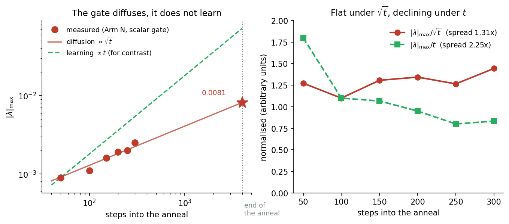
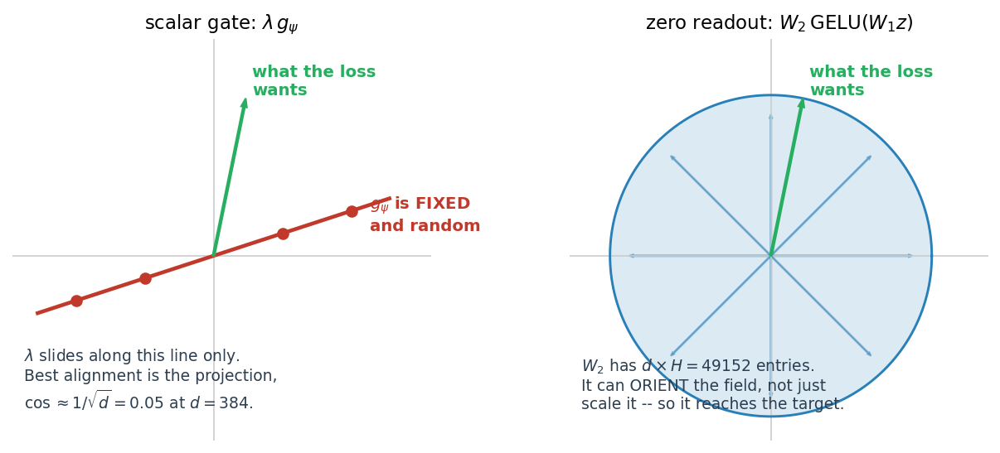

# Measuring the Price of Conservativity: a $\lambda$-Gated Relaxation Protocol

**Status:** proposed, not yet run. Derivation and protocol complete; no code
written beyond what already exists.
**Date:** 2026-09-19.
**Companion to:** [`Joint_Vtheta_QKNorm_Run_Diagnostic_Checklist.md`](Joint_Vtheta_QKNorm_Run_Diagnostic_Checklist.md) §10.8,
[`Fock_Inference_Productionization_Plan.md`](Fock_Inference_Productionization_Plan.md) §7,
[`Context_Mixing_Mechanisms_in_the_Conservative_Framework.md`](Context_Mixing_Mechanisms_in_the_Conservative_Framework.md) §8.

---

## 1. Why this experiment exists

A matched GPT-2 reaches **54.67** where the joint arm reaches **81.58**, on
identical data at identical tokens, with 2.66x fewer non-embedding
parameters. Six candidate explanations have been eliminated:

| candidate | result | where |
| --------- | ------ | ----- |
| well count | K=40 additive lost to K=8 joint | checklist §9.4 |
| anisotropic rank | participation ratio 3.68 of 4 — fully used | §9.4 |
| depth | L=16 not better, spikier | §7.5 |
| pair-path routing | 3.85% of compute; all-to-all is cheaper, not better | §10 |
| context representation | content-addressed pooling buys 2.1%, 16% of predicted | §10.8 |
| generator capacity | truncation past rank 1024 costs PPL monotonically | plan §6.1 |

**Elimination is not measurement.** Six eliminations license "it is not
these six"; they license "therefore it is the seventh" only if the candidate
set is provably complete, which it is not. The protocol below measures one
surviving candidate directly, at the cost of one warm-started 4,000-step
anneal per arm.

### 1.1 The residual is not one thing

It is tempting to read the table as "therefore conservativity", and the
earlier version of this section did. That reading elides two problems.

**The residual contains at least two distinct candidates.** They are at
completely different stages:

| candidate | status |
| --------- | ------ |
| **conservativity** — the update must be a negative gradient | implemented, gated, **one run from measurement**; this document |
| **second-order dynamics** — the Lagrangian and its geodesic reading | **no instrument.** §7.1 |

This protocol measures the first and says **nothing** about the second. A
result of the form "conservativity costs X nats" is not a result about the
Lagrangian, and must not be written as one.

**The eliminations do not point here.** They were not designed as a search
that converges on conservativity; each ruled out a different downstream
mechanism. The most recent two are the sharpest illustration:
`Fock_Inference_Productionization_Plan.md` §7 diagnosed the ξ bottleneck —
context that is weighted by distance and never by content — and staked two
pre-registered predictions on it. Both failed (§7.6 there): content-addressed
pooling bought 1.79 PPL against a predicted 10 or more, and truncating the
generator to rank 256 cost +32.34 PPL against a predicted "under 2". So the
residual is **"none of the candidates tested"**, which is a weaker statement
than "the constraint itself", and it still contains anything nobody has
named.

Six eliminations and **zero of the 26.91 PPL explained**. That is the honest
position this protocol starts from.

### 1.2 What the obstruction theorem does and does not give you

`thm:conservative-obstruction` (paper §17c) proves that attention's P1
(asymmetric coupling), P2 (coupling–content decoupling) and P3 (normalised
budget) cannot all hold for a $C^{2}$ scalar potential. That is a **proof
that conservativity forbids attention's mechanism**. It is not a measurement
of what the prohibition costs, and the two are independent. Both of these
are consistent with the theorem:

1. conservativity forbids attention-style routing, and that prohibition is
   worth most of the 26.91 PPL;
2. conservativity forbids attention-style routing, and the model loses
   26.91 PPL for a reason that has nothing to do with it.

A theorem about what a hypothesis class cannot express places no lower bound
on the loss of the best model inside it. Separating (1) from (2) is the
entire purpose of the $\lambda$ sweep, and is why the theorem — which was
already available — does not make the experiment redundant.

---

## 2. What the constraint actually costs, in degrees of freedom

Let $f : \mathbb{R}^{d} \to \mathbb{R}^{d}$ be the per-token force at fixed
context, and $J = \partial f / \partial h$ its Jacobian.

**Proposition.** On a simply connected domain, $f$ is the negative gradient
of a scalar potential if and only if $J$ is symmetric everywhere.

This is the Poincaré lemma. The forward direction is Clairaut's theorem:
if $f = -\nabla U$ then, for $U$ twice continuously differentiable,

$$J_{ij} = -\partial_{i}\partial_{j}U = -\partial_{j}\partial_{i}U = J_{ji}.$$
 The converse is the standard
integrability result, and simple connectedness is what rules out the
punctured-plane counterexamples.

Symmetry is not a mild condition. $J$ has $d^{2}$ entries; requiring
$J = J^{\top}$ imposes one equation per strictly-upper-triangular entry:

$$N_{\text{constraints}} = \frac{d(d-1)}{2}, \qquad \frac{N_{\text{constraints}}}{d^{2}} = \frac{d-1}{2d} \longrightarrow \frac{1}{2} \quad (d \to \infty).$$

At the deployed $d = 384$ that is **73,536 of 147,456 entries, or 49.87%**.
Half the linear response of the force field, at every point, is forbidden by
construction.


This is the sharpest statement of what the framework gives up, and it is
worth being precise about what it does *not* say. It does not say the model
loses half its capacity — the potential $U$ is still an arbitrary scalar
function, and scalar functions of $d$ variables are a rich class. It says
the *linear response* of the force is restricted to a subspace of half the
dimension. Whether that restriction costs anything in language modelling is
exactly the empirical question.

---

## 3. The relaxation

Replace the force law with a gated sum:

$$f_{\lambda}(\xi, h) = -\nabla_{h} U(\xi, h) + \lambda \cdot g_{\psi}(\xi, h), \qquad \lambda \in \mathbb{R}, \quad \lambda\big|_{t=0} = 0,$$

where $U = V_{\theta} + V_{\phi}$ is the existing potential and $g_{\psi}$ is
an unconstrained vector field with its own parameters.

### 3.1 The start is exact, not approximate

At $\lambda = 0$ the added term vanishes identically, so
$f_{0} = -\nabla_{h}U$ is **bit-identical** to the deployed model. The probe
therefore warm-starts from `_step28500_best.pt` and reuses §6.3's decay
unchanged, exactly as Alternative E did. This is what makes the comparison
against 81.58 controlled rather than merely similar: same checkpoint, same
schedule, same step count, same data order, one variable.

### 3.2 The defect is exactly linear in $\lambda$

Write $A(M) = \tfrac{1}{2}(M - M^{\top})$ for the antisymmetric part. The
Jacobian of the gated force decomposes as

$$J_{\lambda} = \underbrace{-\nabla^{2}_{h}U}_{\text{symmetric}} + \lambda J_{g}, \qquad A(J_{\lambda}) = \lambda  A(J_{g}),$$

because the Hessian of a scalar contributes nothing to the antisymmetric
part. Define the **conservativity defect**

$$\kappa(\lambda) = \frac{\lVert A(J_{\lambda}) \rVert_{F}}{\lVert J_{\lambda} \rVert_{F}} = \frac{\lambda \lVert A(J_{g}) \rVert_{F}}{\lVert -\nabla^{2}U + \lambda J_{g} \rVert_{F}}.$$

Three properties follow immediately. $\kappa(0) = 0$ exactly, not
approximately. It is monotone in $\lambda$ for small $\lambda$, with slope

$$\kappa'(0) = \lVert A(J_{g}) \rVert_{F} / \lVert \nabla^{2}U \rVert_{F}.$$

And as $\lambda \to \infty$ it saturates at

$$\kappa_{\infty} = \lVert A(J_{g}) \rVert_{F} / \lVert J_{g} \rVert_{F},$$

so it is bounded and dimensionless.

#### What "frozen context" means, and why kappa must respect it

The framework's conservativity is curl-free **with the detached context
held fixed**. That qualifier is load-bearing, and it is easy to measure
past.

Detaching removes a quantity from the *gradient*, not from the *value*. If
the routing is read off `h.detach()`, then perturbing `h` still changes the
routing weights, even though autograd treats them as constant. A finite
difference that recomputes the context from the perturbed state therefore
picks up a term the force never contained, and the field reads as
non-integrable when it is not.

Measured on the conservative attention arm at $d = 16$:

| measurement | kappa |
| ----------- | ----: |
| routing source frozen, as arm 1 prescribes | **0.000e+00** |
| routing source recomputed from the perturbed state | 0.654 |

The second number is an artefact of the protocol, not a property of the
force. It is the same trap as §3.3's finite-difference check needing
`h_src` frozen, one level further in.

This is not a loophole. Within a layer step the context genuinely is
frozen: `xis` is computed once from `h.detach()` and the integrator then
moves `h` through its substeps against a fixed potential. That is precisely
the setting the Jacobi-metric construction of §5 assumes. Across layers the
potential changes, which is the non-autonomy the framework already
acknowledges through `depth_code`.

**Consequence for the protocol.** Every kappa in §7 must be measured with
the routing source and `h_src` pinned. A non-conservative arm has nothing
to pin -- `DirectExchangeForce` detaches nothing -- so the comparison is
between a field measured with its context frozen and one that has no frozen
context to speak of. That asymmetry is the measurement, not a flaw in it.

This quantity is already implemented. `conservativity_diagnostic.py` arm 1
computes it under the name `antisymmetry_ratio`:

```python
J_sub     = J_cons[probe_indices, :]
J_antisym = 0.5 * (J_sub - J_sub.T)
frob_J       = torch.norm(J_sub, p="fro").item()
frob_antisym = torch.norm(J_antisym, p="fro").item()
ratio_cons   = frob_antisym / (frob_J + 1e-12)
hess_pass    = ratio_cons < 0.02
```

Note the existing pass threshold of `0.02`, and note that the same file's
test C applies the *opposite* test to the reverse channel
(`curl_pass = ratio_Q > 1e-2`), confirming that force is genuinely
non-conservative. **The architecture already contains a non-conservative
channel.** This protocol does not introduce something foreign to the
framework; it makes an existing degree of freedom explicit and measurable.

### 3.3 The initialisation trap, and why it is already documented

The gradients of the gated term are

$$\frac{\partial f_{\lambda}}{\partial \lambda} = g_{\psi}, \qquad \frac{\partial f_{\lambda}}{\partial \psi} = \lambda \frac{\partial g_{\psi}}{\partial \psi}.$$

Setting both $\lambda = 0$ and $\psi = 0$ makes **both** vanish: the loss
depends on the product, so the origin is a saddle the optimiser never
leaves. A probe built that way reports no gain with nothing ever having
learned, which is indistinguishable from a genuine null.


An asymmetric initialisation — $\lambda = 0$ with
$\psi \sim N(0, \sigma^{2})$ — escapes the saddle proper, and that was the
first design. **It is not sufficient, and the first run showed why.**

### 3.4 Why a scalar gate is not enough

Arm N was launched on 2026-09-19 with a scalar $\lambda$ and stopped after
300 steps. The gate left zero, but not in the way a learning parameter does.

| steps into the anneal | peak λ | ratio to √t | ratio to t |
| ---: | ---: | ---: | ---: |
| 50 | 0.0009 | 1.27e-04 | 1.80e-05 |
| 100 | 0.0011 | 1.10e-04 | 1.10e-05 |
| 150 | 0.0016 | 1.31e-04 | 1.07e-05 |
| 200 | 0.0019 | 1.34e-04 | 9.50e-06 |
| 250 | 0.0020 | 1.27e-04 | 8.00e-06 |
| 300 | 0.0025 | 1.44e-04 | 8.33e-06 |
| | | **spread 1.31x** | **spread 2.25x** |

Here *peak λ* is the largest per-layer gate magnitude, the `|lam|max` field
in the training log.

**This is the signature of a random walk.** A diffusing quantity grows as
√t; a parameter being optimised grows at least linearly. The √t-normalised
column is flat to within 31% across a sixfold change in t, while the
t-normalised column falls by a factor of 2.25. Sign
flips corroborate it — 12 of the 40 per-layer transitions reversed — but the
scaling test is the decisive one, because a slowly-learning parameter could
also change sign occasionally while a diffusing one cannot hold a fixed
$\sqrt{t}$ ratio by accident.



The fitted diffusion constant is 1.29e-04 per $\sqrt{\text{step}}$.
Extrapolated across the full 4,000-step anneal that gives
$\lvert \lambda \rvert_{\max} \approx 0.008$ — against a $g_{\psi}$ already
scaled by 0.02, a contribution to the force of order 1e-4. The run would
have completed and measured the optimiser.

The loss trace agrees. Against the control at the same six steps, Arm N
averaged **-0.0014 nats with 4 of 6 favourable**, inside noise, where
Alternative E at those same steps averaged **-0.0105 with 6 of 6** — a
mechanism **7.7x stronger** and unambiguous in sign.

The reason is that a scalar can rescale a direction but cannot orient one.
With $\psi$ frozen at initialisation, $g_{\psi}$ is a *fixed random field*,
and

$$\frac{\partial L}{\partial \lambda} = \left\langle \frac{\partial L}{\partial f},\ g_{\psi} \right\rangle .$$

A random direction in $\mathbb{R}^{d}$ overlaps any fixed one by about
$1/\sqrt{d}$, which is 0.05 at $d = 384$, with a sign that varies batch to
batch. So the gradient on $\lambda$ is small and its sign is close to
arbitrary: a random walk.

**Raising $\sigma$ does not rescue it.** Scaling $\psi$ scales $g_{\psi}$,
and therefore both the signal and the per-batch noise in
$\partial L / \partial \lambda$, by the same factor — the ratio is
unchanged. Adam compounds the point: its update is invariant to gradient
scale, so $\lambda$'s step size would not move either.

### 3.5 And why the fix is not sufficient either

The zero readout was launched on 2026-09-19 and stopped after 550 steps. It
failed in the opposite direction.

| | scalar gate | zero readout |
| --- | ---: | ---: |
| force share after 50 steps | ~0 | **0.34** |
| force share, settled | — | **0.575**, peak 0.633 |
| train loss vs control, first step | +0.000 | **+0.078 nats** |
| train loss vs control, settled | -0.001 | +0.012 nats |
| val at step 29,000 | — | **89.72 against the control's 88.16** |

The readout did exactly what §3.5 promised: it engaged immediately, with
the gradient on `W_2` some 850x the scalar's. But it engaged *too*
immediately, taking a third of the force within 50 steps and settling near
**57%**, and the loss never recovered. It is not probing the space, it is
occupying it.

The per-layer shares are worth recording: 0.30 at layers 0-1, 0.13 across
the middle, and **0.54 at the deepest layer**. Whatever the field is doing,
it concentrates at the top of the stack.

**What this does and does not establish.** It is a real data point: a
generic unconstrained field carrying more than half the force makes the
model 1.56 PPL worse. It is *not* evidence that non-conservativity cannot
help, because the onset was abrupt and uncontrolled and the field may be
stuck in a poor configuration it had no chance to leave.

**The lesson is that a learned gate cannot be trusted at either end.** One
parameterisation diffused and never engaged; the other seized half the
dynamics in fifty steps. In both cases what got measured was the
optimiser. §7 therefore pins lambda and sweeps it, which removes the
optimiser from the measurement and yields a curve instead of a point.

### 3.6 The fix: zero the readout, not the gate

Drop the scalar. Initialise the **output layer** of $g_{\psi}$ to zero and
leave the input layer random:

```python
g_psi = nn.Sequential(nn.Linear((K+1)*d, H), nn.GELU(), nn.Linear(H, d))
nn.init.normal_(g_psi[0].weight, std=0.02)   # random features, frozen at first
nn.init.zeros_(g_psi[2].weight)              # zero readout, live gradient
```

Everything the design needed is preserved and the defect is removed:

- $g_{\psi} \equiv 0$ at initialisation, so step 0 is still **bit-identical**
  and the warm start is still exact.
- $\partial L / \partial W_{2} = \delta \otimes \mathrm{GELU}(W_{1}z)$ is
  non-zero from step 1 and points where the loss wants to go, rather than
  along a random direction.
- $W_{2}$ has $d \times H$ entries, so it can **orient** the added force,
  not merely scale a fixed draw.
- $\partial L / \partial W_{1} = 0$ at init and unlocks once $W_{2}$ moves:
  the same asymmetric structure, with the useful half now live.



The figure states the difference geometrically. A scalar can only slide
along the one direction it was handed; the best alignment it can ever reach
is the projection of the target onto a random draw, which is
$1/\sqrt{d} = 0.05$ at $d = 384$ and of arbitrary sign. A matrix readout
spans the space and can rotate the field onto the target.

This is the standard zero-init-the-output-projection trick from residual
architectures. Measured at $d = 32$: readout gradient **1.5e-01** against
**1.7e-04** on the scalar, with 49152 orientable parameters against 1, and
the field exactly zero at init in both. Gates re-run against the new
default: bit-identity 0.000e+00 on both arms, Arm N $\kappa = 0.714$ at
**1900x** the finite-difference noise floor, Arm C $\kappa$ = 3.8e-06 at
**0.01x** it — cleaner than under the scalar gate — and causality exactly
zero.

**The measurement changes with it.** $\lambda$ is fixed at 1 and is no
longer the readout. Its place is taken by the per-layer force share

$$\mathrm{share}_{\ell} = \frac{\lVert g_{\psi} \rVert}{\lVert f^{\mathrm{cons}}_{\ell} \rVert},$$

the fraction of the dynamics the model has chosen to take outside the
conservative class — which §7 already listed as the most interpretable
single number. The superseded scalar gate is retained as
`relax_gate='scalar'` so the 2026-09-19 run can be reproduced.

---

## 4. The confound, and the control arm that removes it

**A single arm cannot answer the question.** If $\lambda$ rises and
perplexity falls, two explanations fit equally well:

1. the model wanted a non-conservative force, or
2. the model wanted **more force capacity**, and $g_{\psi}$ supplied it.

Explanation 2 is not idle. $g_{\psi}$ adds parameters, and nothing prevents
a learned $g_{\psi}$ from being close to a gradient field — in which case
$\kappa$ stays near zero and the gain is pure capacity.

The protocol therefore runs **two arms with matched parameter counts**.
Arm N leaves the added field unconstrained:

$$f = -\nabla_{h}U + \lambda g_{\psi}(\xi, h), \qquad g_{\psi} : \mathbb{R}^{(K+1)d} \to \mathbb{R}^{d}.$$

Arm C routes the same parameter budget through a scalar, so the total force
is still a gradient:

$$f = -\nabla_{h}\left(U + \lambda \Phi_{\psi}(\xi, h)\right), \qquad \Phi_{\psi} : \mathbb{R}^{(K+1)d} \to \mathbb{R}.$$

| arm | added field | defect κ | what a gain would prove |
| --- | ----------- | -------- | ----------------------- |
| **N** (non-conservative) | vector-valued, unconstrained | free to grow | capacity **and/or** non-conservativity |
| **C** (conservative control) | scalar-valued potential | 0 by construction | capacity alone |

Arm C adds the same parameter budget and the same gating structure, but
routes it through a scalar potential, so $\kappa \equiv 0$ throughout by
construction. Matching is on $|\psi|$, not on architecture: $g_{\psi}$ emits
$d$ components and $\Phi_{\psi}$ emits one, so $\Phi_{\psi}$ is given
proportionally more width to equalise the count.

$$\Delta_{\text{capacity}} = \mathrm{PPL}_{\text{control}} - \mathrm{PPL}_{\mathrm{C}}, \qquad \Delta_{\text{conservativity}} = \mathrm{PPL}_{\mathrm{C}} - \mathrm{PPL}_{\mathrm{N}}.$$

The second quantity is the paper's number. The first is the confound it
would otherwise be mistaken for.

---

## 5. What $\lambda \gt 0$ destroys

The trade is not free in the other direction either, and this is what makes
the experiment interesting rather than merely destructive.

The Jacobi metric of
`Damped_Riemannian_Geodesics_in_the_SPLM_family-Comparative_Analysis.md` is
the conformal rescaling

$$\tilde{g}_{ij} = 2(E - V) g_{ij} = \Omega^{2} \delta_{ij},$$

with the damped generalisation $\Omega^{2}_{\ell} = 2 T_{\ell} m$. Its
construction **requires $V$ to exist**. If $f$ is not a gradient there is no
$V$, hence no $\Omega^{2}$, hence no Jacobi metric, no Christoffel symbols,
and no geodesic reading of the trajectories. Every diagnostic in the
Riemannian battery is defined only at $\kappa = 0$.

So $\lambda$ is not a knob between "worse" and "better". It is a dial
between **perplexity and geometric interpretability**, and the protocol
measures the exchange rate. That framing is what
`Geodesic_Preservation_Experiment.md` already argues is the programme's
structurally exclusive capability: *not* that the perplexity is lower, but
that the geometry of the dynamics is measurable at all.

A paper reporting only the cost is a post-mortem. A paper reporting the cost
**and** what the constraint uniquely buys is a contribution.

---

## 6. Outcomes


Each quadrant is decisive, which is the point of pre-registering them:

- **High gain, $\kappa \gt 0.02$, Arm N beats Arm C.** The measurement. State
  the cost of conservativity in nats at matched parameters and data.
- **High gain, $\kappa \lt 0.02$, Arm C matches Arm N.** The gain was capacity.
  The constraint is free and the framework is vindicated on this axis.
- **No gain, $\lambda$ stays near zero.** The model, offered the option to
  violate the constraint, declines it. A strong positive result — and the
  most favourable outcome available to the framework. But read §1.1 before
  writing it up: a null here **relocates** the residual to the second-order
  dynamics, it does not resolve it, and that candidate currently has no
  instrument. "Conservativity is free" and "the framework is vindicated" are
  different claims, and only the first is supported.
- **$\kappa$ rises with no gain.** Suspect the $\lambda$ parameterisation or
  the Arm C matching before believing it.

---

## 7. Protocol

Derived from the Alternative E probe, which established every piece of this
machinery.

| gate | what | cost | criterion |
| ---- | ---- | ---- | --------- |
| 0 | build both arms; `_smoke` | minutes | `pair_potential` and force-law branches are opt-in, default path bit-identical |
| 1 | conservativity check at λ = 0 | minutes | arm 1 test A: force equals the finite-difference gradient with context frozen. **Arm C must also pass at λ > 0** |
| 2 | causality | minutes | `scaf.audit(...).assert_causal()` — not a hand-rolled future-perturbation probe |
| 3 | step-0 eval | minutes | **must read 84.31 exactly** on both arms, or the warm start is not bit-identical |
| 4 | Arm N, §6.3's 4,000-step decay | ≈5h | settled against 81.58; paired against §7.0 at every eval; record κ and λ |
| 5 | Arm C, identical | ≈5h | settled against 81.58; paired against §7.0; κ must stay below 0.02 |
| 6 | geodesic residual on both endpoints | **blocked, see §7.1** | paired against the control endpoint, not against any published baseline |

**Total ≈10h of A100 time** for the two training arms.

### 7.0 The control trajectory, at every eval step

Gates 4 and 5 above say "settled against 81.58". That is the right endpoint
but the wrong instrument for watching a run: 81.58 is the **mean of the last
three evals** (81.75, 81.53, 81.47 — checklist §6.3), so it exists only once
the arm has finished. An arm that is going wrong is worth catching at step
30,000, not at 32,500.

The conservative control ran the identical 4,000-step decay from the same
step-28,500 checkpoint, so it is a **paired** target at every eval. Its full
log is committed at
[`results/.../anneal_28500_control_result.txt`](../notebooks/conservative_arch/scaleup/results/cfc_baoab_owt_xi5long_topk16_dt32da16_mh4_aniso_dcvt5x8_vtjoint_cgqk_L8probe_ob_untied_wsd_e5c_plgate_rep0.05_fockreg0.005_g0.1_baoab_cfc/anneal_28500_control_result.txt):

| step | lr | val loss | val ppl | note |
| ---: | ---: | ---: | ---: | --- |
| 28,500 | 3.00e-04 | — | 84.31 | branch point, bit-identical on every arm |
| 29,000 | 2.89e-04 | 4.4791 | 88.16 | |
| 29,500 | 2.58e-04 | 4.4567 | 86.20 | |
| 30,000 | 2.12e-04 | 4.4375 | 84.56 | |
| 30,500 | 1.58e-04 | 4.4300 | 83.93 | |
| 31,000 | 1.03e-04 | 4.3914 | **80.75** | best |
| 31,500 | 5.68e-05 | 4.4037 | 81.75 | |
| 32,000 | 2.59e-05 | 4.4010 | 81.53 | |
| 32,500 | 1.50e-05 | 4.4003 | 81.47 | final |
| settled | | | **81.58** | mean of the last three |

**Read the `lr` column first.** It is a byte-identity check that costs
nothing: the anneal is a deterministic cosine from `ANNEAL_LR_START` to
`ANNEAL_LR_END` over `ANNEAL_STEPS`, so any arm whose `lr` at a given step
differs from this column is not running the §6.3 decay and its endpoint
cannot be compared. This catches a mis-set `ANNEAL_*` knob in 500 steps
rather than in five hours.

**The decisive window is 30,000 to 31,000.** The control loses 3.81 PPL
there, more than the rest of the schedule combined, and it is still at 88.16
at the first eval. An arm that matches at 29,000 has shown nothing yet — the
field's readout starts at zero by construction, so at the first eval it has
had 500 steps to become a participant at all. Separation, if there is any,
appears at 30,500 and 31,000.

**Step-to-step noise is about 1 PPL.** The control's own 31,000 to 31,500
move is +1.00 with the LR still falling. A difference smaller than that at a
single eval is not a difference; the quantity to compare is the settled mean,
with the trajectory used to see *where* an arm departed rather than whether
it did.

#### Arm N, attention, λ = 0.25 — run 2026-09-19

| step | control | Arm N | delta ppl |
| ---: | ---: | ---: | ---: |
| 29,000 | 88.16 | 88.17 | +0.01 |
| 29,500 | 86.20 | 86.77 | +0.57 |
| 30,000 | 84.56 | 84.89 | +0.33 |
| 30,500 | 83.93 | 84.10 | +0.17 |
| 31,000 | **80.75** | **80.87** | +0.12 |
| 31,500 | 81.75 | 81.85 | +0.10 |
| 32,000 | 81.53 | 81.52 | −0.01 |
| 32,500 | 81.47 | *not captured* | |

The 32,500 eval for Arm N was never saved to a file; its `training_log.jsonl`
in `relaxA_N_lam0p25_28500/` has it. Extrapolating the control's own final
step (−0.06) puts Arm N's settled at **≈81.6**, which is an estimate and is
flagged as one wherever it appears.

The arm tracked the control the whole way and converged onto it. `share_max`
rose 0.004 to 0.28, `lr` matched the column above at every step, and
`dc_ratio` bounced 0.28–2.45 rather than falling monotonically the way it did
under the abandoned zero-readout parameterisation (§3.5). **A genuinely
non-conservative force at a 20–28% share moved the settled PPL by
approximately nothing** — a screening result, for the reasons in §7.3, not a
measurement of what the mechanism is worth.

#### Arm R, attention as a residual write, λ = 1 gate — run 2026-09-20

Same `DirectExchangeForce`, same parameters, same pinned λ, routed from the
same layer input — the only difference from Arm N is that its output is
written into `h` after the integrator instead of entering `f`. Log at
[`results/.../relaxA_R_lam0p25_28500_result.txt`](../notebooks/conservative_arch/scaleup/results/cfc_baoab_owt_xi5long_topk16_dt32da16_mh4_aniso_dcvt5x8_vtjoint_cgqk_L8probe_ob_untied_wsd_e5c_plgate_rep0.05_fockreg0.005_g0.1_baoab_cfc/relaxA_R_lam0p25_28500_result.txt).

| step | control | Arm R | delta ppl |
| ---: | ---: | ---: | ---: |
| 29,000 | 88.16 | **87.95** | **−0.21** |
| 29,500 | 86.20 | 86.76 | +0.56 |
| 30,000 | 84.56 | 85.63 | +1.07 |
| 30,500 | 83.93 | 85.01 | +1.08 |
| 31,000 | **80.75** | 81.70 | +0.95 |
| 31,500 | 81.75 | 82.65 | +0.90 |
| 32,000 | 81.53 | 82.25 | +0.72 |
| 32,500 | 81.47 | 82.21 | +0.74 |
| **settled** | **81.58** | **82.37** | **+0.79** |

**The delivery hypothesis is refuted.** Bypassing the integrator does not
recover anything; it costs 0.79 settled and 0.95 at best. Whatever the
second-order path does to routed information, writing straight into `h`
instead is worse, not better. That hypothesis was this document's own, and
it is recorded as refuted rather than softened.

The shape is the tell, and it is what §7.3 is about. R leads at the first
eval and falls behind monotonically as its share grows — `share_max` climbed
0.016 to 0.17 over exactly that window, ending at
`[0.0010, 0.1708, 0.1205, 0.0762, 0.0514, 0.0556, 0.0603, 0.0422]`. Note the
profile peaks **early** (layer 1) and decays with depth, the opposite of Arm
N, whose force share peaked **late** at layers 5–6. A write wants to land
early so downstream layers can process it; a force wanted to land late.

Layer 0 is dead in both arms — 0.0010 here, 0.012 in N — and 6b-6 found the
same structurally, with layer 0's α at score std 0.0012 and `alpha_max·i` of
exactly 1.00. Three independent measurements agree that the first layer does
not use routed information at all.

### 7.1 The geodesic gate is blocked, and this was mis-stated

§5 argues that a growing $\kappa$ costs geometric fidelity, which makes the
geodesic residual the natural other half of the measurement. An earlier
version of this section costed that gate at "hours, against the completed
d=384 baseline." Both halves of that are wrong.

**The published d=384 baseline is not comparable.** The completed analysis in
`Geodesic_Preservation_Experiment.md` §4.5 is **L=16** at PPL 342-741 across
a gamma sweep. The deployed arm is **L=8**, gamma fixed at 0.1, PPL near 81.
Different depth, different damping regime, two orders of magnitude apart in
loss. Nothing can be read across.

**The tool cannot build this architecture.** `geodesic_residual.py` imports
`PRESETS` and `build_fock_model` from `train_fock.py`, which contains no
`vtheta_coupling`, no anisotropic Gaussian bank, no `creation_qk_norm` and no
`install_aniso_depth_routing`. Pointed at a joint-arm checkpoint it would
load under `strict=False`, silently drop every $V_{\theta}$ tensor on shape
mismatch, and report a residual computed against a **randomly initialised
potential**. That is the same silent-failure class the notebook's own resume
guard exists to catch, and this script has no equivalent check.

Two ways forward, neither of them hours:

1. **Extend `train_fock.py`** to build the joint/aniso/QK-norm arm, then
   verify the rebuilt model reproduces the checkpoint's perplexity before
   trusting any residual from it.
2. **Re-implement the residual in the notebook**, where the model is already
   built correctly. The quantity is

   $$R_\ell = \frac{\lVert a_\ell + \Gamma(v_\ell, v_\ell) + \gamma v_\ell \rVert}{\lVert a_\ell \rVert + \varepsilon},$$

   needing the position trajectory, the explicit velocity stream, and
   $\Gamma$ in closed form from the conformally flat metric — all of which
   the deployed model already has, $V_{\theta}$ carrying an analytic
   gradient. This is the smaller job of the two.

Until one is done, treat §5's geometric argument as **motivation rather than
measurement**. The paper shape it proposes — cost on one axis, exclusive
capability on the other — needs the second axis actually measured, and it is
not measured yet for this arm at this depth.

**Instrumentation to log per eval:** $\lambda$ itself (per layer if
parameterised per layer), $\kappa$ from arm 1, and $\lVert \lambda g_{\psi} \rVert / \lVert \nabla U \rVert$ —
the fraction of the force carried by the unconstrained term. The last is the
most interpretable single number: it is the share of the dynamics the model
chose to take outside the framework.

**Pre-register before running**, in the manner of §9.5 and §10.7, and score
the prediction afterwards whichever way it falls. This programme is now 4
for 4 on saturating fits beating linear extrapolations; expect the
$\lambda$ trajectory to saturate and do not extrapolate its early slope.

---

### 7.2 What the null means, and what it does not

A flat result is consistent with two very different readings, and the
protocol as written could not separate them:

1. conservativity costs nothing — the intended measurement;
2. a from-scratch 4-head attention grafted onto a converged model for 4,000
   steps of *decaying* lr never had a chance to pay off.

Reading 2 is not a quibble. The graft gets 14% of the host's training
budget, most of it below lr 1e-4, and it must displace an established
optimum rather than fill a vacuum. **Running Arm C does not separate them**:
C carries the identical handicap, so N ≈ C ≈ control would be two
handicapped arms cancelling — a null with no power.

Cell 6b-6 separates them against the endpoint checkpoint, without training.

#### A. lambda-ablation

Twelve fixed batches, paired, on the step-31,000 best:

| λ | ppl |
| ---: | ---: |
| 0.000 | 80.44 |
| 0.125 | 80.22 |
| **0.250** (trained value) | 80.23 |
| 0.500 | 81.04 |

A real minimum with penalties on both sides — the field is optimally scaled,
not inert — but removing it entirely costs only **+0.21 PPL**.

#### B. alpha entropy

The hypothesis under test: `W_Q` and `W_K` start at std 0.02, so α starts
near uniform, and a uniform causal softmax makes the field a rank-limited
map of the causal mean — an EMA, redundant with the five the model already
has. Per layer, on the forward pass:

| layer | score std | H/H&#95;unif | eff/i | alpha&#95;max·i |
| ---: | ---: | ---: | ---: | ---: |
| 0 | 0.0012 | 1.0000 | 1.0000 | **1.00** |
| 1 | 0.6380 | 0.9532 | 0.8024 | 3.87 |
| 2 | 0.6841 | 0.9479 | 0.7784 | 4.22 |
| 3 | 0.7047 | 0.9424 | 0.7558 | 4.76 |
| 4 | 0.6830 | 0.9432 | 0.7581 | **5.10** |
| 5 | 0.6217 | 0.9520 | 0.7935 | 4.83 |
| 6 | 0.5050 | 0.9705 | 0.8695 | 3.71 |
| 7 | 0.3250 | 0.9894 | 0.9521 | 2.22 |

**The EMA hypothesis is refuted.** Entropy at 0.96 reads "near-uniform", but
entropy is a very flat function of concentration over a 512-wide window and
is the wrong instrument here: `alpha_max·i` shows the peak weight at 3.7–5.1
times uniform through the middle of the stack. Against an offline
calibration, score std 0.68 sits almost exactly on the "mild but real
structure" point. The field learned peaked, content-dependent routing.

Layer 0 is the exception, at score std 0.0012 and `alpha_max·i` of exactly
1.00 — genuinely uniform, genuinely dead.

#### The third reading

Neither pre-registered option survives. The field is **structured, optimally
scaled, and worth 0.21 PPL at this schedule**. That is not a powerless null: the model had a
live non-conservative gradient path with real capacity, learned non-trivial
routing with it, took a quarter of the force budget, and the whole apparatus
bought 0.21 against a 26.91 gap.

There is now a number to attribute rather than an absence, which is what
would make Arm C worth its five hours: C ≈ 0.21 puts the 0.21 down to
capacity and conservativity at approximately zero; C ≈ 0 attributes it to
non-conservativity specifically.

**Scope that claim carefully.** An earlier draft of this section called the
result a "quantified upper bound" on the price of conservativity. It is not.
§7.3 shows that every arm's observed value is the *sum* of what its mechanism
buys and what its perturbation costs in lost consolidation, and that this
design cannot separate the two. What 0.21 measures is **what adding a
non-conservative attention force during the final 4,000 annealing steps is
worth**. That is a screening result. It bounds nothing about what the
mechanism would be worth to an architecture that had organised around it.

The 4,000-step caveat is therefore not "much weaker than it was", as an
earlier draft claimed on the grounds that the graft demonstrably took. The
graft taking says the field learned something; it says nothing about whether
the schedule gave it room to be worth anything.

### 7.3 What the warm-start design can and cannot support

Every arm here grafts a new mechanism onto the step-28,500 checkpoint and
runs §6.3's 4,000-step decay. That makes the comparison very tight — bit
identical starts, a paired control at every eval — and it is why the design
was chosen. It also has a structural bias that the first three arms are now
large enough to measure, and it runs against every graft.

#### The evidence

Read *consolidation* — what each arm gains from the first eval to its best —
rather than the endpoint:

| arm | 29,000 | best | gained |
| --- | ---: | ---: | ---: |
| control | 88.16 | 80.75 | **−7.41** |
| N, attention force | 88.17 | 80.87 | −7.30 |
| R, attention residual write | **87.95** | 81.70 | **−6.25** |

Arm R starts **0.21 ahead** of the control and finishes **0.95 behind** — a
1.16 swing. The mechanism is not being out-performed; the arm is
**consolidating less**. That is a perturbation signature, not a capability
measurement.

Arm R completed 2026-09-20 and the settled figures say the same thing:

| arm | 29,000 | settled | gained |
| --- | ---: | ---: | ---: |
| control | 88.16 | 81.58 | **−6.58** |
| R, attention residual write | **87.95** | 82.37 | **−5.58** |

A 1.00 PPL shortfall in consolidation from a 0.21 better start.

#### Why the schedule produces it

A WSD decay is a **consolidation phase**. Its purpose is to stop the model
exploring and settle it into the basin it already occupies, and the control
extracts 3.5 PPL from that settling alone. Grafting into that window means:

- the new mechanism gets the least exploratory 14% of training, most of it
  below lr 1e-4;
- 76.9M incumbent parameters already sit at an optimum shaped by 28,500
  steps of a force law the graft perturbs;
- roughly 1,000 of the 4,000 steps run on Adam second moments
  (`beta_2 = 0.999`, so a ~1,000-step memory) carried over from a model that
  did not have the graft.

So each arm's observed value is

$$\Delta_{\text{observed}} = \Delta_{\text{mechanism}} - \Delta_{\text{perturbation}}$$

where the first term is what the mechanism buys and the second is the
consolidation the graft costs, and **this design cannot separate the two
terms**. Arm R's −0.95 is equally consistent with a mechanism worth +0.5
against a perturbation cost of −1.45.

#### What remains valid

**Arm versus arm.** Every arm received identical treatment from an identical
start, so N − C and N − R are controlled contrasts. The bias above is shared,
not differential.

**Arm versus control, as a screen.** "Adding X during the final anneal does
not help" is a sound conclusion and a cheap one.

#### What is not valid

**"Mechanism X is worth Y to this architecture."** That requires X to have
been present while the architecture organised around it. No arm here meets
that condition, and no result in §7.2 or §7.0 should be written as though it
does.

#### The fix, and its cost

Give the graft exploratory steps *before* consolidation: graft at 28,500,
run **8,000 steps at constant lr 3e-4**, then the same 4,000-step decay. The
control has to be re-run on the identical 12,000-step schedule, since the
existing 81.58 is not comparable to it.

About 15h per arm against the current 5h, plus a new control. A cheaper
partial is to extend the stable window by 4,000 steps before decaying, at
roughly 10h per arm. Either way the question it answers changes from "does
adding X late help" to "is X worth anything here", and only the second
supports a claim about the architecture.

#### Consequence for the programme

The three arms already run are **screening results**. They are worth having
and worth reporting as such. But another arm at the current design buys
another screening result, not a measurement, which is the decision to take
before spending five more hours on Arm C.

## 8. The insertion point

One site. `MultiXiPARFLM._layer_forces` in `model_parf_multixi.py` already
assembles the force from two branches and returns it:

```python
        if split:
            return f_theta, f_phi

        f = f_phi if f_theta is None else f_theta + f_phi
        if cfg.force_clamp_max is not None:
            f = f.clamp(-cfg.force_clamp_max, cfg.force_clamp_max)
        return f
```

Arm N adds `f = f + lam * self.g_psi(xis, h_in)` before the clamp, guarded
on a default-off config flag. Arm C needs no change here at all — its extra
term enters `_pair_potential` as another scalar contribution to `U_pair`,
which is the seam Alternative A already used.

Two cautions carried over from the Alternative E probe, both of which cost a
run when they were missed:

1. **The optimizer state remap.** Adding parameters shifts every later flat
   index, and the existing `_trainable` fallback assumes `model.parameters()`
   order while the optimizer flattens as `[decay] + [no_decay]`. The
   `_old_flat_order_minus_new` helper and the `exp_avg` shape guard added for
   Alternative E handle this; extend the excluded-parameter set rather than
   writing a new path.
2. **The watchdog rollback seed.** Cell 6's anneal block seeds `_best.pt`
   from the step-28,500 file, which predates the new tensors. Re-seed it from
   the live model after the resume completes, as the Alternative E notebook
   now does.

---

## 9. Honest caveats

- **Nothing here is measured.** Every number is a derivation or a
  configuration value. The protocol's output is the measurement.
- **This isolates conservativity, not the Lagrangian.** Arms N and C differ
  only in whether the added field enters the force or the potential. Both
  integrate the same second-order dynamics with the same integrator, so no
  outcome of this sweep — in either direction — is evidence about the
  second-order formulation. See §1.1.
- **One scale, one seed.** d=384, 0.53B tokens. The claim this can support is
  "the cost of conservativity at this scale is X", not a statement about
  conservative architectures in general. Scope the wording to match; a
  reviewer will otherwise scope it for you.
- **$\kappa$ is measured on a submatrix.** Arm 1 probes a random subset of
  coordinates, not the full $d \times d$ Jacobian, which is why its threshold
  is 0.02 rather than machine epsilon. Report the probe count alongside.
- **Arm C may be hard to match honestly.** A scalar-valued $\Phi_{\psi}$ with
  the same parameter count as a $d$-valued $g_{\psi}$ has a different
  shape, and shape is not neutral. If the arms cannot be matched
  convincingly, report both the parameter-matched and width-matched variants
  rather than choosing the flattering one.
