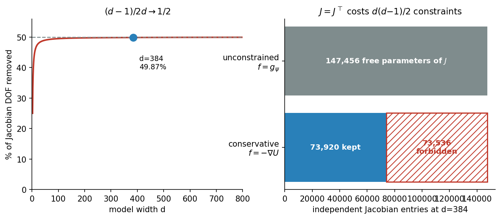
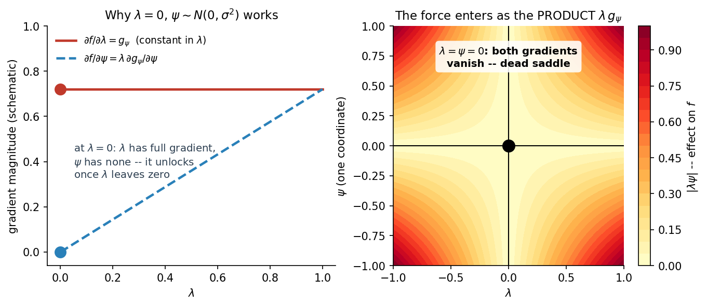
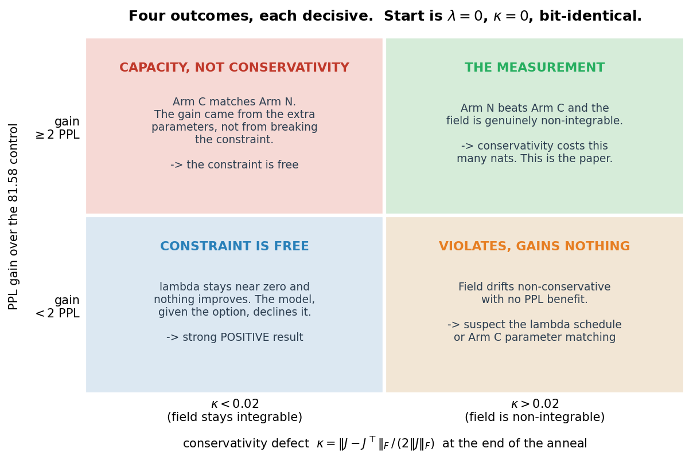

# Measuring the Price of Conservativity: a $\lambda$-Gated Relaxation Protocol

**Status:** proposed, not yet run. Derivation and protocol complete; no code
written beyond what already exists.
**Date:** 2026-09-19.
**Companion to:** [`Joint_Vtheta_QKNorm_Run_Diagnostic_Checklist.md`](Joint_Vtheta_QKNorm_Run_Diagnostic_Checklist.md) §10.8,
[`Fock_Inference_Productionization_Plan.md`](Fock_Inference_Productionization_Plan.md) §7,
[`Context_Mixing_Mechanisms_in_the_Conservative_Framework.md`](Context_Mixing_Mechanisms_in_the_Conservative_Framework.md) §8.

---

## 1. Why this experiment exists

A matched GPT-2 reaches **54.67** where the joint arm reaches **81.58**, on
identical data at identical tokens, with 2.66x fewer non-embedding
parameters. Five candidate explanations have been eliminated:

| candidate | result | where |
| --------- | ------ | ----- |
| well count | K=40 additive lost to K=8 joint | checklist §9.4 |
| anisotropic rank | participation ratio 3.68 of 4 — fully used | §9.4 |
| depth | L=16 not better, spikier | §7.5 |
| pair-path routing | 3.85% of compute; all-to-all is cheaper, not better | §10 |
| context representation | content-addressed pooling buys 2.1%, 16% of predicted | §10.8 |

What survives is the constraint itself: that the per-token update must be
the negative gradient of a scalar potential.

**Elimination is not measurement.** Five eliminations license "it is not
these five"; they license "therefore it is the sixth" only if the candidate
set is provably complete, which it is not. The protocol below measures the
sixth directly, at the cost of one warm-started 4,000-step anneal per arm.

---

## 2. What the constraint actually costs, in degrees of freedom

Let $f : \mathbb{R}^{d} \to \mathbb{R}^{d}$ be the per-token force at fixed
context, and $J = \partial f / \partial h$ its Jacobian.

**Proposition.** On a simply connected domain, $f$ is the negative gradient
of a scalar potential if and only if $J$ is symmetric everywhere.

This is the Poincaré lemma. The forward direction is Clairaut's theorem:
if $f = -\nabla U$ then, for $U$ twice continuously differentiable,

$$J_{ij} = -\partial_{i}\partial_{j}U = -\partial_{j}\partial_{i}U = J_{ji}.$$
 The converse is the standard
integrability result, and simple connectedness is what rules out the
punctured-plane counterexamples.

Symmetry is not a mild condition. $J$ has $d^{2}$ entries; requiring
$J = J^{\top}$ imposes one equation per strictly-upper-triangular entry:

$$N_{\text{constraints}} = \frac{d(d-1)}{2}, \qquad \frac{N_{\text{constraints}}}{d^{2}} = \frac{d-1}{2d} \longrightarrow \frac{1}{2} \quad (d \to \infty).$$

At the deployed $d = 384$ that is **73,536 of 147,456 entries, or 49.87%**.
Half the linear response of the force field, at every point, is forbidden by
construction.



This is the sharpest statement of what the framework gives up, and it is
worth being precise about what it does *not* say. It does not say the model
loses half its capacity — the potential $U$ is still an arbitrary scalar
function, and scalar functions of $d$ variables are a rich class. It says
the *linear response* of the force is restricted to a subspace of half the
dimension. Whether that restriction costs anything in language modelling is
exactly the empirical question.

---

## 3. The relaxation

Replace the force law with a gated sum:

$$f_{\lambda}(\xi, h) = -\nabla_{h} U(\xi, h) + \lambda \cdot g_{\psi}(\xi, h), \qquad \lambda \in \mathbb{R}, \quad \lambda\big|_{t=0} = 0,$$

where $U = V_{\theta} + V_{\phi}$ is the existing potential and $g_{\psi}$ is
an unconstrained vector field with its own parameters.

### 3.1 The start is exact, not approximate

At $\lambda = 0$ the added term vanishes identically, so
$f_{0} = -\nabla_{h}U$ is **bit-identical** to the deployed model. The probe
therefore warm-starts from `_step28500_best.pt` and reuses §6.3's decay
unchanged, exactly as Alternative E did. This is what makes the comparison
against 81.58 controlled rather than merely similar: same checkpoint, same
schedule, same step count, same data order, one variable.

### 3.2 The defect is exactly linear in $\lambda$

Write $A(M) = \tfrac{1}{2}(M - M^{\top})$ for the antisymmetric part. The
Jacobian of the gated force decomposes as

$$J_{\lambda} = \underbrace{-\nabla^{2}_{h}U}_{\text{symmetric}} + \lambda J_{g}, \qquad A(J_{\lambda}) = \lambda  A(J_{g}),$$

because the Hessian of a scalar contributes nothing to the antisymmetric
part. Define the **conservativity defect**

$$\kappa(\lambda) = \frac{\lVert A(J_{\lambda}) \rVert_{F}}{\lVert J_{\lambda} \rVert_{F}} = \frac{\lambda \lVert A(J_{g}) \rVert_{F}}{\lVert -\nabla^{2}U + \lambda J_{g} \rVert_{F}}.$$

Three properties follow immediately. $\kappa(0) = 0$ exactly, not
approximately. It is monotone in $\lambda$ for small $\lambda$, with slope

$$\kappa'(0) = \lVert A(J_{g}) \rVert_{F} / \lVert \nabla^{2}U \rVert_{F}.$$

And as $\lambda \to \infty$ it saturates at

$$\kappa_{\infty} = \lVert A(J_{g}) \rVert_{F} / \lVert J_{g} \rVert_{F},$$

so it is bounded and dimensionless.

This quantity is already implemented. `conservativity_diagnostic.py` arm 1
computes it under the name `antisymmetry_ratio`:

```python
J_sub     = J_cons[probe_indices, :]
J_antisym = 0.5 * (J_sub - J_sub.T)
frob_J       = torch.norm(J_sub, p="fro").item()
frob_antisym = torch.norm(J_antisym, p="fro").item()
ratio_cons   = frob_antisym / (frob_J + 1e-12)
hess_pass    = ratio_cons < 0.02
```

Note the existing pass threshold of `0.02`, and note that the same file's
test C applies the *opposite* test to the reverse channel
(`curl_pass = ratio_Q > 1e-2`), confirming that force is genuinely
non-conservative. **The architecture already contains a non-conservative
channel.** This protocol does not introduce something foreign to the
framework; it makes an existing degree of freedom explicit and measurable.

### 3.3 The initialisation trap, and why it is already documented

The gradients of the gated term are

$$\frac{\partial f_{\lambda}}{\partial \lambda} = g_{\psi}, \qquad \frac{\partial f_{\lambda}}{\partial \psi} = \lambda \frac{\partial g_{\psi}}{\partial \psi}.$$

Setting both $\lambda = 0$ and $\psi = 0$ makes **both** vanish: the loss
depends on the product, so the origin is a saddle the optimiser never
leaves. A probe built that way reports no gain with nothing ever having
learned, which is indistinguishable from a genuine null.



An asymmetric initialisation — $\lambda = 0$ with
$\psi \sim N(0, \sigma^{2})$ — escapes the saddle proper, and that was the
first design. **It is not sufficient, and the first run showed why.**

### 3.4 Why a scalar gate is not enough

Run of 2026-09-19 with a scalar $\lambda$: over the first 100 steps
$\lambda$ reached only ~1e-3 and **flipped sign per layer between
consecutive prints**, while the training loss stayed indistinguishable from
the control. It was diffusing, not growing.

The reason is that a scalar can rescale a direction but cannot orient one.
With $\psi$ frozen at initialisation, $g_{\psi}$ is a *fixed random field*,
and

$$\frac{\partial L}{\partial \lambda} = \left\langle \frac{\partial L}{\partial f},\ g_{\psi} \right\rangle .$$

A random direction in $\mathbb{R}^{d}$ overlaps any fixed one by about
$1/\sqrt{d}$, which is 0.05 at $d = 384$, with a sign that varies batch to
batch. So the gradient on $\lambda$ is small and its sign is close to
arbitrary: a random walk.

**Raising $\sigma$ does not rescue it.** Scaling $\psi$ scales $g_{\psi}$,
and therefore both the signal and the per-batch noise in
$\partial L / \partial \lambda$, by the same factor — the ratio is
unchanged. Adam compounds the point: its update is invariant to gradient
scale, so $\lambda$'s step size would not move either.

### 3.5 The fix: zero the readout, not the gate

Drop the scalar. Initialise the **output layer** of $g_{\psi}$ to zero and
leave the input layer random:

```python
g_psi = nn.Sequential(nn.Linear((K+1)*d, H), nn.GELU(), nn.Linear(H, d))
nn.init.normal_(g_psi[0].weight, std=0.02)   # random features, frozen at first
nn.init.zeros_(g_psi[2].weight)              # zero readout, live gradient
```

Everything the design needed is preserved and the defect is removed:

- $g_{\psi} \equiv 0$ at initialisation, so step 0 is still **bit-identical**
  and the warm start is still exact.
- $\partial L / \partial W_{2} = \delta \otimes \mathrm{GELU}(W_{1}z)$ is
  non-zero from step 1 and points where the loss wants to go, rather than
  along a random direction.
- $W_{2}$ has $d \times H$ entries, so it can **orient** the added force,
  not merely scale a fixed draw.
- $\partial L / \partial W_{1} = 0$ at init and unlocks once $W_{2}$ moves:
  the same asymmetric structure, with the useful half now live.

This is the standard zero-init-the-output-projection trick from residual
architectures. Measured at $d = 32$: readout gradient **1.5e-01** against
**1.7e-04** on the scalar, with 49152 orientable parameters against 1, and
the field exactly zero at init in both.

**The measurement changes with it.** $\lambda$ is fixed at 1 and is no
longer the readout. Its place is taken by the per-layer force share

$$\mathrm{share}_{\ell} = \frac{\lVert g_{\psi} \rVert}{\lVert f^{\mathrm{cons}}_{\ell} \rVert},$$

the fraction of the dynamics the model has chosen to take outside the
conservative class — which §7 already listed as the most interpretable
single number. The superseded scalar gate is retained as
`relax_gate='scalar'` so the 2026-09-19 run can be reproduced.

---

## 4. The confound, and the control arm that removes it

**A single arm cannot answer the question.** If $\lambda$ rises and
perplexity falls, two explanations fit equally well:

1. the model wanted a non-conservative force, or
2. the model wanted **more force capacity**, and $g_{\psi}$ supplied it.

Explanation 2 is not idle. $g_{\psi}$ adds parameters, and nothing prevents
a learned $g_{\psi}$ from being close to a gradient field — in which case
$\kappa$ stays near zero and the gain is pure capacity.

The protocol therefore runs **two arms with matched parameter counts**.
Arm N leaves the added field unconstrained:

$$f = -\nabla_{h}U + \lambda g_{\psi}(\xi, h), \qquad g_{\psi} : \mathbb{R}^{(K+1)d} \to \mathbb{R}^{d}.$$

Arm C routes the same parameter budget through a scalar, so the total force
is still a gradient:

$$f = -\nabla_{h}\left(U + \lambda \Phi_{\psi}(\xi, h)\right), \qquad \Phi_{\psi} : \mathbb{R}^{(K+1)d} \to \mathbb{R}.$$

| arm | added field | defect κ | what a gain would prove |
| --- | ----------- | -------- | ----------------------- |
| **N** (non-conservative) | vector-valued, unconstrained | free to grow | capacity **and/or** non-conservativity |
| **C** (conservative control) | scalar-valued potential | 0 by construction | capacity alone |

Arm C adds the same parameter budget and the same gating structure, but
routes it through a scalar potential, so $\kappa \equiv 0$ throughout by
construction. Matching is on $|\psi|$, not on architecture: $g_{\psi}$ emits
$d$ components and $\Phi_{\psi}$ emits one, so $\Phi_{\psi}$ is given
proportionally more width to equalise the count.

$$\Delta_{\text{capacity}} = \mathrm{PPL}_{\text{control}} - \mathrm{PPL}_{\mathrm{C}}, \qquad \Delta_{\text{conservativity}} = \mathrm{PPL}_{\mathrm{C}} - \mathrm{PPL}_{\mathrm{N}}.$$

The second quantity is the paper's number. The first is the confound it
would otherwise be mistaken for.

---

## 5. What $\lambda \gt 0$ destroys

The trade is not free in the other direction either, and this is what makes
the experiment interesting rather than merely destructive.

The Jacobi metric of
`Damped_Riemannian_Geodesics_in_the_SPLM_family-Comparative_Analysis.md` is
the conformal rescaling

$$\tilde{g}_{ij} = 2(E - V) g_{ij} = \Omega^{2} \delta_{ij},$$

with the damped generalisation $\Omega^{2}_{\ell} = 2 T_{\ell} m$. Its
construction **requires $V$ to exist**. If $f$ is not a gradient there is no
$V$, hence no $\Omega^{2}$, hence no Jacobi metric, no Christoffel symbols,
and no geodesic reading of the trajectories. Every diagnostic in the
Riemannian battery is defined only at $\kappa = 0$.

So $\lambda$ is not a knob between "worse" and "better". It is a dial
between **perplexity and geometric interpretability**, and the protocol
measures the exchange rate. That framing is what
`Geodesic_Preservation_Experiment.md` already argues is the programme's
structurally exclusive capability: *not* that the perplexity is lower, but
that the geometry of the dynamics is measurable at all.

A paper reporting only the cost is a post-mortem. A paper reporting the cost
**and** what the constraint uniquely buys is a contribution.

---

## 6. Outcomes



Each quadrant is decisive, which is the point of pre-registering them:

- **High gain, $\kappa \gt 0.02$, Arm N beats Arm C.** The measurement. State
  the cost of conservativity in nats at matched parameters and data.
- **High gain, $\kappa \lt 0.02$, Arm C matches Arm N.** The gain was capacity.
  The constraint is free and the framework is vindicated on this axis.
- **No gain, $\lambda$ stays near zero.** The model, offered the option to
  violate the constraint, declines it. A strong positive result — and the
  most favourable outcome available to the framework.
- **$\kappa$ rises with no gain.** Suspect the $\lambda$ parameterisation or
  the Arm C matching before believing it.

---

## 7. Protocol

Derived from the Alternative E probe, which established every piece of this
machinery.

| gate | what | cost | criterion |
| ---- | ---- | ---- | --------- |
| 0 | build both arms; `_smoke` | minutes | `pair_potential` and force-law branches are opt-in, default path bit-identical |
| 1 | conservativity check at λ = 0 | minutes | arm 1 test A: force equals the finite-difference gradient with context frozen. **Arm C must also pass at λ > 0** |
| 2 | causality | minutes | `scaf.audit(...).assert_causal()` — not a hand-rolled future-perturbation probe |
| 3 | step-0 eval | minutes | **must read 84.31 exactly** on both arms, or the warm start is not bit-identical |
| 4 | Arm N, §6.3's 4,000-step decay | ≈5h | settled against 81.58; record κ and λ |
| 5 | Arm C, identical | ≈5h | settled against 81.58; κ must stay below 0.02 |
| 6 | geodesic residual on both endpoints | **blocked, see §7.1** | paired against the control endpoint, not against any published baseline |

**Total ≈10h of A100 time** for the two training arms.

### 7.1 The geodesic gate is blocked, and this was mis-stated

§5 argues that a growing $\kappa$ costs geometric fidelity, which makes the
geodesic residual the natural other half of the measurement. An earlier
version of this section costed that gate at "hours, against the completed
d=384 baseline." Both halves of that are wrong.

**The published d=384 baseline is not comparable.** The completed analysis in
`Geodesic_Preservation_Experiment.md` §4.5 is **L=16** at PPL 342-741 across
a gamma sweep. The deployed arm is **L=8**, gamma fixed at 0.1, PPL near 81.
Different depth, different damping regime, two orders of magnitude apart in
loss. Nothing can be read across.

**The tool cannot build this architecture.** `geodesic_residual.py` imports
`PRESETS` and `build_fock_model` from `train_fock.py`, which contains no
`vtheta_coupling`, no anisotropic Gaussian bank, no `creation_qk_norm` and no
`install_aniso_depth_routing`. Pointed at a joint-arm checkpoint it would
load under `strict=False`, silently drop every $V_{\theta}$ tensor on shape
mismatch, and report a residual computed against a **randomly initialised
potential**. That is the same silent-failure class the notebook's own resume
guard exists to catch, and this script has no equivalent check.

Two ways forward, neither of them hours:

1. **Extend `train_fock.py`** to build the joint/aniso/QK-norm arm, then
   verify the rebuilt model reproduces the checkpoint's perplexity before
   trusting any residual from it.
2. **Re-implement the residual in the notebook**, where the model is already
   built correctly. The quantity is

   $$R_\ell = \frac{\lVert a_\ell + \Gamma(v_\ell, v_\ell) + \gamma v_\ell \rVert}{\lVert a_\ell \rVert + \varepsilon},$$

   needing the position trajectory, the explicit velocity stream, and
   $\Gamma$ in closed form from the conformally flat metric — all of which
   the deployed model already has, $V_{\theta}$ carrying an analytic
   gradient. This is the smaller job of the two.

Until one is done, treat §5's geometric argument as **motivation rather than
measurement**. The paper shape it proposes — cost on one axis, exclusive
capability on the other — needs the second axis actually measured, and it is
not measured yet for this arm at this depth.

**Instrumentation to log per eval:** $\lambda$ itself (per layer if
parameterised per layer), $\kappa$ from arm 1, and $\lVert \lambda g_{\psi} \rVert / \lVert \nabla U \rVert$ —
the fraction of the force carried by the unconstrained term. The last is the
most interpretable single number: it is the share of the dynamics the model
chose to take outside the framework.

**Pre-register before running**, in the manner of §9.5 and §10.7, and score
the prediction afterwards whichever way it falls. This programme is now 4
for 4 on saturating fits beating linear extrapolations; expect the
$\lambda$ trajectory to saturate and do not extrapolate its early slope.

---

## 8. The insertion point

One site. `MultiXiPARFLM._layer_forces` in `model_parf_multixi.py` already
assembles the force from two branches and returns it:

```python
        if split:
            return f_theta, f_phi

        f = f_phi if f_theta is None else f_theta + f_phi
        if cfg.force_clamp_max is not None:
            f = f.clamp(-cfg.force_clamp_max, cfg.force_clamp_max)
        return f
```

Arm N adds `f = f + lam * self.g_psi(xis, h_in)` before the clamp, guarded
on a default-off config flag. Arm C needs no change here at all — its extra
term enters `_pair_potential` as another scalar contribution to `U_pair`,
which is the seam Alternative A already used.

Two cautions carried over from the Alternative E probe, both of which cost a
run when they were missed:

1. **The optimizer state remap.** Adding parameters shifts every later flat
   index, and the existing `_trainable` fallback assumes `model.parameters()`
   order while the optimizer flattens as `[decay] + [no_decay]`. The
   `_old_flat_order_minus_new` helper and the `exp_avg` shape guard added for
   Alternative E handle this; extend the excluded-parameter set rather than
   writing a new path.
2. **The watchdog rollback seed.** Cell 6's anneal block seeds `_best.pt`
   from the step-28,500 file, which predates the new tensors. Re-seed it from
   the live model after the resume completes, as the Alternative E notebook
   now does.

---

## 9. Honest caveats

- **Nothing here is measured.** Every number is a derivation or a
  configuration value. The protocol's output is the measurement.
- **One scale, one seed.** d=384, 0.53B tokens. The claim this can support is
  "the cost of conservativity at this scale is X", not a statement about
  conservative architectures in general. Scope the wording to match; a
  reviewer will otherwise scope it for you.
- **$\kappa$ is measured on a submatrix.** Arm 1 probes a random subset of
  coordinates, not the full $d \times d$ Jacobian, which is why its threshold
  is 0.02 rather than machine epsilon. Report the probe count alongside.
- **Arm C may be hard to match honestly.** A scalar-valued $\Phi_{\psi}$ with
  the same parameter count as a $d$-valued $g_{\psi}$ has a different
  shape, and shape is not neutral. If the arms cannot be matched
  convincingly, report both the parameter-matched and width-matched variants
  rather than choosing the flattering one.
