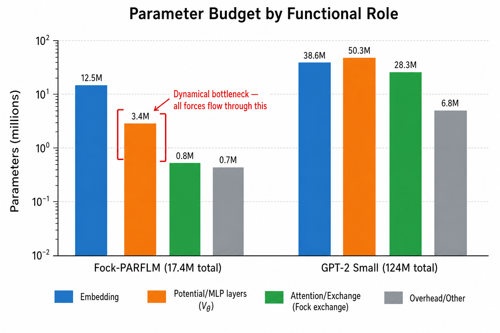
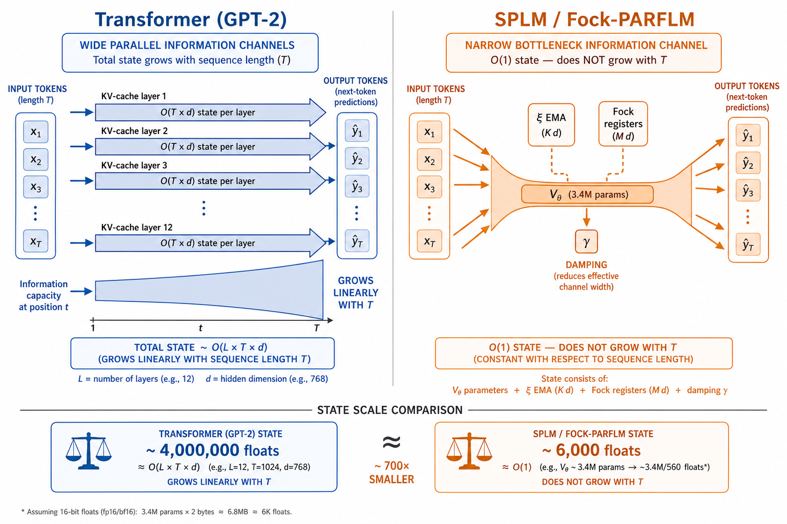
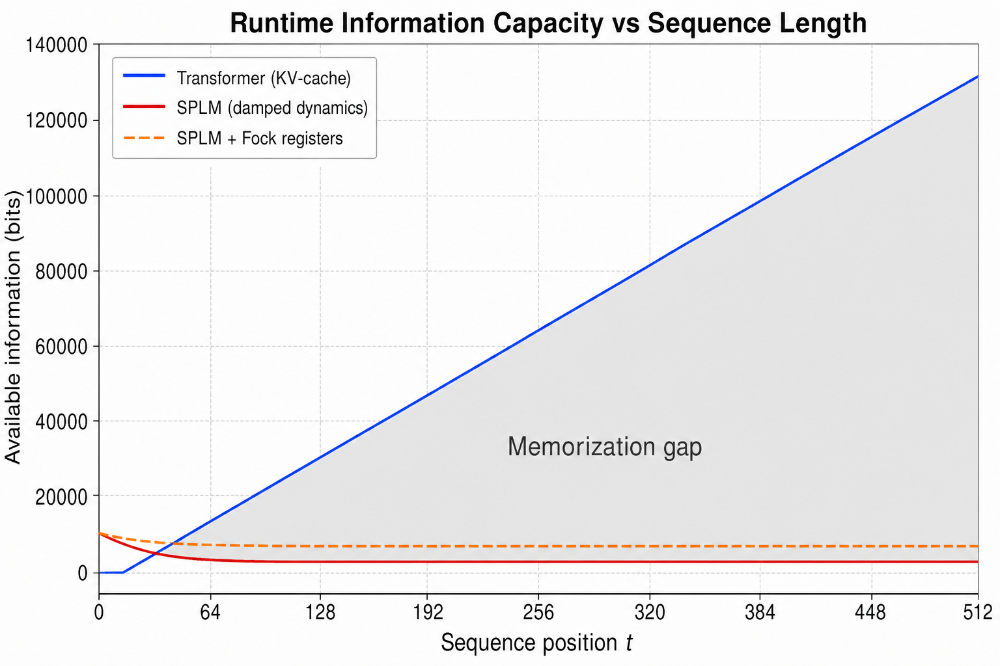
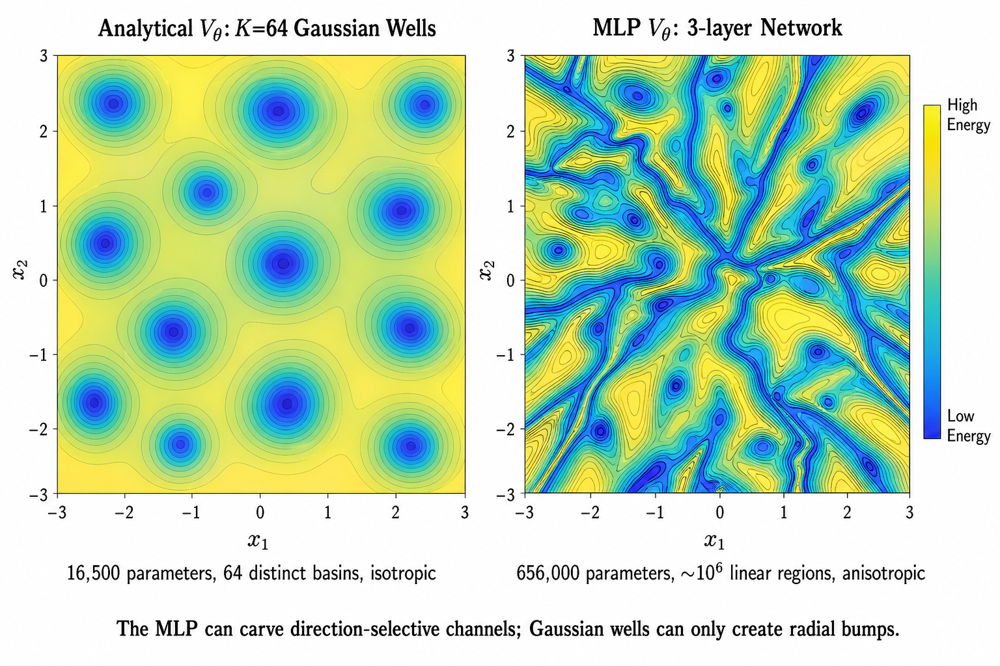

# Memorization Capabilities of the SPLM Family of Models

**Technical Report — Semantic Simulation Research Programme**
**Date:** June 6, 2026
**Relates to:** Paper v4 §§9, 15, 20; `Expressivity_Bounds_For_v0_Simulator.md`;
`Energetic_Minima_Alternatives.md`; `Structured_VTheta_Memory_Anatomy.md`;
`Exploiting_the_Riemannian_geometry_of_conservative_language_models.md`

---

## Table of Contents

1. [Introduction and Framing](#1-introduction-and-framing)
2. [Parametric Memorization Budget](#2-parametric-memorization-budget)
3. [Runtime State Capacity (Information Bottleneck)](#3-runtime-state-capacity-information-bottleneck)
4. [Analytical Potentials and the Expressivity Floor](#4-analytical-potentials-and-the-expressivity-floor)
5. [Summary Capacity Comparison](#5-summary-capacity-comparison)
6. [Proposed Experiments](#6-proposed-experiments)
7. [The Anti-Memorization Argument](#7-the-anti-memorization-argument-feature-not-bug)
8. [References](#8-references)

---

## 1. Introduction and Framing

A central question for any language model architecture is: **how much of the training
corpus does the model memorize, and how much does it generalize?** For standard
Transformers (GPT-2, LLaMA, etc.), the answer is well-studied empirically: large
language models memorize substantial verbatim passages from their training data
(Carlini et al. 2021, 2023), and this memorization is both a capability (few-shot
learning, factual recall) and a liability (privacy leakage, copyright issues).

For the SPLM family of models — SPLM, PARFLM, Fock-PARFLM v2/v2.1, and their
multi-$\xi$ variants — the memorization question has a qualitatively different
character. The conservative Lagrangian formulation imposes structural constraints
that fundamentally limit what the model can store, both in its parameters and in
its runtime state. This report provides crude but grounded estimates of these limits
along three axes:

1. **Parametric memorization** — how many training examples can the model's weights
   encode? This is determined by the parameter count and the functional class of
   the learned potential.

2. **Runtime state capacity** — how much information about the input can the model
   carry through its computation at inference time? This is determined by the
   phase-space dimension, the damping coefficient, and the integration horizon.

3. **Functional expressivity** — what class of input-output functions can the model
   represent? This determines whether memorization failures are due to insufficient
   capacity or structural impossibility.

The estimates below compare the flagship Fock-PARFLM v2.x (scaleup configuration:
$d=256$, $L=8$, $v_\text{hidden}=1024$, $K=4$, $M=16$) against GPT-2 small
($d=768$, $L=12$, 12-head attention) as the reference Transformer.

---

## 2. Parametric Memorization Budget

### 2.1 Parameter Decomposition

The two architectures allocate their parameters to fundamentally different
functional roles.

**Fock-PARFLM v2.x (17.4M total):**

| Component | Parameters | Role |
|-----------|-----------|------|
| Token embedding $E$ | ~12,500,000 | Map tokens to $\mathbb{R}^d$ |
| Scalar potential $V_\theta$ | 3,411,969 | Conservative force field: $F = -\nabla V_\theta$ |
| Interaction potential $V_\phi$ | 19,074 | Fock register-token pairwise interaction |
| Score head | 24,641 | Token prediction logits |
| EMA context ($\xi$ module) | 4 | Multi-channel exponential moving average |
| Fock overhead (gates, keys, registers) | ~824,000 | Register creation, destruction, routing |

**GPT-2 Small (124M total):**

| Component | Parameters | Role |
|-----------|-----------|------|
| Token + position embedding | ~38,600,000 | Map tokens + positions to $\mathbb{R}^d$ |
| Attention layers ($W_Q, W_K, W_V, W_O$) | ~28,300,000 | Input-dependent routing |
| MLP layers ($W_1, W_2$, biases) | ~50,300,000 | Nonlinear feature transformation |
| LayerNorm parameters | ~18,432 | Normalisation |
| Unembedding $W_U$ (tied) | 0 (shared with $E$) | Token prediction |

### 2.2 The Scalar Potential Bottleneck

In a Transformer, the attention and MLP parameters at each layer act
**independently** on the residual stream. At layer $\ell$, the model applies
~7.1M parameters to transform the hidden state. Across 12 layers, the total
"active surface" that interacts with the data during a forward pass is
approximately 85M parameters.

In the SPLM family, the dynamical computation is funneled through a single
scalar potential $V_\theta : \mathbb{R}^d \to \mathbb{R}$. The force that
drives the hidden-state trajectory is:

$$F(h) = -\nabla_h V_\theta(h)$$

This force is computed by a 3-layer MLP with hidden dimension 1024. The same
$V_\theta$ is reused at every Verlet integration step across all $L=8$ layers.
The total "active surface" for the conservative dynamics is **3.4M parameters**,
applied $L$ times — a **25x reduction** compared to GPT-2.

### 2.3 Zhang Memorization Bound

Zhang et al. (2017) showed that a model with $P$ parameters can memorize
$\Theta(P)$ random label assignments — i.e., fit arbitrary input-output pairs
up to $O(P)$ in number, regardless of whether the labels have any structure.

Applying this bound directly:

$$\text{GPT-2 memorization capacity} \sim O(124 \times 10^6)$$

$$\text{Fock-PARFLM total capacity} \sim O(17.4 \times 10^6)$$

But the Zhang bound counts all parameters equally. In the SPLM family, the
embedding matrix $E$ (12.5M parameters) maps tokens to a fixed embedding space —
it does not participate in the dynamical computation that determines next-token
predictions. The effective memorization capacity for the dynamics is dominated
by $V_\theta$:

$$\text{Fock-PARFLM effective capacity} \sim O(3.4 \times 10^6) \approx 0.04 \times \text{GPT-2 active capacity}$$

This estimate assumes that the embedding $E$ contributes identically to both
architectures (both need to represent the vocabulary). The 25x reduction is
entirely due to the scalar potential bottleneck.

### 2.4 MLP Linear Regions as a Capacity Proxy

A ReLU MLP with $L_\text{net}$ layers and width $w$ partitions its input space
$\mathbb{R}^n$ into at most

$$R(L_\text{net}, w, n) \le \binom{w}{n}^{L_\text{net}} \le \left(\frac{ew}{n}\right)^{n \cdot L_\text{net}}$$

piecewise-linear regions (Montufar et al. 2014). Each region can encode a
distinct gradient direction (force vector). For $V_\theta$ with $L_\text{net}=3$,
$w=1024$, $n=d=256$:

$$R \le \left(\frac{e \cdot 1024}{256}\right)^{256 \cdot 3} = (4e)^{768} \approx 10^{800}$$

This theoretical upper bound is astronomical but almost entirely vacuous — the
actual number of regions traversed by training trajectories is vastly smaller.
A more useful proxy is the number of distinct force-field configurations that
can be simultaneously active during inference on a typical input. For a sequence
of $T=512$ tokens, each visiting a point in $\mathbb{R}^{256}$, the model
accesses at most $T \times L = 4096$ points in the $V_\theta$ landscape. The
number of distinct force-field responses at these points is bounded by the
number of distinct activation patterns, which empirically scales as
$O(T \cdot L \cdot w) \approx O(4 \times 10^6)$ — comparable to the parameter
count itself, consistent with the Zhang bound.

---

## 3. Runtime State Capacity (Information Bottleneck)

### 3.1 Transformer Runtime State

A Transformer with KV-cache maintains, at sequence position $t$, the key-value
pairs from all previous positions at all layers:

$$S_\text{KV}(t) = \lbrace (K_\ell^{(1:t)}, V_\ell^{(1:t)}) \rbrace_{\ell=1}^{L}$$

The total floating-point state is:

$$\lvert S_\text{KV}(t) \rvert = 2 \cdot L \cdot t \cdot d = 2 \cdot 12 \cdot t \cdot 768 = 18{,}432 \cdot t$$

At $t = 512$: approximately **9.4 million floats** ($\approx 300{,}000$ bits at
effective float32 precision). This state grows **linearly** with sequence length.
Every past token is explicitly represented and can be attended to.

### 3.2 SPLM Runtime State

The SPLM family carries a fixed-dimensional state through its computation. At
any integration step, the instantaneous state per token position is:

$$(h_t, \dot{h}_t, \xi_t) \in \mathbb{R}^{d} \times \mathbb{R}^{d} \times \mathbb{R}^{K \cdot d}$$

For the scaleup configuration ($d=256$, $K=4$): $256 + 256 + 1024 = 1536$ floats.

The Fock registers add $M$ register states plus saliences:

$$\lbrace (r_k, \sigma_k) \rbrace_{k=1}^{M} \in \mathbb{R}^{M \cdot d} \times \mathbb{R}^{M}$$

For $M=16$: $16 \times 256 + 16 = 4112$ floats.

Total per-position dynamic state: approximately **5,648 floats** — and this
does **not grow** with sequence length $T$.

### 3.3 Formal Information-Theoretic Bounds

The formal analysis from `Expressivity_Bounds_For_v0_Simulator.md` (Lemmas 1--3)
establishes tight bounds on the information the SPLM dynamics can retain.

**Lemma 1 (Phase-space capacity).** At precision $\epsilon$, the number of
distinguishable states on the manifold $M$ satisfies:

$$\log_2 N_\epsilon(M) \le \dim M \cdot \log_2(L_M / \epsilon)$$

For $\dim M \approx 200$, $L_M = O(10)$, $\epsilon = 10^{-6}$:

$$\log_2 N_\epsilon \lesssim 200 \cdot \log_2(10^7) \approx 4{,}600 \text{ bits}$$

**Lemma 2 (Damping-induced information destruction).** The damped dynamics
contracts phase-space volume exponentially. The mutual information between the
initial state $s_0$ and the state $s_\ell$ after $\ell$ integration steps obeys:

$$I(s_0; s_\ell) \le \dim M \cdot \log_2(L_M / \epsilon) - \frac{\ell \cdot \dim M \cdot \gamma}{\ln 2}$$

At $\gamma \approx 0.3$, $\ell = L = 8$:

$$I(s_0; s_L) \le 4{,}600 - \frac{8 \cdot 200 \cdot 0.3}{\ln 2} \approx 4{,}600 - 693 = 3{,}907 \text{ bits}$$

At $\gamma \approx 1.0$ (pre-leak-fix regime):

$$I(s_0; s_L) \le 4{,}600 - 2{,}310 = 2{,}290 \text{ bits}$$

The integrator is structurally **anti-memory**: damping actively destroys
information about past states at every step.

**Lemma 3 (Non-chaoticity).** The functional class of $V_\theta$ (Gaussian wells,
bilinear forms, bounded-Hessian MLPs) ensures the global Lyapunov spectrum is
negative-on-average:

$$\sum_i \Lambda_i \le -\dim M \cdot \gamma \lt 0$$

This prevents the model from using chaotic sensitivity to amplify information —
the dynamics is a contraction, not an expansion. The Siegelmann--Sontag
Turing-completeness construction (which requires positive Lyapunov exponents)
does not apply.

### 3.4 The 700x State Gap

Combining the above:

| Architecture | Runtime state at $T=512$ | Scaling |
|---|---|---|
| Transformer (KV-cache) | ~9.4M floats (~300K bits) | $O(T)$ — linear growth |
| SPLM (base, no Fock) | ~1,536 floats (~49K bits) | $O(1)$ — constant |
| Fock-PARFLM v2.x | ~5,648 floats (~180K bits) | $O(1)$ — constant |

The Transformer carries ~700x more runtime state per position than the base SPLM,
and this gap **widens linearly** with sequence length. Even with Fock registers,
the SPLM family maintains ~1,700x less state than the Transformer at $T=512$.

The multi-$\xi$ EMA channels add $K \cdot d = 1024$ floats, but these are
exponentially-weighted running averages with decay factors $\alpha_k \in [0, 1)$.
The effective information content of an EMA with decay $\alpha$ after $t$ steps
is approximately:

$$I_\xi(t) \approx \frac{d}{1 - \alpha} \text{ bits} \quad (\text{for } t \gg 1/(1-\alpha))$$

For the four channels with $\alpha \in [0.00, 0.78, 0.95, 0.99]$, the total
EMA information budget is approximately $d + 4.5d + 20d + 100d \approx 126d
\approx 32{,}000$ floats equivalent — still constant in $T$ and dominated by
the slowest-decaying channel.

---

## 4. Analytical Potentials and the Expressivity Floor

### 4.1 The Gaussian-Mixture Experiment

The `em_gm` experiment (documented in `Energetic_Minima_Alternatives.md` Section
4.3) replaced the MLP $V_\theta$ with an explicit sum of $K=64$ Gaussian wells:

$$V_\text{GM}(z) = \sum_{k=1}^{K} a_k \left(1 - e^{-\kappa_k^2 \lVert z - c_k \rVert^2}\right)$$

where $z = (\xi, h) \in \mathbb{R}^{2d}$, $a_k \in \mathbb{R}$ is the amplitude,
$\kappa_k \in \mathbb{R}$ is the inverse width, and $c_k \in \mathbb{R}^{2d}$ is
the centre.

| Model | $V_\theta$ params | Val PPL | Attractor count | Content fraction |
|---|---|---|---|---|
| MLP head (em\_ln) | 656,000 | **173.59** | 5, 9, 10, 2, 2 | 0.23 |
| Gaussian mixture ($K=64$) | 16,500 | 677.67 | 2, 2, 2, 2, 2 | **0.00** |

The Gaussian-mixture model collapsed to a context-free unigram predictor: two
basins (both punctuation/whitespace), zero content-word basins, PPL nearly 4x
worse than the MLP head.

### 4.2 Why Analytical Potentials Fail: Functional Family Constraints

A sum of $K$ isotropic Gaussian wells has the parameter budget:

$$P_\text{iso} = K \times (1 + 1 + 2d) = K(2d + 2)$$

For $K=64$, $d=128$: $P_\text{iso} = 64 \times 258 = 16{,}512$.

At any point $z$, the value $V_\text{GM}(z)$ is a sum of monotone saturating
functions of distances $\lVert z - c_k \rVert$ to the $K$ centres. The gradient
is:

$$\nabla_z V_\text{GM}(z) = \sum_{k=1}^{K} 2 a_k \kappa_k^2 (z - c_k) e^{-\kappa_k^2 \lVert z - c_k \rVert^2}$$

This force field is a sum of radial fields centred at $c_k$. It can represent
attraction toward (or repulsion from) the $K$ centres, but it **cannot**
represent the direction-selective, anisotropic force fields that a tied-embedding
language model head needs to steer $h_L$ toward the correct row of the embedding
matrix $E$.

To see why, consider the task of discriminating between two tokens $w_1$ and
$w_2$ with embeddings $e_1, e_2 \in \mathbb{R}^d$. The force field must produce
a gradient that points toward $e_1$ in some regions of $\mathbb{R}^d$ and toward
$e_2$ in others, with a sharp boundary between them. A sum of Gaussian wells can
approximate this only by placing wells at $e_1$ and $e_2$ — but then the boundary
is a smooth, roughly spherical surface determined by the well widths. For a
vocabulary of $V = 50{,}257$ tokens, the model needs to discriminate among $V$
embedding vectors simultaneously, requiring $\Omega(V)$ wells to represent the
Voronoi-like partition of $\mathbb{R}^d$ that the tied embedding induces.

### 4.3 Scaling Analysis: How Many Wells Are Needed?

**Isotropic wells.** Each well has $2d + 2$ parameters. To match the MLP's
656K parameters: $K = 656{,}000 / 258 \approx 2{,}542$ wells. But even 2,542
isotropic bumps cannot represent the anisotropic structure — the functional
family is wrong, not just under-parameterised.

**Anisotropic wells** (full covariance per well). Each well has
$1 + d(d+1)/2 + d$ parameters (amplitude, covariance matrix, centre):

$$P_\text{aniso} = K \times \left(1 + d + \frac{d(d+1)}{2}\right) \approx K \times \frac{d^2}{2}$$

For $d=256$: $P_\text{aniso} \approx K \times 32{,}897$. To match 656K parameters:
$K \approx 20$ wells. Fewer wells, but each one can now carve an ellipsoidal basin
with direction-selective gradients. Whether 20 anisotropic wells suffice to
represent the energy landscape of TinyStories is an open empirical question —
but the functional family is at least qualitatively richer than isotropic wells.

### 4.4 The Memorization Floor

Replacing the MLP $V_\theta$ with $K$ Gaussian wells reduces the number of
distinct semantic regions the model can represent from $O(10^6)$ (MLP linear
regions) to exactly $K$. The memorization budget drops accordingly:

$$\frac{\text{Analytical capacity}}{\text{MLP capacity}} \approx \frac{K}{10^6} = \frac{64}{10^6} \approx 6 \times 10^{-5}$$

This is the **expressivity floor**: the minimum memorization capacity achievable
while retaining the conservative architecture. Below this floor, the model cannot
discriminate among tokens at all and collapses to a unigram predictor — which is
exactly what the `em_gm` experiment demonstrated.

### 4.5 Structured $V_\theta$ Variants: The Middle Ground

Between the full MLP (656K--9.4M parameters) and the Gaussian-mixture floor
(16.5K parameters), the structured $V_\theta$ sweep
(`structured_vtheta_tinystories_sweep.ipynb`, documented in
`Structured_VTheta_Memory_Anatomy.md`) tested three intermediate analytical
forms:

| Variant | $V_\theta$ params | Analytical gradient? | Functional family |
|---|---|---|---|
| MLP baseline | 9,400,000 | No (autograd) | Piecewise-linear (ReLU) |
| SQ3 ($K=4$) | 167,000 | Yes (closed form) | Sum of structured wells |
| SQ2 (rank=4) | 198,000 | Yes (closed form) | Low-rank quadratic |
| SQ1 | 66,000 | Yes (closed form) | Diagonal quadratic |
| Gaussian mixture ($K=64$) | 16,500 | Yes (closed form) | Isotropic radial bumps |

The structured variants occupy a memorization capacity band between the MLP and
the Gaussian mixture:

$$16{,}500 \le P_\text{structured} \le 198{,}000 \quad \text{vs} \quad P_\text{MLP} = 9{,}400{,}000$$

When `HAS_ANALYTICAL_GRAD = True`, the force $F_\theta = -\nabla V_\theta$ is
computed in closed form and **no computation graph is retained** for $V_\theta$
during backprop. This has a direct connection to memorization: the analytical
gradient means the model's force field is an explicit, inspectable function
rather than an opaque neural network. The number of distinct force configurations
is bounded by the structural complexity of the analytical form — for SQ3 with
$K=4$, this is $O(K \cdot d) \approx O(1024)$ distinct directional modes, far
fewer than the MLP's $O(10^6)$ linear regions.

The practical benefit is a **compute-memorization trade-off**: analytical
$V_\theta$ eliminates the $V_\theta$ contribution to GPU memory during training
(the graph-holding overhead drops to zero for the $V_\theta$ branch), while
simultaneously reducing the model's capacity to memorize training data. As
documented in `Structured_VTheta_Memory_Anatomy.md`, the remaining OOM
bottleneck comes from $V_\phi$ (the pair-interaction potential), which requires
`create_graph=True` regardless of the $V_\theta$ parameterisation.

---

## 5. Summary Capacity Comparison

| Metric | GPT-2 small | Fock-PARFLM (MLP) | Fock-PARFLM (structured SQ3) | Fock-PARFLM (Gaussian, $K=64$) |
|---|---|---|---|---|
| Total parameters | 124M | 17.4M | ~15.2M | ~15M |
| Active memorization params | ~85M | ~3.4M | ~167K | ~16.5K |
| Runtime state at $T=512$ | ~9.4M floats | ~5,648 floats | ~5,648 floats | ~5,648 floats |
| Runtime state scaling | $O(T)$ | $O(1)$ | $O(1)$ | $O(1)$ |
| Info capacity (bits, post-damping) | ~300,000 | ~3,900 | ~3,900 | ~3,900 |
| Distinct force-field modes | ~$10^6$ | ~$10^6$ | ~$10^3$ | $K = 64$ |
| Analytical gradient? | No | No | Yes | Yes |
| Memorization ratio (parametric) | 1x | ~0.04x | ~0.002x | ~0.0002x |
| Memorization ratio (runtime) | 1x | ~0.0006x | ~0.0006x | ~0.0006x |

The SPLM family is structurally anti-memorization at **two independent levels**:

1. The scalar potential bottleneck (parametric): all dynamics flow through a
   single $V_\theta$ with 25x fewer parameters than the Transformer's distributed
   MLP+attention stack.

2. The damped integrator (runtime): information about past states is actively
   destroyed at every step. The runtime state is $O(1)$ in sequence length,
   vs $O(T)$ for the Transformer.

---

## 6. Proposed Experiments

The following experiments would empirically establish the memorization
characteristics of the SPLM family at inference time. Each experiment compares
the SPLM family against a matched-parameter Transformer baseline (MatchedGPT)
on the same corpus (TinyStories).

### E1 — Canary Insertion (Parametric Memorization Probe)

**Objective.** Measure how many verbatim sequences the model can store in its
weights during training.

**Procedure.** Insert $N$ random token sequences ("canaries") of length $\ell_c = 32$
into the TinyStories training corpus. Each canary is a uniformly random sequence
over the vocabulary, prefixed with a fixed 4-token prompt. After training to
convergence, measure the **extraction rate**: for each canary, provide the 4-token
prompt and measure whether greedy decoding reproduces the remaining 28 tokens
exactly.

$$\text{Extraction rate} = \frac{\lvert \lbrace \text{canaries reproduced exactly} \rbrace \rvert}{N}$$

**Sweep.** Vary $N \in \lbrace 10, 50, 100, 500, 1000, 5000 \rbrace$.

**Predicted outcome.** The Transformer should exhibit a sharp transition: extraction
rate ~100% for $N \ll P_\text{active}$ and graceful degradation thereafter. The
SPLM should show a much earlier transition, with the crossover point at
approximately $N \sim P_{V_\theta} / \ell_c \approx 100{,}000$ — roughly 25x
lower than the Transformer's crossover. For the analytical $V_\theta$
(Gaussian wells), the crossover should occur at $N \sim K = 64$.

### E2 — Membership Inference Attack (Training Data Memorization)

**Objective.** Measure how distinguishable "seen" vs "unseen" sequences are
from the model's loss values.

**Procedure.** After training, compute the per-token cross-entropy loss on
(a) 1000 held-out training sequences and (b) 1000 held-out test sequences
(never seen during training). Train a logistic regression classifier on
the per-sequence mean loss to distinguish training vs test:

$$P(\text{member} \mid x) = \sigma(\alpha_0 + \alpha_1 \cdot \bar{\ell}(x))$$

where $\bar{\ell}(x) = -\frac{1}{T} \sum_t \log p(x_t \mid x_{\lt t})$.

Report AUROC. Lower AUROC means the model treats seen and unseen data more
uniformly — i.e. less memorization.

**Predicted outcome.** The Transformer should show AUROC > 0.6 (moderate
memorization). The SPLM should show AUROC closer to 0.5 (near-chance —
the model generalizes rather than memorizes). The analytical $V_\theta$
should show AUROC $\approx 0.5$ trivially because it cannot represent
individual sequences.

### E3 — Sequence Copying at Variable Lag (Runtime State Capacity)

**Objective.** Directly measure the decay of runtime information with distance.

**Procedure.** Construct synthetic inputs: a **signal** block of $L_s$ tokens,
followed by a **distractor** block of $D$ tokens, followed by a **query** prompt
asking the model to reproduce the signal. Measure reproduction accuracy (exact
token match) as a function of $D$.

$$\text{Accuracy}(D) = \frac{1}{L_s} \sum_{i=1}^{L_s} \mathbb{1}[\hat{w}_i = w_i^{\text{signal}}]$$

**Sweep.** $L_s = 8$, $D \in \lbrace 0, 16, 32, 64, 128, 256, 512 \rbrace$.

**Predicted outcome.** The Transformer should maintain accuracy ~1.0 for all $D$
within its context window (the KV-cache preserves the signal block). The SPLM
should show **exponential decay**:

$$\text{Accuracy}(D) \sim e^{-\gamma D / L}$$

consistent with Lemma 2. The decay rate should match the damping coefficient
$\gamma$. This experiment directly tests the anti-memory prediction of the
information-theoretic bounds.

### E4 — Novel vs Memorized Generation (Parametric Memorization)

**Objective.** Measure the overlap between generated text and the training corpus.

**Procedure.** Generate 10,000 passages of 128 tokens each via nucleus sampling
($p=0.9$). For each passage, compute the longest $n$-gram match against the
training corpus:

$$M_n = \max_{s \in \text{corpus}} \lvert \text{n-gram}(s) \cap \text{n-gram}(\hat{s}) \rvert$$

Report the fraction of generated passages containing an exact 5-gram, 6-gram,
..., 10-gram match.

**Predicted outcome.** The Transformer should show non-trivial exact-match rates
at $n \ge 6$ (verbatim memorization of training phrases). The SPLM should show
near-zero exact-match rates at $n \ge 5$, because the scalar potential bottleneck
compresses sequence-level information into a smooth energy landscape that cannot
store verbatim $n$-grams.

### E5 — Associative Recall at Distance (Runtime Capacity)

**Objective.** Measure how many simultaneously active facts the model can retain
and query.

**Procedure.** Construct synthetic inputs containing $F$ factual assertions
("The capital of Greenland is Nuuk.", "Alice's favourite colour is blue.", etc.)
followed by a query about one of them at distance $D$ from the assertion.

$$\text{Recall}(F, D) = P(\text{correct answer} \mid F \text{ facts}, D \text{ tokens of distraction})$$

**Sweep.** $F \in \lbrace 1, 2, 4, 8, 16 \rbrace$, $D \in \lbrace 0, 32, 128, 256 \rbrace$.

**Predicted outcome.** The Transformer should support $F \sim O(T / \ell_\text{fact})$
simultaneously — KV-cache stores all assertions. The SPLM should show a **hard
ceiling** at $F_\text{max} \sim \dim M / (d \cdot \log_2(1/\epsilon))$ facts,
determined by the phase-space capacity bound. For the Fock-PARFLM, the $M=16$
registers provide an additional buffer of up to $M$ simultaneously active
concepts, predicting $F_\text{max} \sim 16$. Beyond this, accuracy should
degrade sharply regardless of $D$.

### E6 — Energy Landscape Complexity Probe (Potential Memorization)

**Objective.** Directly measure the complexity of the learned $V_\theta$ landscape
as a proxy for the number of memorized semantic regions.

**Procedure.** After training, run $N_\text{restart} = 10{,}000$ random-restart
gradient descents on $V_\theta$:

$$h^{(0)} \sim \mathcal{N}(0, I_d), \qquad h^{(n+1)} = h^{(n)} - \eta \nabla V_\theta(h^{(n)})$$

Cluster the converged points by proximity ($\epsilon$-ball deduplication) to
count the number of distinct local minima $K^*$.

**Metrics:**

- $K^*$: number of distinct local minima (semantic basins)
- $\bar{V}$: mean potential energy at minima
- $\lambda_\text{min}$: mean smallest Hessian eigenvalue at minima (basin sharpness)
- Content fraction: fraction of minima whose nearest embedding-matrix row is
  a content word (not punctuation or whitespace)

**Sweep.** Compare MLP $V_\theta$ vs analytical $V_\theta$ ($K = 32, 64, 128, 256$).

**Predicted outcome.** The MLP $V_\theta$ should yield $K^* \gg K$ (many more
minima than any Gaussian-mixture configuration). The analytical $V_\theta$
should yield $K^* \le K$ by construction. The content fraction should be
strongly correlated with PPL performance.

---

## 7. The Anti-Memorization Argument: Feature, Not Bug

### 7.1 Inductive Bias Toward Structure

The 25x parametric bottleneck and the $O(1)$ runtime state are not deficiencies
to be overcome — they are structural inductive biases that force the model to
learn the **energy landscape of language** rather than memorizing individual
sequences.

A Transformer with 85M active parameters and $O(T)$ KV-cache has enough capacity
to store substantial portions of its training corpus verbatim. The SPLM family,
with 3.4M parameters funneled through a single potential and $O(1)$ state, must
compress the corpus into a smooth, low-dimensional energy landscape. What it
learns is not "what sequences appear in the training data" but rather "what force
field, applied to hidden-state trajectories, produces the observed distribution
of next tokens."

### 7.2 Generalization Bounds

Standard PAC-Bayes generalisation theory bounds the test loss by:

$$\mathcal{L}_\text{test} \le \mathcal{L}_\text{train} + O\left(\sqrt{\frac{D_\text{KL}(q \mid p) + \log(1/\delta)}{N}}\right)$$

where $D_\text{KL}(q \mid p)$ is the KL divergence between the learned posterior
$q$ and the prior $p$ over weight space, and $N$ is the number of training
examples. The KL term scales with the effective parameter count. For the SPLM
family, the smaller active parameter budget ($V_\theta$: 3.4M vs Transformer: 85M)
implies a tighter generalisation bound, provided the training loss is comparable.

The PPL gap (8--9 vs 11--12 on TinyStories) shows that the training loss is
**not** comparable — the SPLM pays a PPL cost for its tighter generalisation
bound. But for downstream tasks that reward generalisation over memorization
(e.g., out-of-distribution robustness, privacy-preserving generation, low-resource
languages), this trade-off may be favourable.

### 7.3 Privacy and Data Leakage

The structural anti-memorization properties of the SPLM family have direct
implications for privacy:

1. **Canary resistance.** The 25x parametric bottleneck means verbatim extraction
   of training sequences requires 25x more training signal per sequence.

2. **Membership inference resistance.** The $O(1)$ runtime state means the model
   cannot condition on long-range verbatim context — it must generalise.

3. **Differential privacy compatibility.** The scalar potential bottleneck
   concentrates the model's "knowledge" in a single function $V_\theta$, making
   noise injection for DP-SGD more effective: noise applied to $V_\theta$'s
   gradients propagates to all downstream predictions, unlike in Transformers
   where noise must be applied to 12 independent layers.

### 7.4 The PPL Gap as the Price of Structure

The conservative design's value proposition can be stated precisely:

$$\underbrace{\Delta \text{PPL}}_{\text{cost}} = \underbrace{V_\theta \text{ bottleneck}}_{\text{parametric}} + \underbrace{\gamma\text{-damping}}_{\text{runtime}} + \underbrace{\text{Verlet discretisation}}_{\text{numerical}}$$

The first two terms are the anti-memorization contributions. The third is a
numerical artefact that could in principle be reduced with higher-order
integrators. The question for the research programme is whether the capabilities
uniquely enabled by the conservative structure (geodesic reasoning, energy-based
hallucination detection, native chain-of-thought — see
`Exploiting_the_Riemannian_geometry_of_conservative_language_models.md`) justify
the PPL cost of reduced memorization.

---

## 8. References

- **Zhang, C., Bengio, S., Hardt, M., Recht, B., Vinyals, O.** (2017).
  Understanding deep learning requires rethinking generalization. *ICLR 2017*.

- **Carlini, N., Tramer, F., Wallace, E., et al.** (2021). Extracting training
  data from large language models. *USENIX Security 2021*.

- **Carlini, N., Ippolito, D., Jagielski, M., et al.** (2023). Quantifying
  memorization across neural language models. *ICLR 2023*.

- **Montufar, G., Pascanu, R., Cho, K., Bengio, Y.** (2014). On the number of
  linear regions of deep neural networks. *NeurIPS 2014*.

- **McAllester, D.** (1999). PAC-Bayesian model averaging. *COLT 1999*.

- **Gueorguiev, D.** (2026). *Semantic Simulation: A Prescriptive Lagrangian
  Framework for Efficient Semantic Inference* (v4). Zenodo.
  DOI: 10.5281/zenodo.19712428.

- **Siegelmann, H. T., Sontag, E. D.** (1995). On the computational power of
  neural nets. *Journal of Computer and System Sciences*, 50(1), 132--150.

- **Arnold, V. I.** (1989). *Mathematical Methods of Classical Mechanics*
  (2nd ed.). Springer.

---

*Report compiled: June 6, 2026. Semantic Simulation Research Programme.*
