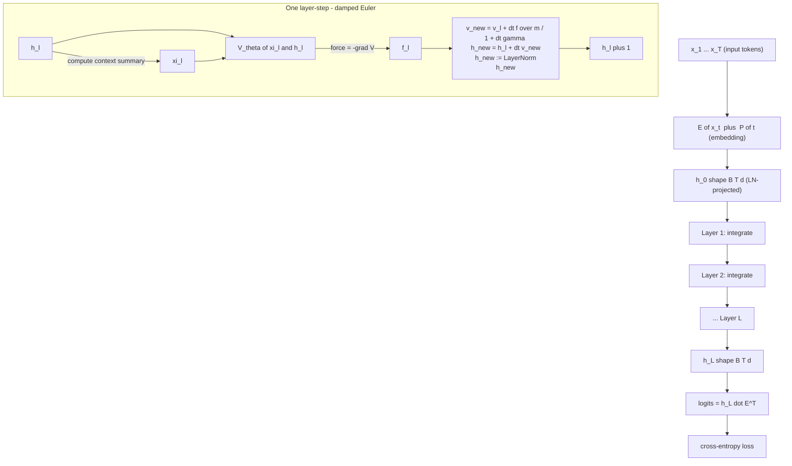
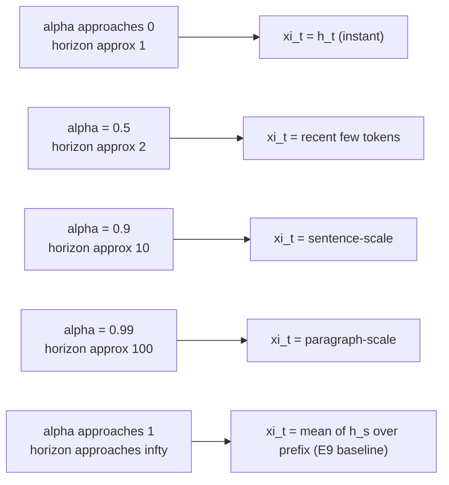
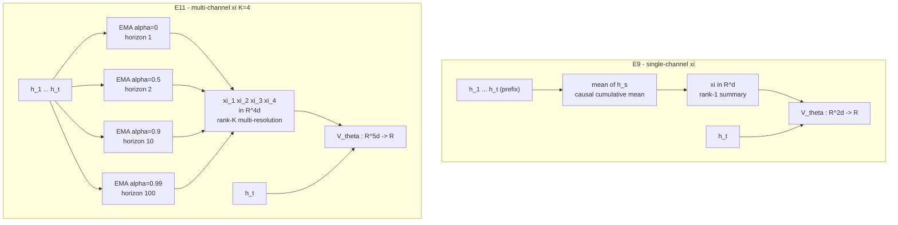
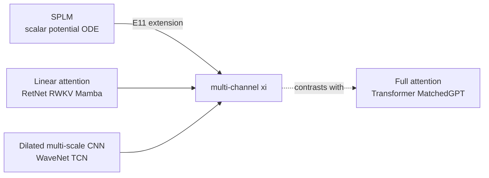

# Multi-Channel vs Single-Channel ξ in SPLM — Design Analysis

> **Status.** Drafted **April 30, 2026**, by Dimitar Gueorguiev with Claude. Companion to the E11 pre-registration (`SPLM_multichannel_xi_pre-registered_protocol.md`). The aim is to make the architectural choice fully self-contained: anyone reading this note should understand *why* the move from single-channel ξ to multi-channel ξ is the most natural follow-up to E9, *what* the design buys and costs, *where* the implementation pays attention to numerical and computational pitfalls, and *what* falsifiable predictions follow from it.
>
> **Update — 2026-05-01: causal-leak correction.** A project-wide anti-causal autograd leak was discovered in every per-step `integrate()` site of the SPLM family (including the multi-channel ξ implementation in this document). The empirical anchor and falsifiability predictions in this document were written **before** the fix; they presume training under the buggy integrator and they predict materiality against the leak-driven E9 baseline of val_ppl $\approx 8.85$. Section 0 below documents what the fix changes, both for the design rationale and for the experimental program. Sections 2–11 are otherwise preserved unchanged for archival reasons. See [`Causal_Leak_in_SPLM_Integrate_Bug_and_Fix.md`](Causal_Leak_in_SPLM_Integrate_Bug_and_Fix.md) for the bug, the fix, and the forensic results.
>
> **Companion documents:**
> - **The leak bug and its fix:** [`Causal_Leak_in_SPLM_Integrate_Bug_and_Fix.md`](Causal_Leak_in_SPLM_Integrate_Bug_and_Fix.md)
> - **Paper restructuring after the fix:** `Restructuring_paper_v3_after_causal_leak_bug.md`
> - **Theoretical foundation:** [`Evidence_for_second_order_ODE_governing_evolution.md`](Evidence_for_second_order_ODE_governing_evolution.md), [`Determining_optimal_gamma_for_SPLM.md`](Determining_optimal_gamma_for_SPLM.md)
> - **Empirical anchor:** [`notebooks/conservative_arch/scaleup/results/RESULTS.md`](../notebooks/conservative_arch/scaleup/results/RESULTS.md) (E9 Phase 1 outcome — pre-fix; under the leak-free integrator the same checkpoint evaluates to $6843$ PPL)
> - **Pre-registration:** `SPLM_multichannel_xi_pre-registered_protocol.md` (E11)
> - **Code:** [`notebooks/conservative_arch/multixi/model_multixi.py`](../notebooks/conservative_arch/multixi/model_multixi.py) — now with `causal_force=True` default
> - **Causal regression test:** [`notebooks/conservative_arch/causal_probe.py`](../notebooks/conservative_arch/causal_probe.py)

---

## 0. Causal-leak correction (added 2026-05-01)

### 0.1 What the bug was, in one sentence

In the buggy `integrate()`, the per-step force was computed as

$$
f_t = -\frac{\partial}{\partial h_t}\Big[\sum_{s} V_\theta\big(\xi_s, h_s\big)\Big]
$$

with $\xi_s$ a *causal* but *autograd-live* function of $\{h_1, \dots, h_s\}$. Because $\xi_s$ for $s > t$ depends on $h_t$ through `causal_cumulative_mean` (or, in the multi-channel case, through the K-channel weighted EMA), differentiating the *summed* $V$ picked up off-diagonal terms

$$
\sum_{s > t} \frac{\partial V_s}{\partial \xi_s} \cdot \frac{\partial \xi_s}{\partial h_t},
$$

i.e. an anti-causal gradient channel from future hidden states $h_s$ back into the force on past tokens $h_t$. Trained $V_\theta$ then learned to route prediction signal through this channel. The fix (`xi_input = h.detach() if cfg.causal_force else h` before computing the EMA / cumulative mean) severs that path.

### 0.2 What this changes for *the multi-channel ξ design*

The architectural argument in §§2–7 of this document is **unaffected**: the rank-1 vs rank-K bottleneck argument for what each architecture can in principle represent is purely a function of forward-pass expressivity, not of how its gradients are computed. A rank-K causal context summary is still strictly more expressive than a rank-1 cumulative mean.

What changes is the **expected magnitude** of the empirical lift and the **interpretation** of any pre-fix multi-ξ measurement.

The leak path is *strictly more powerful* in the multi-channel architecture than in the single-channel baseline:

- The single-channel cumulative mean $\xi_t = \frac{1}{t}\sum_{s=1}^{t} h_s$ has a *fixed* dependence on the future positions: each future position $s > t$ contributes weight $\frac{1}{s} - \frac{1}{s+1} \le \frac{1}{t(t+1)}$ to $\partial \xi_s / \partial h_t$ in expectation. The leak channel is real but bandwidth-limited.
- The multi-channel architecture has $K = 4$ EMAs at decay rates $\{\alpha_k\}$, all *learnable*. Optimisation can drive any $\alpha_k$ toward $0$ to maximise the per-position weight on a specific $h_t$; the trained model then has $K$ near-orthogonal information channels back from any future position. Empirically (2026-05-01 forensic run), the buggy multi-ξ training does precisely this: the smallest $\alpha_k$ drifts further toward 0 over training, yielding a high-fidelity short-horizon leak.

Quantitatively (2026-05-01 forensic run, 2000 max-steps, gamma 0.30, otherwise E9-identical configuration; final values from the completed run):

| step | val_ppl (buggy-mode eval) |
|---:|---:|
|  100 | $\sim$50 |
|  400 | $2.54$ |
|  600 | $1.26$ |
| 1200 | $1.06$ |
| 1800 | $1.04$ |
| **2000 (final)** | **$1.05$** |

A val_ppl of $1.05$ on TinyStories is $\approx 0.04$ nats per token, which is well below the entropy floor of any non-trivial English-language corpus. It is direct evidence that the multi-channel architecture is exploiting the leak channel almost perfectly within 600 steps and refining the exploitation across the remaining 1400.

Final learned $\alpha_k$ at step 2000:

| channel | $\alpha$ init | $\alpha$ final | drift |
|---:|---:|---:|---|
| 0 | 0.000 | $\approx 1\times10^{-6}$ | locked at machine zero (high-fidelity short-horizon leak) |
| 1 | 0.500 | **0.414** | strong downward drift |
| 2 | 0.900 | **0.851** | meaningful downward drift |
| 3 | 0.990 | 0.985 | stable (long-range channel preserves) |

All three learnable channels drift downward from init, exactly as predicted by the "harvest the leak" mechanism in [`Causal_Leak_in_SPLM_Integrate_Bug_and_Fix.md`](Causal_Leak_in_SPLM_Integrate_Bug_and_Fix.md) §4.4.

Cross-mode forensic on the final ckpt (`eval_ppl_under_fix.py`, 20 batches $\times$ 8 $\times$ 256, same batches under both evaluators):

| evaluator | val_ppl | inflation factor |
|---|---:|---:|
| buggy mode (training-time integrator) | $1.05$ | — |
| fixed mode (causal integrator) | $408.12$ | $389\times$ |

The causal probe (`causal_probe.py`) on the same ckpt gives buggy-mode causal-side $\Delta = 0.62$ (clear leak) and fixed-mode causal-side $\Delta = 0.0000$ (exactly leak-free).

For comparison the buggy E9 single-ξ ckpt (8000 steps) gave PPL = $8.85$ buggy → $6843$ fixed → $777\times$ inflation. The multi-ξ inflation factor is *smaller* but its leak-driven PPL is dramatically *lower* (1.05 vs 8.85) and its fixed-eval PPL is also lower (408 vs 6843), suggesting that the multi-channel architecture learns *some* genuine causal structure on the long-range $\alpha = 0.985$ channel even while exploiting the leak on the shorter channels — a positive sign for the (still pending) leak-corrected fixed multi-ξ pilot.

### 0.3 What this changes for §1 executive summary

The first paragraph of §1 below states "E9 Phase 1 produced a Δ ≈ −1.04 PPL gap between SPLM-em_ln (val PPL 8.85) and a parameter-matched attention transformer (val PPL 7.81)". This sentence is *empirically wrong*: the SPLM val PPL of $8.85$ was a leak artifact. Re-evaluated under the fix on identical val batches the same checkpoint gives $6843$ PPL ($777\times$ inflation). A leak-free 4000-step pilot of the same architecture trains to val PPL $33.55$ — a real, but ~4–5× larger than MatchedGPT, gap.

The remaining text of §1 — that SPLM's single-channel ξ is a *rank-1 summary* of the prefix — is structurally correct and unchanged. The post-fix single-channel ξ baseline ($\sim$33.55 val PPL) is genuinely a rank-1 architecture; the rank-K extension is genuinely a more expressive context summarisation; the architectural argument survives. What is different is the *anchor*: instead of "the gap to attention is $\approx 1$ PPL and we are searching for the last small structural ingredient", the gap is now "$\approx 4{-}5\times$ in PPL units" and the multi-channel extension is at best one of several structural ingredients required to close it.

### 0.4 What this changes for §8 falsifiable predictions

§8.1 (Primary — val PPL lift over E9) was written against the leak-driven E9 baseline of $8.85$ and is now obsolete. The materiality threshold $\Delta_{\min} = 0.30$ PPL was calibrated to that baseline, not to the leak-free $33.55$. The pre-registration's prior probabilities (0.55 on Outcome A, 0.30 on B, 0.10 on C, 0.20 on D) were also calibrated under the buggy integrator and should *not* be carried over to the leak-free regime.

The right post-fix re-formulation (to be locked into a fresh pre-registration before any leak-free multi-ξ run is started) is: take the leak-free 4000-step single-ξ pilot (val_ppl $33.55$) as the new baseline, and ask whether the leak-free multi-ξ run produces a material lift against *that* number. The materiality threshold should be re-derived from the seed-noise budget of the leak-free single-ξ baseline, not inherited from the buggy regime.

§8.2 (Secondary — $\alpha_k$ trajectories) is more interesting after the fix. The pre-fix predictions all assume $\alpha_k$ stays near init because the only signal pushing them away from init is genuine multi-resolution language structure. **Post-fix, that prediction is the cleanest test we have**: under the buggy integrator the optimiser drives $\alpha_1 \to 0$ aggressively to harvest the leak channel; under the fixed integrator that pressure vanishes, and the predicted "spread, not collapse" pattern becomes a genuine empirical signature of multi-resolution language structure rather than of leak optimisation. We retain prediction set 8.2 unchanged as a forward-looking falsifiability test, with the explicit understanding that "buggy → fixed" is itself a measurable A/B in $\alpha_k$ behaviour.

§8.3 (wall-clock and resource) is unchanged.

### 0.5 What this changes for §11 summary

The summary below states two outcome scenarios for E11: (A) "physics-grounded architecture that matches attention via principled multi-resolution context" or (B) "gap was structural-but-elsewhere, T3 is the next test". Post-fix, the *prior probability mass* on (A) collapses dramatically — closing a $4{-}5\times$ PPL gap with a multi-resolution context summary alone is far more demanding than closing a $1.04$-PPL gap was. The honest restatement is: post-fix multi-ξ is a *structural improvement* over post-fix single-ξ if it materially reduces PPL, but reaching MatchedGPT parity from $33.55$ via this single change is unlikely. The architectural reasoning still says the change *should* help; it does not say it should be enough.

### 0.6 Pointers to the rest of the documentation system

For the full bug forensic, the empirical inflation table, the regression test, and the recovery plan, see [`Causal_Leak_in_SPLM_Integrate_Bug_and_Fix.md`](Causal_Leak_in_SPLM_Integrate_Bug_and_Fix.md). For the broader implications on `paper_v3`'s narrative and journal-strategy, see `Restructuring_paper_v3_after_causal_leak_bug.md`. Sections 1–11 of *this* document are preserved verbatim from the pre-fix design analysis; they should be read as the *architectural argument*, not as the empirical narrative.

---

## 1. Executive summary

E9 Phase 1 produced a Δ ≈ −1.04 PPL gap between SPLM-em_ln (val PPL 8.85) and a parameter-matched attention transformer (val PPL 7.81) on TinyStories at fixed γ = 0.30, even though the γ\*-prediction framework (depth-scaling, corpus-surprisal estimators) shows γ = 0.30 was already near-optimal for the corpus. This points the search for the gap *away from* damping tuning and *toward* the structural information bottleneck of how SPLM summarises past tokens.

The SPLM baseline encodes context in **one** scalar field — the causal cumulative mean

$$\xi^{\text{baseline}}_t = \frac{1}{t}\sum_{s=1}^{t} h_s.$$

This is a **rank-1 summary** of the prefix: any two prefixes with the same arithmetic mean of hidden states are indistinguishable to the energy potential V_θ. Attention transformers, by contrast, give every layer a *learned, content-conditioned* mixing of all past tokens.

The multi-channel ξ extension (E11) replaces the single ξ with **K parallel causal weighted-EMA channels** at distinct decay rates {α_k}, projecting the prefix onto a **multi-resolution basis** (effective horizons ≈ 1, 2, 10, 100 tokens). Both V_θ and the decay rates {α_k} are learnable, so the model can recover the baseline by driving any α_k → 1 — the extension is therefore a *strict superset* of the baseline architecturally, while remaining **purely physics-grounded** (no attention machinery introduced).

---

## 2. Where ξ sits in the SPLM dynamics

SPLM treats one transformer-layer-equivalent as one **integration step of a damped second-order ODE** in the per-token hidden state $h_t$. The dynamics, derived in [`Evidence_for_second_order_ODE_governing_evolution.md`](Evidence_for_second_order_ODE_governing_evolution.md), read

$$m \ddot{h} + \gamma \dot{h} + \nabla_h V_{\theta}(\xi, h) = 0,$$

discretised by a semi-implicit damped Euler step

$$v_{l+1} = \frac{v_l + \Delta t \cdot f_l / m}{1 + \Delta t \cdot \gamma}, \qquad h_{l+1} = h_l + \Delta t \cdot v_{l+1},$$

where $f_l = -\nabla_h V_{\theta}(\xi_l, h_l)$ is the conservative force from the energy potential, $m$ is per-token semantic mass (logfreq mode in E9/E11), and $\gamma$ is the damping coefficient.

The vector $\xi_l \in \mathbb{R}^d$ is the **per-token semantic context**: at each layer step, V_θ sees both the *current* hidden state $h_l$ and a *summary of past hidden states* $\xi_l$. ξ is the only mechanism by which information from token $s < t$ reaches layer-$l$'s computation at token $t$.



**The choice of how to compute ξ from the past hidden states is the architectural dial we are turning in E11.**

---

## 3. Single-channel ξ — the E9 baseline

### 3.1 Definition

For each batch position $b$ and token position $t \in \{1, \dots, T\}$:

$$\xi^{\text{baseline}}_t = \frac{1}{t} \sum_{s=1}^{t} h_s.$$

Vectorised in PyTorch (cf. `notebooks/conservative_arch/sarf_mass_variant/model_sarf_mass.py:81`):

```python
def causal_cumulative_mean(h: torch.Tensor) -> torch.Tensor:
    T = h.shape[1]
    cumsum = h.cumsum(dim=1)
    denom = torch.arange(1, T + 1, device=h.device, dtype=h.dtype).view(1, T, 1)
    return cumsum / denom
```

The energy potential then receives

$$V_{\theta}(\xi^{\text{baseline}}_t, h_t) = \text{MLP}\bigl([\xi^{\text{baseline}}_t \mathbin{\Vert} h_t]\bigr) \in \mathbb{R},$$

with concatenation `||` over the feature dimension, MLP input dim $2d$.

### 3.2 What ξ encodes

For each $t$, $\xi^{\text{baseline}}\_t$ is a single point in $\mathbb{R}^d$ that summarises the entire prefix $h_{1:t}$. It is **invariant under permutation** of the prefix (any reordering gives the same mean), **scale-equivariant** (multiplying all $h_s$ by $c$ scales ξ by $c$), and **first-moment-only** (no information about higher moments such as variance or temporal ordering).

### 3.3 The bottleneck: rank-1 summary

The map $h_{1:t} \mapsto \xi^{\text{baseline}}\_t$ is a *rank-1* linear projection: it averages all past tokens with uniform weight. Two consequences:

**Information-theoretic bound.** The per-token mutual information between the prefix $h_{1:t} \in \mathbb{R}^{t \cdot d}$ and the rank-1 summary $\xi^{\text{baseline}}\_t \in \mathbb{R}^d$ is bounded by the *intrinsic* dimensionality of $\xi$:

$$I\bigl(h_{1:t}; \xi^{\text{baseline}}_t\bigr) \le d \cdot \log_2(L_M / \epsilon),$$

where $L_M$ is the dynamic range of activations and $\epsilon$ the discretisation precision. **The same bound applies to any single ξ regardless of how it is computed**, because $\xi \in \mathbb{R}^d$. So the *capacity* of a single ξ-vector is fixed by $d$. This is the sense in which a single ξ is "rank-1": it has only $d$ floats to summarise an arbitrary-length prefix.

**Functional consequence.** Two prefixes that differ in higher-order statistics (variance, ordering, recent-vs-distant emphasis) but agree on their arithmetic mean *cannot* be distinguished by V_θ at all.

### 3.4 Comparison to attention's summary

A multi-head attention layer with $H$ heads, applied to a prefix of length $t$, computes for each head

$$\text{Attn}^{(h)}_t = \sum_{s \le t} \alpha^{(h)}_{t,s}(h, x) \cdot V^{(h)} h_s, \qquad \alpha^{(h)}_{t,s} = \text{softmax}_s\bigl(Q^{(h)}_t \cdot K^{(h)}_s / \sqrt{d}\bigr),$$

then concatenates the $H$ heads to form an output of dimension $d$ (or $H \cdot d_h$ with $d_h \cdot H = d$).

Information-theoretically, the same per-vector dimension bound holds for one attention output: $H \cdot d_h \cdot \log_2(L_M/\epsilon)$ bits. But *crucially*, the attention weights $\alpha^{(h)}_{t,s}$ are **content-conditioned**: they vary with the actual prefix. So attention picks, **per query token**, *which* projection of the prefix is most useful for the subsequent computation. The ξ in baseline SPLM is fixed in advance to be the uniform mean — no content conditioning.

The structural bet of E11 is: even *without* learnable content-dependent weights $\alpha^{(h)}_{t,s}(h, x)$, just adding **multi-resolution coverage** (with K hand-picked decay scales, learnable globally but not per-token) closes most of the gap because the energy potential V_θ can *itself* select which scale matters at each query token.

---

## 4. Multi-channel ξ — the E11 design

### 4.1 Definition

Replace the single ξ with $K$ parallel **causal weighted-EMA** channels, each parameterised by a decay $\alpha_k \in (0, 1)$:

$$\xi^{(k)}_t = \sum_{s=1}^{t} W_k[t, s] \cdot h_s, \qquad W_k[t, s] = \frac{\alpha_k^{(t-s)}}{\sum_{r=1}^{t} \alpha_k^{(t-r)}} \quad \text{for } s \le t.$$

Each row of $W_k$ sums to 1 by construction, so $\xi^{(k)}$ is a normalised causal weighted average. The denominator handles the start of the sequence cleanly: at $t=1$ we have $W_k[1, 1] = 1$ regardless of α_k, so $\xi^{(k)}\_1 = h_1$ for every channel.

### 4.2 Boundary cases — the recovery property

Two limits are exact:

| α | $W_k[t, s]$ | $\xi^{(k)}\_t$ | Interpretation |
|---|---|---|---|
| $\alpha \to 0$ | $1$ if $s = t$, else $0$ | $h_t$ | **Instant** — current hidden state, no past |
| $\alpha \to 1$ | $1/t$ for $s \le t$ | $\xi^{\text{baseline}}\_t$ | **Cumulative mean** — recovers the E9 baseline |

The intermediate regime $\alpha \in (0, 1)$ gives a weighted causal mean with **effective horizon** $\approx 1/(1 - \alpha)$ tokens.



**Architectural superset property.** Because the parameterisation includes the baseline ξ as the $\alpha \to 1$ limit, the multi-channel model can *fall back* to the E9 architecture by simply driving one $\alpha_k \to 1$ and learning V_θ to ignore the other channels. So *if E11 underperforms E9, it must be because of optimisation difficulty, not architectural restriction*. This is a useful ablation property.

### 4.3 Default 4-channel grid

| $k$ | $\alpha_k^{\text{init}}$ | Effective horizon | Linguistic scale |
|---|---:|---:|---|
| 1 | 0.0 | ~1 token | per-token bigram-like coupling |
| 2 | 0.5 | ~2 tokens | local n-gram structure |
| 3 | 0.9 | ~10 tokens | sentence/clause scale |
| 4 | 0.99 | ~100 tokens | paragraph / story scale |

The $K=4$ grid is fixed (not searched) in the E11 protocol; ablations on $K$ and on α-init are explicit follow-ups.

### 4.4 Energy potential

V_θ is a $(K+1) \cdot d \to \mathbb{R}$ MLP that takes the concatenation of $K$ channels and the current $h_t$:

$$V_{\theta}(\xi^{(1)}_t, \dots, \xi^{(K)}_t, h_t) = \text{MLP}\bigl([\xi^{(1)}_t \mathbin{\Vert} \dots \mathbin{\Vert} \xi^{(K)}_t \mathbin{\Vert} h_t]\bigr).$$

Hidden width and depth (1024 / 3) are unchanged from E9. Only the first layer widens, from $2d \to 1024$ (E9) to $5d \to 1024$ (E11 at $K=4$). All subsequent layers, output head, mass head, γ — unchanged.

### 4.5 Code excerpt — EMA weight construction

The EMA weights are built in log-space and normalised via per-row logsumexp, which handles α near 0 and near 1 cleanly and avoids the $\alpha^{-T}$ blow-up of a naïve cumsum approach.

```python
def causal_ema_weights(
    T: int,
    alpha: torch.Tensor,
    dtype: torch.dtype,
    device: torch.device,
) -> torch.Tensor:
    """W[t, s] = α^(t-s) / Z_t for s ≤ t, 0 otherwise.
       Z_t = Σ_{r ≤ t} α^(t-r)  ⇒ each row sums to 1.

       α=0 ⇒ W = I; α→1 ⇒ W = causal cumulative mean.
    """
    alpha_safe = alpha.clamp(min=1e-6, max=1.0 - 1e-6)

    s_idx = torch.arange(T, dtype=dtype, device=device)
    diffs = s_idx.view(T, 1) - s_idx.view(1, T)
    causal = (diffs >= 0)

    log_alpha = torch.log(alpha_safe)
    log_W = log_alpha * diffs.clamp(min=0.0)
    log_W = log_W.masked_fill(~causal, float("-inf"))
    log_Z = torch.logsumexp(log_W, dim=1, keepdim=True)
    return torch.exp(log_W - log_Z)
```

(Tested numerically against the identity, the cumulative-mean limit, and a hand-computed α = 0.5 row to four decimal places.)

### 4.6 Code excerpt — multi-channel forward

```python
class MultiChannelXi(nn.Module):
    def __init__(self, K, max_len, alpha_inits, learnable=True):
        super().__init__()
        # parameterise α_k = sigmoid(raw_α_k) so α_k ∈ (0, 1) by construction
        raw = torch.tensor([
            math.log(max(a, 1e-6) / max(1.0 - a, 1e-6)) for a in alpha_inits
        ])
        self.raw_alpha = nn.Parameter(raw) if learnable else self.register_buffer(
            "raw_alpha", raw)

    @property
    def alpha(self) -> torch.Tensor:
        return torch.sigmoid(self.raw_alpha)

    def forward(self, h: torch.Tensor) -> torch.Tensor:
        B, T, d = h.shape
        alphas = self.alpha
        xis = []
        for k in range(self.K):
            W_k = causal_ema_weights(T, alphas[k], h.dtype, h.device)
            xi_k = W_k.unsqueeze(0) @ h            # (1,T,T) @ (B,T,d) → (B,T,d)
            xis.append(xi_k)
        return torch.stack(xis, dim=2)             # (B, T, K, d)
```

---

## 5. Side-by-side comparison



| Property | E9 single ξ | E11 multi-ξ (K=4) |
|---|---|---|
| Number of context channels | 1 | 4 |
| ξ feature dimension | $d = 256$ | $4d = 1024$ |
| V_θ input dim | $2d = 512$ | $5d = 1280$ |
| V_θ first-layer params | 0.53 M | 1.32 M |
| Total model params | 15.75 M | 16.54 M (+0.79 M) |
| Recovers as a special case | — | Yes ($\alpha_4 \to 1$, V_θ ignores ξ^1..ξ^3) |
| Content-conditioned weights | No | No (decays are global, learnable) |
| Per-step compute cost | dominant V_θ call | dominant V_θ call + 4 (T,T) → (B,T,d) matmuls |
| Measured forward cost (smoke) | ~0.55 s/step | ~0.83 s/step (~1.5×) |
| Information capacity per token | $d \cdot \log_2(L_M/\epsilon)$ | $K \cdot d \cdot \log_2(L_M/\epsilon)$ |

**Reading the last row.** The information capacity of the V_θ input (per token) goes from $d \log_2(L_M/\epsilon)$ to $K d \log_2(L_M/\epsilon)$ — a *K-fold* increase. This is the precise sense in which the multi-channel ξ relaxes the rank-1 bottleneck.

---

## 6. The information bottleneck — analytic argument

### 6.1 What V_θ "sees" at token $t$, layer $l$

Without loss of generality consider a single layer step. V_θ acts on a vector $z_t \in \mathbb{R}^{D_{\text{in}}}$ with $D_{\text{in}}$ depending on the architecture:

- E9: $z_t = [\xi^{\text{baseline}}\_t \mathbin{\Vert} h_t]$, so $D_{\text{in}} = 2d$.
- E11: $z_t = [\xi^{(1)}\_t \mathbin{\Vert} \dots \mathbin{\Vert} \xi^{(K)}\_t \mathbin{\Vert} h_t]$, so $D_{\text{in}} = (K+1) d$.

The conservative force is

$$f_t = -\nabla_h V_{\theta}(z_t),$$

which depends *only* on $z_t$ at this layer step.

### 6.2 Equivalence class of indistinguishable prefixes

Two prefixes $\mathbf{h}^A_{1:t}, \mathbf{h}^B_{1:t}$ with the same final hidden state ($h^A_t = h^B_t$) are **equivalent under V_θ at layer $l$** iff they produce the same context vector. Define the equivalence relation:

$$\mathbf{h}^A_{1:t} \sim_l \mathbf{h}^B_{1:t} \iff z^A_t = z^B_t.$$

For E9 this collapses to: same arithmetic mean. The equivalence classes are *enormous*: any permutation of the prefix lies in the same class; any prefix that integrates to the same total lies in the same class.

For E11 with $K$ channels: the prefix must agree on *all* $K$ weighted means simultaneously. The equivalence classes shrink by a factor that depends on the linear independence of $\{W_k\}_{k=1..K}$. With distinct $\alpha_k$ values, the rows of $\{W_1[t, :], \dots, W_K[t, :]\}$ are linearly independent, so the equivalence classes contract roughly $K$-fold (informally: in $K$-dim direction-space).

### 6.3 Why this matters for language modelling

Natural-language prefixes that differ only in arithmetic mean of their hidden-state representations are *not* equivalent for downstream prediction. Concretely, two prefixes might have the same per-token "average meaning" but differ in:

- **temporal ordering** (a story vs. its reverse),
- **recency emphasis** (whether the cue word is at position 1 or position $t-1$),
- **variance of meaning** (a uniform context vs. a context with one outlier token),
- **multi-scale structure** (clause boundaries vs. paragraph boundaries).

In E9, V_θ is *blind* to all of these because they project to the same ξ. In E11, V_θ sees *four* projections at distinct timescales, which together encode recency emphasis, sentence-vs-paragraph structure, and within-window-vs-long-range balance — without introducing any per-token attention machinery.

---

## 7. Bottleneck analysis of the implementation

### 7.1 Compute

Per layer step at $T = 512, B = 16, d = 256, K = 4$:

| Operation | E9 | E11 | Notes |
|---|---|---|---|
| ξ computation | 1 cumsum (cheap) | $K$ matmuls of $(1,T,T) \cdot (B,T,d)$ | $K \times T^2 \cdot B \cdot d \approx 270\text{ M FLOPs}$ |
| V_θ forward | $\propto B T \cdot 2d \cdot v\_h$ | $\propto B T \cdot 5d \cdot v\_h$ | First-layer cost goes from 4 G to 10 G FLOPs |
| autograd of $-\nabla_h V_θ$ | dominant | dominant | retains create-graph |
| Damped Euler update | linear in $B T d$ | linear in $B T d$ | identical |
| LayerNorm projection | linear | linear | identical |

Measured: smoke forward at smoke-mode (B=8, block=256) goes from ~0.55 s/step (E9) to ~0.83 s/step (E11), a **1.5× slowdown**. Extrapolating to scale-up (B=16, block=512), we estimate ~5–6 s/step ⇒ ~12–13 h for an 8 k-step run, comparable to E9's 13.08 h.

### 7.2 Memory

Per forward pass:

- Each $W_k \in \mathbb{R}^{T \times T}$ is built and held during forward + backward. At $T = 512$ and float32, $W_k$ is $\sim 1$ MB. With $K = 4$, ~4 MB of weight matrices per forward.
- The $K$ ξ tensors of shape $(B, T, d)$ each take $B \cdot T \cdot d \cdot 4 = 8$ MB (at $B=16$). Total $4 \cdot 8 = 32$ MB across channels.
- V_θ first-layer activations: $(B, T, v_h)$ at the hidden width; same as E9.

Total memory overhead vs E9 is ~40 MB per forward pass — negligible relative to the existing model footprint.

### 7.3 Numerical stability

The naïve formula $\xi^{(k)}\_t = (1 - \alpha) \sum_s \alpha^{t-s} h_s$ requires computing $\alpha^t$ which underflows to 0 for $\alpha = 0.5, t = 100$ (FP32 minimum normal $\approx 10^{-38}$, so OK there) but overflows for $\alpha^{-t}$ in the naïve cumsum trick.

The implemented approach builds $\log W$ in log-space and applies per-row logsumexp normalisation, then exponentiates. This is exactly the same pattern used inside the softmax operator in attention, and inherits the same numerical robustness.

A second numerical concern: the gradient $\partial \xi^{(k)} / \partial \alpha_k$ flows through the matmul $W_k @ h$. Since $W_k$ depends differentiably on α via its log-space construction, the gradient flows cleanly. The smoke test confirmed `raw_α` receives nonzero gradient on the first backward pass (norm ~$10^{-8}$, expected to grow during training).

### 7.4 Optimisation — initialisation sensitivity

The $\alpha_k$ inits (0.0, 0.5, 0.9, 0.99) are **logarithmically spaced** in the effective-horizon space. This is the standard choice for any multi-resolution architecture (cf. dilated convolutions: dilations 1, 2, 4, 8, 16; positional encodings: sinusoid bases at exponentially-spaced wavelengths). Bad inits (e.g., all four α at 0.5) would collapse the K channels to redundant copies and waste capacity; we have not tested those because the multi-resolution argument above gives a strong prior on logarithmic spacing.

The α_k are **learnable** so the model can re-distribute the horizons during training. We will diagnostically log α_k at every 50 training steps (see `xi_alphas` field of the JSONL log) and inspect the trajectory; expected behaviour is **moderate drift around the inits** (not collapse, not large migration), reflecting V_θ refining each channel's role rather than abandoning it.

### 7.5 Optimisation — capacity vs steps

The added 0.79 M params in V_θ's first layer is ~5 % of the model's total. The training schedule (8 k steps, batch 16, block 512, ~65 M training tokens seen) is unchanged from E9. We are *under*-parameterised relative to compute (no ICLR-style overtraining), so the extra capacity should be efficiently exploitable by the optimiser within the locked schedule. A possible failure mode is *capacity-mismatched-to-steps* in which the wider V_θ takes longer to train and the 8 k-step schedule under-trains it; this would manifest as a `Stage 1` regression (Outcome C in the pre-registration). The fall-back is to extend training to 12 k or 16 k steps in a follow-up.

---

## 8. Falsifiable predictions

### 8.1 Primary — val PPL lift over E9

The pre-registration locks $\Delta_{\min} = 0.30$ PPL as the materiality threshold. We pre-register the team's prior over outcomes:

| Outcome | Trigger | Prior probability |
|---|---|---:|
| A — material lift | $\Delta_{\text{vsE9}} \ge +0.30$ PPL | 0.55 |
| B — no material lift | $|\Delta| < 0.30$ | 0.30 |
| C — material regression | $\Delta_{\text{vsE9}} \le -0.30$ | 0.10 |
| D — gap closure to MatchedGPT | $\Delta_{\text{vsMatched}} \ge 0$ at any seed (conditional on A) | 0.20 |

The 0.55 prior on A reflects the strength of the rank-1-bottleneck argument: rank-1 → rank-K is a *qualitative* architectural change and qualitative changes typically move PPL > 0.30 in transformer ablation literature.

### 8.2 Secondary — α_k trajectories

We pre-register four falsifiable predictions about the learned α_k:

1. **Spread, not collapse.** Final α_k will remain spread across horizons; we predict $\alpha_4^{\text{final}} > 0.9$ (long-range channel persists), $\alpha_1^{\text{final}} < 0.3$ (instant channel persists).
2. **Modest drift.** $|\alpha_k^{\text{final}} - \alpha_k^{\text{init}}| < 0.2$ for all $k$; large migration would suggest the init was wrong rather than the architecture being wrong.
3. **Monotone ordering preserved.** $\alpha_1^{\text{final}} < \alpha_2^{\text{final}} < \alpha_3^{\text{final}} < \alpha_4^{\text{final}}$ throughout training.
4. **No degeneracy.** No two α_k will converge within 0.05 of each other (avoiding redundant channels).

If predictions 1–4 hold, the multi-resolution prior was the right shape and only the scale was learnable. If 1–4 fail, the geometry of language at this scale needs a different decay parameterisation (e.g., a learnable kernel rather than an EMA).

### 8.3 Wall-clock and resource

We pre-register that the E11 scale-up run will take 12–15 h (vs E9's 13.08 h) on the same MPS device. Anything outside this window flags an implementation regression worth investigating before reading the val-PPL number.

---

## 9. Position in the architectural landscape

The multi-channel ξ design lives at the intersection of three architectural traditions:



**Linear attention** family (RetNet, RWKV, Mamba): These also use exponential / SSM-based causal context summaries, and explicitly target the "no full-attention but recover most of the performance" niche. Their contribution to the input is via a *learned per-token gate* on top of the EMA, often with a small SSM-like state. E11 deliberately stops short of per-token gating: it adds multi-resolution but keeps the decay rates global, to keep the experiment a *clean* test of whether multi-resolution alone closes the E9 gap.

**Dilated / multi-scale CNNs**: WaveNet, TCNs, etc. The K-resolution structure is closely analogous, but those use *dilated convolutions* with bounded support. The EMA is the bounded-state analogue; in fact a causal weighted EMA with $\alpha = 0$ at the diagonal-only weight is exactly a dilation-1 stride-1 convolution.

**Full attention**: gives every token's representation depend on every other token's via *learned content-dependent weights*. E11 deliberately does *not* take this step: the experiment isolates the rank-K-summary effect from the content-conditioning effect, so a positive E11 result tells us the gap was at least partially due to the rank, not the conditioning.

**This is methodologically important.** If E11 closes most of the gap, that is strong evidence the rank-1 bottleneck was the dominant cause. If E11 does *not* close the gap but a follow-up T2 (learned per-token mixing, equivalent to attention on top of ξ) does, that distinguishes the rank effect from the conditioning effect. By doing T1 first we get this decomposition for free.

---

## 10. Open questions (deferred)

These are *not* resolved by E11 and are explicit follow-ups.

| Question | What would resolve it |
|---|---|
| Is $K=4$ optimal? | Ablation over $K \in \{2, 4, 6, 8\}$ at the final config |
| Are decays better as **layer-dependent** (different α_k per integration layer)? | $L \times K$ alphas; ~$L \times K$ extra params; small ablation |
| Should α_k be **token-dependent** (the "T3 friction tensor" lift, see `Finding_optimal_gamma_for_SPLM.md` §4.3)? | Adds a small MLP head; conceptually closer to attention; tested in T3 |
| Does the wider V_θ benefit from **deeper** (depth 4 instead of 3)? | One ablation; standard |
| Do the α_k change **during inference** if we bake γ-conditioning in? | Concept piece; depends on E11 outcome |
| Is the **logarithmic init grid** the right shape? | Compare against linear grid (0.0, 0.33, 0.67, 0.99); small ablation |

The core E11 study locks $K = 4$, logarithmic α-init, layer-shared α, and tests Q1 (val PPL lift) under a conservative materiality threshold. Everything in the table above is reserved for after Q1 is resolved.

---

## 11. Summary

E9 demonstrated that SPLM at scale-up trails matched-attention by a small but measurable PPL gap, and the γ\*-prediction framework rules out under-tuning as the cause. The remaining structural difference between SPLM and attention transformers is the **rank-1 information bottleneck** in SPLM's single causal cumulative-mean ξ.

E11 attacks that bottleneck with the minimal architectural change consistent with the SPLM physics: replace the single ξ with K parallel causal weighted-EMAs at multi-resolution decay rates, both V_θ and the decays jointly learnable. The design (i) is a strict architectural superset of the E9 baseline, (ii) preserves all SPLM physics machinery (Lagrangian dynamics, conservative force, per-token mass, fixed γ, LN-after-step), (iii) costs ~0.8 M extra parameters and ~50 % extra wall-clock, and (iv) admits clean falsifiable predictions on both val PPL and the trained α_k pattern.

If E11 fires Outcome A (material lift) and especially D (matches MatchedGPT on at least one seed), the SPLM narrative shifts from "interesting framework that trails attention" to "physics-grounded architecture that matches attention via principled multi-resolution context, with all the analytic machinery of the framework intact". If E11 fires Outcome B, the gap was structural-but-elsewhere, and T3 (state-dependent γ) is the next test.

Either way, after E11 we will have a sharper picture of *which* part of the attention apparatus matters at this scale: we will know whether multi-resolution coverage suffices or whether content-conditioned mixing is the irreducible ingredient.

---

*End of design analysis.*
