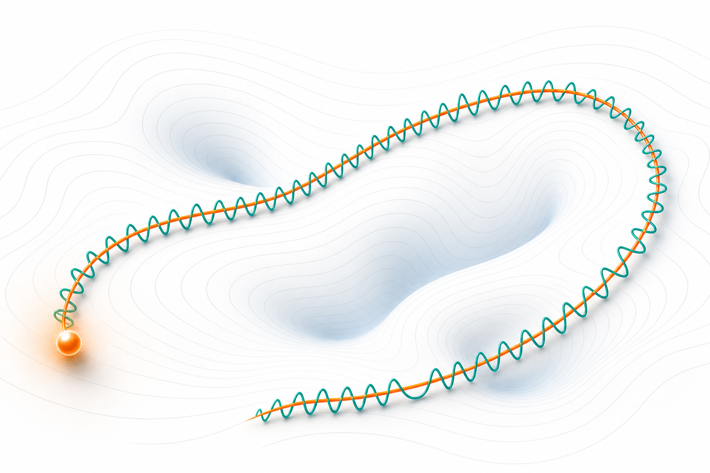
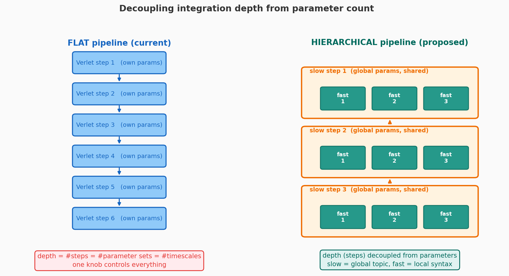
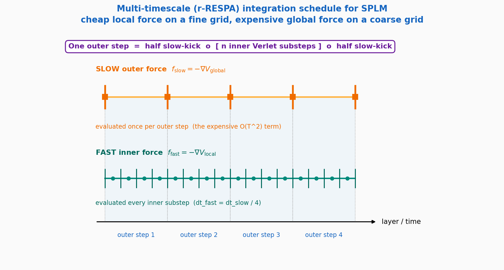
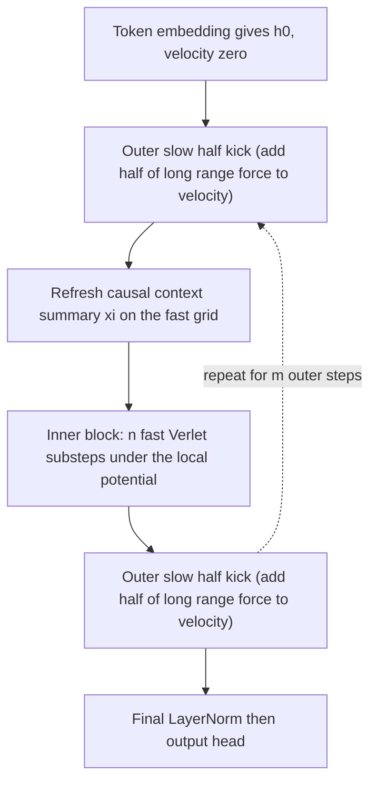
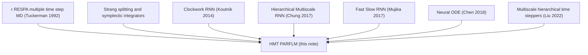

# Multi-Timescale Hierarchical Integration for Scalar-Potential Language Models

**Status:** companion note to *Semantic Simulation: A Prescriptive Lagrangian Framework for Efficient Semantic Inference* (Gueorguiev, 2026).
**Scope:** a proposal and theoretical analysis for replacing the current flat single-rate velocity-Verlet pipeline of the SPLM / PARFLM / Fock-PARFLM family with a **nested, multi-timescale integrator** adapted from the reversible reference-system propagator algorithm (r-RESPA) of molecular dynamics. The goal is to improve next-token-prediction (NTP) loss and validation perplexity (PPL) on large, heterogeneous corpora such as OpenWebText, while preserving the conservative (gradient-of-a-potential) force law and the symplectic structure that define the framework.
**Companion docs:**

- [`Context_Mixing_Mechanisms_in_the_Conservative_Framework.md`](./Context_Mixing_Mechanisms_in_the_Conservative_Framework.md) -- the four conservative context-mixing alternatives; this note develops the integrator-structure axis that is orthogonal to those.
- [`Structured_VTheta_Design_and_Theory.md`](./Structured_VTheta_Design_and_Theory.md) -- single-particle scalar potential.
- [`Structured_VPhi_Design_and_Theory.md`](./Structured_VPhi_Design_and_Theory.md) -- pairwise interaction potential.
- [`Training_Instabilities_in_Fock-PARFLM_with_structured_V_theta.md`](./Training_Instabilities_in_Fock-PARFLM_with_structured_V_theta.md) -- the gradient-explosion phenomenology that this proposal partially addresses.
- **Implementation:** [`notebooks/conservative_arch/parf/model_parf.py`](../notebooks/conservative_arch/parf/model_parf.py) (the `_stack_forward` / `_layer_step` methods are the target of the modification).

---

## Table of Contents

1. [Motivation: the flat pipeline couples three axes](#1-motivation-the-flat-pipeline-couples-three-axes)
2. [Background: the propagator view of the Verlet stack](#2-background-the-propagator-view-of-the-verlet-stack)
3. [The r-RESPA construction](#3-the-r-respa-construction)
4. [Translation to language: Hierarchical Multi-Timescale PARFLM](#4-translation-to-language-hierarchical-multi-timescale-parflm)
5. [Theoretical analysis](#5-theoretical-analysis)
6. [Cost analysis](#6-cost-analysis)
7. [Relationship to multiscale deep learning](#7-relationship-to-multiscale-deep-learning)
8. [Concrete experimental proposal](#8-concrete-experimental-proposal)
9. [Risks, caveats, and open questions](#9-risks-caveats-and-open-questions)
10. [References](#10-references)

---

## 1. Motivation: the flat pipeline couples three axes

Every model in the scalar-potential family currently evolves a single "semantic particle" $h_t$ for each token through one flat stack of $L$ velocity-Verlet integration steps. The hidden state is initialised from the token embedding, the velocity proxy starts at zero, and each layer applies a force derived from a total scalar potential. Layer index and physical time index are identified: layer $\ell$ is time $t_\ell = \ell \cdot \mathrm{dt}$.



This design has a structural weakness that becomes a binding constraint precisely on large, diverse corpora. **The flat pipeline collapses three logically distinct quantities into a single hyperparameter $L$:**

1. **Integration depth** -- how many discrete steps approximate the continuous trajectory. This controls numerical fidelity and the nonlinearity of the realised flow map.
2. **Parameter count** -- how many independent potential parameter sets do transformation work. This controls representational capacity.
3. **Timescale resolution** -- the granularity at which the dynamics can resolve fast versus slow semantic phenomena.

In a standard Transformer these are also entangled (one block = one parameter set = one mixing operation), but the Transformer compensates with very large per-layer capacity. In the conservative family the potential bank is largely **shared across depth** (depth-conditioning modulates a single bank with per-layer codes), so the per-step transformation capacity is comparatively small. The result is a model that is simultaneously (a) parameter-starved per unit of transformation work and (b) unable to spend extra integration steps on the *fast* part of the dynamics without also paying for the *slow*, expensive pairwise force at every step.

Natural language has a manifest separation of timescales. Local syntactic structure -- agreement, function words, morphology -- changes rapidly from token to token and is largely captured by the single-particle potential $V_\theta$ acting through the causal context summary $\xi_t$. Global discourse structure -- topic, coreference chains, long-range entity state -- changes slowly and is carried by the pairwise potential $V_\phi$, which is also the expensive $O(T^2)$ term and, empirically, the locus of the gradient explosions documented in the training-instability note.

The proposal of this document is to stop integrating both forces on the same grid. We borrow the central idea of multiple-time-step molecular dynamics: **evaluate the cheap, fast force on a fine time grid and the expensive, slow force on a coarse time grid, composed so that the overall integrator remains time-reversible and symplectic** (Tuckerman, Berne, & Martyna, 1992).



---

## 2. Background: the propagator view of the Verlet stack

### 2.1 The current equation of motion

At each layer $\ell$ the hidden state evolves under the damped Euler--Lagrange equation. Writing the two dotted-derivative terms in a single display block (per the rendering rules) gives:

$$
w_t   \ddot{h}_t + \gamma   \dot{h}_t = -\nabla_h U(h_t, \xi_t), \qquad U = V_\theta(\xi_t, h_t) + \sum_{s \lt t} V_\phi(h_t, h_s).
$$

Here $w_t$ is the token mass, $\gamma$ the damping coefficient, and $U$ the total potential. The velocity-Verlet discretisation used in the code is:

$$
h_t^{(\ell+1)} = h_t^{(\ell)} + \frac{\delta_t^{(\ell)}}{1 + \mathrm{dt}\cdot\gamma} + \frac{\mathrm{dt}^2}{w_t (1 + \mathrm{dt}\cdot\gamma)}   f_t^{(\ell)}, \qquad f_t^{(\ell)} = -\nabla_{h_t} U\big(h_t^{(\ell)}, \xi_t^{(\ell)}\big),
$$

with $\delta_t^{(\ell)} = h_t^{(\ell)} - h_t^{(\ell-1)}$ the velocity proxy. The crucial observation is that **the single force $f_t$ already lumps together two physically distinct contributions** -- the local $-\nabla V_\theta$ and the long-range $-\nabla V_\phi$ -- and applies both at the same rate $1/\mathrm{dt}$.

### 2.2 The Liouville operator and its formal solution

To split the rates rigorously we move to the propagator picture. For a (formally undamped) Hamiltonian system with position $h$ and momentum $p = w \dot{h}$, the phase-space density and any observable evolve under the **Liouville operator** $iL$, defined through the Poisson bracket with the Hamiltonian $H$. For a separable $H = p^2/(2w) + V(h)$ the operator splits into a kinetic and a force part:

$$
iL = \underbrace{\frac{p}{w} \frac{\partial}{\partial h}}_{iL_{\text{drift}}}   +   \underbrace{F(h) \frac{\partial}{\partial p}}_{iL_{\text{kick}}}, \qquad F(h) = -\nabla_h V(h).
$$

The exact time evolution over a step $\Delta t$ is the action of the propagator $e^{iL \Delta t}$ on the state. Because $L_{\text{drift}}$ and $L_{\text{kick}}$ do not commute, $e^{iL \Delta t}$ has no closed form -- but each piece *alone* does: $e^{iL_{\text{kick}} \Delta t}$ is a pure momentum kick and $e^{iL_{\text{drift}} \Delta t}$ is a pure position drift.

### 2.3 Trotter factorisation recovers Verlet

The symmetric (Strang) splitting of the propagator (Trotter, 1959; Strang, 1968) approximates the joint evolution to second order:

$$
e^{iL \Delta t} = e^{iL_{\text{kick}} \Delta t/2}  e^{iL_{\text{drift}} \Delta t}  e^{iL_{\text{kick}} \Delta t/2} + O(\Delta t^3).
$$

Read left to right on the state, this *is* velocity-Verlet: half momentum kick, full position drift, half momentum kick. The factorisation is the reason Verlet is symplectic and time-reversible (Hairer, Lubich, & Wanner, 2006; Leimkuhler & Reich, 2004). The key property we will exploit is that **symmetric Trotter factors can be nested**: any one of the exponentials may itself be replaced by a further symmetric product, and the composite remains second-order, symplectic, and reversible.

---

## 3. The r-RESPA construction

### 3.1 Splitting the force by timescale

Suppose the total force decomposes additively into a *fast* (cheap, rapidly varying) part and a *slow* (expensive, slowly varying) part:

$$
F(h) = F_{\text{fast}}(h) + F_{\text{slow}}(h), \qquad F_{\text{fast}} = -\nabla V_{\text{fast}}, \quad F_{\text{slow}} = -\nabla V_{\text{slow}}.
$$

The corresponding kick operators are $iL_{\text{fast}}$ and $iL_{\text{slow}}$. The reference-system propagator algorithm (Tuckerman, Berne, & Martyna, 1992) factorises the propagator over a large outer step $\Delta t$ by placing the slow kick on the *outside* and a fully resolved fast subsystem on the *inside*:

$$
e^{iL \Delta t} = e^{iL_{\text{slow}} \Delta t/2} \Big[  e^{iL_{\text{fast-ref}} \delta t}  \Big]^{n}  e^{iL_{\text{slow}} \Delta t/2} + O(\Delta t^3),
$$

where the inner *reference propagator* $e^{iL_{\text{fast-ref}} \delta t}$ is itself one symmetric Verlet step under the fast force alone, the inner step is $\delta t = \Delta t / n$, and there are $n$ inner substeps per outer step. The expensive slow force is evaluated only **twice per outer step** (the two half-kicks), while the cheap fast force is evaluated $n$ times.

### 3.2 The nested algorithm

Expanding the inner reference propagator into its own half-kick / drift / half-kick form yields the explicit double loop. The schedule is illustrated below: the slow force fires on a coarse grid (orange), the fast force on a fine grid (teal).



In pseudocode, one outer step advancing the state $(h, v)$ by $\Delta t$ is:

```text
# outer (slow) half-kick
v <- v + (dt_slow / 2) * f_slow(h) / w

# inner (fast) reference system: n symmetric Verlet substeps
for k in range(n):
    v <- v + (dt_fast / 2) * f_fast(h) / w     # fast half-kick
    h <- h + dt_fast * v                         # drift
    v <- v + (dt_fast / 2) * f_fast(h) / w     # fast half-kick

# outer (slow) half-kick
v <- v + (dt_slow / 2) * f_slow(h) / w
```

The whole stack is $m$ outer steps wrapping $n$ inner substeps, so the realised integration depth is $m \cdot n$ Verlet substeps, but the slow (pairwise) force is computed only $2m$ times and the fast (single-particle) force $m \cdot n$ times.

### 3.3 Reversibility and symplecticity are preserved

Because every factor in the product is the exponential of a single Liouville sub-operator -- each of which generates an exact, volume-preserving, time-reversible map -- and because the arrangement is palindromic (symmetric) in $\Delta t$, the composite map is **symplectic and time-reversible by construction** (Tuckerman et al., 1992; Hairer et al., 2006). No new force is ever defined directly: both $F_{\text{fast}}$ and $F_{\text{slow}}$ remain negative gradients of scalar potentials. The conservative-by-construction guarantee that anchors the whole framework is therefore inherited unchanged. This is the decisive advantage of r-RESPA over ad-hoc "different layers do different things" schemes: the multiscale structure is a *re-bracketing of the same propagator*, not a new force model.

---

## 4. Translation to language: Hierarchical Multi-Timescale PARFLM

### 4.1 What is fast and what is slow

The mapping from molecular dynamics to the SPLM family is direct and, we argue, semantically principled:

| Molecular dynamics | SPLM / PARFLM analogue | Rate |
| ------------------ | ---------------------- | ---- |
| Stiff bonded forces (bond stretch, angle) | Single-particle potential V_theta (local syntax driven by causal context) | fast (fine grid) |
| Soft long-range forces (electrostatic, van der Waals) | Pairwise potential V_phi (discourse, coreference, long-range binding) | slow (coarse grid) |

The analogy is more than cosmetic. In molecular dynamics the bonded forces are *stiff* (large curvature, short period) and therefore demand a small step for stability, whereas the long-range forces are *soft* (small curvature, long period) and tolerate a large step. The reason r-RESPA wins is that the expensive force is also the soft one, so it can be sampled coarsely without loss of accuracy. The conjecture for language is the structural mirror: the expensive force ($V_\phi$, the $O(T^2)$ pairwise term) corresponds to slowly varying discourse-level information that does **not** need to be recomputed at every integration substep, while the cheap force ($V_\theta$) carries the fast local variation that does.

### 4.2 The Hierarchical Multi-Timescale PARFLM (HMT-PARFLM)

Define the outer (slow) potential as the pairwise term and the inner (fast) potential as the single-particle term:

$$
V_{\text{slow}}(h) = \sum_{s \lt t} V_\phi(h_t, h_s), \qquad V_{\text{fast}}(h) = V_\theta(\xi_t, h_t).
$$

The forward pass becomes a nested loop: $m$ outer slow steps, each wrapping $n$ inner fast Verlet substeps, with $\xi_t$ refreshed on the fast grid (its causal-EMA character makes it a fast quantity). The structure is shown below.



### 4.3 Decoupling depth from parameters

The pivotal benefit is that **the effective integration depth $m \cdot n$ is no longer tied to the parameter budget**. Three independent knobs emerge:

- $m$ -- the number of slow (pairwise) updates. This is the budget for *global context mixing*, the expensive resource.
- $n$ -- the number of fast substeps per slow update. This deepens the *local* trajectory at near-zero marginal cost (the single-particle potential is cheap, and with the analytical-gradient $V_\theta$ it does not even require an autograd pass).
- the **parameter sharing pattern** -- which of the $m$ slow potentials and $m \cdot n$ fast potentials share weights. One can, for example, untie the $m$ slow potentials (few, expensive, high-value) while fully sharing the fast potential across all substeps.

A configuration such as $m = 4$ slow steps and $n = 4$ fast substeps yields a $16$-substep trajectory -- matching the current $L = 16$ depth -- while computing the costly pairwise force only $8$ times instead of $16$, and giving the local dynamics a finer effective $\delta t$.

### 4.4 Why a finer fast grid should help NTP

Two mechanisms predict a perplexity benefit independent of any parameter increase:

1. **Lower local truncation error.** The single-particle flow under $V_\theta$ is the stiff component. Halving its step from $\mathrm{dt}$ to $\delta t = \mathrm{dt}/n$ reduces the per-step local error of the fast subsystem from $O(\mathrm{dt}^3)$ to $O(\delta t^3)$, i.e. by a factor $n^2$ in the leading constant. A more faithfully integrated local trajectory means the realised flow map is closer to the continuous dynamics the potential actually defines, removing a source of discretisation bias that the optimiser currently has to absorb into the potential parameters.
2. **More nonlinear realised flow at fixed parameters.** Composing $n$ small symmetric steps produces a flow map with strictly richer functional form than one large step of the same potential (the higher-order Baker--Campbell--Hausdorff terms in the composition are non-trivial). This is the integrator-level analogue of depth: extra expressivity bought with compute rather than parameters, in the spirit of Neural ODEs (Chen, Rubanova, Bettencourt, & Duvenaud, 2018).

---

## 5. Theoretical analysis

### 5.1 Order of accuracy and the modified Hamiltonian

The symmetric outer factorisation is globally second-order: the realised map agrees with the exact flow of $H = T + V_{\text{fast}} + V_{\text{slow}}$ to $O(\Delta t^2)$. By backward error analysis (Hairer et al., 2006), the r-RESPA map is the *exact* flow of a nearby **modified Hamiltonian** $\tilde{H} = H + \Delta t^2 H_2 + \cdots$. The leading correction $H_2$ contains a double commutator of the fast and slow forces:

$$
H_2  \propto  [ V_{\text{slow}}, [ V_{\text{slow}}, T ] ]  +  \text{fast-fast terms},
$$

which is exactly why the slow force tolerates a large step: its contribution to the error growth is controlled by *its own* curvature, not the (large) curvature of the fast subsystem. The existence of a conserved modified Hamiltonian is the formal statement that the scheme has no secular energy drift, which underwrites long-horizon stability of the trajectory.

### 5.2 Connection to the observed gradient explosions

The training-instability note documents repeated gradient blow-ups localised in the $V_\phi$ / Fock machinery, with the watchdog reloading the best checkpoint every few thousand steps. In the propagator picture this has a clean interpretation: the pairwise force, applied at the full rate, injects a high-variance kick into the velocity at every layer, and the backward pass through `create_graph=True` amplifies the resulting curvature. r-RESPA changes the exposure in two ways:

1. The slow force is applied $2m$ times instead of $m \cdot n$ times, each as a **half**-kick. The cumulative number of high-variance pairwise kicks on the forward (and hence backward) path is reduced by a factor of roughly $n/2$.
2. Each slow kick acts on a state that has been smoothed by $n$ intervening fast substeps, so the pairwise force is evaluated at better-conditioned points.

This does not *eliminate* the instability -- a pathological $V_\phi$ can still explode -- but it reduces the frequency and the gradient-path multiplicity of the dominant instability source, complementing the variance-reduction logic behind the current `GRAD_ACCUM` and `grad_clip_vphi` mitigations.

### 5.3 Parameter efficiency

Let $P_\theta$ and $P_\phi$ be the parameter counts of the single-particle and pairwise potentials. The flat model with depth $L$ and a shared bank has effective capacity $\approx P_\theta + P_\phi$ (shared) up to depth-code modulation. The HMT model with $m$ untied slow potentials and one shared fast potential has capacity $\approx P_\theta + m P_\phi$. Because $P_\phi$ is the smaller, more structured object and $m$ is small (e.g. $4$), this is a targeted capacity increase concentrated exactly on the context-mixing term identified as the binding constraint -- at a *lower* total forward cost than the flat model, since the pairwise force fires fewer times.

### 5.4 Expressivity: effective depth at fixed width

Denote by $\Phi_{\delta t}$ the one-substep fast flow. The realised single-particle map over an outer step is $\Phi_{\delta t}^{ n}$, an $n$-fold self-composition. Self-composition strictly increases the set of representable diffeomorphisms relative to $\Phi_{\mathrm{dt}}$ whenever $V_\theta$ is non-quadratic, with the gap governed by the commutator $[ L_{\text{drift}}, L_{\text{fast}} ]$. The model therefore realises an effective depth of $m \cdot n$ with the parameter footprint of at most $m + 1$ potentials -- the integrator-structure analogue of the capacity argument that motivates deep transition RNNs and Fast-Slow RNNs (Mujika, Meier, & Steger, 2017).

---

## 6. Cost analysis

Let $T$ be sequence length, $d$ the hidden width, and assume the analytical-gradient structured $V_\theta$ (one matvec, no autograd) and the sparse top-$k$ structured $V_\phi$ (the expensive term).

| Quantity | Flat (depth L) | HMT (m outer, n inner, L = m·n) |
| -------- | -------------- | ------------------------------- |
| Fast force evaluations | L | m·n = L |
| Slow (pairwise) force evaluations | L | 2m |
| Pairwise FLOP cost | O(L · T·k·d) | O(2m · T·k·d) |
| Dominant backward graph | L pairwise autograd passes | 2m pairwise autograd passes |
| Peak activation memory | O(L · T·k) pairwise tensors | O(2m · T·k) pairwise tensors |

With $m = 4$, $n = 4$ ($L = 16$), the pairwise force -- the bottleneck in both compute and memory, and the source of the gradient instability -- is evaluated $8$ times instead of $16$: a **2x reduction** in the dominant cost while *preserving* the $16$-substep effective depth. The fast force evaluations are unchanged in count but each is cheaper per unit of trajectory progress because no pairwise tensor is built. In short, HMT is expected to be both faster per effective-depth-unit and more stable, the same double win that r-RESPA delivers in molecular dynamics (where reported speedups range from ~3x for biomolecules to 20--40x for stiff molecular crystals; Humphreys, Friesner, & Berne, 1994; Procacci & Berne, 1994).

---

## 7. Relationship to multiscale deep learning

The idea of processing a sequence at multiple temporal rates has a long lineage in deep learning, which HMT-PARFLM both draws on and differs from.



- **Clockwork RNN** (Koutnik, Greff, Gomez, & Schmidhuber, 2014) partitions hidden units into modules with fixed clock rates; slow modules update rarely. HMT shares the multi-rate philosophy but applies it to *forces in a symplectic integrator* rather than to disjoint hidden partitions, so the whole state benefits from both rates.
- **Hierarchical Multiscale RNN** (Chung, Ahn, & Bengio, 2017) and **Fast-Slow RNN** (Mujika et al., 2017) interleave fast and slow update cells, with the slow cell updated less frequently -- structurally the closest neural ancestors of the outer/inner loop. HMT differs by deriving the interleaving from a conservation law (the Trotter factorisation) rather than from learned gating, which is what buys the symplectic guarantee.
- **Neural ODE** (Chen et al., 2018) treats depth as continuous integration time; HMT is a structured, two-rate, symplectic ODE integrator with the slow/fast split chosen on semantic-cost grounds.
- **Hierarchical time-steppers (HiTS)** (Liu, Kutz, & Brunton, 2022) couple networks trained at different $\Delta t$ to integrate stiff systems and explicitly note the avoidance of exploding/vanishing gradients from long unrolls -- the same stability argument made in section 5.2, here obtained within a single model rather than across separately trained networks.

The distinguishing feature of HMT-PARFLM is that the multiscale structure is **not a heuristic**: it is the unique re-bracketing of the existing propagator that (a) preserves conservativity and symplecticity, (b) reduces the dominant cost, and (c) maps the expensive force onto the slow grid where it belongs both computationally and semantically.

---

## 8. Concrete experimental proposal

The modification is local to the integration loop (`_stack_forward` in `model_parf.py`); the potentials themselves are reused unchanged. Suggested arms, all at the current OpenWebText backbone ($d = 384$, effective depth $16$):

1. **HMT-A (depth-matched control).** $m = 4$, $n = 4$, fast potential shared across substeps, slow potential untied across the $4$ outer steps. Effective depth $16$, pairwise force fired $8$ times. Primary comparison against the running flat Fock-PARFLM at equal effective depth. Hypothesis: equal-or-better PPL at roughly half the pairwise cost, with fewer watchdog reloads.
2. **HMT-B (fast-deepened).** $m = 4$, $n = 8$, otherwise as HMT-A. Effective depth $32$ for the local dynamics, pairwise force still fired $8$ times. Tests the section 4.4 prediction that a finer fast grid lowers PPL at near-zero added cost.
3. **HMT-C (slow-enriched).** $m = 8$, $n = 2$, slow potentials untied. Tests whether more frequent global mixing helps when fast depth is reduced -- the opposite end of the trade-off.

Pre-registered primary metric: validation PPL at matched token budget. Secondary metrics: number of watchdog reloads per 10k steps (stability), wall-clock per effective-depth-unit (efficiency), and the EMA gradient-norm distribution of the pairwise force.

A clean ordering of outcomes makes the experiment decisive: if HMT-A matches flat PPL at lower cost, the multiscale re-bracketing is a free efficiency win; if HMT-B beats flat PPL, fast-grid fidelity was a real bottleneck; if HMT-C wins, the binding constraint is the *frequency* of global mixing, which would itself redirect the broader research programme.

---

## 9. Risks, caveats, and open questions

- **The resonance instability.** Multiple-time-step integrators have a well-known failure mode: when the outer step $\Delta t$ approaches a half-integer multiple of the fast subsystem's period, energy resonances destabilise the trajectory and impose a hard ceiling on the achievable outer step (García-Archilla, Sanz-Serna, & Skeel, 1999). In the language setting the "period" of the local dynamics is set by the curvature of $V_\theta$; if the outer step is too coarse relative to it, HMT-C-style configurations could become unstable. Mollified-impulse variants exist as mitigations and should be kept in reserve.
- **The fast/slow assignment is a conjecture.** That $V_\phi$ is genuinely the *slow* variable is an empirical claim, not a theorem. If discourse-level information actually varies as fast as syntax in OpenWebText, the coarse pairwise grid would lose accuracy. The HMT-C arm partly probes this; a direct diagnostic (autocorrelation of the per-layer $V_\phi$ force along the trajectory) should be run first.
- **Damping interacts with the split.** The framework's damping term $\gamma \dot{h}$ is non-Hamiltonian, so strict symplecticity holds only in the $\gamma \to 0$ limit; with damping the relevant guarantee is the reversible-friction RESPA extension, which the implementation must follow to keep the modified-Hamiltonian argument valid.
- **LayerNorm-after-step.** The code optionally applies a LayerNorm projection after each step. Inserting it on the fast grid versus only at outer-step boundaries changes the geometry; the cleaner choice (projection at outer boundaries only) should be the default to avoid injecting energy on the fine grid.
- **Backward cost of nesting.** While the forward pairwise cost halves, the inner loop lengthens the sequential dependency chain; under gradient checkpointing the recomputation pattern needs care so the $n$-fold inner unroll does not erase the memory saving.

These are tractable engineering questions, and each maps onto a known result in the molecular-dynamics or geometric-integration literature rather than uncharted territory.

---

## 10. References

1. Gueorguiev, D. (2026). *Semantic Simulation: A Prescriptive Lagrangian Framework for Efficient Semantic Inference.*
2. Tuckerman, M., Berne, B. J., & Martyna, G. J. (1992). Reversible multiple time scale molecular dynamics. *Journal of Chemical Physics*, 97(3), 1990--2001. DOI: 10.1063/1.463137.
3. Humphreys, D. D., Friesner, R. A., & Berne, B. J. (1994). A multiple-time-step molecular dynamics algorithm for macromolecules. *Journal of Physical Chemistry*, 98(27), 6885--6892.
4. Procacci, P., & Berne, B. J. (1994). Computer simulation of solid C60 using multiple time-step algorithms. *Journal of Chemical Physics*, 101(3), 2421.
5. Trotter, H. F. (1959). On the product of semi-groups of operators. *Proceedings of the American Mathematical Society*, 10(4), 545--551.
6. Strang, G. (1968). On the construction and comparison of difference schemes. *SIAM Journal on Numerical Analysis*, 5(3), 506--517.
7. Hairer, E., Lubich, C., & Wanner, G. (2006). *Geometric Numerical Integration: Structure-Preserving Algorithms for Ordinary Differential Equations* (2nd ed.). Springer.
8. Leimkuhler, B., & Reich, S. (2004). *Simulating Hamiltonian Dynamics.* Cambridge University Press.
9. McLachlan, R. I., & Quispel, G. R. W. (2002). Splitting methods. *Acta Numerica*, 11, 341--434.
10. García-Archilla, B., Sanz-Serna, J. M., & Skeel, R. D. (1999). Long-time-step methods for oscillatory differential equations. *SIAM Journal on Scientific Computing*, 20(3), 930--963.
11. Koutnik, J., Greff, K., Gomez, F., & Schmidhuber, J. (2014). A clockwork RNN. *Proceedings of the 31st International Conference on Machine Learning (ICML)*.
12. El Hihi, S., & Bengio, Y. (1995). Hierarchical recurrent neural networks for long-term dependencies. *Advances in Neural Information Processing Systems (NeurIPS)*.
13. Chung, J., Ahn, S., & Bengio, Y. (2017). Hierarchical multiscale recurrent neural networks. *International Conference on Learning Representations (ICLR)*.
14. Mujika, A., Meier, F., & Steger, A. (2017). Fast-slow recurrent neural networks. *Advances in Neural Information Processing Systems (NeurIPS)*.
15. Chen, R. T. Q., Rubanova, Y., Bettencourt, J., & Duvenaud, D. (2018). Neural ordinary differential equations. *Advances in Neural Information Processing Systems (NeurIPS)*.
16. Liu, Y., Kutz, J. N., & Brunton, S. L. (2022). Hierarchical deep learning of multiscale differential equation time-steppers. *Philosophical Transactions of the Royal Society A*, 380. arXiv:2008.09768.

---

**Document history:**

| Date | Change |
| ---- | ------ |
| 2026-06-28 | Initial version: r-RESPA-based multi-timescale integrator proposal, theory, cost analysis, and experimental plan. |
