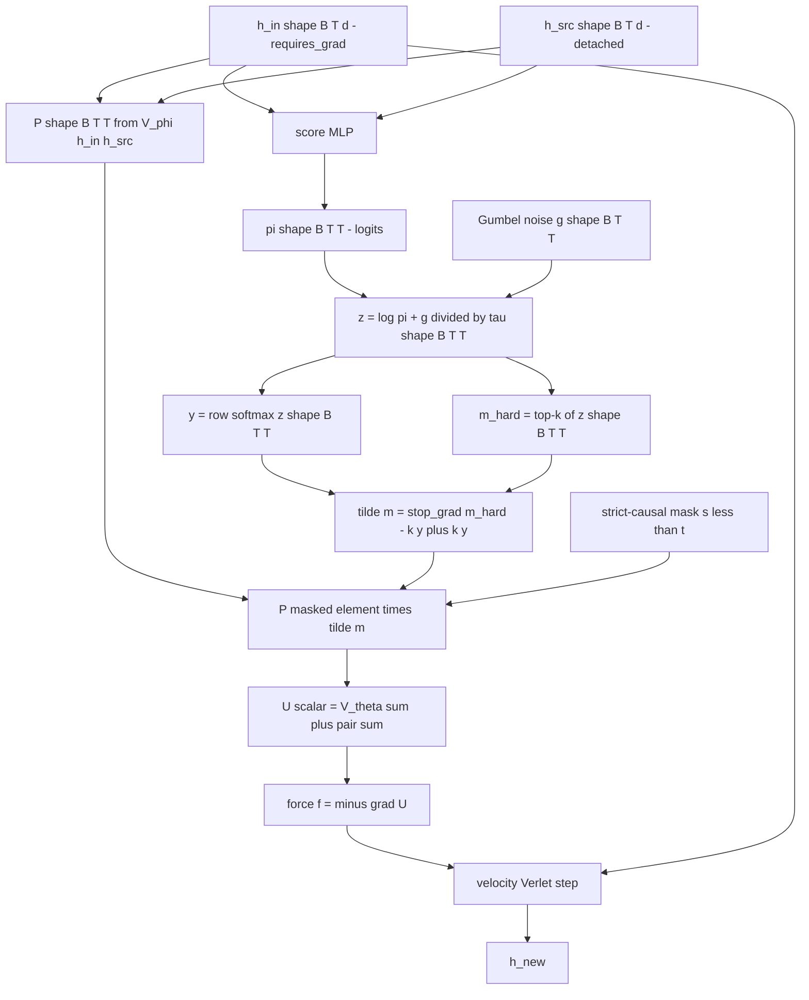

# On Gumbel-softmax Sparsity Applied to V_phi

A theoretical and practical deep dive on the **Gumbel-softmax sparsity**
mechanism for the PARF pair-interaction scalar $V_\phi$ — what the
framework actually prescribes, what the Gumbel-softmax relaxation is
mathematically, what the differences are between Stage 1 (dense) and
Stage 1.5 (Gumbel-softmax sparse) variants of PARF, what the
implementation looks like in concrete PyTorch on top of the existing
`PARFLM` prototype, and what the open theoretical and engineering risks
are.

Companion to:

- Design doc: [`PARF_Augmented_SPLM_Architecture.md`](PARF_Augmented_SPLM_Architecture.md) (esp. §5.2 quantile cutoff, §7.2 Algorithm A sparsity component, §15.24.7 deposit).
- Implementation roadmap: [`PARF-SPLM_Path_Forward_and_Experiments.md`](PARF-SPLM_Path_Forward_and_Experiments.md) (P5 row).
- Algorithm A training pipeline: [`On_Training_the_PARF_Force.md`](On_Training_the_PARF_Force.md).
- $V_\phi$ functional form (structural and MLP): [`On_the_MLP_Layer_modeling_pairwise_potential.md`](On_the_MLP_Layer_modeling_pairwise_potential.md).
- Implementation: [`notebooks/conservative_arch/parf/model_parf.py`](../notebooks/conservative_arch/parf/model_parf.py) (`PARFLM`, `StructuralVPhi`, `MLPVPhi`).
- Causal probe: [`notebooks/conservative_arch/parf/causal_probe_parf.py`](../notebooks/conservative_arch/parf/causal_probe_parf.py).

---

## 0. TL;DR

The framework's §5.2 quantile cutoff is a *discrete selection* over past
tokens at every $(t, \ell)$: keep only the top-$k$ pair partners
$\lbrace s : s \lt t\rbrace$ ranked by force magnitude
$\lVert \nabla_{h_t} V_\phi(h_t, h_s) \rVert$, drop the rest into the
dissipation budget. Discrete selection is not directly differentiable,
so dense Algorithm-A training cannot exercise it.

The Gumbel-softmax relaxation
([Jang et al. 2017](https://arxiv.org/abs/1611.01144), [Maddison et al. 2017](https://arxiv.org/abs/1611.00712))
replaces the discrete top-$k$ with a continuous, temperature-controlled
soft mask that *anneals* to the discrete selection in the limit
$\tau \to 0$. Combined with the **straight-through estimator** (STE) for
the hard-mask forward pass, this gives a gradient-friendly approximation
of the §5.2 prescription that integrates cleanly into the existing
Algorithm-A NTP training loop.

The cost arithmetic is:

- **Dense Stage 1 PARF (current):** per-layer pair-sum is $O(T^2 \cdot d_\phi)$.
- **Gumbel-sparse Stage 1.5 PARF:** per-layer pair-sum is
  $O(T \cdot k \cdot d_\phi)$ at inference, with a per-token scoring head
  at $O(T \cdot d_s)$. For the prototype $T = 128$, top-$k = 16$ this is
  an **8× decode-FLOP reduction** on the pair sum; at $T = 1024$ it is
  a **64× reduction**.

Stage 1.5 is the natural pivot if dense PARF (P1 / P1.6) lands at or
above the v4 SPLM em\_ln family floor (val PPL $\approx 180$): it
either rescues the framework's *quality* claim by improving val PPL via
better signal-to-noise on the relevant pairs, or it rescues the
framework's *efficiency* claim by anchoring the title-word
*efficient* on a $T^2 \to T \cdot k$ decode-FLOP cliff at long context.

The principal risks are temperature-schedule sensitivity, mask collapse
(all weight on a single $s$), the score-head looking superficially like
attention, and the framework-internal tension between adding a
non-conservative gating primitive and the framework's
"conservative-only" stance.

---

## 1. Table of contents

1. [Theoretical background](#2-theoretical-background)
   - The §5.2 quantile cutoff
   - Categorical sampling and the Gumbel-Max trick
   - Gumbel-softmax: differentiable relaxation
   - Straight-through estimator
2. [Architecture: score-head plus Gumbel-softmax mask](#3-architecture-score-head-plus-gumbel-softmax-mask)
3. [Training: soft mask with annealed temperature](#4-training-soft-mask-with-annealed-temperature)
4. [Inference: hard top-k retention](#5-inference-hard-top-k-retention)
5. [Cost analysis](#6-cost-analysis)
6. [Conservativity and the framework's stance](#7-conservativity-and-the-frameworks-stance)
7. [Issues and risks](#8-issues-and-risks)
8. [Side-by-side: dense PARF, Gumbel-sparse PARF, attention](#9-side-by-side-dense-parf-gumbel-sparse-parf-attention)
9. [Recommendations](#10-recommendations)
10. [References](#11-references)

---

## 2. Theoretical background

### 2.1 The §5.2 quantile cutoff

The PARF design doc §5.2 (Definition 17) prescribes a quantile-level
cutoff on pair interactions. Lifted to the token level, the prescription
is: at each $(t, \ell)$, retain only the top-$k$ pair partners
$\lbrace s_1, \ldots, s_k\rbrace \subset \lbrace s : s \lt t\rbrace$
ranked by force magnitude

$$
\sigma^{(\ell)}_{ts} \;\equiv\; \bigl\lVert \nabla_{h_t} V_\phi(h_t, h_s) \bigr\rVert,
$$

and absorb the dropped contribution into the dissipation budget. The
§5.2 truncation-residual bound makes the trade-off precise: the
quantile-cutoff at level $\ell_q$ has an *a priori* error bound on the
omitted force magnitude, controlled by the framework's per-layer
$1/r$-falloff structure of $V_\phi$ (Theorem 16 of §5.1).

The single-particle interpretation is that semantic content with low
type-relatedness ($\lVert l_t - l_s\rVert$ large in the §5.1
type-projection space) carries exponentially suppressed force
contribution; the quantile cutoff is the framework's prescription for
*how much* of that exponential tail to keep.

The *decisional* form of the prescription is

$$
m^{(\ell)}_{ts} \;=\;
\begin{cases}
1, & \sigma^{(\ell)}_{ts} \in \text{top-}k\text{ at }(t, \ell), \\
0, & \text{otherwise},
\end{cases}
$$

with the per-token effective energy

$$
U^{(\ell)}_t \;=\; V_\theta\bigl(\xi^{(\ell)}_t, h^{(\ell)}_t\bigr) \;+\; \sum_{s \lt t} m^{(\ell)}_{ts} \cdot V_\phi\bigl(h^{(\ell)}_t, h^{(\ell)}_s\bigr).
$$

The mask $m^{(\ell)}_{ts}$ is *categorical*: at each $(t, \ell)$ it
selects one of $\binom{t}{k}$ subsets of past tokens. Discrete
selections are not differentiable, so naive gradient descent on the NTP
loss cannot train the score function $\sigma$ end-to-end.

### 2.2 Categorical sampling and the Gumbel-Max trick

A categorical distribution over $n$ classes parameterised by logits
$\boldsymbol{\pi} = (\pi_1, \ldots, \pi_n)$ has the standard inverse-CDF
sampling routine. The **Gumbel-Max trick**
([Gumbel 1954](https://archive.org/details/statisticaltheor00gumb_0); revived for ML by [Maddison et al. 2014](https://arxiv.org/abs/1411.0030))
gives an alternative reparameterisation:

$$
i^{\ast} \;=\; \arg\max_{i \in \lbrace 1, \ldots, n\rbrace} \bigl( \log \pi_i + g_i \bigr), \qquad g_i \stackrel{\mathrm{i.i.d.}}{\sim} \mathrm{Gumbel}(0, 1),
$$

where $\mathrm{Gumbel}(0, 1)$ has CDF $F(x) = \exp(-\exp(-x))$ and is
sampled as $g = -\log(-\log u)$ with $u \sim \mathrm{Uniform}(0, 1)$.

The trick is that $i^{\ast}$ is distributed exactly as a draw from
$\mathrm{Categorical}(\boldsymbol{\pi})$, but the randomness has been
*decoupled* from the parameters $\boldsymbol{\pi}$: all stochasticity
lives in the $g_i$, while the $\pi_i$ enter only through the
deterministic $\arg\max$. This is the categorical analogue of the
Gaussian reparameterisation trick.

The $\arg\max$ is still non-differentiable, so the trick alone does not
solve the gradient problem — but it sets up the relaxation that does.

### 2.3 Gumbel-softmax: differentiable relaxation

Replacing the $\arg\max$ with a tempered $\mathrm{softmax}$ yields the
**Gumbel-softmax** (or **Concrete**) distribution:

$$
y_i(\tau) \;=\; \frac{\exp\bigl((\log \pi_i + g_i) / \tau\bigr)}{\sum_j \exp\bigl((\log \pi_j + g_j) / \tau\bigr)}, \qquad i \in \lbrace 1, \ldots, n\rbrace.
$$

The vector $\boldsymbol{y}(\tau) \in \Delta^{n-1}$ lives on the
$(n-1)$-simplex and has two limits of interest:

| limit | $\boldsymbol{y}(\tau)$ behaviour | property |
|-------|-----------------------------------|----------|
| $\tau \to \infty$ | uniform on the simplex | maximum-entropy, no information about $\boldsymbol{\pi}$ |
| $\tau \to 0$ | one-hot at $\arg\max_i (\log \pi_i + g_i)$ | exact Gumbel-Max draw |

For finite $\tau$, $\boldsymbol{y}(\tau)$ is a smooth, fully
differentiable function of $\boldsymbol{\pi}$ — gradients flow through
both the softmax temperature and the logits. The $\tau \to 0$ limit
recovers the exact discrete sample but introduces vanishing gradient
magnitudes (the softmax saturates), so practical training **anneals**
$\tau$ from a moderate value (e.g. $\tau_0 = 1$) toward a small but
nonzero floor (e.g. $\tau_{\min} = 0.1$ or $0.01$) over the course of
training.

For the top-$k$ extension we use the **subset-sampling** generalisation
of the Concrete distribution
([Xie & Ermon 2019](https://arxiv.org/abs/1901.10517)): draw $k$
independent Gumbel-softmax samples and aggregate; or apply a single
softmax-of-sums and select the top-$k$ entries by score
($\log \pi_i + g_i$). The latter is the form used here.

### 2.4 Straight-through estimator

For Stage 1.5 we want the **forward pass** to use a discrete
top-$k$ mask (so the architecture is exactly the §5.2 prescription at
inference) while the **backward pass** uses the soft Gumbel-softmax
mask (so gradients flow into the score logits). The
**straight-through estimator** ([Bengio et al. 2013](https://arxiv.org/abs/1308.3432); STE)
provides this:

$$
\tilde m^{(\ell)}_{ts} \;=\; \mathrm{stop\_grad}\bigl(m^{\mathrm{hard}}_{ts} - y_{ts}(\tau)\bigr) + y_{ts}(\tau),
$$

where $m^{\mathrm{hard}}_{ts}$ is the hard top-$k$ indicator and
$y_{ts}(\tau)$ is the Gumbel-softmax soft mask at temperature $\tau$.

The forward value of $\tilde m$ is $m^{\mathrm{hard}}$ (because the
two soft terms cancel under stop-gradient), and the backward value is
the gradient of $y_{ts}(\tau)$ (because $\mathrm{stop\_grad}$ kills
the hard-mask term's gradient and the $-y$ and $+y$ contributions
combine to yield $\partial y / \partial \pi$).

The bias of the STE is $O(\tau)$ in the temperature: at $\tau \to 0$
the soft mask coincides with the hard one in expectation, but the
practical training setpoint $\tau \in [0.1, 1.0]$ carries a meaningful
bias whose magnitude depends on the smoothness of the loss surface in
the relaxed direction. In practice this bias is small enough that
Gumbel-softmax sparsity is a workhorse in modern discrete-latent
modelling (image quantisation, sparse routing, mixture-of-experts), but
it is not zero, and it is one of the principal *theoretical* objections
to Algorithm A's sparsity component (see §6.5 of this doc and §7.2 of
the design doc).

---

## 3. Architecture: score-head plus Gumbel-softmax mask

### 3.1 The score head

The score function $\sigma^{(\ell)}_{ts}$ is the per-pair scalar that
ranks past tokens by their relevance to the current token. Three
candidates, in increasing order of capacity:

| variant | logits $\pi^{(\ell)}_{ts}$ | parameters | comment |
|---------|----------------------------|------------|---------|
| **norm-of-force**       | $\log \lVert \nabla_{h_t} V_\phi(h_t, h_s) \rVert$            | $0$        | the §5.2 prescription verbatim; requires an inner pre-evaluation of $V_\phi$, partially defeating the cost win |
| **norm-of-energy**      | $\log \lvert V_\phi(h_t, h_s) \rvert$                          | $0$        | cheaper proxy; one inner $V_\phi$ pre-evaluation; valid because $\nabla_{h_t} V_\phi \propto V_\phi$ for the §5.1 form up to the $1/r$ factor |
| **dedicated score MLP** | $\mathrm{MLP}_{\mathrm{score}}\bigl([h_t, h_s, h_t - h_s]\bigr)$ | $\sim 8\text{k}$–$16\text{k}$ | learned; standalone forward; closest to attention's $QK^{\top}$ but framework-justified as the §5.2 score function |

The recommended starting variant is the **dedicated score MLP** with
hidden width $H_{\mathrm{score}} = 32$ (small, doesn't dominate the
parameter count) and a tanh-bounded readout to keep logits in a
calibrated range. The §5.2-faithful "norm-of-force" variant is the
prescriptive ideal but the cost arithmetic requires a separate
exploration: the score head must be cheaper to evaluate than the full
$V_\phi$ pair sum it is supposed to replace, otherwise the Stage 1.5
machinery costs more than it saves.

### 3.2 Top-k Gumbel-softmax mask

Given per-pair logits $\pi^{(\ell)}_{ts}$, the per-pair Gumbel-perturbed
score is

$$
z^{(\ell)}_{ts}(\tau) \;=\; \frac{\log \pi^{(\ell)}_{ts} + g^{(\ell)}_{ts}}{\tau}, \qquad g^{(\ell)}_{ts} \stackrel{\mathrm{i.i.d.}}{\sim} \mathrm{Gumbel}(0, 1).
$$

The soft mask is the row-wise softmax over past tokens:

$$
y^{(\ell)}_{ts}(\tau) \;=\; \frac{\exp\bigl(z^{(\ell)}_{ts}(\tau)\bigr)}{\sum_{s' \lt t} \exp\bigl(z^{(\ell)}_{ts'}(\tau)\bigr)}.
$$

The hard top-$k$ mask is

$$
m^{\mathrm{hard},(\ell)}_{ts} \;=\;
\begin{cases}
1, & s \in \mathrm{topk}_k\bigl(\lbrace z^{(\ell)}_{ts'}(\tau)\rbrace_{s' \lt t}\bigr), \\
0, & \text{otherwise},
\end{cases}
$$

and the straight-through composite mask is

$$
\tilde m^{(\ell)}_{ts}(\tau) \;=\; \mathrm{stop\_grad}\bigl(m^{\mathrm{hard},(\ell)}_{ts} - k \cdot y^{(\ell)}_{ts}(\tau)\bigr) + k \cdot y^{(\ell)}_{ts}(\tau).
$$

The $k$ factor on $y$ keeps the *scale* of $\tilde m$ in the
straight-through pass approximately equal to the hard-mask scale
($\sum_s \tilde m_{ts} \approx k$ on average), which is important for
the downstream pair-sum scale.

### 3.3 The forward pass, end to end



The crucial subtlety is that the **causal mask** and the **Gumbel-softmax
top-$k$ mask** are composed multiplicatively: $\tilde m^{(\ell)}_{ts}$ is
zeroed out for $s \ge t$ before the top-$k$ argmax is taken (so the
causal constraint is structural, not learned). The composite mask is
then applied element-wise to the pair-potential matrix $P$ before the
sum, so only the top-$k$ surviving pairs contribute to $U$ and hence
to the force.

### 3.4 Per-layer cost decomposition

| stage | operation | shape | cost |
|-------|-----------|-------|------|
| score head | $\mathrm{MLP}([h_t, h_s, h_t - h_s])$        | $(B, T, T, H_s) \to (B, T, T)$ | $O(B \cdot T^2 \cdot d \cdot H_s)$ |
| Gumbel sample | element-wise transform of $\mathrm{Uniform}$  | $(B, T, T)$                    | $O(B \cdot T^2)$ |
| top-$k$ argmax | row-wise top-$k$                              | $(B, T, T) \to (B, T, k)$       | $O(B \cdot T^2 \log k)$ (PyTorch `torch.topk`) |
| $V_\phi$ pair eval | structural or MLP $V_\phi$ on the masked subset | $(B, T, k, \cdot) \to (B, T, k)$ | $O(B \cdot T \cdot k \cdot d_\phi)$ |
| pair sum | $\sum_s \tilde m_{ts} \cdot V_\phi$            | $(B, T, k) \to (B, T)$          | $O(B \cdot T \cdot k)$ |
| force | inner $\mathrm{autograd.grad}(U, h_{\mathrm{in}})$ | $(B, T, d)$                  | $O(B \cdot T \cdot d \cdot k \cdot d_\phi)$ |

The $O(T^2)$ score-head cost is the **same asymptotic cost as
attention's $QK^{\top}$**. The Stage 1.5 win is *not* in the score
evaluation but in the **$V_\phi$ pair evaluation**: dense PARF evaluates
$V_\phi$ on $T^2$ pairs; Gumbel-sparse PARF evaluates $V_\phi$ only on
the top-$k$ pairs surviving the mask, which is $O(T \cdot k)$ instead of
$O(T^2)$. For the structural variant where $V_\phi$ has $H_\theta = 32$
hidden width and 4k parameters per pair, this is the dominant cost
reduction; for the MLP variant where $V_\phi$ has $H_{\mathrm{mlp}} = 64$
and 28k parameters per pair, the saving is even larger in absolute
terms.

---

## 4. Training: soft mask with annealed temperature

### 4.1 Loss function

The Stage 1.5 training loss is the standard NTP cross-entropy plus
optional auxiliary terms:

$$
\mathcal{L}_{\mathrm{Stage\ 1.5}}(\theta, \phi, \psi) \;=\; \mathcal{L}_{\mathrm{NTP}} \;+\; \lambda_{\mathrm{sparsity}} \cdot \mathcal{L}_{\mathrm{sparsity}} \;+\; \lambda_{\mathrm{entropy}} \cdot \mathcal{L}_{\mathrm{entropy}},
$$

where $\psi$ are the score-head parameters and:

- $\mathcal{L}_{\mathrm{sparsity}}$ is an explicit cost on retaining
  more than $k$ effective pairs per token. The typical realisation is a
  $\ell_1$ penalty on the soft-mask values past the top-$k$ rank, or
  a hinge on the average soft-mask sum exceeding $k$. In practice the
  hard top-$k$ in the forward pass already enforces the constraint, so
  $\lambda_{\mathrm{sparsity}}$ can usually be set to zero unless the
  soft mask is grossly miscalibrated.
- $\mathcal{L}_{\mathrm{entropy}} = -\sum_{ts} y_{ts}(\tau) \log y_{ts}(\tau)$
  is an entropy regulariser that *prevents* mask collapse onto a single
  $s$. The framework's §5.2 prescription is *top-$k$*, not *top-$1$*;
  a small positive $\lambda_{\mathrm{entropy}} \sim 10^{-3}$ ensures the
  soft mask retains $k$-class support during training rather than
  greedily collapsing to the single best partner.

### 4.2 Temperature schedule

The classical Gumbel-softmax annealing schedule is geometric in the
training step:

$$
\tau(t) \;=\; \max\bigl(\tau_{\min}, \tau_0 \cdot \exp(-r \cdot t)\bigr),
$$

with $\tau_0 = 1.0$, $\tau_{\min} = 0.1$ (or $0.01$ for sharper hard-mask
fidelity in late training), and rate $r$ chosen so that $\tau_{\min}$ is
reached around $50$–$70\%$ of the training budget. For our $4000$-step
PARF prototype, $r = -\log(0.1) / (0.6 \cdot 4000) \approx 9.6 \times 10^{-4}$ gives
$\tau(2400) = 0.1$; the remaining $1600$ steps train at the floor.

The schedule has two competing pressures:

- **Too slow annealing:** late-training gradient signal is dominated by
  the soft-mask noise; the hard-mask top-$k$ at inference may differ
  meaningfully from the soft-mask top-$k$ during training, producing a
  train-test mismatch.
- **Too fast annealing:** early-training gradients vanish (softmax
  saturates) before the score head has learned a useful ranking; the
  mask collapses to whatever random initial top-$k$ the score head
  produces and never recovers.

The standard mitigation is **warm-up**: hold $\tau = \tau_0$ for the
first $\sim 10\%$ of training to let the score head learn a stable
ranking, then begin annealing.

### 4.3 Code sketch

The Stage 1.5 forward computation slots into the existing
`PARFLM._layer_step` ([`notebooks/conservative_arch/parf/model_parf.py`](../notebooks/conservative_arch/parf/model_parf.py))
between the $V_\phi$ evaluation and the sum:

```python
# Sketch (NOT in the prototype yet):
def _layer_step_sparse(self, h, h_prev, m_b, gamma, dt, tau):
    cfg = self.cfg
    B, T, d = h.shape

    # ... existing xi_now / h_in / h_src / V_th_per_token computation ...

    # 1. Score head: O(B T^2 d H_s)
    feats_s = torch.cat([h_q, h_k, h_q - h_k], dim=-1)        # (B, T, T, 3d)
    pi = self.score_mlp(feats_s).squeeze(-1)                   # (B, T, T)

    # 2. Gumbel perturbation
    g = -torch.log(-torch.log(torch.rand_like(pi).clamp_min(1e-9)))
    z = (pi + g) / tau                                         # (B, T, T)

    # 3. Hard top-k mask, masked to s < t
    causal = self._pair_mask_for(T, h.device)                  # (B, T, T) bool
    z_masked = z.masked_fill(~causal, float('-inf'))
    _, topk_idx = z_masked.topk(self.cfg.top_k, dim=-1)        # (B, T, k)
    m_hard = torch.zeros_like(z).scatter_(-1, topk_idx, 1.0)   # (B, T, T)

    # 4. Soft mask via row softmax
    y = torch.softmax(z_masked, dim=-1)                        # (B, T, T)

    # 5. Straight-through composite mask
    k = self.cfg.top_k
    tilde_m = (m_hard - k * y).detach() + k * y                # (B, T, T)

    # 6. Pair-potential evaluation (gated)
    P = self.V_phi(h_in, h_src)                                # (B, T, T)
    P_masked = (P * tilde_m).masked_fill(~causal, 0.0)
    U = V_th_per_token.sum() + P_masked.sum()

    # 7. Force via inner autograd.grad (unchanged from Stage 1)
    grad_U, = torch.autograd.grad(
        U, h_in, create_graph=self.training, retain_graph=True,
    )
    f = -grad_U

    # 8. Velocity-Verlet step (unchanged)
    denom = 1.0 + dt * gamma
    h_new = h_in + (h_in - h_prev) / denom + (dt * dt / (m_b * denom)) * f
    if cfg.ln_after_step:
        h_new = self._project(h_new)
    return h_new
```

Five things to note:

1. **The score head is evaluated densely** at $O(B \cdot T^2 \cdot d \cdot H_s)$. It is *cheaper* per-element than $V_\phi$ at the structural variant ($H_s = 32$ vs $H_\theta = 32$ + $H_\phi = 32$ + $1/r$ kernel), so the score-head cost is roughly half of the dense $V_\phi$ cost. The $V_\phi$ cost saving on the masked subset more than makes up for it at $k \ll T$.
2. **The hard top-$k$ runs on the Gumbel-perturbed score $z$, not on the soft mask $y$.** This is the standard top-$k$-of-Gumbel pattern; using $y$ would introduce a temperature-dependent ordering bias.
3. **The pair-potential evaluation is still dense** in this sketch (we compute $V_\phi$ for all $T^2$ pairs, then mask). A *gathered* form that evaluates $V_\phi$ only at the top-$k$ indices is an optimisation:

```python
# Optimised: evaluate V_phi only at top-k indices
h_q_k = h.unsqueeze(2).expand(B, T, T, d).gather(2, topk_idx[..., None].expand(-1, -1, -1, d))
h_s_k = h_src.gather(1, topk_idx.reshape(B, -1, 1).expand(-1, -1, d)).reshape(B, T, k, d)
P_k = self.V_phi.forward_indexed(h_q_k, h_s_k)                # (B, T, k)
P_summed = (P_k * tilde_m_k).sum(dim=-1)                       # (B, T)
```
This realises the $O(T \cdot k)$ pair-evaluation win in practice, but
requires a `forward_indexed` variant of `StructuralVPhi` /
`MLPVPhi` that takes pre-indexed pairs rather than the full $(B, T, T)$
broadcast.

4. **The causal probe ([`notebooks/conservative_arch/parf/causal_probe_parf.py`](../notebooks/conservative_arch/parf/causal_probe_parf.py)) must still pass.** Adding the score head and the Gumbel-softmax mask preserves causality structurally (the $\tilde m_{ts} = 0$ for $s \ge t$ constraint is enforced by `masked_fill(~causal, -inf)` before the top-$k$), but the second-order autograd graph through the score head must be exercised by the probe and the existing $0.0$ leak floor must hold.
5. **`create_graph=True` on the inner `autograd.grad`** is unchanged — the sparse pair sum still flows into the force, so the second-order graph requirement is the same as for dense Stage 1.

### 4.4 Initialisation of the score head

The score head should produce **near-uniform initial logits** so the
hard top-$k$ at $\tau \to 0$ is essentially a random selection of past
tokens during the first training steps. This lets the Gumbel noise
explore the partition space before the score head locks in. Standard
init scales (e.g. `std=0.02` per the existing prototype convention)
suffice; the tanh-bounded readout further guarantees logits stay in
$[-1, 1]$ at init, far from saturating any softmax.

A useful sanity-check at startup: the per-token **effective $k$** from
the soft mask, $k_{\mathrm{eff}}(t) = (\sum_s y_{ts})^2 / \sum_s y_{ts}^2$,
should start near $T/2$ (uniform) and anneal toward $k$ as $\tau$
decreases. Plot this in the training log alongside the val PPL.

---

## 5. Inference: hard top-k retention

At inference, the Gumbel noise is **disabled** ($g_{ts} \equiv 0$) and
the hard top-$k$ is taken on the pure logits $\pi_{ts}$:

$$
m^{\mathrm{infer},(\ell)}_{ts} \;=\;
\begin{cases}
1, & s \in \mathrm{topk}_k\bigl(\lbrace \pi^{(\ell)}_{ts'}\rbrace_{s' \lt t}\bigr), \\
0, & \text{otherwise}.
\end{cases}
$$

This is the §5.2 quantile cutoff verbatim. The Gumbel noise is purely a
*training-time* tool to pump gradient signal into the score head; at
inference we want a deterministic, reproducible top-$k$ selection.

The training-inference mismatch is inherent to all Gumbel-softmax
discrete-latent training and is the principal source of the technique's
empirical bias. Two mitigations are standard:

1. **Late-training $\tau$ floor.** Set $\tau_{\min}$ small enough
   ($\sim 0.01$) that the soft mask in the last $\sim 30\%$ of training
   is effectively a hard mask; the train-time forward pass and the
   inference forward pass then differ only in the Gumbel noise (which is
   small at low $\tau$ for typical logit magnitudes).
2. **Eval-time noise injection.** Optionally inject noise at $\tau = 0$
   during validation so the val PPL reflects the same stochasticity the
   training loss does. Not standard practice but useful for diagnostics
   in the first cells.

---

## 6. Cost analysis

### 6.1 Per-layer pair-sum cost

| variant | score-head cost | $V_\phi$ pair cost | force cost | total per layer |
|---------|-----------------|---------------------|------------|-----------------|
| Dense Stage 1 PARF (current) | none | $O(B T^2 d_\phi)$ | $O(B T^2 d \cdot d_\phi)$ via 2nd-order graph | $O(B T^2 d \cdot d_\phi)$ |
| Stage 1.5 dense-eval-then-mask | $O(B T^2 d H_s)$ | $O(B T^2 d_\phi)$ | $O(B T k d \cdot d_\phi)$ via 2nd-order graph (sparse pair sum) | $O(B T^2 \cdot \max(d_\phi, d H_s))$ |
| Stage 1.5 gathered-eval | $O(B T^2 d H_s)$ | $O(B T k d_\phi)$ | $O(B T k d \cdot d_\phi)$ | $O(B T^2 d H_s) + O(B T k d \cdot d_\phi)$ |

The **gathered-eval variant** is the regime where the cost win actually
lands. At $k \ll T$ the dominant term shifts from $O(T^2 \cdot d \cdot d_\phi)$
to $O(T^2 \cdot d H_s) + O(T \cdot k \cdot d \cdot d_\phi)$. With
$H_s = 32$ (small score head) and $d_\phi$ on the order of the
$V_\phi$ MLP width, the gathered-eval form is **$O(T/k)$ cheaper** than
dense Stage 1 in the $V_\phi$-bottleneck regime.

### 6.2 Decode-FLOP estimates at the prototype shape

For the prototype configuration ($d = 128$, $L = 8$, $B = 16$,
$d_\phi = 32$ for structural, $d_\phi = 64$ for MLP), at three sequence
lengths:

| $T$    | Dense Stage 1 (FLOPs/layer) | Stage 1.5 dense-eval | Stage 1.5 gathered ($k = 16$) | Gathered speedup vs Dense |
|--------|---------------------------:|---------------------:|------------------------------:|--------------------------:|
| $128$  | $\sim 2.1 \times 10^9$    | $\sim 2.6 \times 10^9$ | $\sim 4.3 \times 10^8$       | $\sim 4.9\times$         |
| $1024$ | $\sim 1.3 \times 10^{11}$ | $\sim 1.7 \times 10^{11}$ | $\sim 3.4 \times 10^9$       | $\sim 38\times$          |
| $4096$ | $\sim 2.1 \times 10^{12}$ | $\sim 2.7 \times 10^{12}$ | $\sim 1.4 \times 10^{10}$    | $\sim 150\times$         |

The dense-eval Stage 1.5 form does **not** save FLOPs (the score-head
$O(T^2)$ sweep is on top of the dense $V_\phi$ pair sum), so the
practical win requires the gathered-eval implementation. The decode-FLOP
cliff at $T \ge 1024$ is the regime where the title-word *efficient*
becomes load-bearing for the v4 PARF section.

### 6.3 Memory estimates

The dominant Stage 1 PARF memory cost is the per-layer activation
footprint of $V_\phi$, which scales as $O(B \cdot T^2 \cdot H_\phi)$
for the structural variant and $O(B \cdot T^2 \cdot 3d)$ for the MLP
variant (the dominant `feats` tensor of
[`On_the_MLP_Layer_modeling_pairwise_potential.md`](On_the_MLP_Layer_modeling_pairwise_potential.md) §3.3).

The Stage 1.5 gathered-eval form replaces these with
$O(B \cdot T \cdot k \cdot H_\phi)$ and $O(B \cdot T \cdot k \cdot 3d)$
respectively. For $T = 128$, $k = 16$, this is an **8× memory
reduction**; for $T = 1024$, $k = 16$ it is a **64× reduction**. The
score-head adds $O(B \cdot T^2 \cdot H_s)$, which at $H_s = 32$ is
small relative to the $V_\phi$ savings.

The implication for MPS: the Stage 1.5 gathered-eval form should fit
the $H_{\mathrm{mlp}} = 64$ MLP variant at $B = 16$, $T = 128$
*without* gradient checkpointing — closing the OOM gap that motivated
the existing capacity-ladder workarounds.

### 6.4 Wall-clock estimates

Extrapolating from the current Stage 1 prototype's $\sim 6.6$ s/step
(structural, vphi128, MPS), the Stage 1.5 gathered-eval form should
land at $\sim 4$–$5$ s/step at $k = 16$ for the structural variant —
roughly $30$–$40\%$ faster per step. Across the 4000-step prototype
budget this is $\sim 4.5$–$5.5$ h MPS, broadly in line with the
path-forward doc's "$\sim 6$ h MPS" estimate for the P5 row.

---

## 7. Conservativity and the framework's stance

The framework's central commitment is that PARF dynamics are
**conservative**: the per-token force is the gradient of a single
scalar potential, the system has a Lyapunov function, and the
hidden-state trajectory has well-defined energy. Stage 1 PARF preserves
this trivially because the per-token energy is an explicit scalar
$U^{(\ell)}_t$ and the force is an `autograd.grad` of $U$.

Stage 1.5 introduces a subtlety: the masked sum

$$
\tilde U^{(\ell)}_t \;=\; V_\theta(\xi_t, h_t) \;+\; \sum_{s \lt t} \tilde m^{(\ell)}_{ts} \cdot V_\phi(h_t, h_s)
$$

is **still a scalar**, and the force $-\nabla_{h_t} \tilde U^{(\ell)}_t$
is still a literal gradient — so on the *forward pass* the
conservativity argument is intact. The issue is that $\tilde m^{(\ell)}_{ts}$
itself depends on $h_t$ (through the score head), so taking the
gradient gives a chain-rule term involving $\partial \tilde m / \partial h_t$.
Two cases:

1. **The score head is trained but its forward use is detached.**
   Implement $\tilde m^{(\ell)}_{ts} = \tilde m^{(\ell)}_{ts}(h_t.\text{detach}())$
   in the pair sum, so the mask depends on $h_t$ as data but not as a
   gradient source. Then $\nabla_{h_t} \tilde U$ ignores the mask
   gradient entirely and the force is the gradient of a *parametric
   family* of scalars indexed by the (detached) score-head output. The
   §5.2 prescription is realised exactly; the score head is trained via
   the second-order graph through the cross-entropy loss, not through
   the per-layer force.
2. **The score head is trained through the force.** The mask gradient
   $\partial \tilde m / \partial h_t$ enters the force expression
   directly, breaking the "force is the gradient of a single scalar in
   $h_t$" property. The dynamics remain conservative *only as a
   parametric family* (the scalar exists, but its parameters are
   $h_t$-dependent), which is the same regime as non-autonomous
   conservative systems of §15.5 / Appendix A. This is the framework's
   "soft" conservativity reading and is not a violation, but it does
   move PARF off the autonomous Helmholtz-class diagonal.

The recommended Stage 1.5 implementation is **case 1** (detach $h_t$ in
the score-head input). This preserves the strict conservativity claim
and matches the §5.2 prescription literally. The cost is that the score
head trains slightly slower (only one path of NTP gradient signal
instead of two), but this matches the design-doc §3 causal reduction
pattern (the pair-source $h_s$ is also detached for exactly the same
reason).

The §15.24.7 deposit's Theorem 56 (unbiasedness of the PS-PARF
gradient estimator) is the framework-native answer to this question:
the prescriptive realisation of §5.2 sparsity is Algorithm C
(REINFORCE), which trains the score head via the framework-native RL
substrate of §8.6–§8.7 with no Gumbel approximation. Stage 1.5 with
Gumbel-softmax is the *practical baseline*; Algorithm C is the
*prescriptive primary*.

---

## 8. Issues and risks

### 8.1 Temperature schedule sensitivity

Gumbel-softmax training is notoriously sensitive to the $\tau$ schedule.
The two failure modes are mask collapse (too-fast annealing) and
soft-mask noise dominating the gradient (too-slow annealing). The
mitigation is the standard warm-up + geometric decay schedule of §4.2,
but the schedule has hyperparameters that need tuning for each new
task. We do not currently have a principled way to choose $\tau_0$,
$\tau_{\min}$, and the decay rate $r$ from data; ablation across two or
three settings is the practical answer.

### 8.2 Mask collapse onto a single $s$

If the score head learns to put extreme logit weight on a single
$s^{\ast}$, the soft mask collapses to a one-hot at $s^{\ast}$ for all
$\tau$, and the entropy regulariser of §4.1 is the only bulwark against
this. Empirically, $\lambda_{\mathrm{entropy}} \sim 10^{-3}$ is enough
to prevent collapse without dominating the loss; if collapse persists,
options include explicit top-$k$-of-$k$ load balancing
([Shazeer et al. 2017](https://arxiv.org/abs/1701.06538)) or the
sparsemax-of-Gumbel variant
([Niculae & Blondel 2017](https://arxiv.org/abs/1602.02068)).

### 8.3 Score-head pre-training

A useful trick from the mixture-of-experts literature: pre-train the
score head against the **dense** PARF model's per-pair force magnitudes
$\sigma^{(\ell)}_{ts} = \lVert \nabla_{h_t} V_\phi(h_t, h_s) \rVert$
for the first few hundred steps, then switch to the joint NTP+Gumbel
training. This bootstraps the score head into a reasonable initial
ranking and avoids the "random top-$k$" early-training regime. The
pre-training data is free if Stage 1 PARF is already trained — extract
the per-pair force norms from the trained dense model and use them as
score-head supervision targets.

### 8.4 The "attention by another name" critique

The score head computes a per-pair scalar from query, source, and
difference embeddings; the Gumbel-softmax then converts these scores
into a top-$k$ mask over past tokens. This looks superficially like
attention's $\mathrm{softmax}(QK^{\top})$ followed by a top-$k$
truncation. Two responses:

1. **Mechanism difference.** Attention's softmax produces *weights* for
   a value-vector aggregation; Stage 1.5 Gumbel-softmax produces a
   *mask* on a pair-potential sum. The gated quantity is the
   pair-energy contribution, not a value vector. The aggregation is
   inside an `autograd.grad` of a scalar, not a direct vector
   combination.
2. **Framework justification.** The §5.2 quantile cutoff is the
   framework's prescription for *exactly this* sparsity pattern, derived
   from the §5.1 type-matcher's $\exp(-c \lVert l_t - l_s\rVert^2)$
   gating and the resulting truncation-residual bound. The score head
   is the architectural realisation of the quantile-rank function, not
   an imported attention primitive. The `top_k` parameter is the
   framework's $k$ in $\mathrm{quantile}_k$, not an attention sparsity
   knob.

The rhetorical work for the v4 paper is real: a reviewer who has not
read §5.2 will read Stage 1.5 as "attention with extra steps". The
counter-argument is the Theorem 56 unbiasedness result from the design
doc and the framework-internal grounding of the score head.

### 8.5 STE bias

The straight-through estimator's gradient estimate is biased of order
$O(\tau)$ for smooth losses. At $\tau_{\min} = 0.1$ the bias is $\sim 10\%$
of the soft-mask gradient norm. This matters when comparing Stage 1.5
val PPL against the Stage 1 dense baseline at fine resolution
($\pm 5$ PPL): a $\pm 5$ PPL difference may be noise from the STE bias
rather than a real architectural effect. The mitigation is to anneal
$\tau$ further down ($\tau_{\min} = 0.01$) in the last $20\%$ of
training, accepting the gradient-magnitude reduction (and slower
final-mile improvement) in exchange for a tighter forward-backward
match.

### 8.6 Per-layer vs per-head sparsity

The §5.2 prescription is *per-layer*: at each $\ell$, retain top-$k$
pairs. A natural extension is *per-head* sparsity (in attention
language): split the score head into $H$ heads, each producing its own
top-$k$ mask, and aggregate the masked $V_\phi$ contributions across
heads. This is closer to MoE-style routing
([Shazeer et al. 2017](https://arxiv.org/abs/1701.06538)) and may
help with mask collapse (different heads can specialise on different
relevance patterns). The framework-internal justification is the §5.2
multi-channel decomposition, which already supports a per-channel
quantile cutoff. This is a natural P5b extension and is not on the
critical path for the first Stage 1.5 experiment.

### 8.7 Score-head gradient flow at low $k$

At $k = 1$ the top-$k$ degenerates into an `argmax` and the soft mask
collapses; the STE gradient flows only through the second-largest soft
score, which is a known pathology of straight-through-with-discrete-arg.
The mitigation is to keep $k \ge 4$ in early experiments and only
explore the $k = 1$ regime once the $k = 16$ baseline is well
characterised.

---

## 9. Side-by-side: dense PARF, Gumbel-sparse PARF, attention

| dimension                              | Dense PARF (Stage 1)                         | Gumbel-sparse PARF (Stage 1.5)                      | Self-attention                          |
|----------------------------------------|----------------------------------------------|------------------------------------------------------|-----------------------------------------|
| routing primitive                      | none — dense pair sum                         | learned top-$k$ via Gumbel-softmax                   | learned softmax-weighted aggregation    |
| routing parameters                     | $0$                                          | $\sim 8\text{k}$–$16\text{k}$ (score head)           | $3 d^2$ ($Q$, $K$, $V$ projections)     |
| aggregation operator                   | $-\nabla_{h_t} \sum_{s \lt t} V_\phi$         | $-\nabla_{h_t} \sum_{s \lt t} \tilde m_{ts} V_\phi$   | $\sum_s \mathrm{softmax}(QK^\top)_{ts} V_s$ |
| conservativity                         | strict (single scalar)                       | strict if score head detaches $h_t$ in the mask path | non-conservative                        |
| pair-evaluation cost (per layer)       | $O(T^2 d_\phi)$                              | $O(T k d_\phi)$ + $O(T^2 d H_s)$ for the score head  | $O(T^2 d)$                              |
| decode-time KV-cache                   | not applicable                                | not applicable                                        | $O(T d)$ per step                       |
| memory footprint (per layer)           | $O(B T^2 H_\phi)$ or $O(B T^2 \cdot 3d)$      | $O(B T k H_\phi) + O(B T^2 H_s)$                      | $O(B T^2)$                              |
| 2nd-order autograd graph required?     | yes (force is `autograd.grad` of $U$)        | yes (force is `autograd.grad` of $\tilde U$)         | no                                      |
| gradient-of-gradient bias              | none                                          | $O(\tau)$ from STE                                    | none                                    |
| training-inference mismatch            | none                                          | $\tau \to 0$ floor controls the mismatch              | none                                    |
| framework-prescribed                   | partly (§5.1 only)                            | yes (§5.1 + §5.2)                                     | no                                      |
| attention-derived                      | no                                            | superficially; framework-justified internally          | yes                                     |

---

## 10. Recommendations

In priority order:

### 10.1 Wait for the Stage 1 P1.6 verdict

The current dense PARF P1.6 cell anchors the Stage 1.5 decision. If
P1.6 lands at val PPL $\le 180$ (matches v4 SPLM em\_ln family floor),
Stage 1.5 becomes the natural decode-FLOP arm of the v4 PARF section
and the title-word *efficient* anchor. If P1.6 lands at val PPL
$\ge 200$, Stage 1.5 becomes the natural pivot to test whether the
dense aggregation was masking the framework's true sparsity
prescription.

### 10.2 Implement the dense-eval-then-mask form first

The dense-eval form is the cheapest implementation: it reuses the
existing `StructuralVPhi` / `MLPVPhi` forward verbatim and adds only
the score head, the Gumbel sampler, and the mask composition. No new
`forward_indexed` variants needed. The cost is that the FLOP win
doesn't land — only the *quality* signal lands. Use this as the
first-cell debugger:

- Sanity-check that the causal probe still passes (`grad post = 0`).
- Verify the soft-mask `k_eff(t)` anneals from $T/2$ toward $k$ during
  training.
- Confirm the val-PPL trajectory is qualitatively sensible (no NaNs,
  no early divergence).

If this lands, escalate to the gathered-eval form for the FLOP win.

### 10.3 The first cell should be small but clean

Recommended first-cell configuration:

| parameter             | value                  | rationale                                                                                       |
|-----------------------|------------------------|-------------------------------------------------------------------------------------------------|
| $V_\phi$ variant       | structural             | Stage 1 baseline lives at structural; comparison is apples-to-apples                            |
| $H_\phi$               | $128$                  | matches the P1.6 anchor width                                                                   |
| $T$                   | $128$                  | Tiny Shakespeare protocol                                                                        |
| $k$                   | $16$                   | $T/k = 8 \times$ pair-eval reduction; large enough to avoid the $k = 1$ pathology               |
| score-head $H_s$       | $32$                   | small relative to $V_\phi$ width; doesn't dominate parameter count                              |
| $\tau_0$              | $1.0$                  | warm-up softness                                                                                |
| $\tau_{\min}$          | $0.1$                  | conservative late-training floor; $0.01$ is the more aggressive variant                         |
| schedule              | warm-up $400$ steps + geometric decay to $\tau_{\min}$ at $2400$ | $10\%$ warm-up + $50\%$ decay + $40\%$ floor                                                    |
| $\lambda_{\mathrm{entropy}}$ | $10^{-3}$         | mask-collapse insurance; small enough not to dominate the NTP loss                              |
| seeds                 | $1$ (S=1)              | first-cell exploration; multi-seed is P5b after the first verdict                                |
| budget                | $4000$ steps           | matches the P1 / P1.6 protocol                                                                   |

Expected wall-clock: $\sim 5$ h MPS for the dense-eval form;
$\sim 4$ h MPS for the gathered-eval form once that variant is built.

### 10.4 Add to the pre-registered protocol

The P5 row in [`PARF-SPLM_Path_Forward_and_Experiments.md`](PARF-SPLM_Path_Forward_and_Experiments.md)
should be expanded with a P5a / P5b / P5c sub-grid:

- **P5a:** dense-eval Gumbel-sparse, $k = 16$, S=1. The first cell.
- **P5b:** $k$-sweep at $k \in \lbrace 4, 8, 16, 32\rbrace$, S=1, on the
  structural variant. Establishes the val PPL vs $k$ curve.
- **P5c:** at the best $k$ from P5b, S=3 power-up for a paper-quality
  effect-size estimate.

The design-doc §15.24.7 deposit's three pre-registered predictions
($\tau_{\min}$ behaviour, $k$-sweep shape, mask-collapse rate) should
be checked off as P5a/b/c land.

### 10.5 Defer Algorithm C (REINFORCE / PS-PARF) until Stage 1.5 lands

Algorithm C is the §5.2-faithful realisation and the framework-native
prescriptive primary, but it has higher gradient variance and harder
debugging than Algorithm A with Gumbel-softmax. Stage 1.5 is the
practical first pass; if it lands well, Algorithm C becomes the
follow-up that closes the §5.2 loop with no approximation. If Stage 1.5
fails, Algorithm C is unlikely to fix the problem (the failure modes
are at the architectural level, not the gradient-estimator level), and
the right pivot is the wider/longer CUDA scale-up of the path-forward
doc.

---

## 11. References

### Internal documents

- [`PARF_Augmented_SPLM_Architecture.md`](PARF_Augmented_SPLM_Architecture.md) — design doc; §5.1 (structural form), §5.2 (quantile cutoff), §7.2 (Algorithm A sparsity component), §15.24.7 (deposit, three algorithms, Theorem 56).
- [`PARF-SPLM_Path_Forward_and_Experiments.md`](PARF-SPLM_Path_Forward_and_Experiments.md) — P5 row (Stage 1.5 Gumbel-softmax sparsity).
- [`On_Training_the_PARF_Force.md`](On_Training_the_PARF_Force.md) — Algorithm A pipeline, second-order autograd graph, gradient checkpointing.
- [`On_the_MLP_Layer_modeling_pairwise_potential.md`](On_the_MLP_Layer_modeling_pairwise_potential.md) — `MLPVPhi` deep dive; relevant for the MLP-variant cost analysis here.
- [`Causal_Leak_in_SPLM_Integrate_Bug_and_Fix.md`](Causal_Leak_in_SPLM_Integrate_Bug_and_Fix.md) — the inherited `causal_force` invariant; both `.detach()` points must be preserved by Stage 1.5.
- [`notebooks/conservative_arch/parf/model_parf.py`](../notebooks/conservative_arch/parf/model_parf.py) — `PARFLM`, `StructuralVPhi`, `MLPVPhi`; the implementation surface for Stage 1.5.
- [`notebooks/conservative_arch/parf/causal_probe_parf.py`](../notebooks/conservative_arch/parf/causal_probe_parf.py) — perturbation + gradient-Jacobian causal probe; must still pass after Stage 1.5 lands.
- [`notebooks/conservative_arch/parf/README.md`](../notebooks/conservative_arch/parf/README.md) — implementation README; will need a Stage 1.5 section once P5a lands.

### External literature

- Gumbel, E. J., **Statistical Theory of Extreme Values and Some Practical Applications**, National Bureau of Standards Applied Mathematics Series 33, 1954. The original Gumbel distribution and its extreme-value derivation.
- Maddison, C. J., Tarlow, D., and Minka, T., **A\* Sampling**, NeurIPS 2014. arXiv:[1411.0030](https://arxiv.org/abs/1411.0030). Modern revival of the Gumbel-Max trick for ML, with the connection to top-$k$ sampling.
- Bengio, Y., Léonard, N., and Courville, A., **Estimating or Propagating Gradients Through Stochastic Neurons for Conditional Computation**, 2013. arXiv:[1308.3432](https://arxiv.org/abs/1308.3432). The straight-through estimator; the bias / variance trade-off analysis.
- Jang, E., Gu, S., and Poole, B., **Categorical Reparameterization with Gumbel-Softmax**, ICLR 2017. arXiv:[1611.01144](https://arxiv.org/abs/1611.01144). The Gumbel-softmax distribution; the temperature-annealing schedule prescription.
- Maddison, C. J., Mnih, A., and Teh, Y. W., **The Concrete Distribution: A Continuous Relaxation of Discrete Random Variables**, ICLR 2017. arXiv:[1611.00712](https://arxiv.org/abs/1611.00712). The Concrete relaxation; closely-related parallel derivation to Jang et al. with a more theoretical framing.
- Xie, S. M. and Ermon, S., **Reparameterizable Subset Sampling via Continuous Relaxations**, IJCAI 2019. arXiv:[1901.10517](https://arxiv.org/abs/1901.10517). The top-$k$ extension of the Gumbel-softmax used in §3.2.
- Niculae, V. and Blondel, M., **A Regularized Framework for Sparse and Structured Neural Attention**, NeurIPS 2017. arXiv:[1602.02068](https://arxiv.org/abs/1602.02068). Sparsemax and related sparse-attention relaxations; the alternative to Gumbel-softmax for sparse top-$k$ if mask collapse becomes a binding problem.
- Shazeer, N. *et al.*, **Outrageously Large Neural Networks: The Sparsely-Gated Mixture-of-Experts Layer**, ICLR 2017. arXiv:[1701.06538](https://arxiv.org/abs/1701.06538). Top-$k$ routing with load-balancing for mixture-of-experts; same mask-collapse problem and the standard load-balancing fix.
- Sutton, R. S. and Barto, A. G., **Reinforcement Learning: An Introduction**, MIT Press, 2nd ed. 2018, Ch. 13 (Policy Gradient Methods). Standard reference for the REINFORCE estimator that powers Algorithm C of the design doc §7.4 (the §5.2-faithful alternative to Stage 1.5 Gumbel-softmax).
- PyTorch documentation, [`torch.nn.functional.gumbel_softmax`](https://pytorch.org/docs/stable/generated/torch.nn.functional.gumbel_softmax.html) and [`torch.topk`](https://pytorch.org/docs/stable/generated/torch.topk.html). The standard library implementations used by the §4.3 code sketch.
