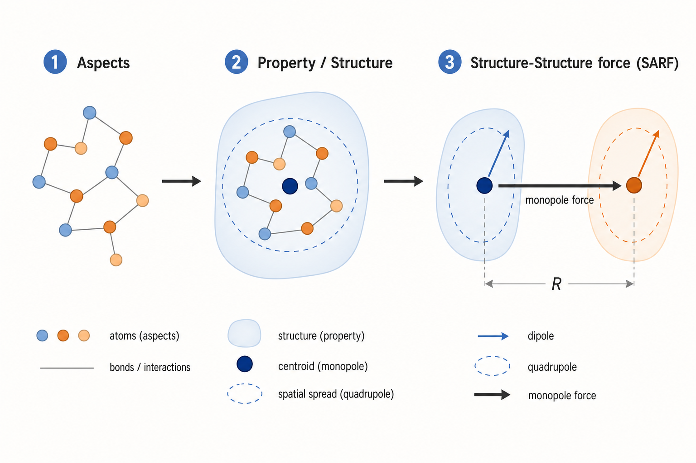
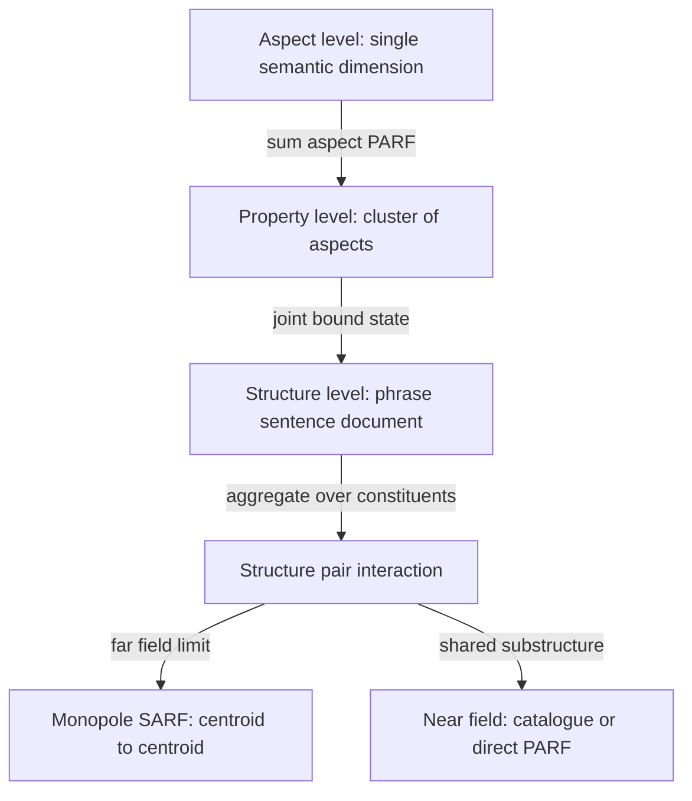
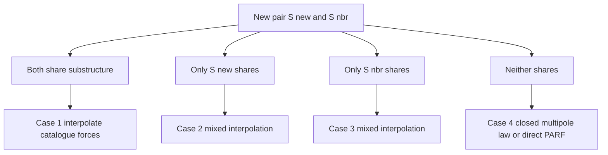
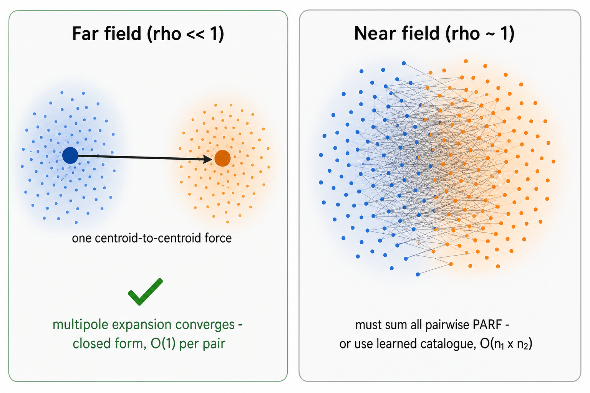
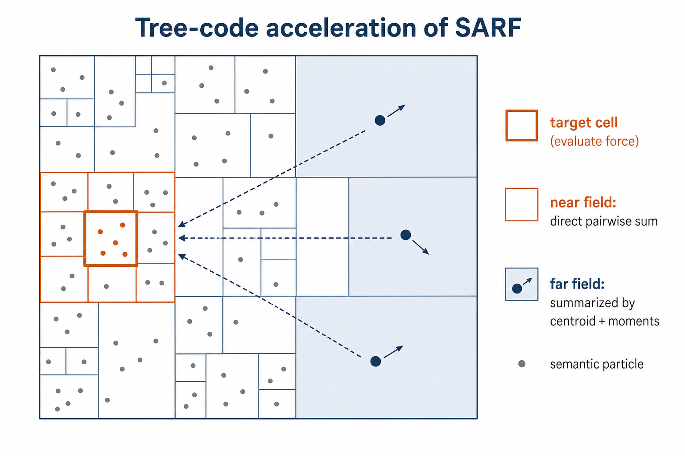
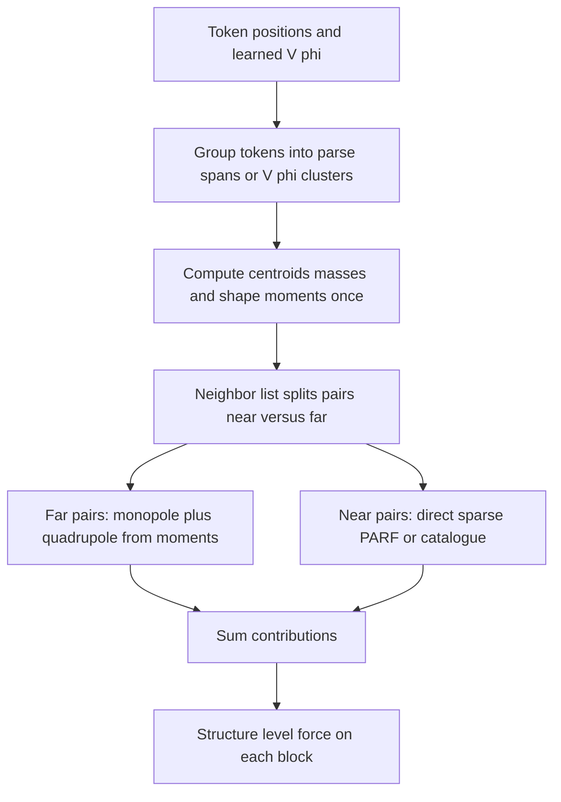

# On Modeling SARF Forces in PARF-augmented SPLM Architectures

Companion to the SARF section (§6) of the mega-paper. This note gathers the theory of the **Structure-Attractive--Repulsive Force (SARF)** and the recently established derivation that connects it to the property-level **PARF**, then draws out the practical consequences: **why you should not model SARF as a separate learnable force inside a PARFLM**, and **which computational shortcuts the PARF/SARF connection unlocks** for fast structure-level dynamics.

The central message in one line: **SARF is not an independent force law. It is the exact aggregate of the PARF forces already present in a trained PARFLM, and in the far field it collapses to a cheap centroid-to-centroid (multipole) interaction.** Everything below elaborates this claim and turns it into engineering guidance.

---

## Contents

1. [From properties to structures: why SARF exists](#1-from-properties-to-structures-why-sarf-exists)
2. [The original SARF postulate: catalogue interpolation](#2-the-original-sarf-postulate-catalogue-interpolation)
3. [The PARF to SARF connection (the derivation)](#3-the-parf-to-sarf-connection-the-derivation)
4. [Consequence: do not model SARF explicitly](#4-consequence-do-not-model-sarf-explicitly)
5. [Computational shortcuts unlocked by the connection](#5-computational-shortcuts-unlocked-by-the-connection)
6. [A practical recipe](#6-a-practical-recipe)
7. [Testable predictions](#7-testable-predictions)
8. [Summary](#8-summary)

---

## 1. From properties to structures: why SARF exists

PARF describes the interaction between **properties**. The aspect-level force between two aspects $A_1$ and $A_2$ is the type-and-direction-weighted inverse-square law

$$
\mathbf{f}_{12}(A_1, A_2) = \mathcal{C} \cdot \frac{\Theta(\theta^{(1)}, \theta^{(2)}) \cdot \Phi(l_1, l_2)}{\lVert \mathbf{p}_1 - \mathbf{p}_2 \rVert^2} \cdot \frac{\mathbf{p}_2 - \mathbf{p}_1}{\lVert \mathbf{p}_2 - \mathbf{p}_1 \rVert},
$$

and the property-level force is the double sum over constituent aspects,

$$
\mathbf{f}(P_1, P_2) = \sum_{A \in P_1} \sum_{B \in P_2} \mathbf{f}_{12}(A, B).
$$

A full semantic **structure** (a phrase, sentence, paragraph, document) sits one level of abstraction higher. Modeling structure-to-structure interaction by applying PARF directly to every aspect pair runs into two walls:

- **Computational.** Two sentences with about 50 aspects each already require about 2500 aspect-force evaluations per pair per time step. Document-length structures are prohibitive.
- **Conceptual.** A structure is *more than* a bag of aspects. The relational graph $G_S$ (parse tree, dependency graph) carries information absent from the aspect cloud. A purely aspect-level law cannot tell apart two sentences with identical aspects but different syntax.

SARF is the coarse-grained force law that operates directly at the structure level. The molecular-dynamics analogy is exact and worth keeping in mind throughout: **SARF stands to PARF as the inter-molecular force stands to the inter-atomic force.**

At the structure level, the interaction is mediated by the **reinforcement field** (the semantic energy field with the aspect-type argument suppressed): each new structure both responds to the field and modifies it, which is the bidirectional coupling that places structure dynamics inside a reinforcement-learning frame.

### The Gaussian well and the bound state

The property-level and structure-level attractions share the same inverted-bell shape, the **Gaussian semantic energy well**

$$
V(x) = m \upsilon^2 \left(1 - e^{-\kappa^2 x^2}\right), \qquad x \ge 0,
$$

which rises from $V(0) = 0$ to $V(\infty) = m \upsilon^2$. Two structures with centroids $r_1, r_2$, masses $m_1, m_2$, and asymptotic velocities $\upsilon_1, \upsilon_2$ form a bound pair whose mutual bound distance $x_b$ splits by reduced mass,

$$
x_{1,b} = \frac{m_2}{m_1 + m_2} x_b, \qquad x_{2,b} = \frac{m_1}{m_1 + m_2} x_b,
$$

with

$$
x_b^2 = \frac{1}{\kappa^2} \log \frac{m_1 \upsilon_1^2 + m_2 \upsilon_2^2}{m_1 \upsilon_1^2 + m_2 \upsilon_2^2 - (m_1 + m_2)\bar{\upsilon}^2}, \qquad \bar{\upsilon}^2 = \frac{m_1 \upsilon_1^2 + m_2 \upsilon_2^2}{m_1 + m_2}.
$$

The structure-level well typically has a *larger* effective $\kappa$ than the property-level well, reflecting the longer characteristic length over which sentences interact. This bound distance sets the natural length scale for the regional cutoff used below.

---

## 2. The original SARF postulate: catalogue interpolation

The 2022 SARF notes treat the structure-level force **descriptively**, as an interpolation over a catalogue of historical structure pairs. Given a new pair (a new structure $S^{\text{new}}$ and a neighbor $S^{\text{nbr}}$) and a catalogue of past pairs with measured forces, the force on the new pair is reconstructed by a distance-weighted average of the historical forces.

A **regional-exploration principle** restricts which historical pairs count: only those within one Gaussian radius of the query,

$$
d(S^{\text{old}}_i, S^{\text{new}}) \le \frac{2}{\kappa}, \qquad d(S^{\text{old}}_j, S^{\text{nbr}}) \le \frac{2}{\kappa}.
$$

Outside this band the well is effectively flat, so historical forces carry no local information. Retained pairs are combined with Gaussian-overlap weights

$$
\alpha_i \propto \exp\left(-\frac{d^2(S^{\text{old}}_i, S^{\text{new}}) + d^2(S^{\text{old}}_i, S^{\text{nbr}})}{2 (2/\kappa)^2}\right), \qquad \sum_i \alpha_i = 1.
$$

The postulate distinguishes four regimes:

| Regime | Condition | Method |
| --- | --- | --- |
| Case 1 | both members share substructure with catalogue | interpolate historical forces by overlap weight |
| Case 2 | only S new shares substructure | mixed interpolation, neighbor matched by distance |
| Case 3 | only S nbr shares substructure | symmetric to Case 2 |
| Case 4 | neither shares substructure | fall back to full aspect-level PARF |

In Cases 1--3 the cost is **linear in the retained catalogue**, not quadratic in structure size — this is the scaling argument that originally motivated SARF. But note the tension: Case 4 already says "fall back to PARF", hinting that SARF and PARF are not really independent. The next section makes that precise.

---

## 3. The PARF to SARF connection (the derivation)

The compositional-consistency question, left open in the 2022 notes, asks whether the structure force equals a graph-weighted sum of constituent PARF forces:

$$
\mathbf{f}^{\mathrm{SARF}}(S_1, S_2) = \sum_{i,j} \mathbf{f}^{\mathrm{PARF}}(P_{i,1}, P_{j,2}) \cdot w_{i,j}(G_{S_1}, G_{S_2}) \quad ?
$$

The answer is **yes**, resolved in two layers.

### 3.1 Structures as bound clusters: the intra/inter split

Treat a structure as a **joint bound state** of its constituent properties: intra-structure PARF forces hold the cluster together, exactly like intramolecular bonds. Write the constituent centroids of $S_1$ as $r_a = R_1 + \delta_a$ and of $S_2$ as $r'_b = R_2 + \varepsilon_b$, with $R_1, R_2$ the structure centroids and $\delta, \varepsilon$ the offsets. The total PARF on a constituent splits into a binding (intra) part and a SARF-contributing (inter) part:

$$
\mathbf{F}_a = \underbrace{\sum_{a' \neq a} \mathbf{f}^{\mathrm{PARF}}(P_a, P_{a'})}_{\text{intra: binds } S_1} + \underbrace{\sum_b \mathbf{f}^{\mathrm{PARF}}(P_a, Q_b)}_{\text{inter: contributes to SARF}}.
$$

This is precisely the bonded / non-bonded split of molecular dynamics.

### 3.2 Layer 1 — exact compositional consistency (existence, w = 1)

**Proposition 1 (exact consistency and conservativity).** If the property-level PARF is the gradient of a pairwise scalar potential, $\mathbf{f}^{\mathrm{PARF}}(P, Q) = -\nabla V_\phi(r_P, r_Q)$ — the Coulomb-type $V_\phi = \mathcal{C} \Theta \Phi / \lVert \cdot \rVert$ in the descriptive theory, or the learned $V_\phi$ in the PARFLM — then

$$
\mathbf{f}^{\mathrm{SARF}}(S_1, S_2) = \sum_a \sum_b \mathbf{f}^{\mathrm{PARF}}(P_a, Q_b) = -\nabla_{\mathbf{R}_1} U_{S_1, S_2}, \qquad U_{S_1, S_2} := \sum_a \sum_b V_\phi(\mathbf{r}_a, \mathbf{r}'_b).
$$

Hence the consistency relation holds **identically with $w_{i,j} = 1$**, and SARF is itself conservative (the negative gradient of the single scalar potential $U_{S_1,S_2}$).

*Proof sketch.* The inter-structure force summed over constituents is the definition of SARF, reproducing the property-level aggregation one level up. Linearity of the gradient moves the sum inside: a finite sum of scalar potentials is a scalar potential, so the aggregate is curl-free.

This settles the **existence** half outright: SARF is the aggregate of PARF over a bound cluster, and in the conservative PARFLM it is automatically the gradient of a well-defined structure potential. It is the same closure that lets the PARF-augmented SPLM pass the joint pair-shared-potential test by construction.

### 3.3 Layer 2 — coarse-grained multipole reduction (the closed law and the weights)

The *closed* structure-level law — a force in structure variables, with the graph entering through $w_{i,j}$ — comes from Taylor-expanding $V_\phi$ in the offsets and re-summing:

$$
U_{S_1, S_2} = n_1 n_2 V_\phi(\mathbf{R}_1, \mathbf{R}_2) + n_2 \mathbf{D}_1 \cdot \nabla_1 V_\phi + n_1 \mathbf{D}_2 \cdot \nabla_2 V_\phi + \tfrac{1}{2} n_2 \mathrm{tr}(\nabla_1^2 V_\phi \cdot Q_1) + \tfrac{1}{2} n_1 \mathrm{tr}(\nabla_2^2 V_\phi \cdot Q_2) + \mathbf{D}_1^\top (\nabla_1 \nabla_2 V_\phi) \mathbf{D}_2 + \cdots
$$

in terms of the coarse moments

$$
\mathbf{D}_1 = \sum_a \boldsymbol{\delta}_a, \quad \mathbf{D}_2 = \sum_b \boldsymbol{\varepsilon}_b, \quad Q_1 = \sum_a \boldsymbol{\delta}_a \boldsymbol{\delta}_a^\top, \quad Q_2 = \sum_b \boldsymbol{\varepsilon}_b \boldsymbol{\varepsilon}_b^\top.
$$

**Proposition 2 (closed coarse-grained SARF law).** Under **scale separation**

$$
\rho := \frac{\max_{a,b}(\lVert \boldsymbol{\delta}_a \rVert, \lVert \boldsymbol{\varepsilon}_b \rVert)}{\lVert \mathbf{R}_1 - \mathbf{R}_2 \rVert} \ll 1,
$$

the expansion converges, and truncating at multipole order $K$ gives

$$
\mathbf{f}^{\mathrm{SARF}}(S_1, S_2) = -n_1 n_2 \nabla_{\mathbf{R}_1} V_\phi(\mathbf{R}_1, \mathbf{R}_2) + (\text{dipole, quadrupole}, \ldots, \text{order } K) + O(\rho^{K+1}),
$$

computable from centroids, masses, and shape moments alone. Re-summing the truncation onto the original constituent pairs yields the weights $w_{i,j}(G_S)$, fixed by the bound geometry that the graph $G_S$ encodes.

The **leading (monopole)** term is two structures of semantic charge $n_1, n_2$ interacting through $V_\phi$ at their centroids — exactly the hierarchical-gravitation form, and exactly the structure-level Gaussian well of the descriptive theory. The **higher multipoles** carry the internal geometry — the information a "bag of aspects" throws away — and are the mathematical origin of the graph dependence in $w_{i,j}$.

### 3.4 Dynamical grounding: the expansion centre is the energy-weighted attractor

The expansion centre $R_k$ is not a free choice. It is the **energy-weighted ensemble centroid** $p_E$ produced by the impulse-extended dynamics (Eq. 48 of the paper),

$$
\mathbf{p}_E = \sum_{i=1}^{M} \left[ \frac{\widetilde{E} \cdot m_i}{E_i} (\mathbf{p}_{c,i} + \Delta \mathbf{p}_i) + \frac{m_i}{\sum_k m_k} \mathbf{v}_0^{(i)} \Delta s \right], \qquad E_i \equiv E(\mathbf{p}_{c,i} + \Delta \mathbf{p}_i).
$$

Two consequences follow:

- The offsets $\delta_a = r_a - p_E$ that carry the dipole and quadrupole are **dynamically sourced by the per-property impulses** $v_0^{(i)}$. Identical impulses leave the cluster spherically symmetric and suppress higher multipoles; heterogeneous impulses generate the internal geometry that $w_{i,j}$ encodes.
- Because the attractor is weighted by **energy**, not mass, $p_E$ differs from the mass centroid. The mass-weighted first moment about $p_E$ therefore does not vanish, and the **dipole term survives in every frame**: structures carry a permanent semantic dipole. This is a genuine departure from the pure gravitational analogy, and it is a direct dynamical consequence of the energy weighting — not an artefact of coarse-graining.

### 3.5 Reconciliation with the four regimes, and caveats

The scale-separation condition $\rho \ll 1$ **is** the far-field regime where the centroid expansion converges. When two structures share substructure they interpenetrate ($\rho \sim 1$), the expansion around distinct centroids breaks down, and the catalogue interpolation (Cases 1--3) is a **data-driven near-field surrogate** for the coefficients. Case 4 (no shared substructure) is exactly the convergent far field where the closed law applies, and "fall back to PARF" is just Proposition 1. The historical catalogue is thus a *learned stand-in for the multipole weights, valid precisely where the analytic expansion is not.*

Two caveats:

1. **Permanent dipole.** In the mass-centroid frame the mass-weighted dipole vanishes, but the true attractor is the energy-weighted centroid, so the dipole term does not vanish in general (see §3.4).
2. **Non-conservative Fock term.** If the pairwise force includes the register-mediated exchange term of the Fock-augmented PARFLM, the aggregate is still additive but no longer a pure gradient. SARF then Helmholtz-decomposes into the conservative multipole part plus a solenoidal correction, tying it to the S/A-block split of the layer-type hybrid.

---

## 4. Consequence: do not model SARF explicitly

Proposition 1 says SARF is a **derived quantity, not an independent degree of freedom**. Introducing a separately parameterized, learnable SARF force on top of PARF is a mistake for three concrete reasons.

1. **Redundancy / double counting.** The structure-level force is already fully determined by the learned pairwise $V_\phi$. A second SARF head would re-learn the same thing or contradict it.
2. **It breaks the conservation guarantees.** The conservative architecture relies on the effective potential being a *single* scalar (this is what passes the joint pair-shared-potential test and stays on the right side of the Conservative Obstruction Theorem). An independent SARF is not guaranteed curl-free or consistent with $-\nabla U_{S_1,S_2}$, so conservativity is generically lost.
3. **It imposes needless supervision.** An explicit SARF law needs the graph $G_S$ as an a-priori input. The derivation shows $G_S$ instead **emerges** from the sparsity of $V_\phi$: structure-level behavior is obtained for free from token-level pairwise potentials, with no parse supplied.

The correct posture, exactly as in molecular dynamics:

> **Do not bolt an inter-molecular force field onto an atomic one. The inter-molecular force *is* the aggregated atomic force. Likewise: SARF is the aggregated PARF. Model PARF; read off SARF.**

The only thing the analysis does *not* forbid is computing the aggregate **more cheaply** — the subject of the next section. That is an approximation of a derived quantity, never a new learnable law.

---

## 5. Computational shortcuts unlocked by the connection

The connection converts SARF from "a second model to train" into "a summation problem to accelerate". Every classical N-body acceleration technique now transfers directly, because the structure force is a sum of pairwise potentials. The table shows the cost per structure pair (with $n_1, n_2$ constituents) and, in the last two rows, the cost of a full field of $N$ structures.

| Technique | Cost | Valid where | What it exploits |
| --- | --- | --- | --- |
| Direct PARF (all aspect pairs) | O(n1 · n2) | always (ground truth) | definition |
| Sparse / relevant-pair PARF | O(s · n1 · n2), s ≪ 1 | always, tiny error | drop low-magnitude pairs (quantile, Gumbel) |
| Monopole SARF (centroids only) | O(1) per pair | far field, ρ ≪ 1 | Proposition 2 leading term |
| Multipole order K | O(1) per pair, O(n) moments once | far field, error O(ρ^(K+1)) | precomputed moments reused across all pairs |
| Catalogue interpolation | O(retained catalogue) | near field, shared substructure | memoized measured forces |
| Regional cutoff / neighbor list | builds pairs in O(N) | 2/κ finite range | flat well beyond 2/κ |
| Tree code (Barnes-Hut) | O(N log N) | many structures | far cells summarized by centroid |
| Fast multipole (FMM) | O(N) | many structures | far cells summarized by moments |

### 5.1 Monopole collapse (the super-particle trick)

For any pair in the far field ($\rho \ll 1$), replace the whole structure by a single **super-particle** at its centroid with charge $n$ (or mass $M = \sum_a m_a$). The pair force is one evaluation of $-\nabla V_\phi$ between centroids. This is the leading term of Proposition 2 and reproduces the postulated structure-level Gaussian well exactly. Cost per far pair drops from $O(n_1 n_2)$ to $O(1)$.

### 5.2 Multipole correction with reused moments

When more accuracy is needed, add the dipole and quadrupole terms. The moments $\mathbf{D}, Q$ are computed **once per structure** in $O(n)$ and **reused across every pair** that structure participates in. Truncating at order $K$ gives controlled error $O(\rho^{K+1})$: one extra order roughly squares the accuracy in the far field. In practice $K = 2$ (through the quadrupole / shape tensor) captures syntactic composition — the "not a bag of aspects" content — at negligible cost.

### 5.3 Neighbor lists from the regional cutoff

The regional-exploration cutoff $2/\kappa$ is a physical **finite interaction range**: beyond it the well is flat and the force is zero. This is exactly a Verlet / cell list in molecular dynamics. Bucket structure centroids into a spatial grid of cell size $2/\kappa$; each structure interacts only with its own and adjacent cells. Neighbor construction is $O(N)$ and the number of interacting pairs is linear, not quadratic, in the number of structures.

### 5.4 Tree codes and fast multipole for a full field

With many structures, combine §5.1--5.3 hierarchically. Build a spatial tree (octree in semantic space, keyed by centroid). For a target structure, sum **near** cells directly and summarize **far** cells by their aggregate centroid (Barnes-Hut, $O(N \log N)$) or by their aggregate multipole moments (fast multipole method, $O(N)$). The correctness of grouping is guaranteed by Proposition 2: a far cell of many structures is itself a super-structure whose leading interaction is its monopole.

### 5.5 Sparsification: the sparsity of V_phi *is* the graph

Not all aspect / token pairs matter. Restricting the PARF sum to **relevant pairs** (those above a magnitude quantile) or learning a sparse $V_\phi$ (for example via Gumbel-softmax gating on the coupling) both cut the near-field cost and, crucially, **expose $G_S$ for free**: the retained coupling pattern is the relational graph. You never build a parser; the structure emerges from which entries of $V_\phi$ are non-negligible.

### 5.6 Block aggregation over parse spans

In a trained PARFLM the structure force is just a **block sum** of the already-computed token-level potential:

$$
\mathbf{f}^{\mathrm{SARF}}(S_1, S_2) = -\nabla \sum_{a \in S_1} \sum_{b \in S_2} V_\phi(\mathbf{r}_a, \mathbf{r}_b).
$$

Grouping tokens by parse span (or by the emergent $V_\phi$ sparsity) and summing the corresponding blocks of the pairwise-potential matrix gives the phrase-to-phrase and sentence-to-sentence forces with **no extra parameters and no extra model** — only a reduction over already-materialised couplings.

### 5.7 Two-body reduction and moment caching over time

The bound-state splitting is analytic: instead of iterating a pair to equilibrium, solve the reduced-mass equations for $x_b$ directly. And because centroids and moments evolve slowly relative to the integrator step, cache them and update **incrementally** across time steps rather than recomputing from scratch.

---

## 6. A practical recipe

Putting the shortcuts together, a scalable structure-level force pass looks like this:

1. **Train only PARF.** Learn the pairwise potential $V_\phi$ at the token / property level. Do not add a SARF head.
2. **Discover structures.** Read $G_S$ off the sparsity pattern of $V_\phi$ (or from attention-derived routing in a hybrid). Group tokens into spans.
3. **Precompute moments.** For each span compute centroid $R$, charge / mass, dipole $D$, and quadrupole $Q$ in $O(n)$.
4. **Build neighbor lists.** Bucket centroids into cells of size $2/\kappa$; enumerate near pairs only.
5. **Far pairs.** Apply the monopole (optionally quadrupole) closed law — $O(1)$ per pair, moments reused.
6. **Near pairs.** Sum sparse PARF directly, or reuse a cached catalogue force for recurring substructures.
7. **Scale out.** For large fields of structures, wrap steps 4--6 in a Barnes-Hut / FMM tree for $O(N \log N)$ or $O(N)$ total.
8. **If using Fock.** Split the aggregate into its conservative multipole part plus the solenoidal exchange correction; only the latter needs the non-gradient term.

---

## 7. Testable predictions

Proposition 1 makes SARF **already present** in every trained PARFLM, which yields a concrete measurement:

- Identify structures as contiguous token spans (a constituency parse, e.g. via a Berkeley-style neural parser).
- Aggregate the learned $V_\phi$ couplings **within** versus **across** spans.
- Check that the cross-span force matches the monopole prediction $-n_1 n_2 \nabla V_\phi(R_1, R_2)$ plus the predicted quadrupole shape correction.

A positive result confirms Proposition 2 on trained models rather than only in the descriptive theory. A companion diagnostic: verify that a model trained with an explicit SARF head shows **no perplexity gain** over one that reads SARF off PARF — the prediction of §4 that the extra head is redundant.

---

## 8. Summary

- **SARF exists inside PARF.** The structure-level force is the exact additive aggregate of constituent PARF forces (Proposition 1, $w_{i,j} = 1$), and it is conservative whenever PARF is.
- **The closed law is a coarse-graining.** Under scale separation the aggregate collapses to a monopole-plus-multipole interaction between centroids (Proposition 2), reproducing the descriptive Gaussian-well SARF and generating the graph-dependent weights $w_{i,j}(G_S)$.
- **Do not model SARF explicitly.** A separate SARF head is redundant, breaks conservativity, and needs a parse the model can instead discover from $V_\phi$.
- **Do accelerate the aggregate.** The connection makes every N-body shortcut available: super-particle monopoles, reused multipole moments, $2/\kappa$ neighbor lists, tree codes and FMM, sparsification that doubles as structure discovery, and block aggregation over parse spans — turning a quadratic-in-aspects computation into linear-or-log time in the number of structures.

### Related notes and sources

- Paper §6 (SARF), §5 (PARF), §4 (Gaussian well) — the formal statements and proofs.
- `On_Training_the_PARF_Force.md` — how $V_\phi$ is learned.
- `SARF_Anchor_Placement_From_Converged_Gaussian_Centres.md` — placing structure anchors from converged centroids.
- `PARF_Augmented_SPLM_Architecture_v2.md` — the architecture into which this force pass slots.
- `Conservative_Obstruction_and_Virtual_Particle_Necessity.md` — why the single-scalar-potential closure matters.
