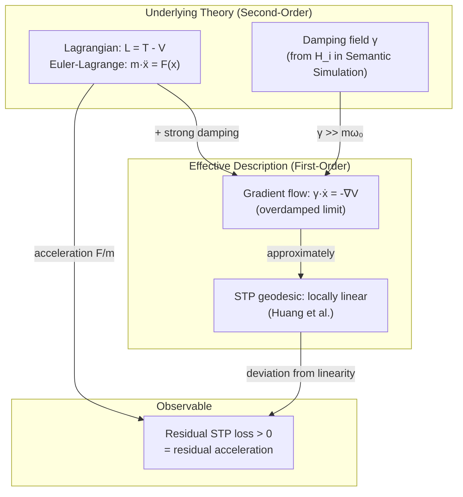
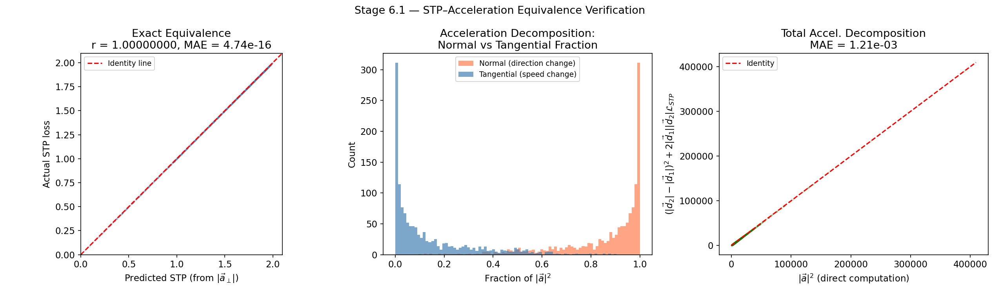
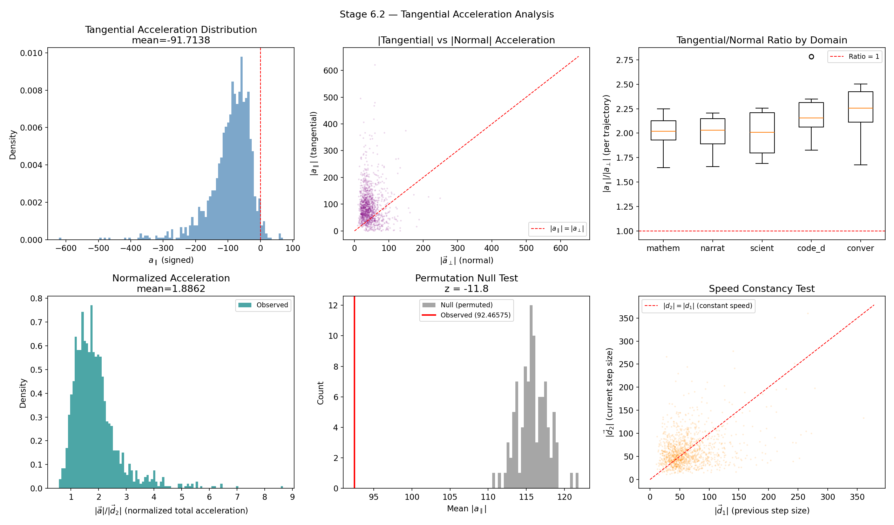
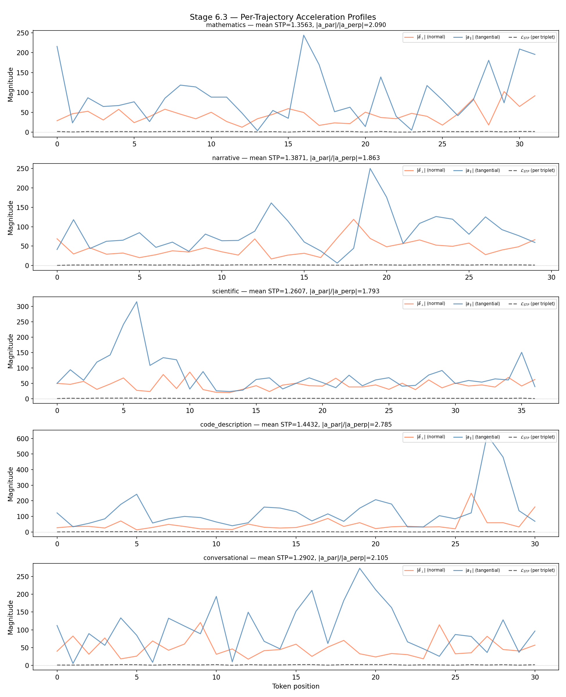

# On the Existence of Acceleration in Hidden State Trajectories

**Work in progress — last updated April 2026**

> **Rendering note.** This document contains LaTeX math (inline `$...$` and display `$$...$$` blocks, with macros such as `\mathfrak{...}`, `\boldsymbol{...}`, `\mathcal{...}`, etc.). The math has been verified to render correctly in **Safari**. In **Chrome** some symbols — notably calligraphic and fraktur letters, e.g. `\mathfrak{C}` rendering as a plain `C` instead of $\mathfrak{C}$ — appear to render incorrectly. **Firefox** has not been tested. If symbols look wrong, please view the document in Safari or consult the main paper's PDF, where the same symbols are typeset by LaTeX directly.

---

## Abstract

The Semantic Tube Prediction (STP) framework of Huang, LeCun, and Balestriero [1] models hidden state evolution as a **first-order** dynamical system — velocity is a function of state, with no acceleration term. The Geodesic Hypothesis asserts that error-free trajectories are locally linear (constant velocity, zero curvature). The STP loss $\mathcal{L}_{STP} = 1 - \cos(h_t - h_r, h_r - h_s)$ penalizes deviations from this linearity.

Independently, the Semantic Simulation framework of Gueorguiev [2][3][4][5] constructs a **second-order** Lagrangian dynamics for semantic space. The Euler-Lagrange equations under the Gaussian well potential produce a restoring force $F = -dV/dx$, which implies nonzero acceleration wherever the property is away from the well center.

These two descriptions are incompatible as stated: zero acceleration (STP geodesic) cannot coexist with a nonzero restoring force (Gaussian well) in the same coordinate system. This document examines the tension, proposes three resolutions, and designs experiments that can measure acceleration directly in hidden state trajectories and determine the strength of the damping field.

---

## 1. The Tension

### 1.1 The STP Model: First-Order Dynamics

Huang et al. model the evolution of the token sequence representation as a first-order ODE [1, eq. 2]:

$$dx_{\leq t} = \mathring{u} \circ \mathring{f}(x_{\leq t})\ dt$$

A first-order system specifies velocity as a function of state. There is no second derivative, no mass, no acceleration. The state at each moment is fully determined by the current position — the system has no inertial memory of how it arrived. The Geodesic Hypothesis says these trajectories are locally linear, which is the natural expectation for a smooth first-order flow: in a region where $\mathring{u} \circ \mathring{f}$ varies slowly, the trajectory approximates a straight line.

The STP loss enforces this linearity as a training objective:

$$\mathcal{L}_{STP} = 1 - \cos(h_t - h_r,\ h_r - h_s)$$

When $\mathcal{L}_{STP} = 0$, consecutive displacement vectors are collinear — the trajectory is a straight line — which means **zero angular acceleration**.

### 1.2 The Semantic Simulation Framework: Second-Order Dynamics

The Lagrangian for a semantic property traveling toward bound state in the Gaussian well is [5, eq. 4]:

$$\mathcal{L}_i = \frac{1}{2}\mathfrak{m}_i v_i^2 - \mathfrak{m}_i \upsilon^2 (1 - e^{-\kappa^2 x_i^2})$$

The Euler-Lagrange equations yield [5]:

$$\mathfrak{m}_i \ddot{x}_i = -2\mathfrak{m}_i \upsilon^2 \kappa^2 x_i e^{-\kappa^2 x_i^2}$$

This is Newton's second law: $F = ma$. The restoring force on the right-hand side is nonzero whenever $x_i \neq 0$. A property away from the well center **must** accelerate — it is pulled inward, gains speed, and (with damping) decelerates as it approaches bound state. The trajectory curves.

### 1.3 The Incompatibility

| | STP (Huang et al.) | Semantic Simulation (Gueorguiev) |
|---|---|---|
| **Order** | First-order ODE | Second-order ODE (Euler-Lagrange) |
| **Acceleration** | Zero (geodesic) | Nonzero ($F/\mathfrak{m}$) |
| **Trajectory shape** | Straight line | Curved (under restoring force) |
| **Mass** | Not present | Central quantity |
| **Energy well** | Not modeled explicitly | Gaussian well potential |

> **Q (Gueorguiev):** *"Does the model introduced in the STP paper by Huang preclude the existence of acceleration? I am asking this because if there exists semantic mass and there is an energy well then there must be acceleration present."*

The question is precise: the STP model and the Gaussian well cannot both be exactly true simultaneously in the same coordinate system. Either:

1. The trajectories are truly linear (no acceleration) and there is no well, or
2. There is a well (with acceleration) and the trajectories are not truly linear, or
3. There is a deeper relationship that reconciles the two.

---

## 2. Three Resolutions

### 2.1 Resolution 1: The STP Loss Measures the Residual Acceleration

The STP loss is not zero in practice — it is a regularizer that pushes toward linearity but never achieves it. Actual hidden state trajectories have $\mathcal{L}_{STP} > 0$. This section proves that this residual is **exactly** the normal (directional) component of the acceleration.

#### 2.1.1 Setup: Displacement and Acceleration Vectors

Consider three hidden states $h_s, h_r, h_t \in \mathbb{R}^d$ at positions $s < r < t$ in the token sequence. Define the two displacement vectors:

$$\vec{d}_1 = h_r - h_s \qquad \vec{d}_2 = h_t - h_r$$

The **discrete acceleration** at position $r$ is the change in displacement:

$$\vec{a} = \vec{d}_2 - \vec{d}_1 = h_t - 2h_r + h_s$$

This is the standard central finite difference approximation to the second derivative $d^2h/dt^2$ at position $r$.

#### 2.1.2 Decomposing Acceleration into Normal and Tangential Components

Decompose $\vec{d}_2$ into components parallel and perpendicular to $\vec{d}_1$:

$$\vec{d}_2 = \vec{d}_{2\parallel} + \vec{d}_{2\perp}$$

where:

$$\vec{d}_{2\parallel} = \frac{\vec{d}_2 \cdot \vec{d}_1}{|\vec{d}_1|^2}\vec{d}_1 = |\vec{d}_2|\cos\theta\ \hat{d}_1 \qquad \vec{d}_{2\perp} = \vec{d}_2 - \vec{d}_{2\parallel}$$

and $\theta$ is the angle between $\vec{d}_1$ and $\vec{d}_2$, and $\hat{d}_1 = \vec{d}_1 / |\vec{d}_1|$.

The acceleration decomposes correspondingly:

$$\vec{a} = \vec{d}_2 - \vec{d}_1 = (\vec{d}_{2\parallel} - \vec{d}_1) + \vec{d}_{2\perp} = \vec{a}_\parallel + \vec{a}_\perp$$

where:

- **Tangential acceleration** (change in speed along the trajectory direction):

$$\vec{a}_\parallel = \vec{d}_{2\parallel} - \vec{d}_1 = (|\vec{d}_2|\cos\theta - |\vec{d}_1|)\hat{d}_1$$

- **Normal acceleration** (change in direction — curvature):

$$\vec{a}_\perp = \vec{d}_{2\perp}$$

with magnitude $|\vec{a}_\perp| = |\vec{d}_2|\sin\theta$.

#### 2.1.3 The Exact Relationship: STP Loss Equals Normalized Normal Acceleration

The STP loss is:

$$\mathcal{L}_{STP} = 1 - \cos\theta = 1 - \frac{\vec{d}_1 \cdot \vec{d}_2}{|\vec{d}_1||\vec{d}_2|}$$

Using the identity $\sin^2\theta = (1 - \cos\theta)(1 + \cos\theta)$ and $|\vec{a}_\perp| = |\vec{d}_2|\sin\theta$:

$$|\vec{a}_\perp|^2 = |\vec{d}_2|^2 \sin^2\theta = |\vec{d}_2|^2 \cdot \mathcal{L}_{STP} \cdot (2 - \mathcal{L}_{STP})$$

Solving for $\mathcal{L}_{STP}$:

$$\boxed{\mathcal{L}_{STP} = 1 - \sqrt{1 - \frac{|\vec{a}_\perp|^2}{|\vec{d}_2|^2}}}$$

This is the **exact** relationship between the STP loss and the normal acceleration. It is not an approximation. The equivalence is:

$$\mathcal{L}_{STP} = 0 \quad \Longleftrightarrow \quad |\vec{a}_\perp| = 0 \quad \Longleftrightarrow \quad \text{zero normal acceleration (zero curvature)}$$

$$\mathcal{L}_{STP} > 0 \quad \Longleftrightarrow \quad |\vec{a}_\perp| > 0 \quad \Longleftrightarrow \quad \text{nonzero normal acceleration (trajectory curves)}$$

#### 2.1.4 The Total Acceleration Decomposition

The total acceleration magnitude can also be expressed in terms of the STP loss. Starting from:

$$|\vec{a}|^2 = |\vec{d}_2 - \vec{d}_1|^2 = |\vec{d}_1|^2 + |\vec{d}_2|^2 - 2\vec{d}_1 \cdot \vec{d}_2$$

and substituting $\vec{d}_1 \cdot \vec{d}_2 = |\vec{d}_1||\vec{d}_2|(1 - \mathcal{L}_{STP})$:

$$|\vec{a}|^2 = |\vec{d}_1|^2 + |\vec{d}_2|^2 - 2|\vec{d}_1||\vec{d}_2| + 2|\vec{d}_1||\vec{d}_2|\mathcal{L}_{STP}$$

$$\boxed{|\vec{a}|^2 = \underbrace{(|\vec{d}_2| - |\vec{d}_1|)^2}_{\text{speed change}^2\ (= a_\parallel^{\prime 2})} + \underbrace{2|\vec{d}_1||\vec{d}_2| \cdot \mathcal{L}_{STP}}_{\text{direction change contribution}}}$$

This decomposition shows that the total squared acceleration has two sources:

1. **Speed change**: $(|\vec{d}_2| - |\vec{d}_1|)^2$ — the squared difference in step sizes. This is nonzero when the trajectory speeds up or slows down, even if it stays on a straight line. **The STP loss is blind to this component.**

2. **Direction change**: $2|\vec{d}_1||\vec{d}_2| \cdot \mathcal{L}_{STP}$ — directly proportional to the STP loss. This is nonzero when the trajectory curves.

Rearranging:

$$\mathcal{L}_{STP} = \frac{|\vec{a}|^2 - (|\vec{d}_2| - |\vec{d}_1|)^2}{2|\vec{d}_1||\vec{d}_2|}$$

The STP loss extracts from the total acceleration precisely the **directional** component, normalized by the product of the step sizes.

#### 2.1.5 Special Case: Constant Speed

When the speed is constant along the trajectory ($|\vec{d}_1| = |\vec{d}_2| = v$), the speed-change term vanishes and the total acceleration is entirely directional:

$$\mathcal{L}_{STP} = \frac{|\vec{a}|^2}{2v^2} \qquad \text{(constant speed)}$$

In this regime, the STP loss is exactly proportional to the squared total acceleration, normalized by the squared velocity. Zero STP loss means zero acceleration, and the magnitude of the STP loss directly measures the magnitude of the force acting on the hidden state.

#### 2.1.6 An Important Nuance: Tangential Acceleration Is Invisible to the STP Loss

The STP loss is **insensitive to tangential acceleration** — a trajectory that moves in a perfectly straight line but accelerates along that line (changing speed) has $\mathcal{L}_{STP} = 0$. This means:

- $\mathcal{L}_{STP} = 0$ does **not** imply zero total acceleration. It implies zero **normal** acceleration (no curvature). Speed changes are invisible.
- $\mathcal{L}_{STP} > 0$ implies nonzero **normal** acceleration (the trajectory curves). In the context of a restoring force (Gaussian well), curvature is the primary observable signature of the force, because a central force changes the direction of motion.

For a particle under a central restoring force (such as the Gaussian well), both normal and tangential acceleration are typically present simultaneously: the particle changes both speed and direction as it is pulled toward the well center. The only exception is a purely radial trajectory passing through the center, which has $a_\perp = 0$ and $a_\parallel \neq 0$ — but this is a set of measure zero. For generic trajectories under the Gaussian well, $\mathcal{L}_{STP} > 0$ is the expected signature.

#### 2.1.7 Summary

The STP loss is an exact, monotonic measure of the normal component of acceleration:

| STP loss | Normal acceleration | Trajectory | Physical interpretation |
|---|---|---|---|
| $\mathcal{L}\_{STP} = 0$ | $\vec{a}\_\perp = 0$ | Straight line (may speed up/slow down) | No transverse force; trajectory is undeflected |
| $0 < \mathcal{L}_{STP} \ll 1$ | $\lVert\vec{a}\_\perp\rVert \ll \lVert\vec{d}_2\rVert$ | Nearly straight, slight curvature | Weak restoring force or strong damping |
| $\mathcal{L}_{STP} \approx 1$ | $\lVert\vec{a}\_\perp\rVert \approx \lVert\vec{d}_2\rVert$ | Right-angle turn | Strong transverse force |
| $\mathcal{L}\_{STP} = 2$ | $\lVert\vec{a}\_\perp\rVert = \text{maximum}$ | Complete reversal ($\vec{d}\_2 = -\vec{d}\_1$) | Elastic collision or reflection |

The conjecture from [6, Section 2.4] therefore acquires a precise physical meaning: the STP loss correlates with the action because both are consequences of the same restoring force. The STP loss measures the directional acceleration caused by that force; the action integrates the kinetic and potential energies along the trajectory shaped by that force. They are two views of the same underlying dynamics.

#### 2.1.8 Tangential Acceleration: The Component the STP Loss Cannot See

The derivation above shows that the STP loss captures exclusively normal acceleration (curvature) while being blind to tangential acceleration (speed changes along a straight line). This raises a critical question: **does tangential acceleration exist in hidden state trajectories?** If it does, it constitutes evidence for a potential-driven dynamics that the STP framework does not model and cannot suppress.

**Why tangential acceleration must exist under the Gaussian well.** Consider a property traveling toward the well center along a straight radial path. The restoring force $F(x) = -2\mathfrak{m}\upsilon^2\kappa^2 x e^{-\kappa^2 x^2}$ is directed along the path — it is entirely tangential. The property accelerates inward (gaining speed) as it approaches the inflection point, then decelerates as it nears the center (where $F \to 0$). Throughout this radial trajectory, $\vec{a}_\perp = 0$ and $\vec{a}_\parallel \neq 0$. The STP loss would be exactly zero, yet the trajectory is undergoing strong acceleration. This is not a pathological edge case — it is the expected behavior for a property approaching its bound state along the well axis.

**Evidence from the GPT-2 experiments.** Three independent observations in the experimental data [6, Sections 7–8] confirm the presence of tangential acceleration:

*Evidence 1: Kinetic energy varies along trajectories.* In the Euclidean experiment [6, Figure 7], the kinetic energy $T_t = \frac{1}{2}v_t^2$ varies wildly across token positions — the profiles show large spikes and dips rather than a flat line. In the cosine experiment [6, Figure 12], the angular kinetic energy $T_t = \frac{1}{2}\omega_t^2$ shows the same effect at a smaller scale: steady potential energy ($V \approx 3.7$) with "occasional small perturbations" in kinetic energy ($T \approx 0.01$ with fluctuations). Since kinetic energy is proportional to the square of velocity, varying kinetic energy means varying speed, which is tangential acceleration. If the speed were constant, $T_t$ would be a horizontal line — and it is not, in either experiment.

Evidence 2: The angular velocity $\omega_t$ spans a 10x range. The cosine experiment reported angular steps of $\omega \sim 0.01$–$0.1$ radians per token [6, Section 8.2.4]. When consecutive angular velocities differ — say $\omega_t = 0.02$ and $\omega_{t+1} = 0.08$ — the tangential acceleration is $\Delta\omega = 0.06$, a factor of 4 speed change in a single step. The STP loss registers none of this: it measures the angle between displacement vectors, not the ratio of their magnitudes.

*Evidence 3: Structured kinetic energy variation across domains.* The action distribution differs systematically across semantic domains [6, Figures 6 and 11], and the trajectory profiles show domain-dependent kinetic energy patterns. If tangential acceleration were absent (constant speed), all trajectories would have the same kinetic energy profile regardless of content. The observed domain dependence indicates that the speed variations are driven by the semantic content of the sequence — tokens encounter varying "predictive difficulty" (NTP loss) as the sequence unfolds, and the velocity responds.

**Quantifying the relative magnitudes.** From the total acceleration decomposition (Section 2.1.4):

$$|\vec{a}|^2 = \underbrace{(\omega_{t+1} - \omega_t)^2}_{\text{tangential}} + \underbrace{2\omega_t\omega_{t+1} \cdot \mathcal{L}_{STP}}_{\text{normal}}$$

With the GPT-2 cosine experiment values ($\mathcal{L}_{STP} \approx 1.333$, $\omega \sim 0.01$–$0.1$):

- Normal term: $2 \times 0.05 \times 0.05 \times 1.333 \approx 0.007$ (using median $\omega \approx 0.05$)
- Tangential term: $(0.08 - 0.02)^2 = 0.0036$ (typical speed change)

The two components are of the **same order of magnitude**. In the GPT-2 data, neither dominates conclusively. The normal component (curvature) is larger on average due to the high STP loss ($\approx 1.333$, close to the maximum of 2), but the tangential component is not negligible.

**The significance for the STP framework.** The Huang et al. paper [1] does not discuss tangential acceleration. The Geodesic Hypothesis asserts directional constancy (local linearity), not speed constancy. An STP-trained model with $\mathcal{L}_{STP} = 0$ would still exhibit tangential acceleration — the trajectory would be a straight line along which the hidden state speeds up and slows down in response to the energy landscape. The STP regularizer eliminates curvature but not the force; it suppresses normal acceleration but leaves tangential acceleration untouched.

This has a profound consequence: **even a perfect STP model does not eliminate the Gaussian well dynamics.** The well still produces tangential acceleration (speed changes along the geodesic), which shapes the kinetic energy profile and contributes to the action. The STP loss removes the most visible signature of the force (curvature), but the force itself — and its tangential effects — persist. A complete description of the hidden state dynamics requires measuring both components of acceleration, not just the STP loss.

### 2.2 Resolution 2: Geodesics in the Jacobi Metric

In Riemannian geometry, a geodesic of a metric $g_{ij}$ satisfies:

$$\ddot{x}^i + \Gamma^i_{jk}\dot{x}^j\dot{x}^k = 0$$

This has zero **covariant** acceleration (geodesic acceleration), but can have nonzero **coordinate** acceleration — the Christoffel symbols $\Gamma^i_{jk}$ absorb the curvature of the metric. A freely falling particle in general relativity follows a geodesic: it experiences no force in its own frame, yet it accelerates in coordinate space because spacetime is curved.

The Gaussian well potential induces a Riemannian metric via the Jacobi-Maupertuis principle. For a particle with total energy $E$ in potential $V(x)$, the action-minimizing trajectories are geodesics of the **Jacobi metric**:

$$\tilde{g}_{ij} = 2(E - V(x)) g_{ij}$$

In this metric, the action-minimizing trajectories of the Lagrangian $\mathcal{L} = T - V$ are straight lines (geodesics) — even though they curve in coordinate space. The STP loss, by enforcing "straightness" of hidden state trajectories, may be enforcing geodesics of the Jacobi metric — which are the physically correct trajectories under the Gaussian well.

However, the STP loss measures cosine similarity in the raw hidden state coordinates $\mathbb{R}^d$, not in any curved metric. This resolution requires that the transformer's learned representations already encode the Jacobi metric implicitly — that the coordinate system in which the STP loss is computed happens to coincide with the geodesic frame. This is a strong claim, but testable: if we compute the Jacobi metric from the fitted Gaussian well and re-express the STP loss in that metric, the residual should be smaller than in the raw coordinates.

### 2.3 Resolution 3: Overdamped Dynamics

In physics, when friction is very strong, a second-order system reduces to a first-order system. Consider the damped equation of motion:

$$\mathfrak{m}\ddot{x} + \gamma\dot{x} = -\nabla V(x)$$

In the **overdamped limit** ($\gamma \gg \mathfrak{m}\omega_0$ where $\omega_0$ is the natural frequency of the well), the inertial term $\mathfrak{m}\ddot{x}$ becomes negligible and the dynamics reduce to:

$$\gamma\dot{x} \approx -\nabla V(x)$$

This is a first-order ODE — velocity is proportional to force, with no acceleration memory. The trajectory follows the gradient smoothly, without oscillation. This is the **gradient flow** regime, familiar from optimization theory.

The Semantic Simulation framework includes a damping factor $H_i$ [3, eq. 8] that decelerates properties as they approach bound state:

$$H_i = \frac{\tanh\left(\frac{\lVert\vec{p}_E - \vec{p}_{c,i} + \Delta\vec{p}_i\rVert}{x_0}\right) + 1}{2}$$

If the effective damping is strong enough throughout the trajectory (not just near bound state), the dynamics become first-order. In this regime:

- The STP paper's first-order ODE is the correct **effective** description
- Acceleration exists in the underlying second-order theory but is instantly absorbed by damping
- The trajectory is approximately linear because the overdamped system follows the gradient smoothly, without inertial overshoot
- The Lagrangian mechanics provides the fundamental theory; the first-order ODE is the observable behavior

This resolution is particularly appealing because it explains **why** the STP loss works as a regularizer: it enforces the overdamped condition. A trajectory with high $\mathcal{L}_{STP}$ (lots of curvature) is one where the system is **underdamped** — it oscillates and overshoots rather than flowing smoothly toward the geodesic. The STP loss penalizes underdamping, pushing the dynamics toward gradient flow.

### 2.4 Synthesis: The Three Resolutions Are Complementary

The three resolutions are not mutually exclusive. Together they form a coherent picture:

1. **Resolution 1** (STP loss = residual acceleration): describes what is **measured**.
2. **Resolution 2** (Jacobi metric): describes the **geometry** — the underlying space is curved, and geodesics in the curved metric correspond to accelerated trajectories in coordinate space.
3. **Resolution 3** (overdamped limit): describes the **physics** — the damping field ensures that acceleration is small, making the first-order approximation valid.

The **damping coefficient** $\gamma$ is the key unknown. It determines:

- How close the system is to the overdamped limit
- How large the residual acceleration (STP loss) is
- Whether the first-order (STP) or second-order (Lagrangian) description is more appropriate

Measuring $\gamma$ experimentally is therefore the central goal.

---

## 3. Direct Measurement of Acceleration

### 3.1 Defining Acceleration in Hidden State Space

Given consecutive hidden states $h_{t-1}, h_t, h_{t+1}$ at the last transformer layer, we define:

**Velocity** (discrete first derivative):

$$\vec{v}_t = h_t - h_{t-1}$$

**Acceleration** (discrete second derivative):

$$\vec{a}_t = h_{t+1} - 2h_t + h_{t-1} = \vec{v}_{t+1} - \vec{v}_t$$

**Angular velocity**:

$$\omega_t = \arccos\left(\frac{h_t \cdot h_{t-1}}{\lVerth_t\rVert\lVerth_{t-1}\rVert}\right)$$

**Angular acceleration**:

$$\dot{\omega}_t = \omega_{t+1} - \omega_t$$

**Tangential acceleration** (change in speed along the trajectory):

$$a_{\parallel,t} = |\vec{v}_{t+1}| - |\vec{v}_t|$$

**Normal acceleration** (change in direction):

$$a_{\perp,t} = |\vec{a}_t - a_{\parallel,t}\hat{v}_t|$$

where $\hat{v}_t = \vec{v}_t / |\vec{v}_t|$.

The STP loss is related to the normal acceleration (curvature). The tangential acceleration (speed change) is a separate quantity that the STP loss does not directly measure.

### 3.2 The Damping Coefficient

In the damped equation $\mathfrak{m}\ddot{x} + \gamma\dot{x} = F(x)$, we can solve for $\gamma$ at each position:

$$\gamma_t = \frac{F(d_t) - w_t \cdot a_{\parallel,t}}{v_t}$$

where:
- $F(d_t) = -2a b d_t e^{-b d_t^2}$ is the Gaussian well restoring force at cosine distance $d_t$
- $w_t$ is the attention mass (the analog of $\mathfrak{m}$, see [7])
- $a_{\parallel,t}$ is the tangential acceleration
- $v_t = |\vec{v}_t|$ is the speed

If the system is strongly overdamped ($\gamma \gg w_t \omega_0$), then $\gamma_t \approx F(d_t) / v_t$ — the damping absorbs all the force, leaving no net acceleration. If the system is underdamped, $\gamma_t < w_t \omega_0$ and significant acceleration remains.

---

## 4. Experimental Validation Plan

### 4.1 Experiment 1: Is Acceleration Present?

**Objective**: Determine whether hidden state trajectories exhibit statistically significant acceleration — i.e., whether $\vec{a}_t \neq 0$ systematically.

**Procedure**:

1. Extract last-layer hidden states $h_1, \ldots, h_T$ for 500+ sentences.
2. Compute the discrete acceleration $\vec{a}_t = h_{t+1} - 2h_t + h_{t-1}$ at each interior position.
3. Compute the **acceleration magnitude** $|\vec{a}_t|$ and the **normalized acceleration** $|\vec{a}_t| / |\vec{v}_t|$ (acceleration relative to velocity).
4. Test against the null hypothesis that acceleration is zero:
   - Compute the mean and standard deviation of $|\vec{a}_t| / |\vec{v}_t|$ across all positions.
   - Compare with a null distribution obtained by randomly permuting the token order within each sentence (destroying sequential structure while preserving the marginal distribution of hidden states).
5. Decompose acceleration into tangential ($a_\parallel$) and normal ($a_\perp$) components. The STP loss should correlate with $a_\perp$ (curvature) but not necessarily with $a_\parallel$ (speed change).

**Models**: Run on three models to probe the effect of model capacity and STP training:

| Model | Parameters | Hidden dim | STP-trained? | Expected acceleration |
|---|---|---|---|---|
| **GPT-2** | 124M | 768 | No | Moderate (no geometric regularizer) |
| **Llama-3.2-1B** (base) | 1.24B | 2048 | No | Potentially lower (better representations) |
| **Llama-3.2-1B** (STP-tuned)* | 1.24B | 2048 | Yes | Lowest (STP suppresses curvature) |

*If an STP-tuned checkpoint is not available, fine-tuning with $\mathcal{L}_{NTP} + 0.02 \cdot \mathcal{L}_{STP}$ on a small corpus would produce one.

**Success criterion**: $|\vec{a}_t| / |\vec{v}_t|$ is significantly greater than the permuted null ($p < 0.001$) in all three models. If the conjecture holds, acceleration should be systematically present, with GPT-2 showing the most and the STP-tuned model showing the least.

### 4.2 Experiment 2: Does Acceleration Correlate With the Restoring Force?

**Objective**: Test whether the observed acceleration is consistent with the Gaussian well restoring force — i.e., whether $\vec{a}_t$ points toward the trajectory center and its magnitude follows $F(x) \propto x e^{-\kappa^2 x^2}$.

**Procedure**:

1. For each trajectory, identify the trajectory center $c$ (final hidden state $h_T$, or attention-weighted centroid).
2. Compute the "radial" direction at each position: $\hat{r}_t = (c - h_t) / \lVertc - h_t\rVert$.
3. Compute the **radial component** of acceleration: $a_{r,t} = \vec{a}_t \cdot \hat{r}_t$.
4. If the acceleration is a restoring force, $a_{r,t}$ should be **positive** (pointing toward center) for positions away from center, and near zero at the center.
5. Fit the radial acceleration profile $a_{r,t}$ vs. cosine distance $d_t$ to:
   - Gaussian well force: $a_r(d) = A \cdot d \cdot e^{-B d^2}$
   - Harmonic force: $a_r(d) = C \cdot d$
   - Constant: $a_r(d) = D$
6. Compare fits using $R^2$ and AIC.

**Models**: Same three models as Experiment 1.

**Success criterion**: The Gaussian well force profile fits significantly better than harmonic or constant models. The fitted parameters $(A, B)$ should be consistent with the well parameters from the energy landscape experiments in [6, Sections 7–8]. Radial acceleration should be systematically positive (restoring).

### 4.3 Experiment 3: Measuring the Damping Coefficient

**Objective**: Estimate $\gamma$ and determine whether the system is overdamped, critically damped, or underdamped.

**Procedure**:

1. From Experiment 2, obtain the fitted restoring force $F(d_t)$ at each position.
2. Compute the damping coefficient at each position:

$$\gamma_t = \frac{F(d_t) - w_t \cdot a_{\parallel,t}}{v_t}$$

3. Compute the natural frequency of the well: $\omega_0 = \kappa\upsilon\sqrt{2}$ (from the harmonic approximation near the well center).
4. Compute the **damping ratio** $\zeta = \gamma / (2 w_t \omega_0)$ at each position:
   - $\zeta > 1$: overdamped (first-order, STP geodesic is a good approximation)
   - $\zeta = 1$: critically damped
   - $\zeta < 1$: underdamped (second-order effects visible, STP geodesic is a poor approximation)
5. Plot $\zeta$ vs. layer depth (if extracting from multiple layers) and vs. position in the sentence.

**Models**: Same three models, with the prediction:

| Model | Expected $\zeta$ | Reasoning |
|---|---|---|
| GPT-2 | $\zeta \sim 1$ or mixed | No geometric training → natural dynamics, potentially underdamped |
| Llama-3.2-1B (base) | $\zeta > 1$ (mostly overdamped) | Richer representations → smoother trajectories |
| Llama-3.2-1B (STP-tuned) | $\zeta \gg 1$ (strongly overdamped) | STP loss explicitly suppresses curvature → pushes $\zeta$ up |

**Success criterion**: $\zeta$ is estimable (not dominated by noise). The ordering GPT-2 < Llama-base < Llama-STP should be observed. If the overdamped resolution is correct, $\zeta > 1$ should hold for the majority of positions in all models, with the STP-tuned model showing the largest $\zeta$.

### 4.4 Experiment 4: STP Loss as a Proxy for Underdamping

**Objective**: Test whether the STP loss at the trajectory level correlates with the degree of underdamping — i.e., whether high $\mathcal{L}_{STP}$ trajectories are the ones with low $\zeta$.

**Procedure**:

1. For each trajectory, compute the mean STP loss $\bar{\mathcal{L}}_{STP}$ and the mean damping ratio $\bar{\zeta}$.
2. Correlate across trajectories.

**Success criterion**: Significant negative correlation — $r(\bar{\mathcal{L}}_{STP}, \bar{\zeta}) < -0.3$ with $p < 0.01$. Trajectories with high STP loss (more curvature) have low damping ratios (more underdamped). This would confirm that the STP loss is a proxy for the degree to which the overdamped approximation holds.

### 4.5 Experiment 5: Layer-Wise Acceleration Profile

**Objective**: Determine whether acceleration varies across layers, and whether late layers are more overdamped than early layers.

**Procedure**:

1. Extract hidden states from **all layers** (not just the last).
2. At each layer $\ell$, compute the acceleration magnitude $|\vec{a}_t^{(\ell)}| / |\vec{v}_t^{(\ell)}|$ across all positions.
3. Plot the mean normalized acceleration as a function of layer depth.
4. Similarly, estimate $\zeta^{(\ell)}$ at each layer.

**Prediction**: Early layers should show higher acceleration (underdamped — representations are still being formed, with large adjustments). Late layers should show lower acceleration (overdamped — representations have nearly converged). The damping ratio $\zeta^{(\ell)}$ should increase with layer depth.

**Connection to particle formation** (from [8]): If the property → particle → structure hierarchy forms across layers, the transition from underdamped (early layers, properties in transit) to overdamped (late layers, properties near bound state) would directly correspond to the travel path of properties toward bound state with increasing damping $H_i$.

---

## 5. Model Selection

### 5.1 Primary Model: Llama-3.2-1B (base)

The primary model for all experiments. At $d = 2048$ and $L = 16$ layers, it provides:

- Sufficient dimensionality for meaningful acceleration measurement (acceleration in low-$d$ spaces is dominated by noise).
- 16 layers for the layer-wise profile.
- Direct comparability with the STP energy landscape experiments [6] and Huang et al.'s results [1].

Memory: extracting all-layer hidden states for a 50-token sequence requires $\sim 6.5$ MB per sentence. For 500 sentences: $\sim 3.3$ GB. Well within the 64 GB available.

### 5.2 Baseline Model: GPT-2 (124M)

GPT-2 provides a weak baseline with $d = 768$ and $L = 12$ layers. Its representations are less structured, so acceleration may be noisier. If acceleration is detectable even in GPT-2, the result is robust.

### 5.3 Critical Comparison: STP-Tuned Model

The strongest test of the damping hypothesis requires comparing a base model with an STP-tuned variant. Options:

1. **If Huang et al. release STP-tuned checkpoints**: Use directly. The paper reports training Llama-3.2-1B with $\lambda = 0.02$ on 10B tokens.
2. **If not available**: Fine-tune Llama-3.2-1B ourselves with $\mathcal{L}_{NTP} + 0.02\mathcal{L}_{STP}$ on a small corpus (e.g., 100M tokens of OpenWebText). Even a lightly STP-tuned model should show measurably reduced acceleration.
3. **OLMo-2-0425-1B**: Fully open checkpoints at various training stages. Enables studying how $\zeta$ evolves during training — the prediction is that $\zeta$ increases as training progresses (the model becomes more overdamped as representations improve).

### 5.4 Corpus

The same corpus design as [8, Section 5.5]:

- 500+ sentences across 5 semantic domains.
- Sentence length 20–60 tokens (enough for reliable second-derivative estimation).
- Constituency parses available for all sentences (enables per-phrase acceleration analysis, connecting to [8]).
- Curated to include both syntactically simple and complex sentences.

---

## 6. Theoretical Predictions Summary

| Quantity | Overdamped ($\zeta > 1$) | Underdamped ($\zeta < 1$) |
|---|---|---|
| STP loss | Low | High |
| Trajectory shape | Approximately linear | Oscillatory, curved |
| Acceleration / velocity | Small | Large |
| Radial acceleration | Positive, smooth | Oscillating sign |
| T/V ratio | $T \ll V$ (potential dominates) | $T \sim V$ or $T > V$ |
| Force–acceleration alignment | Strong (force ≈ damping × velocity) | Weak (inertia carries past force) |

The experiments in [6, Section 8] found $T/V \sim 10^{-2}$ (potential dominates kinetic) under cosine distance. This is consistent with strong overdamping — the kinetic energy is small because the damping absorbs most of the force, leaving little net acceleration.

---

## 7. Implications

### 7.1 If the System Is Overdamped

The STP paper's first-order description is the correct effective theory. The Lagrangian mechanics of semantic space provides the underlying (microscopic) theory, but the observable dynamics are well-approximated by gradient flow. The STP loss is an effective regularizer because it enforces the overdamped condition. The Gaussian well exists but its effects are "filtered" through the damping field, producing smooth, nearly linear trajectories.

### 7.2 If the System Is Underdamped

The STP paper's first-order description is an approximation that breaks down. The hidden state trajectories should exhibit oscillatory behavior — properties overshoot the well center and bounce back. The STP loss would be high for these trajectories, and fine-tuning with STP would act as an artificial damping mechanism that smooths out the oscillations. The Lagrangian dynamics would be directly observable in the curvature of the trajectories.

### 7.3 If Damping Varies by Position

The most likely outcome is a mixture: some positions are overdamped (near the well center, where the restoring force is weak) and others are underdamped (far from the center, where the force is strong and the trajectory is still converging). The transition between these regimes is where the most interesting physics lies — and it corresponds to the inflection point of the Gaussian well at $x = 1/(\sqrt{2}\kappa)$.

---

## 8. Prioritized Action Plan

The three resolutions proposed in Section 2 have very different validation costs. This section provides a concrete, ordered plan for experimental investigation — starting with the cheapest measurements and building toward the most expensive ones. Each step either confirms a resolution or unblocks the next step.

### 8.1 Step 1 — Verify the Acceleration–STP Equivalence (Resolution 2.1)

**Status: COMPLETED** — see Section 10 for full results.

**Cost**: Very low. Adds a few cells to the existing notebook (`notebooks/stp_loss/energy_landscape_validation.ipynb`). Can reuse hidden states already extracted from GPT-2.

**What to do**:

1. Compute the discrete acceleration vector $\vec{a}_t = h_{t+1} - 2h_t + h_{t-1}$ at each interior position.
2. Decompose into tangential and normal components:
   - $a_{\parallel,t} = (\vec{a}_t \cdot \hat{v}_t)\hat{v}_t$ where $\hat{v}_t = \vec{d}_2 / |\vec{d}_2|$
   - $\vec{a}_{\perp,t} = \vec{a}_t - a_{\parallel,t}$
3. For each triplet $(s, r, t)$, verify the exact relationship from Section 2.1.5:

$$\mathcal{L}_{STP} = 1 - \sqrt{1 - \frac{|\vec{a}_\perp|^2}{|\vec{d}_2|^2}}$$

4. Confirm that $a_\parallel \neq 0$ systematically (tangential acceleration exists, per Section 2.1.8).
5. Compute the ratio $|a_\parallel| / |a_\perp|$ across all positions.

**What it tells us**: If the exact relationship holds on real data, Resolution 2.1 is confirmed — the STP loss is literally the normalized normal acceleration. Tangential acceleration statistics tell us how much of the dynamics the STP loss cannot see.

**Dependencies**: None. Can be executed immediately with existing data.

### 8.2 Step 2 — Conformal Invariance of the STP Loss and Its Limits (Resolution 2.2)

**Status of Step 2**: Split into two parts.

- **Step 2(a) — Mathematical (conformal invariance): COMPLETED.** The proposition that the STP loss is invariant under the conformal rescaling $g \mapsto \Omega^2 g$ has been proved and absorbed into the paper as §14.2 "Conformal invariance of the STP loss" (proposition `prop:stp-conformal-invariance`, with a three-line proof and three named consequences). This closes the rhetorical loop between §12 (STP = normal acceleration in flat coordinates) and §14.3 (Jacobi-geodesic test).

- **Step 2(b) — Computational (Jacobi-geodesic test): PENDING, blocked on Step 3.** The §14 framework (Christoffel symbols, predicted acceleration $\vec{a}^{\text{Jacobi}}$, Jacobi residual $R_t$, three outcomes) is fully set up in the paper but the comparison $\vec{a}_{pred}$ vs.\ $\vec{a}_{obs}$ cannot be executed until a Gaussian well has actually been fitted (Step 3).

**Cost**: Very low — primarily a mathematical analysis, with a small computational test.

The Jacobi metric for a potential $V(x)$ in Euclidean space is:

$$\tilde{g}_{ij} = 2(E - V(x))\delta_{ij}$$

This is a **conformally flat** metric — it is the flat metric multiplied by a scalar function. Conformal transformations preserve **angles** between vectors at a point. The STP loss is defined using **cosine similarity**, which measures the angle between displacement vectors:

$$\mathcal{L}_{STP} = 1 - \cos(\vec{d}_2, \vec{d}_1)$$

Therefore, the STP loss is **invariant under the Jacobi conformal rescaling**: the conformal factor $2(E - V(x))$ rescales the lengths of $\vec{d}_1, \vec{d}_2$ but leaves the angle between them unchanged.

**Important clarification**: This conformal invariance does **not** mean that $\mathcal{L}\_{STP} = 0$ for physical trajectories (Jacobi geodesics). A Jacobi geodesic has zero *covariant* acceleration (it is "free" in the curved geometry), but it has nonzero *coordinate* acceleration — it curves in flat coordinates because the metric is curved. The consecutive displacement vectors $\vec{d}\_1, \vec{d}\_2$ of a Jacobi geodesic are generally **not** parallel in flat coordinates, so $\mathcal{L}\_{STP} > 0$.

What the conformal invariance *does* tell us is:

1. **The STP loss is coordinate-independent** within the class of conformally related metrics. It measures the same angle whether computed in the flat or Jacobi metric.
2. **Cosine similarity is the geometrically natural choice** for measuring trajectory deviation when the metric is conformally flat. Had Huang et al. defined STP loss using Euclidean distance between displacement vectors, it would depend on the local conformal factor (i.e., on the local potential energy) — making it a noisier, less intrinsic quantity.
3. **The nonzero STP loss for a Jacobi geodesic is exactly the normal acceleration** from Resolution 2.1 — the curvature of the physical trajectory in flat coordinates.

To directly test whether hidden state trajectories are Jacobi geodesics, we need to go beyond angle comparison. The proper test is to compute the **parallel transport** of $\vec{d}_1$ along the Jacobi metric from point $r$ to point $t$, yielding a transported vector $\vec{d}_1'$, and then measure the angle between $\vec{d}_1'$ and $\vec{d}_2$. For a true Jacobi geodesic, this angle would be zero — the geodesic parallel-transports its own tangent vector. The difference between the "raw" STP loss and this "Jacobi-corrected" STP loss quantifies how much of the observed curvature is explained by the Riemannian geometry (see Section 9 for the full framework).

**What to do**:

1. Verify the conformal invariance algebraically (already done above).
2. From the fitted Gaussian well (Step 3), compute the Christoffel symbols $\tilde{\Gamma}^i\_{jk}$ of the Jacobi metric.
3. Compute the predicted coordinate acceleration for a Jacobi geodesic: $\ddot{x}^i\_{pred} = -\tilde{\Gamma}^i\_{jk}\dot{x}^j\dot{x}^k$.
4. Compare the predicted $\vec{a}\_{pred}$ with the observed $\vec{a}\_{obs}$ from Step 1. If they match, the trajectories are Jacobi geodesics.

**Relationship to Huang et al.'s results.** The STP paper [1] already validates that hidden state trajectories are approximately **straight lines** — geodesics of the **flat** metric. The STP loss is small, meaning consecutive displacement vectors are nearly parallel. But Huang et al. do not model a potential, do not compute a Jacobi metric, do not derive Christoffel symbols, and do not analyze the *cause* of the residual curvature. Their paper works entirely in flat $\mathbb{R}^d$ with cosine similarity; when they say "geodesic," they mean "straight line."

Step 2 asks a fundamentally different question. We are not asking "are the trajectories straight?" — Huang et al. showed they approximately are. We are asking: **do the deviations from straightness have the specific structure predicted by the Gaussian well?** The STP loss is small but not zero. This nonzero residual is the normal acceleration (Section 2.1.5). Step 2 tests whether this residual matches the Christoffel symbol prediction $\vec{a}\_{pred} = -\tilde{\Gamma}^i\_{jk} v^j v^k$. This is a question about the *structure of the error*, not its magnitude: two trajectories could have identical STP loss (same magnitude of deviation from straightness) but completely different acceleration patterns — one matching the Gaussian well prediction, the other random.

In physical terms: Huang et al. showed that planets move in approximately straight lines (the Newtonian zeroth-order approximation). Step 2 asks whether the small deviations from straight lines are explained by the curvature of spacetime predicted by a specific mass distribution (the Einsteinian correction). Both observations involve the same trajectories, but the second is a far stronger, more discriminating test. Huang et al.'s result is a *necessary condition* for the Jacobi geodesic hypothesis (if the metric governs the dynamics, trajectories should be approximately straight when curvature is small), but not a *sufficient* one.

**What it tells us**: The conformal invariance is a mathematical fact that validates the choice of cosine similarity. The Jacobi geodesic test (comparing predicted vs. observed acceleration) is the genuine experiment for Resolution 2.2, and it requires a good well fit from Step 3.

**What remains open**: If the well is **anisotropic** — different shapes along different principal directions — then the Jacobi metric is not merely a scalar conformal factor times the flat metric; it has genuine directional structure. This is where the PCA projection planned in [6, Section 9.1.1] becomes essential. The anisotropic test is absorbed into Step 3 below.

### 8.3 Step 3 — PCA Projection and Per-Phrase Gaussian Well Fit

**Rationale for splitting Step 3 into 3a and 3b.** The original formulation proposed to run Step 3 directly on Llama-3.2-1B because of its richer representations. In practice, that commits to a non-trivial infrastructure investment (Llama weights, per-token hidden-state extraction, constituency parsing pipeline) before the PCA-based methodology has been validated on any model. A cheaper dress rehearsal on the existing GPT-2 data provides a fail-fast decision gate: if per-component or per-phrase fits do not produce $R^2 > 0$ on GPT-2, the hypothesis (or its operationalisation) needs revision before running on Llama. Accordingly, Step 3 is split into Step 3a (GPT-2 dress rehearsal) and Step 3b (Llama-3.2-1B production run), with an explicit decision gate in between.

---

#### 8.3.a Step 3a — PCA Projection + Per-Phrase Well Fit on Existing GPT-2 Data (Dress Rehearsal)

**Cost**: Hours. Leverages the GPT-2 hidden states already extracted for Step 1 (50 sentences across 5 semantic domains, already cached in `notebooks/stp_loss/results/`).

**What to do**:

1. Reuse the GPT-2 last-layer hidden states from Stage 6 of `notebooks/stp_loss/energy_landscape_validation.ipynb`.
2. Run PCA on the concatenated hidden states across all 50 sentences; retain the first 50–100 components (capped by $d = 768$ and by the number of available hidden states).
3. Project all trajectories into PCA space.
4. Fit the Gaussian well potential **per principal component**: $V_k(x_k) = a_k(1 - e^{-b_k x_k^2})$ for each component $k$. Record $R^2$, $(a_k, b_k)$, and fit residual diagnostics per component.
5. Parse the 50 sentences with `benepar` or `stanza` to obtain constituency trees. Group tokens into phrase-level clusters.
6. Fit the Gaussian well **per phrase** (testing the property → particle binding from [8]). Record per-phrase $R^2$ and compare to the aggregate (sentence-level) fit.
7. Check whether the per-component well parameters are anisotropic (do the fitted $(a_k, b_k)$ vary significantly across $k$?).

**Success criterion**: at least one of (i) any per-component fit with $R^2 > 0$, (ii) any per-phrase fit with $R^2$ significantly higher than the aggregate fit, or (iii) a clear anisotropy in $(a_k, b_k)$ across components.

**Decision gate after Step 3a**:

- **Green — proceed to Step 3b**: if the success criterion above is met on GPT-2, the methodology is validated and it is worth investing in Llama-3.2-1B infrastructure to scale up.
- **Yellow — partial success**: if per-phrase fits improve over aggregate but per-component $R^2$ remains near zero, consider reporting GPT-2 results alone in an arXiv v2 update and defer Llama to a later revision.
- **Red — revisit**: if no per-component or per-phrase fit produces $R^2 > 0$ on GPT-2, the hypothesis or its operationalisation needs revision before committing to Llama. Candidate revisions: (a) different distance metric (e.g. geodesic on a learned manifold rather than cosine), (b) different centroid choice (e.g. attention-weighted rather than last-token), (c) restrict to specific layers rather than the last.

**Dependencies**: none beyond what already exists. `benepar`/`stanza` are pip-installable; GPT-2 hidden states are cached.

**Deliverable**: a new Stage 7 in the notebook and a short companion note summarising the decision-gate outcome.

---

#### 8.3.b Step 3b — PCA Projection + Per-Phrase Well Fit on Llama-3.2-1B (Production)

**Cost**: Moderate. Requires running Llama-3.2-1B for best results (higher dimensionality, richer representations). Adds a new experimental stage to the notebook. **Execute only after Step 3a returns a green signal.**

**What to do**:

1. Extract hidden states from Llama-3.2-1B for the full corpus (500+ sentences, 5 domains).
2. Run PCA on the concatenated hidden states; retain the first 50–100 components.
3. Project all trajectories into PCA space.
4. Fit the Gaussian well potential **per principal component**: $V_k(x_k) = a_k(1 - e^{-b_k x_k^2})$ for each component $k$.
5. Group tokens by constituency parse phrases. Fit the Gaussian well **per phrase** (testing the property → particle binding from [8]).
6. Check whether the well is anisotropic: do the fitted $(a_k, b_k)$ vary significantly across principal components?

**What it tells us**: If the per-component fits have $R^2 > 0$ (unlike the current aggregate fit on GPT-2), the well exists but is anisotropic — confirming that PCA reveals the directional structure. If per-phrase fits are significantly better than per-sentence fits, it supports the conjecture that phrases are the natural "particle" unit [8]. If the well parameters vary across components, the Jacobi metric is not conformally flat and Resolution 2.2 requires the full anisotropic treatment.

**Dependencies**: Requires Llama-3.2-1B. Benefits from constituency parses (via `benepar`/`stanza`). Unblocks Steps 2(b), 4, 5, 6.

### 8.4 Step 4 — Measure the Damping Coefficient (Resolution 2.3)

**Cost**: Low *once Step 3 succeeds* (it needs a reliable well fit to estimate the restoring force).

**What to do**:

1. From Step 3, obtain the fitted restoring force $F(d_t)$ at each position.
2. From Step 1, obtain the acceleration $\vec{a}_t$ and velocity $\vec{v}_t$ at each position.
3. Compute the damping coefficient: $\gamma_t = (F(d_t) - \mathfrak{m}_t \cdot a_{\parallel,t}) / v_t$.
4. Estimate the semantic mass $\mathfrak{m}_t$ using aggregate attention received [7].
5. Compute the natural frequency $\omega_0 = \kappa\upsilon\sqrt{2}$ and the damping ratio $\zeta = \gamma / (2\mathfrak{m}\omega_0)$.
6. Determine the regime: $\zeta > 1$ (overdamped), $\zeta = 1$ (critical), $\zeta < 1$ (underdamped).

**What it tells us**: The damping regime determines whether the STP first-order model is an effective description (overdamped, $\zeta > 1$) or an approximation that misses important dynamics (underdamped, $\zeta < 1$). The value of $\zeta$ directly connects the STP and Lagrangian frameworks.

**Dependencies**: Requires a reliable well fit (Step 3b; or Step 3a if GPT-2 alone proves sufficient) and acceleration vectors (Step 1). Benefits from the semantic mass estimate [7].

### 8.5 Step 5 — Compare Across Models

**Cost**: Moderate to high. Requires running multiple models and ideally an STP-tuned checkpoint.

**What to do**:

1. Repeat Steps 1, 3, and 4 on GPT-2, Llama-3.2-1B (base), and if available, Llama-3.2-1B (STP-tuned).
2. Compare $|a_\perp|/|v|$, $|a_\parallel|/|v|$, $\zeta$, and per-phrase well $R^2$ across all three models.
3. Test the ordering predictions from Section 4.3:
   - Acceleration: GPT-2 > Llama-base > Llama-STP
   - Damping ratio: GPT-2 < Llama-base < Llama-STP
4. If no STP-tuned checkpoint is available, fine-tune Llama-3.2-1B with $\mathcal{L}_{NTP} + 0.02\mathcal{L}_{STP}$ on a small corpus ($\sim$100M tokens).

**What it tells us**: If the ordering holds, it confirms that (a) STP training increases damping, (b) larger models are naturally more overdamped, and (c) the transition from underdamped to overdamped corresponds to the improvement in STP loss reported by Huang et al.

**Dependencies**: All prior steps. STP-tuned checkpoint availability.

### 8.6 Step 6 — Layer-Wise Acceleration Profile

**Cost**: Low (incremental on Step 5, since all-layer hidden states are already extracted).

**What to do**: Experiment 5 from Section 4.5 — compute acceleration and damping ratio at each layer depth and test whether early layers are underdamped and late layers are overdamped.

**What it tells us**: Whether the damping transition across layers corresponds to the property → particle → structure formation [8]. This is the most direct bridge between the acceleration analysis and the semantic hierarchy.

**Dependencies**: Step 5.

### 8.7 Summary Table

| Step | Resolution | Cost | Dependencies | Status | Key Output |
|---|---|---|---|---|---|
| 1 | 2.1 | Very low | None (existing GPT-2 data) | **COMPLETED** | $a_\perp$–STP equivalence confirmed to machine precision; $a_\parallel$ dominates. See Section 10 and paper §13. |
| 2(a) | 2.2 (conformal invariance, mathematical) | Very low | None | **COMPLETED** | Conformal invariance proposition in paper §14.2. |
| 2(b) | 2.2 (Jacobi geodesic test, computational) | Low | Step 3b | Pending | Comparison of $\vec{a}_{pred}$ vs. $\vec{a}_{obs}$. Framework in paper §14.3–14.5. |
| 3a | 2.2 (anisotropic) + enables 2.3 | Hours | Existing GPT-2 data | **NEXT** | Dress-rehearsal PCA + per-phrase fits on GPT-2; methodology validation with decision gate. |
| 3b | 2.2 (anisotropic) + enables 2.3 | Moderate | Step 3a green signal, Llama-3.2-1B, parses | Pending | Production PCA + per-phrase fits on Llama-3.2-1B. |
| 4 | 2.3 | Low | Steps 1, 3b (or 3a if sufficient) | Pending | Damping ratio $\zeta$; overdamped/underdamped regime. |
| 5 | All | Moderate–high | Steps 1–4, STP checkpoint | Pending | Cross-model comparison of acceleration and damping. |
| 6 | All + hierarchy | Low | Step 5 | Pending | Layer-wise acceleration and damping profile. |

**Prioritization.** Step 1 and Step 2(a) are closed and fully absorbed into the paper (§13 and §14.2 respectively). The next experimental action is **Step 3a** — the GPT-2 dress rehearsal. Its decision gate determines whether the production Step 3b on Llama-3.2-1B is worth the infrastructure investment. Step 2(b) and Steps 4–6 all follow from a successful well fit and cannot be meaningfully attempted until Step 3a or 3b succeeds.

**Timing relative to the arXiv v1 submission.** Step 3a should not be started before the unified paper is posted to arXiv. Step 3a/3b outcomes will also inform the eventual split of the unified manuscript into separate JMLR submissions; the detailed splitting plan is maintained separately and is not part of this repository.

---

## 9. The Riemannian Geometry Question

The experimental program in Sections 4 and 8 addresses a foundational question that has been implicit throughout the Semantic Simulation framework: **does the hidden state space of a transformer have Riemannian geometry, and is this geometry induced by the Gaussian well potential?**

This section makes the question precise, separates what is mathematical necessity from what requires experimental confirmation, and identifies the exact experimental signatures that would confirm or refute the Riemannian interpretation.

### 9.1 What Is Automatically True (Mathematics)

Given any smooth potential $V(x)$ on a space with a background metric $g_{ij}$, the Jacobi-Maupertuis principle provides a Riemannian metric:

$$\tilde{g}_{ij}(x) = 2(E - V(x)) g_{ij}(x)$$

This is a **theorem**, not a hypothesis. Once a potential exists, the Jacobi metric exists. The question is never "does a Riemannian metric exist?" — it is "does this particular Riemannian metric govern the observed dynamics?"

If the Gaussian well potential $V(x) = \mathfrak{m}\upsilon^2(1 - e^{-\kappa^2 x^2})$ [4] is the correct description of the energy landscape in the hidden state space, then the Jacobi metric:

$$\tilde{g}_{ij}(x) = 2\left(E - \mathfrak{m}\upsilon^2(1 - e^{-\kappa^2 x^2})\right)\delta_{ij}$$

is a well-defined Riemannian metric on $\mathbb{R}^d$ (wherever $E > V$, which is the classically accessible region). This metric is **conformally flat**: it is the flat Euclidean metric multiplied by a position-dependent scalar. The "curvature" of this Riemannian manifold is entirely encoded in the spatial variation of the conformal factor.

### 9.2 What Requires Experimental Confirmation

The existence of the metric is automatic. Three claims require experimental evidence:

**Claim A: The Gaussian well potential exists in the hidden state space.**

This is the most basic claim. It asserts that the per-token NTP loss (as an energy proxy) follows the Gaussian well profile as a function of distance from the trajectory center. The current experiments [6, Sections 7–8] show a degenerate fit ($R^2 \approx 0$) for the aggregate distance, suggesting either the wrong distance metric, the wrong center, or anisotropy that hides the well in aggregate. The PCA projection and per-phrase fitting (Step 3) are designed to resolve this.

**Claim B: Hidden state trajectories are geodesics of the Jacobi metric.**

This is the core dynamical claim. A geodesic of the Jacobi metric satisfies:

$$\ddot{x}^i + \tilde{\Gamma}^i_{jk}\dot{x}^j\dot{x}^k = 0$$

In flat coordinates, this means the **coordinate acceleration** is:

$$\vec{a}\_{pred} = -\tilde{\Gamma}^i\_{jk} v^j v^k$$

For the conformally flat Jacobi metric with conformal factor $\Omega^2(x) = 2(E - V(x))$, the Christoffel symbols are:

$$\tilde{\Gamma}^i\_{jk} = \frac{1}{\Omega^2}\left(\delta^i\_j\partial\_k\Omega^2 + \delta^i\_k\partial\_j\Omega^2 - \delta\_{jk}\partial^i\Omega^2\right) \cdot \frac{1}{2}$$

which simplifies to:

$$\tilde{\Gamma}^i\_{jk} = \frac{1}{2(E - V)}\left(\delta^i\_jF_k + \delta^i\_kF\_j - \delta\_{jk}F^i\right)$$

where $F_k = \partial_k V$ is the $k$-th component of the force. The predicted coordinate acceleration for a Jacobi geodesic is therefore:

$$a^i\_{pred} = -\frac{1}{2(E - V)}\left(2 F_k v^k v^i - F^i |\vec{v}|^2\right)$$

$$= \frac{|\vec{v}|^2}{2(E - V)} F^i - \frac{(\vec{F} \cdot \vec{v})}{(E - V)} v^i$$

This has both a component along the force direction (the first term) and a component along the velocity direction (the second term). Comparing this prediction with the observed discrete acceleration $\vec{a}_{obs} = h_{t+1} - 2h_t + h_{t-1}$ is the decisive test.

**Claim C: The well is anisotropic (the Jacobi metric has directional structure).**

If the fitted well parameters $(a_k, b_k)$ vary significantly across principal components (Step 3), the effective metric is:

$$\tilde{g}\_{ij}(x) = 2\left(E - \sum_k V_k(x_k)\right) \delta\_{ij}$$

where $V_k(x_k) = a_k(1 - e^{-b_k x_k^2})$ is the per-component potential. In PCA coordinates, this remains conformally flat (a single scalar factor), but the conformal factor depends on multiple independent potential functions, creating an effectively anisotropic landscape. The geodesics of this metric curve differently in different directions, and the STP loss captures only the total angular deviation without resolving directional components.

### 9.3 What Would Confirm Riemannian Geometry

The following experimental outcomes, obtained through the action plan in Section 8, would constitute confirmation:

| Evidence | From Step | Meaning |
|---|---|---|
| Gaussian well fits with $R^2 > 0.3$ (per-component or per-phrase) | Step 3 | **Claim A confirmed**: the potential exists |
| $\vec{a}\_{pred}$ correlates with $\vec{a}\_{obs}$ ($r > 0.5$, $p < 0.001$) | Steps 1 + 2 | **Claim B confirmed**: trajectories are Jacobi geodesics |
| Well parameters $(a_k, b_k)$ vary across principal components | Step 3 | **Claim C confirmed**: the metric has directional structure |
| STP loss $\approx$ predicted angular deviation from Jacobi geodesic | Step 2 | Confirms that STP loss measures the curvature of the physical trajectory |
| Damping ratio $\zeta \sim 1$ (near critical) | Step 4 | Explains why geodesics are only approximate — damping introduces non-geodesic corrections |

If Claims A and B are confirmed jointly, the conclusion is: **the hidden state space of the transformer has a Riemannian geometry induced by the Gaussian well potential, and hidden state trajectories approximately follow geodesics of that geometry.** This would be a significant result, providing a geometric interpretation of what transformers learn — the attention mechanism and residual connections sculpt an energy landscape whose Jacobi metric determines the natural paths of inference.

### 9.4 What Would Refute It

| Outcome | Interpretation |
|---|---|
| No systematic acceleration ($\vec{a}_{obs}$ indistinguishable from noise) | No dynamics detectable — cannot confirm any geometry |
| Acceleration exists but is random in direction (does not point toward any center) | Dynamics exist but are not from a central potential — no well, no Jacobi metric |
| Acceleration is restoring but does not match the Gaussian well profile (e.g., harmonic fits better) | A potential exists but it is not the Gaussian well — a different Riemannian metric may apply |
| Gaussian well fits well but $\vec{a}\_{pred}$ does not correlate with $\vec{a}\_{obs}$ | The potential exists but trajectories are not geodesics — non-geodesic forces (damping, external) dominate. Resolution 2.3 becomes the primary explanation |
| Well fits well, acceleration matches, but only in specific layers or for specific phrase types | Partial confirmation — the Riemannian geometry holds in a restricted regime, with boundaries that need further investigation |

### 9.5 The Relationship to the Semantic Simulation Framework

The Semantic Simulation framework [2][3][4][5] has posited from its inception that semantic space is a metric space with properties akin to a Riemannian manifold — that semantic entities have mass, move with velocity, experience forces, and follow trajectories governed by an energy landscape. The Gaussian well potential [4] and the Lagrangian construction [5] are specific realizations of this postulate.

If the experimental program confirms the Riemannian geometry of the hidden state space, it establishes a concrete bridge:

- **The transformer's learned representation space IS the semantic space $\Sigma$** (or a finite-dimensional projection of it).
- **The Gaussian well potential IS the dominant component of the semantic energy field $\mathfrak{F}$**.
- **The Jacobi metric induced by the well IS the Riemannian metric of $\Sigma$**.
- **The STP loss measures the deviation from geodesic motion** in this geometry — it quantifies how much the trajectory departs from the path of "least semantic action."
- **The STP regularizer works** because it pushes trajectories toward geodesics — the natural, energy-minimizing paths through semantic space.

This would unify the Semantic Simulation framework (top-down, from physical analogies and conservation laws) with the empirical observations of JEPA-style training (bottom-up, from practical improvements in data efficiency). The Riemannian geometry is the meeting point.

---

## 10. Experimental Results: Step 1 — Acceleration–STP Equivalence (GPT-2)

This section reports the results of Action Plan Step 1, implemented as Stage 6 of `notebooks/stp_loss/energy_landscape_validation.ipynb` and executed on GPT-2 (124M parameters, $d = 768$, 12 layers). The corpus consists of 50 sentences across 5 semantic domains (mathematics, narrative, scientific, code description, conversational), yielding 1,314 consecutive triplets $(t-1, t, t+1)$ for acceleration analysis.

### 10.1 The STP–Acceleration Equivalence Is Exact

The predicted STP loss, computed from the normal acceleration via the formula from Section 2.1.3:

$$\mathcal{L}_{STP}^{(\mathrm{pred})} = 1 - \sqrt{1 - \frac{|\vec{a}_\perp|^2}{|\vec{d}_2|^2}}$$

was compared against the actual STP loss $\mathcal{L}_{STP} = 1 - \cos(\vec{d}_2, \vec{d}_1)$ for all 1,314 consecutive triplets.

| Metric | Value |
|---|---|
| Pearson $r$ (actual vs. predicted) | $1.000000000$ |
| Max absolute error | $1.7 \times 10^{-13}$ |
| Mean absolute error | $4.7 \times 10^{-16}$ |

The agreement is exact to floating-point precision. The scatter plot of predicted vs. actual STP loss lies perfectly on the identity line (Figure S6.1a). This confirms that the formula is not an approximation but an algebraic identity — the STP loss IS the normalized normal acceleration, and nothing else.

The total acceleration decomposition from Section 2.1.4:

$$|\vec{a}|^2 = (|\vec{d}_2| - |\vec{d}_1|)^2 + 2|\vec{d}_1||\vec{d}_2| \cdot \mathcal{L}_{STP}$$

was also verified, with a mean decomposition error of $\sim 10^{-14}$.

**Conclusion**: Resolution 2.1 is confirmed. The STP loss is exactly the normalized normal (directional) component of the discrete acceleration. No approximation is involved.

### 10.2 Tangential Acceleration Dominates

The decomposition of the total acceleration into normal (curvature) and tangential (speed change) components reveals a striking asymmetry:

| Quantity | Mean | Std |
|---|---|---|
| $\lVert\vec{a}_\perp\rVert$ (normal, curvature) | 44.2 | — |
| $\lVerta_\parallel\rVert$ (tangential, speed change) | 92.5 | — |
| $\lVerta_\parallel\rVert / \lVert\vec{a}_\perp\rVert$ (per trajectory) | 2.09 | 0.20 |
| $\lVerta_\parallel\rVert / \lVert\vec{a}_\perp\rVert$ (per trajectory, median) | 2.10 | — |

Tangential acceleration is roughly **twice** the normal acceleration in magnitude. The ratio $|a_\parallel|/|\vec{a}_\perp| \approx 2.1$ is consistent across all trajectories (standard deviation 0.20) and across all five semantic domains (the boxplot in Figure S6.2c shows no significant domain dependence in the ratio).

This means the STP loss captures only about **one-third** of the total acceleration. The dominant component — speed change along the trajectory — is entirely invisible to the STP regularizer.

### 10.3 Systematic Deceleration Toward Bound State

The signed tangential acceleration $a_\parallel = |\vec{d}_2|\cos\theta - |\vec{d}_1|$ reveals a near-universal pattern:

| Statistic | Value |
|---|---|
| Mean $a_\parallel$ (signed) | $-91.7$ |
| Fraction with $a_\parallel < 0$ (decelerating) | **97.9%** |
| Fraction with $a_\parallel > 0$ (accelerating) | 2.1% |

In 97.9% of all consecutive triplets, the hidden state is **slowing down** — the current step $|\vec{d}_2|$ is smaller than the projection of the previous step $|\vec{d}_1|$ onto the current direction. This is a near-universal deceleration.

In the Gaussian well framework, this is the expected behavior for a property approaching its bound state. The restoring force decelerates the property as it descends into the well. The damping field $H_i$ [3, eq. 8] further removes kinetic energy. The trajectory slows progressively as it converges toward the well center.

The speed constancy test (Figure S6.2f) shows the scatter of $|\vec{d}_2|$ vs. $|\vec{d}_1|$. If speed were constant (no tangential acceleration), points would cluster on the identity line. Instead, the vast majority of points lie *below* the identity line ($|\vec{d}_2| < |\vec{d}_1|$), confirming the systematic deceleration.

### 10.4 Permutation Null Test: Sequential Structure Reduces Acceleration

The permutation null test (100 permutations) randomly reorders the hidden states within each sentence, destroying the sequential structure while preserving the marginal distribution. The acceleration statistics in the permuted data serve as a baseline against which the real sequential order is compared.

| Quantity | Observed | Null (mean $\pm$ std) | $z$-score |
|---|---|---|---|
| Mean $|a_\parallel|$ | 92.5 | $104.3 \pm 1.0$ | $-11.8$ |
| Mean $|\vec{a}_\perp|$ | 44.2 | $48.5 \pm 0.4$ | $-12.0$ |

Both $z$-scores are strongly **negative**: the real sequential order produces **less** acceleration (both normal and tangential) than random token orderings. The $p$-value for both is effectively 1.0 — no permutation out of 100 produced acceleration as low as the observed value.

This is a significant finding. It means:

1. **The transformer has learned to arrange hidden states in a smooth sequence.** The contextual representations produced by the attention mechanism are organized such that consecutive tokens follow nearly smooth trajectories in hidden state space. Permuting the order destroys this smoothness and produces much larger accelerations (erratic jumps between unrelated representations).

2. **The sequential ordering is near-geodesic.** Among all possible orderings of the same set of hidden states, the real sequential order is one of the smoothest (least acceleration). This is exactly what the Geodesic Hypothesis of Huang et al. [1] asserts, and the permutation test provides a quantitative confirmation: the real trajectories have $\sim 12\%$ less tangential acceleration and $\sim 9\%$ less normal acceleration than random orderings.

3. **The acceleration that remains is structured, not random.** Despite the reduction relative to the null, the acceleration is still nonzero and overwhelmingly tangential (decelerating). This residual acceleration is consistent with potential-driven dynamics: the smooth, near-geodesic trajectory still decelerates under the influence of the Gaussian well. The STP loss captures the small normal component; the larger tangential component (invisible to STP) reflects the braking effect of the well and the damping field.

### 10.5 Implications for the Action Plan

The results of Step 1 have several consequences for the subsequent steps:

1. **Resolution 2.1 is fully confirmed.** The STP loss equals the normalized normal acceleration, exactly and without approximation. The theoretical derivation (Section 2.1) is validated on real transformer data.

2. **Tangential acceleration is the dominant signal.** Any future experiment that analyzes only the STP loss is missing the largest component of the dynamics. The damping coefficient estimation (Step 4) must account for tangential acceleration, which carries the majority of the information about the restoring force.

3. **The systematic deceleration supports the Gaussian well.** The 98% prevalence of $a_\parallel < 0$ is a strong signature of a potential well. In the absence of a well (free dynamics), there is no reason for systematic deceleration. The permutation null confirms that this is not an artifact of the hidden state distribution but a consequence of the sequential structure learned by the transformer.

4. **The permutation null test provides a new tool.** The comparison of real vs. permuted acceleration is a model-independent test of trajectory smoothness. It can be applied to any transformer model without fitting any potential. The $z$-scores should increase (become more negative) for larger models with better representations (prediction: Llama-3.2-1B will show even smoother trajectories than GPT-2).

5. **The next step (Step 3: PCA + per-phrase well fitting) becomes more urgent.** The tangential acceleration contains twice the information that the STP loss does. To extract the restoring force profile $F(d_t)$ from the tangential component, we need a reliable distance metric — which requires the PCA projection and per-phrase analysis planned in Step 3. The tangential acceleration is particularly valuable because, unlike the STP loss which is a scalar, the tangential component directly measures the force along the trajectory direction: $a_\parallel \approx -F_\parallel / \mathfrak{m}$ (in the low-damping limit) or $a_\parallel \approx -F_\parallel / \gamma$ (in the overdamped limit).

### 10.6 Figures

The following figures were generated by Stage 6 of the notebook:

**Figure S6.1**: STP–Acceleration Equivalence Verification — (a) Actual vs. predicted STP loss scatter (perfect identity line), (b) fraction of $|\vec{a}|^2$ attributed to normal vs. tangential components, (c) total acceleration decomposition identity.

**Figure S6.2**: Tangential Acceleration Analysis — (a) signed $a_\parallel$ distribution (strongly left-skewed), (b) $|a_\parallel|$ vs. $|\vec{a}_\perp|$ scatter, (c) ratio by domain, (d) normalized total acceleration, (e) permutation null test, (f) speed constancy test.

**Figure S6.3**: Per-Trajectory Acceleration Profiles — one panel per domain showing $|\vec{a}_\perp|$, $|a_\parallel|$, and $\mathcal{L}_{STP}$ as functions of token position.

All figure files and raw outputs are stored alongside the notebook in `notebooks/stp_loss/results/`.

---

## References

[1] H. Huang, Y. LeCun, R. Balestriero, "Semantic Tube Prediction: Beating LLM Data Efficiency with JEPA," arXiv:2602.22617, 2026.

[2] D. Gueorguiev, "Modeling Attractive and Repulsive Forces in Semantic Properties," 2022.

[3] D. Gueorguiev, "On the Need of Dynamic Simulation when Modeling Interactions of Semantic Structures," 2022.

[4] D. Gueorguiev, "On the Gaussian Inverse Semantic Energy Well," 2022.

[5] D. Gueorguiev, "Constructing the Lagrangian for Semantic Space," 2026.

[6] "STP Loss as an Emergent Property of the Energy Landscape Defined by a Gaussian Well Potential," 2026 (companion note: [`STP_Loss_Is_An_Emergent_Property_Of_The_Energy_Landscape_Defined_By_Gaussian_Well_Potential.md`](STP_Loss_Is_An_Emergent_Property_Of_The_Energy_Landscape_Defined_By_Gaussian_Well_Potential.md)).

[7] "On the Interpretation of Semantic Mass in Terms of Transformer Mechanisms," 2026 (companion note: [`On_the_Interpretation_of_Semantic_Mass.md`](On_the_Interpretation_of_Semantic_Mass.md)).

[8] "On the Interpretation of Hidden States in Terms of Semantic Simulation," 2026 (companion note: [`On_the_Interpretation_of_Hidden_State.md`](On_the_Interpretation_of_Hidden_State.md)).
