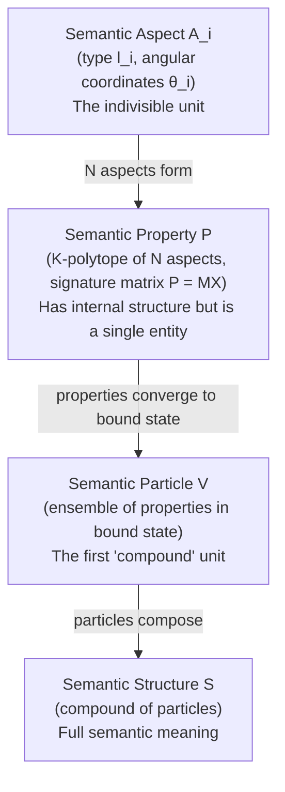
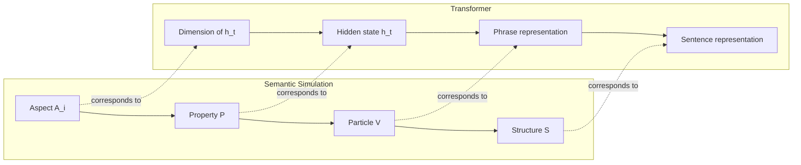

# On the Interpretation of Hidden States in Terms of Semantic Simulation

**Work in progress — last updated April 2026**

> **Rendering note.** This document contains LaTeX math (inline `$...$` and display `$$...$$` blocks, with macros such as `\mathfrak{...}`, `\boldsymbol{...}`, `\mathcal{...}`, etc.). The math has been verified to render correctly in **Safari**. In **Chrome** some symbols — notably calligraphic and fraktur letters, e.g. `\mathfrak{C}` rendering as a plain `C` instead of $\mathfrak{C}$ — appear to render incorrectly. **Firefox** has not been tested. If symbols look wrong, please view the document in Safari or consult the main paper's PDF, where the same symbols are typeset by LaTeX directly.

---

## Abstract

This document records an ongoing investigation into the correct mapping between **transformer hidden states** and the entities of the **Semantic Simulation framework** (Gueorguiev [1][2][3][4][5]). The central question is: *what does a single hidden state $h_t$ correspond to in the hierarchy of semantic aspects, properties, particles, and structures?*

The discussion originated from an inconsistency in earlier analyses that loosely identified hidden states with "semantic structures." A closer examination reveals that because a token is indivisible from the transformer's perspective, its hidden state more naturally maps to a **semantic property** — the first entity in the hierarchy that has internal structure (via its $d$ dimensions) while remaining a single unit. However, this identification remains conjectural and requires experimental validation. The key testable prediction is that groups of hidden states (corresponding to linguistic phrases) should converge into cohesive units across transformer layers, mirroring the formation of **semantic particles** from ensembles of properties in the Semantic Simulation framework.

This document presents the reasoning, the conjectured mapping, five proposed validation experiments, and a discussion of suitable models and methodology. It will be updated as experimental results become available.

---

## 1. The Question

### 1.1 Background: The Semantic Hierarchy

The Semantic Simulation framework defines a hierarchy of entities in semantic space $\Sigma$ [1][2][3]:

Each level adds structure:

- **Aspect** $A_i$: a single point in semantic space, characterized by its type $l_i$ (distance from centroid) and its angular coordinates $\boldsymbol{\theta}_i$. This is indivisible.
- **Property** $P$: a polytope of $N$ aspects in $L$ dimensions. Has a signature matrix $P = MX$ [5, eq. 7] and SVD $P = U\Sigma V^T$. Has internal structure but is a single entity with mass $\mathfrak{m}_P \sim IC_P \times VL_P$ [1, eq. 14].
- **Particle** $V$: an ensemble of properties that have traveled from their in-situ positions to bound state under the Gaussian well potential [4]. The first compound entity.
- **Structure** $S$: a compound of particles. Represents the full meaning of a complex semantic expression.

### 1.2 The Hidden State

A transformer processing a token sequence $x_1, x_2, \ldots, x_T$ produces, at each layer $\ell$ and position $t$, a hidden state:

$$h_t^{(\ell)} = f^{(\ell)}(x_{\leq t}) \in \mathbb{R}^d$$

This is a **single vector** at a **single position**. It is causally influenced by all preceding tokens $x_1, \ldots, x_t$ through the attention mechanism, but it is the representation at one position, not a collection of representations.

A token $x_t$ is **indivisible** from the transformer's perspective — it is the atomic unit of the input.

### 1.3 The Problem

Earlier analyses in this project (see [6][7]) loosely identified hidden states with "semantic structures" or "semantic particles." This identification was never made precise, and an examination of the hierarchy reveals an inconsistency:

> **Q (Gueorguiev):** *"But then I am confused — you said that hidden state corresponds to my definition of semantic structure. But a token is indivisible — so the hidden state should correspond not to semantic structure but to semantic particle, right?"*

This question exposed the need for a careful mapping.

---

## 2. The Reasoning

### 2.1 Why Not a Semantic Structure?

A semantic structure $S$ is a compound of particles, which are themselves compounds of properties. It is the highest-level entity in the hierarchy and represents the full meaning of a complex expression. A single hidden state $h_t$ cannot be a structure because:

1. A structure is **compound** — it contains multiple particles. A single $h_t$ is one vector at one position.
2. A structure represents a **complete meaning** (e.g., a full sentence). But $h_t$ represents the state at one token position, not the full sentence.
3. If $h_t$ were a structure, there would be nothing in the hierarchy left to map to phrases, clauses, or sentences.

### 2.2 Why Not a Semantic Particle?

A semantic particle $V$ is an ensemble of properties in bound state. It is already a compound — formed by multiple properties converging under the Gaussian well. A single $h_t$ is unlikely to be a particle because:

1. A particle is **composed of** properties. A single $h_t$ is atomic from the transformer's perspective (one token = one vector).
2. The formation of a particle requires a dynamical process (properties traveling toward bound state). A single $h_t$ has not "assembled" anything by itself.
3. If $h_t$ were a particle, then the formation of structures would require composing particles — but within a single transformer forward pass, there is no obvious mechanism that first forms particles from properties and then composes particles into structures. The processing happens at one granularity (token positions) throughout.

However, this argument is not conclusive. One could argue that $h_t$ at the **final layer** represents a particle that has been formed through the progressive refinement across layers. This possibility is discussed further in Section 2.4.

### 2.3 Why a Semantic Property Is the Most Natural Candidate

A semantic property $P$ is a single entity with internal structure — a polytope of $N$ aspects in $L$ dimensions. The hidden state $h_t \in \mathbb{R}^d$ is also a single entity with internal structure — a vector with $d$ components. The mapping is:

| Semantic Property | Hidden State |
|---|---|
| $N$ aspects $A_1, \ldots, A_N$ | $d$ dimensions of $h_t$ |
| Aspect type $l_i$ (distance from centroid) | Feature magnitude along dimension $i$ |
| Aspect angular coordinates $\boldsymbol{\theta}_i$ | Feature direction in the $d$-dimensional space |
| Signature matrix $P = MX \in \mathbb{R}^{N \times L}$ | Hidden state $h_t \in \mathbb{R}^{d}$ (with $d$ playing the role of both $N$ and $L$) |
| Mass $\mathfrak{m}_P \sim IC_P \times VL_P$ | Attention mass $w_t$ (aggregate attention received; see [8]) |

The correspondence is natural:

1. **Internal structure**: Both have it. A property has aspects; a hidden state has dimensions. Neither is truly "featureless."
2. **Atomicity at the right level**: A property is not further decomposed in the dynamics — it moves as a unit toward bound state. Similarly, $h_t$ is not decomposed during processing — it is the unit at which attention operates.
3. **The SVD parallel is exact**: The signature matrix $P = U_P \Sigma_P V_P^T$ decomposes the property's aspects along principal semantic axes. The PCA of the hidden state trajectory $\tilde{H} = U_H \Sigma_H V_H^T$ decomposes the token representations along principal representation axes. This structural correspondence was developed formally in [9, Section 5.3].

### 2.4 The Remaining Ambiguity

> **Q (Gueorguiev):** *"Actually I am not sure that hidden state as an indivisible unit should correspond to semantic property. This assertion makes sense though but it needs further validation. If this assertion is to stick we need to show that multiple hidden states converge into more cohesive units called in my theory Semantic Particles."*

This is the critical point. The assertion $h_t \leftrightarrow P$ is *consistent* with the framework's axioms but is not *proven* by them. The assertion carries a specific, testable prediction:

**If hidden states are properties, then groups of hidden states must converge into particles.**

In linguistic terms: tokens within a phrase should become more cohesive across transformer layers, eventually forming a bound unit — the particle — at the output layer. The dynamics of this convergence should follow the Gaussian well and the bound state algorithm described in [1, Section "Bound state of an ensemble of semantic properties"].

If this convergence is not observed, the mapping $h_t \leftrightarrow P$ is incorrect, and the alternative — $h_t \leftrightarrow V$ (hidden state as particle) — must be reconsidered. In that case, the internal structure of $h_t$ (its $d$ dimensions) would need to be interpreted as encoding the ensemble of properties that have already reached bound state within the token's representation.

---

## 3. The Conjectured Mapping

Pending experimental validation, we adopt the following working hypothesis:

| Semantic Simulation | Transformer Analog | Granularity |
|---|---|---|
| **Aspect** $A_i$ | Individual dimension or feature group within $h_t$ | Sub-token |
| **Property** $P$ | Hidden state $h_t$ at one token position | Token |
| **Particle** $V$ (bound ensemble of properties) | Representation of a phrase or clause (cohesive group of $h_t$) | Phrase |
| **Structure** $S$ (compound of particles) | Full sentence or passage representation | Sentence |

### 3.1 Consequences of This Mapping

If the mapping holds:

1. **The Gaussian well operates at the phrase level.** The potential $V(x) = \mathfrak{m}\upsilon^2(1 - e^{-\kappa^2 x^2})$ governs how individual token representations (properties) converge toward the phrase centroid (particle center). The experiments in [9, Sections 7–8] fitted the well to entire sentences, which under this mapping corresponds to fitting one well to an entire *structure* — mixing multiple particles with different well parameters. This may explain the $R^2 \approx 0$ result: the correct fitting granularity is the phrase, not the sentence.

2. **Particle formation happens across layers.** In the Semantic Simulation framework, properties travel from in-situ positions to bound state over time. In the transformer, the analog of "time" for this process is **layer depth** $\ell$. At layer 1, tokens are near their in-situ positions (embedding + positional encoding). By layer $L$, tokens within a phrase have converged to bound state, forming a particle. The cross-layer evolution $h_t^{(1)} \to h_t^{(2)} \to \cdots \to h_t^{(L)}$ is the travel path of a property toward bound state.

3. **Structure formation is the composition of particles.** Once phrases (particles) are formed in late layers, they compose into the full sentence meaning (structure). This may happen in the final few layers, where attention patterns shift from local (within-phrase) to global (across-phrase).

4. **The mass hierarchy is per-phrase.** Within each phrase, the attention mass $w_t$ determines which token sits closest to the phrase centroid (heaviest token = closest, per [8, Section 6]).

---

## 4. Experimental Validation Plan

Five experiments are proposed to test the conjecture. Each targets a specific prediction of the $h_t \leftrightarrow P$ mapping.

### 4.1 Experiment 1: Layer-wise Cohesion Within Syntactic Constituents

**Prediction**: If hidden states are properties forming particles (phrases), then tokens within the same phrase should become more similar to each other with increasing layer depth.

**Procedure**:

1. Select a corpus of 200+ sentences with diverse syntactic structure.
2. Parse each sentence with a constituency parser (e.g., `benepar` or `stanza`) to identify phrases: noun phrases (NP), verb phrases (VP), prepositional phrases (PP), etc.
3. For each layer $\ell = 1, \ldots, L$, extract all hidden states $h_t^{(\ell)}$.
4. Compute:
   - **Intra-phrase similarity**: mean pairwise cosine similarity between hidden states of tokens within the same phrase.
   - **Inter-phrase similarity**: mean pairwise cosine similarity between hidden states of tokens in different phrases.
5. Define the **cohesion ratio**: $\rho^{(\ell)} = \text{sim}\_\text{intra}^{(\ell)}\ /\ \text{sim}\_\text{inter}^{(\ell)}$.
6. Plot $\rho^{(\ell)}$ as a function of layer depth.

**Success criterion**: $\rho^{(\ell)}$ increases monotonically with $\ell$, from $\rho \approx 1$ at layer 1 (uniform similarity) to $\rho \gg 1$ at layer $L$ (strong intra-phrase cohesion). The increase should be steeper for tightly bound phrases (e.g., noun phrases) than for loosely connected ones (e.g., adjunct clauses).

**Failure mode**: $\rho^{(\ell)}$ is flat or decreasing — hidden states do not cluster by phrase, and the property→particle mapping is not supported.

### 4.2 Experiment 2: Hierarchical Clustering Reproduces Constituency

**Prediction**: If the hidden state hierarchy mirrors the semantic hierarchy, then agglomerative clustering of final-layer hidden states should approximate the linguistic constituency tree.

**Procedure**:

1. For each sentence, extract final-layer hidden states $h_1^{(L)}, \ldots, h_T^{(L)}$.
2. Perform agglomerative hierarchical clustering using cosine distance and Ward's linkage.
3. Obtain the resulting dendrogram.
4. Compare the dendrogram with the constituency parse tree using:
   - **Fowlkes-Mallows index** at each level of the hierarchy.
   - **Dendrogram purity**: for each subtree in the parse, what fraction of its tokens form a contiguous cluster in the dendrogram?
5. As a baseline, compare against random dendrograms and a simple positional clustering (merge adjacent tokens first).

**Success criterion**: The hidden state dendrogram significantly outperforms random clustering and positional clustering in matching the constituency tree. Fowlkes-Mallows index $> 0.5$ at the phrase level.

**What it would prove**: That the transformer organizes its representations into a hierarchy that mirrors the property → particle → structure hierarchy, with phrases as the natural "particle" unit.

### 4.3 Experiment 3: Per-Phrase Gaussian Well Fit

**Prediction**: The Gaussian well fit that failed at the sentence level ($R^2 \approx 0$ in [9, Sections 7–8]) should succeed at the phrase level, because phrases are the correct granularity for particle formation.

**Procedure**:

1. Parse sentences to identify phrases with 4+ tokens (to have enough data points per phrase).
2. For each phrase:
   a. Compute the attention-weighted centroid of its token hidden states (at the final layer).
   b. Compute cosine distance of each token's hidden state from the phrase centroid.
   c. Use per-token NTP loss as the energy proxy.
   d. Fit the Gaussian well $V(x) = a(1 - e^{-bx^2})$ to the (distance, energy) data within the phrase.
3. Pool per-phrase $R^2$ values and compare with the sentence-level $R^2$.

**Success criterion**: Mean per-phrase $R^2 > 0.2$ (substantially above the sentence-level $R^2 \approx 0$). The well parameter $b$ should be finite and non-degenerate — the inflection point $1/\sqrt{2b}$ falls within the observed cosine distance range.

**Why this should work**: The earlier experiments mixed tokens from different phrases (particles) into one fit, averaging over different well shapes. Fitting per-phrase isolates a single particle's well, where the monotonic energy–distance relationship predicted by the theory should be visible.

### 4.4 Experiment 4: Cross-Layer Travel Path

**Prediction**: The cosine distance of each token's hidden state from its phrase centroid should decrease across layers, mirroring the travel of a property from in-situ position to bound state.

**Procedure**:

1. For each phrase, compute its centroid at the **final layer** $\bar{h}\_\text{phrase}^{(L)}$ (the "bound state" center).
2. At each layer $\ell$, compute each token's cosine distance from this final-layer centroid: $d_t^{(\ell)} = 1 - \cos(h_t^{(\ell)},\ \bar{h}\_\text{phrase}^{(L)})$.
3. Plot $d_t^{(\ell)}$ as a function of $\ell$ for each token, grouped by phrase.
4. Fit the trajectory $d_t^{(\ell)}$ to the travel path predicted by the framework: the distance should decrease, with deceleration near the bound state (the damping factor $H_i$ from [3, eq. 8]).

**Success criterion**: Mean $d_t^{(\ell)}$ decreases monotonically with $\ell$ for tokens within each phrase. The deceleration near the final layer should follow a sigmoid-like profile consistent with the damping factor.

**Bonus**: If the mass identification from [8] is correct, high-mass tokens (heavily attended) should reach their bound state position (stabilize) at earlier layers than low-mass tokens.

### 4.5 Experiment 5: Mass–Distance Relationship Within Phrases

**Prediction**: Within each phrase, the bound state distance of a token from the phrase centroid should follow $x_t \approx \ell_t / w_t$ (energy divided by mass), per [1, eq. 44c].

**Procedure**:

1. For each phrase at the final layer, compute:
   - Attention mass $w_t$ for each token.
   - Per-token NTP loss $\ell_t$ for each token.
   - Cosine distance $d_t$ from the phrase centroid.
   - Predicted bound state distance $\hat{x}_t = \ell_t / w_t$.
2. Correlate $\hat{x}_t$ with $d_t$ across all tokens within all phrases.

**Success criterion**: Pearson $|r|(\hat{x}_t, d_t) > 0.3$ with $p < 0.01$. High-mass, low-energy tokens sit closest to the phrase center; low-mass, high-energy tokens sit farthest.

---

## 5. Model Selection and Practical Considerations

### 5.1 Primary Model: Llama-3.2-1B (base)

The primary model for all five experiments is **Llama-3.2-1B** (base, not instruct). This is the same model recommended for the energy landscape validation in [9, Section 9.2], for the following reasons:

1. It is the primary model in Huang et al.'s STP experiments [10], enabling direct comparison.
2. At $d = 2048$ and $L = 16$ layers, it is large enough for rich representation geometry but small enough to extract hidden states from all layers without memory constraints.
3. HuggingFace's `transformers` library provides direct access to all intermediate layer outputs via `output_hidden_states=True` and to attention weights via `output_attentions=True`.

### 5.2 Secondary Model: GPT-2 (124M)

GPT-2 serves as a **weak baseline**. With $d = 768$ and $L = 12$ layers, it has less representational capacity. If the cohesion effects are visible even in GPT-2, the evidence is strong. If they appear only in Llama-3.2-1B, the result is still informative — it indicates that sufficient model capacity is needed for the property → particle hierarchy to emerge.

### 5.3 Tertiary Model: OLMo-2-0425-1B (base)

OLMo-2 provides fully open training checkpoints. This enables a unique test: **does the cohesion ratio $\rho^{(\ell)}$ increase during training?** The Semantic Simulation framework predicts that the energy landscape deepens over time (as the semantic energy field $\mathfrak{F}$ is shaped by past inferences). In the transformer, this corresponds to the prediction that the property → particle convergence becomes cleaner as training progresses.

### 5.4 Constituency Parser

For Experiments 1–5, a constituency parser is needed. Recommended options:

- **Berkeley Neural Parser (`benepar`)**: State-of-the-art constituency parsing, available as a `spacy` component. Produces Penn Treebank-style parse trees.
- **Stanza (Stanford NLP)**: Alternative with good accuracy. Produces Universal Dependencies trees (dependency, not constituency), which would need to be converted.

The constituency parse provides the "ground truth" for which tokens belong to which phrase. If the parse is wrong, the experiments may produce false negatives. Using sentences with unambiguous syntactic structure (from a curated corpus) mitigates this risk.

### 5.5 Corpus Design

The corpus should include:

1. **Simple sentences** with clear phrase boundaries (NP VP structure): "The black cat sat on the warm mat."
2. **Complex sentences** with nested phrases and clauses: "The cat that sat on the mat ate the food that the dog left."
3. **Sentences from multiple semantic domains** (as in the existing experiments): mathematics, narrative, scientific, code description, conversational.
4. **Varying phrase sizes**: from 2-token phrases to 8+ token phrases, to test whether the Gaussian well fit improves with more tokens per phrase.
5. **Minimum 200 sentences** to provide statistical power. At the observed $|r| \approx 0.26$ (from [9, Section 8]), $n = 115$ tokens are needed for significance at $p < 0.05$. With 200 sentences averaging 25 tokens each, we would have $\sim 5000$ token-phrase pairs.

### 5.6 Implementation Notes

All five experiments require extracting hidden states from **all layers**, not just the last layer. The extraction loop should:

1. Run the model with `output_hidden_states=True` and `output_attentions=True`.
2. Store the full tensor `hidden_states[layer][batch, seq, dim]` for each sentence.
3. Store the full attention tensor `attentions[layer][batch, head, seq, seq]` for computing attention mass per layer.

For Llama-3.2-1B with a 50-token sequence, the memory per sentence is approximately:
- Hidden states: $16 \text{ layers} \times 50 \times 2048 \times 4 \text{ bytes} \approx 6.5 \text{ MB}$
- Attention weights: $16 \times 32 \text{ heads} \times 50 \times 50 \times 4 \approx 20.5 \text{ MB}$
- Total: $\sim 27 \text{ MB}$ per sentence, $\sim 5.4 \text{ GB}$ for 200 sentences.

This fits within the 64 GB available on the current hardware.

---

## 6. Discussion: What Each Outcome Would Mean

### 6.1 If All Five Experiments Succeed

The mapping $h_t \leftrightarrow P$ (hidden state as semantic property) would be strongly supported. This would mean:

1. **The transformer learns the Semantic Simulation hierarchy.** Tokens (properties) converge into phrases (particles) across layers, with the dynamics governed by the Gaussian well potential.
2. **The correct granularity for the energy landscape is the phrase.** The earlier $R^2 \approx 0$ results are not a failure of the Gaussian well conjecture but a scale mismatch — the well exists per-phrase, not per-sentence.
3. **Layer depth is the analog of time.** The progressive refinement of representations across layers mirrors the travel of properties from in-situ positions to bound state.
4. **The attention mechanism implements the mass-weighted dynamics.** Attention mass determines which tokens (properties) sit closest to the phrase centroid (particle center), directly realizing the bound state distance formula $x_i \approx E_t / \mathfrak{m}_i$.

### 6.2 If Experiments 1–2 Succeed but 3–5 Fail

The clustering and cohesion effects exist but do not follow the specific Gaussian well dynamics. This would suggest that:

1. Transformers do organize representations hierarchically (properties → particles → structures), but the underlying potential is not the Gaussian well.
2. The Semantic Simulation dynamics may describe the *qualitative* behavior (convergence, mass hierarchy) without capturing the *quantitative* form (the specific potential function).
3. Alternative potential forms (harmonic, double-well, learned nonparametric) should be investigated.

### 6.3 If Experiments 1–2 Fail

The hidden states do not cluster by phrase across layers. This would mean:

1. The mapping $h_t \leftrightarrow P$ is incorrect.
2. The alternative — $h_t \leftrightarrow V$ (hidden state as particle) — should be reconsidered. In this case, each token's hidden state already encodes a "micro-particle" with internal structure, and the sentence-level dynamics operate at the particle↔structure level rather than the property↔particle level.
3. The internal structure of $h_t$ (its $d$ dimensions) would need to be interpreted as an ensemble of properties that have already reached bound state within the token's representation.

---

## 7. Relation to Other Documents in This Project

This document connects to and is informed by:

- **[6] Hidden States, Semantic Tube Geodesics, and Semantic Structures** (working note, not included in this repository): The initial comparison of hidden state trajectories with semantic structure dynamics. Contains the original (imprecise) mapping that this document refines.

- **[7] Equivalence between the Evolution of Hidden States and Semantic Structures** (working note, not included in this repository): Maps the governing equations (ODE/SDE from Huang et al. vs. Euler-Lagrange from Semantic Simulation). Should be updated to reflect the corrected granularity.

- **[8] On the Interpretation of Semantic Mass** (companion note: [`On_the_Interpretation_of_Semantic_Mass.md`](On_the_Interpretation_of_Semantic_Mass.md)): Identifies semantic mass with aggregate attention received. The mass interpretation is used in Experiments 4 and 5 of this document.

- **[9] STP Loss as an Emergent Property of the Energy Landscape** (companion note: [`STP_Loss_Is_An_Emergent_Property_Of_The_Energy_Landscape_Defined_By_Gaussian_Well_Potential.md`](STP_Loss_Is_An_Emergent_Property_Of_The_Energy_Landscape_Defined_By_Gaussian_Well_Potential.md)): Contains the Gaussian well conjecture and the experimental results ($R^2 \approx 0$) that motivate the per-phrase fitting proposed here.

---

## References

[1] D. Gueorguiev, "Modeling Attractive and Repulsive Forces in Semantic Properties," 2022.

[2] D. Gueorguiev, "The Notion of Semantic Simulation," 2023/2024.

[3] D. Gueorguiev, "On the Need of Dynamic Simulation when Modeling Interactions of Semantic Structures," 2022.

[4] D. Gueorguiev, "On the Gaussian Inverse Semantic Energy Well," 2022.

[5] D. Gueorguiev, "On the Signature Matrix of Semantic Property," 2022.

[6] "Hidden States, Semantic Tube Geodesics, and Semantic Structures," 2026 (working note, not included in this repository).

[7] "Equivalence between the Evolution of Hidden States and Semantic Structures," 2026 (working note, not included in this repository).

[8] "On the Interpretation of Semantic Mass in Terms of Transformer Mechanisms," 2026 (companion note: [`On_the_Interpretation_of_Semantic_Mass.md`](On_the_Interpretation_of_Semantic_Mass.md)).

[9] "STP Loss as an Emergent Property of the Energy Landscape Defined by a Gaussian Well Potential," 2026 (companion note: [`STP_Loss_Is_An_Emergent_Property_Of_The_Energy_Landscape_Defined_By_Gaussian_Well_Potential.md`](STP_Loss_Is_An_Emergent_Property_Of_The_Energy_Landscape_Defined_By_Gaussian_Well_Potential.md)).

[10] H. Huang, Y. LeCun, R. Balestriero, "Semantic Tube Prediction: Beating LLM Data Efficiency with JEPA," arXiv:2602.22617, 2026.
