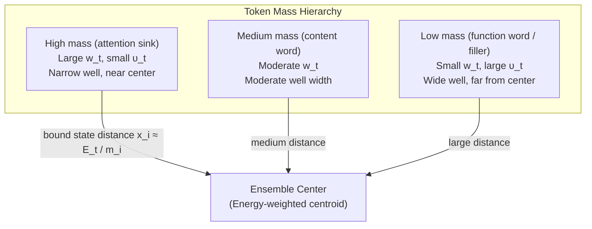
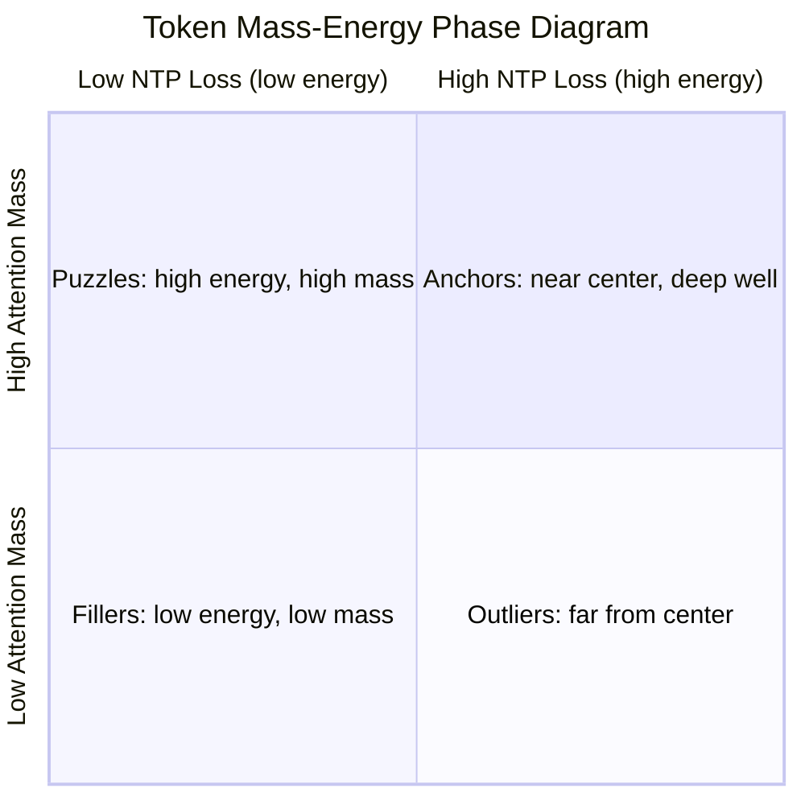
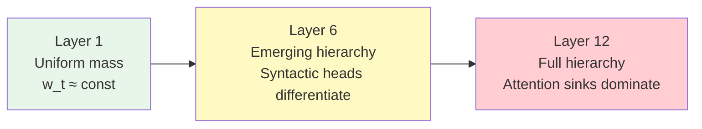

# On the Interpretation of Semantic Mass in Terms of Transformer Mechanisms

**Work in progress — last updated April 2026**

> **Rendering note.** This document contains LaTeX math (inline `$...$` and display `$$...$$` blocks, with macros such as `\mathfrak{...}`, `\boldsymbol{...}`, `\mathcal{...}`, etc.). The math has been verified to render correctly in **Safari**. In **Chrome** some symbols — notably calligraphic and fraktur letters, e.g. `\mathfrak{C}` rendering as a plain `C` instead of $\mathfrak{C}$ — appear to render incorrectly. **Firefox** has not been tested. If symbols look wrong, please view the document in Safari or consult the main paper's PDF, where the same symbols are typeset by LaTeX directly.

---

## Abstract

The Semantic Simulation framework [1][2][3] assigns to each semantic property a **semantic mass** $\mathfrak{m}$ that governs its dynamics: heavier properties sit closer to the ensemble center, resist displacement more strongly, and shape the centering operation that defines the Signature Matrix. This document investigates the question: **what is the transformer-native quantity that plays the role of semantic mass?**

We argue that semantic mass decomposes into two components — information content and valence — and that both have measurable analogs in transformer architectures. The primary candidate is **aggregate attention received** by a token position, which naturally captures both components: tokens that are informationally rich (high information content) and structurally central (high valence) accumulate attention from many positions across many heads. We derive the consequences of this identification for the Lagrangian of hidden state space, the Signature Matrix—PCA correspondence, and the Gaussian well potential, and propose specific experiments to test the claim.

---

## 1. Semantic Mass in the Framework

### 1.1 Definition

Semantic mass is defined as the product of two terms [1, eq. 14]:

$$\mathfrak{m}_P \sim IC_P \times VL_P$$

where $IC_P$ is the **information content** of the property $P$ and $VL_P$ is the **property valence** — the number of child properties that $P$ can bind to.

The carrier of semantic mass is the **semantic aspect**. Each aspect in a property carries a unit of mass. Properties with more aspects have higher information content and (typically) higher valence, and therefore higher mass [1, p. 7].

### 1.2 Where Mass Appears in the Dynamics

Semantic mass enters the framework at every level of the dynamics. The following table collects the key roles:

| Role | Expression | Source |
|---|---|---|
| **Center of mass** | $\vec{r}_c = \frac{\sum \mathfrak{m}_i \vec{r}_i}{\sum \mathfrak{m}_i}$ | [1, eq. 1] |
| **Centering matrix** $M$ | $M_{ij} = \delta_{ij}(1 - \tilde{\mathfrak{m}}_i) - (1-\delta_{ij})\tilde{\mathfrak{m}}_j$ | [3, eq. 8] |
| **Asymptotic velocity** | $\upsilon = \sqrt{E_t / \mathfrak{m}}$ | [1, eq. 40] |
| **Gaussian well depth** | $V(x) = \mathfrak{m} \cdot \upsilon^2 \cdot (1 - e^{-\kappa^2 x^2})$ | [2, eq. 1] |
| **Kinetic energy** | $T = \frac{1}{2} \mathfrak{m} v^2$ | [4, eq. 1] |
| **Lagrangian** | $\mathcal{L} = \frac{1}{2} \mathfrak{m} v^2 - V(x)$ | [4, eq. 4] |
| **Newton's second law** | $\vec{f}_{net} = \mathfrak{m} \frac{d\vec{v}}{dt}$ | [4, Appendix A1.2] |
| **Restoring force** | $\mathfrak{m} \ddot{x} = -2\mathfrak{m}\upsilon^2\kappa^2 x e^{-\kappa^2 x^2}$ | [4, eq. 5] |
| **Bound state distance** | $x_i = \frac{E_t(P_i)}{\mathfrak{m}_i} \mathcal{K}_i$ | [1, eq. 44c] |

### 1.3 The Physics of Mass: Five Axioms

From the table above, we can extract five **axioms** that any candidate for "semantic mass in a transformer" must satisfy:

**Axiom M1 (Inertia):** Mass determines resistance to change. A property with higher $\mathfrak{m}$ requires more force to displace: $\vec{f} = \mathfrak{m} \vec{a}$.

**Axiom M2 (Gravitational centering):** Mass determines the center of mass. Properties with higher mass pull the center toward themselves: $\vec{r}_c = \sum \tilde{\mathfrak{m}}_i \vec{r}_i$.

**Axiom M3 (Well depth):** Mass determines the depth of the potential well. The Gaussian well saturates at $V_\infty = \mathfrak{m} \upsilon^2$, where $\upsilon$ depends inversely on $\sqrt{\mathfrak{m}}$. In the equal-energy regime, heavier properties sit in shallower wells.

**Axiom M4 (Bound state proximity):** Heavier properties end up closer to the ensemble center. From $x_i \approx E_t(P_i) / \mathfrak{m}_i$: high mass, low energy → small bound state distance [1, eq. 44c].

**Axiom M5 (Information–Valence decomposition):** Mass factorizes as $\mathfrak{m} \sim IC \times VL$: information content times valence.

---

## 2. Candidate Quantities in Transformers

A transformer processing a token sequence $x_1, \ldots, x_T$ produces, at each layer $\ell$ and position $t$:

- A hidden state $h_t^{(\ell)} \in \mathbb{R}^d$
- Attention weights $\alpha_{t,s}^{(\ell,n)} \in [0,1]$ from position $t$ attending to position $s$ in head $n$
- A per-token NTP loss $\ell_t = -\log p_\theta(x_{t+1} \mid x_{\leq t})$

Several quantities could serve as the mass of position $t$. We consider five candidates and evaluate each against the five axioms.

### 2.1 Candidate 1: Aggregate Attention Received

Define the **attention mass** of position $s$ as the total attention flowing *to* it from all subsequent positions and all heads in a given layer:

$$w_s^{(\ell)} = \frac{1}{H} \sum_{n=1}^{H} \sum_{t > s} \alpha_{t,s}^{(\ell,n)}$$

where $H$ is the number of attention heads. This measures how much the rest of the sequence "depends on" position $s$.

| Axiom | Assessment |
|---|---|
| **M1 (Inertia)** | A token that receives high attention from many positions is difficult to "move" — perturbing its hidden state propagates to all tokens that attend to it. The gradient of the total loss with respect to $h_s$ is a sum over all positions that attend to $s$, weighted by $\alpha_{t,s}$. Thus $w_s$ directly controls the effective inertia. |
| **M2 (Centering)** | The output of attention at position $t$ is $\sum_s \alpha_{t,s} V_s$, where $V_s$ is the value vector. The mean hidden state is weighted by how much attention each position receives. Positions with high $w_s$ pull the aggregate representation toward themselves — exactly as mass pulls the center of mass. |
| **M3 (Well depth)** | Positions that receive high aggregate attention tend to be "anchor points" — function words, syntactic heads, repeated topics. These create deep wells in the representation landscape: the rest of the sequence orbits them. |
| **M4 (Proximity)** | High-attention tokens (e.g., the [BOS] token, common function words) cluster near the centroid of the hidden state cloud. This is the well-known "attention sink" phenomenon: the most-attended positions have the smallest displacement from the mean. |
| **M5 (IC × VL)** | A token receives high attention for two reasons: (a) it is informationally important (high $IC$) — it carries content that many positions need; (b) it binds to many positions (high $VL$) — it serves as a syntactic or semantic hub. These are precisely the two factors of semantic mass. |

**Verdict: Strong candidate.** Satisfies all five axioms qualitatively.

### 2.2 Candidate 2: Hidden State Norm

Define $w_s = \|h_s\|$, the Euclidean norm of the hidden state.

| Axiom | Assessment |
|---|---|
| **M1** | Partial. Larger norms do produce larger gradients in the dot-product attention mechanism ($QK^T$ scales with norms), so high-norm states are harder to "move" proportionally. However, layer normalization resets norms, breaking the inertia argument across layers. |
| **M2** | Partial. The mean hidden state $\bar{h} = \frac{1}{T}\sum h_t$ is an unweighted average; the norm does not enter the centering. |
| **M3** | Weak. Norm reflects magnitude, not semantic importance. Outlier tokens can have large norms for numerical, not semantic, reasons. |
| **M4** | Contradicted in practice. Outlier dimensions in transformers produce large norms at specific positions that are far from the centroid. |
| **M5** | No natural decomposition into IC × VL. |

**Verdict: Weak candidate.** Fails M2, M4, M5.

### 2.3 Candidate 3: Inverse NTP Loss (Predictive Confidence)

Define $w_s = 1 / \ell_s$ (or $w_s = e^{-\ell_s}$), so that easily predicted tokens have high "mass."

| Axiom | Assessment |
|---|---|
| **M1** | Partial. A token with low NTP loss is already well-predicted, so the model has "settled" on its representation — perturbing it would disrupt the confident prediction. But this is a property of the output head, not the representation geometry. |
| **M2** | Weak. There is no mechanism by which easily predicted tokens pull the center of mass. |
| **M3** | Interesting. Low-loss tokens sit at positions where the model's internal confidence is high — near a "minimum" of the energy landscape. This is consistent with being at the bottom of a well, but it confuses position-in-well with well-depth. |
| **M4** | Partial. Easily predicted tokens (function words, common continuations) may cluster near the centroid, but rare-but-important tokens (proper nouns, technical terms) can also be predicted well in context while being far from the mean. |
| **M5** | No natural decomposition. Predictive confidence depends on context, not on intrinsic properties of the token. |

**Verdict: Moderate candidate.** Has interesting energy connections but lacks the structural properties (M2, M5).

### 2.4 Candidate 4: Gradient Norm (Sensitivity)

Define $w_s = \|\nabla_{h_s} \mathcal{L}_{NTP}\|$, the norm of the loss gradient with respect to the hidden state at position $s$.

| Axiom | Assessment |
|---|---|
| **M1** | Reversed. In classical mechanics, high mass means *low* acceleration for a given force. But high gradient norm means the loss is *sensitive* to this position — it should move *more*, not less. This is more analogous to the *force* on the position, not its mass. |
| **M2–M5** | Not applicable due to the reversal in M1. |

**Verdict: Not a mass candidate.** This is a force quantity, not an inertia quantity.

### 2.5 Candidate 5: Attention Entropy (Specificity)

Define $w_s = \exp(-H_s)$ where $H_s = -\sum_t \alpha_{t,s} \log \alpha_{t,s}$ is the entropy of the attention distribution *attending to* $s$.

| Axiom | Assessment |
|---|---|
| **M1–M2** | Partial. Low entropy means a few positions attend to $s$ very strongly — this is related to specificity, not aggregate importance. |
| **M5** | Captures valence inversely: low entropy = few bindings, high entropy = many bindings. But the relationship is inverted. |

**Verdict: Related but inverted.** Entropy of attention received captures valence but in the wrong direction.

---

## 3. The Primary Identification: Attention Mass

Based on the analysis in Section 2, we adopt **aggregate attention received** as the primary candidate for semantic mass:

$$\mathfrak{m}_t \equiv w_t = \frac{1}{H} \sum_{n=1}^{H} \sum_{s > t} \alpha_{s,t}^{(n)}$$

This is the average (over heads) total attention that flows to position $t$ from all later positions. We now derive the consequences of this identification.

### 3.1 The Information Content—Valence Decomposition

The attention mass $w_t$ can be decomposed as follows. Consider a single attention head $n$ at layer $\ell$. The attention weight from position $s$ to position $t$ is:

$$\alpha_{s,t}^{(n)} = \text{softmax}\left(\frac{q_s^{(n)} \cdot k_t^{(n)}}{\sqrt{d_k}}\right)_t$$

The total attention received by $t$ in head $n$ is $\sum_{s>t} \alpha_{s,t}^{(n)}$. This sum is large when:

1. **The key vector $k_t^{(n)}$ aligns with many query vectors** — position $t$ is "relevant" to many other positions. This is the **valence** component: $t$ can bind to many others.

2. **The alignment is strong** (the dot products $q_s \cdot k_t$ are large relative to competitors) — position $t$ is not just relevant but *uniquely important*. This is the **information content** component: $t$ carries specific information that others need.

Formally, if we decompose attention into a "breadth" factor (how many positions attend) and an "intensity" factor (how strongly each attends):

$$w_t^{(n)} = \underbrace{|\{s : \alpha_{s,t}^{(n)} > \epsilon\}|}_{\text{effective valence } VL_t^{(n)}} \times \underbrace{\frac{1}{|\{s : \alpha_{s,t}^{(n)} > \epsilon\}|}\sum_{s:\alpha_{s,t}^{(n)} > \epsilon} \alpha_{s,t}^{(n)}}_{\text{mean intensity} \sim IC_t^{(n)}}$$

This gives $w_t^{(n)} \sim IC_t^{(n)} \times VL_t^{(n)}$, which is the transformer analog of $\mathfrak{m}_P \sim IC_P \times VL_P$.

### 3.2 The Attention Sink as Mass Concentration

The **attention sink** phenomenon, documented in multiple transformer architectures, is the observation that certain positions (typically the first token or special tokens like [BOS]) receive disproportionately large attention from all subsequent positions. In the mass interpretation:

- Attention sinks are the **heaviest tokens** in the sequence.
- By Axiom M4, they should sit closest to the center of the hidden state cloud — and empirically, they do: first-token hidden states are the most "generic" representations, nearest to the mean.
- By Axiom M2, they pull the center of mass toward themselves — and empirically, the mean hidden state is dominated by the contribution of the most-attended positions.
- By Axiom M1, they are the most difficult to perturb — and empirically, ablating the first token has outsized effects on downstream predictions.

The attention sink is not an artifact — it is the transformer's way of implementing a mass hierarchy.

### 3.3 Mass Determines the Well

The Gaussian well depth is $V_\infty = \mathfrak{m} \upsilon^2 = E_t$ (the total net energy of the ensemble). In the transformer, this becomes:

$$V_\infty(t) = w_t \cdot \upsilon_t^2$$

where $\upsilon_t = \sqrt{E_t / w_t}$ is the asymptotic velocity. With the NTP loss as the energy proxy:

$$\upsilon_t = \sqrt{\frac{\bar{\ell}}{w_t}}$$

where $\bar{\ell}$ is the mean NTP loss across the trajectory. This means:

- **High-mass tokens** (attention sinks) have low asymptotic velocity $\upsilon_t$ and sit in wells with $V_\infty = \bar{\ell}$ (independent of mass, since $\mathfrak{m} \upsilon^2 = E_t$).
- The **well width** $\kappa = f/\upsilon$ is larger for high-mass tokens (narrower wells), meaning attention sinks are confined to a tighter region around the center.
- The **bound state distance** $x_t \approx E_t / \mathfrak{m}_t$ is smaller for high-mass tokens, confirming their proximity to the center.

---

## 4. Consequences for the Signature Matrix—PCA Correspondence

Section 5.3 of [5] establishes a structural correspondence between the Signature Matrix $P = U_P \Sigma_P V_P^T$ and the PCA decomposition $\tilde{H} = U_H \Sigma_H V_H^T$. That correspondence was derived under the equal-mass assumption ($\tilde{\mathfrak{m}}_i = 1/N$ for all aspects). The identification of semantic mass with attention weight breaks this symmetry and reveals a richer structure.

### 4.1 From Unweighted PCA to Attention-Weighted PCA

Standard PCA centers the hidden states using the uniform mean $\bar{h} = \frac{1}{T}\sum_t h_t$, which treats all token positions equally. This corresponds to the equal-mass centering matrix $M = I - \frac{1}{T}\mathbf{1}\mathbf{1}^T$.

With the mass identification, the correct centering uses the **attention-weighted mean**:

$$\bar{h}_w = \frac{\sum_t w_t \cdot h_t}{\sum_t w_t} = \sum_t \tilde{w}_t \cdot h_t$$

and the centered matrix becomes:

$$\tilde{H}_w = M_w H$$

where $M_w$ is the mass-ratio centering matrix:

$$(M_w)_{st} = \begin{cases} 1 - \tilde{w}_s & \text{if } s = t \\ -\tilde{w}_t & \text{if } s \neq t \end{cases}$$

with $\tilde{w}_t = w_t / \sum_s w_s$. The SVD of $\tilde{H}_w$ is:

$$\tilde{H}_w = U_w \Sigma_w V_w^T$$

This **attention-weighted PCA** is the correct analog of the Signature Matrix SVD. The columns of $V_w$ are the principal representation axes adjusted for token importance, and $\Sigma_w$ contains the corresponding singular values.

**Prediction**: The attention-weighted PCA should produce a cleaner separation of well structure than unweighted PCA. Specifically, the $R^2$ vs. $k$ diagnostic curve (Section 9.1.1 of [5]) should peak at a higher $R^2$ and sharper $k^*$ when attention-weighted centering is used, because the mass-weighted center is closer to the true "energy-weighted centroid" $\vec{p}_E$ of the semantic ensemble.

### 4.2 The Attention-Weighted Information Content

The information content of the Signature Matrix is the entropy of the normalized singular value spectrum. With attention-weighted PCA, the **attention-weighted spectral entropy** becomes:

$$H_{w\text{-}PCA} = -\sum_i r_{w,i} \log r_{w,i} \quad \text{where} \quad r_{w,i} = \frac{\sigma_{w,i}^2}{\sum_j \sigma_{w,j}^2}$$

If the mass identification is correct, $H_{w\text{-}PCA}$ should be a more faithful proxy for $H^*$ (the normalized information content of the semantic property) than the unweighted $H_{PCA}$.

### 4.3 The Feasibility Ellipsoid Under Attention Weighting

In the Signature Matrix framework, the feasible in-situ positions lie on a sphere of radius $H^*$ constrained by the ellipsoid $\mathfrak{S}^*$ with semi-axes $\sigma_i^*$. In the attention-weighted PCA, the covariance ellipsoid becomes:

$$\mathcal{E}_{w}: \sum_{i=1}^{k} \frac{z_{w,i}^2}{\sigma_{w,i}^2} \leq \chi^2_k(\alpha)$$

where $z_{w,t} = V_{w,k}^T (h_t - \bar{h}_w)$ are the attention-weighted PCA coordinates. The semi-axes $\sigma_{w,i}$ replace $\sigma_i^*$ in the correspondence, and the mass-weighted Frobenius norm $\|\tilde{H}_w\|_F$ replaces $H^*$ as the effective representation radius.

---

## 5. Consequences for the Lagrangian

### 5.1 The Mass-Dependent Lagrangian

With the attention mass identification, the Lagrangian for position $t$ along the hidden state trajectory becomes:

$$\mathcal{L}_t = \frac{1}{2} w_t \cdot \omega_t^2 - w_t \cdot \upsilon_t^2 \cdot (1 - e^{-\kappa_t^2 d_t^2})$$

where:
- $w_t$ is the attention mass at position $t$
- $\omega_t = \arccos(\cos(h_t, h_{t-1}))$ is the angular velocity
- $d_t = 1 - \cos(h_t, h_T)$ is the cosine distance from the trajectory center
- $\upsilon_t = \sqrt{\bar{\ell} / w_t}$ and $\kappa_t = f / \upsilon_t$

In the current experiments (Sections 7–8 of [5]), the Lagrangian was computed without mass ($\mathfrak{m} = 1$ for all positions). This is the equal-mass approximation and is only valid when all tokens carry equal semantic weight — a poor assumption for natural language, where function words, content words, and punctuation have very different roles.

### 5.2 The Action With Mass

The total action along a trajectory becomes:

$$\mathcal{S} = \sum_{t=1}^{T-1} \mathcal{L}_t = \sum_{t=1}^{T-1} \left[\frac{1}{2} w_t \omega_t^2 - V(d_t; w_t)\right]$$

The Euler-Lagrange equations predict that **high-mass positions should have lower acceleration** (smaller $\ddot{x}$) for the same force. In the trajectory, this means attention sinks should exhibit smoother hidden state evolution — smaller angular velocity fluctuations — than low-mass tokens.

**Prediction**: If we compute the per-position angular acceleration $\dot{\omega}_t = |\omega_{t+1} - \omega_t|$ and plot it against $w_t$, we should observe a negative correlation: high attention mass → low angular acceleration.

### 5.3 The Mass-Weighted STP-Action Correlation

The experiments in [5, Sections 7–8] found a Pearson correlation of $r = -0.260$ ($p = 0.068$) between STP loss and total action using unweighted dynamics. With mass-weighted dynamics:

- The action $\mathcal{S}$ would upweight contributions from high-mass tokens and downweight low-mass tokens.
- The STP loss samples triplets $(s, r, t)$ uniformly — but a mass-weighted STP loss that samples proportionally to $w_s w_r w_t$ would preferentially measure linearity along the "backbone" of the trajectory (the high-mass positions).

**Prediction**: The mass-weighted action should correlate more strongly with STP loss than the unweighted action, because both are measuring dynamics along the same mass-determined backbone.

### 5.4 Initial Conditions and the Shallow Limit of STP

The Lagrangian of §5.1 gives rise to second-order equations of motion, which require **two** pieces of initial data — an initial position $x_0$ and an initial velocity $v_0$ — to determine a unique trajectory. The identifications of §3 and §5.1 provide the mass ($\mathfrak{m}_t = w_t$) and the position ($h_t \leftrightarrow \vec{x}_t$), but leave the initial velocity unspecified. This subsection closes that gap. The resulting identification clarifies the formal relationship between the present framework and the first-order STP flow of [6], and exposes the first transformer block as the physical "launching apparatus" that fixes $v_0$ as a function of $x_0$ *and its neighbors*.

**Two readings of time.** The correspondence admits two equally legitimate choices of the time coordinate. Under the **position-as-time** reading, used in the trajectory experiments of [5, §§7–8], a trajectory is the sequence $h_s^{(L)}, h_{s+1}^{(L)}, \ldots$ at a fixed layer $L$, indexed by token position. Under the **layer-as-time** reading, a trajectory is the sequence $h_t^{(0)}, h_t^{(1)}, \ldots, h_t^{(L)}$ at a fixed token position $t$, indexed by depth. Each reading selects a different object as the "initial state" of a property and therefore defines a distinct initial velocity. The two are complementary, not competing.

#### 5.4.1 Property Initial Velocity: Layer-as-Time

At a fixed token position $t$, the initial position is the pre-contextual token representation,

$$h_t^{(0)} = \mathrm{TokenEmbedding}(x_t) + \mathrm{PositionalEncoding}(t),$$

i.e., the token's identity decorated with a position index, *before* any contextual information has been injected. The corresponding initial velocity is the first-block residual update:

$$\vec{v}_t^{(0)} = h_t^{(1)} - h_t^{(0)} = \mathrm{Attn}^{(0)}(h^{(0)})_t + \mathrm{MLP}^{(0)}\big(h^{(0)} + \mathrm{Attn}^{(0)}(h^{(0)})\big)_t.$$

This decomposition follows the standard **residual-stream** formulation of the transformer [7]: each block contributes a pair of additive updates — an attention output and a position-wise MLP output — to a shared state that is read and written across layers. Under our correspondence, $\vec{v}_t^{(0)}$ is the amount by which the first transformer block displaces the token's representation from its decontextualized starting point. We call it the **first contextual kick** imparted to the property by its local neighborhood.

Two observations follow.

**(a) Contextual vs. intrinsic decomposition of the first kick.** The attention component $\mathrm{Attn}^{(0)}(h^{(0)})_t$ is the part of the initial velocity that is **not** computable from the token alone: it requires the full matrix $h^{(0)}$ and therefore encodes what the first layer extracts from context. The MLP component is a position-wise transformation of an already-contextualized input. The split

$$\vec{v}_t^{(0)} = \vec{v}_t^{(0),\mathrm{attn}} + \vec{v}_t^{(0),\mathrm{mlp}}$$

therefore separates the contextual contribution from the intrinsic contribution to the first kick. This is a decomposition without analog in classical mechanics, but a natural one in the transformer instantiation: it distinguishes what the token brings with it from what the neighborhood imprints on it during the first layer of processing.

**(b) Magnitude variation across token types.** Anchor tokens — sentence-initial markers, high-frequency function words, the positions identified in §3.2 as attention sinks — receive large $w_t$ but are expected to have **small** $\|\vec{v}_t^{(0)}\|$. The reason is structural: the first block can only attend to what is already in the input, and anchor tokens are tokens whose representation does not yet depend on the specifics of the surrounding content. Content tokens whose representation depends strongly on context (polysemous nouns in a disambiguating frame, pronouns referring to earlier entities, punctuation at syntactic inflection points) are expected to have **large** $\|\vec{v}_t^{(0)}\|$. This aligns with the layer-specialization picture of [8]: early layers carry out morphosyntactic and surface-disambiguation work, and $\|\vec{v}_t^{(0)}\|$ is a direct proxy for how much of that work the token requires.

The combination of (a)+(b) gives a second-order consistency check on Axiom M1 (inertia) of §1.3: heavy tokens should move little at early layers not because of a generic "force balance" but because the first block's ability to move them is itself bounded by the information already present in the input. Experiment 5 below (§8.5, E-init) tests this directly.

#### 5.4.2 Property Initial Velocity: Position-as-Time

At a fixed layer $L$, the initial position of a window starting at token $s_0$ is simply $h_{s_0}^{(L)}$, and the initial velocity is the first discrete displacement,

$$\vec{v}_{s_0}^{(L)} = h_{s_0+1}^{(L)} - h_{s_0}^{(L)},$$

which coincides with the vector $\vec{d}_1$ entering the STP loss of the first consecutive triplet in the sequence. This reading is operationally simpler but semantically less informative than the layer-as-time reading: it describes the token-to-token transition at a fixed depth rather than the token's own becoming from embedding to contextualized representation.

#### 5.4.3 Ensemble Initial Velocity and the König Kinetic-Energy Decomposition

For a phrase-sized ensemble $\{t_1, \ldots, t_k\}$, the attention-weighted centroid at layer $\ell$ (§4.1) is

$$\vec{r}_c^{(\ell)} = \sum_{i=1}^{k} \tilde{w}_{t_i}\, h_{t_i}^{(\ell)}, \qquad \tilde{w}_{t_i} = \frac{w_{t_i}}{\sum_j w_{t_j}},$$

and the ensemble's initial velocity under the layer-as-time reading is

$$\vec{V}_c^{(0)} = \vec{r}_c^{(1)} - \vec{r}_c^{(0)} = \sum_i \tilde{w}_{t_i}\, \vec{v}_{t_i}^{(0)},$$

the mass-weighted average of the per-token initial velocities. This quantity acquires a direct physical meaning through the **König decomposition** of kinetic energy. Writing $M = \sum_i \mathfrak{m}_{t_i} = \sum_i w_{t_i}$ for the total ensemble mass,

$$T = \underbrace{\tfrac{1}{2}\, M\, \|\vec{V}_c\|^2}_{\text{bulk}} + \underbrace{\tfrac{1}{2}\, \sum_i \mathfrak{m}_{t_i}\, \|\vec{v}_{t_i} - \vec{V}_c\|^2}_{\text{internal}}.$$

The two terms have distinct transformer interpretations:

- **Bulk kinetic energy** $T_{\text{bulk}} = \tfrac{1}{2} M \|\vec{V}_c\|^2$ is the kinetic energy associated with *translation of the phrase as a whole*. Large values at the transition $\ell = 0 \to 1$ indicate that the first block is repositioning the entire phrase in semantic space — the phrase is being recontextualized, disambiguated, or projected onto a relevant subspace as a unit.
- **Internal kinetic energy** $T_{\text{int}} = \tfrac{1}{2}\sum_i \mathfrak{m}_{t_i} \|\vec{v}_{t_i} - \vec{V}_c\|^2$ is the kinetic energy of the constituent particles *relative to the ensemble centroid*. Large values at $\ell = 0 \to 1$ indicate that the first block is reorganizing the phrase internally — individual token representations are shifting with respect to each other even when the centroid may be stable. This is the transformer realization of an ensemble whose particles are still settling into their bound states.

The decomposition is the classical separation of an interacting $k$-body system into translational and internal motion, and it matches naturally the multi-particle view of transformers developed by [9] and the interacting-particle analysis of self-attention dynamics of [10]. Both of those works model hidden-state evolution as a coupled-particle system; the bulk/internal split is precisely the standard König decomposition for such a system.

**Prediction**: Phrases of distinct syntactic and semantic types should occupy distinct regions of the $(\|\vec{V}_c\|, \sigma_v)$ plane at early layers, where $\sigma_v = \sqrt{(1/k)\sum_i \|\vec{v}_{t_i} - \vec{V}_c\|^2}$. For example:

- Semantically atomic multiword expressions (idioms, named entities): low bulk velocity, low internal velocity.
- Phrases undergoing contextual disambiguation: high bulk velocity, low internal velocity — the phrase moves as a unit.
- Phrases undergoing internal restructuring (e.g., coreference within the span): low bulk velocity, high internal velocity.

#### 5.4.4 The STP First-Order Model as the Shallow Limit of Semantic Simulation

The identification of the initial velocity clarifies the formal relationship between Semantic Simulation and the STP model of [6]. STP specifies the dynamics of the hidden state as a first-order ODE [6, eq. (2)]:

$$d x_{\leq t} = \mathring{u} \circ \mathring{f}(x_{\leq t})\, dt,$$

which **enforces** $v_0 = \mathring{u} \circ \mathring{f}(x_0)$: under STP, initial velocity is not an independent boundary condition; it is determined by the initial position through the flow operator. The Semantic Simulation Lagrangian, being second-order, treats $(x_0, v_0)$ as independent. The transformer itself sits between the two: the embedding layer controls $x_0 = h_t^{(0)}$ directly, and the first block *computes* $\vec{v}_t^{(0)}$ via the equation of §5.4.1. The first block is therefore the physical implementation of a "launching apparatus" that fixes $v_0$ as a function of $x_0$ **and its neighbors** — a function that depends on the entire input sequence, not just on the token at position $t$.

This yields a precise statement of how the two models are related:

> **The STP first-order flow is the shallow limit of the Semantic Simulation dynamics**, obtained by collapsing the first-block computation of $\vec{v}_t^{(0)}$ into a function $\mathring{u} \circ \mathring{f}$ evaluated on $h_t^{(0)}$ alone.

The collapse is exact when the first block is a point-wise map of each token — i.e., when $\mathrm{Attn}^{(0)} \equiv \mathrm{id}$. Any contribution of $\mathrm{Attn}^{(0)}$ that draws on neighbors $h_s^{(0)}$ with $s \neq t$ is captured by the second-order term in the present framework and is invisible to STP. In practice the attention component dominates the early-layer residual updates for most token types, so the second-order treatment is not a formal extension of STP but a description of effects that the first-order model cannot represent in principle.

**Corollary for the mass interpretation.** The first-block initial velocity $\vec{v}_t^{(0)}$ is produced by the same attention tensor that defines the mass $w_t$ under our identification. Anchor tokens (high $w_t$) receive large attention *from* later positions but contribute only small amounts of context *to* themselves at the first layer, because the rest of the sequence has not yet been processed. This ties the inertia axiom M1 directly to the residual-stream architecture: a heavy token is one that the rest of the sequence needs a lot, but that the first layer cannot yet change much.

---

## 6. Consequences for Bound State Distances

### 6.1 The Mass–Distance Relationship

From [1, eq. 44c], the bound state distance of property $P_i$ from the ensemble center is:

$$x_i \approx \frac{E_t(P_i)}{\mathfrak{m}_i}$$

In the transformer, with $E_t(P_i) \to \ell_t$ (per-token NTP loss) and $\mathfrak{m}_i \to w_t$ (attention mass):

$$x_t \approx \frac{\ell_t}{w_t}$$

This is a **testable prediction**: for each token in a trajectory, compute the NTP loss $\ell_t$, the attention mass $w_t$, and the cosine distance $d_t$ from the final hidden state. The ratio $\ell_t / w_t$ should correlate with $d_t$.

Tokens with high loss and low mass (surprising, unattended tokens) should be far from the center. Tokens with low loss and high mass (expected, heavily attended tokens) should be near the center.

### 6.2 The Mass–Energy Phase Diagram

The framework predicts that properties in a bound ensemble arrange themselves according to their mass-to-energy ratio. We can construct a **mass–energy phase diagram** for a token sequence:

- **Quadrant 1** (high mass, low energy): Attention sinks and anchor tokens. Predicted to be nearest to the ensemble center with deep, narrow wells.
- **Quadrant 2** (high mass, high energy): Semantically complex tokens that are both important and hard to predict. Moderate distance from center.
- **Quadrant 3** (low mass, low energy): Filler tokens and punctuation. Easy to predict but unimportant. Moderate distance from center.
- **Quadrant 4** (low mass, high energy): Surprising, unattended tokens. Predicted to be farthest from center with wide, shallow wells.

---

## 7. The Two Components of Mass in Attention Heads

### 7.1 Specialized Heads and Mass Components

Not all attention heads compute the same thing. Research on attention head specialization has identified several head types:

- **Syntactic heads**: Track grammatical dependencies (subject-verb agreement, coreference). These encode **valence** — the structural binding relationships between tokens.
- **Semantic heads**: Track thematic relationships (topic coherence, entity tracking). These encode **information content** — the semantic importance of tokens.
- **Positional heads**: Track relative position (local context windows). These contribute little to either component.

The decomposition $\mathfrak{m} \sim IC \times VL$ may therefore be realized as:

$$w_t = \frac{1}{H}\sum_n w_t^{(n)} = \frac{1}{H}\left[\sum_{n \in \text{semantic}} w_t^{(n)} + \sum_{n \in \text{syntactic}} w_t^{(n)} + \sum_{n \in \text{positional}} w_t^{(n)}\right]$$

where the semantic heads contribute primarily to the $IC$ component and the syntactic heads contribute primarily to the $VL$ component. The positional heads contribute a baseline mass independent of content.

### 7.2 Layer-wise Mass Evolution

Semantic mass in the framework is not static — it is determined by the accumulated interactions along the property's travel path. In a transformer, the attention mass evolves across layers:

$$w_t^{(\ell)} = \frac{1}{H} \sum_n \sum_{s > t} \alpha_{s,t}^{(\ell, n)}$$

The evolution of $w_t^{(\ell)}$ with layer depth $\ell$ tells us how the mass hierarchy forms:

- **Early layers**: Mass is approximately uniform (all tokens are equally important before context is processed). The centering matrix is close to $I - \frac{1}{T}\mathbf{1}\mathbf{1}^T$.
- **Middle layers**: Syntactic heads establish the valence hierarchy; semantic heads begin to differentiate information content. The mass distribution becomes non-uniform.
- **Late layers**: The mass hierarchy is fully formed. Attention sinks have high mass; filler tokens have low mass. The centering matrix $M_w$ is maximally non-uniform.

**Prediction**: The Gaussian well fit $R^2$ should improve when using layer-specific attention masses $w_t^{(\ell)}$ from the layer closest to the output, compared to using masses from early layers or the uniform-mass approximation.

---

## 8. Experimental Validation Plan

### 8.1 Experiment 1: Attention Mass vs. Bound State Distance

**Objective**: Test whether $x_t \approx \ell_t / w_t$ (Section 6.1).

**Procedure**:
1. For each trajectory, extract hidden states $h_t$ and per-token NTP loss $\ell_t$.
2. Compute attention mass $w_t$ at the last layer.
3. Compute cosine distance $d_t = 1 - \cos(h_t, h_T)$ from the final hidden state.
4. Compute the predicted bound state distance $\hat{x}_t = \ell_t / w_t$.
5. Correlate $\hat{x}_t$ with $d_t$ across all tokens.

**Success criterion**: Pearson $|r|(\hat{x}_t, d_t) > 0.3$ with $p < 0.01$.

### 8.2 Experiment 2: Attention-Weighted PCA

**Objective**: Test whether attention-weighted PCA produces a better Gaussian well fit than unweighted PCA (Section 4.1).

**Procedure**:
1. Compute standard PCA and attention-weighted PCA of the hidden state matrix.
2. For each, sweep $k \in \{10, 20, 30, 50, 100, 200, d\}$.
3. At each $k$, compute cosine distance in the projected space and fit the Gaussian well.
4. Compare $R^2$ vs. $k$ curves for the two methods.

**Success criterion**: The attention-weighted PCA curve should peak at a higher $R^2$ than the unweighted curve, at a similar or smaller $k^*$.

### 8.3 Experiment 3: Mass-Weighted Lagrangian

**Objective**: Test whether the mass-weighted action correlates more strongly with STP loss than the unweighted action (Section 5.3).

**Procedure**:
1. Compute unweighted action $\mathcal{S} = \sum_t (\frac{1}{2}\omega_t^2 - V_t)$ (as in current experiments).
2. Compute mass-weighted action $\mathcal{S}_w = \sum_t w_t (\frac{1}{2}\omega_t^2 - V_t)$.
3. Compute STP loss for each trajectory.
4. Compare $|r|(\mathcal{L}_{STP}, \mathcal{S})$ with $|r|(\mathcal{L}_{STP}, \mathcal{S}_w)$.

**Success criterion**: $|r|(\mathcal{L}_{STP}, \mathcal{S}_w) > |r|(\mathcal{L}_{STP}, \mathcal{S})$, with $p < 0.05$.

### 8.4 Experiment 4: Per-Position Inertia

**Objective**: Test Axiom M1 directly — high-mass positions should have lower angular acceleration (Section 5.2).

**Procedure**:
1. Compute angular velocity $\omega_t$ and angular acceleration $\dot{\omega}_t = |\omega_{t+1} - \omega_t|$.
2. Compute attention mass $w_t$.
3. Correlate $\dot{\omega}_t$ with $w_t$ across all token positions.

**Success criterion**: Negative correlation $r(\dot{\omega}_t, w_t) < -0.2$ with $p < 0.01$.

### 8.5 Experiment 5 (E-init): Forward Integration from First-Block Initial Conditions

**Objective**: Test whether hidden-state trajectories *across layers* (layer-as-time reading of §5.4) are governed by the second-order Lagrangian of §5.1 using only the first-block initial conditions of §5.4.1 — i.e., whether $(h_t^{(0)}, \vec{v}_t^{(0)})$ together with $\mathfrak{m}_t = w_t$ form a **complete** set of boundary data that determines the subsequent layer-wise evolution under the fitted Gaussian well.

**Procedure**:

1. For each token position $t$ in a test corpus, extract $h_t^{(0)}$ (token + positional embedding) and $h_t^{(\ell)}$ for $\ell = 1, \ldots, L$.
2. Compute the initial velocity $\vec{v}_t^{(0)} = h_t^{(1)} - h_t^{(0)}$ and the attention mass $w_t$ (chosen layer as in E1–E4).
3. Using per-component Gaussian-well parameters $(a_k, b_k)$ fitted by the Acceleration Program (§A.1 for GPT-2, §A.2 for Llama-3.2-1B — see `docs/To_Dos_for_paper_v2.md` §A), integrate the Euler–Lagrange equations forward in layer-time $\ell$ to obtain the predicted trajectory $\hat{h}_t^{(\ell)}$ for $\ell = 2, \ldots, L$.
4. Report the per-layer relative residual $\rho_t^{(\ell)} = \|\hat{h}_t^{(\ell)} - h_t^{(\ell)}\| / \|h_t^{(\ell)}\|$ and its distribution across token types.

**Success criteria (tiered)**:

- **Strong**: median $\rho_t^{(\ell)} < 0.2$ for $\ell \leq L/2$. Confirms the second-order dynamical reading in its strongest form — the first-block residual update supplies all the dynamical information needed to reconstruct the first half of the layer-wise trajectory from the fitted well alone.
- **Moderate**: median $\rho_t^{(\ell)} < 0.5$ for $\ell \leq L/4$ only. Diagnoses early divergence that points to non-conservative contributions (damping, active driving from later blocks), which an extension of §5.1 with a dissipative term would be needed to capture.
- **Failure**: large residuals from $\ell = 2$ onward. Would indicate that the first-block initial conditions do not propagate coherently under the posited dynamics, and would force either a retreat from the second-order reading or a substantial extension of the Lagrangian.

**Ensemble version**: Repeat for phrase-level ensembles using $(\vec{r}_c^{(0)}, \vec{V}_c^{(0)})$ from §5.4.3 as initial conditions. Decompose the residual kinetic energy at each layer into bulk and internal components via the König split,

$$\rho_t^{\text{bulk},(\ell)} = \frac{\big|\tfrac{1}{2} M \|\vec{V}_c^{(\ell),\text{pred}}\|^2 - \tfrac{1}{2} M \|\vec{V}_c^{(\ell),\text{obs}}\|^2\big|}{\tfrac{1}{2} M \|\vec{V}_c^{(\ell),\text{obs}}\|^2}, \qquad \rho_t^{\text{int},(\ell)} \text{ analogously},$$

and ask whether the framework captures translational (phrase-as-a-unit) motion better than internal reorganization, or vice versa. This is a finer-grained diagnostic than the per-token residual and directly tests the coupled-particle claim of §5.4.3.

**Interpretation**:

- A **strong per-token result** confirms that $(h_t^{(0)}, \vec{v}_t^{(0)})$ — the output of the embedding layer plus the output of the first transformer block — is sufficient to predict later-layer representations under the fitted well, validating the "launching apparatus" reading of the first block (§5.4.4).
- A **strong ensemble result**, particularly one in which $\rho^{\text{bulk}}$ is small and $\rho^{\text{int}}$ is large (or vice versa), specifies which aspect of phrase evolution the framework models faithfully and which requires further development.
- **Failure at either scale** forces a retreat from the pure-Lagrangian reading and motivates a damping extension (the companion §A.4 damping-coefficient experiment is then the natural next step).

**Relationship to E1–E4**: E-init is distinct from E1–E4 in that it tests the dynamics in its **integrated** form rather than through individual moments (correlation, centering, action). It is the single most direct test of the second-order reading, because it uses only boundary data on the left (initial conditions), the fitted potential in the interior, and compares against the full observed trajectory on the right. Together with the Jacobi-geodesic test (§A.3 of the TODO) and the damping-coefficient experiment (§A.4), E-init probes three orthogonal aspects of the Lagrangian hypothesis: *geometry*, *dissipation*, and *integration from boundary data*.

---

## 9. Alternative and Hybrid Mass Definitions

### 9.1 The Mass as a Learned Quantity

The analysis above identifies semantic mass with aggregate attention, which is a *derived* quantity — it emerges from the learned attention patterns. An alternative view is that mass is not any single observable but a **latent variable** that can be recovered from the dynamics:

From $\mathfrak{m} \ddot{x} = F(x)$, if we observe both $\ddot{x}$ (angular acceleration) and $F(x)$ (restoring force from the fitted well), we can *infer* mass:

$$\mathfrak{m}_t^{(\text{inferred})} = \frac{F(d_t)}{\dot{\omega}_t}$$

If the attention mass identification is correct, $\mathfrak{m}_t^{(\text{inferred})}$ should correlate with $w_t$.

### 9.2 Composite Mass

The true semantic mass may be a composite of multiple transformer quantities:

$$\mathfrak{m}_t = \beta_1 w_t + \beta_2 \|h_t\| + \beta_3 / \ell_t$$

where the coefficients $\beta_i$ could be determined by maximizing the Gaussian well $R^2$ or the STP-action correlation. This is an empirical route to discovering the correct mass formula.

---

## 10. Broader Implications

### 10.1 Mass as the Missing Variable

The experiments in [5, Sections 7–8] treated all token positions equally (unit mass). This is equivalent to studying a many-body system where all particles have the same mass — a severe simplification that may explain the weak signals observed. Introducing attention mass:

- **Restructures the centering**: The energy-weighted centroid $\vec{p}_E$ in the framework is mass-weighted [1, eq. 21–27]; the current experiments use the unweighted mean or the final hidden state. The attention-weighted mean is a closer analog.
- **Restructures the Lagrangian**: Kinetic energy becomes $T_t = \frac{1}{2} w_t \omega_t^2$ instead of $T_t = \frac{1}{2}\omega_t^2$. This breaks the degeneracy where all tokens contribute equally to the action.
- **Explains the degenerate well fit**: If the well shape is mass-dependent (deeper and narrower for high-mass tokens, wider and shallower for low-mass tokens), then pooling all tokens into a single well fit averages across different well shapes, producing $R^2 \approx 0$. Fitting separate wells for tokens in different mass bins might reveal the structure.

### 10.2 A Bridge Between Attention and Physics

The identification $\mathfrak{m} \equiv w$ establishes a direct link between the **attention mechanism** (the defining innovation of the transformer architecture) and the **Lagrangian dynamics** of semantic space. Attention is not merely a soft routing mechanism — it is the mechanism by which the transformer assigns mass to its representations, and mass is the quantity that determines how those representations move, interact, and reach equilibrium.

This suggests that the attention mechanism is not arbitrary — it is the transformer's implementation of a mass assignment operator, and the softmax function that normalizes attention weights is the analog of the mass normalization $\tilde{\mathfrak{m}}_i = \mathfrak{m}_i / \sum_j \mathfrak{m}_j$ in the Semantic Simulation framework.

---

## References

[1] D. Gueorguiev, "Modeling Attractive and Repulsive Forces in Semantic Properties," 2022.

[2] D. Gueorguiev, "On the Gaussian Inverse Semantic Energy Well," 2022.

[3] D. Gueorguiev, "On the Signature Matrix of Semantic Property," 2022.

[4] D. Gueorguiev, "Constructing the Lagrangian for Semantic Space," 2026.

[5] "STP Loss as an Emergent Property of the Energy Landscape Defined by a Gaussian Well Potential," 2026 (this project).

[6] H. Huang, Y. LeCun, R. Balestriero, "Semantic Tube Prediction: Beating LLM Data Efficiency with JEPA," arXiv:2602.22617, 2026.

[7] N. Elhage, N. Nanda, C. Olsson, T. Henighan, N. Joseph, B. Mann, et al., "A Mathematical Framework for Transformer Circuits," Anthropic Transformer Circuits Thread, 2021. https://transformer-circuits.pub/2021/framework/index.html

[8] I. Tenney, D. Das, E. Pavlick, "BERT Rediscovers the Classical NLP Pipeline," Proc. ACL 2019, pp. 4593–4601. arXiv:1905.05950.

[9] Y. Lu, Z. Li, D. He, Z. Sun, B. Dong, T. Qin, L. Wang, T.-Y. Liu, "Understanding and Improving Transformer From a Multi-Particle Dynamic System Point of View," ICLR 2020. arXiv:1906.02762.

[10] B. Geshkovski, C. Letrouit, Y. Polyanskiy, P. Rigollet, "A Mathematical Perspective on Transformers," arXiv:2312.10794, 2023.
